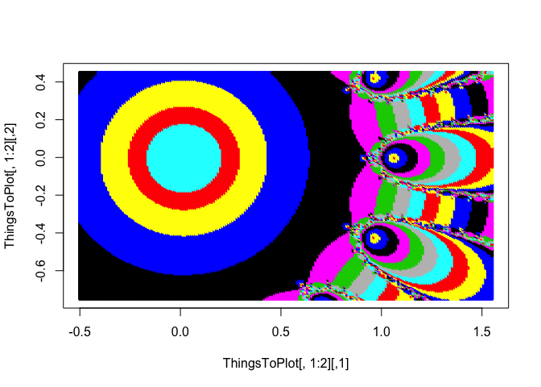

2A
================

``` r
# a function we will work with
F7<-function(x){
  return(c(x^15-7*x^18+16*x^3-x^2,15*x^14-126*x^17+48*x^2-2*x)) # note that the function returns two numbers. The first is f(x); the second is the derivative, f'(x)
}

#define a function F2(x)=sin(x)
#define F3(x)=(x-2)^3-6*x
#define F4(x)=cos(x)-x### 
# (All functions need to return f(x) and f’(x))

# Next we define a global variable to control whether we record roots or the number of iterations taken to find them when drawing our picture
# This is an inelegant way of doing it. It should really be part of the argument to the relevent functions.
bRootOrIterations<-0   # Set <-1 to record which root is found, or <- 0 to record number of iterations needed
# Here's the function that performs Newton-Raphson
TwoDNewtonRaphson<-function(func,StartingValue,Tolerance,MaxNumberOfIterations){
  i<-0  # something to count the iterations
  NewZ<- StartingValue  # start the algorithm at the complex number 'StartingValue'
  Deviation=abs(func(StartingValue)[1])   # Work out how far away from (0,0) func(NewZ) is.
  
  #Set up a while loop until we hit the required target accuracy or the max. number of steps
  while ((i<MaxNumberOfIterations)&&(Deviation>Tolerance))
  {
    # Find the next Z-value using Newton-Raphson's formula
    Z<-func(NewZ)   # Remember, this is is a vector of two elements. Z[1] is the is the value of the function; Z[2] is its derivative
    if ((Z[1]=="NaN")||(Z[2]=="NaN")){
      cat("Function or derivative not defined error.")
      cat("\n",NewZ,Z)
      break
    }
    
    # So we need to calculate the next value of Z using this formula Z(n+1) <- Z(n)-f(Z(n))/f'(z(n))
    NewZ <- NewZ-Z[1]/Z[2]
    
    # calculate how far f(z) is from 0
    NewVal <- func(NewZ)
    Deviation <- abs(NewVal[1])
    i<-i+1
    #cat(paste("\nIteration ",i,":   Z=",NewZ,"  Devn=",Deviation))
  }
  
  # output the result
  if (Deviation>Tolerance){
    cat(paste("\nConvergence failure. Deviation:",Deviation, "after ", i,   "iterations"))
  }
  
  # what the function returns depends upon whether you are counting how many iterations it takes
  # to converge or checking which root it converged to...
  if (bRootOrIterations==1){
    return(NewZ)
  }else{
    return(c(i,i))
  }
}

# A function to check whether two points are close together
CloseTo<-function(x,y){
  # returns 1 if x is close to y
  if (abs(x-y)<0.1) {
    return(1)
  }else{
    return (0)
  }
}

# And now here's the function that will draw a pretty picture
RootPlotter<-function(Funcn,xmin,xmax,xsteps,ymin,ymax,ysteps,PtSize)
{
  # First define a grid of x and y coordinates over which to run Newton-Raphson.
  # When we run ut for the point (x,y) it will start with the complex number x+iy
  x<-seq(xmin,xmax,length.out=xsteps)
  y<-seq(ymin,ymax,length.out=ysteps)
  # define a vector that will store the information telling us what color each point on the grid shoudl be
  ThingsToPlot<-c(-9,-9,'white',-9,-9)
  for (i in 1:xsteps){
    for (j in 1:ysteps){
      ThisZ <- complex(1,x[i],y[j])
      cat("\n", i,j,sep=" ")
      color<-'black' # a default color (used if no root is found, or the number of iterations is too large)
      
      # The following is written to look for the roots for z^3-1. You will need to modify it if you want to use other functions and work out which root was found
      # For z^3-1 the three roots are 1,  -1/2 + sqrt(3)/2i and -1/2 - sqrt(3)/2i
      # Find the root for the current start point
      Root<-TwoDNewtonRaphson(Funcn,ThisZ,1e-1,100)
      
      # write what happened to the terminal
      if (bRootOrIterations==0){
        # We are counting iterations needed
        cat("  Number of its= ",Root[1])  # We'll write it out so that we can see how the iterations are progressing
      }else{
        # We are recording which root was found
        cat("  Root= ",Root)  # We'll write it out so that we can see how the iterations are progressing
      }
      
      # record the color needed for this point on the grid
      if (bRootOrIterations==0){ # set <-1 to record roots, or <- 0 to record number of iterations needed
        ThisColor<-261+5*Root[1]
        color<-ThisColor
      }else{
        if (CloseTo(Root,1+0i)){
          color<-'blue'
        }
        if (CloseTo(Root,-0.5+0.8660254i)){
          color<-'red'
        }
        if (CloseTo(Root,-0.5-0.8660254i)){
          color<-'yellow'
        }
      }
      # record all the information in the array ThingsToPlot so that we can plot the information later
      ThingsToPlot<-rbind(ThingsToPlot,c(x[i],y[j],color,Root[1],Root[2]))
    }
  }
  # And now we have everything, so let's draw the picture.
  plot(ThingsToPlot[,1:2],col=ThingsToPlot[,3],xlim=c(xmin,xmax),ylim=c(ymin,ymax),pch=16,cex=PtSize*3)
  # The graphics parameter pch controls what shape is used to plot each point
  # The graphics parameter cex is used to control the size of each point
  # Change these to improve the quality of your pictures
  return(ThingsToPlot)
}


# The following are a bunch of examples I used to create some of the figures shown in class
# Note that I used a 500x500 grid to get nice pictures, so this will take a while to run
# You shoudl use a smaller grid while you are preactising (say 100,100), but then use a bigger grid for you final pictures.
RunTests<-function()
{
  # now lets draw some plots
  start_time <- Sys.time()
  A<-RootPlotter(F7,-0.75,4,200,-5,3,200,0.2)
  A<-RootPlotter(F7,-0.5,1.55,200,-0.75,0.45,200,0.2)
  end_time <- Sys.time()
  cat("\n t=",end_time - start_time)
  
}


RunTests()
```

    ## 
    ##  1 1  Number of its=  30
    ##  1 2  Number of its=  30
    ##  1 3  Number of its=  30
    ##  1 4  Number of its=  30
    ##  1 5  Number of its=  30
    ##  1 6  Number of its=  30
    ##  1 7  Number of its=  29
    ##  1 8  Number of its=  29
    ##  1 9  Number of its=  29
    ##  1 10  Number of its=  29
    ##  1 11  Number of its=  29
    ##  1 12  Number of its=  29
    ##  1 13  Number of its=  29
    ##  1 14  Number of its=  28
    ##  1 15  Number of its=  28
    ##  1 16  Number of its=  28
    ##  1 17  Number of its=  28
    ##  1 18  Number of its=  28
    ##  1 19  Number of its=  28
    ##  1 20  Number of its=  28
    ##  1 21  Number of its=  28
    ##  1 22  Number of its=  27
    ##  1 23  Number of its=  27
    ##  1 24  Number of its=  27
    ##  1 25  Number of its=  27
    ##  1 26  Number of its=  27
    ##  1 27  Number of its=  27
    ##  1 28  Number of its=  27
    ##  1 29  Number of its=  27
    ##  1 30  Number of its=  26
    ##  1 31  Number of its=  26
    ##  1 32  Number of its=  26
    ##  1 33  Number of its=  26
    ##  1 34  Number of its=  26
    ##  1 35  Number of its=  26
    ##  1 36  Number of its=  26
    ##  1 37  Number of its=  26
    ##  1 38  Number of its=  26
    ##  1 39  Number of its=  25
    ##  1 40  Number of its=  25
    ##  1 41  Number of its=  25
    ##  1 42  Number of its=  25
    ##  1 43  Number of its=  25
    ##  1 44  Number of its=  25
    ##  1 45  Number of its=  25
    ##  1 46  Number of its=  25
    ##  1 47  Number of its=  26
    ##  1 48  Number of its=  27
    ##  1 49  Number of its=  28
    ##  1 50  Number of its=  33
    ##  1 51  Number of its=  28
    ##  1 52  Number of its=  26
    ##  1 53  Number of its=  25
    ##  1 54  Number of its=  25
    ##  1 55  Number of its=  29
    ##  1 56  Number of its=  20
    ##  1 57  Number of its=  23
    ##  1 58  Number of its=  23
    ##  1 59  Number of its=  23
    ##  1 60  Number of its=  22
    ##  1 61  Number of its=  22
    ##  1 62  Number of its=  22
    ##  1 63  Number of its=  22
    ##  1 64  Number of its=  21
    ##  1 65  Number of its=  21
    ##  1 66  Number of its=  21
    ##  1 67  Number of its=  21
    ##  1 68  Number of its=  20
    ##  1 69  Number of its=  20
    ##  1 70  Number of its=  20
    ##  1 71  Number of its=  19
    ##  1 72  Number of its=  19
    ##  1 73  Number of its=  19
    ##  1 74  Number of its=  18
    ##  1 75  Number of its=  18
    ##  1 76  Number of its=  18
    ##  1 77  Number of its=  18
    ##  1 78  Number of its=  17
    ##  1 79  Number of its=  18
    ##  1 80  Number of its=  21
    ##  1 81  Number of its=  25
    ##  1 82  Number of its=  16
    ##  1 83  Number of its=  15
    ##  1 84  Number of its=  14
    ##  1 85  Number of its=  13
    ##  1 86  Number of its=  12
    ##  1 87  Number of its=  12
    ##  1 88  Number of its=  11
    ##  1 89  Number of its=  11
    ##  1 90  Number of its=  10
    ##  1 91  Number of its=  10
    ##  1 92  Number of its=  9
    ##  1 93  Number of its=  9
    ##  1 94  Number of its=  8
    ##  1 95  Number of its=  8
    ##  1 96  Number of its=  8
    ##  1 97  Number of its=  7
    ##  1 98  Number of its=  7
    ##  1 99  Number of its=  7
    ##  1 100  Number of its=  8
    ##  1 101  Number of its=  11
    ##  1 102  Number of its=  9
    ##  1 103  Number of its=  8
    ##  1 104  Number of its=  7
    ##  1 105  Number of its=  7
    ##  1 106  Number of its=  6
    ##  1 107  Number of its=  6
    ##  1 108  Number of its=  6
    ##  1 109  Number of its=  6
    ##  1 110  Number of its=  6
    ##  1 111  Number of its=  15
    ##  1 112  Number of its=  4
    ##  1 113  Number of its=  4
    ##  1 114  Number of its=  4
    ##  1 115  Number of its=  4
    ##  1 116  Number of its=  4
    ##  1 117  Number of its=  4
    ##  1 118  Number of its=  4
    ##  1 119  Number of its=  4
    ##  1 120  Number of its=  4
    ##  1 121  Number of its=  4
    ##  1 122  Number of its=  4
    ##  1 123  Number of its=  4
    ##  1 124  Number of its=  4
    ##  1 125  Number of its=  4
    ##  1 126  Number of its=  4
    ##  1 127  Number of its=  4
    ##  1 128  Number of its=  4
    ##  1 129  Number of its=  4
    ##  1 130  Number of its=  4
    ##  1 131  Number of its=  4
    ##  1 132  Number of its=  4
    ##  1 133  Number of its=  4
    ##  1 134  Number of its=  4
    ##  1 135  Number of its=  4
    ##  1 136  Number of its=  4
    ##  1 137  Number of its=  4
    ##  1 138  Number of its=  4
    ##  1 139  Number of its=  4
    ##  1 140  Number of its=  5
    ##  1 141  Number of its=  6
    ##  1 142  Number of its=  6
    ##  1 143  Number of its=  6
    ##  1 144  Number of its=  6
    ##  1 145  Number of its=  6
    ##  1 146  Number of its=  7
    ##  1 147  Number of its=  7
    ##  1 148  Number of its=  8
    ##  1 149  Number of its=  9
    ##  1 150  Number of its=  9
    ##  1 151  Number of its=  8
    ##  1 152  Number of its=  7
    ##  1 153  Number of its=  7
    ##  1 154  Number of its=  7
    ##  1 155  Number of its=  8
    ##  1 156  Number of its=  8
    ##  1 157  Number of its=  8
    ##  1 158  Number of its=  9
    ##  1 159  Number of its=  9
    ##  1 160  Number of its=  10
    ##  1 161  Number of its=  10
    ##  1 162  Number of its=  11
    ##  1 163  Number of its=  11
    ##  1 164  Number of its=  12
    ##  1 165  Number of its=  13
    ##  1 166  Number of its=  13
    ##  1 167  Number of its=  14
    ##  1 168  Number of its=  15
    ##  1 169  Number of its=  17
    ##  1 170  Number of its=  20
    ##  1 171  Number of its=  20
    ##  1 172  Number of its=  18
    ##  1 173  Number of its=  15
    ##  1 174  Number of its=  18
    ##  1 175  Number of its=  18
    ##  1 176  Number of its=  18
    ##  1 177  Number of its=  19
    ##  1 178  Number of its=  19
    ##  1 179  Number of its=  19
    ##  1 180  Number of its=  19
    ##  1 181  Number of its=  20
    ##  1 182  Number of its=  20
    ##  1 183  Number of its=  20
    ##  1 184  Number of its=  21
    ##  1 185  Number of its=  21
    ##  1 186  Number of its=  21
    ##  1 187  Number of its=  21
    ##  1 188  Number of its=  22
    ##  1 189  Number of its=  22
    ##  1 190  Number of its=  22
    ##  1 191  Number of its=  22
    ##  1 192  Number of its=  23
    ##  1 193  Number of its=  23
    ##  1 194  Number of its=  23
    ##  1 195  Number of its=  22
    ##  1 196  Number of its=  25
    ##  1 197  Number of its=  25
    ##  1 198  Number of its=  25
    ##  1 199  Number of its=  31
    ##  1 200  Number of its=  29
    ##  2 1  Number of its=  30
    ##  2 2  Number of its=  30
    ##  2 3  Number of its=  30
    ##  2 4  Number of its=  30
    ##  2 5  Number of its=  30
    ##  2 6  Number of its=  29
    ##  2 7  Number of its=  29
    ##  2 8  Number of its=  29
    ##  2 9  Number of its=  29
    ##  2 10  Number of its=  29
    ##  2 11  Number of its=  29
    ##  2 12  Number of its=  29
    ##  2 13  Number of its=  29
    ##  2 14  Number of its=  28
    ##  2 15  Number of its=  28
    ##  2 16  Number of its=  28
    ##  2 17  Number of its=  28
    ##  2 18  Number of its=  28
    ##  2 19  Number of its=  28
    ##  2 20  Number of its=  28
    ##  2 21  Number of its=  27
    ##  2 22  Number of its=  27
    ##  2 23  Number of its=  27
    ##  2 24  Number of its=  27
    ##  2 25  Number of its=  27
    ##  2 26  Number of its=  27
    ##  2 27  Number of its=  27
    ##  2 28  Number of its=  26
    ##  2 29  Number of its=  26
    ##  2 30  Number of its=  26
    ##  2 31  Number of its=  26
    ##  2 32  Number of its=  26
    ##  2 33  Number of its=  26
    ##  2 34  Number of its=  26
    ##  2 35  Number of its=  26
    ##  2 36  Number of its=  25
    ##  2 37  Number of its=  25
    ##  2 38  Number of its=  25
    ##  2 39  Number of its=  25
    ##  2 40  Number of its=  25
    ##  2 41  Number of its=  25
    ##  2 42  Number of its=  25
    ##  2 43  Number of its=  25
    ##  2 44  Number of its=  25
    ##  2 45  Number of its=  25
    ##  2 46  Number of its=  25
    ##  2 47  Number of its=  25
    ##  2 48  Number of its=  25
    ##  2 49  Number of its=  25
    ##  2 50  Number of its=  25
    ##  2 51  Number of its=  25
    ##  2 52  Number of its=  29
    ##  2 53  Number of its=  26
    ##  2 54  Number of its=  26
    ##  2 55  Number of its=  31
    ##  2 56  Number of its=  25
    ##  2 57  Number of its=  24
    ##  2 58  Number of its=  24
    ##  2 59  Number of its=  23
    ##  2 60  Number of its=  21
    ##  2 61  Number of its=  22
    ##  2 62  Number of its=  22
    ##  2 63  Number of its=  22
    ##  2 64  Number of its=  21
    ##  2 65  Number of its=  21
    ##  2 66  Number of its=  21
    ##  2 67  Number of its=  20
    ##  2 68  Number of its=  20
    ##  2 69  Number of its=  20
    ##  2 70  Number of its=  20
    ##  2 71  Number of its=  19
    ##  2 72  Number of its=  19
    ##  2 73  Number of its=  19
    ##  2 74  Number of its=  18
    ##  2 75  Number of its=  18
    ##  2 76  Number of its=  18
    ##  2 77  Number of its=  17
    ##  2 78  Number of its=  17
    ##  2 79  Number of its=  17
    ##  2 80  Number of its=  19
    ##  2 81  Number of its=  18
    ##  2 82  Number of its=  19
    ##  2 83  Number of its=  16
    ##  2 84  Number of its=  15
    ##  2 85  Number of its=  14
    ##  2 86  Number of its=  13
    ##  2 87  Number of its=  12
    ##  2 88  Number of its=  11
    ##  2 89  Number of its=  11
    ##  2 90  Number of its=  10
    ##  2 91  Number of its=  10
    ##  2 92  Number of its=  9
    ##  2 93  Number of its=  9
    ##  2 94  Number of its=  8
    ##  2 95  Number of its=  8
    ##  2 96  Number of its=  7
    ##  2 97  Number of its=  7
    ##  2 98  Number of its=  7
    ##  2 99  Number of its=  7
    ##  2 100  Number of its=  7
    ##  2 101  Number of its=  8
    ##  2 102  Number of its=  10
    ##  2 103  Number of its=  7
    ##  2 104  Number of its=  7
    ##  2 105  Number of its=  7
    ##  2 106  Number of its=  6
    ##  2 107  Number of its=  6
    ##  2 108  Number of its=  5
    ##  2 109  Number of its=  5
    ##  2 110  Number of its=  5
    ##  2 111  Number of its=  5
    ##  2 112  Number of its=  3
    ##  2 113  Number of its=  4
    ##  2 114  Number of its=  4
    ##  2 115  Number of its=  4
    ##  2 116  Number of its=  4
    ##  2 117  Number of its=  4
    ##  2 118  Number of its=  4
    ##  2 119  Number of its=  4
    ##  2 120  Number of its=  4
    ##  2 121  Number of its=  4
    ##  2 122  Number of its=  4
    ##  2 123  Number of its=  4
    ##  2 124  Number of its=  4
    ##  2 125  Number of its=  4
    ##  2 126  Number of its=  4
    ##  2 127  Number of its=  4
    ##  2 128  Number of its=  4
    ##  2 129  Number of its=  4
    ##  2 130  Number of its=  4
    ##  2 131  Number of its=  4
    ##  2 132  Number of its=  4
    ##  2 133  Number of its=  4
    ##  2 134  Number of its=  4
    ##  2 135  Number of its=  4
    ##  2 136  Number of its=  4
    ##  2 137  Number of its=  4
    ##  2 138  Number of its=  4
    ##  2 139  Number of its=  3
    ##  2 140  Number of its=  5
    ##  2 141  Number of its=  5
    ##  2 142  Number of its=  5
    ##  2 143  Number of its=  6
    ##  2 144  Number of its=  6
    ##  2 145  Number of its=  6
    ##  2 146  Number of its=  7
    ##  2 147  Number of its=  7
    ##  2 148  Number of its=  6
    ##  2 149  Number of its=  11
    ##  2 150  Number of its=  7
    ##  2 151  Number of its=  7
    ##  2 152  Number of its=  7
    ##  2 153  Number of its=  7
    ##  2 154  Number of its=  7
    ##  2 155  Number of its=  7
    ##  2 156  Number of its=  8
    ##  2 157  Number of its=  8
    ##  2 158  Number of its=  9
    ##  2 159  Number of its=  9
    ##  2 160  Number of its=  10
    ##  2 161  Number of its=  10
    ##  2 162  Number of its=  11
    ##  2 163  Number of its=  11
    ##  2 164  Number of its=  12
    ##  2 165  Number of its=  13
    ##  2 166  Number of its=  14
    ##  2 167  Number of its=  15
    ##  2 168  Number of its=  17
    ##  2 169  Number of its=  14
    ##  2 170  Number of its=  19
    ##  2 171  Number of its=  18
    ##  2 172  Number of its=  17
    ##  2 173  Number of its=  17
    ##  2 174  Number of its=  18
    ##  2 175  Number of its=  18
    ##  2 176  Number of its=  18
    ##  2 177  Number of its=  19
    ##  2 178  Number of its=  19
    ##  2 179  Number of its=  19
    ##  2 180  Number of its=  19
    ##  2 181  Number of its=  20
    ##  2 182  Number of its=  20
    ##  2 183  Number of its=  20
    ##  2 184  Number of its=  21
    ##  2 185  Number of its=  21
    ##  2 186  Number of its=  21
    ##  2 187  Number of its=  21
    ##  2 188  Number of its=  22
    ##  2 189  Number of its=  22
    ##  2 190  Number of its=  22
    ##  2 191  Number of its=  21
    ##  2 192  Number of its=  23
    ##  2 193  Number of its=  24
    ##  2 194  Number of its=  24
    ##  2 195  Number of its=  38
    ##  2 196  Number of its=  28
    ##  2 197  Number of its=  26
    ##  2 198  Number of its=  26
    ##  2 199  Number of its=  29
    ##  2 200  Number of its=  25
    ##  3 1  Number of its=  30
    ##  3 2  Number of its=  30
    ##  3 3  Number of its=  30
    ##  3 4  Number of its=  30
    ##  3 5  Number of its=  30
    ##  3 6  Number of its=  29
    ##  3 7  Number of its=  29
    ##  3 8  Number of its=  29
    ##  3 9  Number of its=  29
    ##  3 10  Number of its=  29
    ##  3 11  Number of its=  29
    ##  3 12  Number of its=  29
    ##  3 13  Number of its=  28
    ##  3 14  Number of its=  28
    ##  3 15  Number of its=  28
    ##  3 16  Number of its=  28
    ##  3 17  Number of its=  28
    ##  3 18  Number of its=  28
    ##  3 19  Number of its=  28
    ##  3 20  Number of its=  27
    ##  3 21  Number of its=  27
    ##  3 22  Number of its=  27
    ##  3 23  Number of its=  27
    ##  3 24  Number of its=  27
    ##  3 25  Number of its=  27
    ##  3 26  Number of its=  27
    ##  3 27  Number of its=  26
    ##  3 28  Number of its=  26
    ##  3 29  Number of its=  26
    ##  3 30  Number of its=  26
    ##  3 31  Number of its=  26
    ##  3 32  Number of its=  26
    ##  3 33  Number of its=  26
    ##  3 34  Number of its=  26
    ##  3 35  Number of its=  25
    ##  3 36  Number of its=  25
    ##  3 37  Number of its=  25
    ##  3 38  Number of its=  25
    ##  3 39  Number of its=  25
    ##  3 40  Number of its=  25
    ##  3 41  Number of its=  25
    ##  3 42  Number of its=  25
    ##  3 43  Number of its=  24
    ##  3 44  Number of its=  24
    ##  3 45  Number of its=  24
    ##  3 46  Number of its=  24
    ##  3 47  Number of its=  24
    ##  3 48  Number of its=  24
    ##  3 49  Number of its=  24
    ##  3 50  Number of its=  24
    ##  3 51  Number of its=  24
    ##  3 52  Number of its=  25
    ##  3 53  Number of its=  26
    ##  3 54  Number of its=  27
    ##  3 55  Number of its=  26
    ##  3 56  Number of its=  27
    ##  3 57  Number of its=  24
    ##  3 58  Number of its=  24
    ##  3 59  Number of its=  27
    ##  3 60  Number of its=  22
    ##  3 61  Number of its=  22
    ##  3 62  Number of its=  22
    ##  3 63  Number of its=  21
    ##  3 64  Number of its=  21
    ##  3 65  Number of its=  21
    ##  3 66  Number of its=  21
    ##  3 67  Number of its=  20
    ##  3 68  Number of its=  20
    ##  3 69  Number of its=  20
    ##  3 70  Number of its=  20
    ##  3 71  Number of its=  19
    ##  3 72  Number of its=  19
    ##  3 73  Number of its=  19
    ##  3 74  Number of its=  18
    ##  3 75  Number of its=  18
    ##  3 76  Number of its=  18
    ##  3 77  Number of its=  17
    ##  3 78  Number of its=  17
    ##  3 79  Number of its=  17
    ##  3 80  Number of its=  16
    ##  3 81  Number of its=  16
    ##  3 82  Number of its=  17
    ##  3 83  Number of its=  21
    ##  3 84  Number of its=  19
    ##  3 85  Number of its=  15
    ##  3 86  Number of its=  13
    ##  3 87  Number of its=  12
    ##  3 88  Number of its=  12
    ##  3 89  Number of its=  11
    ##  3 90  Number of its=  10
    ##  3 91  Number of its=  10
    ##  3 92  Number of its=  9
    ##  3 93  Number of its=  9
    ##  3 94  Number of its=  8
    ##  3 95  Number of its=  8
    ##  3 96  Number of its=  7
    ##  3 97  Number of its=  7
    ##  3 98  Number of its=  6
    ##  3 99  Number of its=  6
    ##  3 100  Number of its=  6
    ##  3 101  Number of its=  6
    ##  3 102  Number of its=  8
    ##  3 103  Number of its=  8
    ##  3 104  Number of its=  7
    ##  3 105  Number of its=  6
    ##  3 106  Number of its=  6
    ##  3 107  Number of its=  6
    ##  3 108  Number of its=  5
    ##  3 109  Number of its=  5
    ##  3 110  Number of its=  5
    ##  3 111  Number of its=  4
    ##  3 112  Number of its=  4
    ##  3 113  Number of its=  4
    ##  3 114  Number of its=  4
    ##  3 115  Number of its=  4
    ##  3 116  Number of its=  4
    ##  3 117  Number of its=  4
    ##  3 118  Number of its=  4
    ##  3 119  Number of its=  4
    ##  3 120  Number of its=  4
    ##  3 121  Number of its=  4
    ##  3 122  Number of its=  4
    ##  3 123  Number of its=  4
    ##  3 124  Number of its=  4
    ##  3 125  Number of its=  4
    ##  3 126  Number of its=  4
    ##  3 127  Number of its=  4
    ##  3 128  Number of its=  4
    ##  3 129  Number of its=  4
    ##  3 130  Number of its=  4
    ##  3 131  Number of its=  4
    ##  3 132  Number of its=  4
    ##  3 133  Number of its=  4
    ##  3 134  Number of its=  4
    ##  3 135  Number of its=  4
    ##  3 136  Number of its=  4
    ##  3 137  Number of its=  4
    ##  3 138  Number of its=  4
    ##  3 139  Number of its=  4
    ##  3 140  Number of its=  5
    ##  3 141  Number of its=  5
    ##  3 142  Number of its=  5
    ##  3 143  Number of its=  5
    ##  3 144  Number of its=  6
    ##  3 145  Number of its=  6
    ##  3 146  Number of its=  6
    ##  3 147  Number of its=  7
    ##  3 148  Number of its=  8
    ##  3 149  Number of its=  7
    ##  3 150  Number of its=  6
    ##  3 151  Number of its=  6
    ##  3 152  Number of its=  6
    ##  3 153  Number of its=  6
    ##  3 154  Number of its=  7
    ##  3 155  Number of its=  7
    ##  3 156  Number of its=  8
    ##  3 157  Number of its=  8
    ##  3 158  Number of its=  9
    ##  3 159  Number of its=  9
    ##  3 160  Number of its=  10
    ##  3 161  Number of its=  10
    ##  3 162  Number of its=  11
    ##  3 163  Number of its=  12
    ##  3 164  Number of its=  13
    ##  3 165  Number of its=  14
    ##  3 166  Number of its=  15
    ##  3 167  Number of its=  18
    ##  3 168  Number of its=  23
    ##  3 169  Number of its=  17
    ##  3 170  Number of its=  16
    ##  3 171  Number of its=  16
    ##  3 172  Number of its=  17
    ##  3 173  Number of its=  17
    ##  3 174  Number of its=  17
    ##  3 175  Number of its=  18
    ##  3 176  Number of its=  18
    ##  3 177  Number of its=  18
    ##  3 178  Number of its=  19
    ##  3 179  Number of its=  19
    ##  3 180  Number of its=  19
    ##  3 181  Number of its=  20
    ##  3 182  Number of its=  20
    ##  3 183  Number of its=  20
    ##  3 184  Number of its=  20
    ##  3 185  Number of its=  21
    ##  3 186  Number of its=  21
    ##  3 187  Number of its=  21
    ##  3 188  Number of its=  22
    ##  3 189  Number of its=  22
    ##  3 190  Number of its=  22
    ##  3 191  Number of its=  22
    ##  3 192  Number of its=  22
    ##  3 193  Number of its=  24
    ##  3 194  Number of its=  25
    ##  3 195  Number of its=  29
    ##  3 196  Number of its=  26
    ##  3 197  Number of its=  27
    ##  3 198  Number of its=  26
    ##  3 199  Number of its=  25
    ##  3 200  Number of its=  24
    ##  4 1  Number of its=  30
    ##  4 2  Number of its=  30
    ##  4 3  Number of its=  30
    ##  4 4  Number of its=  30
    ##  4 5  Number of its=  30
    ##  4 6  Number of its=  29
    ##  4 7  Number of its=  29
    ##  4 8  Number of its=  29
    ##  4 9  Number of its=  29
    ##  4 10  Number of its=  29
    ##  4 11  Number of its=  29
    ##  4 12  Number of its=  29
    ##  4 13  Number of its=  28
    ##  4 14  Number of its=  28
    ##  4 15  Number of its=  28
    ##  4 16  Number of its=  28
    ##  4 17  Number of its=  28
    ##  4 18  Number of its=  28
    ##  4 19  Number of its=  28
    ##  4 20  Number of its=  27
    ##  4 21  Number of its=  27
    ##  4 22  Number of its=  27
    ##  4 23  Number of its=  27
    ##  4 24  Number of its=  27
    ##  4 25  Number of its=  27
    ##  4 26  Number of its=  27
    ##  4 27  Number of its=  26
    ##  4 28  Number of its=  26
    ##  4 29  Number of its=  26
    ##  4 30  Number of its=  26
    ##  4 31  Number of its=  26
    ##  4 32  Number of its=  26
    ##  4 33  Number of its=  26
    ##  4 34  Number of its=  25
    ##  4 35  Number of its=  25
    ##  4 36  Number of its=  25
    ##  4 37  Number of its=  25
    ##  4 38  Number of its=  25
    ##  4 39  Number of its=  25
    ##  4 40  Number of its=  25
    ##  4 41  Number of its=  24
    ##  4 42  Number of its=  24
    ##  4 43  Number of its=  24
    ##  4 44  Number of its=  24
    ##  4 45  Number of its=  24
    ##  4 46  Number of its=  24
    ##  4 47  Number of its=  24
    ##  4 48  Number of its=  24
    ##  4 49  Number of its=  24
    ##  4 50  Number of its=  23
    ##  4 51  Number of its=  23
    ##  4 52  Number of its=  24
    ##  4 53  Number of its=  24
    ##  4 54  Number of its=  24
    ##  4 55  Number of its=  24
    ##  4 56  Number of its=  26
    ##  4 57  Number of its=  27
    ##  4 58  Number of its=  25
    ##  4 59  Number of its=  30
    ##  4 60  Number of its=  26
    ##  4 61  Number of its=  23
    ##  4 62  Number of its=  23
    ##  4 63  Number of its=  22
    ##  4 64  Number of its=  21
    ##  4 65  Number of its=  21
    ##  4 66  Number of its=  21
    ##  4 67  Number of its=  20
    ##  4 68  Number of its=  20
    ##  4 69  Number of its=  20
    ##  4 70  Number of its=  20
    ##  4 71  Number of its=  19
    ##  4 72  Number of its=  19
    ##  4 73  Number of its=  19
    ##  4 74  Number of its=  18
    ##  4 75  Number of its=  18
    ##  4 76  Number of its=  18
    ##  4 77  Number of its=  17
    ##  4 78  Number of its=  17
    ##  4 79  Number of its=  17
    ##  4 80  Number of its=  16
    ##  4 81  Number of its=  16
    ##  4 82  Number of its=  16
    ##  4 83  Number of its=  15
    ##  4 84  Number of its=  16
    ##  4 85  Number of its=  18
    ##  4 86  Number of its=  15
    ##  4 87  Number of its=  13
    ##  4 88  Number of its=  12
    ##  4 89  Number of its=  11
    ##  4 90  Number of its=  10
    ##  4 91  Number of its=  10
    ##  4 92  Number of its=  9
    ##  4 93  Number of its=  9
    ##  4 94  Number of its=  8
    ##  4 95  Number of its=  7
    ##  4 96  Number of its=  7
    ##  4 97  Number of its=  7
    ##  4 98  Number of its=  6
    ##  4 99  Number of its=  6
    ##  4 100  Number of its=  6
    ##  4 101  Number of its=  6
    ##  4 102  Number of its=  6
    ##  4 103  Number of its=  9
    ##  4 104  Number of its=  6
    ##  4 105  Number of its=  6
    ##  4 106  Number of its=  6
    ##  4 107  Number of its=  6
    ##  4 108  Number of its=  5
    ##  4 109  Number of its=  5
    ##  4 110  Number of its=  5
    ##  4 111  Number of its=  4
    ##  4 112  Number of its=  4
    ##  4 113  Number of its=  4
    ##  4 114  Number of its=  4
    ##  4 115  Number of its=  4
    ##  4 116  Number of its=  4
    ##  4 117  Number of its=  4
    ##  4 118  Number of its=  4
    ##  4 119  Number of its=  4
    ##  4 120  Number of its=  4
    ##  4 121  Number of its=  4
    ##  4 122  Number of its=  4
    ##  4 123  Number of its=  4
    ##  4 124  Number of its=  4
    ##  4 125  Number of its=  4
    ##  4 126  Number of its=  4
    ##  4 127  Number of its=  4
    ##  4 128  Number of its=  4
    ##  4 129  Number of its=  4
    ##  4 130  Number of its=  4
    ##  4 131  Number of its=  4
    ##  4 132  Number of its=  4
    ##  4 133  Number of its=  4
    ##  4 134  Number of its=  4
    ##  4 135  Number of its=  4
    ##  4 136  Number of its=  4
    ##  4 137  Number of its=  4
    ##  4 138  Number of its=  4
    ##  4 139  Number of its=  4
    ##  4 140  Number of its=  5
    ##  4 141  Number of its=  5
    ##  4 142  Number of its=  5
    ##  4 143  Number of its=  5
    ##  4 144  Number of its=  6
    ##  4 145  Number of its=  6
    ##  4 146  Number of its=  6
    ##  4 147  Number of its=  7
    ##  4 148  Number of its=  11
    ##  4 149  Number of its=  6
    ##  4 150  Number of its=  6
    ##  4 151  Number of its=  6
    ##  4 152  Number of its=  6
    ##  4 153  Number of its=  6
    ##  4 154  Number of its=  7
    ##  4 155  Number of its=  7
    ##  4 156  Number of its=  8
    ##  4 157  Number of its=  8
    ##  4 158  Number of its=  9
    ##  4 159  Number of its=  9
    ##  4 160  Number of its=  10
    ##  4 161  Number of its=  11
    ##  4 162  Number of its=  11
    ##  4 163  Number of its=  12
    ##  4 164  Number of its=  13
    ##  4 165  Number of its=  15
    ##  4 166  Number of its=  18
    ##  4 167  Number of its=  16
    ##  4 168  Number of its=  15
    ##  4 169  Number of its=  16
    ##  4 170  Number of its=  16
    ##  4 171  Number of its=  16
    ##  4 172  Number of its=  17
    ##  4 173  Number of its=  17
    ##  4 174  Number of its=  17
    ##  4 175  Number of its=  18
    ##  4 176  Number of its=  18
    ##  4 177  Number of its=  18
    ##  4 178  Number of its=  19
    ##  4 179  Number of its=  19
    ##  4 180  Number of its=  19
    ##  4 181  Number of its=  20
    ##  4 182  Number of its=  20
    ##  4 183  Number of its=  20
    ##  4 184  Number of its=  20
    ##  4 185  Number of its=  21
    ##  4 186  Number of its=  21
    ##  4 187  Number of its=  20
    ##  4 188  Number of its=  22
    ##  4 189  Number of its=  23
    ##  4 190  Number of its=  23
    ##  4 191  Number of its=  27
    ##  4 192  Number of its=  28
    ##  4 193  Number of its=  26
    ##  4 194  Number of its=  26
    ##  4 195  Number of its=  25
    ##  4 196  Number of its=  24
    ##  4 197  Number of its=  24
    ##  4 198  Number of its=  24
    ##  4 199  Number of its=  24
    ##  4 200  Number of its=  23
    ##  5 1  Number of its=  30
    ##  5 2  Number of its=  30
    ##  5 3  Number of its=  30
    ##  5 4  Number of its=  30
    ##  5 5  Number of its=  29
    ##  5 6  Number of its=  29
    ##  5 7  Number of its=  29
    ##  5 8  Number of its=  29
    ##  5 9  Number of its=  29
    ##  5 10  Number of its=  29
    ##  5 11  Number of its=  29
    ##  5 12  Number of its=  28
    ##  5 13  Number of its=  28
    ##  5 14  Number of its=  28
    ##  5 15  Number of its=  28
    ##  5 16  Number of its=  28
    ##  5 17  Number of its=  28
    ##  5 18  Number of its=  28
    ##  5 19  Number of its=  27
    ##  5 20  Number of its=  27
    ##  5 21  Number of its=  27
    ##  5 22  Number of its=  27
    ##  5 23  Number of its=  27
    ##  5 24  Number of its=  27
    ##  5 25  Number of its=  27
    ##  5 26  Number of its=  26
    ##  5 27  Number of its=  26
    ##  5 28  Number of its=  26
    ##  5 29  Number of its=  26
    ##  5 30  Number of its=  26
    ##  5 31  Number of its=  26
    ##  5 32  Number of its=  26
    ##  5 33  Number of its=  25
    ##  5 34  Number of its=  25
    ##  5 35  Number of its=  25
    ##  5 36  Number of its=  25
    ##  5 37  Number of its=  25
    ##  5 38  Number of its=  25
    ##  5 39  Number of its=  24
    ##  5 40  Number of its=  24
    ##  5 41  Number of its=  24
    ##  5 42  Number of its=  24
    ##  5 43  Number of its=  24
    ##  5 44  Number of its=  24
    ##  5 45  Number of its=  24
    ##  5 46  Number of its=  23
    ##  5 47  Number of its=  23
    ##  5 48  Number of its=  23
    ##  5 49  Number of its=  23
    ##  5 50  Number of its=  23
    ##  5 51  Number of its=  23
    ##  5 52  Number of its=  23
    ##  5 53  Number of its=  23
    ##  5 54  Number of its=  23
    ##  5 55  Number of its=  23
    ##  5 56  Number of its=  23
    ##  5 57  Number of its=  24
    ##  5 58  Number of its=  24
    ##  5 59  Number of its=  24
    ##  5 60  Number of its=  25
    ##  5 61  Number of its=  23
    ##  5 62  Number of its=  24
    ##  5 63  Number of its=  39
    ##  5 64  Number of its=  22
    ##  5 65  Number of its=  22
    ##  5 66  Number of its=  21
    ##  5 67  Number of its=  20
    ##  5 68  Number of its=  20
    ##  5 69  Number of its=  20
    ##  5 70  Number of its=  19
    ##  5 71  Number of its=  19
    ##  5 72  Number of its=  19
    ##  5 73  Number of its=  19
    ##  5 74  Number of its=  18
    ##  5 75  Number of its=  18
    ##  5 76  Number of its=  18
    ##  5 77  Number of its=  17
    ##  5 78  Number of its=  17
    ##  5 79  Number of its=  17
    ##  5 80  Number of its=  16
    ##  5 81  Number of its=  16
    ##  5 82  Number of its=  16
    ##  5 83  Number of its=  15
    ##  5 84  Number of its=  16
    ##  5 85  Number of its=  24
    ##  5 86  Number of its=  16
    ##  5 87  Number of its=  15
    ##  5 88  Number of its=  13
    ##  5 89  Number of its=  12
    ##  5 90  Number of its=  11
    ##  5 91  Number of its=  10
    ##  5 92  Number of its=  9
    ##  5 93  Number of its=  9
    ##  5 94  Number of its=  8
    ##  5 95  Number of its=  7
    ##  5 96  Number of its=  7
    ##  5 97  Number of its=  6
    ##  5 98  Number of its=  6
    ##  5 99  Number of its=  5
    ##  5 100  Number of its=  5
    ##  5 101  Number of its=  5
    ##  5 102  Number of its=  5
    ##  5 103  Number of its=  7
    ##  5 104  Number of its=  7
    ##  5 105  Number of its=  6
    ##  5 106  Number of its=  6
    ##  5 107  Number of its=  5
    ##  5 108  Number of its=  5
    ##  5 109  Number of its=  5
    ##  5 110  Number of its=  5
    ##  5 111  Number of its=  4
    ##  5 112  Number of its=  4
    ##  5 113  Number of its=  4
    ##  5 114  Number of its=  4
    ##  5 115  Number of its=  4
    ##  5 116  Number of its=  4
    ##  5 117  Number of its=  4
    ##  5 118  Number of its=  4
    ##  5 119  Number of its=  4
    ##  5 120  Number of its=  4
    ##  5 121  Number of its=  4
    ##  5 122  Number of its=  4
    ##  5 123  Number of its=  4
    ##  5 124  Number of its=  4
    ##  5 125  Number of its=  4
    ##  5 126  Number of its=  4
    ##  5 127  Number of its=  4
    ##  5 128  Number of its=  4
    ##  5 129  Number of its=  4
    ##  5 130  Number of its=  4
    ##  5 131  Number of its=  4
    ##  5 132  Number of its=  4
    ##  5 133  Number of its=  4
    ##  5 134  Number of its=  4
    ##  5 135  Number of its=  4
    ##  5 136  Number of its=  4
    ##  5 137  Number of its=  4
    ##  5 138  Number of its=  4
    ##  5 139  Number of its=  4
    ##  5 140  Number of its=  4
    ##  5 141  Number of its=  5
    ##  5 142  Number of its=  5
    ##  5 143  Number of its=  5
    ##  5 144  Number of its=  5
    ##  5 145  Number of its=  6
    ##  5 146  Number of its=  6
    ##  5 147  Number of its=  13
    ##  5 148  Number of its=  6
    ##  5 149  Number of its=  5
    ##  5 150  Number of its=  5
    ##  5 151  Number of its=  5
    ##  5 152  Number of its=  6
    ##  5 153  Number of its=  6
    ##  5 154  Number of its=  6
    ##  5 155  Number of its=  7
    ##  5 156  Number of its=  8
    ##  5 157  Number of its=  8
    ##  5 158  Number of its=  9
    ##  5 159  Number of its=  9
    ##  5 160  Number of its=  10
    ##  5 161  Number of its=  11
    ##  5 162  Number of its=  12
    ##  5 163  Number of its=  13
    ##  5 164  Number of its=  24
    ##  5 165  Number of its=  18
    ##  5 166  Number of its=  14
    ##  5 167  Number of its=  15
    ##  5 168  Number of its=  15
    ##  5 169  Number of its=  16
    ##  5 170  Number of its=  16
    ##  5 171  Number of its=  16
    ##  5 172  Number of its=  17
    ##  5 173  Number of its=  17
    ##  5 174  Number of its=  17
    ##  5 175  Number of its=  18
    ##  5 176  Number of its=  18
    ##  5 177  Number of its=  18
    ##  5 178  Number of its=  19
    ##  5 179  Number of its=  19
    ##  5 180  Number of its=  19
    ##  5 181  Number of its=  20
    ##  5 182  Number of its=  20
    ##  5 183  Number of its=  20
    ##  5 184  Number of its=  20
    ##  5 185  Number of its=  21
    ##  5 186  Number of its=  22
    ##  5 187  Number of its=  22
    ##  5 188  Number of its=  26
    ##  5 189  Number of its=  24
    ##  5 190  Number of its=  24
    ##  5 191  Number of its=  25
    ##  5 192  Number of its=  24
    ##  5 193  Number of its=  24
    ##  5 194  Number of its=  24
    ##  5 195  Number of its=  23
    ##  5 196  Number of its=  23
    ##  5 197  Number of its=  23
    ##  5 198  Number of its=  23
    ##  5 199  Number of its=  23
    ##  5 200  Number of its=  23
    ##  6 1  Number of its=  30
    ##  6 2  Number of its=  30
    ##  6 3  Number of its=  30
    ##  6 4  Number of its=  30
    ##  6 5  Number of its=  29
    ##  6 6  Number of its=  29
    ##  6 7  Number of its=  29
    ##  6 8  Number of its=  29
    ##  6 9  Number of its=  29
    ##  6 10  Number of its=  29
    ##  6 11  Number of its=  29
    ##  6 12  Number of its=  28
    ##  6 13  Number of its=  28
    ##  6 14  Number of its=  28
    ##  6 15  Number of its=  28
    ##  6 16  Number of its=  28
    ##  6 17  Number of its=  28
    ##  6 18  Number of its=  28
    ##  6 19  Number of its=  27
    ##  6 20  Number of its=  27
    ##  6 21  Number of its=  27
    ##  6 22  Number of its=  27
    ##  6 23  Number of its=  27
    ##  6 24  Number of its=  27
    ##  6 25  Number of its=  27
    ##  6 26  Number of its=  26
    ##  6 27  Number of its=  26
    ##  6 28  Number of its=  26
    ##  6 29  Number of its=  26
    ##  6 30  Number of its=  26
    ##  6 31  Number of its=  26
    ##  6 32  Number of its=  25
    ##  6 33  Number of its=  25
    ##  6 34  Number of its=  25
    ##  6 35  Number of its=  25
    ##  6 36  Number of its=  25
    ##  6 37  Number of its=  25
    ##  6 38  Number of its=  24
    ##  6 39  Number of its=  24
    ##  6 40  Number of its=  24
    ##  6 41  Number of its=  24
    ##  6 42  Number of its=  24
    ##  6 43  Number of its=  24
    ##  6 44  Number of its=  24
    ##  6 45  Number of its=  23
    ##  6 46  Number of its=  23
    ##  6 47  Number of its=  23
    ##  6 48  Number of its=  23
    ##  6 49  Number of its=  23
    ##  6 50  Number of its=  23
    ##  6 51  Number of its=  23
    ##  6 52  Number of its=  22
    ##  6 53  Number of its=  22
    ##  6 54  Number of its=  22
    ##  6 55  Number of its=  22
    ##  6 56  Number of its=  22
    ##  6 57  Number of its=  22
    ##  6 58  Number of its=  22
    ##  6 59  Number of its=  22
    ##  6 60  Number of its=  23
    ##  6 61  Number of its=  25
    ##  6 62  Number of its=  27
    ##  6 63  Number of its=  26
    ##  6 64  Number of its=  23
    ##  6 65  Number of its=  22
    ##  6 66  Number of its=  20
    ##  6 67  Number of its=  18
    ##  6 68  Number of its=  20
    ##  6 69  Number of its=  20
    ##  6 70  Number of its=  19
    ##  6 71  Number of its=  19
    ##  6 72  Number of its=  19
    ##  6 73  Number of its=  19
    ##  6 74  Number of its=  18
    ##  6 75  Number of its=  18
    ##  6 76  Number of its=  18
    ##  6 77  Number of its=  17
    ##  6 78  Number of its=  17
    ##  6 79  Number of its=  17
    ##  6 80  Number of its=  16
    ##  6 81  Number of its=  16
    ##  6 82  Number of its=  16
    ##  6 83  Number of its=  15
    ##  6 84  Number of its=  15
    ##  6 85  Number of its=  14
    ##  6 86  Number of its=  15
    ##  6 87  Number of its=  17
    ##  6 88  Number of its=  18
    ##  6 89  Number of its=  13
    ##  6 90  Number of its=  11
    ##  6 91  Number of its=  10
    ##  6 92  Number of its=  10
    ##  6 93  Number of its=  9
    ##  6 94  Number of its=  8
    ##  6 95  Number of its=  7
    ##  6 96  Number of its=  7
    ##  6 97  Number of its=  6
    ##  6 98  Number of its=  6
    ##  6 99  Number of its=  5
    ##  6 100  Number of its=  5
    ##  6 101  Number of its=  4
    ##  6 102  Number of its=  4
    ##  6 103  Number of its=  5
    ##  6 104  Number of its=  7
    ##  6 105  Number of its=  6
    ##  6 106  Number of its=  5
    ##  6 107  Number of its=  5
    ##  6 108  Number of its=  5
    ##  6 109  Number of its=  5
    ##  6 110  Number of its=  5
    ##  6 111  Number of its=  4
    ##  6 112  Number of its=  4
    ##  6 113  Number of its=  4
    ##  6 114  Number of its=  4
    ##  6 115  Number of its=  4
    ##  6 116  Number of its=  4
    ##  6 117  Number of its=  4
    ##  6 118  Number of its=  4
    ##  6 119  Number of its=  4
    ##  6 120  Number of its=  4
    ##  6 121  Number of its=  4
    ##  6 122  Number of its=  4
    ##  6 123  Number of its=  4
    ##  6 124  Number of its=  4
    ##  6 125  Number of its=  4
    ##  6 126  Number of its=  4
    ##  6 127  Number of its=  4
    ##  6 128  Number of its=  4
    ##  6 129  Number of its=  4
    ##  6 130  Number of its=  4
    ##  6 131  Number of its=  4
    ##  6 132  Number of its=  4
    ##  6 133  Number of its=  4
    ##  6 134  Number of its=  4
    ##  6 135  Number of its=  4
    ##  6 136  Number of its=  4
    ##  6 137  Number of its=  4
    ##  6 138  Number of its=  4
    ##  6 139  Number of its=  4
    ##  6 140  Number of its=  4
    ##  6 141  Number of its=  5
    ##  6 142  Number of its=  5
    ##  6 143  Number of its=  5
    ##  6 144  Number of its=  5
    ##  6 145  Number of its=  6
    ##  6 146  Number of its=  6
    ##  6 147  Number of its=  9
    ##  6 148  Number of its=  5
    ##  6 149  Number of its=  4
    ##  6 150  Number of its=  4
    ##  6 151  Number of its=  5
    ##  6 152  Number of its=  5
    ##  6 153  Number of its=  6
    ##  6 154  Number of its=  6
    ##  6 155  Number of its=  7
    ##  6 156  Number of its=  8
    ##  6 157  Number of its=  8
    ##  6 158  Number of its=  9
    ##  6 159  Number of its=  10
    ##  6 160  Number of its=  11
    ##  6 161  Number of its=  12
    ##  6 162  Number of its=  14
    ##  6 163  Number of its=  19
    ##  6 164  Number of its=  16
    ##  6 165  Number of its=  15
    ##  6 166  Number of its=  14
    ##  6 167  Number of its=  15
    ##  6 168  Number of its=  15
    ##  6 169  Number of its=  16
    ##  6 170  Number of its=  16
    ##  6 171  Number of its=  16
    ##  6 172  Number of its=  17
    ##  6 173  Number of its=  17
    ##  6 174  Number of its=  17
    ##  6 175  Number of its=  18
    ##  6 176  Number of its=  18
    ##  6 177  Number of its=  18
    ##  6 178  Number of its=  19
    ##  6 179  Number of its=  19
    ##  6 180  Number of its=  19
    ##  6 181  Number of its=  19
    ##  6 182  Number of its=  20
    ##  6 183  Number of its=  20
    ##  6 184  Number of its=  19
    ##  6 185  Number of its=  31
    ##  6 186  Number of its=  22
    ##  6 187  Number of its=  23
    ##  6 188  Number of its=  25
    ##  6 189  Number of its=  29
    ##  6 190  Number of its=  26
    ##  6 191  Number of its=  23
    ##  6 192  Number of its=  22
    ##  6 193  Number of its=  22
    ##  6 194  Number of its=  22
    ##  6 195  Number of its=  22
    ##  6 196  Number of its=  22
    ##  6 197  Number of its=  22
    ##  6 198  Number of its=  22
    ##  6 199  Number of its=  23
    ##  6 200  Number of its=  23
    ##  7 1  Number of its=  30
    ##  7 2  Number of its=  30
    ##  7 3  Number of its=  30
    ##  7 4  Number of its=  30
    ##  7 5  Number of its=  29
    ##  7 6  Number of its=  29
    ##  7 7  Number of its=  29
    ##  7 8  Number of its=  29
    ##  7 9  Number of its=  29
    ##  7 10  Number of its=  29
    ##  7 11  Number of its=  29
    ##  7 12  Number of its=  28
    ##  7 13  Number of its=  28
    ##  7 14  Number of its=  28
    ##  7 15  Number of its=  28
    ##  7 16  Number of its=  28
    ##  7 17  Number of its=  28
    ##  7 18  Number of its=  28
    ##  7 19  Number of its=  27
    ##  7 20  Number of its=  27
    ##  7 21  Number of its=  27
    ##  7 22  Number of its=  27
    ##  7 23  Number of its=  27
    ##  7 24  Number of its=  27
    ##  7 25  Number of its=  26
    ##  7 26  Number of its=  26
    ##  7 27  Number of its=  26
    ##  7 28  Number of its=  26
    ##  7 29  Number of its=  26
    ##  7 30  Number of its=  26
    ##  7 31  Number of its=  25
    ##  7 32  Number of its=  25
    ##  7 33  Number of its=  25
    ##  7 34  Number of its=  25
    ##  7 35  Number of its=  25
    ##  7 36  Number of its=  25
    ##  7 37  Number of its=  24
    ##  7 38  Number of its=  24
    ##  7 39  Number of its=  24
    ##  7 40  Number of its=  24
    ##  7 41  Number of its=  24
    ##  7 42  Number of its=  24
    ##  7 43  Number of its=  24
    ##  7 44  Number of its=  23
    ##  7 45  Number of its=  23
    ##  7 46  Number of its=  23
    ##  7 47  Number of its=  23
    ##  7 48  Number of its=  23
    ##  7 49  Number of its=  23
    ##  7 50  Number of its=  22
    ##  7 51  Number of its=  22
    ##  7 52  Number of its=  22
    ##  7 53  Number of its=  22
    ##  7 54  Number of its=  22
    ##  7 55  Number of its=  22
    ##  7 56  Number of its=  22
    ##  7 57  Number of its=  22
    ##  7 58  Number of its=  22
    ##  7 59  Number of its=  22
    ##  7 60  Number of its=  22
    ##  7 61  Number of its=  22
    ##  7 62  Number of its=  22
    ##  7 63  Number of its=  22
    ##  7 64  Number of its=  24
    ##  7 65  Number of its=  23
    ##  7 66  Number of its=  26
    ##  7 67  Number of its=  25
    ##  7 68  Number of its=  21
    ##  7 69  Number of its=  21
    ##  7 70  Number of its=  18
    ##  7 71  Number of its=  19
    ##  7 72  Number of its=  19
    ##  7 73  Number of its=  18
    ##  7 74  Number of its=  18
    ##  7 75  Number of its=  18
    ##  7 76  Number of its=  17
    ##  7 77  Number of its=  17
    ##  7 78  Number of its=  17
    ##  7 79  Number of its=  17
    ##  7 80  Number of its=  16
    ##  7 81  Number of its=  16
    ##  7 82  Number of its=  15
    ##  7 83  Number of its=  15
    ##  7 84  Number of its=  15
    ##  7 85  Number of its=  14
    ##  7 86  Number of its=  14
    ##  7 87  Number of its=  14
    ##  7 88  Number of its=  14
    ##  7 89  Number of its=  15
    ##  7 90  Number of its=  13
    ##  7 91  Number of its=  11
    ##  7 92  Number of its=  10
    ##  7 93  Number of its=  9
    ##  7 94  Number of its=  8
    ##  7 95  Number of its=  8
    ##  7 96  Number of its=  7
    ##  7 97  Number of its=  6
    ##  7 98  Number of its=  6
    ##  7 99  Number of its=  5
    ##  7 100  Number of its=  4
    ##  7 101  Number of its=  4
    ##  7 102  Number of its=  4
    ##  7 103  Number of its=  4
    ##  7 104  Number of its=  8
    ##  7 105  Number of its=  6
    ##  7 106  Number of its=  5
    ##  7 107  Number of its=  5
    ##  7 108  Number of its=  5
    ##  7 109  Number of its=  5
    ##  7 110  Number of its=  5
    ##  7 111  Number of its=  4
    ##  7 112  Number of its=  4
    ##  7 113  Number of its=  4
    ##  7 114  Number of its=  4
    ##  7 115  Number of its=  4
    ##  7 116  Number of its=  4
    ##  7 117  Number of its=  4
    ##  7 118  Number of its=  4
    ##  7 119  Number of its=  4
    ##  7 120  Number of its=  4
    ##  7 121  Number of its=  4
    ##  7 122  Number of its=  4
    ##  7 123  Number of its=  4
    ##  7 124  Number of its=  4
    ##  7 125  Number of its=  4
    ##  7 126  Number of its=  4
    ##  7 127  Number of its=  4
    ##  7 128  Number of its=  4
    ##  7 129  Number of its=  4
    ##  7 130  Number of its=  4
    ##  7 131  Number of its=  4
    ##  7 132  Number of its=  4
    ##  7 133  Number of its=  4
    ##  7 134  Number of its=  4
    ##  7 135  Number of its=  4
    ##  7 136  Number of its=  4
    ##  7 137  Number of its=  4
    ##  7 138  Number of its=  4
    ##  7 139  Number of its=  4
    ##  7 140  Number of its=  4
    ##  7 141  Number of its=  5
    ##  7 142  Number of its=  5
    ##  7 143  Number of its=  5
    ##  7 144  Number of its=  5
    ##  7 145  Number of its=  5
    ##  7 146  Number of its=  8
    ##  7 147  Number of its=  6
    ##  7 148  Number of its=  4
    ##  7 149  Number of its=  4
    ##  7 150  Number of its=  4
    ##  7 151  Number of its=  5
    ##  7 152  Number of its=  5
    ##  7 153  Number of its=  6
    ##  7 154  Number of its=  6
    ##  7 155  Number of its=  7
    ##  7 156  Number of its=  8
    ##  7 157  Number of its=  8
    ##  7 158  Number of its=  9
    ##  7 159  Number of its=  10
    ##  7 160  Number of its=  12
    ##  7 161  Number of its=  13
    ##  7 162  Number of its=  15
    ##  7 163  Number of its=  14
    ##  7 164  Number of its=  14
    ##  7 165  Number of its=  14
    ##  7 166  Number of its=  14
    ##  7 167  Number of its=  15
    ##  7 168  Number of its=  15
    ##  7 169  Number of its=  16
    ##  7 170  Number of its=  16
    ##  7 171  Number of its=  16
    ##  7 172  Number of its=  17
    ##  7 173  Number of its=  17
    ##  7 174  Number of its=  17
    ##  7 175  Number of its=  18
    ##  7 176  Number of its=  18
    ##  7 177  Number of its=  18
    ##  7 178  Number of its=  19
    ##  7 179  Number of its=  19
    ##  7 180  Number of its=  19
    ##  7 181  Number of its=  19
    ##  7 182  Number of its=  21
    ##  7 183  Number of its=  21
    ##  7 184  Number of its=  27
    ##  7 185  Number of its=  25
    ##  7 186  Number of its=  27
    ##  7 187  Number of its=  26
    ##  7 188  Number of its=  22
    ##  7 189  Number of its=  22
    ##  7 190  Number of its=  22
    ##  7 191  Number of its=  22
    ##  7 192  Number of its=  22
    ##  7 193  Number of its=  22
    ##  7 194  Number of its=  22
    ##  7 195  Number of its=  22
    ##  7 196  Number of its=  22
    ##  7 197  Number of its=  22
    ##  7 198  Number of its=  22
    ##  7 199  Number of its=  22
    ##  7 200  Number of its=  22
    ##  8 1  Number of its=  30
    ##  8 2  Number of its=  30
    ##  8 3  Number of its=  30
    ##  8 4  Number of its=  30
    ##  8 5  Number of its=  29
    ##  8 6  Number of its=  29
    ##  8 7  Number of its=  29
    ##  8 8  Number of its=  29
    ##  8 9  Number of its=  29
    ##  8 10  Number of its=  29
    ##  8 11  Number of its=  29
    ##  8 12  Number of its=  28
    ##  8 13  Number of its=  28
    ##  8 14  Number of its=  28
    ##  8 15  Number of its=  28
    ##  8 16  Number of its=  28
    ##  8 17  Number of its=  28
    ##  8 18  Number of its=  27
    ##  8 19  Number of its=  27
    ##  8 20  Number of its=  27
    ##  8 21  Number of its=  27
    ##  8 22  Number of its=  27
    ##  8 23  Number of its=  27
    ##  8 24  Number of its=  27
    ##  8 25  Number of its=  26
    ##  8 26  Number of its=  26
    ##  8 27  Number of its=  26
    ##  8 28  Number of its=  26
    ##  8 29  Number of its=  26
    ##  8 30  Number of its=  26
    ##  8 31  Number of its=  25
    ##  8 32  Number of its=  25
    ##  8 33  Number of its=  25
    ##  8 34  Number of its=  25
    ##  8 35  Number of its=  25
    ##  8 36  Number of its=  25
    ##  8 37  Number of its=  24
    ##  8 38  Number of its=  24
    ##  8 39  Number of its=  24
    ##  8 40  Number of its=  24
    ##  8 41  Number of its=  24
    ##  8 42  Number of its=  24
    ##  8 43  Number of its=  23
    ##  8 44  Number of its=  23
    ##  8 45  Number of its=  23
    ##  8 46  Number of its=  23
    ##  8 47  Number of its=  23
    ##  8 48  Number of its=  23
    ##  8 49  Number of its=  22
    ##  8 50  Number of its=  22
    ##  8 51  Number of its=  22
    ##  8 52  Number of its=  22
    ##  8 53  Number of its=  22
    ##  8 54  Number of its=  22
    ##  8 55  Number of its=  21
    ##  8 56  Number of its=  21
    ##  8 57  Number of its=  21
    ##  8 58  Number of its=  21
    ##  8 59  Number of its=  21
    ##  8 60  Number of its=  21
    ##  8 61  Number of its=  21
    ##  8 62  Number of its=  21
    ##  8 63  Number of its=  21
    ##  8 64  Number of its=  21
    ##  8 65  Number of its=  22
    ##  8 66  Number of its=  22
    ##  8 67  Number of its=  24
    ##  8 68  Number of its=  20
    ##  8 69  Number of its=  23
    ##  8 70  Number of its=  36
    ##  8 71  Number of its=  20
    ##  8 72  Number of its=  19
    ##  8 73  Number of its=  18
    ##  8 74  Number of its=  18
    ##  8 75  Number of its=  18
    ##  8 76  Number of its=  17
    ##  8 77  Number of its=  17
    ##  8 78  Number of its=  17
    ##  8 79  Number of its=  16
    ##  8 80  Number of its=  16
    ##  8 81  Number of its=  16
    ##  8 82  Number of its=  15
    ##  8 83  Number of its=  15
    ##  8 84  Number of its=  15
    ##  8 85  Number of its=  14
    ##  8 86  Number of its=  14
    ##  8 87  Number of its=  13
    ##  8 88  Number of its=  13
    ##  8 89  Number of its=  21
    ##  8 90  Number of its=  15
    ##  8 91  Number of its=  20
    ##  8 92  Number of its=  11
    ##  8 93  Number of its=  10
    ##  8 94  Number of its=  9
    ##  8 95  Number of its=  8
    ##  8 96  Number of its=  7
    ##  8 97  Number of its=  6
    ##  8 98  Number of its=  6
    ##  8 99  Number of its=  5
    ##  8 100  Number of its=  4
    ##  8 101  Number of its=  4
    ##  8 102  Number of its=  3
    ##  8 103  Number of its=  3
    ##  8 104  Number of its=  6
    ##  8 105  Number of its=  5
    ##  8 106  Number of its=  5
    ##  8 107  Number of its=  5
    ##  8 108  Number of its=  5
    ##  8 109  Number of its=  5
    ##  8 110  Number of its=  4
    ##  8 111  Number of its=  4
    ##  8 112  Number of its=  4
    ##  8 113  Number of its=  4
    ##  8 114  Number of its=  4
    ##  8 115  Number of its=  4
    ##  8 116  Number of its=  4
    ##  8 117  Number of its=  4
    ##  8 118  Number of its=  4
    ##  8 119  Number of its=  4
    ##  8 120  Number of its=  4
    ##  8 121  Number of its=  4
    ##  8 122  Number of its=  3
    ##  8 123  Number of its=  3
    ##  8 124  Number of its=  3
    ##  8 125  Number of its=  3
    ##  8 126  Number of its=  3
    ##  8 127  Number of its=  3
    ##  8 128  Number of its=  3
    ##  8 129  Number of its=  3
    ##  8 130  Number of its=  4
    ##  8 131  Number of its=  4
    ##  8 132  Number of its=  4
    ##  8 133  Number of its=  4
    ##  8 134  Number of its=  4
    ##  8 135  Number of its=  4
    ##  8 136  Number of its=  4
    ##  8 137  Number of its=  4
    ##  8 138  Number of its=  4
    ##  8 139  Number of its=  4
    ##  8 140  Number of its=  4
    ##  8 141  Number of its=  5
    ##  8 142  Number of its=  5
    ##  8 143  Number of its=  5
    ##  8 144  Number of its=  5
    ##  8 145  Number of its=  5
    ##  8 146  Number of its=  9
    ##  8 147  Number of its=  5
    ##  8 148  Number of its=  3
    ##  8 149  Number of its=  3
    ##  8 150  Number of its=  4
    ##  8 151  Number of its=  4
    ##  8 152  Number of its=  5
    ##  8 153  Number of its=  6
    ##  8 154  Number of its=  6
    ##  8 155  Number of its=  7
    ##  8 156  Number of its=  8
    ##  8 157  Number of its=  9
    ##  8 158  Number of its=  10
    ##  8 159  Number of its=  11
    ##  8 160  Number of its=  21
    ##  8 161  Number of its=  24
    ##  8 162  Number of its=  14
    ##  8 163  Number of its=  13
    ##  8 164  Number of its=  14
    ##  8 165  Number of its=  14
    ##  8 166  Number of its=  14
    ##  8 167  Number of its=  15
    ##  8 168  Number of its=  15
    ##  8 169  Number of its=  15
    ##  8 170  Number of its=  16
    ##  8 171  Number of its=  16
    ##  8 172  Number of its=  17
    ##  8 173  Number of its=  17
    ##  8 174  Number of its=  17
    ##  8 175  Number of its=  18
    ##  8 176  Number of its=  18
    ##  8 177  Number of its=  18
    ##  8 178  Number of its=  19
    ##  8 179  Number of its=  20
    ##  8 180  Number of its=  20
    ##  8 181  Number of its=  34
    ##  8 182  Number of its=  22
    ##  8 183  Number of its=  22
    ##  8 184  Number of its=  30
    ##  8 185  Number of its=  22
    ##  8 186  Number of its=  22
    ##  8 187  Number of its=  21
    ##  8 188  Number of its=  21
    ##  8 189  Number of its=  21
    ##  8 190  Number of its=  21
    ##  8 191  Number of its=  21
    ##  8 192  Number of its=  21
    ##  8 193  Number of its=  21
    ##  8 194  Number of its=  21
    ##  8 195  Number of its=  21
    ##  8 196  Number of its=  21
    ##  8 197  Number of its=  22
    ##  8 198  Number of its=  22
    ##  8 199  Number of its=  22
    ##  8 200  Number of its=  22
    ##  9 1  Number of its=  30
    ##  9 2  Number of its=  30
    ##  9 3  Number of its=  30
    ##  9 4  Number of its=  30
    ##  9 5  Number of its=  29
    ##  9 6  Number of its=  29
    ##  9 7  Number of its=  29
    ##  9 8  Number of its=  29
    ##  9 9  Number of its=  29
    ##  9 10  Number of its=  29
    ##  9 11  Number of its=  29
    ##  9 12  Number of its=  28
    ##  9 13  Number of its=  28
    ##  9 14  Number of its=  28
    ##  9 15  Number of its=  28
    ##  9 16  Number of its=  28
    ##  9 17  Number of its=  28
    ##  9 18  Number of its=  27
    ##  9 19  Number of its=  27
    ##  9 20  Number of its=  27
    ##  9 21  Number of its=  27
    ##  9 22  Number of its=  27
    ##  9 23  Number of its=  27
    ##  9 24  Number of its=  26
    ##  9 25  Number of its=  26
    ##  9 26  Number of its=  26
    ##  9 27  Number of its=  26
    ##  9 28  Number of its=  26
    ##  9 29  Number of its=  26
    ##  9 30  Number of its=  25
    ##  9 31  Number of its=  25
    ##  9 32  Number of its=  25
    ##  9 33  Number of its=  25
    ##  9 34  Number of its=  25
    ##  9 35  Number of its=  25
    ##  9 36  Number of its=  24
    ##  9 37  Number of its=  24
    ##  9 38  Number of its=  24
    ##  9 39  Number of its=  24
    ##  9 40  Number of its=  24
    ##  9 41  Number of its=  24
    ##  9 42  Number of its=  23
    ##  9 43  Number of its=  23
    ##  9 44  Number of its=  23
    ##  9 45  Number of its=  23
    ##  9 46  Number of its=  23
    ##  9 47  Number of its=  23
    ##  9 48  Number of its=  22
    ##  9 49  Number of its=  22
    ##  9 50  Number of its=  22
    ##  9 51  Number of its=  22
    ##  9 52  Number of its=  22
    ##  9 53  Number of its=  21
    ##  9 54  Number of its=  21
    ##  9 55  Number of its=  21
    ##  9 56  Number of its=  21
    ##  9 57  Number of its=  21
    ##  9 58  Number of its=  21
    ##  9 59  Number of its=  21
    ##  9 60  Number of its=  20
    ##  9 61  Number of its=  20
    ##  9 62  Number of its=  20
    ##  9 63  Number of its=  20
    ##  9 64  Number of its=  20
    ##  9 65  Number of its=  20
    ##  9 66  Number of its=  20
    ##  9 67  Number of its=  21
    ##  9 68  Number of its=  22
    ##  9 69  Number of its=  22
    ##  9 70  Number of its=  25
    ##  9 71  Number of its=  20
    ##  9 72  Number of its=  21
    ##  9 73  Number of its=  24
    ##  9 74  Number of its=  18
    ##  9 75  Number of its=  18
    ##  9 76  Number of its=  17
    ##  9 77  Number of its=  17
    ##  9 78  Number of its=  17
    ##  9 79  Number of its=  16
    ##  9 80  Number of its=  16
    ##  9 81  Number of its=  16
    ##  9 82  Number of its=  15
    ##  9 83  Number of its=  15
    ##  9 84  Number of its=  15
    ##  9 85  Number of its=  14
    ##  9 86  Number of its=  14
    ##  9 87  Number of its=  13
    ##  9 88  Number of its=  13
    ##  9 89  Number of its=  13
    ##  9 90  Number of its=  12
    ##  9 91  Number of its=  14
    ##  9 92  Number of its=  15
    ##  9 93  Number of its=  11
    ##  9 94  Number of its=  9
    ##  9 95  Number of its=  8
    ##  9 96  Number of its=  7
    ##  9 97  Number of its=  6
    ##  9 98  Number of its=  6
    ##  9 99  Number of its=  5
    ##  9 100  Number of its=  4
    ##  9 101  Number of its=  3
    ##  9 102  Number of its=  2
    ##  9 103  Number of its=  3
    ##  9 104  Number of its=  5
    ##  9 105  Number of its=  6
    ##  9 106  Number of its=  5
    ##  9 107  Number of its=  5
    ##  9 108  Number of its=  5
    ##  9 109  Number of its=  5
    ##  9 110  Number of its=  4
    ##  9 111  Number of its=  4
    ##  9 112  Number of its=  4
    ##  9 113  Number of its=  4
    ##  9 114  Number of its=  4
    ##  9 115  Number of its=  4
    ##  9 116  Number of its=  4
    ##  9 117  Number of its=  4
    ##  9 118  Number of its=  4
    ##  9 119  Number of its=  4
    ##  9 120  Number of its=  3
    ##  9 121  Number of its=  3
    ##  9 122  Number of its=  3
    ##  9 123  Number of its=  3
    ##  9 124  Number of its=  3
    ##  9 125  Number of its=  3
    ##  9 126  Number of its=  3
    ##  9 127  Number of its=  3
    ##  9 128  Number of its=  3
    ##  9 129  Number of its=  3
    ##  9 130  Number of its=  3
    ##  9 131  Number of its=  3
    ##  9 132  Number of its=  4
    ##  9 133  Number of its=  4
    ##  9 134  Number of its=  4
    ##  9 135  Number of its=  4
    ##  9 136  Number of its=  4
    ##  9 137  Number of its=  4
    ##  9 138  Number of its=  4
    ##  9 139  Number of its=  4
    ##  9 140  Number of its=  4
    ##  9 141  Number of its=  4
    ##  9 142  Number of its=  5
    ##  9 143  Number of its=  5
    ##  9 144  Number of its=  5
    ##  9 145  Number of its=  5
    ##  9 146  Number of its=  6
    ##  9 147  Number of its=  4
    ##  9 148  Number of its=  3
    ##  9 149  Number of its=  3
    ##  9 150  Number of its=  4
    ##  9 151  Number of its=  4
    ##  9 152  Number of its=  5
    ##  9 153  Number of its=  6
    ##  9 154  Number of its=  7
    ##  9 155  Number of its=  8
    ##  9 156  Number of its=  9
    ##  9 157  Number of its=  10
    ##  9 158  Number of its=  12
    ##  9 159  Number of its=  18
    ##  9 160  Number of its=  13
    ##  9 161  Number of its=  12
    ##  9 162  Number of its=  13
    ##  9 163  Number of its=  13
    ##  9 164  Number of its=  13
    ##  9 165  Number of its=  14
    ##  9 166  Number of its=  14
    ##  9 167  Number of its=  15
    ##  9 168  Number of its=  15
    ##  9 169  Number of its=  15
    ##  9 170  Number of its=  16
    ##  9 171  Number of its=  16
    ##  9 172  Number of its=  16
    ##  9 173  Number of its=  17
    ##  9 174  Number of its=  17
    ##  9 175  Number of its=  17
    ##  9 176  Number of its=  18
    ##  9 177  Number of its=  18
    ##  9 178  Number of its=  22
    ##  9 179  Number of its=  20
    ##  9 180  Number of its=  21
    ##  9 181  Number of its=  23
    ##  9 182  Number of its=  23
    ##  9 183  Number of its=  22
    ##  9 184  Number of its=  21
    ##  9 185  Number of its=  20
    ##  9 186  Number of its=  20
    ##  9 187  Number of its=  20
    ##  9 188  Number of its=  20
    ##  9 189  Number of its=  20
    ##  9 190  Number of its=  20
    ##  9 191  Number of its=  20
    ##  9 192  Number of its=  21
    ##  9 193  Number of its=  21
    ##  9 194  Number of its=  21
    ##  9 195  Number of its=  21
    ##  9 196  Number of its=  21
    ##  9 197  Number of its=  21
    ##  9 198  Number of its=  22
    ##  9 199  Number of its=  22
    ##  9 200  Number of its=  22
    ##  10 1  Number of its=  30
    ##  10 2  Number of its=  30
    ##  10 3  Number of its=  30
    ##  10 4  Number of its=  30
    ##  10 5  Number of its=  29
    ##  10 6  Number of its=  29
    ##  10 7  Number of its=  29
    ##  10 8  Number of its=  29
    ##  10 9  Number of its=  29
    ##  10 10  Number of its=  29
    ##  10 11  Number of its=  28
    ##  10 12  Number of its=  28
    ##  10 13  Number of its=  28
    ##  10 14  Number of its=  28
    ##  10 15  Number of its=  28
    ##  10 16  Number of its=  28
    ##  10 17  Number of its=  28
    ##  10 18  Number of its=  27
    ##  10 19  Number of its=  27
    ##  10 20  Number of its=  27
    ##  10 21  Number of its=  27
    ##  10 22  Number of its=  27
    ##  10 23  Number of its=  27
    ##  10 24  Number of its=  26
    ##  10 25  Number of its=  26
    ##  10 26  Number of its=  26
    ##  10 27  Number of its=  26
    ##  10 28  Number of its=  26
    ##  10 29  Number of its=  26
    ##  10 30  Number of its=  25
    ##  10 31  Number of its=  25
    ##  10 32  Number of its=  25
    ##  10 33  Number of its=  25
    ##  10 34  Number of its=  25
    ##  10 35  Number of its=  25
    ##  10 36  Number of its=  24
    ##  10 37  Number of its=  24
    ##  10 38  Number of its=  24
    ##  10 39  Number of its=  24
    ##  10 40  Number of its=  24
    ##  10 41  Number of its=  23
    ##  10 42  Number of its=  23
    ##  10 43  Number of its=  23
    ##  10 44  Number of its=  23
    ##  10 45  Number of its=  23
    ##  10 46  Number of its=  23
    ##  10 47  Number of its=  22
    ##  10 48  Number of its=  22
    ##  10 49  Number of its=  22
    ##  10 50  Number of its=  22
    ##  10 51  Number of its=  22
    ##  10 52  Number of its=  21
    ##  10 53  Number of its=  21
    ##  10 54  Number of its=  21
    ##  10 55  Number of its=  21
    ##  10 56  Number of its=  21
    ##  10 57  Number of its=  21
    ##  10 58  Number of its=  20
    ##  10 59  Number of its=  20
    ##  10 60  Number of its=  20
    ##  10 61  Number of its=  20
    ##  10 62  Number of its=  20
    ##  10 63  Number of its=  20
    ##  10 64  Number of its=  19
    ##  10 65  Number of its=  19
    ##  10 66  Number of its=  19
    ##  10 67  Number of its=  19
    ##  10 68  Number of its=  19
    ##  10 69  Number of its=  19
    ##  10 70  Number of its=  20
    ##  10 71  Number of its=  24
    ##  10 72  Number of its=  23
    ##  10 73  Number of its=  26
    ##  10 74  Number of its=  19
    ##  10 75  Number of its=  19
    ##  10 76  Number of its=  15
    ##  10 77  Number of its=  17
    ##  10 78  Number of its=  17
    ##  10 79  Number of its=  16
    ##  10 80  Number of its=  16
    ##  10 81  Number of its=  16
    ##  10 82  Number of its=  15
    ##  10 83  Number of its=  15
    ##  10 84  Number of its=  14
    ##  10 85  Number of its=  14
    ##  10 86  Number of its=  14
    ##  10 87  Number of its=  13
    ##  10 88  Number of its=  13
    ##  10 89  Number of its=  12
    ##  10 90  Number of its=  12
    ##  10 91  Number of its=  12
    ##  10 92  Number of its=  12
    ##  10 93  Number of its=  14
    ##  10 94  Number of its=  18
    ##  10 95  Number of its=  9
    ##  10 96  Number of its=  8
    ##  10 97  Number of its=  7
    ##  10 98  Number of its=  6
    ##  10 99  Number of its=  5
    ##  10 100  Number of its=  4
    ##  10 101  Number of its=  3
    ##  10 102  Number of its=  2
    ##  10 103  Number of its=  3
    ##  10 104  Number of its=  5
    ##  10 105  Number of its=  6
    ##  10 106  Number of its=  5
    ##  10 107  Number of its=  5
    ##  10 108  Number of its=  5
    ##  10 109  Number of its=  4
    ##  10 110  Number of its=  4
    ##  10 111  Number of its=  4
    ##  10 112  Number of its=  4
    ##  10 113  Number of its=  4
    ##  10 114  Number of its=  4
    ##  10 115  Number of its=  4
    ##  10 116  Number of its=  4
    ##  10 117  Number of its=  4
    ##  10 118  Number of its=  4
    ##  10 119  Number of its=  3
    ##  10 120  Number of its=  3
    ##  10 121  Number of its=  3
    ##  10 122  Number of its=  3
    ##  10 123  Number of its=  3
    ##  10 124  Number of its=  3
    ##  10 125  Number of its=  3
    ##  10 126  Number of its=  3
    ##  10 127  Number of its=  3
    ##  10 128  Number of its=  3
    ##  10 129  Number of its=  3
    ##  10 130  Number of its=  3
    ##  10 131  Number of its=  3
    ##  10 132  Number of its=  3
    ##  10 133  Number of its=  4
    ##  10 134  Number of its=  4
    ##  10 135  Number of its=  4
    ##  10 136  Number of its=  4
    ##  10 137  Number of its=  4
    ##  10 138  Number of its=  4
    ##  10 139  Number of its=  4
    ##  10 140  Number of its=  4
    ##  10 141  Number of its=  4
    ##  10 142  Number of its=  4
    ##  10 143  Number of its=  5
    ##  10 144  Number of its=  5
    ##  10 145  Number of its=  5
    ##  10 146  Number of its=  7
    ##  10 147  Number of its=  4
    ##  10 148  Number of its=  2
    ##  10 149  Number of its=  2
    ##  10 150  Number of its=  4
    ##  10 151  Number of its=  4
    ##  10 152  Number of its=  5
    ##  10 153  Number of its=  6
    ##  10 154  Number of its=  7
    ##  10 155  Number of its=  8
    ##  10 156  Number of its=  10
    ##  10 157  Number of its=  14
    ##  10 158  Number of its=  13
    ##  10 159  Number of its=  11
    ##  10 160  Number of its=  12
    ##  10 161  Number of its=  12
    ##  10 162  Number of its=  13
    ##  10 163  Number of its=  13
    ##  10 164  Number of its=  13
    ##  10 165  Number of its=  14
    ##  10 166  Number of its=  14
    ##  10 167  Number of its=  15
    ##  10 168  Number of its=  15
    ##  10 169  Number of its=  15
    ##  10 170  Number of its=  16
    ##  10 171  Number of its=  16
    ##  10 172  Number of its=  16
    ##  10 173  Number of its=  17
    ##  10 174  Number of its=  17
    ##  10 175  Number of its=  18
    ##  10 176  Number of its=  19
    ##  10 177  Number of its=  19
    ##  10 178  Number of its=  23
    ##  10 179  Number of its=  23
    ##  10 180  Number of its=  23
    ##  10 181  Number of its=  20
    ##  10 182  Number of its=  19
    ##  10 183  Number of its=  19
    ##  10 184  Number of its=  19
    ##  10 185  Number of its=  19
    ##  10 186  Number of its=  19
    ##  10 187  Number of its=  20
    ##  10 188  Number of its=  20
    ##  10 189  Number of its=  20
    ##  10 190  Number of its=  20
    ##  10 191  Number of its=  20
    ##  10 192  Number of its=  20
    ##  10 193  Number of its=  20
    ##  10 194  Number of its=  21
    ##  10 195  Number of its=  21
    ##  10 196  Number of its=  21
    ##  10 197  Number of its=  21
    ##  10 198  Number of its=  21
    ##  10 199  Number of its=  21
    ##  10 200  Number of its=  22
    ##  11 1  Number of its=  30
    ##  11 2  Number of its=  30
    ##  11 3  Number of its=  30
    ##  11 4  Number of its=  30
    ##  11 5  Number of its=  29
    ##  11 6  Number of its=  29
    ##  11 7  Number of its=  29
    ##  11 8  Number of its=  29
    ##  11 9  Number of its=  29
    ##  11 10  Number of its=  29
    ##  11 11  Number of its=  28
    ##  11 12  Number of its=  28
    ##  11 13  Number of its=  28
    ##  11 14  Number of its=  28
    ##  11 15  Number of its=  28
    ##  11 16  Number of its=  28
    ##  11 17  Number of its=  28
    ##  11 18  Number of its=  27
    ##  11 19  Number of its=  27
    ##  11 20  Number of its=  27
    ##  11 21  Number of its=  27
    ##  11 22  Number of its=  27
    ##  11 23  Number of its=  27
    ##  11 24  Number of its=  26
    ##  11 25  Number of its=  26
    ##  11 26  Number of its=  26
    ##  11 27  Number of its=  26
    ##  11 28  Number of its=  26
    ##  11 29  Number of its=  26
    ##  11 30  Number of its=  25
    ##  11 31  Number of its=  25
    ##  11 32  Number of its=  25
    ##  11 33  Number of its=  25
    ##  11 34  Number of its=  25
    ##  11 35  Number of its=  25
    ##  11 36  Number of its=  24
    ##  11 37  Number of its=  24
    ##  11 38  Number of its=  24
    ##  11 39  Number of its=  24
    ##  11 40  Number of its=  24
    ##  11 41  Number of its=  23
    ##  11 42  Number of its=  23
    ##  11 43  Number of its=  23
    ##  11 44  Number of its=  23
    ##  11 45  Number of its=  23
    ##  11 46  Number of its=  22
    ##  11 47  Number of its=  22
    ##  11 48  Number of its=  22
    ##  11 49  Number of its=  22
    ##  11 50  Number of its=  22
    ##  11 51  Number of its=  21
    ##  11 52  Number of its=  21
    ##  11 53  Number of its=  21
    ##  11 54  Number of its=  21
    ##  11 55  Number of its=  21
    ##  11 56  Number of its=  21
    ##  11 57  Number of its=  20
    ##  11 58  Number of its=  20
    ##  11 59  Number of its=  20
    ##  11 60  Number of its=  20
    ##  11 61  Number of its=  20
    ##  11 62  Number of its=  19
    ##  11 63  Number of its=  19
    ##  11 64  Number of its=  19
    ##  11 65  Number of its=  19
    ##  11 66  Number of its=  19
    ##  11 67  Number of its=  19
    ##  11 68  Number of its=  19
    ##  11 69  Number of its=  19
    ##  11 70  Number of its=  19
    ##  11 71  Number of its=  19
    ##  11 72  Number of its=  19
    ##  11 73  Number of its=  20
    ##  11 74  Number of its=  21
    ##  11 75  Number of its=  21
    ##  11 76  Number of its=  23
    ##  11 77  Number of its=  18
    ##  11 78  Number of its=  17
    ##  11 79  Number of its=  15
    ##  11 80  Number of its=  16
    ##  11 81  Number of its=  16
    ##  11 82  Number of its=  15
    ##  11 83  Number of its=  15
    ##  11 84  Number of its=  14
    ##  11 85  Number of its=  14
    ##  11 86  Number of its=  14
    ##  11 87  Number of its=  13
    ##  11 88  Number of its=  13
    ##  11 89  Number of its=  12
    ##  11 90  Number of its=  12
    ##  11 91  Number of its=  11
    ##  11 92  Number of its=  11
    ##  11 93  Number of its=  11
    ##  11 94  Number of its=  11
    ##  11 95  Number of its=  26
    ##  11 96  Number of its=  10
    ##  11 97  Number of its=  8
    ##  11 98  Number of its=  6
    ##  11 99  Number of its=  5
    ##  11 100  Number of its=  4
    ##  11 101  Number of its=  4
    ##  11 102  Number of its=  3
    ##  11 103  Number of its=  3
    ##  11 104  Number of its=  5
    ##  11 105  Number of its=  5
    ##  11 106  Number of its=  5
    ##  11 107  Number of its=  5
    ##  11 108  Number of its=  4
    ##  11 109  Number of its=  4
    ##  11 110  Number of its=  4
    ##  11 111  Number of its=  4
    ##  11 112  Number of its=  4
    ##  11 113  Number of its=  4
    ##  11 114  Number of its=  4
    ##  11 115  Number of its=  4
    ##  11 116  Number of its=  4
    ##  11 117  Number of its=  4
    ##  11 118  Number of its=  3
    ##  11 119  Number of its=  3
    ##  11 120  Number of its=  3
    ##  11 121  Number of its=  3
    ##  11 122  Number of its=  3
    ##  11 123  Number of its=  3
    ##  11 124  Number of its=  3
    ##  11 125  Number of its=  3
    ##  11 126  Number of its=  3
    ##  11 127  Number of its=  3
    ##  11 128  Number of its=  3
    ##  11 129  Number of its=  3
    ##  11 130  Number of its=  3
    ##  11 131  Number of its=  3
    ##  11 132  Number of its=  3
    ##  11 133  Number of its=  3
    ##  11 134  Number of its=  4
    ##  11 135  Number of its=  4
    ##  11 136  Number of its=  4
    ##  11 137  Number of its=  4
    ##  11 138  Number of its=  4
    ##  11 139  Number of its=  4
    ##  11 140  Number of its=  4
    ##  11 141  Number of its=  4
    ##  11 142  Number of its=  4
    ##  11 143  Number of its=  4
    ##  11 144  Number of its=  5
    ##  11 145  Number of its=  5
    ##  11 146  Number of its=  9
    ##  11 147  Number of its=  4
    ##  11 148  Number of its=  3
    ##  11 149  Number of its=  3
    ##  11 150  Number of its=  4
    ##  11 151  Number of its=  5
    ##  11 152  Number of its=  6
    ##  11 153  Number of its=  7
    ##  11 154  Number of its=  8
    ##  11 155  Number of its=  10
    ##  11 156  Number of its=  12
    ##  11 157  Number of its=  11
    ##  11 158  Number of its=  11
    ##  11 159  Number of its=  11
    ##  11 160  Number of its=  12
    ##  11 161  Number of its=  12
    ##  11 162  Number of its=  12
    ##  11 163  Number of its=  13
    ##  11 164  Number of its=  13
    ##  11 165  Number of its=  14
    ##  11 166  Number of its=  14
    ##  11 167  Number of its=  15
    ##  11 168  Number of its=  15
    ##  11 169  Number of its=  15
    ##  11 170  Number of its=  16
    ##  11 171  Number of its=  16
    ##  11 172  Number of its=  15
    ##  11 173  Number of its=  18
    ##  11 174  Number of its=  18
    ##  11 175  Number of its=  25
    ##  11 176  Number of its=  20
    ##  11 177  Number of its=  21
    ##  11 178  Number of its=  19
    ##  11 179  Number of its=  19
    ##  11 180  Number of its=  19
    ##  11 181  Number of its=  19
    ##  11 182  Number of its=  19
    ##  11 183  Number of its=  19
    ##  11 184  Number of its=  19
    ##  11 185  Number of its=  19
    ##  11 186  Number of its=  19
    ##  11 187  Number of its=  19
    ##  11 188  Number of its=  19
    ##  11 189  Number of its=  19
    ##  11 190  Number of its=  20
    ##  11 191  Number of its=  20
    ##  11 192  Number of its=  20
    ##  11 193  Number of its=  20
    ##  11 194  Number of its=  20
    ##  11 195  Number of its=  21
    ##  11 196  Number of its=  21
    ##  11 197  Number of its=  21
    ##  11 198  Number of its=  21
    ##  11 199  Number of its=  21
    ##  11 200  Number of its=  22
    ##  12 1  Number of its=  30
    ##  12 2  Number of its=  30
    ##  12 3  Number of its=  30
    ##  12 4  Number of its=  30
    ##  12 5  Number of its=  29
    ##  12 6  Number of its=  29
    ##  12 7  Number of its=  29
    ##  12 8  Number of its=  29
    ##  12 9  Number of its=  29
    ##  12 10  Number of its=  29
    ##  12 11  Number of its=  28
    ##  12 12  Number of its=  28
    ##  12 13  Number of its=  28
    ##  12 14  Number of its=  28
    ##  12 15  Number of its=  28
    ##  12 16  Number of its=  28
    ##  12 17  Number of its=  28
    ##  12 18  Number of its=  27
    ##  12 19  Number of its=  27
    ##  12 20  Number of its=  27
    ##  12 21  Number of its=  27
    ##  12 22  Number of its=  27
    ##  12 23  Number of its=  27
    ##  12 24  Number of its=  26
    ##  12 25  Number of its=  26
    ##  12 26  Number of its=  26
    ##  12 27  Number of its=  26
    ##  12 28  Number of its=  26
    ##  12 29  Number of its=  26
    ##  12 30  Number of its=  25
    ##  12 31  Number of its=  25
    ##  12 32  Number of its=  25
    ##  12 33  Number of its=  25
    ##  12 34  Number of its=  25
    ##  12 35  Number of its=  24
    ##  12 36  Number of its=  24
    ##  12 37  Number of its=  24
    ##  12 38  Number of its=  24
    ##  12 39  Number of its=  24
    ##  12 40  Number of its=  24
    ##  12 41  Number of its=  23
    ##  12 42  Number of its=  23
    ##  12 43  Number of its=  23
    ##  12 44  Number of its=  23
    ##  12 45  Number of its=  23
    ##  12 46  Number of its=  22
    ##  12 47  Number of its=  22
    ##  12 48  Number of its=  22
    ##  12 49  Number of its=  22
    ##  12 50  Number of its=  22
    ##  12 51  Number of its=  21
    ##  12 52  Number of its=  21
    ##  12 53  Number of its=  21
    ##  12 54  Number of its=  21
    ##  12 55  Number of its=  21
    ##  12 56  Number of its=  20
    ##  12 57  Number of its=  20
    ##  12 58  Number of its=  20
    ##  12 59  Number of its=  20
    ##  12 60  Number of its=  20
    ##  12 61  Number of its=  19
    ##  12 62  Number of its=  19
    ##  12 63  Number of its=  19
    ##  12 64  Number of its=  19
    ##  12 65  Number of its=  19
    ##  12 66  Number of its=  18
    ##  12 67  Number of its=  18
    ##  12 68  Number of its=  18
    ##  12 69  Number of its=  18
    ##  12 70  Number of its=  18
    ##  12 71  Number of its=  18
    ##  12 72  Number of its=  18
    ##  12 73  Number of its=  18
    ##  12 74  Number of its=  18
    ##  12 75  Number of its=  18
    ##  12 76  Number of its=  21
    ##  12 77  Number of its=  18
    ##  12 78  Number of its=  21
    ##  12 79  Number of its=  18
    ##  12 80  Number of its=  17
    ##  12 81  Number of its=  16
    ##  12 82  Number of its=  15
    ##  12 83  Number of its=  15
    ##  12 84  Number of its=  14
    ##  12 85  Number of its=  14
    ##  12 86  Number of its=  14
    ##  12 87  Number of its=  13
    ##  12 88  Number of its=  13
    ##  12 89  Number of its=  12
    ##  12 90  Number of its=  12
    ##  12 91  Number of its=  11
    ##  12 92  Number of its=  11
    ##  12 93  Number of its=  10
    ##  12 94  Number of its=  10
    ##  12 95  Number of its=  11
    ##  12 96  Number of its=  10
    ##  12 97  Number of its=  10
    ##  12 98  Number of its=  8
    ##  12 99  Number of its=  6
    ##  12 100  Number of its=  5
    ##  12 101  Number of its=  4
    ##  12 102  Number of its=  4
    ##  12 103  Number of its=  4
    ##  12 104  Number of its=  7
    ##  12 105  Number of its=  15
    ##  12 106  Number of its=  4
    ##  12 107  Number of its=  4
    ##  12 108  Number of its=  4
    ##  12 109  Number of its=  4
    ##  12 110  Number of its=  4
    ##  12 111  Number of its=  4
    ##  12 112  Number of its=  4
    ##  12 113  Number of its=  4
    ##  12 114  Number of its=  4
    ##  12 115  Number of its=  4
    ##  12 116  Number of its=  4
    ##  12 117  Number of its=  3
    ##  12 118  Number of its=  3
    ##  12 119  Number of its=  3
    ##  12 120  Number of its=  3
    ##  12 121  Number of its=  3
    ##  12 122  Number of its=  3
    ##  12 123  Number of its=  3
    ##  12 124  Number of its=  3
    ##  12 125  Number of its=  3
    ##  12 126  Number of its=  3
    ##  12 127  Number of its=  3
    ##  12 128  Number of its=  3
    ##  12 129  Number of its=  3
    ##  12 130  Number of its=  3
    ##  12 131  Number of its=  3
    ##  12 132  Number of its=  3
    ##  12 133  Number of its=  3
    ##  12 134  Number of its=  3
    ##  12 135  Number of its=  4
    ##  12 136  Number of its=  4
    ##  12 137  Number of its=  4
    ##  12 138  Number of its=  4
    ##  12 139  Number of its=  4
    ##  12 140  Number of its=  4
    ##  12 141  Number of its=  4
    ##  12 142  Number of its=  4
    ##  12 143  Number of its=  4
    ##  12 144  Number of its=  4
    ##  12 145  Number of its=  4
    ##  12 146  Number of its=  17
    ##  12 147  Number of its=  6
    ##  12 148  Number of its=  4
    ##  12 149  Number of its=  4
    ##  12 150  Number of its=  4
    ##  12 151  Number of its=  5
    ##  12 152  Number of its=  6
    ##  12 153  Number of its=  8
    ##  12 154  Number of its=  11
    ##  12 155  Number of its=  10
    ##  12 156  Number of its=  10
    ##  12 157  Number of its=  10
    ##  12 158  Number of its=  11
    ##  12 159  Number of its=  11
    ##  12 160  Number of its=  11
    ##  12 161  Number of its=  12
    ##  12 162  Number of its=  12
    ##  12 163  Number of its=  13
    ##  12 164  Number of its=  13
    ##  12 165  Number of its=  14
    ##  12 166  Number of its=  14
    ##  12 167  Number of its=  14
    ##  12 168  Number of its=  15
    ##  12 169  Number of its=  15
    ##  12 170  Number of its=  16
    ##  12 171  Number of its=  17
    ##  12 172  Number of its=  27
    ##  12 173  Number of its=  20
    ##  12 174  Number of its=  19
    ##  12 175  Number of its=  19
    ##  12 176  Number of its=  18
    ##  12 177  Number of its=  18
    ##  12 178  Number of its=  18
    ##  12 179  Number of its=  18
    ##  12 180  Number of its=  18
    ##  12 181  Number of its=  18
    ##  12 182  Number of its=  18
    ##  12 183  Number of its=  18
    ##  12 184  Number of its=  18
    ##  12 185  Number of its=  18
    ##  12 186  Number of its=  19
    ##  12 187  Number of its=  19
    ##  12 188  Number of its=  19
    ##  12 189  Number of its=  19
    ##  12 190  Number of its=  19
    ##  12 191  Number of its=  20
    ##  12 192  Number of its=  20
    ##  12 193  Number of its=  20
    ##  12 194  Number of its=  20
    ##  12 195  Number of its=  20
    ##  12 196  Number of its=  21
    ##  12 197  Number of its=  21
    ##  12 198  Number of its=  21
    ##  12 199  Number of its=  21
    ##  12 200  Number of its=  21
    ##  13 1  Number of its=  30
    ##  13 2  Number of its=  30
    ##  13 3  Number of its=  30
    ##  13 4  Number of its=  30
    ##  13 5  Number of its=  29
    ##  13 6  Number of its=  29
    ##  13 7  Number of its=  29
    ##  13 8  Number of its=  29
    ##  13 9  Number of its=  29
    ##  13 10  Number of its=  29
    ##  13 11  Number of its=  28
    ##  13 12  Number of its=  28
    ##  13 13  Number of its=  28
    ##  13 14  Number of its=  28
    ##  13 15  Number of its=  28
    ##  13 16  Number of its=  28
    ##  13 17  Number of its=  28
    ##  13 18  Number of its=  27
    ##  13 19  Number of its=  27
    ##  13 20  Number of its=  27
    ##  13 21  Number of its=  27
    ##  13 22  Number of its=  27
    ##  13 23  Number of its=  27
    ##  13 24  Number of its=  26
    ##  13 25  Number of its=  26
    ##  13 26  Number of its=  26
    ##  13 27  Number of its=  26
    ##  13 28  Number of its=  26
    ##  13 29  Number of its=  26
    ##  13 30  Number of its=  25
    ##  13 31  Number of its=  25
    ##  13 32  Number of its=  25
    ##  13 33  Number of its=  25
    ##  13 34  Number of its=  25
    ##  13 35  Number of its=  24
    ##  13 36  Number of its=  24
    ##  13 37  Number of its=  24
    ##  13 38  Number of its=  24
    ##  13 39  Number of its=  24
    ##  13 40  Number of its=  23
    ##  13 41  Number of its=  23
    ##  13 42  Number of its=  23
    ##  13 43  Number of its=  23
    ##  13 44  Number of its=  23
    ##  13 45  Number of its=  22
    ##  13 46  Number of its=  22
    ##  13 47  Number of its=  22
    ##  13 48  Number of its=  22
    ##  13 49  Number of its=  22
    ##  13 50  Number of its=  21
    ##  13 51  Number of its=  21
    ##  13 52  Number of its=  21
    ##  13 53  Number of its=  21
    ##  13 54  Number of its=  21
    ##  13 55  Number of its=  20
    ##  13 56  Number of its=  20
    ##  13 57  Number of its=  20
    ##  13 58  Number of its=  20
    ##  13 59  Number of its=  20
    ##  13 60  Number of its=  19
    ##  13 61  Number of its=  19
    ##  13 62  Number of its=  19
    ##  13 63  Number of its=  19
    ##  13 64  Number of its=  18
    ##  13 65  Number of its=  18
    ##  13 66  Number of its=  18
    ##  13 67  Number of its=  18
    ##  13 68  Number of its=  18
    ##  13 69  Number of its=  17
    ##  13 70  Number of its=  17
    ##  13 71  Number of its=  17
    ##  13 72  Number of its=  17
    ##  13 73  Number of its=  17
    ##  13 74  Number of its=  17
    ##  13 75  Number of its=  17
    ##  13 76  Number of its=  17
    ##  13 77  Number of its=  17
    ##  13 78  Number of its=  18
    ##  13 79  Number of its=  19
    ##  13 80  Number of its=  18
    ##  13 81  Number of its=  24
    ##  13 82  Number of its=  16
    ##  13 83  Number of its=  15
    ##  13 84  Number of its=  14
    ##  13 85  Number of its=  14
    ##  13 86  Number of its=  13
    ##  13 87  Number of its=  13
    ##  13 88  Number of its=  13
    ##  13 89  Number of its=  12
    ##  13 90  Number of its=  12
    ##  13 91  Number of its=  11
    ##  13 92  Number of its=  11
    ##  13 93  Number of its=  10
    ##  13 94  Number of its=  10
    ##  13 95  Number of its=  9
    ##  13 96  Number of its=  9
    ##  13 97  Number of its=  18
    ##  13 98  Number of its=  10
    ##  13 99  Number of its=  9
    ##  13 100  Number of its=  6
    ##  13 101  Number of its=  6
    ##  13 102  Number of its=  5
    ##  13 103  Number of its=  9
    ##  13 104  Number of its=  8
    ##  13 105  Number of its=  7
    ##  13 106  Number of its=  3
    ##  13 107  Number of its=  4
    ##  13 108  Number of its=  4
    ##  13 109  Number of its=  4
    ##  13 110  Number of its=  4
    ##  13 111  Number of its=  4
    ##  13 112  Number of its=  4
    ##  13 113  Number of its=  4
    ##  13 114  Number of its=  4
    ##  13 115  Number of its=  4
    ##  13 116  Number of its=  3
    ##  13 117  Number of its=  3
    ##  13 118  Number of its=  3
    ##  13 119  Number of its=  3
    ##  13 120  Number of its=  3
    ##  13 121  Number of its=  3
    ##  13 122  Number of its=  3
    ##  13 123  Number of its=  3
    ##  13 124  Number of its=  3
    ##  13 125  Number of its=  3
    ##  13 126  Number of its=  3
    ##  13 127  Number of its=  3
    ##  13 128  Number of its=  3
    ##  13 129  Number of its=  3
    ##  13 130  Number of its=  3
    ##  13 131  Number of its=  3
    ##  13 132  Number of its=  3
    ##  13 133  Number of its=  3
    ##  13 134  Number of its=  3
    ##  13 135  Number of its=  3
    ##  13 136  Number of its=  4
    ##  13 137  Number of its=  4
    ##  13 138  Number of its=  4
    ##  13 139  Number of its=  4
    ##  13 140  Number of its=  4
    ##  13 141  Number of its=  4
    ##  13 142  Number of its=  4
    ##  13 143  Number of its=  4
    ##  13 144  Number of its=  4
    ##  13 145  Number of its=  3
    ##  13 146  Number of its=  8
    ##  13 147  Number of its=  7
    ##  13 148  Number of its=  7
    ##  13 149  Number of its=  5
    ##  13 150  Number of its=  6
    ##  13 151  Number of its=  7
    ##  13 152  Number of its=  9
    ##  13 153  Number of its=  9
    ##  13 154  Number of its=  12
    ##  13 155  Number of its=  9
    ##  13 156  Number of its=  9
    ##  13 157  Number of its=  10
    ##  13 158  Number of its=  10
    ##  13 159  Number of its=  11
    ##  13 160  Number of its=  11
    ##  13 161  Number of its=  12
    ##  13 162  Number of its=  12
    ##  13 163  Number of its=  13
    ##  13 164  Number of its=  13
    ##  13 165  Number of its=  14
    ##  13 166  Number of its=  14
    ##  13 167  Number of its=  14
    ##  13 168  Number of its=  16
    ##  13 169  Number of its=  16
    ##  13 170  Number of its=  20
    ##  13 171  Number of its=  16
    ##  13 172  Number of its=  23
    ##  13 173  Number of its=  18
    ##  13 174  Number of its=  17
    ##  13 175  Number of its=  17
    ##  13 176  Number of its=  17
    ##  13 177  Number of its=  17
    ##  13 178  Number of its=  17
    ##  13 179  Number of its=  17
    ##  13 180  Number of its=  17
    ##  13 181  Number of its=  17
    ##  13 182  Number of its=  18
    ##  13 183  Number of its=  18
    ##  13 184  Number of its=  18
    ##  13 185  Number of its=  18
    ##  13 186  Number of its=  18
    ##  13 187  Number of its=  19
    ##  13 188  Number of its=  19
    ##  13 189  Number of its=  19
    ##  13 190  Number of its=  19
    ##  13 191  Number of its=  19
    ##  13 192  Number of its=  20
    ##  13 193  Number of its=  20
    ##  13 194  Number of its=  20
    ##  13 195  Number of its=  20
    ##  13 196  Number of its=  20
    ##  13 197  Number of its=  21
    ##  13 198  Number of its=  21
    ##  13 199  Number of its=  21
    ##  13 200  Number of its=  21
    ##  14 1  Number of its=  30
    ##  14 2  Number of its=  30
    ##  14 3  Number of its=  30
    ##  14 4  Number of its=  30
    ##  14 5  Number of its=  29
    ##  14 6  Number of its=  29
    ##  14 7  Number of its=  29
    ##  14 8  Number of its=  29
    ##  14 9  Number of its=  29
    ##  14 10  Number of its=  29
    ##  14 11  Number of its=  28
    ##  14 12  Number of its=  28
    ##  14 13  Number of its=  28
    ##  14 14  Number of its=  28
    ##  14 15  Number of its=  28
    ##  14 16  Number of its=  28
    ##  14 17  Number of its=  28
    ##  14 18  Number of its=  27
    ##  14 19  Number of its=  27
    ##  14 20  Number of its=  27
    ##  14 21  Number of its=  27
    ##  14 22  Number of its=  27
    ##  14 23  Number of its=  27
    ##  14 24  Number of its=  26
    ##  14 25  Number of its=  26
    ##  14 26  Number of its=  26
    ##  14 27  Number of its=  26
    ##  14 28  Number of its=  26
    ##  14 29  Number of its=  25
    ##  14 30  Number of its=  25
    ##  14 31  Number of its=  25
    ##  14 32  Number of its=  25
    ##  14 33  Number of its=  25
    ##  14 34  Number of its=  25
    ##  14 35  Number of its=  24
    ##  14 36  Number of its=  24
    ##  14 37  Number of its=  24
    ##  14 38  Number of its=  24
    ##  14 39  Number of its=  24
    ##  14 40  Number of its=  23
    ##  14 41  Number of its=  23
    ##  14 42  Number of its=  23
    ##  14 43  Number of its=  23
    ##  14 44  Number of its=  23
    ##  14 45  Number of its=  22
    ##  14 46  Number of its=  22
    ##  14 47  Number of its=  22
    ##  14 48  Number of its=  22
    ##  14 49  Number of its=  22
    ##  14 50  Number of its=  21
    ##  14 51  Number of its=  21
    ##  14 52  Number of its=  21
    ##  14 53  Number of its=  21
    ##  14 54  Number of its=  20
    ##  14 55  Number of its=  20
    ##  14 56  Number of its=  20
    ##  14 57  Number of its=  20
    ##  14 58  Number of its=  20
    ##  14 59  Number of its=  19
    ##  14 60  Number of its=  19
    ##  14 61  Number of its=  19
    ##  14 62  Number of its=  19
    ##  14 63  Number of its=  18
    ##  14 64  Number of its=  18
    ##  14 65  Number of its=  18
    ##  14 66  Number of its=  18
    ##  14 67  Number of its=  18
    ##  14 68  Number of its=  17
    ##  14 69  Number of its=  17
    ##  14 70  Number of its=  17
    ##  14 71  Number of its=  17
    ##  14 72  Number of its=  17
    ##  14 73  Number of its=  16
    ##  14 74  Number of its=  16
    ##  14 75  Number of its=  16
    ##  14 76  Number of its=  16
    ##  14 77  Number of its=  16
    ##  14 78  Number of its=  16
    ##  14 79  Number of its=  16
    ##  14 80  Number of its=  17
    ##  14 81  Number of its=  17
    ##  14 82  Number of its=  17
    ##  14 83  Number of its=  18
    ##  14 84  Number of its=  15
    ##  14 85  Number of its=  15
    ##  14 86  Number of its=  13
    ##  14 87  Number of its=  13
    ##  14 88  Number of its=  13
    ##  14 89  Number of its=  12
    ##  14 90  Number of its=  12
    ##  14 91  Number of its=  11
    ##  14 92  Number of its=  11
    ##  14 93  Number of its=  10
    ##  14 94  Number of its=  10
    ##  14 95  Number of its=  9
    ##  14 96  Number of its=  9
    ##  14 97  Number of its=  8
    ##  14 98  Number of its=  8
    ##  14 99  Number of its=  8
    ##  14 100  Number of its=  11
    ##  14 101  Number of its=  8
    ##  14 102  Number of its=  15
    ##  14 103  Number of its=  6
    ##  14 104  Number of its=  6
    ##  14 105  Number of its=  5
    ##  14 106  Number of its=  4
    ##  14 107  Number of its=  4
    ##  14 108  Number of its=  4
    ##  14 109  Number of its=  4
    ##  14 110  Number of its=  4
    ##  14 111  Number of its=  4
    ##  14 112  Number of its=  4
    ##  14 113  Number of its=  4
    ##  14 114  Number of its=  4
    ##  14 115  Number of its=  3
    ##  14 116  Number of its=  3
    ##  14 117  Number of its=  3
    ##  14 118  Number of its=  3
    ##  14 119  Number of its=  3
    ##  14 120  Number of its=  3
    ##  14 121  Number of its=  3
    ##  14 122  Number of its=  3
    ##  14 123  Number of its=  3
    ##  14 124  Number of its=  3
    ##  14 125  Number of its=  3
    ##  14 126  Number of its=  3
    ##  14 127  Number of its=  3
    ##  14 128  Number of its=  3
    ##  14 129  Number of its=  3
    ##  14 130  Number of its=  3
    ##  14 131  Number of its=  3
    ##  14 132  Number of its=  3
    ##  14 133  Number of its=  3
    ##  14 134  Number of its=  3
    ##  14 135  Number of its=  3
    ##  14 136  Number of its=  4
    ##  14 137  Number of its=  4
    ##  14 138  Number of its=  4
    ##  14 139  Number of its=  4
    ##  14 140  Number of its=  4
    ##  14 141  Number of its=  4
    ##  14 142  Number of its=  4
    ##  14 143  Number of its=  4
    ##  14 144  Number of its=  4
    ##  14 145  Number of its=  4
    ##  14 146  Number of its=  5
    ##  14 147  Number of its=  6
    ##  14 148  Number of its=  7
    ##  14 149  Number of its=  9
    ##  14 150  Number of its=  9
    ##  14 151  Number of its=  9
    ##  14 152  Number of its=  8
    ##  14 153  Number of its=  8
    ##  14 154  Number of its=  8
    ##  14 155  Number of its=  9
    ##  14 156  Number of its=  9
    ##  14 157  Number of its=  10
    ##  14 158  Number of its=  10
    ##  14 159  Number of its=  11
    ##  14 160  Number of its=  11
    ##  14 161  Number of its=  12
    ##  14 162  Number of its=  12
    ##  14 163  Number of its=  13
    ##  14 164  Number of its=  13
    ##  14 165  Number of its=  14
    ##  14 166  Number of its=  15
    ##  14 167  Number of its=  53
    ##  14 168  Number of its=  17
    ##  14 169  Number of its=  17
    ##  14 170  Number of its=  17
    ##  14 171  Number of its=  17
    ##  14 172  Number of its=  16
    ##  14 173  Number of its=  16
    ##  14 174  Number of its=  16
    ##  14 175  Number of its=  16
    ##  14 176  Number of its=  16
    ##  14 177  Number of its=  16
    ##  14 178  Number of its=  16
    ##  14 179  Number of its=  17
    ##  14 180  Number of its=  17
    ##  14 181  Number of its=  17
    ##  14 182  Number of its=  17
    ##  14 183  Number of its=  17
    ##  14 184  Number of its=  18
    ##  14 185  Number of its=  18
    ##  14 186  Number of its=  18
    ##  14 187  Number of its=  18
    ##  14 188  Number of its=  19
    ##  14 189  Number of its=  19
    ##  14 190  Number of its=  19
    ##  14 191  Number of its=  19
    ##  14 192  Number of its=  19
    ##  14 193  Number of its=  20
    ##  14 194  Number of its=  20
    ##  14 195  Number of its=  20
    ##  14 196  Number of its=  20
    ##  14 197  Number of its=  21
    ##  14 198  Number of its=  21
    ##  14 199  Number of its=  21
    ##  14 200  Number of its=  21
    ##  15 1  Number of its=  30
    ##  15 2  Number of its=  30
    ##  15 3  Number of its=  30
    ##  15 4  Number of its=  30
    ##  15 5  Number of its=  29
    ##  15 6  Number of its=  29
    ##  15 7  Number of its=  29
    ##  15 8  Number of its=  29
    ##  15 9  Number of its=  29
    ##  15 10  Number of its=  29
    ##  15 11  Number of its=  28
    ##  15 12  Number of its=  28
    ##  15 13  Number of its=  28
    ##  15 14  Number of its=  28
    ##  15 15  Number of its=  28
    ##  15 16  Number of its=  28
    ##  15 17  Number of its=  28
    ##  15 18  Number of its=  27
    ##  15 19  Number of its=  27
    ##  15 20  Number of its=  27
    ##  15 21  Number of its=  27
    ##  15 22  Number of its=  27
    ##  15 23  Number of its=  27
    ##  15 24  Number of its=  26
    ##  15 25  Number of its=  26
    ##  15 26  Number of its=  26
    ##  15 27  Number of its=  26
    ##  15 28  Number of its=  26
    ##  15 29  Number of its=  25
    ##  15 30  Number of its=  25
    ##  15 31  Number of its=  25
    ##  15 32  Number of its=  25
    ##  15 33  Number of its=  25
    ##  15 34  Number of its=  25
    ##  15 35  Number of its=  24
    ##  15 36  Number of its=  24
    ##  15 37  Number of its=  24
    ##  15 38  Number of its=  24
    ##  15 39  Number of its=  24
    ##  15 40  Number of its=  23
    ##  15 41  Number of its=  23
    ##  15 42  Number of its=  23
    ##  15 43  Number of its=  23
    ##  15 44  Number of its=  23
    ##  15 45  Number of its=  22
    ##  15 46  Number of its=  22
    ##  15 47  Number of its=  22
    ##  15 48  Number of its=  22
    ##  15 49  Number of its=  22
    ##  15 50  Number of its=  21
    ##  15 51  Number of its=  21
    ##  15 52  Number of its=  21
    ##  15 53  Number of its=  21
    ##  15 54  Number of its=  20
    ##  15 55  Number of its=  20
    ##  15 56  Number of its=  20
    ##  15 57  Number of its=  20
    ##  15 58  Number of its=  19
    ##  15 59  Number of its=  19
    ##  15 60  Number of its=  19
    ##  15 61  Number of its=  19
    ##  15 62  Number of its=  19
    ##  15 63  Number of its=  18
    ##  15 64  Number of its=  18
    ##  15 65  Number of its=  18
    ##  15 66  Number of its=  18
    ##  15 67  Number of its=  17
    ##  15 68  Number of its=  17
    ##  15 69  Number of its=  17
    ##  15 70  Number of its=  17
    ##  15 71  Number of its=  16
    ##  15 72  Number of its=  16
    ##  15 73  Number of its=  16
    ##  15 74  Number of its=  16
    ##  15 75  Number of its=  16
    ##  15 76  Number of its=  15
    ##  15 77  Number of its=  15
    ##  15 78  Number of its=  15
    ##  15 79  Number of its=  15
    ##  15 80  Number of its=  15
    ##  15 81  Number of its=  15
    ##  15 82  Number of its=  16
    ##  15 83  Number of its=  16
    ##  15 84  Number of its=  17
    ##  15 85  Number of its=  16
    ##  15 86  Number of its=  47
    ##  15 87  Number of its=  14
    ##  15 88  Number of its=  13
    ##  15 89  Number of its=  12
    ##  15 90  Number of its=  12
    ##  15 91  Number of its=  11
    ##  15 92  Number of its=  11
    ##  15 93  Number of its=  10
    ##  15 94  Number of its=  10
    ##  15 95  Number of its=  9
    ##  15 96  Number of its=  9
    ##  15 97  Number of its=  8
    ##  15 98  Number of its=  8
    ##  15 99  Number of its=  7
    ##  15 100  Number of its=  7
    ##  15 101  Number of its=  7
    ##  15 102  Number of its=  6
    ##  15 103  Number of its=  5
    ##  15 104  Number of its=  5
    ##  15 105  Number of its=  5
    ##  15 106  Number of its=  4
    ##  15 107  Number of its=  4
    ##  15 108  Number of its=  4
    ##  15 109  Number of its=  4
    ##  15 110  Number of its=  4
    ##  15 111  Number of its=  4
    ##  15 112  Number of its=  4
    ##  15 113  Number of its=  4
    ##  15 114  Number of its=  4
    ##  15 115  Number of its=  3
    ##  15 116  Number of its=  3
    ##  15 117  Number of its=  3
    ##  15 118  Number of its=  3
    ##  15 119  Number of its=  3
    ##  15 120  Number of its=  3
    ##  15 121  Number of its=  3
    ##  15 122  Number of its=  3
    ##  15 123  Number of its=  3
    ##  15 124  Number of its=  3
    ##  15 125  Number of its=  3
    ##  15 126  Number of its=  3
    ##  15 127  Number of its=  3
    ##  15 128  Number of its=  3
    ##  15 129  Number of its=  3
    ##  15 130  Number of its=  3
    ##  15 131  Number of its=  3
    ##  15 132  Number of its=  3
    ##  15 133  Number of its=  3
    ##  15 134  Number of its=  3
    ##  15 135  Number of its=  3
    ##  15 136  Number of its=  3
    ##  15 137  Number of its=  4
    ##  15 138  Number of its=  4
    ##  15 139  Number of its=  4
    ##  15 140  Number of its=  4
    ##  15 141  Number of its=  4
    ##  15 142  Number of its=  4
    ##  15 143  Number of its=  4
    ##  15 144  Number of its=  4
    ##  15 145  Number of its=  4
    ##  15 146  Number of its=  5
    ##  15 147  Number of its=  5
    ##  15 148  Number of its=  5
    ##  15 149  Number of its=  6
    ##  15 150  Number of its=  6
    ##  15 151  Number of its=  7
    ##  15 152  Number of its=  7
    ##  15 153  Number of its=  8
    ##  15 154  Number of its=  8
    ##  15 155  Number of its=  9
    ##  15 156  Number of its=  9
    ##  15 157  Number of its=  10
    ##  15 158  Number of its=  10
    ##  15 159  Number of its=  11
    ##  15 160  Number of its=  11
    ##  15 161  Number of its=  12
    ##  15 162  Number of its=  12
    ##  15 163  Number of its=  13
    ##  15 164  Number of its=  14
    ##  15 165  Number of its=  20
    ##  15 166  Number of its=  15
    ##  15 167  Number of its=  22
    ##  15 168  Number of its=  16
    ##  15 169  Number of its=  15
    ##  15 170  Number of its=  15
    ##  15 171  Number of its=  15
    ##  15 172  Number of its=  15
    ##  15 173  Number of its=  15
    ##  15 174  Number of its=  15
    ##  15 175  Number of its=  15
    ##  15 176  Number of its=  16
    ##  15 177  Number of its=  16
    ##  15 178  Number of its=  16
    ##  15 179  Number of its=  16
    ##  15 180  Number of its=  16
    ##  15 181  Number of its=  17
    ##  15 182  Number of its=  17
    ##  15 183  Number of its=  17
    ##  15 184  Number of its=  17
    ##  15 185  Number of its=  18
    ##  15 186  Number of its=  18
    ##  15 187  Number of its=  18
    ##  15 188  Number of its=  18
    ##  15 189  Number of its=  19
    ##  15 190  Number of its=  19
    ##  15 191  Number of its=  19
    ##  15 192  Number of its=  19
    ##  15 193  Number of its=  20
    ##  15 194  Number of its=  20
    ##  15 195  Number of its=  20
    ##  15 196  Number of its=  20
    ##  15 197  Number of its=  20
    ##  15 198  Number of its=  21
    ##  15 199  Number of its=  21
    ##  15 200  Number of its=  21
    ##  16 1  Number of its=  30
    ##  16 2  Number of its=  30
    ##  16 3  Number of its=  30
    ##  16 4  Number of its=  30
    ##  16 5  Number of its=  29
    ##  16 6  Number of its=  29
    ##  16 7  Number of its=  29
    ##  16 8  Number of its=  29
    ##  16 9  Number of its=  29
    ##  16 10  Number of its=  29
    ##  16 11  Number of its=  29
    ##  16 12  Number of its=  28
    ##  16 13  Number of its=  28
    ##  16 14  Number of its=  28
    ##  16 15  Number of its=  28
    ##  16 16  Number of its=  28
    ##  16 17  Number of its=  28
    ##  16 18  Number of its=  27
    ##  16 19  Number of its=  27
    ##  16 20  Number of its=  27
    ##  16 21  Number of its=  27
    ##  16 22  Number of its=  27
    ##  16 23  Number of its=  27
    ##  16 24  Number of its=  26
    ##  16 25  Number of its=  26
    ##  16 26  Number of its=  26
    ##  16 27  Number of its=  26
    ##  16 28  Number of its=  26
    ##  16 29  Number of its=  25
    ##  16 30  Number of its=  25
    ##  16 31  Number of its=  25
    ##  16 32  Number of its=  25
    ##  16 33  Number of its=  25
    ##  16 34  Number of its=  25
    ##  16 35  Number of its=  24
    ##  16 36  Number of its=  24
    ##  16 37  Number of its=  24
    ##  16 38  Number of its=  24
    ##  16 39  Number of its=  24
    ##  16 40  Number of its=  23
    ##  16 41  Number of its=  23
    ##  16 42  Number of its=  23
    ##  16 43  Number of its=  23
    ##  16 44  Number of its=  23
    ##  16 45  Number of its=  22
    ##  16 46  Number of its=  22
    ##  16 47  Number of its=  22
    ##  16 48  Number of its=  22
    ##  16 49  Number of its=  21
    ##  16 50  Number of its=  21
    ##  16 51  Number of its=  21
    ##  16 52  Number of its=  21
    ##  16 53  Number of its=  21
    ##  16 54  Number of its=  20
    ##  16 55  Number of its=  20
    ##  16 56  Number of its=  20
    ##  16 57  Number of its=  20
    ##  16 58  Number of its=  19
    ##  16 59  Number of its=  19
    ##  16 60  Number of its=  19
    ##  16 61  Number of its=  19
    ##  16 62  Number of its=  18
    ##  16 63  Number of its=  18
    ##  16 64  Number of its=  18
    ##  16 65  Number of its=  18
    ##  16 66  Number of its=  17
    ##  16 67  Number of its=  17
    ##  16 68  Number of its=  17
    ##  16 69  Number of its=  17
    ##  16 70  Number of its=  16
    ##  16 71  Number of its=  16
    ##  16 72  Number of its=  16
    ##  16 73  Number of its=  16
    ##  16 74  Number of its=  15
    ##  16 75  Number of its=  15
    ##  16 76  Number of its=  15
    ##  16 77  Number of its=  15
    ##  16 78  Number of its=  14
    ##  16 79  Number of its=  14
    ##  16 80  Number of its=  14
    ##  16 81  Number of its=  14
    ##  16 82  Number of its=  14
    ##  16 83  Number of its=  14
    ##  16 84  Number of its=  14
    ##  16 85  Number of its=  15
    ##  16 86  Number of its=  17
    ##  16 87  Number of its=  14
    ##  16 88  Number of its=  22
    ##  16 89  Number of its=  13
    ##  16 90  Number of its=  12
    ##  16 91  Number of its=  11
    ##  16 92  Number of its=  11
    ##  16 93  Number of its=  10
    ##  16 94  Number of its=  10
    ##  16 95  Number of its=  9
    ##  16 96  Number of its=  9
    ##  16 97  Number of its=  8
    ##  16 98  Number of its=  8
    ##  16 99  Number of its=  7
    ##  16 100  Number of its=  6
    ##  16 101  Number of its=  6
    ##  16 102  Number of its=  6
    ##  16 103  Number of its=  5
    ##  16 104  Number of its=  5
    ##  16 105  Number of its=  5
    ##  16 106  Number of its=  4
    ##  16 107  Number of its=  4
    ##  16 108  Number of its=  4
    ##  16 109  Number of its=  4
    ##  16 110  Number of its=  4
    ##  16 111  Number of its=  4
    ##  16 112  Number of its=  4
    ##  16 113  Number of its=  4
    ##  16 114  Number of its=  3
    ##  16 115  Number of its=  3
    ##  16 116  Number of its=  3
    ##  16 117  Number of its=  3
    ##  16 118  Number of its=  3
    ##  16 119  Number of its=  3
    ##  16 120  Number of its=  3
    ##  16 121  Number of its=  3
    ##  16 122  Number of its=  3
    ##  16 123  Number of its=  3
    ##  16 124  Number of its=  3
    ##  16 125  Number of its=  2
    ##  16 126  Number of its=  2
    ##  16 127  Number of its=  3
    ##  16 128  Number of its=  3
    ##  16 129  Number of its=  3
    ##  16 130  Number of its=  3
    ##  16 131  Number of its=  3
    ##  16 132  Number of its=  3
    ##  16 133  Number of its=  3
    ##  16 134  Number of its=  3
    ##  16 135  Number of its=  3
    ##  16 136  Number of its=  3
    ##  16 137  Number of its=  4
    ##  16 138  Number of its=  4
    ##  16 139  Number of its=  4
    ##  16 140  Number of its=  4
    ##  16 141  Number of its=  4
    ##  16 142  Number of its=  4
    ##  16 143  Number of its=  4
    ##  16 144  Number of its=  4
    ##  16 145  Number of its=  4
    ##  16 146  Number of its=  5
    ##  16 147  Number of its=  5
    ##  16 148  Number of its=  5
    ##  16 149  Number of its=  6
    ##  16 150  Number of its=  6
    ##  16 151  Number of its=  7
    ##  16 152  Number of its=  7
    ##  16 153  Number of its=  8
    ##  16 154  Number of its=  8
    ##  16 155  Number of its=  9
    ##  16 156  Number of its=  9
    ##  16 157  Number of its=  10
    ##  16 158  Number of its=  10
    ##  16 159  Number of its=  11
    ##  16 160  Number of its=  11
    ##  16 161  Number of its=  12
    ##  16 162  Number of its=  13
    ##  16 163  Number of its=  16
    ##  16 164  Number of its=  15
    ##  16 165  Number of its=  15
    ##  16 166  Number of its=  15
    ##  16 167  Number of its=  14
    ##  16 168  Number of its=  14
    ##  16 169  Number of its=  14
    ##  16 170  Number of its=  14
    ##  16 171  Number of its=  14
    ##  16 172  Number of its=  14
    ##  16 173  Number of its=  15
    ##  16 174  Number of its=  15
    ##  16 175  Number of its=  15
    ##  16 176  Number of its=  15
    ##  16 177  Number of its=  15
    ##  16 178  Number of its=  16
    ##  16 179  Number of its=  16
    ##  16 180  Number of its=  16
    ##  16 181  Number of its=  16
    ##  16 182  Number of its=  17
    ##  16 183  Number of its=  17
    ##  16 184  Number of its=  17
    ##  16 185  Number of its=  17
    ##  16 186  Number of its=  18
    ##  16 187  Number of its=  18
    ##  16 188  Number of its=  18
    ##  16 189  Number of its=  18
    ##  16 190  Number of its=  19
    ##  16 191  Number of its=  19
    ##  16 192  Number of its=  19
    ##  16 193  Number of its=  19
    ##  16 194  Number of its=  20
    ##  16 195  Number of its=  20
    ##  16 196  Number of its=  20
    ##  16 197  Number of its=  20
    ##  16 198  Number of its=  21
    ##  16 199  Number of its=  21
    ##  16 200  Number of its=  21
    ##  17 1  Number of its=  30
    ##  17 2  Number of its=  30
    ##  17 3  Number of its=  30
    ##  17 4  Number of its=  30
    ##  17 5  Number of its=  29
    ##  17 6  Number of its=  29
    ##  17 7  Number of its=  29
    ##  17 8  Number of its=  29
    ##  17 9  Number of its=  29
    ##  17 10  Number of its=  29
    ##  17 11  Number of its=  29
    ##  17 12  Number of its=  28
    ##  17 13  Number of its=  28
    ##  17 14  Number of its=  28
    ##  17 15  Number of its=  28
    ##  17 16  Number of its=  28
    ##  17 17  Number of its=  28
    ##  17 18  Number of its=  27
    ##  17 19  Number of its=  27
    ##  17 20  Number of its=  27
    ##  17 21  Number of its=  27
    ##  17 22  Number of its=  27
    ##  17 23  Number of its=  27
    ##  17 24  Number of its=  26
    ##  17 25  Number of its=  26
    ##  17 26  Number of its=  26
    ##  17 27  Number of its=  26
    ##  17 28  Number of its=  26
    ##  17 29  Number of its=  25
    ##  17 30  Number of its=  25
    ##  17 31  Number of its=  25
    ##  17 32  Number of its=  25
    ##  17 33  Number of its=  25
    ##  17 34  Number of its=  25
    ##  17 35  Number of its=  24
    ##  17 36  Number of its=  24
    ##  17 37  Number of its=  24
    ##  17 38  Number of its=  24
    ##  17 39  Number of its=  24
    ##  17 40  Number of its=  23
    ##  17 41  Number of its=  23
    ##  17 42  Number of its=  23
    ##  17 43  Number of its=  23
    ##  17 44  Number of its=  23
    ##  17 45  Number of its=  22
    ##  17 46  Number of its=  22
    ##  17 47  Number of its=  22
    ##  17 48  Number of its=  22
    ##  17 49  Number of its=  21
    ##  17 50  Number of its=  21
    ##  17 51  Number of its=  21
    ##  17 52  Number of its=  21
    ##  17 53  Number of its=  21
    ##  17 54  Number of its=  20
    ##  17 55  Number of its=  20
    ##  17 56  Number of its=  20
    ##  17 57  Number of its=  20
    ##  17 58  Number of its=  19
    ##  17 59  Number of its=  19
    ##  17 60  Number of its=  19
    ##  17 61  Number of its=  19
    ##  17 62  Number of its=  18
    ##  17 63  Number of its=  18
    ##  17 64  Number of its=  18
    ##  17 65  Number of its=  18
    ##  17 66  Number of its=  17
    ##  17 67  Number of its=  17
    ##  17 68  Number of its=  17
    ##  17 69  Number of its=  16
    ##  17 70  Number of its=  16
    ##  17 71  Number of its=  16
    ##  17 72  Number of its=  16
    ##  17 73  Number of its=  15
    ##  17 74  Number of its=  15
    ##  17 75  Number of its=  15
    ##  17 76  Number of its=  15
    ##  17 77  Number of its=  14
    ##  17 78  Number of its=  14
    ##  17 79  Number of its=  14
    ##  17 80  Number of its=  14
    ##  17 81  Number of its=  13
    ##  17 82  Number of its=  13
    ##  17 83  Number of its=  13
    ##  17 84  Number of its=  13
    ##  17 85  Number of its=  13
    ##  17 86  Number of its=  13
    ##  17 87  Number of its=  13
    ##  17 88  Number of its=  14
    ##  17 89  Number of its=  13
    ##  17 90  Number of its=  35
    ##  17 91  Number of its=  12
    ##  17 92  Number of its=  11
    ##  17 93  Number of its=  10
    ##  17 94  Number of its=  9
    ##  17 95  Number of its=  9
    ##  17 96  Number of its=  8
    ##  17 97  Number of its=  8
    ##  17 98  Number of its=  7
    ##  17 99  Number of its=  7
    ##  17 100  Number of its=  6
    ##  17 101  Number of its=  6
    ##  17 102  Number of its=  6
    ##  17 103  Number of its=  5
    ##  17 104  Number of its=  5
    ##  17 105  Number of its=  5
    ##  17 106  Number of its=  4
    ##  17 107  Number of its=  4
    ##  17 108  Number of its=  4
    ##  17 109  Number of its=  4
    ##  17 110  Number of its=  4
    ##  17 111  Number of its=  4
    ##  17 112  Number of its=  4
    ##  17 113  Number of its=  4
    ##  17 114  Number of its=  3
    ##  17 115  Number of its=  3
    ##  17 116  Number of its=  3
    ##  17 117  Number of its=  3
    ##  17 118  Number of its=  3
    ##  17 119  Number of its=  3
    ##  17 120  Number of its=  3
    ##  17 121  Number of its=  3
    ##  17 122  Number of its=  2
    ##  17 123  Number of its=  2
    ##  17 124  Number of its=  2
    ##  17 125  Number of its=  2
    ##  17 126  Number of its=  2
    ##  17 127  Number of its=  2
    ##  17 128  Number of its=  2
    ##  17 129  Number of its=  2
    ##  17 130  Number of its=  3
    ##  17 131  Number of its=  3
    ##  17 132  Number of its=  3
    ##  17 133  Number of its=  3
    ##  17 134  Number of its=  3
    ##  17 135  Number of its=  3
    ##  17 136  Number of its=  3
    ##  17 137  Number of its=  3
    ##  17 138  Number of its=  4
    ##  17 139  Number of its=  4
    ##  17 140  Number of its=  4
    ##  17 141  Number of its=  4
    ##  17 142  Number of its=  4
    ##  17 143  Number of its=  4
    ##  17 144  Number of its=  4
    ##  17 145  Number of its=  4
    ##  17 146  Number of its=  5
    ##  17 147  Number of its=  5
    ##  17 148  Number of its=  5
    ##  17 149  Number of its=  6
    ##  17 150  Number of its=  6
    ##  17 151  Number of its=  7
    ##  17 152  Number of its=  7
    ##  17 153  Number of its=  8
    ##  17 154  Number of its=  8
    ##  17 155  Number of its=  9
    ##  17 156  Number of its=  9
    ##  17 157  Number of its=  10
    ##  17 158  Number of its=  10
    ##  17 159  Number of its=  11
    ##  17 160  Number of its=  12
    ##  17 161  Number of its=  16
    ##  17 162  Number of its=  14
    ##  17 163  Number of its=  13
    ##  17 164  Number of its=  13
    ##  17 165  Number of its=  13
    ##  17 166  Number of its=  13
    ##  17 167  Number of its=  13
    ##  17 168  Number of its=  13
    ##  17 169  Number of its=  13
    ##  17 170  Number of its=  13
    ##  17 171  Number of its=  14
    ##  17 172  Number of its=  14
    ##  17 173  Number of its=  14
    ##  17 174  Number of its=  14
    ##  17 175  Number of its=  15
    ##  17 176  Number of its=  15
    ##  17 177  Number of its=  15
    ##  17 178  Number of its=  15
    ##  17 179  Number of its=  16
    ##  17 180  Number of its=  16
    ##  17 181  Number of its=  16
    ##  17 182  Number of its=  17
    ##  17 183  Number of its=  17
    ##  17 184  Number of its=  17
    ##  17 185  Number of its=  17
    ##  17 186  Number of its=  18
    ##  17 187  Number of its=  18
    ##  17 188  Number of its=  18
    ##  17 189  Number of its=  18
    ##  17 190  Number of its=  19
    ##  17 191  Number of its=  19
    ##  17 192  Number of its=  19
    ##  17 193  Number of its=  19
    ##  17 194  Number of its=  20
    ##  17 195  Number of its=  20
    ##  17 196  Number of its=  20
    ##  17 197  Number of its=  20
    ##  17 198  Number of its=  21
    ##  17 199  Number of its=  21
    ##  17 200  Number of its=  21
    ##  18 1  Number of its=  30
    ##  18 2  Number of its=  30
    ##  18 3  Number of its=  30
    ##  18 4  Number of its=  30
    ##  18 5  Number of its=  29
    ##  18 6  Number of its=  29
    ##  18 7  Number of its=  29
    ##  18 8  Number of its=  29
    ##  18 9  Number of its=  29
    ##  18 10  Number of its=  29
    ##  18 11  Number of its=  29
    ##  18 12  Number of its=  28
    ##  18 13  Number of its=  28
    ##  18 14  Number of its=  28
    ##  18 15  Number of its=  28
    ##  18 16  Number of its=  28
    ##  18 17  Number of its=  28
    ##  18 18  Number of its=  27
    ##  18 19  Number of its=  27
    ##  18 20  Number of its=  27
    ##  18 21  Number of its=  27
    ##  18 22  Number of its=  27
    ##  18 23  Number of its=  27
    ##  18 24  Number of its=  26
    ##  18 25  Number of its=  26
    ##  18 26  Number of its=  26
    ##  18 27  Number of its=  26
    ##  18 28  Number of its=  26
    ##  18 29  Number of its=  25
    ##  18 30  Number of its=  25
    ##  18 31  Number of its=  25
    ##  18 32  Number of its=  25
    ##  18 33  Number of its=  25
    ##  18 34  Number of its=  25
    ##  18 35  Number of its=  24
    ##  18 36  Number of its=  24
    ##  18 37  Number of its=  24
    ##  18 38  Number of its=  24
    ##  18 39  Number of its=  24
    ##  18 40  Number of its=  23
    ##  18 41  Number of its=  23
    ##  18 42  Number of its=  23
    ##  18 43  Number of its=  23
    ##  18 44  Number of its=  23
    ##  18 45  Number of its=  22
    ##  18 46  Number of its=  22
    ##  18 47  Number of its=  22
    ##  18 48  Number of its=  22
    ##  18 49  Number of its=  21
    ##  18 50  Number of its=  21
    ##  18 51  Number of its=  21
    ##  18 52  Number of its=  21
    ##  18 53  Number of its=  20
    ##  18 54  Number of its=  20
    ##  18 55  Number of its=  20
    ##  18 56  Number of its=  20
    ##  18 57  Number of its=  20
    ##  18 58  Number of its=  19
    ##  18 59  Number of its=  19
    ##  18 60  Number of its=  19
    ##  18 61  Number of its=  19
    ##  18 62  Number of its=  18
    ##  18 63  Number of its=  18
    ##  18 64  Number of its=  18
    ##  18 65  Number of its=  17
    ##  18 66  Number of its=  17
    ##  18 67  Number of its=  17
    ##  18 68  Number of its=  17
    ##  18 69  Number of its=  16
    ##  18 70  Number of its=  16
    ##  18 71  Number of its=  16
    ##  18 72  Number of its=  15
    ##  18 73  Number of its=  15
    ##  18 74  Number of its=  15
    ##  18 75  Number of its=  15
    ##  18 76  Number of its=  14
    ##  18 77  Number of its=  14
    ##  18 78  Number of its=  14
    ##  18 79  Number of its=  13
    ##  18 80  Number of its=  13
    ##  18 81  Number of its=  13
    ##  18 82  Number of its=  13
    ##  18 83  Number of its=  12
    ##  18 84  Number of its=  12
    ##  18 85  Number of its=  12
    ##  18 86  Number of its=  12
    ##  18 87  Number of its=  12
    ##  18 88  Number of its=  12
    ##  18 89  Number of its=  12
    ##  18 90  Number of its=  12
    ##  18 91  Number of its=  17
    ##  18 92  Number of its=  18
    ##  18 93  Number of its=  11
    ##  18 94  Number of its=  9
    ##  18 95  Number of its=  9
    ##  18 96  Number of its=  8
    ##  18 97  Number of its=  8
    ##  18 98  Number of its=  7
    ##  18 99  Number of its=  7
    ##  18 100  Number of its=  6
    ##  18 101  Number of its=  6
    ##  18 102  Number of its=  6
    ##  18 103  Number of its=  5
    ##  18 104  Number of its=  5
    ##  18 105  Number of its=  5
    ##  18 106  Number of its=  4
    ##  18 107  Number of its=  4
    ##  18 108  Number of its=  4
    ##  18 109  Number of its=  4
    ##  18 110  Number of its=  4
    ##  18 111  Number of its=  4
    ##  18 112  Number of its=  4
    ##  18 113  Number of its=  3
    ##  18 114  Number of its=  3
    ##  18 115  Number of its=  3
    ##  18 116  Number of its=  3
    ##  18 117  Number of its=  3
    ##  18 118  Number of its=  3
    ##  18 119  Number of its=  3
    ##  18 120  Number of its=  3
    ##  18 121  Number of its=  2
    ##  18 122  Number of its=  2
    ##  18 123  Number of its=  2
    ##  18 124  Number of its=  2
    ##  18 125  Number of its=  2
    ##  18 126  Number of its=  2
    ##  18 127  Number of its=  2
    ##  18 128  Number of its=  2
    ##  18 129  Number of its=  2
    ##  18 130  Number of its=  2
    ##  18 131  Number of its=  3
    ##  18 132  Number of its=  3
    ##  18 133  Number of its=  3
    ##  18 134  Number of its=  3
    ##  18 135  Number of its=  3
    ##  18 136  Number of its=  3
    ##  18 137  Number of its=  3
    ##  18 138  Number of its=  4
    ##  18 139  Number of its=  4
    ##  18 140  Number of its=  4
    ##  18 141  Number of its=  4
    ##  18 142  Number of its=  4
    ##  18 143  Number of its=  4
    ##  18 144  Number of its=  4
    ##  18 145  Number of its=  4
    ##  18 146  Number of its=  5
    ##  18 147  Number of its=  5
    ##  18 148  Number of its=  5
    ##  18 149  Number of its=  6
    ##  18 150  Number of its=  6
    ##  18 151  Number of its=  6
    ##  18 152  Number of its=  7
    ##  18 153  Number of its=  7
    ##  18 154  Number of its=  8
    ##  18 155  Number of its=  8
    ##  18 156  Number of its=  9
    ##  18 157  Number of its=  10
    ##  18 158  Number of its=  11
    ##  18 159  Number of its=  15
    ##  18 160  Number of its=  14
    ##  18 161  Number of its=  12
    ##  18 162  Number of its=  12
    ##  18 163  Number of its=  11
    ##  18 164  Number of its=  12
    ##  18 165  Number of its=  12
    ##  18 166  Number of its=  12
    ##  18 167  Number of its=  12
    ##  18 168  Number of its=  12
    ##  18 169  Number of its=  13
    ##  18 170  Number of its=  13
    ##  18 171  Number of its=  13
    ##  18 172  Number of its=  14
    ##  18 173  Number of its=  14
    ##  18 174  Number of its=  14
    ##  18 175  Number of its=  14
    ##  18 176  Number of its=  15
    ##  18 177  Number of its=  15
    ##  18 178  Number of its=  15
    ##  18 179  Number of its=  16
    ##  18 180  Number of its=  16
    ##  18 181  Number of its=  16
    ##  18 182  Number of its=  16
    ##  18 183  Number of its=  17
    ##  18 184  Number of its=  17
    ##  18 185  Number of its=  17
    ##  18 186  Number of its=  18
    ##  18 187  Number of its=  18
    ##  18 188  Number of its=  18
    ##  18 189  Number of its=  18
    ##  18 190  Number of its=  19
    ##  18 191  Number of its=  19
    ##  18 192  Number of its=  19
    ##  18 193  Number of its=  19
    ##  18 194  Number of its=  20
    ##  18 195  Number of its=  20
    ##  18 196  Number of its=  20
    ##  18 197  Number of its=  20
    ##  18 198  Number of its=  21
    ##  18 199  Number of its=  21
    ##  18 200  Number of its=  21
    ##  19 1  Number of its=  30
    ##  19 2  Number of its=  30
    ##  19 3  Number of its=  30
    ##  19 4  Number of its=  30
    ##  19 5  Number of its=  30
    ##  19 6  Number of its=  29
    ##  19 7  Number of its=  29
    ##  19 8  Number of its=  29
    ##  19 9  Number of its=  29
    ##  19 10  Number of its=  29
    ##  19 11  Number of its=  29
    ##  19 12  Number of its=  28
    ##  19 13  Number of its=  28
    ##  19 14  Number of its=  28
    ##  19 15  Number of its=  28
    ##  19 16  Number of its=  28
    ##  19 17  Number of its=  28
    ##  19 18  Number of its=  27
    ##  19 19  Number of its=  27
    ##  19 20  Number of its=  27
    ##  19 21  Number of its=  27
    ##  19 22  Number of its=  27
    ##  19 23  Number of its=  27
    ##  19 24  Number of its=  26
    ##  19 25  Number of its=  26
    ##  19 26  Number of its=  26
    ##  19 27  Number of its=  26
    ##  19 28  Number of its=  26
    ##  19 29  Number of its=  26
    ##  19 30  Number of its=  25
    ##  19 31  Number of its=  25
    ##  19 32  Number of its=  25
    ##  19 33  Number of its=  25
    ##  19 34  Number of its=  25
    ##  19 35  Number of its=  24
    ##  19 36  Number of its=  24
    ##  19 37  Number of its=  24
    ##  19 38  Number of its=  24
    ##  19 39  Number of its=  24
    ##  19 40  Number of its=  23
    ##  19 41  Number of its=  23
    ##  19 42  Number of its=  23
    ##  19 43  Number of its=  23
    ##  19 44  Number of its=  23
    ##  19 45  Number of its=  22
    ##  19 46  Number of its=  22
    ##  19 47  Number of its=  22
    ##  19 48  Number of its=  22
    ##  19 49  Number of its=  21
    ##  19 50  Number of its=  21
    ##  19 51  Number of its=  21
    ##  19 52  Number of its=  21
    ##  19 53  Number of its=  20
    ##  19 54  Number of its=  20
    ##  19 55  Number of its=  20
    ##  19 56  Number of its=  20
    ##  19 57  Number of its=  19
    ##  19 58  Number of its=  19
    ##  19 59  Number of its=  19
    ##  19 60  Number of its=  19
    ##  19 61  Number of its=  18
    ##  19 62  Number of its=  18
    ##  19 63  Number of its=  18
    ##  19 64  Number of its=  18
    ##  19 65  Number of its=  17
    ##  19 66  Number of its=  17
    ##  19 67  Number of its=  17
    ##  19 68  Number of its=  17
    ##  19 69  Number of its=  16
    ##  19 70  Number of its=  16
    ##  19 71  Number of its=  16
    ##  19 72  Number of its=  15
    ##  19 73  Number of its=  15
    ##  19 74  Number of its=  15
    ##  19 75  Number of its=  14
    ##  19 76  Number of its=  14
    ##  19 77  Number of its=  14
    ##  19 78  Number of its=  14
    ##  19 79  Number of its=  13
    ##  19 80  Number of its=  13
    ##  19 81  Number of its=  13
    ##  19 82  Number of its=  12
    ##  19 83  Number of its=  12
    ##  19 84  Number of its=  12
    ##  19 85  Number of its=  11
    ##  19 86  Number of its=  11
    ##  19 87  Number of its=  11
    ##  19 88  Number of its=  11
    ##  19 89  Number of its=  10
    ##  19 90  Number of its=  10
    ##  19 91  Number of its=  10
    ##  19 92  Number of its=  11
    ##  19 93  Number of its=  14
    ##  19 94  Number of its=  17
    ##  19 95  Number of its=  10
    ##  19 96  Number of its=  6
    ##  19 97  Number of its=  8
    ##  19 98  Number of its=  7
    ##  19 99  Number of its=  7
    ##  19 100  Number of its=  6
    ##  19 101  Number of its=  6
    ##  19 102  Number of its=  5
    ##  19 103  Number of its=  5
    ##  19 104  Number of its=  5
    ##  19 105  Number of its=  5
    ##  19 106  Number of its=  4
    ##  19 107  Number of its=  4
    ##  19 108  Number of its=  4
    ##  19 109  Number of its=  4
    ##  19 110  Number of its=  4
    ##  19 111  Number of its=  4
    ##  19 112  Number of its=  4
    ##  19 113  Number of its=  3
    ##  19 114  Number of its=  3
    ##  19 115  Number of its=  3
    ##  19 116  Number of its=  3
    ##  19 117  Number of its=  3
    ##  19 118  Number of its=  3
    ##  19 119  Number of its=  3
    ##  19 120  Number of its=  2
    ##  19 121  Number of its=  2
    ##  19 122  Number of its=  2
    ##  19 123  Number of its=  2
    ##  19 124  Number of its=  2
    ##  19 125  Number of its=  2
    ##  19 126  Number of its=  2
    ##  19 127  Number of its=  2
    ##  19 128  Number of its=  2
    ##  19 129  Number of its=  2
    ##  19 130  Number of its=  2
    ##  19 131  Number of its=  2
    ##  19 132  Number of its=  3
    ##  19 133  Number of its=  3
    ##  19 134  Number of its=  3
    ##  19 135  Number of its=  3
    ##  19 136  Number of its=  3
    ##  19 137  Number of its=  3
    ##  19 138  Number of its=  3
    ##  19 139  Number of its=  4
    ##  19 140  Number of its=  4
    ##  19 141  Number of its=  4
    ##  19 142  Number of its=  4
    ##  19 143  Number of its=  4
    ##  19 144  Number of its=  4
    ##  19 145  Number of its=  4
    ##  19 146  Number of its=  5
    ##  19 147  Number of its=  5
    ##  19 148  Number of its=  5
    ##  19 149  Number of its=  6
    ##  19 150  Number of its=  6
    ##  19 151  Number of its=  6
    ##  19 152  Number of its=  7
    ##  19 153  Number of its=  7
    ##  19 154  Number of its=  8
    ##  19 155  Number of its=  8
    ##  19 156  Number of its=  10
    ##  19 157  Number of its=  13
    ##  19 158  Number of its=  18
    ##  19 159  Number of its=  10
    ##  19 160  Number of its=  10
    ##  19 161  Number of its=  10
    ##  19 162  Number of its=  10
    ##  19 163  Number of its=  11
    ##  19 164  Number of its=  11
    ##  19 165  Number of its=  11
    ##  19 166  Number of its=  11
    ##  19 167  Number of its=  12
    ##  19 168  Number of its=  12
    ##  19 169  Number of its=  12
    ##  19 170  Number of its=  13
    ##  19 171  Number of its=  13
    ##  19 172  Number of its=  13
    ##  19 173  Number of its=  14
    ##  19 174  Number of its=  14
    ##  19 175  Number of its=  14
    ##  19 176  Number of its=  15
    ##  19 177  Number of its=  15
    ##  19 178  Number of its=  15
    ##  19 179  Number of its=  15
    ##  19 180  Number of its=  16
    ##  19 181  Number of its=  16
    ##  19 182  Number of its=  16
    ##  19 183  Number of its=  17
    ##  19 184  Number of its=  17
    ##  19 185  Number of its=  17
    ##  19 186  Number of its=  17
    ##  19 187  Number of its=  18
    ##  19 188  Number of its=  18
    ##  19 189  Number of its=  18
    ##  19 190  Number of its=  19
    ##  19 191  Number of its=  19
    ##  19 192  Number of its=  19
    ##  19 193  Number of its=  19
    ##  19 194  Number of its=  20
    ##  19 195  Number of its=  20
    ##  19 196  Number of its=  20
    ##  19 197  Number of its=  20
    ##  19 198  Number of its=  21
    ##  19 199  Number of its=  21
    ##  19 200  Number of its=  21
    ##  20 1  Number of its=  30
    ##  20 2  Number of its=  30
    ##  20 3  Number of its=  30
    ##  20 4  Number of its=  30
    ##  20 5  Number of its=  30
    ##  20 6  Number of its=  29
    ##  20 7  Number of its=  29
    ##  20 8  Number of its=  29
    ##  20 9  Number of its=  29
    ##  20 10  Number of its=  29
    ##  20 11  Number of its=  29
    ##  20 12  Number of its=  28
    ##  20 13  Number of its=  28
    ##  20 14  Number of its=  28
    ##  20 15  Number of its=  28
    ##  20 16  Number of its=  28
    ##  20 17  Number of its=  28
    ##  20 18  Number of its=  27
    ##  20 19  Number of its=  27
    ##  20 20  Number of its=  27
    ##  20 21  Number of its=  27
    ##  20 22  Number of its=  27
    ##  20 23  Number of its=  27
    ##  20 24  Number of its=  26
    ##  20 25  Number of its=  26
    ##  20 26  Number of its=  26
    ##  20 27  Number of its=  26
    ##  20 28  Number of its=  26
    ##  20 29  Number of its=  26
    ##  20 30  Number of its=  25
    ##  20 31  Number of its=  25
    ##  20 32  Number of its=  25
    ##  20 33  Number of its=  25
    ##  20 34  Number of its=  25
    ##  20 35  Number of its=  24
    ##  20 36  Number of its=  24
    ##  20 37  Number of its=  24
    ##  20 38  Number of its=  24
    ##  20 39  Number of its=  24
    ##  20 40  Number of its=  23
    ##  20 41  Number of its=  23
    ##  20 42  Number of its=  23
    ##  20 43  Number of its=  23
    ##  20 44  Number of its=  23
    ##  20 45  Number of its=  22
    ##  20 46  Number of its=  22
    ##  20 47  Number of its=  22
    ##  20 48  Number of its=  22
    ##  20 49  Number of its=  21
    ##  20 50  Number of its=  21
    ##  20 51  Number of its=  21
    ##  20 52  Number of its=  21
    ##  20 53  Number of its=  20
    ##  20 54  Number of its=  20
    ##  20 55  Number of its=  20
    ##  20 56  Number of its=  20
    ##  20 57  Number of its=  19
    ##  20 58  Number of its=  19
    ##  20 59  Number of its=  19
    ##  20 60  Number of its=  19
    ##  20 61  Number of its=  18
    ##  20 62  Number of its=  18
    ##  20 63  Number of its=  18
    ##  20 64  Number of its=  18
    ##  20 65  Number of its=  17
    ##  20 66  Number of its=  17
    ##  20 67  Number of its=  17
    ##  20 68  Number of its=  16
    ##  20 69  Number of its=  16
    ##  20 70  Number of its=  16
    ##  20 71  Number of its=  16
    ##  20 72  Number of its=  15
    ##  20 73  Number of its=  15
    ##  20 74  Number of its=  15
    ##  20 75  Number of its=  14
    ##  20 76  Number of its=  14
    ##  20 77  Number of its=  14
    ##  20 78  Number of its=  13
    ##  20 79  Number of its=  13
    ##  20 80  Number of its=  13
    ##  20 81  Number of its=  12
    ##  20 82  Number of its=  12
    ##  20 83  Number of its=  12
    ##  20 84  Number of its=  11
    ##  20 85  Number of its=  11
    ##  20 86  Number of its=  11
    ##  20 87  Number of its=  10
    ##  20 88  Number of its=  10
    ##  20 89  Number of its=  10
    ##  20 90  Number of its=  9
    ##  20 91  Number of its=  9
    ##  20 92  Number of its=  9
    ##  20 93  Number of its=  9
    ##  20 94  Number of its=  9
    ##  20 95  Number of its=  11
    ##  20 96  Number of its=  11
    ##  20 97  Number of its=  9
    ##  20 98  Number of its=  7
    ##  20 99  Number of its=  7
    ##  20 100  Number of its=  6
    ##  20 101  Number of its=  6
    ##  20 102  Number of its=  5
    ##  20 103  Number of its=  5
    ##  20 104  Number of its=  5
    ##  20 105  Number of its=  5
    ##  20 106  Number of its=  4
    ##  20 107  Number of its=  4
    ##  20 108  Number of its=  4
    ##  20 109  Number of its=  4
    ##  20 110  Number of its=  4
    ##  20 111  Number of its=  4
    ##  20 112  Number of its=  4
    ##  20 113  Number of its=  3
    ##  20 114  Number of its=  3
    ##  20 115  Number of its=  3
    ##  20 116  Number of its=  3
    ##  20 117  Number of its=  3
    ##  20 118  Number of its=  3
    ##  20 119  Number of its=  2
    ##  20 120  Number of its=  2
    ##  20 121  Number of its=  2
    ##  20 122  Number of its=  2
    ##  20 123  Number of its=  2
    ##  20 124  Number of its=  2
    ##  20 125  Number of its=  2
    ##  20 126  Number of its=  2
    ##  20 127  Number of its=  2
    ##  20 128  Number of its=  2
    ##  20 129  Number of its=  2
    ##  20 130  Number of its=  2
    ##  20 131  Number of its=  2
    ##  20 132  Number of its=  2
    ##  20 133  Number of its=  3
    ##  20 134  Number of its=  3
    ##  20 135  Number of its=  3
    ##  20 136  Number of its=  3
    ##  20 137  Number of its=  3
    ##  20 138  Number of its=  3
    ##  20 139  Number of its=  4
    ##  20 140  Number of its=  4
    ##  20 141  Number of its=  4
    ##  20 142  Number of its=  4
    ##  20 143  Number of its=  4
    ##  20 144  Number of its=  4
    ##  20 145  Number of its=  4
    ##  20 146  Number of its=  5
    ##  20 147  Number of its=  5
    ##  20 148  Number of its=  5
    ##  20 149  Number of its=  5
    ##  20 150  Number of its=  6
    ##  20 151  Number of its=  6
    ##  20 152  Number of its=  7
    ##  20 153  Number of its=  6
    ##  20 154  Number of its=  9
    ##  20 155  Number of its=  15
    ##  20 156  Number of its=  10
    ##  20 157  Number of its=  9
    ##  20 158  Number of its=  9
    ##  20 159  Number of its=  9
    ##  20 160  Number of its=  9
    ##  20 161  Number of its=  9
    ##  20 162  Number of its=  10
    ##  20 163  Number of its=  10
    ##  20 164  Number of its=  10
    ##  20 165  Number of its=  11
    ##  20 166  Number of its=  11
    ##  20 167  Number of its=  11
    ##  20 168  Number of its=  12
    ##  20 169  Number of its=  12
    ##  20 170  Number of its=  12
    ##  20 171  Number of its=  13
    ##  20 172  Number of its=  13
    ##  20 173  Number of its=  13
    ##  20 174  Number of its=  14
    ##  20 175  Number of its=  14
    ##  20 176  Number of its=  14
    ##  20 177  Number of its=  15
    ##  20 178  Number of its=  15
    ##  20 179  Number of its=  15
    ##  20 180  Number of its=  16
    ##  20 181  Number of its=  16
    ##  20 182  Number of its=  16
    ##  20 183  Number of its=  17
    ##  20 184  Number of its=  17
    ##  20 185  Number of its=  17
    ##  20 186  Number of its=  17
    ##  20 187  Number of its=  18
    ##  20 188  Number of its=  18
    ##  20 189  Number of its=  18
    ##  20 190  Number of its=  18
    ##  20 191  Number of its=  19
    ##  20 192  Number of its=  19
    ##  20 193  Number of its=  19
    ##  20 194  Number of its=  20
    ##  20 195  Number of its=  20
    ##  20 196  Number of its=  20
    ##  20 197  Number of its=  20
    ##  20 198  Number of its=  21
    ##  20 199  Number of its=  21
    ##  20 200  Number of its=  21
    ##  21 1  Number of its=  30
    ##  21 2  Number of its=  30
    ##  21 3  Number of its=  30
    ##  21 4  Number of its=  30
    ##  21 5  Number of its=  30
    ##  21 6  Number of its=  29
    ##  21 7  Number of its=  29
    ##  21 8  Number of its=  29
    ##  21 9  Number of its=  29
    ##  21 10  Number of its=  29
    ##  21 11  Number of its=  29
    ##  21 12  Number of its=  29
    ##  21 13  Number of its=  28
    ##  21 14  Number of its=  28
    ##  21 15  Number of its=  28
    ##  21 16  Number of its=  28
    ##  21 17  Number of its=  28
    ##  21 18  Number of its=  28
    ##  21 19  Number of its=  27
    ##  21 20  Number of its=  27
    ##  21 21  Number of its=  27
    ##  21 22  Number of its=  27
    ##  21 23  Number of its=  27
    ##  21 24  Number of its=  27
    ##  21 25  Number of its=  26
    ##  21 26  Number of its=  26
    ##  21 27  Number of its=  26
    ##  21 28  Number of its=  26
    ##  21 29  Number of its=  26
    ##  21 30  Number of its=  25
    ##  21 31  Number of its=  25
    ##  21 32  Number of its=  25
    ##  21 33  Number of its=  25
    ##  21 34  Number of its=  25
    ##  21 35  Number of its=  24
    ##  21 36  Number of its=  24
    ##  21 37  Number of its=  24
    ##  21 38  Number of its=  24
    ##  21 39  Number of its=  24
    ##  21 40  Number of its=  23
    ##  21 41  Number of its=  23
    ##  21 42  Number of its=  23
    ##  21 43  Number of its=  23
    ##  21 44  Number of its=  23
    ##  21 45  Number of its=  22
    ##  21 46  Number of its=  22
    ##  21 47  Number of its=  22
    ##  21 48  Number of its=  22
    ##  21 49  Number of its=  21
    ##  21 50  Number of its=  21
    ##  21 51  Number of its=  21
    ##  21 52  Number of its=  21
    ##  21 53  Number of its=  20
    ##  21 54  Number of its=  20
    ##  21 55  Number of its=  20
    ##  21 56  Number of its=  20
    ##  21 57  Number of its=  19
    ##  21 58  Number of its=  19
    ##  21 59  Number of its=  19
    ##  21 60  Number of its=  19
    ##  21 61  Number of its=  18
    ##  21 62  Number of its=  18
    ##  21 63  Number of its=  18
    ##  21 64  Number of its=  18
    ##  21 65  Number of its=  17
    ##  21 66  Number of its=  17
    ##  21 67  Number of its=  17
    ##  21 68  Number of its=  16
    ##  21 69  Number of its=  16
    ##  21 70  Number of its=  16
    ##  21 71  Number of its=  16
    ##  21 72  Number of its=  15
    ##  21 73  Number of its=  15
    ##  21 74  Number of its=  15
    ##  21 75  Number of its=  14
    ##  21 76  Number of its=  14
    ##  21 77  Number of its=  14
    ##  21 78  Number of its=  13
    ##  21 79  Number of its=  13
    ##  21 80  Number of its=  13
    ##  21 81  Number of its=  12
    ##  21 82  Number of its=  12
    ##  21 83  Number of its=  11
    ##  21 84  Number of its=  11
    ##  21 85  Number of its=  11
    ##  21 86  Number of its=  10
    ##  21 87  Number of its=  10
    ##  21 88  Number of its=  10
    ##  21 89  Number of its=  9
    ##  21 90  Number of its=  9
    ##  21 91  Number of its=  9
    ##  21 92  Number of its=  8
    ##  21 93  Number of its=  8
    ##  21 94  Number of its=  8
    ##  21 95  Number of its=  8
    ##  21 96  Number of its=  8
    ##  21 97  Number of its=  9
    ##  21 98  Number of its=  8
    ##  21 99  Number of its=  7
    ##  21 100  Number of its=  6
    ##  21 101  Number of its=  6
    ##  21 102  Number of its=  5
    ##  21 103  Number of its=  5
    ##  21 104  Number of its=  5
    ##  21 105  Number of its=  5
    ##  21 106  Number of its=  4
    ##  21 107  Number of its=  4
    ##  21 108  Number of its=  4
    ##  21 109  Number of its=  4
    ##  21 110  Number of its=  4
    ##  21 111  Number of its=  4
    ##  21 112  Number of its=  3
    ##  21 113  Number of its=  3
    ##  21 114  Number of its=  3
    ##  21 115  Number of its=  3
    ##  21 116  Number of its=  3
    ##  21 117  Number of its=  3
    ##  21 118  Number of its=  3
    ##  21 119  Number of its=  2
    ##  21 120  Number of its=  2
    ##  21 121  Number of its=  2
    ##  21 122  Number of its=  2
    ##  21 123  Number of its=  2
    ##  21 124  Number of its=  2
    ##  21 125  Number of its=  2
    ##  21 126  Number of its=  2
    ##  21 127  Number of its=  2
    ##  21 128  Number of its=  2
    ##  21 129  Number of its=  2
    ##  21 130  Number of its=  2
    ##  21 131  Number of its=  2
    ##  21 132  Number of its=  2
    ##  21 133  Number of its=  3
    ##  21 134  Number of its=  3
    ##  21 135  Number of its=  3
    ##  21 136  Number of its=  3
    ##  21 137  Number of its=  3
    ##  21 138  Number of its=  3
    ##  21 139  Number of its=  4
    ##  21 140  Number of its=  4
    ##  21 141  Number of its=  4
    ##  21 142  Number of its=  4
    ##  21 143  Number of its=  4
    ##  21 144  Number of its=  4
    ##  21 145  Number of its=  4
    ##  21 146  Number of its=  5
    ##  21 147  Number of its=  5
    ##  21 148  Number of its=  5
    ##  21 149  Number of its=  5
    ##  21 150  Number of its=  6
    ##  21 151  Number of its=  6
    ##  21 152  Number of its=  9
    ##  21 153  Number of its=  9
    ##  21 154  Number of its=  9
    ##  21 155  Number of its=  8
    ##  21 156  Number of its=  8
    ##  21 157  Number of its=  8
    ##  21 158  Number of its=  8
    ##  21 159  Number of its=  8
    ##  21 160  Number of its=  9
    ##  21 161  Number of its=  9
    ##  21 162  Number of its=  9
    ##  21 163  Number of its=  10
    ##  21 164  Number of its=  10
    ##  21 165  Number of its=  10
    ##  21 166  Number of its=  11
    ##  21 167  Number of its=  11
    ##  21 168  Number of its=  12
    ##  21 169  Number of its=  12
    ##  21 170  Number of its=  12
    ##  21 171  Number of its=  13
    ##  21 172  Number of its=  13
    ##  21 173  Number of its=  13
    ##  21 174  Number of its=  14
    ##  21 175  Number of its=  14
    ##  21 176  Number of its=  14
    ##  21 177  Number of its=  15
    ##  21 178  Number of its=  15
    ##  21 179  Number of its=  15
    ##  21 180  Number of its=  16
    ##  21 181  Number of its=  16
    ##  21 182  Number of its=  16
    ##  21 183  Number of its=  16
    ##  21 184  Number of its=  17
    ##  21 185  Number of its=  17
    ##  21 186  Number of its=  17
    ##  21 187  Number of its=  18
    ##  21 188  Number of its=  18
    ##  21 189  Number of its=  18
    ##  21 190  Number of its=  18
    ##  21 191  Number of its=  19
    ##  21 192  Number of its=  19
    ##  21 193  Number of its=  19
    ##  21 194  Number of its=  20
    ##  21 195  Number of its=  20
    ##  21 196  Number of its=  20
    ##  21 197  Number of its=  20
    ##  21 198  Number of its=  21
    ##  21 199  Number of its=  21
    ##  21 200  Number of its=  21
    ##  22 1  Number of its=  30
    ##  22 2  Number of its=  30
    ##  22 3  Number of its=  30
    ##  22 4  Number of its=  30
    ##  22 5  Number of its=  30
    ##  22 6  Number of its=  30
    ##  22 7  Number of its=  29
    ##  22 8  Number of its=  29
    ##  22 9  Number of its=  29
    ##  22 10  Number of its=  29
    ##  22 11  Number of its=  29
    ##  22 12  Number of its=  29
    ##  22 13  Number of its=  28
    ##  22 14  Number of its=  28
    ##  22 15  Number of its=  28
    ##  22 16  Number of its=  28
    ##  22 17  Number of its=  28
    ##  22 18  Number of its=  28
    ##  22 19  Number of its=  27
    ##  22 20  Number of its=  27
    ##  22 21  Number of its=  27
    ##  22 22  Number of its=  27
    ##  22 23  Number of its=  27
    ##  22 24  Number of its=  27
    ##  22 25  Number of its=  26
    ##  22 26  Number of its=  26
    ##  22 27  Number of its=  26
    ##  22 28  Number of its=  26
    ##  22 29  Number of its=  26
    ##  22 30  Number of its=  25
    ##  22 31  Number of its=  25
    ##  22 32  Number of its=  25
    ##  22 33  Number of its=  25
    ##  22 34  Number of its=  25
    ##  22 35  Number of its=  24
    ##  22 36  Number of its=  24
    ##  22 37  Number of its=  24
    ##  22 38  Number of its=  24
    ##  22 39  Number of its=  24
    ##  22 40  Number of its=  23
    ##  22 41  Number of its=  23
    ##  22 42  Number of its=  23
    ##  22 43  Number of its=  23
    ##  22 44  Number of its=  23
    ##  22 45  Number of its=  22
    ##  22 46  Number of its=  22
    ##  22 47  Number of its=  22
    ##  22 48  Number of its=  22
    ##  22 49  Number of its=  21
    ##  22 50  Number of its=  21
    ##  22 51  Number of its=  21
    ##  22 52  Number of its=  21
    ##  22 53  Number of its=  20
    ##  22 54  Number of its=  20
    ##  22 55  Number of its=  20
    ##  22 56  Number of its=  20
    ##  22 57  Number of its=  19
    ##  22 58  Number of its=  19
    ##  22 59  Number of its=  19
    ##  22 60  Number of its=  19
    ##  22 61  Number of its=  18
    ##  22 62  Number of its=  18
    ##  22 63  Number of its=  18
    ##  22 64  Number of its=  18
    ##  22 65  Number of its=  17
    ##  22 66  Number of its=  17
    ##  22 67  Number of its=  17
    ##  22 68  Number of its=  16
    ##  22 69  Number of its=  16
    ##  22 70  Number of its=  16
    ##  22 71  Number of its=  15
    ##  22 72  Number of its=  15
    ##  22 73  Number of its=  15
    ##  22 74  Number of its=  14
    ##  22 75  Number of its=  14
    ##  22 76  Number of its=  14
    ##  22 77  Number of its=  13
    ##  22 78  Number of its=  13
    ##  22 79  Number of its=  13
    ##  22 80  Number of its=  12
    ##  22 81  Number of its=  12
    ##  22 82  Number of its=  12
    ##  22 83  Number of its=  11
    ##  22 84  Number of its=  11
    ##  22 85  Number of its=  11
    ##  22 86  Number of its=  10
    ##  22 87  Number of its=  10
    ##  22 88  Number of its=  9
    ##  22 89  Number of its=  9
    ##  22 90  Number of its=  8
    ##  22 91  Number of its=  8
    ##  22 92  Number of its=  8
    ##  22 93  Number of its=  7
    ##  22 94  Number of its=  7
    ##  22 95  Number of its=  7
    ##  22 96  Number of its=  6
    ##  22 97  Number of its=  6
    ##  22 98  Number of its=  7
    ##  22 99  Number of its=  13
    ##  22 100  Number of its=  7
    ##  22 101  Number of its=  5
    ##  22 102  Number of its=  5
    ##  22 103  Number of its=  5
    ##  22 104  Number of its=  5
    ##  22 105  Number of its=  4
    ##  22 106  Number of its=  4
    ##  22 107  Number of its=  4
    ##  22 108  Number of its=  4
    ##  22 109  Number of its=  4
    ##  22 110  Number of its=  4
    ##  22 111  Number of its=  4
    ##  22 112  Number of its=  3
    ##  22 113  Number of its=  3
    ##  22 114  Number of its=  3
    ##  22 115  Number of its=  3
    ##  22 116  Number of its=  3
    ##  22 117  Number of its=  3
    ##  22 118  Number of its=  2
    ##  22 119  Number of its=  2
    ##  22 120  Number of its=  2
    ##  22 121  Number of its=  2
    ##  22 122  Number of its=  2
    ##  22 123  Number of its=  2
    ##  22 124  Number of its=  1
    ##  22 125  Number of its=  1
    ##  22 126  Number of its=  1
    ##  22 127  Number of its=  1
    ##  22 128  Number of its=  2
    ##  22 129  Number of its=  2
    ##  22 130  Number of its=  2
    ##  22 131  Number of its=  2
    ##  22 132  Number of its=  2
    ##  22 133  Number of its=  2
    ##  22 134  Number of its=  3
    ##  22 135  Number of its=  3
    ##  22 136  Number of its=  3
    ##  22 137  Number of its=  3
    ##  22 138  Number of its=  3
    ##  22 139  Number of its=  3
    ##  22 140  Number of its=  4
    ##  22 141  Number of its=  4
    ##  22 142  Number of its=  4
    ##  22 143  Number of its=  4
    ##  22 144  Number of its=  4
    ##  22 145  Number of its=  4
    ##  22 146  Number of its=  5
    ##  22 147  Number of its=  5
    ##  22 148  Number of its=  5
    ##  22 149  Number of its=  5
    ##  22 150  Number of its=  6
    ##  22 151  Number of its=  7
    ##  22 152  Number of its=  9
    ##  22 153  Number of its=  7
    ##  22 154  Number of its=  6
    ##  22 155  Number of its=  6
    ##  22 156  Number of its=  7
    ##  22 157  Number of its=  7
    ##  22 158  Number of its=  7
    ##  22 159  Number of its=  8
    ##  22 160  Number of its=  8
    ##  22 161  Number of its=  9
    ##  22 162  Number of its=  9
    ##  22 163  Number of its=  9
    ##  22 164  Number of its=  10
    ##  22 165  Number of its=  10
    ##  22 166  Number of its=  11
    ##  22 167  Number of its=  11
    ##  22 168  Number of its=  11
    ##  22 169  Number of its=  12
    ##  22 170  Number of its=  12
    ##  22 171  Number of its=  12
    ##  22 172  Number of its=  13
    ##  22 173  Number of its=  13
    ##  22 174  Number of its=  14
    ##  22 175  Number of its=  14
    ##  22 176  Number of its=  14
    ##  22 177  Number of its=  15
    ##  22 178  Number of its=  15
    ##  22 179  Number of its=  15
    ##  22 180  Number of its=  16
    ##  22 181  Number of its=  16
    ##  22 182  Number of its=  16
    ##  22 183  Number of its=  16
    ##  22 184  Number of its=  17
    ##  22 185  Number of its=  17
    ##  22 186  Number of its=  17
    ##  22 187  Number of its=  18
    ##  22 188  Number of its=  18
    ##  22 189  Number of its=  18
    ##  22 190  Number of its=  18
    ##  22 191  Number of its=  19
    ##  22 192  Number of its=  19
    ##  22 193  Number of its=  19
    ##  22 194  Number of its=  20
    ##  22 195  Number of its=  20
    ##  22 196  Number of its=  20
    ##  22 197  Number of its=  20
    ##  22 198  Number of its=  21
    ##  22 199  Number of its=  21
    ##  22 200  Number of its=  21
    ##  23 1  Number of its=  30
    ##  23 2  Number of its=  30
    ##  23 3  Number of its=  30
    ##  23 4  Number of its=  30
    ##  23 5  Number of its=  30
    ##  23 6  Number of its=  30
    ##  23 7  Number of its=  29
    ##  23 8  Number of its=  29
    ##  23 9  Number of its=  29
    ##  23 10  Number of its=  29
    ##  23 11  Number of its=  29
    ##  23 12  Number of its=  29
    ##  23 13  Number of its=  29
    ##  23 14  Number of its=  28
    ##  23 15  Number of its=  28
    ##  23 16  Number of its=  28
    ##  23 17  Number of its=  28
    ##  23 18  Number of its=  28
    ##  23 19  Number of its=  28
    ##  23 20  Number of its=  27
    ##  23 21  Number of its=  27
    ##  23 22  Number of its=  27
    ##  23 23  Number of its=  27
    ##  23 24  Number of its=  27
    ##  23 25  Number of its=  26
    ##  23 26  Number of its=  26
    ##  23 27  Number of its=  26
    ##  23 28  Number of its=  26
    ##  23 29  Number of its=  26
    ##  23 30  Number of its=  26
    ##  23 31  Number of its=  25
    ##  23 32  Number of its=  25
    ##  23 33  Number of its=  25
    ##  23 34  Number of its=  25
    ##  23 35  Number of its=  25
    ##  23 36  Number of its=  24
    ##  23 37  Number of its=  24
    ##  23 38  Number of its=  24
    ##  23 39  Number of its=  24
    ##  23 40  Number of its=  24
    ##  23 41  Number of its=  23
    ##  23 42  Number of its=  23
    ##  23 43  Number of its=  23
    ##  23 44  Number of its=  23
    ##  23 45  Number of its=  22
    ##  23 46  Number of its=  22
    ##  23 47  Number of its=  22
    ##  23 48  Number of its=  22
    ##  23 49  Number of its=  22
    ##  23 50  Number of its=  21
    ##  23 51  Number of its=  21
    ##  23 52  Number of its=  21
    ##  23 53  Number of its=  21
    ##  23 54  Number of its=  20
    ##  23 55  Number of its=  20
    ##  23 56  Number of its=  20
    ##  23 57  Number of its=  20
    ##  23 58  Number of its=  19
    ##  23 59  Number of its=  19
    ##  23 60  Number of its=  19
    ##  23 61  Number of its=  18
    ##  23 62  Number of its=  18
    ##  23 63  Number of its=  18
    ##  23 64  Number of its=  18
    ##  23 65  Number of its=  17
    ##  23 66  Number of its=  17
    ##  23 67  Number of its=  17
    ##  23 68  Number of its=  16
    ##  23 69  Number of its=  16
    ##  23 70  Number of its=  16
    ##  23 71  Number of its=  15
    ##  23 72  Number of its=  15
    ##  23 73  Number of its=  15
    ##  23 74  Number of its=  14
    ##  23 75  Number of its=  14
    ##  23 76  Number of its=  14
    ##  23 77  Number of its=  13
    ##  23 78  Number of its=  13
    ##  23 79  Number of its=  13
    ##  23 80  Number of its=  12
    ##  23 81  Number of its=  12
    ##  23 82  Number of its=  12
    ##  23 83  Number of its=  11
    ##  23 84  Number of its=  11
    ##  23 85  Number of its=  10
    ##  23 86  Number of its=  10
    ##  23 87  Number of its=  10
    ##  23 88  Number of its=  9
    ##  23 89  Number of its=  9
    ##  23 90  Number of its=  8
    ##  23 91  Number of its=  8
    ##  23 92  Number of its=  7
    ##  23 93  Number of its=  7
    ##  23 94  Number of its=  6
    ##  23 95  Number of its=  6
    ##  23 96  Number of its=  6
    ##  23 97  Number of its=  5
    ##  23 98  Number of its=  5
    ##  23 99  Number of its=  6
    ##  23 100  Number of its=  8
    ##  23 101  Number of its=  4
    ##  23 102  Number of its=  5
    ##  23 103  Number of its=  5
    ##  23 104  Number of its=  5
    ##  23 105  Number of its=  4
    ##  23 106  Number of its=  4
    ##  23 107  Number of its=  4
    ##  23 108  Number of its=  4
    ##  23 109  Number of its=  4
    ##  23 110  Number of its=  4
    ##  23 111  Number of its=  4
    ##  23 112  Number of its=  3
    ##  23 113  Number of its=  3
    ##  23 114  Number of its=  3
    ##  23 115  Number of its=  3
    ##  23 116  Number of its=  3
    ##  23 117  Number of its=  3
    ##  23 118  Number of its=  2
    ##  23 119  Number of its=  2
    ##  23 120  Number of its=  2
    ##  23 121  Number of its=  2
    ##  23 122  Number of its=  2
    ##  23 123  Number of its=  1
    ##  23 124  Number of its=  1
    ##  23 125  Number of its=  1
    ##  23 126  Number of its=  1
    ##  23 127  Number of its=  1
    ##  23 128  Number of its=  1
    ##  23 129  Number of its=  2
    ##  23 130  Number of its=  2
    ##  23 131  Number of its=  2
    ##  23 132  Number of its=  2
    ##  23 133  Number of its=  2
    ##  23 134  Number of its=  3
    ##  23 135  Number of its=  3
    ##  23 136  Number of its=  3
    ##  23 137  Number of its=  3
    ##  23 138  Number of its=  3
    ##  23 139  Number of its=  3
    ##  23 140  Number of its=  4
    ##  23 141  Number of its=  4
    ##  23 142  Number of its=  4
    ##  23 143  Number of its=  4
    ##  23 144  Number of its=  4
    ##  23 145  Number of its=  4
    ##  23 146  Number of its=  4
    ##  23 147  Number of its=  5
    ##  23 148  Number of its=  5
    ##  23 149  Number of its=  5
    ##  23 150  Number of its=  6
    ##  23 151  Number of its=  11
    ##  23 152  Number of its=  6
    ##  23 153  Number of its=  5
    ##  23 154  Number of its=  5
    ##  23 155  Number of its=  6
    ##  23 156  Number of its=  6
    ##  23 157  Number of its=  7
    ##  23 158  Number of its=  7
    ##  23 159  Number of its=  7
    ##  23 160  Number of its=  8
    ##  23 161  Number of its=  8
    ##  23 162  Number of its=  9
    ##  23 163  Number of its=  9
    ##  23 164  Number of its=  10
    ##  23 165  Number of its=  10
    ##  23 166  Number of its=  10
    ##  23 167  Number of its=  11
    ##  23 168  Number of its=  11
    ##  23 169  Number of its=  12
    ##  23 170  Number of its=  12
    ##  23 171  Number of its=  12
    ##  23 172  Number of its=  13
    ##  23 173  Number of its=  13
    ##  23 174  Number of its=  14
    ##  23 175  Number of its=  14
    ##  23 176  Number of its=  14
    ##  23 177  Number of its=  15
    ##  23 178  Number of its=  15
    ##  23 179  Number of its=  15
    ##  23 180  Number of its=  16
    ##  23 181  Number of its=  16
    ##  23 182  Number of its=  16
    ##  23 183  Number of its=  16
    ##  23 184  Number of its=  17
    ##  23 185  Number of its=  17
    ##  23 186  Number of its=  17
    ##  23 187  Number of its=  18
    ##  23 188  Number of its=  18
    ##  23 189  Number of its=  18
    ##  23 190  Number of its=  19
    ##  23 191  Number of its=  19
    ##  23 192  Number of its=  19
    ##  23 193  Number of its=  19
    ##  23 194  Number of its=  20
    ##  23 195  Number of its=  20
    ##  23 196  Number of its=  20
    ##  23 197  Number of its=  20
    ##  23 198  Number of its=  21
    ##  23 199  Number of its=  21
    ##  23 200  Number of its=  21
    ##  24 1  Number of its=  30
    ##  24 2  Number of its=  30
    ##  24 3  Number of its=  30
    ##  24 4  Number of its=  30
    ##  24 5  Number of its=  30
    ##  24 6  Number of its=  30
    ##  24 7  Number of its=  30
    ##  24 8  Number of its=  29
    ##  24 9  Number of its=  29
    ##  24 10  Number of its=  29
    ##  24 11  Number of its=  29
    ##  24 12  Number of its=  29
    ##  24 13  Number of its=  29
    ##  24 14  Number of its=  28
    ##  24 15  Number of its=  28
    ##  24 16  Number of its=  28
    ##  24 17  Number of its=  28
    ##  24 18  Number of its=  28
    ##  24 19  Number of its=  28
    ##  24 20  Number of its=  27
    ##  24 21  Number of its=  27
    ##  24 22  Number of its=  27
    ##  24 23  Number of its=  27
    ##  24 24  Number of its=  27
    ##  24 25  Number of its=  27
    ##  24 26  Number of its=  26
    ##  24 27  Number of its=  26
    ##  24 28  Number of its=  26
    ##  24 29  Number of its=  26
    ##  24 30  Number of its=  26
    ##  24 31  Number of its=  25
    ##  24 32  Number of its=  25
    ##  24 33  Number of its=  25
    ##  24 34  Number of its=  25
    ##  24 35  Number of its=  25
    ##  24 36  Number of its=  24
    ##  24 37  Number of its=  24
    ##  24 38  Number of its=  24
    ##  24 39  Number of its=  24
    ##  24 40  Number of its=  24
    ##  24 41  Number of its=  23
    ##  24 42  Number of its=  23
    ##  24 43  Number of its=  23
    ##  24 44  Number of its=  23
    ##  24 45  Number of its=  22
    ##  24 46  Number of its=  22
    ##  24 47  Number of its=  22
    ##  24 48  Number of its=  22
    ##  24 49  Number of its=  22
    ##  24 50  Number of its=  21
    ##  24 51  Number of its=  21
    ##  24 52  Number of its=  21
    ##  24 53  Number of its=  21
    ##  24 54  Number of its=  20
    ##  24 55  Number of its=  20
    ##  24 56  Number of its=  20
    ##  24 57  Number of its=  20
    ##  24 58  Number of its=  19
    ##  24 59  Number of its=  19
    ##  24 60  Number of its=  19
    ##  24 61  Number of its=  18
    ##  24 62  Number of its=  18
    ##  24 63  Number of its=  18
    ##  24 64  Number of its=  18
    ##  24 65  Number of its=  17
    ##  24 66  Number of its=  17
    ##  24 67  Number of its=  17
    ##  24 68  Number of its=  16
    ##  24 69  Number of its=  16
    ##  24 70  Number of its=  16
    ##  24 71  Number of its=  15
    ##  24 72  Number of its=  15
    ##  24 73  Number of its=  15
    ##  24 74  Number of its=  14
    ##  24 75  Number of its=  14
    ##  24 76  Number of its=  14
    ##  24 77  Number of its=  13
    ##  24 78  Number of its=  13
    ##  24 79  Number of its=  13
    ##  24 80  Number of its=  12
    ##  24 81  Number of its=  12
    ##  24 82  Number of its=  12
    ##  24 83  Number of its=  11
    ##  24 84  Number of its=  11
    ##  24 85  Number of its=  10
    ##  24 86  Number of its=  10
    ##  24 87  Number of its=  9
    ##  24 88  Number of its=  9
    ##  24 89  Number of its=  9
    ##  24 90  Number of its=  8
    ##  24 91  Number of its=  8
    ##  24 92  Number of its=  7
    ##  24 93  Number of its=  7
    ##  24 94  Number of its=  6
    ##  24 95  Number of its=  6
    ##  24 96  Number of its=  5
    ##  24 97  Number of its=  5
    ##  24 98  Number of its=  4
    ##  24 99  Number of its=  4
    ##  24 100  Number of its=  6
    ##  24 101  Number of its=  6
    ##  24 102  Number of its=  5
    ##  24 103  Number of its=  5
    ##  24 104  Number of its=  5
    ##  24 105  Number of its=  4
    ##  24 106  Number of its=  4
    ##  24 107  Number of its=  4
    ##  24 108  Number of its=  4
    ##  24 109  Number of its=  4
    ##  24 110  Number of its=  4
    ##  24 111  Number of its=  3
    ##  24 112  Number of its=  3
    ##  24 113  Number of its=  3
    ##  24 114  Number of its=  3
    ##  24 115  Number of its=  3
    ##  24 116  Number of its=  3
    ##  24 117  Number of its=  2
    ##  24 118  Number of its=  2
    ##  24 119  Number of its=  2
    ##  24 120  Number of its=  2
    ##  24 121  Number of its=  2
    ##  24 122  Number of its=  1
    ##  24 123  Number of its=  1
    ##  24 124  Number of its=  1
    ##  24 125  Number of its=  1
    ##  24 126  Number of its=  1
    ##  24 127  Number of its=  1
    ##  24 128  Number of its=  1
    ##  24 129  Number of its=  1
    ##  24 130  Number of its=  2
    ##  24 131  Number of its=  2
    ##  24 132  Number of its=  2
    ##  24 133  Number of its=  2
    ##  24 134  Number of its=  2
    ##  24 135  Number of its=  3
    ##  24 136  Number of its=  3
    ##  24 137  Number of its=  3
    ##  24 138  Number of its=  3
    ##  24 139  Number of its=  3
    ##  24 140  Number of its=  4
    ##  24 141  Number of its=  4
    ##  24 142  Number of its=  4
    ##  24 143  Number of its=  4
    ##  24 144  Number of its=  4
    ##  24 145  Number of its=  4
    ##  24 146  Number of its=  4
    ##  24 147  Number of its=  5
    ##  24 148  Number of its=  5
    ##  24 149  Number of its=  5
    ##  24 150  Number of its=  7
    ##  24 151  Number of its=  5
    ##  24 152  Number of its=  4
    ##  24 153  Number of its=  4
    ##  24 154  Number of its=  5
    ##  24 155  Number of its=  5
    ##  24 156  Number of its=  6
    ##  24 157  Number of its=  6
    ##  24 158  Number of its=  7
    ##  24 159  Number of its=  7
    ##  24 160  Number of its=  8
    ##  24 161  Number of its=  8
    ##  24 162  Number of its=  9
    ##  24 163  Number of its=  9
    ##  24 164  Number of its=  10
    ##  24 165  Number of its=  10
    ##  24 166  Number of its=  10
    ##  24 167  Number of its=  11
    ##  24 168  Number of its=  11
    ##  24 169  Number of its=  12
    ##  24 170  Number of its=  12
    ##  24 171  Number of its=  12
    ##  24 172  Number of its=  13
    ##  24 173  Number of its=  13
    ##  24 174  Number of its=  13
    ##  24 175  Number of its=  14
    ##  24 176  Number of its=  14
    ##  24 177  Number of its=  15
    ##  24 178  Number of its=  15
    ##  24 179  Number of its=  15
    ##  24 180  Number of its=  16
    ##  24 181  Number of its=  16
    ##  24 182  Number of its=  16
    ##  24 183  Number of its=  17
    ##  24 184  Number of its=  17
    ##  24 185  Number of its=  17
    ##  24 186  Number of its=  17
    ##  24 187  Number of its=  18
    ##  24 188  Number of its=  18
    ##  24 189  Number of its=  18
    ##  24 190  Number of its=  19
    ##  24 191  Number of its=  19
    ##  24 192  Number of its=  19
    ##  24 193  Number of its=  19
    ##  24 194  Number of its=  20
    ##  24 195  Number of its=  20
    ##  24 196  Number of its=  20
    ##  24 197  Number of its=  20
    ##  24 198  Number of its=  21
    ##  24 199  Number of its=  21
    ##  24 200  Number of its=  21
    ##  25 1  Number of its=  31
    ##  25 2  Number of its=  30
    ##  25 3  Number of its=  30
    ##  25 4  Number of its=  30
    ##  25 5  Number of its=  30
    ##  25 6  Number of its=  30
    ##  25 7  Number of its=  30
    ##  25 8  Number of its=  30
    ##  25 9  Number of its=  29
    ##  25 10  Number of its=  29
    ##  25 11  Number of its=  29
    ##  25 12  Number of its=  29
    ##  25 13  Number of its=  29
    ##  25 14  Number of its=  29
    ##  25 15  Number of its=  28
    ##  25 16  Number of its=  28
    ##  25 17  Number of its=  28
    ##  25 18  Number of its=  28
    ##  25 19  Number of its=  28
    ##  25 20  Number of its=  28
    ##  25 21  Number of its=  27
    ##  25 22  Number of its=  27
    ##  25 23  Number of its=  27
    ##  25 24  Number of its=  27
    ##  25 25  Number of its=  27
    ##  25 26  Number of its=  26
    ##  25 27  Number of its=  26
    ##  25 28  Number of its=  26
    ##  25 29  Number of its=  26
    ##  25 30  Number of its=  26
    ##  25 31  Number of its=  26
    ##  25 32  Number of its=  25
    ##  25 33  Number of its=  25
    ##  25 34  Number of its=  25
    ##  25 35  Number of its=  25
    ##  25 36  Number of its=  25
    ##  25 37  Number of its=  24
    ##  25 38  Number of its=  24
    ##  25 39  Number of its=  24
    ##  25 40  Number of its=  24
    ##  25 41  Number of its=  23
    ##  25 42  Number of its=  23
    ##  25 43  Number of its=  23
    ##  25 44  Number of its=  23
    ##  25 45  Number of its=  23
    ##  25 46  Number of its=  22
    ##  25 47  Number of its=  22
    ##  25 48  Number of its=  22
    ##  25 49  Number of its=  22
    ##  25 50  Number of its=  21
    ##  25 51  Number of its=  21
    ##  25 52  Number of its=  21
    ##  25 53  Number of its=  21
    ##  25 54  Number of its=  20
    ##  25 55  Number of its=  20
    ##  25 56  Number of its=  20
    ##  25 57  Number of its=  20
    ##  25 58  Number of its=  19
    ##  25 59  Number of its=  19
    ##  25 60  Number of its=  19
    ##  25 61  Number of its=  19
    ##  25 62  Number of its=  18
    ##  25 63  Number of its=  18
    ##  25 64  Number of its=  18
    ##  25 65  Number of its=  17
    ##  25 66  Number of its=  17
    ##  25 67  Number of its=  17
    ##  25 68  Number of its=  16
    ##  25 69  Number of its=  16
    ##  25 70  Number of its=  16
    ##  25 71  Number of its=  16
    ##  25 72  Number of its=  15
    ##  25 73  Number of its=  15
    ##  25 74  Number of its=  14
    ##  25 75  Number of its=  14
    ##  25 76  Number of its=  14
    ##  25 77  Number of its=  13
    ##  25 78  Number of its=  13
    ##  25 79  Number of its=  13
    ##  25 80  Number of its=  12
    ##  25 81  Number of its=  12
    ##  25 82  Number of its=  11
    ##  25 83  Number of its=  11
    ##  25 84  Number of its=  11
    ##  25 85  Number of its=  10
    ##  25 86  Number of its=  10
    ##  25 87  Number of its=  9
    ##  25 88  Number of its=  9
    ##  25 89  Number of its=  8
    ##  25 90  Number of its=  8
    ##  25 91  Number of its=  7
    ##  25 92  Number of its=  7
    ##  25 93  Number of its=  6
    ##  25 94  Number of its=  6
    ##  25 95  Number of its=  5
    ##  25 96  Number of its=  5
    ##  25 97  Number of its=  4
    ##  25 98  Number of its=  4
    ##  25 99  Number of its=  3
    ##  25 100  Number of its=  4
    ##  25 101  Number of its=  7
    ##  25 102  Number of its=  6
    ##  25 103  Number of its=  5
    ##  25 104  Number of its=  4
    ##  25 105  Number of its=  4
    ##  25 106  Number of its=  4
    ##  25 107  Number of its=  4
    ##  25 108  Number of its=  4
    ##  25 109  Number of its=  4
    ##  25 110  Number of its=  4
    ##  25 111  Number of its=  3
    ##  25 112  Number of its=  3
    ##  25 113  Number of its=  3
    ##  25 114  Number of its=  3
    ##  25 115  Number of its=  3
    ##  25 116  Number of its=  3
    ##  25 117  Number of its=  2
    ##  25 118  Number of its=  2
    ##  25 119  Number of its=  2
    ##  25 120  Number of its=  2
    ##  25 121  Number of its=  1
    ##  25 122  Number of its=  1
    ##  25 123  Number of its=  1
    ##  25 124  Number of its=  1
    ##  25 125  Number of its=  1
    ##  25 126  Number of its=  1
    ##  25 127  Number of its=  1
    ##  25 128  Number of its=  1
    ##  25 129  Number of its=  1
    ##  25 130  Number of its=  1
    ##  25 131  Number of its=  2
    ##  25 132  Number of its=  2
    ##  25 133  Number of its=  2
    ##  25 134  Number of its=  2
    ##  25 135  Number of its=  3
    ##  25 136  Number of its=  3
    ##  25 137  Number of its=  3
    ##  25 138  Number of its=  3
    ##  25 139  Number of its=  3
    ##  25 140  Number of its=  4
    ##  25 141  Number of its=  4
    ##  25 142  Number of its=  4
    ##  25 143  Number of its=  4
    ##  25 144  Number of its=  4
    ##  25 145  Number of its=  4
    ##  25 146  Number of its=  4
    ##  25 147  Number of its=  4
    ##  25 148  Number of its=  5
    ##  25 149  Number of its=  6
    ##  25 150  Number of its=  8
    ##  25 151  Number of its=  4
    ##  25 152  Number of its=  3
    ##  25 153  Number of its=  4
    ##  25 154  Number of its=  4
    ##  25 155  Number of its=  5
    ##  25 156  Number of its=  6
    ##  25 157  Number of its=  6
    ##  25 158  Number of its=  7
    ##  25 159  Number of its=  7
    ##  25 160  Number of its=  8
    ##  25 161  Number of its=  8
    ##  25 162  Number of its=  9
    ##  25 163  Number of its=  9
    ##  25 164  Number of its=  9
    ##  25 165  Number of its=  10
    ##  25 166  Number of its=  10
    ##  25 167  Number of its=  11
    ##  25 168  Number of its=  11
    ##  25 169  Number of its=  12
    ##  25 170  Number of its=  12
    ##  25 171  Number of its=  12
    ##  25 172  Number of its=  13
    ##  25 173  Number of its=  13
    ##  25 174  Number of its=  14
    ##  25 175  Number of its=  14
    ##  25 176  Number of its=  14
    ##  25 177  Number of its=  15
    ##  25 178  Number of its=  15
    ##  25 179  Number of its=  15
    ##  25 180  Number of its=  16
    ##  25 181  Number of its=  16
    ##  25 182  Number of its=  16
    ##  25 183  Number of its=  17
    ##  25 184  Number of its=  17
    ##  25 185  Number of its=  17
    ##  25 186  Number of its=  17
    ##  25 187  Number of its=  18
    ##  25 188  Number of its=  18
    ##  25 189  Number of its=  18
    ##  25 190  Number of its=  19
    ##  25 191  Number of its=  19
    ##  25 192  Number of its=  19
    ##  25 193  Number of its=  19
    ##  25 194  Number of its=  20
    ##  25 195  Number of its=  20
    ##  25 196  Number of its=  20
    ##  25 197  Number of its=  20
    ##  25 198  Number of its=  21
    ##  25 199  Number of its=  21
    ##  25 200  Number of its=  21
    ##  26 1  Number of its=  31
    ##  26 2  Number of its=  31
    ##  26 3  Number of its=  30
    ##  26 4  Number of its=  30
    ##  26 5  Number of its=  30
    ##  26 6  Number of its=  30
    ##  26 7  Number of its=  30
    ##  26 8  Number of its=  30
    ##  26 9  Number of its=  29
    ##  26 10  Number of its=  29
    ##  26 11  Number of its=  29
    ##  26 12  Number of its=  29
    ##  26 13  Number of its=  29
    ##  26 14  Number of its=  29
    ##  26 15  Number of its=  28
    ##  26 16  Number of its=  28
    ##  26 17  Number of its=  28
    ##  26 18  Number of its=  28
    ##  26 19  Number of its=  28
    ##  26 20  Number of its=  28
    ##  26 21  Number of its=  27
    ##  26 22  Number of its=  27
    ##  26 23  Number of its=  27
    ##  26 24  Number of its=  27
    ##  26 25  Number of its=  27
    ##  26 26  Number of its=  27
    ##  26 27  Number of its=  26
    ##  26 28  Number of its=  26
    ##  26 29  Number of its=  26
    ##  26 30  Number of its=  26
    ##  26 31  Number of its=  26
    ##  26 32  Number of its=  25
    ##  26 33  Number of its=  25
    ##  26 34  Number of its=  25
    ##  26 35  Number of its=  25
    ##  26 36  Number of its=  25
    ##  26 37  Number of its=  24
    ##  26 38  Number of its=  24
    ##  26 39  Number of its=  24
    ##  26 40  Number of its=  24
    ##  26 41  Number of its=  24
    ##  26 42  Number of its=  23
    ##  26 43  Number of its=  23
    ##  26 44  Number of its=  23
    ##  26 45  Number of its=  23
    ##  26 46  Number of its=  22
    ##  26 47  Number of its=  22
    ##  26 48  Number of its=  22
    ##  26 49  Number of its=  22
    ##  26 50  Number of its=  22
    ##  26 51  Number of its=  21
    ##  26 52  Number of its=  21
    ##  26 53  Number of its=  21
    ##  26 54  Number of its=  21
    ##  26 55  Number of its=  20
    ##  26 56  Number of its=  20
    ##  26 57  Number of its=  20
    ##  26 58  Number of its=  19
    ##  26 59  Number of its=  19
    ##  26 60  Number of its=  19
    ##  26 61  Number of its=  19
    ##  26 62  Number of its=  18
    ##  26 63  Number of its=  18
    ##  26 64  Number of its=  18
    ##  26 65  Number of its=  17
    ##  26 66  Number of its=  17
    ##  26 67  Number of its=  17
    ##  26 68  Number of its=  17
    ##  26 69  Number of its=  16
    ##  26 70  Number of its=  16
    ##  26 71  Number of its=  16
    ##  26 72  Number of its=  15
    ##  26 73  Number of its=  15
    ##  26 74  Number of its=  15
    ##  26 75  Number of its=  14
    ##  26 76  Number of its=  14
    ##  26 77  Number of its=  13
    ##  26 78  Number of its=  13
    ##  26 79  Number of its=  13
    ##  26 80  Number of its=  12
    ##  26 81  Number of its=  12
    ##  26 82  Number of its=  12
    ##  26 83  Number of its=  11
    ##  26 84  Number of its=  11
    ##  26 85  Number of its=  10
    ##  26 86  Number of its=  10
    ##  26 87  Number of its=  9
    ##  26 88  Number of its=  9
    ##  26 89  Number of its=  8
    ##  26 90  Number of its=  8
    ##  26 91  Number of its=  7
    ##  26 92  Number of its=  7
    ##  26 93  Number of its=  6
    ##  26 94  Number of its=  6
    ##  26 95  Number of its=  5
    ##  26 96  Number of its=  5
    ##  26 97  Number of its=  4
    ##  26 98  Number of its=  3
    ##  26 99  Number of its=  3
    ##  26 100  Number of its=  3
    ##  26 101  Number of its=  8
    ##  26 102  Number of its=  6
    ##  26 103  Number of its=  5
    ##  26 104  Number of its=  4
    ##  26 105  Number of its=  4
    ##  26 106  Number of its=  4
    ##  26 107  Number of its=  4
    ##  26 108  Number of its=  4
    ##  26 109  Number of its=  4
    ##  26 110  Number of its=  4
    ##  26 111  Number of its=  3
    ##  26 112  Number of its=  3
    ##  26 113  Number of its=  3
    ##  26 114  Number of its=  3
    ##  26 115  Number of its=  3
    ##  26 116  Number of its=  3
    ##  26 117  Number of its=  2
    ##  26 118  Number of its=  2
    ##  26 119  Number of its=  2
    ##  26 120  Number of its=  2
    ##  26 121  Number of its=  1
    ##  26 122  Number of its=  1
    ##  26 123  Number of its=  1
    ##  26 124  Number of its=  0
    ##  26 125  Number of its=  0
    ##  26 126  Number of its=  0
    ##  26 127  Number of its=  1
    ##  26 128  Number of its=  1
    ##  26 129  Number of its=  1
    ##  26 130  Number of its=  1
    ##  26 131  Number of its=  2
    ##  26 132  Number of its=  2
    ##  26 133  Number of its=  2
    ##  26 134  Number of its=  2
    ##  26 135  Number of its=  3
    ##  26 136  Number of its=  3
    ##  26 137  Number of its=  3
    ##  26 138  Number of its=  3
    ##  26 139  Number of its=  3
    ##  26 140  Number of its=  3
    ##  26 141  Number of its=  4
    ##  26 142  Number of its=  4
    ##  26 143  Number of its=  4
    ##  26 144  Number of its=  4
    ##  26 145  Number of its=  4
    ##  26 146  Number of its=  4
    ##  26 147  Number of its=  4
    ##  26 148  Number of its=  5
    ##  26 149  Number of its=  7
    ##  26 150  Number of its=  6
    ##  26 151  Number of its=  3
    ##  26 152  Number of its=  3
    ##  26 153  Number of its=  3
    ##  26 154  Number of its=  4
    ##  26 155  Number of its=  5
    ##  26 156  Number of its=  5
    ##  26 157  Number of its=  6
    ##  26 158  Number of its=  6
    ##  26 159  Number of its=  7
    ##  26 160  Number of its=  8
    ##  26 161  Number of its=  8
    ##  26 162  Number of its=  9
    ##  26 163  Number of its=  9
    ##  26 164  Number of its=  9
    ##  26 165  Number of its=  10
    ##  26 166  Number of its=  10
    ##  26 167  Number of its=  11
    ##  26 168  Number of its=  11
    ##  26 169  Number of its=  12
    ##  26 170  Number of its=  12
    ##  26 171  Number of its=  12
    ##  26 172  Number of its=  13
    ##  26 173  Number of its=  13
    ##  26 174  Number of its=  14
    ##  26 175  Number of its=  14
    ##  26 176  Number of its=  14
    ##  26 177  Number of its=  15
    ##  26 178  Number of its=  15
    ##  26 179  Number of its=  15
    ##  26 180  Number of its=  16
    ##  26 181  Number of its=  16
    ##  26 182  Number of its=  16
    ##  26 183  Number of its=  17
    ##  26 184  Number of its=  17
    ##  26 185  Number of its=  17
    ##  26 186  Number of its=  18
    ##  26 187  Number of its=  18
    ##  26 188  Number of its=  18
    ##  26 189  Number of its=  18
    ##  26 190  Number of its=  19
    ##  26 191  Number of its=  19
    ##  26 192  Number of its=  19
    ##  26 193  Number of its=  20
    ##  26 194  Number of its=  20
    ##  26 195  Number of its=  20
    ##  26 196  Number of its=  20
    ##  26 197  Number of its=  21
    ##  26 198  Number of its=  21
    ##  26 199  Number of its=  21
    ##  26 200  Number of its=  21
    ##  27 1  Number of its=  31
    ##  27 2  Number of its=  31
    ##  27 3  Number of its=  31
    ##  27 4  Number of its=  30
    ##  27 5  Number of its=  30
    ##  27 6  Number of its=  30
    ##  27 7  Number of its=  30
    ##  27 8  Number of its=  30
    ##  27 9  Number of its=  30
    ##  27 10  Number of its=  29
    ##  27 11  Number of its=  29
    ##  27 12  Number of its=  29
    ##  27 13  Number of its=  29
    ##  27 14  Number of its=  29
    ##  27 15  Number of its=  29
    ##  27 16  Number of its=  28
    ##  27 17  Number of its=  28
    ##  27 18  Number of its=  28
    ##  27 19  Number of its=  28
    ##  27 20  Number of its=  28
    ##  27 21  Number of its=  28
    ##  27 22  Number of its=  27
    ##  27 23  Number of its=  27
    ##  27 24  Number of its=  27
    ##  27 25  Number of its=  27
    ##  27 26  Number of its=  27
    ##  27 27  Number of its=  27
    ##  27 28  Number of its=  26
    ##  27 29  Number of its=  26
    ##  27 30  Number of its=  26
    ##  27 31  Number of its=  26
    ##  27 32  Number of its=  26
    ##  27 33  Number of its=  25
    ##  27 34  Number of its=  25
    ##  27 35  Number of its=  25
    ##  27 36  Number of its=  25
    ##  27 37  Number of its=  25
    ##  27 38  Number of its=  24
    ##  27 39  Number of its=  24
    ##  27 40  Number of its=  24
    ##  27 41  Number of its=  24
    ##  27 42  Number of its=  23
    ##  27 43  Number of its=  23
    ##  27 44  Number of its=  23
    ##  27 45  Number of its=  23
    ##  27 46  Number of its=  23
    ##  27 47  Number of its=  22
    ##  27 48  Number of its=  22
    ##  27 49  Number of its=  22
    ##  27 50  Number of its=  22
    ##  27 51  Number of its=  21
    ##  27 52  Number of its=  21
    ##  27 53  Number of its=  21
    ##  27 54  Number of its=  21
    ##  27 55  Number of its=  20
    ##  27 56  Number of its=  20
    ##  27 57  Number of its=  20
    ##  27 58  Number of its=  20
    ##  27 59  Number of its=  19
    ##  27 60  Number of its=  19
    ##  27 61  Number of its=  19
    ##  27 62  Number of its=  18
    ##  27 63  Number of its=  18
    ##  27 64  Number of its=  18
    ##  27 65  Number of its=  18
    ##  27 66  Number of its=  17
    ##  27 67  Number of its=  17
    ##  27 68  Number of its=  17
    ##  27 69  Number of its=  16
    ##  27 70  Number of its=  16
    ##  27 71  Number of its=  16
    ##  27 72  Number of its=  15
    ##  27 73  Number of its=  15
    ##  27 74  Number of its=  15
    ##  27 75  Number of its=  14
    ##  27 76  Number of its=  14
    ##  27 77  Number of its=  14
    ##  27 78  Number of its=  13
    ##  27 79  Number of its=  13
    ##  27 80  Number of its=  12
    ##  27 81  Number of its=  12
    ##  27 82  Number of its=  12
    ##  27 83  Number of its=  11
    ##  27 84  Number of its=  11
    ##  27 85  Number of its=  10
    ##  27 86  Number of its=  10
    ##  27 87  Number of its=  9
    ##  27 88  Number of its=  9
    ##  27 89  Number of its=  8
    ##  27 90  Number of its=  8
    ##  27 91  Number of its=  7
    ##  27 92  Number of its=  7
    ##  27 93  Number of its=  6
    ##  27 94  Number of its=  6
    ##  27 95  Number of its=  5
    ##  27 96  Number of its=  5
    ##  27 97  Number of its=  4
    ##  27 98  Number of its=  3
    ##  27 99  Number of its=  2
    ##  27 100  Number of its=  3
    ##  27 101  Number of its=  6
    ##  27 102  Number of its=  11
    ##  27 103  Number of its=  4
    ##  27 104  Number of its=  4
    ##  27 105  Number of its=  4
    ##  27 106  Number of its=  4
    ##  27 107  Number of its=  4
    ##  27 108  Number of its=  4
    ##  27 109  Number of its=  4
    ##  27 110  Number of its=  4
    ##  27 111  Number of its=  3
    ##  27 112  Number of its=  3
    ##  27 113  Number of its=  3
    ##  27 114  Number of its=  3
    ##  27 115  Number of its=  3
    ##  27 116  Number of its=  2
    ##  27 117  Number of its=  2
    ##  27 118  Number of its=  2
    ##  27 119  Number of its=  2
    ##  27 120  Number of its=  1
    ##  27 121  Number of its=  1
    ##  27 122  Number of its=  1
    ##  27 123  Number of its=  0
    ##  27 124  Number of its=  0
    ##  27 125  Number of its=  0
    ##  27 126  Number of its=  0
    ##  27 127  Number of its=  0
    ##  27 128  Number of its=  0
    ##  27 129  Number of its=  1
    ##  27 130  Number of its=  1
    ##  27 131  Number of its=  1
    ##  27 132  Number of its=  2
    ##  27 133  Number of its=  2
    ##  27 134  Number of its=  2
    ##  27 135  Number of its=  3
    ##  27 136  Number of its=  3
    ##  27 137  Number of its=  3
    ##  27 138  Number of its=  3
    ##  27 139  Number of its=  3
    ##  27 140  Number of its=  3
    ##  27 141  Number of its=  4
    ##  27 142  Number of its=  4
    ##  27 143  Number of its=  4
    ##  27 144  Number of its=  4
    ##  27 145  Number of its=  4
    ##  27 146  Number of its=  4
    ##  27 147  Number of its=  4
    ##  27 148  Number of its=  4
    ##  27 149  Number of its=  9
    ##  27 150  Number of its=  5
    ##  27 151  Number of its=  2
    ##  27 152  Number of its=  2
    ##  27 153  Number of its=  3
    ##  27 154  Number of its=  4
    ##  27 155  Number of its=  5
    ##  27 156  Number of its=  5
    ##  27 157  Number of its=  6
    ##  27 158  Number of its=  6
    ##  27 159  Number of its=  7
    ##  27 160  Number of its=  8
    ##  27 161  Number of its=  8
    ##  27 162  Number of its=  9
    ##  27 163  Number of its=  9
    ##  27 164  Number of its=  10
    ##  27 165  Number of its=  10
    ##  27 166  Number of its=  10
    ##  27 167  Number of its=  11
    ##  27 168  Number of its=  11
    ##  27 169  Number of its=  12
    ##  27 170  Number of its=  12
    ##  27 171  Number of its=  13
    ##  27 172  Number of its=  13
    ##  27 173  Number of its=  13
    ##  27 174  Number of its=  14
    ##  27 175  Number of its=  14
    ##  27 176  Number of its=  14
    ##  27 177  Number of its=  15
    ##  27 178  Number of its=  15
    ##  27 179  Number of its=  15
    ##  27 180  Number of its=  16
    ##  27 181  Number of its=  16
    ##  27 182  Number of its=  16
    ##  27 183  Number of its=  17
    ##  27 184  Number of its=  17
    ##  27 185  Number of its=  17
    ##  27 186  Number of its=  18
    ##  27 187  Number of its=  18
    ##  27 188  Number of its=  18
    ##  27 189  Number of its=  19
    ##  27 190  Number of its=  19
    ##  27 191  Number of its=  19
    ##  27 192  Number of its=  19
    ##  27 193  Number of its=  20
    ##  27 194  Number of its=  20
    ##  27 195  Number of its=  20
    ##  27 196  Number of its=  20
    ##  27 197  Number of its=  21
    ##  27 198  Number of its=  21
    ##  27 199  Number of its=  21
    ##  27 200  Number of its=  21
    ##  28 1  Number of its=  31
    ##  28 2  Number of its=  31
    ##  28 3  Number of its=  31
    ##  28 4  Number of its=  31
    ##  28 5  Number of its=  30
    ##  28 6  Number of its=  30
    ##  28 7  Number of its=  30
    ##  28 8  Number of its=  30
    ##  28 9  Number of its=  30
    ##  28 10  Number of its=  30
    ##  28 11  Number of its=  29
    ##  28 12  Number of its=  29
    ##  28 13  Number of its=  29
    ##  28 14  Number of its=  29
    ##  28 15  Number of its=  29
    ##  28 16  Number of its=  29
    ##  28 17  Number of its=  28
    ##  28 18  Number of its=  28
    ##  28 19  Number of its=  28
    ##  28 20  Number of its=  28
    ##  28 21  Number of its=  28
    ##  28 22  Number of its=  28
    ##  28 23  Number of its=  27
    ##  28 24  Number of its=  27
    ##  28 25  Number of its=  27
    ##  28 26  Number of its=  27
    ##  28 27  Number of its=  27
    ##  28 28  Number of its=  26
    ##  28 29  Number of its=  26
    ##  28 30  Number of its=  26
    ##  28 31  Number of its=  26
    ##  28 32  Number of its=  26
    ##  28 33  Number of its=  26
    ##  28 34  Number of its=  25
    ##  28 35  Number of its=  25
    ##  28 36  Number of its=  25
    ##  28 37  Number of its=  25
    ##  28 38  Number of its=  25
    ##  28 39  Number of its=  24
    ##  28 40  Number of its=  24
    ##  28 41  Number of its=  24
    ##  28 42  Number of its=  24
    ##  28 43  Number of its=  23
    ##  28 44  Number of its=  23
    ##  28 45  Number of its=  23
    ##  28 46  Number of its=  23
    ##  28 47  Number of its=  23
    ##  28 48  Number of its=  22
    ##  28 49  Number of its=  22
    ##  28 50  Number of its=  22
    ##  28 51  Number of its=  22
    ##  28 52  Number of its=  21
    ##  28 53  Number of its=  21
    ##  28 54  Number of its=  21
    ##  28 55  Number of its=  21
    ##  28 56  Number of its=  20
    ##  28 57  Number of its=  20
    ##  28 58  Number of its=  20
    ##  28 59  Number of its=  19
    ##  28 60  Number of its=  19
    ##  28 61  Number of its=  19
    ##  28 62  Number of its=  19
    ##  28 63  Number of its=  18
    ##  28 64  Number of its=  18
    ##  28 65  Number of its=  18
    ##  28 66  Number of its=  17
    ##  28 67  Number of its=  17
    ##  28 68  Number of its=  17
    ##  28 69  Number of its=  17
    ##  28 70  Number of its=  16
    ##  28 71  Number of its=  16
    ##  28 72  Number of its=  16
    ##  28 73  Number of its=  15
    ##  28 74  Number of its=  15
    ##  28 75  Number of its=  14
    ##  28 76  Number of its=  14
    ##  28 77  Number of its=  14
    ##  28 78  Number of its=  13
    ##  28 79  Number of its=  13
    ##  28 80  Number of its=  13
    ##  28 81  Number of its=  12
    ##  28 82  Number of its=  12
    ##  28 83  Number of its=  11
    ##  28 84  Number of its=  11
    ##  28 85  Number of its=  10
    ##  28 86  Number of its=  10
    ##  28 87  Number of its=  10
    ##  28 88  Number of its=  9
    ##  28 89  Number of its=  9
    ##  28 90  Number of its=  8
    ##  28 91  Number of its=  8
    ##  28 92  Number of its=  7
    ##  28 93  Number of its=  6
    ##  28 94  Number of its=  6
    ##  28 95  Number of its=  5
    ##  28 96  Number of its=  5
    ##  28 97  Number of its=  4
    ##  28 98  Number of its=  3
    ##  28 99  Number of its=  2
    ##  28 100  Number of its=  3
    ##  28 101  Number of its=  6
    ##  28 102  Number of its=  25
    ##  28 103  Number of its=  3
    ##  28 104  Number of its=  4
    ##  28 105  Number of its=  4
    ##  28 106  Number of its=  4
    ##  28 107  Number of its=  4
    ##  28 108  Number of its=  4
    ##  28 109  Number of its=  4
    ##  28 110  Number of its=  4
    ##  28 111  Number of its=  3
    ##  28 112  Number of its=  3
    ##  28 113  Number of its=  3
    ##  28 114  Number of its=  3
    ##  28 115  Number of its=  3
    ##  28 116  Number of its=  2
    ##  28 117  Number of its=  2
    ##  28 118  Number of its=  2
    ##  28 119  Number of its=  2
    ##  28 120  Number of its=  1
    ##  28 121  Number of its=  1
    ##  28 122  Number of its=  1
    ##  28 123  Number of its=  0
    ##  28 124  Number of its=  0
    ##  28 125  Number of its=  0
    ##  28 126  Number of its=  0
    ##  28 127  Number of its=  0
    ##  28 128  Number of its=  0
    ##  28 129  Number of its=  1
    ##  28 130  Number of its=  1
    ##  28 131  Number of its=  1
    ##  28 132  Number of its=  2
    ##  28 133  Number of its=  2
    ##  28 134  Number of its=  2
    ##  28 135  Number of its=  2
    ##  28 136  Number of its=  3
    ##  28 137  Number of its=  3
    ##  28 138  Number of its=  3
    ##  28 139  Number of its=  3
    ##  28 140  Number of its=  3
    ##  28 141  Number of its=  4
    ##  28 142  Number of its=  4
    ##  28 143  Number of its=  4
    ##  28 144  Number of its=  4
    ##  28 145  Number of its=  4
    ##  28 146  Number of its=  4
    ##  28 147  Number of its=  4
    ##  28 148  Number of its=  1
    ##  28 149  Number of its=  16
    ##  28 150  Number of its=  5
    ##  28 151  Number of its=  3
    ##  28 152  Number of its=  2
    ##  28 153  Number of its=  3
    ##  28 154  Number of its=  4
    ##  28 155  Number of its=  5
    ##  28 156  Number of its=  5
    ##  28 157  Number of its=  6
    ##  28 158  Number of its=  7
    ##  28 159  Number of its=  7
    ##  28 160  Number of its=  8
    ##  28 161  Number of its=  8
    ##  28 162  Number of its=  9
    ##  28 163  Number of its=  9
    ##  28 164  Number of its=  10
    ##  28 165  Number of its=  10
    ##  28 166  Number of its=  11
    ##  28 167  Number of its=  11
    ##  28 168  Number of its=  11
    ##  28 169  Number of its=  12
    ##  28 170  Number of its=  12
    ##  28 171  Number of its=  13
    ##  28 172  Number of its=  13
    ##  28 173  Number of its=  13
    ##  28 174  Number of its=  14
    ##  28 175  Number of its=  14
    ##  28 176  Number of its=  15
    ##  28 177  Number of its=  15
    ##  28 178  Number of its=  15
    ##  28 179  Number of its=  16
    ##  28 180  Number of its=  16
    ##  28 181  Number of its=  16
    ##  28 182  Number of its=  17
    ##  28 183  Number of its=  17
    ##  28 184  Number of its=  17
    ##  28 185  Number of its=  18
    ##  28 186  Number of its=  18
    ##  28 187  Number of its=  18
    ##  28 188  Number of its=  18
    ##  28 189  Number of its=  19
    ##  28 190  Number of its=  19
    ##  28 191  Number of its=  19
    ##  28 192  Number of its=  20
    ##  28 193  Number of its=  20
    ##  28 194  Number of its=  20
    ##  28 195  Number of its=  20
    ##  28 196  Number of its=  21
    ##  28 197  Number of its=  21
    ##  28 198  Number of its=  21
    ##  28 199  Number of its=  21
    ##  28 200  Number of its=  22
    ##  29 1  Number of its=  31
    ##  29 2  Number of its=  31
    ##  29 3  Number of its=  31
    ##  29 4  Number of its=  31
    ##  29 5  Number of its=  31
    ##  29 6  Number of its=  30
    ##  29 7  Number of its=  30
    ##  29 8  Number of its=  30
    ##  29 9  Number of its=  30
    ##  29 10  Number of its=  30
    ##  29 11  Number of its=  30
    ##  29 12  Number of its=  29
    ##  29 13  Number of its=  29
    ##  29 14  Number of its=  29
    ##  29 15  Number of its=  29
    ##  29 16  Number of its=  29
    ##  29 17  Number of its=  29
    ##  29 18  Number of its=  28
    ##  29 19  Number of its=  28
    ##  29 20  Number of its=  28
    ##  29 21  Number of its=  28
    ##  29 22  Number of its=  28
    ##  29 23  Number of its=  28
    ##  29 24  Number of its=  27
    ##  29 25  Number of its=  27
    ##  29 26  Number of its=  27
    ##  29 27  Number of its=  27
    ##  29 28  Number of its=  27
    ##  29 29  Number of its=  26
    ##  29 30  Number of its=  26
    ##  29 31  Number of its=  26
    ##  29 32  Number of its=  26
    ##  29 33  Number of its=  26
    ##  29 34  Number of its=  26
    ##  29 35  Number of its=  25
    ##  29 36  Number of its=  25
    ##  29 37  Number of its=  25
    ##  29 38  Number of its=  25
    ##  29 39  Number of its=  24
    ##  29 40  Number of its=  24
    ##  29 41  Number of its=  24
    ##  29 42  Number of its=  24
    ##  29 43  Number of its=  24
    ##  29 44  Number of its=  23
    ##  29 45  Number of its=  23
    ##  29 46  Number of its=  23
    ##  29 47  Number of its=  23
    ##  29 48  Number of its=  22
    ##  29 49  Number of its=  22
    ##  29 50  Number of its=  22
    ##  29 51  Number of its=  22
    ##  29 52  Number of its=  22
    ##  29 53  Number of its=  21
    ##  29 54  Number of its=  21
    ##  29 55  Number of its=  21
    ##  29 56  Number of its=  21
    ##  29 57  Number of its=  20
    ##  29 58  Number of its=  20
    ##  29 59  Number of its=  20
    ##  29 60  Number of its=  19
    ##  29 61  Number of its=  19
    ##  29 62  Number of its=  19
    ##  29 63  Number of its=  19
    ##  29 64  Number of its=  18
    ##  29 65  Number of its=  18
    ##  29 66  Number of its=  18
    ##  29 67  Number of its=  17
    ##  29 68  Number of its=  17
    ##  29 69  Number of its=  17
    ##  29 70  Number of its=  16
    ##  29 71  Number of its=  16
    ##  29 72  Number of its=  16
    ##  29 73  Number of its=  15
    ##  29 74  Number of its=  15
    ##  29 75  Number of its=  15
    ##  29 76  Number of its=  14
    ##  29 77  Number of its=  14
    ##  29 78  Number of its=  14
    ##  29 79  Number of its=  13
    ##  29 80  Number of its=  13
    ##  29 81  Number of its=  12
    ##  29 82  Number of its=  12
    ##  29 83  Number of its=  12
    ##  29 84  Number of its=  11
    ##  29 85  Number of its=  11
    ##  29 86  Number of its=  10
    ##  29 87  Number of its=  10
    ##  29 88  Number of its=  9
    ##  29 89  Number of its=  9
    ##  29 90  Number of its=  8
    ##  29 91  Number of its=  8
    ##  29 92  Number of its=  7
    ##  29 93  Number of its=  7
    ##  29 94  Number of its=  6
    ##  29 95  Number of its=  5
    ##  29 96  Number of its=  5
    ##  29 97  Number of its=  4
    ##  29 98  Number of its=  4
    ##  29 99  Number of its=  3
    ##  29 100  Number of its=  4
    ##  29 101  Number of its=  6
    ##  29 102  Number of its=  6
    ##  29 103  Number of its=  4
    ##  29 104  Number of its=  4
    ##  29 105  Number of its=  4
    ##  29 106  Number of its=  4
    ##  29 107  Number of its=  4
    ##  29 108  Number of its=  4
    ##  29 109  Number of its=  4
    ##  29 110  Number of its=  4
    ##  29 111  Number of its=  3
    ##  29 112  Number of its=  3
    ##  29 113  Number of its=  3
    ##  29 114  Number of its=  3
    ##  29 115  Number of its=  3
    ##  29 116  Number of its=  2
    ##  29 117  Number of its=  2
    ##  29 118  Number of its=  2
    ##  29 119  Number of its=  2
    ##  29 120  Number of its=  1
    ##  29 121  Number of its=  1
    ##  29 122  Number of its=  0
    ##  29 123  Number of its=  0
    ##  29 124  Number of its=  0
    ##  29 125  Number of its=  0
    ##  29 126  Number of its=  0
    ##  29 127  Number of its=  0
    ##  29 128  Number of its=  0
    ##  29 129  Number of its=  0
    ##  29 130  Number of its=  1
    ##  29 131  Number of its=  1
    ##  29 132  Number of its=  2
    ##  29 133  Number of its=  2
    ##  29 134  Number of its=  2
    ##  29 135  Number of its=  2
    ##  29 136  Number of its=  3
    ##  29 137  Number of its=  3
    ##  29 138  Number of its=  3
    ##  29 139  Number of its=  3
    ##  29 140  Number of its=  3
    ##  29 141  Number of its=  4
    ##  29 142  Number of its=  4
    ##  29 143  Number of its=  4
    ##  29 144  Number of its=  4
    ##  29 145  Number of its=  4
    ##  29 146  Number of its=  4
    ##  29 147  Number of its=  4
    ##  29 148  Number of its=  4
    ##  29 149  Number of its=  3
    ##  29 150  Number of its=  11
    ##  29 151  Number of its=  4
    ##  29 152  Number of its=  3
    ##  29 153  Number of its=  4
    ##  29 154  Number of its=  4
    ##  29 155  Number of its=  5
    ##  29 156  Number of its=  6
    ##  29 157  Number of its=  6
    ##  29 158  Number of its=  7
    ##  29 159  Number of its=  7
    ##  29 160  Number of its=  8
    ##  29 161  Number of its=  8
    ##  29 162  Number of its=  9
    ##  29 163  Number of its=  9
    ##  29 164  Number of its=  10
    ##  29 165  Number of its=  10
    ##  29 166  Number of its=  11
    ##  29 167  Number of its=  11
    ##  29 168  Number of its=  12
    ##  29 169  Number of its=  12
    ##  29 170  Number of its=  12
    ##  29 171  Number of its=  13
    ##  29 172  Number of its=  13
    ##  29 173  Number of its=  14
    ##  29 174  Number of its=  14
    ##  29 175  Number of its=  14
    ##  29 176  Number of its=  15
    ##  29 177  Number of its=  15
    ##  29 178  Number of its=  15
    ##  29 179  Number of its=  16
    ##  29 180  Number of its=  16
    ##  29 181  Number of its=  16
    ##  29 182  Number of its=  17
    ##  29 183  Number of its=  17
    ##  29 184  Number of its=  17
    ##  29 185  Number of its=  18
    ##  29 186  Number of its=  18
    ##  29 187  Number of its=  18
    ##  29 188  Number of its=  19
    ##  29 189  Number of its=  19
    ##  29 190  Number of its=  19
    ##  29 191  Number of its=  19
    ##  29 192  Number of its=  20
    ##  29 193  Number of its=  20
    ##  29 194  Number of its=  20
    ##  29 195  Number of its=  21
    ##  29 196  Number of its=  21
    ##  29 197  Number of its=  21
    ##  29 198  Number of its=  21
    ##  29 199  Number of its=  22
    ##  29 200  Number of its=  22
    ##  30 1  Number of its=  31
    ##  30 2  Number of its=  31
    ##  30 3  Number of its=  31
    ##  30 4  Number of its=  31
    ##  30 5  Number of its=  31
    ##  30 6  Number of its=  31
    ##  30 7  Number of its=  30
    ##  30 8  Number of its=  30
    ##  30 9  Number of its=  30
    ##  30 10  Number of its=  30
    ##  30 11  Number of its=  30
    ##  30 12  Number of its=  30
    ##  30 13  Number of its=  29
    ##  30 14  Number of its=  29
    ##  30 15  Number of its=  29
    ##  30 16  Number of its=  29
    ##  30 17  Number of its=  29
    ##  30 18  Number of its=  29
    ##  30 19  Number of its=  29
    ##  30 20  Number of its=  28
    ##  30 21  Number of its=  28
    ##  30 22  Number of its=  28
    ##  30 23  Number of its=  28
    ##  30 24  Number of its=  28
    ##  30 25  Number of its=  27
    ##  30 26  Number of its=  27
    ##  30 27  Number of its=  27
    ##  30 28  Number of its=  27
    ##  30 29  Number of its=  27
    ##  30 30  Number of its=  27
    ##  30 31  Number of its=  26
    ##  30 32  Number of its=  26
    ##  30 33  Number of its=  26
    ##  30 34  Number of its=  26
    ##  30 35  Number of its=  26
    ##  30 36  Number of its=  25
    ##  30 37  Number of its=  25
    ##  30 38  Number of its=  25
    ##  30 39  Number of its=  25
    ##  30 40  Number of its=  25
    ##  30 41  Number of its=  24
    ##  30 42  Number of its=  24
    ##  30 43  Number of its=  24
    ##  30 44  Number of its=  24
    ##  30 45  Number of its=  23
    ##  30 46  Number of its=  23
    ##  30 47  Number of its=  23
    ##  30 48  Number of its=  23
    ##  30 49  Number of its=  23
    ##  30 50  Number of its=  22
    ##  30 51  Number of its=  22
    ##  30 52  Number of its=  22
    ##  30 53  Number of its=  22
    ##  30 54  Number of its=  21
    ##  30 55  Number of its=  21
    ##  30 56  Number of its=  21
    ##  30 57  Number of its=  20
    ##  30 58  Number of its=  20
    ##  30 59  Number of its=  20
    ##  30 60  Number of its=  20
    ##  30 61  Number of its=  19
    ##  30 62  Number of its=  19
    ##  30 63  Number of its=  19
    ##  30 64  Number of its=  19
    ##  30 65  Number of its=  18
    ##  30 66  Number of its=  18
    ##  30 67  Number of its=  18
    ##  30 68  Number of its=  17
    ##  30 69  Number of its=  17
    ##  30 70  Number of its=  17
    ##  30 71  Number of its=  16
    ##  30 72  Number of its=  16
    ##  30 73  Number of its=  16
    ##  30 74  Number of its=  15
    ##  30 75  Number of its=  15
    ##  30 76  Number of its=  15
    ##  30 77  Number of its=  14
    ##  30 78  Number of its=  14
    ##  30 79  Number of its=  13
    ##  30 80  Number of its=  13
    ##  30 81  Number of its=  13
    ##  30 82  Number of its=  12
    ##  30 83  Number of its=  12
    ##  30 84  Number of its=  11
    ##  30 85  Number of its=  11
    ##  30 86  Number of its=  10
    ##  30 87  Number of its=  10
    ##  30 88  Number of its=  10
    ##  30 89  Number of its=  9
    ##  30 90  Number of its=  9
    ##  30 91  Number of its=  8
    ##  30 92  Number of its=  7
    ##  30 93  Number of its=  7
    ##  30 94  Number of its=  6
    ##  30 95  Number of its=  6
    ##  30 96  Number of its=  5
    ##  30 97  Number of its=  5
    ##  30 98  Number of its=  4
    ##  30 99  Number of its=  4
    ##  30 100  Number of its=  6
    ##  30 101  Number of its=  6
    ##  30 102  Number of its=  5
    ##  30 103  Number of its=  4
    ##  30 104  Number of its=  4
    ##  30 105  Number of its=  4
    ##  30 106  Number of its=  4
    ##  30 107  Number of its=  4
    ##  30 108  Number of its=  4
    ##  30 109  Number of its=  4
    ##  30 110  Number of its=  4
    ##  30 111  Number of its=  3
    ##  30 112  Number of its=  3
    ##  30 113  Number of its=  3
    ##  30 114  Number of its=  3
    ##  30 115  Number of its=  3
    ##  30 116  Number of its=  2
    ##  30 117  Number of its=  2
    ##  30 118  Number of its=  2
    ##  30 119  Number of its=  1
    ##  30 120  Number of its=  1
    ##  30 121  Number of its=  1
    ##  30 122  Number of its=  0
    ##  30 123  Number of its=  0
    ##  30 124  Number of its=  0
    ##  30 125  Number of its=  0
    ##  30 126  Number of its=  0
    ##  30 127  Number of its=  0
    ##  30 128  Number of its=  0
    ##  30 129  Number of its=  0
    ##  30 130  Number of its=  1
    ##  30 131  Number of its=  1
    ##  30 132  Number of its=  2
    ##  30 133  Number of its=  2
    ##  30 134  Number of its=  2
    ##  30 135  Number of its=  2
    ##  30 136  Number of its=  3
    ##  30 137  Number of its=  3
    ##  30 138  Number of its=  3
    ##  30 139  Number of its=  3
    ##  30 140  Number of its=  3
    ##  30 141  Number of its=  4
    ##  30 142  Number of its=  4
    ##  30 143  Number of its=  4
    ##  30 144  Number of its=  4
    ##  30 145  Number of its=  4
    ##  30 146  Number of its=  4
    ##  30 147  Number of its=  4
    ##  30 148  Number of its=  5
    ##  30 149  Number of its=  6
    ##  30 150  Number of its=  6
    ##  30 151  Number of its=  5
    ##  30 152  Number of its=  4
    ##  30 153  Number of its=  4
    ##  30 154  Number of its=  5
    ##  30 155  Number of its=  5
    ##  30 156  Number of its=  6
    ##  30 157  Number of its=  6
    ##  30 158  Number of its=  7
    ##  30 159  Number of its=  8
    ##  30 160  Number of its=  8
    ##  30 161  Number of its=  9
    ##  30 162  Number of its=  9
    ##  30 163  Number of its=  10
    ##  30 164  Number of its=  10
    ##  30 165  Number of its=  11
    ##  30 166  Number of its=  11
    ##  30 167  Number of its=  11
    ##  30 168  Number of its=  12
    ##  30 169  Number of its=  12
    ##  30 170  Number of its=  13
    ##  30 171  Number of its=  13
    ##  30 172  Number of its=  14
    ##  30 173  Number of its=  14
    ##  30 174  Number of its=  14
    ##  30 175  Number of its=  15
    ##  30 176  Number of its=  15
    ##  30 177  Number of its=  15
    ##  30 178  Number of its=  16
    ##  30 179  Number of its=  16
    ##  30 180  Number of its=  16
    ##  30 181  Number of its=  17
    ##  30 182  Number of its=  17
    ##  30 183  Number of its=  17
    ##  30 184  Number of its=  18
    ##  30 185  Number of its=  18
    ##  30 186  Number of its=  18
    ##  30 187  Number of its=  19
    ##  30 188  Number of its=  19
    ##  30 189  Number of its=  19
    ##  30 190  Number of its=  19
    ##  30 191  Number of its=  20
    ##  30 192  Number of its=  20
    ##  30 193  Number of its=  20
    ##  30 194  Number of its=  21
    ##  30 195  Number of its=  21
    ##  30 196  Number of its=  21
    ##  30 197  Number of its=  21
    ##  30 198  Number of its=  22
    ##  30 199  Number of its=  22
    ##  30 200  Number of its=  22
    ##  31 1  Number of its=  32
    ##  31 2  Number of its=  31
    ##  31 3  Number of its=  31
    ##  31 4  Number of its=  31
    ##  31 5  Number of its=  31
    ##  31 6  Number of its=  31
    ##  31 7  Number of its=  31
    ##  31 8  Number of its=  31
    ##  31 9  Number of its=  30
    ##  31 10  Number of its=  30
    ##  31 11  Number of its=  30
    ##  31 12  Number of its=  30
    ##  31 13  Number of its=  30
    ##  31 14  Number of its=  30
    ##  31 15  Number of its=  29
    ##  31 16  Number of its=  29
    ##  31 17  Number of its=  29
    ##  31 18  Number of its=  29
    ##  31 19  Number of its=  29
    ##  31 20  Number of its=  29
    ##  31 21  Number of its=  28
    ##  31 22  Number of its=  28
    ##  31 23  Number of its=  28
    ##  31 24  Number of its=  28
    ##  31 25  Number of its=  28
    ##  31 26  Number of its=  28
    ##  31 27  Number of its=  27
    ##  31 28  Number of its=  27
    ##  31 29  Number of its=  27
    ##  31 30  Number of its=  27
    ##  31 31  Number of its=  27
    ##  31 32  Number of its=  26
    ##  31 33  Number of its=  26
    ##  31 34  Number of its=  26
    ##  31 35  Number of its=  26
    ##  31 36  Number of its=  26
    ##  31 37  Number of its=  25
    ##  31 38  Number of its=  25
    ##  31 39  Number of its=  25
    ##  31 40  Number of its=  25
    ##  31 41  Number of its=  25
    ##  31 42  Number of its=  24
    ##  31 43  Number of its=  24
    ##  31 44  Number of its=  24
    ##  31 45  Number of its=  24
    ##  31 46  Number of its=  24
    ##  31 47  Number of its=  23
    ##  31 48  Number of its=  23
    ##  31 49  Number of its=  23
    ##  31 50  Number of its=  23
    ##  31 51  Number of its=  22
    ##  31 52  Number of its=  22
    ##  31 53  Number of its=  22
    ##  31 54  Number of its=  22
    ##  31 55  Number of its=  21
    ##  31 56  Number of its=  21
    ##  31 57  Number of its=  21
    ##  31 58  Number of its=  21
    ##  31 59  Number of its=  20
    ##  31 60  Number of its=  20
    ##  31 61  Number of its=  20
    ##  31 62  Number of its=  19
    ##  31 63  Number of its=  19
    ##  31 64  Number of its=  19
    ##  31 65  Number of its=  19
    ##  31 66  Number of its=  18
    ##  31 67  Number of its=  18
    ##  31 68  Number of its=  18
    ##  31 69  Number of its=  17
    ##  31 70  Number of its=  17
    ##  31 71  Number of its=  17
    ##  31 72  Number of its=  16
    ##  31 73  Number of its=  16
    ##  31 74  Number of its=  16
    ##  31 75  Number of its=  15
    ##  31 76  Number of its=  15
    ##  31 77  Number of its=  15
    ##  31 78  Number of its=  14
    ##  31 79  Number of its=  14
    ##  31 80  Number of its=  13
    ##  31 81  Number of its=  13
    ##  31 82  Number of its=  13
    ##  31 83  Number of its=  12
    ##  31 84  Number of its=  12
    ##  31 85  Number of its=  11
    ##  31 86  Number of its=  11
    ##  31 87  Number of its=  10
    ##  31 88  Number of its=  10
    ##  31 89  Number of its=  9
    ##  31 90  Number of its=  9
    ##  31 91  Number of its=  8
    ##  31 92  Number of its=  8
    ##  31 93  Number of its=  7
    ##  31 94  Number of its=  7
    ##  31 95  Number of its=  6
    ##  31 96  Number of its=  6
    ##  31 97  Number of its=  5
    ##  31 98  Number of its=  5
    ##  31 99  Number of its=  6
    ##  31 100  Number of its=  9
    ##  31 101  Number of its=  6
    ##  31 102  Number of its=  5
    ##  31 103  Number of its=  5
    ##  31 104  Number of its=  4
    ##  31 105  Number of its=  4
    ##  31 106  Number of its=  4
    ##  31 107  Number of its=  4
    ##  31 108  Number of its=  4
    ##  31 109  Number of its=  4
    ##  31 110  Number of its=  4
    ##  31 111  Number of its=  3
    ##  31 112  Number of its=  3
    ##  31 113  Number of its=  3
    ##  31 114  Number of its=  3
    ##  31 115  Number of its=  3
    ##  31 116  Number of its=  2
    ##  31 117  Number of its=  2
    ##  31 118  Number of its=  2
    ##  31 119  Number of its=  1
    ##  31 120  Number of its=  1
    ##  31 121  Number of its=  1
    ##  31 122  Number of its=  0
    ##  31 123  Number of its=  0
    ##  31 124  Number of its=  0
    ##  31 125  Number of its=  0
    ##  31 126  Number of its=  0
    ##  31 127  Number of its=  0
    ##  31 128  Number of its=  0
    ##  31 129  Number of its=  0
    ##  31 130  Number of its=  1
    ##  31 131  Number of its=  1
    ##  31 132  Number of its=  1
    ##  31 133  Number of its=  2
    ##  31 134  Number of its=  2
    ##  31 135  Number of its=  2
    ##  31 136  Number of its=  3
    ##  31 137  Number of its=  3
    ##  31 138  Number of its=  3
    ##  31 139  Number of its=  3
    ##  31 140  Number of its=  3
    ##  31 141  Number of its=  4
    ##  31 142  Number of its=  4
    ##  31 143  Number of its=  4
    ##  31 144  Number of its=  4
    ##  31 145  Number of its=  4
    ##  31 146  Number of its=  4
    ##  31 147  Number of its=  4
    ##  31 148  Number of its=  5
    ##  31 149  Number of its=  5
    ##  31 150  Number of its=  6
    ##  31 151  Number of its=  7
    ##  31 152  Number of its=  5
    ##  31 153  Number of its=  5
    ##  31 154  Number of its=  5
    ##  31 155  Number of its=  6
    ##  31 156  Number of its=  6
    ##  31 157  Number of its=  7
    ##  31 158  Number of its=  8
    ##  31 159  Number of its=  8
    ##  31 160  Number of its=  9
    ##  31 161  Number of its=  9
    ##  31 162  Number of its=  10
    ##  31 163  Number of its=  10
    ##  31 164  Number of its=  11
    ##  31 165  Number of its=  11
    ##  31 166  Number of its=  11
    ##  31 167  Number of its=  12
    ##  31 168  Number of its=  12
    ##  31 169  Number of its=  13
    ##  31 170  Number of its=  13
    ##  31 171  Number of its=  14
    ##  31 172  Number of its=  14
    ##  31 173  Number of its=  14
    ##  31 174  Number of its=  15
    ##  31 175  Number of its=  15
    ##  31 176  Number of its=  15
    ##  31 177  Number of its=  16
    ##  31 178  Number of its=  16
    ##  31 179  Number of its=  16
    ##  31 180  Number of its=  17
    ##  31 181  Number of its=  17
    ##  31 182  Number of its=  17
    ##  31 183  Number of its=  18
    ##  31 184  Number of its=  18
    ##  31 185  Number of its=  18
    ##  31 186  Number of its=  19
    ##  31 187  Number of its=  19
    ##  31 188  Number of its=  19
    ##  31 189  Number of its=  20
    ##  31 190  Number of its=  20
    ##  31 191  Number of its=  20
    ##  31 192  Number of its=  20
    ##  31 193  Number of its=  21
    ##  31 194  Number of its=  21
    ##  31 195  Number of its=  21
    ##  31 196  Number of its=  21
    ##  31 197  Number of its=  22
    ##  31 198  Number of its=  22
    ##  31 199  Number of its=  22
    ##  31 200  Number of its=  22
    ##  32 1  Number of its=  32
    ##  32 2  Number of its=  32
    ##  32 3  Number of its=  32
    ##  32 4  Number of its=  31
    ##  32 5  Number of its=  31
    ##  32 6  Number of its=  31
    ##  32 7  Number of its=  31
    ##  32 8  Number of its=  31
    ##  32 9  Number of its=  31
    ##  32 10  Number of its=  31
    ##  32 11  Number of its=  30
    ##  32 12  Number of its=  30
    ##  32 13  Number of its=  30
    ##  32 14  Number of its=  30
    ##  32 15  Number of its=  30
    ##  32 16  Number of its=  30
    ##  32 17  Number of its=  29
    ##  32 18  Number of its=  29
    ##  32 19  Number of its=  29
    ##  32 20  Number of its=  29
    ##  32 21  Number of its=  29
    ##  32 22  Number of its=  29
    ##  32 23  Number of its=  28
    ##  32 24  Number of its=  28
    ##  32 25  Number of its=  28
    ##  32 26  Number of its=  28
    ##  32 27  Number of its=  28
    ##  32 28  Number of its=  28
    ##  32 29  Number of its=  27
    ##  32 30  Number of its=  27
    ##  32 31  Number of its=  27
    ##  32 32  Number of its=  27
    ##  32 33  Number of its=  27
    ##  32 34  Number of its=  26
    ##  32 35  Number of its=  26
    ##  32 36  Number of its=  26
    ##  32 37  Number of its=  26
    ##  32 38  Number of its=  26
    ##  32 39  Number of its=  25
    ##  32 40  Number of its=  25
    ##  32 41  Number of its=  25
    ##  32 42  Number of its=  25
    ##  32 43  Number of its=  25
    ##  32 44  Number of its=  24
    ##  32 45  Number of its=  24
    ##  32 46  Number of its=  24
    ##  32 47  Number of its=  24
    ##  32 48  Number of its=  23
    ##  32 49  Number of its=  23
    ##  32 50  Number of its=  23
    ##  32 51  Number of its=  23
    ##  32 52  Number of its=  23
    ##  32 53  Number of its=  22
    ##  32 54  Number of its=  22
    ##  32 55  Number of its=  22
    ##  32 56  Number of its=  22
    ##  32 57  Number of its=  21
    ##  32 58  Number of its=  21
    ##  32 59  Number of its=  21
    ##  32 60  Number of its=  20
    ##  32 61  Number of its=  20
    ##  32 62  Number of its=  20
    ##  32 63  Number of its=  20
    ##  32 64  Number of its=  19
    ##  32 65  Number of its=  19
    ##  32 66  Number of its=  19
    ##  32 67  Number of its=  18
    ##  32 68  Number of its=  18
    ##  32 69  Number of its=  18
    ##  32 70  Number of its=  18
    ##  32 71  Number of its=  17
    ##  32 72  Number of its=  17
    ##  32 73  Number of its=  17
    ##  32 74  Number of its=  16
    ##  32 75  Number of its=  16
    ##  32 76  Number of its=  16
    ##  32 77  Number of its=  15
    ##  32 78  Number of its=  15
    ##  32 79  Number of its=  14
    ##  32 80  Number of its=  14
    ##  32 81  Number of its=  14
    ##  32 82  Number of its=  13
    ##  32 83  Number of its=  13
    ##  32 84  Number of its=  12
    ##  32 85  Number of its=  12
    ##  32 86  Number of its=  12
    ##  32 87  Number of its=  11
    ##  32 88  Number of its=  11
    ##  32 89  Number of its=  10
    ##  32 90  Number of its=  10
    ##  32 91  Number of its=  9
    ##  32 92  Number of its=  9
    ##  32 93  Number of its=  8
    ##  32 94  Number of its=  8
    ##  32 95  Number of its=  7
    ##  32 96  Number of its=  7
    ##  32 97  Number of its=  7
    ##  32 98  Number of its=  7
    ##  32 99  Number of its=  8
    ##  32 100  Number of its=  8
    ##  32 101  Number of its=  5
    ##  32 102  Number of its=  5
    ##  32 103  Number of its=  5
    ##  32 104  Number of its=  4
    ##  32 105  Number of its=  4
    ##  32 106  Number of its=  4
    ##  32 107  Number of its=  4
    ##  32 108  Number of its=  4
    ##  32 109  Number of its=  4
    ##  32 110  Number of its=  3
    ##  32 111  Number of its=  3
    ##  32 112  Number of its=  3
    ##  32 113  Number of its=  3
    ##  32 114  Number of its=  3
    ##  32 115  Number of its=  3
    ##  32 116  Number of its=  2
    ##  32 117  Number of its=  2
    ##  32 118  Number of its=  2
    ##  32 119  Number of its=  1
    ##  32 120  Number of its=  1
    ##  32 121  Number of its=  0
    ##  32 122  Number of its=  0
    ##  32 123  Number of its=  0
    ##  32 124  Number of its=  0
    ##  32 125  Number of its=  0
    ##  32 126  Number of its=  0
    ##  32 127  Number of its=  0
    ##  32 128  Number of its=  0
    ##  32 129  Number of its=  0
    ##  32 130  Number of its=  1
    ##  32 131  Number of its=  1
    ##  32 132  Number of its=  1
    ##  32 133  Number of its=  2
    ##  32 134  Number of its=  2
    ##  32 135  Number of its=  2
    ##  32 136  Number of its=  3
    ##  32 137  Number of its=  3
    ##  32 138  Number of its=  3
    ##  32 139  Number of its=  3
    ##  32 140  Number of its=  3
    ##  32 141  Number of its=  4
    ##  32 142  Number of its=  4
    ##  32 143  Number of its=  4
    ##  32 144  Number of its=  4
    ##  32 145  Number of its=  4
    ##  32 146  Number of its=  4
    ##  32 147  Number of its=  4
    ##  32 148  Number of its=  5
    ##  32 149  Number of its=  5
    ##  32 150  Number of its=  4
    ##  32 151  Number of its=  13
    ##  32 152  Number of its=  8
    ##  32 153  Number of its=  7
    ##  32 154  Number of its=  7
    ##  32 155  Number of its=  7
    ##  32 156  Number of its=  7
    ##  32 157  Number of its=  8
    ##  32 158  Number of its=  8
    ##  32 159  Number of its=  9
    ##  32 160  Number of its=  9
    ##  32 161  Number of its=  10
    ##  32 162  Number of its=  10
    ##  32 163  Number of its=  11
    ##  32 164  Number of its=  11
    ##  32 165  Number of its=  12
    ##  32 166  Number of its=  12
    ##  32 167  Number of its=  13
    ##  32 168  Number of its=  13
    ##  32 169  Number of its=  13
    ##  32 170  Number of its=  14
    ##  32 171  Number of its=  14
    ##  32 172  Number of its=  15
    ##  32 173  Number of its=  15
    ##  32 174  Number of its=  15
    ##  32 175  Number of its=  16
    ##  32 176  Number of its=  16
    ##  32 177  Number of its=  16
    ##  32 178  Number of its=  17
    ##  32 179  Number of its=  17
    ##  32 180  Number of its=  17
    ##  32 181  Number of its=  18
    ##  32 182  Number of its=  18
    ##  32 183  Number of its=  18
    ##  32 184  Number of its=  19
    ##  32 185  Number of its=  19
    ##  32 186  Number of its=  19
    ##  32 187  Number of its=  19
    ##  32 188  Number of its=  20
    ##  32 189  Number of its=  20
    ##  32 190  Number of its=  20
    ##  32 191  Number of its=  21
    ##  32 192  Number of its=  21
    ##  32 193  Number of its=  21
    ##  32 194  Number of its=  21
    ##  32 195  Number of its=  22
    ##  32 196  Number of its=  22
    ##  32 197  Number of its=  22
    ##  32 198  Number of its=  22
    ##  32 199  Number of its=  23
    ##  32 200  Number of its=  23
    ##  33 1  Number of its=  32
    ##  33 2  Number of its=  32
    ##  33 3  Number of its=  32
    ##  33 4  Number of its=  32
    ##  33 5  Number of its=  32
    ##  33 6  Number of its=  32
    ##  33 7  Number of its=  31
    ##  33 8  Number of its=  31
    ##  33 9  Number of its=  31
    ##  33 10  Number of its=  31
    ##  33 11  Number of its=  31
    ##  33 12  Number of its=  31
    ##  33 13  Number of its=  31
    ##  33 14  Number of its=  30
    ##  33 15  Number of its=  30
    ##  33 16  Number of its=  30
    ##  33 17  Number of its=  30
    ##  33 18  Number of its=  30
    ##  33 19  Number of its=  30
    ##  33 20  Number of its=  29
    ##  33 21  Number of its=  29
    ##  33 22  Number of its=  29
    ##  33 23  Number of its=  29
    ##  33 24  Number of its=  29
    ##  33 25  Number of its=  29
    ##  33 26  Number of its=  28
    ##  33 27  Number of its=  28
    ##  33 28  Number of its=  28
    ##  33 29  Number of its=  28
    ##  33 30  Number of its=  28
    ##  33 31  Number of its=  28
    ##  33 32  Number of its=  27
    ##  33 33  Number of its=  27
    ##  33 34  Number of its=  27
    ##  33 35  Number of its=  27
    ##  33 36  Number of its=  27
    ##  33 37  Number of its=  26
    ##  33 38  Number of its=  26
    ##  33 39  Number of its=  26
    ##  33 40  Number of its=  26
    ##  33 41  Number of its=  26
    ##  33 42  Number of its=  25
    ##  33 43  Number of its=  25
    ##  33 44  Number of its=  25
    ##  33 45  Number of its=  25
    ##  33 46  Number of its=  25
    ##  33 47  Number of its=  24
    ##  33 48  Number of its=  24
    ##  33 49  Number of its=  24
    ##  33 50  Number of its=  24
    ##  33 51  Number of its=  23
    ##  33 52  Number of its=  23
    ##  33 53  Number of its=  23
    ##  33 54  Number of its=  23
    ##  33 55  Number of its=  23
    ##  33 56  Number of its=  22
    ##  33 57  Number of its=  22
    ##  33 58  Number of its=  22
    ##  33 59  Number of its=  22
    ##  33 60  Number of its=  21
    ##  33 61  Number of its=  21
    ##  33 62  Number of its=  21
    ##  33 63  Number of its=  21
    ##  33 64  Number of its=  20
    ##  33 65  Number of its=  20
    ##  33 66  Number of its=  20
    ##  33 67  Number of its=  19
    ##  33 68  Number of its=  19
    ##  33 69  Number of its=  19
    ##  33 70  Number of its=  18
    ##  33 71  Number of its=  18
    ##  33 72  Number of its=  18
    ##  33 73  Number of its=  18
    ##  33 74  Number of its=  17
    ##  33 75  Number of its=  17
    ##  33 76  Number of its=  17
    ##  33 77  Number of its=  16
    ##  33 78  Number of its=  16
    ##  33 79  Number of its=  16
    ##  33 80  Number of its=  15
    ##  33 81  Number of its=  15
    ##  33 82  Number of its=  14
    ##  33 83  Number of its=  14
    ##  33 84  Number of its=  14
    ##  33 85  Number of its=  14
    ##  33 86  Number of its=  13
    ##  33 87  Number of its=  13
    ##  33 88  Number of its=  13
    ##  33 89  Number of its=  12
    ##  33 90  Number of its=  12
    ##  33 91  Number of its=  11
    ##  33 92  Number of its=  12
    ##  33 93  Number of its=  10
    ##  33 94  Number of its=  12
    ##  33 95  Number of its=  12
    ##  33 96  Number of its=  10
    ##  33 97  Number of its=  9
    ##  33 98  Number of its=  7
    ##  33 99  Number of its=  6
    ##  33 100  Number of its=  6
    ##  33 101  Number of its=  5
    ##  33 102  Number of its=  5
    ##  33 103  Number of its=  5
    ##  33 104  Number of its=  4
    ##  33 105  Number of its=  4
    ##  33 106  Number of its=  4
    ##  33 107  Number of its=  4
    ##  33 108  Number of its=  4
    ##  33 109  Number of its=  4
    ##  33 110  Number of its=  3
    ##  33 111  Number of its=  3
    ##  33 112  Number of its=  3
    ##  33 113  Number of its=  3
    ##  33 114  Number of its=  3
    ##  33 115  Number of its=  3
    ##  33 116  Number of its=  2
    ##  33 117  Number of its=  2
    ##  33 118  Number of its=  2
    ##  33 119  Number of its=  1
    ##  33 120  Number of its=  1
    ##  33 121  Number of its=  0
    ##  33 122  Number of its=  0
    ##  33 123  Number of its=  0
    ##  33 124  Number of its=  0
    ##  33 125  Number of its=  0
    ##  33 126  Number of its=  0
    ##  33 127  Number of its=  0
    ##  33 128  Number of its=  0
    ##  33 129  Number of its=  0
    ##  33 130  Number of its=  1
    ##  33 131  Number of its=  1
    ##  33 132  Number of its=  1
    ##  33 133  Number of its=  2
    ##  33 134  Number of its=  2
    ##  33 135  Number of its=  2
    ##  33 136  Number of its=  3
    ##  33 137  Number of its=  3
    ##  33 138  Number of its=  3
    ##  33 139  Number of its=  3
    ##  33 140  Number of its=  3
    ##  33 141  Number of its=  4
    ##  33 142  Number of its=  4
    ##  33 143  Number of its=  4
    ##  33 144  Number of its=  4
    ##  33 145  Number of its=  4
    ##  33 146  Number of its=  4
    ##  33 147  Number of its=  5
    ##  33 148  Number of its=  5
    ##  33 149  Number of its=  5
    ##  33 150  Number of its=  5
    ##  33 151  Number of its=  6
    ##  33 152  Number of its=  6
    ##  33 153  Number of its=  9
    ##  33 154  Number of its=  13
    ##  33 155  Number of its=  16
    ##  33 156  Number of its=  10
    ##  33 157  Number of its=  15
    ##  33 158  Number of its=  10
    ##  33 159  Number of its=  12
    ##  33 160  Number of its=  11
    ##  33 161  Number of its=  12
    ##  33 162  Number of its=  12
    ##  33 163  Number of its=  13
    ##  33 164  Number of its=  13
    ##  33 165  Number of its=  13
    ##  33 166  Number of its=  13
    ##  33 167  Number of its=  14
    ##  33 168  Number of its=  14
    ##  33 169  Number of its=  15
    ##  33 170  Number of its=  15
    ##  33 171  Number of its=  15
    ##  33 172  Number of its=  16
    ##  33 173  Number of its=  16
    ##  33 174  Number of its=  16
    ##  33 175  Number of its=  17
    ##  33 176  Number of its=  17
    ##  33 177  Number of its=  17
    ##  33 178  Number of its=  18
    ##  33 179  Number of its=  18
    ##  33 180  Number of its=  18
    ##  33 181  Number of its=  19
    ##  33 182  Number of its=  19
    ##  33 183  Number of its=  19
    ##  33 184  Number of its=  19
    ##  33 185  Number of its=  20
    ##  33 186  Number of its=  20
    ##  33 187  Number of its=  20
    ##  33 188  Number of its=  21
    ##  33 189  Number of its=  21
    ##  33 190  Number of its=  21
    ##  33 191  Number of its=  21
    ##  33 192  Number of its=  22
    ##  33 193  Number of its=  22
    ##  33 194  Number of its=  22
    ##  33 195  Number of its=  22
    ##  33 196  Number of its=  23
    ##  33 197  Number of its=  23
    ##  33 198  Number of its=  23
    ##  33 199  Number of its=  23
    ##  33 200  Number of its=  24
    ##  34 1  Number of its=  33
    ##  34 2  Number of its=  33
    ##  34 3  Number of its=  32
    ##  34 4  Number of its=  32
    ##  34 5  Number of its=  32
    ##  34 6  Number of its=  32
    ##  34 7  Number of its=  32
    ##  34 8  Number of its=  32
    ##  34 9  Number of its=  32
    ##  34 10  Number of its=  31
    ##  34 11  Number of its=  31
    ##  34 12  Number of its=  31
    ##  34 13  Number of its=  31
    ##  34 14  Number of its=  31
    ##  34 15  Number of its=  31
    ##  34 16  Number of its=  31
    ##  34 17  Number of its=  30
    ##  34 18  Number of its=  30
    ##  34 19  Number of its=  30
    ##  34 20  Number of its=  30
    ##  34 21  Number of its=  30
    ##  34 22  Number of its=  30
    ##  34 23  Number of its=  29
    ##  34 24  Number of its=  29
    ##  34 25  Number of its=  29
    ##  34 26  Number of its=  29
    ##  34 27  Number of its=  29
    ##  34 28  Number of its=  29
    ##  34 29  Number of its=  28
    ##  34 30  Number of its=  28
    ##  34 31  Number of its=  29
    ##  34 32  Number of its=  28
    ##  34 33  Number of its=  28
    ##  34 34  Number of its=  28
    ##  34 35  Number of its=  27
    ##  34 36  Number of its=  28
    ##  34 37  Number of its=  27
    ##  34 38  Number of its=  27
    ##  34 39  Number of its=  27
    ##  34 40  Number of its=  27
    ##  34 41  Number of its=  27
    ##  34 42  Number of its=  27
    ##  34 43  Number of its=  26
    ##  34 44  Number of its=  26
    ##  34 45  Number of its=  26
    ##  34 46  Number of its=  26
    ##  34 47  Number of its=  26
    ##  34 48  Number of its=  25
    ##  34 49  Number of its=  25
    ##  34 50  Number of its=  25
    ##  34 51  Number of its=  25
    ##  34 52  Number of its=  24
    ##  34 53  Number of its=  24
    ##  34 54  Number of its=  24
    ##  34 55  Number of its=  25
    ##  34 56  Number of its=  24
    ##  34 57  Number of its=  23
    ##  34 58  Number of its=  24
    ##  34 59  Number of its=  24
    ##  34 60  Number of its=  23
    ##  34 61  Number of its=  22
    ##  34 62  Number of its=  24
    ##  34 63  Number of its=  23
    ##  34 64  Number of its=  22
    ##  34 65  Number of its=  22
    ##  34 66  Number of its=  27
    ##  34 67  Number of its=  22
    ##  34 68  Number of its=  21
    ##  34 69  Number of its=  29
    ##  34 70  Number of its=  24
    ##  34 71  Number of its=  20
    ##  34 72  Number of its=  23
    ##  34 73  Number of its=  22
    ##  34 74  Number of its=  19
    ##  34 75  Number of its=  20
    ##  34 76  Number of its=  20
    ##  34 77  Number of its=  19
    ##  34 78  Number of its=  18
    ##  34 79  Number of its=  26
    ##  34 80  Number of its=  20
    ##  34 81  Number of its=  20
    ##  34 82  Number of its=  18
    ##  34 83  Number of its=  16
    ##  34 84  Number of its=  17
    ##  34 85  Number of its=  17
    ##  34 86  Number of its=  15
    ##  34 87  Number of its=  22
    ##  34 88  Number of its=  13
    ##  34 89  Number of its=  19
    ##  34 90  Number of its=  12
    ##  34 91  Number of its=  23
    ##  34 92  Number of its=  11
    ##  34 93  Number of its=  33
    ##  34 94  Number of its=  10
    ##  34 95  Number of its=  8
    ##  34 96  Number of its=  9
    ##  34 97  Number of its=  7
    ##  34 98  Number of its=  7
    ##  34 99  Number of its=  6
    ##  34 100  Number of its=  6
    ##  34 101  Number of its=  5
    ##  34 102  Number of its=  5
    ##  34 103  Number of its=  5
    ##  34 104  Number of its=  5
    ##  34 105  Number of its=  4
    ##  34 106  Number of its=  4
    ##  34 107  Number of its=  4
    ##  34 108  Number of its=  4
    ##  34 109  Number of its=  4
    ##  34 110  Number of its=  3
    ##  34 111  Number of its=  3
    ##  34 112  Number of its=  3
    ##  34 113  Number of its=  3
    ##  34 114  Number of its=  3
    ##  34 115  Number of its=  3
    ##  34 116  Number of its=  2
    ##  34 117  Number of its=  2
    ##  34 118  Number of its=  2
    ##  34 119  Number of its=  1
    ##  34 120  Number of its=  1
    ##  34 121  Number of its=  0
    ##  34 122  Number of its=  0
    ##  34 123  Number of its=  0
    ##  34 124  Number of its=  0
    ##  34 125  Number of its=  0
    ##  34 126  Number of its=  0
    ##  34 127  Number of its=  0
    ##  34 128  Number of its=  0
    ##  34 129  Number of its=  0
    ##  34 130  Number of its=  1
    ##  34 131  Number of its=  1
    ##  34 132  Number of its=  1
    ##  34 133  Number of its=  2
    ##  34 134  Number of its=  2
    ##  34 135  Number of its=  2
    ##  34 136  Number of its=  3
    ##  34 137  Number of its=  3
    ##  34 138  Number of its=  3
    ##  34 139  Number of its=  3
    ##  34 140  Number of its=  3
    ##  34 141  Number of its=  4
    ##  34 142  Number of its=  4
    ##  34 143  Number of its=  4
    ##  34 144  Number of its=  4
    ##  34 145  Number of its=  4
    ##  34 146  Number of its=  4
    ##  34 147  Number of its=  5
    ##  34 148  Number of its=  5
    ##  34 149  Number of its=  5
    ##  34 150  Number of its=  5
    ##  34 151  Number of its=  6
    ##  34 152  Number of its=  6
    ##  34 153  Number of its=  7
    ##  34 154  Number of its=  6
    ##  34 155  Number of its=  9
    ##  34 156  Number of its=  12
    ##  34 157  Number of its=  10
    ##  34 158  Number of its=  11
    ##  34 159  Number of its=  11
    ##  34 160  Number of its=  14
    ##  34 161  Number of its=  13
    ##  34 162  Number of its=  17
    ##  34 163  Number of its=  14
    ##  34 164  Number of its=  23
    ##  34 165  Number of its=  14
    ##  34 166  Number of its=  22
    ##  34 167  Number of its=  16
    ##  34 168  Number of its=  17
    ##  34 169  Number of its=  19
    ##  34 170  Number of its=  17
    ##  34 171  Number of its=  18
    ##  34 172  Number of its=  19
    ##  34 173  Number of its=  19
    ##  34 174  Number of its=  19
    ##  34 175  Number of its=  24
    ##  34 176  Number of its=  21
    ##  34 177  Number of its=  20
    ##  34 178  Number of its=  23
    ##  34 179  Number of its=  26
    ##  34 180  Number of its=  20
    ##  34 181  Number of its=  23
    ##  34 182  Number of its=  31
    ##  34 183  Number of its=  21
    ##  34 184  Number of its=  23
    ##  34 185  Number of its=  26
    ##  34 186  Number of its=  22
    ##  34 187  Number of its=  22
    ##  34 188  Number of its=  23
    ##  34 189  Number of its=  23
    ##  34 190  Number of its=  22
    ##  34 191  Number of its=  23
    ##  34 192  Number of its=  24
    ##  34 193  Number of its=  23
    ##  34 194  Number of its=  23
    ##  34 195  Number of its=  24
    ##  34 196  Number of its=  25
    ##  34 197  Number of its=  24
    ##  34 198  Number of its=  24
    ##  34 199  Number of its=  25
    ##  34 200  Number of its=  25
    ##  35 1  Number of its=  34
    ##  35 2  Number of its=  34
    ##  35 3  Number of its=  33
    ##  35 4  Number of its=  33
    ##  35 5  Number of its=  33
    ##  35 6  Number of its=  33
    ##  35 7  Number of its=  33
    ##  35 8  Number of its=  33
    ##  35 9  Number of its=  33
    ##  35 10  Number of its=  32
    ##  35 11  Number of its=  32
    ##  35 12  Number of its=  32
    ##  35 13  Number of its=  33
    ##  35 14  Number of its=  33
    ##  35 15  Number of its=  32
    ##  35 16  Number of its=  32
    ##  35 17  Number of its=  31
    ##  35 18  Number of its=  31
    ##  35 19  Number of its=  32
    ##  35 20  Number of its=  33
    ##  35 21  Number of its=  31
    ##  35 22  Number of its=  31
    ##  35 23  Number of its=  30
    ##  35 24  Number of its=  30
    ##  35 25  Number of its=  32
    ##  35 26  Number of its=  33
    ##  35 27  Number of its=  31
    ##  35 28  Number of its=  30
    ##  35 29  Number of its=  29
    ##  35 30  Number of its=  30
    ##  35 31  Number of its=  32
    ##  35 32  Number of its=  31
    ##  35 33  Number of its=  30
    ##  35 34  Number of its=  29
    ##  35 35  Number of its=  29
    ##  35 36  Number of its=  32
    ##  35 37  Number of its=  32
    ##  35 38  Number of its=  35
    ##  35 39  Number of its=  28
    ##  35 40  Number of its=  28
    ##  35 41  Number of its=  30
    ##  35 42  Number of its=  32
    ##  35 43  Number of its=  32
    ##  35 44  Number of its=  27
    ##  35 45  Number of its=  29
    ##  35 46  Number of its=  27
    ##  35 47  Number of its=  31
    ##  35 48  Number of its=  32
    ##  35 49  Number of its=  27
    ##  35 50  Number of its=  27
    ##  35 51  Number of its=  30
    ##  35 52  Number of its=  38
    ##  35 53  Number of its=  26
    ##  35 54  Number of its=  27
    ##  35 55  Number of its=  25
    ##  35 56  Number of its=  24
    ##  35 57  Number of its=  26
    ##  35 58  Number of its=  25
    ##  35 59  Number of its=  23
    ##  35 60  Number of its=  25
    ##  35 61  Number of its=  25
    ##  35 62  Number of its=  23
    ##  35 63  Number of its=  22
    ##  35 64  Number of its=  25
    ##  35 65  Number of its=  26
    ##  35 66  Number of its=  21
    ##  35 67  Number of its=  22
    ##  35 68  Number of its=  26
    ##  35 69  Number of its=  21
    ##  35 70  Number of its=  21
    ##  35 71  Number of its=  28
    ##  35 72  Number of its=  20
    ##  35 73  Number of its=  19
    ##  35 74  Number of its=  25
    ##  35 75  Number of its=  18
    ##  35 76  Number of its=  18
    ##  35 77  Number of its=  32
    ##  35 78  Number of its=  17
    ##  35 79  Number of its=  17
    ##  35 80  Number of its=  17
    ##  35 81  Number of its=  16
    ##  35 82  Number of its=  19
    ##  35 83  Number of its=  15
    ##  35 84  Number of its=  15
    ##  35 85  Number of its=  12
    ##  35 86  Number of its=  14
    ##  35 87  Number of its=  10
    ##  35 88  Number of its=  12
    ##  35 89  Number of its=  11
    ##  35 90  Number of its=  11
    ##  35 91  Number of its=  10
    ##  35 92  Number of its=  10
    ##  35 93  Number of its=  9
    ##  35 94  Number of its=  9
    ##  35 95  Number of its=  8
    ##  35 96  Number of its=  8
    ##  35 97  Number of its=  7
    ##  35 98  Number of its=  7
    ##  35 99  Number of its=  6
    ##  35 100  Number of its=  6
    ##  35 101  Number of its=  5
    ##  35 102  Number of its=  5
    ##  35 103  Number of its=  5
    ##  35 104  Number of its=  5
    ##  35 105  Number of its=  4
    ##  35 106  Number of its=  4
    ##  35 107  Number of its=  4
    ##  35 108  Number of its=  4
    ##  35 109  Number of its=  4
    ##  35 110  Number of its=  4
    ##  35 111  Number of its=  3
    ##  35 112  Number of its=  3
    ##  35 113  Number of its=  3
    ##  35 114  Number of its=  3
    ##  35 115  Number of its=  3
    ##  35 116  Number of its=  2
    ##  35 117  Number of its=  2
    ##  35 118  Number of its=  2
    ##  35 119  Number of its=  1
    ##  35 120  Number of its=  1
    ##  35 121  Number of its=  0
    ##  35 122  Number of its=  0
    ##  35 123  Number of its=  0
    ##  35 124  Number of its=  0
    ##  35 125  Number of its=  0
    ##  35 126  Number of its=  0
    ##  35 127  Number of its=  0
    ##  35 128  Number of its=  0
    ##  35 129  Number of its=  0
    ##  35 130  Number of its=  1
    ##  35 131  Number of its=  1
    ##  35 132  Number of its=  1
    ##  35 133  Number of its=  2
    ##  35 134  Number of its=  2
    ##  35 135  Number of its=  2
    ##  35 136  Number of its=  3
    ##  35 137  Number of its=  3
    ##  35 138  Number of its=  3
    ##  35 139  Number of its=  3
    ##  35 140  Number of its=  3
    ##  35 141  Number of its=  4
    ##  35 142  Number of its=  4
    ##  35 143  Number of its=  4
    ##  35 144  Number of its=  4
    ##  35 145  Number of its=  4
    ##  35 146  Number of its=  4
    ##  35 147  Number of its=  5
    ##  35 148  Number of its=  5
    ##  35 149  Number of its=  5
    ##  35 150  Number of its=  5
    ##  35 151  Number of its=  6
    ##  35 152  Number of its=  6
    ##  35 153  Number of its=  7
    ##  35 154  Number of its=  7
    ##  35 155  Number of its=  8
    ##  35 156  Number of its=  8
    ##  35 157  Number of its=  9
    ##  35 158  Number of its=  10
    ##  35 159  Number of its=  10
    ##  35 160  Number of its=  11
    ##  35 161  Number of its=  11
    ##  35 162  Number of its=  12
    ##  35 163  Number of its=  12
    ##  35 164  Number of its=  13
    ##  35 165  Number of its=  14
    ##  35 166  Number of its=  12
    ##  35 167  Number of its=  15
    ##  35 168  Number of its=  14
    ##  35 169  Number of its=  17
    ##  35 170  Number of its=  16
    ##  35 171  Number of its=  50
    ##  35 172  Number of its=  17
    ##  35 173  Number of its=  17
    ##  35 174  Number of its=  21
    ##  35 175  Number of its=  18
    ##  35 176  Number of its=  20
    ##  35 177  Number of its=  21
    ##  35 178  Number of its=  19
    ##  35 179  Number of its=  18
    ##  35 180  Number of its=  25
    ##  35 181  Number of its=  20
    ##  35 182  Number of its=  21
    ##  35 183  Number of its=  27
    ##  35 184  Number of its=  22
    ##  35 185  Number of its=  22
    ##  35 186  Number of its=  30
    ##  35 187  Number of its=  24
    ##  35 188  Number of its=  22
    ##  35 189  Number of its=  24
    ##  35 190  Number of its=  26
    ##  35 191  Number of its=  24
    ##  35 192  Number of its=  24
    ##  35 193  Number of its=  27
    ##  35 194  Number of its=  27
    ##  35 195  Number of its=  26
    ##  35 196  Number of its=  25
    ##  35 197  Number of its=  28
    ##  35 198  Number of its=  26
    ##  35 199  Number of its=  27
    ##  35 200  Number of its=  27
    ##  36 1  Number of its=  38
    ##  36 2  Number of its=  37
    ##  36 3  Number of its=  35
    ##  36 4  Number of its=  34
    ##  36 5  Number of its=  34
    ##  36 6  Number of its=  38
    ##  36 7  Number of its=  37
    ##  36 8  Number of its=  38
    ##  36 9  Number of its=  36
    ##  36 10  Number of its=  34
    ##  36 11  Number of its=  33
    ##  36 12  Number of its=  34
    ##  36 13  Number of its=  35
    ##  36 14  Number of its=  34
    ##  36 15  Number of its=  36
    ##  36 16  Number of its=  36
    ##  36 17  Number of its=  33
    ##  36 18  Number of its=  33
    ##  36 19  Number of its=  32
    ##  36 20  Number of its=  33
    ##  36 21  Number of its=  35
    ##  36 22  Number of its=  47
    ##  36 23  Number of its=  32
    ##  36 24  Number of its=  33
    ##  36 25  Number of its=  32
    ##  36 26  Number of its=  31
    ##  36 27  Number of its=  32
    ##  36 28  Number of its=  33
    ##  36 29  Number of its=  31
    ##  36 30  Number of its=  33
    ##  36 31  Number of its=  30
    ##  36 32  Number of its=  29
    ##  36 33  Number of its=  30
    ##  36 34  Number of its=  35
    ##  36 35  Number of its=  36
    ##  36 36  Number of its=  30
    ##  36 37  Number of its=  28
    ##  36 38  Number of its=  29
    ##  36 39  Number of its=  31
    ##  36 40  Number of its=  33
    ##  36 41  Number of its=  28
    ##  36 42  Number of its=  27
    ##  36 43  Number of its=  28
    ##  36 44  Number of its=  32
    ##  36 45  Number of its=  35
    ##  36 46  Number of its=  27
    ##  36 47  Number of its=  26
    ##  36 48  Number of its=  28
    ##  36 49  Number of its=  32
    ##  36 50  Number of its=  26
    ##  36 51  Number of its=  25
    ##  36 52  Number of its=  26
    ##  36 53  Number of its=  33
    ##  36 54  Number of its=  23
    ##  36 55  Number of its=  24
    ##  36 56  Number of its=  25
    ##  36 57  Number of its=  29
    ##  36 58  Number of its=  24
    ##  36 59  Number of its=  23
    ##  36 60  Number of its=  24
    ##  36 61  Number of its=  42
    ##  36 62  Number of its=  22
    ##  36 63  Number of its=  22
    ##  36 64  Number of its=  20
    ##  36 65  Number of its=  21
    ##  36 66  Number of its=  21
    ##  36 67  Number of its=  21
    ##  36 68  Number of its=  23
    ##  36 69  Number of its=  20
    ##  36 70  Number of its=  20
    ##  36 71  Number of its=  19
    ##  36 72  Number of its=  18
    ##  36 73  Number of its=  19
    ##  36 74  Number of its=  18
    ##  36 75  Number of its=  17
    ##  36 76  Number of its=  17
    ##  36 77  Number of its=  16
    ##  36 78  Number of its=  16
    ##  36 79  Number of its=  16
    ##  36 80  Number of its=  14
    ##  36 81  Number of its=  15
    ##  36 82  Number of its=  15
    ##  36 83  Number of its=  14
    ##  36 84  Number of its=  14
    ##  36 85  Number of its=  13
    ##  36 86  Number of its=  13
    ##  36 87  Number of its=  12
    ##  36 88  Number of its=  12
    ##  36 89  Number of its=  11
    ##  36 90  Number of its=  11
    ##  36 91  Number of its=  10
    ##  36 92  Number of its=  10
    ##  36 93  Number of its=  9
    ##  36 94  Number of its=  9
    ##  36 95  Number of its=  8
    ##  36 96  Number of its=  8
    ##  36 97  Number of its=  7
    ##  36 98  Number of its=  7
    ##  36 99  Number of its=  6
    ##  36 100  Number of its=  6
    ##  36 101  Number of its=  5
    ##  36 102  Number of its=  5
    ##  36 103  Number of its=  5
    ##  36 104  Number of its=  5
    ##  36 105  Number of its=  4
    ##  36 106  Number of its=  4
    ##  36 107  Number of its=  4
    ##  36 108  Number of its=  4
    ##  36 109  Number of its=  4
    ##  36 110  Number of its=  4
    ##  36 111  Number of its=  3
    ##  36 112  Number of its=  3
    ##  36 113  Number of its=  3
    ##  36 114  Number of its=  3
    ##  36 115  Number of its=  3
    ##  36 116  Number of its=  2
    ##  36 117  Number of its=  2
    ##  36 118  Number of its=  2
    ##  36 119  Number of its=  1
    ##  36 120  Number of its=  1
    ##  36 121  Number of its=  1
    ##  36 122  Number of its=  0
    ##  36 123  Number of its=  0
    ##  36 124  Number of its=  0
    ##  36 125  Number of its=  0
    ##  36 126  Number of its=  0
    ##  36 127  Number of its=  0
    ##  36 128  Number of its=  0
    ##  36 129  Number of its=  0
    ##  36 130  Number of its=  1
    ##  36 131  Number of its=  1
    ##  36 132  Number of its=  1
    ##  36 133  Number of its=  2
    ##  36 134  Number of its=  2
    ##  36 135  Number of its=  2
    ##  36 136  Number of its=  3
    ##  36 137  Number of its=  3
    ##  36 138  Number of its=  3
    ##  36 139  Number of its=  3
    ##  36 140  Number of its=  3
    ##  36 141  Number of its=  4
    ##  36 142  Number of its=  4
    ##  36 143  Number of its=  4
    ##  36 144  Number of its=  4
    ##  36 145  Number of its=  4
    ##  36 146  Number of its=  4
    ##  36 147  Number of its=  5
    ##  36 148  Number of its=  5
    ##  36 149  Number of its=  5
    ##  36 150  Number of its=  6
    ##  36 151  Number of its=  6
    ##  36 152  Number of its=  6
    ##  36 153  Number of its=  7
    ##  36 154  Number of its=  7
    ##  36 155  Number of its=  8
    ##  36 156  Number of its=  8
    ##  36 157  Number of its=  9
    ##  36 158  Number of its=  10
    ##  36 159  Number of its=  10
    ##  36 160  Number of its=  11
    ##  36 161  Number of its=  11
    ##  36 162  Number of its=  12
    ##  36 163  Number of its=  12
    ##  36 164  Number of its=  12
    ##  36 165  Number of its=  13
    ##  36 166  Number of its=  13
    ##  36 167  Number of its=  14
    ##  36 168  Number of its=  14
    ##  36 169  Number of its=  15
    ##  36 170  Number of its=  15
    ##  36 171  Number of its=  15
    ##  36 172  Number of its=  16
    ##  36 173  Number of its=  16
    ##  36 174  Number of its=  17
    ##  36 175  Number of its=  17
    ##  36 176  Number of its=  17
    ##  36 177  Number of its=  18
    ##  36 178  Number of its=  19
    ##  36 179  Number of its=  18
    ##  36 180  Number of its=  20
    ##  36 181  Number of its=  20
    ##  36 182  Number of its=  19
    ##  36 183  Number of its=  20
    ##  36 184  Number of its=  21
    ##  36 185  Number of its=  21
    ##  36 186  Number of its=  43
    ##  36 187  Number of its=  23
    ##  36 188  Number of its=  22
    ##  36 189  Number of its=  22
    ##  36 190  Number of its=  31
    ##  36 191  Number of its=  23
    ##  36 192  Number of its=  23
    ##  36 193  Number of its=  27
    ##  36 194  Number of its=  25
    ##  36 195  Number of its=  24
    ##  36 196  Number of its=  24
    ##  36 197  Number of its=  27
    ##  36 198  Number of its=  30
    ##  36 199  Number of its=  26
    ##  36 200  Number of its=  25
    ##  37 1  Number of its=  41
    ##  37 2  Number of its=  36
    ##  37 3  Number of its=  37
    ##  37 4  Number of its=  36
    ##  37 5  Number of its=  36
    ##  37 6  Number of its=  36
    ##  37 7  Number of its=  34
    ##  37 8  Number of its=  32
    ##  37 9  Number of its=  34
    ##  37 10  Number of its=  35
    ##  37 11  Number of its=  35
    ##  37 12  Number of its=  37
    ##  37 13  Number of its=  34
    ##  37 14  Number of its=  33
    ##  37 15  Number of its=  33
    ##  37 16  Number of its=  34
    ##  37 17  Number of its=  36
    ##  37 18  Number of its=  41
    ##  37 19  Number of its=  33
    ##  37 20  Number of its=  32
    ##  37 21  Number of its=  31
    ##  37 22  Number of its=  32
    ##  37 23  Number of its=  35
    ##  37 24  Number of its=  38
    ##  37 25  Number of its=  32
    ##  37 26  Number of its=  30
    ##  37 27  Number of its=  30
    ##  37 28  Number of its=  32
    ##  37 29  Number of its=  37
    ##  37 30  Number of its=  31
    ##  37 31  Number of its=  30
    ##  37 32  Number of its=  29
    ##  37 33  Number of its=  30
    ##  37 34  Number of its=  32
    ##  37 35  Number of its=  37
    ##  37 36  Number of its=  28
    ##  37 37  Number of its=  28
    ##  37 38  Number of its=  28
    ##  37 39  Number of its=  28
    ##  37 40  Number of its=  42
    ##  37 41  Number of its=  27
    ##  37 42  Number of its=  27
    ##  37 43  Number of its=  27
    ##  37 44  Number of its=  30
    ##  37 45  Number of its=  30
    ##  37 46  Number of its=  26
    ##  37 47  Number of its=  26
    ##  37 48  Number of its=  28
    ##  37 49  Number of its=  38
    ##  37 50  Number of its=  25
    ##  37 51  Number of its=  25
    ##  37 52  Number of its=  25
    ##  37 53  Number of its=  26
    ##  37 54  Number of its=  23
    ##  37 55  Number of its=  24
    ##  37 56  Number of its=  24
    ##  37 57  Number of its=  23
    ##  37 58  Number of its=  22
    ##  37 59  Number of its=  23
    ##  37 60  Number of its=  22
    ##  37 61  Number of its=  21
    ##  37 62  Number of its=  21
    ##  37 63  Number of its=  21
    ##  37 64  Number of its=  21
    ##  37 65  Number of its=  19
    ##  37 66  Number of its=  20
    ##  37 67  Number of its=  20
    ##  37 68  Number of its=  19
    ##  37 69  Number of its=  19
    ##  37 70  Number of its=  19
    ##  37 71  Number of its=  18
    ##  37 72  Number of its=  18
    ##  37 73  Number of its=  18
    ##  37 74  Number of its=  17
    ##  37 75  Number of its=  17
    ##  37 76  Number of its=  17
    ##  37 77  Number of its=  16
    ##  37 78  Number of its=  16
    ##  37 79  Number of its=  16
    ##  37 80  Number of its=  15
    ##  37 81  Number of its=  15
    ##  37 82  Number of its=  15
    ##  37 83  Number of its=  14
    ##  37 84  Number of its=  14
    ##  37 85  Number of its=  13
    ##  37 86  Number of its=  13
    ##  37 87  Number of its=  12
    ##  37 88  Number of its=  12
    ##  37 89  Number of its=  11
    ##  37 90  Number of its=  11
    ##  37 91  Number of its=  10
    ##  37 92  Number of its=  10
    ##  37 93  Number of its=  9
    ##  37 94  Number of its=  9
    ##  37 95  Number of its=  8
    ##  37 96  Number of its=  8
    ##  37 97  Number of its=  7
    ##  37 98  Number of its=  7
    ##  37 99  Number of its=  6
    ##  37 100  Number of its=  6
    ##  37 101  Number of its=  5
    ##  37 102  Number of its=  5
    ##  37 103  Number of its=  5
    ##  37 104  Number of its=  5
    ##  37 105  Number of its=  4
    ##  37 106  Number of its=  4
    ##  37 107  Number of its=  4
    ##  37 108  Number of its=  4
    ##  37 109  Number of its=  4
    ##  37 110  Number of its=  4
    ##  37 111  Number of its=  3
    ##  37 112  Number of its=  3
    ##  37 113  Number of its=  3
    ##  37 114  Number of its=  3
    ##  37 115  Number of its=  3
    ##  37 116  Number of its=  2
    ##  37 117  Number of its=  2
    ##  37 118  Number of its=  2
    ##  37 119  Number of its=  1
    ##  37 120  Number of its=  1
    ##  37 121  Number of its=  1
    ##  37 122  Number of its=  0
    ##  37 123  Number of its=  0
    ##  37 124  Number of its=  0
    ##  37 125  Number of its=  0
    ##  37 126  Number of its=  0
    ##  37 127  Number of its=  0
    ##  37 128  Number of its=  0
    ##  37 129  Number of its=  0
    ##  37 130  Number of its=  1
    ##  37 131  Number of its=  1
    ##  37 132  Number of its=  2
    ##  37 133  Number of its=  2
    ##  37 134  Number of its=  2
    ##  37 135  Number of its=  2
    ##  37 136  Number of its=  3
    ##  37 137  Number of its=  3
    ##  37 138  Number of its=  3
    ##  37 139  Number of its=  3
    ##  37 140  Number of its=  3
    ##  37 141  Number of its=  4
    ##  37 142  Number of its=  4
    ##  37 143  Number of its=  4
    ##  37 144  Number of its=  4
    ##  37 145  Number of its=  4
    ##  37 146  Number of its=  4
    ##  37 147  Number of its=  5
    ##  37 148  Number of its=  5
    ##  37 149  Number of its=  5
    ##  37 150  Number of its=  6
    ##  37 151  Number of its=  6
    ##  37 152  Number of its=  6
    ##  37 153  Number of its=  7
    ##  37 154  Number of its=  7
    ##  37 155  Number of its=  8
    ##  37 156  Number of its=  9
    ##  37 157  Number of its=  9
    ##  37 158  Number of its=  10
    ##  37 159  Number of its=  10
    ##  37 160  Number of its=  11
    ##  37 161  Number of its=  11
    ##  37 162  Number of its=  12
    ##  37 163  Number of its=  12
    ##  37 164  Number of its=  12
    ##  37 165  Number of its=  13
    ##  37 166  Number of its=  13
    ##  37 167  Number of its=  14
    ##  37 168  Number of its=  14
    ##  37 169  Number of its=  15
    ##  37 170  Number of its=  15
    ##  37 171  Number of its=  15
    ##  37 172  Number of its=  16
    ##  37 173  Number of its=  16
    ##  37 174  Number of its=  16
    ##  37 175  Number of its=  17
    ##  37 176  Number of its=  17
    ##  37 177  Number of its=  18
    ##  37 178  Number of its=  18
    ##  37 179  Number of its=  18
    ##  37 180  Number of its=  19
    ##  37 181  Number of its=  19
    ##  37 182  Number of its=  19
    ##  37 183  Number of its=  19
    ##  37 184  Number of its=  20
    ##  37 185  Number of its=  20
    ##  37 186  Number of its=  19
    ##  37 187  Number of its=  21
    ##  37 188  Number of its=  21
    ##  37 189  Number of its=  21
    ##  37 190  Number of its=  22
    ##  37 191  Number of its=  23
    ##  37 192  Number of its=  23
    ##  37 193  Number of its=  21
    ##  37 194  Number of its=  24
    ##  37 195  Number of its=  24
    ##  37 196  Number of its=  24
    ##  37 197  Number of its=  23
    ##  37 198  Number of its=  26
    ##  37 199  Number of its=  25
    ##  37 200  Number of its=  25
    ##  38 1  Number of its=  34
    ##  38 2  Number of its=  35
    ##  38 3  Number of its=  36
    ##  38 4  Number of its=  39
    ##  38 5  Number of its=  42
    ##  38 6  Number of its=  34
    ##  38 7  Number of its=  34
    ##  38 8  Number of its=  33
    ##  38 9  Number of its=  34
    ##  38 10  Number of its=  35
    ##  38 11  Number of its=  40
    ##  38 12  Number of its=  37
    ##  38 13  Number of its=  33
    ##  38 14  Number of its=  32
    ##  38 15  Number of its=  32
    ##  38 16  Number of its=  33
    ##  38 17  Number of its=  34
    ##  38 18  Number of its=  44
    ##  38 19  Number of its=  33
    ##  38 20  Number of its=  31
    ##  38 21  Number of its=  31
    ##  38 22  Number of its=  32
    ##  38 23  Number of its=  32
    ##  38 24  Number of its=  50
    ##  38 25  Number of its=  30
    ##  38 26  Number of its=  30
    ##  38 27  Number of its=  30
    ##  38 28  Number of its=  32
    ##  38 29  Number of its=  39
    ##  38 30  Number of its=  31
    ##  38 31  Number of its=  29
    ##  38 32  Number of its=  29
    ##  38 33  Number of its=  29
    ##  38 34  Number of its=  30
    ##  38 35  Number of its=  32
    ##  38 36  Number of its=  28
    ##  38 37  Number of its=  28
    ##  38 38  Number of its=  28
    ##  38 39  Number of its=  28
    ##  38 40  Number of its=  25
    ##  38 41  Number of its=  26
    ##  38 42  Number of its=  27
    ##  38 43  Number of its=  27
    ##  38 44  Number of its=  26
    ##  38 45  Number of its=  23
    ##  38 46  Number of its=  25
    ##  38 47  Number of its=  26
    ##  38 48  Number of its=  25
    ##  38 49  Number of its=  24
    ##  38 50  Number of its=  24
    ##  38 51  Number of its=  24
    ##  38 52  Number of its=  24
    ##  38 53  Number of its=  23
    ##  38 54  Number of its=  23
    ##  38 55  Number of its=  23
    ##  38 56  Number of its=  23
    ##  38 57  Number of its=  22
    ##  38 58  Number of its=  22
    ##  38 59  Number of its=  22
    ##  38 60  Number of its=  22
    ##  38 61  Number of its=  21
    ##  38 62  Number of its=  21
    ##  38 63  Number of its=  21
    ##  38 64  Number of its=  21
    ##  38 65  Number of its=  20
    ##  38 66  Number of its=  20
    ##  38 67  Number of its=  20
    ##  38 68  Number of its=  19
    ##  38 69  Number of its=  19
    ##  38 70  Number of its=  19
    ##  38 71  Number of its=  18
    ##  38 72  Number of its=  18
    ##  38 73  Number of its=  18
    ##  38 74  Number of its=  17
    ##  38 75  Number of its=  17
    ##  38 76  Number of its=  17
    ##  38 77  Number of its=  16
    ##  38 78  Number of its=  16
    ##  38 79  Number of its=  16
    ##  38 80  Number of its=  15
    ##  38 81  Number of its=  15
    ##  38 82  Number of its=  15
    ##  38 83  Number of its=  14
    ##  38 84  Number of its=  14
    ##  38 85  Number of its=  13
    ##  38 86  Number of its=  13
    ##  38 87  Number of its=  12
    ##  38 88  Number of its=  12
    ##  38 89  Number of its=  11
    ##  38 90  Number of its=  11
    ##  38 91  Number of its=  11
    ##  38 92  Number of its=  10
    ##  38 93  Number of its=  9
    ##  38 94  Number of its=  9
    ##  38 95  Number of its=  8
    ##  38 96  Number of its=  8
    ##  38 97  Number of its=  7
    ##  38 98  Number of its=  7
    ##  38 99  Number of its=  6
    ##  38 100  Number of its=  6
    ##  38 101  Number of its=  5
    ##  38 102  Number of its=  5
    ##  38 103  Number of its=  5
    ##  38 104  Number of its=  5
    ##  38 105  Number of its=  4
    ##  38 106  Number of its=  4
    ##  38 107  Number of its=  4
    ##  38 108  Number of its=  4
    ##  38 109  Number of its=  4
    ##  38 110  Number of its=  4
    ##  38 111  Number of its=  3
    ##  38 112  Number of its=  3
    ##  38 113  Number of its=  3
    ##  38 114  Number of its=  3
    ##  38 115  Number of its=  3
    ##  38 116  Number of its=  2
    ##  38 117  Number of its=  2
    ##  38 118  Number of its=  2
    ##  38 119  Number of its=  2
    ##  38 120  Number of its=  1
    ##  38 121  Number of its=  1
    ##  38 122  Number of its=  0
    ##  38 123  Number of its=  0
    ##  38 124  Number of its=  0
    ##  38 125  Number of its=  0
    ##  38 126  Number of its=  0
    ##  38 127  Number of its=  0
    ##  38 128  Number of its=  0
    ##  38 129  Number of its=  1
    ##  38 130  Number of its=  1
    ##  38 131  Number of its=  1
    ##  38 132  Number of its=  2
    ##  38 133  Number of its=  2
    ##  38 134  Number of its=  2
    ##  38 135  Number of its=  2
    ##  38 136  Number of its=  3
    ##  38 137  Number of its=  3
    ##  38 138  Number of its=  3
    ##  38 139  Number of its=  3
    ##  38 140  Number of its=  3
    ##  38 141  Number of its=  4
    ##  38 142  Number of its=  4
    ##  38 143  Number of its=  4
    ##  38 144  Number of its=  4
    ##  38 145  Number of its=  4
    ##  38 146  Number of its=  4
    ##  38 147  Number of its=  5
    ##  38 148  Number of its=  5
    ##  38 149  Number of its=  5
    ##  38 150  Number of its=  6
    ##  38 151  Number of its=  6
    ##  38 152  Number of its=  6
    ##  38 153  Number of its=  7
    ##  38 154  Number of its=  7
    ##  38 155  Number of its=  8
    ##  38 156  Number of its=  9
    ##  38 157  Number of its=  9
    ##  38 158  Number of its=  10
    ##  38 159  Number of its=  10
    ##  38 160  Number of its=  11
    ##  38 161  Number of its=  11
    ##  38 162  Number of its=  12
    ##  38 163  Number of its=  12
    ##  38 164  Number of its=  13
    ##  38 165  Number of its=  13
    ##  38 166  Number of its=  13
    ##  38 167  Number of its=  14
    ##  38 168  Number of its=  14
    ##  38 169  Number of its=  15
    ##  38 170  Number of its=  15
    ##  38 171  Number of its=  15
    ##  38 172  Number of its=  16
    ##  38 173  Number of its=  16
    ##  38 174  Number of its=  17
    ##  38 175  Number of its=  17
    ##  38 176  Number of its=  17
    ##  38 177  Number of its=  18
    ##  38 178  Number of its=  18
    ##  38 179  Number of its=  18
    ##  38 180  Number of its=  19
    ##  38 181  Number of its=  19
    ##  38 182  Number of its=  19
    ##  38 183  Number of its=  19
    ##  38 184  Number of its=  20
    ##  38 185  Number of its=  20
    ##  38 186  Number of its=  20
    ##  38 187  Number of its=  21
    ##  38 188  Number of its=  21
    ##  38 189  Number of its=  21
    ##  38 190  Number of its=  21
    ##  38 191  Number of its=  22
    ##  38 192  Number of its=  22
    ##  38 193  Number of its=  22
    ##  38 194  Number of its=  23
    ##  38 195  Number of its=  23
    ##  38 196  Number of its=  23
    ##  38 197  Number of its=  22
    ##  38 198  Number of its=  24
    ##  38 199  Number of its=  24
    ##  38 200  Number of its=  24
    ##  39 1  Number of its=  34
    ##  39 2  Number of its=  34
    ##  39 3  Number of its=  36
    ##  39 4  Number of its=  36
    ##  39 5  Number of its=  53
    ##  39 6  Number of its=  34
    ##  39 7  Number of its=  33
    ##  39 8  Number of its=  33
    ##  39 9  Number of its=  33
    ##  39 10  Number of its=  33
    ##  39 11  Number of its=  46
    ##  39 12  Number of its=  36
    ##  39 13  Number of its=  32
    ##  39 14  Number of its=  32
    ##  39 15  Number of its=  32
    ##  39 16  Number of its=  32
    ##  39 17  Number of its=  34
    ##  39 18  Number of its=  48
    ##  39 19  Number of its=  31
    ##  39 20  Number of its=  31
    ##  39 21  Number of its=  31
    ##  39 22  Number of its=  31
    ##  39 23  Number of its=  31
    ##  39 24  Number of its=  29
    ##  39 25  Number of its=  29
    ##  39 26  Number of its=  30
    ##  39 27  Number of its=  30
    ##  39 28  Number of its=  29
    ##  39 29  Number of its=  29
    ##  39 30  Number of its=  26
    ##  39 31  Number of its=  28
    ##  39 32  Number of its=  29
    ##  39 33  Number of its=  28
    ##  39 34  Number of its=  28
    ##  39 35  Number of its=  25
    ##  39 36  Number of its=  27
    ##  39 37  Number of its=  27
    ##  39 38  Number of its=  27
    ##  39 39  Number of its=  27
    ##  39 40  Number of its=  25
    ##  39 41  Number of its=  26
    ##  39 42  Number of its=  26
    ##  39 43  Number of its=  26
    ##  39 44  Number of its=  26
    ##  39 45  Number of its=  25
    ##  39 46  Number of its=  25
    ##  39 47  Number of its=  25
    ##  39 48  Number of its=  25
    ##  39 49  Number of its=  24
    ##  39 50  Number of its=  24
    ##  39 51  Number of its=  24
    ##  39 52  Number of its=  24
    ##  39 53  Number of its=  23
    ##  39 54  Number of its=  23
    ##  39 55  Number of its=  23
    ##  39 56  Number of its=  23
    ##  39 57  Number of its=  22
    ##  39 58  Number of its=  22
    ##  39 59  Number of its=  22
    ##  39 60  Number of its=  22
    ##  39 61  Number of its=  21
    ##  39 62  Number of its=  21
    ##  39 63  Number of its=  21
    ##  39 64  Number of its=  21
    ##  39 65  Number of its=  20
    ##  39 66  Number of its=  20
    ##  39 67  Number of its=  20
    ##  39 68  Number of its=  19
    ##  39 69  Number of its=  19
    ##  39 70  Number of its=  19
    ##  39 71  Number of its=  18
    ##  39 72  Number of its=  18
    ##  39 73  Number of its=  18
    ##  39 74  Number of its=  17
    ##  39 75  Number of its=  17
    ##  39 76  Number of its=  17
    ##  39 77  Number of its=  16
    ##  39 78  Number of its=  16
    ##  39 79  Number of its=  16
    ##  39 80  Number of its=  15
    ##  39 81  Number of its=  15
    ##  39 82  Number of its=  15
    ##  39 83  Number of its=  14
    ##  39 84  Number of its=  14
    ##  39 85  Number of its=  13
    ##  39 86  Number of its=  13
    ##  39 87  Number of its=  12
    ##  39 88  Number of its=  12
    ##  39 89  Number of its=  12
    ##  39 90  Number of its=  11
    ##  39 91  Number of its=  11
    ##  39 92  Number of its=  10
    ##  39 93  Number of its=  10
    ##  39 94  Number of its=  9
    ##  39 95  Number of its=  8
    ##  39 96  Number of its=  8
    ##  39 97  Number of its=  7
    ##  39 98  Number of its=  7
    ##  39 99  Number of its=  6
    ##  39 100  Number of its=  6
    ##  39 101  Number of its=  5
    ##  39 102  Number of its=  5
    ##  39 103  Number of its=  5
    ##  39 104  Number of its=  5
    ##  39 105  Number of its=  4
    ##  39 106  Number of its=  4
    ##  39 107  Number of its=  4
    ##  39 108  Number of its=  4
    ##  39 109  Number of its=  4
    ##  39 110  Number of its=  4
    ##  39 111  Number of its=  3
    ##  39 112  Number of its=  3
    ##  39 113  Number of its=  3
    ##  39 114  Number of its=  3
    ##  39 115  Number of its=  3
    ##  39 116  Number of its=  2
    ##  39 117  Number of its=  2
    ##  39 118  Number of its=  2
    ##  39 119  Number of its=  2
    ##  39 120  Number of its=  1
    ##  39 121  Number of its=  1
    ##  39 122  Number of its=  1
    ##  39 123  Number of its=  0
    ##  39 124  Number of its=  0
    ##  39 125  Number of its=  0
    ##  39 126  Number of its=  0
    ##  39 127  Number of its=  0
    ##  39 128  Number of its=  0
    ##  39 129  Number of its=  1
    ##  39 130  Number of its=  1
    ##  39 131  Number of its=  1
    ##  39 132  Number of its=  2
    ##  39 133  Number of its=  2
    ##  39 134  Number of its=  2
    ##  39 135  Number of its=  2
    ##  39 136  Number of its=  3
    ##  39 137  Number of its=  3
    ##  39 138  Number of its=  3
    ##  39 139  Number of its=  3
    ##  39 140  Number of its=  3
    ##  39 141  Number of its=  4
    ##  39 142  Number of its=  4
    ##  39 143  Number of its=  4
    ##  39 144  Number of its=  4
    ##  39 145  Number of its=  4
    ##  39 146  Number of its=  4
    ##  39 147  Number of its=  5
    ##  39 148  Number of its=  5
    ##  39 149  Number of its=  5
    ##  39 150  Number of its=  6
    ##  39 151  Number of its=  6
    ##  39 152  Number of its=  6
    ##  39 153  Number of its=  7
    ##  39 154  Number of its=  8
    ##  39 155  Number of its=  8
    ##  39 156  Number of its=  9
    ##  39 157  Number of its=  9
    ##  39 158  Number of its=  10
    ##  39 159  Number of its=  10
    ##  39 160  Number of its=  11
    ##  39 161  Number of its=  11
    ##  39 162  Number of its=  12
    ##  39 163  Number of its=  12
    ##  39 164  Number of its=  13
    ##  39 165  Number of its=  13
    ##  39 166  Number of its=  13
    ##  39 167  Number of its=  14
    ##  39 168  Number of its=  14
    ##  39 169  Number of its=  15
    ##  39 170  Number of its=  15
    ##  39 171  Number of its=  15
    ##  39 172  Number of its=  16
    ##  39 173  Number of its=  16
    ##  39 174  Number of its=  17
    ##  39 175  Number of its=  17
    ##  39 176  Number of its=  17
    ##  39 177  Number of its=  18
    ##  39 178  Number of its=  18
    ##  39 179  Number of its=  18
    ##  39 180  Number of its=  19
    ##  39 181  Number of its=  19
    ##  39 182  Number of its=  19
    ##  39 183  Number of its=  19
    ##  39 184  Number of its=  20
    ##  39 185  Number of its=  20
    ##  39 186  Number of its=  20
    ##  39 187  Number of its=  21
    ##  39 188  Number of its=  21
    ##  39 189  Number of its=  21
    ##  39 190  Number of its=  21
    ##  39 191  Number of its=  22
    ##  39 192  Number of its=  22
    ##  39 193  Number of its=  22
    ##  39 194  Number of its=  23
    ##  39 195  Number of its=  23
    ##  39 196  Number of its=  23
    ##  39 197  Number of its=  23
    ##  39 198  Number of its=  24
    ##  39 199  Number of its=  24
    ##  39 200  Number of its=  24
    ##  40 1  Number of its=  34
    ##  40 2  Number of its=  34
    ##  40 3  Number of its=  34
    ##  40 4  Number of its=  36
    ##  40 5  Number of its=  34
    ##  40 6  Number of its=  32
    ##  40 7  Number of its=  33
    ##  40 8  Number of its=  33
    ##  40 9  Number of its=  33
    ##  40 10  Number of its=  31
    ##  40 11  Number of its=  32
    ##  40 12  Number of its=  28
    ##  40 13  Number of its=  31
    ##  40 14  Number of its=  32
    ##  40 15  Number of its=  32
    ##  40 16  Number of its=  31
    ##  40 17  Number of its=  31
    ##  40 18  Number of its=  28
    ##  40 19  Number of its=  30
    ##  40 20  Number of its=  30
    ##  40 21  Number of its=  30
    ##  40 22  Number of its=  30
    ##  40 23  Number of its=  30
    ##  40 24  Number of its=  28
    ##  40 25  Number of its=  29
    ##  40 26  Number of its=  29
    ##  40 27  Number of its=  29
    ##  40 28  Number of its=  29
    ##  40 29  Number of its=  28
    ##  40 30  Number of its=  27
    ##  40 31  Number of its=  28
    ##  40 32  Number of its=  28
    ##  40 33  Number of its=  28
    ##  40 34  Number of its=  28
    ##  40 35  Number of its=  27
    ##  40 36  Number of its=  27
    ##  40 37  Number of its=  27
    ##  40 38  Number of its=  27
    ##  40 39  Number of its=  27
    ##  40 40  Number of its=  26
    ##  40 41  Number of its=  26
    ##  40 42  Number of its=  26
    ##  40 43  Number of its=  26
    ##  40 44  Number of its=  26
    ##  40 45  Number of its=  25
    ##  40 46  Number of its=  25
    ##  40 47  Number of its=  25
    ##  40 48  Number of its=  25
    ##  40 49  Number of its=  24
    ##  40 50  Number of its=  24
    ##  40 51  Number of its=  24
    ##  40 52  Number of its=  24
    ##  40 53  Number of its=  23
    ##  40 54  Number of its=  23
    ##  40 55  Number of its=  23
    ##  40 56  Number of its=  23
    ##  40 57  Number of its=  22
    ##  40 58  Number of its=  22
    ##  40 59  Number of its=  22
    ##  40 60  Number of its=  22
    ##  40 61  Number of its=  21
    ##  40 62  Number of its=  21
    ##  40 63  Number of its=  21
    ##  40 64  Number of its=  21
    ##  40 65  Number of its=  20
    ##  40 66  Number of its=  20
    ##  40 67  Number of its=  20
    ##  40 68  Number of its=  19
    ##  40 69  Number of its=  19
    ##  40 70  Number of its=  19
    ##  40 71  Number of its=  18
    ##  40 72  Number of its=  18
    ##  40 73  Number of its=  18
    ##  40 74  Number of its=  18
    ##  40 75  Number of its=  17
    ##  40 76  Number of its=  17
    ##  40 77  Number of its=  16
    ##  40 78  Number of its=  16
    ##  40 79  Number of its=  16
    ##  40 80  Number of its=  15
    ##  40 81  Number of its=  15
    ##  40 82  Number of its=  15
    ##  40 83  Number of its=  14
    ##  40 84  Number of its=  14
    ##  40 85  Number of its=  13
    ##  40 86  Number of its=  13
    ##  40 87  Number of its=  12
    ##  40 88  Number of its=  12
    ##  40 89  Number of its=  12
    ##  40 90  Number of its=  11
    ##  40 91  Number of its=  11
    ##  40 92  Number of its=  10
    ##  40 93  Number of its=  10
    ##  40 94  Number of its=  9
    ##  40 95  Number of its=  9
    ##  40 96  Number of its=  8
    ##  40 97  Number of its=  8
    ##  40 98  Number of its=  8
    ##  40 99  Number of its=  6
    ##  40 100  Number of its=  6
    ##  40 101  Number of its=  5
    ##  40 102  Number of its=  5
    ##  40 103  Number of its=  5
    ##  40 104  Number of its=  4
    ##  40 105  Number of its=  4
    ##  40 106  Number of its=  4
    ##  40 107  Number of its=  4
    ##  40 108  Number of its=  4
    ##  40 109  Number of its=  4
    ##  40 110  Number of its=  4
    ##  40 111  Number of its=  3
    ##  40 112  Number of its=  3
    ##  40 113  Number of its=  3
    ##  40 114  Number of its=  3
    ##  40 115  Number of its=  3
    ##  40 116  Number of its=  2
    ##  40 117  Number of its=  2
    ##  40 118  Number of its=  2
    ##  40 119  Number of its=  2
    ##  40 120  Number of its=  1
    ##  40 121  Number of its=  1
    ##  40 122  Number of its=  1
    ##  40 123  Number of its=  1
    ##  40 124  Number of its=  0
    ##  40 125  Number of its=  0
    ##  40 126  Number of its=  0
    ##  40 127  Number of its=  0
    ##  40 128  Number of its=  1
    ##  40 129  Number of its=  1
    ##  40 130  Number of its=  1
    ##  40 131  Number of its=  2
    ##  40 132  Number of its=  2
    ##  40 133  Number of its=  2
    ##  40 134  Number of its=  2
    ##  40 135  Number of its=  3
    ##  40 136  Number of its=  3
    ##  40 137  Number of its=  3
    ##  40 138  Number of its=  3
    ##  40 139  Number of its=  3
    ##  40 140  Number of its=  3
    ##  40 141  Number of its=  4
    ##  40 142  Number of its=  4
    ##  40 143  Number of its=  4
    ##  40 144  Number of its=  4
    ##  40 145  Number of its=  4
    ##  40 146  Number of its=  4
    ##  40 147  Number of its=  5
    ##  40 148  Number of its=  5
    ##  40 149  Number of its=  5
    ##  40 150  Number of its=  6
    ##  40 151  Number of its=  6
    ##  40 152  Number of its=  7
    ##  40 153  Number of its=  7
    ##  40 154  Number of its=  8
    ##  40 155  Number of its=  8
    ##  40 156  Number of its=  9
    ##  40 157  Number of its=  9
    ##  40 158  Number of its=  10
    ##  40 159  Number of its=  10
    ##  40 160  Number of its=  11
    ##  40 161  Number of its=  11
    ##  40 162  Number of its=  12
    ##  40 163  Number of its=  12
    ##  40 164  Number of its=  13
    ##  40 165  Number of its=  13
    ##  40 166  Number of its=  13
    ##  40 167  Number of its=  14
    ##  40 168  Number of its=  14
    ##  40 169  Number of its=  15
    ##  40 170  Number of its=  15
    ##  40 171  Number of its=  15
    ##  40 172  Number of its=  16
    ##  40 173  Number of its=  16
    ##  40 174  Number of its=  17
    ##  40 175  Number of its=  17
    ##  40 176  Number of its=  17
    ##  40 177  Number of its=  18
    ##  40 178  Number of its=  18
    ##  40 179  Number of its=  18
    ##  40 180  Number of its=  19
    ##  40 181  Number of its=  19
    ##  40 182  Number of its=  19
    ##  40 183  Number of its=  19
    ##  40 184  Number of its=  20
    ##  40 185  Number of its=  20
    ##  40 186  Number of its=  20
    ##  40 187  Number of its=  21
    ##  40 188  Number of its=  21
    ##  40 189  Number of its=  21
    ##  40 190  Number of its=  21
    ##  40 191  Number of its=  22
    ##  40 192  Number of its=  22
    ##  40 193  Number of its=  22
    ##  40 194  Number of its=  23
    ##  40 195  Number of its=  23
    ##  40 196  Number of its=  23
    ##  40 197  Number of its=  23
    ##  40 198  Number of its=  24
    ##  40 199  Number of its=  24
    ##  40 200  Number of its=  24
    ##  41 1  Number of its=  34
    ##  41 2  Number of its=  34
    ##  41 3  Number of its=  33
    ##  41 4  Number of its=  33
    ##  41 5  Number of its=  30
    ##  41 6  Number of its=  32
    ##  41 7  Number of its=  32
    ##  41 8  Number of its=  32
    ##  41 9  Number of its=  32
    ##  41 10  Number of its=  32
    ##  41 11  Number of its=  31
    ##  41 12  Number of its=  30
    ##  41 13  Number of its=  31
    ##  41 14  Number of its=  31
    ##  41 15  Number of its=  31
    ##  41 16  Number of its=  31
    ##  41 17  Number of its=  31
    ##  41 18  Number of its=  30
    ##  41 19  Number of its=  30
    ##  41 20  Number of its=  30
    ##  41 21  Number of its=  30
    ##  41 22  Number of its=  30
    ##  41 23  Number of its=  30
    ##  41 24  Number of its=  29
    ##  41 25  Number of its=  29
    ##  41 26  Number of its=  29
    ##  41 27  Number of its=  29
    ##  41 28  Number of its=  29
    ##  41 29  Number of its=  28
    ##  41 30  Number of its=  28
    ##  41 31  Number of its=  28
    ##  41 32  Number of its=  28
    ##  41 33  Number of its=  28
    ##  41 34  Number of its=  28
    ##  41 35  Number of its=  27
    ##  41 36  Number of its=  27
    ##  41 37  Number of its=  27
    ##  41 38  Number of its=  27
    ##  41 39  Number of its=  27
    ##  41 40  Number of its=  26
    ##  41 41  Number of its=  26
    ##  41 42  Number of its=  26
    ##  41 43  Number of its=  26
    ##  41 44  Number of its=  26
    ##  41 45  Number of its=  25
    ##  41 46  Number of its=  25
    ##  41 47  Number of its=  25
    ##  41 48  Number of its=  25
    ##  41 49  Number of its=  24
    ##  41 50  Number of its=  24
    ##  41 51  Number of its=  24
    ##  41 52  Number of its=  24
    ##  41 53  Number of its=  23
    ##  41 54  Number of its=  23
    ##  41 55  Number of its=  23
    ##  41 56  Number of its=  23
    ##  41 57  Number of its=  22
    ##  41 58  Number of its=  22
    ##  41 59  Number of its=  22
    ##  41 60  Number of its=  22
    ##  41 61  Number of its=  21
    ##  41 62  Number of its=  21
    ##  41 63  Number of its=  21
    ##  41 64  Number of its=  21
    ##  41 65  Number of its=  20
    ##  41 66  Number of its=  20
    ##  41 67  Number of its=  20
    ##  41 68  Number of its=  19
    ##  41 69  Number of its=  19
    ##  41 70  Number of its=  19
    ##  41 71  Number of its=  19
    ##  41 72  Number of its=  18
    ##  41 73  Number of its=  18
    ##  41 74  Number of its=  18
    ##  41 75  Number of its=  17
    ##  41 76  Number of its=  17
    ##  41 77  Number of its=  16
    ##  41 78  Number of its=  16
    ##  41 79  Number of its=  16
    ##  41 80  Number of its=  15
    ##  41 81  Number of its=  15
    ##  41 82  Number of its=  15
    ##  41 83  Number of its=  14
    ##  41 84  Number of its=  14
    ##  41 85  Number of its=  13
    ##  41 86  Number of its=  13
    ##  41 87  Number of its=  13
    ##  41 88  Number of its=  12
    ##  41 89  Number of its=  12
    ##  41 90  Number of its=  11
    ##  41 91  Number of its=  11
    ##  41 92  Number of its=  10
    ##  41 93  Number of its=  11
    ##  41 94  Number of its=  10
    ##  41 95  Number of its=  11
    ##  41 96  Number of its=  10
    ##  41 97  Number of its=  25
    ##  41 98  Number of its=  9
    ##  41 99  Number of its=  10
    ##  41 100  Number of its=  7
    ##  41 101  Number of its=  28
    ##  41 102  Number of its=  5
    ##  41 103  Number of its=  5
    ##  41 104  Number of its=  4
    ##  41 105  Number of its=  4
    ##  41 106  Number of its=  4
    ##  41 107  Number of its=  4
    ##  41 108  Number of its=  4
    ##  41 109  Number of its=  4
    ##  41 110  Number of its=  4
    ##  41 111  Number of its=  3
    ##  41 112  Number of its=  3
    ##  41 113  Number of its=  3
    ##  41 114  Number of its=  3
    ##  41 115  Number of its=  3
    ##  41 116  Number of its=  3
    ##  41 117  Number of its=  2
    ##  41 118  Number of its=  2
    ##  41 119  Number of its=  2
    ##  41 120  Number of its=  2
    ##  41 121  Number of its=  1
    ##  41 122  Number of its=  1
    ##  41 123  Number of its=  1
    ##  41 124  Number of its=  1
    ##  41 125  Number of its=  0
    ##  41 126  Number of its=  0
    ##  41 127  Number of its=  1
    ##  41 128  Number of its=  1
    ##  41 129  Number of its=  1
    ##  41 130  Number of its=  1
    ##  41 131  Number of its=  2
    ##  41 132  Number of its=  2
    ##  41 133  Number of its=  2
    ##  41 134  Number of its=  2
    ##  41 135  Number of its=  3
    ##  41 136  Number of its=  3
    ##  41 137  Number of its=  3
    ##  41 138  Number of its=  3
    ##  41 139  Number of its=  3
    ##  41 140  Number of its=  3
    ##  41 141  Number of its=  4
    ##  41 142  Number of its=  4
    ##  41 143  Number of its=  4
    ##  41 144  Number of its=  4
    ##  41 145  Number of its=  4
    ##  41 146  Number of its=  4
    ##  41 147  Number of its=  5
    ##  41 148  Number of its=  5
    ##  41 149  Number of its=  5
    ##  41 150  Number of its=  11
    ##  41 151  Number of its=  7
    ##  41 152  Number of its=  11
    ##  41 153  Number of its=  9
    ##  41 154  Number of its=  11
    ##  41 155  Number of its=  9
    ##  41 156  Number of its=  10
    ##  41 157  Number of its=  10
    ##  41 158  Number of its=  11
    ##  41 159  Number of its=  9
    ##  41 160  Number of its=  11
    ##  41 161  Number of its=  11
    ##  41 162  Number of its=  12
    ##  41 163  Number of its=  12
    ##  41 164  Number of its=  13
    ##  41 165  Number of its=  13
    ##  41 166  Number of its=  13
    ##  41 167  Number of its=  14
    ##  41 168  Number of its=  14
    ##  41 169  Number of its=  15
    ##  41 170  Number of its=  15
    ##  41 171  Number of its=  15
    ##  41 172  Number of its=  16
    ##  41 173  Number of its=  16
    ##  41 174  Number of its=  17
    ##  41 175  Number of its=  17
    ##  41 176  Number of its=  17
    ##  41 177  Number of its=  18
    ##  41 178  Number of its=  18
    ##  41 179  Number of its=  18
    ##  41 180  Number of its=  19
    ##  41 181  Number of its=  19
    ##  41 182  Number of its=  19
    ##  41 183  Number of its=  20
    ##  41 184  Number of its=  20
    ##  41 185  Number of its=  20
    ##  41 186  Number of its=  20
    ##  41 187  Number of its=  21
    ##  41 188  Number of its=  21
    ##  41 189  Number of its=  21
    ##  41 190  Number of its=  22
    ##  41 191  Number of its=  22
    ##  41 192  Number of its=  22
    ##  41 193  Number of its=  22
    ##  41 194  Number of its=  23
    ##  41 195  Number of its=  23
    ##  41 196  Number of its=  23
    ##  41 197  Number of its=  23
    ##  41 198  Number of its=  24
    ##  41 199  Number of its=  24
    ##  41 200  Number of its=  24
    ##  42 1  Number of its=  33
    ##  42 2  Number of its=  33
    ##  42 3  Number of its=  33
    ##  42 4  Number of its=  33
    ##  42 5  Number of its=  32
    ##  42 6  Number of its=  32
    ##  42 7  Number of its=  32
    ##  42 8  Number of its=  32
    ##  42 9  Number of its=  32
    ##  42 10  Number of its=  32
    ##  42 11  Number of its=  31
    ##  42 12  Number of its=  31
    ##  42 13  Number of its=  31
    ##  42 14  Number of its=  31
    ##  42 15  Number of its=  31
    ##  42 16  Number of its=  31
    ##  42 17  Number of its=  31
    ##  42 18  Number of its=  30
    ##  42 19  Number of its=  30
    ##  42 20  Number of its=  30
    ##  42 21  Number of its=  30
    ##  42 22  Number of its=  30
    ##  42 23  Number of its=  30
    ##  42 24  Number of its=  29
    ##  42 25  Number of its=  29
    ##  42 26  Number of its=  29
    ##  42 27  Number of its=  29
    ##  42 28  Number of its=  29
    ##  42 29  Number of its=  28
    ##  42 30  Number of its=  28
    ##  42 31  Number of its=  28
    ##  42 32  Number of its=  28
    ##  42 33  Number of its=  28
    ##  42 34  Number of its=  28
    ##  42 35  Number of its=  27
    ##  42 36  Number of its=  27
    ##  42 37  Number of its=  27
    ##  42 38  Number of its=  27
    ##  42 39  Number of its=  27
    ##  42 40  Number of its=  26
    ##  42 41  Number of its=  26
    ##  42 42  Number of its=  26
    ##  42 43  Number of its=  26
    ##  42 44  Number of its=  26
    ##  42 45  Number of its=  25
    ##  42 46  Number of its=  25
    ##  42 47  Number of its=  25
    ##  42 48  Number of its=  25
    ##  42 49  Number of its=  24
    ##  42 50  Number of its=  24
    ##  42 51  Number of its=  24
    ##  42 52  Number of its=  24
    ##  42 53  Number of its=  23
    ##  42 54  Number of its=  23
    ##  42 55  Number of its=  23
    ##  42 56  Number of its=  23
    ##  42 57  Number of its=  22
    ##  42 58  Number of its=  22
    ##  42 59  Number of its=  22
    ##  42 60  Number of its=  22
    ##  42 61  Number of its=  21
    ##  42 62  Number of its=  21
    ##  42 63  Number of its=  21
    ##  42 64  Number of its=  21
    ##  42 65  Number of its=  20
    ##  42 66  Number of its=  20
    ##  42 67  Number of its=  20
    ##  42 68  Number of its=  19
    ##  42 69  Number of its=  19
    ##  42 70  Number of its=  19
    ##  42 71  Number of its=  19
    ##  42 72  Number of its=  18
    ##  42 73  Number of its=  18
    ##  42 74  Number of its=  18
    ##  42 75  Number of its=  17
    ##  42 76  Number of its=  17
    ##  42 77  Number of its=  17
    ##  42 78  Number of its=  16
    ##  42 79  Number of its=  16
    ##  42 80  Number of its=  15
    ##  42 81  Number of its=  15
    ##  42 82  Number of its=  15
    ##  42 83  Number of its=  14
    ##  42 84  Number of its=  14
    ##  42 85  Number of its=  13
    ##  42 86  Number of its=  13
    ##  42 87  Number of its=  13
    ##  42 88  Number of its=  12
    ##  42 89  Number of its=  12
    ##  42 90  Number of its=  12
    ##  42 91  Number of its=  12
    ##  42 92  Number of its=  13
    ##  42 93  Number of its=  12
    ##  42 94  Number of its=  13
    ##  42 95  Number of its=  9
    ##  42 96  Number of its=  8
    ##  42 97  Number of its=  7
    ##  42 98  Number of its=  6
    ##  42 99  Number of its=  6
    ##  42 100  Number of its=  6
    ##  42 101  Number of its=  10
    ##  42 102  Number of its=  6
    ##  42 103  Number of its=  5
    ##  42 104  Number of its=  4
    ##  42 105  Number of its=  4
    ##  42 106  Number of its=  4
    ##  42 107  Number of its=  4
    ##  42 108  Number of its=  4
    ##  42 109  Number of its=  4
    ##  42 110  Number of its=  4
    ##  42 111  Number of its=  3
    ##  42 112  Number of its=  3
    ##  42 113  Number of its=  3
    ##  42 114  Number of its=  3
    ##  42 115  Number of its=  3
    ##  42 116  Number of its=  3
    ##  42 117  Number of its=  2
    ##  42 118  Number of its=  2
    ##  42 119  Number of its=  2
    ##  42 120  Number of its=  2
    ##  42 121  Number of its=  1
    ##  42 122  Number of its=  1
    ##  42 123  Number of its=  1
    ##  42 124  Number of its=  1
    ##  42 125  Number of its=  1
    ##  42 126  Number of its=  1
    ##  42 127  Number of its=  1
    ##  42 128  Number of its=  1
    ##  42 129  Number of its=  1
    ##  42 130  Number of its=  2
    ##  42 131  Number of its=  2
    ##  42 132  Number of its=  2
    ##  42 133  Number of its=  2
    ##  42 134  Number of its=  2
    ##  42 135  Number of its=  3
    ##  42 136  Number of its=  3
    ##  42 137  Number of its=  3
    ##  42 138  Number of its=  3
    ##  42 139  Number of its=  3
    ##  42 140  Number of its=  4
    ##  42 141  Number of its=  4
    ##  42 142  Number of its=  4
    ##  42 143  Number of its=  4
    ##  42 144  Number of its=  4
    ##  42 145  Number of its=  4
    ##  42 146  Number of its=  4
    ##  42 147  Number of its=  4
    ##  42 148  Number of its=  5
    ##  42 149  Number of its=  6
    ##  42 150  Number of its=  7
    ##  42 151  Number of its=  6
    ##  42 152  Number of its=  6
    ##  42 153  Number of its=  6
    ##  42 154  Number of its=  7
    ##  42 155  Number of its=  8
    ##  42 156  Number of its=  10
    ##  42 157  Number of its=  11
    ##  42 158  Number of its=  11
    ##  42 159  Number of its=  19
    ##  42 160  Number of its=  12
    ##  42 161  Number of its=  12
    ##  42 162  Number of its=  13
    ##  42 163  Number of its=  11
    ##  42 164  Number of its=  13
    ##  42 165  Number of its=  13
    ##  42 166  Number of its=  14
    ##  42 167  Number of its=  14
    ##  42 168  Number of its=  14
    ##  42 169  Number of its=  15
    ##  42 170  Number of its=  15
    ##  42 171  Number of its=  16
    ##  42 172  Number of its=  16
    ##  42 173  Number of its=  16
    ##  42 174  Number of its=  17
    ##  42 175  Number of its=  17
    ##  42 176  Number of its=  17
    ##  42 177  Number of its=  18
    ##  42 178  Number of its=  18
    ##  42 179  Number of its=  18
    ##  42 180  Number of its=  19
    ##  42 181  Number of its=  19
    ##  42 182  Number of its=  19
    ##  42 183  Number of its=  20
    ##  42 184  Number of its=  20
    ##  42 185  Number of its=  20
    ##  42 186  Number of its=  20
    ##  42 187  Number of its=  21
    ##  42 188  Number of its=  21
    ##  42 189  Number of its=  21
    ##  42 190  Number of its=  22
    ##  42 191  Number of its=  22
    ##  42 192  Number of its=  22
    ##  42 193  Number of its=  22
    ##  42 194  Number of its=  23
    ##  42 195  Number of its=  23
    ##  42 196  Number of its=  23
    ##  42 197  Number of its=  23
    ##  42 198  Number of its=  24
    ##  42 199  Number of its=  24
    ##  42 200  Number of its=  24
    ##  43 1  Number of its=  33
    ##  43 2  Number of its=  33
    ##  43 3  Number of its=  33
    ##  43 4  Number of its=  32
    ##  43 5  Number of its=  32
    ##  43 6  Number of its=  32
    ##  43 7  Number of its=  32
    ##  43 8  Number of its=  32
    ##  43 9  Number of its=  32
    ##  43 10  Number of its=  32
    ##  43 11  Number of its=  31
    ##  43 12  Number of its=  31
    ##  43 13  Number of its=  31
    ##  43 14  Number of its=  31
    ##  43 15  Number of its=  31
    ##  43 16  Number of its=  31
    ##  43 17  Number of its=  31
    ##  43 18  Number of its=  30
    ##  43 19  Number of its=  30
    ##  43 20  Number of its=  30
    ##  43 21  Number of its=  30
    ##  43 22  Number of its=  30
    ##  43 23  Number of its=  30
    ##  43 24  Number of its=  29
    ##  43 25  Number of its=  29
    ##  43 26  Number of its=  29
    ##  43 27  Number of its=  29
    ##  43 28  Number of its=  29
    ##  43 29  Number of its=  28
    ##  43 30  Number of its=  28
    ##  43 31  Number of its=  28
    ##  43 32  Number of its=  28
    ##  43 33  Number of its=  28
    ##  43 34  Number of its=  28
    ##  43 35  Number of its=  27
    ##  43 36  Number of its=  27
    ##  43 37  Number of its=  27
    ##  43 38  Number of its=  27
    ##  43 39  Number of its=  27
    ##  43 40  Number of its=  26
    ##  43 41  Number of its=  26
    ##  43 42  Number of its=  26
    ##  43 43  Number of its=  26
    ##  43 44  Number of its=  26
    ##  43 45  Number of its=  25
    ##  43 46  Number of its=  25
    ##  43 47  Number of its=  25
    ##  43 48  Number of its=  25
    ##  43 49  Number of its=  24
    ##  43 50  Number of its=  24
    ##  43 51  Number of its=  24
    ##  43 52  Number of its=  24
    ##  43 53  Number of its=  23
    ##  43 54  Number of its=  23
    ##  43 55  Number of its=  23
    ##  43 56  Number of its=  23
    ##  43 57  Number of its=  23
    ##  43 58  Number of its=  22
    ##  43 59  Number of its=  22
    ##  43 60  Number of its=  22
    ##  43 61  Number of its=  21
    ##  43 62  Number of its=  21
    ##  43 63  Number of its=  21
    ##  43 64  Number of its=  21
    ##  43 65  Number of its=  20
    ##  43 66  Number of its=  20
    ##  43 67  Number of its=  20
    ##  43 68  Number of its=  19
    ##  43 69  Number of its=  19
    ##  43 70  Number of its=  19
    ##  43 71  Number of its=  19
    ##  43 72  Number of its=  18
    ##  43 73  Number of its=  18
    ##  43 74  Number of its=  18
    ##  43 75  Number of its=  17
    ##  43 76  Number of its=  17
    ##  43 77  Number of its=  17
    ##  43 78  Number of its=  16
    ##  43 79  Number of its=  16
    ##  43 80  Number of its=  15
    ##  43 81  Number of its=  15
    ##  43 82  Number of its=  15
    ##  43 83  Number of its=  14
    ##  43 84  Number of its=  14
    ##  43 85  Number of its=  14
    ##  43 86  Number of its=  14
    ##  43 87  Number of its=  14
    ##  43 88  Number of its=  12
    ##  43 89  Number of its=  14
    ##  43 90  Number of its=  21
    ##  43 91  Number of its=  13
    ##  43 92  Number of its=  10
    ##  43 93  Number of its=  9
    ##  43 94  Number of its=  8
    ##  43 95  Number of its=  7
    ##  43 96  Number of its=  7
    ##  43 97  Number of its=  6
    ##  43 98  Number of its=  5
    ##  43 99  Number of its=  4
    ##  43 100  Number of its=  4
    ##  43 101  Number of its=  5
    ##  43 102  Number of its=  7
    ##  43 103  Number of its=  6
    ##  43 104  Number of its=  3
    ##  43 105  Number of its=  4
    ##  43 106  Number of its=  4
    ##  43 107  Number of its=  4
    ##  43 108  Number of its=  4
    ##  43 109  Number of its=  4
    ##  43 110  Number of its=  4
    ##  43 111  Number of its=  4
    ##  43 112  Number of its=  3
    ##  43 113  Number of its=  3
    ##  43 114  Number of its=  3
    ##  43 115  Number of its=  3
    ##  43 116  Number of its=  3
    ##  43 117  Number of its=  2
    ##  43 118  Number of its=  2
    ##  43 119  Number of its=  2
    ##  43 120  Number of its=  2
    ##  43 121  Number of its=  2
    ##  43 122  Number of its=  1
    ##  43 123  Number of its=  1
    ##  43 124  Number of its=  1
    ##  43 125  Number of its=  1
    ##  43 126  Number of its=  1
    ##  43 127  Number of its=  1
    ##  43 128  Number of its=  1
    ##  43 129  Number of its=  1
    ##  43 130  Number of its=  2
    ##  43 131  Number of its=  2
    ##  43 132  Number of its=  2
    ##  43 133  Number of its=  2
    ##  43 134  Number of its=  3
    ##  43 135  Number of its=  3
    ##  43 136  Number of its=  3
    ##  43 137  Number of its=  3
    ##  43 138  Number of its=  3
    ##  43 139  Number of its=  3
    ##  43 140  Number of its=  4
    ##  43 141  Number of its=  4
    ##  43 142  Number of its=  4
    ##  43 143  Number of its=  4
    ##  43 144  Number of its=  4
    ##  43 145  Number of its=  4
    ##  43 146  Number of its=  4
    ##  43 147  Number of its=  4
    ##  43 148  Number of its=  5
    ##  43 149  Number of its=  15
    ##  43 150  Number of its=  4
    ##  43 151  Number of its=  4
    ##  43 152  Number of its=  5
    ##  43 153  Number of its=  5
    ##  43 154  Number of its=  6
    ##  43 155  Number of its=  7
    ##  43 156  Number of its=  8
    ##  43 157  Number of its=  8
    ##  43 158  Number of its=  10
    ##  43 159  Number of its=  11
    ##  43 160  Number of its=  15
    ##  43 161  Number of its=  14
    ##  43 162  Number of its=  13
    ##  43 163  Number of its=  23
    ##  43 164  Number of its=  14
    ##  43 165  Number of its=  13
    ##  43 166  Number of its=  14
    ##  43 167  Number of its=  14
    ##  43 168  Number of its=  14
    ##  43 169  Number of its=  15
    ##  43 170  Number of its=  15
    ##  43 171  Number of its=  16
    ##  43 172  Number of its=  16
    ##  43 173  Number of its=  16
    ##  43 174  Number of its=  17
    ##  43 175  Number of its=  17
    ##  43 176  Number of its=  17
    ##  43 177  Number of its=  18
    ##  43 178  Number of its=  18
    ##  43 179  Number of its=  18
    ##  43 180  Number of its=  19
    ##  43 181  Number of its=  19
    ##  43 182  Number of its=  19
    ##  43 183  Number of its=  20
    ##  43 184  Number of its=  20
    ##  43 185  Number of its=  20
    ##  43 186  Number of its=  20
    ##  43 187  Number of its=  21
    ##  43 188  Number of its=  21
    ##  43 189  Number of its=  21
    ##  43 190  Number of its=  22
    ##  43 191  Number of its=  22
    ##  43 192  Number of its=  22
    ##  43 193  Number of its=  22
    ##  43 194  Number of its=  23
    ##  43 195  Number of its=  23
    ##  43 196  Number of its=  23
    ##  43 197  Number of its=  23
    ##  43 198  Number of its=  24
    ##  43 199  Number of its=  24
    ##  43 200  Number of its=  24
    ##  44 1  Number of its=  33
    ##  44 2  Number of its=  33
    ##  44 3  Number of its=  33
    ##  44 4  Number of its=  32
    ##  44 5  Number of its=  32
    ##  44 6  Number of its=  32
    ##  44 7  Number of its=  32
    ##  44 8  Number of its=  32
    ##  44 9  Number of its=  32
    ##  44 10  Number of its=  32
    ##  44 11  Number of its=  31
    ##  44 12  Number of its=  31
    ##  44 13  Number of its=  31
    ##  44 14  Number of its=  31
    ##  44 15  Number of its=  31
    ##  44 16  Number of its=  31
    ##  44 17  Number of its=  31
    ##  44 18  Number of its=  30
    ##  44 19  Number of its=  30
    ##  44 20  Number of its=  30
    ##  44 21  Number of its=  30
    ##  44 22  Number of its=  30
    ##  44 23  Number of its=  30
    ##  44 24  Number of its=  29
    ##  44 25  Number of its=  29
    ##  44 26  Number of its=  29
    ##  44 27  Number of its=  29
    ##  44 28  Number of its=  29
    ##  44 29  Number of its=  28
    ##  44 30  Number of its=  28
    ##  44 31  Number of its=  28
    ##  44 32  Number of its=  28
    ##  44 33  Number of its=  28
    ##  44 34  Number of its=  28
    ##  44 35  Number of its=  27
    ##  44 36  Number of its=  27
    ##  44 37  Number of its=  27
    ##  44 38  Number of its=  27
    ##  44 39  Number of its=  27
    ##  44 40  Number of its=  26
    ##  44 41  Number of its=  26
    ##  44 42  Number of its=  26
    ##  44 43  Number of its=  26
    ##  44 44  Number of its=  26
    ##  44 45  Number of its=  25
    ##  44 46  Number of its=  25
    ##  44 47  Number of its=  25
    ##  44 48  Number of its=  25
    ##  44 49  Number of its=  24
    ##  44 50  Number of its=  24
    ##  44 51  Number of its=  24
    ##  44 52  Number of its=  24
    ##  44 53  Number of its=  24
    ##  44 54  Number of its=  23
    ##  44 55  Number of its=  23
    ##  44 56  Number of its=  23
    ##  44 57  Number of its=  23
    ##  44 58  Number of its=  22
    ##  44 59  Number of its=  22
    ##  44 60  Number of its=  22
    ##  44 61  Number of its=  21
    ##  44 62  Number of its=  21
    ##  44 63  Number of its=  21
    ##  44 64  Number of its=  21
    ##  44 65  Number of its=  20
    ##  44 66  Number of its=  20
    ##  44 67  Number of its=  20
    ##  44 68  Number of its=  19
    ##  44 69  Number of its=  19
    ##  44 70  Number of its=  19
    ##  44 71  Number of its=  19
    ##  44 72  Number of its=  18
    ##  44 73  Number of its=  18
    ##  44 74  Number of its=  18
    ##  44 75  Number of its=  17
    ##  44 76  Number of its=  17
    ##  44 77  Number of its=  17
    ##  44 78  Number of its=  16
    ##  44 79  Number of its=  16
    ##  44 80  Number of its=  16
    ##  44 81  Number of its=  15
    ##  44 82  Number of its=  16
    ##  44 83  Number of its=  31
    ##  44 84  Number of its=  15
    ##  44 85  Number of its=  18
    ##  44 86  Number of its=  16
    ##  44 87  Number of its=  19
    ##  44 88  Number of its=  13
    ##  44 89  Number of its=  12
    ##  44 90  Number of its=  11
    ##  44 91  Number of its=  10
    ##  44 92  Number of its=  9
    ##  44 93  Number of its=  8
    ##  44 94  Number of its=  7
    ##  44 95  Number of its=  7
    ##  44 96  Number of its=  6
    ##  44 97  Number of its=  5
    ##  44 98  Number of its=  4
    ##  44 99  Number of its=  4
    ##  44 100  Number of its=  3
    ##  44 101  Number of its=  3
    ##  44 102  Number of its=  6
    ##  44 103  Number of its=  15
    ##  44 104  Number of its=  2
    ##  44 105  Number of its=  4
    ##  44 106  Number of its=  4
    ##  44 107  Number of its=  4
    ##  44 108  Number of its=  4
    ##  44 109  Number of its=  4
    ##  44 110  Number of its=  4
    ##  44 111  Number of its=  4
    ##  44 112  Number of its=  3
    ##  44 113  Number of its=  3
    ##  44 114  Number of its=  3
    ##  44 115  Number of its=  3
    ##  44 116  Number of its=  3
    ##  44 117  Number of its=  3
    ##  44 118  Number of its=  2
    ##  44 119  Number of its=  2
    ##  44 120  Number of its=  2
    ##  44 121  Number of its=  2
    ##  44 122  Number of its=  2
    ##  44 123  Number of its=  1
    ##  44 124  Number of its=  1
    ##  44 125  Number of its=  1
    ##  44 126  Number of its=  1
    ##  44 127  Number of its=  1
    ##  44 128  Number of its=  1
    ##  44 129  Number of its=  2
    ##  44 130  Number of its=  2
    ##  44 131  Number of its=  2
    ##  44 132  Number of its=  2
    ##  44 133  Number of its=  2
    ##  44 134  Number of its=  3
    ##  44 135  Number of its=  3
    ##  44 136  Number of its=  3
    ##  44 137  Number of its=  3
    ##  44 138  Number of its=  3
    ##  44 139  Number of its=  3
    ##  44 140  Number of its=  4
    ##  44 141  Number of its=  4
    ##  44 142  Number of its=  4
    ##  44 143  Number of its=  4
    ##  44 144  Number of its=  4
    ##  44 145  Number of its=  4
    ##  44 146  Number of its=  4
    ##  44 147  Number of its=  2
    ##  44 148  Number of its=  12
    ##  44 149  Number of its=  5
    ##  44 150  Number of its=  3
    ##  44 151  Number of its=  3
    ##  44 152  Number of its=  4
    ##  44 153  Number of its=  5
    ##  44 154  Number of its=  5
    ##  44 155  Number of its=  6
    ##  44 156  Number of its=  7
    ##  44 157  Number of its=  8
    ##  44 158  Number of its=  8
    ##  44 159  Number of its=  9
    ##  44 160  Number of its=  10
    ##  44 161  Number of its=  11
    ##  44 162  Number of its=  12
    ##  44 163  Number of its=  13
    ##  44 164  Number of its=  17
    ##  44 165  Number of its=  18
    ##  44 166  Number of its=  16
    ##  44 167  Number of its=  15
    ##  44 168  Number of its=  25
    ##  44 169  Number of its=  16
    ##  44 170  Number of its=  14
    ##  44 171  Number of its=  16
    ##  44 172  Number of its=  16
    ##  44 173  Number of its=  16
    ##  44 174  Number of its=  17
    ##  44 175  Number of its=  17
    ##  44 176  Number of its=  17
    ##  44 177  Number of its=  18
    ##  44 178  Number of its=  18
    ##  44 179  Number of its=  18
    ##  44 180  Number of its=  19
    ##  44 181  Number of its=  19
    ##  44 182  Number of its=  19
    ##  44 183  Number of its=  20
    ##  44 184  Number of its=  20
    ##  44 185  Number of its=  20
    ##  44 186  Number of its=  20
    ##  44 187  Number of its=  21
    ##  44 188  Number of its=  21
    ##  44 189  Number of its=  21
    ##  44 190  Number of its=  22
    ##  44 191  Number of its=  22
    ##  44 192  Number of its=  22
    ##  44 193  Number of its=  22
    ##  44 194  Number of its=  23
    ##  44 195  Number of its=  23
    ##  44 196  Number of its=  23
    ##  44 197  Number of its=  23
    ##  44 198  Number of its=  24
    ##  44 199  Number of its=  24
    ##  44 200  Number of its=  24
    ##  45 1  Number of its=  33
    ##  45 2  Number of its=  33
    ##  45 3  Number of its=  33
    ##  45 4  Number of its=  32
    ##  45 5  Number of its=  32
    ##  45 6  Number of its=  32
    ##  45 7  Number of its=  32
    ##  45 8  Number of its=  32
    ##  45 9  Number of its=  32
    ##  45 10  Number of its=  32
    ##  45 11  Number of its=  31
    ##  45 12  Number of its=  31
    ##  45 13  Number of its=  31
    ##  45 14  Number of its=  31
    ##  45 15  Number of its=  31
    ##  45 16  Number of its=  31
    ##  45 17  Number of its=  31
    ##  45 18  Number of its=  30
    ##  45 19  Number of its=  30
    ##  45 20  Number of its=  30
    ##  45 21  Number of its=  30
    ##  45 22  Number of its=  30
    ##  45 23  Number of its=  30
    ##  45 24  Number of its=  29
    ##  45 25  Number of its=  29
    ##  45 26  Number of its=  29
    ##  45 27  Number of its=  29
    ##  45 28  Number of its=  29
    ##  45 29  Number of its=  28
    ##  45 30  Number of its=  28
    ##  45 31  Number of its=  28
    ##  45 32  Number of its=  28
    ##  45 33  Number of its=  28
    ##  45 34  Number of its=  28
    ##  45 35  Number of its=  27
    ##  45 36  Number of its=  27
    ##  45 37  Number of its=  27
    ##  45 38  Number of its=  27
    ##  45 39  Number of its=  27
    ##  45 40  Number of its=  26
    ##  45 41  Number of its=  26
    ##  45 42  Number of its=  26
    ##  45 43  Number of its=  26
    ##  45 44  Number of its=  26
    ##  45 45  Number of its=  25
    ##  45 46  Number of its=  25
    ##  45 47  Number of its=  25
    ##  45 48  Number of its=  25
    ##  45 49  Number of its=  24
    ##  45 50  Number of its=  24
    ##  45 51  Number of its=  24
    ##  45 52  Number of its=  24
    ##  45 53  Number of its=  24
    ##  45 54  Number of its=  23
    ##  45 55  Number of its=  23
    ##  45 56  Number of its=  23
    ##  45 57  Number of its=  23
    ##  45 58  Number of its=  22
    ##  45 59  Number of its=  22
    ##  45 60  Number of its=  22
    ##  45 61  Number of its=  22
    ##  45 62  Number of its=  21
    ##  45 63  Number of its=  21
    ##  45 64  Number of its=  21
    ##  45 65  Number of its=  20
    ##  45 66  Number of its=  20
    ##  45 67  Number of its=  20
    ##  45 68  Number of its=  20
    ##  45 69  Number of its=  19
    ##  45 70  Number of its=  19
    ##  45 71  Number of its=  19
    ##  45 72  Number of its=  18
    ##  45 73  Number of its=  18
    ##  45 74  Number of its=  18
    ##  45 75  Number of its=  17
    ##  45 76  Number of its=  17
    ##  45 77  Number of its=  17
    ##  45 78  Number of its=  13
    ##  45 79  Number of its=  17
    ##  45 80  Number of its=  16
    ##  45 81  Number of its=  17
    ##  45 82  Number of its=  16
    ##  45 83  Number of its=  17
    ##  45 84  Number of its=  17
    ##  45 85  Number of its=  14
    ##  45 86  Number of its=  13
    ##  45 87  Number of its=  12
    ##  45 88  Number of its=  11
    ##  45 89  Number of its=  11
    ##  45 90  Number of its=  10
    ##  45 91  Number of its=  9
    ##  45 92  Number of its=  8
    ##  45 93  Number of its=  8
    ##  45 94  Number of its=  7
    ##  45 95  Number of its=  6
    ##  45 96  Number of its=  6
    ##  45 97  Number of its=  5
    ##  45 98  Number of its=  4
    ##  45 99  Number of its=  3
    ##  45 100  Number of its=  2
    ##  45 101  Number of its=  3
    ##  45 102  Number of its=  5
    ##  45 103  Number of its=  10
    ##  45 104  Number of its=  4
    ##  45 105  Number of its=  4
    ##  45 106  Number of its=  4
    ##  45 107  Number of its=  4
    ##  45 108  Number of its=  4
    ##  45 109  Number of its=  4
    ##  45 110  Number of its=  4
    ##  45 111  Number of its=  4
    ##  45 112  Number of its=  3
    ##  45 113  Number of its=  3
    ##  45 114  Number of its=  3
    ##  45 115  Number of its=  3
    ##  45 116  Number of its=  3
    ##  45 117  Number of its=  3
    ##  45 118  Number of its=  2
    ##  45 119  Number of its=  2
    ##  45 120  Number of its=  2
    ##  45 121  Number of its=  2
    ##  45 122  Number of its=  2
    ##  45 123  Number of its=  2
    ##  45 124  Number of its=  2
    ##  45 125  Number of its=  2
    ##  45 126  Number of its=  2
    ##  45 127  Number of its=  2
    ##  45 128  Number of its=  2
    ##  45 129  Number of its=  2
    ##  45 130  Number of its=  2
    ##  45 131  Number of its=  2
    ##  45 132  Number of its=  2
    ##  45 133  Number of its=  3
    ##  45 134  Number of its=  3
    ##  45 135  Number of its=  3
    ##  45 136  Number of its=  3
    ##  45 137  Number of its=  3
    ##  45 138  Number of its=  3
    ##  45 139  Number of its=  3
    ##  45 140  Number of its=  4
    ##  45 141  Number of its=  4
    ##  45 142  Number of its=  4
    ##  45 143  Number of its=  4
    ##  45 144  Number of its=  4
    ##  45 145  Number of its=  4
    ##  45 146  Number of its=  4
    ##  45 147  Number of its=  5
    ##  45 148  Number of its=  11
    ##  45 149  Number of its=  4
    ##  45 150  Number of its=  2
    ##  45 151  Number of its=  3
    ##  45 152  Number of its=  4
    ##  45 153  Number of its=  4
    ##  45 154  Number of its=  5
    ##  45 155  Number of its=  6
    ##  45 156  Number of its=  6
    ##  45 157  Number of its=  7
    ##  45 158  Number of its=  8
    ##  45 159  Number of its=  9
    ##  45 160  Number of its=  9
    ##  45 161  Number of its=  10
    ##  45 162  Number of its=  11
    ##  45 163  Number of its=  11
    ##  45 164  Number of its=  12
    ##  45 165  Number of its=  13
    ##  45 166  Number of its=  15
    ##  45 167  Number of its=  18
    ##  45 168  Number of its=  22
    ##  45 169  Number of its=  16
    ##  45 170  Number of its=  25
    ##  45 171  Number of its=  17
    ##  45 172  Number of its=  17
    ##  45 173  Number of its=  16
    ##  45 174  Number of its=  17
    ##  45 175  Number of its=  17
    ##  45 176  Number of its=  17
    ##  45 177  Number of its=  18
    ##  45 178  Number of its=  18
    ##  45 179  Number of its=  18
    ##  45 180  Number of its=  19
    ##  45 181  Number of its=  19
    ##  45 182  Number of its=  19
    ##  45 183  Number of its=  20
    ##  45 184  Number of its=  20
    ##  45 185  Number of its=  20
    ##  45 186  Number of its=  20
    ##  45 187  Number of its=  21
    ##  45 188  Number of its=  21
    ##  45 189  Number of its=  21
    ##  45 190  Number of its=  22
    ##  45 191  Number of its=  22
    ##  45 192  Number of its=  22
    ##  45 193  Number of its=  22
    ##  45 194  Number of its=  23
    ##  45 195  Number of its=  23
    ##  45 196  Number of its=  23
    ##  45 197  Number of its=  23
    ##  45 198  Number of its=  24
    ##  45 199  Number of its=  24
    ##  45 200  Number of its=  24
    ##  46 1  Number of its=  33
    ##  46 2  Number of its=  33
    ##  46 3  Number of its=  33
    ##  46 4  Number of its=  33
    ##  46 5  Number of its=  32
    ##  46 6  Number of its=  32
    ##  46 7  Number of its=  32
    ##  46 8  Number of its=  32
    ##  46 9  Number of its=  32
    ##  46 10  Number of its=  32
    ##  46 11  Number of its=  31
    ##  46 12  Number of its=  31
    ##  46 13  Number of its=  31
    ##  46 14  Number of its=  31
    ##  46 15  Number of its=  31
    ##  46 16  Number of its=  31
    ##  46 17  Number of its=  31
    ##  46 18  Number of its=  30
    ##  46 19  Number of its=  30
    ##  46 20  Number of its=  30
    ##  46 21  Number of its=  30
    ##  46 22  Number of its=  30
    ##  46 23  Number of its=  30
    ##  46 24  Number of its=  29
    ##  46 25  Number of its=  29
    ##  46 26  Number of its=  29
    ##  46 27  Number of its=  29
    ##  46 28  Number of its=  29
    ##  46 29  Number of its=  29
    ##  46 30  Number of its=  28
    ##  46 31  Number of its=  28
    ##  46 32  Number of its=  28
    ##  46 33  Number of its=  28
    ##  46 34  Number of its=  28
    ##  46 35  Number of its=  27
    ##  46 36  Number of its=  27
    ##  46 37  Number of its=  27
    ##  46 38  Number of its=  27
    ##  46 39  Number of its=  27
    ##  46 40  Number of its=  26
    ##  46 41  Number of its=  26
    ##  46 42  Number of its=  26
    ##  46 43  Number of its=  26
    ##  46 44  Number of its=  26
    ##  46 45  Number of its=  25
    ##  46 46  Number of its=  25
    ##  46 47  Number of its=  25
    ##  46 48  Number of its=  25
    ##  46 49  Number of its=  24
    ##  46 50  Number of its=  24
    ##  46 51  Number of its=  24
    ##  46 52  Number of its=  24
    ##  46 53  Number of its=  24
    ##  46 54  Number of its=  23
    ##  46 55  Number of its=  23
    ##  46 56  Number of its=  23
    ##  46 57  Number of its=  23
    ##  46 58  Number of its=  22
    ##  46 59  Number of its=  22
    ##  46 60  Number of its=  22
    ##  46 61  Number of its=  22
    ##  46 62  Number of its=  21
    ##  46 63  Number of its=  21
    ##  46 64  Number of its=  21
    ##  46 65  Number of its=  20
    ##  46 66  Number of its=  20
    ##  46 67  Number of its=  20
    ##  46 68  Number of its=  20
    ##  46 69  Number of its=  19
    ##  46 70  Number of its=  19
    ##  46 71  Number of its=  19
    ##  46 72  Number of its=  18
    ##  46 73  Number of its=  18
    ##  46 74  Number of its=  18
    ##  46 75  Number of its=  18
    ##  46 76  Number of its=  18
    ##  46 77  Number of its=  19
    ##  46 78  Number of its=  27
    ##  46 79  Number of its=  18
    ##  46 80  Number of its=  20
    ##  46 81  Number of its=  18
    ##  46 82  Number of its=  16
    ##  46 83  Number of its=  14
    ##  46 84  Number of its=  14
    ##  46 85  Number of its=  13
    ##  46 86  Number of its=  12
    ##  46 87  Number of its=  11
    ##  46 88  Number of its=  11
    ##  46 89  Number of its=  10
    ##  46 90  Number of its=  9
    ##  46 91  Number of its=  9
    ##  46 92  Number of its=  8
    ##  46 93  Number of its=  7
    ##  46 94  Number of its=  7
    ##  46 95  Number of its=  6
    ##  46 96  Number of its=  5
    ##  46 97  Number of its=  5
    ##  46 98  Number of its=  4
    ##  46 99  Number of its=  3
    ##  46 100  Number of its=  2
    ##  46 101  Number of its=  2
    ##  46 102  Number of its=  5
    ##  46 103  Number of its=  7
    ##  46 104  Number of its=  5
    ##  46 105  Number of its=  4
    ##  46 106  Number of its=  4
    ##  46 107  Number of its=  4
    ##  46 108  Number of its=  4
    ##  46 109  Number of its=  4
    ##  46 110  Number of its=  4
    ##  46 111  Number of its=  4
    ##  46 112  Number of its=  3
    ##  46 113  Number of its=  3
    ##  46 114  Number of its=  3
    ##  46 115  Number of its=  3
    ##  46 116  Number of its=  3
    ##  46 117  Number of its=  3
    ##  46 118  Number of its=  3
    ##  46 119  Number of its=  2
    ##  46 120  Number of its=  2
    ##  46 121  Number of its=  2
    ##  46 122  Number of its=  2
    ##  46 123  Number of its=  2
    ##  46 124  Number of its=  2
    ##  46 125  Number of its=  2
    ##  46 126  Number of its=  2
    ##  46 127  Number of its=  2
    ##  46 128  Number of its=  2
    ##  46 129  Number of its=  2
    ##  46 130  Number of its=  2
    ##  46 131  Number of its=  2
    ##  46 132  Number of its=  2
    ##  46 133  Number of its=  3
    ##  46 134  Number of its=  3
    ##  46 135  Number of its=  3
    ##  46 136  Number of its=  3
    ##  46 137  Number of its=  3
    ##  46 138  Number of its=  3
    ##  46 139  Number of its=  4
    ##  46 140  Number of its=  4
    ##  46 141  Number of its=  4
    ##  46 142  Number of its=  4
    ##  46 143  Number of its=  4
    ##  46 144  Number of its=  4
    ##  46 145  Number of its=  4
    ##  46 146  Number of its=  4
    ##  46 147  Number of its=  5
    ##  46 148  Number of its=  7
    ##  46 149  Number of its=  4
    ##  46 150  Number of its=  2
    ##  46 151  Number of its=  3
    ##  46 152  Number of its=  3
    ##  46 153  Number of its=  4
    ##  46 154  Number of its=  5
    ##  46 155  Number of its=  6
    ##  46 156  Number of its=  6
    ##  46 157  Number of its=  7
    ##  46 158  Number of its=  8
    ##  46 159  Number of its=  8
    ##  46 160  Number of its=  9
    ##  46 161  Number of its=  9
    ##  46 162  Number of its=  10
    ##  46 163  Number of its=  11
    ##  46 164  Number of its=  11
    ##  46 165  Number of its=  12
    ##  46 166  Number of its=  13
    ##  46 167  Number of its=  14
    ##  46 168  Number of its=  15
    ##  46 169  Number of its=  17
    ##  46 170  Number of its=  17
    ##  46 171  Number of its=  18
    ##  46 172  Number of its=  18
    ##  46 173  Number of its=  26
    ##  46 174  Number of its=  18
    ##  46 175  Number of its=  18
    ##  46 176  Number of its=  18
    ##  46 177  Number of its=  18
    ##  46 178  Number of its=  18
    ##  46 179  Number of its=  18
    ##  46 180  Number of its=  19
    ##  46 181  Number of its=  19
    ##  46 182  Number of its=  19
    ##  46 183  Number of its=  20
    ##  46 184  Number of its=  20
    ##  46 185  Number of its=  20
    ##  46 186  Number of its=  21
    ##  46 187  Number of its=  21
    ##  46 188  Number of its=  21
    ##  46 189  Number of its=  21
    ##  46 190  Number of its=  22
    ##  46 191  Number of its=  22
    ##  46 192  Number of its=  22
    ##  46 193  Number of its=  22
    ##  46 194  Number of its=  23
    ##  46 195  Number of its=  23
    ##  46 196  Number of its=  23
    ##  46 197  Number of its=  23
    ##  46 198  Number of its=  24
    ##  46 199  Number of its=  24
    ##  46 200  Number of its=  24
    ##  47 1  Number of its=  33
    ##  47 2  Number of its=  33
    ##  47 3  Number of its=  33
    ##  47 4  Number of its=  33
    ##  47 5  Number of its=  32
    ##  47 6  Number of its=  32
    ##  47 7  Number of its=  32
    ##  47 8  Number of its=  32
    ##  47 9  Number of its=  32
    ##  47 10  Number of its=  32
    ##  47 11  Number of its=  31
    ##  47 12  Number of its=  31
    ##  47 13  Number of its=  31
    ##  47 14  Number of its=  31
    ##  47 15  Number of its=  31
    ##  47 16  Number of its=  31
    ##  47 17  Number of its=  31
    ##  47 18  Number of its=  30
    ##  47 19  Number of its=  30
    ##  47 20  Number of its=  30
    ##  47 21  Number of its=  30
    ##  47 22  Number of its=  30
    ##  47 23  Number of its=  30
    ##  47 24  Number of its=  29
    ##  47 25  Number of its=  29
    ##  47 26  Number of its=  29
    ##  47 27  Number of its=  29
    ##  47 28  Number of its=  29
    ##  47 29  Number of its=  29
    ##  47 30  Number of its=  28
    ##  47 31  Number of its=  28
    ##  47 32  Number of its=  28
    ##  47 33  Number of its=  28
    ##  47 34  Number of its=  28
    ##  47 35  Number of its=  27
    ##  47 36  Number of its=  27
    ##  47 37  Number of its=  27
    ##  47 38  Number of its=  27
    ##  47 39  Number of its=  27
    ##  47 40  Number of its=  26
    ##  47 41  Number of its=  26
    ##  47 42  Number of its=  26
    ##  47 43  Number of its=  26
    ##  47 44  Number of its=  26
    ##  47 45  Number of its=  25
    ##  47 46  Number of its=  25
    ##  47 47  Number of its=  25
    ##  47 48  Number of its=  25
    ##  47 49  Number of its=  24
    ##  47 50  Number of its=  24
    ##  47 51  Number of its=  24
    ##  47 52  Number of its=  24
    ##  47 53  Number of its=  24
    ##  47 54  Number of its=  23
    ##  47 55  Number of its=  23
    ##  47 56  Number of its=  23
    ##  47 57  Number of its=  23
    ##  47 58  Number of its=  22
    ##  47 59  Number of its=  22
    ##  47 60  Number of its=  22
    ##  47 61  Number of its=  22
    ##  47 62  Number of its=  21
    ##  47 63  Number of its=  21
    ##  47 64  Number of its=  21
    ##  47 65  Number of its=  20
    ##  47 66  Number of its=  20
    ##  47 67  Number of its=  20
    ##  47 68  Number of its=  20
    ##  47 69  Number of its=  18
    ##  47 70  Number of its=  19
    ##  47 71  Number of its=  20
    ##  47 72  Number of its=  23
    ##  47 73  Number of its=  19
    ##  47 74  Number of its=  19
    ##  47 75  Number of its=  24
    ##  47 76  Number of its=  19
    ##  47 77  Number of its=  20
    ##  47 78  Number of its=  17
    ##  47 79  Number of its=  17
    ##  47 80  Number of its=  16
    ##  47 81  Number of its=  15
    ##  47 82  Number of its=  14
    ##  47 83  Number of its=  13
    ##  47 84  Number of its=  13
    ##  47 85  Number of its=  12
    ##  47 86  Number of its=  11
    ##  47 87  Number of its=  11
    ##  47 88  Number of its=  10
    ##  47 89  Number of its=  10
    ##  47 90  Number of its=  9
    ##  47 91  Number of its=  8
    ##  47 92  Number of its=  8
    ##  47 93  Number of its=  7
    ##  47 94  Number of its=  7
    ##  47 95  Number of its=  6
    ##  47 96  Number of its=  5
    ##  47 97  Number of its=  5
    ##  47 98  Number of its=  4
    ##  47 99  Number of its=  3
    ##  47 100  Number of its=  3
    ##  47 101  Number of its=  3
    ##  47 102  Number of its=  5
    ##  47 103  Number of its=  6
    ##  47 104  Number of its=  5
    ##  47 105  Number of its=  5
    ##  47 106  Number of its=  4
    ##  47 107  Number of its=  4
    ##  47 108  Number of its=  4
    ##  47 109  Number of its=  4
    ##  47 110  Number of its=  4
    ##  47 111  Number of its=  4
    ##  47 112  Number of its=  4
    ##  47 113  Number of its=  3
    ##  47 114  Number of its=  3
    ##  47 115  Number of its=  3
    ##  47 116  Number of its=  3
    ##  47 117  Number of its=  3
    ##  47 118  Number of its=  3
    ##  47 119  Number of its=  3
    ##  47 120  Number of its=  2
    ##  47 121  Number of its=  2
    ##  47 122  Number of its=  2
    ##  47 123  Number of its=  2
    ##  47 124  Number of its=  2
    ##  47 125  Number of its=  2
    ##  47 126  Number of its=  2
    ##  47 127  Number of its=  2
    ##  47 128  Number of its=  2
    ##  47 129  Number of its=  2
    ##  47 130  Number of its=  2
    ##  47 131  Number of its=  2
    ##  47 132  Number of its=  3
    ##  47 133  Number of its=  3
    ##  47 134  Number of its=  3
    ##  47 135  Number of its=  3
    ##  47 136  Number of its=  3
    ##  47 137  Number of its=  3
    ##  47 138  Number of its=  3
    ##  47 139  Number of its=  4
    ##  47 140  Number of its=  4
    ##  47 141  Number of its=  4
    ##  47 142  Number of its=  4
    ##  47 143  Number of its=  4
    ##  47 144  Number of its=  4
    ##  47 145  Number of its=  4
    ##  47 146  Number of its=  5
    ##  47 147  Number of its=  5
    ##  47 148  Number of its=  6
    ##  47 149  Number of its=  4
    ##  47 150  Number of its=  3
    ##  47 151  Number of its=  3
    ##  47 152  Number of its=  4
    ##  47 153  Number of its=  4
    ##  47 154  Number of its=  5
    ##  47 155  Number of its=  6
    ##  47 156  Number of its=  6
    ##  47 157  Number of its=  7
    ##  47 158  Number of its=  7
    ##  47 159  Number of its=  8
    ##  47 160  Number of its=  9
    ##  47 161  Number of its=  9
    ##  47 162  Number of its=  10
    ##  47 163  Number of its=  10
    ##  47 164  Number of its=  11
    ##  47 165  Number of its=  12
    ##  47 166  Number of its=  12
    ##  47 167  Number of its=  13
    ##  47 168  Number of its=  13
    ##  47 169  Number of its=  14
    ##  47 170  Number of its=  15
    ##  47 171  Number of its=  16
    ##  47 172  Number of its=  17
    ##  47 173  Number of its=  18
    ##  47 174  Number of its=  19
    ##  47 175  Number of its=  20
    ##  47 176  Number of its=  23
    ##  47 177  Number of its=  19
    ##  47 178  Number of its=  19
    ##  47 179  Number of its=  21
    ##  47 180  Number of its=  20
    ##  47 181  Number of its=  19
    ##  47 182  Number of its=  19
    ##  47 183  Number of its=  20
    ##  47 184  Number of its=  20
    ##  47 185  Number of its=  20
    ##  47 186  Number of its=  21
    ##  47 187  Number of its=  21
    ##  47 188  Number of its=  21
    ##  47 189  Number of its=  21
    ##  47 190  Number of its=  22
    ##  47 191  Number of its=  22
    ##  47 192  Number of its=  22
    ##  47 193  Number of its=  22
    ##  47 194  Number of its=  23
    ##  47 195  Number of its=  23
    ##  47 196  Number of its=  23
    ##  47 197  Number of its=  23
    ##  47 198  Number of its=  24
    ##  47 199  Number of its=  24
    ##  47 200  Number of its=  24
    ##  48 1  Number of its=  33
    ##  48 2  Number of its=  33
    ##  48 3  Number of its=  33
    ##  48 4  Number of its=  33
    ##  48 5  Number of its=  32
    ##  48 6  Number of its=  32
    ##  48 7  Number of its=  32
    ##  48 8  Number of its=  32
    ##  48 9  Number of its=  32
    ##  48 10  Number of its=  32
    ##  48 11  Number of its=  31
    ##  48 12  Number of its=  31
    ##  48 13  Number of its=  31
    ##  48 14  Number of its=  31
    ##  48 15  Number of its=  31
    ##  48 16  Number of its=  31
    ##  48 17  Number of its=  31
    ##  48 18  Number of its=  30
    ##  48 19  Number of its=  30
    ##  48 20  Number of its=  30
    ##  48 21  Number of its=  30
    ##  48 22  Number of its=  30
    ##  48 23  Number of its=  30
    ##  48 24  Number of its=  29
    ##  48 25  Number of its=  29
    ##  48 26  Number of its=  29
    ##  48 27  Number of its=  29
    ##  48 28  Number of its=  29
    ##  48 29  Number of its=  29
    ##  48 30  Number of its=  28
    ##  48 31  Number of its=  28
    ##  48 32  Number of its=  28
    ##  48 33  Number of its=  28
    ##  48 34  Number of its=  28
    ##  48 35  Number of its=  27
    ##  48 36  Number of its=  27
    ##  48 37  Number of its=  27
    ##  48 38  Number of its=  27
    ##  48 39  Number of its=  27
    ##  48 40  Number of its=  26
    ##  48 41  Number of its=  26
    ##  48 42  Number of its=  26
    ##  48 43  Number of its=  26
    ##  48 44  Number of its=  26
    ##  48 45  Number of its=  25
    ##  48 46  Number of its=  25
    ##  48 47  Number of its=  25
    ##  48 48  Number of its=  25
    ##  48 49  Number of its=  25
    ##  48 50  Number of its=  24
    ##  48 51  Number of its=  24
    ##  48 52  Number of its=  24
    ##  48 53  Number of its=  24
    ##  48 54  Number of its=  23
    ##  48 55  Number of its=  23
    ##  48 56  Number of its=  23
    ##  48 57  Number of its=  23
    ##  48 58  Number of its=  22
    ##  48 59  Number of its=  22
    ##  48 60  Number of its=  22
    ##  48 61  Number of its=  22
    ##  48 62  Number of its=  21
    ##  48 63  Number of its=  21
    ##  48 64  Number of its=  21
    ##  48 65  Number of its=  21
    ##  48 66  Number of its=  19
    ##  48 67  Number of its=  21
    ##  48 68  Number of its=  21
    ##  48 69  Number of its=  53
    ##  48 70  Number of its=  20
    ##  48 71  Number of its=  21
    ##  48 72  Number of its=  24
    ##  48 73  Number of its=  21
    ##  48 74  Number of its=  22
    ##  48 75  Number of its=  18
    ##  48 76  Number of its=  18
    ##  48 77  Number of its=  17
    ##  48 78  Number of its=  16
    ##  48 79  Number of its=  15
    ##  48 80  Number of its=  14
    ##  48 81  Number of its=  14
    ##  48 82  Number of its=  13
    ##  48 83  Number of its=  13
    ##  48 84  Number of its=  12
    ##  48 85  Number of its=  12
    ##  48 86  Number of its=  11
    ##  48 87  Number of its=  10
    ##  48 88  Number of its=  10
    ##  48 89  Number of its=  9
    ##  48 90  Number of its=  9
    ##  48 91  Number of its=  8
    ##  48 92  Number of its=  8
    ##  48 93  Number of its=  7
    ##  48 94  Number of its=  7
    ##  48 95  Number of its=  6
    ##  48 96  Number of its=  5
    ##  48 97  Number of its=  5
    ##  48 98  Number of its=  4
    ##  48 99  Number of its=  4
    ##  48 100  Number of its=  3
    ##  48 101  Number of its=  4
    ##  48 102  Number of its=  7
    ##  48 103  Number of its=  6
    ##  48 104  Number of its=  5
    ##  48 105  Number of its=  5
    ##  48 106  Number of its=  4
    ##  48 107  Number of its=  4
    ##  48 108  Number of its=  4
    ##  48 109  Number of its=  4
    ##  48 110  Number of its=  4
    ##  48 111  Number of its=  4
    ##  48 112  Number of its=  4
    ##  48 113  Number of its=  3
    ##  48 114  Number of its=  3
    ##  48 115  Number of its=  3
    ##  48 116  Number of its=  3
    ##  48 117  Number of its=  3
    ##  48 118  Number of its=  3
    ##  48 119  Number of its=  3
    ##  48 120  Number of its=  2
    ##  48 121  Number of its=  2
    ##  48 122  Number of its=  2
    ##  48 123  Number of its=  2
    ##  48 124  Number of its=  2
    ##  48 125  Number of its=  2
    ##  48 126  Number of its=  2
    ##  48 127  Number of its=  2
    ##  48 128  Number of its=  2
    ##  48 129  Number of its=  2
    ##  48 130  Number of its=  2
    ##  48 131  Number of its=  3
    ##  48 132  Number of its=  3
    ##  48 133  Number of its=  3
    ##  48 134  Number of its=  3
    ##  48 135  Number of its=  3
    ##  48 136  Number of its=  3
    ##  48 137  Number of its=  3
    ##  48 138  Number of its=  3
    ##  48 139  Number of its=  4
    ##  48 140  Number of its=  4
    ##  48 141  Number of its=  4
    ##  48 142  Number of its=  4
    ##  48 143  Number of its=  4
    ##  48 144  Number of its=  4
    ##  48 145  Number of its=  5
    ##  48 146  Number of its=  5
    ##  48 147  Number of its=  5
    ##  48 148  Number of its=  6
    ##  48 149  Number of its=  5
    ##  48 150  Number of its=  4
    ##  48 151  Number of its=  3
    ##  48 152  Number of its=  4
    ##  48 153  Number of its=  4
    ##  48 154  Number of its=  5
    ##  48 155  Number of its=  6
    ##  48 156  Number of its=  6
    ##  48 157  Number of its=  7
    ##  48 158  Number of its=  7
    ##  48 159  Number of its=  8
    ##  48 160  Number of its=  8
    ##  48 161  Number of its=  9
    ##  48 162  Number of its=  9
    ##  48 163  Number of its=  10
    ##  48 164  Number of its=  11
    ##  48 165  Number of its=  11
    ##  48 166  Number of its=  12
    ##  48 167  Number of its=  12
    ##  48 168  Number of its=  13
    ##  48 169  Number of its=  13
    ##  48 170  Number of its=  14
    ##  48 171  Number of its=  15
    ##  48 172  Number of its=  15
    ##  48 173  Number of its=  16
    ##  48 174  Number of its=  17
    ##  48 175  Number of its=  18
    ##  48 176  Number of its=  19
    ##  48 177  Number of its=  27
    ##  48 178  Number of its=  22
    ##  48 179  Number of its=  24
    ##  48 180  Number of its=  20
    ##  48 181  Number of its=  20
    ##  48 182  Number of its=  23
    ##  48 183  Number of its=  21
    ##  48 184  Number of its=  20
    ##  48 185  Number of its=  18
    ##  48 186  Number of its=  21
    ##  48 187  Number of its=  21
    ##  48 188  Number of its=  21
    ##  48 189  Number of its=  21
    ##  48 190  Number of its=  22
    ##  48 191  Number of its=  22
    ##  48 192  Number of its=  22
    ##  48 193  Number of its=  22
    ##  48 194  Number of its=  23
    ##  48 195  Number of its=  23
    ##  48 196  Number of its=  23
    ##  48 197  Number of its=  23
    ##  48 198  Number of its=  24
    ##  48 199  Number of its=  24
    ##  48 200  Number of its=  24
    ##  49 1  Number of its=  33
    ##  49 2  Number of its=  33
    ##  49 3  Number of its=  33
    ##  49 4  Number of its=  33
    ##  49 5  Number of its=  32
    ##  49 6  Number of its=  32
    ##  49 7  Number of its=  32
    ##  49 8  Number of its=  32
    ##  49 9  Number of its=  32
    ##  49 10  Number of its=  32
    ##  49 11  Number of its=  32
    ##  49 12  Number of its=  31
    ##  49 13  Number of its=  31
    ##  49 14  Number of its=  31
    ##  49 15  Number of its=  31
    ##  49 16  Number of its=  31
    ##  49 17  Number of its=  31
    ##  49 18  Number of its=  30
    ##  49 19  Number of its=  30
    ##  49 20  Number of its=  30
    ##  49 21  Number of its=  30
    ##  49 22  Number of its=  30
    ##  49 23  Number of its=  30
    ##  49 24  Number of its=  29
    ##  49 25  Number of its=  29
    ##  49 26  Number of its=  29
    ##  49 27  Number of its=  29
    ##  49 28  Number of its=  29
    ##  49 29  Number of its=  29
    ##  49 30  Number of its=  28
    ##  49 31  Number of its=  28
    ##  49 32  Number of its=  28
    ##  49 33  Number of its=  28
    ##  49 34  Number of its=  28
    ##  49 35  Number of its=  27
    ##  49 36  Number of its=  27
    ##  49 37  Number of its=  27
    ##  49 38  Number of its=  27
    ##  49 39  Number of its=  27
    ##  49 40  Number of its=  26
    ##  49 41  Number of its=  26
    ##  49 42  Number of its=  26
    ##  49 43  Number of its=  26
    ##  49 44  Number of its=  26
    ##  49 45  Number of its=  25
    ##  49 46  Number of its=  25
    ##  49 47  Number of its=  25
    ##  49 48  Number of its=  25
    ##  49 49  Number of its=  25
    ##  49 50  Number of its=  24
    ##  49 51  Number of its=  24
    ##  49 52  Number of its=  24
    ##  49 53  Number of its=  24
    ##  49 54  Number of its=  23
    ##  49 55  Number of its=  23
    ##  49 56  Number of its=  23
    ##  49 57  Number of its=  23
    ##  49 58  Number of its=  22
    ##  49 59  Number of its=  22
    ##  49 60  Number of its=  22
    ##  49 61  Number of its=  22
    ##  49 62  Number of its=  21
    ##  49 63  Number of its=  21
    ##  49 64  Number of its=  22
    ##  49 65  Number of its=  20
    ##  49 66  Number of its=  28
    ##  49 67  Number of its=  21
    ##  49 68  Number of its=  22
    ##  49 69  Number of its=  23
    ##  49 70  Number of its=  21
    ##  49 71  Number of its=  24
    ##  49 72  Number of its=  19
    ##  49 73  Number of its=  19
    ##  49 74  Number of its=  18
    ##  49 75  Number of its=  17
    ##  49 76  Number of its=  16
    ##  49 77  Number of its=  16
    ##  49 78  Number of its=  15
    ##  49 79  Number of its=  14
    ##  49 80  Number of its=  14
    ##  49 81  Number of its=  13
    ##  49 82  Number of its=  13
    ##  49 83  Number of its=  12
    ##  49 84  Number of its=  12
    ##  49 85  Number of its=  11
    ##  49 86  Number of its=  11
    ##  49 87  Number of its=  10
    ##  49 88  Number of its=  10
    ##  49 89  Number of its=  9
    ##  49 90  Number of its=  9
    ##  49 91  Number of its=  8
    ##  49 92  Number of its=  8
    ##  49 93  Number of its=  7
    ##  49 94  Number of its=  7
    ##  49 95  Number of its=  6
    ##  49 96  Number of its=  6
    ##  49 97  Number of its=  5
    ##  49 98  Number of its=  5
    ##  49 99  Number of its=  4
    ##  49 100  Number of its=  4
    ##  49 101  Number of its=  5
    ##  49 102  Number of its=  11
    ##  49 103  Number of its=  4
    ##  49 104  Number of its=  5
    ##  49 105  Number of its=  5
    ##  49 106  Number of its=  5
    ##  49 107  Number of its=  4
    ##  49 108  Number of its=  4
    ##  49 109  Number of its=  4
    ##  49 110  Number of its=  4
    ##  49 111  Number of its=  4
    ##  49 112  Number of its=  4
    ##  49 113  Number of its=  4
    ##  49 114  Number of its=  3
    ##  49 115  Number of its=  3
    ##  49 116  Number of its=  3
    ##  49 117  Number of its=  3
    ##  49 118  Number of its=  3
    ##  49 119  Number of its=  3
    ##  49 120  Number of its=  3
    ##  49 121  Number of its=  2
    ##  49 122  Number of its=  2
    ##  49 123  Number of its=  2
    ##  49 124  Number of its=  2
    ##  49 125  Number of its=  2
    ##  49 126  Number of its=  2
    ##  49 127  Number of its=  2
    ##  49 128  Number of its=  2
    ##  49 129  Number of its=  2
    ##  49 130  Number of its=  3
    ##  49 131  Number of its=  3
    ##  49 132  Number of its=  3
    ##  49 133  Number of its=  3
    ##  49 134  Number of its=  3
    ##  49 135  Number of its=  3
    ##  49 136  Number of its=  3
    ##  49 137  Number of its=  3
    ##  49 138  Number of its=  4
    ##  49 139  Number of its=  4
    ##  49 140  Number of its=  4
    ##  49 141  Number of its=  4
    ##  49 142  Number of its=  4
    ##  49 143  Number of its=  4
    ##  49 144  Number of its=  4
    ##  49 145  Number of its=  5
    ##  49 146  Number of its=  5
    ##  49 147  Number of its=  5
    ##  49 148  Number of its=  2
    ##  49 149  Number of its=  8
    ##  49 150  Number of its=  5
    ##  49 151  Number of its=  4
    ##  49 152  Number of its=  4
    ##  49 153  Number of its=  5
    ##  49 154  Number of its=  5
    ##  49 155  Number of its=  6
    ##  49 156  Number of its=  6
    ##  49 157  Number of its=  7
    ##  49 158  Number of its=  7
    ##  49 159  Number of its=  8
    ##  49 160  Number of its=  8
    ##  49 161  Number of its=  9
    ##  49 162  Number of its=  9
    ##  49 163  Number of its=  10
    ##  49 164  Number of its=  10
    ##  49 165  Number of its=  11
    ##  49 166  Number of its=  11
    ##  49 167  Number of its=  12
    ##  49 168  Number of its=  12
    ##  49 169  Number of its=  13
    ##  49 170  Number of its=  14
    ##  49 171  Number of its=  14
    ##  49 172  Number of its=  15
    ##  49 173  Number of its=  15
    ##  49 174  Number of its=  16
    ##  49 175  Number of its=  16
    ##  49 176  Number of its=  17
    ##  49 177  Number of its=  18
    ##  49 178  Number of its=  19
    ##  49 179  Number of its=  20
    ##  49 180  Number of its=  25
    ##  49 181  Number of its=  22
    ##  49 182  Number of its=  29
    ##  49 183  Number of its=  22
    ##  49 184  Number of its=  21
    ##  49 185  Number of its=  69
    ##  49 186  Number of its=  22
    ##  49 187  Number of its=  22
    ##  49 188  Number of its=  21
    ##  49 189  Number of its=  21
    ##  49 190  Number of its=  22
    ##  49 191  Number of its=  22
    ##  49 192  Number of its=  22
    ##  49 193  Number of its=  22
    ##  49 194  Number of its=  23
    ##  49 195  Number of its=  23
    ##  49 196  Number of its=  23
    ##  49 197  Number of its=  23
    ##  49 198  Number of its=  24
    ##  49 199  Number of its=  24
    ##  49 200  Number of its=  24
    ##  50 1  Number of its=  33
    ##  50 2  Number of its=  33
    ##  50 3  Number of its=  33
    ##  50 4  Number of its=  33
    ##  50 5  Number of its=  32
    ##  50 6  Number of its=  32
    ##  50 7  Number of its=  32
    ##  50 8  Number of its=  32
    ##  50 9  Number of its=  32
    ##  50 10  Number of its=  32
    ##  50 11  Number of its=  32
    ##  50 12  Number of its=  31
    ##  50 13  Number of its=  31
    ##  50 14  Number of its=  31
    ##  50 15  Number of its=  31
    ##  50 16  Number of its=  31
    ##  50 17  Number of its=  31
    ##  50 18  Number of its=  30
    ##  50 19  Number of its=  30
    ##  50 20  Number of its=  30
    ##  50 21  Number of its=  30
    ##  50 22  Number of its=  30
    ##  50 23  Number of its=  30
    ##  50 24  Number of its=  29
    ##  50 25  Number of its=  29
    ##  50 26  Number of its=  29
    ##  50 27  Number of its=  29
    ##  50 28  Number of its=  29
    ##  50 29  Number of its=  29
    ##  50 30  Number of its=  28
    ##  50 31  Number of its=  28
    ##  50 32  Number of its=  28
    ##  50 33  Number of its=  28
    ##  50 34  Number of its=  28
    ##  50 35  Number of its=  27
    ##  50 36  Number of its=  27
    ##  50 37  Number of its=  27
    ##  50 38  Number of its=  27
    ##  50 39  Number of its=  27
    ##  50 40  Number of its=  26
    ##  50 41  Number of its=  26
    ##  50 42  Number of its=  26
    ##  50 43  Number of its=  26
    ##  50 44  Number of its=  26
    ##  50 45  Number of its=  25
    ##  50 46  Number of its=  25
    ##  50 47  Number of its=  25
    ##  50 48  Number of its=  25
    ##  50 49  Number of its=  25
    ##  50 50  Number of its=  24
    ##  50 51  Number of its=  24
    ##  50 52  Number of its=  24
    ##  50 53  Number of its=  24
    ##  50 54  Number of its=  23
    ##  50 55  Number of its=  23
    ##  50 56  Number of its=  23
    ##  50 57  Number of its=  23
    ##  50 58  Number of its=  22
    ##  50 59  Number of its=  22
    ##  50 60  Number of its=  23
    ##  50 61  Number of its=  23
    ##  50 62  Number of its=  31
    ##  50 63  Number of its=  22
    ##  50 64  Number of its=  22
    ##  50 65  Number of its=  24
    ##  50 66  Number of its=  27
    ##  50 67  Number of its=  22
    ##  50 68  Number of its=  24
    ##  50 69  Number of its=  20
    ##  50 70  Number of its=  20
    ##  50 71  Number of its=  19
    ##  50 72  Number of its=  18
    ##  50 73  Number of its=  17
    ##  50 74  Number of its=  17
    ##  50 75  Number of its=  16
    ##  50 76  Number of its=  16
    ##  50 77  Number of its=  15
    ##  50 78  Number of its=  15
    ##  50 79  Number of its=  14
    ##  50 80  Number of its=  14
    ##  50 81  Number of its=  13
    ##  50 82  Number of its=  13
    ##  50 83  Number of its=  12
    ##  50 84  Number of its=  12
    ##  50 85  Number of its=  11
    ##  50 86  Number of its=  11
    ##  50 87  Number of its=  10
    ##  50 88  Number of its=  10
    ##  50 89  Number of its=  9
    ##  50 90  Number of its=  9
    ##  50 91  Number of its=  8
    ##  50 92  Number of its=  8
    ##  50 93  Number of its=  7
    ##  50 94  Number of its=  7
    ##  50 95  Number of its=  6
    ##  50 96  Number of its=  6
    ##  50 97  Number of its=  5
    ##  50 98  Number of its=  5
    ##  50 99  Number of its=  5
    ##  50 100  Number of its=  5
    ##  50 101  Number of its=  7
    ##  50 102  Number of its=  7
    ##  50 103  Number of its=  5
    ##  50 104  Number of its=  5
    ##  50 105  Number of its=  5
    ##  50 106  Number of its=  5
    ##  50 107  Number of its=  4
    ##  50 108  Number of its=  4
    ##  50 109  Number of its=  4
    ##  50 110  Number of its=  4
    ##  50 111  Number of its=  4
    ##  50 112  Number of its=  4
    ##  50 113  Number of its=  4
    ##  50 114  Number of its=  3
    ##  50 115  Number of its=  3
    ##  50 116  Number of its=  3
    ##  50 117  Number of its=  3
    ##  50 118  Number of its=  3
    ##  50 119  Number of its=  3
    ##  50 120  Number of its=  3
    ##  50 121  Number of its=  3
    ##  50 122  Number of its=  3
    ##  50 123  Number of its=  2
    ##  50 124  Number of its=  2
    ##  50 125  Number of its=  2
    ##  50 126  Number of its=  2
    ##  50 127  Number of its=  2
    ##  50 128  Number of its=  2
    ##  50 129  Number of its=  3
    ##  50 130  Number of its=  3
    ##  50 131  Number of its=  3
    ##  50 132  Number of its=  3
    ##  50 133  Number of its=  3
    ##  50 134  Number of its=  3
    ##  50 135  Number of its=  3
    ##  50 136  Number of its=  3
    ##  50 137  Number of its=  3
    ##  50 138  Number of its=  4
    ##  50 139  Number of its=  4
    ##  50 140  Number of its=  4
    ##  50 141  Number of its=  4
    ##  50 142  Number of its=  4
    ##  50 143  Number of its=  4
    ##  50 144  Number of its=  5
    ##  50 145  Number of its=  5
    ##  50 146  Number of its=  5
    ##  50 147  Number of its=  5
    ##  50 148  Number of its=  6
    ##  50 149  Number of its=  7
    ##  50 150  Number of its=  6
    ##  50 151  Number of its=  5
    ##  50 152  Number of its=  5
    ##  50 153  Number of its=  5
    ##  50 154  Number of its=  6
    ##  50 155  Number of its=  6
    ##  50 156  Number of its=  6
    ##  50 157  Number of its=  7
    ##  50 158  Number of its=  7
    ##  50 159  Number of its=  8
    ##  50 160  Number of its=  8
    ##  50 161  Number of its=  9
    ##  50 162  Number of its=  9
    ##  50 163  Number of its=  10
    ##  50 164  Number of its=  10
    ##  50 165  Number of its=  11
    ##  50 166  Number of its=  11
    ##  50 167  Number of its=  12
    ##  50 168  Number of its=  12
    ##  50 169  Number of its=  13
    ##  50 170  Number of its=  13
    ##  50 171  Number of its=  14
    ##  50 172  Number of its=  14
    ##  50 173  Number of its=  15
    ##  50 174  Number of its=  15
    ##  50 175  Number of its=  16
    ##  50 176  Number of its=  16
    ##  50 177  Number of its=  17
    ##  50 178  Number of its=  17
    ##  50 179  Number of its=  18
    ##  50 180  Number of its=  19
    ##  50 181  Number of its=  20
    ##  50 182  Number of its=  20
    ##  50 183  Number of its=  27
    ##  50 184  Number of its=  22
    ##  50 185  Number of its=  24
    ##  50 186  Number of its=  23
    ##  50 187  Number of its=  22
    ##  50 188  Number of its=  23
    ##  50 189  Number of its=  26
    ##  50 190  Number of its=  23
    ##  50 191  Number of its=  23
    ##  50 192  Number of its=  20
    ##  50 193  Number of its=  23
    ##  50 194  Number of its=  23
    ##  50 195  Number of its=  23
    ##  50 196  Number of its=  23
    ##  50 197  Number of its=  23
    ##  50 198  Number of its=  24
    ##  50 199  Number of its=  24
    ##  50 200  Number of its=  24
    ##  51 1  Number of its=  33
    ##  51 2  Number of its=  33
    ##  51 3  Number of its=  33
    ##  51 4  Number of its=  33
    ##  51 5  Number of its=  32
    ##  51 6  Number of its=  32
    ##  51 7  Number of its=  32
    ##  51 8  Number of its=  32
    ##  51 9  Number of its=  32
    ##  51 10  Number of its=  32
    ##  51 11  Number of its=  32
    ##  51 12  Number of its=  31
    ##  51 13  Number of its=  31
    ##  51 14  Number of its=  31
    ##  51 15  Number of its=  31
    ##  51 16  Number of its=  31
    ##  51 17  Number of its=  31
    ##  51 18  Number of its=  30
    ##  51 19  Number of its=  30
    ##  51 20  Number of its=  30
    ##  51 21  Number of its=  30
    ##  51 22  Number of its=  30
    ##  51 23  Number of its=  30
    ##  51 24  Number of its=  29
    ##  51 25  Number of its=  29
    ##  51 26  Number of its=  29
    ##  51 27  Number of its=  29
    ##  51 28  Number of its=  29
    ##  51 29  Number of its=  29
    ##  51 30  Number of its=  28
    ##  51 31  Number of its=  28
    ##  51 32  Number of its=  28
    ##  51 33  Number of its=  28
    ##  51 34  Number of its=  28
    ##  51 35  Number of its=  27
    ##  51 36  Number of its=  27
    ##  51 37  Number of its=  27
    ##  51 38  Number of its=  27
    ##  51 39  Number of its=  27
    ##  51 40  Number of its=  26
    ##  51 41  Number of its=  26
    ##  51 42  Number of its=  26
    ##  51 43  Number of its=  26
    ##  51 44  Number of its=  26
    ##  51 45  Number of its=  25
    ##  51 46  Number of its=  25
    ##  51 47  Number of its=  25
    ##  51 48  Number of its=  25
    ##  51 49  Number of its=  25
    ##  51 50  Number of its=  24
    ##  51 51  Number of its=  24
    ##  51 52  Number of its=  24
    ##  51 53  Number of its=  24
    ##  51 54  Number of its=  23
    ##  51 55  Number of its=  22
    ##  51 56  Number of its=  24
    ##  51 57  Number of its=  24
    ##  51 58  Number of its=  27
    ##  51 59  Number of its=  24
    ##  51 60  Number of its=  23
    ##  51 61  Number of its=  24
    ##  51 62  Number of its=  27
    ##  51 63  Number of its=  24
    ##  51 64  Number of its=  29
    ##  51 65  Number of its=  22
    ##  51 66  Number of its=  21
    ##  51 67  Number of its=  21
    ##  51 68  Number of its=  20
    ##  51 69  Number of its=  19
    ##  51 70  Number of its=  18
    ##  51 71  Number of its=  18
    ##  51 72  Number of its=  17
    ##  51 73  Number of its=  17
    ##  51 74  Number of its=  16
    ##  51 75  Number of its=  16
    ##  51 76  Number of its=  15
    ##  51 77  Number of its=  15
    ##  51 78  Number of its=  14
    ##  51 79  Number of its=  14
    ##  51 80  Number of its=  13
    ##  51 81  Number of its=  13
    ##  51 82  Number of its=  12
    ##  51 83  Number of its=  12
    ##  51 84  Number of its=  11
    ##  51 85  Number of its=  11
    ##  51 86  Number of its=  11
    ##  51 87  Number of its=  10
    ##  51 88  Number of its=  10
    ##  51 89  Number of its=  9
    ##  51 90  Number of its=  9
    ##  51 91  Number of its=  8
    ##  51 92  Number of its=  8
    ##  51 93  Number of its=  7
    ##  51 94  Number of its=  7
    ##  51 95  Number of its=  7
    ##  51 96  Number of its=  6
    ##  51 97  Number of its=  6
    ##  51 98  Number of its=  6
    ##  51 99  Number of its=  6
    ##  51 100  Number of its=  7
    ##  51 101  Number of its=  15
    ##  51 102  Number of its=  6
    ##  51 103  Number of its=  6
    ##  51 104  Number of its=  5
    ##  51 105  Number of its=  5
    ##  51 106  Number of its=  5
    ##  51 107  Number of its=  5
    ##  51 108  Number of its=  4
    ##  51 109  Number of its=  4
    ##  51 110  Number of its=  4
    ##  51 111  Number of its=  4
    ##  51 112  Number of its=  4
    ##  51 113  Number of its=  4
    ##  51 114  Number of its=  4
    ##  51 115  Number of its=  3
    ##  51 116  Number of its=  3
    ##  51 117  Number of its=  3
    ##  51 118  Number of its=  3
    ##  51 119  Number of its=  3
    ##  51 120  Number of its=  3
    ##  51 121  Number of its=  3
    ##  51 122  Number of its=  3
    ##  51 123  Number of its=  3
    ##  51 124  Number of its=  3
    ##  51 125  Number of its=  3
    ##  51 126  Number of its=  3
    ##  51 127  Number of its=  3
    ##  51 128  Number of its=  3
    ##  51 129  Number of its=  3
    ##  51 130  Number of its=  3
    ##  51 131  Number of its=  3
    ##  51 132  Number of its=  3
    ##  51 133  Number of its=  3
    ##  51 134  Number of its=  3
    ##  51 135  Number of its=  3
    ##  51 136  Number of its=  3
    ##  51 137  Number of its=  4
    ##  51 138  Number of its=  4
    ##  51 139  Number of its=  4
    ##  51 140  Number of its=  4
    ##  51 141  Number of its=  4
    ##  51 142  Number of its=  4
    ##  51 143  Number of its=  4
    ##  51 144  Number of its=  5
    ##  51 145  Number of its=  5
    ##  51 146  Number of its=  5
    ##  51 147  Number of its=  5
    ##  51 148  Number of its=  6
    ##  51 149  Number of its=  6
    ##  51 150  Number of its=  9
    ##  51 151  Number of its=  6
    ##  51 152  Number of its=  6
    ##  51 153  Number of its=  6
    ##  51 154  Number of its=  6
    ##  51 155  Number of its=  6
    ##  51 156  Number of its=  7
    ##  51 157  Number of its=  7
    ##  51 158  Number of its=  7
    ##  51 159  Number of its=  8
    ##  51 160  Number of its=  8
    ##  51 161  Number of its=  9
    ##  51 162  Number of its=  9
    ##  51 163  Number of its=  10
    ##  51 164  Number of its=  10
    ##  51 165  Number of its=  11
    ##  51 166  Number of its=  11
    ##  51 167  Number of its=  12
    ##  51 168  Number of its=  12
    ##  51 169  Number of its=  13
    ##  51 170  Number of its=  13
    ##  51 171  Number of its=  13
    ##  51 172  Number of its=  14
    ##  51 173  Number of its=  14
    ##  51 174  Number of its=  15
    ##  51 175  Number of its=  15
    ##  51 176  Number of its=  16
    ##  51 177  Number of its=  16
    ##  51 178  Number of its=  17
    ##  51 179  Number of its=  17
    ##  51 180  Number of its=  18
    ##  51 181  Number of its=  18
    ##  51 182  Number of its=  19
    ##  51 183  Number of its=  20
    ##  51 184  Number of its=  21
    ##  51 185  Number of its=  21
    ##  51 186  Number of its=  24
    ##  51 187  Number of its=  24
    ##  51 188  Number of its=  26
    ##  51 189  Number of its=  27
    ##  51 190  Number of its=  23
    ##  51 191  Number of its=  23
    ##  51 192  Number of its=  34
    ##  51 193  Number of its=  23
    ##  51 194  Number of its=  24
    ##  51 195  Number of its=  23
    ##  51 196  Number of its=  21
    ##  51 197  Number of its=  24
    ##  51 198  Number of its=  24
    ##  51 199  Number of its=  24
    ##  51 200  Number of its=  24
    ##  52 1  Number of its=  33
    ##  52 2  Number of its=  33
    ##  52 3  Number of its=  33
    ##  52 4  Number of its=  33
    ##  52 5  Number of its=  32
    ##  52 6  Number of its=  32
    ##  52 7  Number of its=  32
    ##  52 8  Number of its=  32
    ##  52 9  Number of its=  32
    ##  52 10  Number of its=  32
    ##  52 11  Number of its=  32
    ##  52 12  Number of its=  31
    ##  52 13  Number of its=  31
    ##  52 14  Number of its=  31
    ##  52 15  Number of its=  31
    ##  52 16  Number of its=  31
    ##  52 17  Number of its=  31
    ##  52 18  Number of its=  30
    ##  52 19  Number of its=  30
    ##  52 20  Number of its=  30
    ##  52 21  Number of its=  30
    ##  52 22  Number of its=  30
    ##  52 23  Number of its=  30
    ##  52 24  Number of its=  29
    ##  52 25  Number of its=  29
    ##  52 26  Number of its=  29
    ##  52 27  Number of its=  29
    ##  52 28  Number of its=  29
    ##  52 29  Number of its=  29
    ##  52 30  Number of its=  28
    ##  52 31  Number of its=  28
    ##  52 32  Number of its=  28
    ##  52 33  Number of its=  28
    ##  52 34  Number of its=  28
    ##  52 35  Number of its=  27
    ##  52 36  Number of its=  27
    ##  52 37  Number of its=  27
    ##  52 38  Number of its=  27
    ##  52 39  Number of its=  27
    ##  52 40  Number of its=  27
    ##  52 41  Number of its=  26
    ##  52 42  Number of its=  26
    ##  52 43  Number of its=  26
    ##  52 44  Number of its=  26
    ##  52 45  Number of its=  25
    ##  52 46  Number of its=  25
    ##  52 47  Number of its=  25
    ##  52 48  Number of its=  25
    ##  52 49  Number of its=  25
    ##  52 50  Number of its=  24
    ##  52 51  Number of its=  24
    ##  52 52  Number of its=  25
    ##  52 53  Number of its=  25
    ##  52 54  Number of its=  27
    ##  52 55  Number of its=  26
    ##  52 56  Number of its=  24
    ##  52 57  Number of its=  25
    ##  52 58  Number of its=  28
    ##  52 59  Number of its=  27
    ##  52 60  Number of its=  24
    ##  52 61  Number of its=  26
    ##  52 62  Number of its=  22
    ##  52 63  Number of its=  22
    ##  52 64  Number of its=  21
    ##  52 65  Number of its=  20
    ##  52 66  Number of its=  20
    ##  52 67  Number of its=  19
    ##  52 68  Number of its=  19
    ##  52 69  Number of its=  18
    ##  52 70  Number of its=  18
    ##  52 71  Number of its=  17
    ##  52 72  Number of its=  17
    ##  52 73  Number of its=  16
    ##  52 74  Number of its=  16
    ##  52 75  Number of its=  15
    ##  52 76  Number of its=  15
    ##  52 77  Number of its=  15
    ##  52 78  Number of its=  14
    ##  52 79  Number of its=  14
    ##  52 80  Number of its=  13
    ##  52 81  Number of its=  13
    ##  52 82  Number of its=  12
    ##  52 83  Number of its=  12
    ##  52 84  Number of its=  11
    ##  52 85  Number of its=  11
    ##  52 86  Number of its=  11
    ##  52 87  Number of its=  10
    ##  52 88  Number of its=  10
    ##  52 89  Number of its=  9
    ##  52 90  Number of its=  9
    ##  52 91  Number of its=  8
    ##  52 92  Number of its=  8
    ##  52 93  Number of its=  8
    ##  52 94  Number of its=  7
    ##  52 95  Number of its=  7
    ##  52 96  Number of its=  7
    ##  52 97  Number of its=  6
    ##  52 98  Number of its=  6
    ##  52 99  Number of its=  7
    ##  52 100  Number of its=  9
    ##  52 101  Number of its=  7
    ##  52 102  Number of its=  6
    ##  52 103  Number of its=  6
    ##  52 104  Number of its=  5
    ##  52 105  Number of its=  5
    ##  52 106  Number of its=  5
    ##  52 107  Number of its=  5
    ##  52 108  Number of its=  4
    ##  52 109  Number of its=  4
    ##  52 110  Number of its=  4
    ##  52 111  Number of its=  4
    ##  52 112  Number of its=  4
    ##  52 113  Number of its=  4
    ##  52 114  Number of its=  4
    ##  52 115  Number of its=  3
    ##  52 116  Number of its=  3
    ##  52 117  Number of its=  3
    ##  52 118  Number of its=  3
    ##  52 119  Number of its=  3
    ##  52 120  Number of its=  3
    ##  52 121  Number of its=  3
    ##  52 122  Number of its=  3
    ##  52 123  Number of its=  3
    ##  52 124  Number of its=  3
    ##  52 125  Number of its=  3
    ##  52 126  Number of its=  3
    ##  52 127  Number of its=  3
    ##  52 128  Number of its=  3
    ##  52 129  Number of its=  3
    ##  52 130  Number of its=  3
    ##  52 131  Number of its=  3
    ##  52 132  Number of its=  3
    ##  52 133  Number of its=  3
    ##  52 134  Number of its=  3
    ##  52 135  Number of its=  3
    ##  52 136  Number of its=  3
    ##  52 137  Number of its=  4
    ##  52 138  Number of its=  4
    ##  52 139  Number of its=  4
    ##  52 140  Number of its=  4
    ##  52 141  Number of its=  4
    ##  52 142  Number of its=  4
    ##  52 143  Number of its=  4
    ##  52 144  Number of its=  5
    ##  52 145  Number of its=  5
    ##  52 146  Number of its=  5
    ##  52 147  Number of its=  5
    ##  52 148  Number of its=  6
    ##  52 149  Number of its=  6
    ##  52 150  Number of its=  8
    ##  52 151  Number of its=  12
    ##  52 152  Number of its=  7
    ##  52 153  Number of its=  6
    ##  52 154  Number of its=  6
    ##  52 155  Number of its=  7
    ##  52 156  Number of its=  7
    ##  52 157  Number of its=  7
    ##  52 158  Number of its=  8
    ##  52 159  Number of its=  8
    ##  52 160  Number of its=  9
    ##  52 161  Number of its=  9
    ##  52 162  Number of its=  9
    ##  52 163  Number of its=  10
    ##  52 164  Number of its=  10
    ##  52 165  Number of its=  11
    ##  52 166  Number of its=  11
    ##  52 167  Number of its=  12
    ##  52 168  Number of its=  12
    ##  52 169  Number of its=  12
    ##  52 170  Number of its=  13
    ##  52 171  Number of its=  13
    ##  52 172  Number of its=  14
    ##  52 173  Number of its=  14
    ##  52 174  Number of its=  15
    ##  52 175  Number of its=  15
    ##  52 176  Number of its=  16
    ##  52 177  Number of its=  16
    ##  52 178  Number of its=  16
    ##  52 179  Number of its=  17
    ##  52 180  Number of its=  17
    ##  52 181  Number of its=  18
    ##  52 182  Number of its=  18
    ##  52 183  Number of its=  19
    ##  52 184  Number of its=  19
    ##  52 185  Number of its=  20
    ##  52 186  Number of its=  21
    ##  52 187  Number of its=  22
    ##  52 188  Number of its=  22
    ##  52 189  Number of its=  23
    ##  52 190  Number of its=  26
    ##  52 191  Number of its=  24
    ##  52 192  Number of its=  29
    ##  52 193  Number of its=  27
    ##  52 194  Number of its=  24
    ##  52 195  Number of its=  24
    ##  52 196  Number of its=  35
    ##  52 197  Number of its=  29
    ##  52 198  Number of its=  25
    ##  52 199  Number of its=  24
    ##  52 200  Number of its=  23
    ##  53 1  Number of its=  33
    ##  53 2  Number of its=  33
    ##  53 3  Number of its=  33
    ##  53 4  Number of its=  33
    ##  53 5  Number of its=  32
    ##  53 6  Number of its=  32
    ##  53 7  Number of its=  32
    ##  53 8  Number of its=  32
    ##  53 9  Number of its=  32
    ##  53 10  Number of its=  32
    ##  53 11  Number of its=  32
    ##  53 12  Number of its=  31
    ##  53 13  Number of its=  31
    ##  53 14  Number of its=  31
    ##  53 15  Number of its=  31
    ##  53 16  Number of its=  31
    ##  53 17  Number of its=  31
    ##  53 18  Number of its=  30
    ##  53 19  Number of its=  30
    ##  53 20  Number of its=  30
    ##  53 21  Number of its=  30
    ##  53 22  Number of its=  30
    ##  53 23  Number of its=  30
    ##  53 24  Number of its=  29
    ##  53 25  Number of its=  29
    ##  53 26  Number of its=  29
    ##  53 27  Number of its=  29
    ##  53 28  Number of its=  29
    ##  53 29  Number of its=  29
    ##  53 30  Number of its=  28
    ##  53 31  Number of its=  28
    ##  53 32  Number of its=  28
    ##  53 33  Number of its=  28
    ##  53 34  Number of its=  28
    ##  53 35  Number of its=  27
    ##  53 36  Number of its=  27
    ##  53 37  Number of its=  27
    ##  53 38  Number of its=  27
    ##  53 39  Number of its=  27
    ##  53 40  Number of its=  27
    ##  53 41  Number of its=  26
    ##  53 42  Number of its=  26
    ##  53 43  Number of its=  26
    ##  53 44  Number of its=  26
    ##  53 45  Number of its=  26
    ##  53 46  Number of its=  24
    ##  53 47  Number of its=  25
    ##  53 48  Number of its=  26
    ##  53 49  Number of its=  26
    ##  53 50  Number of its=  27
    ##  53 51  Number of its=  25
    ##  53 52  Number of its=  25
    ##  53 53  Number of its=  25
    ##  53 54  Number of its=  29
    ##  53 55  Number of its=  29
    ##  53 56  Number of its=  25
    ##  53 57  Number of its=  26
    ##  53 58  Number of its=  24
    ##  53 59  Number of its=  24
    ##  53 60  Number of its=  23
    ##  53 61  Number of its=  22
    ##  53 62  Number of its=  21
    ##  53 63  Number of its=  21
    ##  53 64  Number of its=  20
    ##  53 65  Number of its=  20
    ##  53 66  Number of its=  19
    ##  53 67  Number of its=  19
    ##  53 68  Number of its=  18
    ##  53 69  Number of its=  18
    ##  53 70  Number of its=  17
    ##  53 71  Number of its=  17
    ##  53 72  Number of its=  16
    ##  53 73  Number of its=  16
    ##  53 74  Number of its=  16
    ##  53 75  Number of its=  15
    ##  53 76  Number of its=  15
    ##  53 77  Number of its=  14
    ##  53 78  Number of its=  14
    ##  53 79  Number of its=  14
    ##  53 80  Number of its=  13
    ##  53 81  Number of its=  13
    ##  53 82  Number of its=  12
    ##  53 83  Number of its=  12
    ##  53 84  Number of its=  11
    ##  53 85  Number of its=  11
    ##  53 86  Number of its=  11
    ##  53 87  Number of its=  10
    ##  53 88  Number of its=  10
    ##  53 89  Number of its=  9
    ##  53 90  Number of its=  9
    ##  53 91  Number of its=  9
    ##  53 92  Number of its=  8
    ##  53 93  Number of its=  8
    ##  53 94  Number of its=  8
    ##  53 95  Number of its=  7
    ##  53 96  Number of its=  7
    ##  53 97  Number of its=  7
    ##  53 98  Number of its=  8
    ##  53 99  Number of its=  12
    ##  53 100  Number of its=  7
    ##  53 101  Number of its=  7
    ##  53 102  Number of its=  6
    ##  53 103  Number of its=  6
    ##  53 104  Number of its=  6
    ##  53 105  Number of its=  5
    ##  53 106  Number of its=  5
    ##  53 107  Number of its=  5
    ##  53 108  Number of its=  4
    ##  53 109  Number of its=  4
    ##  53 110  Number of its=  4
    ##  53 111  Number of its=  4
    ##  53 112  Number of its=  4
    ##  53 113  Number of its=  4
    ##  53 114  Number of its=  4
    ##  53 115  Number of its=  4
    ##  53 116  Number of its=  3
    ##  53 117  Number of its=  3
    ##  53 118  Number of its=  3
    ##  53 119  Number of its=  3
    ##  53 120  Number of its=  3
    ##  53 121  Number of its=  3
    ##  53 122  Number of its=  3
    ##  53 123  Number of its=  3
    ##  53 124  Number of its=  3
    ##  53 125  Number of its=  3
    ##  53 126  Number of its=  3
    ##  53 127  Number of its=  3
    ##  53 128  Number of its=  3
    ##  53 129  Number of its=  3
    ##  53 130  Number of its=  3
    ##  53 131  Number of its=  3
    ##  53 132  Number of its=  3
    ##  53 133  Number of its=  3
    ##  53 134  Number of its=  3
    ##  53 135  Number of its=  3
    ##  53 136  Number of its=  4
    ##  53 137  Number of its=  4
    ##  53 138  Number of its=  4
    ##  53 139  Number of its=  4
    ##  53 140  Number of its=  4
    ##  53 141  Number of its=  4
    ##  53 142  Number of its=  4
    ##  53 143  Number of its=  4
    ##  53 144  Number of its=  5
    ##  53 145  Number of its=  5
    ##  53 146  Number of its=  5
    ##  53 147  Number of its=  6
    ##  53 148  Number of its=  6
    ##  53 149  Number of its=  6
    ##  53 150  Number of its=  7
    ##  53 151  Number of its=  14
    ##  53 152  Number of its=  13
    ##  53 153  Number of its=  8
    ##  53 154  Number of its=  7
    ##  53 155  Number of its=  7
    ##  53 156  Number of its=  7
    ##  53 157  Number of its=  8
    ##  53 158  Number of its=  8
    ##  53 159  Number of its=  8
    ##  53 160  Number of its=  9
    ##  53 161  Number of its=  9
    ##  53 162  Number of its=  9
    ##  53 163  Number of its=  10
    ##  53 164  Number of its=  10
    ##  53 165  Number of its=  11
    ##  53 166  Number of its=  11
    ##  53 167  Number of its=  12
    ##  53 168  Number of its=  12
    ##  53 169  Number of its=  12
    ##  53 170  Number of its=  13
    ##  53 171  Number of its=  13
    ##  53 172  Number of its=  14
    ##  53 173  Number of its=  14
    ##  53 174  Number of its=  14
    ##  53 175  Number of its=  15
    ##  53 176  Number of its=  15
    ##  53 177  Number of its=  16
    ##  53 178  Number of its=  16
    ##  53 179  Number of its=  17
    ##  53 180  Number of its=  17
    ##  53 181  Number of its=  17
    ##  53 182  Number of its=  18
    ##  53 183  Number of its=  18
    ##  53 184  Number of its=  19
    ##  53 185  Number of its=  19
    ##  53 186  Number of its=  20
    ##  53 187  Number of its=  20
    ##  53 188  Number of its=  21
    ##  53 189  Number of its=  21
    ##  53 190  Number of its=  22
    ##  53 191  Number of its=  24
    ##  53 192  Number of its=  24
    ##  53 193  Number of its=  25
    ##  53 194  Number of its=  31
    ##  53 195  Number of its=  25
    ##  53 196  Number of its=  31
    ##  53 197  Number of its=  27
    ##  53 198  Number of its=  25
    ##  53 199  Number of its=  25
    ##  53 200  Number of its=  25
    ##  54 1  Number of its=  33
    ##  54 2  Number of its=  33
    ##  54 3  Number of its=  33
    ##  54 4  Number of its=  33
    ##  54 5  Number of its=  32
    ##  54 6  Number of its=  32
    ##  54 7  Number of its=  32
    ##  54 8  Number of its=  32
    ##  54 9  Number of its=  32
    ##  54 10  Number of its=  32
    ##  54 11  Number of its=  32
    ##  54 12  Number of its=  31
    ##  54 13  Number of its=  31
    ##  54 14  Number of its=  31
    ##  54 15  Number of its=  31
    ##  54 16  Number of its=  31
    ##  54 17  Number of its=  31
    ##  54 18  Number of its=  30
    ##  54 19  Number of its=  30
    ##  54 20  Number of its=  30
    ##  54 21  Number of its=  30
    ##  54 22  Number of its=  30
    ##  54 23  Number of its=  30
    ##  54 24  Number of its=  29
    ##  54 25  Number of its=  29
    ##  54 26  Number of its=  29
    ##  54 27  Number of its=  29
    ##  54 28  Number of its=  29
    ##  54 29  Number of its=  29
    ##  54 30  Number of its=  28
    ##  54 31  Number of its=  28
    ##  54 32  Number of its=  28
    ##  54 33  Number of its=  28
    ##  54 34  Number of its=  28
    ##  54 35  Number of its=  28
    ##  54 36  Number of its=  27
    ##  54 37  Number of its=  27
    ##  54 38  Number of its=  27
    ##  54 39  Number of its=  27
    ##  54 40  Number of its=  27
    ##  54 41  Number of its=  26
    ##  54 42  Number of its=  26
    ##  54 43  Number of its=  26
    ##  54 44  Number of its=  27
    ##  54 45  Number of its=  26
    ##  54 46  Number of its=  26
    ##  54 47  Number of its=  26
    ##  54 48  Number of its=  26
    ##  54 49  Number of its=  27
    ##  54 50  Number of its=  31
    ##  54 51  Number of its=  27
    ##  54 52  Number of its=  26
    ##  54 53  Number of its=  27
    ##  54 54  Number of its=  26
    ##  54 55  Number of its=  25
    ##  54 56  Number of its=  26
    ##  54 57  Number of its=  24
    ##  54 58  Number of its=  23
    ##  54 59  Number of its=  22
    ##  54 60  Number of its=  22
    ##  54 61  Number of its=  21
    ##  54 62  Number of its=  20
    ##  54 63  Number of its=  20
    ##  54 64  Number of its=  20
    ##  54 65  Number of its=  19
    ##  54 66  Number of its=  19
    ##  54 67  Number of its=  18
    ##  54 68  Number of its=  18
    ##  54 69  Number of its=  17
    ##  54 70  Number of its=  17
    ##  54 71  Number of its=  17
    ##  54 72  Number of its=  16
    ##  54 73  Number of its=  16
    ##  54 74  Number of its=  15
    ##  54 75  Number of its=  15
    ##  54 76  Number of its=  15
    ##  54 77  Number of its=  14
    ##  54 78  Number of its=  14
    ##  54 79  Number of its=  13
    ##  54 80  Number of its=  13
    ##  54 81  Number of its=  13
    ##  54 82  Number of its=  12
    ##  54 83  Number of its=  12
    ##  54 84  Number of its=  11
    ##  54 85  Number of its=  11
    ##  54 86  Number of its=  11
    ##  54 87  Number of its=  10
    ##  54 88  Number of its=  10
    ##  54 89  Number of its=  10
    ##  54 90  Number of its=  9
    ##  54 91  Number of its=  9
    ##  54 92  Number of its=  9
    ##  54 93  Number of its=  8
    ##  54 94  Number of its=  8
    ##  54 95  Number of its=  8
    ##  54 96  Number of its=  8
    ##  54 97  Number of its=  9
    ##  54 98  Number of its=  14
    ##  54 99  Number of its=  9
    ##  54 100  Number of its=  7
    ##  54 101  Number of its=  7
    ##  54 102  Number of its=  6
    ##  54 103  Number of its=  6
    ##  54 104  Number of its=  6
    ##  54 105  Number of its=  5
    ##  54 106  Number of its=  5
    ##  54 107  Number of its=  5
    ##  54 108  Number of its=  4
    ##  54 109  Number of its=  4
    ##  54 110  Number of its=  4
    ##  54 111  Number of its=  4
    ##  54 112  Number of its=  4
    ##  54 113  Number of its=  4
    ##  54 114  Number of its=  4
    ##  54 115  Number of its=  4
    ##  54 116  Number of its=  4
    ##  54 117  Number of its=  3
    ##  54 118  Number of its=  3
    ##  54 119  Number of its=  3
    ##  54 120  Number of its=  3
    ##  54 121  Number of its=  3
    ##  54 122  Number of its=  3
    ##  54 123  Number of its=  3
    ##  54 124  Number of its=  3
    ##  54 125  Number of its=  3
    ##  54 126  Number of its=  3
    ##  54 127  Number of its=  3
    ##  54 128  Number of its=  3
    ##  54 129  Number of its=  3
    ##  54 130  Number of its=  3
    ##  54 131  Number of its=  3
    ##  54 132  Number of its=  3
    ##  54 133  Number of its=  3
    ##  54 134  Number of its=  3
    ##  54 135  Number of its=  4
    ##  54 136  Number of its=  4
    ##  54 137  Number of its=  4
    ##  54 138  Number of its=  4
    ##  54 139  Number of its=  4
    ##  54 140  Number of its=  4
    ##  54 141  Number of its=  4
    ##  54 142  Number of its=  4
    ##  54 143  Number of its=  4
    ##  54 144  Number of its=  5
    ##  54 145  Number of its=  5
    ##  54 146  Number of its=  5
    ##  54 147  Number of its=  6
    ##  54 148  Number of its=  6
    ##  54 149  Number of its=  7
    ##  54 150  Number of its=  7
    ##  54 151  Number of its=  7
    ##  54 152  Number of its=  9
    ##  54 153  Number of its=  10
    ##  54 154  Number of its=  8
    ##  54 155  Number of its=  8
    ##  54 156  Number of its=  8
    ##  54 157  Number of its=  8
    ##  54 158  Number of its=  8
    ##  54 159  Number of its=  9
    ##  54 160  Number of its=  9
    ##  54 161  Number of its=  9
    ##  54 162  Number of its=  10
    ##  54 163  Number of its=  10
    ##  54 164  Number of its=  10
    ##  54 165  Number of its=  11
    ##  54 166  Number of its=  11
    ##  54 167  Number of its=  12
    ##  54 168  Number of its=  12
    ##  54 169  Number of its=  12
    ##  54 170  Number of its=  13
    ##  54 171  Number of its=  13
    ##  54 172  Number of its=  14
    ##  54 173  Number of its=  14
    ##  54 174  Number of its=  14
    ##  54 175  Number of its=  15
    ##  54 176  Number of its=  15
    ##  54 177  Number of its=  16
    ##  54 178  Number of its=  16
    ##  54 179  Number of its=  16
    ##  54 180  Number of its=  17
    ##  54 181  Number of its=  17
    ##  54 182  Number of its=  18
    ##  54 183  Number of its=  18
    ##  54 184  Number of its=  18
    ##  54 185  Number of its=  19
    ##  54 186  Number of its=  19
    ##  54 187  Number of its=  20
    ##  54 188  Number of its=  20
    ##  54 189  Number of its=  21
    ##  54 190  Number of its=  21
    ##  54 191  Number of its=  22
    ##  54 192  Number of its=  22
    ##  54 193  Number of its=  23
    ##  54 194  Number of its=  24
    ##  54 195  Number of its=  26
    ##  54 196  Number of its=  25
    ##  54 197  Number of its=  29
    ##  54 198  Number of its=  26
    ##  54 199  Number of its=  26
    ##  54 200  Number of its=  31
    ##  55 1  Number of its=  33
    ##  55 2  Number of its=  33
    ##  55 3  Number of its=  33
    ##  55 4  Number of its=  33
    ##  55 5  Number of its=  32
    ##  55 6  Number of its=  32
    ##  55 7  Number of its=  32
    ##  55 8  Number of its=  32
    ##  55 9  Number of its=  32
    ##  55 10  Number of its=  32
    ##  55 11  Number of its=  32
    ##  55 12  Number of its=  31
    ##  55 13  Number of its=  31
    ##  55 14  Number of its=  31
    ##  55 15  Number of its=  31
    ##  55 16  Number of its=  31
    ##  55 17  Number of its=  31
    ##  55 18  Number of its=  30
    ##  55 19  Number of its=  30
    ##  55 20  Number of its=  30
    ##  55 21  Number of its=  30
    ##  55 22  Number of its=  30
    ##  55 23  Number of its=  30
    ##  55 24  Number of its=  29
    ##  55 25  Number of its=  29
    ##  55 26  Number of its=  29
    ##  55 27  Number of its=  29
    ##  55 28  Number of its=  29
    ##  55 29  Number of its=  29
    ##  55 30  Number of its=  28
    ##  55 31  Number of its=  28
    ##  55 32  Number of its=  28
    ##  55 33  Number of its=  28
    ##  55 34  Number of its=  28
    ##  55 35  Number of its=  28
    ##  55 36  Number of its=  27
    ##  55 37  Number of its=  27
    ##  55 38  Number of its=  27
    ##  55 39  Number of its=  27
    ##  55 40  Number of its=  27
    ##  55 41  Number of its=  26
    ##  55 42  Number of its=  26
    ##  55 43  Number of its=  27
    ##  55 44  Number of its=  27
    ##  55 45  Number of its=  27
    ##  55 46  Number of its=  38
    ##  55 47  Number of its=  27
    ##  55 48  Number of its=  26
    ##  55 49  Number of its=  27
    ##  55 50  Number of its=  27
    ##  55 51  Number of its=  29
    ##  55 52  Number of its=  29
    ##  55 53  Number of its=  25
    ##  55 54  Number of its=  24
    ##  55 55  Number of its=  23
    ##  55 56  Number of its=  23
    ##  55 57  Number of its=  22
    ##  55 58  Number of its=  22
    ##  55 59  Number of its=  21
    ##  55 60  Number of its=  21
    ##  55 61  Number of its=  20
    ##  55 62  Number of its=  20
    ##  55 63  Number of its=  20
    ##  55 64  Number of its=  19
    ##  55 65  Number of its=  19
    ##  55 66  Number of its=  18
    ##  55 67  Number of its=  18
    ##  55 68  Number of its=  18
    ##  55 69  Number of its=  17
    ##  55 70  Number of its=  17
    ##  55 71  Number of its=  16
    ##  55 72  Number of its=  16
    ##  55 73  Number of its=  16
    ##  55 74  Number of its=  15
    ##  55 75  Number of its=  15
    ##  55 76  Number of its=  15
    ##  55 77  Number of its=  14
    ##  55 78  Number of its=  14
    ##  55 79  Number of its=  13
    ##  55 80  Number of its=  13
    ##  55 81  Number of its=  13
    ##  55 82  Number of its=  12
    ##  55 83  Number of its=  12
    ##  55 84  Number of its=  12
    ##  55 85  Number of its=  11
    ##  55 86  Number of its=  11
    ##  55 87  Number of its=  10
    ##  55 88  Number of its=  10
    ##  55 89  Number of its=  10
    ##  55 90  Number of its=  9
    ##  55 91  Number of its=  9
    ##  55 92  Number of its=  9
    ##  55 93  Number of its=  9
    ##  55 94  Number of its=  9
    ##  55 95  Number of its=  9
    ##  55 96  Number of its=  10
    ##  55 97  Number of its=  11
    ##  55 98  Number of its=  9
    ##  55 99  Number of its=  8
    ##  55 100  Number of its=  7
    ##  55 101  Number of its=  7
    ##  55 102  Number of its=  7
    ##  55 103  Number of its=  6
    ##  55 104  Number of its=  6
    ##  55 105  Number of its=  5
    ##  55 106  Number of its=  5
    ##  55 107  Number of its=  5
    ##  55 108  Number of its=  4
    ##  55 109  Number of its=  4
    ##  55 110  Number of its=  4
    ##  55 111  Number of its=  4
    ##  55 112  Number of its=  4
    ##  55 113  Number of its=  4
    ##  55 114  Number of its=  4
    ##  55 115  Number of its=  4
    ##  55 116  Number of its=  4
    ##  55 117  Number of its=  3
    ##  55 118  Number of its=  3
    ##  55 119  Number of its=  3
    ##  55 120  Number of its=  3
    ##  55 121  Number of its=  3
    ##  55 122  Number of its=  3
    ##  55 123  Number of its=  3
    ##  55 124  Number of its=  3
    ##  55 125  Number of its=  3
    ##  55 126  Number of its=  3
    ##  55 127  Number of its=  3
    ##  55 128  Number of its=  3
    ##  55 129  Number of its=  3
    ##  55 130  Number of its=  3
    ##  55 131  Number of its=  3
    ##  55 132  Number of its=  3
    ##  55 133  Number of its=  3
    ##  55 134  Number of its=  4
    ##  55 135  Number of its=  4
    ##  55 136  Number of its=  4
    ##  55 137  Number of its=  4
    ##  55 138  Number of its=  4
    ##  55 139  Number of its=  4
    ##  55 140  Number of its=  4
    ##  55 141  Number of its=  4
    ##  55 142  Number of its=  4
    ##  55 143  Number of its=  5
    ##  55 144  Number of its=  5
    ##  55 145  Number of its=  5
    ##  55 146  Number of its=  5
    ##  55 147  Number of its=  6
    ##  55 148  Number of its=  6
    ##  55 149  Number of its=  7
    ##  55 150  Number of its=  7
    ##  55 151  Number of its=  8
    ##  55 152  Number of its=  8
    ##  55 153  Number of its=  13
    ##  55 154  Number of its=  11
    ##  55 155  Number of its=  9
    ##  55 156  Number of its=  9
    ##  55 157  Number of its=  9
    ##  55 158  Number of its=  9
    ##  55 159  Number of its=  9
    ##  55 160  Number of its=  9
    ##  55 161  Number of its=  10
    ##  55 162  Number of its=  10
    ##  55 163  Number of its=  10
    ##  55 164  Number of its=  11
    ##  55 165  Number of its=  11
    ##  55 166  Number of its=  11
    ##  55 167  Number of its=  12
    ##  55 168  Number of its=  12
    ##  55 169  Number of its=  12
    ##  55 170  Number of its=  13
    ##  55 171  Number of its=  13
    ##  55 172  Number of its=  14
    ##  55 173  Number of its=  14
    ##  55 174  Number of its=  14
    ##  55 175  Number of its=  15
    ##  55 176  Number of its=  15
    ##  55 177  Number of its=  15
    ##  55 178  Number of its=  16
    ##  55 179  Number of its=  16
    ##  55 180  Number of its=  17
    ##  55 181  Number of its=  17
    ##  55 182  Number of its=  17
    ##  55 183  Number of its=  18
    ##  55 184  Number of its=  18
    ##  55 185  Number of its=  18
    ##  55 186  Number of its=  19
    ##  55 187  Number of its=  19
    ##  55 188  Number of its=  20
    ##  55 189  Number of its=  20
    ##  55 190  Number of its=  21
    ##  55 191  Number of its=  21
    ##  55 192  Number of its=  21
    ##  55 193  Number of its=  22
    ##  55 194  Number of its=  22
    ##  55 195  Number of its=  23
    ##  55 196  Number of its=  23
    ##  55 197  Number of its=  24
    ##  55 198  Number of its=  26
    ##  55 199  Number of its=  33
    ##  55 200  Number of its=  27
    ##  56 1  Number of its=  33
    ##  56 2  Number of its=  33
    ##  56 3  Number of its=  33
    ##  56 4  Number of its=  33
    ##  56 5  Number of its=  32
    ##  56 6  Number of its=  32
    ##  56 7  Number of its=  32
    ##  56 8  Number of its=  32
    ##  56 9  Number of its=  32
    ##  56 10  Number of its=  32
    ##  56 11  Number of its=  32
    ##  56 12  Number of its=  31
    ##  56 13  Number of its=  31
    ##  56 14  Number of its=  31
    ##  56 15  Number of its=  31
    ##  56 16  Number of its=  31
    ##  56 17  Number of its=  31
    ##  56 18  Number of its=  30
    ##  56 19  Number of its=  30
    ##  56 20  Number of its=  30
    ##  56 21  Number of its=  30
    ##  56 22  Number of its=  30
    ##  56 23  Number of its=  30
    ##  56 24  Number of its=  30
    ##  56 25  Number of its=  29
    ##  56 26  Number of its=  29
    ##  56 27  Number of its=  29
    ##  56 28  Number of its=  29
    ##  56 29  Number of its=  29
    ##  56 30  Number of its=  28
    ##  56 31  Number of its=  28
    ##  56 32  Number of its=  28
    ##  56 33  Number of its=  28
    ##  56 34  Number of its=  28
    ##  56 35  Number of its=  28
    ##  56 36  Number of its=  27
    ##  56 37  Number of its=  27
    ##  56 38  Number of its=  28
    ##  56 39  Number of its=  28
    ##  56 40  Number of its=  28
    ##  56 41  Number of its=  39
    ##  56 42  Number of its=  29
    ##  56 43  Number of its=  27
    ##  56 44  Number of its=  27
    ##  56 45  Number of its=  29
    ##  56 46  Number of its=  29
    ##  56 47  Number of its=  28
    ##  56 48  Number of its=  29
    ##  56 49  Number of its=  27
    ##  56 50  Number of its=  25
    ##  56 51  Number of its=  25
    ##  56 52  Number of its=  24
    ##  56 53  Number of its=  24
    ##  56 54  Number of its=  23
    ##  56 55  Number of its=  23
    ##  56 56  Number of its=  22
    ##  56 57  Number of its=  22
    ##  56 58  Number of its=  21
    ##  56 59  Number of its=  21
    ##  56 60  Number of its=  20
    ##  56 61  Number of its=  20
    ##  56 62  Number of its=  20
    ##  56 63  Number of its=  19
    ##  56 64  Number of its=  19
    ##  56 65  Number of its=  19
    ##  56 66  Number of its=  18
    ##  56 67  Number of its=  18
    ##  56 68  Number of its=  17
    ##  56 69  Number of its=  17
    ##  56 70  Number of its=  17
    ##  56 71  Number of its=  16
    ##  56 72  Number of its=  16
    ##  56 73  Number of its=  16
    ##  56 74  Number of its=  15
    ##  56 75  Number of its=  15
    ##  56 76  Number of its=  15
    ##  56 77  Number of its=  14
    ##  56 78  Number of its=  14
    ##  56 79  Number of its=  13
    ##  56 80  Number of its=  13
    ##  56 81  Number of its=  13
    ##  56 82  Number of its=  12
    ##  56 83  Number of its=  12
    ##  56 84  Number of its=  12
    ##  56 85  Number of its=  11
    ##  56 86  Number of its=  11
    ##  56 87  Number of its=  11
    ##  56 88  Number of its=  10
    ##  56 89  Number of its=  10
    ##  56 90  Number of its=  10
    ##  56 91  Number of its=  10
    ##  56 92  Number of its=  9
    ##  56 93  Number of its=  9
    ##  56 94  Number of its=  10
    ##  56 95  Number of its=  12
    ##  56 96  Number of its=  13
    ##  56 97  Number of its=  9
    ##  56 98  Number of its=  9
    ##  56 99  Number of its=  8
    ##  56 100  Number of its=  8
    ##  56 101  Number of its=  7
    ##  56 102  Number of its=  7
    ##  56 103  Number of its=  6
    ##  56 104  Number of its=  6
    ##  56 105  Number of its=  5
    ##  56 106  Number of its=  5
    ##  56 107  Number of its=  5
    ##  56 108  Number of its=  4
    ##  56 109  Number of its=  4
    ##  56 110  Number of its=  4
    ##  56 111  Number of its=  4
    ##  56 112  Number of its=  4
    ##  56 113  Number of its=  4
    ##  56 114  Number of its=  4
    ##  56 115  Number of its=  4
    ##  56 116  Number of its=  4
    ##  56 117  Number of its=  4
    ##  56 118  Number of its=  3
    ##  56 119  Number of its=  3
    ##  56 120  Number of its=  3
    ##  56 121  Number of its=  3
    ##  56 122  Number of its=  3
    ##  56 123  Number of its=  3
    ##  56 124  Number of its=  3
    ##  56 125  Number of its=  3
    ##  56 126  Number of its=  3
    ##  56 127  Number of its=  3
    ##  56 128  Number of its=  3
    ##  56 129  Number of its=  3
    ##  56 130  Number of its=  3
    ##  56 131  Number of its=  3
    ##  56 132  Number of its=  3
    ##  56 133  Number of its=  3
    ##  56 134  Number of its=  4
    ##  56 135  Number of its=  4
    ##  56 136  Number of its=  4
    ##  56 137  Number of its=  4
    ##  56 138  Number of its=  4
    ##  56 139  Number of its=  4
    ##  56 140  Number of its=  4
    ##  56 141  Number of its=  4
    ##  56 142  Number of its=  4
    ##  56 143  Number of its=  5
    ##  56 144  Number of its=  5
    ##  56 145  Number of its=  5
    ##  56 146  Number of its=  6
    ##  56 147  Number of its=  6
    ##  56 148  Number of its=  6
    ##  56 149  Number of its=  7
    ##  56 150  Number of its=  7
    ##  56 151  Number of its=  8
    ##  56 152  Number of its=  8
    ##  56 153  Number of its=  9
    ##  56 154  Number of its=  9
    ##  56 155  Number of its=  12
    ##  56 156  Number of its=  11
    ##  56 157  Number of its=  10
    ##  56 158  Number of its=  9
    ##  56 159  Number of its=  9
    ##  56 160  Number of its=  10
    ##  56 161  Number of its=  10
    ##  56 162  Number of its=  10
    ##  56 163  Number of its=  10
    ##  56 164  Number of its=  11
    ##  56 165  Number of its=  11
    ##  56 166  Number of its=  11
    ##  56 167  Number of its=  12
    ##  56 168  Number of its=  12
    ##  56 169  Number of its=  12
    ##  56 170  Number of its=  13
    ##  56 171  Number of its=  13
    ##  56 172  Number of its=  14
    ##  56 173  Number of its=  14
    ##  56 174  Number of its=  14
    ##  56 175  Number of its=  15
    ##  56 176  Number of its=  15
    ##  56 177  Number of its=  15
    ##  56 178  Number of its=  16
    ##  56 179  Number of its=  16
    ##  56 180  Number of its=  16
    ##  56 181  Number of its=  17
    ##  56 182  Number of its=  17
    ##  56 183  Number of its=  18
    ##  56 184  Number of its=  18
    ##  56 185  Number of its=  18
    ##  56 186  Number of its=  19
    ##  56 187  Number of its=  19
    ##  56 188  Number of its=  19
    ##  56 189  Number of its=  20
    ##  56 190  Number of its=  20
    ##  56 191  Number of its=  21
    ##  56 192  Number of its=  21
    ##  56 193  Number of its=  21
    ##  56 194  Number of its=  22
    ##  56 195  Number of its=  22
    ##  56 196  Number of its=  23
    ##  56 197  Number of its=  23
    ##  56 198  Number of its=  24
    ##  56 199  Number of its=  24
    ##  56 200  Number of its=  25
    ##  57 1  Number of its=  33
    ##  57 2  Number of its=  33
    ##  57 3  Number of its=  33
    ##  57 4  Number of its=  33
    ##  57 5  Number of its=  32
    ##  57 6  Number of its=  32
    ##  57 7  Number of its=  32
    ##  57 8  Number of its=  32
    ##  57 9  Number of its=  32
    ##  57 10  Number of its=  32
    ##  57 11  Number of its=  32
    ##  57 12  Number of its=  31
    ##  57 13  Number of its=  31
    ##  57 14  Number of its=  31
    ##  57 15  Number of its=  31
    ##  57 16  Number of its=  31
    ##  57 17  Number of its=  31
    ##  57 18  Number of its=  31
    ##  57 19  Number of its=  30
    ##  57 20  Number of its=  30
    ##  57 21  Number of its=  30
    ##  57 22  Number of its=  30
    ##  57 23  Number of its=  30
    ##  57 24  Number of its=  30
    ##  57 25  Number of its=  29
    ##  57 26  Number of its=  29
    ##  57 27  Number of its=  29
    ##  57 28  Number of its=  29
    ##  57 29  Number of its=  29
    ##  57 30  Number of its=  29
    ##  57 31  Number of its=  27
    ##  57 32  Number of its=  28
    ##  57 33  Number of its=  28
    ##  57 34  Number of its=  29
    ##  57 35  Number of its=  29
    ##  57 36  Number of its=  35
    ##  57 37  Number of its=  28
    ##  57 38  Number of its=  28
    ##  57 39  Number of its=  28
    ##  57 40  Number of its=  29
    ##  57 41  Number of its=  38
    ##  57 42  Number of its=  31
    ##  57 43  Number of its=  28
    ##  57 44  Number of its=  31
    ##  57 45  Number of its=  28
    ##  57 46  Number of its=  26
    ##  57 47  Number of its=  26
    ##  57 48  Number of its=  26
    ##  57 49  Number of its=  25
    ##  57 50  Number of its=  24
    ##  57 51  Number of its=  24
    ##  57 52  Number of its=  23
    ##  57 53  Number of its=  23
    ##  57 54  Number of its=  22
    ##  57 55  Number of its=  22
    ##  57 56  Number of its=  22
    ##  57 57  Number of its=  21
    ##  57 58  Number of its=  21
    ##  57 59  Number of its=  21
    ##  57 60  Number of its=  20
    ##  57 61  Number of its=  20
    ##  57 62  Number of its=  19
    ##  57 63  Number of its=  19
    ##  57 64  Number of its=  19
    ##  57 65  Number of its=  18
    ##  57 66  Number of its=  18
    ##  57 67  Number of its=  18
    ##  57 68  Number of its=  17
    ##  57 69  Number of its=  17
    ##  57 70  Number of its=  17
    ##  57 71  Number of its=  16
    ##  57 72  Number of its=  16
    ##  57 73  Number of its=  16
    ##  57 74  Number of its=  15
    ##  57 75  Number of its=  15
    ##  57 76  Number of its=  15
    ##  57 77  Number of its=  14
    ##  57 78  Number of its=  14
    ##  57 79  Number of its=  13
    ##  57 80  Number of its=  13
    ##  57 81  Number of its=  13
    ##  57 82  Number of its=  12
    ##  57 83  Number of its=  12
    ##  57 84  Number of its=  12
    ##  57 85  Number of its=  11
    ##  57 86  Number of its=  11
    ##  57 87  Number of its=  11
    ##  57 88  Number of its=  11
    ##  57 89  Number of its=  10
    ##  57 90  Number of its=  10
    ##  57 91  Number of its=  10
    ##  57 92  Number of its=  10
    ##  57 93  Number of its=  11
    ##  57 94  Number of its=  12
    ##  57 95  Number of its=  12
    ##  57 96  Number of its=  10
    ##  57 97  Number of its=  9
    ##  57 98  Number of its=  9
    ##  57 99  Number of its=  8
    ##  57 100  Number of its=  8
    ##  57 101  Number of its=  7
    ##  57 102  Number of its=  7
    ##  57 103  Number of its=  6
    ##  57 104  Number of its=  6
    ##  57 105  Number of its=  6
    ##  57 106  Number of its=  5
    ##  57 107  Number of its=  6
    ##  57 108  Number of its=  5
    ##  57 109  Number of its=  3
    ##  57 110  Number of its=  4
    ##  57 111  Number of its=  4
    ##  57 112  Number of its=  4
    ##  57 113  Number of its=  4
    ##  57 114  Number of its=  4
    ##  57 115  Number of its=  4
    ##  57 116  Number of its=  4
    ##  57 117  Number of its=  4
    ##  57 118  Number of its=  4
    ##  57 119  Number of its=  3
    ##  57 120  Number of its=  3
    ##  57 121  Number of its=  3
    ##  57 122  Number of its=  3
    ##  57 123  Number of its=  3
    ##  57 124  Number of its=  3
    ##  57 125  Number of its=  3
    ##  57 126  Number of its=  3
    ##  57 127  Number of its=  3
    ##  57 128  Number of its=  3
    ##  57 129  Number of its=  3
    ##  57 130  Number of its=  3
    ##  57 131  Number of its=  3
    ##  57 132  Number of its=  4
    ##  57 133  Number of its=  4
    ##  57 134  Number of its=  4
    ##  57 135  Number of its=  4
    ##  57 136  Number of its=  4
    ##  57 137  Number of its=  4
    ##  57 138  Number of its=  4
    ##  57 139  Number of its=  4
    ##  57 140  Number of its=  4
    ##  57 141  Number of its=  4
    ##  57 142  Number of its=  3
    ##  57 143  Number of its=  5
    ##  57 144  Number of its=  6
    ##  57 145  Number of its=  5
    ##  57 146  Number of its=  6
    ##  57 147  Number of its=  6
    ##  57 148  Number of its=  7
    ##  57 149  Number of its=  7
    ##  57 150  Number of its=  7
    ##  57 151  Number of its=  8
    ##  57 152  Number of its=  8
    ##  57 153  Number of its=  9
    ##  57 154  Number of its=  9
    ##  57 155  Number of its=  11
    ##  57 156  Number of its=  17
    ##  57 157  Number of its=  12
    ##  57 158  Number of its=  10
    ##  57 159  Number of its=  10
    ##  57 160  Number of its=  10
    ##  57 161  Number of its=  10
    ##  57 162  Number of its=  10
    ##  57 163  Number of its=  11
    ##  57 164  Number of its=  11
    ##  57 165  Number of its=  11
    ##  57 166  Number of its=  12
    ##  57 167  Number of its=  12
    ##  57 168  Number of its=  12
    ##  57 169  Number of its=  13
    ##  57 170  Number of its=  13
    ##  57 171  Number of its=  13
    ##  57 172  Number of its=  14
    ##  57 173  Number of its=  14
    ##  57 174  Number of its=  14
    ##  57 175  Number of its=  15
    ##  57 176  Number of its=  15
    ##  57 177  Number of its=  15
    ##  57 178  Number of its=  16
    ##  57 179  Number of its=  16
    ##  57 180  Number of its=  16
    ##  57 181  Number of its=  17
    ##  57 182  Number of its=  17
    ##  57 183  Number of its=  17
    ##  57 184  Number of its=  18
    ##  57 185  Number of its=  18
    ##  57 186  Number of its=  18
    ##  57 187  Number of its=  19
    ##  57 188  Number of its=  19
    ##  57 189  Number of its=  20
    ##  57 190  Number of its=  20
    ##  57 191  Number of its=  20
    ##  57 192  Number of its=  21
    ##  57 193  Number of its=  21
    ##  57 194  Number of its=  21
    ##  57 195  Number of its=  22
    ##  57 196  Number of its=  22
    ##  57 197  Number of its=  23
    ##  57 198  Number of its=  23
    ##  57 199  Number of its=  23
    ##  57 200  Number of its=  24
    ##  58 1  Number of its=  33
    ##  58 2  Number of its=  33
    ##  58 3  Number of its=  33
    ##  58 4  Number of its=  33
    ##  58 5  Number of its=  32
    ##  58 6  Number of its=  32
    ##  58 7  Number of its=  32
    ##  58 8  Number of its=  32
    ##  58 9  Number of its=  32
    ##  58 10  Number of its=  32
    ##  58 11  Number of its=  32
    ##  58 12  Number of its=  31
    ##  58 13  Number of its=  31
    ##  58 14  Number of its=  31
    ##  58 15  Number of its=  31
    ##  58 16  Number of its=  31
    ##  58 17  Number of its=  31
    ##  58 18  Number of its=  31
    ##  58 19  Number of its=  30
    ##  58 20  Number of its=  30
    ##  58 21  Number of its=  30
    ##  58 22  Number of its=  30
    ##  58 23  Number of its=  30
    ##  58 24  Number of its=  30
    ##  58 25  Number of its=  29
    ##  58 26  Number of its=  28
    ##  58 27  Number of its=  29
    ##  58 28  Number of its=  29
    ##  58 29  Number of its=  29
    ##  58 30  Number of its=  29
    ##  58 31  Number of its=  29
    ##  58 32  Number of its=  29
    ##  58 33  Number of its=  29
    ##  58 34  Number of its=  29
    ##  58 35  Number of its=  30
    ##  58 36  Number of its=  36
    ##  58 37  Number of its=  30
    ##  58 38  Number of its=  29
    ##  58 39  Number of its=  27
    ##  58 40  Number of its=  31
    ##  58 41  Number of its=  28
    ##  58 42  Number of its=  29
    ##  58 43  Number of its=  29
    ##  58 44  Number of its=  27
    ##  58 45  Number of its=  26
    ##  58 46  Number of its=  25
    ##  58 47  Number of its=  25
    ##  58 48  Number of its=  24
    ##  58 49  Number of its=  24
    ##  58 50  Number of its=  24
    ##  58 51  Number of its=  23
    ##  58 52  Number of its=  23
    ##  58 53  Number of its=  22
    ##  58 54  Number of its=  22
    ##  58 55  Number of its=  22
    ##  58 56  Number of its=  21
    ##  58 57  Number of its=  21
    ##  58 58  Number of its=  21
    ##  58 59  Number of its=  20
    ##  58 60  Number of its=  20
    ##  58 61  Number of its=  20
    ##  58 62  Number of its=  19
    ##  58 63  Number of its=  19
    ##  58 64  Number of its=  19
    ##  58 65  Number of its=  18
    ##  58 66  Number of its=  18
    ##  58 67  Number of its=  18
    ##  58 68  Number of its=  17
    ##  58 69  Number of its=  17
    ##  58 70  Number of its=  17
    ##  58 71  Number of its=  16
    ##  58 72  Number of its=  16
    ##  58 73  Number of its=  16
    ##  58 74  Number of its=  15
    ##  58 75  Number of its=  15
    ##  58 76  Number of its=  15
    ##  58 77  Number of its=  14
    ##  58 78  Number of its=  14
    ##  58 79  Number of its=  14
    ##  58 80  Number of its=  13
    ##  58 81  Number of its=  13
    ##  58 82  Number of its=  13
    ##  58 83  Number of its=  12
    ##  58 84  Number of its=  12
    ##  58 85  Number of its=  12
    ##  58 86  Number of its=  11
    ##  58 87  Number of its=  11
    ##  58 88  Number of its=  11
    ##  58 89  Number of its=  11
    ##  58 90  Number of its=  11
    ##  58 91  Number of its=  11
    ##  58 92  Number of its=  11
    ##  58 93  Number of its=  16
    ##  58 94  Number of its=  12
    ##  58 95  Number of its=  9
    ##  58 96  Number of its=  10
    ##  58 97  Number of its=  9
    ##  58 98  Number of its=  9
    ##  58 99  Number of its=  8
    ##  58 100  Number of its=  8
    ##  58 101  Number of its=  7
    ##  58 102  Number of its=  7
    ##  58 103  Number of its=  6
    ##  58 104  Number of its=  8
    ##  58 105  Number of its=  10
    ##  58 106  Number of its=  7
    ##  58 107  Number of its=  7
    ##  58 108  Number of its=  7
    ##  58 109  Number of its=  3
    ##  58 110  Number of its=  4
    ##  58 111  Number of its=  4
    ##  58 112  Number of its=  4
    ##  58 113  Number of its=  4
    ##  58 114  Number of its=  4
    ##  58 115  Number of its=  4
    ##  58 116  Number of its=  4
    ##  58 117  Number of its=  4
    ##  58 118  Number of its=  4
    ##  58 119  Number of its=  4
    ##  58 120  Number of its=  4
    ##  58 121  Number of its=  3
    ##  58 122  Number of its=  3
    ##  58 123  Number of its=  3
    ##  58 124  Number of its=  3
    ##  58 125  Number of its=  3
    ##  58 126  Number of its=  3
    ##  58 127  Number of its=  3
    ##  58 128  Number of its=  3
    ##  58 129  Number of its=  3
    ##  58 130  Number of its=  3
    ##  58 131  Number of its=  4
    ##  58 132  Number of its=  4
    ##  58 133  Number of its=  4
    ##  58 134  Number of its=  4
    ##  58 135  Number of its=  4
    ##  58 136  Number of its=  4
    ##  58 137  Number of its=  4
    ##  58 138  Number of its=  4
    ##  58 139  Number of its=  4
    ##  58 140  Number of its=  4
    ##  58 141  Number of its=  4
    ##  58 142  Number of its=  1
    ##  58 143  Number of its=  29
    ##  58 144  Number of its=  6
    ##  58 145  Number of its=  9
    ##  58 146  Number of its=  8
    ##  58 147  Number of its=  8
    ##  58 148  Number of its=  7
    ##  58 149  Number of its=  7
    ##  58 150  Number of its=  8
    ##  58 151  Number of its=  8
    ##  58 152  Number of its=  9
    ##  58 153  Number of its=  9
    ##  58 154  Number of its=  9
    ##  58 155  Number of its=  10
    ##  58 156  Number of its=  11
    ##  58 157  Number of its=  12
    ##  58 158  Number of its=  13
    ##  58 159  Number of its=  11
    ##  58 160  Number of its=  11
    ##  58 161  Number of its=  11
    ##  58 162  Number of its=  11
    ##  58 163  Number of its=  11
    ##  58 164  Number of its=  11
    ##  58 165  Number of its=  11
    ##  58 166  Number of its=  12
    ##  58 167  Number of its=  12
    ##  58 168  Number of its=  12
    ##  58 169  Number of its=  13
    ##  58 170  Number of its=  13
    ##  58 171  Number of its=  13
    ##  58 172  Number of its=  14
    ##  58 173  Number of its=  14
    ##  58 174  Number of its=  14
    ##  58 175  Number of its=  15
    ##  58 176  Number of its=  15
    ##  58 177  Number of its=  15
    ##  58 178  Number of its=  16
    ##  58 179  Number of its=  16
    ##  58 180  Number of its=  16
    ##  58 181  Number of its=  17
    ##  58 182  Number of its=  17
    ##  58 183  Number of its=  17
    ##  58 184  Number of its=  18
    ##  58 185  Number of its=  18
    ##  58 186  Number of its=  18
    ##  58 187  Number of its=  19
    ##  58 188  Number of its=  19
    ##  58 189  Number of its=  19
    ##  58 190  Number of its=  20
    ##  58 191  Number of its=  20
    ##  58 192  Number of its=  20
    ##  58 193  Number of its=  21
    ##  58 194  Number of its=  21
    ##  58 195  Number of its=  21
    ##  58 196  Number of its=  22
    ##  58 197  Number of its=  22
    ##  58 198  Number of its=  22
    ##  58 199  Number of its=  23
    ##  58 200  Number of its=  23
    ##  59 1  Number of its=  33
    ##  59 2  Number of its=  33
    ##  59 3  Number of its=  33
    ##  59 4  Number of its=  33
    ##  59 5  Number of its=  32
    ##  59 6  Number of its=  32
    ##  59 7  Number of its=  32
    ##  59 8  Number of its=  32
    ##  59 9  Number of its=  32
    ##  59 10  Number of its=  32
    ##  59 11  Number of its=  32
    ##  59 12  Number of its=  31
    ##  59 13  Number of its=  31
    ##  59 14  Number of its=  31
    ##  59 15  Number of its=  31
    ##  59 16  Number of its=  31
    ##  59 17  Number of its=  31
    ##  59 18  Number of its=  31
    ##  59 19  Number of its=  30
    ##  59 20  Number of its=  30
    ##  59 21  Number of its=  30
    ##  59 22  Number of its=  30
    ##  59 23  Number of its=  30
    ##  59 24  Number of its=  30
    ##  59 25  Number of its=  30
    ##  59 26  Number of its=  27
    ##  59 27  Number of its=  29
    ##  59 28  Number of its=  30
    ##  59 29  Number of its=  30
    ##  59 30  Number of its=  28
    ##  59 31  Number of its=  49
    ##  59 32  Number of its=  31
    ##  59 33  Number of its=  29
    ##  59 34  Number of its=  29
    ##  59 35  Number of its=  31
    ##  59 36  Number of its=  31
    ##  59 37  Number of its=  33
    ##  59 38  Number of its=  30
    ##  59 39  Number of its=  30
    ##  59 40  Number of its=  28
    ##  59 41  Number of its=  27
    ##  59 42  Number of its=  27
    ##  59 43  Number of its=  26
    ##  59 44  Number of its=  26
    ##  59 45  Number of its=  25
    ##  59 46  Number of its=  25
    ##  59 47  Number of its=  24
    ##  59 48  Number of its=  24
    ##  59 49  Number of its=  23
    ##  59 50  Number of its=  23
    ##  59 51  Number of its=  23
    ##  59 52  Number of its=  22
    ##  59 53  Number of its=  22
    ##  59 54  Number of its=  22
    ##  59 55  Number of its=  21
    ##  59 56  Number of its=  21
    ##  59 57  Number of its=  21
    ##  59 58  Number of its=  20
    ##  59 59  Number of its=  20
    ##  59 60  Number of its=  20
    ##  59 61  Number of its=  19
    ##  59 62  Number of its=  19
    ##  59 63  Number of its=  19
    ##  59 64  Number of its=  18
    ##  59 65  Number of its=  18
    ##  59 66  Number of its=  18
    ##  59 67  Number of its=  17
    ##  59 68  Number of its=  17
    ##  59 69  Number of its=  17
    ##  59 70  Number of its=  17
    ##  59 71  Number of its=  16
    ##  59 72  Number of its=  16
    ##  59 73  Number of its=  16
    ##  59 74  Number of its=  15
    ##  59 75  Number of its=  15
    ##  59 76  Number of its=  15
    ##  59 77  Number of its=  14
    ##  59 78  Number of its=  14
    ##  59 79  Number of its=  14
    ##  59 80  Number of its=  13
    ##  59 81  Number of its=  13
    ##  59 82  Number of its=  13
    ##  59 83  Number of its=  12
    ##  59 84  Number of its=  12
    ##  59 85  Number of its=  12
    ##  59 86  Number of its=  12
    ##  59 87  Number of its=  12
    ##  59 88  Number of its=  11
    ##  59 89  Number of its=  11
    ##  59 90  Number of its=  12
    ##  59 91  Number of its=  13
    ##  59 92  Number of its=  14
    ##  59 93  Number of its=  35
    ##  59 94  Number of its=  11
    ##  59 95  Number of its=  10
    ##  59 96  Number of its=  10
    ##  59 97  Number of its=  9
    ##  59 98  Number of its=  9
    ##  59 99  Number of its=  9
    ##  59 100  Number of its=  8
    ##  59 101  Number of its=  8
    ##  59 102  Number of its=  8
    ##  59 103  Number of its=  9
    ##  59 104  Number of its=  7
    ##  59 105  Number of its=  5
    ##  59 106  Number of its=  5
    ##  59 107  Number of its=  9
    ##  59 108  Number of its=  14
    ##  59 109  Number of its=  5
    ##  59 110  Number of its=  4
    ##  59 111  Number of its=  4
    ##  59 112  Number of its=  4
    ##  59 113  Number of its=  4
    ##  59 114  Number of its=  4
    ##  59 115  Number of its=  4
    ##  59 116  Number of its=  4
    ##  59 117  Number of its=  4
    ##  59 118  Number of its=  4
    ##  59 119  Number of its=  4
    ##  59 120  Number of its=  4
    ##  59 121  Number of its=  4
    ##  59 122  Number of its=  4
    ##  59 123  Number of its=  3
    ##  59 124  Number of its=  3
    ##  59 125  Number of its=  3
    ##  59 126  Number of its=  3
    ##  59 127  Number of its=  3
    ##  59 128  Number of its=  3
    ##  59 129  Number of its=  4
    ##  59 130  Number of its=  4
    ##  59 131  Number of its=  4
    ##  59 132  Number of its=  4
    ##  59 133  Number of its=  4
    ##  59 134  Number of its=  4
    ##  59 135  Number of its=  4
    ##  59 136  Number of its=  4
    ##  59 137  Number of its=  4
    ##  59 138  Number of its=  4
    ##  59 139  Number of its=  4
    ##  59 140  Number of its=  4
    ##  59 141  Number of its=  4
    ##  59 142  Number of its=  5
    ##  59 143  Number of its=  11
    ##  59 144  Number of its=  7
    ##  59 145  Number of its=  5
    ##  59 146  Number of its=  5
    ##  59 147  Number of its=  7
    ##  59 148  Number of its=  8
    ##  59 149  Number of its=  6
    ##  59 150  Number of its=  8
    ##  59 151  Number of its=  8
    ##  59 152  Number of its=  9
    ##  59 153  Number of its=  9
    ##  59 154  Number of its=  10
    ##  59 155  Number of its=  10
    ##  59 156  Number of its=  11
    ##  59 157  Number of its=  11
    ##  59 158  Number of its=  19
    ##  59 159  Number of its=  20
    ##  59 160  Number of its=  12
    ##  59 161  Number of its=  12
    ##  59 162  Number of its=  11
    ##  59 163  Number of its=  11
    ##  59 164  Number of its=  12
    ##  59 165  Number of its=  12
    ##  59 166  Number of its=  12
    ##  59 167  Number of its=  12
    ##  59 168  Number of its=  13
    ##  59 169  Number of its=  13
    ##  59 170  Number of its=  13
    ##  59 171  Number of its=  13
    ##  59 172  Number of its=  14
    ##  59 173  Number of its=  14
    ##  59 174  Number of its=  14
    ##  59 175  Number of its=  15
    ##  59 176  Number of its=  15
    ##  59 177  Number of its=  15
    ##  59 178  Number of its=  16
    ##  59 179  Number of its=  16
    ##  59 180  Number of its=  16
    ##  59 181  Number of its=  17
    ##  59 182  Number of its=  17
    ##  59 183  Number of its=  17
    ##  59 184  Number of its=  18
    ##  59 185  Number of its=  18
    ##  59 186  Number of its=  18
    ##  59 187  Number of its=  19
    ##  59 188  Number of its=  19
    ##  59 189  Number of its=  19
    ##  59 190  Number of its=  20
    ##  59 191  Number of its=  20
    ##  59 192  Number of its=  20
    ##  59 193  Number of its=  20
    ##  59 194  Number of its=  21
    ##  59 195  Number of its=  21
    ##  59 196  Number of its=  21
    ##  59 197  Number of its=  22
    ##  59 198  Number of its=  22
    ##  59 199  Number of its=  23
    ##  59 200  Number of its=  23
    ##  60 1  Number of its=  33
    ##  60 2  Number of its=  33
    ##  60 3  Number of its=  33
    ##  60 4  Number of its=  33
    ##  60 5  Number of its=  33
    ##  60 6  Number of its=  32
    ##  60 7  Number of its=  32
    ##  60 8  Number of its=  32
    ##  60 9  Number of its=  32
    ##  60 10  Number of its=  32
    ##  60 11  Number of its=  32
    ##  60 12  Number of its=  32
    ##  60 13  Number of its=  31
    ##  60 14  Number of its=  31
    ##  60 15  Number of its=  31
    ##  60 16  Number of its=  31
    ##  60 17  Number of its=  31
    ##  60 18  Number of its=  31
    ##  60 19  Number of its=  30
    ##  60 20  Number of its=  28
    ##  60 21  Number of its=  30
    ##  60 22  Number of its=  31
    ##  60 23  Number of its=  31
    ##  60 24  Number of its=  31
    ##  60 25  Number of its=  31
    ##  60 26  Number of its=  31
    ##  60 27  Number of its=  30
    ##  60 28  Number of its=  30
    ##  60 29  Number of its=  30
    ##  60 30  Number of its=  32
    ##  60 31  Number of its=  33
    ##  60 32  Number of its=  32
    ##  60 33  Number of its=  30
    ##  60 34  Number of its=  40
    ##  60 35  Number of its=  31
    ##  60 36  Number of its=  29
    ##  60 37  Number of its=  28
    ##  60 38  Number of its=  28
    ##  60 39  Number of its=  27
    ##  60 40  Number of its=  27
    ##  60 41  Number of its=  26
    ##  60 42  Number of its=  26
    ##  60 43  Number of its=  25
    ##  60 44  Number of its=  25
    ##  60 45  Number of its=  25
    ##  60 46  Number of its=  24
    ##  60 47  Number of its=  24
    ##  60 48  Number of its=  23
    ##  60 49  Number of its=  23
    ##  60 50  Number of its=  23
    ##  60 51  Number of its=  22
    ##  60 52  Number of its=  22
    ##  60 53  Number of its=  22
    ##  60 54  Number of its=  22
    ##  60 55  Number of its=  21
    ##  60 56  Number of its=  21
    ##  60 57  Number of its=  21
    ##  60 58  Number of its=  20
    ##  60 59  Number of its=  20
    ##  60 60  Number of its=  20
    ##  60 61  Number of its=  19
    ##  60 62  Number of its=  19
    ##  60 63  Number of its=  19
    ##  60 64  Number of its=  18
    ##  60 65  Number of its=  18
    ##  60 66  Number of its=  18
    ##  60 67  Number of its=  17
    ##  60 68  Number of its=  17
    ##  60 69  Number of its=  17
    ##  60 70  Number of its=  17
    ##  60 71  Number of its=  16
    ##  60 72  Number of its=  16
    ##  60 73  Number of its=  16
    ##  60 74  Number of its=  15
    ##  60 75  Number of its=  15
    ##  60 76  Number of its=  15
    ##  60 77  Number of its=  14
    ##  60 78  Number of its=  14
    ##  60 79  Number of its=  14
    ##  60 80  Number of its=  13
    ##  60 81  Number of its=  13
    ##  60 82  Number of its=  13
    ##  60 83  Number of its=  13
    ##  60 84  Number of its=  12
    ##  60 85  Number of its=  12
    ##  60 86  Number of its=  12
    ##  60 87  Number of its=  12
    ##  60 88  Number of its=  12
    ##  60 89  Number of its=  13
    ##  60 90  Number of its=  14
    ##  60 91  Number of its=  19
    ##  60 92  Number of its=  13
    ##  60 93  Number of its=  11
    ##  60 94  Number of its=  11
    ##  60 95  Number of its=  11
    ##  60 96  Number of its=  10
    ##  60 97  Number of its=  10
    ##  60 98  Number of its=  9
    ##  60 99  Number of its=  9
    ##  60 100  Number of its=  8
    ##  60 101  Number of its=  9
    ##  60 102  Number of its=  9
    ##  60 103  Number of its=  6
    ##  60 104  Number of its=  5
    ##  60 105  Number of its=  4
    ##  60 106  Number of its=  3
    ##  60 107  Number of its=  4
    ##  60 108  Number of its=  9
    ##  60 109  Number of its=  5
    ##  60 110  Number of its=  5
    ##  60 111  Number of its=  4
    ##  60 112  Number of its=  4
    ##  60 113  Number of its=  4
    ##  60 114  Number of its=  4
    ##  60 115  Number of its=  4
    ##  60 116  Number of its=  4
    ##  60 117  Number of its=  4
    ##  60 118  Number of its=  4
    ##  60 119  Number of its=  4
    ##  60 120  Number of its=  4
    ##  60 121  Number of its=  4
    ##  60 122  Number of its=  4
    ##  60 123  Number of its=  4
    ##  60 124  Number of its=  4
    ##  60 125  Number of its=  4
    ##  60 126  Number of its=  4
    ##  60 127  Number of its=  4
    ##  60 128  Number of its=  4
    ##  60 129  Number of its=  4
    ##  60 130  Number of its=  4
    ##  60 131  Number of its=  4
    ##  60 132  Number of its=  4
    ##  60 133  Number of its=  4
    ##  60 134  Number of its=  4
    ##  60 135  Number of its=  4
    ##  60 136  Number of its=  4
    ##  60 137  Number of its=  4
    ##  60 138  Number of its=  4
    ##  60 139  Number of its=  4
    ##  60 140  Number of its=  5
    ##  60 141  Number of its=  5
    ##  60 142  Number of its=  6
    ##  60 143  Number of its=  7
    ##  60 144  Number of its=  4
    ##  60 145  Number of its=  3
    ##  60 146  Number of its=  4
    ##  60 147  Number of its=  5
    ##  60 148  Number of its=  7
    ##  60 149  Number of its=  12
    ##  60 150  Number of its=  9
    ##  60 151  Number of its=  8
    ##  60 152  Number of its=  9
    ##  60 153  Number of its=  9
    ##  60 154  Number of its=  10
    ##  60 155  Number of its=  10
    ##  60 156  Number of its=  11
    ##  60 157  Number of its=  11
    ##  60 158  Number of its=  12
    ##  60 159  Number of its=  13
    ##  60 160  Number of its=  15
    ##  60 161  Number of its=  13
    ##  60 162  Number of its=  12
    ##  60 163  Number of its=  12
    ##  60 164  Number of its=  12
    ##  60 165  Number of its=  12
    ##  60 166  Number of its=  12
    ##  60 167  Number of its=  13
    ##  60 168  Number of its=  13
    ##  60 169  Number of its=  13
    ##  60 170  Number of its=  13
    ##  60 171  Number of its=  14
    ##  60 172  Number of its=  14
    ##  60 173  Number of its=  14
    ##  60 174  Number of its=  14
    ##  60 175  Number of its=  15
    ##  60 176  Number of its=  15
    ##  60 177  Number of its=  15
    ##  60 178  Number of its=  16
    ##  60 179  Number of its=  16
    ##  60 180  Number of its=  16
    ##  60 181  Number of its=  17
    ##  60 182  Number of its=  17
    ##  60 183  Number of its=  17
    ##  60 184  Number of its=  18
    ##  60 185  Number of its=  18
    ##  60 186  Number of its=  18
    ##  60 187  Number of its=  18
    ##  60 188  Number of its=  19
    ##  60 189  Number of its=  19
    ##  60 190  Number of its=  19
    ##  60 191  Number of its=  20
    ##  60 192  Number of its=  20
    ##  60 193  Number of its=  20
    ##  60 194  Number of its=  21
    ##  60 195  Number of its=  21
    ##  60 196  Number of its=  21
    ##  60 197  Number of its=  22
    ##  60 198  Number of its=  22
    ##  60 199  Number of its=  22
    ##  60 200  Number of its=  23
    ##  61 1  Number of its=  33
    ##  61 2  Number of its=  33
    ##  61 3  Number of its=  33
    ##  61 4  Number of its=  33
    ##  61 5  Number of its=  33
    ##  61 6  Number of its=  32
    ##  61 7  Number of its=  32
    ##  61 8  Number of its=  32
    ##  61 9  Number of its=  32
    ##  61 10  Number of its=  32
    ##  61 11  Number of its=  32
    ##  61 12  Number of its=  32
    ##  61 13  Number of its=  31
    ##  61 14  Number of its=  30
    ##  61 15  Number of its=  31
    ##  61 16  Number of its=  31
    ##  61 17  Number of its=  31
    ##  61 18  Number of its=  31
    ##  61 19  Number of its=  31
    ##  61 20  Number of its=  29
    ##  61 21  Number of its=  31
    ##  61 22  Number of its=  31
    ##  61 23  Number of its=  31
    ##  61 24  Number of its=  32
    ##  61 25  Number of its=  35
    ##  61 26  Number of its=  35
    ##  61 27  Number of its=  31
    ##  61 28  Number of its=  30
    ##  61 29  Number of its=  31
    ##  61 30  Number of its=  33
    ##  61 31  Number of its=  30
    ##  61 32  Number of its=  32
    ##  61 33  Number of its=  33
    ##  61 34  Number of its=  29
    ##  61 35  Number of its=  28
    ##  61 36  Number of its=  28
    ##  61 37  Number of its=  27
    ##  61 38  Number of its=  27
    ##  61 39  Number of its=  26
    ##  61 40  Number of its=  26
    ##  61 41  Number of its=  26
    ##  61 42  Number of its=  25
    ##  61 43  Number of its=  25
    ##  61 44  Number of its=  25
    ##  61 45  Number of its=  24
    ##  61 46  Number of its=  24
    ##  61 47  Number of its=  24
    ##  61 48  Number of its=  23
    ##  61 49  Number of its=  23
    ##  61 50  Number of its=  23
    ##  61 51  Number of its=  22
    ##  61 52  Number of its=  22
    ##  61 53  Number of its=  22
    ##  61 54  Number of its=  21
    ##  61 55  Number of its=  21
    ##  61 56  Number of its=  21
    ##  61 57  Number of its=  20
    ##  61 58  Number of its=  20
    ##  61 59  Number of its=  20
    ##  61 60  Number of its=  20
    ##  61 61  Number of its=  19
    ##  61 62  Number of its=  19
    ##  61 63  Number of its=  19
    ##  61 64  Number of its=  18
    ##  61 65  Number of its=  18
    ##  61 66  Number of its=  18
    ##  61 67  Number of its=  17
    ##  61 68  Number of its=  17
    ##  61 69  Number of its=  17
    ##  61 70  Number of its=  17
    ##  61 71  Number of its=  16
    ##  61 72  Number of its=  16
    ##  61 73  Number of its=  16
    ##  61 74  Number of its=  15
    ##  61 75  Number of its=  15
    ##  61 76  Number of its=  15
    ##  61 77  Number of its=  14
    ##  61 78  Number of its=  14
    ##  61 79  Number of its=  14
    ##  61 80  Number of its=  14
    ##  61 81  Number of its=  13
    ##  61 82  Number of its=  13
    ##  61 83  Number of its=  13
    ##  61 84  Number of its=  13
    ##  61 85  Number of its=  13
    ##  61 86  Number of its=  13
    ##  61 87  Number of its=  13
    ##  61 88  Number of its=  13
    ##  61 89  Number of its=  16
    ##  61 90  Number of its=  14
    ##  61 91  Number of its=  13
    ##  61 92  Number of its=  12
    ##  61 93  Number of its=  12
    ##  61 94  Number of its=  11
    ##  61 95  Number of its=  11
    ##  61 96  Number of its=  10
    ##  61 97  Number of its=  10
    ##  61 98  Number of its=  9
    ##  61 99  Number of its=  9
    ##  61 100  Number of its=  9
    ##  61 101  Number of its=  12
    ##  61 102  Number of its=  7
    ##  61 103  Number of its=  5
    ##  61 104  Number of its=  4
    ##  61 105  Number of its=  3
    ##  61 106  Number of its=  2
    ##  61 107  Number of its=  3
    ##  61 108  Number of its=  8
    ##  61 109  Number of its=  6
    ##  61 110  Number of its=  5
    ##  61 111  Number of its=  5
    ##  61 112  Number of its=  5
    ##  61 113  Number of its=  4
    ##  61 114  Number of its=  4
    ##  61 115  Number of its=  4
    ##  61 116  Number of its=  4
    ##  61 117  Number of its=  4
    ##  61 118  Number of its=  4
    ##  61 119  Number of its=  4
    ##  61 120  Number of its=  4
    ##  61 121  Number of its=  4
    ##  61 122  Number of its=  4
    ##  61 123  Number of its=  4
    ##  61 124  Number of its=  4
    ##  61 125  Number of its=  4
    ##  61 126  Number of its=  4
    ##  61 127  Number of its=  4
    ##  61 128  Number of its=  4
    ##  61 129  Number of its=  4
    ##  61 130  Number of its=  4
    ##  61 131  Number of its=  4
    ##  61 132  Number of its=  4
    ##  61 133  Number of its=  4
    ##  61 134  Number of its=  4
    ##  61 135  Number of its=  4
    ##  61 136  Number of its=  4
    ##  61 137  Number of its=  4
    ##  61 138  Number of its=  4
    ##  61 139  Number of its=  5
    ##  61 140  Number of its=  5
    ##  61 141  Number of its=  5
    ##  61 142  Number of its=  6
    ##  61 143  Number of its=  6
    ##  61 144  Number of its=  3
    ##  61 145  Number of its=  2
    ##  61 146  Number of its=  3
    ##  61 147  Number of its=  4
    ##  61 148  Number of its=  6
    ##  61 149  Number of its=  7
    ##  61 150  Number of its=  11
    ##  61 151  Number of its=  10
    ##  61 152  Number of its=  9
    ##  61 153  Number of its=  9
    ##  61 154  Number of its=  10
    ##  61 155  Number of its=  10
    ##  61 156  Number of its=  11
    ##  61 157  Number of its=  11
    ##  61 158  Number of its=  12
    ##  61 159  Number of its=  12
    ##  61 160  Number of its=  15
    ##  61 161  Number of its=  14
    ##  61 162  Number of its=  14
    ##  61 163  Number of its=  13
    ##  61 164  Number of its=  13
    ##  61 165  Number of its=  13
    ##  61 166  Number of its=  13
    ##  61 167  Number of its=  13
    ##  61 168  Number of its=  13
    ##  61 169  Number of its=  13
    ##  61 170  Number of its=  13
    ##  61 171  Number of its=  14
    ##  61 172  Number of its=  14
    ##  61 173  Number of its=  14
    ##  61 174  Number of its=  15
    ##  61 175  Number of its=  15
    ##  61 176  Number of its=  15
    ##  61 177  Number of its=  15
    ##  61 178  Number of its=  16
    ##  61 179  Number of its=  16
    ##  61 180  Number of its=  16
    ##  61 181  Number of its=  17
    ##  61 182  Number of its=  17
    ##  61 183  Number of its=  17
    ##  61 184  Number of its=  18
    ##  61 185  Number of its=  18
    ##  61 186  Number of its=  18
    ##  61 187  Number of its=  18
    ##  61 188  Number of its=  19
    ##  61 189  Number of its=  19
    ##  61 190  Number of its=  19
    ##  61 191  Number of its=  20
    ##  61 192  Number of its=  20
    ##  61 193  Number of its=  20
    ##  61 194  Number of its=  21
    ##  61 195  Number of its=  21
    ##  61 196  Number of its=  21
    ##  61 197  Number of its=  21
    ##  61 198  Number of its=  22
    ##  61 199  Number of its=  22
    ##  61 200  Number of its=  22
    ##  62 1  Number of its=  33
    ##  62 2  Number of its=  33
    ##  62 3  Number of its=  33
    ##  62 4  Number of its=  33
    ##  62 5  Number of its=  33
    ##  62 6  Number of its=  32
    ##  62 7  Number of its=  32
    ##  62 8  Number of its=  32
    ##  62 9  Number of its=  32
    ##  62 10  Number of its=  32
    ##  62 11  Number of its=  32
    ##  62 12  Number of its=  32
    ##  62 13  Number of its=  31
    ##  62 14  Number of its=  29
    ##  62 15  Number of its=  31
    ##  62 16  Number of its=  32
    ##  62 17  Number of its=  32
    ##  62 18  Number of its=  32
    ##  62 19  Number of its=  37
    ##  62 20  Number of its=  43
    ##  62 21  Number of its=  31
    ##  62 22  Number of its=  31
    ##  62 23  Number of its=  31
    ##  62 24  Number of its=  32
    ##  62 25  Number of its=  38
    ##  62 26  Number of its=  36
    ##  62 27  Number of its=  32
    ##  62 28  Number of its=  32
    ##  62 29  Number of its=  34
    ##  62 30  Number of its=  30
    ##  62 31  Number of its=  29
    ##  62 32  Number of its=  29
    ##  62 33  Number of its=  28
    ##  62 34  Number of its=  28
    ##  62 35  Number of its=  27
    ##  62 36  Number of its=  27
    ##  62 37  Number of its=  27
    ##  62 38  Number of its=  26
    ##  62 39  Number of its=  26
    ##  62 40  Number of its=  25
    ##  62 41  Number of its=  25
    ##  62 42  Number of its=  25
    ##  62 43  Number of its=  25
    ##  62 44  Number of its=  24
    ##  62 45  Number of its=  24
    ##  62 46  Number of its=  24
    ##  62 47  Number of its=  23
    ##  62 48  Number of its=  23
    ##  62 49  Number of its=  23
    ##  62 50  Number of its=  22
    ##  62 51  Number of its=  22
    ##  62 52  Number of its=  22
    ##  62 53  Number of its=  22
    ##  62 54  Number of its=  21
    ##  62 55  Number of its=  21
    ##  62 56  Number of its=  21
    ##  62 57  Number of its=  20
    ##  62 58  Number of its=  20
    ##  62 59  Number of its=  20
    ##  62 60  Number of its=  19
    ##  62 61  Number of its=  19
    ##  62 62  Number of its=  19
    ##  62 63  Number of its=  19
    ##  62 64  Number of its=  18
    ##  62 65  Number of its=  18
    ##  62 66  Number of its=  18
    ##  62 67  Number of its=  17
    ##  62 68  Number of its=  17
    ##  62 69  Number of its=  17
    ##  62 70  Number of its=  17
    ##  62 71  Number of its=  16
    ##  62 72  Number of its=  16
    ##  62 73  Number of its=  16
    ##  62 74  Number of its=  15
    ##  62 75  Number of its=  15
    ##  62 76  Number of its=  15
    ##  62 77  Number of its=  15
    ##  62 78  Number of its=  14
    ##  62 79  Number of its=  14
    ##  62 80  Number of its=  14
    ##  62 81  Number of its=  14
    ##  62 82  Number of its=  14
    ##  62 83  Number of its=  13
    ##  62 84  Number of its=  13
    ##  62 85  Number of its=  13
    ##  62 86  Number of its=  14
    ##  62 87  Number of its=  14
    ##  62 88  Number of its=  18
    ##  62 89  Number of its=  23
    ##  62 90  Number of its=  13
    ##  62 91  Number of its=  13
    ##  62 92  Number of its=  12
    ##  62 93  Number of its=  12
    ##  62 94  Number of its=  11
    ##  62 95  Number of its=  11
    ##  62 96  Number of its=  10
    ##  62 97  Number of its=  10
    ##  62 98  Number of its=  10
    ##  62 99  Number of its=  10
    ##  62 100  Number of its=  14
    ##  62 101  Number of its=  7
    ##  62 102  Number of its=  6
    ##  62 103  Number of its=  5
    ##  62 104  Number of its=  4
    ##  62 105  Number of its=  3
    ##  62 106  Number of its=  1
    ##  62 107  Number of its=  3
    ##  62 108  Number of its=  7
    ##  62 109  Number of its=  5
    ##  62 110  Number of its=  5
    ##  62 111  Number of its=  5
    ##  62 112  Number of its=  5
    ##  62 113  Number of its=  5
    ##  62 114  Number of its=  4
    ##  62 115  Number of its=  4
    ##  62 116  Number of its=  4
    ##  62 117  Number of its=  4
    ##  62 118  Number of its=  4
    ##  62 119  Number of its=  4
    ##  62 120  Number of its=  4
    ##  62 121  Number of its=  4
    ##  62 122  Number of its=  4
    ##  62 123  Number of its=  4
    ##  62 124  Number of its=  4
    ##  62 125  Number of its=  4
    ##  62 126  Number of its=  4
    ##  62 127  Number of its=  4
    ##  62 128  Number of its=  4
    ##  62 129  Number of its=  4
    ##  62 130  Number of its=  4
    ##  62 131  Number of its=  4
    ##  62 132  Number of its=  4
    ##  62 133  Number of its=  4
    ##  62 134  Number of its=  4
    ##  62 135  Number of its=  4
    ##  62 136  Number of its=  4
    ##  62 137  Number of its=  4
    ##  62 138  Number of its=  5
    ##  62 139  Number of its=  5
    ##  62 140  Number of its=  5
    ##  62 141  Number of its=  5
    ##  62 142  Number of its=  6
    ##  62 143  Number of its=  6
    ##  62 144  Number of its=  3
    ##  62 145  Number of its=  2
    ##  62 146  Number of its=  3
    ##  62 147  Number of its=  4
    ##  62 148  Number of its=  5
    ##  62 149  Number of its=  6
    ##  62 150  Number of its=  8
    ##  62 151  Number of its=  11
    ##  62 152  Number of its=  8
    ##  62 153  Number of its=  10
    ##  62 154  Number of its=  10
    ##  62 155  Number of its=  10
    ##  62 156  Number of its=  11
    ##  62 157  Number of its=  11
    ##  62 158  Number of its=  12
    ##  62 159  Number of its=  12
    ##  62 160  Number of its=  13
    ##  62 161  Number of its=  14
    ##  62 162  Number of its=  23
    ##  62 163  Number of its=  18
    ##  62 164  Number of its=  14
    ##  62 165  Number of its=  13
    ##  62 166  Number of its=  13
    ##  62 167  Number of its=  13
    ##  62 168  Number of its=  13
    ##  62 169  Number of its=  14
    ##  62 170  Number of its=  14
    ##  62 171  Number of its=  14
    ##  62 172  Number of its=  14
    ##  62 173  Number of its=  14
    ##  62 174  Number of its=  15
    ##  62 175  Number of its=  15
    ##  62 176  Number of its=  15
    ##  62 177  Number of its=  16
    ##  62 178  Number of its=  16
    ##  62 179  Number of its=  16
    ##  62 180  Number of its=  16
    ##  62 181  Number of its=  17
    ##  62 182  Number of its=  17
    ##  62 183  Number of its=  17
    ##  62 184  Number of its=  18
    ##  62 185  Number of its=  18
    ##  62 186  Number of its=  18
    ##  62 187  Number of its=  18
    ##  62 188  Number of its=  19
    ##  62 189  Number of its=  19
    ##  62 190  Number of its=  19
    ##  62 191  Number of its=  20
    ##  62 192  Number of its=  20
    ##  62 193  Number of its=  20
    ##  62 194  Number of its=  20
    ##  62 195  Number of its=  21
    ##  62 196  Number of its=  21
    ##  62 197  Number of its=  21
    ##  62 198  Number of its=  22
    ##  62 199  Number of its=  22
    ##  62 200  Number of its=  22
    ##  63 1  Number of its=  33
    ##  63 2  Number of its=  33
    ##  63 3  Number of its=  33
    ##  63 4  Number of its=  33
    ##  63 5  Number of its=  33
    ##  63 6  Number of its=  32
    ##  63 7  Number of its=  31
    ##  63 8  Number of its=  32
    ##  63 9  Number of its=  32
    ##  63 10  Number of its=  33
    ##  63 11  Number of its=  33
    ##  63 12  Number of its=  31
    ##  63 13  Number of its=  34
    ##  63 14  Number of its=  32
    ##  63 15  Number of its=  32
    ##  63 16  Number of its=  32
    ##  63 17  Number of its=  32
    ##  63 18  Number of its=  33
    ##  63 19  Number of its=  37
    ##  63 20  Number of its=  39
    ##  63 21  Number of its=  33
    ##  63 22  Number of its=  32
    ##  63 23  Number of its=  34
    ##  63 24  Number of its=  45
    ##  63 25  Number of its=  31
    ##  63 26  Number of its=  31
    ##  63 27  Number of its=  31
    ##  63 28  Number of its=  31
    ##  63 29  Number of its=  29
    ##  63 30  Number of its=  29
    ##  63 31  Number of its=  28
    ##  63 32  Number of its=  28
    ##  63 33  Number of its=  28
    ##  63 34  Number of its=  27
    ##  63 35  Number of its=  27
    ##  63 36  Number of its=  26
    ##  63 37  Number of its=  26
    ##  63 38  Number of its=  26
    ##  63 39  Number of its=  25
    ##  63 40  Number of its=  25
    ##  63 41  Number of its=  25
    ##  63 42  Number of its=  25
    ##  63 43  Number of its=  24
    ##  63 44  Number of its=  24
    ##  63 45  Number of its=  24
    ##  63 46  Number of its=  23
    ##  63 47  Number of its=  23
    ##  63 48  Number of its=  23
    ##  63 49  Number of its=  23
    ##  63 50  Number of its=  22
    ##  63 51  Number of its=  22
    ##  63 52  Number of its=  22
    ##  63 53  Number of its=  21
    ##  63 54  Number of its=  21
    ##  63 55  Number of its=  21
    ##  63 56  Number of its=  21
    ##  63 57  Number of its=  20
    ##  63 58  Number of its=  20
    ##  63 59  Number of its=  20
    ##  63 60  Number of its=  19
    ##  63 61  Number of its=  19
    ##  63 62  Number of its=  19
    ##  63 63  Number of its=  19
    ##  63 64  Number of its=  18
    ##  63 65  Number of its=  18
    ##  63 66  Number of its=  18
    ##  63 67  Number of its=  17
    ##  63 68  Number of its=  17
    ##  63 69  Number of its=  17
    ##  63 70  Number of its=  17
    ##  63 71  Number of its=  16
    ##  63 72  Number of its=  16
    ##  63 73  Number of its=  16
    ##  63 74  Number of its=  16
    ##  63 75  Number of its=  15
    ##  63 76  Number of its=  15
    ##  63 77  Number of its=  15
    ##  63 78  Number of its=  15
    ##  63 79  Number of its=  14
    ##  63 80  Number of its=  14
    ##  63 81  Number of its=  14
    ##  63 82  Number of its=  14
    ##  63 83  Number of its=  14
    ##  63 84  Number of its=  14
    ##  63 85  Number of its=  14
    ##  63 86  Number of its=  15
    ##  63 87  Number of its=  18
    ##  63 88  Number of its=  15
    ##  63 89  Number of its=  13
    ##  63 90  Number of its=  13
    ##  63 91  Number of its=  13
    ##  63 92  Number of its=  12
    ##  63 93  Number of its=  12
    ##  63 94  Number of its=  11
    ##  63 95  Number of its=  11
    ##  63 96  Number of its=  11
    ##  63 97  Number of its=  10
    ##  63 98  Number of its=  11
    ##  63 99  Number of its=  12
    ##  63 100  Number of its=  8
    ##  63 101  Number of its=  7
    ##  63 102  Number of its=  6
    ##  63 103  Number of its=  5
    ##  63 104  Number of its=  4
    ##  63 105  Number of its=  3
    ##  63 106  Number of its=  2
    ##  63 107  Number of its=  3
    ##  63 108  Number of its=  7
    ##  63 109  Number of its=  4
    ##  63 110  Number of its=  5
    ##  63 111  Number of its=  5
    ##  63 112  Number of its=  5
    ##  63 113  Number of its=  5
    ##  63 114  Number of its=  4
    ##  63 115  Number of its=  4
    ##  63 116  Number of its=  4
    ##  63 117  Number of its=  4
    ##  63 118  Number of its=  4
    ##  63 119  Number of its=  4
    ##  63 120  Number of its=  4
    ##  63 121  Number of its=  4
    ##  63 122  Number of its=  4
    ##  63 123  Number of its=  4
    ##  63 124  Number of its=  4
    ##  63 125  Number of its=  4
    ##  63 126  Number of its=  4
    ##  63 127  Number of its=  4
    ##  63 128  Number of its=  4
    ##  63 129  Number of its=  4
    ##  63 130  Number of its=  4
    ##  63 131  Number of its=  4
    ##  63 132  Number of its=  4
    ##  63 133  Number of its=  4
    ##  63 134  Number of its=  4
    ##  63 135  Number of its=  4
    ##  63 136  Number of its=  4
    ##  63 137  Number of its=  4
    ##  63 138  Number of its=  5
    ##  63 139  Number of its=  5
    ##  63 140  Number of its=  5
    ##  63 141  Number of its=  5
    ##  63 142  Number of its=  6
    ##  63 143  Number of its=  5
    ##  63 144  Number of its=  3
    ##  63 145  Number of its=  3
    ##  63 146  Number of its=  3
    ##  63 147  Number of its=  4
    ##  63 148  Number of its=  5
    ##  63 149  Number of its=  6
    ##  63 150  Number of its=  7
    ##  63 151  Number of its=  9
    ##  63 152  Number of its=  13
    ##  63 153  Number of its=  11
    ##  63 154  Number of its=  10
    ##  63 155  Number of its=  11
    ##  63 156  Number of its=  11
    ##  63 157  Number of its=  11
    ##  63 158  Number of its=  12
    ##  63 159  Number of its=  12
    ##  63 160  Number of its=  13
    ##  63 161  Number of its=  13
    ##  63 162  Number of its=  14
    ##  63 163  Number of its=  15
    ##  63 164  Number of its=  18
    ##  63 165  Number of its=  15
    ##  63 166  Number of its=  14
    ##  63 167  Number of its=  14
    ##  63 168  Number of its=  14
    ##  63 169  Number of its=  14
    ##  63 170  Number of its=  14
    ##  63 171  Number of its=  14
    ##  63 172  Number of its=  14
    ##  63 173  Number of its=  15
    ##  63 174  Number of its=  15
    ##  63 175  Number of its=  15
    ##  63 176  Number of its=  15
    ##  63 177  Number of its=  16
    ##  63 178  Number of its=  16
    ##  63 179  Number of its=  16
    ##  63 180  Number of its=  16
    ##  63 181  Number of its=  17
    ##  63 182  Number of its=  17
    ##  63 183  Number of its=  17
    ##  63 184  Number of its=  18
    ##  63 185  Number of its=  18
    ##  63 186  Number of its=  18
    ##  63 187  Number of its=  18
    ##  63 188  Number of its=  19
    ##  63 189  Number of its=  19
    ##  63 190  Number of its=  19
    ##  63 191  Number of its=  20
    ##  63 192  Number of its=  20
    ##  63 193  Number of its=  20
    ##  63 194  Number of its=  20
    ##  63 195  Number of its=  21
    ##  63 196  Number of its=  21
    ##  63 197  Number of its=  21
    ##  63 198  Number of its=  21
    ##  63 199  Number of its=  22
    ##  63 200  Number of its=  22
    ##  64 1  Number of its=  33
    ##  64 2  Number of its=  33
    ##  64 3  Number of its=  33
    ##  64 4  Number of its=  33
    ##  64 5  Number of its=  33
    ##  64 6  Number of its=  33
    ##  64 7  Number of its=  29
    ##  64 8  Number of its=  32
    ##  64 9  Number of its=  33
    ##  64 10  Number of its=  33
    ##  64 11  Number of its=  33
    ##  64 12  Number of its=  33
    ##  64 13  Number of its=  40
    ##  64 14  Number of its=  40
    ##  64 15  Number of its=  33
    ##  64 16  Number of its=  32
    ##  64 17  Number of its=  32
    ##  64 18  Number of its=  33
    ##  64 19  Number of its=  37
    ##  64 20  Number of its=  34
    ##  64 21  Number of its=  33
    ##  64 22  Number of its=  33
    ##  64 23  Number of its=  33
    ##  64 24  Number of its=  31
    ##  64 25  Number of its=  30
    ##  64 26  Number of its=  30
    ##  64 27  Number of its=  29
    ##  64 28  Number of its=  29
    ##  64 29  Number of its=  28
    ##  64 30  Number of its=  28
    ##  64 31  Number of its=  28
    ##  64 32  Number of its=  27
    ##  64 33  Number of its=  27
    ##  64 34  Number of its=  27
    ##  64 35  Number of its=  26
    ##  64 36  Number of its=  26
    ##  64 37  Number of its=  26
    ##  64 38  Number of its=  25
    ##  64 39  Number of its=  25
    ##  64 40  Number of its=  25
    ##  64 41  Number of its=  25
    ##  64 42  Number of its=  24
    ##  64 43  Number of its=  24
    ##  64 44  Number of its=  24
    ##  64 45  Number of its=  24
    ##  64 46  Number of its=  23
    ##  64 47  Number of its=  23
    ##  64 48  Number of its=  23
    ##  64 49  Number of its=  22
    ##  64 50  Number of its=  22
    ##  64 51  Number of its=  22
    ##  64 52  Number of its=  22
    ##  64 53  Number of its=  21
    ##  64 54  Number of its=  21
    ##  64 55  Number of its=  21
    ##  64 56  Number of its=  21
    ##  64 57  Number of its=  20
    ##  64 58  Number of its=  20
    ##  64 59  Number of its=  20
    ##  64 60  Number of its=  19
    ##  64 61  Number of its=  19
    ##  64 62  Number of its=  19
    ##  64 63  Number of its=  19
    ##  64 64  Number of its=  18
    ##  64 65  Number of its=  18
    ##  64 66  Number of its=  18
    ##  64 67  Number of its=  18
    ##  64 68  Number of its=  17
    ##  64 69  Number of its=  17
    ##  64 70  Number of its=  17
    ##  64 71  Number of its=  16
    ##  64 72  Number of its=  16
    ##  64 73  Number of its=  16
    ##  64 74  Number of its=  16
    ##  64 75  Number of its=  15
    ##  64 76  Number of its=  15
    ##  64 77  Number of its=  15
    ##  64 78  Number of its=  15
    ##  64 79  Number of its=  15
    ##  64 80  Number of its=  15
    ##  64 81  Number of its=  14
    ##  64 82  Number of its=  14
    ##  64 83  Number of its=  15
    ##  64 84  Number of its=  15
    ##  64 85  Number of its=  19
    ##  64 86  Number of its=  17
    ##  64 87  Number of its=  21
    ##  64 88  Number of its=  14
    ##  64 89  Number of its=  14
    ##  64 90  Number of its=  13
    ##  64 91  Number of its=  13
    ##  64 92  Number of its=  12
    ##  64 93  Number of its=  12
    ##  64 94  Number of its=  12
    ##  64 95  Number of its=  11
    ##  64 96  Number of its=  11
    ##  64 97  Number of its=  18
    ##  64 98  Number of its=  13
    ##  64 99  Number of its=  9
    ##  64 100  Number of its=  7
    ##  64 101  Number of its=  6
    ##  64 102  Number of its=  5
    ##  64 103  Number of its=  5
    ##  64 104  Number of its=  4
    ##  64 105  Number of its=  3
    ##  64 106  Number of its=  3
    ##  64 107  Number of its=  4
    ##  64 108  Number of its=  8
    ##  64 109  Number of its=  5
    ##  64 110  Number of its=  5
    ##  64 111  Number of its=  5
    ##  64 112  Number of its=  5
    ##  64 113  Number of its=  5
    ##  64 114  Number of its=  5
    ##  64 115  Number of its=  4
    ##  64 116  Number of its=  4
    ##  64 117  Number of its=  4
    ##  64 118  Number of its=  4
    ##  64 119  Number of its=  4
    ##  64 120  Number of its=  4
    ##  64 121  Number of its=  4
    ##  64 122  Number of its=  4
    ##  64 123  Number of its=  4
    ##  64 124  Number of its=  4
    ##  64 125  Number of its=  4
    ##  64 126  Number of its=  4
    ##  64 127  Number of its=  4
    ##  64 128  Number of its=  4
    ##  64 129  Number of its=  4
    ##  64 130  Number of its=  4
    ##  64 131  Number of its=  4
    ##  64 132  Number of its=  4
    ##  64 133  Number of its=  4
    ##  64 134  Number of its=  4
    ##  64 135  Number of its=  4
    ##  64 136  Number of its=  4
    ##  64 137  Number of its=  5
    ##  64 138  Number of its=  5
    ##  64 139  Number of its=  5
    ##  64 140  Number of its=  5
    ##  64 141  Number of its=  5
    ##  64 142  Number of its=  7
    ##  64 143  Number of its=  6
    ##  64 144  Number of its=  4
    ##  64 145  Number of its=  3
    ##  64 146  Number of its=  4
    ##  64 147  Number of its=  4
    ##  64 148  Number of its=  5
    ##  64 149  Number of its=  6
    ##  64 150  Number of its=  7
    ##  64 151  Number of its=  8
    ##  64 152  Number of its=  9
    ##  64 153  Number of its=  12
    ##  64 154  Number of its=  11
    ##  64 155  Number of its=  11
    ##  64 156  Number of its=  11
    ##  64 157  Number of its=  12
    ##  64 158  Number of its=  12
    ##  64 159  Number of its=  12
    ##  64 160  Number of its=  13
    ##  64 161  Number of its=  13
    ##  64 162  Number of its=  14
    ##  64 163  Number of its=  14
    ##  64 164  Number of its=  31
    ##  64 165  Number of its=  17
    ##  64 166  Number of its=  16
    ##  64 167  Number of its=  15
    ##  64 168  Number of its=  15
    ##  64 169  Number of its=  14
    ##  64 170  Number of its=  14
    ##  64 171  Number of its=  15
    ##  64 172  Number of its=  15
    ##  64 173  Number of its=  15
    ##  64 174  Number of its=  15
    ##  64 175  Number of its=  15
    ##  64 176  Number of its=  16
    ##  64 177  Number of its=  16
    ##  64 178  Number of its=  16
    ##  64 179  Number of its=  16
    ##  64 180  Number of its=  17
    ##  64 181  Number of its=  17
    ##  64 182  Number of its=  17
    ##  64 183  Number of its=  17
    ##  64 184  Number of its=  18
    ##  64 185  Number of its=  18
    ##  64 186  Number of its=  18
    ##  64 187  Number of its=  18
    ##  64 188  Number of its=  19
    ##  64 189  Number of its=  19
    ##  64 190  Number of its=  19
    ##  64 191  Number of its=  19
    ##  64 192  Number of its=  20
    ##  64 193  Number of its=  20
    ##  64 194  Number of its=  20
    ##  64 195  Number of its=  21
    ##  64 196  Number of its=  21
    ##  64 197  Number of its=  21
    ##  64 198  Number of its=  21
    ##  64 199  Number of its=  22
    ##  64 200  Number of its=  22
    ##  65 1  Number of its=  33
    ##  65 2  Number of its=  33
    ##  65 3  Number of its=  34
    ##  65 4  Number of its=  34
    ##  65 5  Number of its=  34
    ##  65 6  Number of its=  35
    ##  65 7  Number of its=  45
    ##  65 8  Number of its=  33
    ##  65 9  Number of its=  33
    ##  65 10  Number of its=  33
    ##  65 11  Number of its=  33
    ##  65 12  Number of its=  35
    ##  65 13  Number of its=  39
    ##  65 14  Number of its=  38
    ##  65 15  Number of its=  34
    ##  65 16  Number of its=  33
    ##  65 17  Number of its=  37
    ##  65 18  Number of its=  39
    ##  65 19  Number of its=  32
    ##  65 20  Number of its=  31
    ##  65 21  Number of its=  32
    ##  65 22  Number of its=  31
    ##  65 23  Number of its=  30
    ##  65 24  Number of its=  30
    ##  65 25  Number of its=  29
    ##  65 26  Number of its=  29
    ##  65 27  Number of its=  29
    ##  65 28  Number of its=  28
    ##  65 29  Number of its=  28
    ##  65 30  Number of its=  28
    ##  65 31  Number of its=  27
    ##  65 32  Number of its=  27
    ##  65 33  Number of its=  27
    ##  65 34  Number of its=  26
    ##  65 35  Number of its=  26
    ##  65 36  Number of its=  26
    ##  65 37  Number of its=  26
    ##  65 38  Number of its=  25
    ##  65 39  Number of its=  25
    ##  65 40  Number of its=  25
    ##  65 41  Number of its=  24
    ##  65 42  Number of its=  24
    ##  65 43  Number of its=  24
    ##  65 44  Number of its=  24
    ##  65 45  Number of its=  23
    ##  65 46  Number of its=  23
    ##  65 47  Number of its=  23
    ##  65 48  Number of its=  23
    ##  65 49  Number of its=  22
    ##  65 50  Number of its=  22
    ##  65 51  Number of its=  22
    ##  65 52  Number of its=  22
    ##  65 53  Number of its=  21
    ##  65 54  Number of its=  21
    ##  65 55  Number of its=  21
    ##  65 56  Number of its=  20
    ##  65 57  Number of its=  20
    ##  65 58  Number of its=  20
    ##  65 59  Number of its=  20
    ##  65 60  Number of its=  19
    ##  65 61  Number of its=  19
    ##  65 62  Number of its=  19
    ##  65 63  Number of its=  19
    ##  65 64  Number of its=  18
    ##  65 65  Number of its=  18
    ##  65 66  Number of its=  18
    ##  65 67  Number of its=  18
    ##  65 68  Number of its=  17
    ##  65 69  Number of its=  17
    ##  65 70  Number of its=  17
    ##  65 71  Number of its=  17
    ##  65 72  Number of its=  16
    ##  65 73  Number of its=  16
    ##  65 74  Number of its=  16
    ##  65 75  Number of its=  16
    ##  65 76  Number of its=  15
    ##  65 77  Number of its=  15
    ##  65 78  Number of its=  15
    ##  65 79  Number of its=  15
    ##  65 80  Number of its=  15
    ##  65 81  Number of its=  15
    ##  65 82  Number of its=  15
    ##  65 83  Number of its=  16
    ##  65 84  Number of its=  17
    ##  65 85  Number of its=  17
    ##  65 86  Number of its=  16
    ##  65 87  Number of its=  14
    ##  65 88  Number of its=  14
    ##  65 89  Number of its=  14
    ##  65 90  Number of its=  13
    ##  65 91  Number of its=  13
    ##  65 92  Number of its=  12
    ##  65 93  Number of its=  12
    ##  65 94  Number of its=  12
    ##  65 95  Number of its=  11
    ##  65 96  Number of its=  12
    ##  65 97  Number of its=  16
    ##  65 98  Number of its=  10
    ##  65 99  Number of its=  8
    ##  65 100  Number of its=  7
    ##  65 101  Number of its=  6
    ##  65 102  Number of its=  5
    ##  65 103  Number of its=  5
    ##  65 104  Number of its=  4
    ##  65 105  Number of its=  4
    ##  65 106  Number of its=  4
    ##  65 107  Number of its=  5
    ##  65 108  Number of its=  4
    ##  65 109  Number of its=  6
    ##  65 110  Number of its=  5
    ##  65 111  Number of its=  5
    ##  65 112  Number of its=  5
    ##  65 113  Number of its=  5
    ##  65 114  Number of its=  5
    ##  65 115  Number of its=  4
    ##  65 116  Number of its=  4
    ##  65 117  Number of its=  4
    ##  65 118  Number of its=  4
    ##  65 119  Number of its=  4
    ##  65 120  Number of its=  4
    ##  65 121  Number of its=  4
    ##  65 122  Number of its=  4
    ##  65 123  Number of its=  4
    ##  65 124  Number of its=  4
    ##  65 125  Number of its=  4
    ##  65 126  Number of its=  4
    ##  65 127  Number of its=  4
    ##  65 128  Number of its=  4
    ##  65 129  Number of its=  4
    ##  65 130  Number of its=  4
    ##  65 131  Number of its=  4
    ##  65 132  Number of its=  4
    ##  65 133  Number of its=  4
    ##  65 134  Number of its=  4
    ##  65 135  Number of its=  4
    ##  65 136  Number of its=  4
    ##  65 137  Number of its=  5
    ##  65 138  Number of its=  5
    ##  65 139  Number of its=  5
    ##  65 140  Number of its=  5
    ##  65 141  Number of its=  6
    ##  65 142  Number of its=  6
    ##  65 143  Number of its=  10
    ##  65 144  Number of its=  4
    ##  65 145  Number of its=  4
    ##  65 146  Number of its=  4
    ##  65 147  Number of its=  4
    ##  65 148  Number of its=  5
    ##  65 149  Number of its=  6
    ##  65 150  Number of its=  6
    ##  65 151  Number of its=  7
    ##  65 152  Number of its=  8
    ##  65 153  Number of its=  11
    ##  65 154  Number of its=  13
    ##  65 155  Number of its=  11
    ##  65 156  Number of its=  11
    ##  65 157  Number of its=  12
    ##  65 158  Number of its=  12
    ##  65 159  Number of its=  13
    ##  65 160  Number of its=  13
    ##  65 161  Number of its=  13
    ##  65 162  Number of its=  14
    ##  65 163  Number of its=  14
    ##  65 164  Number of its=  15
    ##  65 165  Number of its=  16
    ##  65 166  Number of its=  19
    ##  65 167  Number of its=  17
    ##  65 168  Number of its=  16
    ##  65 169  Number of its=  15
    ##  65 170  Number of its=  15
    ##  65 171  Number of its=  15
    ##  65 172  Number of its=  15
    ##  65 173  Number of its=  15
    ##  65 174  Number of its=  15
    ##  65 175  Number of its=  16
    ##  65 176  Number of its=  16
    ##  65 177  Number of its=  16
    ##  65 178  Number of its=  16
    ##  65 179  Number of its=  16
    ##  65 180  Number of its=  17
    ##  65 181  Number of its=  17
    ##  65 182  Number of its=  17
    ##  65 183  Number of its=  17
    ##  65 184  Number of its=  18
    ##  65 185  Number of its=  18
    ##  65 186  Number of its=  18
    ##  65 187  Number of its=  18
    ##  65 188  Number of its=  19
    ##  65 189  Number of its=  19
    ##  65 190  Number of its=  19
    ##  65 191  Number of its=  19
    ##  65 192  Number of its=  20
    ##  65 193  Number of its=  20
    ##  65 194  Number of its=  20
    ##  65 195  Number of its=  21
    ##  65 196  Number of its=  21
    ##  65 197  Number of its=  21
    ##  65 198  Number of its=  21
    ##  65 199  Number of its=  22
    ##  65 200  Number of its=  22
    ##  66 1  Number of its=  33
    ##  66 2  Number of its=  34
    ##  66 3  Number of its=  34
    ##  66 4  Number of its=  34
    ##  66 5  Number of its=  35
    ##  66 6  Number of its=  35
    ##  66 7  Number of its=  49
    ##  66 8  Number of its=  32
    ##  66 9  Number of its=  34
    ##  66 10  Number of its=  33
    ##  66 11  Number of its=  34
    ##  66 12  Number of its=  35
    ##  66 13  Number of its=  35
    ##  66 14  Number of its=  35
    ##  66 15  Number of its=  34
    ##  66 16  Number of its=  35
    ##  66 17  Number of its=  33
    ##  66 18  Number of its=  32
    ##  66 19  Number of its=  31
    ##  66 20  Number of its=  31
    ##  66 21  Number of its=  30
    ##  66 22  Number of its=  30
    ##  66 23  Number of its=  30
    ##  66 24  Number of its=  29
    ##  66 25  Number of its=  29
    ##  66 26  Number of its=  28
    ##  66 27  Number of its=  28
    ##  66 28  Number of its=  28
    ##  66 29  Number of its=  28
    ##  66 30  Number of its=  27
    ##  66 31  Number of its=  27
    ##  66 32  Number of its=  27
    ##  66 33  Number of its=  26
    ##  66 34  Number of its=  26
    ##  66 35  Number of its=  26
    ##  66 36  Number of its=  26
    ##  66 37  Number of its=  25
    ##  66 38  Number of its=  25
    ##  66 39  Number of its=  25
    ##  66 40  Number of its=  25
    ##  66 41  Number of its=  24
    ##  66 42  Number of its=  24
    ##  66 43  Number of its=  24
    ##  66 44  Number of its=  24
    ##  66 45  Number of its=  23
    ##  66 46  Number of its=  23
    ##  66 47  Number of its=  23
    ##  66 48  Number of its=  23
    ##  66 49  Number of its=  22
    ##  66 50  Number of its=  22
    ##  66 51  Number of its=  22
    ##  66 52  Number of its=  21
    ##  66 53  Number of its=  21
    ##  66 54  Number of its=  21
    ##  66 55  Number of its=  21
    ##  66 56  Number of its=  20
    ##  66 57  Number of its=  20
    ##  66 58  Number of its=  20
    ##  66 59  Number of its=  20
    ##  66 60  Number of its=  19
    ##  66 61  Number of its=  19
    ##  66 62  Number of its=  19
    ##  66 63  Number of its=  19
    ##  66 64  Number of its=  18
    ##  66 65  Number of its=  18
    ##  66 66  Number of its=  18
    ##  66 67  Number of its=  18
    ##  66 68  Number of its=  17
    ##  66 69  Number of its=  17
    ##  66 70  Number of its=  17
    ##  66 71  Number of its=  17
    ##  66 72  Number of its=  17
    ##  66 73  Number of its=  16
    ##  66 74  Number of its=  16
    ##  66 75  Number of its=  16
    ##  66 76  Number of its=  16
    ##  66 77  Number of its=  16
    ##  66 78  Number of its=  16
    ##  66 79  Number of its=  16
    ##  66 80  Number of its=  16
    ##  66 81  Number of its=  16
    ##  66 82  Number of its=  17
    ##  66 83  Number of its=  21
    ##  66 84  Number of its=  25
    ##  66 85  Number of its=  15
    ##  66 86  Number of its=  15
    ##  66 87  Number of its=  14
    ##  66 88  Number of its=  14
    ##  66 89  Number of its=  14
    ##  66 90  Number of its=  13
    ##  66 91  Number of its=  13
    ##  66 92  Number of its=  13
    ##  66 93  Number of its=  12
    ##  66 94  Number of its=  12
    ##  66 95  Number of its=  12
    ##  66 96  Number of its=  13
    ##  66 97  Number of its=  11
    ##  66 98  Number of its=  9
    ##  66 99  Number of its=  8
    ##  66 100  Number of its=  7
    ##  66 101  Number of its=  6
    ##  66 102  Number of its=  6
    ##  66 103  Number of its=  5
    ##  66 104  Number of its=  5
    ##  66 105  Number of its=  4
    ##  66 106  Number of its=  4
    ##  66 107  Number of its=  5
    ##  66 108  Number of its=  29
    ##  66 109  Number of its=  6
    ##  66 110  Number of its=  6
    ##  66 111  Number of its=  5
    ##  66 112  Number of its=  5
    ##  66 113  Number of its=  5
    ##  66 114  Number of its=  5
    ##  66 115  Number of its=  5
    ##  66 116  Number of its=  4
    ##  66 117  Number of its=  4
    ##  66 118  Number of its=  4
    ##  66 119  Number of its=  4
    ##  66 120  Number of its=  4
    ##  66 121  Number of its=  4
    ##  66 122  Number of its=  4
    ##  66 123  Number of its=  4
    ##  66 124  Number of its=  4
    ##  66 125  Number of its=  4
    ##  66 126  Number of its=  4
    ##  66 127  Number of its=  4
    ##  66 128  Number of its=  4
    ##  66 129  Number of its=  4
    ##  66 130  Number of its=  4
    ##  66 131  Number of its=  4
    ##  66 132  Number of its=  4
    ##  66 133  Number of its=  4
    ##  66 134  Number of its=  4
    ##  66 135  Number of its=  4
    ##  66 136  Number of its=  5
    ##  66 137  Number of its=  5
    ##  66 138  Number of its=  5
    ##  66 139  Number of its=  5
    ##  66 140  Number of its=  5
    ##  66 141  Number of its=  6
    ##  66 142  Number of its=  6
    ##  66 143  Number of its=  10
    ##  66 144  Number of its=  5
    ##  66 145  Number of its=  4
    ##  66 146  Number of its=  4
    ##  66 147  Number of its=  5
    ##  66 148  Number of its=  5
    ##  66 149  Number of its=  6
    ##  66 150  Number of its=  6
    ##  66 151  Number of its=  7
    ##  66 152  Number of its=  8
    ##  66 153  Number of its=  9
    ##  66 154  Number of its=  12
    ##  66 155  Number of its=  11
    ##  66 156  Number of its=  12
    ##  66 157  Number of its=  12
    ##  66 158  Number of its=  12
    ##  66 159  Number of its=  13
    ##  66 160  Number of its=  13
    ##  66 161  Number of its=  13
    ##  66 162  Number of its=  14
    ##  66 163  Number of its=  14
    ##  66 164  Number of its=  15
    ##  66 165  Number of its=  15
    ##  66 166  Number of its=  16
    ##  66 167  Number of its=  18
    ##  66 168  Number of its=  19
    ##  66 169  Number of its=  16
    ##  66 170  Number of its=  16
    ##  66 171  Number of its=  16
    ##  66 172  Number of its=  16
    ##  66 173  Number of its=  16
    ##  66 174  Number of its=  16
    ##  66 175  Number of its=  16
    ##  66 176  Number of its=  16
    ##  66 177  Number of its=  16
    ##  66 178  Number of its=  16
    ##  66 179  Number of its=  17
    ##  66 180  Number of its=  17
    ##  66 181  Number of its=  17
    ##  66 182  Number of its=  17
    ##  66 183  Number of its=  17
    ##  66 184  Number of its=  18
    ##  66 185  Number of its=  18
    ##  66 186  Number of its=  18
    ##  66 187  Number of its=  18
    ##  66 188  Number of its=  19
    ##  66 189  Number of its=  19
    ##  66 190  Number of its=  19
    ##  66 191  Number of its=  19
    ##  66 192  Number of its=  20
    ##  66 193  Number of its=  20
    ##  66 194  Number of its=  20
    ##  66 195  Number of its=  21
    ##  66 196  Number of its=  21
    ##  66 197  Number of its=  21
    ##  66 198  Number of its=  21
    ##  66 199  Number of its=  22
    ##  66 200  Number of its=  22
    ##  67 1  Number of its=  34
    ##  67 2  Number of its=  34
    ##  67 3  Number of its=  34
    ##  67 4  Number of its=  34
    ##  67 5  Number of its=  35
    ##  67 6  Number of its=  38
    ##  67 7  Number of its=  38
    ##  67 8  Number of its=  36
    ##  67 9  Number of its=  34
    ##  67 10  Number of its=  34
    ##  67 11  Number of its=  36
    ##  67 12  Number of its=  35
    ##  67 13  Number of its=  33
    ##  67 14  Number of its=  32
    ##  67 15  Number of its=  33
    ##  67 16  Number of its=  32
    ##  67 17  Number of its=  31
    ##  67 18  Number of its=  31
    ##  67 19  Number of its=  30
    ##  67 20  Number of its=  30
    ##  67 21  Number of its=  30
    ##  67 22  Number of its=  29
    ##  67 23  Number of its=  29
    ##  67 24  Number of its=  29
    ##  67 25  Number of its=  28
    ##  67 26  Number of its=  28
    ##  67 27  Number of its=  28
    ##  67 28  Number of its=  28
    ##  67 29  Number of its=  27
    ##  67 30  Number of its=  27
    ##  67 31  Number of its=  27
    ##  67 32  Number of its=  26
    ##  67 33  Number of its=  26
    ##  67 34  Number of its=  26
    ##  67 35  Number of its=  26
    ##  67 36  Number of its=  25
    ##  67 37  Number of its=  25
    ##  67 38  Number of its=  25
    ##  67 39  Number of its=  25
    ##  67 40  Number of its=  24
    ##  67 41  Number of its=  24
    ##  67 42  Number of its=  24
    ##  67 43  Number of its=  24
    ##  67 44  Number of its=  23
    ##  67 45  Number of its=  23
    ##  67 46  Number of its=  23
    ##  67 47  Number of its=  23
    ##  67 48  Number of its=  22
    ##  67 49  Number of its=  22
    ##  67 50  Number of its=  22
    ##  67 51  Number of its=  22
    ##  67 52  Number of its=  21
    ##  67 53  Number of its=  21
    ##  67 54  Number of its=  21
    ##  67 55  Number of its=  21
    ##  67 56  Number of its=  20
    ##  67 57  Number of its=  20
    ##  67 58  Number of its=  20
    ##  67 59  Number of its=  20
    ##  67 60  Number of its=  19
    ##  67 61  Number of its=  19
    ##  67 62  Number of its=  19
    ##  67 63  Number of its=  19
    ##  67 64  Number of its=  18
    ##  67 65  Number of its=  18
    ##  67 66  Number of its=  18
    ##  67 67  Number of its=  18
    ##  67 68  Number of its=  18
    ##  67 69  Number of its=  17
    ##  67 70  Number of its=  17
    ##  67 71  Number of its=  17
    ##  67 72  Number of its=  17
    ##  67 73  Number of its=  17
    ##  67 74  Number of its=  16
    ##  67 75  Number of its=  16
    ##  67 76  Number of its=  16
    ##  67 77  Number of its=  16
    ##  67 78  Number of its=  16
    ##  67 79  Number of its=  16
    ##  67 80  Number of its=  17
    ##  67 81  Number of its=  18
    ##  67 82  Number of its=  21
    ##  67 83  Number of its=  17
    ##  67 84  Number of its=  16
    ##  67 85  Number of its=  15
    ##  67 86  Number of its=  15
    ##  67 87  Number of its=  15
    ##  67 88  Number of its=  14
    ##  67 89  Number of its=  14
    ##  67 90  Number of its=  13
    ##  67 91  Number of its=  13
    ##  67 92  Number of its=  13
    ##  67 93  Number of its=  12
    ##  67 94  Number of its=  12
    ##  67 95  Number of its=  14
    ##  67 96  Number of its=  12
    ##  67 97  Number of its=  10
    ##  67 98  Number of its=  8
    ##  67 99  Number of its=  8
    ##  67 100  Number of its=  7
    ##  67 101  Number of its=  6
    ##  67 102  Number of its=  6
    ##  67 103  Number of its=  5
    ##  67 104  Number of its=  5
    ##  67 105  Number of its=  5
    ##  67 106  Number of its=  5
    ##  67 107  Number of its=  7
    ##  67 108  Number of its=  8
    ##  67 109  Number of its=  6
    ##  67 110  Number of its=  6
    ##  67 111  Number of its=  6
    ##  67 112  Number of its=  5
    ##  67 113  Number of its=  5
    ##  67 114  Number of its=  5
    ##  67 115  Number of its=  5
    ##  67 116  Number of its=  3
    ##  67 117  Number of its=  4
    ##  67 118  Number of its=  4
    ##  67 119  Number of its=  4
    ##  67 120  Number of its=  4
    ##  67 121  Number of its=  4
    ##  67 122  Number of its=  4
    ##  67 123  Number of its=  4
    ##  67 124  Number of its=  4
    ##  67 125  Number of its=  4
    ##  67 126  Number of its=  4
    ##  67 127  Number of its=  4
    ##  67 128  Number of its=  4
    ##  67 129  Number of its=  4
    ##  67 130  Number of its=  4
    ##  67 131  Number of its=  4
    ##  67 132  Number of its=  4
    ##  67 133  Number of its=  4
    ##  67 134  Number of its=  3
    ##  67 135  Number of its=  4
    ##  67 136  Number of its=  5
    ##  67 137  Number of its=  5
    ##  67 138  Number of its=  5
    ##  67 139  Number of its=  5
    ##  67 140  Number of its=  6
    ##  67 141  Number of its=  6
    ##  67 142  Number of its=  6
    ##  67 143  Number of its=  8
    ##  67 144  Number of its=  6
    ##  67 145  Number of its=  5
    ##  67 146  Number of its=  5
    ##  67 147  Number of its=  5
    ##  67 148  Number of its=  5
    ##  67 149  Number of its=  6
    ##  67 150  Number of its=  6
    ##  67 151  Number of its=  7
    ##  67 152  Number of its=  8
    ##  67 153  Number of its=  9
    ##  67 154  Number of its=  10
    ##  67 155  Number of its=  12
    ##  67 156  Number of its=  13
    ##  67 157  Number of its=  12
    ##  67 158  Number of its=  12
    ##  67 159  Number of its=  13
    ##  67 160  Number of its=  13
    ##  67 161  Number of its=  14
    ##  67 162  Number of its=  14
    ##  67 163  Number of its=  14
    ##  67 164  Number of its=  15
    ##  67 165  Number of its=  15
    ##  67 166  Number of its=  15
    ##  67 167  Number of its=  17
    ##  67 168  Number of its=  18
    ##  67 169  Number of its=  19
    ##  67 170  Number of its=  17
    ##  67 171  Number of its=  16
    ##  67 172  Number of its=  16
    ##  67 173  Number of its=  16
    ##  67 174  Number of its=  16
    ##  67 175  Number of its=  16
    ##  67 176  Number of its=  16
    ##  67 177  Number of its=  16
    ##  67 178  Number of its=  17
    ##  67 179  Number of its=  17
    ##  67 180  Number of its=  17
    ##  67 181  Number of its=  17
    ##  67 182  Number of its=  17
    ##  67 183  Number of its=  18
    ##  67 184  Number of its=  18
    ##  67 185  Number of its=  18
    ##  67 186  Number of its=  18
    ##  67 187  Number of its=  19
    ##  67 188  Number of its=  19
    ##  67 189  Number of its=  19
    ##  67 190  Number of its=  19
    ##  67 191  Number of its=  20
    ##  67 192  Number of its=  20
    ##  67 193  Number of its=  20
    ##  67 194  Number of its=  20
    ##  67 195  Number of its=  21
    ##  67 196  Number of its=  21
    ##  67 197  Number of its=  21
    ##  67 198  Number of its=  21
    ##  67 199  Number of its=  22
    ##  67 200  Number of its=  22
    ##  68 1  Number of its=  34
    ##  68 2  Number of its=  35
    ##  68 3  Number of its=  34
    ##  68 4  Number of its=  35
    ##  68 5  Number of its=  35
    ##  68 6  Number of its=  41
    ##  68 7  Number of its=  35
    ##  68 8  Number of its=  38
    ##  68 9  Number of its=  35
    ##  68 10  Number of its=  37
    ##  68 11  Number of its=  34
    ##  68 12  Number of its=  32
    ##  68 13  Number of its=  32
    ##  68 14  Number of its=  31
    ##  68 15  Number of its=  31
    ##  68 16  Number of its=  31
    ##  68 17  Number of its=  30
    ##  68 18  Number of its=  30
    ##  68 19  Number of its=  30
    ##  68 20  Number of its=  29
    ##  68 21  Number of its=  29
    ##  68 22  Number of its=  29
    ##  68 23  Number of its=  29
    ##  68 24  Number of its=  28
    ##  68 25  Number of its=  28
    ##  68 26  Number of its=  28
    ##  68 27  Number of its=  28
    ##  68 28  Number of its=  27
    ##  68 29  Number of its=  27
    ##  68 30  Number of its=  27
    ##  68 31  Number of its=  27
    ##  68 32  Number of its=  26
    ##  68 33  Number of its=  26
    ##  68 34  Number of its=  26
    ##  68 35  Number of its=  26
    ##  68 36  Number of its=  25
    ##  68 37  Number of its=  25
    ##  68 38  Number of its=  25
    ##  68 39  Number of its=  25
    ##  68 40  Number of its=  24
    ##  68 41  Number of its=  24
    ##  68 42  Number of its=  24
    ##  68 43  Number of its=  24
    ##  68 44  Number of its=  23
    ##  68 45  Number of its=  23
    ##  68 46  Number of its=  23
    ##  68 47  Number of its=  23
    ##  68 48  Number of its=  22
    ##  68 49  Number of its=  22
    ##  68 50  Number of its=  22
    ##  68 51  Number of its=  22
    ##  68 52  Number of its=  21
    ##  68 53  Number of its=  21
    ##  68 54  Number of its=  21
    ##  68 55  Number of its=  21
    ##  68 56  Number of its=  20
    ##  68 57  Number of its=  20
    ##  68 58  Number of its=  20
    ##  68 59  Number of its=  20
    ##  68 60  Number of its=  20
    ##  68 61  Number of its=  19
    ##  68 62  Number of its=  19
    ##  68 63  Number of its=  19
    ##  68 64  Number of its=  19
    ##  68 65  Number of its=  18
    ##  68 66  Number of its=  18
    ##  68 67  Number of its=  18
    ##  68 68  Number of its=  18
    ##  68 69  Number of its=  17
    ##  68 70  Number of its=  17
    ##  68 71  Number of its=  17
    ##  68 72  Number of its=  17
    ##  68 73  Number of its=  17
    ##  68 74  Number of its=  17
    ##  68 75  Number of its=  17
    ##  68 76  Number of its=  17
    ##  68 77  Number of its=  17
    ##  68 78  Number of its=  17
    ##  68 79  Number of its=  17
    ##  68 80  Number of its=  21
    ##  68 81  Number of its=  19
    ##  68 82  Number of its=  30
    ##  68 83  Number of its=  16
    ##  68 84  Number of its=  16
    ##  68 85  Number of its=  15
    ##  68 86  Number of its=  15
    ##  68 87  Number of its=  15
    ##  68 88  Number of its=  14
    ##  68 89  Number of its=  14
    ##  68 90  Number of its=  14
    ##  68 91  Number of its=  13
    ##  68 92  Number of its=  13
    ##  68 93  Number of its=  13
    ##  68 94  Number of its=  13
    ##  68 95  Number of its=  13
    ##  68 96  Number of its=  10
    ##  68 97  Number of its=  9
    ##  68 98  Number of its=  8
    ##  68 99  Number of its=  8
    ##  68 100  Number of its=  7
    ##  68 101  Number of its=  6
    ##  68 102  Number of its=  6
    ##  68 103  Number of its=  6
    ##  68 104  Number of its=  5
    ##  68 105  Number of its=  5
    ##  68 106  Number of its=  6
    ##  68 107  Number of its=  9
    ##  68 108  Number of its=  7
    ##  68 109  Number of its=  6
    ##  68 110  Number of its=  6
    ##  68 111  Number of its=  6
    ##  68 112  Number of its=  6
    ##  68 113  Number of its=  5
    ##  68 114  Number of its=  5
    ##  68 115  Number of its=  6
    ##  68 116  Number of its=  7
    ##  68 117  Number of its=  4
    ##  68 118  Number of its=  4
    ##  68 119  Number of its=  5
    ##  68 120  Number of its=  5
    ##  68 121  Number of its=  4
    ##  68 122  Number of its=  4
    ##  68 123  Number of its=  4
    ##  68 124  Number of its=  4
    ##  68 125  Number of its=  4
    ##  68 126  Number of its=  4
    ##  68 127  Number of its=  4
    ##  68 128  Number of its=  4
    ##  68 129  Number of its=  4
    ##  68 130  Number of its=  4
    ##  68 131  Number of its=  5
    ##  68 132  Number of its=  5
    ##  68 133  Number of its=  4
    ##  68 134  Number of its=  4
    ##  68 135  Number of its=  7
    ##  68 136  Number of its=  6
    ##  68 137  Number of its=  5
    ##  68 138  Number of its=  5
    ##  68 139  Number of its=  6
    ##  68 140  Number of its=  6
    ##  68 141  Number of its=  6
    ##  68 142  Number of its=  6
    ##  68 143  Number of its=  8
    ##  68 144  Number of its=  8
    ##  68 145  Number of its=  6
    ##  68 146  Number of its=  5
    ##  68 147  Number of its=  5
    ##  68 148  Number of its=  6
    ##  68 149  Number of its=  6
    ##  68 150  Number of its=  6
    ##  68 151  Number of its=  7
    ##  68 152  Number of its=  8
    ##  68 153  Number of its=  8
    ##  68 154  Number of its=  9
    ##  68 155  Number of its=  11
    ##  68 156  Number of its=  19
    ##  68 157  Number of its=  25
    ##  68 158  Number of its=  13
    ##  68 159  Number of its=  13
    ##  68 160  Number of its=  13
    ##  68 161  Number of its=  14
    ##  68 162  Number of its=  14
    ##  68 163  Number of its=  14
    ##  68 164  Number of its=  15
    ##  68 165  Number of its=  15
    ##  68 166  Number of its=  15
    ##  68 167  Number of its=  16
    ##  68 168  Number of its=  16
    ##  68 169  Number of its=  19
    ##  68 170  Number of its=  19
    ##  68 171  Number of its=  19
    ##  68 172  Number of its=  17
    ##  68 173  Number of its=  17
    ##  68 174  Number of its=  17
    ##  68 175  Number of its=  17
    ##  68 176  Number of its=  17
    ##  68 177  Number of its=  17
    ##  68 178  Number of its=  17
    ##  68 179  Number of its=  17
    ##  68 180  Number of its=  17
    ##  68 181  Number of its=  17
    ##  68 182  Number of its=  18
    ##  68 183  Number of its=  18
    ##  68 184  Number of its=  18
    ##  68 185  Number of its=  18
    ##  68 186  Number of its=  18
    ##  68 187  Number of its=  19
    ##  68 188  Number of its=  19
    ##  68 189  Number of its=  19
    ##  68 190  Number of its=  19
    ##  68 191  Number of its=  20
    ##  68 192  Number of its=  20
    ##  68 193  Number of its=  20
    ##  68 194  Number of its=  20
    ##  68 195  Number of its=  21
    ##  68 196  Number of its=  21
    ##  68 197  Number of its=  21
    ##  68 198  Number of its=  21
    ##  68 199  Number of its=  21
    ##  68 200  Number of its=  22
    ##  69 1  Number of its=  38
    ##  69 2  Number of its=  35
    ##  69 3  Number of its=  35
    ##  69 4  Number of its=  35
    ##  69 5  Number of its=  41
    ##  69 6  Number of its=  34
    ##  69 7  Number of its=  33
    ##  69 8  Number of its=  34
    ##  69 9  Number of its=  33
    ##  69 10  Number of its=  33
    ##  69 11  Number of its=  32
    ##  69 12  Number of its=  32
    ##  69 13  Number of its=  31
    ##  69 14  Number of its=  31
    ##  69 15  Number of its=  31
    ##  69 16  Number of its=  30
    ##  69 17  Number of its=  30
    ##  69 18  Number of its=  30
    ##  69 19  Number of its=  29
    ##  69 20  Number of its=  29
    ##  69 21  Number of its=  29
    ##  69 22  Number of its=  29
    ##  69 23  Number of its=  28
    ##  69 24  Number of its=  28
    ##  69 25  Number of its=  28
    ##  69 26  Number of its=  28
    ##  69 27  Number of its=  27
    ##  69 28  Number of its=  27
    ##  69 29  Number of its=  27
    ##  69 30  Number of its=  27
    ##  69 31  Number of its=  26
    ##  69 32  Number of its=  26
    ##  69 33  Number of its=  26
    ##  69 34  Number of its=  26
    ##  69 35  Number of its=  25
    ##  69 36  Number of its=  25
    ##  69 37  Number of its=  25
    ##  69 38  Number of its=  25
    ##  69 39  Number of its=  25
    ##  69 40  Number of its=  24
    ##  69 41  Number of its=  24
    ##  69 42  Number of its=  24
    ##  69 43  Number of its=  24
    ##  69 44  Number of its=  23
    ##  69 45  Number of its=  23
    ##  69 46  Number of its=  23
    ##  69 47  Number of its=  23
    ##  69 48  Number of its=  22
    ##  69 49  Number of its=  22
    ##  69 50  Number of its=  22
    ##  69 51  Number of its=  22
    ##  69 52  Number of its=  21
    ##  69 53  Number of its=  21
    ##  69 54  Number of its=  21
    ##  69 55  Number of its=  21
    ##  69 56  Number of its=  20
    ##  69 57  Number of its=  20
    ##  69 58  Number of its=  20
    ##  69 59  Number of its=  20
    ##  69 60  Number of its=  20
    ##  69 61  Number of its=  19
    ##  69 62  Number of its=  19
    ##  69 63  Number of its=  19
    ##  69 64  Number of its=  19
    ##  69 65  Number of its=  18
    ##  69 66  Number of its=  18
    ##  69 67  Number of its=  18
    ##  69 68  Number of its=  18
    ##  69 69  Number of its=  18
    ##  69 70  Number of its=  17
    ##  69 71  Number of its=  17
    ##  69 72  Number of its=  17
    ##  69 73  Number of its=  17
    ##  69 74  Number of its=  17
    ##  69 75  Number of its=  17
    ##  69 76  Number of its=  17
    ##  69 77  Number of its=  17
    ##  69 78  Number of its=  18
    ##  69 79  Number of its=  19
    ##  69 80  Number of its=  19
    ##  69 81  Number of its=  18
    ##  69 82  Number of its=  17
    ##  69 83  Number of its=  16
    ##  69 84  Number of its=  16
    ##  69 85  Number of its=  15
    ##  69 86  Number of its=  15
    ##  69 87  Number of its=  15
    ##  69 88  Number of its=  14
    ##  69 89  Number of its=  14
    ##  69 90  Number of its=  14
    ##  69 91  Number of its=  13
    ##  69 92  Number of its=  13
    ##  69 93  Number of its=  15
    ##  69 94  Number of its=  13
    ##  69 95  Number of its=  11
    ##  69 96  Number of its=  10
    ##  69 97  Number of its=  9
    ##  69 98  Number of its=  8
    ##  69 99  Number of its=  8
    ##  69 100  Number of its=  7
    ##  69 101  Number of its=  7
    ##  69 102  Number of its=  6
    ##  69 103  Number of its=  6
    ##  69 104  Number of its=  6
    ##  69 105  Number of its=  6
    ##  69 106  Number of its=  7
    ##  69 107  Number of its=  18
    ##  69 108  Number of its=  7
    ##  69 109  Number of its=  7
    ##  69 110  Number of its=  6
    ##  69 111  Number of its=  6
    ##  69 112  Number of its=  6
    ##  69 113  Number of its=  6
    ##  69 114  Number of its=  6
    ##  69 115  Number of its=  7
    ##  69 116  Number of its=  26
    ##  69 117  Number of its=  5
    ##  69 118  Number of its=  5
    ##  69 119  Number of its=  5
    ##  69 120  Number of its=  5
    ##  69 121  Number of its=  5
    ##  69 122  Number of its=  5
    ##  69 123  Number of its=  4
    ##  69 124  Number of its=  4
    ##  69 125  Number of its=  4
    ##  69 126  Number of its=  4
    ##  69 127  Number of its=  4
    ##  69 128  Number of its=  4
    ##  69 129  Number of its=  5
    ##  69 130  Number of its=  5
    ##  69 131  Number of its=  5
    ##  69 132  Number of its=  5
    ##  69 133  Number of its=  5
    ##  69 134  Number of its=  6
    ##  69 135  Number of its=  14
    ##  69 136  Number of its=  7
    ##  69 137  Number of its=  6
    ##  69 138  Number of its=  6
    ##  69 139  Number of its=  6
    ##  69 140  Number of its=  6
    ##  69 141  Number of its=  6
    ##  69 142  Number of its=  7
    ##  69 143  Number of its=  7
    ##  69 144  Number of its=  11
    ##  69 145  Number of its=  7
    ##  69 146  Number of its=  6
    ##  69 147  Number of its=  6
    ##  69 148  Number of its=  6
    ##  69 149  Number of its=  6
    ##  69 150  Number of its=  7
    ##  69 151  Number of its=  7
    ##  69 152  Number of its=  8
    ##  69 153  Number of its=  8
    ##  69 154  Number of its=  9
    ##  69 155  Number of its=  10
    ##  69 156  Number of its=  12
    ##  69 157  Number of its=  14
    ##  69 158  Number of its=  14
    ##  69 159  Number of its=  13
    ##  69 160  Number of its=  14
    ##  69 161  Number of its=  14
    ##  69 162  Number of its=  14
    ##  69 163  Number of its=  15
    ##  69 164  Number of its=  15
    ##  69 165  Number of its=  15
    ##  69 166  Number of its=  16
    ##  69 167  Number of its=  16
    ##  69 168  Number of its=  16
    ##  69 169  Number of its=  17
    ##  69 170  Number of its=  18
    ##  69 171  Number of its=  21
    ##  69 172  Number of its=  19
    ##  69 173  Number of its=  18
    ##  69 174  Number of its=  17
    ##  69 175  Number of its=  17
    ##  69 176  Number of its=  17
    ##  69 177  Number of its=  17
    ##  69 178  Number of its=  17
    ##  69 179  Number of its=  17
    ##  69 180  Number of its=  17
    ##  69 181  Number of its=  18
    ##  69 182  Number of its=  18
    ##  69 183  Number of its=  18
    ##  69 184  Number of its=  18
    ##  69 185  Number of its=  18
    ##  69 186  Number of its=  19
    ##  69 187  Number of its=  19
    ##  69 188  Number of its=  19
    ##  69 189  Number of its=  19
    ##  69 190  Number of its=  19
    ##  69 191  Number of its=  20
    ##  69 192  Number of its=  20
    ##  69 193  Number of its=  20
    ##  69 194  Number of its=  20
    ##  69 195  Number of its=  21
    ##  69 196  Number of its=  21
    ##  69 197  Number of its=  21
    ##  69 198  Number of its=  21
    ##  69 199  Number of its=  21
    ##  69 200  Number of its=  22
    ##  70 1  Number of its=  51
    ##  70 2  Number of its=  37
    ##  70 3  Number of its=  36
    ##  70 4  Number of its=  35
    ##  70 5  Number of its=  34
    ##  70 6  Number of its=  33
    ##  70 7  Number of its=  33
    ##  70 8  Number of its=  32
    ##  70 9  Number of its=  32
    ##  70 10  Number of its=  32
    ##  70 11  Number of its=  31
    ##  70 12  Number of its=  31
    ##  70 13  Number of its=  31
    ##  70 14  Number of its=  30
    ##  70 15  Number of its=  30
    ##  70 16  Number of its=  30
    ##  70 17  Number of its=  30
    ##  70 18  Number of its=  29
    ##  70 19  Number of its=  29
    ##  70 20  Number of its=  29
    ##  70 21  Number of its=  29
    ##  70 22  Number of its=  28
    ##  70 23  Number of its=  28
    ##  70 24  Number of its=  28
    ##  70 25  Number of its=  28
    ##  70 26  Number of its=  27
    ##  70 27  Number of its=  27
    ##  70 28  Number of its=  27
    ##  70 29  Number of its=  27
    ##  70 30  Number of its=  27
    ##  70 31  Number of its=  26
    ##  70 32  Number of its=  26
    ##  70 33  Number of its=  26
    ##  70 34  Number of its=  26
    ##  70 35  Number of its=  25
    ##  70 36  Number of its=  25
    ##  70 37  Number of its=  25
    ##  70 38  Number of its=  25
    ##  70 39  Number of its=  24
    ##  70 40  Number of its=  24
    ##  70 41  Number of its=  24
    ##  70 42  Number of its=  24
    ##  70 43  Number of its=  24
    ##  70 44  Number of its=  23
    ##  70 45  Number of its=  23
    ##  70 46  Number of its=  23
    ##  70 47  Number of its=  23
    ##  70 48  Number of its=  22
    ##  70 49  Number of its=  22
    ##  70 50  Number of its=  22
    ##  70 51  Number of its=  22
    ##  70 52  Number of its=  21
    ##  70 53  Number of its=  21
    ##  70 54  Number of its=  21
    ##  70 55  Number of its=  21
    ##  70 56  Number of its=  21
    ##  70 57  Number of its=  20
    ##  70 58  Number of its=  20
    ##  70 59  Number of its=  20
    ##  70 60  Number of its=  20
    ##  70 61  Number of its=  19
    ##  70 62  Number of its=  19
    ##  70 63  Number of its=  19
    ##  70 64  Number of its=  19
    ##  70 65  Number of its=  19
    ##  70 66  Number of its=  18
    ##  70 67  Number of its=  18
    ##  70 68  Number of its=  18
    ##  70 69  Number of its=  18
    ##  70 70  Number of its=  18
    ##  70 71  Number of its=  18
    ##  70 72  Number of its=  18
    ##  70 73  Number of its=  17
    ##  70 74  Number of its=  18
    ##  70 75  Number of its=  18
    ##  70 76  Number of its=  18
    ##  70 77  Number of its=  19
    ##  70 78  Number of its=  26
    ##  70 79  Number of its=  22
    ##  70 80  Number of its=  17
    ##  70 81  Number of its=  17
    ##  70 82  Number of its=  17
    ##  70 83  Number of its=  16
    ##  70 84  Number of its=  16
    ##  70 85  Number of its=  16
    ##  70 86  Number of its=  15
    ##  70 87  Number of its=  15
    ##  70 88  Number of its=  15
    ##  70 89  Number of its=  14
    ##  70 90  Number of its=  14
    ##  70 91  Number of its=  14
    ##  70 92  Number of its=  18
    ##  70 93  Number of its=  16
    ##  70 94  Number of its=  12
    ##  70 95  Number of its=  10
    ##  70 96  Number of its=  10
    ##  70 97  Number of its=  9
    ##  70 98  Number of its=  8
    ##  70 99  Number of its=  8
    ##  70 100  Number of its=  7
    ##  70 101  Number of its=  7
    ##  70 102  Number of its=  6
    ##  70 103  Number of its=  6
    ##  70 104  Number of its=  6
    ##  70 105  Number of its=  7
    ##  70 106  Number of its=  11
    ##  70 107  Number of its=  8
    ##  70 108  Number of its=  7
    ##  70 109  Number of its=  7
    ##  70 110  Number of its=  7
    ##  70 111  Number of its=  6
    ##  70 112  Number of its=  6
    ##  70 113  Number of its=  10
    ##  70 114  Number of its=  9
    ##  70 115  Number of its=  6
    ##  70 116  Number of its=  9
    ##  70 117  Number of its=  6
    ##  70 118  Number of its=  5
    ##  70 119  Number of its=  5
    ##  70 120  Number of its=  5
    ##  70 121  Number of its=  5
    ##  70 122  Number of its=  5
    ##  70 123  Number of its=  5
    ##  70 124  Number of its=  4
    ##  70 125  Number of its=  4
    ##  70 126  Number of its=  4
    ##  70 127  Number of its=  4
    ##  70 128  Number of its=  5
    ##  70 129  Number of its=  5
    ##  70 130  Number of its=  5
    ##  70 131  Number of its=  5
    ##  70 132  Number of its=  5
    ##  70 133  Number of its=  5
    ##  70 134  Number of its=  7
    ##  70 135  Number of its=  6
    ##  70 136  Number of its=  6
    ##  70 137  Number of its=  10
    ##  70 138  Number of its=  8
    ##  70 139  Number of its=  6
    ##  70 140  Number of its=  6
    ##  70 141  Number of its=  7
    ##  70 142  Number of its=  7
    ##  70 143  Number of its=  7
    ##  70 144  Number of its=  9
    ##  70 145  Number of its=  8
    ##  70 146  Number of its=  7
    ##  70 147  Number of its=  6
    ##  70 148  Number of its=  6
    ##  70 149  Number of its=  7
    ##  70 150  Number of its=  7
    ##  70 151  Number of its=  7
    ##  70 152  Number of its=  8
    ##  70 153  Number of its=  8
    ##  70 154  Number of its=  9
    ##  70 155  Number of its=  10
    ##  70 156  Number of its=  11
    ##  70 157  Number of its=  12
    ##  70 158  Number of its=  16
    ##  70 159  Number of its=  48
    ##  70 160  Number of its=  14
    ##  70 161  Number of its=  14
    ##  70 162  Number of its=  14
    ##  70 163  Number of its=  15
    ##  70 164  Number of its=  15
    ##  70 165  Number of its=  15
    ##  70 166  Number of its=  16
    ##  70 167  Number of its=  16
    ##  70 168  Number of its=  16
    ##  70 169  Number of its=  17
    ##  70 170  Number of its=  17
    ##  70 171  Number of its=  30
    ##  70 172  Number of its=  21
    ##  70 173  Number of its=  23
    ##  70 174  Number of its=  19
    ##  70 175  Number of its=  18
    ##  70 176  Number of its=  18
    ##  70 177  Number of its=  17
    ##  70 178  Number of its=  17
    ##  70 179  Number of its=  18
    ##  70 180  Number of its=  18
    ##  70 181  Number of its=  18
    ##  70 182  Number of its=  18
    ##  70 183  Number of its=  18
    ##  70 184  Number of its=  18
    ##  70 185  Number of its=  18
    ##  70 186  Number of its=  19
    ##  70 187  Number of its=  19
    ##  70 188  Number of its=  19
    ##  70 189  Number of its=  19
    ##  70 190  Number of its=  19
    ##  70 191  Number of its=  20
    ##  70 192  Number of its=  20
    ##  70 193  Number of its=  20
    ##  70 194  Number of its=  20
    ##  70 195  Number of its=  21
    ##  70 196  Number of its=  21
    ##  70 197  Number of its=  21
    ##  70 198  Number of its=  21
    ##  70 199  Number of its=  22
    ##  70 200  Number of its=  22
    ##  71 1  Number of its=  35
    ##  71 2  Number of its=  35
    ##  71 3  Number of its=  34
    ##  71 4  Number of its=  33
    ##  71 5  Number of its=  33
    ##  71 6  Number of its=  32
    ##  71 7  Number of its=  32
    ##  71 8  Number of its=  32
    ##  71 9  Number of its=  32
    ##  71 10  Number of its=  31
    ##  71 11  Number of its=  31
    ##  71 12  Number of its=  31
    ##  71 13  Number of its=  30
    ##  71 14  Number of its=  30
    ##  71 15  Number of its=  30
    ##  71 16  Number of its=  30
    ##  71 17  Number of its=  29
    ##  71 18  Number of its=  29
    ##  71 19  Number of its=  29
    ##  71 20  Number of its=  29
    ##  71 21  Number of its=  28
    ##  71 22  Number of its=  28
    ##  71 23  Number of its=  28
    ##  71 24  Number of its=  28
    ##  71 25  Number of its=  28
    ##  71 26  Number of its=  27
    ##  71 27  Number of its=  27
    ##  71 28  Number of its=  27
    ##  71 29  Number of its=  27
    ##  71 30  Number of its=  26
    ##  71 31  Number of its=  26
    ##  71 32  Number of its=  26
    ##  71 33  Number of its=  26
    ##  71 34  Number of its=  25
    ##  71 35  Number of its=  25
    ##  71 36  Number of its=  25
    ##  71 37  Number of its=  25
    ##  71 38  Number of its=  25
    ##  71 39  Number of its=  24
    ##  71 40  Number of its=  24
    ##  71 41  Number of its=  24
    ##  71 42  Number of its=  24
    ##  71 43  Number of its=  23
    ##  71 44  Number of its=  23
    ##  71 45  Number of its=  23
    ##  71 46  Number of its=  23
    ##  71 47  Number of its=  23
    ##  71 48  Number of its=  22
    ##  71 49  Number of its=  22
    ##  71 50  Number of its=  22
    ##  71 51  Number of its=  22
    ##  71 52  Number of its=  21
    ##  71 53  Number of its=  21
    ##  71 54  Number of its=  21
    ##  71 55  Number of its=  21
    ##  71 56  Number of its=  21
    ##  71 57  Number of its=  20
    ##  71 58  Number of its=  20
    ##  71 59  Number of its=  20
    ##  71 60  Number of its=  20
    ##  71 61  Number of its=  20
    ##  71 62  Number of its=  19
    ##  71 63  Number of its=  19
    ##  71 64  Number of its=  19
    ##  71 65  Number of its=  19
    ##  71 66  Number of its=  19
    ##  71 67  Number of its=  18
    ##  71 68  Number of its=  18
    ##  71 69  Number of its=  18
    ##  71 70  Number of its=  18
    ##  71 71  Number of its=  18
    ##  71 72  Number of its=  18
    ##  71 73  Number of its=  18
    ##  71 74  Number of its=  18
    ##  71 75  Number of its=  19
    ##  71 76  Number of its=  19
    ##  71 77  Number of its=  22
    ##  71 78  Number of its=  19
    ##  71 79  Number of its=  18
    ##  71 80  Number of its=  16
    ##  71 81  Number of its=  17
    ##  71 82  Number of its=  17
    ##  71 83  Number of its=  16
    ##  71 84  Number of its=  16
    ##  71 85  Number of its=  16
    ##  71 86  Number of its=  15
    ##  71 87  Number of its=  15
    ##  71 88  Number of its=  15
    ##  71 89  Number of its=  14
    ##  71 90  Number of its=  14
    ##  71 91  Number of its=  15
    ##  71 92  Number of its=  15
    ##  71 93  Number of its=  13
    ##  71 94  Number of its=  11
    ##  71 95  Number of its=  10
    ##  71 96  Number of its=  9
    ##  71 97  Number of its=  9
    ##  71 98  Number of its=  8
    ##  71 99  Number of its=  8
    ##  71 100  Number of its=  7
    ##  71 101  Number of its=  7
    ##  71 102  Number of its=  7
    ##  71 103  Number of its=  7
    ##  71 104  Number of its=  7
    ##  71 105  Number of its=  8
    ##  71 106  Number of its=  11
    ##  71 107  Number of its=  8
    ##  71 108  Number of its=  7
    ##  71 109  Number of its=  7
    ##  71 110  Number of its=  7
    ##  71 111  Number of its=  7
    ##  71 112  Number of its=  8
    ##  71 113  Number of its=  6
    ##  71 114  Number of its=  4
    ##  71 115  Number of its=  4
    ##  71 116  Number of its=  5
    ##  71 117  Number of its=  6
    ##  71 118  Number of its=  5
    ##  71 119  Number of its=  5
    ##  71 120  Number of its=  5
    ##  71 121  Number of its=  5
    ##  71 122  Number of its=  5
    ##  71 123  Number of its=  5
    ##  71 124  Number of its=  5
    ##  71 125  Number of its=  3
    ##  71 126  Number of its=  4
    ##  71 127  Number of its=  5
    ##  71 128  Number of its=  5
    ##  71 129  Number of its=  5
    ##  71 130  Number of its=  5
    ##  71 131  Number of its=  5
    ##  71 132  Number of its=  5
    ##  71 133  Number of its=  5
    ##  71 134  Number of its=  6
    ##  71 135  Number of its=  4
    ##  71 136  Number of its=  4
    ##  71 137  Number of its=  4
    ##  71 138  Number of its=  7
    ##  71 139  Number of its=  10
    ##  71 140  Number of its=  7
    ##  71 141  Number of its=  7
    ##  71 142  Number of its=  7
    ##  71 143  Number of its=  8
    ##  71 144  Number of its=  8
    ##  71 145  Number of its=  17
    ##  71 146  Number of its=  7
    ##  71 147  Number of its=  7
    ##  71 148  Number of its=  7
    ##  71 149  Number of its=  7
    ##  71 150  Number of its=  7
    ##  71 151  Number of its=  7
    ##  71 152  Number of its=  8
    ##  71 153  Number of its=  8
    ##  71 154  Number of its=  9
    ##  71 155  Number of its=  10
    ##  71 156  Number of its=  10
    ##  71 157  Number of its=  11
    ##  71 158  Number of its=  13
    ##  71 159  Number of its=  17
    ##  71 160  Number of its=  15
    ##  71 161  Number of its=  14
    ##  71 162  Number of its=  14
    ##  71 163  Number of its=  15
    ##  71 164  Number of its=  15
    ##  71 165  Number of its=  15
    ##  71 166  Number of its=  16
    ##  71 167  Number of its=  16
    ##  71 168  Number of its=  16
    ##  71 169  Number of its=  17
    ##  71 170  Number of its=  17
    ##  71 171  Number of its=  17
    ##  71 172  Number of its=  19
    ##  71 173  Number of its=  19
    ##  71 174  Number of its=  22
    ##  71 175  Number of its=  19
    ##  71 176  Number of its=  18
    ##  71 177  Number of its=  18
    ##  71 178  Number of its=  18
    ##  71 179  Number of its=  18
    ##  71 180  Number of its=  18
    ##  71 181  Number of its=  18
    ##  71 182  Number of its=  18
    ##  71 183  Number of its=  18
    ##  71 184  Number of its=  18
    ##  71 185  Number of its=  19
    ##  71 186  Number of its=  19
    ##  71 187  Number of its=  19
    ##  71 188  Number of its=  19
    ##  71 189  Number of its=  19
    ##  71 190  Number of its=  20
    ##  71 191  Number of its=  20
    ##  71 192  Number of its=  20
    ##  71 193  Number of its=  20
    ##  71 194  Number of its=  20
    ##  71 195  Number of its=  21
    ##  71 196  Number of its=  21
    ##  71 197  Number of its=  21
    ##  71 198  Number of its=  21
    ##  71 199  Number of its=  22
    ##  71 200  Number of its=  22
    ##  72 1  Number of its=  34
    ##  72 2  Number of its=  33
    ##  72 3  Number of its=  33
    ##  72 4  Number of its=  33
    ##  72 5  Number of its=  32
    ##  72 6  Number of its=  32
    ##  72 7  Number of its=  32
    ##  72 8  Number of its=  31
    ##  72 9  Number of its=  31
    ##  72 10  Number of its=  31
    ##  72 11  Number of its=  31
    ##  72 12  Number of its=  30
    ##  72 13  Number of its=  30
    ##  72 14  Number of its=  30
    ##  72 15  Number of its=  30
    ##  72 16  Number of its=  29
    ##  72 17  Number of its=  29
    ##  72 18  Number of its=  29
    ##  72 19  Number of its=  29
    ##  72 20  Number of its=  29
    ##  72 21  Number of its=  28
    ##  72 22  Number of its=  28
    ##  72 23  Number of its=  28
    ##  72 24  Number of its=  28
    ##  72 25  Number of its=  27
    ##  72 26  Number of its=  27
    ##  72 27  Number of its=  27
    ##  72 28  Number of its=  27
    ##  72 29  Number of its=  27
    ##  72 30  Number of its=  26
    ##  72 31  Number of its=  26
    ##  72 32  Number of its=  26
    ##  72 33  Number of its=  26
    ##  72 34  Number of its=  25
    ##  72 35  Number of its=  25
    ##  72 36  Number of its=  25
    ##  72 37  Number of its=  25
    ##  72 38  Number of its=  25
    ##  72 39  Number of its=  24
    ##  72 40  Number of its=  24
    ##  72 41  Number of its=  24
    ##  72 42  Number of its=  24
    ##  72 43  Number of its=  23
    ##  72 44  Number of its=  23
    ##  72 45  Number of its=  23
    ##  72 46  Number of its=  23
    ##  72 47  Number of its=  23
    ##  72 48  Number of its=  22
    ##  72 49  Number of its=  22
    ##  72 50  Number of its=  22
    ##  72 51  Number of its=  22
    ##  72 52  Number of its=  22
    ##  72 53  Number of its=  21
    ##  72 54  Number of its=  21
    ##  72 55  Number of its=  21
    ##  72 56  Number of its=  21
    ##  72 57  Number of its=  20
    ##  72 58  Number of its=  20
    ##  72 59  Number of its=  20
    ##  72 60  Number of its=  20
    ##  72 61  Number of its=  20
    ##  72 62  Number of its=  19
    ##  72 63  Number of its=  19
    ##  72 64  Number of its=  19
    ##  72 65  Number of its=  19
    ##  72 66  Number of its=  19
    ##  72 67  Number of its=  19
    ##  72 68  Number of its=  19
    ##  72 69  Number of its=  18
    ##  72 70  Number of its=  18
    ##  72 71  Number of its=  18
    ##  72 72  Number of its=  18
    ##  72 73  Number of its=  19
    ##  72 74  Number of its=  19
    ##  72 75  Number of its=  22
    ##  72 76  Number of its=  22
    ##  72 77  Number of its=  31
    ##  72 78  Number of its=  18
    ##  72 79  Number of its=  18
    ##  72 80  Number of its=  17
    ##  72 81  Number of its=  17
    ##  72 82  Number of its=  17
    ##  72 83  Number of its=  16
    ##  72 84  Number of its=  16
    ##  72 85  Number of its=  16
    ##  72 86  Number of its=  15
    ##  72 87  Number of its=  15
    ##  72 88  Number of its=  15
    ##  72 89  Number of its=  15
    ##  72 90  Number of its=  15
    ##  72 91  Number of its=  25
    ##  72 92  Number of its=  13
    ##  72 93  Number of its=  12
    ##  72 94  Number of its=  11
    ##  72 95  Number of its=  10
    ##  72 96  Number of its=  9
    ##  72 97  Number of its=  9
    ##  72 98  Number of its=  8
    ##  72 99  Number of its=  8
    ##  72 100  Number of its=  8
    ##  72 101  Number of its=  7
    ##  72 102  Number of its=  7
    ##  72 103  Number of its=  7
    ##  72 104  Number of its=  8
    ##  72 105  Number of its=  10
    ##  72 106  Number of its=  9
    ##  72 107  Number of its=  8
    ##  72 108  Number of its=  8
    ##  72 109  Number of its=  7
    ##  72 110  Number of its=  7
    ##  72 111  Number of its=  8
    ##  72 112  Number of its=  7
    ##  72 113  Number of its=  4
    ##  72 114  Number of its=  3
    ##  72 115  Number of its=  2
    ##  72 116  Number of its=  4
    ##  72 117  Number of its=  7
    ##  72 118  Number of its=  4
    ##  72 119  Number of its=  5
    ##  72 120  Number of its=  5
    ##  72 121  Number of its=  5
    ##  72 122  Number of its=  5
    ##  72 123  Number of its=  5
    ##  72 124  Number of its=  5
    ##  72 125  Number of its=  8
    ##  72 126  Number of its=  7
    ##  72 127  Number of its=  5
    ##  72 128  Number of its=  5
    ##  72 129  Number of its=  5
    ##  72 130  Number of its=  5
    ##  72 131  Number of its=  5
    ##  72 132  Number of its=  5
    ##  72 133  Number of its=  4
    ##  72 134  Number of its=  17
    ##  72 135  Number of its=  3
    ##  72 136  Number of its=  2
    ##  72 137  Number of its=  3
    ##  72 138  Number of its=  5
    ##  72 139  Number of its=  9
    ##  72 140  Number of its=  7
    ##  72 141  Number of its=  7
    ##  72 142  Number of its=  7
    ##  72 143  Number of its=  8
    ##  72 144  Number of its=  8
    ##  72 145  Number of its=  9
    ##  72 146  Number of its=  9
    ##  72 147  Number of its=  7
    ##  72 148  Number of its=  7
    ##  72 149  Number of its=  7
    ##  72 150  Number of its=  7
    ##  72 151  Number of its=  8
    ##  72 152  Number of its=  8
    ##  72 153  Number of its=  8
    ##  72 154  Number of its=  9
    ##  72 155  Number of its=  10
    ##  72 156  Number of its=  10
    ##  72 157  Number of its=  11
    ##  72 158  Number of its=  12
    ##  72 159  Number of its=  14
    ##  72 160  Number of its=  16
    ##  72 161  Number of its=  15
    ##  72 162  Number of its=  15
    ##  72 163  Number of its=  15
    ##  72 164  Number of its=  15
    ##  72 165  Number of its=  16
    ##  72 166  Number of its=  16
    ##  72 167  Number of its=  16
    ##  72 168  Number of its=  17
    ##  72 169  Number of its=  17
    ##  72 170  Number of its=  17
    ##  72 171  Number of its=  17
    ##  72 172  Number of its=  18
    ##  72 173  Number of its=  18
    ##  72 174  Number of its=  32
    ##  72 175  Number of its=  20
    ##  72 176  Number of its=  22
    ##  72 177  Number of its=  19
    ##  72 178  Number of its=  19
    ##  72 179  Number of its=  18
    ##  72 180  Number of its=  18
    ##  72 181  Number of its=  18
    ##  72 182  Number of its=  18
    ##  72 183  Number of its=  19
    ##  72 184  Number of its=  19
    ##  72 185  Number of its=  19
    ##  72 186  Number of its=  19
    ##  72 187  Number of its=  19
    ##  72 188  Number of its=  19
    ##  72 189  Number of its=  20
    ##  72 190  Number of its=  20
    ##  72 191  Number of its=  20
    ##  72 192  Number of its=  20
    ##  72 193  Number of its=  20
    ##  72 194  Number of its=  21
    ##  72 195  Number of its=  21
    ##  72 196  Number of its=  21
    ##  72 197  Number of its=  21
    ##  72 198  Number of its=  21
    ##  72 199  Number of its=  22
    ##  72 200  Number of its=  22
    ##  73 1  Number of its=  33
    ##  73 2  Number of its=  33
    ##  73 3  Number of its=  32
    ##  73 4  Number of its=  32
    ##  73 5  Number of its=  32
    ##  73 6  Number of its=  32
    ##  73 7  Number of its=  31
    ##  73 8  Number of its=  31
    ##  73 9  Number of its=  31
    ##  73 10  Number of its=  31
    ##  73 11  Number of its=  30
    ##  73 12  Number of its=  30
    ##  73 13  Number of its=  30
    ##  73 14  Number of its=  30
    ##  73 15  Number of its=  29
    ##  73 16  Number of its=  29
    ##  73 17  Number of its=  29
    ##  73 18  Number of its=  29
    ##  73 19  Number of its=  29
    ##  73 20  Number of its=  28
    ##  73 21  Number of its=  28
    ##  73 22  Number of its=  28
    ##  73 23  Number of its=  28
    ##  73 24  Number of its=  28
    ##  73 25  Number of its=  27
    ##  73 26  Number of its=  27
    ##  73 27  Number of its=  27
    ##  73 28  Number of its=  27
    ##  73 29  Number of its=  26
    ##  73 30  Number of its=  26
    ##  73 31  Number of its=  26
    ##  73 32  Number of its=  26
    ##  73 33  Number of its=  26
    ##  73 34  Number of its=  25
    ##  73 35  Number of its=  25
    ##  73 36  Number of its=  25
    ##  73 37  Number of its=  25
    ##  73 38  Number of its=  25
    ##  73 39  Number of its=  24
    ##  73 40  Number of its=  24
    ##  73 41  Number of its=  24
    ##  73 42  Number of its=  24
    ##  73 43  Number of its=  23
    ##  73 44  Number of its=  23
    ##  73 45  Number of its=  23
    ##  73 46  Number of its=  23
    ##  73 47  Number of its=  23
    ##  73 48  Number of its=  22
    ##  73 49  Number of its=  22
    ##  73 50  Number of its=  22
    ##  73 51  Number of its=  22
    ##  73 52  Number of its=  22
    ##  73 53  Number of its=  21
    ##  73 54  Number of its=  21
    ##  73 55  Number of its=  21
    ##  73 56  Number of its=  21
    ##  73 57  Number of its=  21
    ##  73 58  Number of its=  20
    ##  73 59  Number of its=  20
    ##  73 60  Number of its=  20
    ##  73 61  Number of its=  20
    ##  73 62  Number of its=  20
    ##  73 63  Number of its=  19
    ##  73 64  Number of its=  19
    ##  73 65  Number of its=  19
    ##  73 66  Number of its=  19
    ##  73 67  Number of its=  19
    ##  73 68  Number of its=  19
    ##  73 69  Number of its=  19
    ##  73 70  Number of its=  19
    ##  73 71  Number of its=  19
    ##  73 72  Number of its=  19
    ##  73 73  Number of its=  20
    ##  73 74  Number of its=  23
    ##  73 75  Number of its=  20
    ##  73 76  Number of its=  20
    ##  73 77  Number of its=  18
    ##  73 78  Number of its=  18
    ##  73 79  Number of its=  18
    ##  73 80  Number of its=  17
    ##  73 81  Number of its=  17
    ##  73 82  Number of its=  17
    ##  73 83  Number of its=  17
    ##  73 84  Number of its=  16
    ##  73 85  Number of its=  16
    ##  73 86  Number of its=  16
    ##  73 87  Number of its=  15
    ##  73 88  Number of its=  15
    ##  73 89  Number of its=  16
    ##  73 90  Number of its=  18
    ##  73 91  Number of its=  14
    ##  73 92  Number of its=  12
    ##  73 93  Number of its=  11
    ##  73 94  Number of its=  11
    ##  73 95  Number of its=  10
    ##  73 96  Number of its=  9
    ##  73 97  Number of its=  9
    ##  73 98  Number of its=  8
    ##  73 99  Number of its=  8
    ##  73 100  Number of its=  8
    ##  73 101  Number of its=  8
    ##  73 102  Number of its=  8
    ##  73 103  Number of its=  8
    ##  73 104  Number of its=  9
    ##  73 105  Number of its=  11
    ##  73 106  Number of its=  9
    ##  73 107  Number of its=  8
    ##  73 108  Number of its=  8
    ##  73 109  Number of its=  8
    ##  73 110  Number of its=  7
    ##  73 111  Number of its=  9
    ##  73 112  Number of its=  6
    ##  73 113  Number of its=  4
    ##  73 114  Number of its=  3
    ##  73 115  Number of its=  1
    ##  73 116  Number of its=  3
    ##  73 117  Number of its=  7
    ##  73 118  Number of its=  6
    ##  73 119  Number of its=  5
    ##  73 120  Number of its=  5
    ##  73 121  Number of its=  5
    ##  73 122  Number of its=  5
    ##  73 123  Number of its=  5
    ##  73 124  Number of its=  6
    ##  73 125  Number of its=  11
    ##  73 126  Number of its=  9
    ##  73 127  Number of its=  6
    ##  73 128  Number of its=  5
    ##  73 129  Number of its=  5
    ##  73 130  Number of its=  5
    ##  73 131  Number of its=  5
    ##  73 132  Number of its=  5
    ##  73 133  Number of its=  7
    ##  73 134  Number of its=  5
    ##  73 135  Number of its=  3
    ##  73 136  Number of its=  1
    ##  73 137  Number of its=  3
    ##  73 138  Number of its=  4
    ##  73 139  Number of its=  6
    ##  73 140  Number of its=  8
    ##  73 141  Number of its=  7
    ##  73 142  Number of its=  8
    ##  73 143  Number of its=  8
    ##  73 144  Number of its=  8
    ##  73 145  Number of its=  9
    ##  73 146  Number of its=  12
    ##  73 147  Number of its=  8
    ##  73 148  Number of its=  8
    ##  73 149  Number of its=  8
    ##  73 150  Number of its=  8
    ##  73 151  Number of its=  8
    ##  73 152  Number of its=  8
    ##  73 153  Number of its=  9
    ##  73 154  Number of its=  9
    ##  73 155  Number of its=  10
    ##  73 156  Number of its=  10
    ##  73 157  Number of its=  11
    ##  73 158  Number of its=  12
    ##  73 159  Number of its=  13
    ##  73 160  Number of its=  15
    ##  73 161  Number of its=  21
    ##  73 162  Number of its=  16
    ##  73 163  Number of its=  15
    ##  73 164  Number of its=  15
    ##  73 165  Number of its=  16
    ##  73 166  Number of its=  16
    ##  73 167  Number of its=  16
    ##  73 168  Number of its=  17
    ##  73 169  Number of its=  17
    ##  73 170  Number of its=  17
    ##  73 171  Number of its=  18
    ##  73 172  Number of its=  18
    ##  73 173  Number of its=  18
    ##  73 174  Number of its=  19
    ##  73 175  Number of its=  20
    ##  73 176  Number of its=  21
    ##  73 177  Number of its=  21
    ##  73 178  Number of its=  20
    ##  73 179  Number of its=  19
    ##  73 180  Number of its=  19
    ##  73 181  Number of its=  19
    ##  73 182  Number of its=  19
    ##  73 183  Number of its=  19
    ##  73 184  Number of its=  19
    ##  73 185  Number of its=  19
    ##  73 186  Number of its=  19
    ##  73 187  Number of its=  19
    ##  73 188  Number of its=  19
    ##  73 189  Number of its=  20
    ##  73 190  Number of its=  20
    ##  73 191  Number of its=  20
    ##  73 192  Number of its=  20
    ##  73 193  Number of its=  20
    ##  73 194  Number of its=  21
    ##  73 195  Number of its=  21
    ##  73 196  Number of its=  21
    ##  73 197  Number of its=  21
    ##  73 198  Number of its=  21
    ##  73 199  Number of its=  22
    ##  73 200  Number of its=  22
    ##  74 1  Number of its=  33
    ##  74 2  Number of its=  32
    ##  74 3  Number of its=  32
    ##  74 4  Number of its=  32
    ##  74 5  Number of its=  32
    ##  74 6  Number of its=  31
    ##  74 7  Number of its=  31
    ##  74 8  Number of its=  31
    ##  74 9  Number of its=  31
    ##  74 10  Number of its=  30
    ##  74 11  Number of its=  30
    ##  74 12  Number of its=  30
    ##  74 13  Number of its=  30
    ##  74 14  Number of its=  30
    ##  74 15  Number of its=  29
    ##  74 16  Number of its=  29
    ##  74 17  Number of its=  29
    ##  74 18  Number of its=  29
    ##  74 19  Number of its=  28
    ##  74 20  Number of its=  28
    ##  74 21  Number of its=  28
    ##  74 22  Number of its=  28
    ##  74 23  Number of its=  28
    ##  74 24  Number of its=  27
    ##  74 25  Number of its=  27
    ##  74 26  Number of its=  27
    ##  74 27  Number of its=  27
    ##  74 28  Number of its=  27
    ##  74 29  Number of its=  26
    ##  74 30  Number of its=  26
    ##  74 31  Number of its=  26
    ##  74 32  Number of its=  26
    ##  74 33  Number of its=  26
    ##  74 34  Number of its=  25
    ##  74 35  Number of its=  25
    ##  74 36  Number of its=  25
    ##  74 37  Number of its=  25
    ##  74 38  Number of its=  25
    ##  74 39  Number of its=  24
    ##  74 40  Number of its=  24
    ##  74 41  Number of its=  24
    ##  74 42  Number of its=  24
    ##  74 43  Number of its=  23
    ##  74 44  Number of its=  23
    ##  74 45  Number of its=  23
    ##  74 46  Number of its=  23
    ##  74 47  Number of its=  23
    ##  74 48  Number of its=  22
    ##  74 49  Number of its=  22
    ##  74 50  Number of its=  22
    ##  74 51  Number of its=  22
    ##  74 52  Number of its=  22
    ##  74 53  Number of its=  21
    ##  74 54  Number of its=  21
    ##  74 55  Number of its=  21
    ##  74 56  Number of its=  21
    ##  74 57  Number of its=  21
    ##  74 58  Number of its=  20
    ##  74 59  Number of its=  20
    ##  74 60  Number of its=  20
    ##  74 61  Number of its=  20
    ##  74 62  Number of its=  20
    ##  74 63  Number of its=  20
    ##  74 64  Number of its=  20
    ##  74 65  Number of its=  19
    ##  74 66  Number of its=  19
    ##  74 67  Number of its=  19
    ##  74 68  Number of its=  19
    ##  74 69  Number of its=  19
    ##  74 70  Number of its=  19
    ##  74 71  Number of its=  20
    ##  74 72  Number of its=  21
    ##  74 73  Number of its=  25
    ##  74 74  Number of its=  29
    ##  74 75  Number of its=  20
    ##  74 76  Number of its=  19
    ##  74 77  Number of its=  18
    ##  74 78  Number of its=  18
    ##  74 79  Number of its=  18
    ##  74 80  Number of its=  18
    ##  74 81  Number of its=  17
    ##  74 82  Number of its=  17
    ##  74 83  Number of its=  17
    ##  74 84  Number of its=  16
    ##  74 85  Number of its=  16
    ##  74 86  Number of its=  16
    ##  74 87  Number of its=  15
    ##  74 88  Number of its=  16
    ##  74 89  Number of its=  17
    ##  74 90  Number of its=  15
    ##  74 91  Number of its=  13
    ##  74 92  Number of its=  12
    ##  74 93  Number of its=  11
    ##  74 94  Number of its=  11
    ##  74 95  Number of its=  10
    ##  74 96  Number of its=  9
    ##  74 97  Number of its=  9
    ##  74 98  Number of its=  9
    ##  74 99  Number of its=  8
    ##  74 100  Number of its=  8
    ##  74 101  Number of its=  8
    ##  74 102  Number of its=  8
    ##  74 103  Number of its=  9
    ##  74 104  Number of its=  10
    ##  74 105  Number of its=  9
    ##  74 106  Number of its=  9
    ##  74 107  Number of its=  9
    ##  74 108  Number of its=  8
    ##  74 109  Number of its=  8
    ##  74 110  Number of its=  9
    ##  74 111  Number of its=  8
    ##  74 112  Number of its=  5
    ##  74 113  Number of its=  4
    ##  74 114  Number of its=  3
    ##  74 115  Number of its=  2
    ##  74 116  Number of its=  3
    ##  74 117  Number of its=  6
    ##  74 118  Number of its=  6
    ##  74 119  Number of its=  6
    ##  74 120  Number of its=  6
    ##  74 121  Number of its=  6
    ##  74 122  Number of its=  5
    ##  74 123  Number of its=  5
    ##  74 124  Number of its=  6
    ##  74 125  Number of its=  6
    ##  74 126  Number of its=  7
    ##  74 127  Number of its=  6
    ##  74 128  Number of its=  4
    ##  74 129  Number of its=  5
    ##  74 130  Number of its=  6
    ##  74 131  Number of its=  6
    ##  74 132  Number of its=  6
    ##  74 133  Number of its=  7
    ##  74 134  Number of its=  5
    ##  74 135  Number of its=  3
    ##  74 136  Number of its=  2
    ##  74 137  Number of its=  3
    ##  74 138  Number of its=  4
    ##  74 139  Number of its=  6
    ##  74 140  Number of its=  9
    ##  74 141  Number of its=  8
    ##  74 142  Number of its=  8
    ##  74 143  Number of its=  8
    ##  74 144  Number of its=  9
    ##  74 145  Number of its=  9
    ##  74 146  Number of its=  26
    ##  74 147  Number of its=  10
    ##  74 148  Number of its=  8
    ##  74 149  Number of its=  8
    ##  74 150  Number of its=  8
    ##  74 151  Number of its=  8
    ##  74 152  Number of its=  8
    ##  74 153  Number of its=  9
    ##  74 154  Number of its=  9
    ##  74 155  Number of its=  10
    ##  74 156  Number of its=  10
    ##  74 157  Number of its=  11
    ##  74 158  Number of its=  11
    ##  74 159  Number of its=  12
    ##  74 160  Number of its=  13
    ##  74 161  Number of its=  15
    ##  74 162  Number of its=  16
    ##  74 163  Number of its=  14
    ##  74 164  Number of its=  16
    ##  74 165  Number of its=  16
    ##  74 166  Number of its=  16
    ##  74 167  Number of its=  16
    ##  74 168  Number of its=  17
    ##  74 169  Number of its=  17
    ##  74 170  Number of its=  17
    ##  74 171  Number of its=  18
    ##  74 172  Number of its=  18
    ##  74 173  Number of its=  18
    ##  74 174  Number of its=  19
    ##  74 175  Number of its=  20
    ##  74 176  Number of its=  20
    ##  74 177  Number of its=  25
    ##  74 178  Number of its=  24
    ##  74 179  Number of its=  21
    ##  74 180  Number of its=  20
    ##  74 181  Number of its=  19
    ##  74 182  Number of its=  19
    ##  74 183  Number of its=  19
    ##  74 184  Number of its=  19
    ##  74 185  Number of its=  19
    ##  74 186  Number of its=  19
    ##  74 187  Number of its=  20
    ##  74 188  Number of its=  20
    ##  74 189  Number of its=  20
    ##  74 190  Number of its=  20
    ##  74 191  Number of its=  20
    ##  74 192  Number of its=  20
    ##  74 193  Number of its=  21
    ##  74 194  Number of its=  21
    ##  74 195  Number of its=  21
    ##  74 196  Number of its=  21
    ##  74 197  Number of its=  21
    ##  74 198  Number of its=  21
    ##  74 199  Number of its=  22
    ##  74 200  Number of its=  22
    ##  75 1  Number of its=  32
    ##  75 2  Number of its=  32
    ##  75 3  Number of its=  32
    ##  75 4  Number of its=  32
    ##  75 5  Number of its=  31
    ##  75 6  Number of its=  31
    ##  75 7  Number of its=  31
    ##  75 8  Number of its=  31
    ##  75 9  Number of its=  30
    ##  75 10  Number of its=  30
    ##  75 11  Number of its=  30
    ##  75 12  Number of its=  30
    ##  75 13  Number of its=  30
    ##  75 14  Number of its=  29
    ##  75 15  Number of its=  29
    ##  75 16  Number of its=  29
    ##  75 17  Number of its=  29
    ##  75 18  Number of its=  29
    ##  75 19  Number of its=  28
    ##  75 20  Number of its=  28
    ##  75 21  Number of its=  28
    ##  75 22  Number of its=  28
    ##  75 23  Number of its=  28
    ##  75 24  Number of its=  27
    ##  75 25  Number of its=  27
    ##  75 26  Number of its=  27
    ##  75 27  Number of its=  27
    ##  75 28  Number of its=  27
    ##  75 29  Number of its=  26
    ##  75 30  Number of its=  26
    ##  75 31  Number of its=  26
    ##  75 32  Number of its=  26
    ##  75 33  Number of its=  26
    ##  75 34  Number of its=  25
    ##  75 35  Number of its=  25
    ##  75 36  Number of its=  25
    ##  75 37  Number of its=  25
    ##  75 38  Number of its=  24
    ##  75 39  Number of its=  24
    ##  75 40  Number of its=  24
    ##  75 41  Number of its=  24
    ##  75 42  Number of its=  24
    ##  75 43  Number of its=  23
    ##  75 44  Number of its=  23
    ##  75 45  Number of its=  23
    ##  75 46  Number of its=  23
    ##  75 47  Number of its=  23
    ##  75 48  Number of its=  22
    ##  75 49  Number of its=  22
    ##  75 50  Number of its=  22
    ##  75 51  Number of its=  22
    ##  75 52  Number of its=  22
    ##  75 53  Number of its=  22
    ##  75 54  Number of its=  21
    ##  75 55  Number of its=  21
    ##  75 56  Number of its=  21
    ##  75 57  Number of its=  21
    ##  75 58  Number of its=  21
    ##  75 59  Number of its=  20
    ##  75 60  Number of its=  20
    ##  75 61  Number of its=  20
    ##  75 62  Number of its=  20
    ##  75 63  Number of its=  20
    ##  75 64  Number of its=  20
    ##  75 65  Number of its=  20
    ##  75 66  Number of its=  20
    ##  75 67  Number of its=  20
    ##  75 68  Number of its=  20
    ##  75 69  Number of its=  20
    ##  75 70  Number of its=  20
    ##  75 71  Number of its=  22
    ##  75 72  Number of its=  22
    ##  75 73  Number of its=  22
    ##  75 74  Number of its=  21
    ##  75 75  Number of its=  19
    ##  75 76  Number of its=  19
    ##  75 77  Number of its=  19
    ##  75 78  Number of its=  18
    ##  75 79  Number of its=  18
    ##  75 80  Number of its=  18
    ##  75 81  Number of its=  17
    ##  75 82  Number of its=  17
    ##  75 83  Number of its=  17
    ##  75 84  Number of its=  16
    ##  75 85  Number of its=  16
    ##  75 86  Number of its=  16
    ##  75 87  Number of its=  17
    ##  75 88  Number of its=  21
    ##  75 89  Number of its=  16
    ##  75 90  Number of its=  14
    ##  75 91  Number of its=  13
    ##  75 92  Number of its=  12
    ##  75 93  Number of its=  11
    ##  75 94  Number of its=  11
    ##  75 95  Number of its=  10
    ##  75 96  Number of its=  10
    ##  75 97  Number of its=  9
    ##  75 98  Number of its=  9
    ##  75 99  Number of its=  9
    ##  75 100  Number of its=  8
    ##  75 101  Number of its=  8
    ##  75 102  Number of its=  9
    ##  75 103  Number of its=  10
    ##  75 104  Number of its=  10
    ##  75 105  Number of its=  10
    ##  75 106  Number of its=  9
    ##  75 107  Number of its=  9
    ##  75 108  Number of its=  8
    ##  75 109  Number of its=  8
    ##  75 110  Number of its=  9
    ##  75 111  Number of its=  7
    ##  75 112  Number of its=  5
    ##  75 113  Number of its=  4
    ##  75 114  Number of its=  3
    ##  75 115  Number of its=  3
    ##  75 116  Number of its=  4
    ##  75 117  Number of its=  7
    ##  75 118  Number of its=  6
    ##  75 119  Number of its=  6
    ##  75 120  Number of its=  6
    ##  75 121  Number of its=  6
    ##  75 122  Number of its=  6
    ##  75 123  Number of its=  16
    ##  75 124  Number of its=  6
    ##  75 125  Number of its=  4
    ##  75 126  Number of its=  4
    ##  75 127  Number of its=  10
    ##  75 128  Number of its=  8
    ##  75 129  Number of its=  6
    ##  75 130  Number of its=  6
    ##  75 131  Number of its=  6
    ##  75 132  Number of its=  6
    ##  75 133  Number of its=  7
    ##  75 134  Number of its=  5
    ##  75 135  Number of its=  4
    ##  75 136  Number of its=  3
    ##  75 137  Number of its=  3
    ##  75 138  Number of its=  4
    ##  75 139  Number of its=  5
    ##  75 140  Number of its=  7
    ##  75 141  Number of its=  9
    ##  75 142  Number of its=  8
    ##  75 143  Number of its=  9
    ##  75 144  Number of its=  9
    ##  75 145  Number of its=  9
    ##  75 146  Number of its=  10
    ##  75 147  Number of its=  13
    ##  75 148  Number of its=  9
    ##  75 149  Number of its=  9
    ##  75 150  Number of its=  8
    ##  75 151  Number of its=  8
    ##  75 152  Number of its=  9
    ##  75 153  Number of its=  9
    ##  75 154  Number of its=  9
    ##  75 155  Number of its=  10
    ##  75 156  Number of its=  10
    ##  75 157  Number of its=  11
    ##  75 158  Number of its=  11
    ##  75 159  Number of its=  12
    ##  75 160  Number of its=  13
    ##  75 161  Number of its=  14
    ##  75 162  Number of its=  26
    ##  75 163  Number of its=  24
    ##  75 164  Number of its=  16
    ##  75 165  Number of its=  16
    ##  75 166  Number of its=  16
    ##  75 167  Number of its=  17
    ##  75 168  Number of its=  17
    ##  75 169  Number of its=  17
    ##  75 170  Number of its=  17
    ##  75 171  Number of its=  18
    ##  75 172  Number of its=  18
    ##  75 173  Number of its=  18
    ##  75 174  Number of its=  19
    ##  75 175  Number of its=  19
    ##  75 176  Number of its=  18
    ##  75 177  Number of its=  24
    ##  75 178  Number of its=  22
    ##  75 179  Number of its=  22
    ##  75 180  Number of its=  21
    ##  75 181  Number of its=  20
    ##  75 182  Number of its=  20
    ##  75 183  Number of its=  20
    ##  75 184  Number of its=  20
    ##  75 185  Number of its=  20
    ##  75 186  Number of its=  20
    ##  75 187  Number of its=  20
    ##  75 188  Number of its=  20
    ##  75 189  Number of its=  20
    ##  75 190  Number of its=  20
    ##  75 191  Number of its=  20
    ##  75 192  Number of its=  20
    ##  75 193  Number of its=  21
    ##  75 194  Number of its=  21
    ##  75 195  Number of its=  21
    ##  75 196  Number of its=  21
    ##  75 197  Number of its=  21
    ##  75 198  Number of its=  22
    ##  75 199  Number of its=  22
    ##  75 200  Number of its=  22
    ##  76 1  Number of its=  32
    ##  76 2  Number of its=  32
    ##  76 3  Number of its=  32
    ##  76 4  Number of its=  31
    ##  76 5  Number of its=  31
    ##  76 6  Number of its=  31
    ##  76 7  Number of its=  31
    ##  76 8  Number of its=  30
    ##  76 9  Number of its=  30
    ##  76 10  Number of its=  30
    ##  76 11  Number of its=  30
    ##  76 12  Number of its=  30
    ##  76 13  Number of its=  29
    ##  76 14  Number of its=  29
    ##  76 15  Number of its=  29
    ##  76 16  Number of its=  29
    ##  76 17  Number of its=  29
    ##  76 18  Number of its=  28
    ##  76 19  Number of its=  28
    ##  76 20  Number of its=  28
    ##  76 21  Number of its=  28
    ##  76 22  Number of its=  28
    ##  76 23  Number of its=  27
    ##  76 24  Number of its=  27
    ##  76 25  Number of its=  27
    ##  76 26  Number of its=  27
    ##  76 27  Number of its=  27
    ##  76 28  Number of its=  26
    ##  76 29  Number of its=  26
    ##  76 30  Number of its=  26
    ##  76 31  Number of its=  26
    ##  76 32  Number of its=  26
    ##  76 33  Number of its=  25
    ##  76 34  Number of its=  25
    ##  76 35  Number of its=  25
    ##  76 36  Number of its=  25
    ##  76 37  Number of its=  25
    ##  76 38  Number of its=  24
    ##  76 39  Number of its=  24
    ##  76 40  Number of its=  24
    ##  76 41  Number of its=  24
    ##  76 42  Number of its=  24
    ##  76 43  Number of its=  24
    ##  76 44  Number of its=  23
    ##  76 45  Number of its=  23
    ##  76 46  Number of its=  23
    ##  76 47  Number of its=  23
    ##  76 48  Number of its=  23
    ##  76 49  Number of its=  22
    ##  76 50  Number of its=  22
    ##  76 51  Number of its=  22
    ##  76 52  Number of its=  22
    ##  76 53  Number of its=  22
    ##  76 54  Number of its=  21
    ##  76 55  Number of its=  21
    ##  76 56  Number of its=  21
    ##  76 57  Number of its=  21
    ##  76 58  Number of its=  21
    ##  76 59  Number of its=  21
    ##  76 60  Number of its=  20
    ##  76 61  Number of its=  20
    ##  76 62  Number of its=  20
    ##  76 63  Number of its=  20
    ##  76 64  Number of its=  20
    ##  76 65  Number of its=  20
    ##  76 66  Number of its=  20
    ##  76 67  Number of its=  20
    ##  76 68  Number of its=  21
    ##  76 69  Number of its=  21
    ##  76 70  Number of its=  22
    ##  76 71  Number of its=  26
    ##  76 72  Number of its=  21
    ##  76 73  Number of its=  21
    ##  76 74  Number of its=  20
    ##  76 75  Number of its=  19
    ##  76 76  Number of its=  19
    ##  76 77  Number of its=  19
    ##  76 78  Number of its=  18
    ##  76 79  Number of its=  18
    ##  76 80  Number of its=  18
    ##  76 81  Number of its=  17
    ##  76 82  Number of its=  17
    ##  76 83  Number of its=  17
    ##  76 84  Number of its=  17
    ##  76 85  Number of its=  16
    ##  76 86  Number of its=  17
    ##  76 87  Number of its=  18
    ##  76 88  Number of its=  16
    ##  76 89  Number of its=  14
    ##  76 90  Number of its=  13
    ##  76 91  Number of its=  12
    ##  76 92  Number of its=  12
    ##  76 93  Number of its=  11
    ##  76 94  Number of its=  11
    ##  76 95  Number of its=  10
    ##  76 96  Number of its=  10
    ##  76 97  Number of its=  9
    ##  76 98  Number of its=  9
    ##  76 99  Number of its=  9
    ##  76 100  Number of its=  9
    ##  76 101  Number of its=  9
    ##  76 102  Number of its=  9
    ##  76 103  Number of its=  11
    ##  76 104  Number of its=  11
    ##  76 105  Number of its=  10
    ##  76 106  Number of its=  9
    ##  76 107  Number of its=  9
    ##  76 108  Number of its=  9
    ##  76 109  Number of its=  9
    ##  76 110  Number of its=  10
    ##  76 111  Number of its=  6
    ##  76 112  Number of its=  5
    ##  76 113  Number of its=  4
    ##  76 114  Number of its=  4
    ##  76 115  Number of its=  4
    ##  76 116  Number of its=  4
    ##  76 117  Number of its=  6
    ##  76 118  Number of its=  5
    ##  76 119  Number of its=  6
    ##  76 120  Number of its=  6
    ##  76 121  Number of its=  6
    ##  76 122  Number of its=  6
    ##  76 123  Number of its=  8
    ##  76 124  Number of its=  4
    ##  76 125  Number of its=  3
    ##  76 126  Number of its=  3
    ##  76 127  Number of its=  5
    ##  76 128  Number of its=  8
    ##  76 129  Number of its=  6
    ##  76 130  Number of its=  6
    ##  76 131  Number of its=  6
    ##  76 132  Number of its=  6
    ##  76 133  Number of its=  27
    ##  76 134  Number of its=  6
    ##  76 135  Number of its=  4
    ##  76 136  Number of its=  4
    ##  76 137  Number of its=  4
    ##  76 138  Number of its=  4
    ##  76 139  Number of its=  5
    ##  76 140  Number of its=  7
    ##  76 141  Number of its=  14
    ##  76 142  Number of its=  9
    ##  76 143  Number of its=  9
    ##  76 144  Number of its=  9
    ##  76 145  Number of its=  9
    ##  76 146  Number of its=  10
    ##  76 147  Number of its=  13
    ##  76 148  Number of its=  10
    ##  76 149  Number of its=  9
    ##  76 150  Number of its=  9
    ##  76 151  Number of its=  9
    ##  76 152  Number of its=  9
    ##  76 153  Number of its=  9
    ##  76 154  Number of its=  9
    ##  76 155  Number of its=  10
    ##  76 156  Number of its=  10
    ##  76 157  Number of its=  11
    ##  76 158  Number of its=  11
    ##  76 159  Number of its=  12
    ##  76 160  Number of its=  13
    ##  76 161  Number of its=  13
    ##  76 162  Number of its=  15
    ##  76 163  Number of its=  17
    ##  76 164  Number of its=  17
    ##  76 165  Number of its=  16
    ##  76 166  Number of its=  16
    ##  76 167  Number of its=  17
    ##  76 168  Number of its=  17
    ##  76 169  Number of its=  17
    ##  76 170  Number of its=  18
    ##  76 171  Number of its=  18
    ##  76 172  Number of its=  18
    ##  76 173  Number of its=  18
    ##  76 174  Number of its=  19
    ##  76 175  Number of its=  19
    ##  76 176  Number of its=  19
    ##  76 177  Number of its=  20
    ##  76 178  Number of its=  21
    ##  76 179  Number of its=  22
    ##  76 180  Number of its=  24
    ##  76 181  Number of its=  22
    ##  76 182  Number of its=  21
    ##  76 183  Number of its=  20
    ##  76 184  Number of its=  20
    ##  76 185  Number of its=  20
    ##  76 186  Number of its=  20
    ##  76 187  Number of its=  20
    ##  76 188  Number of its=  20
    ##  76 189  Number of its=  20
    ##  76 190  Number of its=  20
    ##  76 191  Number of its=  21
    ##  76 192  Number of its=  21
    ##  76 193  Number of its=  21
    ##  76 194  Number of its=  21
    ##  76 195  Number of its=  21
    ##  76 196  Number of its=  21
    ##  76 197  Number of its=  21
    ##  76 198  Number of its=  22
    ##  76 199  Number of its=  22
    ##  76 200  Number of its=  22
    ##  77 1  Number of its=  32
    ##  77 2  Number of its=  32
    ##  77 3  Number of its=  31
    ##  77 4  Number of its=  31
    ##  77 5  Number of its=  31
    ##  77 6  Number of its=  31
    ##  77 7  Number of its=  31
    ##  77 8  Number of its=  30
    ##  77 9  Number of its=  30
    ##  77 10  Number of its=  30
    ##  77 11  Number of its=  30
    ##  77 12  Number of its=  30
    ##  77 13  Number of its=  29
    ##  77 14  Number of its=  29
    ##  77 15  Number of its=  29
    ##  77 16  Number of its=  29
    ##  77 17  Number of its=  29
    ##  77 18  Number of its=  28
    ##  77 19  Number of its=  28
    ##  77 20  Number of its=  28
    ##  77 21  Number of its=  28
    ##  77 22  Number of its=  28
    ##  77 23  Number of its=  27
    ##  77 24  Number of its=  27
    ##  77 25  Number of its=  27
    ##  77 26  Number of its=  27
    ##  77 27  Number of its=  27
    ##  77 28  Number of its=  26
    ##  77 29  Number of its=  26
    ##  77 30  Number of its=  26
    ##  77 31  Number of its=  26
    ##  77 32  Number of its=  26
    ##  77 33  Number of its=  25
    ##  77 34  Number of its=  25
    ##  77 35  Number of its=  25
    ##  77 36  Number of its=  25
    ##  77 37  Number of its=  25
    ##  77 38  Number of its=  24
    ##  77 39  Number of its=  24
    ##  77 40  Number of its=  24
    ##  77 41  Number of its=  24
    ##  77 42  Number of its=  24
    ##  77 43  Number of its=  24
    ##  77 44  Number of its=  23
    ##  77 45  Number of its=  23
    ##  77 46  Number of its=  23
    ##  77 47  Number of its=  23
    ##  77 48  Number of its=  23
    ##  77 49  Number of its=  22
    ##  77 50  Number of its=  22
    ##  77 51  Number of its=  22
    ##  77 52  Number of its=  22
    ##  77 53  Number of its=  22
    ##  77 54  Number of its=  22
    ##  77 55  Number of its=  21
    ##  77 56  Number of its=  21
    ##  77 57  Number of its=  21
    ##  77 58  Number of its=  21
    ##  77 59  Number of its=  21
    ##  77 60  Number of its=  21
    ##  77 61  Number of its=  21
    ##  77 62  Number of its=  21
    ##  77 63  Number of its=  20
    ##  77 64  Number of its=  20
    ##  77 65  Number of its=  21
    ##  77 66  Number of its=  21
    ##  77 67  Number of its=  21
    ##  77 68  Number of its=  22
    ##  77 69  Number of its=  29
    ##  77 70  Number of its=  24
    ##  77 71  Number of its=  50
    ##  77 72  Number of its=  20
    ##  77 73  Number of its=  20
    ##  77 74  Number of its=  20
    ##  77 75  Number of its=  19
    ##  77 76  Number of its=  19
    ##  77 77  Number of its=  19
    ##  77 78  Number of its=  18
    ##  77 79  Number of its=  18
    ##  77 80  Number of its=  18
    ##  77 81  Number of its=  18
    ##  77 82  Number of its=  17
    ##  77 83  Number of its=  17
    ##  77 84  Number of its=  17
    ##  77 85  Number of its=  17
    ##  77 86  Number of its=  18
    ##  77 87  Number of its=  18
    ##  77 88  Number of its=  15
    ##  77 89  Number of its=  14
    ##  77 90  Number of its=  13
    ##  77 91  Number of its=  12
    ##  77 92  Number of its=  12
    ##  77 93  Number of its=  11
    ##  77 94  Number of its=  11
    ##  77 95  Number of its=  10
    ##  77 96  Number of its=  10
    ##  77 97  Number of its=  10
    ##  77 98  Number of its=  9
    ##  77 99  Number of its=  9
    ##  77 100  Number of its=  9
    ##  77 101  Number of its=  9
    ##  77 102  Number of its=  10
    ##  77 103  Number of its=  13
    ##  77 104  Number of its=  9
    ##  77 105  Number of its=  10
    ##  77 106  Number of its=  10
    ##  77 107  Number of its=  9
    ##  77 108  Number of its=  9
    ##  77 109  Number of its=  10
    ##  77 110  Number of its=  8
    ##  77 111  Number of its=  6
    ##  77 112  Number of its=  5
    ##  77 113  Number of its=  4
    ##  77 114  Number of its=  4
    ##  77 115  Number of its=  4
    ##  77 116  Number of its=  5
    ##  77 117  Number of its=  7
    ##  77 118  Number of its=  7
    ##  77 119  Number of its=  7
    ##  77 120  Number of its=  6
    ##  77 121  Number of its=  6
    ##  77 122  Number of its=  6
    ##  77 123  Number of its=  6
    ##  77 124  Number of its=  4
    ##  77 125  Number of its=  2
    ##  77 126  Number of its=  2
    ##  77 127  Number of its=  4
    ##  77 128  Number of its=  9
    ##  77 129  Number of its=  5
    ##  77 130  Number of its=  6
    ##  77 131  Number of its=  6
    ##  77 132  Number of its=  7
    ##  77 133  Number of its=  8
    ##  77 134  Number of its=  6
    ##  77 135  Number of its=  5
    ##  77 136  Number of its=  4
    ##  77 137  Number of its=  4
    ##  77 138  Number of its=  5
    ##  77 139  Number of its=  5
    ##  77 140  Number of its=  6
    ##  77 141  Number of its=  9
    ##  77 142  Number of its=  10
    ##  77 143  Number of its=  9
    ##  77 144  Number of its=  9
    ##  77 145  Number of its=  10
    ##  77 146  Number of its=  10
    ##  77 147  Number of its=  10
    ##  77 148  Number of its=  14
    ##  77 149  Number of its=  10
    ##  77 150  Number of its=  9
    ##  77 151  Number of its=  9
    ##  77 152  Number of its=  9
    ##  77 153  Number of its=  9
    ##  77 154  Number of its=  10
    ##  77 155  Number of its=  10
    ##  77 156  Number of its=  10
    ##  77 157  Number of its=  11
    ##  77 158  Number of its=  11
    ##  77 159  Number of its=  12
    ##  77 160  Number of its=  12
    ##  77 161  Number of its=  13
    ##  77 162  Number of its=  14
    ##  77 163  Number of its=  15
    ##  77 164  Number of its=  20
    ##  77 165  Number of its=  20
    ##  77 166  Number of its=  17
    ##  77 167  Number of its=  17
    ##  77 168  Number of its=  17
    ##  77 169  Number of its=  17
    ##  77 170  Number of its=  18
    ##  77 171  Number of its=  18
    ##  77 172  Number of its=  18
    ##  77 173  Number of its=  18
    ##  77 174  Number of its=  19
    ##  77 175  Number of its=  19
    ##  77 176  Number of its=  19
    ##  77 177  Number of its=  20
    ##  77 178  Number of its=  20
    ##  77 179  Number of its=  20
    ##  77 180  Number of its=  29
    ##  77 181  Number of its=  23
    ##  77 182  Number of its=  25
    ##  77 183  Number of its=  22
    ##  77 184  Number of its=  21
    ##  77 185  Number of its=  21
    ##  77 186  Number of its=  21
    ##  77 187  Number of its=  20
    ##  77 188  Number of its=  20
    ##  77 189  Number of its=  21
    ##  77 190  Number of its=  21
    ##  77 191  Number of its=  21
    ##  77 192  Number of its=  21
    ##  77 193  Number of its=  21
    ##  77 194  Number of its=  21
    ##  77 195  Number of its=  21
    ##  77 196  Number of its=  21
    ##  77 197  Number of its=  22
    ##  77 198  Number of its=  22
    ##  77 199  Number of its=  22
    ##  77 200  Number of its=  22
    ##  78 1  Number of its=  32
    ##  78 2  Number of its=  31
    ##  78 3  Number of its=  31
    ##  78 4  Number of its=  31
    ##  78 5  Number of its=  31
    ##  78 6  Number of its=  31
    ##  78 7  Number of its=  30
    ##  78 8  Number of its=  30
    ##  78 9  Number of its=  30
    ##  78 10  Number of its=  30
    ##  78 11  Number of its=  30
    ##  78 12  Number of its=  29
    ##  78 13  Number of its=  29
    ##  78 14  Number of its=  29
    ##  78 15  Number of its=  29
    ##  78 16  Number of its=  29
    ##  78 17  Number of its=  28
    ##  78 18  Number of its=  28
    ##  78 19  Number of its=  28
    ##  78 20  Number of its=  28
    ##  78 21  Number of its=  28
    ##  78 22  Number of its=  28
    ##  78 23  Number of its=  27
    ##  78 24  Number of its=  27
    ##  78 25  Number of its=  27
    ##  78 26  Number of its=  27
    ##  78 27  Number of its=  27
    ##  78 28  Number of its=  26
    ##  78 29  Number of its=  26
    ##  78 30  Number of its=  26
    ##  78 31  Number of its=  26
    ##  78 32  Number of its=  26
    ##  78 33  Number of its=  25
    ##  78 34  Number of its=  25
    ##  78 35  Number of its=  25
    ##  78 36  Number of its=  25
    ##  78 37  Number of its=  25
    ##  78 38  Number of its=  25
    ##  78 39  Number of its=  24
    ##  78 40  Number of its=  24
    ##  78 41  Number of its=  24
    ##  78 42  Number of its=  24
    ##  78 43  Number of its=  24
    ##  78 44  Number of its=  23
    ##  78 45  Number of its=  23
    ##  78 46  Number of its=  23
    ##  78 47  Number of its=  23
    ##  78 48  Number of its=  23
    ##  78 49  Number of its=  22
    ##  78 50  Number of its=  22
    ##  78 51  Number of its=  22
    ##  78 52  Number of its=  22
    ##  78 53  Number of its=  22
    ##  78 54  Number of its=  22
    ##  78 55  Number of its=  22
    ##  78 56  Number of its=  21
    ##  78 57  Number of its=  21
    ##  78 58  Number of its=  21
    ##  78 59  Number of its=  21
    ##  78 60  Number of its=  21
    ##  78 61  Number of its=  21
    ##  78 62  Number of its=  21
    ##  78 63  Number of its=  21
    ##  78 64  Number of its=  21
    ##  78 65  Number of its=  21
    ##  78 66  Number of its=  22
    ##  78 67  Number of its=  22
    ##  78 68  Number of its=  25
    ##  78 69  Number of its=  22
    ##  78 70  Number of its=  22
    ##  78 71  Number of its=  21
    ##  78 72  Number of its=  20
    ##  78 73  Number of its=  20
    ##  78 74  Number of its=  20
    ##  78 75  Number of its=  19
    ##  78 76  Number of its=  19
    ##  78 77  Number of its=  19
    ##  78 78  Number of its=  19
    ##  78 79  Number of its=  18
    ##  78 80  Number of its=  18
    ##  78 81  Number of its=  18
    ##  78 82  Number of its=  17
    ##  78 83  Number of its=  17
    ##  78 84  Number of its=  18
    ##  78 85  Number of its=  20
    ##  78 86  Number of its=  19
    ##  78 87  Number of its=  16
    ##  78 88  Number of its=  14
    ##  78 89  Number of its=  13
    ##  78 90  Number of its=  13
    ##  78 91  Number of its=  12
    ##  78 92  Number of its=  12
    ##  78 93  Number of its=  11
    ##  78 94  Number of its=  11
    ##  78 95  Number of its=  10
    ##  78 96  Number of its=  10
    ##  78 97  Number of its=  10
    ##  78 98  Number of its=  10
    ##  78 99  Number of its=  10
    ##  78 100  Number of its=  10
    ##  78 101  Number of its=  10
    ##  78 102  Number of its=  13
    ##  78 103  Number of its=  12
    ##  78 104  Number of its=  11
    ##  78 105  Number of its=  10
    ##  78 106  Number of its=  10
    ##  78 107  Number of its=  10
    ##  78 108  Number of its=  8
    ##  78 109  Number of its=  11
    ##  78 110  Number of its=  7
    ##  78 111  Number of its=  6
    ##  78 112  Number of its=  5
    ##  78 113  Number of its=  5
    ##  78 114  Number of its=  5
    ##  78 115  Number of its=  5
    ##  78 116  Number of its=  5
    ##  78 117  Number of its=  9
    ##  78 118  Number of its=  7
    ##  78 119  Number of its=  7
    ##  78 120  Number of its=  7
    ##  78 121  Number of its=  7
    ##  78 122  Number of its=  10
    ##  78 123  Number of its=  5
    ##  78 124  Number of its=  4
    ##  78 125  Number of its=  3
    ##  78 126  Number of its=  3
    ##  78 127  Number of its=  4
    ##  78 128  Number of its=  6
    ##  78 129  Number of its=  8
    ##  78 130  Number of its=  7
    ##  78 131  Number of its=  7
    ##  78 132  Number of its=  7
    ##  78 133  Number of its=  8
    ##  78 134  Number of its=  7
    ##  78 135  Number of its=  5
    ##  78 136  Number of its=  5
    ##  78 137  Number of its=  5
    ##  78 138  Number of its=  5
    ##  78 139  Number of its=  5
    ##  78 140  Number of its=  6
    ##  78 141  Number of its=  8
    ##  78 142  Number of its=  11
    ##  78 143  Number of its=  9
    ##  78 144  Number of its=  10
    ##  78 145  Number of its=  10
    ##  78 146  Number of its=  10
    ##  78 147  Number of its=  11
    ##  78 148  Number of its=  12
    ##  78 149  Number of its=  11
    ##  78 150  Number of its=  10
    ##  78 151  Number of its=  10
    ##  78 152  Number of its=  10
    ##  78 153  Number of its=  10
    ##  78 154  Number of its=  10
    ##  78 155  Number of its=  10
    ##  78 156  Number of its=  10
    ##  78 157  Number of its=  11
    ##  78 158  Number of its=  11
    ##  78 159  Number of its=  12
    ##  78 160  Number of its=  12
    ##  78 161  Number of its=  13
    ##  78 162  Number of its=  14
    ##  78 163  Number of its=  15
    ##  78 164  Number of its=  16
    ##  78 165  Number of its=  19
    ##  78 166  Number of its=  19
    ##  78 167  Number of its=  17
    ##  78 168  Number of its=  17
    ##  78 169  Number of its=  17
    ##  78 170  Number of its=  18
    ##  78 171  Number of its=  18
    ##  78 172  Number of its=  18
    ##  78 173  Number of its=  19
    ##  78 174  Number of its=  19
    ##  78 175  Number of its=  19
    ##  78 176  Number of its=  19
    ##  78 177  Number of its=  20
    ##  78 178  Number of its=  20
    ##  78 179  Number of its=  19
    ##  78 180  Number of its=  21
    ##  78 181  Number of its=  22
    ##  78 182  Number of its=  23
    ##  78 183  Number of its=  25
    ##  78 184  Number of its=  22
    ##  78 185  Number of its=  21
    ##  78 186  Number of its=  21
    ##  78 187  Number of its=  21
    ##  78 188  Number of its=  21
    ##  78 189  Number of its=  21
    ##  78 190  Number of its=  21
    ##  78 191  Number of its=  21
    ##  78 192  Number of its=  21
    ##  78 193  Number of its=  21
    ##  78 194  Number of its=  21
    ##  78 195  Number of its=  21
    ##  78 196  Number of its=  22
    ##  78 197  Number of its=  22
    ##  78 198  Number of its=  22
    ##  78 199  Number of its=  22
    ##  78 200  Number of its=  22
    ##  79 1  Number of its=  31
    ##  79 2  Number of its=  31
    ##  79 3  Number of its=  31
    ##  79 4  Number of its=  31
    ##  79 5  Number of its=  31
    ##  79 6  Number of its=  30
    ##  79 7  Number of its=  30
    ##  79 8  Number of its=  30
    ##  79 9  Number of its=  30
    ##  79 10  Number of its=  30
    ##  79 11  Number of its=  30
    ##  79 12  Number of its=  29
    ##  79 13  Number of its=  29
    ##  79 14  Number of its=  29
    ##  79 15  Number of its=  29
    ##  79 16  Number of its=  29
    ##  79 17  Number of its=  28
    ##  79 18  Number of its=  28
    ##  79 19  Number of its=  28
    ##  79 20  Number of its=  28
    ##  79 21  Number of its=  28
    ##  79 22  Number of its=  28
    ##  79 23  Number of its=  27
    ##  79 24  Number of its=  27
    ##  79 25  Number of its=  27
    ##  79 26  Number of its=  27
    ##  79 27  Number of its=  27
    ##  79 28  Number of its=  26
    ##  79 29  Number of its=  26
    ##  79 30  Number of its=  26
    ##  79 31  Number of its=  26
    ##  79 32  Number of its=  26
    ##  79 33  Number of its=  25
    ##  79 34  Number of its=  25
    ##  79 35  Number of its=  25
    ##  79 36  Number of its=  25
    ##  79 37  Number of its=  25
    ##  79 38  Number of its=  25
    ##  79 39  Number of its=  24
    ##  79 40  Number of its=  24
    ##  79 41  Number of its=  24
    ##  79 42  Number of its=  24
    ##  79 43  Number of its=  24
    ##  79 44  Number of its=  23
    ##  79 45  Number of its=  23
    ##  79 46  Number of its=  23
    ##  79 47  Number of its=  23
    ##  79 48  Number of its=  23
    ##  79 49  Number of its=  23
    ##  79 50  Number of its=  22
    ##  79 51  Number of its=  22
    ##  79 52  Number of its=  22
    ##  79 53  Number of its=  22
    ##  79 54  Number of its=  22
    ##  79 55  Number of its=  22
    ##  79 56  Number of its=  22
    ##  79 57  Number of its=  21
    ##  79 58  Number of its=  21
    ##  79 59  Number of its=  21
    ##  79 60  Number of its=  21
    ##  79 61  Number of its=  21
    ##  79 62  Number of its=  21
    ##  79 63  Number of its=  21
    ##  79 64  Number of its=  22
    ##  79 65  Number of its=  22
    ##  79 66  Number of its=  24
    ##  79 67  Number of its=  28
    ##  79 68  Number of its=  25
    ##  79 69  Number of its=  22
    ##  79 70  Number of its=  21
    ##  79 71  Number of its=  21
    ##  79 72  Number of its=  20
    ##  79 73  Number of its=  20
    ##  79 74  Number of its=  20
    ##  79 75  Number of its=  19
    ##  79 76  Number of its=  19
    ##  79 77  Number of its=  19
    ##  79 78  Number of its=  19
    ##  79 79  Number of its=  18
    ##  79 80  Number of its=  18
    ##  79 81  Number of its=  18
    ##  79 82  Number of its=  18
    ##  79 83  Number of its=  14
    ##  79 84  Number of its=  18
    ##  79 85  Number of its=  22
    ##  79 86  Number of its=  16
    ##  79 87  Number of its=  15
    ##  79 88  Number of its=  14
    ##  79 89  Number of its=  13
    ##  79 90  Number of its=  13
    ##  79 91  Number of its=  12
    ##  79 92  Number of its=  12
    ##  79 93  Number of its=  11
    ##  79 94  Number of its=  11
    ##  79 95  Number of its=  11
    ##  79 96  Number of its=  10
    ##  79 97  Number of its=  10
    ##  79 98  Number of its=  10
    ##  79 99  Number of its=  10
    ##  79 100  Number of its=  10
    ##  79 101  Number of its=  11
    ##  79 102  Number of its=  17
    ##  79 103  Number of its=  11
    ##  79 104  Number of its=  11
    ##  79 105  Number of its=  10
    ##  79 106  Number of its=  10
    ##  79 107  Number of its=  10
    ##  79 108  Number of its=  12
    ##  79 109  Number of its=  9
    ##  79 110  Number of its=  7
    ##  79 111  Number of its=  6
    ##  79 112  Number of its=  6
    ##  79 113  Number of its=  5
    ##  79 114  Number of its=  5
    ##  79 115  Number of its=  5
    ##  79 116  Number of its=  6
    ##  79 117  Number of its=  9
    ##  79 118  Number of its=  7
    ##  79 119  Number of its=  7
    ##  79 120  Number of its=  7
    ##  79 121  Number of its=  7
    ##  79 122  Number of its=  9
    ##  79 123  Number of its=  5
    ##  79 124  Number of its=  4
    ##  79 125  Number of its=  3
    ##  79 126  Number of its=  3
    ##  79 127  Number of its=  4
    ##  79 128  Number of its=  6
    ##  79 129  Number of its=  8
    ##  79 130  Number of its=  7
    ##  79 131  Number of its=  7
    ##  79 132  Number of its=  7
    ##  79 133  Number of its=  6
    ##  79 134  Number of its=  7
    ##  79 135  Number of its=  6
    ##  79 136  Number of its=  5
    ##  79 137  Number of its=  5
    ##  79 138  Number of its=  5
    ##  79 139  Number of its=  6
    ##  79 140  Number of its=  6
    ##  79 141  Number of its=  8
    ##  79 142  Number of its=  11
    ##  79 143  Number of its=  10
    ##  79 144  Number of its=  10
    ##  79 145  Number of its=  10
    ##  79 146  Number of its=  10
    ##  79 147  Number of its=  11
    ##  79 148  Number of its=  10
    ##  79 149  Number of its=  14
    ##  79 150  Number of its=  11
    ##  79 151  Number of its=  10
    ##  79 152  Number of its=  10
    ##  79 153  Number of its=  10
    ##  79 154  Number of its=  10
    ##  79 155  Number of its=  10
    ##  79 156  Number of its=  11
    ##  79 157  Number of its=  11
    ##  79 158  Number of its=  11
    ##  79 159  Number of its=  12
    ##  79 160  Number of its=  12
    ##  79 161  Number of its=  13
    ##  79 162  Number of its=  13
    ##  79 163  Number of its=  14
    ##  79 164  Number of its=  15
    ##  79 165  Number of its=  17
    ##  79 166  Number of its=  19
    ##  79 167  Number of its=  18
    ##  79 168  Number of its=  16
    ##  79 169  Number of its=  18
    ##  79 170  Number of its=  18
    ##  79 171  Number of its=  18
    ##  79 172  Number of its=  18
    ##  79 173  Number of its=  19
    ##  79 174  Number of its=  19
    ##  79 175  Number of its=  19
    ##  79 176  Number of its=  19
    ##  79 177  Number of its=  20
    ##  79 178  Number of its=  20
    ##  79 179  Number of its=  20
    ##  79 180  Number of its=  21
    ##  79 181  Number of its=  22
    ##  79 182  Number of its=  22
    ##  79 183  Number of its=  31
    ##  79 184  Number of its=  30
    ##  79 185  Number of its=  23
    ##  79 186  Number of its=  22
    ##  79 187  Number of its=  22
    ##  79 188  Number of its=  21
    ##  79 189  Number of its=  21
    ##  79 190  Number of its=  21
    ##  79 191  Number of its=  21
    ##  79 192  Number of its=  21
    ##  79 193  Number of its=  21
    ##  79 194  Number of its=  21
    ##  79 195  Number of its=  22
    ##  79 196  Number of its=  22
    ##  79 197  Number of its=  22
    ##  79 198  Number of its=  22
    ##  79 199  Number of its=  22
    ##  79 200  Number of its=  22
    ##  80 1  Number of its=  31
    ##  80 2  Number of its=  31
    ##  80 3  Number of its=  31
    ##  80 4  Number of its=  31
    ##  80 5  Number of its=  31
    ##  80 6  Number of its=  30
    ##  80 7  Number of its=  30
    ##  80 8  Number of its=  30
    ##  80 9  Number of its=  30
    ##  80 10  Number of its=  30
    ##  80 11  Number of its=  29
    ##  80 12  Number of its=  29
    ##  80 13  Number of its=  29
    ##  80 14  Number of its=  29
    ##  80 15  Number of its=  29
    ##  80 16  Number of its=  29
    ##  80 17  Number of its=  28
    ##  80 18  Number of its=  28
    ##  80 19  Number of its=  28
    ##  80 20  Number of its=  28
    ##  80 21  Number of its=  28
    ##  80 22  Number of its=  27
    ##  80 23  Number of its=  27
    ##  80 24  Number of its=  27
    ##  80 25  Number of its=  27
    ##  80 26  Number of its=  27
    ##  80 27  Number of its=  27
    ##  80 28  Number of its=  26
    ##  80 29  Number of its=  26
    ##  80 30  Number of its=  26
    ##  80 31  Number of its=  26
    ##  80 32  Number of its=  26
    ##  80 33  Number of its=  25
    ##  80 34  Number of its=  25
    ##  80 35  Number of its=  25
    ##  80 36  Number of its=  25
    ##  80 37  Number of its=  25
    ##  80 38  Number of its=  25
    ##  80 39  Number of its=  24
    ##  80 40  Number of its=  24
    ##  80 41  Number of its=  24
    ##  80 42  Number of its=  24
    ##  80 43  Number of its=  24
    ##  80 44  Number of its=  24
    ##  80 45  Number of its=  23
    ##  80 46  Number of its=  23
    ##  80 47  Number of its=  23
    ##  80 48  Number of its=  23
    ##  80 49  Number of its=  23
    ##  80 50  Number of its=  23
    ##  80 51  Number of its=  22
    ##  80 52  Number of its=  22
    ##  80 53  Number of its=  22
    ##  80 54  Number of its=  22
    ##  80 55  Number of its=  22
    ##  80 56  Number of its=  22
    ##  80 57  Number of its=  22
    ##  80 58  Number of its=  22
    ##  80 59  Number of its=  22
    ##  80 60  Number of its=  22
    ##  80 61  Number of its=  22
    ##  80 62  Number of its=  22
    ##  80 63  Number of its=  22
    ##  80 64  Number of its=  23
    ##  80 65  Number of its=  39
    ##  80 66  Number of its=  23
    ##  80 67  Number of its=  29
    ##  80 68  Number of its=  22
    ##  80 69  Number of its=  21
    ##  80 70  Number of its=  21
    ##  80 71  Number of its=  21
    ##  80 72  Number of its=  20
    ##  80 73  Number of its=  20
    ##  80 74  Number of its=  20
    ##  80 75  Number of its=  19
    ##  80 76  Number of its=  19
    ##  80 77  Number of its=  19
    ##  80 78  Number of its=  19
    ##  80 79  Number of its=  18
    ##  80 80  Number of its=  18
    ##  80 81  Number of its=  18
    ##  80 82  Number of its=  18
    ##  80 83  Number of its=  31
    ##  80 84  Number of its=  20
    ##  80 85  Number of its=  17
    ##  80 86  Number of its=  15
    ##  80 87  Number of its=  15
    ##  80 88  Number of its=  14
    ##  80 89  Number of its=  13
    ##  80 90  Number of its=  13
    ##  80 91  Number of its=  12
    ##  80 92  Number of its=  12
    ##  80 93  Number of its=  11
    ##  80 94  Number of its=  11
    ##  80 95  Number of its=  11
    ##  80 96  Number of its=  11
    ##  80 97  Number of its=  10
    ##  80 98  Number of its=  10
    ##  80 99  Number of its=  11
    ##  80 100  Number of its=  11
    ##  80 101  Number of its=  15
    ##  80 102  Number of its=  13
    ##  80 103  Number of its=  11
    ##  80 104  Number of its=  11
    ##  80 105  Number of its=  11
    ##  80 106  Number of its=  10
    ##  80 107  Number of its=  10
    ##  80 108  Number of its=  10
    ##  80 109  Number of its=  9
    ##  80 110  Number of its=  7
    ##  80 111  Number of its=  6
    ##  80 112  Number of its=  6
    ##  80 113  Number of its=  5
    ##  80 114  Number of its=  5
    ##  80 115  Number of its=  6
    ##  80 116  Number of its=  6
    ##  80 117  Number of its=  11
    ##  80 118  Number of its=  8
    ##  80 119  Number of its=  7
    ##  80 120  Number of its=  7
    ##  80 121  Number of its=  7
    ##  80 122  Number of its=  10
    ##  80 123  Number of its=  5
    ##  80 124  Number of its=  4
    ##  80 125  Number of its=  4
    ##  80 126  Number of its=  4
    ##  80 127  Number of its=  4
    ##  80 128  Number of its=  6
    ##  80 129  Number of its=  24
    ##  80 130  Number of its=  7
    ##  80 131  Number of its=  7
    ##  80 132  Number of its=  7
    ##  80 133  Number of its=  8
    ##  80 134  Number of its=  9
    ##  80 135  Number of its=  6
    ##  80 136  Number of its=  5
    ##  80 137  Number of its=  5
    ##  80 138  Number of its=  5
    ##  80 139  Number of its=  6
    ##  80 140  Number of its=  7
    ##  80 141  Number of its=  7
    ##  80 142  Number of its=  9
    ##  80 143  Number of its=  11
    ##  80 144  Number of its=  10
    ##  80 145  Number of its=  10
    ##  80 146  Number of its=  11
    ##  80 147  Number of its=  11
    ##  80 148  Number of its=  11
    ##  80 149  Number of its=  13
    ##  80 150  Number of its=  13
    ##  80 151  Number of its=  11
    ##  80 152  Number of its=  10
    ##  80 153  Number of its=  10
    ##  80 154  Number of its=  10
    ##  80 155  Number of its=  11
    ##  80 156  Number of its=  11
    ##  80 157  Number of its=  11
    ##  80 158  Number of its=  11
    ##  80 159  Number of its=  12
    ##  80 160  Number of its=  12
    ##  80 161  Number of its=  13
    ##  80 162  Number of its=  13
    ##  80 163  Number of its=  14
    ##  80 164  Number of its=  15
    ##  80 165  Number of its=  16
    ##  80 166  Number of its=  18
    ##  80 167  Number of its=  20
    ##  80 168  Number of its=  23
    ##  80 169  Number of its=  18
    ##  80 170  Number of its=  18
    ##  80 171  Number of its=  18
    ##  80 172  Number of its=  18
    ##  80 173  Number of its=  19
    ##  80 174  Number of its=  19
    ##  80 175  Number of its=  19
    ##  80 176  Number of its=  20
    ##  80 177  Number of its=  20
    ##  80 178  Number of its=  20
    ##  80 179  Number of its=  20
    ##  80 180  Number of its=  21
    ##  80 181  Number of its=  21
    ##  80 182  Number of its=  21
    ##  80 183  Number of its=  29
    ##  80 184  Number of its=  24
    ##  80 185  Number of its=  23
    ##  80 186  Number of its=  28
    ##  80 187  Number of its=  22
    ##  80 188  Number of its=  22
    ##  80 189  Number of its=  22
    ##  80 190  Number of its=  22
    ##  80 191  Number of its=  22
    ##  80 192  Number of its=  22
    ##  80 193  Number of its=  22
    ##  80 194  Number of its=  22
    ##  80 195  Number of its=  22
    ##  80 196  Number of its=  22
    ##  80 197  Number of its=  22
    ##  80 198  Number of its=  22
    ##  80 199  Number of its=  22
    ##  80 200  Number of its=  22
    ##  81 1  Number of its=  31
    ##  81 2  Number of its=  31
    ##  81 3  Number of its=  31
    ##  81 4  Number of its=  31
    ##  81 5  Number of its=  30
    ##  81 6  Number of its=  30
    ##  81 7  Number of its=  30
    ##  81 8  Number of its=  30
    ##  81 9  Number of its=  30
    ##  81 10  Number of its=  30
    ##  81 11  Number of its=  29
    ##  81 12  Number of its=  29
    ##  81 13  Number of its=  29
    ##  81 14  Number of its=  29
    ##  81 15  Number of its=  29
    ##  81 16  Number of its=  29
    ##  81 17  Number of its=  28
    ##  81 18  Number of its=  28
    ##  81 19  Number of its=  28
    ##  81 20  Number of its=  28
    ##  81 21  Number of its=  28
    ##  81 22  Number of its=  27
    ##  81 23  Number of its=  27
    ##  81 24  Number of its=  27
    ##  81 25  Number of its=  27
    ##  81 26  Number of its=  27
    ##  81 27  Number of its=  27
    ##  81 28  Number of its=  26
    ##  81 29  Number of its=  26
    ##  81 30  Number of its=  26
    ##  81 31  Number of its=  26
    ##  81 32  Number of its=  26
    ##  81 33  Number of its=  26
    ##  81 34  Number of its=  25
    ##  81 35  Number of its=  25
    ##  81 36  Number of its=  25
    ##  81 37  Number of its=  25
    ##  81 38  Number of its=  25
    ##  81 39  Number of its=  24
    ##  81 40  Number of its=  24
    ##  81 41  Number of its=  24
    ##  81 42  Number of its=  24
    ##  81 43  Number of its=  24
    ##  81 44  Number of its=  24
    ##  81 45  Number of its=  23
    ##  81 46  Number of its=  23
    ##  81 47  Number of its=  23
    ##  81 48  Number of its=  23
    ##  81 49  Number of its=  23
    ##  81 50  Number of its=  23
    ##  81 51  Number of its=  23
    ##  81 52  Number of its=  22
    ##  81 53  Number of its=  22
    ##  81 54  Number of its=  22
    ##  81 55  Number of its=  22
    ##  81 56  Number of its=  22
    ##  81 57  Number of its=  22
    ##  81 58  Number of its=  22
    ##  81 59  Number of its=  22
    ##  81 60  Number of its=  22
    ##  81 61  Number of its=  22
    ##  81 62  Number of its=  23
    ##  81 63  Number of its=  23
    ##  81 64  Number of its=  24
    ##  81 65  Number of its=  24
    ##  81 66  Number of its=  23
    ##  81 67  Number of its=  23
    ##  81 68  Number of its=  21
    ##  81 69  Number of its=  21
    ##  81 70  Number of its=  21
    ##  81 71  Number of its=  21
    ##  81 72  Number of its=  20
    ##  81 73  Number of its=  20
    ##  81 74  Number of its=  20
    ##  81 75  Number of its=  20
    ##  81 76  Number of its=  19
    ##  81 77  Number of its=  19
    ##  81 78  Number of its=  19
    ##  81 79  Number of its=  19
    ##  81 80  Number of its=  18
    ##  81 81  Number of its=  18
    ##  81 82  Number of its=  19
    ##  81 83  Number of its=  22
    ##  81 84  Number of its=  18
    ##  81 85  Number of its=  16
    ##  81 86  Number of its=  15
    ##  81 87  Number of its=  14
    ##  81 88  Number of its=  14
    ##  81 89  Number of its=  13
    ##  81 90  Number of its=  13
    ##  81 91  Number of its=  12
    ##  81 92  Number of its=  12
    ##  81 93  Number of its=  11
    ##  81 94  Number of its=  11
    ##  81 95  Number of its=  11
    ##  81 96  Number of its=  11
    ##  81 97  Number of its=  11
    ##  81 98  Number of its=  11
    ##  81 99  Number of its=  11
    ##  81 100  Number of its=  12
    ##  81 101  Number of its=  15
    ##  81 102  Number of its=  12
    ##  81 103  Number of its=  11
    ##  81 104  Number of its=  11
    ##  81 105  Number of its=  11
    ##  81 106  Number of its=  11
    ##  81 107  Number of its=  10
    ##  81 108  Number of its=  16
    ##  81 109  Number of its=  8
    ##  81 110  Number of its=  7
    ##  81 111  Number of its=  6
    ##  81 112  Number of its=  6
    ##  81 113  Number of its=  6
    ##  81 114  Number of its=  6
    ##  81 115  Number of its=  6
    ##  81 116  Number of its=  7
    ##  81 117  Number of its=  10
    ##  81 118  Number of its=  8
    ##  81 119  Number of its=  8
    ##  81 120  Number of its=  8
    ##  81 121  Number of its=  8
    ##  81 122  Number of its=  8
    ##  81 123  Number of its=  5
    ##  81 124  Number of its=  4
    ##  81 125  Number of its=  4
    ##  81 126  Number of its=  4
    ##  81 127  Number of its=  5
    ##  81 128  Number of its=  6
    ##  81 129  Number of its=  13
    ##  81 130  Number of its=  8
    ##  81 131  Number of its=  8
    ##  81 132  Number of its=  8
    ##  81 133  Number of its=  8
    ##  81 134  Number of its=  12
    ##  81 135  Number of its=  7
    ##  81 136  Number of its=  6
    ##  81 137  Number of its=  6
    ##  81 138  Number of its=  6
    ##  81 139  Number of its=  6
    ##  81 140  Number of its=  7
    ##  81 141  Number of its=  7
    ##  81 142  Number of its=  9
    ##  81 143  Number of its=  14
    ##  81 144  Number of its=  10
    ##  81 145  Number of its=  11
    ##  81 146  Number of its=  11
    ##  81 147  Number of its=  11
    ##  81 148  Number of its=  12
    ##  81 149  Number of its=  12
    ##  81 150  Number of its=  17
    ##  81 151  Number of its=  12
    ##  81 152  Number of its=  11
    ##  81 153  Number of its=  11
    ##  81 154  Number of its=  11
    ##  81 155  Number of its=  11
    ##  81 156  Number of its=  11
    ##  81 157  Number of its=  11
    ##  81 158  Number of its=  12
    ##  81 159  Number of its=  12
    ##  81 160  Number of its=  12
    ##  81 161  Number of its=  13
    ##  81 162  Number of its=  13
    ##  81 163  Number of its=  14
    ##  81 164  Number of its=  14
    ##  81 165  Number of its=  15
    ##  81 166  Number of its=  16
    ##  81 167  Number of its=  18
    ##  81 168  Number of its=  21
    ##  81 169  Number of its=  19
    ##  81 170  Number of its=  18
    ##  81 171  Number of its=  18
    ##  81 172  Number of its=  19
    ##  81 173  Number of its=  19
    ##  81 174  Number of its=  19
    ##  81 175  Number of its=  19
    ##  81 176  Number of its=  20
    ##  81 177  Number of its=  20
    ##  81 178  Number of its=  20
    ##  81 179  Number of its=  20
    ##  81 180  Number of its=  21
    ##  81 181  Number of its=  21
    ##  81 182  Number of its=  21
    ##  81 183  Number of its=  22
    ##  81 184  Number of its=  23
    ##  81 185  Number of its=  23
    ##  81 186  Number of its=  26
    ##  81 187  Number of its=  24
    ##  81 188  Number of its=  23
    ##  81 189  Number of its=  23
    ##  81 190  Number of its=  22
    ##  81 191  Number of its=  22
    ##  81 192  Number of its=  22
    ##  81 193  Number of its=  22
    ##  81 194  Number of its=  22
    ##  81 195  Number of its=  22
    ##  81 196  Number of its=  22
    ##  81 197  Number of its=  22
    ##  81 198  Number of its=  22
    ##  81 199  Number of its=  22
    ##  81 200  Number of its=  23
    ##  82 1  Number of its=  31
    ##  82 2  Number of its=  31
    ##  82 3  Number of its=  31
    ##  82 4  Number of its=  31
    ##  82 5  Number of its=  30
    ##  82 6  Number of its=  30
    ##  82 7  Number of its=  30
    ##  82 8  Number of its=  30
    ##  82 9  Number of its=  30
    ##  82 10  Number of its=  30
    ##  82 11  Number of its=  29
    ##  82 12  Number of its=  29
    ##  82 13  Number of its=  29
    ##  82 14  Number of its=  29
    ##  82 15  Number of its=  29
    ##  82 16  Number of its=  28
    ##  82 17  Number of its=  28
    ##  82 18  Number of its=  28
    ##  82 19  Number of its=  28
    ##  82 20  Number of its=  28
    ##  82 21  Number of its=  28
    ##  82 22  Number of its=  27
    ##  82 23  Number of its=  27
    ##  82 24  Number of its=  27
    ##  82 25  Number of its=  27
    ##  82 26  Number of its=  27
    ##  82 27  Number of its=  27
    ##  82 28  Number of its=  26
    ##  82 29  Number of its=  26
    ##  82 30  Number of its=  26
    ##  82 31  Number of its=  26
    ##  82 32  Number of its=  26
    ##  82 33  Number of its=  26
    ##  82 34  Number of its=  25
    ##  82 35  Number of its=  25
    ##  82 36  Number of its=  25
    ##  82 37  Number of its=  25
    ##  82 38  Number of its=  25
    ##  82 39  Number of its=  25
    ##  82 40  Number of its=  24
    ##  82 41  Number of its=  24
    ##  82 42  Number of its=  24
    ##  82 43  Number of its=  24
    ##  82 44  Number of its=  24
    ##  82 45  Number of its=  24
    ##  82 46  Number of its=  23
    ##  82 47  Number of its=  23
    ##  82 48  Number of its=  23
    ##  82 49  Number of its=  23
    ##  82 50  Number of its=  23
    ##  82 51  Number of its=  23
    ##  82 52  Number of its=  23
    ##  82 53  Number of its=  23
    ##  82 54  Number of its=  22
    ##  82 55  Number of its=  22
    ##  82 56  Number of its=  22
    ##  82 57  Number of its=  22
    ##  82 58  Number of its=  22
    ##  82 59  Number of its=  22
    ##  82 60  Number of its=  23
    ##  82 61  Number of its=  23
    ##  82 62  Number of its=  25
    ##  82 63  Number of its=  31
    ##  82 64  Number of its=  32
    ##  82 65  Number of its=  23
    ##  82 66  Number of its=  23
    ##  82 67  Number of its=  22
    ##  82 68  Number of its=  21
    ##  82 69  Number of its=  21
    ##  82 70  Number of its=  21
    ##  82 71  Number of its=  21
    ##  82 72  Number of its=  20
    ##  82 73  Number of its=  20
    ##  82 74  Number of its=  20
    ##  82 75  Number of its=  20
    ##  82 76  Number of its=  19
    ##  82 77  Number of its=  19
    ##  82 78  Number of its=  19
    ##  82 79  Number of its=  19
    ##  82 80  Number of its=  18
    ##  82 81  Number of its=  19
    ##  82 82  Number of its=  18
    ##  82 83  Number of its=  18
    ##  82 84  Number of its=  17
    ##  82 85  Number of its=  16
    ##  82 86  Number of its=  15
    ##  82 87  Number of its=  14
    ##  82 88  Number of its=  14
    ##  82 89  Number of its=  13
    ##  82 90  Number of its=  13
    ##  82 91  Number of its=  12
    ##  82 92  Number of its=  12
    ##  82 93  Number of its=  12
    ##  82 94  Number of its=  11
    ##  82 95  Number of its=  11
    ##  82 96  Number of its=  11
    ##  82 97  Number of its=  11
    ##  82 98  Number of its=  11
    ##  82 99  Number of its=  12
    ##  82 100  Number of its=  14
    ##  82 101  Number of its=  29
    ##  82 102  Number of its=  12
    ##  82 103  Number of its=  12
    ##  82 104  Number of its=  11
    ##  82 105  Number of its=  11
    ##  82 106  Number of its=  11
    ##  82 107  Number of its=  13
    ##  82 108  Number of its=  10
    ##  82 109  Number of its=  8
    ##  82 110  Number of its=  7
    ##  82 111  Number of its=  7
    ##  82 112  Number of its=  6
    ##  82 113  Number of its=  6
    ##  82 114  Number of its=  6
    ##  82 115  Number of its=  6
    ##  82 116  Number of its=  8
    ##  82 117  Number of its=  18
    ##  82 118  Number of its=  8
    ##  82 119  Number of its=  8
    ##  82 120  Number of its=  8
    ##  82 121  Number of its=  8
    ##  82 122  Number of its=  8
    ##  82 123  Number of its=  6
    ##  82 124  Number of its=  5
    ##  82 125  Number of its=  4
    ##  82 126  Number of its=  5
    ##  82 127  Number of its=  5
    ##  82 128  Number of its=  6
    ##  82 129  Number of its=  16
    ##  82 130  Number of its=  8
    ##  82 131  Number of its=  8
    ##  82 132  Number of its=  8
    ##  82 133  Number of its=  8
    ##  82 134  Number of its=  12
    ##  82 135  Number of its=  7
    ##  82 136  Number of its=  6
    ##  82 137  Number of its=  6
    ##  82 138  Number of its=  6
    ##  82 139  Number of its=  6
    ##  82 140  Number of its=  7
    ##  82 141  Number of its=  8
    ##  82 142  Number of its=  9
    ##  82 143  Number of its=  11
    ##  82 144  Number of its=  12
    ##  82 145  Number of its=  11
    ##  82 146  Number of its=  11
    ##  82 147  Number of its=  11
    ##  82 148  Number of its=  12
    ##  82 149  Number of its=  12
    ##  82 150  Number of its=  19
    ##  82 151  Number of its=  13
    ##  82 152  Number of its=  12
    ##  82 153  Number of its=  11
    ##  82 154  Number of its=  11
    ##  82 155  Number of its=  11
    ##  82 156  Number of its=  11
    ##  82 157  Number of its=  11
    ##  82 158  Number of its=  12
    ##  82 159  Number of its=  12
    ##  82 160  Number of its=  12
    ##  82 161  Number of its=  13
    ##  82 162  Number of its=  13
    ##  82 163  Number of its=  14
    ##  82 164  Number of its=  14
    ##  82 165  Number of its=  15
    ##  82 166  Number of its=  16
    ##  82 167  Number of its=  17
    ##  82 168  Number of its=  19
    ##  82 169  Number of its=  19
    ##  82 170  Number of its=  18
    ##  82 171  Number of its=  19
    ##  82 172  Number of its=  19
    ##  82 173  Number of its=  19
    ##  82 174  Number of its=  19
    ##  82 175  Number of its=  19
    ##  82 176  Number of its=  20
    ##  82 177  Number of its=  20
    ##  82 178  Number of its=  20
    ##  82 179  Number of its=  21
    ##  82 180  Number of its=  21
    ##  82 181  Number of its=  21
    ##  82 182  Number of its=  21
    ##  82 183  Number of its=  22
    ##  82 184  Number of its=  22
    ##  82 185  Number of its=  23
    ##  82 186  Number of its=  26
    ##  82 187  Number of its=  28
    ##  82 188  Number of its=  27
    ##  82 189  Number of its=  25
    ##  82 190  Number of its=  23
    ##  82 191  Number of its=  23
    ##  82 192  Number of its=  22
    ##  82 193  Number of its=  22
    ##  82 194  Number of its=  22
    ##  82 195  Number of its=  22
    ##  82 196  Number of its=  22
    ##  82 197  Number of its=  22
    ##  82 198  Number of its=  23
    ##  82 199  Number of its=  23
    ##  82 200  Number of its=  23
    ##  83 1  Number of its=  31
    ##  83 2  Number of its=  31
    ##  83 3  Number of its=  31
    ##  83 4  Number of its=  31
    ##  83 5  Number of its=  30
    ##  83 6  Number of its=  30
    ##  83 7  Number of its=  30
    ##  83 8  Number of its=  30
    ##  83 9  Number of its=  30
    ##  83 10  Number of its=  29
    ##  83 11  Number of its=  29
    ##  83 12  Number of its=  29
    ##  83 13  Number of its=  29
    ##  83 14  Number of its=  29
    ##  83 15  Number of its=  29
    ##  83 16  Number of its=  28
    ##  83 17  Number of its=  28
    ##  83 18  Number of its=  28
    ##  83 19  Number of its=  28
    ##  83 20  Number of its=  28
    ##  83 21  Number of its=  28
    ##  83 22  Number of its=  27
    ##  83 23  Number of its=  27
    ##  83 24  Number of its=  27
    ##  83 25  Number of its=  27
    ##  83 26  Number of its=  27
    ##  83 27  Number of its=  27
    ##  83 28  Number of its=  26
    ##  83 29  Number of its=  26
    ##  83 30  Number of its=  26
    ##  83 31  Number of its=  26
    ##  83 32  Number of its=  26
    ##  83 33  Number of its=  26
    ##  83 34  Number of its=  25
    ##  83 35  Number of its=  25
    ##  83 36  Number of its=  25
    ##  83 37  Number of its=  25
    ##  83 38  Number of its=  25
    ##  83 39  Number of its=  25
    ##  83 40  Number of its=  24
    ##  83 41  Number of its=  24
    ##  83 42  Number of its=  24
    ##  83 43  Number of its=  24
    ##  83 44  Number of its=  24
    ##  83 45  Number of its=  24
    ##  83 46  Number of its=  24
    ##  83 47  Number of its=  23
    ##  83 48  Number of its=  23
    ##  83 49  Number of its=  23
    ##  83 50  Number of its=  23
    ##  83 51  Number of its=  23
    ##  83 52  Number of its=  23
    ##  83 53  Number of its=  23
    ##  83 54  Number of its=  23
    ##  83 55  Number of its=  23
    ##  83 56  Number of its=  23
    ##  83 57  Number of its=  23
    ##  83 58  Number of its=  23
    ##  83 59  Number of its=  23
    ##  83 60  Number of its=  24
    ##  83 61  Number of its=  27
    ##  83 62  Number of its=  25
    ##  83 63  Number of its=  25
    ##  83 64  Number of its=  26
    ##  83 65  Number of its=  20
    ##  83 66  Number of its=  22
    ##  83 67  Number of its=  22
    ##  83 68  Number of its=  22
    ##  83 69  Number of its=  21
    ##  83 70  Number of its=  21
    ##  83 71  Number of its=  21
    ##  83 72  Number of its=  21
    ##  83 73  Number of its=  20
    ##  83 74  Number of its=  20
    ##  83 75  Number of its=  20
    ##  83 76  Number of its=  20
    ##  83 77  Number of its=  19
    ##  83 78  Number of its=  19
    ##  83 79  Number of its=  19
    ##  83 80  Number of its=  18
    ##  83 81  Number of its=  24
    ##  83 82  Number of its=  21
    ##  83 83  Number of its=  17
    ##  83 84  Number of its=  16
    ##  83 85  Number of its=  15
    ##  83 86  Number of its=  15
    ##  83 87  Number of its=  14
    ##  83 88  Number of its=  14
    ##  83 89  Number of its=  13
    ##  83 90  Number of its=  13
    ##  83 91  Number of its=  12
    ##  83 92  Number of its=  12
    ##  83 93  Number of its=  12
    ##  83 94  Number of its=  12
    ##  83 95  Number of its=  11
    ##  83 96  Number of its=  11
    ##  83 97  Number of its=  12
    ##  83 98  Number of its=  12
    ##  83 99  Number of its=  13
    ##  83 100  Number of its=  13
    ##  83 101  Number of its=  13
    ##  83 102  Number of its=  12
    ##  83 103  Number of its=  12
    ##  83 104  Number of its=  12
    ##  83 105  Number of its=  11
    ##  83 106  Number of its=  11
    ##  83 107  Number of its=  13
    ##  83 108  Number of its=  10
    ##  83 109  Number of its=  8
    ##  83 110  Number of its=  7
    ##  83 111  Number of its=  7
    ##  83 112  Number of its=  7
    ##  83 113  Number of its=  6
    ##  83 114  Number of its=  6
    ##  83 115  Number of its=  7
    ##  83 116  Number of its=  8
    ##  83 117  Number of its=  10
    ##  83 118  Number of its=  9
    ##  83 119  Number of its=  8
    ##  83 120  Number of its=  8
    ##  83 121  Number of its=  7
    ##  83 122  Number of its=  8
    ##  83 123  Number of its=  6
    ##  83 124  Number of its=  5
    ##  83 125  Number of its=  5
    ##  83 126  Number of its=  5
    ##  83 127  Number of its=  5
    ##  83 128  Number of its=  6
    ##  83 129  Number of its=  10
    ##  83 130  Number of its=  7
    ##  83 131  Number of its=  8
    ##  83 132  Number of its=  8
    ##  83 133  Number of its=  9
    ##  83 134  Number of its=  10
    ##  83 135  Number of its=  8
    ##  83 136  Number of its=  7
    ##  83 137  Number of its=  6
    ##  83 138  Number of its=  6
    ##  83 139  Number of its=  7
    ##  83 140  Number of its=  7
    ##  83 141  Number of its=  8
    ##  83 142  Number of its=  8
    ##  83 143  Number of its=  10
    ##  83 144  Number of its=  12
    ##  83 145  Number of its=  11
    ##  83 146  Number of its=  11
    ##  83 147  Number of its=  12
    ##  83 148  Number of its=  12
    ##  83 149  Number of its=  12
    ##  83 150  Number of its=  13
    ##  83 151  Number of its=  16
    ##  83 152  Number of its=  12
    ##  83 153  Number of its=  12
    ##  83 154  Number of its=  11
    ##  83 155  Number of its=  11
    ##  83 156  Number of its=  12
    ##  83 157  Number of its=  12
    ##  83 158  Number of its=  12
    ##  83 159  Number of its=  12
    ##  83 160  Number of its=  12
    ##  83 161  Number of its=  13
    ##  83 162  Number of its=  13
    ##  83 163  Number of its=  14
    ##  83 164  Number of its=  14
    ##  83 165  Number of its=  15
    ##  83 166  Number of its=  15
    ##  83 167  Number of its=  16
    ##  83 168  Number of its=  17
    ##  83 169  Number of its=  25
    ##  83 170  Number of its=  31
    ##  83 171  Number of its=  20
    ##  83 172  Number of its=  19
    ##  83 173  Number of its=  19
    ##  83 174  Number of its=  19
    ##  83 175  Number of its=  20
    ##  83 176  Number of its=  20
    ##  83 177  Number of its=  20
    ##  83 178  Number of its=  20
    ##  83 179  Number of its=  21
    ##  83 180  Number of its=  21
    ##  83 181  Number of its=  21
    ##  83 182  Number of its=  21
    ##  83 183  Number of its=  22
    ##  83 184  Number of its=  22
    ##  83 185  Number of its=  22
    ##  83 186  Number of its=  19
    ##  83 187  Number of its=  22
    ##  83 188  Number of its=  24
    ##  83 189  Number of its=  25
    ##  83 190  Number of its=  25
    ##  83 191  Number of its=  23
    ##  83 192  Number of its=  23
    ##  83 193  Number of its=  23
    ##  83 194  Number of its=  23
    ##  83 195  Number of its=  23
    ##  83 196  Number of its=  23
    ##  83 197  Number of its=  23
    ##  83 198  Number of its=  23
    ##  83 199  Number of its=  23
    ##  83 200  Number of its=  23
    ##  84 1  Number of its=  31
    ##  84 2  Number of its=  31
    ##  84 3  Number of its=  31
    ##  84 4  Number of its=  30
    ##  84 5  Number of its=  30
    ##  84 6  Number of its=  30
    ##  84 7  Number of its=  30
    ##  84 8  Number of its=  30
    ##  84 9  Number of its=  30
    ##  84 10  Number of its=  29
    ##  84 11  Number of its=  29
    ##  84 12  Number of its=  29
    ##  84 13  Number of its=  29
    ##  84 14  Number of its=  29
    ##  84 15  Number of its=  29
    ##  84 16  Number of its=  28
    ##  84 17  Number of its=  28
    ##  84 18  Number of its=  28
    ##  84 19  Number of its=  28
    ##  84 20  Number of its=  28
    ##  84 21  Number of its=  28
    ##  84 22  Number of its=  27
    ##  84 23  Number of its=  27
    ##  84 24  Number of its=  27
    ##  84 25  Number of its=  27
    ##  84 26  Number of its=  27
    ##  84 27  Number of its=  27
    ##  84 28  Number of its=  26
    ##  84 29  Number of its=  26
    ##  84 30  Number of its=  26
    ##  84 31  Number of its=  26
    ##  84 32  Number of its=  26
    ##  84 33  Number of its=  26
    ##  84 34  Number of its=  25
    ##  84 35  Number of its=  25
    ##  84 36  Number of its=  25
    ##  84 37  Number of its=  25
    ##  84 38  Number of its=  25
    ##  84 39  Number of its=  25
    ##  84 40  Number of its=  25
    ##  84 41  Number of its=  24
    ##  84 42  Number of its=  24
    ##  84 43  Number of its=  24
    ##  84 44  Number of its=  24
    ##  84 45  Number of its=  24
    ##  84 46  Number of its=  24
    ##  84 47  Number of its=  24
    ##  84 48  Number of its=  23
    ##  84 49  Number of its=  23
    ##  84 50  Number of its=  23
    ##  84 51  Number of its=  23
    ##  84 52  Number of its=  23
    ##  84 53  Number of its=  23
    ##  84 54  Number of its=  23
    ##  84 55  Number of its=  23
    ##  84 56  Number of its=  23
    ##  84 57  Number of its=  23
    ##  84 58  Number of its=  24
    ##  84 59  Number of its=  24
    ##  84 60  Number of its=  25
    ##  84 61  Number of its=  28
    ##  84 62  Number of its=  24
    ##  84 63  Number of its=  24
    ##  84 64  Number of its=  23
    ##  84 65  Number of its=  22
    ##  84 66  Number of its=  22
    ##  84 67  Number of its=  22
    ##  84 68  Number of its=  22
    ##  84 69  Number of its=  21
    ##  84 70  Number of its=  21
    ##  84 71  Number of its=  21
    ##  84 72  Number of its=  21
    ##  84 73  Number of its=  20
    ##  84 74  Number of its=  20
    ##  84 75  Number of its=  20
    ##  84 76  Number of its=  20
    ##  84 77  Number of its=  19
    ##  84 78  Number of its=  19
    ##  84 79  Number of its=  20
    ##  84 80  Number of its=  21
    ##  84 81  Number of its=  19
    ##  84 82  Number of its=  18
    ##  84 83  Number of its=  17
    ##  84 84  Number of its=  16
    ##  84 85  Number of its=  15
    ##  84 86  Number of its=  15
    ##  84 87  Number of its=  14
    ##  84 88  Number of its=  14
    ##  84 89  Number of its=  13
    ##  84 90  Number of its=  13
    ##  84 91  Number of its=  13
    ##  84 92  Number of its=  12
    ##  84 93  Number of its=  12
    ##  84 94  Number of its=  12
    ##  84 95  Number of its=  12
    ##  84 96  Number of its=  12
    ##  84 97  Number of its=  12
    ##  84 98  Number of its=  13
    ##  84 99  Number of its=  15
    ##  84 100  Number of its=  14
    ##  84 101  Number of its=  13
    ##  84 102  Number of its=  12
    ##  84 103  Number of its=  12
    ##  84 104  Number of its=  12
    ##  84 105  Number of its=  12
    ##  84 106  Number of its=  14
    ##  84 107  Number of its=  13
    ##  84 108  Number of its=  9
    ##  84 109  Number of its=  8
    ##  84 110  Number of its=  8
    ##  84 111  Number of its=  7
    ##  84 112  Number of its=  7
    ##  84 113  Number of its=  7
    ##  84 114  Number of its=  7
    ##  84 115  Number of its=  7
    ##  84 116  Number of its=  9
    ##  84 117  Number of its=  9
    ##  84 118  Number of its=  9
    ##  84 119  Number of its=  9
    ##  84 120  Number of its=  9
    ##  84 121  Number of its=  9
    ##  84 122  Number of its=  8
    ##  84 123  Number of its=  6
    ##  84 124  Number of its=  6
    ##  84 125  Number of its=  5
    ##  84 126  Number of its=  5
    ##  84 127  Number of its=  6
    ##  84 128  Number of its=  6
    ##  84 129  Number of its=  9
    ##  84 130  Number of its=  9
    ##  84 131  Number of its=  9
    ##  84 132  Number of its=  9
    ##  84 133  Number of its=  9
    ##  84 134  Number of its=  10
    ##  84 135  Number of its=  8
    ##  84 136  Number of its=  7
    ##  84 137  Number of its=  7
    ##  84 138  Number of its=  7
    ##  84 139  Number of its=  7
    ##  84 140  Number of its=  7
    ##  84 141  Number of its=  8
    ##  84 142  Number of its=  8
    ##  84 143  Number of its=  10
    ##  84 144  Number of its=  16
    ##  84 145  Number of its=  12
    ##  84 146  Number of its=  12
    ##  84 147  Number of its=  12
    ##  84 148  Number of its=  12
    ##  84 149  Number of its=  12
    ##  84 150  Number of its=  13
    ##  84 151  Number of its=  14
    ##  84 152  Number of its=  14
    ##  84 153  Number of its=  12
    ##  84 154  Number of its=  12
    ##  84 155  Number of its=  12
    ##  84 156  Number of its=  12
    ##  84 157  Number of its=  12
    ##  84 158  Number of its=  12
    ##  84 159  Number of its=  12
    ##  84 160  Number of its=  13
    ##  84 161  Number of its=  13
    ##  84 162  Number of its=  13
    ##  84 163  Number of its=  14
    ##  84 164  Number of its=  14
    ##  84 165  Number of its=  15
    ##  84 166  Number of its=  15
    ##  84 167  Number of its=  16
    ##  84 168  Number of its=  17
    ##  84 169  Number of its=  18
    ##  84 170  Number of its=  20
    ##  84 171  Number of its=  21
    ##  84 172  Number of its=  20
    ##  84 173  Number of its=  18
    ##  84 174  Number of its=  19
    ##  84 175  Number of its=  20
    ##  84 176  Number of its=  20
    ##  84 177  Number of its=  20
    ##  84 178  Number of its=  20
    ##  84 179  Number of its=  21
    ##  84 180  Number of its=  21
    ##  84 181  Number of its=  21
    ##  84 182  Number of its=  21
    ##  84 183  Number of its=  22
    ##  84 184  Number of its=  22
    ##  84 185  Number of its=  22
    ##  84 186  Number of its=  22
    ##  84 187  Number of its=  23
    ##  84 188  Number of its=  24
    ##  84 189  Number of its=  25
    ##  84 190  Number of its=  30
    ##  84 191  Number of its=  25
    ##  84 192  Number of its=  24
    ##  84 193  Number of its=  24
    ##  84 194  Number of its=  23
    ##  84 195  Number of its=  23
    ##  84 196  Number of its=  23
    ##  84 197  Number of its=  23
    ##  84 198  Number of its=  23
    ##  84 199  Number of its=  23
    ##  84 200  Number of its=  23
    ##  85 1  Number of its=  31
    ##  85 2  Number of its=  31
    ##  85 3  Number of its=  31
    ##  85 4  Number of its=  30
    ##  85 5  Number of its=  30
    ##  85 6  Number of its=  30
    ##  85 7  Number of its=  30
    ##  85 8  Number of its=  30
    ##  85 9  Number of its=  30
    ##  85 10  Number of its=  29
    ##  85 11  Number of its=  29
    ##  85 12  Number of its=  29
    ##  85 13  Number of its=  29
    ##  85 14  Number of its=  29
    ##  85 15  Number of its=  29
    ##  85 16  Number of its=  28
    ##  85 17  Number of its=  28
    ##  85 18  Number of its=  28
    ##  85 19  Number of its=  28
    ##  85 20  Number of its=  28
    ##  85 21  Number of its=  28
    ##  85 22  Number of its=  27
    ##  85 23  Number of its=  27
    ##  85 24  Number of its=  27
    ##  85 25  Number of its=  27
    ##  85 26  Number of its=  27
    ##  85 27  Number of its=  27
    ##  85 28  Number of its=  26
    ##  85 29  Number of its=  26
    ##  85 30  Number of its=  26
    ##  85 31  Number of its=  26
    ##  85 32  Number of its=  26
    ##  85 33  Number of its=  26
    ##  85 34  Number of its=  26
    ##  85 35  Number of its=  25
    ##  85 36  Number of its=  25
    ##  85 37  Number of its=  25
    ##  85 38  Number of its=  25
    ##  85 39  Number of its=  25
    ##  85 40  Number of its=  25
    ##  85 41  Number of its=  24
    ##  85 42  Number of its=  24
    ##  85 43  Number of its=  24
    ##  85 44  Number of its=  24
    ##  85 45  Number of its=  24
    ##  85 46  Number of its=  24
    ##  85 47  Number of its=  24
    ##  85 48  Number of its=  24
    ##  85 49  Number of its=  24
    ##  85 50  Number of its=  23
    ##  85 51  Number of its=  23
    ##  85 52  Number of its=  23
    ##  85 53  Number of its=  23
    ##  85 54  Number of its=  23
    ##  85 55  Number of its=  23
    ##  85 56  Number of its=  24
    ##  85 57  Number of its=  24
    ##  85 58  Number of its=  26
    ##  85 59  Number of its=  27
    ##  85 60  Number of its=  29
    ##  85 61  Number of its=  36
    ##  85 62  Number of its=  24
    ##  85 63  Number of its=  23
    ##  85 64  Number of its=  23
    ##  85 65  Number of its=  22
    ##  85 66  Number of its=  22
    ##  85 67  Number of its=  22
    ##  85 68  Number of its=  22
    ##  85 69  Number of its=  21
    ##  85 70  Number of its=  21
    ##  85 71  Number of its=  21
    ##  85 72  Number of its=  21
    ##  85 73  Number of its=  20
    ##  85 74  Number of its=  20
    ##  85 75  Number of its=  20
    ##  85 76  Number of its=  20
    ##  85 77  Number of its=  20
    ##  85 78  Number of its=  19
    ##  85 79  Number of its=  21
    ##  85 80  Number of its=  24
    ##  85 81  Number of its=  18
    ##  85 82  Number of its=  17
    ##  85 83  Number of its=  16
    ##  85 84  Number of its=  16
    ##  85 85  Number of its=  15
    ##  85 86  Number of its=  14
    ##  85 87  Number of its=  14
    ##  85 88  Number of its=  14
    ##  85 89  Number of its=  13
    ##  85 90  Number of its=  13
    ##  85 91  Number of its=  13
    ##  85 92  Number of its=  12
    ##  85 93  Number of its=  12
    ##  85 94  Number of its=  12
    ##  85 95  Number of its=  12
    ##  85 96  Number of its=  12
    ##  85 97  Number of its=  13
    ##  85 98  Number of its=  14
    ##  85 99  Number of its=  18
    ##  85 100  Number of its=  12
    ##  85 101  Number of its=  13
    ##  85 102  Number of its=  13
    ##  85 103  Number of its=  12
    ##  85 104  Number of its=  12
    ##  85 105  Number of its=  12
    ##  85 106  Number of its=  14
    ##  85 107  Number of its=  11
    ##  85 108  Number of its=  9
    ##  85 109  Number of its=  8
    ##  85 110  Number of its=  8
    ##  85 111  Number of its=  7
    ##  85 112  Number of its=  7
    ##  85 113  Number of its=  7
    ##  85 114  Number of its=  7
    ##  85 115  Number of its=  8
    ##  85 116  Number of its=  10
    ##  85 117  Number of its=  9
    ##  85 118  Number of its=  9
    ##  85 119  Number of its=  9
    ##  85 120  Number of its=  9
    ##  85 121  Number of its=  10
    ##  85 122  Number of its=  8
    ##  85 123  Number of its=  6
    ##  85 124  Number of its=  6
    ##  85 125  Number of its=  6
    ##  85 126  Number of its=  6
    ##  85 127  Number of its=  6
    ##  85 128  Number of its=  7
    ##  85 129  Number of its=  9
    ##  85 130  Number of its=  10
    ##  85 131  Number of its=  9
    ##  85 132  Number of its=  9
    ##  85 133  Number of its=  9
    ##  85 134  Number of its=  15
    ##  85 135  Number of its=  9
    ##  85 136  Number of its=  8
    ##  85 137  Number of its=  7
    ##  85 138  Number of its=  7
    ##  85 139  Number of its=  7
    ##  85 140  Number of its=  7
    ##  85 141  Number of its=  8
    ##  85 142  Number of its=  9
    ##  85 143  Number of its=  10
    ##  85 144  Number of its=  12
    ##  85 145  Number of its=  13
    ##  85 146  Number of its=  12
    ##  85 147  Number of its=  12
    ##  85 148  Number of its=  12
    ##  85 149  Number of its=  13
    ##  85 150  Number of its=  13
    ##  85 151  Number of its=  11
    ##  85 152  Number of its=  18
    ##  85 153  Number of its=  13
    ##  85 154  Number of its=  12
    ##  85 155  Number of its=  12
    ##  85 156  Number of its=  12
    ##  85 157  Number of its=  12
    ##  85 158  Number of its=  12
    ##  85 159  Number of its=  13
    ##  85 160  Number of its=  13
    ##  85 161  Number of its=  13
    ##  85 162  Number of its=  13
    ##  85 163  Number of its=  14
    ##  85 164  Number of its=  14
    ##  85 165  Number of its=  15
    ##  85 166  Number of its=  15
    ##  85 167  Number of its=  16
    ##  85 168  Number of its=  16
    ##  85 169  Number of its=  17
    ##  85 170  Number of its=  19
    ##  85 171  Number of its=  24
    ##  85 172  Number of its=  20
    ##  85 173  Number of its=  18
    ##  85 174  Number of its=  20
    ##  85 175  Number of its=  20
    ##  85 176  Number of its=  20
    ##  85 177  Number of its=  20
    ##  85 178  Number of its=  21
    ##  85 179  Number of its=  21
    ##  85 180  Number of its=  21
    ##  85 181  Number of its=  21
    ##  85 182  Number of its=  21
    ##  85 183  Number of its=  22
    ##  85 184  Number of its=  22
    ##  85 185  Number of its=  22
    ##  85 186  Number of its=  22
    ##  85 187  Number of its=  23
    ##  85 188  Number of its=  23
    ##  85 189  Number of its=  24
    ##  85 190  Number of its=  40
    ##  85 191  Number of its=  27
    ##  85 192  Number of its=  27
    ##  85 193  Number of its=  25
    ##  85 194  Number of its=  24
    ##  85 195  Number of its=  24
    ##  85 196  Number of its=  23
    ##  85 197  Number of its=  23
    ##  85 198  Number of its=  23
    ##  85 199  Number of its=  23
    ##  85 200  Number of its=  23
    ##  86 1  Number of its=  31
    ##  86 2  Number of its=  31
    ##  86 3  Number of its=  31
    ##  86 4  Number of its=  30
    ##  86 5  Number of its=  30
    ##  86 6  Number of its=  30
    ##  86 7  Number of its=  30
    ##  86 8  Number of its=  30
    ##  86 9  Number of its=  30
    ##  86 10  Number of its=  29
    ##  86 11  Number of its=  29
    ##  86 12  Number of its=  29
    ##  86 13  Number of its=  29
    ##  86 14  Number of its=  29
    ##  86 15  Number of its=  29
    ##  86 16  Number of its=  28
    ##  86 17  Number of its=  28
    ##  86 18  Number of its=  28
    ##  86 19  Number of its=  28
    ##  86 20  Number of its=  28
    ##  86 21  Number of its=  28
    ##  86 22  Number of its=  27
    ##  86 23  Number of its=  27
    ##  86 24  Number of its=  27
    ##  86 25  Number of its=  27
    ##  86 26  Number of its=  27
    ##  86 27  Number of its=  27
    ##  86 28  Number of its=  26
    ##  86 29  Number of its=  26
    ##  86 30  Number of its=  26
    ##  86 31  Number of its=  26
    ##  86 32  Number of its=  26
    ##  86 33  Number of its=  26
    ##  86 34  Number of its=  26
    ##  86 35  Number of its=  25
    ##  86 36  Number of its=  25
    ##  86 37  Number of its=  25
    ##  86 38  Number of its=  25
    ##  86 39  Number of its=  25
    ##  86 40  Number of its=  25
    ##  86 41  Number of its=  25
    ##  86 42  Number of its=  24
    ##  86 43  Number of its=  24
    ##  86 44  Number of its=  24
    ##  86 45  Number of its=  24
    ##  86 46  Number of its=  24
    ##  86 47  Number of its=  24
    ##  86 48  Number of its=  24
    ##  86 49  Number of its=  24
    ##  86 50  Number of its=  24
    ##  86 51  Number of its=  24
    ##  86 52  Number of its=  24
    ##  86 53  Number of its=  24
    ##  86 54  Number of its=  24
    ##  86 55  Number of its=  24
    ##  86 56  Number of its=  24
    ##  86 57  Number of its=  26
    ##  86 58  Number of its=  26
    ##  86 59  Number of its=  25
    ##  86 60  Number of its=  24
    ##  86 61  Number of its=  23
    ##  86 62  Number of its=  23
    ##  86 63  Number of its=  23
    ##  86 64  Number of its=  23
    ##  86 65  Number of its=  22
    ##  86 66  Number of its=  22
    ##  86 67  Number of its=  22
    ##  86 68  Number of its=  22
    ##  86 69  Number of its=  21
    ##  86 70  Number of its=  21
    ##  86 71  Number of its=  21
    ##  86 72  Number of its=  21
    ##  86 73  Number of its=  21
    ##  86 74  Number of its=  20
    ##  86 75  Number of its=  20
    ##  86 76  Number of its=  20
    ##  86 77  Number of its=  21
    ##  86 78  Number of its=  27
    ##  86 79  Number of its=  23
    ##  86 80  Number of its=  19
    ##  86 81  Number of its=  18
    ##  86 82  Number of its=  17
    ##  86 83  Number of its=  16
    ##  86 84  Number of its=  15
    ##  86 85  Number of its=  15
    ##  86 86  Number of its=  14
    ##  86 87  Number of its=  14
    ##  86 88  Number of its=  14
    ##  86 89  Number of its=  13
    ##  86 90  Number of its=  13
    ##  86 91  Number of its=  13
    ##  86 92  Number of its=  13
    ##  86 93  Number of its=  13
    ##  86 94  Number of its=  12
    ##  86 95  Number of its=  12
    ##  86 96  Number of its=  13
    ##  86 97  Number of its=  13
    ##  86 98  Number of its=  18
    ##  86 99  Number of its=  15
    ##  86 100  Number of its=  13
    ##  86 101  Number of its=  13
    ##  86 102  Number of its=  13
    ##  86 103  Number of its=  13
    ##  86 104  Number of its=  12
    ##  86 105  Number of its=  12
    ##  86 106  Number of its=  22
    ##  86 107  Number of its=  10
    ##  86 108  Number of its=  9
    ##  86 109  Number of its=  8
    ##  86 110  Number of its=  8
    ##  86 111  Number of its=  8
    ##  86 112  Number of its=  7
    ##  86 113  Number of its=  7
    ##  86 114  Number of its=  8
    ##  86 115  Number of its=  8
    ##  86 116  Number of its=  16
    ##  86 117  Number of its=  10
    ##  86 118  Number of its=  9
    ##  86 119  Number of its=  9
    ##  86 120  Number of its=  9
    ##  86 121  Number of its=  10
    ##  86 122  Number of its=  8
    ##  86 123  Number of its=  7
    ##  86 124  Number of its=  6
    ##  86 125  Number of its=  6
    ##  86 126  Number of its=  6
    ##  86 127  Number of its=  6
    ##  86 128  Number of its=  7
    ##  86 129  Number of its=  9
    ##  86 130  Number of its=  10
    ##  86 131  Number of its=  9
    ##  86 132  Number of its=  9
    ##  86 133  Number of its=  10
    ##  86 134  Number of its=  10
    ##  86 135  Number of its=  11
    ##  86 136  Number of its=  8
    ##  86 137  Number of its=  8
    ##  86 138  Number of its=  7
    ##  86 139  Number of its=  7
    ##  86 140  Number of its=  8
    ##  86 141  Number of its=  8
    ##  86 142  Number of its=  9
    ##  86 143  Number of its=  9
    ##  86 144  Number of its=  11
    ##  86 145  Number of its=  13
    ##  86 146  Number of its=  12
    ##  86 147  Number of its=  12
    ##  86 148  Number of its=  13
    ##  86 149  Number of its=  13
    ##  86 150  Number of its=  13
    ##  86 151  Number of its=  14
    ##  86 152  Number of its=  15
    ##  86 153  Number of its=  15
    ##  86 154  Number of its=  13
    ##  86 155  Number of its=  13
    ##  86 156  Number of its=  12
    ##  86 157  Number of its=  12
    ##  86 158  Number of its=  13
    ##  86 159  Number of its=  13
    ##  86 160  Number of its=  13
    ##  86 161  Number of its=  13
    ##  86 162  Number of its=  13
    ##  86 163  Number of its=  14
    ##  86 164  Number of its=  14
    ##  86 165  Number of its=  15
    ##  86 166  Number of its=  15
    ##  86 167  Number of its=  16
    ##  86 168  Number of its=  16
    ##  86 169  Number of its=  17
    ##  86 170  Number of its=  18
    ##  86 171  Number of its=  20
    ##  86 172  Number of its=  23
    ##  86 173  Number of its=  26
    ##  86 174  Number of its=  20
    ##  86 175  Number of its=  20
    ##  86 176  Number of its=  20
    ##  86 177  Number of its=  20
    ##  86 178  Number of its=  21
    ##  86 179  Number of its=  21
    ##  86 180  Number of its=  21
    ##  86 181  Number of its=  21
    ##  86 182  Number of its=  22
    ##  86 183  Number of its=  22
    ##  86 184  Number of its=  22
    ##  86 185  Number of its=  22
    ##  86 186  Number of its=  22
    ##  86 187  Number of its=  23
    ##  86 188  Number of its=  23
    ##  86 189  Number of its=  22
    ##  86 190  Number of its=  23
    ##  86 191  Number of its=  26
    ##  86 192  Number of its=  25
    ##  86 193  Number of its=  24
    ##  86 194  Number of its=  25
    ##  86 195  Number of its=  24
    ##  86 196  Number of its=  24
    ##  86 197  Number of its=  24
    ##  86 198  Number of its=  24
    ##  86 199  Number of its=  24
    ##  86 200  Number of its=  24
    ##  87 1  Number of its=  31
    ##  87 2  Number of its=  31
    ##  87 3  Number of its=  30
    ##  87 4  Number of its=  30
    ##  87 5  Number of its=  30
    ##  87 6  Number of its=  30
    ##  87 7  Number of its=  30
    ##  87 8  Number of its=  30
    ##  87 9  Number of its=  30
    ##  87 10  Number of its=  29
    ##  87 11  Number of its=  29
    ##  87 12  Number of its=  29
    ##  87 13  Number of its=  29
    ##  87 14  Number of its=  29
    ##  87 15  Number of its=  29
    ##  87 16  Number of its=  28
    ##  87 17  Number of its=  28
    ##  87 18  Number of its=  28
    ##  87 19  Number of its=  28
    ##  87 20  Number of its=  28
    ##  87 21  Number of its=  28
    ##  87 22  Number of its=  27
    ##  87 23  Number of its=  27
    ##  87 24  Number of its=  27
    ##  87 25  Number of its=  27
    ##  87 26  Number of its=  27
    ##  87 27  Number of its=  27
    ##  87 28  Number of its=  27
    ##  87 29  Number of its=  26
    ##  87 30  Number of its=  26
    ##  87 31  Number of its=  26
    ##  87 32  Number of its=  26
    ##  87 33  Number of its=  26
    ##  87 34  Number of its=  26
    ##  87 35  Number of its=  25
    ##  87 36  Number of its=  25
    ##  87 37  Number of its=  25
    ##  87 38  Number of its=  25
    ##  87 39  Number of its=  25
    ##  87 40  Number of its=  25
    ##  87 41  Number of its=  25
    ##  87 42  Number of its=  25
    ##  87 43  Number of its=  24
    ##  87 44  Number of its=  24
    ##  87 45  Number of its=  24
    ##  87 46  Number of its=  24
    ##  87 47  Number of its=  24
    ##  87 48  Number of its=  24
    ##  87 49  Number of its=  24
    ##  87 50  Number of its=  24
    ##  87 51  Number of its=  24
    ##  87 52  Number of its=  24
    ##  87 53  Number of its=  24
    ##  87 54  Number of its=  25
    ##  87 55  Number of its=  25
    ##  87 56  Number of its=  26
    ##  87 57  Number of its=  29
    ##  87 58  Number of its=  26
    ##  87 59  Number of its=  25
    ##  87 60  Number of its=  24
    ##  87 61  Number of its=  23
    ##  87 62  Number of its=  23
    ##  87 63  Number of its=  23
    ##  87 64  Number of its=  23
    ##  87 65  Number of its=  22
    ##  87 66  Number of its=  22
    ##  87 67  Number of its=  22
    ##  87 68  Number of its=  22
    ##  87 69  Number of its=  22
    ##  87 70  Number of its=  21
    ##  87 71  Number of its=  21
    ##  87 72  Number of its=  21
    ##  87 73  Number of its=  21
    ##  87 74  Number of its=  20
    ##  87 75  Number of its=  19
    ##  87 76  Number of its=  21
    ##  87 77  Number of its=  22
    ##  87 78  Number of its=  22
    ##  87 79  Number of its=  19
    ##  87 80  Number of its=  18
    ##  87 81  Number of its=  17
    ##  87 82  Number of its=  16
    ##  87 83  Number of its=  16
    ##  87 84  Number of its=  15
    ##  87 85  Number of its=  15
    ##  87 86  Number of its=  15
    ##  87 87  Number of its=  14
    ##  87 88  Number of its=  14
    ##  87 89  Number of its=  14
    ##  87 90  Number of its=  13
    ##  87 91  Number of its=  13
    ##  87 92  Number of its=  13
    ##  87 93  Number of its=  13
    ##  87 94  Number of its=  13
    ##  87 95  Number of its=  13
    ##  87 96  Number of its=  13
    ##  87 97  Number of its=  14
    ##  87 98  Number of its=  29
    ##  87 99  Number of its=  14
    ##  87 100  Number of its=  14
    ##  87 101  Number of its=  13
    ##  87 102  Number of its=  13
    ##  87 103  Number of its=  13
    ##  87 104  Number of its=  13
    ##  87 105  Number of its=  41
    ##  87 106  Number of its=  13
    ##  87 107  Number of its=  10
    ##  87 108  Number of its=  9
    ##  87 109  Number of its=  9
    ##  87 110  Number of its=  8
    ##  87 111  Number of its=  8
    ##  87 112  Number of its=  8
    ##  87 113  Number of its=  8
    ##  87 114  Number of its=  8
    ##  87 115  Number of its=  9
    ##  87 116  Number of its=  13
    ##  87 117  Number of its=  10
    ##  87 118  Number of its=  10
    ##  87 119  Number of its=  10
    ##  87 120  Number of its=  10
    ##  87 121  Number of its=  14
    ##  87 122  Number of its=  8
    ##  87 123  Number of its=  7
    ##  87 124  Number of its=  6
    ##  87 125  Number of its=  6
    ##  87 126  Number of its=  6
    ##  87 127  Number of its=  7
    ##  87 128  Number of its=  7
    ##  87 129  Number of its=  9
    ##  87 130  Number of its=  9
    ##  87 131  Number of its=  10
    ##  87 132  Number of its=  10
    ##  87 133  Number of its=  10
    ##  87 134  Number of its=  10
    ##  87 135  Number of its=  16
    ##  87 136  Number of its=  9
    ##  87 137  Number of its=  8
    ##  87 138  Number of its=  8
    ##  87 139  Number of its=  8
    ##  87 140  Number of its=  8
    ##  87 141  Number of its=  8
    ##  87 142  Number of its=  9
    ##  87 143  Number of its=  9
    ##  87 144  Number of its=  11
    ##  87 145  Number of its=  16
    ##  87 146  Number of its=  13
    ##  87 147  Number of its=  13
    ##  87 148  Number of its=  13
    ##  87 149  Number of its=  13
    ##  87 150  Number of its=  13
    ##  87 151  Number of its=  14
    ##  87 152  Number of its=  14
    ##  87 153  Number of its=  19
    ##  87 154  Number of its=  14
    ##  87 155  Number of its=  13
    ##  87 156  Number of its=  13
    ##  87 157  Number of its=  13
    ##  87 158  Number of its=  13
    ##  87 159  Number of its=  13
    ##  87 160  Number of its=  13
    ##  87 161  Number of its=  13
    ##  87 162  Number of its=  14
    ##  87 163  Number of its=  14
    ##  87 164  Number of its=  14
    ##  87 165  Number of its=  15
    ##  87 166  Number of its=  15
    ##  87 167  Number of its=  16
    ##  87 168  Number of its=  16
    ##  87 169  Number of its=  17
    ##  87 170  Number of its=  17
    ##  87 171  Number of its=  18
    ##  87 172  Number of its=  20
    ##  87 173  Number of its=  26
    ##  87 174  Number of its=  21
    ##  87 175  Number of its=  20
    ##  87 176  Number of its=  20
    ##  87 177  Number of its=  20
    ##  87 178  Number of its=  21
    ##  87 179  Number of its=  21
    ##  87 180  Number of its=  21
    ##  87 181  Number of its=  21
    ##  87 182  Number of its=  22
    ##  87 183  Number of its=  22
    ##  87 184  Number of its=  22
    ##  87 185  Number of its=  22
    ##  87 186  Number of its=  23
    ##  87 187  Number of its=  23
    ##  87 188  Number of its=  23
    ##  87 189  Number of its=  23
    ##  87 190  Number of its=  24
    ##  87 191  Number of its=  25
    ##  87 192  Number of its=  25
    ##  87 193  Number of its=  26
    ##  87 194  Number of its=  28
    ##  87 195  Number of its=  26
    ##  87 196  Number of its=  25
    ##  87 197  Number of its=  25
    ##  87 198  Number of its=  24
    ##  87 199  Number of its=  24
    ##  87 200  Number of its=  24
    ##  88 1  Number of its=  31
    ##  88 2  Number of its=  31
    ##  88 3  Number of its=  30
    ##  88 4  Number of its=  30
    ##  88 5  Number of its=  30
    ##  88 6  Number of its=  30
    ##  88 7  Number of its=  30
    ##  88 8  Number of its=  30
    ##  88 9  Number of its=  30
    ##  88 10  Number of its=  29
    ##  88 11  Number of its=  29
    ##  88 12  Number of its=  29
    ##  88 13  Number of its=  29
    ##  88 14  Number of its=  29
    ##  88 15  Number of its=  29
    ##  88 16  Number of its=  28
    ##  88 17  Number of its=  28
    ##  88 18  Number of its=  28
    ##  88 19  Number of its=  28
    ##  88 20  Number of its=  28
    ##  88 21  Number of its=  28
    ##  88 22  Number of its=  27
    ##  88 23  Number of its=  27
    ##  88 24  Number of its=  27
    ##  88 25  Number of its=  27
    ##  88 26  Number of its=  27
    ##  88 27  Number of its=  27
    ##  88 28  Number of its=  27
    ##  88 29  Number of its=  26
    ##  88 30  Number of its=  26
    ##  88 31  Number of its=  26
    ##  88 32  Number of its=  26
    ##  88 33  Number of its=  26
    ##  88 34  Number of its=  26
    ##  88 35  Number of its=  26
    ##  88 36  Number of its=  25
    ##  88 37  Number of its=  25
    ##  88 38  Number of its=  25
    ##  88 39  Number of its=  25
    ##  88 40  Number of its=  25
    ##  88 41  Number of its=  25
    ##  88 42  Number of its=  25
    ##  88 43  Number of its=  25
    ##  88 44  Number of its=  25
    ##  88 45  Number of its=  24
    ##  88 46  Number of its=  24
    ##  88 47  Number of its=  24
    ##  88 48  Number of its=  24
    ##  88 49  Number of its=  24
    ##  88 50  Number of its=  24
    ##  88 51  Number of its=  24
    ##  88 52  Number of its=  25
    ##  88 53  Number of its=  25
    ##  88 54  Number of its=  26
    ##  88 55  Number of its=  28
    ##  88 56  Number of its=  29
    ##  88 57  Number of its=  37
    ##  88 58  Number of its=  25
    ##  88 59  Number of its=  24
    ##  88 60  Number of its=  24
    ##  88 61  Number of its=  23
    ##  88 62  Number of its=  23
    ##  88 63  Number of its=  23
    ##  88 64  Number of its=  23
    ##  88 65  Number of its=  23
    ##  88 66  Number of its=  22
    ##  88 67  Number of its=  22
    ##  88 68  Number of its=  22
    ##  88 69  Number of its=  22
    ##  88 70  Number of its=  21
    ##  88 71  Number of its=  21
    ##  88 72  Number of its=  21
    ##  88 73  Number of its=  21
    ##  88 74  Number of its=  21
    ##  88 75  Number of its=  17
    ##  88 76  Number of its=  21
    ##  88 77  Number of its=  24
    ##  88 78  Number of its=  20
    ##  88 79  Number of its=  19
    ##  88 80  Number of its=  18
    ##  88 81  Number of its=  17
    ##  88 82  Number of its=  16
    ##  88 83  Number of its=  16
    ##  88 84  Number of its=  15
    ##  88 85  Number of its=  15
    ##  88 86  Number of its=  15
    ##  88 87  Number of its=  14
    ##  88 88  Number of its=  14
    ##  88 89  Number of its=  14
    ##  88 90  Number of its=  13
    ##  88 91  Number of its=  13
    ##  88 92  Number of its=  13
    ##  88 93  Number of its=  13
    ##  88 94  Number of its=  13
    ##  88 95  Number of its=  13
    ##  88 96  Number of its=  14
    ##  88 97  Number of its=  17
    ##  88 98  Number of its=  34
    ##  88 99  Number of its=  14
    ##  88 100  Number of its=  14
    ##  88 101  Number of its=  14
    ##  88 102  Number of its=  13
    ##  88 103  Number of its=  13
    ##  88 104  Number of its=  13
    ##  88 105  Number of its=  16
    ##  88 106  Number of its=  12
    ##  88 107  Number of its=  10
    ##  88 108  Number of its=  9
    ##  88 109  Number of its=  9
    ##  88 110  Number of its=  8
    ##  88 111  Number of its=  8
    ##  88 112  Number of its=  8
    ##  88 113  Number of its=  8
    ##  88 114  Number of its=  9
    ##  88 115  Number of its=  10
    ##  88 116  Number of its=  20
    ##  88 117  Number of its=  10
    ##  88 118  Number of its=  10
    ##  88 119  Number of its=  10
    ##  88 120  Number of its=  10
    ##  88 121  Number of its=  12
    ##  88 122  Number of its=  8
    ##  88 123  Number of its=  7
    ##  88 124  Number of its=  7
    ##  88 125  Number of its=  7
    ##  88 126  Number of its=  7
    ##  88 127  Number of its=  7
    ##  88 128  Number of its=  8
    ##  88 129  Number of its=  9
    ##  88 130  Number of its=  11
    ##  88 131  Number of its=  10
    ##  88 132  Number of its=  10
    ##  88 133  Number of its=  10
    ##  88 134  Number of its=  10
    ##  88 135  Number of its=  13
    ##  88 136  Number of its=  9
    ##  88 137  Number of its=  8
    ##  88 138  Number of its=  8
    ##  88 139  Number of its=  8
    ##  88 140  Number of its=  8
    ##  88 141  Number of its=  9
    ##  88 142  Number of its=  9
    ##  88 143  Number of its=  10
    ##  88 144  Number of its=  11
    ##  88 145  Number of its=  12
    ##  88 146  Number of its=  15
    ##  88 147  Number of its=  13
    ##  88 148  Number of its=  13
    ##  88 149  Number of its=  13
    ##  88 150  Number of its=  14
    ##  88 151  Number of its=  14
    ##  88 152  Number of its=  14
    ##  88 153  Number of its=  21
    ##  88 154  Number of its=  16
    ##  88 155  Number of its=  14
    ##  88 156  Number of its=  13
    ##  88 157  Number of its=  13
    ##  88 158  Number of its=  13
    ##  88 159  Number of its=  13
    ##  88 160  Number of its=  13
    ##  88 161  Number of its=  13
    ##  88 162  Number of its=  14
    ##  88 163  Number of its=  14
    ##  88 164  Number of its=  14
    ##  88 165  Number of its=  15
    ##  88 166  Number of its=  15
    ##  88 167  Number of its=  15
    ##  88 168  Number of its=  16
    ##  88 169  Number of its=  16
    ##  88 170  Number of its=  17
    ##  88 171  Number of its=  18
    ##  88 172  Number of its=  19
    ##  88 173  Number of its=  21
    ##  88 174  Number of its=  20
    ##  88 175  Number of its=  21
    ##  88 176  Number of its=  19
    ##  88 177  Number of its=  21
    ##  88 178  Number of its=  21
    ##  88 179  Number of its=  21
    ##  88 180  Number of its=  21
    ##  88 181  Number of its=  21
    ##  88 182  Number of its=  22
    ##  88 183  Number of its=  22
    ##  88 184  Number of its=  22
    ##  88 185  Number of its=  22
    ##  88 186  Number of its=  23
    ##  88 187  Number of its=  23
    ##  88 188  Number of its=  23
    ##  88 189  Number of its=  23
    ##  88 190  Number of its=  24
    ##  88 191  Number of its=  24
    ##  88 192  Number of its=  25
    ##  88 193  Number of its=  25
    ##  88 194  Number of its=  32
    ##  88 195  Number of its=  28
    ##  88 196  Number of its=  29
    ##  88 197  Number of its=  26
    ##  88 198  Number of its=  25
    ##  88 199  Number of its=  25
    ##  88 200  Number of its=  24
    ##  89 1  Number of its=  31
    ##  89 2  Number of its=  31
    ##  89 3  Number of its=  30
    ##  89 4  Number of its=  30
    ##  89 5  Number of its=  30
    ##  89 6  Number of its=  30
    ##  89 7  Number of its=  30
    ##  89 8  Number of its=  30
    ##  89 9  Number of its=  30
    ##  89 10  Number of its=  29
    ##  89 11  Number of its=  29
    ##  89 12  Number of its=  29
    ##  89 13  Number of its=  29
    ##  89 14  Number of its=  29
    ##  89 15  Number of its=  29
    ##  89 16  Number of its=  28
    ##  89 17  Number of its=  28
    ##  89 18  Number of its=  28
    ##  89 19  Number of its=  28
    ##  89 20  Number of its=  28
    ##  89 21  Number of its=  28
    ##  89 22  Number of its=  28
    ##  89 23  Number of its=  27
    ##  89 24  Number of its=  27
    ##  89 25  Number of its=  27
    ##  89 26  Number of its=  27
    ##  89 27  Number of its=  27
    ##  89 28  Number of its=  27
    ##  89 29  Number of its=  27
    ##  89 30  Number of its=  26
    ##  89 31  Number of its=  26
    ##  89 32  Number of its=  26
    ##  89 33  Number of its=  26
    ##  89 34  Number of its=  26
    ##  89 35  Number of its=  26
    ##  89 36  Number of its=  26
    ##  89 37  Number of its=  25
    ##  89 38  Number of its=  25
    ##  89 39  Number of its=  25
    ##  89 40  Number of its=  25
    ##  89 41  Number of its=  25
    ##  89 42  Number of its=  25
    ##  89 43  Number of its=  25
    ##  89 44  Number of its=  25
    ##  89 45  Number of its=  25
    ##  89 46  Number of its=  25
    ##  89 47  Number of its=  25
    ##  89 48  Number of its=  25
    ##  89 49  Number of its=  25
    ##  89 50  Number of its=  25
    ##  89 51  Number of its=  25
    ##  89 52  Number of its=  25
    ##  89 53  Number of its=  27
    ##  89 54  Number of its=  28
    ##  89 55  Number of its=  26
    ##  89 56  Number of its=  28
    ##  89 57  Number of its=  31
    ##  89 58  Number of its=  24
    ##  89 59  Number of its=  24
    ##  89 60  Number of its=  24
    ##  89 61  Number of its=  24
    ##  89 62  Number of its=  23
    ##  89 63  Number of its=  23
    ##  89 64  Number of its=  23
    ##  89 65  Number of its=  23
    ##  89 66  Number of its=  22
    ##  89 67  Number of its=  22
    ##  89 68  Number of its=  22
    ##  89 69  Number of its=  22
    ##  89 70  Number of its=  22
    ##  89 71  Number of its=  21
    ##  89 72  Number of its=  21
    ##  89 73  Number of its=  21
    ##  89 74  Number of its=  21
    ##  89 75  Number of its=  30
    ##  89 76  Number of its=  23
    ##  89 77  Number of its=  21
    ##  89 78  Number of its=  19
    ##  89 79  Number of its=  18
    ##  89 80  Number of its=  17
    ##  89 81  Number of its=  17
    ##  89 82  Number of its=  16
    ##  89 83  Number of its=  16
    ##  89 84  Number of its=  15
    ##  89 85  Number of its=  15
    ##  89 86  Number of its=  15
    ##  89 87  Number of its=  14
    ##  89 88  Number of its=  14
    ##  89 89  Number of its=  14
    ##  89 90  Number of its=  14
    ##  89 91  Number of its=  13
    ##  89 92  Number of its=  13
    ##  89 93  Number of its=  13
    ##  89 94  Number of its=  14
    ##  89 95  Number of its=  14
    ##  89 96  Number of its=  15
    ##  89 97  Number of its=  16
    ##  89 98  Number of its=  15
    ##  89 99  Number of its=  14
    ##  89 100  Number of its=  14
    ##  89 101  Number of its=  14
    ##  89 102  Number of its=  13
    ##  89 103  Number of its=  13
    ##  89 104  Number of its=  13
    ##  89 105  Number of its=  17
    ##  89 106  Number of its=  11
    ##  89 107  Number of its=  10
    ##  89 108  Number of its=  9
    ##  89 109  Number of its=  9
    ##  89 110  Number of its=  9
    ##  89 111  Number of its=  8
    ##  89 112  Number of its=  8
    ##  89 113  Number of its=  9
    ##  89 114  Number of its=  9
    ##  89 115  Number of its=  11
    ##  89 116  Number of its=  12
    ##  89 117  Number of its=  11
    ##  89 118  Number of its=  10
    ##  89 119  Number of its=  10
    ##  89 120  Number of its=  10
    ##  89 121  Number of its=  13
    ##  89 122  Number of its=  9
    ##  89 123  Number of its=  8
    ##  89 124  Number of its=  7
    ##  89 125  Number of its=  7
    ##  89 126  Number of its=  7
    ##  89 127  Number of its=  7
    ##  89 128  Number of its=  8
    ##  89 129  Number of its=  9
    ##  89 130  Number of its=  14
    ##  89 131  Number of its=  10
    ##  89 132  Number of its=  10
    ##  89 133  Number of its=  10
    ##  89 134  Number of its=  11
    ##  89 135  Number of its=  13
    ##  89 136  Number of its=  10
    ##  89 137  Number of its=  9
    ##  89 138  Number of its=  8
    ##  89 139  Number of its=  8
    ##  89 140  Number of its=  8
    ##  89 141  Number of its=  9
    ##  89 142  Number of its=  9
    ##  89 143  Number of its=  10
    ##  89 144  Number of its=  10
    ##  89 145  Number of its=  12
    ##  89 146  Number of its=  13
    ##  89 147  Number of its=  13
    ##  89 148  Number of its=  13
    ##  89 149  Number of its=  14
    ##  89 150  Number of its=  14
    ##  89 151  Number of its=  14
    ##  89 152  Number of its=  14
    ##  89 153  Number of its=  15
    ##  89 154  Number of its=  18
    ##  89 155  Number of its=  15
    ##  89 156  Number of its=  14
    ##  89 157  Number of its=  13
    ##  89 158  Number of its=  13
    ##  89 159  Number of its=  13
    ##  89 160  Number of its=  14
    ##  89 161  Number of its=  14
    ##  89 162  Number of its=  14
    ##  89 163  Number of its=  14
    ##  89 164  Number of its=  14
    ##  89 165  Number of its=  15
    ##  89 166  Number of its=  15
    ##  89 167  Number of its=  15
    ##  89 168  Number of its=  16
    ##  89 169  Number of its=  16
    ##  89 170  Number of its=  17
    ##  89 171  Number of its=  18
    ##  89 172  Number of its=  18
    ##  89 173  Number of its=  19
    ##  89 174  Number of its=  25
    ##  89 175  Number of its=  25
    ##  89 176  Number of its=  26
    ##  89 177  Number of its=  21
    ##  89 178  Number of its=  21
    ##  89 179  Number of its=  21
    ##  89 180  Number of its=  21
    ##  89 181  Number of its=  22
    ##  89 182  Number of its=  22
    ##  89 183  Number of its=  22
    ##  89 184  Number of its=  22
    ##  89 185  Number of its=  22
    ##  89 186  Number of its=  23
    ##  89 187  Number of its=  23
    ##  89 188  Number of its=  23
    ##  89 189  Number of its=  23
    ##  89 190  Number of its=  24
    ##  89 191  Number of its=  24
    ##  89 192  Number of its=  24
    ##  89 193  Number of its=  23
    ##  89 194  Number of its=  28
    ##  89 195  Number of its=  27
    ##  89 196  Number of its=  25
    ##  89 197  Number of its=  31
    ##  89 198  Number of its=  26
    ##  89 199  Number of its=  25
    ##  89 200  Number of its=  25
    ##  90 1  Number of its=  31
    ##  90 2  Number of its=  31
    ##  90 3  Number of its=  30
    ##  90 4  Number of its=  30
    ##  90 5  Number of its=  30
    ##  90 6  Number of its=  30
    ##  90 7  Number of its=  30
    ##  90 8  Number of its=  30
    ##  90 9  Number of its=  30
    ##  90 10  Number of its=  29
    ##  90 11  Number of its=  29
    ##  90 12  Number of its=  29
    ##  90 13  Number of its=  29
    ##  90 14  Number of its=  29
    ##  90 15  Number of its=  29
    ##  90 16  Number of its=  28
    ##  90 17  Number of its=  28
    ##  90 18  Number of its=  28
    ##  90 19  Number of its=  28
    ##  90 20  Number of its=  28
    ##  90 21  Number of its=  28
    ##  90 22  Number of its=  28
    ##  90 23  Number of its=  27
    ##  90 24  Number of its=  27
    ##  90 25  Number of its=  27
    ##  90 26  Number of its=  27
    ##  90 27  Number of its=  27
    ##  90 28  Number of its=  27
    ##  90 29  Number of its=  27
    ##  90 30  Number of its=  26
    ##  90 31  Number of its=  26
    ##  90 32  Number of its=  26
    ##  90 33  Number of its=  26
    ##  90 34  Number of its=  26
    ##  90 35  Number of its=  26
    ##  90 36  Number of its=  26
    ##  90 37  Number of its=  26
    ##  90 38  Number of its=  25
    ##  90 39  Number of its=  25
    ##  90 40  Number of its=  25
    ##  90 41  Number of its=  25
    ##  90 42  Number of its=  25
    ##  90 43  Number of its=  25
    ##  90 44  Number of its=  25
    ##  90 45  Number of its=  25
    ##  90 46  Number of its=  25
    ##  90 47  Number of its=  25
    ##  90 48  Number of its=  25
    ##  90 49  Number of its=  25
    ##  90 50  Number of its=  26
    ##  90 51  Number of its=  26
    ##  90 52  Number of its=  26
    ##  90 53  Number of its=  31
    ##  90 54  Number of its=  27
    ##  90 55  Number of its=  26
    ##  90 56  Number of its=  26
    ##  90 57  Number of its=  25
    ##  90 58  Number of its=  24
    ##  90 59  Number of its=  24
    ##  90 60  Number of its=  24
    ##  90 61  Number of its=  24
    ##  90 62  Number of its=  23
    ##  90 63  Number of its=  23
    ##  90 64  Number of its=  23
    ##  90 65  Number of its=  23
    ##  90 66  Number of its=  22
    ##  90 67  Number of its=  22
    ##  90 68  Number of its=  22
    ##  90 69  Number of its=  22
    ##  90 70  Number of its=  22
    ##  90 71  Number of its=  21
    ##  90 72  Number of its=  21
    ##  90 73  Number of its=  21
    ##  90 74  Number of its=  22
    ##  90 75  Number of its=  32
    ##  90 76  Number of its=  21
    ##  90 77  Number of its=  20
    ##  90 78  Number of its=  19
    ##  90 79  Number of its=  18
    ##  90 80  Number of its=  17
    ##  90 81  Number of its=  17
    ##  90 82  Number of its=  16
    ##  90 83  Number of its=  16
    ##  90 84  Number of its=  15
    ##  90 85  Number of its=  15
    ##  90 86  Number of its=  15
    ##  90 87  Number of its=  14
    ##  90 88  Number of its=  14
    ##  90 89  Number of its=  14
    ##  90 90  Number of its=  14
    ##  90 91  Number of its=  14
    ##  90 92  Number of its=  14
    ##  90 93  Number of its=  14
    ##  90 94  Number of its=  14
    ##  90 95  Number of its=  15
    ##  90 96  Number of its=  18
    ##  90 97  Number of its=  16
    ##  90 98  Number of its=  15
    ##  90 99  Number of its=  14
    ##  90 100  Number of its=  14
    ##  90 101  Number of its=  14
    ##  90 102  Number of its=  14
    ##  90 103  Number of its=  13
    ##  90 104  Number of its=  21
    ##  90 105  Number of its=  13
    ##  90 106  Number of its=  11
    ##  90 107  Number of its=  10
    ##  90 108  Number of its=  10
    ##  90 109  Number of its=  9
    ##  90 110  Number of its=  9
    ##  90 111  Number of its=  9
    ##  90 112  Number of its=  9
    ##  90 113  Number of its=  9
    ##  90 114  Number of its=  10
    ##  90 115  Number of its=  12
    ##  90 116  Number of its=  12
    ##  90 117  Number of its=  11
    ##  90 118  Number of its=  11
    ##  90 119  Number of its=  11
    ##  90 120  Number of its=  11
    ##  90 121  Number of its=  12
    ##  90 122  Number of its=  9
    ##  90 123  Number of its=  8
    ##  90 124  Number of its=  7
    ##  90 125  Number of its=  7
    ##  90 126  Number of its=  7
    ##  90 127  Number of its=  7
    ##  90 128  Number of its=  8
    ##  90 129  Number of its=  9
    ##  90 130  Number of its=  32
    ##  90 131  Number of its=  11
    ##  90 132  Number of its=  11
    ##  90 133  Number of its=  11
    ##  90 134  Number of its=  11
    ##  90 135  Number of its=  12
    ##  90 136  Number of its=  11
    ##  90 137  Number of its=  9
    ##  90 138  Number of its=  9
    ##  90 139  Number of its=  9
    ##  90 140  Number of its=  9
    ##  90 141  Number of its=  9
    ##  90 142  Number of its=  9
    ##  90 143  Number of its=  10
    ##  90 144  Number of its=  10
    ##  90 145  Number of its=  12
    ##  90 146  Number of its=  16
    ##  90 147  Number of its=  21
    ##  90 148  Number of its=  14
    ##  90 149  Number of its=  14
    ##  90 150  Number of its=  14
    ##  90 151  Number of its=  14
    ##  90 152  Number of its=  14
    ##  90 153  Number of its=  15
    ##  90 154  Number of its=  16
    ##  90 155  Number of its=  16
    ##  90 156  Number of its=  14
    ##  90 157  Number of its=  14
    ##  90 158  Number of its=  14
    ##  90 159  Number of its=  14
    ##  90 160  Number of its=  14
    ##  90 161  Number of its=  14
    ##  90 162  Number of its=  14
    ##  90 163  Number of its=  14
    ##  90 164  Number of its=  15
    ##  90 165  Number of its=  15
    ##  90 166  Number of its=  15
    ##  90 167  Number of its=  15
    ##  90 168  Number of its=  16
    ##  90 169  Number of its=  16
    ##  90 170  Number of its=  17
    ##  90 171  Number of its=  17
    ##  90 172  Number of its=  18
    ##  90 173  Number of its=  19
    ##  90 174  Number of its=  20
    ##  90 175  Number of its=  22
    ##  90 176  Number of its=  25
    ##  90 177  Number of its=  22
    ##  90 178  Number of its=  21
    ##  90 179  Number of its=  21
    ##  90 180  Number of its=  21
    ##  90 181  Number of its=  22
    ##  90 182  Number of its=  22
    ##  90 183  Number of its=  22
    ##  90 184  Number of its=  22
    ##  90 185  Number of its=  23
    ##  90 186  Number of its=  23
    ##  90 187  Number of its=  23
    ##  90 188  Number of its=  23
    ##  90 189  Number of its=  23
    ##  90 190  Number of its=  24
    ##  90 191  Number of its=  24
    ##  90 192  Number of its=  24
    ##  90 193  Number of its=  23
    ##  90 194  Number of its=  25
    ##  90 195  Number of its=  26
    ##  90 196  Number of its=  26
    ##  90 197  Number of its=  27
    ##  90 198  Number of its=  28
    ##  90 199  Number of its=  26
    ##  90 200  Number of its=  26
    ##  91 1  Number of its=  31
    ##  91 2  Number of its=  31
    ##  91 3  Number of its=  30
    ##  91 4  Number of its=  30
    ##  91 5  Number of its=  30
    ##  91 6  Number of its=  30
    ##  91 7  Number of its=  30
    ##  91 8  Number of its=  30
    ##  91 9  Number of its=  30
    ##  91 10  Number of its=  29
    ##  91 11  Number of its=  29
    ##  91 12  Number of its=  29
    ##  91 13  Number of its=  29
    ##  91 14  Number of its=  29
    ##  91 15  Number of its=  29
    ##  91 16  Number of its=  28
    ##  91 17  Number of its=  28
    ##  91 18  Number of its=  28
    ##  91 19  Number of its=  28
    ##  91 20  Number of its=  28
    ##  91 21  Number of its=  28
    ##  91 22  Number of its=  28
    ##  91 23  Number of its=  27
    ##  91 24  Number of its=  27
    ##  91 25  Number of its=  27
    ##  91 26  Number of its=  27
    ##  91 27  Number of its=  27
    ##  91 28  Number of its=  27
    ##  91 29  Number of its=  27
    ##  91 30  Number of its=  27
    ##  91 31  Number of its=  26
    ##  91 32  Number of its=  26
    ##  91 33  Number of its=  26
    ##  91 34  Number of its=  26
    ##  91 35  Number of its=  26
    ##  91 36  Number of its=  26
    ##  91 37  Number of its=  26
    ##  91 38  Number of its=  26
    ##  91 39  Number of its=  26
    ##  91 40  Number of its=  25
    ##  91 41  Number of its=  25
    ##  91 42  Number of its=  25
    ##  91 43  Number of its=  25
    ##  91 44  Number of its=  25
    ##  91 45  Number of its=  25
    ##  91 46  Number of its=  25
    ##  91 47  Number of its=  25
    ##  91 48  Number of its=  26
    ##  91 49  Number of its=  26
    ##  91 50  Number of its=  27
    ##  91 51  Number of its=  30
    ##  91 52  Number of its=  32
    ##  91 53  Number of its=  35
    ##  91 54  Number of its=  26
    ##  91 55  Number of its=  26
    ##  91 56  Number of its=  25
    ##  91 57  Number of its=  25
    ##  91 58  Number of its=  24
    ##  91 59  Number of its=  24
    ##  91 60  Number of its=  24
    ##  91 61  Number of its=  24
    ##  91 62  Number of its=  23
    ##  91 63  Number of its=  23
    ##  91 64  Number of its=  23
    ##  91 65  Number of its=  23
    ##  91 66  Number of its=  23
    ##  91 67  Number of its=  22
    ##  91 68  Number of its=  22
    ##  91 69  Number of its=  22
    ##  91 70  Number of its=  22
    ##  91 71  Number of its=  22
    ##  91 72  Number of its=  18
    ##  91 73  Number of its=  22
    ##  91 74  Number of its=  22
    ##  91 75  Number of its=  22
    ##  91 76  Number of its=  20
    ##  91 77  Number of its=  19
    ##  91 78  Number of its=  18
    ##  91 79  Number of its=  18
    ##  91 80  Number of its=  17
    ##  91 81  Number of its=  17
    ##  91 82  Number of its=  16
    ##  91 83  Number of its=  16
    ##  91 84  Number of its=  15
    ##  91 85  Number of its=  15
    ##  91 86  Number of its=  15
    ##  91 87  Number of its=  15
    ##  91 88  Number of its=  14
    ##  91 89  Number of its=  14
    ##  91 90  Number of its=  14
    ##  91 91  Number of its=  14
    ##  91 92  Number of its=  14
    ##  91 93  Number of its=  14
    ##  91 94  Number of its=  15
    ##  91 95  Number of its=  16
    ##  91 96  Number of its=  22
    ##  91 97  Number of its=  15
    ##  91 98  Number of its=  15
    ##  91 99  Number of its=  15
    ##  91 100  Number of its=  14
    ##  91 101  Number of its=  14
    ##  91 102  Number of its=  14
    ##  91 103  Number of its=  14
    ##  91 104  Number of its=  19
    ##  91 105  Number of its=  13
    ##  91 106  Number of its=  11
    ##  91 107  Number of its=  10
    ##  91 108  Number of its=  10
    ##  91 109  Number of its=  9
    ##  91 110  Number of its=  9
    ##  91 111  Number of its=  9
    ##  91 112  Number of its=  9
    ##  91 113  Number of its=  9
    ##  91 114  Number of its=  10
    ##  91 115  Number of its=  12
    ##  91 116  Number of its=  9
    ##  91 117  Number of its=  11
    ##  91 118  Number of its=  11
    ##  91 119  Number of its=  11
    ##  91 120  Number of its=  11
    ##  91 121  Number of its=  13
    ##  91 122  Number of its=  9
    ##  91 123  Number of its=  8
    ##  91 124  Number of its=  8
    ##  91 125  Number of its=  8
    ##  91 126  Number of its=  8
    ##  91 127  Number of its=  8
    ##  91 128  Number of its=  8
    ##  91 129  Number of its=  9
    ##  91 130  Number of its=  13
    ##  91 131  Number of its=  11
    ##  91 132  Number of its=  11
    ##  91 133  Number of its=  11
    ##  91 134  Number of its=  11
    ##  91 135  Number of its=  13
    ##  91 136  Number of its=  11
    ##  91 137  Number of its=  10
    ##  91 138  Number of its=  9
    ##  91 139  Number of its=  9
    ##  91 140  Number of its=  9
    ##  91 141  Number of its=  9
    ##  91 142  Number of its=  9
    ##  91 143  Number of its=  10
    ##  91 144  Number of its=  11
    ##  91 145  Number of its=  11
    ##  91 146  Number of its=  13
    ##  91 147  Number of its=  18
    ##  91 148  Number of its=  14
    ##  91 149  Number of its=  14
    ##  91 150  Number of its=  14
    ##  91 151  Number of its=  14
    ##  91 152  Number of its=  15
    ##  91 153  Number of its=  15
    ##  91 154  Number of its=  14
    ##  91 155  Number of its=  19
    ##  91 156  Number of its=  15
    ##  91 157  Number of its=  14
    ##  91 158  Number of its=  14
    ##  91 159  Number of its=  14
    ##  91 160  Number of its=  14
    ##  91 161  Number of its=  14
    ##  91 162  Number of its=  14
    ##  91 163  Number of its=  14
    ##  91 164  Number of its=  15
    ##  91 165  Number of its=  15
    ##  91 166  Number of its=  15
    ##  91 167  Number of its=  16
    ##  91 168  Number of its=  16
    ##  91 169  Number of its=  16
    ##  91 170  Number of its=  17
    ##  91 171  Number of its=  17
    ##  91 172  Number of its=  18
    ##  91 173  Number of its=  18
    ##  91 174  Number of its=  19
    ##  91 175  Number of its=  20
    ##  91 176  Number of its=  24
    ##  91 177  Number of its=  22
    ##  91 178  Number of its=  22
    ##  91 179  Number of its=  20
    ##  91 180  Number of its=  22
    ##  91 181  Number of its=  22
    ##  91 182  Number of its=  22
    ##  91 183  Number of its=  22
    ##  91 184  Number of its=  22
    ##  91 185  Number of its=  23
    ##  91 186  Number of its=  23
    ##  91 187  Number of its=  23
    ##  91 188  Number of its=  23
    ##  91 189  Number of its=  23
    ##  91 190  Number of its=  24
    ##  91 191  Number of its=  24
    ##  91 192  Number of its=  24
    ##  91 193  Number of its=  24
    ##  91 194  Number of its=  25
    ##  91 195  Number of its=  25
    ##  91 196  Number of its=  26
    ##  91 197  Number of its=  26
    ##  91 198  Number of its=  32
    ##  91 199  Number of its=  32
    ##  91 200  Number of its=  28
    ##  92 1  Number of its=  31
    ##  92 2  Number of its=  31
    ##  92 3  Number of its=  30
    ##  92 4  Number of its=  30
    ##  92 5  Number of its=  30
    ##  92 6  Number of its=  30
    ##  92 7  Number of its=  30
    ##  92 8  Number of its=  30
    ##  92 9  Number of its=  30
    ##  92 10  Number of its=  29
    ##  92 11  Number of its=  29
    ##  92 12  Number of its=  29
    ##  92 13  Number of its=  29
    ##  92 14  Number of its=  29
    ##  92 15  Number of its=  29
    ##  92 16  Number of its=  29
    ##  92 17  Number of its=  28
    ##  92 18  Number of its=  28
    ##  92 19  Number of its=  28
    ##  92 20  Number of its=  28
    ##  92 21  Number of its=  28
    ##  92 22  Number of its=  28
    ##  92 23  Number of its=  28
    ##  92 24  Number of its=  27
    ##  92 25  Number of its=  27
    ##  92 26  Number of its=  27
    ##  92 27  Number of its=  27
    ##  92 28  Number of its=  27
    ##  92 29  Number of its=  27
    ##  92 30  Number of its=  27
    ##  92 31  Number of its=  26
    ##  92 32  Number of its=  26
    ##  92 33  Number of its=  26
    ##  92 34  Number of its=  26
    ##  92 35  Number of its=  26
    ##  92 36  Number of its=  26
    ##  92 37  Number of its=  26
    ##  92 38  Number of its=  26
    ##  92 39  Number of its=  26
    ##  92 40  Number of its=  26
    ##  92 41  Number of its=  26
    ##  92 42  Number of its=  26
    ##  92 43  Number of its=  26
    ##  92 44  Number of its=  26
    ##  92 45  Number of its=  26
    ##  92 46  Number of its=  26
    ##  92 47  Number of its=  26
    ##  92 48  Number of its=  26
    ##  92 49  Number of its=  28
    ##  92 50  Number of its=  30
    ##  92 51  Number of its=  28
    ##  92 52  Number of its=  26
    ##  92 53  Number of its=  51
    ##  92 54  Number of its=  25
    ##  92 55  Number of its=  25
    ##  92 56  Number of its=  25
    ##  92 57  Number of its=  25
    ##  92 58  Number of its=  24
    ##  92 59  Number of its=  24
    ##  92 60  Number of its=  24
    ##  92 61  Number of its=  24
    ##  92 62  Number of its=  23
    ##  92 63  Number of its=  23
    ##  92 64  Number of its=  23
    ##  92 65  Number of its=  23
    ##  92 66  Number of its=  23
    ##  92 67  Number of its=  22
    ##  92 68  Number of its=  22
    ##  92 69  Number of its=  22
    ##  92 70  Number of its=  22
    ##  92 71  Number of its=  22
    ##  92 72  Number of its=  39
    ##  92 73  Number of its=  24
    ##  92 74  Number of its=  46
    ##  92 75  Number of its=  21
    ##  92 76  Number of its=  19
    ##  92 77  Number of its=  19
    ##  92 78  Number of its=  18
    ##  92 79  Number of its=  17
    ##  92 80  Number of its=  17
    ##  92 81  Number of its=  17
    ##  92 82  Number of its=  16
    ##  92 83  Number of its=  16
    ##  92 84  Number of its=  16
    ##  92 85  Number of its=  15
    ##  92 86  Number of its=  15
    ##  92 87  Number of its=  15
    ##  92 88  Number of its=  15
    ##  92 89  Number of its=  14
    ##  92 90  Number of its=  14
    ##  92 91  Number of its=  14
    ##  92 92  Number of its=  14
    ##  92 93  Number of its=  15
    ##  92 94  Number of its=  15
    ##  92 95  Number of its=  22
    ##  92 96  Number of its=  19
    ##  92 97  Number of its=  15
    ##  92 98  Number of its=  15
    ##  92 99  Number of its=  15
    ##  92 100  Number of its=  15
    ##  92 101  Number of its=  14
    ##  92 102  Number of its=  14
    ##  92 103  Number of its=  15
    ##  92 104  Number of its=  16
    ##  92 105  Number of its=  12
    ##  92 106  Number of its=  11
    ##  92 107  Number of its=  10
    ##  92 108  Number of its=  10
    ##  92 109  Number of its=  10
    ##  92 110  Number of its=  9
    ##  92 111  Number of its=  9
    ##  92 112  Number of its=  9
    ##  92 113  Number of its=  10
    ##  92 114  Number of its=  11
    ##  92 115  Number of its=  29
    ##  92 116  Number of its=  12
    ##  92 117  Number of its=  11
    ##  92 118  Number of its=  11
    ##  92 119  Number of its=  11
    ##  92 120  Number of its=  11
    ##  92 121  Number of its=  13
    ##  92 122  Number of its=  9
    ##  92 123  Number of its=  8
    ##  92 124  Number of its=  8
    ##  92 125  Number of its=  8
    ##  92 126  Number of its=  8
    ##  92 127  Number of its=  8
    ##  92 128  Number of its=  9
    ##  92 129  Number of its=  10
    ##  92 130  Number of its=  13
    ##  92 131  Number of its=  11
    ##  92 132  Number of its=  11
    ##  92 133  Number of its=  11
    ##  92 134  Number of its=  11
    ##  92 135  Number of its=  12
    ##  92 136  Number of its=  13
    ##  92 137  Number of its=  10
    ##  92 138  Number of its=  10
    ##  92 139  Number of its=  9
    ##  92 140  Number of its=  9
    ##  92 141  Number of its=  9
    ##  92 142  Number of its=  10
    ##  92 143  Number of its=  10
    ##  92 144  Number of its=  11
    ##  92 145  Number of its=  11
    ##  92 146  Number of its=  13
    ##  92 147  Number of its=  17
    ##  92 148  Number of its=  14
    ##  92 149  Number of its=  14
    ##  92 150  Number of its=  14
    ##  92 151  Number of its=  15
    ##  92 152  Number of its=  15
    ##  92 153  Number of its=  15
    ##  92 154  Number of its=  15
    ##  92 155  Number of its=  18
    ##  92 156  Number of its=  18
    ##  92 157  Number of its=  15
    ##  92 158  Number of its=  15
    ##  92 159  Number of its=  14
    ##  92 160  Number of its=  14
    ##  92 161  Number of its=  14
    ##  92 162  Number of its=  14
    ##  92 163  Number of its=  15
    ##  92 164  Number of its=  15
    ##  92 165  Number of its=  15
    ##  92 166  Number of its=  15
    ##  92 167  Number of its=  16
    ##  92 168  Number of its=  16
    ##  92 169  Number of its=  16
    ##  92 170  Number of its=  17
    ##  92 171  Number of its=  17
    ##  92 172  Number of its=  18
    ##  92 173  Number of its=  18
    ##  92 174  Number of its=  19
    ##  92 175  Number of its=  20
    ##  92 176  Number of its=  21
    ##  92 177  Number of its=  24
    ##  92 178  Number of its=  22
    ##  92 179  Number of its=  22
    ##  92 180  Number of its=  22
    ##  92 181  Number of its=  22
    ##  92 182  Number of its=  22
    ##  92 183  Number of its=  22
    ##  92 184  Number of its=  22
    ##  92 185  Number of its=  23
    ##  92 186  Number of its=  23
    ##  92 187  Number of its=  23
    ##  92 188  Number of its=  23
    ##  92 189  Number of its=  24
    ##  92 190  Number of its=  24
    ##  92 191  Number of its=  24
    ##  92 192  Number of its=  24
    ##  92 193  Number of its=  24
    ##  92 194  Number of its=  25
    ##  92 195  Number of its=  25
    ##  92 196  Number of its=  25
    ##  92 197  Number of its=  25
    ##  92 198  Number of its=  38
    ##  92 199  Number of its=  29
    ##  92 200  Number of its=  28
    ##  93 1  Number of its=  31
    ##  93 2  Number of its=  31
    ##  93 3  Number of its=  30
    ##  93 4  Number of its=  30
    ##  93 5  Number of its=  30
    ##  93 6  Number of its=  30
    ##  93 7  Number of its=  30
    ##  93 8  Number of its=  30
    ##  93 9  Number of its=  30
    ##  93 10  Number of its=  29
    ##  93 11  Number of its=  29
    ##  93 12  Number of its=  29
    ##  93 13  Number of its=  29
    ##  93 14  Number of its=  29
    ##  93 15  Number of its=  29
    ##  93 16  Number of its=  29
    ##  93 17  Number of its=  28
    ##  93 18  Number of its=  28
    ##  93 19  Number of its=  28
    ##  93 20  Number of its=  28
    ##  93 21  Number of its=  28
    ##  93 22  Number of its=  28
    ##  93 23  Number of its=  28
    ##  93 24  Number of its=  27
    ##  93 25  Number of its=  27
    ##  93 26  Number of its=  27
    ##  93 27  Number of its=  27
    ##  93 28  Number of its=  27
    ##  93 29  Number of its=  27
    ##  93 30  Number of its=  27
    ##  93 31  Number of its=  27
    ##  93 32  Number of its=  26
    ##  93 33  Number of its=  26
    ##  93 34  Number of its=  26
    ##  93 35  Number of its=  26
    ##  93 36  Number of its=  26
    ##  93 37  Number of its=  26
    ##  93 38  Number of its=  26
    ##  93 39  Number of its=  26
    ##  93 40  Number of its=  26
    ##  93 41  Number of its=  26
    ##  93 42  Number of its=  26
    ##  93 43  Number of its=  26
    ##  93 44  Number of its=  26
    ##  93 45  Number of its=  26
    ##  93 46  Number of its=  26
    ##  93 47  Number of its=  27
    ##  93 48  Number of its=  27
    ##  93 49  Number of its=  30
    ##  93 50  Number of its=  28
    ##  93 51  Number of its=  27
    ##  93 52  Number of its=  27
    ##  93 53  Number of its=  26
    ##  93 54  Number of its=  24
    ##  93 55  Number of its=  25
    ##  93 56  Number of its=  25
    ##  93 57  Number of its=  25
    ##  93 58  Number of its=  24
    ##  93 59  Number of its=  24
    ##  93 60  Number of its=  24
    ##  93 61  Number of its=  24
    ##  93 62  Number of its=  24
    ##  93 63  Number of its=  23
    ##  93 64  Number of its=  23
    ##  93 65  Number of its=  23
    ##  93 66  Number of its=  23
    ##  93 67  Number of its=  23
    ##  93 68  Number of its=  22
    ##  93 69  Number of its=  22
    ##  93 70  Number of its=  22
    ##  93 71  Number of its=  23
    ##  93 72  Number of its=  28
    ##  93 73  Number of its=  24
    ##  93 74  Number of its=  21
    ##  93 75  Number of its=  20
    ##  93 76  Number of its=  19
    ##  93 77  Number of its=  18
    ##  93 78  Number of its=  18
    ##  93 79  Number of its=  17
    ##  93 80  Number of its=  17
    ##  93 81  Number of its=  17
    ##  93 82  Number of its=  16
    ##  93 83  Number of its=  16
    ##  93 84  Number of its=  16
    ##  93 85  Number of its=  15
    ##  93 86  Number of its=  15
    ##  93 87  Number of its=  15
    ##  93 88  Number of its=  15
    ##  93 89  Number of its=  15
    ##  93 90  Number of its=  15
    ##  93 91  Number of its=  15
    ##  93 92  Number of its=  15
    ##  93 93  Number of its=  15
    ##  93 94  Number of its=  17
    ##  93 95  Number of its=  18
    ##  93 96  Number of its=  16
    ##  93 97  Number of its=  15
    ##  93 98  Number of its=  15
    ##  93 99  Number of its=  15
    ##  93 100  Number of its=  15
    ##  93 101  Number of its=  15
    ##  93 102  Number of its=  14
    ##  93 103  Number of its=  16
    ##  93 104  Number of its=  14
    ##  93 105  Number of its=  12
    ##  93 106  Number of its=  11
    ##  93 107  Number of its=  11
    ##  93 108  Number of its=  10
    ##  93 109  Number of its=  10
    ##  93 110  Number of its=  10
    ##  93 111  Number of its=  10
    ##  93 112  Number of its=  10
    ##  93 113  Number of its=  10
    ##  93 114  Number of its=  11
    ##  93 115  Number of its=  13
    ##  93 116  Number of its=  12
    ##  93 117  Number of its=  12
    ##  93 118  Number of its=  12
    ##  93 119  Number of its=  11
    ##  93 120  Number of its=  12
    ##  93 121  Number of its=  12
    ##  93 122  Number of its=  9
    ##  93 123  Number of its=  9
    ##  93 124  Number of its=  8
    ##  93 125  Number of its=  8
    ##  93 126  Number of its=  8
    ##  93 127  Number of its=  8
    ##  93 128  Number of its=  9
    ##  93 129  Number of its=  10
    ##  93 130  Number of its=  13
    ##  93 131  Number of its=  11
    ##  93 132  Number of its=  11
    ##  93 133  Number of its=  12
    ##  93 134  Number of its=  12
    ##  93 135  Number of its=  12
    ##  93 136  Number of its=  15
    ##  93 137  Number of its=  11
    ##  93 138  Number of its=  10
    ##  93 139  Number of its=  10
    ##  93 140  Number of its=  10
    ##  93 141  Number of its=  10
    ##  93 142  Number of its=  10
    ##  93 143  Number of its=  10
    ##  93 144  Number of its=  11
    ##  93 145  Number of its=  11
    ##  93 146  Number of its=  12
    ##  93 147  Number of its=  16
    ##  93 148  Number of its=  15
    ##  93 149  Number of its=  14
    ##  93 150  Number of its=  15
    ##  93 151  Number of its=  15
    ##  93 152  Number of its=  15
    ##  93 153  Number of its=  15
    ##  93 154  Number of its=  16
    ##  93 155  Number of its=  17
    ##  93 156  Number of its=  18
    ##  93 157  Number of its=  16
    ##  93 158  Number of its=  15
    ##  93 159  Number of its=  15
    ##  93 160  Number of its=  15
    ##  93 161  Number of its=  15
    ##  93 162  Number of its=  15
    ##  93 163  Number of its=  15
    ##  93 164  Number of its=  15
    ##  93 165  Number of its=  15
    ##  93 166  Number of its=  15
    ##  93 167  Number of its=  16
    ##  93 168  Number of its=  16
    ##  93 169  Number of its=  16
    ##  93 170  Number of its=  17
    ##  93 171  Number of its=  17
    ##  93 172  Number of its=  18
    ##  93 173  Number of its=  18
    ##  93 174  Number of its=  19
    ##  93 175  Number of its=  19
    ##  93 176  Number of its=  20
    ##  93 177  Number of its=  22
    ##  93 178  Number of its=  24
    ##  93 179  Number of its=  27
    ##  93 180  Number of its=  23
    ##  93 181  Number of its=  22
    ##  93 182  Number of its=  22
    ##  93 183  Number of its=  22
    ##  93 184  Number of its=  23
    ##  93 185  Number of its=  23
    ##  93 186  Number of its=  23
    ##  93 187  Number of its=  23
    ##  93 188  Number of its=  23
    ##  93 189  Number of its=  24
    ##  93 190  Number of its=  24
    ##  93 191  Number of its=  24
    ##  93 192  Number of its=  24
    ##  93 193  Number of its=  24
    ##  93 194  Number of its=  25
    ##  93 195  Number of its=  25
    ##  93 196  Number of its=  25
    ##  93 197  Number of its=  24
    ##  93 198  Number of its=  26
    ##  93 199  Number of its=  27
    ##  93 200  Number of its=  27
    ##  94 1  Number of its=  31
    ##  94 2  Number of its=  31
    ##  94 3  Number of its=  30
    ##  94 4  Number of its=  30
    ##  94 5  Number of its=  30
    ##  94 6  Number of its=  30
    ##  94 7  Number of its=  30
    ##  94 8  Number of its=  30
    ##  94 9  Number of its=  30
    ##  94 10  Number of its=  29
    ##  94 11  Number of its=  29
    ##  94 12  Number of its=  29
    ##  94 13  Number of its=  29
    ##  94 14  Number of its=  29
    ##  94 15  Number of its=  29
    ##  94 16  Number of its=  29
    ##  94 17  Number of its=  28
    ##  94 18  Number of its=  28
    ##  94 19  Number of its=  28
    ##  94 20  Number of its=  28
    ##  94 21  Number of its=  28
    ##  94 22  Number of its=  28
    ##  94 23  Number of its=  28
    ##  94 24  Number of its=  28
    ##  94 25  Number of its=  27
    ##  94 26  Number of its=  27
    ##  94 27  Number of its=  27
    ##  94 28  Number of its=  27
    ##  94 29  Number of its=  27
    ##  94 30  Number of its=  27
    ##  94 31  Number of its=  27
    ##  94 32  Number of its=  27
    ##  94 33  Number of its=  27
    ##  94 34  Number of its=  26
    ##  94 35  Number of its=  26
    ##  94 36  Number of its=  26
    ##  94 37  Number of its=  26
    ##  94 38  Number of its=  26
    ##  94 39  Number of its=  26
    ##  94 40  Number of its=  26
    ##  94 41  Number of its=  26
    ##  94 42  Number of its=  26
    ##  94 43  Number of its=  26
    ##  94 44  Number of its=  26
    ##  94 45  Number of its=  27
    ##  94 46  Number of its=  27
    ##  94 47  Number of its=  28
    ##  94 48  Number of its=  29
    ##  94 49  Number of its=  31
    ##  94 50  Number of its=  27
    ##  94 51  Number of its=  27
    ##  94 52  Number of its=  26
    ##  94 53  Number of its=  25
    ##  94 54  Number of its=  25
    ##  94 55  Number of its=  25
    ##  94 56  Number of its=  25
    ##  94 57  Number of its=  25
    ##  94 58  Number of its=  24
    ##  94 59  Number of its=  24
    ##  94 60  Number of its=  24
    ##  94 61  Number of its=  24
    ##  94 62  Number of its=  24
    ##  94 63  Number of its=  23
    ##  94 64  Number of its=  23
    ##  94 65  Number of its=  23
    ##  94 66  Number of its=  23
    ##  94 67  Number of its=  23
    ##  94 68  Number of its=  22
    ##  94 69  Number of its=  21
    ##  94 70  Number of its=  23
    ##  94 71  Number of its=  23
    ##  94 72  Number of its=  24
    ##  94 73  Number of its=  21
    ##  94 74  Number of its=  20
    ##  94 75  Number of its=  19
    ##  94 76  Number of its=  19
    ##  94 77  Number of its=  18
    ##  94 78  Number of its=  18
    ##  94 79  Number of its=  17
    ##  94 80  Number of its=  17
    ##  94 81  Number of its=  17
    ##  94 82  Number of its=  16
    ##  94 83  Number of its=  16
    ##  94 84  Number of its=  16
    ##  94 85  Number of its=  15
    ##  94 86  Number of its=  15
    ##  94 87  Number of its=  15
    ##  94 88  Number of its=  15
    ##  94 89  Number of its=  15
    ##  94 90  Number of its=  15
    ##  94 91  Number of its=  15
    ##  94 92  Number of its=  15
    ##  94 93  Number of its=  16
    ##  94 94  Number of its=  18
    ##  94 95  Number of its=  17
    ##  94 96  Number of its=  16
    ##  94 97  Number of its=  16
    ##  94 98  Number of its=  15
    ##  94 99  Number of its=  15
    ##  94 100  Number of its=  15
    ##  94 101  Number of its=  15
    ##  94 102  Number of its=  15
    ##  94 103  Number of its=  17
    ##  94 104  Number of its=  13
    ##  94 105  Number of its=  12
    ##  94 106  Number of its=  11
    ##  94 107  Number of its=  11
    ##  94 108  Number of its=  10
    ##  94 109  Number of its=  10
    ##  94 110  Number of its=  10
    ##  94 111  Number of its=  10
    ##  94 112  Number of its=  10
    ##  94 113  Number of its=  11
    ##  94 114  Number of its=  12
    ##  94 115  Number of its=  12
    ##  94 116  Number of its=  12
    ##  94 117  Number of its=  12
    ##  94 118  Number of its=  12
    ##  94 119  Number of its=  12
    ##  94 120  Number of its=  13
    ##  94 121  Number of its=  12
    ##  94 122  Number of its=  10
    ##  94 123  Number of its=  9
    ##  94 124  Number of its=  9
    ##  94 125  Number of its=  8
    ##  94 126  Number of its=  8
    ##  94 127  Number of its=  9
    ##  94 128  Number of its=  9
    ##  94 129  Number of its=  10
    ##  94 130  Number of its=  13
    ##  94 131  Number of its=  12
    ##  94 132  Number of its=  12
    ##  94 133  Number of its=  12
    ##  94 134  Number of its=  12
    ##  94 135  Number of its=  12
    ##  94 136  Number of its=  17
    ##  94 137  Number of its=  11
    ##  94 138  Number of its=  10
    ##  94 139  Number of its=  10
    ##  94 140  Number of its=  10
    ##  94 141  Number of its=  10
    ##  94 142  Number of its=  10
    ##  94 143  Number of its=  10
    ##  94 144  Number of its=  11
    ##  94 145  Number of its=  11
    ##  94 146  Number of its=  12
    ##  94 147  Number of its=  14
    ##  94 148  Number of its=  19
    ##  94 149  Number of its=  15
    ##  94 150  Number of its=  15
    ##  94 151  Number of its=  15
    ##  94 152  Number of its=  15
    ##  94 153  Number of its=  15
    ##  94 154  Number of its=  16
    ##  94 155  Number of its=  16
    ##  94 156  Number of its=  21
    ##  94 157  Number of its=  17
    ##  94 158  Number of its=  16
    ##  94 159  Number of its=  15
    ##  94 160  Number of its=  15
    ##  94 161  Number of its=  15
    ##  94 162  Number of its=  15
    ##  94 163  Number of its=  15
    ##  94 164  Number of its=  15
    ##  94 165  Number of its=  15
    ##  94 166  Number of its=  16
    ##  94 167  Number of its=  16
    ##  94 168  Number of its=  16
    ##  94 169  Number of its=  16
    ##  94 170  Number of its=  17
    ##  94 171  Number of its=  17
    ##  94 172  Number of its=  17
    ##  94 173  Number of its=  18
    ##  94 174  Number of its=  18
    ##  94 175  Number of its=  19
    ##  94 176  Number of its=  20
    ##  94 177  Number of its=  21
    ##  94 178  Number of its=  22
    ##  94 179  Number of its=  26
    ##  94 180  Number of its=  23
    ##  94 181  Number of its=  23
    ##  94 182  Number of its=  21
    ##  94 183  Number of its=  22
    ##  94 184  Number of its=  23
    ##  94 185  Number of its=  23
    ##  94 186  Number of its=  23
    ##  94 187  Number of its=  23
    ##  94 188  Number of its=  23
    ##  94 189  Number of its=  24
    ##  94 190  Number of its=  24
    ##  94 191  Number of its=  24
    ##  94 192  Number of its=  24
    ##  94 193  Number of its=  24
    ##  94 194  Number of its=  25
    ##  94 195  Number of its=  25
    ##  94 196  Number of its=  25
    ##  94 197  Number of its=  25
    ##  94 198  Number of its=  26
    ##  94 199  Number of its=  27
    ##  94 200  Number of its=  27
    ##  95 1  Number of its=  31
    ##  95 2  Number of its=  31
    ##  95 3  Number of its=  30
    ##  95 4  Number of its=  30
    ##  95 5  Number of its=  30
    ##  95 6  Number of its=  30
    ##  95 7  Number of its=  30
    ##  95 8  Number of its=  30
    ##  95 9  Number of its=  30
    ##  95 10  Number of its=  29
    ##  95 11  Number of its=  29
    ##  95 12  Number of its=  29
    ##  95 13  Number of its=  29
    ##  95 14  Number of its=  29
    ##  95 15  Number of its=  29
    ##  95 16  Number of its=  29
    ##  95 17  Number of its=  28
    ##  95 18  Number of its=  28
    ##  95 19  Number of its=  28
    ##  95 20  Number of its=  28
    ##  95 21  Number of its=  28
    ##  95 22  Number of its=  28
    ##  95 23  Number of its=  28
    ##  95 24  Number of its=  28
    ##  95 25  Number of its=  27
    ##  95 26  Number of its=  27
    ##  95 27  Number of its=  27
    ##  95 28  Number of its=  27
    ##  95 29  Number of its=  27
    ##  95 30  Number of its=  27
    ##  95 31  Number of its=  27
    ##  95 32  Number of its=  27
    ##  95 33  Number of its=  27
    ##  95 34  Number of its=  27
    ##  95 35  Number of its=  27
    ##  95 36  Number of its=  26
    ##  95 37  Number of its=  26
    ##  95 38  Number of its=  26
    ##  95 39  Number of its=  26
    ##  95 40  Number of its=  26
    ##  95 41  Number of its=  26
    ##  95 42  Number of its=  27
    ##  95 43  Number of its=  27
    ##  95 44  Number of its=  27
    ##  95 45  Number of its=  29
    ##  95 46  Number of its=  31
    ##  95 47  Number of its=  29
    ##  95 48  Number of its=  33
    ##  95 49  Number of its=  40
    ##  95 50  Number of its=  26
    ##  95 51  Number of its=  26
    ##  95 52  Number of its=  26
    ##  95 53  Number of its=  26
    ##  95 54  Number of its=  25
    ##  95 55  Number of its=  25
    ##  95 56  Number of its=  25
    ##  95 57  Number of its=  25
    ##  95 58  Number of its=  25
    ##  95 59  Number of its=  24
    ##  95 60  Number of its=  24
    ##  95 61  Number of its=  24
    ##  95 62  Number of its=  24
    ##  95 63  Number of its=  23
    ##  95 64  Number of its=  23
    ##  95 65  Number of its=  23
    ##  95 66  Number of its=  23
    ##  95 67  Number of its=  23
    ##  95 68  Number of its=  23
    ##  95 69  Number of its=  23
    ##  95 70  Number of its=  24
    ##  95 71  Number of its=  33
    ##  95 72  Number of its=  22
    ##  95 73  Number of its=  21
    ##  95 74  Number of its=  20
    ##  95 75  Number of its=  19
    ##  95 76  Number of its=  19
    ##  95 77  Number of its=  18
    ##  95 78  Number of its=  18
    ##  95 79  Number of its=  17
    ##  95 80  Number of its=  17
    ##  95 81  Number of its=  17
    ##  95 82  Number of its=  16
    ##  95 83  Number of its=  16
    ##  95 84  Number of its=  16
    ##  95 85  Number of its=  16
    ##  95 86  Number of its=  15
    ##  95 87  Number of its=  15
    ##  95 88  Number of its=  15
    ##  95 89  Number of its=  15
    ##  95 90  Number of its=  15
    ##  95 91  Number of its=  15
    ##  95 92  Number of its=  16
    ##  95 93  Number of its=  17
    ##  95 94  Number of its=  20
    ##  95 95  Number of its=  15
    ##  95 96  Number of its=  16
    ##  95 97  Number of its=  16
    ##  95 98  Number of its=  16
    ##  95 99  Number of its=  15
    ##  95 100  Number of its=  15
    ##  95 101  Number of its=  15
    ##  95 102  Number of its=  16
    ##  95 103  Number of its=  15
    ##  95 104  Number of its=  13
    ##  95 105  Number of its=  12
    ##  95 106  Number of its=  11
    ##  95 107  Number of its=  11
    ##  95 108  Number of its=  11
    ##  95 109  Number of its=  10
    ##  95 110  Number of its=  10
    ##  95 111  Number of its=  10
    ##  95 112  Number of its=  10
    ##  95 113  Number of its=  11
    ##  95 114  Number of its=  13
    ##  95 115  Number of its=  26
    ##  95 116  Number of its=  12
    ##  95 117  Number of its=  12
    ##  95 118  Number of its=  12
    ##  95 119  Number of its=  12
    ##  95 120  Number of its=  13
    ##  95 121  Number of its=  12
    ##  95 122  Number of its=  10
    ##  95 123  Number of its=  9
    ##  95 124  Number of its=  9
    ##  95 125  Number of its=  9
    ##  95 126  Number of its=  9
    ##  95 127  Number of its=  9
    ##  95 128  Number of its=  9
    ##  95 129  Number of its=  10
    ##  95 130  Number of its=  13
    ##  95 131  Number of its=  13
    ##  95 132  Number of its=  12
    ##  95 133  Number of its=  12
    ##  95 134  Number of its=  12
    ##  95 135  Number of its=  12
    ##  95 136  Number of its=  18
    ##  95 137  Number of its=  12
    ##  95 138  Number of its=  11
    ##  95 139  Number of its=  10
    ##  95 140  Number of its=  10
    ##  95 141  Number of its=  10
    ##  95 142  Number of its=  10
    ##  95 143  Number of its=  11
    ##  95 144  Number of its=  11
    ##  95 145  Number of its=  11
    ##  95 146  Number of its=  12
    ##  95 147  Number of its=  13
    ##  95 148  Number of its=  18
    ##  95 149  Number of its=  16
    ##  95 150  Number of its=  15
    ##  95 151  Number of its=  15
    ##  95 152  Number of its=  15
    ##  95 153  Number of its=  16
    ##  95 154  Number of its=  16
    ##  95 155  Number of its=  16
    ##  95 156  Number of its=  17
    ##  95 157  Number of its=  20
    ##  95 158  Number of its=  17
    ##  95 159  Number of its=  16
    ##  95 160  Number of its=  15
    ##  95 161  Number of its=  15
    ##  95 162  Number of its=  15
    ##  95 163  Number of its=  15
    ##  95 164  Number of its=  15
    ##  95 165  Number of its=  15
    ##  95 166  Number of its=  16
    ##  95 167  Number of its=  16
    ##  95 168  Number of its=  16
    ##  95 169  Number of its=  16
    ##  95 170  Number of its=  17
    ##  95 171  Number of its=  17
    ##  95 172  Number of its=  17
    ##  95 173  Number of its=  18
    ##  95 174  Number of its=  18
    ##  95 175  Number of its=  19
    ##  95 176  Number of its=  19
    ##  95 177  Number of its=  20
    ##  95 178  Number of its=  21
    ##  95 179  Number of its=  23
    ##  95 180  Number of its=  24
    ##  95 181  Number of its=  22
    ##  95 182  Number of its=  22
    ##  95 183  Number of its=  23
    ##  95 184  Number of its=  23
    ##  95 185  Number of its=  23
    ##  95 186  Number of its=  23
    ##  95 187  Number of its=  23
    ##  95 188  Number of its=  24
    ##  95 189  Number of its=  24
    ##  95 190  Number of its=  24
    ##  95 191  Number of its=  24
    ##  95 192  Number of its=  24
    ##  95 193  Number of its=  25
    ##  95 194  Number of its=  25
    ##  95 195  Number of its=  25
    ##  95 196  Number of its=  25
    ##  95 197  Number of its=  25
    ##  95 198  Number of its=  26
    ##  95 199  Number of its=  26
    ##  95 200  Number of its=  26
    ##  96 1  Number of its=  31
    ##  96 2  Number of its=  31
    ##  96 3  Number of its=  30
    ##  96 4  Number of its=  30
    ##  96 5  Number of its=  30
    ##  96 6  Number of its=  30
    ##  96 7  Number of its=  30
    ##  96 8  Number of its=  30
    ##  96 9  Number of its=  30
    ##  96 10  Number of its=  29
    ##  96 11  Number of its=  29
    ##  96 12  Number of its=  29
    ##  96 13  Number of its=  29
    ##  96 14  Number of its=  29
    ##  96 15  Number of its=  29
    ##  96 16  Number of its=  29
    ##  96 17  Number of its=  29
    ##  96 18  Number of its=  28
    ##  96 19  Number of its=  28
    ##  96 20  Number of its=  28
    ##  96 21  Number of its=  28
    ##  96 22  Number of its=  28
    ##  96 23  Number of its=  28
    ##  96 24  Number of its=  28
    ##  96 25  Number of its=  28
    ##  96 26  Number of its=  27
    ##  96 27  Number of its=  27
    ##  96 28  Number of its=  27
    ##  96 29  Number of its=  27
    ##  96 30  Number of its=  27
    ##  96 31  Number of its=  27
    ##  96 32  Number of its=  27
    ##  96 33  Number of its=  27
    ##  96 34  Number of its=  27
    ##  96 35  Number of its=  27
    ##  96 36  Number of its=  27
    ##  96 37  Number of its=  27
    ##  96 38  Number of its=  27
    ##  96 39  Number of its=  27
    ##  96 40  Number of its=  27
    ##  96 41  Number of its=  27
    ##  96 42  Number of its=  27
    ##  96 43  Number of its=  27
    ##  96 44  Number of its=  28
    ##  96 45  Number of its=  30
    ##  96 46  Number of its=  27
    ##  96 47  Number of its=  29
    ##  96 48  Number of its=  26
    ##  96 49  Number of its=  26
    ##  96 50  Number of its=  26
    ##  96 51  Number of its=  26
    ##  96 52  Number of its=  26
    ##  96 53  Number of its=  26
    ##  96 54  Number of its=  25
    ##  96 55  Number of its=  25
    ##  96 56  Number of its=  25
    ##  96 57  Number of its=  25
    ##  96 58  Number of its=  25
    ##  96 59  Number of its=  24
    ##  96 60  Number of its=  24
    ##  96 61  Number of its=  24
    ##  96 62  Number of its=  24
    ##  96 63  Number of its=  24
    ##  96 64  Number of its=  23
    ##  96 65  Number of its=  23
    ##  96 66  Number of its=  23
    ##  96 67  Number of its=  23
    ##  96 68  Number of its=  24
    ##  96 69  Number of its=  34
    ##  96 70  Number of its=  26
    ##  96 71  Number of its=  23
    ##  96 72  Number of its=  21
    ##  96 73  Number of its=  20
    ##  96 74  Number of its=  20
    ##  96 75  Number of its=  19
    ##  96 76  Number of its=  19
    ##  96 77  Number of its=  18
    ##  96 78  Number of its=  18
    ##  96 79  Number of its=  17
    ##  96 80  Number of its=  17
    ##  96 81  Number of its=  17
    ##  96 82  Number of its=  16
    ##  96 83  Number of its=  16
    ##  96 84  Number of its=  16
    ##  96 85  Number of its=  16
    ##  96 86  Number of its=  16
    ##  96 87  Number of its=  15
    ##  96 88  Number of its=  15
    ##  96 89  Number of its=  15
    ##  96 90  Number of its=  16
    ##  96 91  Number of its=  16
    ##  96 92  Number of its=  17
    ##  96 93  Number of its=  20
    ##  96 94  Number of its=  18
    ##  96 95  Number of its=  16
    ##  96 96  Number of its=  16
    ##  96 97  Number of its=  16
    ##  96 98  Number of its=  16
    ##  96 99  Number of its=  16
    ##  96 100  Number of its=  15
    ##  96 101  Number of its=  15
    ##  96 102  Number of its=  16
    ##  96 103  Number of its=  14
    ##  96 104  Number of its=  13
    ##  96 105  Number of its=  12
    ##  96 106  Number of its=  11
    ##  96 107  Number of its=  11
    ##  96 108  Number of its=  11
    ##  96 109  Number of its=  11
    ##  96 110  Number of its=  10
    ##  96 111  Number of its=  11
    ##  96 112  Number of its=  11
    ##  96 113  Number of its=  11
    ##  96 114  Number of its=  14
    ##  96 115  Number of its=  14
    ##  96 116  Number of its=  13
    ##  96 117  Number of its=  12
    ##  96 118  Number of its=  12
    ##  96 119  Number of its=  12
    ##  96 120  Number of its=  16
    ##  96 121  Number of its=  12
    ##  96 122  Number of its=  10
    ##  96 123  Number of its=  9
    ##  96 124  Number of its=  9
    ##  96 125  Number of its=  9
    ##  96 126  Number of its=  9
    ##  96 127  Number of its=  9
    ##  96 128  Number of its=  10
    ##  96 129  Number of its=  10
    ##  96 130  Number of its=  13
    ##  96 131  Number of its=  12
    ##  96 132  Number of its=  12
    ##  96 133  Number of its=  12
    ##  96 134  Number of its=  12
    ##  96 135  Number of its=  13
    ##  96 136  Number of its=  14
    ##  96 137  Number of its=  13
    ##  96 138  Number of its=  11
    ##  96 139  Number of its=  11
    ##  96 140  Number of its=  10
    ##  96 141  Number of its=  10
    ##  96 142  Number of its=  11
    ##  96 143  Number of its=  11
    ##  96 144  Number of its=  11
    ##  96 145  Number of its=  12
    ##  96 146  Number of its=  12
    ##  96 147  Number of its=  13
    ##  96 148  Number of its=  15
    ##  96 149  Number of its=  16
    ##  96 150  Number of its=  15
    ##  96 151  Number of its=  15
    ##  96 152  Number of its=  16
    ##  96 153  Number of its=  16
    ##  96 154  Number of its=  16
    ##  96 155  Number of its=  16
    ##  96 156  Number of its=  17
    ##  96 157  Number of its=  18
    ##  96 158  Number of its=  22
    ##  96 159  Number of its=  16
    ##  96 160  Number of its=  16
    ##  96 161  Number of its=  16
    ##  96 162  Number of its=  15
    ##  96 163  Number of its=  15
    ##  96 164  Number of its=  16
    ##  96 165  Number of its=  16
    ##  96 166  Number of its=  16
    ##  96 167  Number of its=  16
    ##  96 168  Number of its=  16
    ##  96 169  Number of its=  17
    ##  96 170  Number of its=  17
    ##  96 171  Number of its=  17
    ##  96 172  Number of its=  17
    ##  96 173  Number of its=  18
    ##  96 174  Number of its=  18
    ##  96 175  Number of its=  19
    ##  96 176  Number of its=  19
    ##  96 177  Number of its=  20
    ##  96 178  Number of its=  20
    ##  96 179  Number of its=  22
    ##  96 180  Number of its=  26
    ##  96 181  Number of its=  27
    ##  96 182  Number of its=  28
    ##  96 183  Number of its=  23
    ##  96 184  Number of its=  23
    ##  96 185  Number of its=  23
    ##  96 186  Number of its=  23
    ##  96 187  Number of its=  23
    ##  96 188  Number of its=  24
    ##  96 189  Number of its=  24
    ##  96 190  Number of its=  24
    ##  96 191  Number of its=  24
    ##  96 192  Number of its=  24
    ##  96 193  Number of its=  25
    ##  96 194  Number of its=  25
    ##  96 195  Number of its=  25
    ##  96 196  Number of its=  25
    ##  96 197  Number of its=  25
    ##  96 198  Number of its=  26
    ##  96 199  Number of its=  26
    ##  96 200  Number of its=  26
    ##  97 1  Number of its=  31
    ##  97 2  Number of its=  31
    ##  97 3  Number of its=  30
    ##  97 4  Number of its=  30
    ##  97 5  Number of its=  30
    ##  97 6  Number of its=  30
    ##  97 7  Number of its=  30
    ##  97 8  Number of its=  30
    ##  97 9  Number of its=  30
    ##  97 10  Number of its=  30
    ##  97 11  Number of its=  29
    ##  97 12  Number of its=  29
    ##  97 13  Number of its=  29
    ##  97 14  Number of its=  29
    ##  97 15  Number of its=  29
    ##  97 16  Number of its=  29
    ##  97 17  Number of its=  29
    ##  97 18  Number of its=  28
    ##  97 19  Number of its=  28
    ##  97 20  Number of its=  28
    ##  97 21  Number of its=  28
    ##  97 22  Number of its=  28
    ##  97 23  Number of its=  28
    ##  97 24  Number of its=  28
    ##  97 25  Number of its=  28
    ##  97 26  Number of its=  28
    ##  97 27  Number of its=  27
    ##  97 28  Number of its=  27
    ##  97 29  Number of its=  27
    ##  97 30  Number of its=  27
    ##  97 31  Number of its=  27
    ##  97 32  Number of its=  27
    ##  97 33  Number of its=  27
    ##  97 34  Number of its=  27
    ##  97 35  Number of its=  27
    ##  97 36  Number of its=  27
    ##  97 37  Number of its=  27
    ##  97 38  Number of its=  27
    ##  97 39  Number of its=  27
    ##  97 40  Number of its=  27
    ##  97 41  Number of its=  28
    ##  97 42  Number of its=  28
    ##  97 43  Number of its=  28
    ##  97 44  Number of its=  31
    ##  97 45  Number of its=  29
    ##  97 46  Number of its=  28
    ##  97 47  Number of its=  28
    ##  97 48  Number of its=  27
    ##  97 49  Number of its=  26
    ##  97 50  Number of its=  26
    ##  97 51  Number of its=  26
    ##  97 52  Number of its=  26
    ##  97 53  Number of its=  26
    ##  97 54  Number of its=  25
    ##  97 55  Number of its=  25
    ##  97 56  Number of its=  25
    ##  97 57  Number of its=  25
    ##  97 58  Number of its=  25
    ##  97 59  Number of its=  24
    ##  97 60  Number of its=  24
    ##  97 61  Number of its=  24
    ##  97 62  Number of its=  24
    ##  97 63  Number of its=  24
    ##  97 64  Number of its=  23
    ##  97 65  Number of its=  23
    ##  97 66  Number of its=  23
    ##  97 67  Number of its=  24
    ##  97 68  Number of its=  25
    ##  97 69  Number of its=  26
    ##  97 70  Number of its=  23
    ##  97 71  Number of its=  22
    ##  97 72  Number of its=  21
    ##  97 73  Number of its=  20
    ##  97 74  Number of its=  19
    ##  97 75  Number of its=  19
    ##  97 76  Number of its=  18
    ##  97 77  Number of its=  18
    ##  97 78  Number of its=  18
    ##  97 79  Number of its=  17
    ##  97 80  Number of its=  17
    ##  97 81  Number of its=  17
    ##  97 82  Number of its=  17
    ##  97 83  Number of its=  16
    ##  97 84  Number of its=  16
    ##  97 85  Number of its=  16
    ##  97 86  Number of its=  16
    ##  97 87  Number of its=  16
    ##  97 88  Number of its=  16
    ##  97 89  Number of its=  16
    ##  97 90  Number of its=  16
    ##  97 91  Number of its=  16
    ##  97 92  Number of its=  18
    ##  97 93  Number of its=  19
    ##  97 94  Number of its=  17
    ##  97 95  Number of its=  17
    ##  97 96  Number of its=  16
    ##  97 97  Number of its=  16
    ##  97 98  Number of its=  16
    ##  97 99  Number of its=  16
    ##  97 100  Number of its=  16
    ##  97 101  Number of its=  16
    ##  97 102  Number of its=  18
    ##  97 103  Number of its=  14
    ##  97 104  Number of its=  13
    ##  97 105  Number of its=  12
    ##  97 106  Number of its=  12
    ##  97 107  Number of its=  11
    ##  97 108  Number of its=  11
    ##  97 109  Number of its=  11
    ##  97 110  Number of its=  11
    ##  97 111  Number of its=  11
    ##  97 112  Number of its=  11
    ##  97 113  Number of its=  12
    ##  97 114  Number of its=  18
    ##  97 115  Number of its=  13
    ##  97 116  Number of its=  13
    ##  97 117  Number of its=  13
    ##  97 118  Number of its=  13
    ##  97 119  Number of its=  13
    ##  97 120  Number of its=  23
    ##  97 121  Number of its=  12
    ##  97 122  Number of its=  10
    ##  97 123  Number of its=  10
    ##  97 124  Number of its=  9
    ##  97 125  Number of its=  9
    ##  97 126  Number of its=  9
    ##  97 127  Number of its=  9
    ##  97 128  Number of its=  10
    ##  97 129  Number of its=  11
    ##  97 130  Number of its=  12
    ##  97 131  Number of its=  15
    ##  97 132  Number of its=  13
    ##  97 133  Number of its=  13
    ##  97 134  Number of its=  13
    ##  97 135  Number of its=  13
    ##  97 136  Number of its=  14
    ##  97 137  Number of its=  14
    ##  97 138  Number of its=  12
    ##  97 139  Number of its=  11
    ##  97 140  Number of its=  11
    ##  97 141  Number of its=  11
    ##  97 142  Number of its=  11
    ##  97 143  Number of its=  11
    ##  97 144  Number of its=  11
    ##  97 145  Number of its=  12
    ##  97 146  Number of its=  12
    ##  97 147  Number of its=  13
    ##  97 148  Number of its=  15
    ##  97 149  Number of its=  19
    ##  97 150  Number of its=  15
    ##  97 151  Number of its=  16
    ##  97 152  Number of its=  16
    ##  97 153  Number of its=  16
    ##  97 154  Number of its=  16
    ##  97 155  Number of its=  16
    ##  97 156  Number of its=  17
    ##  97 157  Number of its=  18
    ##  97 158  Number of its=  20
    ##  97 159  Number of its=  17
    ##  97 160  Number of its=  16
    ##  97 161  Number of its=  16
    ##  97 162  Number of its=  16
    ##  97 163  Number of its=  16
    ##  97 164  Number of its=  16
    ##  97 165  Number of its=  16
    ##  97 166  Number of its=  16
    ##  97 167  Number of its=  16
    ##  97 168  Number of its=  16
    ##  97 169  Number of its=  17
    ##  97 170  Number of its=  17
    ##  97 171  Number of its=  17
    ##  97 172  Number of its=  17
    ##  97 173  Number of its=  18
    ##  97 174  Number of its=  18
    ##  97 175  Number of its=  19
    ##  97 176  Number of its=  19
    ##  97 177  Number of its=  20
    ##  97 178  Number of its=  20
    ##  97 179  Number of its=  21
    ##  97 180  Number of its=  22
    ##  97 181  Number of its=  24
    ##  97 182  Number of its=  27
    ##  97 183  Number of its=  24
    ##  97 184  Number of its=  23
    ##  97 185  Number of its=  23
    ##  97 186  Number of its=  23
    ##  97 187  Number of its=  24
    ##  97 188  Number of its=  24
    ##  97 189  Number of its=  24
    ##  97 190  Number of its=  24
    ##  97 191  Number of its=  24
    ##  97 192  Number of its=  24
    ##  97 193  Number of its=  25
    ##  97 194  Number of its=  25
    ##  97 195  Number of its=  25
    ##  97 196  Number of its=  25
    ##  97 197  Number of its=  25
    ##  97 198  Number of its=  26
    ##  97 199  Number of its=  26
    ##  97 200  Number of its=  26
    ##  98 1  Number of its=  31
    ##  98 2  Number of its=  31
    ##  98 3  Number of its=  30
    ##  98 4  Number of its=  30
    ##  98 5  Number of its=  30
    ##  98 6  Number of its=  30
    ##  98 7  Number of its=  30
    ##  98 8  Number of its=  30
    ##  98 9  Number of its=  30
    ##  98 10  Number of its=  30
    ##  98 11  Number of its=  29
    ##  98 12  Number of its=  29
    ##  98 13  Number of its=  29
    ##  98 14  Number of its=  29
    ##  98 15  Number of its=  29
    ##  98 16  Number of its=  29
    ##  98 17  Number of its=  29
    ##  98 18  Number of its=  29
    ##  98 19  Number of its=  28
    ##  98 20  Number of its=  28
    ##  98 21  Number of its=  28
    ##  98 22  Number of its=  28
    ##  98 23  Number of its=  28
    ##  98 24  Number of its=  28
    ##  98 25  Number of its=  28
    ##  98 26  Number of its=  28
    ##  98 27  Number of its=  28
    ##  98 28  Number of its=  28
    ##  98 29  Number of its=  27
    ##  98 30  Number of its=  27
    ##  98 31  Number of its=  27
    ##  98 32  Number of its=  27
    ##  98 33  Number of its=  27
    ##  98 34  Number of its=  27
    ##  98 35  Number of its=  27
    ##  98 36  Number of its=  27
    ##  98 37  Number of its=  27
    ##  98 38  Number of its=  27
    ##  98 39  Number of its=  28
    ##  98 40  Number of its=  28
    ##  98 41  Number of its=  29
    ##  98 42  Number of its=  31
    ##  98 43  Number of its=  32
    ##  98 44  Number of its=  34
    ##  98 45  Number of its=  29
    ##  98 46  Number of its=  28
    ##  98 47  Number of its=  28
    ##  98 48  Number of its=  27
    ##  98 49  Number of its=  26
    ##  98 50  Number of its=  26
    ##  98 51  Number of its=  26
    ##  98 52  Number of its=  26
    ##  98 53  Number of its=  26
    ##  98 54  Number of its=  25
    ##  98 55  Number of its=  25
    ##  98 56  Number of its=  25
    ##  98 57  Number of its=  25
    ##  98 58  Number of its=  25
    ##  98 59  Number of its=  25
    ##  98 60  Number of its=  24
    ##  98 61  Number of its=  24
    ##  98 62  Number of its=  24
    ##  98 63  Number of its=  24
    ##  98 64  Number of its=  24
    ##  98 65  Number of its=  23
    ##  98 66  Number of its=  23
    ##  98 67  Number of its=  24
    ##  98 68  Number of its=  25
    ##  98 69  Number of its=  24
    ##  98 70  Number of its=  22
    ##  98 71  Number of its=  21
    ##  98 72  Number of its=  20
    ##  98 73  Number of its=  20
    ##  98 74  Number of its=  19
    ##  98 75  Number of its=  19
    ##  98 76  Number of its=  18
    ##  98 77  Number of its=  18
    ##  98 78  Number of its=  18
    ##  98 79  Number of its=  17
    ##  98 80  Number of its=  17
    ##  98 81  Number of its=  17
    ##  98 82  Number of its=  17
    ##  98 83  Number of its=  16
    ##  98 84  Number of its=  16
    ##  98 85  Number of its=  16
    ##  98 86  Number of its=  16
    ##  98 87  Number of its=  16
    ##  98 88  Number of its=  16
    ##  98 89  Number of its=  16
    ##  98 90  Number of its=  16
    ##  98 91  Number of its=  17
    ##  98 92  Number of its=  20
    ##  98 93  Number of its=  21
    ##  98 94  Number of its=  17
    ##  98 95  Number of its=  17
    ##  98 96  Number of its=  17
    ##  98 97  Number of its=  16
    ##  98 98  Number of its=  16
    ##  98 99  Number of its=  16
    ##  98 100  Number of its=  16
    ##  98 101  Number of its=  18
    ##  98 102  Number of its=  16
    ##  98 103  Number of its=  14
    ##  98 104  Number of its=  13
    ##  98 105  Number of its=  12
    ##  98 106  Number of its=  12
    ##  98 107  Number of its=  11
    ##  98 108  Number of its=  11
    ##  98 109  Number of its=  11
    ##  98 110  Number of its=  11
    ##  98 111  Number of its=  11
    ##  98 112  Number of its=  12
    ##  98 113  Number of its=  12
    ##  98 114  Number of its=  16
    ##  98 115  Number of its=  12
    ##  98 116  Number of its=  13
    ##  98 117  Number of its=  13
    ##  98 118  Number of its=  13
    ##  98 119  Number of its=  13
    ##  98 120  Number of its=  15
    ##  98 121  Number of its=  12
    ##  98 122  Number of its=  11
    ##  98 123  Number of its=  10
    ##  98 124  Number of its=  10
    ##  98 125  Number of its=  10
    ##  98 126  Number of its=  10
    ##  98 127  Number of its=  10
    ##  98 128  Number of its=  10
    ##  98 129  Number of its=  11
    ##  98 130  Number of its=  13
    ##  98 131  Number of its=  14
    ##  98 132  Number of its=  13
    ##  98 133  Number of its=  13
    ##  98 134  Number of its=  13
    ##  98 135  Number of its=  13
    ##  98 136  Number of its=  11
    ##  98 137  Number of its=  14
    ##  98 138  Number of its=  12
    ##  98 139  Number of its=  11
    ##  98 140  Number of its=  11
    ##  98 141  Number of its=  11
    ##  98 142  Number of its=  11
    ##  98 143  Number of its=  11
    ##  98 144  Number of its=  11
    ##  98 145  Number of its=  12
    ##  98 146  Number of its=  12
    ##  98 147  Number of its=  13
    ##  98 148  Number of its=  14
    ##  98 149  Number of its=  17
    ##  98 150  Number of its=  18
    ##  98 151  Number of its=  16
    ##  98 152  Number of its=  16
    ##  98 153  Number of its=  16
    ##  98 154  Number of its=  16
    ##  98 155  Number of its=  17
    ##  98 156  Number of its=  17
    ##  98 157  Number of its=  17
    ##  98 158  Number of its=  34
    ##  98 159  Number of its=  19
    ##  98 160  Number of its=  17
    ##  98 161  Number of its=  16
    ##  98 162  Number of its=  16
    ##  98 163  Number of its=  16
    ##  98 164  Number of its=  16
    ##  98 165  Number of its=  16
    ##  98 166  Number of its=  16
    ##  98 167  Number of its=  16
    ##  98 168  Number of its=  16
    ##  98 169  Number of its=  17
    ##  98 170  Number of its=  17
    ##  98 171  Number of its=  17
    ##  98 172  Number of its=  18
    ##  98 173  Number of its=  18
    ##  98 174  Number of its=  18
    ##  98 175  Number of its=  19
    ##  98 176  Number of its=  19
    ##  98 177  Number of its=  19
    ##  98 178  Number of its=  20
    ##  98 179  Number of its=  21
    ##  98 180  Number of its=  21
    ##  98 181  Number of its=  22
    ##  98 182  Number of its=  25
    ##  98 183  Number of its=  24
    ##  98 184  Number of its=  24
    ##  98 185  Number of its=  22
    ##  98 186  Number of its=  23
    ##  98 187  Number of its=  24
    ##  98 188  Number of its=  24
    ##  98 189  Number of its=  24
    ##  98 190  Number of its=  24
    ##  98 191  Number of its=  24
    ##  98 192  Number of its=  25
    ##  98 193  Number of its=  25
    ##  98 194  Number of its=  25
    ##  98 195  Number of its=  25
    ##  98 196  Number of its=  25
    ##  98 197  Number of its=  26
    ##  98 198  Number of its=  26
    ##  98 199  Number of its=  26
    ##  98 200  Number of its=  26
    ##  99 1  Number of its=  31
    ##  99 2  Number of its=  31
    ##  99 3  Number of its=  30
    ##  99 4  Number of its=  30
    ##  99 5  Number of its=  30
    ##  99 6  Number of its=  30
    ##  99 7  Number of its=  30
    ##  99 8  Number of its=  30
    ##  99 9  Number of its=  30
    ##  99 10  Number of its=  30
    ##  99 11  Number of its=  29
    ##  99 12  Number of its=  29
    ##  99 13  Number of its=  29
    ##  99 14  Number of its=  29
    ##  99 15  Number of its=  29
    ##  99 16  Number of its=  29
    ##  99 17  Number of its=  29
    ##  99 18  Number of its=  29
    ##  99 19  Number of its=  29
    ##  99 20  Number of its=  28
    ##  99 21  Number of its=  28
    ##  99 22  Number of its=  28
    ##  99 23  Number of its=  28
    ##  99 24  Number of its=  28
    ##  99 25  Number of its=  28
    ##  99 26  Number of its=  28
    ##  99 27  Number of its=  28
    ##  99 28  Number of its=  28
    ##  99 29  Number of its=  28
    ##  99 30  Number of its=  28
    ##  99 31  Number of its=  28
    ##  99 32  Number of its=  27
    ##  99 33  Number of its=  27
    ##  99 34  Number of its=  27
    ##  99 35  Number of its=  28
    ##  99 36  Number of its=  28
    ##  99 37  Number of its=  28
    ##  99 38  Number of its=  28
    ##  99 39  Number of its=  28
    ##  99 40  Number of its=  30
    ##  99 41  Number of its=  33
    ##  99 42  Number of its=  30
    ##  99 43  Number of its=  31
    ##  99 44  Number of its=  40
    ##  99 45  Number of its=  27
    ##  99 46  Number of its=  27
    ##  99 47  Number of its=  27
    ##  99 48  Number of its=  27
    ##  99 49  Number of its=  26
    ##  99 50  Number of its=  26
    ##  99 51  Number of its=  26
    ##  99 52  Number of its=  26
    ##  99 53  Number of its=  26
    ##  99 54  Number of its=  26
    ##  99 55  Number of its=  25
    ##  99 56  Number of its=  25
    ##  99 57  Number of its=  25
    ##  99 58  Number of its=  25
    ##  99 59  Number of its=  25
    ##  99 60  Number of its=  24
    ##  99 61  Number of its=  24
    ##  99 62  Number of its=  24
    ##  99 63  Number of its=  24
    ##  99 64  Number of its=  24
    ##  99 65  Number of its=  24
    ##  99 66  Number of its=  28
    ##  99 67  Number of its=  25
    ##  99 68  Number of its=  26
    ##  99 69  Number of its=  23
    ##  99 70  Number of its=  21
    ##  99 71  Number of its=  21
    ##  99 72  Number of its=  20
    ##  99 73  Number of its=  20
    ##  99 74  Number of its=  19
    ##  99 75  Number of its=  19
    ##  99 76  Number of its=  18
    ##  99 77  Number of its=  18
    ##  99 78  Number of its=  18
    ##  99 79  Number of its=  17
    ##  99 80  Number of its=  17
    ##  99 81  Number of its=  17
    ##  99 82  Number of its=  17
    ##  99 83  Number of its=  17
    ##  99 84  Number of its=  16
    ##  99 85  Number of its=  16
    ##  99 86  Number of its=  16
    ##  99 87  Number of its=  16
    ##  99 88  Number of its=  16
    ##  99 89  Number of its=  17
    ##  99 90  Number of its=  17
    ##  99 91  Number of its=  19
    ##  99 92  Number of its=  20
    ##  99 93  Number of its=  18
    ##  99 94  Number of its=  17
    ##  99 95  Number of its=  17
    ##  99 96  Number of its=  17
    ##  99 97  Number of its=  16
    ##  99 98  Number of its=  16
    ##  99 99  Number of its=  16
    ##  99 100  Number of its=  16
    ##  99 101  Number of its=  18
    ##  99 102  Number of its=  15
    ##  99 103  Number of its=  14
    ##  99 104  Number of its=  13
    ##  99 105  Number of its=  12
    ##  99 106  Number of its=  12
    ##  99 107  Number of its=  12
    ##  99 108  Number of its=  11
    ##  99 109  Number of its=  11
    ##  99 110  Number of its=  11
    ##  99 111  Number of its=  11
    ##  99 112  Number of its=  12
    ##  99 113  Number of its=  13
    ##  99 114  Number of its=  17
    ##  99 115  Number of its=  13
    ##  99 116  Number of its=  13
    ##  99 117  Number of its=  13
    ##  99 118  Number of its=  13
    ##  99 119  Number of its=  13
    ##  99 120  Number of its=  15
    ##  99 121  Number of its=  12
    ##  99 122  Number of its=  11
    ##  99 123  Number of its=  10
    ##  99 124  Number of its=  10
    ##  99 125  Number of its=  10
    ##  99 126  Number of its=  10
    ##  99 127  Number of its=  10
    ##  99 128  Number of its=  10
    ##  99 129  Number of its=  11
    ##  99 130  Number of its=  13
    ##  99 131  Number of its=  14
    ##  99 132  Number of its=  13
    ##  99 133  Number of its=  13
    ##  99 134  Number of its=  13
    ##  99 135  Number of its=  13
    ##  99 136  Number of its=  14
    ##  99 137  Number of its=  19
    ##  99 138  Number of its=  13
    ##  99 139  Number of its=  12
    ##  99 140  Number of its=  11
    ##  99 141  Number of its=  11
    ##  99 142  Number of its=  11
    ##  99 143  Number of its=  11
    ##  99 144  Number of its=  12
    ##  99 145  Number of its=  12
    ##  99 146  Number of its=  12
    ##  99 147  Number of its=  13
    ##  99 148  Number of its=  14
    ##  99 149  Number of its=  16
    ##  99 150  Number of its=  17
    ##  99 151  Number of its=  16
    ##  99 152  Number of its=  16
    ##  99 153  Number of its=  16
    ##  99 154  Number of its=  17
    ##  99 155  Number of its=  17
    ##  99 156  Number of its=  17
    ##  99 157  Number of its=  17
    ##  99 158  Number of its=  19
    ##  99 159  Number of its=  20
    ##  99 160  Number of its=  18
    ##  99 161  Number of its=  17
    ##  99 162  Number of its=  16
    ##  99 163  Number of its=  16
    ##  99 164  Number of its=  16
    ##  99 165  Number of its=  16
    ##  99 166  Number of its=  16
    ##  99 167  Number of its=  16
    ##  99 168  Number of its=  17
    ##  99 169  Number of its=  17
    ##  99 170  Number of its=  17
    ##  99 171  Number of its=  17
    ##  99 172  Number of its=  18
    ##  99 173  Number of its=  18
    ##  99 174  Number of its=  18
    ##  99 175  Number of its=  19
    ##  99 176  Number of its=  19
    ##  99 177  Number of its=  19
    ##  99 178  Number of its=  20
    ##  99 179  Number of its=  20
    ##  99 180  Number of its=  21
    ##  99 181  Number of its=  22
    ##  99 182  Number of its=  23
    ##  99 183  Number of its=  28
    ##  99 184  Number of its=  25
    ##  99 185  Number of its=  49
    ##  99 186  Number of its=  24
    ##  99 187  Number of its=  24
    ##  99 188  Number of its=  24
    ##  99 189  Number of its=  24
    ##  99 190  Number of its=  24
    ##  99 191  Number of its=  24
    ##  99 192  Number of its=  25
    ##  99 193  Number of its=  25
    ##  99 194  Number of its=  25
    ##  99 195  Number of its=  25
    ##  99 196  Number of its=  25
    ##  99 197  Number of its=  26
    ##  99 198  Number of its=  26
    ##  99 199  Number of its=  26
    ##  99 200  Number of its=  26
    ##  100 1  Number of its=  31
    ##  100 2  Number of its=  31
    ##  100 3  Number of its=  31
    ##  100 4  Number of its=  30
    ##  100 5  Number of its=  30
    ##  100 6  Number of its=  30
    ##  100 7  Number of its=  30
    ##  100 8  Number of its=  30
    ##  100 9  Number of its=  30
    ##  100 10  Number of its=  30
    ##  100 11  Number of its=  30
    ##  100 12  Number of its=  29
    ##  100 13  Number of its=  29
    ##  100 14  Number of its=  29
    ##  100 15  Number of its=  29
    ##  100 16  Number of its=  29
    ##  100 17  Number of its=  29
    ##  100 18  Number of its=  29
    ##  100 19  Number of its=  29
    ##  100 20  Number of its=  29
    ##  100 21  Number of its=  28
    ##  100 22  Number of its=  28
    ##  100 23  Number of its=  28
    ##  100 24  Number of its=  28
    ##  100 25  Number of its=  28
    ##  100 26  Number of its=  28
    ##  100 27  Number of its=  28
    ##  100 28  Number of its=  28
    ##  100 29  Number of its=  28
    ##  100 30  Number of its=  28
    ##  100 31  Number of its=  28
    ##  100 32  Number of its=  28
    ##  100 33  Number of its=  28
    ##  100 34  Number of its=  28
    ##  100 35  Number of its=  28
    ##  100 36  Number of its=  28
    ##  100 37  Number of its=  28
    ##  100 38  Number of its=  29
    ##  100 39  Number of its=  29
    ##  100 40  Number of its=  31
    ##  100 41  Number of its=  30
    ##  100 42  Number of its=  29
    ##  100 43  Number of its=  30
    ##  100 44  Number of its=  29
    ##  100 45  Number of its=  25
    ##  100 46  Number of its=  27
    ##  100 47  Number of its=  27
    ##  100 48  Number of its=  27
    ##  100 49  Number of its=  27
    ##  100 50  Number of its=  26
    ##  100 51  Number of its=  26
    ##  100 52  Number of its=  26
    ##  100 53  Number of its=  26
    ##  100 54  Number of its=  26
    ##  100 55  Number of its=  25
    ##  100 56  Number of its=  25
    ##  100 57  Number of its=  25
    ##  100 58  Number of its=  25
    ##  100 59  Number of its=  25
    ##  100 60  Number of its=  24
    ##  100 61  Number of its=  24
    ##  100 62  Number of its=  24
    ##  100 63  Number of its=  24
    ##  100 64  Number of its=  25
    ##  100 65  Number of its=  23
    ##  100 66  Number of its=  29
    ##  100 67  Number of its=  28
    ##  100 68  Number of its=  23
    ##  100 69  Number of its=  22
    ##  100 70  Number of its=  21
    ##  100 71  Number of its=  21
    ##  100 72  Number of its=  20
    ##  100 73  Number of its=  20
    ##  100 74  Number of its=  19
    ##  100 75  Number of its=  19
    ##  100 76  Number of its=  18
    ##  100 77  Number of its=  18
    ##  100 78  Number of its=  18
    ##  100 79  Number of its=  18
    ##  100 80  Number of its=  17
    ##  100 81  Number of its=  17
    ##  100 82  Number of its=  17
    ##  100 83  Number of its=  17
    ##  100 84  Number of its=  17
    ##  100 85  Number of its=  17
    ##  100 86  Number of its=  17
    ##  100 87  Number of its=  17
    ##  100 88  Number of its=  17
    ##  100 89  Number of its=  17
    ##  100 90  Number of its=  18
    ##  100 91  Number of its=  20
    ##  100 92  Number of its=  19
    ##  100 93  Number of its=  18
    ##  100 94  Number of its=  17
    ##  100 95  Number of its=  17
    ##  100 96  Number of its=  17
    ##  100 97  Number of its=  17
    ##  100 98  Number of its=  16
    ##  100 99  Number of its=  16
    ##  100 100  Number of its=  17
    ##  100 101  Number of its=  20
    ##  100 102  Number of its=  15
    ##  100 103  Number of its=  14
    ##  100 104  Number of its=  13
    ##  100 105  Number of its=  12
    ##  100 106  Number of its=  12
    ##  100 107  Number of its=  12
    ##  100 108  Number of its=  12
    ##  100 109  Number of its=  12
    ##  100 110  Number of its=  12
    ##  100 111  Number of its=  12
    ##  100 112  Number of its=  12
    ##  100 113  Number of its=  14
    ##  100 114  Number of its=  15
    ##  100 115  Number of its=  14
    ##  100 116  Number of its=  14
    ##  100 117  Number of its=  13
    ##  100 118  Number of its=  13
    ##  100 119  Number of its=  13
    ##  100 120  Number of its=  20
    ##  100 121  Number of its=  12
    ##  100 122  Number of its=  11
    ##  100 123  Number of its=  10
    ##  100 124  Number of its=  10
    ##  100 125  Number of its=  10
    ##  100 126  Number of its=  10
    ##  100 127  Number of its=  10
    ##  100 128  Number of its=  11
    ##  100 129  Number of its=  11
    ##  100 130  Number of its=  13
    ##  100 131  Number of its=  20
    ##  100 132  Number of its=  13
    ##  100 133  Number of its=  13
    ##  100 134  Number of its=  13
    ##  100 135  Number of its=  14
    ##  100 136  Number of its=  14
    ##  100 137  Number of its=  13
    ##  100 138  Number of its=  13
    ##  100 139  Number of its=  12
    ##  100 140  Number of its=  12
    ##  100 141  Number of its=  12
    ##  100 142  Number of its=  12
    ##  100 143  Number of its=  12
    ##  100 144  Number of its=  12
    ##  100 145  Number of its=  12
    ##  100 146  Number of its=  13
    ##  100 147  Number of its=  13
    ##  100 148  Number of its=  14
    ##  100 149  Number of its=  15
    ##  100 150  Number of its=  18
    ##  100 151  Number of its=  16
    ##  100 152  Number of its=  16
    ##  100 153  Number of its=  17
    ##  100 154  Number of its=  17
    ##  100 155  Number of its=  17
    ##  100 156  Number of its=  17
    ##  100 157  Number of its=  17
    ##  100 158  Number of its=  18
    ##  100 159  Number of its=  19
    ##  100 160  Number of its=  22
    ##  100 161  Number of its=  18
    ##  100 162  Number of its=  17
    ##  100 163  Number of its=  17
    ##  100 164  Number of its=  17
    ##  100 165  Number of its=  17
    ##  100 166  Number of its=  17
    ##  100 167  Number of its=  17
    ##  100 168  Number of its=  17
    ##  100 169  Number of its=  17
    ##  100 170  Number of its=  17
    ##  100 171  Number of its=  17
    ##  100 172  Number of its=  18
    ##  100 173  Number of its=  18
    ##  100 174  Number of its=  18
    ##  100 175  Number of its=  19
    ##  100 176  Number of its=  19
    ##  100 177  Number of its=  19
    ##  100 178  Number of its=  20
    ##  100 179  Number of its=  20
    ##  100 180  Number of its=  21
    ##  100 181  Number of its=  21
    ##  100 182  Number of its=  22
    ##  100 183  Number of its=  24
    ##  100 184  Number of its=  28
    ##  100 185  Number of its=  31
    ##  100 186  Number of its=  26
    ##  100 187  Number of its=  24
    ##  100 188  Number of its=  24
    ##  100 189  Number of its=  24
    ##  100 190  Number of its=  24
    ##  100 191  Number of its=  25
    ##  100 192  Number of its=  25
    ##  100 193  Number of its=  25
    ##  100 194  Number of its=  25
    ##  100 195  Number of its=  25
    ##  100 196  Number of its=  25
    ##  100 197  Number of its=  26
    ##  100 198  Number of its=  26
    ##  100 199  Number of its=  26
    ##  100 200  Number of its=  26
    ##  101 1  Number of its=  31
    ##  101 2  Number of its=  31
    ##  101 3  Number of its=  31
    ##  101 4  Number of its=  30
    ##  101 5  Number of its=  30
    ##  101 6  Number of its=  30
    ##  101 7  Number of its=  30
    ##  101 8  Number of its=  30
    ##  101 9  Number of its=  30
    ##  101 10  Number of its=  30
    ##  101 11  Number of its=  30
    ##  101 12  Number of its=  29
    ##  101 13  Number of its=  29
    ##  101 14  Number of its=  29
    ##  101 15  Number of its=  29
    ##  101 16  Number of its=  29
    ##  101 17  Number of its=  29
    ##  101 18  Number of its=  29
    ##  101 19  Number of its=  29
    ##  101 20  Number of its=  29
    ##  101 21  Number of its=  29
    ##  101 22  Number of its=  28
    ##  101 23  Number of its=  28
    ##  101 24  Number of its=  28
    ##  101 25  Number of its=  28
    ##  101 26  Number of its=  28
    ##  101 27  Number of its=  28
    ##  101 28  Number of its=  28
    ##  101 29  Number of its=  28
    ##  101 30  Number of its=  28
    ##  101 31  Number of its=  28
    ##  101 32  Number of its=  28
    ##  101 33  Number of its=  28
    ##  101 34  Number of its=  28
    ##  101 35  Number of its=  28
    ##  101 36  Number of its=  29
    ##  101 37  Number of its=  29
    ##  101 38  Number of its=  30
    ##  101 39  Number of its=  31
    ##  101 40  Number of its=  31
    ##  101 41  Number of its=  29
    ##  101 42  Number of its=  29
    ##  101 43  Number of its=  29
    ##  101 44  Number of its=  28
    ##  101 45  Number of its=  27
    ##  101 46  Number of its=  27
    ##  101 47  Number of its=  27
    ##  101 48  Number of its=  27
    ##  101 49  Number of its=  27
    ##  101 50  Number of its=  26
    ##  101 51  Number of its=  26
    ##  101 52  Number of its=  26
    ##  101 53  Number of its=  26
    ##  101 54  Number of its=  26
    ##  101 55  Number of its=  25
    ##  101 56  Number of its=  25
    ##  101 57  Number of its=  25
    ##  101 58  Number of its=  25
    ##  101 59  Number of its=  25
    ##  101 60  Number of its=  25
    ##  101 61  Number of its=  24
    ##  101 62  Number of its=  24
    ##  101 63  Number of its=  24
    ##  101 64  Number of its=  25
    ##  101 65  Number of its=  26
    ##  101 66  Number of its=  25
    ##  101 67  Number of its=  24
    ##  101 68  Number of its=  22
    ##  101 69  Number of its=  22
    ##  101 70  Number of its=  21
    ##  101 71  Number of its=  20
    ##  101 72  Number of its=  20
    ##  101 73  Number of its=  20
    ##  101 74  Number of its=  19
    ##  101 75  Number of its=  19
    ##  101 76  Number of its=  18
    ##  101 77  Number of its=  18
    ##  101 78  Number of its=  18
    ##  101 79  Number of its=  18
    ##  101 80  Number of its=  17
    ##  101 81  Number of its=  17
    ##  101 82  Number of its=  17
    ##  101 83  Number of its=  17
    ##  101 84  Number of its=  17
    ##  101 85  Number of its=  17
    ##  101 86  Number of its=  17
    ##  101 87  Number of its=  17
    ##  101 88  Number of its=  17
    ##  101 89  Number of its=  18
    ##  101 90  Number of its=  19
    ##  101 91  Number of its=  22
    ##  101 92  Number of its=  18
    ##  101 93  Number of its=  18
    ##  101 94  Number of its=  17
    ##  101 95  Number of its=  17
    ##  101 96  Number of its=  17
    ##  101 97  Number of its=  17
    ##  101 98  Number of its=  17
    ##  101 99  Number of its=  17
    ##  101 100  Number of its=  27
    ##  101 101  Number of its=  17
    ##  101 102  Number of its=  15
    ##  101 103  Number of its=  14
    ##  101 104  Number of its=  13
    ##  101 105  Number of its=  13
    ##  101 106  Number of its=  12
    ##  101 107  Number of its=  12
    ##  101 108  Number of its=  12
    ##  101 109  Number of its=  12
    ##  101 110  Number of its=  12
    ##  101 111  Number of its=  12
    ##  101 112  Number of its=  13
    ##  101 113  Number of its=  15
    ##  101 114  Number of its=  15
    ##  101 115  Number of its=  14
    ##  101 116  Number of its=  14
    ##  101 117  Number of its=  14
    ##  101 118  Number of its=  14
    ##  101 119  Number of its=  14
    ##  101 120  Number of its=  17
    ##  101 121  Number of its=  12
    ##  101 122  Number of its=  11
    ##  101 123  Number of its=  11
    ##  101 124  Number of its=  10
    ##  101 125  Number of its=  10
    ##  101 126  Number of its=  10
    ##  101 127  Number of its=  10
    ##  101 128  Number of its=  11
    ##  101 129  Number of its=  11
    ##  101 130  Number of its=  13
    ##  101 131  Number of its=  18
    ##  101 132  Number of its=  14
    ##  101 133  Number of its=  14
    ##  101 134  Number of its=  14
    ##  101 135  Number of its=  14
    ##  101 136  Number of its=  14
    ##  101 137  Number of its=  16
    ##  101 138  Number of its=  14
    ##  101 139  Number of its=  13
    ##  101 140  Number of its=  12
    ##  101 141  Number of its=  12
    ##  101 142  Number of its=  12
    ##  101 143  Number of its=  12
    ##  101 144  Number of its=  12
    ##  101 145  Number of its=  12
    ##  101 146  Number of its=  13
    ##  101 147  Number of its=  13
    ##  101 148  Number of its=  14
    ##  101 149  Number of its=  15
    ##  101 150  Number of its=  18
    ##  101 151  Number of its=  45
    ##  101 152  Number of its=  17
    ##  101 153  Number of its=  17
    ##  101 154  Number of its=  17
    ##  101 155  Number of its=  17
    ##  101 156  Number of its=  17
    ##  101 157  Number of its=  18
    ##  101 158  Number of its=  18
    ##  101 159  Number of its=  19
    ##  101 160  Number of its=  22
    ##  101 161  Number of its=  18
    ##  101 162  Number of its=  17
    ##  101 163  Number of its=  17
    ##  101 164  Number of its=  17
    ##  101 165  Number of its=  17
    ##  101 166  Number of its=  17
    ##  101 167  Number of its=  17
    ##  101 168  Number of its=  17
    ##  101 169  Number of its=  17
    ##  101 170  Number of its=  17
    ##  101 171  Number of its=  17
    ##  101 172  Number of its=  18
    ##  101 173  Number of its=  18
    ##  101 174  Number of its=  18
    ##  101 175  Number of its=  19
    ##  101 176  Number of its=  19
    ##  101 177  Number of its=  19
    ##  101 178  Number of its=  20
    ##  101 179  Number of its=  20
    ##  101 180  Number of its=  21
    ##  101 181  Number of its=  21
    ##  101 182  Number of its=  22
    ##  101 183  Number of its=  23
    ##  101 184  Number of its=  24
    ##  101 185  Number of its=  26
    ##  101 186  Number of its=  26
    ##  101 187  Number of its=  25
    ##  101 188  Number of its=  24
    ##  101 189  Number of its=  24
    ##  101 190  Number of its=  24
    ##  101 191  Number of its=  25
    ##  101 192  Number of its=  25
    ##  101 193  Number of its=  25
    ##  101 194  Number of its=  25
    ##  101 195  Number of its=  25
    ##  101 196  Number of its=  26
    ##  101 197  Number of its=  26
    ##  101 198  Number of its=  26
    ##  101 199  Number of its=  26
    ##  101 200  Number of its=  26
    ##  102 1  Number of its=  31
    ##  102 2  Number of its=  31
    ##  102 3  Number of its=  31
    ##  102 4  Number of its=  30
    ##  102 5  Number of its=  30
    ##  102 6  Number of its=  30
    ##  102 7  Number of its=  30
    ##  102 8  Number of its=  30
    ##  102 9  Number of its=  30
    ##  102 10  Number of its=  30
    ##  102 11  Number of its=  30
    ##  102 12  Number of its=  30
    ##  102 13  Number of its=  29
    ##  102 14  Number of its=  29
    ##  102 15  Number of its=  29
    ##  102 16  Number of its=  29
    ##  102 17  Number of its=  29
    ##  102 18  Number of its=  29
    ##  102 19  Number of its=  29
    ##  102 20  Number of its=  29
    ##  102 21  Number of its=  29
    ##  102 22  Number of its=  29
    ##  102 23  Number of its=  28
    ##  102 24  Number of its=  28
    ##  102 25  Number of its=  28
    ##  102 26  Number of its=  28
    ##  102 27  Number of its=  28
    ##  102 28  Number of its=  28
    ##  102 29  Number of its=  28
    ##  102 30  Number of its=  28
    ##  102 31  Number of its=  28
    ##  102 32  Number of its=  28
    ##  102 33  Number of its=  28
    ##  102 34  Number of its=  29
    ##  102 35  Number of its=  29
    ##  102 36  Number of its=  30
    ##  102 37  Number of its=  34
    ##  102 38  Number of its=  37
    ##  102 39  Number of its=  34
    ##  102 40  Number of its=  33
    ##  102 41  Number of its=  29
    ##  102 42  Number of its=  29
    ##  102 43  Number of its=  28
    ##  102 44  Number of its=  28
    ##  102 45  Number of its=  27
    ##  102 46  Number of its=  27
    ##  102 47  Number of its=  27
    ##  102 48  Number of its=  27
    ##  102 49  Number of its=  27
    ##  102 50  Number of its=  26
    ##  102 51  Number of its=  26
    ##  102 52  Number of its=  26
    ##  102 53  Number of its=  26
    ##  102 54  Number of its=  26
    ##  102 55  Number of its=  26
    ##  102 56  Number of its=  25
    ##  102 57  Number of its=  25
    ##  102 58  Number of its=  25
    ##  102 59  Number of its=  25
    ##  102 60  Number of its=  25
    ##  102 61  Number of its=  24
    ##  102 62  Number of its=  21
    ##  102 63  Number of its=  25
    ##  102 64  Number of its=  25
    ##  102 65  Number of its=  28
    ##  102 66  Number of its=  24
    ##  102 67  Number of its=  23
    ##  102 68  Number of its=  22
    ##  102 69  Number of its=  21
    ##  102 70  Number of its=  21
    ##  102 71  Number of its=  20
    ##  102 72  Number of its=  20
    ##  102 73  Number of its=  19
    ##  102 74  Number of its=  19
    ##  102 75  Number of its=  19
    ##  102 76  Number of its=  19
    ##  102 77  Number of its=  18
    ##  102 78  Number of its=  18
    ##  102 79  Number of its=  18
    ##  102 80  Number of its=  18
    ##  102 81  Number of its=  17
    ##  102 82  Number of its=  17
    ##  102 83  Number of its=  17
    ##  102 84  Number of its=  17
    ##  102 85  Number of its=  17
    ##  102 86  Number of its=  17
    ##  102 87  Number of its=  17
    ##  102 88  Number of its=  18
    ##  102 89  Number of its=  18
    ##  102 90  Number of its=  21
    ##  102 91  Number of its=  38
    ##  102 92  Number of its=  18
    ##  102 93  Number of its=  18
    ##  102 94  Number of its=  18
    ##  102 95  Number of its=  17
    ##  102 96  Number of its=  17
    ##  102 97  Number of its=  17
    ##  102 98  Number of its=  17
    ##  102 99  Number of its=  18
    ##  102 100  Number of its=  20
    ##  102 101  Number of its=  16
    ##  102 102  Number of its=  14
    ##  102 103  Number of its=  14
    ##  102 104  Number of its=  13
    ##  102 105  Number of its=  13
    ##  102 106  Number of its=  12
    ##  102 107  Number of its=  12
    ##  102 108  Number of its=  12
    ##  102 109  Number of its=  12
    ##  102 110  Number of its=  12
    ##  102 111  Number of its=  12
    ##  102 112  Number of its=  13
    ##  102 113  Number of its=  15
    ##  102 114  Number of its=  14
    ##  102 115  Number of its=  14
    ##  102 116  Number of its=  14
    ##  102 117  Number of its=  14
    ##  102 118  Number of its=  14
    ##  102 119  Number of its=  14
    ##  102 120  Number of its=  18
    ##  102 121  Number of its=  12
    ##  102 122  Number of its=  11
    ##  102 123  Number of its=  11
    ##  102 124  Number of its=  11
    ##  102 125  Number of its=  11
    ##  102 126  Number of its=  11
    ##  102 127  Number of its=  11
    ##  102 128  Number of its=  11
    ##  102 129  Number of its=  12
    ##  102 130  Number of its=  13
    ##  102 131  Number of its=  16
    ##  102 132  Number of its=  14
    ##  102 133  Number of its=  14
    ##  102 134  Number of its=  14
    ##  102 135  Number of its=  14
    ##  102 136  Number of its=  14
    ##  102 137  Number of its=  42
    ##  102 138  Number of its=  14
    ##  102 139  Number of its=  13
    ##  102 140  Number of its=  12
    ##  102 141  Number of its=  12
    ##  102 142  Number of its=  12
    ##  102 143  Number of its=  12
    ##  102 144  Number of its=  12
    ##  102 145  Number of its=  12
    ##  102 146  Number of its=  13
    ##  102 147  Number of its=  13
    ##  102 148  Number of its=  14
    ##  102 149  Number of its=  15
    ##  102 150  Number of its=  16
    ##  102 151  Number of its=  21
    ##  102 152  Number of its=  17
    ##  102 153  Number of its=  17
    ##  102 154  Number of its=  17
    ##  102 155  Number of its=  17
    ##  102 156  Number of its=  17
    ##  102 157  Number of its=  18
    ##  102 158  Number of its=  18
    ##  102 159  Number of its=  18
    ##  102 160  Number of its=  31
    ##  102 161  Number of its=  20
    ##  102 162  Number of its=  18
    ##  102 163  Number of its=  17
    ##  102 164  Number of its=  17
    ##  102 165  Number of its=  17
    ##  102 166  Number of its=  17
    ##  102 167  Number of its=  17
    ##  102 168  Number of its=  17
    ##  102 169  Number of its=  17
    ##  102 170  Number of its=  17
    ##  102 171  Number of its=  18
    ##  102 172  Number of its=  18
    ##  102 173  Number of its=  18
    ##  102 174  Number of its=  18
    ##  102 175  Number of its=  19
    ##  102 176  Number of its=  19
    ##  102 177  Number of its=  19
    ##  102 178  Number of its=  20
    ##  102 179  Number of its=  20
    ##  102 180  Number of its=  20
    ##  102 181  Number of its=  21
    ##  102 182  Number of its=  21
    ##  102 183  Number of its=  22
    ##  102 184  Number of its=  23
    ##  102 185  Number of its=  24
    ##  102 186  Number of its=  27
    ##  102 187  Number of its=  25
    ##  102 188  Number of its=  25
    ##  102 189  Number of its=  23
    ##  102 190  Number of its=  25
    ##  102 191  Number of its=  25
    ##  102 192  Number of its=  25
    ##  102 193  Number of its=  25
    ##  102 194  Number of its=  25
    ##  102 195  Number of its=  25
    ##  102 196  Number of its=  26
    ##  102 197  Number of its=  26
    ##  102 198  Number of its=  26
    ##  102 199  Number of its=  26
    ##  102 200  Number of its=  26
    ##  103 1  Number of its=  31
    ##  103 2  Number of its=  31
    ##  103 3  Number of its=  31
    ##  103 4  Number of its=  31
    ##  103 5  Number of its=  30
    ##  103 6  Number of its=  30
    ##  103 7  Number of its=  30
    ##  103 8  Number of its=  30
    ##  103 9  Number of its=  30
    ##  103 10  Number of its=  30
    ##  103 11  Number of its=  30
    ##  103 12  Number of its=  30
    ##  103 13  Number of its=  30
    ##  103 14  Number of its=  29
    ##  103 15  Number of its=  29
    ##  103 16  Number of its=  29
    ##  103 17  Number of its=  29
    ##  103 18  Number of its=  29
    ##  103 19  Number of its=  29
    ##  103 20  Number of its=  29
    ##  103 21  Number of its=  29
    ##  103 22  Number of its=  29
    ##  103 23  Number of its=  29
    ##  103 24  Number of its=  29
    ##  103 25  Number of its=  29
    ##  103 26  Number of its=  29
    ##  103 27  Number of its=  28
    ##  103 28  Number of its=  28
    ##  103 29  Number of its=  29
    ##  103 30  Number of its=  29
    ##  103 31  Number of its=  29
    ##  103 32  Number of its=  29
    ##  103 33  Number of its=  29
    ##  103 34  Number of its=  29
    ##  103 35  Number of its=  31
    ##  103 36  Number of its=  34
    ##  103 37  Number of its=  31
    ##  103 38  Number of its=  32
    ##  103 39  Number of its=  35
    ##  103 40  Number of its=  29
    ##  103 41  Number of its=  28
    ##  103 42  Number of its=  28
    ##  103 43  Number of its=  28
    ##  103 44  Number of its=  28
    ##  103 45  Number of its=  27
    ##  103 46  Number of its=  27
    ##  103 47  Number of its=  27
    ##  103 48  Number of its=  27
    ##  103 49  Number of its=  27
    ##  103 50  Number of its=  27
    ##  103 51  Number of its=  26
    ##  103 52  Number of its=  26
    ##  103 53  Number of its=  26
    ##  103 54  Number of its=  26
    ##  103 55  Number of its=  26
    ##  103 56  Number of its=  25
    ##  103 57  Number of its=  25
    ##  103 58  Number of its=  25
    ##  103 59  Number of its=  25
    ##  103 60  Number of its=  25
    ##  103 61  Number of its=  25
    ##  103 62  Number of its=  41
    ##  103 63  Number of its=  25
    ##  103 64  Number of its=  26
    ##  103 65  Number of its=  25
    ##  103 66  Number of its=  23
    ##  103 67  Number of its=  22
    ##  103 68  Number of its=  22
    ##  103 69  Number of its=  21
    ##  103 70  Number of its=  21
    ##  103 71  Number of its=  20
    ##  103 72  Number of its=  20
    ##  103 73  Number of its=  19
    ##  103 74  Number of its=  19
    ##  103 75  Number of its=  19
    ##  103 76  Number of its=  19
    ##  103 77  Number of its=  18
    ##  103 78  Number of its=  18
    ##  103 79  Number of its=  18
    ##  103 80  Number of its=  18
    ##  103 81  Number of its=  18
    ##  103 82  Number of its=  17
    ##  103 83  Number of its=  17
    ##  103 84  Number of its=  17
    ##  103 85  Number of its=  17
    ##  103 86  Number of its=  17
    ##  103 87  Number of its=  18
    ##  103 88  Number of its=  18
    ##  103 89  Number of its=  20
    ##  103 90  Number of its=  21
    ##  103 91  Number of its=  19
    ##  103 92  Number of its=  18
    ##  103 93  Number of its=  18
    ##  103 94  Number of its=  18
    ##  103 95  Number of its=  18
    ##  103 96  Number of its=  17
    ##  103 97  Number of its=  17
    ##  103 98  Number of its=  17
    ##  103 99  Number of its=  18
    ##  103 100  Number of its=  18
    ##  103 101  Number of its=  15
    ##  103 102  Number of its=  14
    ##  103 103  Number of its=  14
    ##  103 104  Number of its=  13
    ##  103 105  Number of its=  13
    ##  103 106  Number of its=  13
    ##  103 107  Number of its=  12
    ##  103 108  Number of its=  12
    ##  103 109  Number of its=  12
    ##  103 110  Number of its=  12
    ##  103 111  Number of its=  13
    ##  103 112  Number of its=  14
    ##  103 113  Number of its=  20
    ##  103 114  Number of its=  15
    ##  103 115  Number of its=  14
    ##  103 116  Number of its=  14
    ##  103 117  Number of its=  14
    ##  103 118  Number of its=  14
    ##  103 119  Number of its=  14
    ##  103 120  Number of its=  20
    ##  103 121  Number of its=  13
    ##  103 122  Number of its=  12
    ##  103 123  Number of its=  11
    ##  103 124  Number of its=  11
    ##  103 125  Number of its=  11
    ##  103 126  Number of its=  11
    ##  103 127  Number of its=  11
    ##  103 128  Number of its=  11
    ##  103 129  Number of its=  12
    ##  103 130  Number of its=  13
    ##  103 131  Number of its=  16
    ##  103 132  Number of its=  14
    ##  103 133  Number of its=  14
    ##  103 134  Number of its=  14
    ##  103 135  Number of its=  14
    ##  103 136  Number of its=  14
    ##  103 137  Number of its=  16
    ##  103 138  Number of its=  16
    ##  103 139  Number of its=  13
    ##  103 140  Number of its=  13
    ##  103 141  Number of its=  12
    ##  103 142  Number of its=  12
    ##  103 143  Number of its=  12
    ##  103 144  Number of its=  12
    ##  103 145  Number of its=  13
    ##  103 146  Number of its=  13
    ##  103 147  Number of its=  13
    ##  103 148  Number of its=  14
    ##  103 149  Number of its=  15
    ##  103 150  Number of its=  16
    ##  103 151  Number of its=  20
    ##  103 152  Number of its=  18
    ##  103 153  Number of its=  17
    ##  103 154  Number of its=  17
    ##  103 155  Number of its=  17
    ##  103 156  Number of its=  18
    ##  103 157  Number of its=  18
    ##  103 158  Number of its=  18
    ##  103 159  Number of its=  18
    ##  103 160  Number of its=  20
    ##  103 161  Number of its=  21
    ##  103 162  Number of its=  19
    ##  103 163  Number of its=  18
    ##  103 164  Number of its=  18
    ##  103 165  Number of its=  17
    ##  103 166  Number of its=  17
    ##  103 167  Number of its=  17
    ##  103 168  Number of its=  17
    ##  103 169  Number of its=  17
    ##  103 170  Number of its=  18
    ##  103 171  Number of its=  18
    ##  103 172  Number of its=  18
    ##  103 173  Number of its=  18
    ##  103 174  Number of its=  18
    ##  103 175  Number of its=  19
    ##  103 176  Number of its=  19
    ##  103 177  Number of its=  19
    ##  103 178  Number of its=  20
    ##  103 179  Number of its=  20
    ##  103 180  Number of its=  20
    ##  103 181  Number of its=  21
    ##  103 182  Number of its=  21
    ##  103 183  Number of its=  22
    ##  103 184  Number of its=  22
    ##  103 185  Number of its=  23
    ##  103 186  Number of its=  26
    ##  103 187  Number of its=  26
    ##  103 188  Number of its=  28
    ##  103 189  Number of its=  27
    ##  103 190  Number of its=  25
    ##  103 191  Number of its=  25
    ##  103 192  Number of its=  25
    ##  103 193  Number of its=  25
    ##  103 194  Number of its=  25
    ##  103 195  Number of its=  25
    ##  103 196  Number of its=  26
    ##  103 197  Number of its=  26
    ##  103 198  Number of its=  26
    ##  103 199  Number of its=  26
    ##  103 200  Number of its=  26
    ##  104 1  Number of its=  31
    ##  104 2  Number of its=  31
    ##  104 3  Number of its=  31
    ##  104 4  Number of its=  31
    ##  104 5  Number of its=  30
    ##  104 6  Number of its=  30
    ##  104 7  Number of its=  30
    ##  104 8  Number of its=  30
    ##  104 9  Number of its=  30
    ##  104 10  Number of its=  30
    ##  104 11  Number of its=  30
    ##  104 12  Number of its=  30
    ##  104 13  Number of its=  30
    ##  104 14  Number of its=  30
    ##  104 15  Number of its=  29
    ##  104 16  Number of its=  29
    ##  104 17  Number of its=  29
    ##  104 18  Number of its=  29
    ##  104 19  Number of its=  29
    ##  104 20  Number of its=  29
    ##  104 21  Number of its=  29
    ##  104 22  Number of its=  29
    ##  104 23  Number of its=  29
    ##  104 24  Number of its=  29
    ##  104 25  Number of its=  29
    ##  104 26  Number of its=  29
    ##  104 27  Number of its=  29
    ##  104 28  Number of its=  29
    ##  104 29  Number of its=  29
    ##  104 30  Number of its=  29
    ##  104 31  Number of its=  29
    ##  104 32  Number of its=  29
    ##  104 33  Number of its=  30
    ##  104 34  Number of its=  31
    ##  104 35  Number of its=  32
    ##  104 36  Number of its=  31
    ##  104 37  Number of its=  30
    ##  104 38  Number of its=  31
    ##  104 39  Number of its=  30
    ##  104 40  Number of its=  25
    ##  104 41  Number of its=  28
    ##  104 42  Number of its=  28
    ##  104 43  Number of its=  28
    ##  104 44  Number of its=  28
    ##  104 45  Number of its=  27
    ##  104 46  Number of its=  27
    ##  104 47  Number of its=  27
    ##  104 48  Number of its=  27
    ##  104 49  Number of its=  27
    ##  104 50  Number of its=  27
    ##  104 51  Number of its=  26
    ##  104 52  Number of its=  26
    ##  104 53  Number of its=  26
    ##  104 54  Number of its=  26
    ##  104 55  Number of its=  26
    ##  104 56  Number of its=  25
    ##  104 57  Number of its=  25
    ##  104 58  Number of its=  25
    ##  104 59  Number of its=  25
    ##  104 60  Number of its=  25
    ##  104 61  Number of its=  26
    ##  104 62  Number of its=  32
    ##  104 63  Number of its=  29
    ##  104 64  Number of its=  26
    ##  104 65  Number of its=  24
    ##  104 66  Number of its=  23
    ##  104 67  Number of its=  22
    ##  104 68  Number of its=  21
    ##  104 69  Number of its=  21
    ##  104 70  Number of its=  21
    ##  104 71  Number of its=  20
    ##  104 72  Number of its=  20
    ##  104 73  Number of its=  19
    ##  104 74  Number of its=  19
    ##  104 75  Number of its=  19
    ##  104 76  Number of its=  19
    ##  104 77  Number of its=  18
    ##  104 78  Number of its=  18
    ##  104 79  Number of its=  18
    ##  104 80  Number of its=  18
    ##  104 81  Number of its=  18
    ##  104 82  Number of its=  18
    ##  104 83  Number of its=  18
    ##  104 84  Number of its=  18
    ##  104 85  Number of its=  18
    ##  104 86  Number of its=  18
    ##  104 87  Number of its=  18
    ##  104 88  Number of its=  19
    ##  104 89  Number of its=  21
    ##  104 90  Number of its=  20
    ##  104 91  Number of its=  19
    ##  104 92  Number of its=  18
    ##  104 93  Number of its=  18
    ##  104 94  Number of its=  18
    ##  104 95  Number of its=  18
    ##  104 96  Number of its=  18
    ##  104 97  Number of its=  17
    ##  104 98  Number of its=  16
    ##  104 99  Number of its=  19
    ##  104 100  Number of its=  17
    ##  104 101  Number of its=  15
    ##  104 102  Number of its=  14
    ##  104 103  Number of its=  14
    ##  104 104  Number of its=  13
    ##  104 105  Number of its=  13
    ##  104 106  Number of its=  13
    ##  104 107  Number of its=  13
    ##  104 108  Number of its=  13
    ##  104 109  Number of its=  13
    ##  104 110  Number of its=  13
    ##  104 111  Number of its=  13
    ##  104 112  Number of its=  14
    ##  104 113  Number of its=  15
    ##  104 114  Number of its=  15
    ##  104 115  Number of its=  15
    ##  104 116  Number of its=  15
    ##  104 117  Number of its=  14
    ##  104 118  Number of its=  14
    ##  104 119  Number of its=  14
    ##  104 120  Number of its=  16
    ##  104 121  Number of its=  13
    ##  104 122  Number of its=  12
    ##  104 123  Number of its=  11
    ##  104 124  Number of its=  11
    ##  104 125  Number of its=  11
    ##  104 126  Number of its=  11
    ##  104 127  Number of its=  11
    ##  104 128  Number of its=  12
    ##  104 129  Number of its=  12
    ##  104 130  Number of its=  13
    ##  104 131  Number of its=  19
    ##  104 132  Number of its=  13
    ##  104 133  Number of its=  14
    ##  104 134  Number of its=  14
    ##  104 135  Number of its=  15
    ##  104 136  Number of its=  15
    ##  104 137  Number of its=  16
    ##  104 138  Number of its=  20
    ##  104 139  Number of its=  14
    ##  104 140  Number of its=  13
    ##  104 141  Number of its=  13
    ##  104 142  Number of its=  13
    ##  104 143  Number of its=  13
    ##  104 144  Number of its=  13
    ##  104 145  Number of its=  13
    ##  104 146  Number of its=  13
    ##  104 147  Number of its=  13
    ##  104 148  Number of its=  14
    ##  104 149  Number of its=  15
    ##  104 150  Number of its=  16
    ##  104 151  Number of its=  18
    ##  104 152  Number of its=  18
    ##  104 153  Number of its=  16
    ##  104 154  Number of its=  17
    ##  104 155  Number of its=  18
    ##  104 156  Number of its=  18
    ##  104 157  Number of its=  18
    ##  104 158  Number of its=  18
    ##  104 159  Number of its=  18
    ##  104 160  Number of its=  19
    ##  104 161  Number of its=  20
    ##  104 162  Number of its=  27
    ##  104 163  Number of its=  19
    ##  104 164  Number of its=  18
    ##  104 165  Number of its=  18
    ##  104 166  Number of its=  18
    ##  104 167  Number of its=  18
    ##  104 168  Number of its=  18
    ##  104 169  Number of its=  18
    ##  104 170  Number of its=  18
    ##  104 171  Number of its=  18
    ##  104 172  Number of its=  18
    ##  104 173  Number of its=  18
    ##  104 174  Number of its=  18
    ##  104 175  Number of its=  19
    ##  104 176  Number of its=  19
    ##  104 177  Number of its=  19
    ##  104 178  Number of its=  20
    ##  104 179  Number of its=  20
    ##  104 180  Number of its=  20
    ##  104 181  Number of its=  21
    ##  104 182  Number of its=  21
    ##  104 183  Number of its=  22
    ##  104 184  Number of its=  22
    ##  104 185  Number of its=  23
    ##  104 186  Number of its=  24
    ##  104 187  Number of its=  29
    ##  104 188  Number of its=  37
    ##  104 189  Number of its=  27
    ##  104 190  Number of its=  26
    ##  104 191  Number of its=  25
    ##  104 192  Number of its=  25
    ##  104 193  Number of its=  25
    ##  104 194  Number of its=  25
    ##  104 195  Number of its=  26
    ##  104 196  Number of its=  26
    ##  104 197  Number of its=  26
    ##  104 198  Number of its=  26
    ##  104 199  Number of its=  26
    ##  104 200  Number of its=  26
    ##  105 1  Number of its=  31
    ##  105 2  Number of its=  31
    ##  105 3  Number of its=  31
    ##  105 4  Number of its=  31
    ##  105 5  Number of its=  31
    ##  105 6  Number of its=  30
    ##  105 7  Number of its=  30
    ##  105 8  Number of its=  30
    ##  105 9  Number of its=  30
    ##  105 10  Number of its=  30
    ##  105 11  Number of its=  30
    ##  105 12  Number of its=  30
    ##  105 13  Number of its=  30
    ##  105 14  Number of its=  30
    ##  105 15  Number of its=  30
    ##  105 16  Number of its=  29
    ##  105 17  Number of its=  29
    ##  105 18  Number of its=  29
    ##  105 19  Number of its=  29
    ##  105 20  Number of its=  29
    ##  105 21  Number of its=  29
    ##  105 22  Number of its=  29
    ##  105 23  Number of its=  29
    ##  105 24  Number of its=  29
    ##  105 25  Number of its=  29
    ##  105 26  Number of its=  29
    ##  105 27  Number of its=  29
    ##  105 28  Number of its=  29
    ##  105 29  Number of its=  29
    ##  105 30  Number of its=  29
    ##  105 31  Number of its=  30
    ##  105 32  Number of its=  30
    ##  105 33  Number of its=  31
    ##  105 34  Number of its=  32
    ##  105 35  Number of its=  32
    ##  105 36  Number of its=  30
    ##  105 37  Number of its=  30
    ##  105 38  Number of its=  30
    ##  105 39  Number of its=  29
    ##  105 40  Number of its=  28
    ##  105 41  Number of its=  28
    ##  105 42  Number of its=  28
    ##  105 43  Number of its=  28
    ##  105 44  Number of its=  28
    ##  105 45  Number of its=  27
    ##  105 46  Number of its=  27
    ##  105 47  Number of its=  27
    ##  105 48  Number of its=  27
    ##  105 49  Number of its=  27
    ##  105 50  Number of its=  27
    ##  105 51  Number of its=  26
    ##  105 52  Number of its=  26
    ##  105 53  Number of its=  26
    ##  105 54  Number of its=  26
    ##  105 55  Number of its=  26
    ##  105 56  Number of its=  26
    ##  105 57  Number of its=  25
    ##  105 58  Number of its=  25
    ##  105 59  Number of its=  25
    ##  105 60  Number of its=  26
    ##  105 61  Number of its=  27
    ##  105 62  Number of its=  30
    ##  105 63  Number of its=  25
    ##  105 64  Number of its=  24
    ##  105 65  Number of its=  23
    ##  105 66  Number of its=  22
    ##  105 67  Number of its=  22
    ##  105 68  Number of its=  21
    ##  105 69  Number of its=  21
    ##  105 70  Number of its=  20
    ##  105 71  Number of its=  20
    ##  105 72  Number of its=  20
    ##  105 73  Number of its=  20
    ##  105 74  Number of its=  19
    ##  105 75  Number of its=  19
    ##  105 76  Number of its=  19
    ##  105 77  Number of its=  19
    ##  105 78  Number of its=  18
    ##  105 79  Number of its=  18
    ##  105 80  Number of its=  18
    ##  105 81  Number of its=  18
    ##  105 82  Number of its=  18
    ##  105 83  Number of its=  18
    ##  105 84  Number of its=  18
    ##  105 85  Number of its=  18
    ##  105 86  Number of its=  18
    ##  105 87  Number of its=  19
    ##  105 88  Number of its=  20
    ##  105 89  Number of its=  22
    ##  105 90  Number of its=  19
    ##  105 91  Number of its=  19
    ##  105 92  Number of its=  18
    ##  105 93  Number of its=  18
    ##  105 94  Number of its=  18
    ##  105 95  Number of its=  18
    ##  105 96  Number of its=  18
    ##  105 97  Number of its=  18
    ##  105 98  Number of its=  19
    ##  105 99  Number of its=  21
    ##  105 100  Number of its=  16
    ##  105 101  Number of its=  15
    ##  105 102  Number of its=  14
    ##  105 103  Number of its=  14
    ##  105 104  Number of its=  13
    ##  105 105  Number of its=  13
    ##  105 106  Number of its=  13
    ##  105 107  Number of its=  13
    ##  105 108  Number of its=  13
    ##  105 109  Number of its=  13
    ##  105 110  Number of its=  13
    ##  105 111  Number of its=  14
    ##  105 112  Number of its=  15
    ##  105 113  Number of its=  17
    ##  105 114  Number of its=  15
    ##  105 115  Number of its=  15
    ##  105 116  Number of its=  15
    ##  105 117  Number of its=  15
    ##  105 118  Number of its=  15
    ##  105 119  Number of its=  16
    ##  105 120  Number of its=  15
    ##  105 121  Number of its=  13
    ##  105 122  Number of its=  12
    ##  105 123  Number of its=  12
    ##  105 124  Number of its=  11
    ##  105 125  Number of its=  11
    ##  105 126  Number of its=  11
    ##  105 127  Number of its=  11
    ##  105 128  Number of its=  12
    ##  105 129  Number of its=  12
    ##  105 130  Number of its=  13
    ##  105 131  Number of its=  17
    ##  105 132  Number of its=  15
    ##  105 133  Number of its=  15
    ##  105 134  Number of its=  15
    ##  105 135  Number of its=  15
    ##  105 136  Number of its=  15
    ##  105 137  Number of its=  15
    ##  105 138  Number of its=  18
    ##  105 139  Number of its=  14
    ##  105 140  Number of its=  13
    ##  105 141  Number of its=  13
    ##  105 142  Number of its=  13
    ##  105 143  Number of its=  13
    ##  105 144  Number of its=  13
    ##  105 145  Number of its=  13
    ##  105 146  Number of its=  13
    ##  105 147  Number of its=  14
    ##  105 148  Number of its=  14
    ##  105 149  Number of its=  15
    ##  105 150  Number of its=  15
    ##  105 151  Number of its=  17
    ##  105 152  Number of its=  23
    ##  105 153  Number of its=  18
    ##  105 154  Number of its=  18
    ##  105 155  Number of its=  18
    ##  105 156  Number of its=  18
    ##  105 157  Number of its=  18
    ##  105 158  Number of its=  18
    ##  105 159  Number of its=  19
    ##  105 160  Number of its=  19
    ##  105 161  Number of its=  20
    ##  105 162  Number of its=  23
    ##  105 163  Number of its=  20
    ##  105 164  Number of its=  19
    ##  105 165  Number of its=  18
    ##  105 166  Number of its=  18
    ##  105 167  Number of its=  18
    ##  105 168  Number of its=  18
    ##  105 169  Number of its=  18
    ##  105 170  Number of its=  18
    ##  105 171  Number of its=  18
    ##  105 172  Number of its=  18
    ##  105 173  Number of its=  18
    ##  105 174  Number of its=  19
    ##  105 175  Number of its=  19
    ##  105 176  Number of its=  19
    ##  105 177  Number of its=  19
    ##  105 178  Number of its=  20
    ##  105 179  Number of its=  20
    ##  105 180  Number of its=  20
    ##  105 181  Number of its=  21
    ##  105 182  Number of its=  21
    ##  105 183  Number of its=  21
    ##  105 184  Number of its=  22
    ##  105 185  Number of its=  23
    ##  105 186  Number of its=  23
    ##  105 187  Number of its=  24
    ##  105 188  Number of its=  26
    ##  105 189  Number of its=  28
    ##  105 190  Number of its=  26
    ##  105 191  Number of its=  26
    ##  105 192  Number of its=  25
    ##  105 193  Number of its=  25
    ##  105 194  Number of its=  25
    ##  105 195  Number of its=  26
    ##  105 196  Number of its=  26
    ##  105 197  Number of its=  26
    ##  105 198  Number of its=  26
    ##  105 199  Number of its=  26
    ##  105 200  Number of its=  26
    ##  106 1  Number of its=  31
    ##  106 2  Number of its=  31
    ##  106 3  Number of its=  31
    ##  106 4  Number of its=  31
    ##  106 5  Number of its=  31
    ##  106 6  Number of its=  30
    ##  106 7  Number of its=  30
    ##  106 8  Number of its=  30
    ##  106 9  Number of its=  30
    ##  106 10  Number of its=  30
    ##  106 11  Number of its=  30
    ##  106 12  Number of its=  30
    ##  106 13  Number of its=  30
    ##  106 14  Number of its=  30
    ##  106 15  Number of its=  30
    ##  106 16  Number of its=  30
    ##  106 17  Number of its=  29
    ##  106 18  Number of its=  29
    ##  106 19  Number of its=  29
    ##  106 20  Number of its=  29
    ##  106 21  Number of its=  29
    ##  106 22  Number of its=  29
    ##  106 23  Number of its=  29
    ##  106 24  Number of its=  29
    ##  106 25  Number of its=  29
    ##  106 26  Number of its=  29
    ##  106 27  Number of its=  29
    ##  106 28  Number of its=  30
    ##  106 29  Number of its=  30
    ##  106 30  Number of its=  30
    ##  106 31  Number of its=  31
    ##  106 32  Number of its=  33
    ##  106 33  Number of its=  36
    ##  106 34  Number of its=  35
    ##  106 35  Number of its=  31
    ##  106 36  Number of its=  30
    ##  106 37  Number of its=  30
    ##  106 38  Number of its=  29
    ##  106 39  Number of its=  29
    ##  106 40  Number of its=  28
    ##  106 41  Number of its=  28
    ##  106 42  Number of its=  28
    ##  106 43  Number of its=  28
    ##  106 44  Number of its=  28
    ##  106 45  Number of its=  28
    ##  106 46  Number of its=  27
    ##  106 47  Number of its=  27
    ##  106 48  Number of its=  27
    ##  106 49  Number of its=  27
    ##  106 50  Number of its=  27
    ##  106 51  Number of its=  27
    ##  106 52  Number of its=  26
    ##  106 53  Number of its=  26
    ##  106 54  Number of its=  26
    ##  106 55  Number of its=  26
    ##  106 56  Number of its=  26
    ##  106 57  Number of its=  26
    ##  106 58  Number of its=  24
    ##  106 59  Number of its=  25
    ##  106 60  Number of its=  26
    ##  106 61  Number of its=  27
    ##  106 62  Number of its=  26
    ##  106 63  Number of its=  24
    ##  106 64  Number of its=  23
    ##  106 65  Number of its=  23
    ##  106 66  Number of its=  22
    ##  106 67  Number of its=  22
    ##  106 68  Number of its=  21
    ##  106 69  Number of its=  21
    ##  106 70  Number of its=  20
    ##  106 71  Number of its=  20
    ##  106 72  Number of its=  20
    ##  106 73  Number of its=  20
    ##  106 74  Number of its=  19
    ##  106 75  Number of its=  19
    ##  106 76  Number of its=  19
    ##  106 77  Number of its=  19
    ##  106 78  Number of its=  18
    ##  106 79  Number of its=  18
    ##  106 80  Number of its=  18
    ##  106 81  Number of its=  18
    ##  106 82  Number of its=  18
    ##  106 83  Number of its=  18
    ##  106 84  Number of its=  18
    ##  106 85  Number of its=  18
    ##  106 86  Number of its=  19
    ##  106 87  Number of its=  20
    ##  106 88  Number of its=  22
    ##  106 89  Number of its=  35
    ##  106 90  Number of its=  19
    ##  106 91  Number of its=  19
    ##  106 92  Number of its=  19
    ##  106 93  Number of its=  18
    ##  106 94  Number of its=  18
    ##  106 95  Number of its=  18
    ##  106 96  Number of its=  18
    ##  106 97  Number of its=  18
    ##  106 98  Number of its=  21
    ##  106 99  Number of its=  18
    ##  106 100  Number of its=  16
    ##  106 101  Number of its=  15
    ##  106 102  Number of its=  14
    ##  106 103  Number of its=  14
    ##  106 104  Number of its=  14
    ##  106 105  Number of its=  13
    ##  106 106  Number of its=  13
    ##  106 107  Number of its=  13
    ##  106 108  Number of its=  13
    ##  106 109  Number of its=  13
    ##  106 110  Number of its=  13
    ##  106 111  Number of its=  14
    ##  106 112  Number of its=  15
    ##  106 113  Number of its=  30
    ##  106 114  Number of its=  15
    ##  106 115  Number of its=  15
    ##  106 116  Number of its=  15
    ##  106 117  Number of its=  15
    ##  106 118  Number of its=  15
    ##  106 119  Number of its=  16
    ##  106 120  Number of its=  15
    ##  106 121  Number of its=  13
    ##  106 122  Number of its=  12
    ##  106 123  Number of its=  12
    ##  106 124  Number of its=  12
    ##  106 125  Number of its=  12
    ##  106 126  Number of its=  12
    ##  106 127  Number of its=  12
    ##  106 128  Number of its=  12
    ##  106 129  Number of its=  13
    ##  106 130  Number of its=  13
    ##  106 131  Number of its=  36
    ##  106 132  Number of its=  16
    ##  106 133  Number of its=  15
    ##  106 134  Number of its=  15
    ##  106 135  Number of its=  15
    ##  106 136  Number of its=  15
    ##  106 137  Number of its=  14
    ##  106 138  Number of its=  20
    ##  106 139  Number of its=  15
    ##  106 140  Number of its=  14
    ##  106 141  Number of its=  13
    ##  106 142  Number of its=  13
    ##  106 143  Number of its=  13
    ##  106 144  Number of its=  13
    ##  106 145  Number of its=  13
    ##  106 146  Number of its=  13
    ##  106 147  Number of its=  14
    ##  106 148  Number of its=  14
    ##  106 149  Number of its=  15
    ##  106 150  Number of its=  15
    ##  106 151  Number of its=  16
    ##  106 152  Number of its=  19
    ##  106 153  Number of its=  20
    ##  106 154  Number of its=  18
    ##  106 155  Number of its=  18
    ##  106 156  Number of its=  18
    ##  106 157  Number of its=  18
    ##  106 158  Number of its=  18
    ##  106 159  Number of its=  19
    ##  106 160  Number of its=  19
    ##  106 161  Number of its=  19
    ##  106 162  Number of its=  35
    ##  106 163  Number of its=  21
    ##  106 164  Number of its=  19
    ##  106 165  Number of its=  19
    ##  106 166  Number of its=  18
    ##  106 167  Number of its=  18
    ##  106 168  Number of its=  18
    ##  106 169  Number of its=  18
    ##  106 170  Number of its=  18
    ##  106 171  Number of its=  18
    ##  106 172  Number of its=  18
    ##  106 173  Number of its=  18
    ##  106 174  Number of its=  19
    ##  106 175  Number of its=  19
    ##  106 176  Number of its=  19
    ##  106 177  Number of its=  19
    ##  106 178  Number of its=  20
    ##  106 179  Number of its=  20
    ##  106 180  Number of its=  20
    ##  106 181  Number of its=  21
    ##  106 182  Number of its=  21
    ##  106 183  Number of its=  21
    ##  106 184  Number of its=  22
    ##  106 185  Number of its=  22
    ##  106 186  Number of its=  23
    ##  106 187  Number of its=  24
    ##  106 188  Number of its=  25
    ##  106 189  Number of its=  28
    ##  106 190  Number of its=  26
    ##  106 191  Number of its=  26
    ##  106 192  Number of its=  25
    ##  106 193  Number of its=  25
    ##  106 194  Number of its=  26
    ##  106 195  Number of its=  26
    ##  106 196  Number of its=  26
    ##  106 197  Number of its=  26
    ##  106 198  Number of its=  26
    ##  106 199  Number of its=  26
    ##  106 200  Number of its=  27
    ##  107 1  Number of its=  31
    ##  107 2  Number of its=  31
    ##  107 3  Number of its=  31
    ##  107 4  Number of its=  31
    ##  107 5  Number of its=  31
    ##  107 6  Number of its=  31
    ##  107 7  Number of its=  30
    ##  107 8  Number of its=  30
    ##  107 9  Number of its=  30
    ##  107 10  Number of its=  30
    ##  107 11  Number of its=  30
    ##  107 12  Number of its=  30
    ##  107 13  Number of its=  30
    ##  107 14  Number of its=  30
    ##  107 15  Number of its=  30
    ##  107 16  Number of its=  30
    ##  107 17  Number of its=  30
    ##  107 18  Number of its=  30
    ##  107 19  Number of its=  30
    ##  107 20  Number of its=  29
    ##  107 21  Number of its=  29
    ##  107 22  Number of its=  29
    ##  107 23  Number of its=  29
    ##  107 24  Number of its=  30
    ##  107 25  Number of its=  30
    ##  107 26  Number of its=  30
    ##  107 27  Number of its=  30
    ##  107 28  Number of its=  30
    ##  107 29  Number of its=  31
    ##  107 30  Number of its=  33
    ##  107 31  Number of its=  39
    ##  107 32  Number of its=  32
    ##  107 33  Number of its=  33
    ##  107 34  Number of its=  38
    ##  107 35  Number of its=  30
    ##  107 36  Number of its=  29
    ##  107 37  Number of its=  29
    ##  107 38  Number of its=  29
    ##  107 39  Number of its=  29
    ##  107 40  Number of its=  28
    ##  107 41  Number of its=  28
    ##  107 42  Number of its=  28
    ##  107 43  Number of its=  28
    ##  107 44  Number of its=  28
    ##  107 45  Number of its=  28
    ##  107 46  Number of its=  27
    ##  107 47  Number of its=  27
    ##  107 48  Number of its=  27
    ##  107 49  Number of its=  27
    ##  107 50  Number of its=  27
    ##  107 51  Number of its=  27
    ##  107 52  Number of its=  26
    ##  107 53  Number of its=  26
    ##  107 54  Number of its=  26
    ##  107 55  Number of its=  26
    ##  107 56  Number of its=  26
    ##  107 57  Number of its=  26
    ##  107 58  Number of its=  27
    ##  107 59  Number of its=  29
    ##  107 60  Number of its=  27
    ##  107 61  Number of its=  28
    ##  107 62  Number of its=  25
    ##  107 63  Number of its=  24
    ##  107 64  Number of its=  23
    ##  107 65  Number of its=  22
    ##  107 66  Number of its=  22
    ##  107 67  Number of its=  22
    ##  107 68  Number of its=  21
    ##  107 69  Number of its=  21
    ##  107 70  Number of its=  20
    ##  107 71  Number of its=  20
    ##  107 72  Number of its=  20
    ##  107 73  Number of its=  20
    ##  107 74  Number of its=  19
    ##  107 75  Number of its=  19
    ##  107 76  Number of its=  19
    ##  107 77  Number of its=  19
    ##  107 78  Number of its=  19
    ##  107 79  Number of its=  18
    ##  107 80  Number of its=  18
    ##  107 81  Number of its=  18
    ##  107 82  Number of its=  18
    ##  107 83  Number of its=  18
    ##  107 84  Number of its=  18
    ##  107 85  Number of its=  19
    ##  107 86  Number of its=  19
    ##  107 87  Number of its=  21
    ##  107 88  Number of its=  22
    ##  107 89  Number of its=  20
    ##  107 90  Number of its=  19
    ##  107 91  Number of its=  19
    ##  107 92  Number of its=  19
    ##  107 93  Number of its=  19
    ##  107 94  Number of its=  18
    ##  107 95  Number of its=  18
    ##  107 96  Number of its=  18
    ##  107 97  Number of its=  18
    ##  107 98  Number of its=  20
    ##  107 99  Number of its=  17
    ##  107 100  Number of its=  16
    ##  107 101  Number of its=  15
    ##  107 102  Number of its=  15
    ##  107 103  Number of its=  14
    ##  107 104  Number of its=  14
    ##  107 105  Number of its=  14
    ##  107 106  Number of its=  13
    ##  107 107  Number of its=  13
    ##  107 108  Number of its=  13
    ##  107 109  Number of its=  13
    ##  107 110  Number of its=  14
    ##  107 111  Number of its=  14
    ##  107 112  Number of its=  16
    ##  107 113  Number of its=  14
    ##  107 114  Number of its=  15
    ##  107 115  Number of its=  15
    ##  107 116  Number of its=  15
    ##  107 117  Number of its=  15
    ##  107 118  Number of its=  15
    ##  107 119  Number of its=  16
    ##  107 120  Number of its=  15
    ##  107 121  Number of its=  13
    ##  107 122  Number of its=  13
    ##  107 123  Number of its=  12
    ##  107 124  Number of its=  12
    ##  107 125  Number of its=  12
    ##  107 126  Number of its=  12
    ##  107 127  Number of its=  12
    ##  107 128  Number of its=  12
    ##  107 129  Number of its=  13
    ##  107 130  Number of its=  14
    ##  107 131  Number of its=  21
    ##  107 132  Number of its=  16
    ##  107 133  Number of its=  15
    ##  107 134  Number of its=  15
    ##  107 135  Number of its=  15
    ##  107 136  Number of its=  15
    ##  107 137  Number of its=  15
    ##  107 138  Number of its=  19
    ##  107 139  Number of its=  16
    ##  107 140  Number of its=  14
    ##  107 141  Number of its=  14
    ##  107 142  Number of its=  13
    ##  107 143  Number of its=  13
    ##  107 144  Number of its=  13
    ##  107 145  Number of its=  13
    ##  107 146  Number of its=  14
    ##  107 147  Number of its=  14
    ##  107 148  Number of its=  14
    ##  107 149  Number of its=  15
    ##  107 150  Number of its=  15
    ##  107 151  Number of its=  16
    ##  107 152  Number of its=  18
    ##  107 153  Number of its=  19
    ##  107 154  Number of its=  18
    ##  107 155  Number of its=  18
    ##  107 156  Number of its=  18
    ##  107 157  Number of its=  18
    ##  107 158  Number of its=  19
    ##  107 159  Number of its=  19
    ##  107 160  Number of its=  19
    ##  107 161  Number of its=  19
    ##  107 162  Number of its=  21
    ##  107 163  Number of its=  22
    ##  107 164  Number of its=  20
    ##  107 165  Number of its=  19
    ##  107 166  Number of its=  19
    ##  107 167  Number of its=  18
    ##  107 168  Number of its=  18
    ##  107 169  Number of its=  18
    ##  107 170  Number of its=  18
    ##  107 171  Number of its=  18
    ##  107 172  Number of its=  18
    ##  107 173  Number of its=  19
    ##  107 174  Number of its=  19
    ##  107 175  Number of its=  19
    ##  107 176  Number of its=  19
    ##  107 177  Number of its=  19
    ##  107 178  Number of its=  20
    ##  107 179  Number of its=  20
    ##  107 180  Number of its=  20
    ##  107 181  Number of its=  21
    ##  107 182  Number of its=  21
    ##  107 183  Number of its=  21
    ##  107 184  Number of its=  22
    ##  107 185  Number of its=  22
    ##  107 186  Number of its=  23
    ##  107 187  Number of its=  23
    ##  107 188  Number of its=  24
    ##  107 189  Number of its=  25
    ##  107 190  Number of its=  30
    ##  107 191  Number of its=  27
    ##  107 192  Number of its=  33
    ##  107 193  Number of its=  26
    ##  107 194  Number of its=  26
    ##  107 195  Number of its=  26
    ##  107 196  Number of its=  26
    ##  107 197  Number of its=  26
    ##  107 198  Number of its=  26
    ##  107 199  Number of its=  26
    ##  107 200  Number of its=  27
    ##  108 1  Number of its=  31
    ##  108 2  Number of its=  31
    ##  108 3  Number of its=  31
    ##  108 4  Number of its=  31
    ##  108 5  Number of its=  31
    ##  108 6  Number of its=  31
    ##  108 7  Number of its=  31
    ##  108 8  Number of its=  30
    ##  108 9  Number of its=  30
    ##  108 10  Number of its=  30
    ##  108 11  Number of its=  30
    ##  108 12  Number of its=  30
    ##  108 13  Number of its=  30
    ##  108 14  Number of its=  30
    ##  108 15  Number of its=  30
    ##  108 16  Number of its=  30
    ##  108 17  Number of its=  30
    ##  108 18  Number of its=  30
    ##  108 19  Number of its=  30
    ##  108 20  Number of its=  30
    ##  108 21  Number of its=  30
    ##  108 22  Number of its=  30
    ##  108 23  Number of its=  30
    ##  108 24  Number of its=  30
    ##  108 25  Number of its=  30
    ##  108 26  Number of its=  30
    ##  108 27  Number of its=  30
    ##  108 28  Number of its=  31
    ##  108 29  Number of its=  32
    ##  108 30  Number of its=  32
    ##  108 31  Number of its=  31
    ##  108 32  Number of its=  31
    ##  108 33  Number of its=  33
    ##  108 34  Number of its=  30
    ##  108 35  Number of its=  26
    ##  108 36  Number of its=  29
    ##  108 37  Number of its=  29
    ##  108 38  Number of its=  29
    ##  108 39  Number of its=  29
    ##  108 40  Number of its=  28
    ##  108 41  Number of its=  28
    ##  108 42  Number of its=  28
    ##  108 43  Number of its=  28
    ##  108 44  Number of its=  28
    ##  108 45  Number of its=  28
    ##  108 46  Number of its=  27
    ##  108 47  Number of its=  27
    ##  108 48  Number of its=  27
    ##  108 49  Number of its=  27
    ##  108 50  Number of its=  27
    ##  108 51  Number of its=  27
    ##  108 52  Number of its=  26
    ##  108 53  Number of its=  26
    ##  108 54  Number of its=  26
    ##  108 55  Number of its=  26
    ##  108 56  Number of its=  26
    ##  108 57  Number of its=  27
    ##  108 58  Number of its=  28
    ##  108 59  Number of its=  32
    ##  108 60  Number of its=  29
    ##  108 61  Number of its=  26
    ##  108 62  Number of its=  24
    ##  108 63  Number of its=  23
    ##  108 64  Number of its=  23
    ##  108 65  Number of its=  22
    ##  108 66  Number of its=  22
    ##  108 67  Number of its=  21
    ##  108 68  Number of its=  21
    ##  108 69  Number of its=  21
    ##  108 70  Number of its=  20
    ##  108 71  Number of its=  20
    ##  108 72  Number of its=  20
    ##  108 73  Number of its=  20
    ##  108 74  Number of its=  19
    ##  108 75  Number of its=  19
    ##  108 76  Number of its=  19
    ##  108 77  Number of its=  19
    ##  108 78  Number of its=  19
    ##  108 79  Number of its=  19
    ##  108 80  Number of its=  19
    ##  108 81  Number of its=  18
    ##  108 82  Number of its=  18
    ##  108 83  Number of its=  19
    ##  108 84  Number of its=  19
    ##  108 85  Number of its=  19
    ##  108 86  Number of its=  20
    ##  108 87  Number of its=  23
    ##  108 88  Number of its=  21
    ##  108 89  Number of its=  20
    ##  108 90  Number of its=  19
    ##  108 91  Number of its=  19
    ##  108 92  Number of its=  19
    ##  108 93  Number of its=  19
    ##  108 94  Number of its=  19
    ##  108 95  Number of its=  18
    ##  108 96  Number of its=  18
    ##  108 97  Number of its=  19
    ##  108 98  Number of its=  24
    ##  108 99  Number of its=  17
    ##  108 100  Number of its=  16
    ##  108 101  Number of its=  15
    ##  108 102  Number of its=  15
    ##  108 103  Number of its=  14
    ##  108 104  Number of its=  14
    ##  108 105  Number of its=  14
    ##  108 106  Number of its=  14
    ##  108 107  Number of its=  13
    ##  108 108  Number of its=  14
    ##  108 109  Number of its=  14
    ##  108 110  Number of its=  14
    ##  108 111  Number of its=  15
    ##  108 112  Number of its=  19
    ##  108 113  Number of its=  17
    ##  108 114  Number of its=  16
    ##  108 115  Number of its=  16
    ##  108 116  Number of its=  15
    ##  108 117  Number of its=  15
    ##  108 118  Number of its=  15
    ##  108 119  Number of its=  22
    ##  108 120  Number of its=  15
    ##  108 121  Number of its=  14
    ##  108 122  Number of its=  13
    ##  108 123  Number of its=  12
    ##  108 124  Number of its=  12
    ##  108 125  Number of its=  12
    ##  108 126  Number of its=  12
    ##  108 127  Number of its=  12
    ##  108 128  Number of its=  12
    ##  108 129  Number of its=  13
    ##  108 130  Number of its=  14
    ##  108 131  Number of its=  16
    ##  108 132  Number of its=  16
    ##  108 133  Number of its=  15
    ##  108 134  Number of its=  15
    ##  108 135  Number of its=  15
    ##  108 136  Number of its=  16
    ##  108 137  Number of its=  16
    ##  108 138  Number of its=  17
    ##  108 139  Number of its=  17
    ##  108 140  Number of its=  15
    ##  108 141  Number of its=  14
    ##  108 142  Number of its=  14
    ##  108 143  Number of its=  14
    ##  108 144  Number of its=  14
    ##  108 145  Number of its=  14
    ##  108 146  Number of its=  14
    ##  108 147  Number of its=  14
    ##  108 148  Number of its=  14
    ##  108 149  Number of its=  15
    ##  108 150  Number of its=  15
    ##  108 151  Number of its=  16
    ##  108 152  Number of its=  18
    ##  108 153  Number of its=  20
    ##  108 154  Number of its=  18
    ##  108 155  Number of its=  18
    ##  108 156  Number of its=  18
    ##  108 157  Number of its=  19
    ##  108 158  Number of its=  19
    ##  108 159  Number of its=  19
    ##  108 160  Number of its=  19
    ##  108 161  Number of its=  19
    ##  108 162  Number of its=  20
    ##  108 163  Number of its=  21
    ##  108 164  Number of its=  24
    ##  108 165  Number of its=  20
    ##  108 166  Number of its=  19
    ##  108 167  Number of its=  19
    ##  108 168  Number of its=  19
    ##  108 169  Number of its=  18
    ##  108 170  Number of its=  18
    ##  108 171  Number of its=  19
    ##  108 172  Number of its=  19
    ##  108 173  Number of its=  19
    ##  108 174  Number of its=  19
    ##  108 175  Number of its=  19
    ##  108 176  Number of its=  19
    ##  108 177  Number of its=  19
    ##  108 178  Number of its=  20
    ##  108 179  Number of its=  20
    ##  108 180  Number of its=  20
    ##  108 181  Number of its=  21
    ##  108 182  Number of its=  21
    ##  108 183  Number of its=  21
    ##  108 184  Number of its=  22
    ##  108 185  Number of its=  22
    ##  108 186  Number of its=  22
    ##  108 187  Number of its=  23
    ##  108 188  Number of its=  24
    ##  108 189  Number of its=  24
    ##  108 190  Number of its=  26
    ##  108 191  Number of its=  28
    ##  108 192  Number of its=  33
    ##  108 193  Number of its=  25
    ##  108 194  Number of its=  26
    ##  108 195  Number of its=  26
    ##  108 196  Number of its=  26
    ##  108 197  Number of its=  26
    ##  108 198  Number of its=  26
    ##  108 199  Number of its=  27
    ##  108 200  Number of its=  27
    ##  109 1  Number of its=  31
    ##  109 2  Number of its=  31
    ##  109 3  Number of its=  31
    ##  109 4  Number of its=  31
    ##  109 5  Number of its=  31
    ##  109 6  Number of its=  31
    ##  109 7  Number of its=  31
    ##  109 8  Number of its=  31
    ##  109 9  Number of its=  30
    ##  109 10  Number of its=  30
    ##  109 11  Number of its=  30
    ##  109 12  Number of its=  30
    ##  109 13  Number of its=  30
    ##  109 14  Number of its=  30
    ##  109 15  Number of its=  30
    ##  109 16  Number of its=  30
    ##  109 17  Number of its=  30
    ##  109 18  Number of its=  30
    ##  109 19  Number of its=  30
    ##  109 20  Number of its=  30
    ##  109 21  Number of its=  30
    ##  109 22  Number of its=  30
    ##  109 23  Number of its=  30
    ##  109 24  Number of its=  30
    ##  109 25  Number of its=  30
    ##  109 26  Number of its=  31
    ##  109 27  Number of its=  31
    ##  109 28  Number of its=  32
    ##  109 29  Number of its=  36
    ##  109 30  Number of its=  32
    ##  109 31  Number of its=  31
    ##  109 32  Number of its=  31
    ##  109 33  Number of its=  31
    ##  109 34  Number of its=  30
    ##  109 35  Number of its=  28
    ##  109 36  Number of its=  29
    ##  109 37  Number of its=  29
    ##  109 38  Number of its=  29
    ##  109 39  Number of its=  29
    ##  109 40  Number of its=  29
    ##  109 41  Number of its=  28
    ##  109 42  Number of its=  28
    ##  109 43  Number of its=  28
    ##  109 44  Number of its=  28
    ##  109 45  Number of its=  28
    ##  109 46  Number of its=  28
    ##  109 47  Number of its=  27
    ##  109 48  Number of its=  27
    ##  109 49  Number of its=  27
    ##  109 50  Number of its=  27
    ##  109 51  Number of its=  27
    ##  109 52  Number of its=  27
    ##  109 53  Number of its=  26
    ##  109 54  Number of its=  26
    ##  109 55  Number of its=  26
    ##  109 56  Number of its=  27
    ##  109 57  Number of its=  27
    ##  109 58  Number of its=  30
    ##  109 59  Number of its=  27
    ##  109 60  Number of its=  26
    ##  109 61  Number of its=  25
    ##  109 62  Number of its=  24
    ##  109 63  Number of its=  23
    ##  109 64  Number of its=  23
    ##  109 65  Number of its=  22
    ##  109 66  Number of its=  22
    ##  109 67  Number of its=  21
    ##  109 68  Number of its=  21
    ##  109 69  Number of its=  21
    ##  109 70  Number of its=  20
    ##  109 71  Number of its=  20
    ##  109 72  Number of its=  20
    ##  109 73  Number of its=  20
    ##  109 74  Number of its=  20
    ##  109 75  Number of its=  19
    ##  109 76  Number of its=  19
    ##  109 77  Number of its=  19
    ##  109 78  Number of its=  19
    ##  109 79  Number of its=  19
    ##  109 80  Number of its=  19
    ##  109 81  Number of its=  19
    ##  109 82  Number of its=  19
    ##  109 83  Number of its=  19
    ##  109 84  Number of its=  19
    ##  109 85  Number of its=  20
    ##  109 86  Number of its=  21
    ##  109 87  Number of its=  22
    ##  109 88  Number of its=  21
    ##  109 89  Number of its=  20
    ##  109 90  Number of its=  19
    ##  109 91  Number of its=  19
    ##  109 92  Number of its=  19
    ##  109 93  Number of its=  19
    ##  109 94  Number of its=  19
    ##  109 95  Number of its=  19
    ##  109 96  Number of its=  18
    ##  109 97  Number of its=  21
    ##  109 98  Number of its=  19
    ##  109 99  Number of its=  17
    ##  109 100  Number of its=  16
    ##  109 101  Number of its=  15
    ##  109 102  Number of its=  15
    ##  109 103  Number of its=  14
    ##  109 104  Number of its=  14
    ##  109 105  Number of its=  14
    ##  109 106  Number of its=  14
    ##  109 107  Number of its=  14
    ##  109 108  Number of its=  14
    ##  109 109  Number of its=  14
    ##  109 110  Number of its=  14
    ##  109 111  Number of its=  15
    ##  109 112  Number of its=  18
    ##  109 113  Number of its=  16
    ##  109 114  Number of its=  16
    ##  109 115  Number of its=  16
    ##  109 116  Number of its=  16
    ##  109 117  Number of its=  16
    ##  109 118  Number of its=  16
    ##  109 119  Number of its=  22
    ##  109 120  Number of its=  15
    ##  109 121  Number of its=  14
    ##  109 122  Number of its=  13
    ##  109 123  Number of its=  13
    ##  109 124  Number of its=  12
    ##  109 125  Number of its=  12
    ##  109 126  Number of its=  12
    ##  109 127  Number of its=  12
    ##  109 128  Number of its=  13
    ##  109 129  Number of its=  13
    ##  109 130  Number of its=  14
    ##  109 131  Number of its=  16
    ##  109 132  Number of its=  17
    ##  109 133  Number of its=  16
    ##  109 134  Number of its=  16
    ##  109 135  Number of its=  16
    ##  109 136  Number of its=  16
    ##  109 137  Number of its=  16
    ##  109 138  Number of its=  17
    ##  109 139  Number of its=  19
    ##  109 140  Number of its=  15
    ##  109 141  Number of its=  14
    ##  109 142  Number of its=  14
    ##  109 143  Number of its=  14
    ##  109 144  Number of its=  14
    ##  109 145  Number of its=  14
    ##  109 146  Number of its=  14
    ##  109 147  Number of its=  14
    ##  109 148  Number of its=  14
    ##  109 149  Number of its=  15
    ##  109 150  Number of its=  15
    ##  109 151  Number of its=  16
    ##  109 152  Number of its=  17
    ##  109 153  Number of its=  23
    ##  109 154  Number of its=  30
    ##  109 155  Number of its=  18
    ##  109 156  Number of its=  19
    ##  109 157  Number of its=  19
    ##  109 158  Number of its=  19
    ##  109 159  Number of its=  19
    ##  109 160  Number of its=  19
    ##  109 161  Number of its=  20
    ##  109 162  Number of its=  20
    ##  109 163  Number of its=  21
    ##  109 164  Number of its=  23
    ##  109 165  Number of its=  21
    ##  109 166  Number of its=  20
    ##  109 167  Number of its=  19
    ##  109 168  Number of its=  19
    ##  109 169  Number of its=  19
    ##  109 170  Number of its=  19
    ##  109 171  Number of its=  19
    ##  109 172  Number of its=  19
    ##  109 173  Number of its=  19
    ##  109 174  Number of its=  19
    ##  109 175  Number of its=  19
    ##  109 176  Number of its=  19
    ##  109 177  Number of its=  20
    ##  109 178  Number of its=  20
    ##  109 179  Number of its=  20
    ##  109 180  Number of its=  20
    ##  109 181  Number of its=  21
    ##  109 182  Number of its=  21
    ##  109 183  Number of its=  21
    ##  109 184  Number of its=  21
    ##  109 185  Number of its=  22
    ##  109 186  Number of its=  22
    ##  109 187  Number of its=  23
    ##  109 188  Number of its=  23
    ##  109 189  Number of its=  24
    ##  109 190  Number of its=  25
    ##  109 191  Number of its=  26
    ##  109 192  Number of its=  28
    ##  109 193  Number of its=  29
    ##  109 194  Number of its=  27
    ##  109 195  Number of its=  26
    ##  109 196  Number of its=  26
    ##  109 197  Number of its=  26
    ##  109 198  Number of its=  26
    ##  109 199  Number of its=  27
    ##  109 200  Number of its=  27
    ##  110 1  Number of its=  31
    ##  110 2  Number of its=  31
    ##  110 3  Number of its=  31
    ##  110 4  Number of its=  31
    ##  110 5  Number of its=  31
    ##  110 6  Number of its=  31
    ##  110 7  Number of its=  31
    ##  110 8  Number of its=  31
    ##  110 9  Number of its=  31
    ##  110 10  Number of its=  30
    ##  110 11  Number of its=  30
    ##  110 12  Number of its=  30
    ##  110 13  Number of its=  30
    ##  110 14  Number of its=  30
    ##  110 15  Number of its=  30
    ##  110 16  Number of its=  30
    ##  110 17  Number of its=  30
    ##  110 18  Number of its=  30
    ##  110 19  Number of its=  30
    ##  110 20  Number of its=  30
    ##  110 21  Number of its=  30
    ##  110 22  Number of its=  30
    ##  110 23  Number of its=  31
    ##  110 24  Number of its=  31
    ##  110 25  Number of its=  31
    ##  110 26  Number of its=  32
    ##  110 27  Number of its=  33
    ##  110 28  Number of its=  33
    ##  110 29  Number of its=  38
    ##  110 30  Number of its=  43
    ##  110 31  Number of its=  31
    ##  110 32  Number of its=  31
    ##  110 33  Number of its=  30
    ##  110 34  Number of its=  30
    ##  110 35  Number of its=  29
    ##  110 36  Number of its=  29
    ##  110 37  Number of its=  29
    ##  110 38  Number of its=  29
    ##  110 39  Number of its=  29
    ##  110 40  Number of its=  29
    ##  110 41  Number of its=  28
    ##  110 42  Number of its=  28
    ##  110 43  Number of its=  28
    ##  110 44  Number of its=  28
    ##  110 45  Number of its=  28
    ##  110 46  Number of its=  28
    ##  110 47  Number of its=  27
    ##  110 48  Number of its=  27
    ##  110 49  Number of its=  27
    ##  110 50  Number of its=  27
    ##  110 51  Number of its=  27
    ##  110 52  Number of its=  27
    ##  110 53  Number of its=  26
    ##  110 54  Number of its=  25
    ##  110 55  Number of its=  26
    ##  110 56  Number of its=  27
    ##  110 57  Number of its=  27
    ##  110 58  Number of its=  31
    ##  110 59  Number of its=  26
    ##  110 60  Number of its=  25
    ##  110 61  Number of its=  24
    ##  110 62  Number of its=  23
    ##  110 63  Number of its=  23
    ##  110 64  Number of its=  22
    ##  110 65  Number of its=  22
    ##  110 66  Number of its=  22
    ##  110 67  Number of its=  21
    ##  110 68  Number of its=  21
    ##  110 69  Number of its=  21
    ##  110 70  Number of its=  21
    ##  110 71  Number of its=  20
    ##  110 72  Number of its=  20
    ##  110 73  Number of its=  20
    ##  110 74  Number of its=  20
    ##  110 75  Number of its=  19
    ##  110 76  Number of its=  19
    ##  110 77  Number of its=  19
    ##  110 78  Number of its=  19
    ##  110 79  Number of its=  19
    ##  110 80  Number of its=  19
    ##  110 81  Number of its=  19
    ##  110 82  Number of its=  19
    ##  110 83  Number of its=  19
    ##  110 84  Number of its=  20
    ##  110 85  Number of its=  21
    ##  110 86  Number of its=  23
    ##  110 87  Number of its=  34
    ##  110 88  Number of its=  20
    ##  110 89  Number of its=  20
    ##  110 90  Number of its=  20
    ##  110 91  Number of its=  19
    ##  110 92  Number of its=  19
    ##  110 93  Number of its=  19
    ##  110 94  Number of its=  19
    ##  110 95  Number of its=  19
    ##  110 96  Number of its=  17
    ##  110 97  Number of its=  22
    ##  110 98  Number of its=  18
    ##  110 99  Number of its=  17
    ##  110 100  Number of its=  16
    ##  110 101  Number of its=  15
    ##  110 102  Number of its=  15
    ##  110 103  Number of its=  14
    ##  110 104  Number of its=  14
    ##  110 105  Number of its=  14
    ##  110 106  Number of its=  14
    ##  110 107  Number of its=  14
    ##  110 108  Number of its=  14
    ##  110 109  Number of its=  14
    ##  110 110  Number of its=  15
    ##  110 111  Number of its=  16
    ##  110 112  Number of its=  22
    ##  110 113  Number of its=  15
    ##  110 114  Number of its=  16
    ##  110 115  Number of its=  16
    ##  110 116  Number of its=  16
    ##  110 117  Number of its=  16
    ##  110 118  Number of its=  16
    ##  110 119  Number of its=  18
    ##  110 120  Number of its=  15
    ##  110 121  Number of its=  14
    ##  110 122  Number of its=  13
    ##  110 123  Number of its=  13
    ##  110 124  Number of its=  13
    ##  110 125  Number of its=  12
    ##  110 126  Number of its=  12
    ##  110 127  Number of its=  13
    ##  110 128  Number of its=  13
    ##  110 129  Number of its=  13
    ##  110 130  Number of its=  14
    ##  110 131  Number of its=  16
    ##  110 132  Number of its=  17
    ##  110 133  Number of its=  16
    ##  110 134  Number of its=  16
    ##  110 135  Number of its=  16
    ##  110 136  Number of its=  16
    ##  110 137  Number of its=  16
    ##  110 138  Number of its=  16
    ##  110 139  Number of its=  19
    ##  110 140  Number of its=  15
    ##  110 141  Number of its=  15
    ##  110 142  Number of its=  14
    ##  110 143  Number of its=  14
    ##  110 144  Number of its=  14
    ##  110 145  Number of its=  14
    ##  110 146  Number of its=  14
    ##  110 147  Number of its=  14
    ##  110 148  Number of its=  15
    ##  110 149  Number of its=  15
    ##  110 150  Number of its=  15
    ##  110 151  Number of its=  16
    ##  110 152  Number of its=  17
    ##  110 153  Number of its=  19
    ##  110 154  Number of its=  26
    ##  110 155  Number of its=  19
    ##  110 156  Number of its=  19
    ##  110 157  Number of its=  19
    ##  110 158  Number of its=  19
    ##  110 159  Number of its=  19
    ##  110 160  Number of its=  19
    ##  110 161  Number of its=  20
    ##  110 162  Number of its=  20
    ##  110 163  Number of its=  20
    ##  110 164  Number of its=  29
    ##  110 165  Number of its=  22
    ##  110 166  Number of its=  20
    ##  110 167  Number of its=  20
    ##  110 168  Number of its=  19
    ##  110 169  Number of its=  19
    ##  110 170  Number of its=  19
    ##  110 171  Number of its=  19
    ##  110 172  Number of its=  19
    ##  110 173  Number of its=  19
    ##  110 174  Number of its=  19
    ##  110 175  Number of its=  19
    ##  110 176  Number of its=  19
    ##  110 177  Number of its=  20
    ##  110 178  Number of its=  20
    ##  110 179  Number of its=  20
    ##  110 180  Number of its=  20
    ##  110 181  Number of its=  21
    ##  110 182  Number of its=  21
    ##  110 183  Number of its=  21
    ##  110 184  Number of its=  21
    ##  110 185  Number of its=  22
    ##  110 186  Number of its=  22
    ##  110 187  Number of its=  23
    ##  110 188  Number of its=  23
    ##  110 189  Number of its=  24
    ##  110 190  Number of its=  24
    ##  110 191  Number of its=  25
    ##  110 192  Number of its=  26
    ##  110 193  Number of its=  27
    ##  110 194  Number of its=  27
    ##  110 195  Number of its=  27
    ##  110 196  Number of its=  25
    ##  110 197  Number of its=  26
    ##  110 198  Number of its=  27
    ##  110 199  Number of its=  27
    ##  110 200  Number of its=  27
    ##  111 1  Number of its=  31
    ##  111 2  Number of its=  31
    ##  111 3  Number of its=  31
    ##  111 4  Number of its=  31
    ##  111 5  Number of its=  31
    ##  111 6  Number of its=  31
    ##  111 7  Number of its=  31
    ##  111 8  Number of its=  31
    ##  111 9  Number of its=  31
    ##  111 10  Number of its=  31
    ##  111 11  Number of its=  31
    ##  111 12  Number of its=  30
    ##  111 13  Number of its=  30
    ##  111 14  Number of its=  30
    ##  111 15  Number of its=  30
    ##  111 16  Number of its=  30
    ##  111 17  Number of its=  30
    ##  111 18  Number of its=  30
    ##  111 19  Number of its=  30
    ##  111 20  Number of its=  30
    ##  111 21  Number of its=  31
    ##  111 22  Number of its=  31
    ##  111 23  Number of its=  31
    ##  111 24  Number of its=  32
    ##  111 25  Number of its=  34
    ##  111 26  Number of its=  35
    ##  111 27  Number of its=  34
    ##  111 28  Number of its=  36
    ##  111 29  Number of its=  47
    ##  111 30  Number of its=  31
    ##  111 31  Number of its=  30
    ##  111 32  Number of its=  30
    ##  111 33  Number of its=  30
    ##  111 34  Number of its=  30
    ##  111 35  Number of its=  29
    ##  111 36  Number of its=  29
    ##  111 37  Number of its=  29
    ##  111 38  Number of its=  29
    ##  111 39  Number of its=  29
    ##  111 40  Number of its=  29
    ##  111 41  Number of its=  28
    ##  111 42  Number of its=  28
    ##  111 43  Number of its=  28
    ##  111 44  Number of its=  28
    ##  111 45  Number of its=  28
    ##  111 46  Number of its=  28
    ##  111 47  Number of its=  27
    ##  111 48  Number of its=  27
    ##  111 49  Number of its=  27
    ##  111 50  Number of its=  27
    ##  111 51  Number of its=  27
    ##  111 52  Number of its=  27
    ##  111 53  Number of its=  27
    ##  111 54  Number of its=  26
    ##  111 55  Number of its=  27
    ##  111 56  Number of its=  28
    ##  111 57  Number of its=  46
    ##  111 58  Number of its=  27
    ##  111 59  Number of its=  25
    ##  111 60  Number of its=  24
    ##  111 61  Number of its=  24
    ##  111 62  Number of its=  23
    ##  111 63  Number of its=  23
    ##  111 64  Number of its=  22
    ##  111 65  Number of its=  22
    ##  111 66  Number of its=  22
    ##  111 67  Number of its=  21
    ##  111 68  Number of its=  21
    ##  111 69  Number of its=  21
    ##  111 70  Number of its=  21
    ##  111 71  Number of its=  20
    ##  111 72  Number of its=  20
    ##  111 73  Number of its=  20
    ##  111 74  Number of its=  20
    ##  111 75  Number of its=  20
    ##  111 76  Number of its=  19
    ##  111 77  Number of its=  19
    ##  111 78  Number of its=  19
    ##  111 79  Number of its=  19
    ##  111 80  Number of its=  19
    ##  111 81  Number of its=  19
    ##  111 82  Number of its=  19
    ##  111 83  Number of its=  20
    ##  111 84  Number of its=  20
    ##  111 85  Number of its=  22
    ##  111 86  Number of its=  25
    ##  111 87  Number of its=  20
    ##  111 88  Number of its=  20
    ##  111 89  Number of its=  20
    ##  111 90  Number of its=  20
    ##  111 91  Number of its=  20
    ##  111 92  Number of its=  19
    ##  111 93  Number of its=  19
    ##  111 94  Number of its=  19
    ##  111 95  Number of its=  19
    ##  111 96  Number of its=  20
    ##  111 97  Number of its=  20
    ##  111 98  Number of its=  18
    ##  111 99  Number of its=  17
    ##  111 100  Number of its=  16
    ##  111 101  Number of its=  15
    ##  111 102  Number of its=  15
    ##  111 103  Number of its=  15
    ##  111 104  Number of its=  14
    ##  111 105  Number of its=  14
    ##  111 106  Number of its=  14
    ##  111 107  Number of its=  14
    ##  111 108  Number of its=  14
    ##  111 109  Number of its=  15
    ##  111 110  Number of its=  15
    ##  111 111  Number of its=  16
    ##  111 112  Number of its=  22
    ##  111 113  Number of its=  16
    ##  111 114  Number of its=  16
    ##  111 115  Number of its=  16
    ##  111 116  Number of its=  16
    ##  111 117  Number of its=  16
    ##  111 118  Number of its=  16
    ##  111 119  Number of its=  17
    ##  111 120  Number of its=  15
    ##  111 121  Number of its=  14
    ##  111 122  Number of its=  13
    ##  111 123  Number of its=  13
    ##  111 124  Number of its=  13
    ##  111 125  Number of its=  13
    ##  111 126  Number of its=  13
    ##  111 127  Number of its=  13
    ##  111 128  Number of its=  13
    ##  111 129  Number of its=  14
    ##  111 130  Number of its=  14
    ##  111 131  Number of its=  16
    ##  111 132  Number of its=  17
    ##  111 133  Number of its=  16
    ##  111 134  Number of its=  16
    ##  111 135  Number of its=  16
    ##  111 136  Number of its=  16
    ##  111 137  Number of its=  16
    ##  111 138  Number of its=  16
    ##  111 139  Number of its=  23
    ##  111 140  Number of its=  16
    ##  111 141  Number of its=  15
    ##  111 142  Number of its=  14
    ##  111 143  Number of its=  14
    ##  111 144  Number of its=  14
    ##  111 145  Number of its=  14
    ##  111 146  Number of its=  14
    ##  111 147  Number of its=  14
    ##  111 148  Number of its=  15
    ##  111 149  Number of its=  15
    ##  111 150  Number of its=  15
    ##  111 151  Number of its=  16
    ##  111 152  Number of its=  17
    ##  111 153  Number of its=  18
    ##  111 154  Number of its=  23
    ##  111 155  Number of its=  20
    ##  111 156  Number of its=  19
    ##  111 157  Number of its=  19
    ##  111 158  Number of its=  19
    ##  111 159  Number of its=  19
    ##  111 160  Number of its=  20
    ##  111 161  Number of its=  20
    ##  111 162  Number of its=  20
    ##  111 163  Number of its=  20
    ##  111 164  Number of its=  22
    ##  111 165  Number of its=  24
    ##  111 166  Number of its=  21
    ##  111 167  Number of its=  20
    ##  111 168  Number of its=  20
    ##  111 169  Number of its=  19
    ##  111 170  Number of its=  19
    ##  111 171  Number of its=  19
    ##  111 172  Number of its=  19
    ##  111 173  Number of its=  19
    ##  111 174  Number of its=  19
    ##  111 175  Number of its=  19
    ##  111 176  Number of its=  20
    ##  111 177  Number of its=  20
    ##  111 178  Number of its=  20
    ##  111 179  Number of its=  20
    ##  111 180  Number of its=  20
    ##  111 181  Number of its=  21
    ##  111 182  Number of its=  21
    ##  111 183  Number of its=  21
    ##  111 184  Number of its=  21
    ##  111 185  Number of its=  22
    ##  111 186  Number of its=  22
    ##  111 187  Number of its=  22
    ##  111 188  Number of its=  23
    ##  111 189  Number of its=  23
    ##  111 190  Number of its=  24
    ##  111 191  Number of its=  25
    ##  111 192  Number of its=  25
    ##  111 193  Number of its=  28
    ##  111 194  Number of its=  28
    ##  111 195  Number of its=  28
    ##  111 196  Number of its=  27
    ##  111 197  Number of its=  26
    ##  111 198  Number of its=  27
    ##  111 199  Number of its=  27
    ##  111 200  Number of its=  27
    ##  112 1  Number of its=  31
    ##  112 2  Number of its=  31
    ##  112 3  Number of its=  31
    ##  112 4  Number of its=  31
    ##  112 5  Number of its=  31
    ##  112 6  Number of its=  31
    ##  112 7  Number of its=  31
    ##  112 8  Number of its=  31
    ##  112 9  Number of its=  31
    ##  112 10  Number of its=  31
    ##  112 11  Number of its=  31
    ##  112 12  Number of its=  31
    ##  112 13  Number of its=  31
    ##  112 14  Number of its=  31
    ##  112 15  Number of its=  31
    ##  112 16  Number of its=  31
    ##  112 17  Number of its=  31
    ##  112 18  Number of its=  31
    ##  112 19  Number of its=  31
    ##  112 20  Number of its=  31
    ##  112 21  Number of its=  31
    ##  112 22  Number of its=  31
    ##  112 23  Number of its=  32
    ##  112 24  Number of its=  37
    ##  112 25  Number of its=  34
    ##  112 26  Number of its=  32
    ##  112 27  Number of its=  33
    ##  112 28  Number of its=  32
    ##  112 29  Number of its=  42
    ##  112 30  Number of its=  29
    ##  112 31  Number of its=  30
    ##  112 32  Number of its=  30
    ##  112 33  Number of its=  30
    ##  112 34  Number of its=  30
    ##  112 35  Number of its=  29
    ##  112 36  Number of its=  29
    ##  112 37  Number of its=  29
    ##  112 38  Number of its=  29
    ##  112 39  Number of its=  29
    ##  112 40  Number of its=  29
    ##  112 41  Number of its=  29
    ##  112 42  Number of its=  28
    ##  112 43  Number of its=  28
    ##  112 44  Number of its=  28
    ##  112 45  Number of its=  28
    ##  112 46  Number of its=  28
    ##  112 47  Number of its=  28
    ##  112 48  Number of its=  27
    ##  112 49  Number of its=  27
    ##  112 50  Number of its=  27
    ##  112 51  Number of its=  27
    ##  112 52  Number of its=  27
    ##  112 53  Number of its=  27
    ##  112 54  Number of its=  32
    ##  112 55  Number of its=  32
    ##  112 56  Number of its=  29
    ##  112 57  Number of its=  29
    ##  112 58  Number of its=  26
    ##  112 59  Number of its=  25
    ##  112 60  Number of its=  24
    ##  112 61  Number of its=  24
    ##  112 62  Number of its=  23
    ##  112 63  Number of its=  23
    ##  112 64  Number of its=  22
    ##  112 65  Number of its=  22
    ##  112 66  Number of its=  22
    ##  112 67  Number of its=  21
    ##  112 68  Number of its=  21
    ##  112 69  Number of its=  21
    ##  112 70  Number of its=  21
    ##  112 71  Number of its=  20
    ##  112 72  Number of its=  20
    ##  112 73  Number of its=  20
    ##  112 74  Number of its=  20
    ##  112 75  Number of its=  20
    ##  112 76  Number of its=  20
    ##  112 77  Number of its=  19
    ##  112 78  Number of its=  19
    ##  112 79  Number of its=  19
    ##  112 80  Number of its=  19
    ##  112 81  Number of its=  19
    ##  112 82  Number of its=  20
    ##  112 83  Number of its=  20
    ##  112 84  Number of its=  21
    ##  112 85  Number of its=  52
    ##  112 86  Number of its=  22
    ##  112 87  Number of its=  21
    ##  112 88  Number of its=  20
    ##  112 89  Number of its=  20
    ##  112 90  Number of its=  20
    ##  112 91  Number of its=  20
    ##  112 92  Number of its=  20
    ##  112 93  Number of its=  19
    ##  112 94  Number of its=  19
    ##  112 95  Number of its=  19
    ##  112 96  Number of its=  20
    ##  112 97  Number of its=  19
    ##  112 98  Number of its=  17
    ##  112 99  Number of its=  16
    ##  112 100  Number of its=  16
    ##  112 101  Number of its=  15
    ##  112 102  Number of its=  15
    ##  112 103  Number of its=  15
    ##  112 104  Number of its=  15
    ##  112 105  Number of its=  14
    ##  112 106  Number of its=  14
    ##  112 107  Number of its=  14
    ##  112 108  Number of its=  15
    ##  112 109  Number of its=  15
    ##  112 110  Number of its=  16
    ##  112 111  Number of its=  17
    ##  112 112  Number of its=  19
    ##  112 113  Number of its=  17
    ##  112 114  Number of its=  16
    ##  112 115  Number of its=  16
    ##  112 116  Number of its=  16
    ##  112 117  Number of its=  16
    ##  112 118  Number of its=  15
    ##  112 119  Number of its=  19
    ##  112 120  Number of its=  15
    ##  112 121  Number of its=  14
    ##  112 122  Number of its=  14
    ##  112 123  Number of its=  13
    ##  112 124  Number of its=  13
    ##  112 125  Number of its=  13
    ##  112 126  Number of its=  13
    ##  112 127  Number of its=  13
    ##  112 128  Number of its=  13
    ##  112 129  Number of its=  14
    ##  112 130  Number of its=  14
    ##  112 131  Number of its=  16
    ##  112 132  Number of its=  18
    ##  112 133  Number of its=  16
    ##  112 134  Number of its=  16
    ##  112 135  Number of its=  16
    ##  112 136  Number of its=  16
    ##  112 137  Number of its=  16
    ##  112 138  Number of its=  17
    ##  112 139  Number of its=  19
    ##  112 140  Number of its=  17
    ##  112 141  Number of its=  15
    ##  112 142  Number of its=  15
    ##  112 143  Number of its=  15
    ##  112 144  Number of its=  14
    ##  112 145  Number of its=  14
    ##  112 146  Number of its=  14
    ##  112 147  Number of its=  15
    ##  112 148  Number of its=  15
    ##  112 149  Number of its=  15
    ##  112 150  Number of its=  16
    ##  112 151  Number of its=  16
    ##  112 152  Number of its=  17
    ##  112 153  Number of its=  18
    ##  112 154  Number of its=  21
    ##  112 155  Number of its=  20
    ##  112 156  Number of its=  19
    ##  112 157  Number of its=  19
    ##  112 158  Number of its=  19
    ##  112 159  Number of its=  20
    ##  112 160  Number of its=  20
    ##  112 161  Number of its=  20
    ##  112 162  Number of its=  20
    ##  112 163  Number of its=  20
    ##  112 164  Number of its=  21
    ##  112 165  Number of its=  22
    ##  112 166  Number of its=  27
    ##  112 167  Number of its=  21
    ##  112 168  Number of its=  20
    ##  112 169  Number of its=  20
    ##  112 170  Number of its=  19
    ##  112 171  Number of its=  19
    ##  112 172  Number of its=  19
    ##  112 173  Number of its=  19
    ##  112 174  Number of its=  19
    ##  112 175  Number of its=  20
    ##  112 176  Number of its=  20
    ##  112 177  Number of its=  20
    ##  112 178  Number of its=  20
    ##  112 179  Number of its=  20
    ##  112 180  Number of its=  20
    ##  112 181  Number of its=  21
    ##  112 182  Number of its=  21
    ##  112 183  Number of its=  21
    ##  112 184  Number of its=  21
    ##  112 185  Number of its=  22
    ##  112 186  Number of its=  22
    ##  112 187  Number of its=  22
    ##  112 188  Number of its=  23
    ##  112 189  Number of its=  23
    ##  112 190  Number of its=  24
    ##  112 191  Number of its=  24
    ##  112 192  Number of its=  25
    ##  112 193  Number of its=  26
    ##  112 194  Number of its=  30
    ##  112 195  Number of its=  29
    ##  112 196  Number of its=  58
    ##  112 197  Number of its=  29
    ##  112 198  Number of its=  27
    ##  112 199  Number of its=  27
    ##  112 200  Number of its=  27
    ##  113 1  Number of its=  31
    ##  113 2  Number of its=  31
    ##  113 3  Number of its=  31
    ##  113 4  Number of its=  31
    ##  113 5  Number of its=  31
    ##  113 6  Number of its=  31
    ##  113 7  Number of its=  31
    ##  113 8  Number of its=  31
    ##  113 9  Number of its=  31
    ##  113 10  Number of its=  31
    ##  113 11  Number of its=  31
    ##  113 12  Number of its=  31
    ##  113 13  Number of its=  31
    ##  113 14  Number of its=  31
    ##  113 15  Number of its=  31
    ##  113 16  Number of its=  31
    ##  113 17  Number of its=  31
    ##  113 18  Number of its=  31
    ##  113 19  Number of its=  31
    ##  113 20  Number of its=  31
    ##  113 21  Number of its=  32
    ##  113 22  Number of its=  32
    ##  113 23  Number of its=  33
    ##  113 24  Number of its=  34
    ##  113 25  Number of its=  33
    ##  113 26  Number of its=  32
    ##  113 27  Number of its=  32
    ##  113 28  Number of its=  38
    ##  113 29  Number of its=  31
    ##  113 30  Number of its=  29
    ##  113 31  Number of its=  30
    ##  113 32  Number of its=  30
    ##  113 33  Number of its=  30
    ##  113 34  Number of its=  30
    ##  113 35  Number of its=  29
    ##  113 36  Number of its=  29
    ##  113 37  Number of its=  29
    ##  113 38  Number of its=  29
    ##  113 39  Number of its=  29
    ##  113 40  Number of its=  29
    ##  113 41  Number of its=  29
    ##  113 42  Number of its=  28
    ##  113 43  Number of its=  28
    ##  113 44  Number of its=  28
    ##  113 45  Number of its=  28
    ##  113 46  Number of its=  28
    ##  113 47  Number of its=  28
    ##  113 48  Number of its=  27
    ##  113 49  Number of its=  27
    ##  113 50  Number of its=  27
    ##  113 51  Number of its=  27
    ##  113 52  Number of its=  27
    ##  113 53  Number of its=  28
    ##  113 54  Number of its=  39
    ##  113 55  Number of its=  30
    ##  113 56  Number of its=  29
    ##  113 57  Number of its=  26
    ##  113 58  Number of its=  25
    ##  113 59  Number of its=  24
    ##  113 60  Number of its=  24
    ##  113 61  Number of its=  23
    ##  113 62  Number of its=  23
    ##  113 63  Number of its=  23
    ##  113 64  Number of its=  22
    ##  113 65  Number of its=  22
    ##  113 66  Number of its=  22
    ##  113 67  Number of its=  21
    ##  113 68  Number of its=  21
    ##  113 69  Number of its=  21
    ##  113 70  Number of its=  21
    ##  113 71  Number of its=  20
    ##  113 72  Number of its=  20
    ##  113 73  Number of its=  20
    ##  113 74  Number of its=  20
    ##  113 75  Number of its=  20
    ##  113 76  Number of its=  20
    ##  113 77  Number of its=  20
    ##  113 78  Number of its=  20
    ##  113 79  Number of its=  20
    ##  113 80  Number of its=  20
    ##  113 81  Number of its=  20
    ##  113 82  Number of its=  20
    ##  113 83  Number of its=  21
    ##  113 84  Number of its=  23
    ##  113 85  Number of its=  22
    ##  113 86  Number of its=  22
    ##  113 87  Number of its=  21
    ##  113 88  Number of its=  20
    ##  113 89  Number of its=  20
    ##  113 90  Number of its=  20
    ##  113 91  Number of its=  20
    ##  113 92  Number of its=  20
    ##  113 93  Number of its=  20
    ##  113 94  Number of its=  19
    ##  113 95  Number of its=  19
    ##  113 96  Number of its=  21
    ##  113 97  Number of its=  19
    ##  113 98  Number of its=  17
    ##  113 99  Number of its=  16
    ##  113 100  Number of its=  16
    ##  113 101  Number of its=  16
    ##  113 102  Number of its=  15
    ##  113 103  Number of its=  15
    ##  113 104  Number of its=  15
    ##  113 105  Number of its=  15
    ##  113 106  Number of its=  15
    ##  113 107  Number of its=  15
    ##  113 108  Number of its=  15
    ##  113 109  Number of its=  15
    ##  113 110  Number of its=  16
    ##  113 111  Number of its=  20
    ##  113 112  Number of its=  18
    ##  113 113  Number of its=  17
    ##  113 114  Number of its=  17
    ##  113 115  Number of its=  17
    ##  113 116  Number of its=  16
    ##  113 117  Number of its=  16
    ##  113 118  Number of its=  16
    ##  113 119  Number of its=  19
    ##  113 120  Number of its=  15
    ##  113 121  Number of its=  14
    ##  113 122  Number of its=  14
    ##  113 123  Number of its=  13
    ##  113 124  Number of its=  13
    ##  113 125  Number of its=  13
    ##  113 126  Number of its=  13
    ##  113 127  Number of its=  13
    ##  113 128  Number of its=  14
    ##  113 129  Number of its=  14
    ##  113 130  Number of its=  15
    ##  113 131  Number of its=  16
    ##  113 132  Number of its=  22
    ##  113 133  Number of its=  16
    ##  113 134  Number of its=  16
    ##  113 135  Number of its=  17
    ##  113 136  Number of its=  17
    ##  113 137  Number of its=  17
    ##  113 138  Number of its=  17
    ##  113 139  Number of its=  18
    ##  113 140  Number of its=  17
    ##  113 141  Number of its=  16
    ##  113 142  Number of its=  15
    ##  113 143  Number of its=  15
    ##  113 144  Number of its=  15
    ##  113 145  Number of its=  15
    ##  113 146  Number of its=  15
    ##  113 147  Number of its=  15
    ##  113 148  Number of its=  15
    ##  113 149  Number of its=  15
    ##  113 150  Number of its=  16
    ##  113 151  Number of its=  16
    ##  113 152  Number of its=  17
    ##  113 153  Number of its=  18
    ##  113 154  Number of its=  19
    ##  113 155  Number of its=  21
    ##  113 156  Number of its=  17
    ##  113 157  Number of its=  19
    ##  113 158  Number of its=  20
    ##  113 159  Number of its=  20
    ##  113 160  Number of its=  20
    ##  113 161  Number of its=  20
    ##  113 162  Number of its=  20
    ##  113 163  Number of its=  20
    ##  113 164  Number of its=  21
    ##  113 165  Number of its=  22
    ##  113 166  Number of its=  23
    ##  113 167  Number of its=  22
    ##  113 168  Number of its=  21
    ##  113 169  Number of its=  20
    ##  113 170  Number of its=  20
    ##  113 171  Number of its=  20
    ##  113 172  Number of its=  20
    ##  113 173  Number of its=  20
    ##  113 174  Number of its=  20
    ##  113 175  Number of its=  20
    ##  113 176  Number of its=  20
    ##  113 177  Number of its=  20
    ##  113 178  Number of its=  20
    ##  113 179  Number of its=  20
    ##  113 180  Number of its=  21
    ##  113 181  Number of its=  21
    ##  113 182  Number of its=  21
    ##  113 183  Number of its=  21
    ##  113 184  Number of its=  21
    ##  113 185  Number of its=  22
    ##  113 186  Number of its=  22
    ##  113 187  Number of its=  22
    ##  113 188  Number of its=  23
    ##  113 189  Number of its=  23
    ##  113 190  Number of its=  24
    ##  113 191  Number of its=  24
    ##  113 192  Number of its=  25
    ##  113 193  Number of its=  25
    ##  113 194  Number of its=  27
    ##  113 195  Number of its=  30
    ##  113 196  Number of its=  30
    ##  113 197  Number of its=  33
    ##  113 198  Number of its=  28
    ##  113 199  Number of its=  27
    ##  113 200  Number of its=  27
    ##  114 1  Number of its=  32
    ##  114 2  Number of its=  32
    ##  114 3  Number of its=  31
    ##  114 4  Number of its=  31
    ##  114 5  Number of its=  31
    ##  114 6  Number of its=  31
    ##  114 7  Number of its=  31
    ##  114 8  Number of its=  31
    ##  114 9  Number of its=  31
    ##  114 10  Number of its=  31
    ##  114 11  Number of its=  31
    ##  114 12  Number of its=  31
    ##  114 13  Number of its=  31
    ##  114 14  Number of its=  31
    ##  114 15  Number of its=  31
    ##  114 16  Number of its=  31
    ##  114 17  Number of its=  31
    ##  114 18  Number of its=  32
    ##  114 19  Number of its=  32
    ##  114 20  Number of its=  32
    ##  114 21  Number of its=  33
    ##  114 22  Number of its=  33
    ##  114 23  Number of its=  35
    ##  114 24  Number of its=  34
    ##  114 25  Number of its=  32
    ##  114 26  Number of its=  32
    ##  114 27  Number of its=  32
    ##  114 28  Number of its=  31
    ##  114 29  Number of its=  31
    ##  114 30  Number of its=  30
    ##  114 31  Number of its=  30
    ##  114 32  Number of its=  30
    ##  114 33  Number of its=  30
    ##  114 34  Number of its=  30
    ##  114 35  Number of its=  30
    ##  114 36  Number of its=  29
    ##  114 37  Number of its=  29
    ##  114 38  Number of its=  29
    ##  114 39  Number of its=  29
    ##  114 40  Number of its=  29
    ##  114 41  Number of its=  29
    ##  114 42  Number of its=  28
    ##  114 43  Number of its=  28
    ##  114 44  Number of its=  28
    ##  114 45  Number of its=  28
    ##  114 46  Number of its=  28
    ##  114 47  Number of its=  28
    ##  114 48  Number of its=  28
    ##  114 49  Number of its=  27
    ##  114 50  Number of its=  26
    ##  114 51  Number of its=  27
    ##  114 52  Number of its=  28
    ##  114 53  Number of its=  28
    ##  114 54  Number of its=  30
    ##  114 55  Number of its=  28
    ##  114 56  Number of its=  26
    ##  114 57  Number of its=  26
    ##  114 58  Number of its=  25
    ##  114 59  Number of its=  24
    ##  114 60  Number of its=  24
    ##  114 61  Number of its=  23
    ##  114 62  Number of its=  23
    ##  114 63  Number of its=  23
    ##  114 64  Number of its=  22
    ##  114 65  Number of its=  22
    ##  114 66  Number of its=  22
    ##  114 67  Number of its=  21
    ##  114 68  Number of its=  21
    ##  114 69  Number of its=  21
    ##  114 70  Number of its=  21
    ##  114 71  Number of its=  21
    ##  114 72  Number of its=  20
    ##  114 73  Number of its=  20
    ##  114 74  Number of its=  20
    ##  114 75  Number of its=  20
    ##  114 76  Number of its=  20
    ##  114 77  Number of its=  20
    ##  114 78  Number of its=  20
    ##  114 79  Number of its=  20
    ##  114 80  Number of its=  20
    ##  114 81  Number of its=  20
    ##  114 82  Number of its=  21
    ##  114 83  Number of its=  21
    ##  114 84  Number of its=  27
    ##  114 85  Number of its=  22
    ##  114 86  Number of its=  21
    ##  114 87  Number of its=  21
    ##  114 88  Number of its=  21
    ##  114 89  Number of its=  20
    ##  114 90  Number of its=  20
    ##  114 91  Number of its=  20
    ##  114 92  Number of its=  20
    ##  114 93  Number of its=  20
    ##  114 94  Number of its=  20
    ##  114 95  Number of its=  35
    ##  114 96  Number of its=  21
    ##  114 97  Number of its=  18
    ##  114 98  Number of its=  17
    ##  114 99  Number of its=  17
    ##  114 100  Number of its=  16
    ##  114 101  Number of its=  16
    ##  114 102  Number of its=  15
    ##  114 103  Number of its=  15
    ##  114 104  Number of its=  15
    ##  114 105  Number of its=  15
    ##  114 106  Number of its=  15
    ##  114 107  Number of its=  15
    ##  114 108  Number of its=  15
    ##  114 109  Number of its=  16
    ##  114 110  Number of its=  16
    ##  114 111  Number of its=  27
    ##  114 112  Number of its=  18
    ##  114 113  Number of its=  17
    ##  114 114  Number of its=  17
    ##  114 115  Number of its=  17
    ##  114 116  Number of its=  17
    ##  114 117  Number of its=  17
    ##  114 118  Number of its=  17
    ##  114 119  Number of its=  25
    ##  114 120  Number of its=  16
    ##  114 121  Number of its=  15
    ##  114 122  Number of its=  14
    ##  114 123  Number of its=  14
    ##  114 124  Number of its=  13
    ##  114 125  Number of its=  13
    ##  114 126  Number of its=  13
    ##  114 127  Number of its=  13
    ##  114 128  Number of its=  14
    ##  114 129  Number of its=  14
    ##  114 130  Number of its=  15
    ##  114 131  Number of its=  16
    ##  114 132  Number of its=  20
    ##  114 133  Number of its=  17
    ##  114 134  Number of its=  17
    ##  114 135  Number of its=  17
    ##  114 136  Number of its=  17
    ##  114 137  Number of its=  17
    ##  114 138  Number of its=  17
    ##  114 139  Number of its=  18
    ##  114 140  Number of its=  18
    ##  114 141  Number of its=  16
    ##  114 142  Number of its=  15
    ##  114 143  Number of its=  15
    ##  114 144  Number of its=  15
    ##  114 145  Number of its=  15
    ##  114 146  Number of its=  15
    ##  114 147  Number of its=  15
    ##  114 148  Number of its=  15
    ##  114 149  Number of its=  15
    ##  114 150  Number of its=  16
    ##  114 151  Number of its=  16
    ##  114 152  Number of its=  17
    ##  114 153  Number of its=  17
    ##  114 154  Number of its=  19
    ##  114 155  Number of its=  25
    ##  114 156  Number of its=  26
    ##  114 157  Number of its=  20
    ##  114 158  Number of its=  20
    ##  114 159  Number of its=  20
    ##  114 160  Number of its=  20
    ##  114 161  Number of its=  20
    ##  114 162  Number of its=  20
    ##  114 163  Number of its=  21
    ##  114 164  Number of its=  21
    ##  114 165  Number of its=  21
    ##  114 166  Number of its=  22
    ##  114 167  Number of its=  23
    ##  114 168  Number of its=  21
    ##  114 169  Number of its=  20
    ##  114 170  Number of its=  20
    ##  114 171  Number of its=  20
    ##  114 172  Number of its=  20
    ##  114 173  Number of its=  20
    ##  114 174  Number of its=  20
    ##  114 175  Number of its=  20
    ##  114 176  Number of its=  20
    ##  114 177  Number of its=  20
    ##  114 178  Number of its=  20
    ##  114 179  Number of its=  20
    ##  114 180  Number of its=  21
    ##  114 181  Number of its=  21
    ##  114 182  Number of its=  21
    ##  114 183  Number of its=  21
    ##  114 184  Number of its=  21
    ##  114 185  Number of its=  22
    ##  114 186  Number of its=  22
    ##  114 187  Number of its=  22
    ##  114 188  Number of its=  23
    ##  114 189  Number of its=  23
    ##  114 190  Number of its=  23
    ##  114 191  Number of its=  24
    ##  114 192  Number of its=  24
    ##  114 193  Number of its=  25
    ##  114 194  Number of its=  26
    ##  114 195  Number of its=  27
    ##  114 196  Number of its=  28
    ##  114 197  Number of its=  30
    ##  114 198  Number of its=  28
    ##  114 199  Number of its=  28
    ##  114 200  Number of its=  27
    ##  115 1  Number of its=  32
    ##  115 2  Number of its=  32
    ##  115 3  Number of its=  32
    ##  115 4  Number of its=  31
    ##  115 5  Number of its=  31
    ##  115 6  Number of its=  31
    ##  115 7  Number of its=  31
    ##  115 8  Number of its=  31
    ##  115 9  Number of its=  31
    ##  115 10  Number of its=  31
    ##  115 11  Number of its=  31
    ##  115 12  Number of its=  31
    ##  115 13  Number of its=  31
    ##  115 14  Number of its=  31
    ##  115 15  Number of its=  31
    ##  115 16  Number of its=  32
    ##  115 17  Number of its=  32
    ##  115 18  Number of its=  32
    ##  115 19  Number of its=  33
    ##  115 20  Number of its=  34
    ##  115 21  Number of its=  37
    ##  115 22  Number of its=  38
    ##  115 23  Number of its=  38
    ##  115 24  Number of its=  37
    ##  115 25  Number of its=  32
    ##  115 26  Number of its=  32
    ##  115 27  Number of its=  31
    ##  115 28  Number of its=  31
    ##  115 29  Number of its=  31
    ##  115 30  Number of its=  30
    ##  115 31  Number of its=  30
    ##  115 32  Number of its=  30
    ##  115 33  Number of its=  30
    ##  115 34  Number of its=  30
    ##  115 35  Number of its=  30
    ##  115 36  Number of its=  29
    ##  115 37  Number of its=  29
    ##  115 38  Number of its=  29
    ##  115 39  Number of its=  29
    ##  115 40  Number of its=  29
    ##  115 41  Number of its=  29
    ##  115 42  Number of its=  29
    ##  115 43  Number of its=  28
    ##  115 44  Number of its=  28
    ##  115 45  Number of its=  28
    ##  115 46  Number of its=  28
    ##  115 47  Number of its=  28
    ##  115 48  Number of its=  28
    ##  115 49  Number of its=  27
    ##  115 50  Number of its=  25
    ##  115 51  Number of its=  27
    ##  115 52  Number of its=  28
    ##  115 53  Number of its=  28
    ##  115 54  Number of its=  30
    ##  115 55  Number of its=  27
    ##  115 56  Number of its=  26
    ##  115 57  Number of its=  25
    ##  115 58  Number of its=  25
    ##  115 59  Number of its=  24
    ##  115 60  Number of its=  24
    ##  115 61  Number of its=  23
    ##  115 62  Number of its=  23
    ##  115 63  Number of its=  23
    ##  115 64  Number of its=  22
    ##  115 65  Number of its=  22
    ##  115 66  Number of its=  22
    ##  115 67  Number of its=  21
    ##  115 68  Number of its=  21
    ##  115 69  Number of its=  21
    ##  115 70  Number of its=  21
    ##  115 71  Number of its=  21
    ##  115 72  Number of its=  20
    ##  115 73  Number of its=  20
    ##  115 74  Number of its=  20
    ##  115 75  Number of its=  20
    ##  115 76  Number of its=  20
    ##  115 77  Number of its=  20
    ##  115 78  Number of its=  20
    ##  115 79  Number of its=  20
    ##  115 80  Number of its=  20
    ##  115 81  Number of its=  21
    ##  115 82  Number of its=  21
    ##  115 83  Number of its=  23
    ##  115 84  Number of its=  33
    ##  115 85  Number of its=  20
    ##  115 86  Number of its=  21
    ##  115 87  Number of its=  21
    ##  115 88  Number of its=  21
    ##  115 89  Number of its=  20
    ##  115 90  Number of its=  20
    ##  115 91  Number of its=  20
    ##  115 92  Number of its=  20
    ##  115 93  Number of its=  20
    ##  115 94  Number of its=  21
    ##  115 95  Number of its=  24
    ##  115 96  Number of its=  20
    ##  115 97  Number of its=  18
    ##  115 98  Number of its=  17
    ##  115 99  Number of its=  17
    ##  115 100  Number of its=  16
    ##  115 101  Number of its=  16
    ##  115 102  Number of its=  15
    ##  115 103  Number of its=  15
    ##  115 104  Number of its=  15
    ##  115 105  Number of its=  15
    ##  115 106  Number of its=  15
    ##  115 107  Number of its=  15
    ##  115 108  Number of its=  15
    ##  115 109  Number of its=  16
    ##  115 110  Number of its=  17
    ##  115 111  Number of its=  20
    ##  115 112  Number of its=  14
    ##  115 113  Number of its=  17
    ##  115 114  Number of its=  17
    ##  115 115  Number of its=  17
    ##  115 116  Number of its=  17
    ##  115 117  Number of its=  17
    ##  115 118  Number of its=  18
    ##  115 119  Number of its=  22
    ##  115 120  Number of its=  16
    ##  115 121  Number of its=  15
    ##  115 122  Number of its=  14
    ##  115 123  Number of its=  14
    ##  115 124  Number of its=  14
    ##  115 125  Number of its=  14
    ##  115 126  Number of its=  14
    ##  115 127  Number of its=  14
    ##  115 128  Number of its=  14
    ##  115 129  Number of its=  14
    ##  115 130  Number of its=  15
    ##  115 131  Number of its=  16
    ##  115 132  Number of its=  19
    ##  115 133  Number of its=  17
    ##  115 134  Number of its=  17
    ##  115 135  Number of its=  17
    ##  115 136  Number of its=  17
    ##  115 137  Number of its=  17
    ##  115 138  Number of its=  17
    ##  115 139  Number of its=  29
    ##  115 140  Number of its=  19
    ##  115 141  Number of its=  16
    ##  115 142  Number of its=  16
    ##  115 143  Number of its=  15
    ##  115 144  Number of its=  15
    ##  115 145  Number of its=  15
    ##  115 146  Number of its=  15
    ##  115 147  Number of its=  15
    ##  115 148  Number of its=  15
    ##  115 149  Number of its=  16
    ##  115 150  Number of its=  16
    ##  115 151  Number of its=  16
    ##  115 152  Number of its=  17
    ##  115 153  Number of its=  17
    ##  115 154  Number of its=  18
    ##  115 155  Number of its=  20
    ##  115 156  Number of its=  23
    ##  115 157  Number of its=  20
    ##  115 158  Number of its=  20
    ##  115 159  Number of its=  20
    ##  115 160  Number of its=  20
    ##  115 161  Number of its=  20
    ##  115 162  Number of its=  20
    ##  115 163  Number of its=  21
    ##  115 164  Number of its=  21
    ##  115 165  Number of its=  21
    ##  115 166  Number of its=  22
    ##  115 167  Number of its=  28
    ##  115 168  Number of its=  22
    ##  115 169  Number of its=  21
    ##  115 170  Number of its=  20
    ##  115 171  Number of its=  20
    ##  115 172  Number of its=  20
    ##  115 173  Number of its=  20
    ##  115 174  Number of its=  20
    ##  115 175  Number of its=  20
    ##  115 176  Number of its=  20
    ##  115 177  Number of its=  20
    ##  115 178  Number of its=  20
    ##  115 179  Number of its=  21
    ##  115 180  Number of its=  21
    ##  115 181  Number of its=  21
    ##  115 182  Number of its=  21
    ##  115 183  Number of its=  21
    ##  115 184  Number of its=  22
    ##  115 185  Number of its=  22
    ##  115 186  Number of its=  22
    ##  115 187  Number of its=  22
    ##  115 188  Number of its=  23
    ##  115 189  Number of its=  23
    ##  115 190  Number of its=  23
    ##  115 191  Number of its=  24
    ##  115 192  Number of its=  24
    ##  115 193  Number of its=  25
    ##  115 194  Number of its=  25
    ##  115 195  Number of its=  26
    ##  115 196  Number of its=  27
    ##  115 197  Number of its=  31
    ##  115 198  Number of its=  27
    ##  115 199  Number of its=  28
    ##  115 200  Number of its=  27
    ##  116 1  Number of its=  32
    ##  116 2  Number of its=  32
    ##  116 3  Number of its=  32
    ##  116 4  Number of its=  32
    ##  116 5  Number of its=  32
    ##  116 6  Number of its=  32
    ##  116 7  Number of its=  31
    ##  116 8  Number of its=  31
    ##  116 9  Number of its=  31
    ##  116 10  Number of its=  31
    ##  116 11  Number of its=  31
    ##  116 12  Number of its=  32
    ##  116 13  Number of its=  32
    ##  116 14  Number of its=  32
    ##  116 15  Number of its=  32
    ##  116 16  Number of its=  32
    ##  116 17  Number of its=  32
    ##  116 18  Number of its=  33
    ##  116 19  Number of its=  37
    ##  116 20  Number of its=  37
    ##  116 21  Number of its=  34
    ##  116 22  Number of its=  36
    ##  116 23  Number of its=  42
    ##  116 24  Number of its=  40
    ##  116 25  Number of its=  31
    ##  116 26  Number of its=  31
    ##  116 27  Number of its=  31
    ##  116 28  Number of its=  31
    ##  116 29  Number of its=  31
    ##  116 30  Number of its=  30
    ##  116 31  Number of its=  30
    ##  116 32  Number of its=  30
    ##  116 33  Number of its=  30
    ##  116 34  Number of its=  30
    ##  116 35  Number of its=  30
    ##  116 36  Number of its=  29
    ##  116 37  Number of its=  29
    ##  116 38  Number of its=  29
    ##  116 39  Number of its=  29
    ##  116 40  Number of its=  29
    ##  116 41  Number of its=  29
    ##  116 42  Number of its=  29
    ##  116 43  Number of its=  28
    ##  116 44  Number of its=  28
    ##  116 45  Number of its=  28
    ##  116 46  Number of its=  28
    ##  116 47  Number of its=  28
    ##  116 48  Number of its=  28
    ##  116 49  Number of its=  28
    ##  116 50  Number of its=  30
    ##  116 51  Number of its=  30
    ##  116 52  Number of its=  29
    ##  116 53  Number of its=  34
    ##  116 54  Number of its=  27
    ##  116 55  Number of its=  26
    ##  116 56  Number of its=  25
    ##  116 57  Number of its=  25
    ##  116 58  Number of its=  24
    ##  116 59  Number of its=  24
    ##  116 60  Number of its=  24
    ##  116 61  Number of its=  23
    ##  116 62  Number of its=  23
    ##  116 63  Number of its=  23
    ##  116 64  Number of its=  22
    ##  116 65  Number of its=  22
    ##  116 66  Number of its=  22
    ##  116 67  Number of its=  22
    ##  116 68  Number of its=  21
    ##  116 69  Number of its=  21
    ##  116 70  Number of its=  21
    ##  116 71  Number of its=  21
    ##  116 72  Number of its=  21
    ##  116 73  Number of its=  20
    ##  116 74  Number of its=  20
    ##  116 75  Number of its=  20
    ##  116 76  Number of its=  20
    ##  116 77  Number of its=  20
    ##  116 78  Number of its=  20
    ##  116 79  Number of its=  20
    ##  116 80  Number of its=  21
    ##  116 81  Number of its=  21
    ##  116 82  Number of its=  22
    ##  116 83  Number of its=  24
    ##  116 84  Number of its=  21
    ##  116 85  Number of its=  20
    ##  116 86  Number of its=  21
    ##  116 87  Number of its=  21
    ##  116 88  Number of its=  21
    ##  116 89  Number of its=  21
    ##  116 90  Number of its=  20
    ##  116 91  Number of its=  20
    ##  116 92  Number of its=  20
    ##  116 93  Number of its=  20
    ##  116 94  Number of its=  21
    ##  116 95  Number of its=  25
    ##  116 96  Number of its=  19
    ##  116 97  Number of its=  18
    ##  116 98  Number of its=  17
    ##  116 99  Number of its=  17
    ##  116 100  Number of its=  16
    ##  116 101  Number of its=  16
    ##  116 102  Number of its=  16
    ##  116 103  Number of its=  15
    ##  116 104  Number of its=  15
    ##  116 105  Number of its=  15
    ##  116 106  Number of its=  15
    ##  116 107  Number of its=  15
    ##  116 108  Number of its=  16
    ##  116 109  Number of its=  16
    ##  116 110  Number of its=  17
    ##  116 111  Number of its=  21
    ##  116 112  Number of its=  18
    ##  116 113  Number of its=  17
    ##  116 114  Number of its=  17
    ##  116 115  Number of its=  17
    ##  116 116  Number of its=  17
    ##  116 117  Number of its=  17
    ##  116 118  Number of its=  18
    ##  116 119  Number of its=  21
    ##  116 120  Number of its=  16
    ##  116 121  Number of its=  15
    ##  116 122  Number of its=  14
    ##  116 123  Number of its=  14
    ##  116 124  Number of its=  14
    ##  116 125  Number of its=  14
    ##  116 126  Number of its=  14
    ##  116 127  Number of its=  14
    ##  116 128  Number of its=  14
    ##  116 129  Number of its=  14
    ##  116 130  Number of its=  15
    ##  116 131  Number of its=  16
    ##  116 132  Number of its=  19
    ##  116 133  Number of its=  17
    ##  116 134  Number of its=  17
    ##  116 135  Number of its=  17
    ##  116 136  Number of its=  17
    ##  116 137  Number of its=  17
    ##  116 138  Number of its=  17
    ##  116 139  Number of its=  19
    ##  116 140  Number of its=  23
    ##  116 141  Number of its=  17
    ##  116 142  Number of its=  16
    ##  116 143  Number of its=  16
    ##  116 144  Number of its=  15
    ##  116 145  Number of its=  15
    ##  116 146  Number of its=  15
    ##  116 147  Number of its=  15
    ##  116 148  Number of its=  15
    ##  116 149  Number of its=  16
    ##  116 150  Number of its=  16
    ##  116 151  Number of its=  16
    ##  116 152  Number of its=  17
    ##  116 153  Number of its=  17
    ##  116 154  Number of its=  18
    ##  116 155  Number of its=  20
    ##  116 156  Number of its=  22
    ##  116 157  Number of its=  21
    ##  116 158  Number of its=  20
    ##  116 159  Number of its=  20
    ##  116 160  Number of its=  20
    ##  116 161  Number of its=  20
    ##  116 162  Number of its=  21
    ##  116 163  Number of its=  21
    ##  116 164  Number of its=  21
    ##  116 165  Number of its=  21
    ##  116 166  Number of its=  21
    ##  116 167  Number of its=  26
    ##  116 168  Number of its=  26
    ##  116 169  Number of its=  22
    ##  116 170  Number of its=  21
    ##  116 171  Number of its=  21
    ##  116 172  Number of its=  20
    ##  116 173  Number of its=  20
    ##  116 174  Number of its=  20
    ##  116 175  Number of its=  20
    ##  116 176  Number of its=  20
    ##  116 177  Number of its=  20
    ##  116 178  Number of its=  20
    ##  116 179  Number of its=  21
    ##  116 180  Number of its=  21
    ##  116 181  Number of its=  21
    ##  116 182  Number of its=  21
    ##  116 183  Number of its=  21
    ##  116 184  Number of its=  22
    ##  116 185  Number of its=  22
    ##  116 186  Number of its=  22
    ##  116 187  Number of its=  22
    ##  116 188  Number of its=  23
    ##  116 189  Number of its=  23
    ##  116 190  Number of its=  23
    ##  116 191  Number of its=  24
    ##  116 192  Number of its=  24
    ##  116 193  Number of its=  24
    ##  116 194  Number of its=  25
    ##  116 195  Number of its=  26
    ##  116 196  Number of its=  26
    ##  116 197  Number of its=  28
    ##  116 198  Number of its=  30
    ##  116 199  Number of its=  29
    ##  116 200  Number of its=  31
    ##  117 1  Number of its=  32
    ##  117 2  Number of its=  32
    ##  117 3  Number of its=  32
    ##  117 4  Number of its=  32
    ##  117 5  Number of its=  32
    ##  117 6  Number of its=  32
    ##  117 7  Number of its=  32
    ##  117 8  Number of its=  32
    ##  117 9  Number of its=  32
    ##  117 10  Number of its=  32
    ##  117 11  Number of its=  32
    ##  117 12  Number of its=  32
    ##  117 13  Number of its=  32
    ##  117 14  Number of its=  32
    ##  117 15  Number of its=  32
    ##  117 16  Number of its=  32
    ##  117 17  Number of its=  33
    ##  117 18  Number of its=  36
    ##  117 19  Number of its=  34
    ##  117 20  Number of its=  32
    ##  117 21  Number of its=  34
    ##  117 22  Number of its=  34
    ##  117 23  Number of its=  33
    ##  117 24  Number of its=  28
    ##  117 25  Number of its=  31
    ##  117 26  Number of its=  31
    ##  117 27  Number of its=  31
    ##  117 28  Number of its=  31
    ##  117 29  Number of its=  31
    ##  117 30  Number of its=  30
    ##  117 31  Number of its=  30
    ##  117 32  Number of its=  30
    ##  117 33  Number of its=  30
    ##  117 34  Number of its=  30
    ##  117 35  Number of its=  30
    ##  117 36  Number of its=  30
    ##  117 37  Number of its=  29
    ##  117 38  Number of its=  29
    ##  117 39  Number of its=  29
    ##  117 40  Number of its=  29
    ##  117 41  Number of its=  29
    ##  117 42  Number of its=  29
    ##  117 43  Number of its=  28
    ##  117 44  Number of its=  28
    ##  117 45  Number of its=  28
    ##  117 46  Number of its=  28
    ##  117 47  Number of its=  28
    ##  117 48  Number of its=  28
    ##  117 49  Number of its=  29
    ##  117 50  Number of its=  33
    ##  117 51  Number of its=  34
    ##  117 52  Number of its=  30
    ##  117 53  Number of its=  28
    ##  117 54  Number of its=  27
    ##  117 55  Number of its=  26
    ##  117 56  Number of its=  25
    ##  117 57  Number of its=  25
    ##  117 58  Number of its=  24
    ##  117 59  Number of its=  24
    ##  117 60  Number of its=  23
    ##  117 61  Number of its=  23
    ##  117 62  Number of its=  23
    ##  117 63  Number of its=  23
    ##  117 64  Number of its=  22
    ##  117 65  Number of its=  22
    ##  117 66  Number of its=  22
    ##  117 67  Number of its=  22
    ##  117 68  Number of its=  21
    ##  117 69  Number of its=  21
    ##  117 70  Number of its=  21
    ##  117 71  Number of its=  21
    ##  117 72  Number of its=  21
    ##  117 73  Number of its=  21
    ##  117 74  Number of its=  21
    ##  117 75  Number of its=  20
    ##  117 76  Number of its=  20
    ##  117 77  Number of its=  20
    ##  117 78  Number of its=  21
    ##  117 79  Number of its=  21
    ##  117 80  Number of its=  21
    ##  117 81  Number of its=  22
    ##  117 82  Number of its=  26
    ##  117 83  Number of its=  23
    ##  117 84  Number of its=  23
    ##  117 85  Number of its=  21
    ##  117 86  Number of its=  21
    ##  117 87  Number of its=  21
    ##  117 88  Number of its=  21
    ##  117 89  Number of its=  21
    ##  117 90  Number of its=  21
    ##  117 91  Number of its=  20
    ##  117 92  Number of its=  20
    ##  117 93  Number of its=  20
    ##  117 94  Number of its=  21
    ##  117 95  Number of its=  22
    ##  117 96  Number of its=  19
    ##  117 97  Number of its=  18
    ##  117 98  Number of its=  17
    ##  117 99  Number of its=  17
    ##  117 100  Number of its=  16
    ##  117 101  Number of its=  16
    ##  117 102  Number of its=  16
    ##  117 103  Number of its=  16
    ##  117 104  Number of its=  16
    ##  117 105  Number of its=  15
    ##  117 106  Number of its=  16
    ##  117 107  Number of its=  16
    ##  117 108  Number of its=  16
    ##  117 109  Number of its=  17
    ##  117 110  Number of its=  18
    ##  117 111  Number of its=  19
    ##  117 112  Number of its=  18
    ##  117 113  Number of its=  18
    ##  117 114  Number of its=  17
    ##  117 115  Number of its=  17
    ##  117 116  Number of its=  17
    ##  117 117  Number of its=  17
    ##  117 118  Number of its=  19
    ##  117 119  Number of its=  19
    ##  117 120  Number of its=  16
    ##  117 121  Number of its=  15
    ##  117 122  Number of its=  15
    ##  117 123  Number of its=  14
    ##  117 124  Number of its=  14
    ##  117 125  Number of its=  14
    ##  117 126  Number of its=  14
    ##  117 127  Number of its=  14
    ##  117 128  Number of its=  14
    ##  117 129  Number of its=  15
    ##  117 130  Number of its=  15
    ##  117 131  Number of its=  16
    ##  117 132  Number of its=  21
    ##  117 133  Number of its=  15
    ##  117 134  Number of its=  17
    ##  117 135  Number of its=  17
    ##  117 136  Number of its=  17
    ##  117 137  Number of its=  17
    ##  117 138  Number of its=  18
    ##  117 139  Number of its=  18
    ##  117 140  Number of its=  20
    ##  117 141  Number of its=  18
    ##  117 142  Number of its=  16
    ##  117 143  Number of its=  16
    ##  117 144  Number of its=  16
    ##  117 145  Number of its=  15
    ##  117 146  Number of its=  15
    ##  117 147  Number of its=  16
    ##  117 148  Number of its=  16
    ##  117 149  Number of its=  16
    ##  117 150  Number of its=  16
    ##  117 151  Number of its=  16
    ##  117 152  Number of its=  17
    ##  117 153  Number of its=  17
    ##  117 154  Number of its=  18
    ##  117 155  Number of its=  19
    ##  117 156  Number of its=  26
    ##  117 157  Number of its=  21
    ##  117 158  Number of its=  20
    ##  117 159  Number of its=  20
    ##  117 160  Number of its=  20
    ##  117 161  Number of its=  21
    ##  117 162  Number of its=  21
    ##  117 163  Number of its=  21
    ##  117 164  Number of its=  21
    ##  117 165  Number of its=  21
    ##  117 166  Number of its=  22
    ##  117 167  Number of its=  23
    ##  117 168  Number of its=  22
    ##  117 169  Number of its=  24
    ##  117 170  Number of its=  21
    ##  117 171  Number of its=  21
    ##  117 172  Number of its=  21
    ##  117 173  Number of its=  20
    ##  117 174  Number of its=  20
    ##  117 175  Number of its=  20
    ##  117 176  Number of its=  20
    ##  117 177  Number of its=  21
    ##  117 178  Number of its=  21
    ##  117 179  Number of its=  21
    ##  117 180  Number of its=  21
    ##  117 181  Number of its=  21
    ##  117 182  Number of its=  21
    ##  117 183  Number of its=  21
    ##  117 184  Number of its=  22
    ##  117 185  Number of its=  22
    ##  117 186  Number of its=  22
    ##  117 187  Number of its=  22
    ##  117 188  Number of its=  23
    ##  117 189  Number of its=  23
    ##  117 190  Number of its=  23
    ##  117 191  Number of its=  24
    ##  117 192  Number of its=  24
    ##  117 193  Number of its=  24
    ##  117 194  Number of its=  25
    ##  117 195  Number of its=  25
    ##  117 196  Number of its=  26
    ##  117 197  Number of its=  27
    ##  117 198  Number of its=  30
    ##  117 199  Number of its=  30
    ##  117 200  Number of its=  37
    ##  118 1  Number of its=  32
    ##  118 2  Number of its=  32
    ##  118 3  Number of its=  32
    ##  118 4  Number of its=  32
    ##  118 5  Number of its=  32
    ##  118 6  Number of its=  32
    ##  118 7  Number of its=  32
    ##  118 8  Number of its=  32
    ##  118 9  Number of its=  32
    ##  118 10  Number of its=  32
    ##  118 11  Number of its=  32
    ##  118 12  Number of its=  32
    ##  118 13  Number of its=  32
    ##  118 14  Number of its=  33
    ##  118 15  Number of its=  33
    ##  118 16  Number of its=  33
    ##  118 17  Number of its=  35
    ##  118 18  Number of its=  35
    ##  118 19  Number of its=  34
    ##  118 20  Number of its=  33
    ##  118 21  Number of its=  33
    ##  118 22  Number of its=  33
    ##  118 23  Number of its=  32
    ##  118 24  Number of its=  30
    ##  118 25  Number of its=  31
    ##  118 26  Number of its=  31
    ##  118 27  Number of its=  31
    ##  118 28  Number of its=  31
    ##  118 29  Number of its=  31
    ##  118 30  Number of its=  30
    ##  118 31  Number of its=  30
    ##  118 32  Number of its=  30
    ##  118 33  Number of its=  30
    ##  118 34  Number of its=  30
    ##  118 35  Number of its=  30
    ##  118 36  Number of its=  30
    ##  118 37  Number of its=  29
    ##  118 38  Number of its=  29
    ##  118 39  Number of its=  29
    ##  118 40  Number of its=  29
    ##  118 41  Number of its=  29
    ##  118 42  Number of its=  29
    ##  118 43  Number of its=  29
    ##  118 44  Number of its=  28
    ##  118 45  Number of its=  28
    ##  118 46  Number of its=  28
    ##  118 47  Number of its=  28
    ##  118 48  Number of its=  29
    ##  118 49  Number of its=  29
    ##  118 50  Number of its=  33
    ##  118 51  Number of its=  30
    ##  118 52  Number of its=  29
    ##  118 53  Number of its=  27
    ##  118 54  Number of its=  26
    ##  118 55  Number of its=  25
    ##  118 56  Number of its=  25
    ##  118 57  Number of its=  24
    ##  118 58  Number of its=  24
    ##  118 59  Number of its=  24
    ##  118 60  Number of its=  23
    ##  118 61  Number of its=  23
    ##  118 62  Number of its=  23
    ##  118 63  Number of its=  23
    ##  118 64  Number of its=  22
    ##  118 65  Number of its=  22
    ##  118 66  Number of its=  22
    ##  118 67  Number of its=  22
    ##  118 68  Number of its=  21
    ##  118 69  Number of its=  21
    ##  118 70  Number of its=  21
    ##  118 71  Number of its=  21
    ##  118 72  Number of its=  21
    ##  118 73  Number of its=  21
    ##  118 74  Number of its=  21
    ##  118 75  Number of its=  21
    ##  118 76  Number of its=  21
    ##  118 77  Number of its=  21
    ##  118 78  Number of its=  21
    ##  118 79  Number of its=  21
    ##  118 80  Number of its=  21
    ##  118 81  Number of its=  23
    ##  118 82  Number of its=  25
    ##  118 83  Number of its=  23
    ##  118 84  Number of its=  22
    ##  118 85  Number of its=  22
    ##  118 86  Number of its=  21
    ##  118 87  Number of its=  21
    ##  118 88  Number of its=  21
    ##  118 89  Number of its=  21
    ##  118 90  Number of its=  21
    ##  118 91  Number of its=  21
    ##  118 92  Number of its=  20
    ##  118 93  Number of its=  19
    ##  118 94  Number of its=  23
    ##  118 95  Number of its=  20
    ##  118 96  Number of its=  19
    ##  118 97  Number of its=  18
    ##  118 98  Number of its=  17
    ##  118 99  Number of its=  17
    ##  118 100  Number of its=  16
    ##  118 101  Number of its=  16
    ##  118 102  Number of its=  16
    ##  118 103  Number of its=  16
    ##  118 104  Number of its=  16
    ##  118 105  Number of its=  16
    ##  118 106  Number of its=  16
    ##  118 107  Number of its=  16
    ##  118 108  Number of its=  16
    ##  118 109  Number of its=  17
    ##  118 110  Number of its=  19
    ##  118 111  Number of its=  19
    ##  118 112  Number of its=  18
    ##  118 113  Number of its=  18
    ##  118 114  Number of its=  18
    ##  118 115  Number of its=  18
    ##  118 116  Number of its=  18
    ##  118 117  Number of its=  17
    ##  118 118  Number of its=  26
    ##  118 119  Number of its=  18
    ##  118 120  Number of its=  16
    ##  118 121  Number of its=  15
    ##  118 122  Number of its=  15
    ##  118 123  Number of its=  14
    ##  118 124  Number of its=  14
    ##  118 125  Number of its=  14
    ##  118 126  Number of its=  14
    ##  118 127  Number of its=  14
    ##  118 128  Number of its=  15
    ##  118 129  Number of its=  15
    ##  118 130  Number of its=  15
    ##  118 131  Number of its=  16
    ##  118 132  Number of its=  19
    ##  118 133  Number of its=  19
    ##  118 134  Number of its=  17
    ##  118 135  Number of its=  18
    ##  118 136  Number of its=  18
    ##  118 137  Number of its=  18
    ##  118 138  Number of its=  18
    ##  118 139  Number of its=  18
    ##  118 140  Number of its=  20
    ##  118 141  Number of its=  18
    ##  118 142  Number of its=  17
    ##  118 143  Number of its=  16
    ##  118 144  Number of its=  16
    ##  118 145  Number of its=  16
    ##  118 146  Number of its=  16
    ##  118 147  Number of its=  16
    ##  118 148  Number of its=  16
    ##  118 149  Number of its=  16
    ##  118 150  Number of its=  16
    ##  118 151  Number of its=  16
    ##  118 152  Number of its=  17
    ##  118 153  Number of its=  17
    ##  118 154  Number of its=  18
    ##  118 155  Number of its=  19
    ##  118 156  Number of its=  22
    ##  118 157  Number of its=  24
    ##  118 158  Number of its=  18
    ##  118 159  Number of its=  20
    ##  118 160  Number of its=  21
    ##  118 161  Number of its=  21
    ##  118 162  Number of its=  21
    ##  118 163  Number of its=  21
    ##  118 164  Number of its=  21
    ##  118 165  Number of its=  21
    ##  118 166  Number of its=  22
    ##  118 167  Number of its=  22
    ##  118 168  Number of its=  23
    ##  118 169  Number of its=  25
    ##  118 170  Number of its=  22
    ##  118 171  Number of its=  21
    ##  118 172  Number of its=  21
    ##  118 173  Number of its=  21
    ##  118 174  Number of its=  21
    ##  118 175  Number of its=  21
    ##  118 176  Number of its=  21
    ##  118 177  Number of its=  21
    ##  118 178  Number of its=  21
    ##  118 179  Number of its=  21
    ##  118 180  Number of its=  21
    ##  118 181  Number of its=  21
    ##  118 182  Number of its=  21
    ##  118 183  Number of its=  21
    ##  118 184  Number of its=  22
    ##  118 185  Number of its=  22
    ##  118 186  Number of its=  22
    ##  118 187  Number of its=  22
    ##  118 188  Number of its=  23
    ##  118 189  Number of its=  23
    ##  118 190  Number of its=  23
    ##  118 191  Number of its=  23
    ##  118 192  Number of its=  24
    ##  118 193  Number of its=  24
    ##  118 194  Number of its=  25
    ##  118 195  Number of its=  25
    ##  118 196  Number of its=  26
    ##  118 197  Number of its=  26
    ##  118 198  Number of its=  27
    ##  118 199  Number of its=  29
    ##  118 200  Number of its=  30
    ##  119 1  Number of its=  32
    ##  119 2  Number of its=  32
    ##  119 3  Number of its=  32
    ##  119 4  Number of its=  32
    ##  119 5  Number of its=  32
    ##  119 6  Number of its=  32
    ##  119 7  Number of its=  32
    ##  119 8  Number of its=  32
    ##  119 9  Number of its=  32
    ##  119 10  Number of its=  32
    ##  119 11  Number of its=  32
    ##  119 12  Number of its=  33
    ##  119 13  Number of its=  33
    ##  119 14  Number of its=  33
    ##  119 15  Number of its=  34
    ##  119 16  Number of its=  34
    ##  119 17  Number of its=  37
    ##  119 18  Number of its=  39
    ##  119 19  Number of its=  33
    ##  119 20  Number of its=  33
    ##  119 21  Number of its=  33
    ##  119 22  Number of its=  32
    ##  119 23  Number of its=  32
    ##  119 24  Number of its=  31
    ##  119 25  Number of its=  31
    ##  119 26  Number of its=  31
    ##  119 27  Number of its=  31
    ##  119 28  Number of its=  31
    ##  119 29  Number of its=  31
    ##  119 30  Number of its=  30
    ##  119 31  Number of its=  30
    ##  119 32  Number of its=  30
    ##  119 33  Number of its=  30
    ##  119 34  Number of its=  30
    ##  119 35  Number of its=  30
    ##  119 36  Number of its=  30
    ##  119 37  Number of its=  29
    ##  119 38  Number of its=  29
    ##  119 39  Number of its=  29
    ##  119 40  Number of its=  29
    ##  119 41  Number of its=  29
    ##  119 42  Number of its=  29
    ##  119 43  Number of its=  29
    ##  119 44  Number of its=  28
    ##  119 45  Number of its=  28
    ##  119 46  Number of its=  27
    ##  119 47  Number of its=  28
    ##  119 48  Number of its=  29
    ##  119 49  Number of its=  30
    ##  119 50  Number of its=  35
    ##  119 51  Number of its=  28
    ##  119 52  Number of its=  27
    ##  119 53  Number of its=  26
    ##  119 54  Number of its=  26
    ##  119 55  Number of its=  25
    ##  119 56  Number of its=  25
    ##  119 57  Number of its=  24
    ##  119 58  Number of its=  24
    ##  119 59  Number of its=  24
    ##  119 60  Number of its=  23
    ##  119 61  Number of its=  23
    ##  119 62  Number of its=  23
    ##  119 63  Number of its=  23
    ##  119 64  Number of its=  22
    ##  119 65  Number of its=  22
    ##  119 66  Number of its=  22
    ##  119 67  Number of its=  22
    ##  119 68  Number of its=  22
    ##  119 69  Number of its=  21
    ##  119 70  Number of its=  21
    ##  119 71  Number of its=  21
    ##  119 72  Number of its=  21
    ##  119 73  Number of its=  21
    ##  119 74  Number of its=  21
    ##  119 75  Number of its=  21
    ##  119 76  Number of its=  21
    ##  119 77  Number of its=  21
    ##  119 78  Number of its=  21
    ##  119 79  Number of its=  21
    ##  119 80  Number of its=  22
    ##  119 81  Number of its=  23
    ##  119 82  Number of its=  25
    ##  119 83  Number of its=  22
    ##  119 84  Number of its=  22
    ##  119 85  Number of its=  22
    ##  119 86  Number of its=  21
    ##  119 87  Number of its=  21
    ##  119 88  Number of its=  21
    ##  119 89  Number of its=  21
    ##  119 90  Number of its=  21
    ##  119 91  Number of its=  21
    ##  119 92  Number of its=  21
    ##  119 93  Number of its=  32
    ##  119 94  Number of its=  23
    ##  119 95  Number of its=  20
    ##  119 96  Number of its=  18
    ##  119 97  Number of its=  18
    ##  119 98  Number of its=  17
    ##  119 99  Number of its=  17
    ##  119 100  Number of its=  17
    ##  119 101  Number of its=  16
    ##  119 102  Number of its=  16
    ##  119 103  Number of its=  16
    ##  119 104  Number of its=  16
    ##  119 105  Number of its=  16
    ##  119 106  Number of its=  16
    ##  119 107  Number of its=  16
    ##  119 108  Number of its=  17
    ##  119 109  Number of its=  17
    ##  119 110  Number of its=  20
    ##  119 111  Number of its=  19
    ##  119 112  Number of its=  18
    ##  119 113  Number of its=  18
    ##  119 114  Number of its=  18
    ##  119 115  Number of its=  18
    ##  119 116  Number of its=  18
    ##  119 117  Number of its=  18
    ##  119 118  Number of its=  20
    ##  119 119  Number of its=  18
    ##  119 120  Number of its=  16
    ##  119 121  Number of its=  15
    ##  119 122  Number of its=  15
    ##  119 123  Number of its=  15
    ##  119 124  Number of its=  14
    ##  119 125  Number of its=  14
    ##  119 126  Number of its=  14
    ##  119 127  Number of its=  15
    ##  119 128  Number of its=  15
    ##  119 129  Number of its=  15
    ##  119 130  Number of its=  16
    ##  119 131  Number of its=  17
    ##  119 132  Number of its=  20
    ##  119 133  Number of its=  19
    ##  119 134  Number of its=  18
    ##  119 135  Number of its=  18
    ##  119 136  Number of its=  18
    ##  119 137  Number of its=  18
    ##  119 138  Number of its=  18
    ##  119 139  Number of its=  18
    ##  119 140  Number of its=  18
    ##  119 141  Number of its=  19
    ##  119 142  Number of its=  17
    ##  119 143  Number of its=  16
    ##  119 144  Number of its=  16
    ##  119 145  Number of its=  16
    ##  119 146  Number of its=  16
    ##  119 147  Number of its=  16
    ##  119 148  Number of its=  16
    ##  119 149  Number of its=  16
    ##  119 150  Number of its=  16
    ##  119 151  Number of its=  17
    ##  119 152  Number of its=  17
    ##  119 153  Number of its=  17
    ##  119 154  Number of its=  18
    ##  119 155  Number of its=  19
    ##  119 156  Number of its=  20
    ##  119 157  Number of its=  24
    ##  119 158  Number of its=  24
    ##  119 159  Number of its=  21
    ##  119 160  Number of its=  21
    ##  119 161  Number of its=  21
    ##  119 162  Number of its=  21
    ##  119 163  Number of its=  21
    ##  119 164  Number of its=  21
    ##  119 165  Number of its=  22
    ##  119 166  Number of its=  22
    ##  119 167  Number of its=  22
    ##  119 168  Number of its=  23
    ##  119 169  Number of its=  28
    ##  119 170  Number of its=  23
    ##  119 171  Number of its=  22
    ##  119 172  Number of its=  21
    ##  119 173  Number of its=  21
    ##  119 174  Number of its=  21
    ##  119 175  Number of its=  21
    ##  119 176  Number of its=  21
    ##  119 177  Number of its=  21
    ##  119 178  Number of its=  21
    ##  119 179  Number of its=  21
    ##  119 180  Number of its=  21
    ##  119 181  Number of its=  21
    ##  119 182  Number of its=  21
    ##  119 183  Number of its=  22
    ##  119 184  Number of its=  22
    ##  119 185  Number of its=  22
    ##  119 186  Number of its=  22
    ##  119 187  Number of its=  22
    ##  119 188  Number of its=  23
    ##  119 189  Number of its=  23
    ##  119 190  Number of its=  23
    ##  119 191  Number of its=  23
    ##  119 192  Number of its=  24
    ##  119 193  Number of its=  24
    ##  119 194  Number of its=  24
    ##  119 195  Number of its=  25
    ##  119 196  Number of its=  25
    ##  119 197  Number of its=  26
    ##  119 198  Number of its=  27
    ##  119 199  Number of its=  27
    ##  119 200  Number of its=  29
    ##  120 1  Number of its=  32
    ##  120 2  Number of its=  32
    ##  120 3  Number of its=  32
    ##  120 4  Number of its=  32
    ##  120 5  Number of its=  32
    ##  120 6  Number of its=  32
    ##  120 7  Number of its=  32
    ##  120 8  Number of its=  32
    ##  120 9  Number of its=  32
    ##  120 10  Number of its=  33
    ##  120 11  Number of its=  33
    ##  120 12  Number of its=  33
    ##  120 13  Number of its=  34
    ##  120 14  Number of its=  37
    ##  120 15  Number of its=  38
    ##  120 16  Number of its=  40
    ##  120 17  Number of its=  39
    ##  120 18  Number of its=  37
    ##  120 19  Number of its=  33
    ##  120 20  Number of its=  33
    ##  120 21  Number of its=  32
    ##  120 22  Number of its=  32
    ##  120 23  Number of its=  32
    ##  120 24  Number of its=  31
    ##  120 25  Number of its=  31
    ##  120 26  Number of its=  31
    ##  120 27  Number of its=  31
    ##  120 28  Number of its=  31
    ##  120 29  Number of its=  31
    ##  120 30  Number of its=  31
    ##  120 31  Number of its=  30
    ##  120 32  Number of its=  30
    ##  120 33  Number of its=  30
    ##  120 34  Number of its=  30
    ##  120 35  Number of its=  30
    ##  120 36  Number of its=  30
    ##  120 37  Number of its=  30
    ##  120 38  Number of its=  29
    ##  120 39  Number of its=  29
    ##  120 40  Number of its=  29
    ##  120 41  Number of its=  29
    ##  120 42  Number of its=  29
    ##  120 43  Number of its=  29
    ##  120 44  Number of its=  29
    ##  120 45  Number of its=  28
    ##  120 46  Number of its=  26
    ##  120 47  Number of its=  29
    ##  120 48  Number of its=  29
    ##  120 49  Number of its=  30
    ##  120 50  Number of its=  29
    ##  120 51  Number of its=  27
    ##  120 52  Number of its=  27
    ##  120 53  Number of its=  26
    ##  120 54  Number of its=  25
    ##  120 55  Number of its=  25
    ##  120 56  Number of its=  25
    ##  120 57  Number of its=  24
    ##  120 58  Number of its=  24
    ##  120 59  Number of its=  24
    ##  120 60  Number of its=  23
    ##  120 61  Number of its=  23
    ##  120 62  Number of its=  23
    ##  120 63  Number of its=  23
    ##  120 64  Number of its=  22
    ##  120 65  Number of its=  22
    ##  120 66  Number of its=  22
    ##  120 67  Number of its=  22
    ##  120 68  Number of its=  22
    ##  120 69  Number of its=  21
    ##  120 70  Number of its=  21
    ##  120 71  Number of its=  21
    ##  120 72  Number of its=  21
    ##  120 73  Number of its=  21
    ##  120 74  Number of its=  21
    ##  120 75  Number of its=  21
    ##  120 76  Number of its=  21
    ##  120 77  Number of its=  21
    ##  120 78  Number of its=  21
    ##  120 79  Number of its=  22
    ##  120 80  Number of its=  23
    ##  120 81  Number of its=  33
    ##  120 82  Number of its=  50
    ##  120 83  Number of its=  21
    ##  120 84  Number of its=  22
    ##  120 85  Number of its=  22
    ##  120 86  Number of its=  22
    ##  120 87  Number of its=  21
    ##  120 88  Number of its=  21
    ##  120 89  Number of its=  21
    ##  120 90  Number of its=  21
    ##  120 91  Number of its=  21
    ##  120 92  Number of its=  21
    ##  120 93  Number of its=  24
    ##  120 94  Number of its=  21
    ##  120 95  Number of its=  19
    ##  120 96  Number of its=  18
    ##  120 97  Number of its=  18
    ##  120 98  Number of its=  17
    ##  120 99  Number of its=  17
    ##  120 100  Number of its=  17
    ##  120 101  Number of its=  16
    ##  120 102  Number of its=  16
    ##  120 103  Number of its=  16
    ##  120 104  Number of its=  16
    ##  120 105  Number of its=  16
    ##  120 106  Number of its=  16
    ##  120 107  Number of its=  16
    ##  120 108  Number of its=  17
    ##  120 109  Number of its=  18
    ##  120 110  Number of its=  20
    ##  120 111  Number of its=  21
    ##  120 112  Number of its=  18
    ##  120 113  Number of its=  18
    ##  120 114  Number of its=  18
    ##  120 115  Number of its=  18
    ##  120 116  Number of its=  18
    ##  120 117  Number of its=  18
    ##  120 118  Number of its=  19
    ##  120 119  Number of its=  18
    ##  120 120  Number of its=  16
    ##  120 121  Number of its=  16
    ##  120 122  Number of its=  15
    ##  120 123  Number of its=  15
    ##  120 124  Number of its=  15
    ##  120 125  Number of its=  15
    ##  120 126  Number of its=  15
    ##  120 127  Number of its=  15
    ##  120 128  Number of its=  15
    ##  120 129  Number of its=  15
    ##  120 130  Number of its=  16
    ##  120 131  Number of its=  17
    ##  120 132  Number of its=  20
    ##  120 133  Number of its=  19
    ##  120 134  Number of its=  18
    ##  120 135  Number of its=  18
    ##  120 136  Number of its=  18
    ##  120 137  Number of its=  18
    ##  120 138  Number of its=  18
    ##  120 139  Number of its=  18
    ##  120 140  Number of its=  36
    ##  120 141  Number of its=  19
    ##  120 142  Number of its=  17
    ##  120 143  Number of its=  17
    ##  120 144  Number of its=  16
    ##  120 145  Number of its=  16
    ##  120 146  Number of its=  16
    ##  120 147  Number of its=  16
    ##  120 148  Number of its=  16
    ##  120 149  Number of its=  16
    ##  120 150  Number of its=  16
    ##  120 151  Number of its=  17
    ##  120 152  Number of its=  17
    ##  120 153  Number of its=  17
    ##  120 154  Number of its=  18
    ##  120 155  Number of its=  19
    ##  120 156  Number of its=  20
    ##  120 157  Number of its=  22
    ##  120 158  Number of its=  23
    ##  120 159  Number of its=  21
    ##  120 160  Number of its=  21
    ##  120 161  Number of its=  21
    ##  120 162  Number of its=  21
    ##  120 163  Number of its=  21
    ##  120 164  Number of its=  21
    ##  120 165  Number of its=  22
    ##  120 166  Number of its=  22
    ##  120 167  Number of its=  22
    ##  120 168  Number of its=  21
    ##  120 169  Number of its=  35
    ##  120 170  Number of its=  26
    ##  120 171  Number of its=  23
    ##  120 172  Number of its=  22
    ##  120 173  Number of its=  21
    ##  120 174  Number of its=  21
    ##  120 175  Number of its=  21
    ##  120 176  Number of its=  21
    ##  120 177  Number of its=  21
    ##  120 178  Number of its=  21
    ##  120 179  Number of its=  21
    ##  120 180  Number of its=  21
    ##  120 181  Number of its=  21
    ##  120 182  Number of its=  22
    ##  120 183  Number of its=  22
    ##  120 184  Number of its=  22
    ##  120 185  Number of its=  22
    ##  120 186  Number of its=  22
    ##  120 187  Number of its=  22
    ##  120 188  Number of its=  23
    ##  120 189  Number of its=  23
    ##  120 190  Number of its=  23
    ##  120 191  Number of its=  23
    ##  120 192  Number of its=  24
    ##  120 193  Number of its=  24
    ##  120 194  Number of its=  24
    ##  120 195  Number of its=  25
    ##  120 196  Number of its=  25
    ##  120 197  Number of its=  26
    ##  120 198  Number of its=  26
    ##  120 199  Number of its=  27
    ##  120 200  Number of its=  28
    ##  121 1  Number of its=  32
    ##  121 2  Number of its=  32
    ##  121 3  Number of its=  32
    ##  121 4  Number of its=  32
    ##  121 5  Number of its=  33
    ##  121 6  Number of its=  33
    ##  121 7  Number of its=  33
    ##  121 8  Number of its=  33
    ##  121 9  Number of its=  33
    ##  121 10  Number of its=  33
    ##  121 11  Number of its=  34
    ##  121 12  Number of its=  35
    ##  121 13  Number of its=  38
    ##  121 14  Number of its=  36
    ##  121 15  Number of its=  35
    ##  121 16  Number of its=  37
    ##  121 17  Number of its=  43
    ##  121 18  Number of its=  34
    ##  121 19  Number of its=  32
    ##  121 20  Number of its=  32
    ##  121 21  Number of its=  32
    ##  121 22  Number of its=  32
    ##  121 23  Number of its=  32
    ##  121 24  Number of its=  31
    ##  121 25  Number of its=  31
    ##  121 26  Number of its=  31
    ##  121 27  Number of its=  31
    ##  121 28  Number of its=  31
    ##  121 29  Number of its=  31
    ##  121 30  Number of its=  31
    ##  121 31  Number of its=  30
    ##  121 32  Number of its=  30
    ##  121 33  Number of its=  30
    ##  121 34  Number of its=  30
    ##  121 35  Number of its=  30
    ##  121 36  Number of its=  30
    ##  121 37  Number of its=  30
    ##  121 38  Number of its=  29
    ##  121 39  Number of its=  29
    ##  121 40  Number of its=  29
    ##  121 41  Number of its=  29
    ##  121 42  Number of its=  29
    ##  121 43  Number of its=  29
    ##  121 44  Number of its=  29
    ##  121 45  Number of its=  29
    ##  121 46  Number of its=  49
    ##  121 47  Number of its=  33
    ##  121 48  Number of its=  30
    ##  121 49  Number of its=  31
    ##  121 50  Number of its=  28
    ##  121 51  Number of its=  27
    ##  121 52  Number of its=  26
    ##  121 53  Number of its=  26
    ##  121 54  Number of its=  25
    ##  121 55  Number of its=  25
    ##  121 56  Number of its=  25
    ##  121 57  Number of its=  24
    ##  121 58  Number of its=  24
    ##  121 59  Number of its=  24
    ##  121 60  Number of its=  23
    ##  121 61  Number of its=  23
    ##  121 62  Number of its=  23
    ##  121 63  Number of its=  23
    ##  121 64  Number of its=  22
    ##  121 65  Number of its=  22
    ##  121 66  Number of its=  22
    ##  121 67  Number of its=  22
    ##  121 68  Number of its=  22
    ##  121 69  Number of its=  22
    ##  121 70  Number of its=  21
    ##  121 71  Number of its=  21
    ##  121 72  Number of its=  21
    ##  121 73  Number of its=  21
    ##  121 74  Number of its=  21
    ##  121 75  Number of its=  21
    ##  121 76  Number of its=  21
    ##  121 77  Number of its=  22
    ##  121 78  Number of its=  22
    ##  121 79  Number of its=  23
    ##  121 80  Number of its=  26
    ##  121 81  Number of its=  25
    ##  121 82  Number of its=  24
    ##  121 83  Number of its=  22
    ##  121 84  Number of its=  22
    ##  121 85  Number of its=  22
    ##  121 86  Number of its=  22
    ##  121 87  Number of its=  22
    ##  121 88  Number of its=  21
    ##  121 89  Number of its=  21
    ##  121 90  Number of its=  21
    ##  121 91  Number of its=  21
    ##  121 92  Number of its=  22
    ##  121 93  Number of its=  23
    ##  121 94  Number of its=  20
    ##  121 95  Number of its=  19
    ##  121 96  Number of its=  18
    ##  121 97  Number of its=  18
    ##  121 98  Number of its=  17
    ##  121 99  Number of its=  17
    ##  121 100  Number of its=  17
    ##  121 101  Number of its=  17
    ##  121 102  Number of its=  16
    ##  121 103  Number of its=  16
    ##  121 104  Number of its=  16
    ##  121 105  Number of its=  16
    ##  121 106  Number of its=  16
    ##  121 107  Number of its=  17
    ##  121 108  Number of its=  17
    ##  121 109  Number of its=  18
    ##  121 110  Number of its=  22
    ##  121 111  Number of its=  19
    ##  121 112  Number of its=  18
    ##  121 113  Number of its=  18
    ##  121 114  Number of its=  18
    ##  121 115  Number of its=  18
    ##  121 116  Number of its=  18
    ##  121 117  Number of its=  18
    ##  121 118  Number of its=  20
    ##  121 119  Number of its=  18
    ##  121 120  Number of its=  17
    ##  121 121  Number of its=  16
    ##  121 122  Number of its=  15
    ##  121 123  Number of its=  15
    ##  121 124  Number of its=  15
    ##  121 125  Number of its=  15
    ##  121 126  Number of its=  15
    ##  121 127  Number of its=  15
    ##  121 128  Number of its=  15
    ##  121 129  Number of its=  15
    ##  121 130  Number of its=  16
    ##  121 131  Number of its=  17
    ##  121 132  Number of its=  21
    ##  121 133  Number of its=  19
    ##  121 134  Number of its=  18
    ##  121 135  Number of its=  18
    ##  121 136  Number of its=  18
    ##  121 137  Number of its=  18
    ##  121 138  Number of its=  18
    ##  121 139  Number of its=  18
    ##  121 140  Number of its=  18
    ##  121 141  Number of its=  22
    ##  121 142  Number of its=  18
    ##  121 143  Number of its=  17
    ##  121 144  Number of its=  17
    ##  121 145  Number of its=  16
    ##  121 146  Number of its=  16
    ##  121 147  Number of its=  16
    ##  121 148  Number of its=  16
    ##  121 149  Number of its=  16
    ##  121 150  Number of its=  17
    ##  121 151  Number of its=  17
    ##  121 152  Number of its=  17
    ##  121 153  Number of its=  17
    ##  121 154  Number of its=  18
    ##  121 155  Number of its=  19
    ##  121 156  Number of its=  19
    ##  121 157  Number of its=  21
    ##  121 158  Number of its=  23
    ##  121 159  Number of its=  22
    ##  121 160  Number of its=  21
    ##  121 161  Number of its=  21
    ##  121 162  Number of its=  21
    ##  121 163  Number of its=  21
    ##  121 164  Number of its=  22
    ##  121 165  Number of its=  22
    ##  121 166  Number of its=  22
    ##  121 167  Number of its=  22
    ##  121 168  Number of its=  22
    ##  121 169  Number of its=  27
    ##  121 170  Number of its=  25
    ##  121 171  Number of its=  24
    ##  121 172  Number of its=  22
    ##  121 173  Number of its=  22
    ##  121 174  Number of its=  21
    ##  121 175  Number of its=  21
    ##  121 176  Number of its=  21
    ##  121 177  Number of its=  21
    ##  121 178  Number of its=  21
    ##  121 179  Number of its=  21
    ##  121 180  Number of its=  21
    ##  121 181  Number of its=  21
    ##  121 182  Number of its=  22
    ##  121 183  Number of its=  22
    ##  121 184  Number of its=  22
    ##  121 185  Number of its=  22
    ##  121 186  Number of its=  22
    ##  121 187  Number of its=  22
    ##  121 188  Number of its=  23
    ##  121 189  Number of its=  23
    ##  121 190  Number of its=  23
    ##  121 191  Number of its=  23
    ##  121 192  Number of its=  24
    ##  121 193  Number of its=  24
    ##  121 194  Number of its=  24
    ##  121 195  Number of its=  25
    ##  121 196  Number of its=  25
    ##  121 197  Number of its=  25
    ##  121 198  Number of its=  26
    ##  121 199  Number of its=  26
    ##  121 200  Number of its=  27
    ##  122 1  Number of its=  33
    ##  122 2  Number of its=  33
    ##  122 3  Number of its=  33
    ##  122 4  Number of its=  33
    ##  122 5  Number of its=  33
    ##  122 6  Number of its=  33
    ##  122 7  Number of its=  33
    ##  122 8  Number of its=  33
    ##  122 9  Number of its=  33
    ##  122 10  Number of its=  34
    ##  122 11  Number of its=  35
    ##  122 12  Number of its=  37
    ##  122 13  Number of its=  35
    ##  122 14  Number of its=  34
    ##  122 15  Number of its=  35
    ##  122 16  Number of its=  33
    ##  122 17  Number of its=  34
    ##  122 18  Number of its=  29
    ##  122 19  Number of its=  32
    ##  122 20  Number of its=  32
    ##  122 21  Number of its=  32
    ##  122 22  Number of its=  32
    ##  122 23  Number of its=  32
    ##  122 24  Number of its=  31
    ##  122 25  Number of its=  31
    ##  122 26  Number of its=  31
    ##  122 27  Number of its=  31
    ##  122 28  Number of its=  31
    ##  122 29  Number of its=  31
    ##  122 30  Number of its=  31
    ##  122 31  Number of its=  30
    ##  122 32  Number of its=  30
    ##  122 33  Number of its=  30
    ##  122 34  Number of its=  30
    ##  122 35  Number of its=  30
    ##  122 36  Number of its=  30
    ##  122 37  Number of its=  30
    ##  122 38  Number of its=  29
    ##  122 39  Number of its=  29
    ##  122 40  Number of its=  29
    ##  122 41  Number of its=  29
    ##  122 42  Number of its=  29
    ##  122 43  Number of its=  29
    ##  122 44  Number of its=  29
    ##  122 45  Number of its=  28
    ##  122 46  Number of its=  38
    ##  122 47  Number of its=  33
    ##  122 48  Number of its=  37
    ##  122 49  Number of its=  29
    ##  122 50  Number of its=  27
    ##  122 51  Number of its=  27
    ##  122 52  Number of its=  26
    ##  122 53  Number of its=  26
    ##  122 54  Number of its=  25
    ##  122 55  Number of its=  25
    ##  122 56  Number of its=  24
    ##  122 57  Number of its=  24
    ##  122 58  Number of its=  24
    ##  122 59  Number of its=  24
    ##  122 60  Number of its=  23
    ##  122 61  Number of its=  23
    ##  122 62  Number of its=  23
    ##  122 63  Number of its=  23
    ##  122 64  Number of its=  22
    ##  122 65  Number of its=  22
    ##  122 66  Number of its=  22
    ##  122 67  Number of its=  22
    ##  122 68  Number of its=  22
    ##  122 69  Number of its=  22
    ##  122 70  Number of its=  22
    ##  122 71  Number of its=  22
    ##  122 72  Number of its=  21
    ##  122 73  Number of its=  21
    ##  122 74  Number of its=  21
    ##  122 75  Number of its=  22
    ##  122 76  Number of its=  22
    ##  122 77  Number of its=  22
    ##  122 78  Number of its=  22
    ##  122 79  Number of its=  24
    ##  122 80  Number of its=  25
    ##  122 81  Number of its=  24
    ##  122 82  Number of its=  23
    ##  122 83  Number of its=  22
    ##  122 84  Number of its=  22
    ##  122 85  Number of its=  22
    ##  122 86  Number of its=  22
    ##  122 87  Number of its=  22
    ##  122 88  Number of its=  22
    ##  122 89  Number of its=  21
    ##  122 90  Number of its=  21
    ##  122 91  Number of its=  21
    ##  122 92  Number of its=  22
    ##  122 93  Number of its=  25
    ##  122 94  Number of its=  20
    ##  122 95  Number of its=  19
    ##  122 96  Number of its=  18
    ##  122 97  Number of its=  18
    ##  122 98  Number of its=  17
    ##  122 99  Number of its=  17
    ##  122 100  Number of its=  17
    ##  122 101  Number of its=  17
    ##  122 102  Number of its=  17
    ##  122 103  Number of its=  16
    ##  122 104  Number of its=  16
    ##  122 105  Number of its=  17
    ##  122 106  Number of its=  17
    ##  122 107  Number of its=  17
    ##  122 108  Number of its=  18
    ##  122 109  Number of its=  19
    ##  122 110  Number of its=  20
    ##  122 111  Number of its=  19
    ##  122 112  Number of its=  19
    ##  122 113  Number of its=  18
    ##  122 114  Number of its=  18
    ##  122 115  Number of its=  18
    ##  122 116  Number of its=  18
    ##  122 117  Number of its=  17
    ##  122 118  Number of its=  22
    ##  122 119  Number of its=  18
    ##  122 120  Number of its=  17
    ##  122 121  Number of its=  16
    ##  122 122  Number of its=  16
    ##  122 123  Number of its=  15
    ##  122 124  Number of its=  15
    ##  122 125  Number of its=  15
    ##  122 126  Number of its=  15
    ##  122 127  Number of its=  15
    ##  122 128  Number of its=  15
    ##  122 129  Number of its=  16
    ##  122 130  Number of its=  16
    ##  122 131  Number of its=  17
    ##  122 132  Number of its=  19
    ##  122 133  Number of its=  30
    ##  122 134  Number of its=  18
    ##  122 135  Number of its=  18
    ##  122 136  Number of its=  18
    ##  122 137  Number of its=  18
    ##  122 138  Number of its=  19
    ##  122 139  Number of its=  19
    ##  122 140  Number of its=  20
    ##  122 141  Number of its=  31
    ##  122 142  Number of its=  18
    ##  122 143  Number of its=  17
    ##  122 144  Number of its=  17
    ##  122 145  Number of its=  17
    ##  122 146  Number of its=  17
    ##  122 147  Number of its=  16
    ##  122 148  Number of its=  17
    ##  122 149  Number of its=  17
    ##  122 150  Number of its=  17
    ##  122 151  Number of its=  17
    ##  122 152  Number of its=  17
    ##  122 153  Number of its=  18
    ##  122 154  Number of its=  18
    ##  122 155  Number of its=  19
    ##  122 156  Number of its=  19
    ##  122 157  Number of its=  21
    ##  122 158  Number of its=  25
    ##  122 159  Number of its=  22
    ##  122 160  Number of its=  21
    ##  122 161  Number of its=  21
    ##  122 162  Number of its=  21
    ##  122 163  Number of its=  22
    ##  122 164  Number of its=  22
    ##  122 165  Number of its=  22
    ##  122 166  Number of its=  22
    ##  122 167  Number of its=  22
    ##  122 168  Number of its=  22
    ##  122 169  Number of its=  23
    ##  122 170  Number of its=  24
    ##  122 171  Number of its=  26
    ##  122 172  Number of its=  23
    ##  122 173  Number of its=  22
    ##  122 174  Number of its=  22
    ##  122 175  Number of its=  22
    ##  122 176  Number of its=  21
    ##  122 177  Number of its=  21
    ##  122 178  Number of its=  21
    ##  122 179  Number of its=  21
    ##  122 180  Number of its=  22
    ##  122 181  Number of its=  22
    ##  122 182  Number of its=  22
    ##  122 183  Number of its=  22
    ##  122 184  Number of its=  22
    ##  122 185  Number of its=  22
    ##  122 186  Number of its=  22
    ##  122 187  Number of its=  23
    ##  122 188  Number of its=  23
    ##  122 189  Number of its=  23
    ##  122 190  Number of its=  23
    ##  122 191  Number of its=  23
    ##  122 192  Number of its=  24
    ##  122 193  Number of its=  24
    ##  122 194  Number of its=  24
    ##  122 195  Number of its=  25
    ##  122 196  Number of its=  25
    ##  122 197  Number of its=  25
    ##  122 198  Number of its=  26
    ##  122 199  Number of its=  26
    ##  122 200  Number of its=  27
    ##  123 1  Number of its=  33
    ##  123 2  Number of its=  33
    ##  123 3  Number of its=  33
    ##  123 4  Number of its=  33
    ##  123 5  Number of its=  33
    ##  123 6  Number of its=  33
    ##  123 7  Number of its=  33
    ##  123 8  Number of its=  34
    ##  123 9  Number of its=  34
    ##  123 10  Number of its=  34
    ##  123 11  Number of its=  40
    ##  123 12  Number of its=  36
    ##  123 13  Number of its=  35
    ##  123 14  Number of its=  34
    ##  123 15  Number of its=  34
    ##  123 16  Number of its=  34
    ##  123 17  Number of its=  33
    ##  123 18  Number of its=  31
    ##  123 19  Number of its=  32
    ##  123 20  Number of its=  32
    ##  123 21  Number of its=  32
    ##  123 22  Number of its=  32
    ##  123 23  Number of its=  32
    ##  123 24  Number of its=  32
    ##  123 25  Number of its=  31
    ##  123 26  Number of its=  31
    ##  123 27  Number of its=  31
    ##  123 28  Number of its=  31
    ##  123 29  Number of its=  31
    ##  123 30  Number of its=  31
    ##  123 31  Number of its=  31
    ##  123 32  Number of its=  30
    ##  123 33  Number of its=  30
    ##  123 34  Number of its=  30
    ##  123 35  Number of its=  30
    ##  123 36  Number of its=  30
    ##  123 37  Number of its=  30
    ##  123 38  Number of its=  30
    ##  123 39  Number of its=  29
    ##  123 40  Number of its=  29
    ##  123 41  Number of its=  29
    ##  123 42  Number of its=  29
    ##  123 43  Number of its=  29
    ##  123 44  Number of its=  30
    ##  123 45  Number of its=  32
    ##  123 46  Number of its=  33
    ##  123 47  Number of its=  31
    ##  123 48  Number of its=  29
    ##  123 49  Number of its=  28
    ##  123 50  Number of its=  27
    ##  123 51  Number of its=  26
    ##  123 52  Number of its=  26
    ##  123 53  Number of its=  25
    ##  123 54  Number of its=  25
    ##  123 55  Number of its=  25
    ##  123 56  Number of its=  24
    ##  123 57  Number of its=  24
    ##  123 58  Number of its=  24
    ##  123 59  Number of its=  24
    ##  123 60  Number of its=  23
    ##  123 61  Number of its=  23
    ##  123 62  Number of its=  23
    ##  123 63  Number of its=  23
    ##  123 64  Number of its=  23
    ##  123 65  Number of its=  22
    ##  123 66  Number of its=  22
    ##  123 67  Number of its=  22
    ##  123 68  Number of its=  22
    ##  123 69  Number of its=  22
    ##  123 70  Number of its=  22
    ##  123 71  Number of its=  22
    ##  123 72  Number of its=  22
    ##  123 73  Number of its=  22
    ##  123 74  Number of its=  22
    ##  123 75  Number of its=  22
    ##  123 76  Number of its=  22
    ##  123 77  Number of its=  22
    ##  123 78  Number of its=  23
    ##  123 79  Number of its=  27
    ##  123 80  Number of its=  25
    ##  123 81  Number of its=  24
    ##  123 82  Number of its=  23
    ##  123 83  Number of its=  22
    ##  123 84  Number of its=  22
    ##  123 85  Number of its=  22
    ##  123 86  Number of its=  22
    ##  123 87  Number of its=  22
    ##  123 88  Number of its=  22
    ##  123 89  Number of its=  22
    ##  123 90  Number of its=  21
    ##  123 91  Number of its=  18
    ##  123 92  Number of its=  24
    ##  123 93  Number of its=  22
    ##  123 94  Number of its=  20
    ##  123 95  Number of its=  19
    ##  123 96  Number of its=  18
    ##  123 97  Number of its=  18
    ##  123 98  Number of its=  18
    ##  123 99  Number of its=  17
    ##  123 100  Number of its=  17
    ##  123 101  Number of its=  17
    ##  123 102  Number of its=  17
    ##  123 103  Number of its=  17
    ##  123 104  Number of its=  17
    ##  123 105  Number of its=  17
    ##  123 106  Number of its=  17
    ##  123 107  Number of its=  17
    ##  123 108  Number of its=  18
    ##  123 109  Number of its=  20
    ##  123 110  Number of its=  20
    ##  123 111  Number of its=  19
    ##  123 112  Number of its=  19
    ##  123 113  Number of its=  19
    ##  123 114  Number of its=  19
    ##  123 115  Number of its=  19
    ##  123 116  Number of its=  18
    ##  123 117  Number of its=  19
    ##  123 118  Number of its=  24
    ##  123 119  Number of its=  18
    ##  123 120  Number of its=  17
    ##  123 121  Number of its=  16
    ##  123 122  Number of its=  16
    ##  123 123  Number of its=  15
    ##  123 124  Number of its=  15
    ##  123 125  Number of its=  15
    ##  123 126  Number of its=  15
    ##  123 127  Number of its=  15
    ##  123 128  Number of its=  15
    ##  123 129  Number of its=  16
    ##  123 130  Number of its=  16
    ##  123 131  Number of its=  17
    ##  123 132  Number of its=  19
    ##  123 133  Number of its=  26
    ##  123 134  Number of its=  18
    ##  123 135  Number of its=  19
    ##  123 136  Number of its=  19
    ##  123 137  Number of its=  19
    ##  123 138  Number of its=  19
    ##  123 139  Number of its=  19
    ##  123 140  Number of its=  19
    ##  123 141  Number of its=  21
    ##  123 142  Number of its=  19
    ##  123 143  Number of its=  18
    ##  123 144  Number of its=  17
    ##  123 145  Number of its=  17
    ##  123 146  Number of its=  17
    ##  123 147  Number of its=  17
    ##  123 148  Number of its=  17
    ##  123 149  Number of its=  17
    ##  123 150  Number of its=  17
    ##  123 151  Number of its=  17
    ##  123 152  Number of its=  17
    ##  123 153  Number of its=  18
    ##  123 154  Number of its=  18
    ##  123 155  Number of its=  19
    ##  123 156  Number of its=  19
    ##  123 157  Number of its=  20
    ##  123 158  Number of its=  26
    ##  123 159  Number of its=  20
    ##  123 160  Number of its=  20
    ##  123 161  Number of its=  21
    ##  123 162  Number of its=  22
    ##  123 163  Number of its=  22
    ##  123 164  Number of its=  22
    ##  123 165  Number of its=  22
    ##  123 166  Number of its=  22
    ##  123 167  Number of its=  22
    ##  123 168  Number of its=  23
    ##  123 169  Number of its=  23
    ##  123 170  Number of its=  24
    ##  123 171  Number of its=  25
    ##  123 172  Number of its=  24
    ##  123 173  Number of its=  23
    ##  123 174  Number of its=  22
    ##  123 175  Number of its=  22
    ##  123 176  Number of its=  22
    ##  123 177  Number of its=  22
    ##  123 178  Number of its=  22
    ##  123 179  Number of its=  22
    ##  123 180  Number of its=  22
    ##  123 181  Number of its=  22
    ##  123 182  Number of its=  22
    ##  123 183  Number of its=  22
    ##  123 184  Number of its=  22
    ##  123 185  Number of its=  22
    ##  123 186  Number of its=  22
    ##  123 187  Number of its=  23
    ##  123 188  Number of its=  23
    ##  123 189  Number of its=  23
    ##  123 190  Number of its=  23
    ##  123 191  Number of its=  23
    ##  123 192  Number of its=  24
    ##  123 193  Number of its=  24
    ##  123 194  Number of its=  24
    ##  123 195  Number of its=  25
    ##  123 196  Number of its=  25
    ##  123 197  Number of its=  25
    ##  123 198  Number of its=  26
    ##  123 199  Number of its=  26
    ##  123 200  Number of its=  26
    ##  124 1  Number of its=  33
    ##  124 2  Number of its=  33
    ##  124 3  Number of its=  33
    ##  124 4  Number of its=  33
    ##  124 5  Number of its=  34
    ##  124 6  Number of its=  34
    ##  124 7  Number of its=  34
    ##  124 8  Number of its=  35
    ##  124 9  Number of its=  35
    ##  124 10  Number of its=  36
    ##  124 11  Number of its=  39
    ##  124 12  Number of its=  36
    ##  124 13  Number of its=  34
    ##  124 14  Number of its=  34
    ##  124 15  Number of its=  34
    ##  124 16  Number of its=  33
    ##  124 17  Number of its=  33
    ##  124 18  Number of its=  32
    ##  124 19  Number of its=  32
    ##  124 20  Number of its=  32
    ##  124 21  Number of its=  32
    ##  124 22  Number of its=  32
    ##  124 23  Number of its=  32
    ##  124 24  Number of its=  32
    ##  124 25  Number of its=  31
    ##  124 26  Number of its=  31
    ##  124 27  Number of its=  31
    ##  124 28  Number of its=  31
    ##  124 29  Number of its=  31
    ##  124 30  Number of its=  31
    ##  124 31  Number of its=  31
    ##  124 32  Number of its=  30
    ##  124 33  Number of its=  30
    ##  124 34  Number of its=  30
    ##  124 35  Number of its=  30
    ##  124 36  Number of its=  30
    ##  124 37  Number of its=  30
    ##  124 38  Number of its=  30
    ##  124 39  Number of its=  29
    ##  124 40  Number of its=  29
    ##  124 41  Number of its=  28
    ##  124 42  Number of its=  29
    ##  124 43  Number of its=  30
    ##  124 44  Number of its=  30
    ##  124 45  Number of its=  31
    ##  124 46  Number of its=  31
    ##  124 47  Number of its=  29
    ##  124 48  Number of its=  28
    ##  124 49  Number of its=  27
    ##  124 50  Number of its=  27
    ##  124 51  Number of its=  26
    ##  124 52  Number of its=  26
    ##  124 53  Number of its=  25
    ##  124 54  Number of its=  25
    ##  124 55  Number of its=  25
    ##  124 56  Number of its=  24
    ##  124 57  Number of its=  24
    ##  124 58  Number of its=  24
    ##  124 59  Number of its=  24
    ##  124 60  Number of its=  23
    ##  124 61  Number of its=  23
    ##  124 62  Number of its=  23
    ##  124 63  Number of its=  23
    ##  124 64  Number of its=  23
    ##  124 65  Number of its=  22
    ##  124 66  Number of its=  22
    ##  124 67  Number of its=  22
    ##  124 68  Number of its=  22
    ##  124 69  Number of its=  22
    ##  124 70  Number of its=  22
    ##  124 71  Number of its=  22
    ##  124 72  Number of its=  22
    ##  124 73  Number of its=  22
    ##  124 74  Number of its=  22
    ##  124 75  Number of its=  22
    ##  124 76  Number of its=  22
    ##  124 77  Number of its=  23
    ##  124 78  Number of its=  24
    ##  124 79  Number of its=  31
    ##  124 80  Number of its=  24
    ##  124 81  Number of its=  23
    ##  124 82  Number of its=  23
    ##  124 83  Number of its=  23
    ##  124 84  Number of its=  22
    ##  124 85  Number of its=  22
    ##  124 86  Number of its=  22
    ##  124 87  Number of its=  22
    ##  124 88  Number of its=  22
    ##  124 89  Number of its=  22
    ##  124 90  Number of its=  22
    ##  124 91  Number of its=  29
    ##  124 92  Number of its=  26
    ##  124 93  Number of its=  21
    ##  124 94  Number of its=  20
    ##  124 95  Number of its=  19
    ##  124 96  Number of its=  18
    ##  124 97  Number of its=  18
    ##  124 98  Number of its=  18
    ##  124 99  Number of its=  17
    ##  124 100  Number of its=  17
    ##  124 101  Number of its=  17
    ##  124 102  Number of its=  17
    ##  124 103  Number of its=  17
    ##  124 104  Number of its=  17
    ##  124 105  Number of its=  17
    ##  124 106  Number of its=  17
    ##  124 107  Number of its=  18
    ##  124 108  Number of its=  18
    ##  124 109  Number of its=  20
    ##  124 110  Number of its=  20
    ##  124 111  Number of its=  19
    ##  124 112  Number of its=  19
    ##  124 113  Number of its=  19
    ##  124 114  Number of its=  19
    ##  124 115  Number of its=  19
    ##  124 116  Number of its=  19
    ##  124 117  Number of its=  19
    ##  124 118  Number of its=  22
    ##  124 119  Number of its=  18
    ##  124 120  Number of its=  17
    ##  124 121  Number of its=  16
    ##  124 122  Number of its=  16
    ##  124 123  Number of its=  16
    ##  124 124  Number of its=  15
    ##  124 125  Number of its=  15
    ##  124 126  Number of its=  15
    ##  124 127  Number of its=  15
    ##  124 128  Number of its=  16
    ##  124 129  Number of its=  16
    ##  124 130  Number of its=  16
    ##  124 131  Number of its=  17
    ##  124 132  Number of its=  19
    ##  124 133  Number of its=  21
    ##  124 134  Number of its=  19
    ##  124 135  Number of its=  19
    ##  124 136  Number of its=  19
    ##  124 137  Number of its=  19
    ##  124 138  Number of its=  19
    ##  124 139  Number of its=  19
    ##  124 140  Number of its=  19
    ##  124 141  Number of its=  22
    ##  124 142  Number of its=  19
    ##  124 143  Number of its=  18
    ##  124 144  Number of its=  17
    ##  124 145  Number of its=  17
    ##  124 146  Number of its=  17
    ##  124 147  Number of its=  17
    ##  124 148  Number of its=  17
    ##  124 149  Number of its=  17
    ##  124 150  Number of its=  17
    ##  124 151  Number of its=  17
    ##  124 152  Number of its=  17
    ##  124 153  Number of its=  18
    ##  124 154  Number of its=  18
    ##  124 155  Number of its=  19
    ##  124 156  Number of its=  19
    ##  124 157  Number of its=  20
    ##  124 158  Number of its=  22
    ##  124 159  Number of its=  27
    ##  124 160  Number of its=  23
    ##  124 161  Number of its=  22
    ##  124 162  Number of its=  22
    ##  124 163  Number of its=  22
    ##  124 164  Number of its=  22
    ##  124 165  Number of its=  22
    ##  124 166  Number of its=  22
    ##  124 167  Number of its=  22
    ##  124 168  Number of its=  23
    ##  124 169  Number of its=  23
    ##  124 170  Number of its=  23
    ##  124 171  Number of its=  27
    ##  124 172  Number of its=  26
    ##  124 173  Number of its=  23
    ##  124 174  Number of its=  23
    ##  124 175  Number of its=  22
    ##  124 176  Number of its=  22
    ##  124 177  Number of its=  22
    ##  124 178  Number of its=  22
    ##  124 179  Number of its=  22
    ##  124 180  Number of its=  22
    ##  124 181  Number of its=  22
    ##  124 182  Number of its=  22
    ##  124 183  Number of its=  22
    ##  124 184  Number of its=  22
    ##  124 185  Number of its=  22
    ##  124 186  Number of its=  23
    ##  124 187  Number of its=  23
    ##  124 188  Number of its=  23
    ##  124 189  Number of its=  23
    ##  124 190  Number of its=  23
    ##  124 191  Number of its=  23
    ##  124 192  Number of its=  24
    ##  124 193  Number of its=  24
    ##  124 194  Number of its=  24
    ##  124 195  Number of its=  24
    ##  124 196  Number of its=  25
    ##  124 197  Number of its=  25
    ##  124 198  Number of its=  25
    ##  124 199  Number of its=  26
    ##  124 200  Number of its=  26
    ##  125 1  Number of its=  33
    ##  125 2  Number of its=  33
    ##  125 3  Number of its=  34
    ##  125 4  Number of its=  34
    ##  125 5  Number of its=  34
    ##  125 6  Number of its=  35
    ##  125 7  Number of its=  35
    ##  125 8  Number of its=  39
    ##  125 9  Number of its=  40
    ##  125 10  Number of its=  38
    ##  125 11  Number of its=  43
    ##  125 12  Number of its=  35
    ##  125 13  Number of its=  34
    ##  125 14  Number of its=  34
    ##  125 15  Number of its=  33
    ##  125 16  Number of its=  33
    ##  125 17  Number of its=  33
    ##  125 18  Number of its=  32
    ##  125 19  Number of its=  32
    ##  125 20  Number of its=  32
    ##  125 21  Number of its=  32
    ##  125 22  Number of its=  32
    ##  125 23  Number of its=  32
    ##  125 24  Number of its=  32
    ##  125 25  Number of its=  31
    ##  125 26  Number of its=  31
    ##  125 27  Number of its=  31
    ##  125 28  Number of its=  31
    ##  125 29  Number of its=  31
    ##  125 30  Number of its=  31
    ##  125 31  Number of its=  31
    ##  125 32  Number of its=  30
    ##  125 33  Number of its=  30
    ##  125 34  Number of its=  30
    ##  125 35  Number of its=  30
    ##  125 36  Number of its=  30
    ##  125 37  Number of its=  30
    ##  125 38  Number of its=  30
    ##  125 39  Number of its=  30
    ##  125 40  Number of its=  29
    ##  125 41  Number of its=  26
    ##  125 42  Number of its=  30
    ##  125 43  Number of its=  30
    ##  125 44  Number of its=  29
    ##  125 45  Number of its=  32
    ##  125 46  Number of its=  29
    ##  125 47  Number of its=  28
    ##  125 48  Number of its=  28
    ##  125 49  Number of its=  27
    ##  125 50  Number of its=  26
    ##  125 51  Number of its=  26
    ##  125 52  Number of its=  26
    ##  125 53  Number of its=  25
    ##  125 54  Number of its=  25
    ##  125 55  Number of its=  25
    ##  125 56  Number of its=  24
    ##  125 57  Number of its=  24
    ##  125 58  Number of its=  24
    ##  125 59  Number of its=  24
    ##  125 60  Number of its=  23
    ##  125 61  Number of its=  23
    ##  125 62  Number of its=  23
    ##  125 63  Number of its=  23
    ##  125 64  Number of its=  23
    ##  125 65  Number of its=  23
    ##  125 66  Number of its=  22
    ##  125 67  Number of its=  22
    ##  125 68  Number of its=  22
    ##  125 69  Number of its=  22
    ##  125 70  Number of its=  22
    ##  125 71  Number of its=  22
    ##  125 72  Number of its=  22
    ##  125 73  Number of its=  22
    ##  125 74  Number of its=  22
    ##  125 75  Number of its=  22
    ##  125 76  Number of its=  23
    ##  125 77  Number of its=  23
    ##  125 78  Number of its=  25
    ##  125 79  Number of its=  34
    ##  125 80  Number of its=  22
    ##  125 81  Number of its=  23
    ##  125 82  Number of its=  23
    ##  125 83  Number of its=  23
    ##  125 84  Number of its=  23
    ##  125 85  Number of its=  22
    ##  125 86  Number of its=  22
    ##  125 87  Number of its=  22
    ##  125 88  Number of its=  22
    ##  125 89  Number of its=  22
    ##  125 90  Number of its=  22
    ##  125 91  Number of its=  25
    ##  125 92  Number of its=  23
    ##  125 93  Number of its=  21
    ##  125 94  Number of its=  20
    ##  125 95  Number of its=  19
    ##  125 96  Number of its=  18
    ##  125 97  Number of its=  18
    ##  125 98  Number of its=  18
    ##  125 99  Number of its=  18
    ##  125 100  Number of its=  17
    ##  125 101  Number of its=  17
    ##  125 102  Number of its=  17
    ##  125 103  Number of its=  17
    ##  125 104  Number of its=  17
    ##  125 105  Number of its=  17
    ##  125 106  Number of its=  17
    ##  125 107  Number of its=  18
    ##  125 108  Number of its=  19
    ##  125 109  Number of its=  21
    ##  125 110  Number of its=  71
    ##  125 111  Number of its=  19
    ##  125 112  Number of its=  19
    ##  125 113  Number of its=  19
    ##  125 114  Number of its=  19
    ##  125 115  Number of its=  19
    ##  125 116  Number of its=  19
    ##  125 117  Number of its=  20
    ##  125 118  Number of its=  21
    ##  125 119  Number of its=  18
    ##  125 120  Number of its=  17
    ##  125 121  Number of its=  16
    ##  125 122  Number of its=  16
    ##  125 123  Number of its=  16
    ##  125 124  Number of its=  16
    ##  125 125  Number of its=  16
    ##  125 126  Number of its=  16
    ##  125 127  Number of its=  16
    ##  125 128  Number of its=  16
    ##  125 129  Number of its=  16
    ##  125 130  Number of its=  17
    ##  125 131  Number of its=  17
    ##  125 132  Number of its=  19
    ##  125 133  Number of its=  20
    ##  125 134  Number of its=  19
    ##  125 135  Number of its=  19
    ##  125 136  Number of its=  19
    ##  125 137  Number of its=  19
    ##  125 138  Number of its=  19
    ##  125 139  Number of its=  19
    ##  125 140  Number of its=  18
    ##  125 141  Number of its=  31
    ##  125 142  Number of its=  20
    ##  125 143  Number of its=  18
    ##  125 144  Number of its=  18
    ##  125 145  Number of its=  17
    ##  125 146  Number of its=  17
    ##  125 147  Number of its=  17
    ##  125 148  Number of its=  17
    ##  125 149  Number of its=  17
    ##  125 150  Number of its=  17
    ##  125 151  Number of its=  17
    ##  125 152  Number of its=  18
    ##  125 153  Number of its=  18
    ##  125 154  Number of its=  18
    ##  125 155  Number of its=  19
    ##  125 156  Number of its=  19
    ##  125 157  Number of its=  20
    ##  125 158  Number of its=  21
    ##  125 159  Number of its=  24
    ##  125 160  Number of its=  25
    ##  125 161  Number of its=  22
    ##  125 162  Number of its=  22
    ##  125 163  Number of its=  22
    ##  125 164  Number of its=  22
    ##  125 165  Number of its=  22
    ##  125 166  Number of its=  22
    ##  125 167  Number of its=  23
    ##  125 168  Number of its=  23
    ##  125 169  Number of its=  23
    ##  125 170  Number of its=  23
    ##  125 171  Number of its=  27
    ##  125 172  Number of its=  31
    ##  125 173  Number of its=  25
    ##  125 174  Number of its=  23
    ##  125 175  Number of its=  23
    ##  125 176  Number of its=  22
    ##  125 177  Number of its=  22
    ##  125 178  Number of its=  22
    ##  125 179  Number of its=  22
    ##  125 180  Number of its=  22
    ##  125 181  Number of its=  22
    ##  125 182  Number of its=  22
    ##  125 183  Number of its=  22
    ##  125 184  Number of its=  22
    ##  125 185  Number of its=  22
    ##  125 186  Number of its=  23
    ##  125 187  Number of its=  23
    ##  125 188  Number of its=  23
    ##  125 189  Number of its=  23
    ##  125 190  Number of its=  23
    ##  125 191  Number of its=  23
    ##  125 192  Number of its=  24
    ##  125 193  Number of its=  24
    ##  125 194  Number of its=  24
    ##  125 195  Number of its=  24
    ##  125 196  Number of its=  25
    ##  125 197  Number of its=  25
    ##  125 198  Number of its=  25
    ##  125 199  Number of its=  26
    ##  125 200  Number of its=  26
    ##  126 1  Number of its=  34
    ##  126 2  Number of its=  34
    ##  126 3  Number of its=  34
    ##  126 4  Number of its=  34
    ##  126 5  Number of its=  35
    ##  126 6  Number of its=  39
    ##  126 7  Number of its=  44
    ##  126 8  Number of its=  36
    ##  126 9  Number of its=  37
    ##  126 10  Number of its=  39
    ##  126 11  Number of its=  56
    ##  126 12  Number of its=  34
    ##  126 13  Number of its=  33
    ##  126 14  Number of its=  33
    ##  126 15  Number of its=  33
    ##  126 16  Number of its=  33
    ##  126 17  Number of its=  33
    ##  126 18  Number of its=  32
    ##  126 19  Number of its=  32
    ##  126 20  Number of its=  32
    ##  126 21  Number of its=  32
    ##  126 22  Number of its=  32
    ##  126 23  Number of its=  32
    ##  126 24  Number of its=  32
    ##  126 25  Number of its=  31
    ##  126 26  Number of its=  31
    ##  126 27  Number of its=  31
    ##  126 28  Number of its=  31
    ##  126 29  Number of its=  31
    ##  126 30  Number of its=  31
    ##  126 31  Number of its=  31
    ##  126 32  Number of its=  31
    ##  126 33  Number of its=  30
    ##  126 34  Number of its=  30
    ##  126 35  Number of its=  30
    ##  126 36  Number of its=  30
    ##  126 37  Number of its=  30
    ##  126 38  Number of its=  30
    ##  126 39  Number of its=  30
    ##  126 40  Number of its=  30
    ##  126 41  Number of its=  29
    ##  126 42  Number of its=  32
    ##  126 43  Number of its=  31
    ##  126 44  Number of its=  31
    ##  126 45  Number of its=  30
    ##  126 46  Number of its=  29
    ##  126 47  Number of its=  28
    ##  126 48  Number of its=  27
    ##  126 49  Number of its=  27
    ##  126 50  Number of its=  26
    ##  126 51  Number of its=  26
    ##  126 52  Number of its=  26
    ##  126 53  Number of its=  25
    ##  126 54  Number of its=  25
    ##  126 55  Number of its=  25
    ##  126 56  Number of its=  24
    ##  126 57  Number of its=  24
    ##  126 58  Number of its=  24
    ##  126 59  Number of its=  24
    ##  126 60  Number of its=  23
    ##  126 61  Number of its=  23
    ##  126 62  Number of its=  23
    ##  126 63  Number of its=  23
    ##  126 64  Number of its=  23
    ##  126 65  Number of its=  23
    ##  126 66  Number of its=  23
    ##  126 67  Number of its=  22
    ##  126 68  Number of its=  22
    ##  126 69  Number of its=  22
    ##  126 70  Number of its=  22
    ##  126 71  Number of its=  22
    ##  126 72  Number of its=  22
    ##  126 73  Number of its=  22
    ##  126 74  Number of its=  22
    ##  126 75  Number of its=  23
    ##  126 76  Number of its=  23
    ##  126 77  Number of its=  25
    ##  126 78  Number of its=  25
    ##  126 79  Number of its=  24
    ##  126 80  Number of its=  22
    ##  126 81  Number of its=  23
    ##  126 82  Number of its=  23
    ##  126 83  Number of its=  23
    ##  126 84  Number of its=  23
    ##  126 85  Number of its=  23
    ##  126 86  Number of its=  22
    ##  126 87  Number of its=  22
    ##  126 88  Number of its=  22
    ##  126 89  Number of its=  22
    ##  126 90  Number of its=  23
    ##  126 91  Number of its=  24
    ##  126 92  Number of its=  22
    ##  126 93  Number of its=  20
    ##  126 94  Number of its=  20
    ##  126 95  Number of its=  19
    ##  126 96  Number of its=  19
    ##  126 97  Number of its=  18
    ##  126 98  Number of its=  18
    ##  126 99  Number of its=  18
    ##  126 100  Number of its=  17
    ##  126 101  Number of its=  17
    ##  126 102  Number of its=  17
    ##  126 103  Number of its=  17
    ##  126 104  Number of its=  17
    ##  126 105  Number of its=  17
    ##  126 106  Number of its=  18
    ##  126 107  Number of its=  18
    ##  126 108  Number of its=  19
    ##  126 109  Number of its=  24
    ##  126 110  Number of its=  21
    ##  126 111  Number of its=  19
    ##  126 112  Number of its=  19
    ##  126 113  Number of its=  19
    ##  126 114  Number of its=  19
    ##  126 115  Number of its=  19
    ##  126 116  Number of its=  19
    ##  126 117  Number of its=  20
    ##  126 118  Number of its=  21
    ##  126 119  Number of its=  18
    ##  126 120  Number of its=  17
    ##  126 121  Number of its=  17
    ##  126 122  Number of its=  16
    ##  126 123  Number of its=  16
    ##  126 124  Number of its=  16
    ##  126 125  Number of its=  16
    ##  126 126  Number of its=  16
    ##  126 127  Number of its=  16
    ##  126 128  Number of its=  16
    ##  126 129  Number of its=  16
    ##  126 130  Number of its=  17
    ##  126 131  Number of its=  17
    ##  126 132  Number of its=  19
    ##  126 133  Number of its=  21
    ##  126 134  Number of its=  19
    ##  126 135  Number of its=  19
    ##  126 136  Number of its=  19
    ##  126 137  Number of its=  19
    ##  126 138  Number of its=  19
    ##  126 139  Number of its=  19
    ##  126 140  Number of its=  19
    ##  126 141  Number of its=  20
    ##  126 142  Number of its=  21
    ##  126 143  Number of its=  19
    ##  126 144  Number of its=  18
    ##  126 145  Number of its=  18
    ##  126 146  Number of its=  17
    ##  126 147  Number of its=  17
    ##  126 148  Number of its=  17
    ##  126 149  Number of its=  17
    ##  126 150  Number of its=  17
    ##  126 151  Number of its=  17
    ##  126 152  Number of its=  18
    ##  126 153  Number of its=  18
    ##  126 154  Number of its=  18
    ##  126 155  Number of its=  19
    ##  126 156  Number of its=  19
    ##  126 157  Number of its=  20
    ##  126 158  Number of its=  21
    ##  126 159  Number of its=  23
    ##  126 160  Number of its=  24
    ##  126 161  Number of its=  23
    ##  126 162  Number of its=  22
    ##  126 163  Number of its=  22
    ##  126 164  Number of its=  22
    ##  126 165  Number of its=  22
    ##  126 166  Number of its=  23
    ##  126 167  Number of its=  23
    ##  126 168  Number of its=  23
    ##  126 169  Number of its=  23
    ##  126 170  Number of its=  23
    ##  126 171  Number of its=  23
    ##  126 172  Number of its=  30
    ##  126 173  Number of its=  27
    ##  126 174  Number of its=  24
    ##  126 175  Number of its=  23
    ##  126 176  Number of its=  23
    ##  126 177  Number of its=  22
    ##  126 178  Number of its=  22
    ##  126 179  Number of its=  22
    ##  126 180  Number of its=  22
    ##  126 181  Number of its=  22
    ##  126 182  Number of its=  22
    ##  126 183  Number of its=  22
    ##  126 184  Number of its=  22
    ##  126 185  Number of its=  23
    ##  126 186  Number of its=  23
    ##  126 187  Number of its=  23
    ##  126 188  Number of its=  23
    ##  126 189  Number of its=  23
    ##  126 190  Number of its=  23
    ##  126 191  Number of its=  24
    ##  126 192  Number of its=  24
    ##  126 193  Number of its=  24
    ##  126 194  Number of its=  24
    ##  126 195  Number of its=  24
    ##  126 196  Number of its=  25
    ##  126 197  Number of its=  25
    ##  126 198  Number of its=  25
    ##  126 199  Number of its=  26
    ##  126 200  Number of its=  26
    ##  127 1  Number of its=  34
    ##  127 2  Number of its=  34
    ##  127 3  Number of its=  34
    ##  127 4  Number of its=  35
    ##  127 5  Number of its=  40
    ##  127 6  Number of its=  37
    ##  127 7  Number of its=  33
    ##  127 8  Number of its=  36
    ##  127 9  Number of its=  36
    ##  127 10  Number of its=  35
    ##  127 11  Number of its=  43
    ##  127 12  Number of its=  31
    ##  127 13  Number of its=  33
    ##  127 14  Number of its=  33
    ##  127 15  Number of its=  33
    ##  127 16  Number of its=  33
    ##  127 17  Number of its=  33
    ##  127 18  Number of its=  32
    ##  127 19  Number of its=  32
    ##  127 20  Number of its=  32
    ##  127 21  Number of its=  32
    ##  127 22  Number of its=  32
    ##  127 23  Number of its=  32
    ##  127 24  Number of its=  32
    ##  127 25  Number of its=  32
    ##  127 26  Number of its=  31
    ##  127 27  Number of its=  31
    ##  127 28  Number of its=  31
    ##  127 29  Number of its=  31
    ##  127 30  Number of its=  31
    ##  127 31  Number of its=  31
    ##  127 32  Number of its=  31
    ##  127 33  Number of its=  30
    ##  127 34  Number of its=  30
    ##  127 35  Number of its=  30
    ##  127 36  Number of its=  30
    ##  127 37  Number of its=  30
    ##  127 38  Number of its=  30
    ##  127 39  Number of its=  30
    ##  127 40  Number of its=  31
    ##  127 41  Number of its=  41
    ##  127 42  Number of its=  35
    ##  127 43  Number of its=  32
    ##  127 44  Number of its=  37
    ##  127 45  Number of its=  29
    ##  127 46  Number of its=  28
    ##  127 47  Number of its=  27
    ##  127 48  Number of its=  27
    ##  127 49  Number of its=  27
    ##  127 50  Number of its=  26
    ##  127 51  Number of its=  26
    ##  127 52  Number of its=  25
    ##  127 53  Number of its=  25
    ##  127 54  Number of its=  25
    ##  127 55  Number of its=  25
    ##  127 56  Number of its=  24
    ##  127 57  Number of its=  24
    ##  127 58  Number of its=  24
    ##  127 59  Number of its=  24
    ##  127 60  Number of its=  24
    ##  127 61  Number of its=  23
    ##  127 62  Number of its=  23
    ##  127 63  Number of its=  23
    ##  127 64  Number of its=  23
    ##  127 65  Number of its=  23
    ##  127 66  Number of its=  23
    ##  127 67  Number of its=  23
    ##  127 68  Number of its=  22
    ##  127 69  Number of its=  22
    ##  127 70  Number of its=  22
    ##  127 71  Number of its=  22
    ##  127 72  Number of its=  22
    ##  127 73  Number of its=  23
    ##  127 74  Number of its=  23
    ##  127 75  Number of its=  23
    ##  127 76  Number of its=  24
    ##  127 77  Number of its=  28
    ##  127 78  Number of its=  25
    ##  127 79  Number of its=  25
    ##  127 80  Number of its=  23
    ##  127 81  Number of its=  23
    ##  127 82  Number of its=  23
    ##  127 83  Number of its=  23
    ##  127 84  Number of its=  23
    ##  127 85  Number of its=  23
    ##  127 86  Number of its=  22
    ##  127 87  Number of its=  22
    ##  127 88  Number of its=  22
    ##  127 89  Number of its=  22
    ##  127 90  Number of its=  23
    ##  127 91  Number of its=  33
    ##  127 92  Number of its=  21
    ##  127 93  Number of its=  20
    ##  127 94  Number of its=  20
    ##  127 95  Number of its=  19
    ##  127 96  Number of its=  19
    ##  127 97  Number of its=  18
    ##  127 98  Number of its=  18
    ##  127 99  Number of its=  18
    ##  127 100  Number of its=  18
    ##  127 101  Number of its=  17
    ##  127 102  Number of its=  17
    ##  127 103  Number of its=  17
    ##  127 104  Number of its=  17
    ##  127 105  Number of its=  18
    ##  127 106  Number of its=  18
    ##  127 107  Number of its=  18
    ##  127 108  Number of its=  20
    ##  127 109  Number of its=  22
    ##  127 110  Number of its=  21
    ##  127 111  Number of its=  20
    ##  127 112  Number of its=  19
    ##  127 113  Number of its=  19
    ##  127 114  Number of its=  19
    ##  127 115  Number of its=  19
    ##  127 116  Number of its=  19
    ##  127 117  Number of its=  19
    ##  127 118  Number of its=  23
    ##  127 119  Number of its=  18
    ##  127 120  Number of its=  17
    ##  127 121  Number of its=  17
    ##  127 122  Number of its=  16
    ##  127 123  Number of its=  16
    ##  127 124  Number of its=  16
    ##  127 125  Number of its=  16
    ##  127 126  Number of its=  16
    ##  127 127  Number of its=  16
    ##  127 128  Number of its=  16
    ##  127 129  Number of its=  16
    ##  127 130  Number of its=  17
    ##  127 131  Number of its=  18
    ##  127 132  Number of its=  19
    ##  127 133  Number of its=  23
    ##  127 134  Number of its=  18
    ##  127 135  Number of its=  19
    ##  127 136  Number of its=  19
    ##  127 137  Number of its=  19
    ##  127 138  Number of its=  19
    ##  127 139  Number of its=  19
    ##  127 140  Number of its=  20
    ##  127 141  Number of its=  21
    ##  127 142  Number of its=  24
    ##  127 143  Number of its=  19
    ##  127 144  Number of its=  18
    ##  127 145  Number of its=  18
    ##  127 146  Number of its=  18
    ##  127 147  Number of its=  17
    ##  127 148  Number of its=  17
    ##  127 149  Number of its=  17
    ##  127 150  Number of its=  18
    ##  127 151  Number of its=  18
    ##  127 152  Number of its=  18
    ##  127 153  Number of its=  18
    ##  127 154  Number of its=  18
    ##  127 155  Number of its=  19
    ##  127 156  Number of its=  19
    ##  127 157  Number of its=  20
    ##  127 158  Number of its=  20
    ##  127 159  Number of its=  22
    ##  127 160  Number of its=  22
    ##  127 161  Number of its=  23
    ##  127 162  Number of its=  22
    ##  127 163  Number of its=  22
    ##  127 164  Number of its=  22
    ##  127 165  Number of its=  23
    ##  127 166  Number of its=  23
    ##  127 167  Number of its=  23
    ##  127 168  Number of its=  23
    ##  127 169  Number of its=  23
    ##  127 170  Number of its=  23
    ##  127 171  Number of its=  24
    ##  127 172  Number of its=  25
    ##  127 173  Number of its=  25
    ##  127 174  Number of its=  27
    ##  127 175  Number of its=  24
    ##  127 176  Number of its=  23
    ##  127 177  Number of its=  23
    ##  127 178  Number of its=  23
    ##  127 179  Number of its=  22
    ##  127 180  Number of its=  22
    ##  127 181  Number of its=  22
    ##  127 182  Number of its=  22
    ##  127 183  Number of its=  22
    ##  127 184  Number of its=  23
    ##  127 185  Number of its=  23
    ##  127 186  Number of its=  23
    ##  127 187  Number of its=  23
    ##  127 188  Number of its=  23
    ##  127 189  Number of its=  23
    ##  127 190  Number of its=  23
    ##  127 191  Number of its=  24
    ##  127 192  Number of its=  24
    ##  127 193  Number of its=  24
    ##  127 194  Number of its=  24
    ##  127 195  Number of its=  24
    ##  127 196  Number of its=  25
    ##  127 197  Number of its=  25
    ##  127 198  Number of its=  25
    ##  127 199  Number of its=  26
    ##  127 200  Number of its=  26
    ##  128 1  Number of its=  34
    ##  128 2  Number of its=  35
    ##  128 3  Number of its=  35
    ##  128 4  Number of its=  36
    ##  128 5  Number of its=  37
    ##  128 6  Number of its=  36
    ##  128 7  Number of its=  35
    ##  128 8  Number of its=  35
    ##  128 9  Number of its=  35
    ##  128 10  Number of its=  36
    ##  128 11  Number of its=  34
    ##  128 12  Number of its=  31
    ##  128 13  Number of its=  33
    ##  128 14  Number of its=  33
    ##  128 15  Number of its=  33
    ##  128 16  Number of its=  33
    ##  128 17  Number of its=  33
    ##  128 18  Number of its=  33
    ##  128 19  Number of its=  32
    ##  128 20  Number of its=  32
    ##  128 21  Number of its=  32
    ##  128 22  Number of its=  32
    ##  128 23  Number of its=  32
    ##  128 24  Number of its=  32
    ##  128 25  Number of its=  32
    ##  128 26  Number of its=  31
    ##  128 27  Number of its=  31
    ##  128 28  Number of its=  31
    ##  128 29  Number of its=  31
    ##  128 30  Number of its=  31
    ##  128 31  Number of its=  31
    ##  128 32  Number of its=  31
    ##  128 33  Number of its=  31
    ##  128 34  Number of its=  30
    ##  128 35  Number of its=  30
    ##  128 36  Number of its=  30
    ##  128 37  Number of its=  30
    ##  128 38  Number of its=  30
    ##  128 39  Number of its=  31
    ##  128 40  Number of its=  32
    ##  128 41  Number of its=  36
    ##  128 42  Number of its=  33
    ##  128 43  Number of its=  32
    ##  128 44  Number of its=  30
    ##  128 45  Number of its=  28
    ##  128 46  Number of its=  28
    ##  128 47  Number of its=  27
    ##  128 48  Number of its=  27
    ##  128 49  Number of its=  26
    ##  128 50  Number of its=  26
    ##  128 51  Number of its=  26
    ##  128 52  Number of its=  25
    ##  128 53  Number of its=  25
    ##  128 54  Number of its=  25
    ##  128 55  Number of its=  25
    ##  128 56  Number of its=  24
    ##  128 57  Number of its=  24
    ##  128 58  Number of its=  24
    ##  128 59  Number of its=  24
    ##  128 60  Number of its=  24
    ##  128 61  Number of its=  23
    ##  128 62  Number of its=  23
    ##  128 63  Number of its=  23
    ##  128 64  Number of its=  23
    ##  128 65  Number of its=  23
    ##  128 66  Number of its=  23
    ##  128 67  Number of its=  23
    ##  128 68  Number of its=  23
    ##  128 69  Number of its=  23
    ##  128 70  Number of its=  23
    ##  128 71  Number of its=  23
    ##  128 72  Number of its=  23
    ##  128 73  Number of its=  23
    ##  128 74  Number of its=  23
    ##  128 75  Number of its=  24
    ##  128 76  Number of its=  25
    ##  128 77  Number of its=  26
    ##  128 78  Number of its=  25
    ##  128 79  Number of its=  24
    ##  128 80  Number of its=  24
    ##  128 81  Number of its=  23
    ##  128 82  Number of its=  23
    ##  128 83  Number of its=  23
    ##  128 84  Number of its=  23
    ##  128 85  Number of its=  23
    ##  128 86  Number of its=  23
    ##  128 87  Number of its=  22
    ##  128 88  Number of its=  22
    ##  128 89  Number of its=  20
    ##  128 90  Number of its=  24
    ##  128 91  Number of its=  27
    ##  128 92  Number of its=  21
    ##  128 93  Number of its=  20
    ##  128 94  Number of its=  20
    ##  128 95  Number of its=  19
    ##  128 96  Number of its=  19
    ##  128 97  Number of its=  18
    ##  128 98  Number of its=  18
    ##  128 99  Number of its=  18
    ##  128 100  Number of its=  18
    ##  128 101  Number of its=  18
    ##  128 102  Number of its=  18
    ##  128 103  Number of its=  18
    ##  128 104  Number of its=  18
    ##  128 105  Number of its=  18
    ##  128 106  Number of its=  18
    ##  128 107  Number of its=  19
    ##  128 108  Number of its=  20
    ##  128 109  Number of its=  21
    ##  128 110  Number of its=  20
    ##  128 111  Number of its=  20
    ##  128 112  Number of its=  20
    ##  128 113  Number of its=  20
    ##  128 114  Number of its=  20
    ##  128 115  Number of its=  19
    ##  128 116  Number of its=  19
    ##  128 117  Number of its=  29
    ##  128 118  Number of its=  21
    ##  128 119  Number of its=  18
    ##  128 120  Number of its=  17
    ##  128 121  Number of its=  17
    ##  128 122  Number of its=  17
    ##  128 123  Number of its=  16
    ##  128 124  Number of its=  16
    ##  128 125  Number of its=  16
    ##  128 126  Number of its=  16
    ##  128 127  Number of its=  16
    ##  128 128  Number of its=  16
    ##  128 129  Number of its=  17
    ##  128 130  Number of its=  17
    ##  128 131  Number of its=  18
    ##  128 132  Number of its=  19
    ##  128 133  Number of its=  23
    ##  128 134  Number of its=  20
    ##  128 135  Number of its=  19
    ##  128 136  Number of its=  19
    ##  128 137  Number of its=  20
    ##  128 138  Number of its=  20
    ##  128 139  Number of its=  20
    ##  128 140  Number of its=  20
    ##  128 141  Number of its=  21
    ##  128 142  Number of its=  22
    ##  128 143  Number of its=  20
    ##  128 144  Number of its=  19
    ##  128 145  Number of its=  18
    ##  128 146  Number of its=  18
    ##  128 147  Number of its=  18
    ##  128 148  Number of its=  18
    ##  128 149  Number of its=  18
    ##  128 150  Number of its=  18
    ##  128 151  Number of its=  18
    ##  128 152  Number of its=  18
    ##  128 153  Number of its=  18
    ##  128 154  Number of its=  18
    ##  128 155  Number of its=  19
    ##  128 156  Number of its=  19
    ##  128 157  Number of its=  20
    ##  128 158  Number of its=  20
    ##  128 159  Number of its=  22
    ##  128 160  Number of its=  25
    ##  128 161  Number of its=  22
    ##  128 162  Number of its=  20
    ##  128 163  Number of its=  22
    ##  128 164  Number of its=  23
    ##  128 165  Number of its=  23
    ##  128 166  Number of its=  23
    ##  128 167  Number of its=  23
    ##  128 168  Number of its=  23
    ##  128 169  Number of its=  23
    ##  128 170  Number of its=  23
    ##  128 171  Number of its=  24
    ##  128 172  Number of its=  25
    ##  128 173  Number of its=  25
    ##  128 174  Number of its=  26
    ##  128 175  Number of its=  24
    ##  128 176  Number of its=  23
    ##  128 177  Number of its=  23
    ##  128 178  Number of its=  23
    ##  128 179  Number of its=  23
    ##  128 180  Number of its=  23
    ##  128 181  Number of its=  23
    ##  128 182  Number of its=  23
    ##  128 183  Number of its=  23
    ##  128 184  Number of its=  23
    ##  128 185  Number of its=  23
    ##  128 186  Number of its=  23
    ##  128 187  Number of its=  23
    ##  128 188  Number of its=  23
    ##  128 189  Number of its=  23
    ##  128 190  Number of its=  23
    ##  128 191  Number of its=  24
    ##  128 192  Number of its=  24
    ##  128 193  Number of its=  24
    ##  128 194  Number of its=  24
    ##  128 195  Number of its=  24
    ##  128 196  Number of its=  25
    ##  128 197  Number of its=  25
    ##  128 198  Number of its=  25
    ##  128 199  Number of its=  26
    ##  128 200  Number of its=  26
    ##  129 1  Number of its=  35
    ##  129 2  Number of its=  35
    ##  129 3  Number of its=  36
    ##  129 4  Number of its=  39
    ##  129 5  Number of its=  37
    ##  129 6  Number of its=  36
    ##  129 7  Number of its=  35
    ##  129 8  Number of its=  35
    ##  129 9  Number of its=  35
    ##  129 10  Number of its=  34
    ##  129 11  Number of its=  33
    ##  129 12  Number of its=  33
    ##  129 13  Number of its=  33
    ##  129 14  Number of its=  33
    ##  129 15  Number of its=  33
    ##  129 16  Number of its=  33
    ##  129 17  Number of its=  33
    ##  129 18  Number of its=  33
    ##  129 19  Number of its=  32
    ##  129 20  Number of its=  32
    ##  129 21  Number of its=  32
    ##  129 22  Number of its=  32
    ##  129 23  Number of its=  32
    ##  129 24  Number of its=  32
    ##  129 25  Number of its=  32
    ##  129 26  Number of its=  31
    ##  129 27  Number of its=  31
    ##  129 28  Number of its=  31
    ##  129 29  Number of its=  31
    ##  129 30  Number of its=  31
    ##  129 31  Number of its=  31
    ##  129 32  Number of its=  31
    ##  129 33  Number of its=  31
    ##  129 34  Number of its=  30
    ##  129 35  Number of its=  30
    ##  129 36  Number of its=  30
    ##  129 37  Number of its=  30
    ##  129 38  Number of its=  31
    ##  129 39  Number of its=  31
    ##  129 40  Number of its=  32
    ##  129 41  Number of its=  35
    ##  129 42  Number of its=  31
    ##  129 43  Number of its=  30
    ##  129 44  Number of its=  29
    ##  129 45  Number of its=  28
    ##  129 46  Number of its=  28
    ##  129 47  Number of its=  27
    ##  129 48  Number of its=  27
    ##  129 49  Number of its=  26
    ##  129 50  Number of its=  26
    ##  129 51  Number of its=  26
    ##  129 52  Number of its=  25
    ##  129 53  Number of its=  25
    ##  129 54  Number of its=  25
    ##  129 55  Number of its=  25
    ##  129 56  Number of its=  24
    ##  129 57  Number of its=  24
    ##  129 58  Number of its=  24
    ##  129 59  Number of its=  24
    ##  129 60  Number of its=  24
    ##  129 61  Number of its=  23
    ##  129 62  Number of its=  23
    ##  129 63  Number of its=  23
    ##  129 64  Number of its=  23
    ##  129 65  Number of its=  23
    ##  129 66  Number of its=  23
    ##  129 67  Number of its=  23
    ##  129 68  Number of its=  23
    ##  129 69  Number of its=  23
    ##  129 70  Number of its=  23
    ##  129 71  Number of its=  23
    ##  129 72  Number of its=  23
    ##  129 73  Number of its=  23
    ##  129 74  Number of its=  24
    ##  129 75  Number of its=  24
    ##  129 76  Number of its=  26
    ##  129 77  Number of its=  25
    ##  129 78  Number of its=  25
    ##  129 79  Number of its=  24
    ##  129 80  Number of its=  24
    ##  129 81  Number of its=  23
    ##  129 82  Number of its=  23
    ##  129 83  Number of its=  23
    ##  129 84  Number of its=  23
    ##  129 85  Number of its=  23
    ##  129 86  Number of its=  23
    ##  129 87  Number of its=  23
    ##  129 88  Number of its=  23
    ##  129 89  Number of its=  35
    ##  129 90  Number of its=  27
    ##  129 91  Number of its=  23
    ##  129 92  Number of its=  21
    ##  129 93  Number of its=  20
    ##  129 94  Number of its=  20
    ##  129 95  Number of its=  19
    ##  129 96  Number of its=  19
    ##  129 97  Number of its=  18
    ##  129 98  Number of its=  18
    ##  129 99  Number of its=  18
    ##  129 100  Number of its=  18
    ##  129 101  Number of its=  18
    ##  129 102  Number of its=  18
    ##  129 103  Number of its=  18
    ##  129 104  Number of its=  18
    ##  129 105  Number of its=  18
    ##  129 106  Number of its=  18
    ##  129 107  Number of its=  19
    ##  129 108  Number of its=  21
    ##  129 109  Number of its=  22
    ##  129 110  Number of its=  20
    ##  129 111  Number of its=  20
    ##  129 112  Number of its=  20
    ##  129 113  Number of its=  20
    ##  129 114  Number of its=  20
    ##  129 115  Number of its=  20
    ##  129 116  Number of its=  20
    ##  129 117  Number of its=  20
    ##  129 118  Number of its=  21
    ##  129 119  Number of its=  19
    ##  129 120  Number of its=  18
    ##  129 121  Number of its=  17
    ##  129 122  Number of its=  17
    ##  129 123  Number of its=  17
    ##  129 124  Number of its=  16
    ##  129 125  Number of its=  16
    ##  129 126  Number of its=  16
    ##  129 127  Number of its=  16
    ##  129 128  Number of its=  17
    ##  129 129  Number of its=  17
    ##  129 130  Number of its=  17
    ##  129 131  Number of its=  18
    ##  129 132  Number of its=  19
    ##  129 133  Number of its=  25
    ##  129 134  Number of its=  20
    ##  129 135  Number of its=  20
    ##  129 136  Number of its=  20
    ##  129 137  Number of its=  20
    ##  129 138  Number of its=  20
    ##  129 139  Number of its=  20
    ##  129 140  Number of its=  20
    ##  129 141  Number of its=  20
    ##  129 142  Number of its=  23
    ##  129 143  Number of its=  20
    ##  129 144  Number of its=  19
    ##  129 145  Number of its=  18
    ##  129 146  Number of its=  18
    ##  129 147  Number of its=  18
    ##  129 148  Number of its=  18
    ##  129 149  Number of its=  18
    ##  129 150  Number of its=  18
    ##  129 151  Number of its=  18
    ##  129 152  Number of its=  18
    ##  129 153  Number of its=  18
    ##  129 154  Number of its=  19
    ##  129 155  Number of its=  19
    ##  129 156  Number of its=  19
    ##  129 157  Number of its=  20
    ##  129 158  Number of its=  20
    ##  129 159  Number of its=  21
    ##  129 160  Number of its=  24
    ##  129 161  Number of its=  28
    ##  129 162  Number of its=  23
    ##  129 163  Number of its=  23
    ##  129 164  Number of its=  23
    ##  129 165  Number of its=  23
    ##  129 166  Number of its=  23
    ##  129 167  Number of its=  23
    ##  129 168  Number of its=  23
    ##  129 169  Number of its=  23
    ##  129 170  Number of its=  24
    ##  129 171  Number of its=  24
    ##  129 172  Number of its=  24
    ##  129 173  Number of its=  25
    ##  129 174  Number of its=  28
    ##  129 175  Number of its=  25
    ##  129 176  Number of its=  24
    ##  129 177  Number of its=  23
    ##  129 178  Number of its=  23
    ##  129 179  Number of its=  23
    ##  129 180  Number of its=  23
    ##  129 181  Number of its=  23
    ##  129 182  Number of its=  23
    ##  129 183  Number of its=  23
    ##  129 184  Number of its=  23
    ##  129 185  Number of its=  23
    ##  129 186  Number of its=  23
    ##  129 187  Number of its=  23
    ##  129 188  Number of its=  23
    ##  129 189  Number of its=  23
    ##  129 190  Number of its=  24
    ##  129 191  Number of its=  24
    ##  129 192  Number of its=  24
    ##  129 193  Number of its=  24
    ##  129 194  Number of its=  24
    ##  129 195  Number of its=  24
    ##  129 196  Number of its=  25
    ##  129 197  Number of its=  25
    ##  129 198  Number of its=  25
    ##  129 199  Number of its=  25
    ##  129 200  Number of its=  26
    ##  130 1  Number of its=  37
    ##  130 2  Number of its=  37
    ##  130 3  Number of its=  38
    ##  130 4  Number of its=  43
    ##  130 5  Number of its=  35
    ##  130 6  Number of its=  35
    ##  130 7  Number of its=  35
    ##  130 8  Number of its=  35
    ##  130 9  Number of its=  34
    ##  130 10  Number of its=  34
    ##  130 11  Number of its=  33
    ##  130 12  Number of its=  33
    ##  130 13  Number of its=  33
    ##  130 14  Number of its=  33
    ##  130 15  Number of its=  33
    ##  130 16  Number of its=  33
    ##  130 17  Number of its=  33
    ##  130 18  Number of its=  33
    ##  130 19  Number of its=  32
    ##  130 20  Number of its=  32
    ##  130 21  Number of its=  32
    ##  130 22  Number of its=  32
    ##  130 23  Number of its=  32
    ##  130 24  Number of its=  32
    ##  130 25  Number of its=  32
    ##  130 26  Number of its=  32
    ##  130 27  Number of its=  31
    ##  130 28  Number of its=  31
    ##  130 29  Number of its=  31
    ##  130 30  Number of its=  31
    ##  130 31  Number of its=  31
    ##  130 32  Number of its=  31
    ##  130 33  Number of its=  31
    ##  130 34  Number of its=  31
    ##  130 35  Number of its=  30
    ##  130 36  Number of its=  29
    ##  130 37  Number of its=  30
    ##  130 38  Number of its=  31
    ##  130 39  Number of its=  31
    ##  130 40  Number of its=  32
    ##  130 41  Number of its=  32
    ##  130 42  Number of its=  30
    ##  130 43  Number of its=  29
    ##  130 44  Number of its=  28
    ##  130 45  Number of its=  28
    ##  130 46  Number of its=  27
    ##  130 47  Number of its=  27
    ##  130 48  Number of its=  27
    ##  130 49  Number of its=  26
    ##  130 50  Number of its=  26
    ##  130 51  Number of its=  26
    ##  130 52  Number of its=  25
    ##  130 53  Number of its=  25
    ##  130 54  Number of its=  25
    ##  130 55  Number of its=  25
    ##  130 56  Number of its=  24
    ##  130 57  Number of its=  24
    ##  130 58  Number of its=  24
    ##  130 59  Number of its=  24
    ##  130 60  Number of its=  24
    ##  130 61  Number of its=  24
    ##  130 62  Number of its=  23
    ##  130 63  Number of its=  23
    ##  130 64  Number of its=  23
    ##  130 65  Number of its=  23
    ##  130 66  Number of its=  23
    ##  130 67  Number of its=  23
    ##  130 68  Number of its=  23
    ##  130 69  Number of its=  23
    ##  130 70  Number of its=  23
    ##  130 71  Number of its=  23
    ##  130 72  Number of its=  23
    ##  130 73  Number of its=  24
    ##  130 74  Number of its=  24
    ##  130 75  Number of its=  25
    ##  130 76  Number of its=  28
    ##  130 77  Number of its=  26
    ##  130 78  Number of its=  24
    ##  130 79  Number of its=  24
    ##  130 80  Number of its=  24
    ##  130 81  Number of its=  24
    ##  130 82  Number of its=  23
    ##  130 83  Number of its=  23
    ##  130 84  Number of its=  23
    ##  130 85  Number of its=  23
    ##  130 86  Number of its=  23
    ##  130 87  Number of its=  23
    ##  130 88  Number of its=  23
    ##  130 89  Number of its=  25
    ##  130 90  Number of its=  24
    ##  130 91  Number of its=  22
    ##  130 92  Number of its=  21
    ##  130 93  Number of its=  20
    ##  130 94  Number of its=  20
    ##  130 95  Number of its=  19
    ##  130 96  Number of its=  19
    ##  130 97  Number of its=  19
    ##  130 98  Number of its=  18
    ##  130 99  Number of its=  18
    ##  130 100  Number of its=  18
    ##  130 101  Number of its=  18
    ##  130 102  Number of its=  18
    ##  130 103  Number of its=  18
    ##  130 104  Number of its=  18
    ##  130 105  Number of its=  18
    ##  130 106  Number of its=  19
    ##  130 107  Number of its=  19
    ##  130 108  Number of its=  21
    ##  130 109  Number of its=  28
    ##  130 110  Number of its=  20
    ##  130 111  Number of its=  20
    ##  130 112  Number of its=  20
    ##  130 113  Number of its=  20
    ##  130 114  Number of its=  20
    ##  130 115  Number of its=  20
    ##  130 116  Number of its=  20
    ##  130 117  Number of its=  21
    ##  130 118  Number of its=  22
    ##  130 119  Number of its=  19
    ##  130 120  Number of its=  18
    ##  130 121  Number of its=  17
    ##  130 122  Number of its=  17
    ##  130 123  Number of its=  17
    ##  130 124  Number of its=  17
    ##  130 125  Number of its=  17
    ##  130 126  Number of its=  17
    ##  130 127  Number of its=  17
    ##  130 128  Number of its=  17
    ##  130 129  Number of its=  17
    ##  130 130  Number of its=  17
    ##  130 131  Number of its=  18
    ##  130 132  Number of its=  19
    ##  130 133  Number of its=  23
    ##  130 134  Number of its=  21
    ##  130 135  Number of its=  20
    ##  130 136  Number of its=  20
    ##  130 137  Number of its=  20
    ##  130 138  Number of its=  20
    ##  130 139  Number of its=  20
    ##  130 140  Number of its=  20
    ##  130 141  Number of its=  19
    ##  130 142  Number of its=  30
    ##  130 143  Number of its=  21
    ##  130 144  Number of its=  19
    ##  130 145  Number of its=  19
    ##  130 146  Number of its=  18
    ##  130 147  Number of its=  18
    ##  130 148  Number of its=  18
    ##  130 149  Number of its=  18
    ##  130 150  Number of its=  18
    ##  130 151  Number of its=  18
    ##  130 152  Number of its=  18
    ##  130 153  Number of its=  18
    ##  130 154  Number of its=  19
    ##  130 155  Number of its=  19
    ##  130 156  Number of its=  19
    ##  130 157  Number of its=  20
    ##  130 158  Number of its=  20
    ##  130 159  Number of its=  21
    ##  130 160  Number of its=  22
    ##  130 161  Number of its=  25
    ##  130 162  Number of its=  21
    ##  130 163  Number of its=  23
    ##  130 164  Number of its=  23
    ##  130 165  Number of its=  23
    ##  130 166  Number of its=  23
    ##  130 167  Number of its=  23
    ##  130 168  Number of its=  23
    ##  130 169  Number of its=  23
    ##  130 170  Number of its=  24
    ##  130 171  Number of its=  24
    ##  130 172  Number of its=  24
    ##  130 173  Number of its=  24
    ##  130 174  Number of its=  33
    ##  130 175  Number of its=  27
    ##  130 176  Number of its=  25
    ##  130 177  Number of its=  24
    ##  130 178  Number of its=  23
    ##  130 179  Number of its=  23
    ##  130 180  Number of its=  23
    ##  130 181  Number of its=  23
    ##  130 182  Number of its=  23
    ##  130 183  Number of its=  23
    ##  130 184  Number of its=  23
    ##  130 185  Number of its=  23
    ##  130 186  Number of its=  23
    ##  130 187  Number of its=  23
    ##  130 188  Number of its=  23
    ##  130 189  Number of its=  23
    ##  130 190  Number of its=  24
    ##  130 191  Number of its=  24
    ##  130 192  Number of its=  24
    ##  130 193  Number of its=  24
    ##  130 194  Number of its=  24
    ##  130 195  Number of its=  25
    ##  130 196  Number of its=  25
    ##  130 197  Number of its=  25
    ##  130 198  Number of its=  25
    ##  130 199  Number of its=  25
    ##  130 200  Number of its=  26
    ##  131 1  Number of its=  38
    ##  131 2  Number of its=  38
    ##  131 3  Number of its=  40
    ##  131 4  Number of its=  44
    ##  131 5  Number of its=  36
    ##  131 6  Number of its=  35
    ##  131 7  Number of its=  35
    ##  131 8  Number of its=  34
    ##  131 9  Number of its=  34
    ##  131 10  Number of its=  34
    ##  131 11  Number of its=  34
    ##  131 12  Number of its=  33
    ##  131 13  Number of its=  33
    ##  131 14  Number of its=  33
    ##  131 15  Number of its=  33
    ##  131 16  Number of its=  33
    ##  131 17  Number of its=  33
    ##  131 18  Number of its=  33
    ##  131 19  Number of its=  32
    ##  131 20  Number of its=  32
    ##  131 21  Number of its=  32
    ##  131 22  Number of its=  32
    ##  131 23  Number of its=  32
    ##  131 24  Number of its=  32
    ##  131 25  Number of its=  32
    ##  131 26  Number of its=  32
    ##  131 27  Number of its=  31
    ##  131 28  Number of its=  31
    ##  131 29  Number of its=  31
    ##  131 30  Number of its=  31
    ##  131 31  Number of its=  31
    ##  131 32  Number of its=  31
    ##  131 33  Number of its=  31
    ##  131 34  Number of its=  31
    ##  131 35  Number of its=  30
    ##  131 36  Number of its=  28
    ##  131 37  Number of its=  31
    ##  131 38  Number of its=  31
    ##  131 39  Number of its=  31
    ##  131 40  Number of its=  34
    ##  131 41  Number of its=  30
    ##  131 42  Number of its=  29
    ##  131 43  Number of its=  29
    ##  131 44  Number of its=  28
    ##  131 45  Number of its=  28
    ##  131 46  Number of its=  27
    ##  131 47  Number of its=  27
    ##  131 48  Number of its=  26
    ##  131 49  Number of its=  26
    ##  131 50  Number of its=  26
    ##  131 51  Number of its=  26
    ##  131 52  Number of its=  25
    ##  131 53  Number of its=  25
    ##  131 54  Number of its=  25
    ##  131 55  Number of its=  25
    ##  131 56  Number of its=  24
    ##  131 57  Number of its=  24
    ##  131 58  Number of its=  24
    ##  131 59  Number of its=  24
    ##  131 60  Number of its=  24
    ##  131 61  Number of its=  24
    ##  131 62  Number of its=  24
    ##  131 63  Number of its=  23
    ##  131 64  Number of its=  23
    ##  131 65  Number of its=  23
    ##  131 66  Number of its=  23
    ##  131 67  Number of its=  23
    ##  131 68  Number of its=  23
    ##  131 69  Number of its=  23
    ##  131 70  Number of its=  23
    ##  131 71  Number of its=  23
    ##  131 72  Number of its=  24
    ##  131 73  Number of its=  24
    ##  131 74  Number of its=  25
    ##  131 75  Number of its=  28
    ##  131 76  Number of its=  30
    ##  131 77  Number of its=  25
    ##  131 78  Number of its=  24
    ##  131 79  Number of its=  24
    ##  131 80  Number of its=  24
    ##  131 81  Number of its=  24
    ##  131 82  Number of its=  24
    ##  131 83  Number of its=  23
    ##  131 84  Number of its=  23
    ##  131 85  Number of its=  23
    ##  131 86  Number of its=  23
    ##  131 87  Number of its=  23
    ##  131 88  Number of its=  24
    ##  131 89  Number of its=  25
    ##  131 90  Number of its=  23
    ##  131 91  Number of its=  22
    ##  131 92  Number of its=  21
    ##  131 93  Number of its=  20
    ##  131 94  Number of its=  20
    ##  131 95  Number of its=  19
    ##  131 96  Number of its=  19
    ##  131 97  Number of its=  19
    ##  131 98  Number of its=  18
    ##  131 99  Number of its=  18
    ##  131 100  Number of its=  18
    ##  131 101  Number of its=  18
    ##  131 102  Number of its=  18
    ##  131 103  Number of its=  18
    ##  131 104  Number of its=  18
    ##  131 105  Number of its=  19
    ##  131 106  Number of its=  19
    ##  131 107  Number of its=  20
    ##  131 108  Number of its=  22
    ##  131 109  Number of its=  34
    ##  131 110  Number of its=  20
    ##  131 111  Number of its=  20
    ##  131 112  Number of its=  20
    ##  131 113  Number of its=  20
    ##  131 114  Number of its=  20
    ##  131 115  Number of its=  20
    ##  131 116  Number of its=  20
    ##  131 117  Number of its=  21
    ##  131 118  Number of its=  22
    ##  131 119  Number of its=  19
    ##  131 120  Number of its=  18
    ##  131 121  Number of its=  17
    ##  131 122  Number of its=  17
    ##  131 123  Number of its=  17
    ##  131 124  Number of its=  17
    ##  131 125  Number of its=  17
    ##  131 126  Number of its=  17
    ##  131 127  Number of its=  17
    ##  131 128  Number of its=  17
    ##  131 129  Number of its=  17
    ##  131 130  Number of its=  18
    ##  131 131  Number of its=  18
    ##  131 132  Number of its=  19
    ##  131 133  Number of its=  26
    ##  131 134  Number of its=  21
    ##  131 135  Number of its=  20
    ##  131 136  Number of its=  20
    ##  131 137  Number of its=  20
    ##  131 138  Number of its=  20
    ##  131 139  Number of its=  20
    ##  131 140  Number of its=  20
    ##  131 141  Number of its=  20
    ##  131 142  Number of its=  26
    ##  131 143  Number of its=  21
    ##  131 144  Number of its=  20
    ##  131 145  Number of its=  19
    ##  131 146  Number of its=  19
    ##  131 147  Number of its=  18
    ##  131 148  Number of its=  18
    ##  131 149  Number of its=  18
    ##  131 150  Number of its=  18
    ##  131 151  Number of its=  18
    ##  131 152  Number of its=  18
    ##  131 153  Number of its=  19
    ##  131 154  Number of its=  19
    ##  131 155  Number of its=  19
    ##  131 156  Number of its=  19
    ##  131 157  Number of its=  20
    ##  131 158  Number of its=  20
    ##  131 159  Number of its=  21
    ##  131 160  Number of its=  22
    ##  131 161  Number of its=  24
    ##  131 162  Number of its=  25
    ##  131 163  Number of its=  23
    ##  131 164  Number of its=  23
    ##  131 165  Number of its=  23
    ##  131 166  Number of its=  23
    ##  131 167  Number of its=  23
    ##  131 168  Number of its=  23
    ##  131 169  Number of its=  24
    ##  131 170  Number of its=  24
    ##  131 171  Number of its=  24
    ##  131 172  Number of its=  24
    ##  131 173  Number of its=  23
    ##  131 174  Number of its=  34
    ##  131 175  Number of its=  29
    ##  131 176  Number of its=  26
    ##  131 177  Number of its=  25
    ##  131 178  Number of its=  24
    ##  131 179  Number of its=  23
    ##  131 180  Number of its=  23
    ##  131 181  Number of its=  23
    ##  131 182  Number of its=  23
    ##  131 183  Number of its=  23
    ##  131 184  Number of its=  23
    ##  131 185  Number of its=  23
    ##  131 186  Number of its=  23
    ##  131 187  Number of its=  23
    ##  131 188  Number of its=  23
    ##  131 189  Number of its=  24
    ##  131 190  Number of its=  24
    ##  131 191  Number of its=  24
    ##  131 192  Number of its=  24
    ##  131 193  Number of its=  24
    ##  131 194  Number of its=  24
    ##  131 195  Number of its=  25
    ##  131 196  Number of its=  25
    ##  131 197  Number of its=  25
    ##  131 198  Number of its=  25
    ##  131 199  Number of its=  25
    ##  131 200  Number of its=  26
    ##  132 1  Number of its=  37
    ##  132 2  Number of its=  38
    ##  132 3  Number of its=  38
    ##  132 4  Number of its=  50
    ##  132 5  Number of its=  35
    ##  132 6  Number of its=  34
    ##  132 7  Number of its=  34
    ##  132 8  Number of its=  34
    ##  132 9  Number of its=  34
    ##  132 10  Number of its=  34
    ##  132 11  Number of its=  34
    ##  132 12  Number of its=  33
    ##  132 13  Number of its=  33
    ##  132 14  Number of its=  33
    ##  132 15  Number of its=  33
    ##  132 16  Number of its=  33
    ##  132 17  Number of its=  33
    ##  132 18  Number of its=  33
    ##  132 19  Number of its=  33
    ##  132 20  Number of its=  32
    ##  132 21  Number of its=  32
    ##  132 22  Number of its=  32
    ##  132 23  Number of its=  32
    ##  132 24  Number of its=  32
    ##  132 25  Number of its=  32
    ##  132 26  Number of its=  32
    ##  132 27  Number of its=  32
    ##  132 28  Number of its=  31
    ##  132 29  Number of its=  31
    ##  132 30  Number of its=  31
    ##  132 31  Number of its=  31
    ##  132 32  Number of its=  31
    ##  132 33  Number of its=  31
    ##  132 34  Number of its=  31
    ##  132 35  Number of its=  31
    ##  132 36  Number of its=  41
    ##  132 37  Number of its=  38
    ##  132 38  Number of its=  32
    ##  132 39  Number of its=  33
    ##  132 40  Number of its=  31
    ##  132 41  Number of its=  30
    ##  132 42  Number of its=  29
    ##  132 43  Number of its=  28
    ##  132 44  Number of its=  28
    ##  132 45  Number of its=  27
    ##  132 46  Number of its=  27
    ##  132 47  Number of its=  27
    ##  132 48  Number of its=  26
    ##  132 49  Number of its=  26
    ##  132 50  Number of its=  26
    ##  132 51  Number of its=  26
    ##  132 52  Number of its=  25
    ##  132 53  Number of its=  25
    ##  132 54  Number of its=  25
    ##  132 55  Number of its=  25
    ##  132 56  Number of its=  25
    ##  132 57  Number of its=  24
    ##  132 58  Number of its=  24
    ##  132 59  Number of its=  24
    ##  132 60  Number of its=  24
    ##  132 61  Number of its=  24
    ##  132 62  Number of its=  24
    ##  132 63  Number of its=  24
    ##  132 64  Number of its=  23
    ##  132 65  Number of its=  23
    ##  132 66  Number of its=  23
    ##  132 67  Number of its=  23
    ##  132 68  Number of its=  23
    ##  132 69  Number of its=  23
    ##  132 70  Number of its=  23
    ##  132 71  Number of its=  24
    ##  132 72  Number of its=  24
    ##  132 73  Number of its=  25
    ##  132 74  Number of its=  26
    ##  132 75  Number of its=  27
    ##  132 76  Number of its=  27
    ##  132 77  Number of its=  25
    ##  132 78  Number of its=  24
    ##  132 79  Number of its=  24
    ##  132 80  Number of its=  24
    ##  132 81  Number of its=  24
    ##  132 82  Number of its=  24
    ##  132 83  Number of its=  24
    ##  132 84  Number of its=  23
    ##  132 85  Number of its=  23
    ##  132 86  Number of its=  23
    ##  132 87  Number of its=  23
    ##  132 88  Number of its=  24
    ##  132 89  Number of its=  26
    ##  132 90  Number of its=  23
    ##  132 91  Number of its=  21
    ##  132 92  Number of its=  21
    ##  132 93  Number of its=  20
    ##  132 94  Number of its=  20
    ##  132 95  Number of its=  19
    ##  132 96  Number of its=  19
    ##  132 97  Number of its=  19
    ##  132 98  Number of its=  19
    ##  132 99  Number of its=  18
    ##  132 100  Number of its=  18
    ##  132 101  Number of its=  18
    ##  132 102  Number of its=  18
    ##  132 103  Number of its=  18
    ##  132 104  Number of its=  19
    ##  132 105  Number of its=  19
    ##  132 106  Number of its=  19
    ##  132 107  Number of its=  20
    ##  132 108  Number of its=  24
    ##  132 109  Number of its=  23
    ##  132 110  Number of its=  21
    ##  132 111  Number of its=  20
    ##  132 112  Number of its=  20
    ##  132 113  Number of its=  20
    ##  132 114  Number of its=  20
    ##  132 115  Number of its=  20
    ##  132 116  Number of its=  20
    ##  132 117  Number of its=  22
    ##  132 118  Number of its=  22
    ##  132 119  Number of its=  19
    ##  132 120  Number of its=  18
    ##  132 121  Number of its=  18
    ##  132 122  Number of its=  17
    ##  132 123  Number of its=  17
    ##  132 124  Number of its=  17
    ##  132 125  Number of its=  17
    ##  132 126  Number of its=  17
    ##  132 127  Number of its=  17
    ##  132 128  Number of its=  17
    ##  132 129  Number of its=  17
    ##  132 130  Number of its=  18
    ##  132 131  Number of its=  18
    ##  132 132  Number of its=  19
    ##  132 133  Number of its=  29
    ##  132 134  Number of its=  21
    ##  132 135  Number of its=  20
    ##  132 136  Number of its=  20
    ##  132 137  Number of its=  20
    ##  132 138  Number of its=  20
    ##  132 139  Number of its=  20
    ##  132 140  Number of its=  20
    ##  132 141  Number of its=  21
    ##  132 142  Number of its=  23
    ##  132 143  Number of its=  25
    ##  132 144  Number of its=  20
    ##  132 145  Number of its=  19
    ##  132 146  Number of its=  19
    ##  132 147  Number of its=  19
    ##  132 148  Number of its=  18
    ##  132 149  Number of its=  18
    ##  132 150  Number of its=  18
    ##  132 151  Number of its=  18
    ##  132 152  Number of its=  18
    ##  132 153  Number of its=  19
    ##  132 154  Number of its=  19
    ##  132 155  Number of its=  19
    ##  132 156  Number of its=  19
    ##  132 157  Number of its=  20
    ##  132 158  Number of its=  20
    ##  132 159  Number of its=  21
    ##  132 160  Number of its=  22
    ##  132 161  Number of its=  23
    ##  132 162  Number of its=  24
    ##  132 163  Number of its=  24
    ##  132 164  Number of its=  23
    ##  132 165  Number of its=  23
    ##  132 166  Number of its=  23
    ##  132 167  Number of its=  23
    ##  132 168  Number of its=  24
    ##  132 169  Number of its=  24
    ##  132 170  Number of its=  24
    ##  132 171  Number of its=  24
    ##  132 172  Number of its=  24
    ##  132 173  Number of its=  24
    ##  132 174  Number of its=  25
    ##  132 175  Number of its=  27
    ##  132 176  Number of its=  29
    ##  132 177  Number of its=  26
    ##  132 178  Number of its=  24
    ##  132 179  Number of its=  24
    ##  132 180  Number of its=  24
    ##  132 181  Number of its=  23
    ##  132 182  Number of its=  23
    ##  132 183  Number of its=  23
    ##  132 184  Number of its=  23
    ##  132 185  Number of its=  23
    ##  132 186  Number of its=  23
    ##  132 187  Number of its=  23
    ##  132 188  Number of its=  24
    ##  132 189  Number of its=  24
    ##  132 190  Number of its=  24
    ##  132 191  Number of its=  24
    ##  132 192  Number of its=  24
    ##  132 193  Number of its=  24
    ##  132 194  Number of its=  24
    ##  132 195  Number of its=  25
    ##  132 196  Number of its=  25
    ##  132 197  Number of its=  25
    ##  132 198  Number of its=  25
    ##  132 199  Number of its=  25
    ##  132 200  Number of its=  26
    ##  133 1  Number of its=  36
    ##  133 2  Number of its=  37
    ##  133 3  Number of its=  33
    ##  133 4  Number of its=  37
    ##  133 5  Number of its=  31
    ##  133 6  Number of its=  33
    ##  133 7  Number of its=  34
    ##  133 8  Number of its=  34
    ##  133 9  Number of its=  34
    ##  133 10  Number of its=  34
    ##  133 11  Number of its=  34
    ##  133 12  Number of its=  33
    ##  133 13  Number of its=  33
    ##  133 14  Number of its=  33
    ##  133 15  Number of its=  33
    ##  133 16  Number of its=  33
    ##  133 17  Number of its=  33
    ##  133 18  Number of its=  33
    ##  133 19  Number of its=  33
    ##  133 20  Number of its=  32
    ##  133 21  Number of its=  32
    ##  133 22  Number of its=  32
    ##  133 23  Number of its=  32
    ##  133 24  Number of its=  32
    ##  133 25  Number of its=  32
    ##  133 26  Number of its=  32
    ##  133 27  Number of its=  32
    ##  133 28  Number of its=  31
    ##  133 29  Number of its=  31
    ##  133 30  Number of its=  31
    ##  133 31  Number of its=  31
    ##  133 32  Number of its=  31
    ##  133 33  Number of its=  31
    ##  133 34  Number of its=  31
    ##  133 35  Number of its=  33
    ##  133 36  Number of its=  37
    ##  133 37  Number of its=  37
    ##  133 38  Number of its=  33
    ##  133 39  Number of its=  33
    ##  133 40  Number of its=  30
    ##  133 41  Number of its=  29
    ##  133 42  Number of its=  29
    ##  133 43  Number of its=  28
    ##  133 44  Number of its=  28
    ##  133 45  Number of its=  27
    ##  133 46  Number of its=  27
    ##  133 47  Number of its=  27
    ##  133 48  Number of its=  26
    ##  133 49  Number of its=  26
    ##  133 50  Number of its=  26
    ##  133 51  Number of its=  26
    ##  133 52  Number of its=  25
    ##  133 53  Number of its=  25
    ##  133 54  Number of its=  25
    ##  133 55  Number of its=  25
    ##  133 56  Number of its=  25
    ##  133 57  Number of its=  24
    ##  133 58  Number of its=  24
    ##  133 59  Number of its=  24
    ##  133 60  Number of its=  24
    ##  133 61  Number of its=  24
    ##  133 62  Number of its=  24
    ##  133 63  Number of its=  24
    ##  133 64  Number of its=  24
    ##  133 65  Number of its=  24
    ##  133 66  Number of its=  23
    ##  133 67  Number of its=  23
    ##  133 68  Number of its=  23
    ##  133 69  Number of its=  24
    ##  133 70  Number of its=  24
    ##  133 71  Number of its=  24
    ##  133 72  Number of its=  24
    ##  133 73  Number of its=  25
    ##  133 74  Number of its=  28
    ##  133 75  Number of its=  26
    ##  133 76  Number of its=  26
    ##  133 77  Number of its=  25
    ##  133 78  Number of its=  24
    ##  133 79  Number of its=  24
    ##  133 80  Number of its=  24
    ##  133 81  Number of its=  24
    ##  133 82  Number of its=  24
    ##  133 83  Number of its=  24
    ##  133 84  Number of its=  23
    ##  133 85  Number of its=  23
    ##  133 86  Number of its=  23
    ##  133 87  Number of its=  23
    ##  133 88  Number of its=  24
    ##  133 89  Number of its=  30
    ##  133 90  Number of its=  22
    ##  133 91  Number of its=  21
    ##  133 92  Number of its=  21
    ##  133 93  Number of its=  20
    ##  133 94  Number of its=  20
    ##  133 95  Number of its=  19
    ##  133 96  Number of its=  19
    ##  133 97  Number of its=  19
    ##  133 98  Number of its=  19
    ##  133 99  Number of its=  19
    ##  133 100  Number of its=  19
    ##  133 101  Number of its=  19
    ##  133 102  Number of its=  19
    ##  133 103  Number of its=  19
    ##  133 104  Number of its=  19
    ##  133 105  Number of its=  19
    ##  133 106  Number of its=  20
    ##  133 107  Number of its=  21
    ##  133 108  Number of its=  22
    ##  133 109  Number of its=  22
    ##  133 110  Number of its=  21
    ##  133 111  Number of its=  21
    ##  133 112  Number of its=  20
    ##  133 113  Number of its=  20
    ##  133 114  Number of its=  20
    ##  133 115  Number of its=  20
    ##  133 116  Number of its=  19
    ##  133 117  Number of its=  25
    ##  133 118  Number of its=  21
    ##  133 119  Number of its=  19
    ##  133 120  Number of its=  18
    ##  133 121  Number of its=  18
    ##  133 122  Number of its=  17
    ##  133 123  Number of its=  17
    ##  133 124  Number of its=  17
    ##  133 125  Number of its=  17
    ##  133 126  Number of its=  17
    ##  133 127  Number of its=  17
    ##  133 128  Number of its=  17
    ##  133 129  Number of its=  17
    ##  133 130  Number of its=  18
    ##  133 131  Number of its=  18
    ##  133 132  Number of its=  19
    ##  133 133  Number of its=  22
    ##  133 134  Number of its=  28
    ##  133 135  Number of its=  20
    ##  133 136  Number of its=  20
    ##  133 137  Number of its=  20
    ##  133 138  Number of its=  20
    ##  133 139  Number of its=  20
    ##  133 140  Number of its=  21
    ##  133 141  Number of its=  21
    ##  133 142  Number of its=  22
    ##  133 143  Number of its=  32
    ##  133 144  Number of its=  21
    ##  133 145  Number of its=  19
    ##  133 146  Number of its=  19
    ##  133 147  Number of its=  19
    ##  133 148  Number of its=  19
    ##  133 149  Number of its=  19
    ##  133 150  Number of its=  19
    ##  133 151  Number of its=  19
    ##  133 152  Number of its=  19
    ##  133 153  Number of its=  19
    ##  133 154  Number of its=  19
    ##  133 155  Number of its=  19
    ##  133 156  Number of its=  19
    ##  133 157  Number of its=  20
    ##  133 158  Number of its=  20
    ##  133 159  Number of its=  21
    ##  133 160  Number of its=  21
    ##  133 161  Number of its=  23
    ##  133 162  Number of its=  26
    ##  133 163  Number of its=  24
    ##  133 164  Number of its=  22
    ##  133 165  Number of its=  23
    ##  133 166  Number of its=  23
    ##  133 167  Number of its=  24
    ##  133 168  Number of its=  24
    ##  133 169  Number of its=  24
    ##  133 170  Number of its=  24
    ##  133 171  Number of its=  24
    ##  133 172  Number of its=  24
    ##  133 173  Number of its=  24
    ##  133 174  Number of its=  25
    ##  133 175  Number of its=  26
    ##  133 176  Number of its=  26
    ##  133 177  Number of its=  30
    ##  133 178  Number of its=  25
    ##  133 179  Number of its=  24
    ##  133 180  Number of its=  24
    ##  133 181  Number of its=  24
    ##  133 182  Number of its=  24
    ##  133 183  Number of its=  23
    ##  133 184  Number of its=  23
    ##  133 185  Number of its=  23
    ##  133 186  Number of its=  24
    ##  133 187  Number of its=  24
    ##  133 188  Number of its=  24
    ##  133 189  Number of its=  24
    ##  133 190  Number of its=  24
    ##  133 191  Number of its=  24
    ##  133 192  Number of its=  24
    ##  133 193  Number of its=  24
    ##  133 194  Number of its=  24
    ##  133 195  Number of its=  25
    ##  133 196  Number of its=  25
    ##  133 197  Number of its=  25
    ##  133 198  Number of its=  25
    ##  133 199  Number of its=  25
    ##  133 200  Number of its=  26
    ##  134 1  Number of its=  36
    ##  134 2  Number of its=  36
    ##  134 3  Number of its=  34
    ##  134 4  Number of its=  35
    ##  134 5  Number of its=  33
    ##  134 6  Number of its=  33
    ##  134 7  Number of its=  34
    ##  134 8  Number of its=  34
    ##  134 9  Number of its=  34
    ##  134 10  Number of its=  34
    ##  134 11  Number of its=  34
    ##  134 12  Number of its=  33
    ##  134 13  Number of its=  33
    ##  134 14  Number of its=  33
    ##  134 15  Number of its=  33
    ##  134 16  Number of its=  33
    ##  134 17  Number of its=  33
    ##  134 18  Number of its=  33
    ##  134 19  Number of its=  33
    ##  134 20  Number of its=  32
    ##  134 21  Number of its=  32
    ##  134 22  Number of its=  32
    ##  134 23  Number of its=  32
    ##  134 24  Number of its=  32
    ##  134 25  Number of its=  32
    ##  134 26  Number of its=  32
    ##  134 27  Number of its=  32
    ##  134 28  Number of its=  31
    ##  134 29  Number of its=  31
    ##  134 30  Number of its=  31
    ##  134 31  Number of its=  31
    ##  134 32  Number of its=  31
    ##  134 33  Number of its=  31
    ##  134 34  Number of its=  32
    ##  134 35  Number of its=  33
    ##  134 36  Number of its=  36
    ##  134 37  Number of its=  33
    ##  134 38  Number of its=  32
    ##  134 39  Number of its=  31
    ##  134 40  Number of its=  30
    ##  134 41  Number of its=  29
    ##  134 42  Number of its=  28
    ##  134 43  Number of its=  28
    ##  134 44  Number of its=  28
    ##  134 45  Number of its=  27
    ##  134 46  Number of its=  27
    ##  134 47  Number of its=  27
    ##  134 48  Number of its=  26
    ##  134 49  Number of its=  26
    ##  134 50  Number of its=  26
    ##  134 51  Number of its=  26
    ##  134 52  Number of its=  25
    ##  134 53  Number of its=  25
    ##  134 54  Number of its=  25
    ##  134 55  Number of its=  25
    ##  134 56  Number of its=  25
    ##  134 57  Number of its=  24
    ##  134 58  Number of its=  24
    ##  134 59  Number of its=  24
    ##  134 60  Number of its=  24
    ##  134 61  Number of its=  24
    ##  134 62  Number of its=  24
    ##  134 63  Number of its=  24
    ##  134 64  Number of its=  24
    ##  134 65  Number of its=  24
    ##  134 66  Number of its=  24
    ##  134 67  Number of its=  24
    ##  134 68  Number of its=  24
    ##  134 69  Number of its=  24
    ##  134 70  Number of its=  24
    ##  134 71  Number of its=  24
    ##  134 72  Number of its=  25
    ##  134 73  Number of its=  26
    ##  134 74  Number of its=  27
    ##  134 75  Number of its=  26
    ##  134 76  Number of its=  25
    ##  134 77  Number of its=  25
    ##  134 78  Number of its=  24
    ##  134 79  Number of its=  24
    ##  134 80  Number of its=  24
    ##  134 81  Number of its=  24
    ##  134 82  Number of its=  24
    ##  134 83  Number of its=  24
    ##  134 84  Number of its=  24
    ##  134 85  Number of its=  24
    ##  134 86  Number of its=  23
    ##  134 87  Number of its=  23
    ##  134 88  Number of its=  26
    ##  134 89  Number of its=  25
    ##  134 90  Number of its=  22
    ##  134 91  Number of its=  21
    ##  134 92  Number of its=  21
    ##  134 93  Number of its=  20
    ##  134 94  Number of its=  20
    ##  134 95  Number of its=  19
    ##  134 96  Number of its=  19
    ##  134 97  Number of its=  19
    ##  134 98  Number of its=  19
    ##  134 99  Number of its=  19
    ##  134 100  Number of its=  19
    ##  134 101  Number of its=  19
    ##  134 102  Number of its=  19
    ##  134 103  Number of its=  19
    ##  134 104  Number of its=  19
    ##  134 105  Number of its=  19
    ##  134 106  Number of its=  20
    ##  134 107  Number of its=  22
    ##  134 108  Number of its=  23
    ##  134 109  Number of its=  21
    ##  134 110  Number of its=  21
    ##  134 111  Number of its=  21
    ##  134 112  Number of its=  21
    ##  134 113  Number of its=  21
    ##  134 114  Number of its=  21
    ##  134 115  Number of its=  20
    ##  134 116  Number of its=  21
    ##  134 117  Number of its=  28
    ##  134 118  Number of its=  21
    ##  134 119  Number of its=  19
    ##  134 120  Number of its=  18
    ##  134 121  Number of its=  18
    ##  134 122  Number of its=  18
    ##  134 123  Number of its=  17
    ##  134 124  Number of its=  17
    ##  134 125  Number of its=  17
    ##  134 126  Number of its=  17
    ##  134 127  Number of its=  17
    ##  134 128  Number of its=  17
    ##  134 129  Number of its=  18
    ##  134 130  Number of its=  18
    ##  134 131  Number of its=  19
    ##  134 132  Number of its=  19
    ##  134 133  Number of its=  21
    ##  134 134  Number of its=  26
    ##  134 135  Number of its=  21
    ##  134 136  Number of its=  21
    ##  134 137  Number of its=  21
    ##  134 138  Number of its=  21
    ##  134 139  Number of its=  21
    ##  134 140  Number of its=  21
    ##  134 141  Number of its=  21
    ##  134 142  Number of its=  22
    ##  134 143  Number of its=  23
    ##  134 144  Number of its=  21
    ##  134 145  Number of its=  20
    ##  134 146  Number of its=  19
    ##  134 147  Number of its=  19
    ##  134 148  Number of its=  19
    ##  134 149  Number of its=  19
    ##  134 150  Number of its=  19
    ##  134 151  Number of its=  19
    ##  134 152  Number of its=  19
    ##  134 153  Number of its=  19
    ##  134 154  Number of its=  19
    ##  134 155  Number of its=  19
    ##  134 156  Number of its=  20
    ##  134 157  Number of its=  20
    ##  134 158  Number of its=  20
    ##  134 159  Number of its=  21
    ##  134 160  Number of its=  21
    ##  134 161  Number of its=  22
    ##  134 162  Number of its=  28
    ##  134 163  Number of its=  23
    ##  134 164  Number of its=  20
    ##  134 165  Number of its=  23
    ##  134 166  Number of its=  24
    ##  134 167  Number of its=  24
    ##  134 168  Number of its=  24
    ##  134 169  Number of its=  24
    ##  134 170  Number of its=  24
    ##  134 171  Number of its=  24
    ##  134 172  Number of its=  24
    ##  134 173  Number of its=  25
    ##  134 174  Number of its=  25
    ##  134 175  Number of its=  26
    ##  134 176  Number of its=  26
    ##  134 177  Number of its=  28
    ##  134 178  Number of its=  26
    ##  134 179  Number of its=  25
    ##  134 180  Number of its=  24
    ##  134 181  Number of its=  24
    ##  134 182  Number of its=  24
    ##  134 183  Number of its=  24
    ##  134 184  Number of its=  24
    ##  134 185  Number of its=  24
    ##  134 186  Number of its=  24
    ##  134 187  Number of its=  24
    ##  134 188  Number of its=  24
    ##  134 189  Number of its=  24
    ##  134 190  Number of its=  24
    ##  134 191  Number of its=  24
    ##  134 192  Number of its=  24
    ##  134 193  Number of its=  24
    ##  134 194  Number of its=  25
    ##  134 195  Number of its=  25
    ##  134 196  Number of its=  25
    ##  134 197  Number of its=  25
    ##  134 198  Number of its=  25
    ##  134 199  Number of its=  25
    ##  134 200  Number of its=  26
    ##  135 1  Number of its=  36
    ##  135 2  Number of its=  36
    ##  135 3  Number of its=  35
    ##  135 4  Number of its=  35
    ##  135 5  Number of its=  34
    ##  135 6  Number of its=  34
    ##  135 7  Number of its=  34
    ##  135 8  Number of its=  34
    ##  135 9  Number of its=  34
    ##  135 10  Number of its=  34
    ##  135 11  Number of its=  34
    ##  135 12  Number of its=  34
    ##  135 13  Number of its=  33
    ##  135 14  Number of its=  33
    ##  135 15  Number of its=  33
    ##  135 16  Number of its=  33
    ##  135 17  Number of its=  33
    ##  135 18  Number of its=  33
    ##  135 19  Number of its=  33
    ##  135 20  Number of its=  33
    ##  135 21  Number of its=  32
    ##  135 22  Number of its=  32
    ##  135 23  Number of its=  32
    ##  135 24  Number of its=  32
    ##  135 25  Number of its=  32
    ##  135 26  Number of its=  32
    ##  135 27  Number of its=  32
    ##  135 28  Number of its=  32
    ##  135 29  Number of its=  31
    ##  135 30  Number of its=  31
    ##  135 31  Number of its=  30
    ##  135 32  Number of its=  31
    ##  135 33  Number of its=  32
    ##  135 34  Number of its=  32
    ##  135 35  Number of its=  33
    ##  135 36  Number of its=  38
    ##  135 37  Number of its=  31
    ##  135 38  Number of its=  31
    ##  135 39  Number of its=  30
    ##  135 40  Number of its=  29
    ##  135 41  Number of its=  29
    ##  135 42  Number of its=  28
    ##  135 43  Number of its=  28
    ##  135 44  Number of its=  27
    ##  135 45  Number of its=  27
    ##  135 46  Number of its=  27
    ##  135 47  Number of its=  27
    ##  135 48  Number of its=  26
    ##  135 49  Number of its=  26
    ##  135 50  Number of its=  26
    ##  135 51  Number of its=  26
    ##  135 52  Number of its=  25
    ##  135 53  Number of its=  25
    ##  135 54  Number of its=  25
    ##  135 55  Number of its=  25
    ##  135 56  Number of its=  25
    ##  135 57  Number of its=  25
    ##  135 58  Number of its=  24
    ##  135 59  Number of its=  24
    ##  135 60  Number of its=  24
    ##  135 61  Number of its=  24
    ##  135 62  Number of its=  24
    ##  135 63  Number of its=  24
    ##  135 64  Number of its=  24
    ##  135 65  Number of its=  24
    ##  135 66  Number of its=  24
    ##  135 67  Number of its=  24
    ##  135 68  Number of its=  24
    ##  135 69  Number of its=  24
    ##  135 70  Number of its=  24
    ##  135 71  Number of its=  25
    ##  135 72  Number of its=  25
    ##  135 73  Number of its=  27
    ##  135 74  Number of its=  26
    ##  135 75  Number of its=  26
    ##  135 76  Number of its=  25
    ##  135 77  Number of its=  25
    ##  135 78  Number of its=  25
    ##  135 79  Number of its=  24
    ##  135 80  Number of its=  24
    ##  135 81  Number of its=  24
    ##  135 82  Number of its=  24
    ##  135 83  Number of its=  24
    ##  135 84  Number of its=  24
    ##  135 85  Number of its=  24
    ##  135 86  Number of its=  24
    ##  135 87  Number of its=  37
    ##  135 88  Number of its=  35
    ##  135 89  Number of its=  23
    ##  135 90  Number of its=  22
    ##  135 91  Number of its=  21
    ##  135 92  Number of its=  21
    ##  135 93  Number of its=  20
    ##  135 94  Number of its=  20
    ##  135 95  Number of its=  20
    ##  135 96  Number of its=  19
    ##  135 97  Number of its=  19
    ##  135 98  Number of its=  19
    ##  135 99  Number of its=  19
    ##  135 100  Number of its=  19
    ##  135 101  Number of its=  19
    ##  135 102  Number of its=  19
    ##  135 103  Number of its=  19
    ##  135 104  Number of its=  19
    ##  135 105  Number of its=  20
    ##  135 106  Number of its=  20
    ##  135 107  Number of its=  22
    ##  135 108  Number of its=  25
    ##  135 109  Number of its=  21
    ##  135 110  Number of its=  21
    ##  135 111  Number of its=  21
    ##  135 112  Number of its=  21
    ##  135 113  Number of its=  21
    ##  135 114  Number of its=  21
    ##  135 115  Number of its=  21
    ##  135 116  Number of its=  21
    ##  135 117  Number of its=  24
    ##  135 118  Number of its=  21
    ##  135 119  Number of its=  19
    ##  135 120  Number of its=  18
    ##  135 121  Number of its=  18
    ##  135 122  Number of its=  18
    ##  135 123  Number of its=  18
    ##  135 124  Number of its=  17
    ##  135 125  Number of its=  17
    ##  135 126  Number of its=  17
    ##  135 127  Number of its=  17
    ##  135 128  Number of its=  18
    ##  135 129  Number of its=  18
    ##  135 130  Number of its=  18
    ##  135 131  Number of its=  19
    ##  135 132  Number of its=  19
    ##  135 133  Number of its=  21
    ##  135 134  Number of its=  23
    ##  135 135  Number of its=  21
    ##  135 136  Number of its=  21
    ##  135 137  Number of its=  21
    ##  135 138  Number of its=  21
    ##  135 139  Number of its=  21
    ##  135 140  Number of its=  21
    ##  135 141  Number of its=  21
    ##  135 142  Number of its=  21
    ##  135 143  Number of its=  24
    ##  135 144  Number of its=  21
    ##  135 145  Number of its=  20
    ##  135 146  Number of its=  20
    ##  135 147  Number of its=  19
    ##  135 148  Number of its=  19
    ##  135 149  Number of its=  19
    ##  135 150  Number of its=  19
    ##  135 151  Number of its=  19
    ##  135 152  Number of its=  19
    ##  135 153  Number of its=  19
    ##  135 154  Number of its=  19
    ##  135 155  Number of its=  19
    ##  135 156  Number of its=  20
    ##  135 157  Number of its=  20
    ##  135 158  Number of its=  20
    ##  135 159  Number of its=  21
    ##  135 160  Number of its=  21
    ##  135 161  Number of its=  22
    ##  135 162  Number of its=  24
    ##  135 163  Number of its=  32
    ##  135 164  Number of its=  26
    ##  135 165  Number of its=  24
    ##  135 166  Number of its=  24
    ##  135 167  Number of its=  24
    ##  135 168  Number of its=  24
    ##  135 169  Number of its=  24
    ##  135 170  Number of its=  24
    ##  135 171  Number of its=  24
    ##  135 172  Number of its=  24
    ##  135 173  Number of its=  25
    ##  135 174  Number of its=  25
    ##  135 175  Number of its=  25
    ##  135 176  Number of its=  26
    ##  135 177  Number of its=  30
    ##  135 178  Number of its=  26
    ##  135 179  Number of its=  25
    ##  135 180  Number of its=  25
    ##  135 181  Number of its=  24
    ##  135 182  Number of its=  24
    ##  135 183  Number of its=  24
    ##  135 184  Number of its=  24
    ##  135 185  Number of its=  24
    ##  135 186  Number of its=  24
    ##  135 187  Number of its=  24
    ##  135 188  Number of its=  24
    ##  135 189  Number of its=  24
    ##  135 190  Number of its=  24
    ##  135 191  Number of its=  24
    ##  135 192  Number of its=  24
    ##  135 193  Number of its=  24
    ##  135 194  Number of its=  25
    ##  135 195  Number of its=  25
    ##  135 196  Number of its=  25
    ##  135 197  Number of its=  25
    ##  135 198  Number of its=  25
    ##  135 199  Number of its=  25
    ##  135 200  Number of its=  26
    ##  136 1  Number of its=  36
    ##  136 2  Number of its=  35
    ##  136 3  Number of its=  35
    ##  136 4  Number of its=  35
    ##  136 5  Number of its=  34
    ##  136 6  Number of its=  34
    ##  136 7  Number of its=  34
    ##  136 8  Number of its=  34
    ##  136 9  Number of its=  34
    ##  136 10  Number of its=  34
    ##  136 11  Number of its=  34
    ##  136 12  Number of its=  34
    ##  136 13  Number of its=  33
    ##  136 14  Number of its=  33
    ##  136 15  Number of its=  33
    ##  136 16  Number of its=  33
    ##  136 17  Number of its=  33
    ##  136 18  Number of its=  33
    ##  136 19  Number of its=  33
    ##  136 20  Number of its=  33
    ##  136 21  Number of its=  32
    ##  136 22  Number of its=  32
    ##  136 23  Number of its=  32
    ##  136 24  Number of its=  32
    ##  136 25  Number of its=  32
    ##  136 26  Number of its=  32
    ##  136 27  Number of its=  32
    ##  136 28  Number of its=  32
    ##  136 29  Number of its=  31
    ##  136 30  Number of its=  31
    ##  136 31  Number of its=  29
    ##  136 32  Number of its=  31
    ##  136 33  Number of its=  32
    ##  136 34  Number of its=  32
    ##  136 35  Number of its=  33
    ##  136 36  Number of its=  32
    ##  136 37  Number of its=  31
    ##  136 38  Number of its=  30
    ##  136 39  Number of its=  29
    ##  136 40  Number of its=  29
    ##  136 41  Number of its=  28
    ##  136 42  Number of its=  28
    ##  136 43  Number of its=  28
    ##  136 44  Number of its=  27
    ##  136 45  Number of its=  27
    ##  136 46  Number of its=  27
    ##  136 47  Number of its=  27
    ##  136 48  Number of its=  26
    ##  136 49  Number of its=  26
    ##  136 50  Number of its=  26
    ##  136 51  Number of its=  26
    ##  136 52  Number of its=  25
    ##  136 53  Number of its=  25
    ##  136 54  Number of its=  25
    ##  136 55  Number of its=  25
    ##  136 56  Number of its=  25
    ##  136 57  Number of its=  25
    ##  136 58  Number of its=  24
    ##  136 59  Number of its=  24
    ##  136 60  Number of its=  24
    ##  136 61  Number of its=  24
    ##  136 62  Number of its=  24
    ##  136 63  Number of its=  24
    ##  136 64  Number of its=  24
    ##  136 65  Number of its=  24
    ##  136 66  Number of its=  24
    ##  136 67  Number of its=  24
    ##  136 68  Number of its=  24
    ##  136 69  Number of its=  24
    ##  136 70  Number of its=  25
    ##  136 71  Number of its=  25
    ##  136 72  Number of its=  26
    ##  136 73  Number of its=  29
    ##  136 74  Number of its=  39
    ##  136 75  Number of its=  25
    ##  136 76  Number of its=  25
    ##  136 77  Number of its=  25
    ##  136 78  Number of its=  25
    ##  136 79  Number of its=  25
    ##  136 80  Number of its=  24
    ##  136 81  Number of its=  24
    ##  136 82  Number of its=  24
    ##  136 83  Number of its=  24
    ##  136 84  Number of its=  24
    ##  136 85  Number of its=  24
    ##  136 86  Number of its=  24
    ##  136 87  Number of its=  27
    ##  136 88  Number of its=  25
    ##  136 89  Number of its=  23
    ##  136 90  Number of its=  22
    ##  136 91  Number of its=  21
    ##  136 92  Number of its=  21
    ##  136 93  Number of its=  20
    ##  136 94  Number of its=  20
    ##  136 95  Number of its=  20
    ##  136 96  Number of its=  19
    ##  136 97  Number of its=  19
    ##  136 98  Number of its=  19
    ##  136 99  Number of its=  19
    ##  136 100  Number of its=  19
    ##  136 101  Number of its=  19
    ##  136 102  Number of its=  19
    ##  136 103  Number of its=  19
    ##  136 104  Number of its=  19
    ##  136 105  Number of its=  20
    ##  136 106  Number of its=  21
    ##  136 107  Number of its=  23
    ##  136 108  Number of its=  39
    ##  136 109  Number of its=  20
    ##  136 110  Number of its=  21
    ##  136 111  Number of its=  21
    ##  136 112  Number of its=  21
    ##  136 113  Number of its=  21
    ##  136 114  Number of its=  21
    ##  136 115  Number of its=  21
    ##  136 116  Number of its=  22
    ##  136 117  Number of its=  23
    ##  136 118  Number of its=  21
    ##  136 119  Number of its=  19
    ##  136 120  Number of its=  19
    ##  136 121  Number of its=  18
    ##  136 122  Number of its=  18
    ##  136 123  Number of its=  18
    ##  136 124  Number of its=  18
    ##  136 125  Number of its=  18
    ##  136 126  Number of its=  18
    ##  136 127  Number of its=  18
    ##  136 128  Number of its=  18
    ##  136 129  Number of its=  18
    ##  136 130  Number of its=  18
    ##  136 131  Number of its=  19
    ##  136 132  Number of its=  20
    ##  136 133  Number of its=  22
    ##  136 134  Number of its=  22
    ##  136 135  Number of its=  21
    ##  136 136  Number of its=  21
    ##  136 137  Number of its=  21
    ##  136 138  Number of its=  21
    ##  136 139  Number of its=  21
    ##  136 140  Number of its=  21
    ##  136 141  Number of its=  21
    ##  136 142  Number of its=  19
    ##  136 143  Number of its=  32
    ##  136 144  Number of its=  22
    ##  136 145  Number of its=  20
    ##  136 146  Number of its=  20
    ##  136 147  Number of its=  19
    ##  136 148  Number of its=  19
    ##  136 149  Number of its=  19
    ##  136 150  Number of its=  19
    ##  136 151  Number of its=  19
    ##  136 152  Number of its=  19
    ##  136 153  Number of its=  19
    ##  136 154  Number of its=  19
    ##  136 155  Number of its=  19
    ##  136 156  Number of its=  20
    ##  136 157  Number of its=  20
    ##  136 158  Number of its=  20
    ##  136 159  Number of its=  21
    ##  136 160  Number of its=  21
    ##  136 161  Number of its=  22
    ##  136 162  Number of its=  23
    ##  136 163  Number of its=  25
    ##  136 164  Number of its=  25
    ##  136 165  Number of its=  24
    ##  136 166  Number of its=  24
    ##  136 167  Number of its=  24
    ##  136 168  Number of its=  24
    ##  136 169  Number of its=  24
    ##  136 170  Number of its=  24
    ##  136 171  Number of its=  24
    ##  136 172  Number of its=  25
    ##  136 173  Number of its=  25
    ##  136 174  Number of its=  25
    ##  136 175  Number of its=  25
    ##  136 176  Number of its=  25
    ##  136 177  Number of its=  40
    ##  136 178  Number of its=  28
    ##  136 179  Number of its=  26
    ##  136 180  Number of its=  25
    ##  136 181  Number of its=  25
    ##  136 182  Number of its=  24
    ##  136 183  Number of its=  24
    ##  136 184  Number of its=  24
    ##  136 185  Number of its=  24
    ##  136 186  Number of its=  24
    ##  136 187  Number of its=  24
    ##  136 188  Number of its=  24
    ##  136 189  Number of its=  24
    ##  136 190  Number of its=  24
    ##  136 191  Number of its=  24
    ##  136 192  Number of its=  24
    ##  136 193  Number of its=  25
    ##  136 194  Number of its=  25
    ##  136 195  Number of its=  25
    ##  136 196  Number of its=  25
    ##  136 197  Number of its=  25
    ##  136 198  Number of its=  25
    ##  136 199  Number of its=  25
    ##  136 200  Number of its=  26
    ##  137 1  Number of its=  35
    ##  137 2  Number of its=  35
    ##  137 3  Number of its=  35
    ##  137 4  Number of its=  35
    ##  137 5  Number of its=  34
    ##  137 6  Number of its=  34
    ##  137 7  Number of its=  34
    ##  137 8  Number of its=  34
    ##  137 9  Number of its=  34
    ##  137 10  Number of its=  34
    ##  137 11  Number of its=  34
    ##  137 12  Number of its=  34
    ##  137 13  Number of its=  33
    ##  137 14  Number of its=  33
    ##  137 15  Number of its=  33
    ##  137 16  Number of its=  33
    ##  137 17  Number of its=  33
    ##  137 18  Number of its=  33
    ##  137 19  Number of its=  33
    ##  137 20  Number of its=  33
    ##  137 21  Number of its=  32
    ##  137 22  Number of its=  32
    ##  137 23  Number of its=  32
    ##  137 24  Number of its=  32
    ##  137 25  Number of its=  32
    ##  137 26  Number of its=  32
    ##  137 27  Number of its=  32
    ##  137 28  Number of its=  32
    ##  137 29  Number of its=  32
    ##  137 30  Number of its=  31
    ##  137 31  Number of its=  31
    ##  137 32  Number of its=  32
    ##  137 33  Number of its=  33
    ##  137 34  Number of its=  33
    ##  137 35  Number of its=  40
    ##  137 36  Number of its=  31
    ##  137 37  Number of its=  30
    ##  137 38  Number of its=  30
    ##  137 39  Number of its=  29
    ##  137 40  Number of its=  29
    ##  137 41  Number of its=  28
    ##  137 42  Number of its=  28
    ##  137 43  Number of its=  28
    ##  137 44  Number of its=  27
    ##  137 45  Number of its=  27
    ##  137 46  Number of its=  27
    ##  137 47  Number of its=  27
    ##  137 48  Number of its=  26
    ##  137 49  Number of its=  26
    ##  137 50  Number of its=  26
    ##  137 51  Number of its=  26
    ##  137 52  Number of its=  25
    ##  137 53  Number of its=  25
    ##  137 54  Number of its=  25
    ##  137 55  Number of its=  25
    ##  137 56  Number of its=  25
    ##  137 57  Number of its=  25
    ##  137 58  Number of its=  25
    ##  137 59  Number of its=  24
    ##  137 60  Number of its=  24
    ##  137 61  Number of its=  24
    ##  137 62  Number of its=  24
    ##  137 63  Number of its=  24
    ##  137 64  Number of its=  24
    ##  137 65  Number of its=  24
    ##  137 66  Number of its=  24
    ##  137 67  Number of its=  24
    ##  137 68  Number of its=  24
    ##  137 69  Number of its=  25
    ##  137 70  Number of its=  25
    ##  137 71  Number of its=  26
    ##  137 72  Number of its=  33
    ##  137 73  Number of its=  30
    ##  137 74  Number of its=  25
    ##  137 75  Number of its=  24
    ##  137 76  Number of its=  25
    ##  137 77  Number of its=  25
    ##  137 78  Number of its=  25
    ##  137 79  Number of its=  25
    ##  137 80  Number of its=  24
    ##  137 81  Number of its=  24
    ##  137 82  Number of its=  24
    ##  137 83  Number of its=  24
    ##  137 84  Number of its=  24
    ##  137 85  Number of its=  24
    ##  137 86  Number of its=  25
    ##  137 87  Number of its=  26
    ##  137 88  Number of its=  24
    ##  137 89  Number of its=  23
    ##  137 90  Number of its=  22
    ##  137 91  Number of its=  21
    ##  137 92  Number of its=  21
    ##  137 93  Number of its=  20
    ##  137 94  Number of its=  20
    ##  137 95  Number of its=  20
    ##  137 96  Number of its=  20
    ##  137 97  Number of its=  19
    ##  137 98  Number of its=  19
    ##  137 99  Number of its=  19
    ##  137 100  Number of its=  19
    ##  137 101  Number of its=  19
    ##  137 102  Number of its=  19
    ##  137 103  Number of its=  19
    ##  137 104  Number of its=  20
    ##  137 105  Number of its=  20
    ##  137 106  Number of its=  21
    ##  137 107  Number of its=  24
    ##  137 108  Number of its=  27
    ##  137 109  Number of its=  21
    ##  137 110  Number of its=  21
    ##  137 111  Number of its=  21
    ##  137 112  Number of its=  21
    ##  137 113  Number of its=  21
    ##  137 114  Number of its=  21
    ##  137 115  Number of its=  21
    ##  137 116  Number of its=  22
    ##  137 117  Number of its=  23
    ##  137 118  Number of its=  21
    ##  137 119  Number of its=  19
    ##  137 120  Number of its=  19
    ##  137 121  Number of its=  18
    ##  137 122  Number of its=  18
    ##  137 123  Number of its=  18
    ##  137 124  Number of its=  18
    ##  137 125  Number of its=  18
    ##  137 126  Number of its=  18
    ##  137 127  Number of its=  18
    ##  137 128  Number of its=  18
    ##  137 129  Number of its=  18
    ##  137 130  Number of its=  18
    ##  137 131  Number of its=  19
    ##  137 132  Number of its=  20
    ##  137 133  Number of its=  22
    ##  137 134  Number of its=  22
    ##  137 135  Number of its=  21
    ##  137 136  Number of its=  21
    ##  137 137  Number of its=  21
    ##  137 138  Number of its=  21
    ##  137 139  Number of its=  21
    ##  137 140  Number of its=  21
    ##  137 141  Number of its=  21
    ##  137 142  Number of its=  21
    ##  137 143  Number of its=  25
    ##  137 144  Number of its=  23
    ##  137 145  Number of its=  21
    ##  137 146  Number of its=  20
    ##  137 147  Number of its=  20
    ##  137 148  Number of its=  19
    ##  137 149  Number of its=  19
    ##  137 150  Number of its=  19
    ##  137 151  Number of its=  19
    ##  137 152  Number of its=  19
    ##  137 153  Number of its=  19
    ##  137 154  Number of its=  19
    ##  137 155  Number of its=  20
    ##  137 156  Number of its=  20
    ##  137 157  Number of its=  20
    ##  137 158  Number of its=  20
    ##  137 159  Number of its=  21
    ##  137 160  Number of its=  21
    ##  137 161  Number of its=  22
    ##  137 162  Number of its=  23
    ##  137 163  Number of its=  25
    ##  137 164  Number of its=  26
    ##  137 165  Number of its=  25
    ##  137 166  Number of its=  24
    ##  137 167  Number of its=  24
    ##  137 168  Number of its=  24
    ##  137 169  Number of its=  24
    ##  137 170  Number of its=  24
    ##  137 171  Number of its=  25
    ##  137 172  Number of its=  25
    ##  137 173  Number of its=  25
    ##  137 174  Number of its=  25
    ##  137 175  Number of its=  25
    ##  137 176  Number of its=  24
    ##  137 177  Number of its=  29
    ##  137 178  Number of its=  29
    ##  137 179  Number of its=  28
    ##  137 180  Number of its=  26
    ##  137 181  Number of its=  25
    ##  137 182  Number of its=  25
    ##  137 183  Number of its=  24
    ##  137 184  Number of its=  24
    ##  137 185  Number of its=  24
    ##  137 186  Number of its=  24
    ##  137 187  Number of its=  24
    ##  137 188  Number of its=  24
    ##  137 189  Number of its=  24
    ##  137 190  Number of its=  24
    ##  137 191  Number of its=  24
    ##  137 192  Number of its=  24
    ##  137 193  Number of its=  25
    ##  137 194  Number of its=  25
    ##  137 195  Number of its=  25
    ##  137 196  Number of its=  25
    ##  137 197  Number of its=  25
    ##  137 198  Number of its=  25
    ##  137 199  Number of its=  26
    ##  137 200  Number of its=  26
    ##  138 1  Number of its=  35
    ##  138 2  Number of its=  35
    ##  138 3  Number of its=  35
    ##  138 4  Number of its=  35
    ##  138 5  Number of its=  34
    ##  138 6  Number of its=  34
    ##  138 7  Number of its=  34
    ##  138 8  Number of its=  34
    ##  138 9  Number of its=  34
    ##  138 10  Number of its=  34
    ##  138 11  Number of its=  34
    ##  138 12  Number of its=  34
    ##  138 13  Number of its=  34
    ##  138 14  Number of its=  33
    ##  138 15  Number of its=  33
    ##  138 16  Number of its=  33
    ##  138 17  Number of its=  33
    ##  138 18  Number of its=  33
    ##  138 19  Number of its=  33
    ##  138 20  Number of its=  33
    ##  138 21  Number of its=  33
    ##  138 22  Number of its=  32
    ##  138 23  Number of its=  32
    ##  138 24  Number of its=  32
    ##  138 25  Number of its=  32
    ##  138 26  Number of its=  32
    ##  138 27  Number of its=  32
    ##  138 28  Number of its=  32
    ##  138 29  Number of its=  32
    ##  138 30  Number of its=  33
    ##  138 31  Number of its=  62
    ##  138 32  Number of its=  33
    ##  138 33  Number of its=  33
    ##  138 34  Number of its=  34
    ##  138 35  Number of its=  32
    ##  138 36  Number of its=  31
    ##  138 37  Number of its=  30
    ##  138 38  Number of its=  29
    ##  138 39  Number of its=  29
    ##  138 40  Number of its=  29
    ##  138 41  Number of its=  28
    ##  138 42  Number of its=  28
    ##  138 43  Number of its=  28
    ##  138 44  Number of its=  27
    ##  138 45  Number of its=  27
    ##  138 46  Number of its=  27
    ##  138 47  Number of its=  27
    ##  138 48  Number of its=  26
    ##  138 49  Number of its=  26
    ##  138 50  Number of its=  26
    ##  138 51  Number of its=  26
    ##  138 52  Number of its=  26
    ##  138 53  Number of its=  25
    ##  138 54  Number of its=  25
    ##  138 55  Number of its=  25
    ##  138 56  Number of its=  25
    ##  138 57  Number of its=  25
    ##  138 58  Number of its=  25
    ##  138 59  Number of its=  25
    ##  138 60  Number of its=  24
    ##  138 61  Number of its=  24
    ##  138 62  Number of its=  24
    ##  138 63  Number of its=  24
    ##  138 64  Number of its=  24
    ##  138 65  Number of its=  24
    ##  138 66  Number of its=  24
    ##  138 67  Number of its=  24
    ##  138 68  Number of its=  25
    ##  138 69  Number of its=  25
    ##  138 70  Number of its=  26
    ##  138 71  Number of its=  28
    ##  138 72  Number of its=  28
    ##  138 73  Number of its=  28
    ##  138 74  Number of its=  26
    ##  138 75  Number of its=  25
    ##  138 76  Number of its=  25
    ##  138 77  Number of its=  25
    ##  138 78  Number of its=  25
    ##  138 79  Number of its=  25
    ##  138 80  Number of its=  25
    ##  138 81  Number of its=  24
    ##  138 82  Number of its=  24
    ##  138 83  Number of its=  24
    ##  138 84  Number of its=  24
    ##  138 85  Number of its=  24
    ##  138 86  Number of its=  25
    ##  138 87  Number of its=  27
    ##  138 88  Number of its=  24
    ##  138 89  Number of its=  22
    ##  138 90  Number of its=  22
    ##  138 91  Number of its=  21
    ##  138 92  Number of its=  21
    ##  138 93  Number of its=  20
    ##  138 94  Number of its=  20
    ##  138 95  Number of its=  20
    ##  138 96  Number of its=  20
    ##  138 97  Number of its=  20
    ##  138 98  Number of its=  19
    ##  138 99  Number of its=  19
    ##  138 100  Number of its=  19
    ##  138 101  Number of its=  19
    ##  138 102  Number of its=  19
    ##  138 103  Number of its=  20
    ##  138 104  Number of its=  20
    ##  138 105  Number of its=  20
    ##  138 106  Number of its=  22
    ##  138 107  Number of its=  24
    ##  138 108  Number of its=  23
    ##  138 109  Number of its=  22
    ##  138 110  Number of its=  21
    ##  138 111  Number of its=  21
    ##  138 112  Number of its=  21
    ##  138 113  Number of its=  21
    ##  138 114  Number of its=  21
    ##  138 115  Number of its=  21
    ##  138 116  Number of its=  21
    ##  138 117  Number of its=  24
    ##  138 118  Number of its=  21
    ##  138 119  Number of its=  20
    ##  138 120  Number of its=  19
    ##  138 121  Number of its=  19
    ##  138 122  Number of its=  18
    ##  138 123  Number of its=  18
    ##  138 124  Number of its=  18
    ##  138 125  Number of its=  18
    ##  138 126  Number of its=  18
    ##  138 127  Number of its=  18
    ##  138 128  Number of its=  18
    ##  138 129  Number of its=  18
    ##  138 130  Number of its=  19
    ##  138 131  Number of its=  19
    ##  138 132  Number of its=  20
    ##  138 133  Number of its=  22
    ##  138 134  Number of its=  23
    ##  138 135  Number of its=  21
    ##  138 136  Number of its=  21
    ##  138 137  Number of its=  21
    ##  138 138  Number of its=  21
    ##  138 139  Number of its=  21
    ##  138 140  Number of its=  21
    ##  138 141  Number of its=  21
    ##  138 142  Number of its=  22
    ##  138 143  Number of its=  24
    ##  138 144  Number of its=  27
    ##  138 145  Number of its=  21
    ##  138 146  Number of its=  20
    ##  138 147  Number of its=  20
    ##  138 148  Number of its=  20
    ##  138 149  Number of its=  19
    ##  138 150  Number of its=  19
    ##  138 151  Number of its=  19
    ##  138 152  Number of its=  19
    ##  138 153  Number of its=  19
    ##  138 154  Number of its=  20
    ##  138 155  Number of its=  20
    ##  138 156  Number of its=  20
    ##  138 157  Number of its=  20
    ##  138 158  Number of its=  20
    ##  138 159  Number of its=  21
    ##  138 160  Number of its=  21
    ##  138 161  Number of its=  22
    ##  138 162  Number of its=  23
    ##  138 163  Number of its=  24
    ##  138 164  Number of its=  26
    ##  138 165  Number of its=  25
    ##  138 166  Number of its=  24
    ##  138 167  Number of its=  24
    ##  138 168  Number of its=  24
    ##  138 169  Number of its=  24
    ##  138 170  Number of its=  24
    ##  138 171  Number of its=  25
    ##  138 172  Number of its=  25
    ##  138 173  Number of its=  25
    ##  138 174  Number of its=  25
    ##  138 175  Number of its=  25
    ##  138 176  Number of its=  25
    ##  138 177  Number of its=  26
    ##  138 178  Number of its=  28
    ##  138 179  Number of its=  26
    ##  138 180  Number of its=  27
    ##  138 181  Number of its=  25
    ##  138 182  Number of its=  25
    ##  138 183  Number of its=  25
    ##  138 184  Number of its=  24
    ##  138 185  Number of its=  24
    ##  138 186  Number of its=  24
    ##  138 187  Number of its=  24
    ##  138 188  Number of its=  24
    ##  138 189  Number of its=  24
    ##  138 190  Number of its=  24
    ##  138 191  Number of its=  25
    ##  138 192  Number of its=  25
    ##  138 193  Number of its=  25
    ##  138 194  Number of its=  25
    ##  138 195  Number of its=  25
    ##  138 196  Number of its=  25
    ##  138 197  Number of its=  25
    ##  138 198  Number of its=  25
    ##  138 199  Number of its=  26
    ##  138 200  Number of its=  26
    ##  139 1  Number of its=  35
    ##  139 2  Number of its=  35
    ##  139 3  Number of its=  35
    ##  139 4  Number of its=  35
    ##  139 5  Number of its=  34
    ##  139 6  Number of its=  34
    ##  139 7  Number of its=  34
    ##  139 8  Number of its=  34
    ##  139 9  Number of its=  34
    ##  139 10  Number of its=  34
    ##  139 11  Number of its=  34
    ##  139 12  Number of its=  34
    ##  139 13  Number of its=  34
    ##  139 14  Number of its=  33
    ##  139 15  Number of its=  33
    ##  139 16  Number of its=  33
    ##  139 17  Number of its=  33
    ##  139 18  Number of its=  33
    ##  139 19  Number of its=  33
    ##  139 20  Number of its=  33
    ##  139 21  Number of its=  33
    ##  139 22  Number of its=  32
    ##  139 23  Number of its=  32
    ##  139 24  Number of its=  32
    ##  139 25  Number of its=  32
    ##  139 26  Number of its=  32
    ##  139 27  Number of its=  32
    ##  139 28  Number of its=  32
    ##  139 29  Number of its=  33
    ##  139 30  Number of its=  31
    ##  139 31  Number of its=  41
    ##  139 32  Number of its=  37
    ##  139 33  Number of its=  34
    ##  139 34  Number of its=  33
    ##  139 35  Number of its=  31
    ##  139 36  Number of its=  30
    ##  139 37  Number of its=  30
    ##  139 38  Number of its=  29
    ##  139 39  Number of its=  29
    ##  139 40  Number of its=  28
    ##  139 41  Number of its=  28
    ##  139 42  Number of its=  28
    ##  139 43  Number of its=  27
    ##  139 44  Number of its=  27
    ##  139 45  Number of its=  27
    ##  139 46  Number of its=  27
    ##  139 47  Number of its=  27
    ##  139 48  Number of its=  26
    ##  139 49  Number of its=  26
    ##  139 50  Number of its=  26
    ##  139 51  Number of its=  26
    ##  139 52  Number of its=  26
    ##  139 53  Number of its=  25
    ##  139 54  Number of its=  25
    ##  139 55  Number of its=  25
    ##  139 56  Number of its=  25
    ##  139 57  Number of its=  25
    ##  139 58  Number of its=  25
    ##  139 59  Number of its=  25
    ##  139 60  Number of its=  25
    ##  139 61  Number of its=  25
    ##  139 62  Number of its=  24
    ##  139 63  Number of its=  24
    ##  139 64  Number of its=  24
    ##  139 65  Number of its=  25
    ##  139 66  Number of its=  25
    ##  139 67  Number of its=  25
    ##  139 68  Number of its=  25
    ##  139 69  Number of its=  25
    ##  139 70  Number of its=  26
    ##  139 71  Number of its=  29
    ##  139 72  Number of its=  27
    ##  139 73  Number of its=  27
    ##  139 74  Number of its=  26
    ##  139 75  Number of its=  25
    ##  139 76  Number of its=  25
    ##  139 77  Number of its=  25
    ##  139 78  Number of its=  25
    ##  139 79  Number of its=  25
    ##  139 80  Number of its=  25
    ##  139 81  Number of its=  25
    ##  139 82  Number of its=  24
    ##  139 83  Number of its=  24
    ##  139 84  Number of its=  24
    ##  139 85  Number of its=  24
    ##  139 86  Number of its=  26
    ##  139 87  Number of its=  27
    ##  139 88  Number of its=  23
    ##  139 89  Number of its=  22
    ##  139 90  Number of its=  22
    ##  139 91  Number of its=  21
    ##  139 92  Number of its=  21
    ##  139 93  Number of its=  20
    ##  139 94  Number of its=  20
    ##  139 95  Number of its=  20
    ##  139 96  Number of its=  20
    ##  139 97  Number of its=  20
    ##  139 98  Number of its=  20
    ##  139 99  Number of its=  20
    ##  139 100  Number of its=  20
    ##  139 101  Number of its=  20
    ##  139 102  Number of its=  20
    ##  139 103  Number of its=  20
    ##  139 104  Number of its=  20
    ##  139 105  Number of its=  21
    ##  139 106  Number of its=  22
    ##  139 107  Number of its=  22
    ##  139 108  Number of its=  23
    ##  139 109  Number of its=  22
    ##  139 110  Number of its=  22
    ##  139 111  Number of its=  22
    ##  139 112  Number of its=  21
    ##  139 113  Number of its=  21
    ##  139 114  Number of its=  21
    ##  139 115  Number of its=  21
    ##  139 116  Number of its=  25
    ##  139 117  Number of its=  35
    ##  139 118  Number of its=  21
    ##  139 119  Number of its=  20
    ##  139 120  Number of its=  19
    ##  139 121  Number of its=  19
    ##  139 122  Number of its=  18
    ##  139 123  Number of its=  18
    ##  139 124  Number of its=  18
    ##  139 125  Number of its=  18
    ##  139 126  Number of its=  18
    ##  139 127  Number of its=  18
    ##  139 128  Number of its=  18
    ##  139 129  Number of its=  18
    ##  139 130  Number of its=  19
    ##  139 131  Number of its=  19
    ##  139 132  Number of its=  20
    ##  139 133  Number of its=  21
    ##  139 134  Number of its=  27
    ##  139 135  Number of its=  18
    ##  139 136  Number of its=  21
    ##  139 137  Number of its=  21
    ##  139 138  Number of its=  21
    ##  139 139  Number of its=  21
    ##  139 140  Number of its=  22
    ##  139 141  Number of its=  22
    ##  139 142  Number of its=  22
    ##  139 143  Number of its=  23
    ##  139 144  Number of its=  40
    ##  139 145  Number of its=  22
    ##  139 146  Number of its=  21
    ##  139 147  Number of its=  20
    ##  139 148  Number of its=  20
    ##  139 149  Number of its=  20
    ##  139 150  Number of its=  20
    ##  139 151  Number of its=  20
    ##  139 152  Number of its=  20
    ##  139 153  Number of its=  20
    ##  139 154  Number of its=  20
    ##  139 155  Number of its=  20
    ##  139 156  Number of its=  20
    ##  139 157  Number of its=  20
    ##  139 158  Number of its=  21
    ##  139 159  Number of its=  21
    ##  139 160  Number of its=  21
    ##  139 161  Number of its=  22
    ##  139 162  Number of its=  22
    ##  139 163  Number of its=  24
    ##  139 164  Number of its=  29
    ##  139 165  Number of its=  25
    ##  139 166  Number of its=  24
    ##  139 167  Number of its=  24
    ##  139 168  Number of its=  24
    ##  139 169  Number of its=  24
    ##  139 170  Number of its=  25
    ##  139 171  Number of its=  25
    ##  139 172  Number of its=  25
    ##  139 173  Number of its=  25
    ##  139 174  Number of its=  25
    ##  139 175  Number of its=  25
    ##  139 176  Number of its=  25
    ##  139 177  Number of its=  26
    ##  139 178  Number of its=  27
    ##  139 179  Number of its=  27
    ##  139 180  Number of its=  33
    ##  139 181  Number of its=  26
    ##  139 182  Number of its=  25
    ##  139 183  Number of its=  25
    ##  139 184  Number of its=  25
    ##  139 185  Number of its=  25
    ##  139 186  Number of its=  25
    ##  139 187  Number of its=  24
    ##  139 188  Number of its=  24
    ##  139 189  Number of its=  25
    ##  139 190  Number of its=  25
    ##  139 191  Number of its=  25
    ##  139 192  Number of its=  25
    ##  139 193  Number of its=  25
    ##  139 194  Number of its=  25
    ##  139 195  Number of its=  25
    ##  139 196  Number of its=  25
    ##  139 197  Number of its=  25
    ##  139 198  Number of its=  25
    ##  139 199  Number of its=  26
    ##  139 200  Number of its=  26
    ##  140 1  Number of its=  35
    ##  140 2  Number of its=  35
    ##  140 3  Number of its=  35
    ##  140 4  Number of its=  35
    ##  140 5  Number of its=  35
    ##  140 6  Number of its=  34
    ##  140 7  Number of its=  34
    ##  140 8  Number of its=  34
    ##  140 9  Number of its=  34
    ##  140 10  Number of its=  34
    ##  140 11  Number of its=  34
    ##  140 12  Number of its=  34
    ##  140 13  Number of its=  34
    ##  140 14  Number of its=  33
    ##  140 15  Number of its=  33
    ##  140 16  Number of its=  33
    ##  140 17  Number of its=  33
    ##  140 18  Number of its=  33
    ##  140 19  Number of its=  33
    ##  140 20  Number of its=  33
    ##  140 21  Number of its=  33
    ##  140 22  Number of its=  33
    ##  140 23  Number of its=  32
    ##  140 24  Number of its=  32
    ##  140 25  Number of its=  32
    ##  140 26  Number of its=  32
    ##  140 27  Number of its=  32
    ##  140 28  Number of its=  33
    ##  140 29  Number of its=  33
    ##  140 30  Number of its=  35
    ##  140 31  Number of its=  40
    ##  140 32  Number of its=  34
    ##  140 33  Number of its=  33
    ##  140 34  Number of its=  31
    ##  140 35  Number of its=  31
    ##  140 36  Number of its=  30
    ##  140 37  Number of its=  29
    ##  140 38  Number of its=  29
    ##  140 39  Number of its=  29
    ##  140 40  Number of its=  28
    ##  140 41  Number of its=  28
    ##  140 42  Number of its=  28
    ##  140 43  Number of its=  27
    ##  140 44  Number of its=  27
    ##  140 45  Number of its=  27
    ##  140 46  Number of its=  27
    ##  140 47  Number of its=  27
    ##  140 48  Number of its=  26
    ##  140 49  Number of its=  26
    ##  140 50  Number of its=  26
    ##  140 51  Number of its=  26
    ##  140 52  Number of its=  26
    ##  140 53  Number of its=  25
    ##  140 54  Number of its=  25
    ##  140 55  Number of its=  25
    ##  140 56  Number of its=  25
    ##  140 57  Number of its=  25
    ##  140 58  Number of its=  25
    ##  140 59  Number of its=  25
    ##  140 60  Number of its=  25
    ##  140 61  Number of its=  25
    ##  140 62  Number of its=  25
    ##  140 63  Number of its=  25
    ##  140 64  Number of its=  25
    ##  140 65  Number of its=  25
    ##  140 66  Number of its=  25
    ##  140 67  Number of its=  25
    ##  140 68  Number of its=  25
    ##  140 69  Number of its=  26
    ##  140 70  Number of its=  27
    ##  140 71  Number of its=  28
    ##  140 72  Number of its=  27
    ##  140 73  Number of its=  26
    ##  140 74  Number of its=  26
    ##  140 75  Number of its=  26
    ##  140 76  Number of its=  25
    ##  140 77  Number of its=  25
    ##  140 78  Number of its=  25
    ##  140 79  Number of its=  25
    ##  140 80  Number of its=  25
    ##  140 81  Number of its=  25
    ##  140 82  Number of its=  25
    ##  140 83  Number of its=  24
    ##  140 84  Number of its=  24
    ##  140 85  Number of its=  27
    ##  140 86  Number of its=  27
    ##  140 87  Number of its=  25
    ##  140 88  Number of its=  23
    ##  140 89  Number of its=  22
    ##  140 90  Number of its=  22
    ##  140 91  Number of its=  21
    ##  140 92  Number of its=  21
    ##  140 93  Number of its=  21
    ##  140 94  Number of its=  20
    ##  140 95  Number of its=  20
    ##  140 96  Number of its=  20
    ##  140 97  Number of its=  20
    ##  140 98  Number of its=  20
    ##  140 99  Number of its=  20
    ##  140 100  Number of its=  20
    ##  140 101  Number of its=  20
    ##  140 102  Number of its=  20
    ##  140 103  Number of its=  20
    ##  140 104  Number of its=  20
    ##  140 105  Number of its=  21
    ##  140 106  Number of its=  23
    ##  140 107  Number of its=  24
    ##  140 108  Number of its=  22
    ##  140 109  Number of its=  22
    ##  140 110  Number of its=  22
    ##  140 111  Number of its=  22
    ##  140 112  Number of its=  22
    ##  140 113  Number of its=  22
    ##  140 114  Number of its=  22
    ##  140 115  Number of its=  22
    ##  140 116  Number of its=  27
    ##  140 117  Number of its=  23
    ##  140 118  Number of its=  21
    ##  140 119  Number of its=  20
    ##  140 120  Number of its=  19
    ##  140 121  Number of its=  19
    ##  140 122  Number of its=  19
    ##  140 123  Number of its=  18
    ##  140 124  Number of its=  18
    ##  140 125  Number of its=  18
    ##  140 126  Number of its=  18
    ##  140 127  Number of its=  18
    ##  140 128  Number of its=  18
    ##  140 129  Number of its=  19
    ##  140 130  Number of its=  19
    ##  140 131  Number of its=  19
    ##  140 132  Number of its=  20
    ##  140 133  Number of its=  21
    ##  140 134  Number of its=  25
    ##  140 135  Number of its=  23
    ##  140 136  Number of its=  22
    ##  140 137  Number of its=  22
    ##  140 138  Number of its=  22
    ##  140 139  Number of its=  22
    ##  140 140  Number of its=  22
    ##  140 141  Number of its=  22
    ##  140 142  Number of its=  22
    ##  140 143  Number of its=  23
    ##  140 144  Number of its=  24
    ##  140 145  Number of its=  22
    ##  140 146  Number of its=  21
    ##  140 147  Number of its=  20
    ##  140 148  Number of its=  20
    ##  140 149  Number of its=  20
    ##  140 150  Number of its=  20
    ##  140 151  Number of its=  20
    ##  140 152  Number of its=  20
    ##  140 153  Number of its=  20
    ##  140 154  Number of its=  20
    ##  140 155  Number of its=  20
    ##  140 156  Number of its=  20
    ##  140 157  Number of its=  20
    ##  140 158  Number of its=  21
    ##  140 159  Number of its=  21
    ##  140 160  Number of its=  21
    ##  140 161  Number of its=  22
    ##  140 162  Number of its=  22
    ##  140 163  Number of its=  23
    ##  140 164  Number of its=  26
    ##  140 165  Number of its=  27
    ##  140 166  Number of its=  24
    ##  140 167  Number of its=  24
    ##  140 168  Number of its=  24
    ##  140 169  Number of its=  25
    ##  140 170  Number of its=  25
    ##  140 171  Number of its=  25
    ##  140 172  Number of its=  25
    ##  140 173  Number of its=  25
    ##  140 174  Number of its=  25
    ##  140 175  Number of its=  25
    ##  140 176  Number of its=  26
    ##  140 177  Number of its=  26
    ##  140 178  Number of its=  27
    ##  140 179  Number of its=  27
    ##  140 180  Number of its=  29
    ##  140 181  Number of its=  27
    ##  140 182  Number of its=  26
    ##  140 183  Number of its=  25
    ##  140 184  Number of its=  25
    ##  140 185  Number of its=  25
    ##  140 186  Number of its=  25
    ##  140 187  Number of its=  25
    ##  140 188  Number of its=  25
    ##  140 189  Number of its=  25
    ##  140 190  Number of its=  25
    ##  140 191  Number of its=  25
    ##  140 192  Number of its=  25
    ##  140 193  Number of its=  25
    ##  140 194  Number of its=  25
    ##  140 195  Number of its=  25
    ##  140 196  Number of its=  25
    ##  140 197  Number of its=  25
    ##  140 198  Number of its=  26
    ##  140 199  Number of its=  26
    ##  140 200  Number of its=  26
    ##  141 1  Number of its=  35
    ##  141 2  Number of its=  35
    ##  141 3  Number of its=  35
    ##  141 4  Number of its=  35
    ##  141 5  Number of its=  35
    ##  141 6  Number of its=  34
    ##  141 7  Number of its=  34
    ##  141 8  Number of its=  34
    ##  141 9  Number of its=  34
    ##  141 10  Number of its=  34
    ##  141 11  Number of its=  34
    ##  141 12  Number of its=  34
    ##  141 13  Number of its=  34
    ##  141 14  Number of its=  34
    ##  141 15  Number of its=  33
    ##  141 16  Number of its=  33
    ##  141 17  Number of its=  33
    ##  141 18  Number of its=  33
    ##  141 19  Number of its=  33
    ##  141 20  Number of its=  33
    ##  141 21  Number of its=  33
    ##  141 22  Number of its=  33
    ##  141 23  Number of its=  32
    ##  141 24  Number of its=  32
    ##  141 25  Number of its=  31
    ##  141 26  Number of its=  32
    ##  141 27  Number of its=  32
    ##  141 28  Number of its=  33
    ##  141 29  Number of its=  33
    ##  141 30  Number of its=  34
    ##  141 31  Number of its=  34
    ##  141 32  Number of its=  32
    ##  141 33  Number of its=  31
    ##  141 34  Number of its=  31
    ##  141 35  Number of its=  30
    ##  141 36  Number of its=  30
    ##  141 37  Number of its=  29
    ##  141 38  Number of its=  29
    ##  141 39  Number of its=  29
    ##  141 40  Number of its=  28
    ##  141 41  Number of its=  28
    ##  141 42  Number of its=  28
    ##  141 43  Number of its=  27
    ##  141 44  Number of its=  27
    ##  141 45  Number of its=  27
    ##  141 46  Number of its=  27
    ##  141 47  Number of its=  27
    ##  141 48  Number of its=  26
    ##  141 49  Number of its=  26
    ##  141 50  Number of its=  26
    ##  141 51  Number of its=  26
    ##  141 52  Number of its=  26
    ##  141 53  Number of its=  26
    ##  141 54  Number of its=  25
    ##  141 55  Number of its=  25
    ##  141 56  Number of its=  25
    ##  141 57  Number of its=  25
    ##  141 58  Number of its=  25
    ##  141 59  Number of its=  25
    ##  141 60  Number of its=  25
    ##  141 61  Number of its=  25
    ##  141 62  Number of its=  25
    ##  141 63  Number of its=  25
    ##  141 64  Number of its=  25
    ##  141 65  Number of its=  25
    ##  141 66  Number of its=  25
    ##  141 67  Number of its=  25
    ##  141 68  Number of its=  26
    ##  141 69  Number of its=  26
    ##  141 70  Number of its=  28
    ##  141 71  Number of its=  27
    ##  141 72  Number of its=  27
    ##  141 73  Number of its=  26
    ##  141 74  Number of its=  26
    ##  141 75  Number of its=  26
    ##  141 76  Number of its=  25
    ##  141 77  Number of its=  25
    ##  141 78  Number of its=  25
    ##  141 79  Number of its=  25
    ##  141 80  Number of its=  25
    ##  141 81  Number of its=  25
    ##  141 82  Number of its=  25
    ##  141 83  Number of its=  25
    ##  141 84  Number of its=  25
    ##  141 85  Number of its=  36
    ##  141 86  Number of its=  28
    ##  141 87  Number of its=  24
    ##  141 88  Number of its=  23
    ##  141 89  Number of its=  22
    ##  141 90  Number of its=  22
    ##  141 91  Number of its=  21
    ##  141 92  Number of its=  21
    ##  141 93  Number of its=  21
    ##  141 94  Number of its=  20
    ##  141 95  Number of its=  20
    ##  141 96  Number of its=  20
    ##  141 97  Number of its=  20
    ##  141 98  Number of its=  20
    ##  141 99  Number of its=  20
    ##  141 100  Number of its=  20
    ##  141 101  Number of its=  20
    ##  141 102  Number of its=  20
    ##  141 103  Number of its=  20
    ##  141 104  Number of its=  21
    ##  141 105  Number of its=  21
    ##  141 106  Number of its=  24
    ##  141 107  Number of its=  28
    ##  141 108  Number of its=  22
    ##  141 109  Number of its=  22
    ##  141 110  Number of its=  22
    ##  141 111  Number of its=  22
    ##  141 112  Number of its=  22
    ##  141 113  Number of its=  22
    ##  141 114  Number of its=  22
    ##  141 115  Number of its=  22
    ##  141 116  Number of its=  24
    ##  141 117  Number of its=  24
    ##  141 118  Number of its=  21
    ##  141 119  Number of its=  20
    ##  141 120  Number of its=  19
    ##  141 121  Number of its=  19
    ##  141 122  Number of its=  19
    ##  141 123  Number of its=  19
    ##  141 124  Number of its=  18
    ##  141 125  Number of its=  18
    ##  141 126  Number of its=  18
    ##  141 127  Number of its=  18
    ##  141 128  Number of its=  19
    ##  141 129  Number of its=  19
    ##  141 130  Number of its=  19
    ##  141 131  Number of its=  19
    ##  141 132  Number of its=  20
    ##  141 133  Number of its=  21
    ##  141 134  Number of its=  26
    ##  141 135  Number of its=  23
    ##  141 136  Number of its=  22
    ##  141 137  Number of its=  22
    ##  141 138  Number of its=  22
    ##  141 139  Number of its=  22
    ##  141 140  Number of its=  22
    ##  141 141  Number of its=  22
    ##  141 142  Number of its=  22
    ##  141 143  Number of its=  22
    ##  141 144  Number of its=  25
    ##  141 145  Number of its=  23
    ##  141 146  Number of its=  21
    ##  141 147  Number of its=  21
    ##  141 148  Number of its=  20
    ##  141 149  Number of its=  20
    ##  141 150  Number of its=  20
    ##  141 151  Number of its=  20
    ##  141 152  Number of its=  20
    ##  141 153  Number of its=  20
    ##  141 154  Number of its=  20
    ##  141 155  Number of its=  20
    ##  141 156  Number of its=  20
    ##  141 157  Number of its=  20
    ##  141 158  Number of its=  21
    ##  141 159  Number of its=  21
    ##  141 160  Number of its=  21
    ##  141 161  Number of its=  22
    ##  141 162  Number of its=  22
    ##  141 163  Number of its=  23
    ##  141 164  Number of its=  25
    ##  141 165  Number of its=  36
    ##  141 166  Number of its=  39
    ##  141 167  Number of its=  25
    ##  141 168  Number of its=  25
    ##  141 169  Number of its=  25
    ##  141 170  Number of its=  25
    ##  141 171  Number of its=  25
    ##  141 172  Number of its=  25
    ##  141 173  Number of its=  25
    ##  141 174  Number of its=  25
    ##  141 175  Number of its=  25
    ##  141 176  Number of its=  26
    ##  141 177  Number of its=  26
    ##  141 178  Number of its=  26
    ##  141 179  Number of its=  27
    ##  141 180  Number of its=  32
    ##  141 181  Number of its=  28
    ##  141 182  Number of its=  26
    ##  141 183  Number of its=  26
    ##  141 184  Number of its=  25
    ##  141 185  Number of its=  25
    ##  141 186  Number of its=  25
    ##  141 187  Number of its=  25
    ##  141 188  Number of its=  25
    ##  141 189  Number of its=  25
    ##  141 190  Number of its=  25
    ##  141 191  Number of its=  25
    ##  141 192  Number of its=  25
    ##  141 193  Number of its=  25
    ##  141 194  Number of its=  25
    ##  141 195  Number of its=  25
    ##  141 196  Number of its=  25
    ##  141 197  Number of its=  25
    ##  141 198  Number of its=  26
    ##  141 199  Number of its=  26
    ##  141 200  Number of its=  26
    ##  142 1  Number of its=  35
    ##  142 2  Number of its=  35
    ##  142 3  Number of its=  35
    ##  142 4  Number of its=  35
    ##  142 5  Number of its=  35
    ##  142 6  Number of its=  34
    ##  142 7  Number of its=  34
    ##  142 8  Number of its=  34
    ##  142 9  Number of its=  34
    ##  142 10  Number of its=  34
    ##  142 11  Number of its=  34
    ##  142 12  Number of its=  34
    ##  142 13  Number of its=  34
    ##  142 14  Number of its=  34
    ##  142 15  Number of its=  33
    ##  142 16  Number of its=  33
    ##  142 17  Number of its=  33
    ##  142 18  Number of its=  33
    ##  142 19  Number of its=  33
    ##  142 20  Number of its=  33
    ##  142 21  Number of its=  33
    ##  142 22  Number of its=  33
    ##  142 23  Number of its=  33
    ##  142 24  Number of its=  32
    ##  142 25  Number of its=  31
    ##  142 26  Number of its=  32
    ##  142 27  Number of its=  33
    ##  142 28  Number of its=  33
    ##  142 29  Number of its=  33
    ##  142 30  Number of its=  35
    ##  142 31  Number of its=  33
    ##  142 32  Number of its=  32
    ##  142 33  Number of its=  31
    ##  142 34  Number of its=  30
    ##  142 35  Number of its=  30
    ##  142 36  Number of its=  29
    ##  142 37  Number of its=  29
    ##  142 38  Number of its=  29
    ##  142 39  Number of its=  28
    ##  142 40  Number of its=  28
    ##  142 41  Number of its=  28
    ##  142 42  Number of its=  28
    ##  142 43  Number of its=  27
    ##  142 44  Number of its=  27
    ##  142 45  Number of its=  27
    ##  142 46  Number of its=  27
    ##  142 47  Number of its=  27
    ##  142 48  Number of its=  26
    ##  142 49  Number of its=  26
    ##  142 50  Number of its=  26
    ##  142 51  Number of its=  26
    ##  142 52  Number of its=  26
    ##  142 53  Number of its=  26
    ##  142 54  Number of its=  25
    ##  142 55  Number of its=  25
    ##  142 56  Number of its=  25
    ##  142 57  Number of its=  25
    ##  142 58  Number of its=  25
    ##  142 59  Number of its=  25
    ##  142 60  Number of its=  25
    ##  142 61  Number of its=  25
    ##  142 62  Number of its=  25
    ##  142 63  Number of its=  25
    ##  142 64  Number of its=  25
    ##  142 65  Number of its=  25
    ##  142 66  Number of its=  25
    ##  142 67  Number of its=  26
    ##  142 68  Number of its=  26
    ##  142 69  Number of its=  27
    ##  142 70  Number of its=  30
    ##  142 71  Number of its=  36
    ##  142 72  Number of its=  26
    ##  142 73  Number of its=  26
    ##  142 74  Number of its=  26
    ##  142 75  Number of its=  26
    ##  142 76  Number of its=  26
    ##  142 77  Number of its=  25
    ##  142 78  Number of its=  25
    ##  142 79  Number of its=  25
    ##  142 80  Number of its=  25
    ##  142 81  Number of its=  25
    ##  142 82  Number of its=  25
    ##  142 83  Number of its=  25
    ##  142 84  Number of its=  26
    ##  142 85  Number of its=  30
    ##  142 86  Number of its=  25
    ##  142 87  Number of its=  24
    ##  142 88  Number of its=  23
    ##  142 89  Number of its=  22
    ##  142 90  Number of its=  22
    ##  142 91  Number of its=  21
    ##  142 92  Number of its=  21
    ##  142 93  Number of its=  21
    ##  142 94  Number of its=  20
    ##  142 95  Number of its=  20
    ##  142 96  Number of its=  20
    ##  142 97  Number of its=  20
    ##  142 98  Number of its=  20
    ##  142 99  Number of its=  20
    ##  142 100  Number of its=  20
    ##  142 101  Number of its=  20
    ##  142 102  Number of its=  20
    ##  142 103  Number of its=  21
    ##  142 104  Number of its=  21
    ##  142 105  Number of its=  22
    ##  142 106  Number of its=  24
    ##  142 107  Number of its=  37
    ##  142 108  Number of its=  21
    ##  142 109  Number of its=  22
    ##  142 110  Number of its=  22
    ##  142 111  Number of its=  22
    ##  142 112  Number of its=  22
    ##  142 113  Number of its=  22
    ##  142 114  Number of its=  22
    ##  142 115  Number of its=  22
    ##  142 116  Number of its=  23
    ##  142 117  Number of its=  26
    ##  142 118  Number of its=  21
    ##  142 119  Number of its=  20
    ##  142 120  Number of its=  19
    ##  142 121  Number of its=  19
    ##  142 122  Number of its=  19
    ##  142 123  Number of its=  19
    ##  142 124  Number of its=  19
    ##  142 125  Number of its=  19
    ##  142 126  Number of its=  19
    ##  142 127  Number of its=  19
    ##  142 128  Number of its=  19
    ##  142 129  Number of its=  19
    ##  142 130  Number of its=  19
    ##  142 131  Number of its=  20
    ##  142 132  Number of its=  20
    ##  142 133  Number of its=  21
    ##  142 134  Number of its=  25
    ##  142 135  Number of its=  23
    ##  142 136  Number of its=  22
    ##  142 137  Number of its=  22
    ##  142 138  Number of its=  22
    ##  142 139  Number of its=  22
    ##  142 140  Number of its=  22
    ##  142 141  Number of its=  22
    ##  142 142  Number of its=  22
    ##  142 143  Number of its=  20
    ##  142 144  Number of its=  33
    ##  142 145  Number of its=  23
    ##  142 146  Number of its=  22
    ##  142 147  Number of its=  21
    ##  142 148  Number of its=  20
    ##  142 149  Number of its=  20
    ##  142 150  Number of its=  20
    ##  142 151  Number of its=  20
    ##  142 152  Number of its=  20
    ##  142 153  Number of its=  20
    ##  142 154  Number of its=  20
    ##  142 155  Number of its=  20
    ##  142 156  Number of its=  20
    ##  142 157  Number of its=  21
    ##  142 158  Number of its=  21
    ##  142 159  Number of its=  21
    ##  142 160  Number of its=  21
    ##  142 161  Number of its=  22
    ##  142 162  Number of its=  22
    ##  142 163  Number of its=  23
    ##  142 164  Number of its=  24
    ##  142 165  Number of its=  26
    ##  142 166  Number of its=  31
    ##  142 167  Number of its=  25
    ##  142 168  Number of its=  25
    ##  142 169  Number of its=  25
    ##  142 170  Number of its=  25
    ##  142 171  Number of its=  25
    ##  142 172  Number of its=  25
    ##  142 173  Number of its=  25
    ##  142 174  Number of its=  25
    ##  142 175  Number of its=  26
    ##  142 176  Number of its=  26
    ##  142 177  Number of its=  26
    ##  142 178  Number of its=  26
    ##  142 179  Number of its=  26
    ##  142 180  Number of its=  38
    ##  142 181  Number of its=  29
    ##  142 182  Number of its=  27
    ##  142 183  Number of its=  26
    ##  142 184  Number of its=  26
    ##  142 185  Number of its=  25
    ##  142 186  Number of its=  25
    ##  142 187  Number of its=  25
    ##  142 188  Number of its=  25
    ##  142 189  Number of its=  25
    ##  142 190  Number of its=  25
    ##  142 191  Number of its=  25
    ##  142 192  Number of its=  25
    ##  142 193  Number of its=  25
    ##  142 194  Number of its=  25
    ##  142 195  Number of its=  25
    ##  142 196  Number of its=  25
    ##  142 197  Number of its=  26
    ##  142 198  Number of its=  26
    ##  142 199  Number of its=  26
    ##  142 200  Number of its=  26
    ##  143 1  Number of its=  35
    ##  143 2  Number of its=  35
    ##  143 3  Number of its=  35
    ##  143 4  Number of its=  35
    ##  143 5  Number of its=  35
    ##  143 6  Number of its=  35
    ##  143 7  Number of its=  34
    ##  143 8  Number of its=  34
    ##  143 9  Number of its=  34
    ##  143 10  Number of its=  34
    ##  143 11  Number of its=  34
    ##  143 12  Number of its=  34
    ##  143 13  Number of its=  34
    ##  143 14  Number of its=  34
    ##  143 15  Number of its=  33
    ##  143 16  Number of its=  33
    ##  143 17  Number of its=  33
    ##  143 18  Number of its=  33
    ##  143 19  Number of its=  33
    ##  143 20  Number of its=  33
    ##  143 21  Number of its=  33
    ##  143 22  Number of its=  33
    ##  143 23  Number of its=  33
    ##  143 24  Number of its=  33
    ##  143 25  Number of its=  31
    ##  143 26  Number of its=  33
    ##  143 27  Number of its=  33
    ##  143 28  Number of its=  33
    ##  143 29  Number of its=  65
    ##  143 30  Number of its=  35
    ##  143 31  Number of its=  32
    ##  143 32  Number of its=  31
    ##  143 33  Number of its=  31
    ##  143 34  Number of its=  30
    ##  143 35  Number of its=  30
    ##  143 36  Number of its=  29
    ##  143 37  Number of its=  29
    ##  143 38  Number of its=  29
    ##  143 39  Number of its=  28
    ##  143 40  Number of its=  28
    ##  143 41  Number of its=  28
    ##  143 42  Number of its=  28
    ##  143 43  Number of its=  27
    ##  143 44  Number of its=  27
    ##  143 45  Number of its=  27
    ##  143 46  Number of its=  27
    ##  143 47  Number of its=  27
    ##  143 48  Number of its=  26
    ##  143 49  Number of its=  26
    ##  143 50  Number of its=  26
    ##  143 51  Number of its=  26
    ##  143 52  Number of its=  26
    ##  143 53  Number of its=  26
    ##  143 54  Number of its=  26
    ##  143 55  Number of its=  25
    ##  143 56  Number of its=  25
    ##  143 57  Number of its=  25
    ##  143 58  Number of its=  25
    ##  143 59  Number of its=  25
    ##  143 60  Number of its=  25
    ##  143 61  Number of its=  25
    ##  143 62  Number of its=  25
    ##  143 63  Number of its=  25
    ##  143 64  Number of its=  25
    ##  143 65  Number of its=  25
    ##  143 66  Number of its=  26
    ##  143 67  Number of its=  26
    ##  143 68  Number of its=  27
    ##  143 69  Number of its=  31
    ##  143 70  Number of its=  32
    ##  143 71  Number of its=  36
    ##  143 72  Number of its=  25
    ##  143 73  Number of its=  26
    ##  143 74  Number of its=  26
    ##  143 75  Number of its=  26
    ##  143 76  Number of its=  26
    ##  143 77  Number of its=  26
    ##  143 78  Number of its=  25
    ##  143 79  Number of its=  25
    ##  143 80  Number of its=  25
    ##  143 81  Number of its=  25
    ##  143 82  Number of its=  25
    ##  143 83  Number of its=  25
    ##  143 84  Number of its=  26
    ##  143 85  Number of its=  29
    ##  143 86  Number of its=  25
    ##  143 87  Number of its=  23
    ##  143 88  Number of its=  23
    ##  143 89  Number of its=  22
    ##  143 90  Number of its=  22
    ##  143 91  Number of its=  21
    ##  143 92  Number of its=  21
    ##  143 93  Number of its=  21
    ##  143 94  Number of its=  21
    ##  143 95  Number of its=  20
    ##  143 96  Number of its=  20
    ##  143 97  Number of its=  20
    ##  143 98  Number of its=  20
    ##  143 99  Number of its=  20
    ##  143 100  Number of its=  20
    ##  143 101  Number of its=  20
    ##  143 102  Number of its=  20
    ##  143 103  Number of its=  21
    ##  143 104  Number of its=  21
    ##  143 105  Number of its=  22
    ##  143 106  Number of its=  25
    ##  143 107  Number of its=  29
    ##  143 108  Number of its=  22
    ##  143 109  Number of its=  22
    ##  143 110  Number of its=  22
    ##  143 111  Number of its=  22
    ##  143 112  Number of its=  22
    ##  143 113  Number of its=  22
    ##  143 114  Number of its=  22
    ##  143 115  Number of its=  22
    ##  143 116  Number of its=  23
    ##  143 117  Number of its=  25
    ##  143 118  Number of its=  21
    ##  143 119  Number of its=  20
    ##  143 120  Number of its=  20
    ##  143 121  Number of its=  19
    ##  143 122  Number of its=  19
    ##  143 123  Number of its=  19
    ##  143 124  Number of its=  19
    ##  143 125  Number of its=  19
    ##  143 126  Number of its=  19
    ##  143 127  Number of its=  19
    ##  143 128  Number of its=  19
    ##  143 129  Number of its=  19
    ##  143 130  Number of its=  19
    ##  143 131  Number of its=  20
    ##  143 132  Number of its=  20
    ##  143 133  Number of its=  21
    ##  143 134  Number of its=  26
    ##  143 135  Number of its=  23
    ##  143 136  Number of its=  22
    ##  143 137  Number of its=  22
    ##  143 138  Number of its=  22
    ##  143 139  Number of its=  22
    ##  143 140  Number of its=  22
    ##  143 141  Number of its=  22
    ##  143 142  Number of its=  22
    ##  143 143  Number of its=  22
    ##  143 144  Number of its=  27
    ##  143 145  Number of its=  24
    ##  143 146  Number of its=  22
    ##  143 147  Number of its=  21
    ##  143 148  Number of its=  21
    ##  143 149  Number of its=  20
    ##  143 150  Number of its=  20
    ##  143 151  Number of its=  20
    ##  143 152  Number of its=  20
    ##  143 153  Number of its=  20
    ##  143 154  Number of its=  20
    ##  143 155  Number of its=  20
    ##  143 156  Number of its=  20
    ##  143 157  Number of its=  21
    ##  143 158  Number of its=  21
    ##  143 159  Number of its=  21
    ##  143 160  Number of its=  21
    ##  143 161  Number of its=  22
    ##  143 162  Number of its=  22
    ##  143 163  Number of its=  23
    ##  143 164  Number of its=  24
    ##  143 165  Number of its=  25
    ##  143 166  Number of its=  28
    ##  143 167  Number of its=  26
    ##  143 168  Number of its=  25
    ##  143 169  Number of its=  25
    ##  143 170  Number of its=  25
    ##  143 171  Number of its=  25
    ##  143 172  Number of its=  25
    ##  143 173  Number of its=  25
    ##  143 174  Number of its=  26
    ##  143 175  Number of its=  26
    ##  143 176  Number of its=  26
    ##  143 177  Number of its=  26
    ##  143 178  Number of its=  26
    ##  143 179  Number of its=  24
    ##  143 180  Number of its=  33
    ##  143 181  Number of its=  31
    ##  143 182  Number of its=  29
    ##  143 183  Number of its=  27
    ##  143 184  Number of its=  26
    ##  143 185  Number of its=  26
    ##  143 186  Number of its=  25
    ##  143 187  Number of its=  25
    ##  143 188  Number of its=  25
    ##  143 189  Number of its=  25
    ##  143 190  Number of its=  25
    ##  143 191  Number of its=  25
    ##  143 192  Number of its=  25
    ##  143 193  Number of its=  25
    ##  143 194  Number of its=  25
    ##  143 195  Number of its=  25
    ##  143 196  Number of its=  25
    ##  143 197  Number of its=  26
    ##  143 198  Number of its=  26
    ##  143 199  Number of its=  26
    ##  143 200  Number of its=  26
    ##  144 1  Number of its=  35
    ##  144 2  Number of its=  35
    ##  144 3  Number of its=  35
    ##  144 4  Number of its=  35
    ##  144 5  Number of its=  35
    ##  144 6  Number of its=  35
    ##  144 7  Number of its=  34
    ##  144 8  Number of its=  34
    ##  144 9  Number of its=  34
    ##  144 10  Number of its=  34
    ##  144 11  Number of its=  34
    ##  144 12  Number of its=  34
    ##  144 13  Number of its=  34
    ##  144 14  Number of its=  34
    ##  144 15  Number of its=  34
    ##  144 16  Number of its=  33
    ##  144 17  Number of its=  33
    ##  144 18  Number of its=  33
    ##  144 19  Number of its=  33
    ##  144 20  Number of its=  33
    ##  144 21  Number of its=  33
    ##  144 22  Number of its=  33
    ##  144 23  Number of its=  33
    ##  144 24  Number of its=  33
    ##  144 25  Number of its=  37
    ##  144 26  Number of its=  41
    ##  144 27  Number of its=  35
    ##  144 28  Number of its=  34
    ##  144 29  Number of its=  37
    ##  144 30  Number of its=  33
    ##  144 31  Number of its=  31
    ##  144 32  Number of its=  31
    ##  144 33  Number of its=  30
    ##  144 34  Number of its=  30
    ##  144 35  Number of its=  30
    ##  144 36  Number of its=  29
    ##  144 37  Number of its=  29
    ##  144 38  Number of its=  29
    ##  144 39  Number of its=  28
    ##  144 40  Number of its=  28
    ##  144 41  Number of its=  28
    ##  144 42  Number of its=  28
    ##  144 43  Number of its=  27
    ##  144 44  Number of its=  27
    ##  144 45  Number of its=  27
    ##  144 46  Number of its=  27
    ##  144 47  Number of its=  27
    ##  144 48  Number of its=  26
    ##  144 49  Number of its=  26
    ##  144 50  Number of its=  26
    ##  144 51  Number of its=  26
    ##  144 52  Number of its=  26
    ##  144 53  Number of its=  26
    ##  144 54  Number of its=  26
    ##  144 55  Number of its=  26
    ##  144 56  Number of its=  25
    ##  144 57  Number of its=  25
    ##  144 58  Number of its=  25
    ##  144 59  Number of its=  25
    ##  144 60  Number of its=  25
    ##  144 61  Number of its=  25
    ##  144 62  Number of its=  25
    ##  144 63  Number of its=  25
    ##  144 64  Number of its=  26
    ##  144 65  Number of its=  26
    ##  144 66  Number of its=  26
    ##  144 67  Number of its=  27
    ##  144 68  Number of its=  29
    ##  144 69  Number of its=  29
    ##  144 70  Number of its=  30
    ##  144 71  Number of its=  27
    ##  144 72  Number of its=  26
    ##  144 73  Number of its=  26
    ##  144 74  Number of its=  26
    ##  144 75  Number of its=  26
    ##  144 76  Number of its=  26
    ##  144 77  Number of its=  26
    ##  144 78  Number of its=  25
    ##  144 79  Number of its=  25
    ##  144 80  Number of its=  25
    ##  144 81  Number of its=  25
    ##  144 82  Number of its=  25
    ##  144 83  Number of its=  26
    ##  144 84  Number of its=  26
    ##  144 85  Number of its=  30
    ##  144 86  Number of its=  24
    ##  144 87  Number of its=  23
    ##  144 88  Number of its=  23
    ##  144 89  Number of its=  22
    ##  144 90  Number of its=  22
    ##  144 91  Number of its=  21
    ##  144 92  Number of its=  21
    ##  144 93  Number of its=  21
    ##  144 94  Number of its=  21
    ##  144 95  Number of its=  21
    ##  144 96  Number of its=  20
    ##  144 97  Number of its=  20
    ##  144 98  Number of its=  20
    ##  144 99  Number of its=  20
    ##  144 100  Number of its=  20
    ##  144 101  Number of its=  20
    ##  144 102  Number of its=  21
    ##  144 103  Number of its=  21
    ##  144 104  Number of its=  22
    ##  144 105  Number of its=  23
    ##  144 106  Number of its=  25
    ##  144 107  Number of its=  25
    ##  144 108  Number of its=  23
    ##  144 109  Number of its=  22
    ##  144 110  Number of its=  22
    ##  144 111  Number of its=  22
    ##  144 112  Number of its=  22
    ##  144 113  Number of its=  22
    ##  144 114  Number of its=  22
    ##  144 115  Number of its=  22
    ##  144 116  Number of its=  24
    ##  144 117  Number of its=  25
    ##  144 118  Number of its=  21
    ##  144 119  Number of its=  20
    ##  144 120  Number of its=  20
    ##  144 121  Number of its=  19
    ##  144 122  Number of its=  19
    ##  144 123  Number of its=  19
    ##  144 124  Number of its=  19
    ##  144 125  Number of its=  19
    ##  144 126  Number of its=  19
    ##  144 127  Number of its=  19
    ##  144 128  Number of its=  19
    ##  144 129  Number of its=  19
    ##  144 130  Number of its=  19
    ##  144 131  Number of its=  20
    ##  144 132  Number of its=  20
    ##  144 133  Number of its=  22
    ##  144 134  Number of its=  28
    ##  144 135  Number of its=  23
    ##  144 136  Number of its=  22
    ##  144 137  Number of its=  22
    ##  144 138  Number of its=  22
    ##  144 139  Number of its=  22
    ##  144 140  Number of its=  22
    ##  144 141  Number of its=  22
    ##  144 142  Number of its=  22
    ##  144 143  Number of its=  23
    ##  144 144  Number of its=  25
    ##  144 145  Number of its=  29
    ##  144 146  Number of its=  22
    ##  144 147  Number of its=  21
    ##  144 148  Number of its=  21
    ##  144 149  Number of its=  21
    ##  144 150  Number of its=  20
    ##  144 151  Number of its=  20
    ##  144 152  Number of its=  20
    ##  144 153  Number of its=  20
    ##  144 154  Number of its=  20
    ##  144 155  Number of its=  20
    ##  144 156  Number of its=  21
    ##  144 157  Number of its=  21
    ##  144 158  Number of its=  21
    ##  144 159  Number of its=  21
    ##  144 160  Number of its=  21
    ##  144 161  Number of its=  22
    ##  144 162  Number of its=  22
    ##  144 163  Number of its=  23
    ##  144 164  Number of its=  23
    ##  144 165  Number of its=  25
    ##  144 166  Number of its=  28
    ##  144 167  Number of its=  26
    ##  144 168  Number of its=  25
    ##  144 169  Number of its=  25
    ##  144 170  Number of its=  25
    ##  144 171  Number of its=  25
    ##  144 172  Number of its=  25
    ##  144 173  Number of its=  26
    ##  144 174  Number of its=  26
    ##  144 175  Number of its=  26
    ##  144 176  Number of its=  26
    ##  144 177  Number of its=  26
    ##  144 178  Number of its=  26
    ##  144 179  Number of its=  26
    ##  144 180  Number of its=  28
    ##  144 181  Number of its=  29
    ##  144 182  Number of its=  30
    ##  144 183  Number of its=  28
    ##  144 184  Number of its=  27
    ##  144 185  Number of its=  26
    ##  144 186  Number of its=  26
    ##  144 187  Number of its=  25
    ##  144 188  Number of its=  25
    ##  144 189  Number of its=  25
    ##  144 190  Number of its=  25
    ##  144 191  Number of its=  25
    ##  144 192  Number of its=  25
    ##  144 193  Number of its=  25
    ##  144 194  Number of its=  25
    ##  144 195  Number of its=  25
    ##  144 196  Number of its=  26
    ##  144 197  Number of its=  26
    ##  144 198  Number of its=  26
    ##  144 199  Number of its=  26
    ##  144 200  Number of its=  26
    ##  145 1  Number of its=  35
    ##  145 2  Number of its=  35
    ##  145 3  Number of its=  35
    ##  145 4  Number of its=  35
    ##  145 5  Number of its=  35
    ##  145 6  Number of its=  35
    ##  145 7  Number of its=  34
    ##  145 8  Number of its=  34
    ##  145 9  Number of its=  34
    ##  145 10  Number of its=  34
    ##  145 11  Number of its=  34
    ##  145 12  Number of its=  34
    ##  145 13  Number of its=  34
    ##  145 14  Number of its=  34
    ##  145 15  Number of its=  34
    ##  145 16  Number of its=  33
    ##  145 17  Number of its=  33
    ##  145 18  Number of its=  33
    ##  145 19  Number of its=  33
    ##  145 20  Number of its=  33
    ##  145 21  Number of its=  33
    ##  145 22  Number of its=  33
    ##  145 23  Number of its=  33
    ##  145 24  Number of its=  40
    ##  145 25  Number of its=  38
    ##  145 26  Number of its=  42
    ##  145 27  Number of its=  36
    ##  145 28  Number of its=  36
    ##  145 29  Number of its=  34
    ##  145 30  Number of its=  32
    ##  145 31  Number of its=  31
    ##  145 32  Number of its=  31
    ##  145 33  Number of its=  30
    ##  145 34  Number of its=  30
    ##  145 35  Number of its=  29
    ##  145 36  Number of its=  29
    ##  145 37  Number of its=  29
    ##  145 38  Number of its=  29
    ##  145 39  Number of its=  28
    ##  145 40  Number of its=  28
    ##  145 41  Number of its=  28
    ##  145 42  Number of its=  28
    ##  145 43  Number of its=  27
    ##  145 44  Number of its=  27
    ##  145 45  Number of its=  27
    ##  145 46  Number of its=  27
    ##  145 47  Number of its=  27
    ##  145 48  Number of its=  27
    ##  145 49  Number of its=  26
    ##  145 50  Number of its=  26
    ##  145 51  Number of its=  26
    ##  145 52  Number of its=  26
    ##  145 53  Number of its=  26
    ##  145 54  Number of its=  26
    ##  145 55  Number of its=  26
    ##  145 56  Number of its=  26
    ##  145 57  Number of its=  26
    ##  145 58  Number of its=  25
    ##  145 59  Number of its=  25
    ##  145 60  Number of its=  25
    ##  145 61  Number of its=  25
    ##  145 62  Number of its=  26
    ##  145 63  Number of its=  26
    ##  145 64  Number of its=  26
    ##  145 65  Number of its=  26
    ##  145 66  Number of its=  27
    ##  145 67  Number of its=  28
    ##  145 68  Number of its=  30
    ##  145 69  Number of its=  28
    ##  145 70  Number of its=  28
    ##  145 71  Number of its=  27
    ##  145 72  Number of its=  26
    ##  145 73  Number of its=  26
    ##  145 74  Number of its=  26
    ##  145 75  Number of its=  26
    ##  145 76  Number of its=  26
    ##  145 77  Number of its=  26
    ##  145 78  Number of its=  26
    ##  145 79  Number of its=  25
    ##  145 80  Number of its=  25
    ##  145 81  Number of its=  25
    ##  145 82  Number of its=  25
    ##  145 83  Number of its=  26
    ##  145 84  Number of its=  26
    ##  145 85  Number of its=  26
    ##  145 86  Number of its=  24
    ##  145 87  Number of its=  23
    ##  145 88  Number of its=  23
    ##  145 89  Number of its=  22
    ##  145 90  Number of its=  22
    ##  145 91  Number of its=  21
    ##  145 92  Number of its=  21
    ##  145 93  Number of its=  21
    ##  145 94  Number of its=  21
    ##  145 95  Number of its=  21
    ##  145 96  Number of its=  21
    ##  145 97  Number of its=  21
    ##  145 98  Number of its=  20
    ##  145 99  Number of its=  20
    ##  145 100  Number of its=  21
    ##  145 101  Number of its=  21
    ##  145 102  Number of its=  21
    ##  145 103  Number of its=  21
    ##  145 104  Number of its=  22
    ##  145 105  Number of its=  24
    ##  145 106  Number of its=  24
    ##  145 107  Number of its=  24
    ##  145 108  Number of its=  23
    ##  145 109  Number of its=  23
    ##  145 110  Number of its=  22
    ##  145 111  Number of its=  22
    ##  145 112  Number of its=  22
    ##  145 113  Number of its=  22
    ##  145 114  Number of its=  22
    ##  145 115  Number of its=  20
    ##  145 116  Number of its=  25
    ##  145 117  Number of its=  23
    ##  145 118  Number of its=  21
    ##  145 119  Number of its=  20
    ##  145 120  Number of its=  20
    ##  145 121  Number of its=  20
    ##  145 122  Number of its=  19
    ##  145 123  Number of its=  19
    ##  145 124  Number of its=  19
    ##  145 125  Number of its=  19
    ##  145 126  Number of its=  19
    ##  145 127  Number of its=  19
    ##  145 128  Number of its=  19
    ##  145 129  Number of its=  19
    ##  145 130  Number of its=  20
    ##  145 131  Number of its=  20
    ##  145 132  Number of its=  21
    ##  145 133  Number of its=  22
    ##  145 134  Number of its=  25
    ##  145 135  Number of its=  26
    ##  145 136  Number of its=  21
    ##  145 137  Number of its=  22
    ##  145 138  Number of its=  22
    ##  145 139  Number of its=  22
    ##  145 140  Number of its=  22
    ##  145 141  Number of its=  22
    ##  145 142  Number of its=  23
    ##  145 143  Number of its=  23
    ##  145 144  Number of its=  24
    ##  145 145  Number of its=  28
    ##  145 146  Number of its=  23
    ##  145 147  Number of its=  22
    ##  145 148  Number of its=  21
    ##  145 149  Number of its=  21
    ##  145 150  Number of its=  21
    ##  145 151  Number of its=  21
    ##  145 152  Number of its=  20
    ##  145 153  Number of its=  20
    ##  145 154  Number of its=  21
    ##  145 155  Number of its=  21
    ##  145 156  Number of its=  21
    ##  145 157  Number of its=  21
    ##  145 158  Number of its=  21
    ##  145 159  Number of its=  21
    ##  145 160  Number of its=  22
    ##  145 161  Number of its=  22
    ##  145 162  Number of its=  22
    ##  145 163  Number of its=  23
    ##  145 164  Number of its=  23
    ##  145 165  Number of its=  24
    ##  145 166  Number of its=  28
    ##  145 167  Number of its=  26
    ##  145 168  Number of its=  25
    ##  145 169  Number of its=  25
    ##  145 170  Number of its=  25
    ##  145 171  Number of its=  25
    ##  145 172  Number of its=  26
    ##  145 173  Number of its=  26
    ##  145 174  Number of its=  26
    ##  145 175  Number of its=  26
    ##  145 176  Number of its=  26
    ##  145 177  Number of its=  26
    ##  145 178  Number of its=  26
    ##  145 179  Number of its=  26
    ##  145 180  Number of its=  27
    ##  145 181  Number of its=  28
    ##  145 182  Number of its=  27
    ##  145 183  Number of its=  31
    ##  145 184  Number of its=  27
    ##  145 185  Number of its=  26
    ##  145 186  Number of its=  26
    ##  145 187  Number of its=  26
    ##  145 188  Number of its=  26
    ##  145 189  Number of its=  25
    ##  145 190  Number of its=  25
    ##  145 191  Number of its=  25
    ##  145 192  Number of its=  25
    ##  145 193  Number of its=  25
    ##  145 194  Number of its=  26
    ##  145 195  Number of its=  26
    ##  145 196  Number of its=  26
    ##  145 197  Number of its=  26
    ##  145 198  Number of its=  26
    ##  145 199  Number of its=  26
    ##  145 200  Number of its=  26
    ##  146 1  Number of its=  35
    ##  146 2  Number of its=  35
    ##  146 3  Number of its=  35
    ##  146 4  Number of its=  35
    ##  146 5  Number of its=  35
    ##  146 6  Number of its=  35
    ##  146 7  Number of its=  34
    ##  146 8  Number of its=  34
    ##  146 9  Number of its=  34
    ##  146 10  Number of its=  34
    ##  146 11  Number of its=  34
    ##  146 12  Number of its=  34
    ##  146 13  Number of its=  34
    ##  146 14  Number of its=  34
    ##  146 15  Number of its=  34
    ##  146 16  Number of its=  33
    ##  146 17  Number of its=  33
    ##  146 18  Number of its=  33
    ##  146 19  Number of its=  33
    ##  146 20  Number of its=  33
    ##  146 21  Number of its=  33
    ##  146 22  Number of its=  33
    ##  146 23  Number of its=  34
    ##  146 24  Number of its=  35
    ##  146 25  Number of its=  38
    ##  146 26  Number of its=  36
    ##  146 27  Number of its=  36
    ##  146 28  Number of its=  34
    ##  146 29  Number of its=  32
    ##  146 30  Number of its=  31
    ##  146 31  Number of its=  31
    ##  146 32  Number of its=  30
    ##  146 33  Number of its=  30
    ##  146 34  Number of its=  30
    ##  146 35  Number of its=  29
    ##  146 36  Number of its=  29
    ##  146 37  Number of its=  29
    ##  146 38  Number of its=  28
    ##  146 39  Number of its=  28
    ##  146 40  Number of its=  28
    ##  146 41  Number of its=  28
    ##  146 42  Number of its=  28
    ##  146 43  Number of its=  27
    ##  146 44  Number of its=  27
    ##  146 45  Number of its=  27
    ##  146 46  Number of its=  27
    ##  146 47  Number of its=  27
    ##  146 48  Number of its=  27
    ##  146 49  Number of its=  26
    ##  146 50  Number of its=  26
    ##  146 51  Number of its=  26
    ##  146 52  Number of its=  26
    ##  146 53  Number of its=  26
    ##  146 54  Number of its=  26
    ##  146 55  Number of its=  26
    ##  146 56  Number of its=  26
    ##  146 57  Number of its=  26
    ##  146 58  Number of its=  26
    ##  146 59  Number of its=  26
    ##  146 60  Number of its=  26
    ##  146 61  Number of its=  26
    ##  146 62  Number of its=  26
    ##  146 63  Number of its=  26
    ##  146 64  Number of its=  26
    ##  146 65  Number of its=  26
    ##  146 66  Number of its=  27
    ##  146 67  Number of its=  29
    ##  146 68  Number of its=  29
    ##  146 69  Number of its=  28
    ##  146 70  Number of its=  28
    ##  146 71  Number of its=  27
    ##  146 72  Number of its=  26
    ##  146 73  Number of its=  26
    ##  146 74  Number of its=  26
    ##  146 75  Number of its=  26
    ##  146 76  Number of its=  26
    ##  146 77  Number of its=  26
    ##  146 78  Number of its=  26
    ##  146 79  Number of its=  26
    ##  146 80  Number of its=  25
    ##  146 81  Number of its=  25
    ##  146 82  Number of its=  22
    ##  146 83  Number of its=  27
    ##  146 84  Number of its=  27
    ##  146 85  Number of its=  25
    ##  146 86  Number of its=  24
    ##  146 87  Number of its=  23
    ##  146 88  Number of its=  23
    ##  146 89  Number of its=  22
    ##  146 90  Number of its=  22
    ##  146 91  Number of its=  22
    ##  146 92  Number of its=  21
    ##  146 93  Number of its=  21
    ##  146 94  Number of its=  21
    ##  146 95  Number of its=  21
    ##  146 96  Number of its=  21
    ##  146 97  Number of its=  21
    ##  146 98  Number of its=  21
    ##  146 99  Number of its=  21
    ##  146 100  Number of its=  21
    ##  146 101  Number of its=  21
    ##  146 102  Number of its=  21
    ##  146 103  Number of its=  22
    ##  146 104  Number of its=  22
    ##  146 105  Number of its=  25
    ##  146 106  Number of its=  24
    ##  146 107  Number of its=  24
    ##  146 108  Number of its=  23
    ##  146 109  Number of its=  23
    ##  146 110  Number of its=  23
    ##  146 111  Number of its=  23
    ##  146 112  Number of its=  23
    ##  146 113  Number of its=  22
    ##  146 114  Number of its=  22
    ##  146 115  Number of its=  23
    ##  146 116  Number of its=  29
    ##  146 117  Number of its=  23
    ##  146 118  Number of its=  21
    ##  146 119  Number of its=  21
    ##  146 120  Number of its=  20
    ##  146 121  Number of its=  20
    ##  146 122  Number of its=  19
    ##  146 123  Number of its=  19
    ##  146 124  Number of its=  19
    ##  146 125  Number of its=  19
    ##  146 126  Number of its=  19
    ##  146 127  Number of its=  19
    ##  146 128  Number of its=  19
    ##  146 129  Number of its=  20
    ##  146 130  Number of its=  20
    ##  146 131  Number of its=  20
    ##  146 132  Number of its=  21
    ##  146 133  Number of its=  22
    ##  146 134  Number of its=  23
    ##  146 135  Number of its=  33
    ##  146 136  Number of its=  22
    ##  146 137  Number of its=  22
    ##  146 138  Number of its=  22
    ##  146 139  Number of its=  23
    ##  146 140  Number of its=  23
    ##  146 141  Number of its=  23
    ##  146 142  Number of its=  23
    ##  146 143  Number of its=  23
    ##  146 144  Number of its=  24
    ##  146 145  Number of its=  25
    ##  146 146  Number of its=  24
    ##  146 147  Number of its=  22
    ##  146 148  Number of its=  21
    ##  146 149  Number of its=  21
    ##  146 150  Number of its=  21
    ##  146 151  Number of its=  21
    ##  146 152  Number of its=  21
    ##  146 153  Number of its=  21
    ##  146 154  Number of its=  21
    ##  146 155  Number of its=  21
    ##  146 156  Number of its=  21
    ##  146 157  Number of its=  21
    ##  146 158  Number of its=  21
    ##  146 159  Number of its=  21
    ##  146 160  Number of its=  22
    ##  146 161  Number of its=  22
    ##  146 162  Number of its=  22
    ##  146 163  Number of its=  23
    ##  146 164  Number of its=  23
    ##  146 165  Number of its=  24
    ##  146 166  Number of its=  26
    ##  146 167  Number of its=  27
    ##  146 168  Number of its=  26
    ##  146 169  Number of its=  24
    ##  146 170  Number of its=  25
    ##  146 171  Number of its=  26
    ##  146 172  Number of its=  26
    ##  146 173  Number of its=  26
    ##  146 174  Number of its=  26
    ##  146 175  Number of its=  26
    ##  146 176  Number of its=  26
    ##  146 177  Number of its=  26
    ##  146 178  Number of its=  26
    ##  146 179  Number of its=  27
    ##  146 180  Number of its=  27
    ##  146 181  Number of its=  28
    ##  146 182  Number of its=  28
    ##  146 183  Number of its=  29
    ##  146 184  Number of its=  28
    ##  146 185  Number of its=  27
    ##  146 186  Number of its=  26
    ##  146 187  Number of its=  26
    ##  146 188  Number of its=  26
    ##  146 189  Number of its=  26
    ##  146 190  Number of its=  26
    ##  146 191  Number of its=  26
    ##  146 192  Number of its=  26
    ##  146 193  Number of its=  26
    ##  146 194  Number of its=  26
    ##  146 195  Number of its=  26
    ##  146 196  Number of its=  26
    ##  146 197  Number of its=  26
    ##  146 198  Number of its=  26
    ##  146 199  Number of its=  26
    ##  146 200  Number of its=  26
    ##  147 1  Number of its=  35
    ##  147 2  Number of its=  35
    ##  147 3  Number of its=  35
    ##  147 4  Number of its=  35
    ##  147 5  Number of its=  35
    ##  147 6  Number of its=  35
    ##  147 7  Number of its=  35
    ##  147 8  Number of its=  34
    ##  147 9  Number of its=  34
    ##  147 10  Number of its=  34
    ##  147 11  Number of its=  34
    ##  147 12  Number of its=  34
    ##  147 13  Number of its=  34
    ##  147 14  Number of its=  34
    ##  147 15  Number of its=  34
    ##  147 16  Number of its=  34
    ##  147 17  Number of its=  33
    ##  147 18  Number of its=  33
    ##  147 19  Number of its=  33
    ##  147 20  Number of its=  33
    ##  147 21  Number of its=  33
    ##  147 22  Number of its=  34
    ##  147 23  Number of its=  34
    ##  147 24  Number of its=  35
    ##  147 25  Number of its=  37
    ##  147 26  Number of its=  34
    ##  147 27  Number of its=  33
    ##  147 28  Number of its=  32
    ##  147 29  Number of its=  32
    ##  147 30  Number of its=  31
    ##  147 31  Number of its=  31
    ##  147 32  Number of its=  30
    ##  147 33  Number of its=  30
    ##  147 34  Number of its=  30
    ##  147 35  Number of its=  29
    ##  147 36  Number of its=  29
    ##  147 37  Number of its=  29
    ##  147 38  Number of its=  28
    ##  147 39  Number of its=  28
    ##  147 40  Number of its=  28
    ##  147 41  Number of its=  28
    ##  147 42  Number of its=  28
    ##  147 43  Number of its=  27
    ##  147 44  Number of its=  27
    ##  147 45  Number of its=  27
    ##  147 46  Number of its=  27
    ##  147 47  Number of its=  27
    ##  147 48  Number of its=  27
    ##  147 49  Number of its=  26
    ##  147 50  Number of its=  26
    ##  147 51  Number of its=  26
    ##  147 52  Number of its=  26
    ##  147 53  Number of its=  26
    ##  147 54  Number of its=  26
    ##  147 55  Number of its=  26
    ##  147 56  Number of its=  26
    ##  147 57  Number of its=  26
    ##  147 58  Number of its=  26
    ##  147 59  Number of its=  26
    ##  147 60  Number of its=  26
    ##  147 61  Number of its=  26
    ##  147 62  Number of its=  26
    ##  147 63  Number of its=  26
    ##  147 64  Number of its=  26
    ##  147 65  Number of its=  27
    ##  147 66  Number of its=  28
    ##  147 67  Number of its=  31
    ##  147 68  Number of its=  29
    ##  147 69  Number of its=  28
    ##  147 70  Number of its=  27
    ##  147 71  Number of its=  27
    ##  147 72  Number of its=  27
    ##  147 73  Number of its=  26
    ##  147 74  Number of its=  26
    ##  147 75  Number of its=  26
    ##  147 76  Number of its=  26
    ##  147 77  Number of its=  26
    ##  147 78  Number of its=  26
    ##  147 79  Number of its=  26
    ##  147 80  Number of its=  26
    ##  147 81  Number of its=  26
    ##  147 82  Number of its=  34
    ##  147 83  Number of its=  32
    ##  147 84  Number of its=  30
    ##  147 85  Number of its=  25
    ##  147 86  Number of its=  24
    ##  147 87  Number of its=  23
    ##  147 88  Number of its=  23
    ##  147 89  Number of its=  22
    ##  147 90  Number of its=  22
    ##  147 91  Number of its=  22
    ##  147 92  Number of its=  21
    ##  147 93  Number of its=  21
    ##  147 94  Number of its=  21
    ##  147 95  Number of its=  21
    ##  147 96  Number of its=  21
    ##  147 97  Number of its=  21
    ##  147 98  Number of its=  21
    ##  147 99  Number of its=  21
    ##  147 100  Number of its=  21
    ##  147 101  Number of its=  21
    ##  147 102  Number of its=  21
    ##  147 103  Number of its=  22
    ##  147 104  Number of its=  23
    ##  147 105  Number of its=  26
    ##  147 106  Number of its=  24
    ##  147 107  Number of its=  23
    ##  147 108  Number of its=  23
    ##  147 109  Number of its=  23
    ##  147 110  Number of its=  23
    ##  147 111  Number of its=  23
    ##  147 112  Number of its=  23
    ##  147 113  Number of its=  23
    ##  147 114  Number of its=  23
    ##  147 115  Number of its=  23
    ##  147 116  Number of its=  27
    ##  147 117  Number of its=  23
    ##  147 118  Number of its=  21
    ##  147 119  Number of its=  21
    ##  147 120  Number of its=  20
    ##  147 121  Number of its=  20
    ##  147 122  Number of its=  20
    ##  147 123  Number of its=  19
    ##  147 124  Number of its=  19
    ##  147 125  Number of its=  19
    ##  147 126  Number of its=  19
    ##  147 127  Number of its=  19
    ##  147 128  Number of its=  19
    ##  147 129  Number of its=  20
    ##  147 130  Number of its=  20
    ##  147 131  Number of its=  20
    ##  147 132  Number of its=  21
    ##  147 133  Number of its=  22
    ##  147 134  Number of its=  23
    ##  147 135  Number of its=  46
    ##  147 136  Number of its=  23
    ##  147 137  Number of its=  23
    ##  147 138  Number of its=  23
    ##  147 139  Number of its=  23
    ##  147 140  Number of its=  23
    ##  147 141  Number of its=  23
    ##  147 142  Number of its=  23
    ##  147 143  Number of its=  23
    ##  147 144  Number of its=  23
    ##  147 145  Number of its=  25
    ##  147 146  Number of its=  24
    ##  147 147  Number of its=  22
    ##  147 148  Number of its=  22
    ##  147 149  Number of its=  21
    ##  147 150  Number of its=  21
    ##  147 151  Number of its=  21
    ##  147 152  Number of its=  21
    ##  147 153  Number of its=  21
    ##  147 154  Number of its=  21
    ##  147 155  Number of its=  21
    ##  147 156  Number of its=  21
    ##  147 157  Number of its=  21
    ##  147 158  Number of its=  21
    ##  147 159  Number of its=  21
    ##  147 160  Number of its=  22
    ##  147 161  Number of its=  22
    ##  147 162  Number of its=  22
    ##  147 163  Number of its=  23
    ##  147 164  Number of its=  23
    ##  147 165  Number of its=  24
    ##  147 166  Number of its=  25
    ##  147 167  Number of its=  30
    ##  147 168  Number of its=  35
    ##  147 169  Number of its=  26
    ##  147 170  Number of its=  26
    ##  147 171  Number of its=  26
    ##  147 172  Number of its=  26
    ##  147 173  Number of its=  26
    ##  147 174  Number of its=  26
    ##  147 175  Number of its=  26
    ##  147 176  Number of its=  26
    ##  147 177  Number of its=  26
    ##  147 178  Number of its=  26
    ##  147 179  Number of its=  27
    ##  147 180  Number of its=  27
    ##  147 181  Number of its=  27
    ##  147 182  Number of its=  28
    ##  147 183  Number of its=  30
    ##  147 184  Number of its=  29
    ##  147 185  Number of its=  27
    ##  147 186  Number of its=  27
    ##  147 187  Number of its=  26
    ##  147 188  Number of its=  26
    ##  147 189  Number of its=  26
    ##  147 190  Number of its=  26
    ##  147 191  Number of its=  26
    ##  147 192  Number of its=  26
    ##  147 193  Number of its=  26
    ##  147 194  Number of its=  26
    ##  147 195  Number of its=  26
    ##  147 196  Number of its=  26
    ##  147 197  Number of its=  26
    ##  147 198  Number of its=  26
    ##  147 199  Number of its=  26
    ##  147 200  Number of its=  26
    ##  148 1  Number of its=  35
    ##  148 2  Number of its=  35
    ##  148 3  Number of its=  35
    ##  148 4  Number of its=  35
    ##  148 5  Number of its=  35
    ##  148 6  Number of its=  35
    ##  148 7  Number of its=  35
    ##  148 8  Number of its=  34
    ##  148 9  Number of its=  34
    ##  148 10  Number of its=  34
    ##  148 11  Number of its=  34
    ##  148 12  Number of its=  34
    ##  148 13  Number of its=  34
    ##  148 14  Number of its=  34
    ##  148 15  Number of its=  34
    ##  148 16  Number of its=  34
    ##  148 17  Number of its=  33
    ##  148 18  Number of its=  33
    ##  148 19  Number of its=  32
    ##  148 20  Number of its=  33
    ##  148 21  Number of its=  34
    ##  148 22  Number of its=  34
    ##  148 23  Number of its=  34
    ##  148 24  Number of its=  35
    ##  148 25  Number of its=  42
    ##  148 26  Number of its=  33
    ##  148 27  Number of its=  32
    ##  148 28  Number of its=  32
    ##  148 29  Number of its=  31
    ##  148 30  Number of its=  31
    ##  148 31  Number of its=  30
    ##  148 32  Number of its=  30
    ##  148 33  Number of its=  30
    ##  148 34  Number of its=  29
    ##  148 35  Number of its=  29
    ##  148 36  Number of its=  29
    ##  148 37  Number of its=  29
    ##  148 38  Number of its=  28
    ##  148 39  Number of its=  28
    ##  148 40  Number of its=  28
    ##  148 41  Number of its=  28
    ##  148 42  Number of its=  28
    ##  148 43  Number of its=  27
    ##  148 44  Number of its=  27
    ##  148 45  Number of its=  27
    ##  148 46  Number of its=  27
    ##  148 47  Number of its=  27
    ##  148 48  Number of its=  27
    ##  148 49  Number of its=  27
    ##  148 50  Number of its=  26
    ##  148 51  Number of its=  26
    ##  148 52  Number of its=  26
    ##  148 53  Number of its=  26
    ##  148 54  Number of its=  26
    ##  148 55  Number of its=  26
    ##  148 56  Number of its=  26
    ##  148 57  Number of its=  26
    ##  148 58  Number of its=  26
    ##  148 59  Number of its=  26
    ##  148 60  Number of its=  26
    ##  148 61  Number of its=  26
    ##  148 62  Number of its=  26
    ##  148 63  Number of its=  26
    ##  148 64  Number of its=  27
    ##  148 65  Number of its=  27
    ##  148 66  Number of its=  28
    ##  148 67  Number of its=  32
    ##  148 68  Number of its=  30
    ##  148 69  Number of its=  27
    ##  148 70  Number of its=  27
    ##  148 71  Number of its=  27
    ##  148 72  Number of its=  27
    ##  148 73  Number of its=  27
    ##  148 74  Number of its=  26
    ##  148 75  Number of its=  26
    ##  148 76  Number of its=  26
    ##  148 77  Number of its=  26
    ##  148 78  Number of its=  26
    ##  148 79  Number of its=  26
    ##  148 80  Number of its=  26
    ##  148 81  Number of its=  26
    ##  148 82  Number of its=  27
    ##  148 83  Number of its=  29
    ##  148 84  Number of its=  26
    ##  148 85  Number of its=  24
    ##  148 86  Number of its=  24
    ##  148 87  Number of its=  23
    ##  148 88  Number of its=  23
    ##  148 89  Number of its=  22
    ##  148 90  Number of its=  22
    ##  148 91  Number of its=  22
    ##  148 92  Number of its=  21
    ##  148 93  Number of its=  21
    ##  148 94  Number of its=  21
    ##  148 95  Number of its=  21
    ##  148 96  Number of its=  21
    ##  148 97  Number of its=  21
    ##  148 98  Number of its=  21
    ##  148 99  Number of its=  21
    ##  148 100  Number of its=  21
    ##  148 101  Number of its=  21
    ##  148 102  Number of its=  22
    ##  148 103  Number of its=  22
    ##  148 104  Number of its=  23
    ##  148 105  Number of its=  26
    ##  148 106  Number of its=  30
    ##  148 107  Number of its=  23
    ##  148 108  Number of its=  23
    ##  148 109  Number of its=  23
    ##  148 110  Number of its=  23
    ##  148 111  Number of its=  23
    ##  148 112  Number of its=  23
    ##  148 113  Number of its=  23
    ##  148 114  Number of its=  23
    ##  148 115  Number of its=  24
    ##  148 116  Number of its=  25
    ##  148 117  Number of its=  23
    ##  148 118  Number of its=  21
    ##  148 119  Number of its=  21
    ##  148 120  Number of its=  20
    ##  148 121  Number of its=  20
    ##  148 122  Number of its=  20
    ##  148 123  Number of its=  20
    ##  148 124  Number of its=  20
    ##  148 125  Number of its=  19
    ##  148 126  Number of its=  19
    ##  148 127  Number of its=  20
    ##  148 128  Number of its=  20
    ##  148 129  Number of its=  20
    ##  148 130  Number of its=  20
    ##  148 131  Number of its=  20
    ##  148 132  Number of its=  21
    ##  148 133  Number of its=  22
    ##  148 134  Number of its=  24
    ##  148 135  Number of its=  25
    ##  148 136  Number of its=  23
    ##  148 137  Number of its=  23
    ##  148 138  Number of its=  23
    ##  148 139  Number of its=  23
    ##  148 140  Number of its=  23
    ##  148 141  Number of its=  23
    ##  148 142  Number of its=  23
    ##  148 143  Number of its=  23
    ##  148 144  Number of its=  23
    ##  148 145  Number of its=  26
    ##  148 146  Number of its=  24
    ##  148 147  Number of its=  23
    ##  148 148  Number of its=  22
    ##  148 149  Number of its=  21
    ##  148 150  Number of its=  21
    ##  148 151  Number of its=  21
    ##  148 152  Number of its=  21
    ##  148 153  Number of its=  21
    ##  148 154  Number of its=  21
    ##  148 155  Number of its=  21
    ##  148 156  Number of its=  21
    ##  148 157  Number of its=  21
    ##  148 158  Number of its=  21
    ##  148 159  Number of its=  22
    ##  148 160  Number of its=  22
    ##  148 161  Number of its=  22
    ##  148 162  Number of its=  22
    ##  148 163  Number of its=  23
    ##  148 164  Number of its=  23
    ##  148 165  Number of its=  24
    ##  148 166  Number of its=  25
    ##  148 167  Number of its=  27
    ##  148 168  Number of its=  32
    ##  148 169  Number of its=  28
    ##  148 170  Number of its=  26
    ##  148 171  Number of its=  26
    ##  148 172  Number of its=  26
    ##  148 173  Number of its=  26
    ##  148 174  Number of its=  26
    ##  148 175  Number of its=  26
    ##  148 176  Number of its=  26
    ##  148 177  Number of its=  26
    ##  148 178  Number of its=  27
    ##  148 179  Number of its=  27
    ##  148 180  Number of its=  27
    ##  148 181  Number of its=  27
    ##  148 182  Number of its=  27
    ##  148 183  Number of its=  36
    ##  148 184  Number of its=  30
    ##  148 185  Number of its=  28
    ##  148 186  Number of its=  27
    ##  148 187  Number of its=  27
    ##  148 188  Number of its=  26
    ##  148 189  Number of its=  26
    ##  148 190  Number of its=  26
    ##  148 191  Number of its=  26
    ##  148 192  Number of its=  26
    ##  148 193  Number of its=  26
    ##  148 194  Number of its=  26
    ##  148 195  Number of its=  26
    ##  148 196  Number of its=  26
    ##  148 197  Number of its=  26
    ##  148 198  Number of its=  26
    ##  148 199  Number of its=  26
    ##  148 200  Number of its=  26
    ##  149 1  Number of its=  35
    ##  149 2  Number of its=  35
    ##  149 3  Number of its=  35
    ##  149 4  Number of its=  35
    ##  149 5  Number of its=  35
    ##  149 6  Number of its=  35
    ##  149 7  Number of its=  35
    ##  149 8  Number of its=  35
    ##  149 9  Number of its=  34
    ##  149 10  Number of its=  34
    ##  149 11  Number of its=  34
    ##  149 12  Number of its=  34
    ##  149 13  Number of its=  34
    ##  149 14  Number of its=  34
    ##  149 15  Number of its=  34
    ##  149 16  Number of its=  34
    ##  149 17  Number of its=  34
    ##  149 18  Number of its=  33
    ##  149 19  Number of its=  32
    ##  149 20  Number of its=  33
    ##  149 21  Number of its=  34
    ##  149 22  Number of its=  34
    ##  149 23  Number of its=  33
    ##  149 24  Number of its=  36
    ##  149 25  Number of its=  34
    ##  149 26  Number of its=  33
    ##  149 27  Number of its=  32
    ##  149 28  Number of its=  32
    ##  149 29  Number of its=  31
    ##  149 30  Number of its=  31
    ##  149 31  Number of its=  30
    ##  149 32  Number of its=  30
    ##  149 33  Number of its=  30
    ##  149 34  Number of its=  29
    ##  149 35  Number of its=  29
    ##  149 36  Number of its=  29
    ##  149 37  Number of its=  29
    ##  149 38  Number of its=  28
    ##  149 39  Number of its=  28
    ##  149 40  Number of its=  28
    ##  149 41  Number of its=  28
    ##  149 42  Number of its=  28
    ##  149 43  Number of its=  27
    ##  149 44  Number of its=  27
    ##  149 45  Number of its=  27
    ##  149 46  Number of its=  27
    ##  149 47  Number of its=  27
    ##  149 48  Number of its=  27
    ##  149 49  Number of its=  27
    ##  149 50  Number of its=  27
    ##  149 51  Number of its=  26
    ##  149 52  Number of its=  26
    ##  149 53  Number of its=  26
    ##  149 54  Number of its=  26
    ##  149 55  Number of its=  26
    ##  149 56  Number of its=  26
    ##  149 57  Number of its=  26
    ##  149 58  Number of its=  26
    ##  149 59  Number of its=  26
    ##  149 60  Number of its=  26
    ##  149 61  Number of its=  26
    ##  149 62  Number of its=  26
    ##  149 63  Number of its=  27
    ##  149 64  Number of its=  27
    ##  149 65  Number of its=  28
    ##  149 66  Number of its=  31
    ##  149 67  Number of its=  35
    ##  149 68  Number of its=  30
    ##  149 69  Number of its=  26
    ##  149 70  Number of its=  27
    ##  149 71  Number of its=  27
    ##  149 72  Number of its=  27
    ##  149 73  Number of its=  27
    ##  149 74  Number of its=  26
    ##  149 75  Number of its=  26
    ##  149 76  Number of its=  26
    ##  149 77  Number of its=  26
    ##  149 78  Number of its=  26
    ##  149 79  Number of its=  26
    ##  149 80  Number of its=  26
    ##  149 81  Number of its=  27
    ##  149 82  Number of its=  28
    ##  149 83  Number of its=  28
    ##  149 84  Number of its=  25
    ##  149 85  Number of its=  24
    ##  149 86  Number of its=  24
    ##  149 87  Number of its=  23
    ##  149 88  Number of its=  23
    ##  149 89  Number of its=  22
    ##  149 90  Number of its=  22
    ##  149 91  Number of its=  22
    ##  149 92  Number of its=  22
    ##  149 93  Number of its=  21
    ##  149 94  Number of its=  21
    ##  149 95  Number of its=  21
    ##  149 96  Number of its=  21
    ##  149 97  Number of its=  21
    ##  149 98  Number of its=  21
    ##  149 99  Number of its=  21
    ##  149 100  Number of its=  21
    ##  149 101  Number of its=  21
    ##  149 102  Number of its=  22
    ##  149 103  Number of its=  22
    ##  149 104  Number of its=  23
    ##  149 105  Number of its=  26
    ##  149 106  Number of its=  44
    ##  149 107  Number of its=  22
    ##  149 108  Number of its=  23
    ##  149 109  Number of its=  23
    ##  149 110  Number of its=  23
    ##  149 111  Number of its=  23
    ##  149 112  Number of its=  23
    ##  149 113  Number of its=  23
    ##  149 114  Number of its=  23
    ##  149 115  Number of its=  24
    ##  149 116  Number of its=  23
    ##  149 117  Number of its=  23
    ##  149 118  Number of its=  22
    ##  149 119  Number of its=  21
    ##  149 120  Number of its=  20
    ##  149 121  Number of its=  20
    ##  149 122  Number of its=  20
    ##  149 123  Number of its=  20
    ##  149 124  Number of its=  20
    ##  149 125  Number of its=  20
    ##  149 126  Number of its=  20
    ##  149 127  Number of its=  20
    ##  149 128  Number of its=  20
    ##  149 129  Number of its=  20
    ##  149 130  Number of its=  20
    ##  149 131  Number of its=  21
    ##  149 132  Number of its=  21
    ##  149 133  Number of its=  22
    ##  149 134  Number of its=  24
    ##  149 135  Number of its=  24
    ##  149 136  Number of its=  24
    ##  149 137  Number of its=  23
    ##  149 138  Number of its=  23
    ##  149 139  Number of its=  23
    ##  149 140  Number of its=  23
    ##  149 141  Number of its=  23
    ##  149 142  Number of its=  23
    ##  149 143  Number of its=  23
    ##  149 144  Number of its=  22
    ##  149 145  Number of its=  37
    ##  149 146  Number of its=  25
    ##  149 147  Number of its=  23
    ##  149 148  Number of its=  22
    ##  149 149  Number of its=  22
    ##  149 150  Number of its=  21
    ##  149 151  Number of its=  21
    ##  149 152  Number of its=  21
    ##  149 153  Number of its=  21
    ##  149 154  Number of its=  21
    ##  149 155  Number of its=  21
    ##  149 156  Number of its=  21
    ##  149 157  Number of its=  21
    ##  149 158  Number of its=  21
    ##  149 159  Number of its=  22
    ##  149 160  Number of its=  22
    ##  149 161  Number of its=  22
    ##  149 162  Number of its=  22
    ##  149 163  Number of its=  23
    ##  149 164  Number of its=  23
    ##  149 165  Number of its=  24
    ##  149 166  Number of its=  24
    ##  149 167  Number of its=  26
    ##  149 168  Number of its=  31
    ##  149 169  Number of its=  28
    ##  149 170  Number of its=  26
    ##  149 171  Number of its=  26
    ##  149 172  Number of its=  26
    ##  149 173  Number of its=  26
    ##  149 174  Number of its=  26
    ##  149 175  Number of its=  26
    ##  149 176  Number of its=  26
    ##  149 177  Number of its=  27
    ##  149 178  Number of its=  27
    ##  149 179  Number of its=  27
    ##  149 180  Number of its=  27
    ##  149 181  Number of its=  27
    ##  149 182  Number of its=  26
    ##  149 183  Number of its=  76
    ##  149 184  Number of its=  34
    ##  149 185  Number of its=  30
    ##  149 186  Number of its=  28
    ##  149 187  Number of its=  27
    ##  149 188  Number of its=  27
    ##  149 189  Number of its=  26
    ##  149 190  Number of its=  26
    ##  149 191  Number of its=  26
    ##  149 192  Number of its=  26
    ##  149 193  Number of its=  26
    ##  149 194  Number of its=  26
    ##  149 195  Number of its=  26
    ##  149 196  Number of its=  26
    ##  149 197  Number of its=  26
    ##  149 198  Number of its=  26
    ##  149 199  Number of its=  26
    ##  149 200  Number of its=  26
    ##  150 1  Number of its=  35
    ##  150 2  Number of its=  35
    ##  150 3  Number of its=  35
    ##  150 4  Number of its=  35
    ##  150 5  Number of its=  35
    ##  150 6  Number of its=  35
    ##  150 7  Number of its=  35
    ##  150 8  Number of its=  35
    ##  150 9  Number of its=  34
    ##  150 10  Number of its=  34
    ##  150 11  Number of its=  34
    ##  150 12  Number of its=  34
    ##  150 13  Number of its=  34
    ##  150 14  Number of its=  34
    ##  150 15  Number of its=  34
    ##  150 16  Number of its=  34
    ##  150 17  Number of its=  34
    ##  150 18  Number of its=  34
    ##  150 19  Number of its=  34
    ##  150 20  Number of its=  38
    ##  150 21  Number of its=  47
    ##  150 22  Number of its=  35
    ##  150 23  Number of its=  34
    ##  150 24  Number of its=  36
    ##  150 25  Number of its=  33
    ##  150 26  Number of its=  32
    ##  150 27  Number of its=  32
    ##  150 28  Number of its=  31
    ##  150 29  Number of its=  31
    ##  150 30  Number of its=  30
    ##  150 31  Number of its=  30
    ##  150 32  Number of its=  30
    ##  150 33  Number of its=  30
    ##  150 34  Number of its=  29
    ##  150 35  Number of its=  29
    ##  150 36  Number of its=  29
    ##  150 37  Number of its=  29
    ##  150 38  Number of its=  28
    ##  150 39  Number of its=  28
    ##  150 40  Number of its=  28
    ##  150 41  Number of its=  28
    ##  150 42  Number of its=  28
    ##  150 43  Number of its=  28
    ##  150 44  Number of its=  27
    ##  150 45  Number of its=  27
    ##  150 46  Number of its=  27
    ##  150 47  Number of its=  27
    ##  150 48  Number of its=  27
    ##  150 49  Number of its=  27
    ##  150 50  Number of its=  27
    ##  150 51  Number of its=  26
    ##  150 52  Number of its=  26
    ##  150 53  Number of its=  26
    ##  150 54  Number of its=  26
    ##  150 55  Number of its=  26
    ##  150 56  Number of its=  26
    ##  150 57  Number of its=  26
    ##  150 58  Number of its=  26
    ##  150 59  Number of its=  26
    ##  150 60  Number of its=  26
    ##  150 61  Number of its=  26
    ##  150 62  Number of its=  27
    ##  150 63  Number of its=  27
    ##  150 64  Number of its=  28
    ##  150 65  Number of its=  30
    ##  150 66  Number of its=  30
    ##  150 67  Number of its=  28
    ##  150 68  Number of its=  27
    ##  150 69  Number of its=  27
    ##  150 70  Number of its=  27
    ##  150 71  Number of its=  27
    ##  150 72  Number of its=  27
    ##  150 73  Number of its=  27
    ##  150 74  Number of its=  27
    ##  150 75  Number of its=  26
    ##  150 76  Number of its=  26
    ##  150 77  Number of its=  26
    ##  150 78  Number of its=  26
    ##  150 79  Number of its=  26
    ##  150 80  Number of its=  26
    ##  150 81  Number of its=  27
    ##  150 82  Number of its=  28
    ##  150 83  Number of its=  27
    ##  150 84  Number of its=  25
    ##  150 85  Number of its=  24
    ##  150 86  Number of its=  24
    ##  150 87  Number of its=  23
    ##  150 88  Number of its=  23
    ##  150 89  Number of its=  22
    ##  150 90  Number of its=  22
    ##  150 91  Number of its=  22
    ##  150 92  Number of its=  22
    ##  150 93  Number of its=  22
    ##  150 94  Number of its=  21
    ##  150 95  Number of its=  21
    ##  150 96  Number of its=  21
    ##  150 97  Number of its=  21
    ##  150 98  Number of its=  21
    ##  150 99  Number of its=  21
    ##  150 100  Number of its=  21
    ##  150 101  Number of its=  22
    ##  150 102  Number of its=  22
    ##  150 103  Number of its=  23
    ##  150 104  Number of its=  24
    ##  150 105  Number of its=  27
    ##  150 106  Number of its=  26
    ##  150 107  Number of its=  23
    ##  150 108  Number of its=  23
    ##  150 109  Number of its=  23
    ##  150 110  Number of its=  23
    ##  150 111  Number of its=  23
    ##  150 112  Number of its=  23
    ##  150 113  Number of its=  23
    ##  150 114  Number of its=  23
    ##  150 115  Number of its=  24
    ##  150 116  Number of its=  25
    ##  150 117  Number of its=  23
    ##  150 118  Number of its=  22
    ##  150 119  Number of its=  21
    ##  150 120  Number of its=  21
    ##  150 121  Number of its=  20
    ##  150 122  Number of its=  20
    ##  150 123  Number of its=  20
    ##  150 124  Number of its=  20
    ##  150 125  Number of its=  20
    ##  150 126  Number of its=  20
    ##  150 127  Number of its=  20
    ##  150 128  Number of its=  20
    ##  150 129  Number of its=  20
    ##  150 130  Number of its=  20
    ##  150 131  Number of its=  21
    ##  150 132  Number of its=  21
    ##  150 133  Number of its=  22
    ##  150 134  Number of its=  24
    ##  150 135  Number of its=  25
    ##  150 136  Number of its=  23
    ##  150 137  Number of its=  23
    ##  150 138  Number of its=  23
    ##  150 139  Number of its=  23
    ##  150 140  Number of its=  23
    ##  150 141  Number of its=  23
    ##  150 142  Number of its=  23
    ##  150 143  Number of its=  23
    ##  150 144  Number of its=  23
    ##  150 145  Number of its=  24
    ##  150 146  Number of its=  33
    ##  150 147  Number of its=  23
    ##  150 148  Number of its=  22
    ##  150 149  Number of its=  22
    ##  150 150  Number of its=  22
    ##  150 151  Number of its=  21
    ##  150 152  Number of its=  21
    ##  150 153  Number of its=  21
    ##  150 154  Number of its=  21
    ##  150 155  Number of its=  21
    ##  150 156  Number of its=  21
    ##  150 157  Number of its=  21
    ##  150 158  Number of its=  22
    ##  150 159  Number of its=  22
    ##  150 160  Number of its=  22
    ##  150 161  Number of its=  22
    ##  150 162  Number of its=  22
    ##  150 163  Number of its=  23
    ##  150 164  Number of its=  23
    ##  150 165  Number of its=  24
    ##  150 166  Number of its=  24
    ##  150 167  Number of its=  25
    ##  150 168  Number of its=  29
    ##  150 169  Number of its=  27
    ##  150 170  Number of its=  27
    ##  150 171  Number of its=  26
    ##  150 172  Number of its=  26
    ##  150 173  Number of its=  26
    ##  150 174  Number of its=  26
    ##  150 175  Number of its=  26
    ##  150 176  Number of its=  26
    ##  150 177  Number of its=  27
    ##  150 178  Number of its=  27
    ##  150 179  Number of its=  27
    ##  150 180  Number of its=  27
    ##  150 181  Number of its=  27
    ##  150 182  Number of its=  26
    ##  150 183  Number of its=  28
    ##  150 184  Number of its=  35
    ##  150 185  Number of its=  28
    ##  150 186  Number of its=  29
    ##  150 187  Number of its=  28
    ##  150 188  Number of its=  27
    ##  150 189  Number of its=  27
    ##  150 190  Number of its=  26
    ##  150 191  Number of its=  26
    ##  150 192  Number of its=  26
    ##  150 193  Number of its=  26
    ##  150 194  Number of its=  26
    ##  150 195  Number of its=  26
    ##  150 196  Number of its=  26
    ##  150 197  Number of its=  26
    ##  150 198  Number of its=  26
    ##  150 199  Number of its=  26
    ##  150 200  Number of its=  27
    ##  151 1  Number of its=  35
    ##  151 2  Number of its=  35
    ##  151 3  Number of its=  35
    ##  151 4  Number of its=  35
    ##  151 5  Number of its=  35
    ##  151 6  Number of its=  35
    ##  151 7  Number of its=  35
    ##  151 8  Number of its=  35
    ##  151 9  Number of its=  34
    ##  151 10  Number of its=  34
    ##  151 11  Number of its=  34
    ##  151 12  Number of its=  34
    ##  151 13  Number of its=  34
    ##  151 14  Number of its=  34
    ##  151 15  Number of its=  34
    ##  151 16  Number of its=  34
    ##  151 17  Number of its=  34
    ##  151 18  Number of its=  34
    ##  151 19  Number of its=  38
    ##  151 20  Number of its=  45
    ##  151 21  Number of its=  41
    ##  151 22  Number of its=  35
    ##  151 23  Number of its=  35
    ##  151 24  Number of its=  34
    ##  151 25  Number of its=  33
    ##  151 26  Number of its=  32
    ##  151 27  Number of its=  31
    ##  151 28  Number of its=  31
    ##  151 29  Number of its=  31
    ##  151 30  Number of its=  30
    ##  151 31  Number of its=  30
    ##  151 32  Number of its=  30
    ##  151 33  Number of its=  30
    ##  151 34  Number of its=  29
    ##  151 35  Number of its=  29
    ##  151 36  Number of its=  29
    ##  151 37  Number of its=  29
    ##  151 38  Number of its=  28
    ##  151 39  Number of its=  28
    ##  151 40  Number of its=  28
    ##  151 41  Number of its=  28
    ##  151 42  Number of its=  28
    ##  151 43  Number of its=  28
    ##  151 44  Number of its=  27
    ##  151 45  Number of its=  27
    ##  151 46  Number of its=  27
    ##  151 47  Number of its=  27
    ##  151 48  Number of its=  27
    ##  151 49  Number of its=  27
    ##  151 50  Number of its=  27
    ##  151 51  Number of its=  27
    ##  151 52  Number of its=  27
    ##  151 53  Number of its=  26
    ##  151 54  Number of its=  26
    ##  151 55  Number of its=  26
    ##  151 56  Number of its=  26
    ##  151 57  Number of its=  26
    ##  151 58  Number of its=  26
    ##  151 59  Number of its=  26
    ##  151 60  Number of its=  27
    ##  151 61  Number of its=  27
    ##  151 62  Number of its=  27
    ##  151 63  Number of its=  28
    ##  151 64  Number of its=  29
    ##  151 65  Number of its=  37
    ##  151 66  Number of its=  30
    ##  151 67  Number of its=  29
    ##  151 68  Number of its=  28
    ##  151 69  Number of its=  27
    ##  151 70  Number of its=  27
    ##  151 71  Number of its=  27
    ##  151 72  Number of its=  27
    ##  151 73  Number of its=  27
    ##  151 74  Number of its=  27
    ##  151 75  Number of its=  27
    ##  151 76  Number of its=  26
    ##  151 77  Number of its=  26
    ##  151 78  Number of its=  26
    ##  151 79  Number of its=  26
    ##  151 80  Number of its=  26
    ##  151 81  Number of its=  27
    ##  151 82  Number of its=  28
    ##  151 83  Number of its=  26
    ##  151 84  Number of its=  25
    ##  151 85  Number of its=  24
    ##  151 86  Number of its=  23
    ##  151 87  Number of its=  23
    ##  151 88  Number of its=  23
    ##  151 89  Number of its=  22
    ##  151 90  Number of its=  22
    ##  151 91  Number of its=  22
    ##  151 92  Number of its=  22
    ##  151 93  Number of its=  22
    ##  151 94  Number of its=  22
    ##  151 95  Number of its=  21
    ##  151 96  Number of its=  21
    ##  151 97  Number of its=  21
    ##  151 98  Number of its=  21
    ##  151 99  Number of its=  22
    ##  151 100  Number of its=  22
    ##  151 101  Number of its=  22
    ##  151 102  Number of its=  22
    ##  151 103  Number of its=  23
    ##  151 104  Number of its=  25
    ##  151 105  Number of its=  26
    ##  151 106  Number of its=  25
    ##  151 107  Number of its=  24
    ##  151 108  Number of its=  23
    ##  151 109  Number of its=  23
    ##  151 110  Number of its=  23
    ##  151 111  Number of its=  23
    ##  151 112  Number of its=  23
    ##  151 113  Number of its=  23
    ##  151 114  Number of its=  23
    ##  151 115  Number of its=  24
    ##  151 116  Number of its=  26
    ##  151 117  Number of its=  23
    ##  151 118  Number of its=  22
    ##  151 119  Number of its=  21
    ##  151 120  Number of its=  21
    ##  151 121  Number of its=  20
    ##  151 122  Number of its=  20
    ##  151 123  Number of its=  20
    ##  151 124  Number of its=  20
    ##  151 125  Number of its=  20
    ##  151 126  Number of its=  20
    ##  151 127  Number of its=  20
    ##  151 128  Number of its=  20
    ##  151 129  Number of its=  20
    ##  151 130  Number of its=  20
    ##  151 131  Number of its=  21
    ##  151 132  Number of its=  21
    ##  151 133  Number of its=  22
    ##  151 134  Number of its=  24
    ##  151 135  Number of its=  26
    ##  151 136  Number of its=  23
    ##  151 137  Number of its=  23
    ##  151 138  Number of its=  23
    ##  151 139  Number of its=  23
    ##  151 140  Number of its=  23
    ##  151 141  Number of its=  23
    ##  151 142  Number of its=  23
    ##  151 143  Number of its=  23
    ##  151 144  Number of its=  24
    ##  151 145  Number of its=  25
    ##  151 146  Number of its=  26
    ##  151 147  Number of its=  24
    ##  151 148  Number of its=  23
    ##  151 149  Number of its=  22
    ##  151 150  Number of its=  22
    ##  151 151  Number of its=  22
    ##  151 152  Number of its=  21
    ##  151 153  Number of its=  21
    ##  151 154  Number of its=  21
    ##  151 155  Number of its=  21
    ##  151 156  Number of its=  21
    ##  151 157  Number of its=  22
    ##  151 158  Number of its=  22
    ##  151 159  Number of its=  22
    ##  151 160  Number of its=  22
    ##  151 161  Number of its=  22
    ##  151 162  Number of its=  22
    ##  151 163  Number of its=  23
    ##  151 164  Number of its=  23
    ##  151 165  Number of its=  24
    ##  151 166  Number of its=  24
    ##  151 167  Number of its=  25
    ##  151 168  Number of its=  27
    ##  151 169  Number of its=  26
    ##  151 170  Number of its=  27
    ##  151 171  Number of its=  26
    ##  151 172  Number of its=  26
    ##  151 173  Number of its=  26
    ##  151 174  Number of its=  26
    ##  151 175  Number of its=  26
    ##  151 176  Number of its=  27
    ##  151 177  Number of its=  27
    ##  151 178  Number of its=  27
    ##  151 179  Number of its=  27
    ##  151 180  Number of its=  27
    ##  151 181  Number of its=  27
    ##  151 182  Number of its=  27
    ##  151 183  Number of its=  28
    ##  151 184  Number of its=  29
    ##  151 185  Number of its=  30
    ##  151 186  Number of its=  37
    ##  151 187  Number of its=  28
    ##  151 188  Number of its=  27
    ##  151 189  Number of its=  27
    ##  151 190  Number of its=  27
    ##  151 191  Number of its=  27
    ##  151 192  Number of its=  26
    ##  151 193  Number of its=  26
    ##  151 194  Number of its=  26
    ##  151 195  Number of its=  26
    ##  151 196  Number of its=  26
    ##  151 197  Number of its=  26
    ##  151 198  Number of its=  26
    ##  151 199  Number of its=  27
    ##  151 200  Number of its=  27
    ##  152 1  Number of its=  35
    ##  152 2  Number of its=  35
    ##  152 3  Number of its=  35
    ##  152 4  Number of its=  35
    ##  152 5  Number of its=  35
    ##  152 6  Number of its=  35
    ##  152 7  Number of its=  35
    ##  152 8  Number of its=  35
    ##  152 9  Number of its=  35
    ##  152 10  Number of its=  34
    ##  152 11  Number of its=  34
    ##  152 12  Number of its=  34
    ##  152 13  Number of its=  34
    ##  152 14  Number of its=  34
    ##  152 15  Number of its=  34
    ##  152 16  Number of its=  34
    ##  152 17  Number of its=  35
    ##  152 18  Number of its=  36
    ##  152 19  Number of its=  37
    ##  152 20  Number of its=  40
    ##  152 21  Number of its=  38
    ##  152 22  Number of its=  37
    ##  152 23  Number of its=  35
    ##  152 24  Number of its=  33
    ##  152 25  Number of its=  32
    ##  152 26  Number of its=  32
    ##  152 27  Number of its=  31
    ##  152 28  Number of its=  31
    ##  152 29  Number of its=  31
    ##  152 30  Number of its=  30
    ##  152 31  Number of its=  30
    ##  152 32  Number of its=  30
    ##  152 33  Number of its=  29
    ##  152 34  Number of its=  29
    ##  152 35  Number of its=  29
    ##  152 36  Number of its=  29
    ##  152 37  Number of its=  29
    ##  152 38  Number of its=  28
    ##  152 39  Number of its=  28
    ##  152 40  Number of its=  28
    ##  152 41  Number of its=  28
    ##  152 42  Number of its=  28
    ##  152 43  Number of its=  28
    ##  152 44  Number of its=  27
    ##  152 45  Number of its=  27
    ##  152 46  Number of its=  27
    ##  152 47  Number of its=  27
    ##  152 48  Number of its=  27
    ##  152 49  Number of its=  27
    ##  152 50  Number of its=  27
    ##  152 51  Number of its=  27
    ##  152 52  Number of its=  27
    ##  152 53  Number of its=  27
    ##  152 54  Number of its=  27
    ##  152 55  Number of its=  26
    ##  152 56  Number of its=  26
    ##  152 57  Number of its=  27
    ##  152 58  Number of its=  27
    ##  152 59  Number of its=  27
    ##  152 60  Number of its=  27
    ##  152 61  Number of its=  27
    ##  152 62  Number of its=  27
    ##  152 63  Number of its=  28
    ##  152 64  Number of its=  32
    ##  152 65  Number of its=  30
    ##  152 66  Number of its=  29
    ##  152 67  Number of its=  29
    ##  152 68  Number of its=  28
    ##  152 69  Number of its=  27
    ##  152 70  Number of its=  27
    ##  152 71  Number of its=  27
    ##  152 72  Number of its=  27
    ##  152 73  Number of its=  27
    ##  152 74  Number of its=  27
    ##  152 75  Number of its=  27
    ##  152 76  Number of its=  27
    ##  152 77  Number of its=  26
    ##  152 78  Number of its=  26
    ##  152 79  Number of its=  25
    ##  152 80  Number of its=  26
    ##  152 81  Number of its=  27
    ##  152 82  Number of its=  30
    ##  152 83  Number of its=  26
    ##  152 84  Number of its=  25
    ##  152 85  Number of its=  24
    ##  152 86  Number of its=  23
    ##  152 87  Number of its=  23
    ##  152 88  Number of its=  23
    ##  152 89  Number of its=  22
    ##  152 90  Number of its=  22
    ##  152 91  Number of its=  22
    ##  152 92  Number of its=  22
    ##  152 93  Number of its=  22
    ##  152 94  Number of its=  22
    ##  152 95  Number of its=  22
    ##  152 96  Number of its=  22
    ##  152 97  Number of its=  22
    ##  152 98  Number of its=  22
    ##  152 99  Number of its=  22
    ##  152 100  Number of its=  22
    ##  152 101  Number of its=  22
    ##  152 102  Number of its=  23
    ##  152 103  Number of its=  23
    ##  152 104  Number of its=  26
    ##  152 105  Number of its=  25
    ##  152 106  Number of its=  25
    ##  152 107  Number of its=  24
    ##  152 108  Number of its=  24
    ##  152 109  Number of its=  24
    ##  152 110  Number of its=  23
    ##  152 111  Number of its=  23
    ##  152 112  Number of its=  23
    ##  152 113  Number of its=  23
    ##  152 114  Number of its=  23
    ##  152 115  Number of its=  46
    ##  152 116  Number of its=  27
    ##  152 117  Number of its=  23
    ##  152 118  Number of its=  22
    ##  152 119  Number of its=  21
    ##  152 120  Number of its=  21
    ##  152 121  Number of its=  21
    ##  152 122  Number of its=  20
    ##  152 123  Number of its=  20
    ##  152 124  Number of its=  20
    ##  152 125  Number of its=  20
    ##  152 126  Number of its=  20
    ##  152 127  Number of its=  20
    ##  152 128  Number of its=  20
    ##  152 129  Number of its=  20
    ##  152 130  Number of its=  21
    ##  152 131  Number of its=  21
    ##  152 132  Number of its=  21
    ##  152 133  Number of its=  22
    ##  152 134  Number of its=  23
    ##  152 135  Number of its=  28
    ##  152 136  Number of its=  24
    ##  152 137  Number of its=  23
    ##  152 138  Number of its=  23
    ##  152 139  Number of its=  23
    ##  152 140  Number of its=  23
    ##  152 141  Number of its=  23
    ##  152 142  Number of its=  24
    ##  152 143  Number of its=  24
    ##  152 144  Number of its=  24
    ##  152 145  Number of its=  25
    ##  152 146  Number of its=  23
    ##  152 147  Number of its=  25
    ##  152 148  Number of its=  23
    ##  152 149  Number of its=  22
    ##  152 150  Number of its=  22
    ##  152 151  Number of its=  22
    ##  152 152  Number of its=  22
    ##  152 153  Number of its=  22
    ##  152 154  Number of its=  22
    ##  152 155  Number of its=  22
    ##  152 156  Number of its=  22
    ##  152 157  Number of its=  22
    ##  152 158  Number of its=  22
    ##  152 159  Number of its=  22
    ##  152 160  Number of its=  22
    ##  152 161  Number of its=  22
    ##  152 162  Number of its=  23
    ##  152 163  Number of its=  23
    ##  152 164  Number of its=  23
    ##  152 165  Number of its=  24
    ##  152 166  Number of its=  24
    ##  152 167  Number of its=  25
    ##  152 168  Number of its=  26
    ##  152 169  Number of its=  28
    ##  152 170  Number of its=  27
    ##  152 171  Number of its=  26
    ##  152 172  Number of its=  26
    ##  152 173  Number of its=  26
    ##  152 174  Number of its=  26
    ##  152 175  Number of its=  27
    ##  152 176  Number of its=  27
    ##  152 177  Number of its=  27
    ##  152 178  Number of its=  27
    ##  152 179  Number of its=  27
    ##  152 180  Number of its=  27
    ##  152 181  Number of its=  27
    ##  152 182  Number of its=  27
    ##  152 183  Number of its=  28
    ##  152 184  Number of its=  29
    ##  152 185  Number of its=  29
    ##  152 186  Number of its=  30
    ##  152 187  Number of its=  30
    ##  152 188  Number of its=  28
    ##  152 189  Number of its=  27
    ##  152 190  Number of its=  27
    ##  152 191  Number of its=  27
    ##  152 192  Number of its=  27
    ##  152 193  Number of its=  27
    ##  152 194  Number of its=  26
    ##  152 195  Number of its=  26
    ##  152 196  Number of its=  26
    ##  152 197  Number of its=  27
    ##  152 198  Number of its=  27
    ##  152 199  Number of its=  27
    ##  152 200  Number of its=  27
    ##  153 1  Number of its=  35
    ##  153 2  Number of its=  35
    ##  153 3  Number of its=  35
    ##  153 4  Number of its=  35
    ##  153 5  Number of its=  35
    ##  153 6  Number of its=  35
    ##  153 7  Number of its=  35
    ##  153 8  Number of its=  35
    ##  153 9  Number of its=  35
    ##  153 10  Number of its=  34
    ##  153 11  Number of its=  34
    ##  153 12  Number of its=  34
    ##  153 13  Number of its=  34
    ##  153 14  Number of its=  34
    ##  153 15  Number of its=  34
    ##  153 16  Number of its=  35
    ##  153 17  Number of its=  35
    ##  153 18  Number of its=  36
    ##  153 19  Number of its=  38
    ##  153 20  Number of its=  37
    ##  153 21  Number of its=  36
    ##  153 22  Number of its=  35
    ##  153 23  Number of its=  33
    ##  153 24  Number of its=  33
    ##  153 25  Number of its=  32
    ##  153 26  Number of its=  31
    ##  153 27  Number of its=  31
    ##  153 28  Number of its=  31
    ##  153 29  Number of its=  30
    ##  153 30  Number of its=  30
    ##  153 31  Number of its=  30
    ##  153 32  Number of its=  30
    ##  153 33  Number of its=  29
    ##  153 34  Number of its=  29
    ##  153 35  Number of its=  29
    ##  153 36  Number of its=  29
    ##  153 37  Number of its=  29
    ##  153 38  Number of its=  28
    ##  153 39  Number of its=  28
    ##  153 40  Number of its=  28
    ##  153 41  Number of its=  28
    ##  153 42  Number of its=  28
    ##  153 43  Number of its=  28
    ##  153 44  Number of its=  28
    ##  153 45  Number of its=  27
    ##  153 46  Number of its=  27
    ##  153 47  Number of its=  27
    ##  153 48  Number of its=  27
    ##  153 49  Number of its=  27
    ##  153 50  Number of its=  27
    ##  153 51  Number of its=  27
    ##  153 52  Number of its=  27
    ##  153 53  Number of its=  27
    ##  153 54  Number of its=  27
    ##  153 55  Number of its=  27
    ##  153 56  Number of its=  27
    ##  153 57  Number of its=  27
    ##  153 58  Number of its=  27
    ##  153 59  Number of its=  27
    ##  153 60  Number of its=  27
    ##  153 61  Number of its=  27
    ##  153 62  Number of its=  28
    ##  153 63  Number of its=  29
    ##  153 64  Number of its=  31
    ##  153 65  Number of its=  29
    ##  153 66  Number of its=  29
    ##  153 67  Number of its=  28
    ##  153 68  Number of its=  28
    ##  153 69  Number of its=  27
    ##  153 70  Number of its=  27
    ##  153 71  Number of its=  27
    ##  153 72  Number of its=  27
    ##  153 73  Number of its=  27
    ##  153 74  Number of its=  27
    ##  153 75  Number of its=  27
    ##  153 76  Number of its=  27
    ##  153 77  Number of its=  27
    ##  153 78  Number of its=  26
    ##  153 79  Number of its=  26
    ##  153 80  Number of its=  27
    ##  153 81  Number of its=  29
    ##  153 82  Number of its=  29
    ##  153 83  Number of its=  26
    ##  153 84  Number of its=  25
    ##  153 85  Number of its=  24
    ##  153 86  Number of its=  23
    ##  153 87  Number of its=  23
    ##  153 88  Number of its=  23
    ##  153 89  Number of its=  23
    ##  153 90  Number of its=  22
    ##  153 91  Number of its=  22
    ##  153 92  Number of its=  22
    ##  153 93  Number of its=  22
    ##  153 94  Number of its=  22
    ##  153 95  Number of its=  22
    ##  153 96  Number of its=  22
    ##  153 97  Number of its=  22
    ##  153 98  Number of its=  22
    ##  153 99  Number of its=  22
    ##  153 100  Number of its=  22
    ##  153 101  Number of its=  22
    ##  153 102  Number of its=  23
    ##  153 103  Number of its=  24
    ##  153 104  Number of its=  36
    ##  153 105  Number of its=  25
    ##  153 106  Number of its=  24
    ##  153 107  Number of its=  24
    ##  153 108  Number of its=  24
    ##  153 109  Number of its=  24
    ##  153 110  Number of its=  24
    ##  153 111  Number of its=  24
    ##  153 112  Number of its=  24
    ##  153 113  Number of its=  24
    ##  153 114  Number of its=  24
    ##  153 115  Number of its=  29
    ##  153 116  Number of its=  25
    ##  153 117  Number of its=  23
    ##  153 118  Number of its=  22
    ##  153 119  Number of its=  21
    ##  153 120  Number of its=  21
    ##  153 121  Number of its=  21
    ##  153 122  Number of its=  20
    ##  153 123  Number of its=  20
    ##  153 124  Number of its=  20
    ##  153 125  Number of its=  20
    ##  153 126  Number of its=  20
    ##  153 127  Number of its=  20
    ##  153 128  Number of its=  20
    ##  153 129  Number of its=  21
    ##  153 130  Number of its=  21
    ##  153 131  Number of its=  21
    ##  153 132  Number of its=  21
    ##  153 133  Number of its=  22
    ##  153 134  Number of its=  23
    ##  153 135  Number of its=  27
    ##  153 136  Number of its=  27
    ##  153 137  Number of its=  24
    ##  153 138  Number of its=  24
    ##  153 139  Number of its=  24
    ##  153 140  Number of its=  24
    ##  153 141  Number of its=  24
    ##  153 142  Number of its=  24
    ##  153 143  Number of its=  24
    ##  153 144  Number of its=  24
    ##  153 145  Number of its=  25
    ##  153 146  Number of its=  26
    ##  153 147  Number of its=  26
    ##  153 148  Number of its=  23
    ##  153 149  Number of its=  23
    ##  153 150  Number of its=  22
    ##  153 151  Number of its=  22
    ##  153 152  Number of its=  22
    ##  153 153  Number of its=  22
    ##  153 154  Number of its=  22
    ##  153 155  Number of its=  22
    ##  153 156  Number of its=  22
    ##  153 157  Number of its=  22
    ##  153 158  Number of its=  22
    ##  153 159  Number of its=  22
    ##  153 160  Number of its=  22
    ##  153 161  Number of its=  22
    ##  153 162  Number of its=  23
    ##  153 163  Number of its=  23
    ##  153 164  Number of its=  23
    ##  153 165  Number of its=  24
    ##  153 166  Number of its=  24
    ##  153 167  Number of its=  25
    ##  153 168  Number of its=  26
    ##  153 169  Number of its=  34
    ##  153 170  Number of its=  28
    ##  153 171  Number of its=  25
    ##  153 172  Number of its=  26
    ##  153 173  Number of its=  26
    ##  153 174  Number of its=  27
    ##  153 175  Number of its=  27
    ##  153 176  Number of its=  27
    ##  153 177  Number of its=  27
    ##  153 178  Number of its=  27
    ##  153 179  Number of its=  27
    ##  153 180  Number of its=  27
    ##  153 181  Number of its=  27
    ##  153 182  Number of its=  28
    ##  153 183  Number of its=  28
    ##  153 184  Number of its=  28
    ##  153 185  Number of its=  29
    ##  153 186  Number of its=  30
    ##  153 187  Number of its=  35
    ##  153 188  Number of its=  28
    ##  153 189  Number of its=  28
    ##  153 190  Number of its=  27
    ##  153 191  Number of its=  27
    ##  153 192  Number of its=  27
    ##  153 193  Number of its=  27
    ##  153 194  Number of its=  27
    ##  153 195  Number of its=  27
    ##  153 196  Number of its=  27
    ##  153 197  Number of its=  27
    ##  153 198  Number of its=  27
    ##  153 199  Number of its=  27
    ##  153 200  Number of its=  27
    ##  154 1  Number of its=  35
    ##  154 2  Number of its=  35
    ##  154 3  Number of its=  35
    ##  154 4  Number of its=  35
    ##  154 5  Number of its=  35
    ##  154 6  Number of its=  35
    ##  154 7  Number of its=  35
    ##  154 8  Number of its=  35
    ##  154 9  Number of its=  35
    ##  154 10  Number of its=  35
    ##  154 11  Number of its=  34
    ##  154 12  Number of its=  34
    ##  154 13  Number of its=  33
    ##  154 14  Number of its=  34
    ##  154 15  Number of its=  34
    ##  154 16  Number of its=  35
    ##  154 17  Number of its=  35
    ##  154 18  Number of its=  36
    ##  154 19  Number of its=  37
    ##  154 20  Number of its=  35
    ##  154 21  Number of its=  34
    ##  154 22  Number of its=  33
    ##  154 23  Number of its=  33
    ##  154 24  Number of its=  32
    ##  154 25  Number of its=  32
    ##  154 26  Number of its=  31
    ##  154 27  Number of its=  31
    ##  154 28  Number of its=  31
    ##  154 29  Number of its=  30
    ##  154 30  Number of its=  30
    ##  154 31  Number of its=  30
    ##  154 32  Number of its=  30
    ##  154 33  Number of its=  29
    ##  154 34  Number of its=  29
    ##  154 35  Number of its=  29
    ##  154 36  Number of its=  29
    ##  154 37  Number of its=  29
    ##  154 38  Number of its=  28
    ##  154 39  Number of its=  28
    ##  154 40  Number of its=  28
    ##  154 41  Number of its=  28
    ##  154 42  Number of its=  28
    ##  154 43  Number of its=  28
    ##  154 44  Number of its=  28
    ##  154 45  Number of its=  27
    ##  154 46  Number of its=  27
    ##  154 47  Number of its=  27
    ##  154 48  Number of its=  27
    ##  154 49  Number of its=  27
    ##  154 50  Number of its=  27
    ##  154 51  Number of its=  27
    ##  154 52  Number of its=  27
    ##  154 53  Number of its=  27
    ##  154 54  Number of its=  27
    ##  154 55  Number of its=  27
    ##  154 56  Number of its=  27
    ##  154 57  Number of its=  27
    ##  154 58  Number of its=  27
    ##  154 59  Number of its=  27
    ##  154 60  Number of its=  27
    ##  154 61  Number of its=  28
    ##  154 62  Number of its=  28
    ##  154 63  Number of its=  29
    ##  154 64  Number of its=  33
    ##  154 65  Number of its=  29
    ##  154 66  Number of its=  28
    ##  154 67  Number of its=  28
    ##  154 68  Number of its=  28
    ##  154 69  Number of its=  28
    ##  154 70  Number of its=  27
    ##  154 71  Number of its=  27
    ##  154 72  Number of its=  27
    ##  154 73  Number of its=  27
    ##  154 74  Number of its=  27
    ##  154 75  Number of its=  27
    ##  154 76  Number of its=  27
    ##  154 77  Number of its=  27
    ##  154 78  Number of its=  27
    ##  154 79  Number of its=  27
    ##  154 80  Number of its=  46
    ##  154 81  Number of its=  31
    ##  154 82  Number of its=  27
    ##  154 83  Number of its=  25
    ##  154 84  Number of its=  24
    ##  154 85  Number of its=  24
    ##  154 86  Number of its=  23
    ##  154 87  Number of its=  23
    ##  154 88  Number of its=  23
    ##  154 89  Number of its=  23
    ##  154 90  Number of its=  22
    ##  154 91  Number of its=  22
    ##  154 92  Number of its=  22
    ##  154 93  Number of its=  22
    ##  154 94  Number of its=  22
    ##  154 95  Number of its=  22
    ##  154 96  Number of its=  22
    ##  154 97  Number of its=  22
    ##  154 98  Number of its=  22
    ##  154 99  Number of its=  22
    ##  154 100  Number of its=  22
    ##  154 101  Number of its=  23
    ##  154 102  Number of its=  23
    ##  154 103  Number of its=  24
    ##  154 104  Number of its=  30
    ##  154 105  Number of its=  25
    ##  154 106  Number of its=  24
    ##  154 107  Number of its=  24
    ##  154 108  Number of its=  24
    ##  154 109  Number of its=  24
    ##  154 110  Number of its=  24
    ##  154 111  Number of its=  24
    ##  154 112  Number of its=  24
    ##  154 113  Number of its=  24
    ##  154 114  Number of its=  24
    ##  154 115  Number of its=  27
    ##  154 116  Number of its=  26
    ##  154 117  Number of its=  23
    ##  154 118  Number of its=  22
    ##  154 119  Number of its=  21
    ##  154 120  Number of its=  21
    ##  154 121  Number of its=  21
    ##  154 122  Number of its=  21
    ##  154 123  Number of its=  20
    ##  154 124  Number of its=  20
    ##  154 125  Number of its=  20
    ##  154 126  Number of its=  20
    ##  154 127  Number of its=  20
    ##  154 128  Number of its=  21
    ##  154 129  Number of its=  21
    ##  154 130  Number of its=  21
    ##  154 131  Number of its=  21
    ##  154 132  Number of its=  22
    ##  154 133  Number of its=  22
    ##  154 134  Number of its=  23
    ##  154 135  Number of its=  27
    ##  154 136  Number of its=  26
    ##  154 137  Number of its=  24
    ##  154 138  Number of its=  24
    ##  154 139  Number of its=  24
    ##  154 140  Number of its=  24
    ##  154 141  Number of its=  24
    ##  154 142  Number of its=  24
    ##  154 143  Number of its=  24
    ##  154 144  Number of its=  24
    ##  154 145  Number of its=  24
    ##  154 146  Number of its=  26
    ##  154 147  Number of its=  27
    ##  154 148  Number of its=  24
    ##  154 149  Number of its=  23
    ##  154 150  Number of its=  22
    ##  154 151  Number of its=  22
    ##  154 152  Number of its=  22
    ##  154 153  Number of its=  22
    ##  154 154  Number of its=  22
    ##  154 155  Number of its=  22
    ##  154 156  Number of its=  22
    ##  154 157  Number of its=  22
    ##  154 158  Number of its=  22
    ##  154 159  Number of its=  22
    ##  154 160  Number of its=  22
    ##  154 161  Number of its=  22
    ##  154 162  Number of its=  23
    ##  154 163  Number of its=  23
    ##  154 164  Number of its=  23
    ##  154 165  Number of its=  24
    ##  154 166  Number of its=  24
    ##  154 167  Number of its=  25
    ##  154 168  Number of its=  26
    ##  154 169  Number of its=  28
    ##  154 170  Number of its=  32
    ##  154 171  Number of its=  39
    ##  154 172  Number of its=  27
    ##  154 173  Number of its=  27
    ##  154 174  Number of its=  27
    ##  154 175  Number of its=  27
    ##  154 176  Number of its=  27
    ##  154 177  Number of its=  27
    ##  154 178  Number of its=  27
    ##  154 179  Number of its=  27
    ##  154 180  Number of its=  27
    ##  154 181  Number of its=  27
    ##  154 182  Number of its=  28
    ##  154 183  Number of its=  28
    ##  154 184  Number of its=  28
    ##  154 185  Number of its=  29
    ##  154 186  Number of its=  30
    ##  154 187  Number of its=  33
    ##  154 188  Number of its=  29
    ##  154 189  Number of its=  28
    ##  154 190  Number of its=  28
    ##  154 191  Number of its=  27
    ##  154 192  Number of its=  27
    ##  154 193  Number of its=  27
    ##  154 194  Number of its=  27
    ##  154 195  Number of its=  27
    ##  154 196  Number of its=  27
    ##  154 197  Number of its=  27
    ##  154 198  Number of its=  27
    ##  154 199  Number of its=  27
    ##  154 200  Number of its=  27
    ##  155 1  Number of its=  35
    ##  155 2  Number of its=  35
    ##  155 3  Number of its=  35
    ##  155 4  Number of its=  35
    ##  155 5  Number of its=  35
    ##  155 6  Number of its=  35
    ##  155 7  Number of its=  35
    ##  155 8  Number of its=  35
    ##  155 9  Number of its=  35
    ##  155 10  Number of its=  35
    ##  155 11  Number of its=  34
    ##  155 12  Number of its=  34
    ##  155 13  Number of its=  33
    ##  155 14  Number of its=  34
    ##  155 15  Number of its=  35
    ##  155 16  Number of its=  35
    ##  155 17  Number of its=  35
    ##  155 18  Number of its=  36
    ##  155 19  Number of its=  41
    ##  155 20  Number of its=  34
    ##  155 21  Number of its=  34
    ##  155 22  Number of its=  33
    ##  155 23  Number of its=  32
    ##  155 24  Number of its=  32
    ##  155 25  Number of its=  32
    ##  155 26  Number of its=  31
    ##  155 27  Number of its=  31
    ##  155 28  Number of its=  31
    ##  155 29  Number of its=  30
    ##  155 30  Number of its=  30
    ##  155 31  Number of its=  30
    ##  155 32  Number of its=  30
    ##  155 33  Number of its=  29
    ##  155 34  Number of its=  29
    ##  155 35  Number of its=  29
    ##  155 36  Number of its=  29
    ##  155 37  Number of its=  29
    ##  155 38  Number of its=  28
    ##  155 39  Number of its=  28
    ##  155 40  Number of its=  28
    ##  155 41  Number of its=  28
    ##  155 42  Number of its=  28
    ##  155 43  Number of its=  28
    ##  155 44  Number of its=  28
    ##  155 45  Number of its=  28
    ##  155 46  Number of its=  27
    ##  155 47  Number of its=  27
    ##  155 48  Number of its=  27
    ##  155 49  Number of its=  27
    ##  155 50  Number of its=  27
    ##  155 51  Number of its=  27
    ##  155 52  Number of its=  27
    ##  155 53  Number of its=  27
    ##  155 54  Number of its=  27
    ##  155 55  Number of its=  27
    ##  155 56  Number of its=  27
    ##  155 57  Number of its=  27
    ##  155 58  Number of its=  27
    ##  155 59  Number of its=  27
    ##  155 60  Number of its=  28
    ##  155 61  Number of its=  28
    ##  155 62  Number of its=  29
    ##  155 63  Number of its=  31
    ##  155 64  Number of its=  38
    ##  155 65  Number of its=  29
    ##  155 66  Number of its=  28
    ##  155 67  Number of its=  28
    ##  155 68  Number of its=  28
    ##  155 69  Number of its=  28
    ##  155 70  Number of its=  28
    ##  155 71  Number of its=  27
    ##  155 72  Number of its=  27
    ##  155 73  Number of its=  27
    ##  155 74  Number of its=  27
    ##  155 75  Number of its=  27
    ##  155 76  Number of its=  27
    ##  155 77  Number of its=  27
    ##  155 78  Number of its=  27
    ##  155 79  Number of its=  37
    ##  155 80  Number of its=  33
    ##  155 81  Number of its=  28
    ##  155 82  Number of its=  26
    ##  155 83  Number of its=  25
    ##  155 84  Number of its=  24
    ##  155 85  Number of its=  24
    ##  155 86  Number of its=  24
    ##  155 87  Number of its=  23
    ##  155 88  Number of its=  23
    ##  155 89  Number of its=  23
    ##  155 90  Number of its=  22
    ##  155 91  Number of its=  22
    ##  155 92  Number of its=  22
    ##  155 93  Number of its=  22
    ##  155 94  Number of its=  22
    ##  155 95  Number of its=  22
    ##  155 96  Number of its=  22
    ##  155 97  Number of its=  22
    ##  155 98  Number of its=  22
    ##  155 99  Number of its=  22
    ##  155 100  Number of its=  22
    ##  155 101  Number of its=  23
    ##  155 102  Number of its=  23
    ##  155 103  Number of its=  24
    ##  155 104  Number of its=  28
    ##  155 105  Number of its=  27
    ##  155 106  Number of its=  24
    ##  155 107  Number of its=  24
    ##  155 108  Number of its=  24
    ##  155 109  Number of its=  24
    ##  155 110  Number of its=  24
    ##  155 111  Number of its=  24
    ##  155 112  Number of its=  24
    ##  155 113  Number of its=  24
    ##  155 114  Number of its=  24
    ##  155 115  Number of its=  25
    ##  155 116  Number of its=  28
    ##  155 117  Number of its=  23
    ##  155 118  Number of its=  22
    ##  155 119  Number of its=  22
    ##  155 120  Number of its=  21
    ##  155 121  Number of its=  21
    ##  155 122  Number of its=  21
    ##  155 123  Number of its=  21
    ##  155 124  Number of its=  21
    ##  155 125  Number of its=  20
    ##  155 126  Number of its=  21
    ##  155 127  Number of its=  21
    ##  155 128  Number of its=  21
    ##  155 129  Number of its=  21
    ##  155 130  Number of its=  21
    ##  155 131  Number of its=  21
    ##  155 132  Number of its=  22
    ##  155 133  Number of its=  22
    ##  155 134  Number of its=  23
    ##  155 135  Number of its=  27
    ##  155 136  Number of its=  25
    ##  155 137  Number of its=  24
    ##  155 138  Number of its=  24
    ##  155 139  Number of its=  24
    ##  155 140  Number of its=  24
    ##  155 141  Number of its=  24
    ##  155 142  Number of its=  24
    ##  155 143  Number of its=  24
    ##  155 144  Number of its=  24
    ##  155 145  Number of its=  23
    ##  155 146  Number of its=  33
    ##  155 147  Number of its=  26
    ##  155 148  Number of its=  24
    ##  155 149  Number of its=  23
    ##  155 150  Number of its=  23
    ##  155 151  Number of its=  22
    ##  155 152  Number of its=  22
    ##  155 153  Number of its=  22
    ##  155 154  Number of its=  22
    ##  155 155  Number of its=  22
    ##  155 156  Number of its=  22
    ##  155 157  Number of its=  22
    ##  155 158  Number of its=  22
    ##  155 159  Number of its=  22
    ##  155 160  Number of its=  22
    ##  155 161  Number of its=  23
    ##  155 162  Number of its=  23
    ##  155 163  Number of its=  23
    ##  155 164  Number of its=  23
    ##  155 165  Number of its=  24
    ##  155 166  Number of its=  24
    ##  155 167  Number of its=  25
    ##  155 168  Number of its=  25
    ##  155 169  Number of its=  26
    ##  155 170  Number of its=  29
    ##  155 171  Number of its=  30
    ##  155 172  Number of its=  27
    ##  155 173  Number of its=  27
    ##  155 174  Number of its=  27
    ##  155 175  Number of its=  27
    ##  155 176  Number of its=  27
    ##  155 177  Number of its=  27
    ##  155 178  Number of its=  27
    ##  155 179  Number of its=  27
    ##  155 180  Number of its=  27
    ##  155 181  Number of its=  28
    ##  155 182  Number of its=  28
    ##  155 183  Number of its=  28
    ##  155 184  Number of its=  28
    ##  155 185  Number of its=  28
    ##  155 186  Number of its=  29
    ##  155 187  Number of its=  35
    ##  155 188  Number of its=  30
    ##  155 189  Number of its=  29
    ##  155 190  Number of its=  28
    ##  155 191  Number of its=  28
    ##  155 192  Number of its=  27
    ##  155 193  Number of its=  27
    ##  155 194  Number of its=  27
    ##  155 195  Number of its=  27
    ##  155 196  Number of its=  27
    ##  155 197  Number of its=  27
    ##  155 198  Number of its=  27
    ##  155 199  Number of its=  27
    ##  155 200  Number of its=  27
    ##  156 1  Number of its=  36
    ##  156 2  Number of its=  35
    ##  156 3  Number of its=  35
    ##  156 4  Number of its=  35
    ##  156 5  Number of its=  35
    ##  156 6  Number of its=  35
    ##  156 7  Number of its=  35
    ##  156 8  Number of its=  35
    ##  156 9  Number of its=  35
    ##  156 10  Number of its=  35
    ##  156 11  Number of its=  35
    ##  156 12  Number of its=  34
    ##  156 13  Number of its=  31
    ##  156 14  Number of its=  34
    ##  156 15  Number of its=  35
    ##  156 16  Number of its=  35
    ##  156 17  Number of its=  34
    ##  156 18  Number of its=  37
    ##  156 19  Number of its=  35
    ##  156 20  Number of its=  34
    ##  156 21  Number of its=  33
    ##  156 22  Number of its=  33
    ##  156 23  Number of its=  32
    ##  156 24  Number of its=  32
    ##  156 25  Number of its=  31
    ##  156 26  Number of its=  31
    ##  156 27  Number of its=  31
    ##  156 28  Number of its=  31
    ##  156 29  Number of its=  30
    ##  156 30  Number of its=  30
    ##  156 31  Number of its=  30
    ##  156 32  Number of its=  30
    ##  156 33  Number of its=  29
    ##  156 34  Number of its=  29
    ##  156 35  Number of its=  29
    ##  156 36  Number of its=  29
    ##  156 37  Number of its=  29
    ##  156 38  Number of its=  29
    ##  156 39  Number of its=  28
    ##  156 40  Number of its=  28
    ##  156 41  Number of its=  28
    ##  156 42  Number of its=  28
    ##  156 43  Number of its=  28
    ##  156 44  Number of its=  28
    ##  156 45  Number of its=  28
    ##  156 46  Number of its=  27
    ##  156 47  Number of its=  27
    ##  156 48  Number of its=  27
    ##  156 49  Number of its=  27
    ##  156 50  Number of its=  27
    ##  156 51  Number of its=  27
    ##  156 52  Number of its=  27
    ##  156 53  Number of its=  27
    ##  156 54  Number of its=  27
    ##  156 55  Number of its=  27
    ##  156 56  Number of its=  27
    ##  156 57  Number of its=  27
    ##  156 58  Number of its=  27
    ##  156 59  Number of its=  28
    ##  156 60  Number of its=  28
    ##  156 61  Number of its=  29
    ##  156 62  Number of its=  30
    ##  156 63  Number of its=  32
    ##  156 64  Number of its=  40
    ##  156 65  Number of its=  25
    ##  156 66  Number of its=  28
    ##  156 67  Number of its=  28
    ##  156 68  Number of its=  28
    ##  156 69  Number of its=  28
    ##  156 70  Number of its=  28
    ##  156 71  Number of its=  27
    ##  156 72  Number of its=  27
    ##  156 73  Number of its=  27
    ##  156 74  Number of its=  27
    ##  156 75  Number of its=  27
    ##  156 76  Number of its=  27
    ##  156 77  Number of its=  27
    ##  156 78  Number of its=  27
    ##  156 79  Number of its=  28
    ##  156 80  Number of its=  30
    ##  156 81  Number of its=  27
    ##  156 82  Number of its=  26
    ##  156 83  Number of its=  25
    ##  156 84  Number of its=  24
    ##  156 85  Number of its=  24
    ##  156 86  Number of its=  24
    ##  156 87  Number of its=  23
    ##  156 88  Number of its=  23
    ##  156 89  Number of its=  23
    ##  156 90  Number of its=  23
    ##  156 91  Number of its=  22
    ##  156 92  Number of its=  22
    ##  156 93  Number of its=  22
    ##  156 94  Number of its=  22
    ##  156 95  Number of its=  22
    ##  156 96  Number of its=  22
    ##  156 97  Number of its=  22
    ##  156 98  Number of its=  22
    ##  156 99  Number of its=  22
    ##  156 100  Number of its=  23
    ##  156 101  Number of its=  23
    ##  156 102  Number of its=  24
    ##  156 103  Number of its=  25
    ##  156 104  Number of its=  29
    ##  156 105  Number of its=  32
    ##  156 106  Number of its=  24
    ##  156 107  Number of its=  24
    ##  156 108  Number of its=  24
    ##  156 109  Number of its=  24
    ##  156 110  Number of its=  24
    ##  156 111  Number of its=  24
    ##  156 112  Number of its=  24
    ##  156 113  Number of its=  24
    ##  156 114  Number of its=  24
    ##  156 115  Number of its=  25
    ##  156 116  Number of its=  26
    ##  156 117  Number of its=  23
    ##  156 118  Number of its=  22
    ##  156 119  Number of its=  22
    ##  156 120  Number of its=  21
    ##  156 121  Number of its=  21
    ##  156 122  Number of its=  21
    ##  156 123  Number of its=  21
    ##  156 124  Number of its=  21
    ##  156 125  Number of its=  21
    ##  156 126  Number of its=  21
    ##  156 127  Number of its=  21
    ##  156 128  Number of its=  21
    ##  156 129  Number of its=  21
    ##  156 130  Number of its=  21
    ##  156 131  Number of its=  21
    ##  156 132  Number of its=  22
    ##  156 133  Number of its=  22
    ##  156 134  Number of its=  24
    ##  156 135  Number of its=  32
    ##  156 136  Number of its=  25
    ##  156 137  Number of its=  24
    ##  156 138  Number of its=  24
    ##  156 139  Number of its=  24
    ##  156 140  Number of its=  24
    ##  156 141  Number of its=  24
    ##  156 142  Number of its=  24
    ##  156 143  Number of its=  24
    ##  156 144  Number of its=  24
    ##  156 145  Number of its=  23
    ##  156 146  Number of its=  39
    ##  156 147  Number of its=  27
    ##  156 148  Number of its=  24
    ##  156 149  Number of its=  23
    ##  156 150  Number of its=  23
    ##  156 151  Number of its=  23
    ##  156 152  Number of its=  22
    ##  156 153  Number of its=  22
    ##  156 154  Number of its=  22
    ##  156 155  Number of its=  22
    ##  156 156  Number of its=  22
    ##  156 157  Number of its=  22
    ##  156 158  Number of its=  22
    ##  156 159  Number of its=  22
    ##  156 160  Number of its=  22
    ##  156 161  Number of its=  23
    ##  156 162  Number of its=  23
    ##  156 163  Number of its=  23
    ##  156 164  Number of its=  23
    ##  156 165  Number of its=  24
    ##  156 166  Number of its=  24
    ##  156 167  Number of its=  25
    ##  156 168  Number of its=  25
    ##  156 169  Number of its=  26
    ##  156 170  Number of its=  28
    ##  156 171  Number of its=  30
    ##  156 172  Number of its=  28
    ##  156 173  Number of its=  27
    ##  156 174  Number of its=  27
    ##  156 175  Number of its=  27
    ##  156 176  Number of its=  27
    ##  156 177  Number of its=  27
    ##  156 178  Number of its=  27
    ##  156 179  Number of its=  27
    ##  156 180  Number of its=  28
    ##  156 181  Number of its=  28
    ##  156 182  Number of its=  28
    ##  156 183  Number of its=  28
    ##  156 184  Number of its=  28
    ##  156 185  Number of its=  27
    ##  156 186  Number of its=  27
    ##  156 187  Number of its=  38
    ##  156 188  Number of its=  36
    ##  156 189  Number of its=  30
    ##  156 190  Number of its=  29
    ##  156 191  Number of its=  28
    ##  156 192  Number of its=  28
    ##  156 193  Number of its=  27
    ##  156 194  Number of its=  27
    ##  156 195  Number of its=  27
    ##  156 196  Number of its=  27
    ##  156 197  Number of its=  27
    ##  156 198  Number of its=  27
    ##  156 199  Number of its=  27
    ##  156 200  Number of its=  27
    ##  157 1  Number of its=  36
    ##  157 2  Number of its=  35
    ##  157 3  Number of its=  35
    ##  157 4  Number of its=  35
    ##  157 5  Number of its=  35
    ##  157 6  Number of its=  35
    ##  157 7  Number of its=  35
    ##  157 8  Number of its=  35
    ##  157 9  Number of its=  35
    ##  157 10  Number of its=  35
    ##  157 11  Number of its=  35
    ##  157 12  Number of its=  35
    ##  157 13  Number of its=  36
    ##  157 14  Number of its=  38
    ##  157 15  Number of its=  36
    ##  157 16  Number of its=  36
    ##  157 17  Number of its=  37
    ##  157 18  Number of its=  37
    ##  157 19  Number of its=  34
    ##  157 20  Number of its=  33
    ##  157 21  Number of its=  33
    ##  157 22  Number of its=  32
    ##  157 23  Number of its=  32
    ##  157 24  Number of its=  32
    ##  157 25  Number of its=  31
    ##  157 26  Number of its=  31
    ##  157 27  Number of its=  31
    ##  157 28  Number of its=  30
    ##  157 29  Number of its=  30
    ##  157 30  Number of its=  30
    ##  157 31  Number of its=  30
    ##  157 32  Number of its=  30
    ##  157 33  Number of its=  29
    ##  157 34  Number of its=  29
    ##  157 35  Number of its=  29
    ##  157 36  Number of its=  29
    ##  157 37  Number of its=  29
    ##  157 38  Number of its=  29
    ##  157 39  Number of its=  28
    ##  157 40  Number of its=  28
    ##  157 41  Number of its=  28
    ##  157 42  Number of its=  28
    ##  157 43  Number of its=  28
    ##  157 44  Number of its=  28
    ##  157 45  Number of its=  28
    ##  157 46  Number of its=  28
    ##  157 47  Number of its=  27
    ##  157 48  Number of its=  27
    ##  157 49  Number of its=  27
    ##  157 50  Number of its=  27
    ##  157 51  Number of its=  27
    ##  157 52  Number of its=  27
    ##  157 53  Number of its=  27
    ##  157 54  Number of its=  27
    ##  157 55  Number of its=  27
    ##  157 56  Number of its=  27
    ##  157 57  Number of its=  27
    ##  157 58  Number of its=  28
    ##  157 59  Number of its=  28
    ##  157 60  Number of its=  29
    ##  157 61  Number of its=  30
    ##  157 62  Number of its=  32
    ##  157 63  Number of its=  32
    ##  157 64  Number of its=  31
    ##  157 65  Number of its=  27
    ##  157 66  Number of its=  28
    ##  157 67  Number of its=  28
    ##  157 68  Number of its=  28
    ##  157 69  Number of its=  28
    ##  157 70  Number of its=  28
    ##  157 71  Number of its=  28
    ##  157 72  Number of its=  27
    ##  157 73  Number of its=  27
    ##  157 74  Number of its=  27
    ##  157 75  Number of its=  27
    ##  157 76  Number of its=  27
    ##  157 77  Number of its=  27
    ##  157 78  Number of its=  28
    ##  157 79  Number of its=  28
    ##  157 80  Number of its=  43
    ##  157 81  Number of its=  27
    ##  157 82  Number of its=  26
    ##  157 83  Number of its=  25
    ##  157 84  Number of its=  24
    ##  157 85  Number of its=  24
    ##  157 86  Number of its=  24
    ##  157 87  Number of its=  23
    ##  157 88  Number of its=  23
    ##  157 89  Number of its=  23
    ##  157 90  Number of its=  23
    ##  157 91  Number of its=  23
    ##  157 92  Number of its=  22
    ##  157 93  Number of its=  22
    ##  157 94  Number of its=  22
    ##  157 95  Number of its=  22
    ##  157 96  Number of its=  22
    ##  157 97  Number of its=  22
    ##  157 98  Number of its=  22
    ##  157 99  Number of its=  23
    ##  157 100  Number of its=  23
    ##  157 101  Number of its=  23
    ##  157 102  Number of its=  24
    ##  157 103  Number of its=  25
    ##  157 104  Number of its=  28
    ##  157 105  Number of its=  26
    ##  157 106  Number of its=  24
    ##  157 107  Number of its=  24
    ##  157 108  Number of its=  24
    ##  157 109  Number of its=  24
    ##  157 110  Number of its=  24
    ##  157 111  Number of its=  24
    ##  157 112  Number of its=  24
    ##  157 113  Number of its=  24
    ##  157 114  Number of its=  24
    ##  157 115  Number of its=  25
    ##  157 116  Number of its=  28
    ##  157 117  Number of its=  23
    ##  157 118  Number of its=  22
    ##  157 119  Number of its=  22
    ##  157 120  Number of its=  21
    ##  157 121  Number of its=  21
    ##  157 122  Number of its=  21
    ##  157 123  Number of its=  21
    ##  157 124  Number of its=  21
    ##  157 125  Number of its=  21
    ##  157 126  Number of its=  21
    ##  157 127  Number of its=  21
    ##  157 128  Number of its=  21
    ##  157 129  Number of its=  21
    ##  157 130  Number of its=  21
    ##  157 131  Number of its=  22
    ##  157 132  Number of its=  22
    ##  157 133  Number of its=  23
    ##  157 134  Number of its=  24
    ##  157 135  Number of its=  27
    ##  157 136  Number of its=  25
    ##  157 137  Number of its=  24
    ##  157 138  Number of its=  24
    ##  157 139  Number of its=  24
    ##  157 140  Number of its=  24
    ##  157 141  Number of its=  24
    ##  157 142  Number of its=  24
    ##  157 143  Number of its=  24
    ##  157 144  Number of its=  24
    ##  157 145  Number of its=  24
    ##  157 146  Number of its=  24
    ##  157 147  Number of its=  28
    ##  157 148  Number of its=  25
    ##  157 149  Number of its=  24
    ##  157 150  Number of its=  23
    ##  157 151  Number of its=  23
    ##  157 152  Number of its=  23
    ##  157 153  Number of its=  22
    ##  157 154  Number of its=  22
    ##  157 155  Number of its=  22
    ##  157 156  Number of its=  22
    ##  157 157  Number of its=  22
    ##  157 158  Number of its=  22
    ##  157 159  Number of its=  22
    ##  157 160  Number of its=  23
    ##  157 161  Number of its=  23
    ##  157 162  Number of its=  23
    ##  157 163  Number of its=  23
    ##  157 164  Number of its=  23
    ##  157 165  Number of its=  24
    ##  157 166  Number of its=  24
    ##  157 167  Number of its=  24
    ##  157 168  Number of its=  25
    ##  157 169  Number of its=  26
    ##  157 170  Number of its=  27
    ##  157 171  Number of its=  29
    ##  157 172  Number of its=  28
    ##  157 173  Number of its=  27
    ##  157 174  Number of its=  27
    ##  157 175  Number of its=  27
    ##  157 176  Number of its=  27
    ##  157 177  Number of its=  27
    ##  157 178  Number of its=  27
    ##  157 179  Number of its=  28
    ##  157 180  Number of its=  28
    ##  157 181  Number of its=  28
    ##  157 182  Number of its=  28
    ##  157 183  Number of its=  28
    ##  157 184  Number of its=  28
    ##  157 185  Number of its=  28
    ##  157 186  Number of its=  28
    ##  157 187  Number of its=  29
    ##  157 188  Number of its=  32
    ##  157 189  Number of its=  42
    ##  157 190  Number of its=  29
    ##  157 191  Number of its=  28
    ##  157 192  Number of its=  28
    ##  157 193  Number of its=  28
    ##  157 194  Number of its=  27
    ##  157 195  Number of its=  27
    ##  157 196  Number of its=  27
    ##  157 197  Number of its=  27
    ##  157 198  Number of its=  27
    ##  157 199  Number of its=  27
    ##  157 200  Number of its=  27
    ##  158 1  Number of its=  36
    ##  158 2  Number of its=  35
    ##  158 3  Number of its=  35
    ##  158 4  Number of its=  35
    ##  158 5  Number of its=  35
    ##  158 6  Number of its=  35
    ##  158 7  Number of its=  35
    ##  158 8  Number of its=  35
    ##  158 9  Number of its=  35
    ##  158 10  Number of its=  35
    ##  158 11  Number of its=  35
    ##  158 12  Number of its=  36
    ##  158 13  Number of its=  44
    ##  158 14  Number of its=  42
    ##  158 15  Number of its=  38
    ##  158 16  Number of its=  36
    ##  158 17  Number of its=  34
    ##  158 18  Number of its=  35
    ##  158 19  Number of its=  34
    ##  158 20  Number of its=  33
    ##  158 21  Number of its=  33
    ##  158 22  Number of its=  32
    ##  158 23  Number of its=  32
    ##  158 24  Number of its=  31
    ##  158 25  Number of its=  31
    ##  158 26  Number of its=  31
    ##  158 27  Number of its=  31
    ##  158 28  Number of its=  30
    ##  158 29  Number of its=  30
    ##  158 30  Number of its=  30
    ##  158 31  Number of its=  30
    ##  158 32  Number of its=  30
    ##  158 33  Number of its=  29
    ##  158 34  Number of its=  29
    ##  158 35  Number of its=  29
    ##  158 36  Number of its=  29
    ##  158 37  Number of its=  29
    ##  158 38  Number of its=  29
    ##  158 39  Number of its=  28
    ##  158 40  Number of its=  28
    ##  158 41  Number of its=  28
    ##  158 42  Number of its=  28
    ##  158 43  Number of its=  28
    ##  158 44  Number of its=  28
    ##  158 45  Number of its=  28
    ##  158 46  Number of its=  28
    ##  158 47  Number of its=  28
    ##  158 48  Number of its=  27
    ##  158 49  Number of its=  27
    ##  158 50  Number of its=  27
    ##  158 51  Number of its=  27
    ##  158 52  Number of its=  27
    ##  158 53  Number of its=  27
    ##  158 54  Number of its=  27
    ##  158 55  Number of its=  27
    ##  158 56  Number of its=  28
    ##  158 57  Number of its=  28
    ##  158 58  Number of its=  28
    ##  158 59  Number of its=  28
    ##  158 60  Number of its=  29
    ##  158 61  Number of its=  35
    ##  158 62  Number of its=  31
    ##  158 63  Number of its=  30
    ##  158 64  Number of its=  29
    ##  158 65  Number of its=  28
    ##  158 66  Number of its=  28
    ##  158 67  Number of its=  28
    ##  158 68  Number of its=  28
    ##  158 69  Number of its=  28
    ##  158 70  Number of its=  28
    ##  158 71  Number of its=  28
    ##  158 72  Number of its=  28
    ##  158 73  Number of its=  27
    ##  158 74  Number of its=  27
    ##  158 75  Number of its=  27
    ##  158 76  Number of its=  27
    ##  158 77  Number of its=  27
    ##  158 78  Number of its=  28
    ##  158 79  Number of its=  28
    ##  158 80  Number of its=  32
    ##  158 81  Number of its=  26
    ##  158 82  Number of its=  25
    ##  158 83  Number of its=  25
    ##  158 84  Number of its=  24
    ##  158 85  Number of its=  24
    ##  158 86  Number of its=  24
    ##  158 87  Number of its=  23
    ##  158 88  Number of its=  23
    ##  158 89  Number of its=  23
    ##  158 90  Number of its=  23
    ##  158 91  Number of its=  23
    ##  158 92  Number of its=  23
    ##  158 93  Number of its=  22
    ##  158 94  Number of its=  22
    ##  158 95  Number of its=  22
    ##  158 96  Number of its=  22
    ##  158 97  Number of its=  22
    ##  158 98  Number of its=  23
    ##  158 99  Number of its=  23
    ##  158 100  Number of its=  23
    ##  158 101  Number of its=  23
    ##  158 102  Number of its=  24
    ##  158 103  Number of its=  27
    ##  158 104  Number of its=  27
    ##  158 105  Number of its=  25
    ##  158 106  Number of its=  25
    ##  158 107  Number of its=  24
    ##  158 108  Number of its=  24
    ##  158 109  Number of its=  24
    ##  158 110  Number of its=  24
    ##  158 111  Number of its=  24
    ##  158 112  Number of its=  24
    ##  158 113  Number of its=  24
    ##  158 114  Number of its=  24
    ##  158 115  Number of its=  26
    ##  158 116  Number of its=  26
    ##  158 117  Number of its=  23
    ##  158 118  Number of its=  22
    ##  158 119  Number of its=  22
    ##  158 120  Number of its=  22
    ##  158 121  Number of its=  21
    ##  158 122  Number of its=  21
    ##  158 123  Number of its=  21
    ##  158 124  Number of its=  21
    ##  158 125  Number of its=  21
    ##  158 126  Number of its=  21
    ##  158 127  Number of its=  21
    ##  158 128  Number of its=  21
    ##  158 129  Number of its=  21
    ##  158 130  Number of its=  21
    ##  158 131  Number of its=  22
    ##  158 132  Number of its=  22
    ##  158 133  Number of its=  23
    ##  158 134  Number of its=  24
    ##  158 135  Number of its=  29
    ##  158 136  Number of its=  29
    ##  158 137  Number of its=  23
    ##  158 138  Number of its=  24
    ##  158 139  Number of its=  24
    ##  158 140  Number of its=  24
    ##  158 141  Number of its=  24
    ##  158 142  Number of its=  24
    ##  158 143  Number of its=  24
    ##  158 144  Number of its=  24
    ##  158 145  Number of its=  25
    ##  158 146  Number of its=  26
    ##  158 147  Number of its=  27
    ##  158 148  Number of its=  26
    ##  158 149  Number of its=  24
    ##  158 150  Number of its=  23
    ##  158 151  Number of its=  23
    ##  158 152  Number of its=  23
    ##  158 153  Number of its=  23
    ##  158 154  Number of its=  22
    ##  158 155  Number of its=  22
    ##  158 156  Number of its=  22
    ##  158 157  Number of its=  22
    ##  158 158  Number of its=  22
    ##  158 159  Number of its=  23
    ##  158 160  Number of its=  23
    ##  158 161  Number of its=  23
    ##  158 162  Number of its=  23
    ##  158 163  Number of its=  23
    ##  158 164  Number of its=  23
    ##  158 165  Number of its=  24
    ##  158 166  Number of its=  24
    ##  158 167  Number of its=  24
    ##  158 168  Number of its=  25
    ##  158 169  Number of its=  26
    ##  158 170  Number of its=  27
    ##  158 171  Number of its=  32
    ##  158 172  Number of its=  28
    ##  158 173  Number of its=  28
    ##  158 174  Number of its=  27
    ##  158 175  Number of its=  27
    ##  158 176  Number of its=  27
    ##  158 177  Number of its=  27
    ##  158 178  Number of its=  27
    ##  158 179  Number of its=  28
    ##  158 180  Number of its=  28
    ##  158 181  Number of its=  28
    ##  158 182  Number of its=  28
    ##  158 183  Number of its=  28
    ##  158 184  Number of its=  28
    ##  158 185  Number of its=  28
    ##  158 186  Number of its=  28
    ##  158 187  Number of its=  30
    ##  158 188  Number of its=  31
    ##  158 189  Number of its=  32
    ##  158 190  Number of its=  31
    ##  158 191  Number of its=  29
    ##  158 192  Number of its=  28
    ##  158 193  Number of its=  28
    ##  158 194  Number of its=  28
    ##  158 195  Number of its=  28
    ##  158 196  Number of its=  27
    ##  158 197  Number of its=  27
    ##  158 198  Number of its=  27
    ##  158 199  Number of its=  27
    ##  158 200  Number of its=  27
    ##  159 1  Number of its=  36
    ##  159 2  Number of its=  36
    ##  159 3  Number of its=  35
    ##  159 4  Number of its=  35
    ##  159 5  Number of its=  35
    ##  159 6  Number of its=  35
    ##  159 7  Number of its=  35
    ##  159 8  Number of its=  35
    ##  159 9  Number of its=  35
    ##  159 10  Number of its=  35
    ##  159 11  Number of its=  36
    ##  159 12  Number of its=  34
    ##  159 13  Number of its=  41
    ##  159 14  Number of its=  41
    ##  159 15  Number of its=  39
    ##  159 16  Number of its=  38
    ##  159 17  Number of its=  36
    ##  159 18  Number of its=  34
    ##  159 19  Number of its=  33
    ##  159 20  Number of its=  33
    ##  159 21  Number of its=  32
    ##  159 22  Number of its=  32
    ##  159 23  Number of its=  32
    ##  159 24  Number of its=  31
    ##  159 25  Number of its=  31
    ##  159 26  Number of its=  31
    ##  159 27  Number of its=  31
    ##  159 28  Number of its=  30
    ##  159 29  Number of its=  30
    ##  159 30  Number of its=  30
    ##  159 31  Number of its=  30
    ##  159 32  Number of its=  30
    ##  159 33  Number of its=  29
    ##  159 34  Number of its=  29
    ##  159 35  Number of its=  29
    ##  159 36  Number of its=  29
    ##  159 37  Number of its=  29
    ##  159 38  Number of its=  29
    ##  159 39  Number of its=  28
    ##  159 40  Number of its=  28
    ##  159 41  Number of its=  28
    ##  159 42  Number of its=  28
    ##  159 43  Number of its=  28
    ##  159 44  Number of its=  28
    ##  159 45  Number of its=  28
    ##  159 46  Number of its=  28
    ##  159 47  Number of its=  28
    ##  159 48  Number of its=  28
    ##  159 49  Number of its=  28
    ##  159 50  Number of its=  28
    ##  159 51  Number of its=  27
    ##  159 52  Number of its=  27
    ##  159 53  Number of its=  28
    ##  159 54  Number of its=  28
    ##  159 55  Number of its=  28
    ##  159 56  Number of its=  28
    ##  159 57  Number of its=  28
    ##  159 58  Number of its=  28
    ##  159 59  Number of its=  29
    ##  159 60  Number of its=  30
    ##  159 61  Number of its=  31
    ##  159 62  Number of its=  30
    ##  159 63  Number of its=  30
    ##  159 64  Number of its=  29
    ##  159 65  Number of its=  29
    ##  159 66  Number of its=  28
    ##  159 67  Number of its=  28
    ##  159 68  Number of its=  28
    ##  159 69  Number of its=  28
    ##  159 70  Number of its=  28
    ##  159 71  Number of its=  28
    ##  159 72  Number of its=  28
    ##  159 73  Number of its=  28
    ##  159 74  Number of its=  27
    ##  159 75  Number of its=  27
    ##  159 76  Number of its=  27
    ##  159 77  Number of its=  26
    ##  159 78  Number of its=  28
    ##  159 79  Number of its=  29
    ##  159 80  Number of its=  28
    ##  159 81  Number of its=  26
    ##  159 82  Number of its=  25
    ##  159 83  Number of its=  25
    ##  159 84  Number of its=  24
    ##  159 85  Number of its=  24
    ##  159 86  Number of its=  24
    ##  159 87  Number of its=  23
    ##  159 88  Number of its=  23
    ##  159 89  Number of its=  23
    ##  159 90  Number of its=  23
    ##  159 91  Number of its=  23
    ##  159 92  Number of its=  23
    ##  159 93  Number of its=  23
    ##  159 94  Number of its=  23
    ##  159 95  Number of its=  23
    ##  159 96  Number of its=  23
    ##  159 97  Number of its=  23
    ##  159 98  Number of its=  23
    ##  159 99  Number of its=  23
    ##  159 100  Number of its=  23
    ##  159 101  Number of its=  24
    ##  159 102  Number of its=  25
    ##  159 103  Number of its=  31
    ##  159 104  Number of its=  26
    ##  159 105  Number of its=  25
    ##  159 106  Number of its=  25
    ##  159 107  Number of its=  25
    ##  159 108  Number of its=  25
    ##  159 109  Number of its=  24
    ##  159 110  Number of its=  24
    ##  159 111  Number of its=  24
    ##  159 112  Number of its=  24
    ##  159 113  Number of its=  24
    ##  159 114  Number of its=  23
    ##  159 115  Number of its=  32
    ##  159 116  Number of its=  25
    ##  159 117  Number of its=  23
    ##  159 118  Number of its=  23
    ##  159 119  Number of its=  22
    ##  159 120  Number of its=  22
    ##  159 121  Number of its=  21
    ##  159 122  Number of its=  21
    ##  159 123  Number of its=  21
    ##  159 124  Number of its=  21
    ##  159 125  Number of its=  21
    ##  159 126  Number of its=  21
    ##  159 127  Number of its=  21
    ##  159 128  Number of its=  21
    ##  159 129  Number of its=  21
    ##  159 130  Number of its=  22
    ##  159 131  Number of its=  22
    ##  159 132  Number of its=  22
    ##  159 133  Number of its=  23
    ##  159 134  Number of its=  24
    ##  159 135  Number of its=  26
    ##  159 136  Number of its=  32
    ##  159 137  Number of its=  22
    ##  159 138  Number of its=  24
    ##  159 139  Number of its=  24
    ##  159 140  Number of its=  24
    ##  159 141  Number of its=  24
    ##  159 142  Number of its=  24
    ##  159 143  Number of its=  25
    ##  159 144  Number of its=  25
    ##  159 145  Number of its=  25
    ##  159 146  Number of its=  26
    ##  159 147  Number of its=  26
    ##  159 148  Number of its=  27
    ##  159 149  Number of its=  24
    ##  159 150  Number of its=  24
    ##  159 151  Number of its=  23
    ##  159 152  Number of its=  23
    ##  159 153  Number of its=  23
    ##  159 154  Number of its=  23
    ##  159 155  Number of its=  23
    ##  159 156  Number of its=  23
    ##  159 157  Number of its=  23
    ##  159 158  Number of its=  23
    ##  159 159  Number of its=  23
    ##  159 160  Number of its=  23
    ##  159 161  Number of its=  23
    ##  159 162  Number of its=  23
    ##  159 163  Number of its=  23
    ##  159 164  Number of its=  23
    ##  159 165  Number of its=  24
    ##  159 166  Number of its=  24
    ##  159 167  Number of its=  24
    ##  159 168  Number of its=  25
    ##  159 169  Number of its=  26
    ##  159 170  Number of its=  27
    ##  159 171  Number of its=  30
    ##  159 172  Number of its=  29
    ##  159 173  Number of its=  28
    ##  159 174  Number of its=  26
    ##  159 175  Number of its=  27
    ##  159 176  Number of its=  27
    ##  159 177  Number of its=  27
    ##  159 178  Number of its=  28
    ##  159 179  Number of its=  28
    ##  159 180  Number of its=  28
    ##  159 181  Number of its=  28
    ##  159 182  Number of its=  28
    ##  159 183  Number of its=  28
    ##  159 184  Number of its=  28
    ##  159 185  Number of its=  28
    ##  159 186  Number of its=  29
    ##  159 187  Number of its=  29
    ##  159 188  Number of its=  30
    ##  159 189  Number of its=  30
    ##  159 190  Number of its=  32
    ##  159 191  Number of its=  30
    ##  159 192  Number of its=  29
    ##  159 193  Number of its=  28
    ##  159 194  Number of its=  28
    ##  159 195  Number of its=  28
    ##  159 196  Number of its=  28
    ##  159 197  Number of its=  28
    ##  159 198  Number of its=  27
    ##  159 199  Number of its=  27
    ##  159 200  Number of its=  27
    ##  160 1  Number of its=  36
    ##  160 2  Number of its=  36
    ##  160 3  Number of its=  35
    ##  160 4  Number of its=  35
    ##  160 5  Number of its=  35
    ##  160 6  Number of its=  35
    ##  160 7  Number of its=  35
    ##  160 8  Number of its=  35
    ##  160 9  Number of its=  35
    ##  160 10  Number of its=  36
    ##  160 11  Number of its=  36
    ##  160 12  Number of its=  37
    ##  160 13  Number of its=  40
    ##  160 14  Number of its=  37
    ##  160 15  Number of its=  37
    ##  160 16  Number of its=  36
    ##  160 17  Number of its=  34
    ##  160 18  Number of its=  34
    ##  160 19  Number of its=  33
    ##  160 20  Number of its=  33
    ##  160 21  Number of its=  32
    ##  160 22  Number of its=  32
    ##  160 23  Number of its=  32
    ##  160 24  Number of its=  31
    ##  160 25  Number of its=  31
    ##  160 26  Number of its=  31
    ##  160 27  Number of its=  31
    ##  160 28  Number of its=  30
    ##  160 29  Number of its=  30
    ##  160 30  Number of its=  30
    ##  160 31  Number of its=  30
    ##  160 32  Number of its=  30
    ##  160 33  Number of its=  29
    ##  160 34  Number of its=  29
    ##  160 35  Number of its=  29
    ##  160 36  Number of its=  29
    ##  160 37  Number of its=  29
    ##  160 38  Number of its=  29
    ##  160 39  Number of its=  29
    ##  160 40  Number of its=  28
    ##  160 41  Number of its=  28
    ##  160 42  Number of its=  28
    ##  160 43  Number of its=  28
    ##  160 44  Number of its=  28
    ##  160 45  Number of its=  28
    ##  160 46  Number of its=  28
    ##  160 47  Number of its=  28
    ##  160 48  Number of its=  28
    ##  160 49  Number of its=  28
    ##  160 50  Number of its=  28
    ##  160 51  Number of its=  28
    ##  160 52  Number of its=  28
    ##  160 53  Number of its=  28
    ##  160 54  Number of its=  28
    ##  160 55  Number of its=  28
    ##  160 56  Number of its=  28
    ##  160 57  Number of its=  28
    ##  160 58  Number of its=  29
    ##  160 59  Number of its=  29
    ##  160 60  Number of its=  32
    ##  160 61  Number of its=  31
    ##  160 62  Number of its=  30
    ##  160 63  Number of its=  30
    ##  160 64  Number of its=  29
    ##  160 65  Number of its=  29
    ##  160 66  Number of its=  28
    ##  160 67  Number of its=  28
    ##  160 68  Number of its=  28
    ##  160 69  Number of its=  28
    ##  160 70  Number of its=  28
    ##  160 71  Number of its=  28
    ##  160 72  Number of its=  28
    ##  160 73  Number of its=  28
    ##  160 74  Number of its=  28
    ##  160 75  Number of its=  27
    ##  160 76  Number of its=  27
    ##  160 77  Number of its=  25
    ##  160 78  Number of its=  27
    ##  160 79  Number of its=  30
    ##  160 80  Number of its=  27
    ##  160 81  Number of its=  26
    ##  160 82  Number of its=  25
    ##  160 83  Number of its=  25
    ##  160 84  Number of its=  24
    ##  160 85  Number of its=  24
    ##  160 86  Number of its=  24
    ##  160 87  Number of its=  24
    ##  160 88  Number of its=  23
    ##  160 89  Number of its=  23
    ##  160 90  Number of its=  23
    ##  160 91  Number of its=  23
    ##  160 92  Number of its=  23
    ##  160 93  Number of its=  23
    ##  160 94  Number of its=  23
    ##  160 95  Number of its=  23
    ##  160 96  Number of its=  23
    ##  160 97  Number of its=  23
    ##  160 98  Number of its=  23
    ##  160 99  Number of its=  23
    ##  160 100  Number of its=  23
    ##  160 101  Number of its=  24
    ##  160 102  Number of its=  25
    ##  160 103  Number of its=  27
    ##  160 104  Number of its=  26
    ##  160 105  Number of its=  25
    ##  160 106  Number of its=  25
    ##  160 107  Number of its=  25
    ##  160 108  Number of its=  25
    ##  160 109  Number of its=  25
    ##  160 110  Number of its=  25
    ##  160 111  Number of its=  25
    ##  160 112  Number of its=  24
    ##  160 113  Number of its=  24
    ##  160 114  Number of its=  26
    ##  160 115  Number of its=  30
    ##  160 116  Number of its=  25
    ##  160 117  Number of its=  23
    ##  160 118  Number of its=  23
    ##  160 119  Number of its=  22
    ##  160 120  Number of its=  22
    ##  160 121  Number of its=  22
    ##  160 122  Number of its=  21
    ##  160 123  Number of its=  21
    ##  160 124  Number of its=  21
    ##  160 125  Number of its=  21
    ##  160 126  Number of its=  21
    ##  160 127  Number of its=  21
    ##  160 128  Number of its=  21
    ##  160 129  Number of its=  21
    ##  160 130  Number of its=  22
    ##  160 131  Number of its=  22
    ##  160 132  Number of its=  22
    ##  160 133  Number of its=  23
    ##  160 134  Number of its=  24
    ##  160 135  Number of its=  25
    ##  160 136  Number of its=  33
    ##  160 137  Number of its=  25
    ##  160 138  Number of its=  24
    ##  160 139  Number of its=  25
    ##  160 140  Number of its=  25
    ##  160 141  Number of its=  25
    ##  160 142  Number of its=  25
    ##  160 143  Number of its=  25
    ##  160 144  Number of its=  25
    ##  160 145  Number of its=  25
    ##  160 146  Number of its=  25
    ##  160 147  Number of its=  26
    ##  160 148  Number of its=  33
    ##  160 149  Number of its=  25
    ##  160 150  Number of its=  24
    ##  160 151  Number of its=  23
    ##  160 152  Number of its=  23
    ##  160 153  Number of its=  23
    ##  160 154  Number of its=  23
    ##  160 155  Number of its=  23
    ##  160 156  Number of its=  23
    ##  160 157  Number of its=  23
    ##  160 158  Number of its=  23
    ##  160 159  Number of its=  23
    ##  160 160  Number of its=  23
    ##  160 161  Number of its=  23
    ##  160 162  Number of its=  23
    ##  160 163  Number of its=  23
    ##  160 164  Number of its=  24
    ##  160 165  Number of its=  24
    ##  160 166  Number of its=  24
    ##  160 167  Number of its=  24
    ##  160 168  Number of its=  25
    ##  160 169  Number of its=  25
    ##  160 170  Number of its=  26
    ##  160 171  Number of its=  28
    ##  160 172  Number of its=  30
    ##  160 173  Number of its=  30
    ##  160 174  Number of its=  24
    ##  160 175  Number of its=  27
    ##  160 176  Number of its=  27
    ##  160 177  Number of its=  28
    ##  160 178  Number of its=  28
    ##  160 179  Number of its=  28
    ##  160 180  Number of its=  28
    ##  160 181  Number of its=  28
    ##  160 182  Number of its=  28
    ##  160 183  Number of its=  28
    ##  160 184  Number of its=  28
    ##  160 185  Number of its=  28
    ##  160 186  Number of its=  29
    ##  160 187  Number of its=  29
    ##  160 188  Number of its=  30
    ##  160 189  Number of its=  30
    ##  160 190  Number of its=  32
    ##  160 191  Number of its=  31
    ##  160 192  Number of its=  29
    ##  160 193  Number of its=  29
    ##  160 194  Number of its=  28
    ##  160 195  Number of its=  28
    ##  160 196  Number of its=  28
    ##  160 197  Number of its=  28
    ##  160 198  Number of its=  28
    ##  160 199  Number of its=  28
    ##  160 200  Number of its=  28
    ##  161 1  Number of its=  36
    ##  161 2  Number of its=  36
    ##  161 3  Number of its=  36
    ##  161 4  Number of its=  35
    ##  161 5  Number of its=  35
    ##  161 6  Number of its=  35
    ##  161 7  Number of its=  35
    ##  161 8  Number of its=  35
    ##  161 9  Number of its=  36
    ##  161 10  Number of its=  36
    ##  161 11  Number of its=  36
    ##  161 12  Number of its=  37
    ##  161 13  Number of its=  40
    ##  161 14  Number of its=  36
    ##  161 15  Number of its=  35
    ##  161 16  Number of its=  35
    ##  161 17  Number of its=  34
    ##  161 18  Number of its=  33
    ##  161 19  Number of its=  33
    ##  161 20  Number of its=  32
    ##  161 21  Number of its=  32
    ##  161 22  Number of its=  32
    ##  161 23  Number of its=  31
    ##  161 24  Number of its=  31
    ##  161 25  Number of its=  31
    ##  161 26  Number of its=  31
    ##  161 27  Number of its=  31
    ##  161 28  Number of its=  30
    ##  161 29  Number of its=  30
    ##  161 30  Number of its=  30
    ##  161 31  Number of its=  30
    ##  161 32  Number of its=  30
    ##  161 33  Number of its=  29
    ##  161 34  Number of its=  29
    ##  161 35  Number of its=  29
    ##  161 36  Number of its=  29
    ##  161 37  Number of its=  29
    ##  161 38  Number of its=  29
    ##  161 39  Number of its=  29
    ##  161 40  Number of its=  28
    ##  161 41  Number of its=  28
    ##  161 42  Number of its=  28
    ##  161 43  Number of its=  28
    ##  161 44  Number of its=  28
    ##  161 45  Number of its=  28
    ##  161 46  Number of its=  28
    ##  161 47  Number of its=  28
    ##  161 48  Number of its=  28
    ##  161 49  Number of its=  28
    ##  161 50  Number of its=  28
    ##  161 51  Number of its=  28
    ##  161 52  Number of its=  28
    ##  161 53  Number of its=  28
    ##  161 54  Number of its=  28
    ##  161 55  Number of its=  28
    ##  161 56  Number of its=  28
    ##  161 57  Number of its=  29
    ##  161 58  Number of its=  29
    ##  161 59  Number of its=  30
    ##  161 60  Number of its=  48
    ##  161 61  Number of its=  31
    ##  161 62  Number of its=  30
    ##  161 63  Number of its=  29
    ##  161 64  Number of its=  29
    ##  161 65  Number of its=  29
    ##  161 66  Number of its=  29
    ##  161 67  Number of its=  28
    ##  161 68  Number of its=  28
    ##  161 69  Number of its=  28
    ##  161 70  Number of its=  28
    ##  161 71  Number of its=  28
    ##  161 72  Number of its=  28
    ##  161 73  Number of its=  28
    ##  161 74  Number of its=  28
    ##  161 75  Number of its=  28
    ##  161 76  Number of its=  28
    ##  161 77  Number of its=  38
    ##  161 78  Number of its=  34
    ##  161 79  Number of its=  30
    ##  161 80  Number of its=  27
    ##  161 81  Number of its=  26
    ##  161 82  Number of its=  25
    ##  161 83  Number of its=  25
    ##  161 84  Number of its=  24
    ##  161 85  Number of its=  24
    ##  161 86  Number of its=  24
    ##  161 87  Number of its=  24
    ##  161 88  Number of its=  23
    ##  161 89  Number of its=  23
    ##  161 90  Number of its=  23
    ##  161 91  Number of its=  23
    ##  161 92  Number of its=  23
    ##  161 93  Number of its=  23
    ##  161 94  Number of its=  23
    ##  161 95  Number of its=  23
    ##  161 96  Number of its=  23
    ##  161 97  Number of its=  23
    ##  161 98  Number of its=  23
    ##  161 99  Number of its=  23
    ##  161 100  Number of its=  24
    ##  161 101  Number of its=  24
    ##  161 102  Number of its=  25
    ##  161 103  Number of its=  28
    ##  161 104  Number of its=  26
    ##  161 105  Number of its=  25
    ##  161 106  Number of its=  25
    ##  161 107  Number of its=  25
    ##  161 108  Number of its=  25
    ##  161 109  Number of its=  25
    ##  161 110  Number of its=  25
    ##  161 111  Number of its=  25
    ##  161 112  Number of its=  25
    ##  161 113  Number of its=  25
    ##  161 114  Number of its=  27
    ##  161 115  Number of its=  28
    ##  161 116  Number of its=  25
    ##  161 117  Number of its=  23
    ##  161 118  Number of its=  23
    ##  161 119  Number of its=  22
    ##  161 120  Number of its=  22
    ##  161 121  Number of its=  22
    ##  161 122  Number of its=  22
    ##  161 123  Number of its=  21
    ##  161 124  Number of its=  21
    ##  161 125  Number of its=  21
    ##  161 126  Number of its=  21
    ##  161 127  Number of its=  21
    ##  161 128  Number of its=  21
    ##  161 129  Number of its=  22
    ##  161 130  Number of its=  22
    ##  161 131  Number of its=  22
    ##  161 132  Number of its=  22
    ##  161 133  Number of its=  23
    ##  161 134  Number of its=  24
    ##  161 135  Number of its=  25
    ##  161 136  Number of its=  28
    ##  161 137  Number of its=  25
    ##  161 138  Number of its=  25
    ##  161 139  Number of its=  25
    ##  161 140  Number of its=  25
    ##  161 141  Number of its=  25
    ##  161 142  Number of its=  25
    ##  161 143  Number of its=  25
    ##  161 144  Number of its=  25
    ##  161 145  Number of its=  25
    ##  161 146  Number of its=  25
    ##  161 147  Number of its=  26
    ##  161 148  Number of its=  28
    ##  161 149  Number of its=  25
    ##  161 150  Number of its=  24
    ##  161 151  Number of its=  24
    ##  161 152  Number of its=  23
    ##  161 153  Number of its=  23
    ##  161 154  Number of its=  23
    ##  161 155  Number of its=  23
    ##  161 156  Number of its=  23
    ##  161 157  Number of its=  23
    ##  161 158  Number of its=  23
    ##  161 159  Number of its=  23
    ##  161 160  Number of its=  23
    ##  161 161  Number of its=  23
    ##  161 162  Number of its=  23
    ##  161 163  Number of its=  23
    ##  161 164  Number of its=  24
    ##  161 165  Number of its=  24
    ##  161 166  Number of its=  24
    ##  161 167  Number of its=  24
    ##  161 168  Number of its=  25
    ##  161 169  Number of its=  25
    ##  161 170  Number of its=  26
    ##  161 171  Number of its=  27
    ##  161 172  Number of its=  33
    ##  161 173  Number of its=  38
    ##  161 174  Number of its=  31
    ##  161 175  Number of its=  28
    ##  161 176  Number of its=  28
    ##  161 177  Number of its=  28
    ##  161 178  Number of its=  28
    ##  161 179  Number of its=  28
    ##  161 180  Number of its=  28
    ##  161 181  Number of its=  28
    ##  161 182  Number of its=  28
    ##  161 183  Number of its=  28
    ##  161 184  Number of its=  28
    ##  161 185  Number of its=  29
    ##  161 186  Number of its=  29
    ##  161 187  Number of its=  29
    ##  161 188  Number of its=  29
    ##  161 189  Number of its=  30
    ##  161 190  Number of its=  32
    ##  161 191  Number of its=  32
    ##  161 192  Number of its=  30
    ##  161 193  Number of its=  29
    ##  161 194  Number of its=  28
    ##  161 195  Number of its=  28
    ##  161 196  Number of its=  28
    ##  161 197  Number of its=  28
    ##  161 198  Number of its=  28
    ##  161 199  Number of its=  28
    ##  161 200  Number of its=  28
    ##  162 1  Number of its=  36
    ##  162 2  Number of its=  36
    ##  162 3  Number of its=  36
    ##  162 4  Number of its=  35
    ##  162 5  Number of its=  35
    ##  162 6  Number of its=  34
    ##  162 7  Number of its=  34
    ##  162 8  Number of its=  35
    ##  162 9  Number of its=  36
    ##  162 10  Number of its=  36
    ##  162 11  Number of its=  36
    ##  162 12  Number of its=  37
    ##  162 13  Number of its=  38
    ##  162 14  Number of its=  35
    ##  162 15  Number of its=  35
    ##  162 16  Number of its=  34
    ##  162 17  Number of its=  33
    ##  162 18  Number of its=  33
    ##  162 19  Number of its=  33
    ##  162 20  Number of its=  32
    ##  162 21  Number of its=  32
    ##  162 22  Number of its=  32
    ##  162 23  Number of its=  31
    ##  162 24  Number of its=  31
    ##  162 25  Number of its=  31
    ##  162 26  Number of its=  31
    ##  162 27  Number of its=  31
    ##  162 28  Number of its=  30
    ##  162 29  Number of its=  30
    ##  162 30  Number of its=  30
    ##  162 31  Number of its=  30
    ##  162 32  Number of its=  30
    ##  162 33  Number of its=  29
    ##  162 34  Number of its=  29
    ##  162 35  Number of its=  29
    ##  162 36  Number of its=  29
    ##  162 37  Number of its=  29
    ##  162 38  Number of its=  29
    ##  162 39  Number of its=  29
    ##  162 40  Number of its=  29
    ##  162 41  Number of its=  28
    ##  162 42  Number of its=  28
    ##  162 43  Number of its=  28
    ##  162 44  Number of its=  28
    ##  162 45  Number of its=  28
    ##  162 46  Number of its=  28
    ##  162 47  Number of its=  28
    ##  162 48  Number of its=  28
    ##  162 49  Number of its=  28
    ##  162 50  Number of its=  28
    ##  162 51  Number of its=  28
    ##  162 52  Number of its=  28
    ##  162 53  Number of its=  28
    ##  162 54  Number of its=  28
    ##  162 55  Number of its=  28
    ##  162 56  Number of its=  29
    ##  162 57  Number of its=  29
    ##  162 58  Number of its=  30
    ##  162 59  Number of its=  31
    ##  162 60  Number of its=  34
    ##  162 61  Number of its=  33
    ##  162 62  Number of its=  29
    ##  162 63  Number of its=  29
    ##  162 64  Number of its=  29
    ##  162 65  Number of its=  29
    ##  162 66  Number of its=  29
    ##  162 67  Number of its=  28
    ##  162 68  Number of its=  28
    ##  162 69  Number of its=  28
    ##  162 70  Number of its=  28
    ##  162 71  Number of its=  28
    ##  162 72  Number of its=  28
    ##  162 73  Number of its=  28
    ##  162 74  Number of its=  28
    ##  162 75  Number of its=  28
    ##  162 76  Number of its=  28
    ##  162 77  Number of its=  31
    ##  162 78  Number of its=  30
    ##  162 79  Number of its=  28
    ##  162 80  Number of its=  27
    ##  162 81  Number of its=  26
    ##  162 82  Number of its=  25
    ##  162 83  Number of its=  25
    ##  162 84  Number of its=  24
    ##  162 85  Number of its=  24
    ##  162 86  Number of its=  24
    ##  162 87  Number of its=  24
    ##  162 88  Number of its=  23
    ##  162 89  Number of its=  23
    ##  162 90  Number of its=  23
    ##  162 91  Number of its=  23
    ##  162 92  Number of its=  23
    ##  162 93  Number of its=  23
    ##  162 94  Number of its=  23
    ##  162 95  Number of its=  23
    ##  162 96  Number of its=  23
    ##  162 97  Number of its=  23
    ##  162 98  Number of its=  23
    ##  162 99  Number of its=  24
    ##  162 100  Number of its=  24
    ##  162 101  Number of its=  25
    ##  162 102  Number of its=  26
    ##  162 103  Number of its=  31
    ##  162 104  Number of its=  26
    ##  162 105  Number of its=  25
    ##  162 106  Number of its=  25
    ##  162 107  Number of its=  25
    ##  162 108  Number of its=  25
    ##  162 109  Number of its=  25
    ##  162 110  Number of its=  25
    ##  162 111  Number of its=  25
    ##  162 112  Number of its=  25
    ##  162 113  Number of its=  25
    ##  162 114  Number of its=  26
    ##  162 115  Number of its=  27
    ##  162 116  Number of its=  25
    ##  162 117  Number of its=  24
    ##  162 118  Number of its=  23
    ##  162 119  Number of its=  22
    ##  162 120  Number of its=  22
    ##  162 121  Number of its=  22
    ##  162 122  Number of its=  22
    ##  162 123  Number of its=  22
    ##  162 124  Number of its=  22
    ##  162 125  Number of its=  21
    ##  162 126  Number of its=  21
    ##  162 127  Number of its=  22
    ##  162 128  Number of its=  22
    ##  162 129  Number of its=  22
    ##  162 130  Number of its=  22
    ##  162 131  Number of its=  22
    ##  162 132  Number of its=  23
    ##  162 133  Number of its=  23
    ##  162 134  Number of its=  24
    ##  162 135  Number of its=  26
    ##  162 136  Number of its=  27
    ##  162 137  Number of its=  26
    ##  162 138  Number of its=  25
    ##  162 139  Number of its=  25
    ##  162 140  Number of its=  25
    ##  162 141  Number of its=  25
    ##  162 142  Number of its=  25
    ##  162 143  Number of its=  25
    ##  162 144  Number of its=  25
    ##  162 145  Number of its=  25
    ##  162 146  Number of its=  25
    ##  162 147  Number of its=  25
    ##  162 148  Number of its=  30
    ##  162 149  Number of its=  25
    ##  162 150  Number of its=  24
    ##  162 151  Number of its=  24
    ##  162 152  Number of its=  23
    ##  162 153  Number of its=  23
    ##  162 154  Number of its=  23
    ##  162 155  Number of its=  23
    ##  162 156  Number of its=  23
    ##  162 157  Number of its=  23
    ##  162 158  Number of its=  23
    ##  162 159  Number of its=  23
    ##  162 160  Number of its=  23
    ##  162 161  Number of its=  23
    ##  162 162  Number of its=  23
    ##  162 163  Number of its=  24
    ##  162 164  Number of its=  24
    ##  162 165  Number of its=  24
    ##  162 166  Number of its=  24
    ##  162 167  Number of its=  24
    ##  162 168  Number of its=  25
    ##  162 169  Number of its=  25
    ##  162 170  Number of its=  26
    ##  162 171  Number of its=  27
    ##  162 172  Number of its=  28
    ##  162 173  Number of its=  32
    ##  162 174  Number of its=  29
    ##  162 175  Number of its=  28
    ##  162 176  Number of its=  28
    ##  162 177  Number of its=  28
    ##  162 178  Number of its=  28
    ##  162 179  Number of its=  28
    ##  162 180  Number of its=  28
    ##  162 181  Number of its=  28
    ##  162 182  Number of its=  28
    ##  162 183  Number of its=  28
    ##  162 184  Number of its=  29
    ##  162 185  Number of its=  29
    ##  162 186  Number of its=  29
    ##  162 187  Number of its=  29
    ##  162 188  Number of its=  29
    ##  162 189  Number of its=  29
    ##  162 190  Number of its=  37
    ##  162 191  Number of its=  33
    ##  162 192  Number of its=  30
    ##  162 193  Number of its=  29
    ##  162 194  Number of its=  29
    ##  162 195  Number of its=  28
    ##  162 196  Number of its=  28
    ##  162 197  Number of its=  28
    ##  162 198  Number of its=  28
    ##  162 199  Number of its=  28
    ##  162 200  Number of its=  28
    ##  163 1  Number of its=  36
    ##  163 2  Number of its=  36
    ##  163 3  Number of its=  36
    ##  163 4  Number of its=  36
    ##  163 5  Number of its=  35
    ##  163 6  Number of its=  34
    ##  163 7  Number of its=  34
    ##  163 8  Number of its=  36
    ##  163 9  Number of its=  36
    ##  163 10  Number of its=  36
    ##  163 11  Number of its=  36
    ##  163 12  Number of its=  38
    ##  163 13  Number of its=  36
    ##  163 14  Number of its=  35
    ##  163 15  Number of its=  34
    ##  163 16  Number of its=  34
    ##  163 17  Number of its=  33
    ##  163 18  Number of its=  33
    ##  163 19  Number of its=  32
    ##  163 20  Number of its=  32
    ##  163 21  Number of its=  32
    ##  163 22  Number of its=  32
    ##  163 23  Number of its=  31
    ##  163 24  Number of its=  31
    ##  163 25  Number of its=  31
    ##  163 26  Number of its=  31
    ##  163 27  Number of its=  31
    ##  163 28  Number of its=  30
    ##  163 29  Number of its=  30
    ##  163 30  Number of its=  30
    ##  163 31  Number of its=  30
    ##  163 32  Number of its=  30
    ##  163 33  Number of its=  29
    ##  163 34  Number of its=  29
    ##  163 35  Number of its=  29
    ##  163 36  Number of its=  29
    ##  163 37  Number of its=  29
    ##  163 38  Number of its=  29
    ##  163 39  Number of its=  29
    ##  163 40  Number of its=  29
    ##  163 41  Number of its=  28
    ##  163 42  Number of its=  28
    ##  163 43  Number of its=  28
    ##  163 44  Number of its=  28
    ##  163 45  Number of its=  28
    ##  163 46  Number of its=  28
    ##  163 47  Number of its=  28
    ##  163 48  Number of its=  28
    ##  163 49  Number of its=  28
    ##  163 50  Number of its=  28
    ##  163 51  Number of its=  28
    ##  163 52  Number of its=  28
    ##  163 53  Number of its=  28
    ##  163 54  Number of its=  28
    ##  163 55  Number of its=  29
    ##  163 56  Number of its=  29
    ##  163 57  Number of its=  29
    ##  163 58  Number of its=  30
    ##  163 59  Number of its=  33
    ##  163 60  Number of its=  38
    ##  163 61  Number of its=  37
    ##  163 62  Number of its=  28
    ##  163 63  Number of its=  29
    ##  163 64  Number of its=  29
    ##  163 65  Number of its=  29
    ##  163 66  Number of its=  29
    ##  163 67  Number of its=  29
    ##  163 68  Number of its=  28
    ##  163 69  Number of its=  28
    ##  163 70  Number of its=  28
    ##  163 71  Number of its=  28
    ##  163 72  Number of its=  28
    ##  163 73  Number of its=  28
    ##  163 74  Number of its=  28
    ##  163 75  Number of its=  28
    ##  163 76  Number of its=  29
    ##  163 77  Number of its=  31
    ##  163 78  Number of its=  29
    ##  163 79  Number of its=  27
    ##  163 80  Number of its=  26
    ##  163 81  Number of its=  26
    ##  163 82  Number of its=  25
    ##  163 83  Number of its=  25
    ##  163 84  Number of its=  24
    ##  163 85  Number of its=  24
    ##  163 86  Number of its=  24
    ##  163 87  Number of its=  24
    ##  163 88  Number of its=  24
    ##  163 89  Number of its=  23
    ##  163 90  Number of its=  23
    ##  163 91  Number of its=  23
    ##  163 92  Number of its=  23
    ##  163 93  Number of its=  23
    ##  163 94  Number of its=  23
    ##  163 95  Number of its=  23
    ##  163 96  Number of its=  23
    ##  163 97  Number of its=  23
    ##  163 98  Number of its=  23
    ##  163 99  Number of its=  24
    ##  163 100  Number of its=  24
    ##  163 101  Number of its=  25
    ##  163 102  Number of its=  26
    ##  163 103  Number of its=  31
    ##  163 104  Number of its=  25
    ##  163 105  Number of its=  25
    ##  163 106  Number of its=  25
    ##  163 107  Number of its=  25
    ##  163 108  Number of its=  25
    ##  163 109  Number of its=  25
    ##  163 110  Number of its=  25
    ##  163 111  Number of its=  25
    ##  163 112  Number of its=  25
    ##  163 113  Number of its=  25
    ##  163 114  Number of its=  26
    ##  163 115  Number of its=  28
    ##  163 116  Number of its=  25
    ##  163 117  Number of its=  24
    ##  163 118  Number of its=  23
    ##  163 119  Number of its=  23
    ##  163 120  Number of its=  22
    ##  163 121  Number of its=  22
    ##  163 122  Number of its=  22
    ##  163 123  Number of its=  22
    ##  163 124  Number of its=  22
    ##  163 125  Number of its=  22
    ##  163 126  Number of its=  22
    ##  163 127  Number of its=  22
    ##  163 128  Number of its=  22
    ##  163 129  Number of its=  22
    ##  163 130  Number of its=  22
    ##  163 131  Number of its=  22
    ##  163 132  Number of its=  23
    ##  163 133  Number of its=  23
    ##  163 134  Number of its=  24
    ##  163 135  Number of its=  26
    ##  163 136  Number of its=  26
    ##  163 137  Number of its=  26
    ##  163 138  Number of its=  25
    ##  163 139  Number of its=  25
    ##  163 140  Number of its=  25
    ##  163 141  Number of its=  25
    ##  163 142  Number of its=  25
    ##  163 143  Number of its=  25
    ##  163 144  Number of its=  25
    ##  163 145  Number of its=  25
    ##  163 146  Number of its=  24
    ##  163 147  Number of its=  46
    ##  163 148  Number of its=  29
    ##  163 149  Number of its=  26
    ##  163 150  Number of its=  25
    ##  163 151  Number of its=  24
    ##  163 152  Number of its=  24
    ##  163 153  Number of its=  23
    ##  163 154  Number of its=  23
    ##  163 155  Number of its=  23
    ##  163 156  Number of its=  23
    ##  163 157  Number of its=  23
    ##  163 158  Number of its=  23
    ##  163 159  Number of its=  23
    ##  163 160  Number of its=  23
    ##  163 161  Number of its=  23
    ##  163 162  Number of its=  23
    ##  163 163  Number of its=  24
    ##  163 164  Number of its=  24
    ##  163 165  Number of its=  24
    ##  163 166  Number of its=  24
    ##  163 167  Number of its=  25
    ##  163 168  Number of its=  25
    ##  163 169  Number of its=  25
    ##  163 170  Number of its=  26
    ##  163 171  Number of its=  27
    ##  163 172  Number of its=  28
    ##  163 173  Number of its=  31
    ##  163 174  Number of its=  30
    ##  163 175  Number of its=  29
    ##  163 176  Number of its=  28
    ##  163 177  Number of its=  28
    ##  163 178  Number of its=  28
    ##  163 179  Number of its=  28
    ##  163 180  Number of its=  28
    ##  163 181  Number of its=  28
    ##  163 182  Number of its=  28
    ##  163 183  Number of its=  28
    ##  163 184  Number of its=  29
    ##  163 185  Number of its=  29
    ##  163 186  Number of its=  29
    ##  163 187  Number of its=  29
    ##  163 188  Number of its=  29
    ##  163 189  Number of its=  28
    ##  163 190  Number of its=  76
    ##  163 191  Number of its=  36
    ##  163 192  Number of its=  32
    ##  163 193  Number of its=  30
    ##  163 194  Number of its=  29
    ##  163 195  Number of its=  29
    ##  163 196  Number of its=  28
    ##  163 197  Number of its=  28
    ##  163 198  Number of its=  28
    ##  163 199  Number of its=  28
    ##  163 200  Number of its=  28
    ##  164 1  Number of its=  36
    ##  164 2  Number of its=  36
    ##  164 3  Number of its=  36
    ##  164 4  Number of its=  36
    ##  164 5  Number of its=  36
    ##  164 6  Number of its=  35
    ##  164 7  Number of its=  36
    ##  164 8  Number of its=  37
    ##  164 9  Number of its=  37
    ##  164 10  Number of its=  37
    ##  164 11  Number of its=  46
    ##  164 12  Number of its=  38
    ##  164 13  Number of its=  35
    ##  164 14  Number of its=  34
    ##  164 15  Number of its=  34
    ##  164 16  Number of its=  33
    ##  164 17  Number of its=  33
    ##  164 18  Number of its=  33
    ##  164 19  Number of its=  32
    ##  164 20  Number of its=  32
    ##  164 21  Number of its=  32
    ##  164 22  Number of its=  32
    ##  164 23  Number of its=  31
    ##  164 24  Number of its=  31
    ##  164 25  Number of its=  31
    ##  164 26  Number of its=  31
    ##  164 27  Number of its=  30
    ##  164 28  Number of its=  30
    ##  164 29  Number of its=  30
    ##  164 30  Number of its=  30
    ##  164 31  Number of its=  30
    ##  164 32  Number of its=  30
    ##  164 33  Number of its=  30
    ##  164 34  Number of its=  29
    ##  164 35  Number of its=  29
    ##  164 36  Number of its=  29
    ##  164 37  Number of its=  29
    ##  164 38  Number of its=  29
    ##  164 39  Number of its=  29
    ##  164 40  Number of its=  29
    ##  164 41  Number of its=  29
    ##  164 42  Number of its=  28
    ##  164 43  Number of its=  28
    ##  164 44  Number of its=  28
    ##  164 45  Number of its=  28
    ##  164 46  Number of its=  28
    ##  164 47  Number of its=  28
    ##  164 48  Number of its=  28
    ##  164 49  Number of its=  28
    ##  164 50  Number of its=  28
    ##  164 51  Number of its=  28
    ##  164 52  Number of its=  28
    ##  164 53  Number of its=  28
    ##  164 54  Number of its=  29
    ##  164 55  Number of its=  29
    ##  164 56  Number of its=  29
    ##  164 57  Number of its=  30
    ##  164 58  Number of its=  34
    ##  164 59  Number of its=  33
    ##  164 60  Number of its=  31
    ##  164 61  Number of its=  30
    ##  164 62  Number of its=  28
    ##  164 63  Number of its=  29
    ##  164 64  Number of its=  29
    ##  164 65  Number of its=  29
    ##  164 66  Number of its=  29
    ##  164 67  Number of its=  29
    ##  164 68  Number of its=  29
    ##  164 69  Number of its=  28
    ##  164 70  Number of its=  28
    ##  164 71  Number of its=  28
    ##  164 72  Number of its=  28
    ##  164 73  Number of its=  28
    ##  164 74  Number of its=  28
    ##  164 75  Number of its=  28
    ##  164 76  Number of its=  29
    ##  164 77  Number of its=  30
    ##  164 78  Number of its=  29
    ##  164 79  Number of its=  27
    ##  164 80  Number of its=  26
    ##  164 81  Number of its=  26
    ##  164 82  Number of its=  25
    ##  164 83  Number of its=  25
    ##  164 84  Number of its=  24
    ##  164 85  Number of its=  24
    ##  164 86  Number of its=  24
    ##  164 87  Number of its=  24
    ##  164 88  Number of its=  24
    ##  164 89  Number of its=  24
    ##  164 90  Number of its=  23
    ##  164 91  Number of its=  23
    ##  164 92  Number of its=  23
    ##  164 93  Number of its=  23
    ##  164 94  Number of its=  23
    ##  164 95  Number of its=  23
    ##  164 96  Number of its=  23
    ##  164 97  Number of its=  23
    ##  164 98  Number of its=  24
    ##  164 99  Number of its=  24
    ##  164 100  Number of its=  24
    ##  164 101  Number of its=  25
    ##  164 102  Number of its=  27
    ##  164 103  Number of its=  30
    ##  164 104  Number of its=  26
    ##  164 105  Number of its=  25
    ##  164 106  Number of its=  25
    ##  164 107  Number of its=  25
    ##  164 108  Number of its=  25
    ##  164 109  Number of its=  25
    ##  164 110  Number of its=  25
    ##  164 111  Number of its=  25
    ##  164 112  Number of its=  25
    ##  164 113  Number of its=  25
    ##  164 114  Number of its=  26
    ##  164 115  Number of its=  27
    ##  164 116  Number of its=  25
    ##  164 117  Number of its=  24
    ##  164 118  Number of its=  23
    ##  164 119  Number of its=  23
    ##  164 120  Number of its=  22
    ##  164 121  Number of its=  22
    ##  164 122  Number of its=  22
    ##  164 123  Number of its=  22
    ##  164 124  Number of its=  22
    ##  164 125  Number of its=  22
    ##  164 126  Number of its=  22
    ##  164 127  Number of its=  22
    ##  164 128  Number of its=  22
    ##  164 129  Number of its=  22
    ##  164 130  Number of its=  22
    ##  164 131  Number of its=  22
    ##  164 132  Number of its=  23
    ##  164 133  Number of its=  23
    ##  164 134  Number of its=  24
    ##  164 135  Number of its=  26
    ##  164 136  Number of its=  27
    ##  164 137  Number of its=  26
    ##  164 138  Number of its=  25
    ##  164 139  Number of its=  25
    ##  164 140  Number of its=  25
    ##  164 141  Number of its=  25
    ##  164 142  Number of its=  25
    ##  164 143  Number of its=  25
    ##  164 144  Number of its=  25
    ##  164 145  Number of its=  25
    ##  164 146  Number of its=  25
    ##  164 147  Number of its=  28
    ##  164 148  Number of its=  30
    ##  164 149  Number of its=  26
    ##  164 150  Number of its=  25
    ##  164 151  Number of its=  24
    ##  164 152  Number of its=  24
    ##  164 153  Number of its=  24
    ##  164 154  Number of its=  23
    ##  164 155  Number of its=  23
    ##  164 156  Number of its=  23
    ##  164 157  Number of its=  23
    ##  164 158  Number of its=  23
    ##  164 159  Number of its=  23
    ##  164 160  Number of its=  23
    ##  164 161  Number of its=  23
    ##  164 162  Number of its=  24
    ##  164 163  Number of its=  24
    ##  164 164  Number of its=  24
    ##  164 165  Number of its=  24
    ##  164 166  Number of its=  24
    ##  164 167  Number of its=  25
    ##  164 168  Number of its=  25
    ##  164 169  Number of its=  25
    ##  164 170  Number of its=  26
    ##  164 171  Number of its=  26
    ##  164 172  Number of its=  27
    ##  164 173  Number of its=  30
    ##  164 174  Number of its=  30
    ##  164 175  Number of its=  29
    ##  164 176  Number of its=  28
    ##  164 177  Number of its=  28
    ##  164 178  Number of its=  28
    ##  164 179  Number of its=  28
    ##  164 180  Number of its=  28
    ##  164 181  Number of its=  28
    ##  164 182  Number of its=  28
    ##  164 183  Number of its=  29
    ##  164 184  Number of its=  29
    ##  164 185  Number of its=  29
    ##  164 186  Number of its=  29
    ##  164 187  Number of its=  29
    ##  164 188  Number of its=  29
    ##  164 189  Number of its=  28
    ##  164 190  Number of its=  32
    ##  164 191  Number of its=  33
    ##  164 192  Number of its=  33
    ##  164 193  Number of its=  32
    ##  164 194  Number of its=  30
    ##  164 195  Number of its=  29
    ##  164 196  Number of its=  29
    ##  164 197  Number of its=  29
    ##  164 198  Number of its=  28
    ##  164 199  Number of its=  28
    ##  164 200  Number of its=  28
    ##  165 1  Number of its=  36
    ##  165 2  Number of its=  36
    ##  165 3  Number of its=  36
    ##  165 4  Number of its=  36
    ##  165 5  Number of its=  36
    ##  165 6  Number of its=  38
    ##  165 7  Number of its=  62
    ##  165 8  Number of its=  37
    ##  165 9  Number of its=  37
    ##  165 10  Number of its=  37
    ##  165 11  Number of its=  42
    ##  165 12  Number of its=  36
    ##  165 13  Number of its=  35
    ##  165 14  Number of its=  34
    ##  165 15  Number of its=  34
    ##  165 16  Number of its=  33
    ##  165 17  Number of its=  33
    ##  165 18  Number of its=  33
    ##  165 19  Number of its=  32
    ##  165 20  Number of its=  32
    ##  165 21  Number of its=  32
    ##  165 22  Number of its=  31
    ##  165 23  Number of its=  31
    ##  165 24  Number of its=  31
    ##  165 25  Number of its=  31
    ##  165 26  Number of its=  31
    ##  165 27  Number of its=  30
    ##  165 28  Number of its=  30
    ##  165 29  Number of its=  30
    ##  165 30  Number of its=  30
    ##  165 31  Number of its=  30
    ##  165 32  Number of its=  30
    ##  165 33  Number of its=  30
    ##  165 34  Number of its=  29
    ##  165 35  Number of its=  29
    ##  165 36  Number of its=  29
    ##  165 37  Number of its=  29
    ##  165 38  Number of its=  29
    ##  165 39  Number of its=  29
    ##  165 40  Number of its=  29
    ##  165 41  Number of its=  29
    ##  165 42  Number of its=  29
    ##  165 43  Number of its=  28
    ##  165 44  Number of its=  28
    ##  165 45  Number of its=  28
    ##  165 46  Number of its=  28
    ##  165 47  Number of its=  28
    ##  165 48  Number of its=  28
    ##  165 49  Number of its=  28
    ##  165 50  Number of its=  28
    ##  165 51  Number of its=  28
    ##  165 52  Number of its=  28
    ##  165 53  Number of its=  29
    ##  165 54  Number of its=  29
    ##  165 55  Number of its=  29
    ##  165 56  Number of its=  30
    ##  165 57  Number of its=  31
    ##  165 58  Number of its=  35
    ##  165 59  Number of its=  32
    ##  165 60  Number of its=  36
    ##  165 61  Number of its=  30
    ##  165 62  Number of its=  29
    ##  165 63  Number of its=  29
    ##  165 64  Number of its=  29
    ##  165 65  Number of its=  29
    ##  165 66  Number of its=  29
    ##  165 67  Number of its=  29
    ##  165 68  Number of its=  29
    ##  165 69  Number of its=  29
    ##  165 70  Number of its=  28
    ##  165 71  Number of its=  28
    ##  165 72  Number of its=  28
    ##  165 73  Number of its=  28
    ##  165 74  Number of its=  28
    ##  165 75  Number of its=  29
    ##  165 76  Number of its=  29
    ##  165 77  Number of its=  31
    ##  165 78  Number of its=  28
    ##  165 79  Number of its=  27
    ##  165 80  Number of its=  26
    ##  165 81  Number of its=  26
    ##  165 82  Number of its=  25
    ##  165 83  Number of its=  25
    ##  165 84  Number of its=  25
    ##  165 85  Number of its=  24
    ##  165 86  Number of its=  24
    ##  165 87  Number of its=  24
    ##  165 88  Number of its=  24
    ##  165 89  Number of its=  24
    ##  165 90  Number of its=  23
    ##  165 91  Number of its=  23
    ##  165 92  Number of its=  23
    ##  165 93  Number of its=  23
    ##  165 94  Number of its=  23
    ##  165 95  Number of its=  23
    ##  165 96  Number of its=  23
    ##  165 97  Number of its=  24
    ##  165 98  Number of its=  24
    ##  165 99  Number of its=  24
    ##  165 100  Number of its=  25
    ##  165 101  Number of its=  26
    ##  165 102  Number of its=  30
    ##  165 103  Number of its=  28
    ##  165 104  Number of its=  26
    ##  165 105  Number of its=  26
    ##  165 106  Number of its=  25
    ##  165 107  Number of its=  25
    ##  165 108  Number of its=  25
    ##  165 109  Number of its=  25
    ##  165 110  Number of its=  25
    ##  165 111  Number of its=  25
    ##  165 112  Number of its=  25
    ##  165 113  Number of its=  25
    ##  165 114  Number of its=  26
    ##  165 115  Number of its=  28
    ##  165 116  Number of its=  25
    ##  165 117  Number of its=  24
    ##  165 118  Number of its=  23
    ##  165 119  Number of its=  23
    ##  165 120  Number of its=  22
    ##  165 121  Number of its=  22
    ##  165 122  Number of its=  22
    ##  165 123  Number of its=  22
    ##  165 124  Number of its=  22
    ##  165 125  Number of its=  22
    ##  165 126  Number of its=  22
    ##  165 127  Number of its=  22
    ##  165 128  Number of its=  22
    ##  165 129  Number of its=  22
    ##  165 130  Number of its=  22
    ##  165 131  Number of its=  23
    ##  165 132  Number of its=  23
    ##  165 133  Number of its=  23
    ##  165 134  Number of its=  24
    ##  165 135  Number of its=  26
    ##  165 136  Number of its=  27
    ##  165 137  Number of its=  26
    ##  165 138  Number of its=  25
    ##  165 139  Number of its=  25
    ##  165 140  Number of its=  25
    ##  165 141  Number of its=  25
    ##  165 142  Number of its=  25
    ##  165 143  Number of its=  25
    ##  165 144  Number of its=  25
    ##  165 145  Number of its=  25
    ##  165 146  Number of its=  26
    ##  165 147  Number of its=  26
    ##  165 148  Number of its=  28
    ##  165 149  Number of its=  28
    ##  165 150  Number of its=  25
    ##  165 151  Number of its=  24
    ##  165 152  Number of its=  24
    ##  165 153  Number of its=  24
    ##  165 154  Number of its=  24
    ##  165 155  Number of its=  23
    ##  165 156  Number of its=  23
    ##  165 157  Number of its=  23
    ##  165 158  Number of its=  23
    ##  165 159  Number of its=  23
    ##  165 160  Number of its=  23
    ##  165 161  Number of its=  24
    ##  165 162  Number of its=  24
    ##  165 163  Number of its=  24
    ##  165 164  Number of its=  24
    ##  165 165  Number of its=  24
    ##  165 166  Number of its=  24
    ##  165 167  Number of its=  25
    ##  165 168  Number of its=  25
    ##  165 169  Number of its=  25
    ##  165 170  Number of its=  26
    ##  165 171  Number of its=  26
    ##  165 172  Number of its=  27
    ##  165 173  Number of its=  29
    ##  165 174  Number of its=  30
    ##  165 175  Number of its=  29
    ##  165 176  Number of its=  28
    ##  165 177  Number of its=  28
    ##  165 178  Number of its=  28
    ##  165 179  Number of its=  28
    ##  165 180  Number of its=  28
    ##  165 181  Number of its=  28
    ##  165 182  Number of its=  29
    ##  165 183  Number of its=  29
    ##  165 184  Number of its=  29
    ##  165 185  Number of its=  29
    ##  165 186  Number of its=  29
    ##  165 187  Number of its=  29
    ##  165 188  Number of its=  29
    ##  165 189  Number of its=  29
    ##  165 190  Number of its=  30
    ##  165 191  Number of its=  41
    ##  165 192  Number of its=  32
    ##  165 193  Number of its=  37
    ##  165 194  Number of its=  31
    ##  165 195  Number of its=  30
    ##  165 196  Number of its=  29
    ##  165 197  Number of its=  29
    ##  165 198  Number of its=  29
    ##  165 199  Number of its=  28
    ##  165 200  Number of its=  28
    ##  166 1  Number of its=  36
    ##  166 2  Number of its=  36
    ##  166 3  Number of its=  36
    ##  166 4  Number of its=  36
    ##  166 5  Number of its=  43
    ##  166 6  Number of its=  40
    ##  166 7  Number of its=  45
    ##  166 8  Number of its=  41
    ##  166 9  Number of its=  38
    ##  166 10  Number of its=  46
    ##  166 11  Number of its=  37
    ##  166 12  Number of its=  35
    ##  166 13  Number of its=  34
    ##  166 14  Number of its=  34
    ##  166 15  Number of its=  33
    ##  166 16  Number of its=  33
    ##  166 17  Number of its=  33
    ##  166 18  Number of its=  32
    ##  166 19  Number of its=  32
    ##  166 20  Number of its=  32
    ##  166 21  Number of its=  32
    ##  166 22  Number of its=  31
    ##  166 23  Number of its=  31
    ##  166 24  Number of its=  31
    ##  166 25  Number of its=  31
    ##  166 26  Number of its=  31
    ##  166 27  Number of its=  30
    ##  166 28  Number of its=  30
    ##  166 29  Number of its=  30
    ##  166 30  Number of its=  30
    ##  166 31  Number of its=  30
    ##  166 32  Number of its=  30
    ##  166 33  Number of its=  30
    ##  166 34  Number of its=  29
    ##  166 35  Number of its=  29
    ##  166 36  Number of its=  29
    ##  166 37  Number of its=  29
    ##  166 38  Number of its=  29
    ##  166 39  Number of its=  29
    ##  166 40  Number of its=  29
    ##  166 41  Number of its=  29
    ##  166 42  Number of its=  29
    ##  166 43  Number of its=  29
    ##  166 44  Number of its=  29
    ##  166 45  Number of its=  28
    ##  166 46  Number of its=  28
    ##  166 47  Number of its=  28
    ##  166 48  Number of its=  28
    ##  166 49  Number of its=  28
    ##  166 50  Number of its=  28
    ##  166 51  Number of its=  29
    ##  166 52  Number of its=  29
    ##  166 53  Number of its=  29
    ##  166 54  Number of its=  29
    ##  166 55  Number of its=  30
    ##  166 56  Number of its=  31
    ##  166 57  Number of its=  33
    ##  166 58  Number of its=  30
    ##  166 59  Number of its=  31
    ##  166 60  Number of its=  31
    ##  166 61  Number of its=  30
    ##  166 62  Number of its=  29
    ##  166 63  Number of its=  29
    ##  166 64  Number of its=  29
    ##  166 65  Number of its=  29
    ##  166 66  Number of its=  29
    ##  166 67  Number of its=  29
    ##  166 68  Number of its=  29
    ##  166 69  Number of its=  29
    ##  166 70  Number of its=  29
    ##  166 71  Number of its=  28
    ##  166 72  Number of its=  28
    ##  166 73  Number of its=  28
    ##  166 74  Number of its=  28
    ##  166 75  Number of its=  29
    ##  166 76  Number of its=  29
    ##  166 77  Number of its=  33
    ##  166 78  Number of its=  28
    ##  166 79  Number of its=  27
    ##  166 80  Number of its=  26
    ##  166 81  Number of its=  26
    ##  166 82  Number of its=  25
    ##  166 83  Number of its=  25
    ##  166 84  Number of its=  25
    ##  166 85  Number of its=  24
    ##  166 86  Number of its=  24
    ##  166 87  Number of its=  24
    ##  166 88  Number of its=  24
    ##  166 89  Number of its=  24
    ##  166 90  Number of its=  24
    ##  166 91  Number of its=  24
    ##  166 92  Number of its=  23
    ##  166 93  Number of its=  23
    ##  166 94  Number of its=  23
    ##  166 95  Number of its=  24
    ##  166 96  Number of its=  24
    ##  166 97  Number of its=  24
    ##  166 98  Number of its=  24
    ##  166 99  Number of its=  24
    ##  166 100  Number of its=  25
    ##  166 101  Number of its=  26
    ##  166 102  Number of its=  30
    ##  166 103  Number of its=  27
    ##  166 104  Number of its=  26
    ##  166 105  Number of its=  26
    ##  166 106  Number of its=  26
    ##  166 107  Number of its=  25
    ##  166 108  Number of its=  25
    ##  166 109  Number of its=  25
    ##  166 110  Number of its=  25
    ##  166 111  Number of its=  25
    ##  166 112  Number of its=  25
    ##  166 113  Number of its=  23
    ##  166 114  Number of its=  31
    ##  166 115  Number of its=  31
    ##  166 116  Number of its=  25
    ##  166 117  Number of its=  24
    ##  166 118  Number of its=  23
    ##  166 119  Number of its=  23
    ##  166 120  Number of its=  23
    ##  166 121  Number of its=  22
    ##  166 122  Number of its=  22
    ##  166 123  Number of its=  22
    ##  166 124  Number of its=  22
    ##  166 125  Number of its=  22
    ##  166 126  Number of its=  22
    ##  166 127  Number of its=  22
    ##  166 128  Number of its=  22
    ##  166 129  Number of its=  22
    ##  166 130  Number of its=  22
    ##  166 131  Number of its=  23
    ##  166 132  Number of its=  23
    ##  166 133  Number of its=  23
    ##  166 134  Number of its=  24
    ##  166 135  Number of its=  25
    ##  166 136  Number of its=  29
    ##  166 137  Number of its=  29
    ##  166 138  Number of its=  24
    ##  166 139  Number of its=  25
    ##  166 140  Number of its=  25
    ##  166 141  Number of its=  25
    ##  166 142  Number of its=  25
    ##  166 143  Number of its=  25
    ##  166 144  Number of its=  25
    ##  166 145  Number of its=  26
    ##  166 146  Number of its=  26
    ##  166 147  Number of its=  27
    ##  166 148  Number of its=  27
    ##  166 149  Number of its=  30
    ##  166 150  Number of its=  26
    ##  166 151  Number of its=  25
    ##  166 152  Number of its=  24
    ##  166 153  Number of its=  24
    ##  166 154  Number of its=  24
    ##  166 155  Number of its=  24
    ##  166 156  Number of its=  24
    ##  166 157  Number of its=  23
    ##  166 158  Number of its=  23
    ##  166 159  Number of its=  23
    ##  166 160  Number of its=  24
    ##  166 161  Number of its=  24
    ##  166 162  Number of its=  24
    ##  166 163  Number of its=  24
    ##  166 164  Number of its=  24
    ##  166 165  Number of its=  24
    ##  166 166  Number of its=  24
    ##  166 167  Number of its=  25
    ##  166 168  Number of its=  25
    ##  166 169  Number of its=  25
    ##  166 170  Number of its=  26
    ##  166 171  Number of its=  26
    ##  166 172  Number of its=  27
    ##  166 173  Number of its=  28
    ##  166 174  Number of its=  34
    ##  166 175  Number of its=  29
    ##  166 176  Number of its=  28
    ##  166 177  Number of its=  28
    ##  166 178  Number of its=  28
    ##  166 179  Number of its=  28
    ##  166 180  Number of its=  28
    ##  166 181  Number of its=  29
    ##  166 182  Number of its=  29
    ##  166 183  Number of its=  29
    ##  166 184  Number of its=  29
    ##  166 185  Number of its=  29
    ##  166 186  Number of its=  29
    ##  166 187  Number of its=  29
    ##  166 188  Number of its=  29
    ##  166 189  Number of its=  29
    ##  166 190  Number of its=  30
    ##  166 191  Number of its=  31
    ##  166 192  Number of its=  31
    ##  166 193  Number of its=  32
    ##  166 194  Number of its=  36
    ##  166 195  Number of its=  30
    ##  166 196  Number of its=  29
    ##  166 197  Number of its=  29
    ##  166 198  Number of its=  29
    ##  166 199  Number of its=  29
    ##  166 200  Number of its=  29
    ##  167 1  Number of its=  36
    ##  167 2  Number of its=  36
    ##  167 3  Number of its=  37
    ##  167 4  Number of its=  37
    ##  167 5  Number of its=  38
    ##  167 6  Number of its=  40
    ##  167 7  Number of its=  41
    ##  167 8  Number of its=  40
    ##  167 9  Number of its=  41
    ##  167 10  Number of its=  37
    ##  167 11  Number of its=  35
    ##  167 12  Number of its=  35
    ##  167 13  Number of its=  34
    ##  167 14  Number of its=  34
    ##  167 15  Number of its=  33
    ##  167 16  Number of its=  33
    ##  167 17  Number of its=  33
    ##  167 18  Number of its=  32
    ##  167 19  Number of its=  32
    ##  167 20  Number of its=  32
    ##  167 21  Number of its=  32
    ##  167 22  Number of its=  31
    ##  167 23  Number of its=  31
    ##  167 24  Number of its=  31
    ##  167 25  Number of its=  31
    ##  167 26  Number of its=  31
    ##  167 27  Number of its=  31
    ##  167 28  Number of its=  30
    ##  167 29  Number of its=  30
    ##  167 30  Number of its=  30
    ##  167 31  Number of its=  30
    ##  167 32  Number of its=  30
    ##  167 33  Number of its=  30
    ##  167 34  Number of its=  29
    ##  167 35  Number of its=  29
    ##  167 36  Number of its=  29
    ##  167 37  Number of its=  29
    ##  167 38  Number of its=  29
    ##  167 39  Number of its=  29
    ##  167 40  Number of its=  29
    ##  167 41  Number of its=  29
    ##  167 42  Number of its=  29
    ##  167 43  Number of its=  29
    ##  167 44  Number of its=  29
    ##  167 45  Number of its=  29
    ##  167 46  Number of its=  29
    ##  167 47  Number of its=  29
    ##  167 48  Number of its=  29
    ##  167 49  Number of its=  29
    ##  167 50  Number of its=  29
    ##  167 51  Number of its=  29
    ##  167 52  Number of its=  29
    ##  167 53  Number of its=  29
    ##  167 54  Number of its=  29
    ##  167 55  Number of its=  30
    ##  167 56  Number of its=  32
    ##  167 57  Number of its=  32
    ##  167 58  Number of its=  31
    ##  167 59  Number of its=  31
    ##  167 60  Number of its=  30
    ##  167 61  Number of its=  30
    ##  167 62  Number of its=  29
    ##  167 63  Number of its=  29
    ##  167 64  Number of its=  29
    ##  167 65  Number of its=  29
    ##  167 66  Number of its=  29
    ##  167 67  Number of its=  29
    ##  167 68  Number of its=  29
    ##  167 69  Number of its=  29
    ##  167 70  Number of its=  29
    ##  167 71  Number of its=  29
    ##  167 72  Number of its=  28
    ##  167 73  Number of its=  28
    ##  167 74  Number of its=  26
    ##  167 75  Number of its=  29
    ##  167 76  Number of its=  30
    ##  167 77  Number of its=  31
    ##  167 78  Number of its=  28
    ##  167 79  Number of its=  27
    ##  167 80  Number of its=  26
    ##  167 81  Number of its=  26
    ##  167 82  Number of its=  25
    ##  167 83  Number of its=  25
    ##  167 84  Number of its=  25
    ##  167 85  Number of its=  24
    ##  167 86  Number of its=  24
    ##  167 87  Number of its=  24
    ##  167 88  Number of its=  24
    ##  167 89  Number of its=  24
    ##  167 90  Number of its=  24
    ##  167 91  Number of its=  24
    ##  167 92  Number of its=  24
    ##  167 93  Number of its=  24
    ##  167 94  Number of its=  24
    ##  167 95  Number of its=  24
    ##  167 96  Number of its=  24
    ##  167 97  Number of its=  24
    ##  167 98  Number of its=  24
    ##  167 99  Number of its=  25
    ##  167 100  Number of its=  25
    ##  167 101  Number of its=  27
    ##  167 102  Number of its=  28
    ##  167 103  Number of its=  27
    ##  167 104  Number of its=  26
    ##  167 105  Number of its=  26
    ##  167 106  Number of its=  26
    ##  167 107  Number of its=  26
    ##  167 108  Number of its=  26
    ##  167 109  Number of its=  26
    ##  167 110  Number of its=  25
    ##  167 111  Number of its=  25
    ##  167 112  Number of its=  25
    ##  167 113  Number of its=  25
    ##  167 114  Number of its=  42
    ##  167 115  Number of its=  27
    ##  167 116  Number of its=  25
    ##  167 117  Number of its=  24
    ##  167 118  Number of its=  23
    ##  167 119  Number of its=  23
    ##  167 120  Number of its=  23
    ##  167 121  Number of its=  22
    ##  167 122  Number of its=  22
    ##  167 123  Number of its=  22
    ##  167 124  Number of its=  22
    ##  167 125  Number of its=  22
    ##  167 126  Number of its=  22
    ##  167 127  Number of its=  22
    ##  167 128  Number of its=  22
    ##  167 129  Number of its=  22
    ##  167 130  Number of its=  23
    ##  167 131  Number of its=  23
    ##  167 132  Number of its=  23
    ##  167 133  Number of its=  24
    ##  167 134  Number of its=  24
    ##  167 135  Number of its=  25
    ##  167 136  Number of its=  28
    ##  167 137  Number of its=  50
    ##  167 138  Number of its=  25
    ##  167 139  Number of its=  25
    ##  167 140  Number of its=  25
    ##  167 141  Number of its=  25
    ##  167 142  Number of its=  26
    ##  167 143  Number of its=  26
    ##  167 144  Number of its=  26
    ##  167 145  Number of its=  26
    ##  167 146  Number of its=  26
    ##  167 147  Number of its=  26
    ##  167 148  Number of its=  27
    ##  167 149  Number of its=  29
    ##  167 150  Number of its=  26
    ##  167 151  Number of its=  25
    ##  167 152  Number of its=  24
    ##  167 153  Number of its=  24
    ##  167 154  Number of its=  24
    ##  167 155  Number of its=  24
    ##  167 156  Number of its=  24
    ##  167 157  Number of its=  24
    ##  167 158  Number of its=  24
    ##  167 159  Number of its=  24
    ##  167 160  Number of its=  24
    ##  167 161  Number of its=  24
    ##  167 162  Number of its=  24
    ##  167 163  Number of its=  24
    ##  167 164  Number of its=  24
    ##  167 165  Number of its=  24
    ##  167 166  Number of its=  24
    ##  167 167  Number of its=  25
    ##  167 168  Number of its=  25
    ##  167 169  Number of its=  25
    ##  167 170  Number of its=  26
    ##  167 171  Number of its=  26
    ##  167 172  Number of its=  27
    ##  167 173  Number of its=  28
    ##  167 174  Number of its=  31
    ##  167 175  Number of its=  30
    ##  167 176  Number of its=  29
    ##  167 177  Number of its=  26
    ##  167 178  Number of its=  28
    ##  167 179  Number of its=  28
    ##  167 180  Number of its=  29
    ##  167 181  Number of its=  29
    ##  167 182  Number of its=  29
    ##  167 183  Number of its=  29
    ##  167 184  Number of its=  29
    ##  167 185  Number of its=  29
    ##  167 186  Number of its=  29
    ##  167 187  Number of its=  29
    ##  167 188  Number of its=  29
    ##  167 189  Number of its=  30
    ##  167 190  Number of its=  30
    ##  167 191  Number of its=  31
    ##  167 192  Number of its=  31
    ##  167 193  Number of its=  31
    ##  167 194  Number of its=  33
    ##  167 195  Number of its=  31
    ##  167 196  Number of its=  30
    ##  167 197  Number of its=  29
    ##  167 198  Number of its=  29
    ##  167 199  Number of its=  29
    ##  167 200  Number of its=  29
    ##  168 1  Number of its=  36
    ##  168 2  Number of its=  36
    ##  168 3  Number of its=  37
    ##  168 4  Number of its=  37
    ##  168 5  Number of its=  38
    ##  168 6  Number of its=  40
    ##  168 7  Number of its=  39
    ##  168 8  Number of its=  37
    ##  168 9  Number of its=  36
    ##  168 10  Number of its=  36
    ##  168 11  Number of its=  35
    ##  168 12  Number of its=  34
    ##  168 13  Number of its=  34
    ##  168 14  Number of its=  33
    ##  168 15  Number of its=  33
    ##  168 16  Number of its=  33
    ##  168 17  Number of its=  33
    ##  168 18  Number of its=  32
    ##  168 19  Number of its=  32
    ##  168 20  Number of its=  32
    ##  168 21  Number of its=  32
    ##  168 22  Number of its=  31
    ##  168 23  Number of its=  31
    ##  168 24  Number of its=  31
    ##  168 25  Number of its=  31
    ##  168 26  Number of its=  31
    ##  168 27  Number of its=  31
    ##  168 28  Number of its=  30
    ##  168 29  Number of its=  30
    ##  168 30  Number of its=  30
    ##  168 31  Number of its=  30
    ##  168 32  Number of its=  30
    ##  168 33  Number of its=  30
    ##  168 34  Number of its=  30
    ##  168 35  Number of its=  29
    ##  168 36  Number of its=  29
    ##  168 37  Number of its=  29
    ##  168 38  Number of its=  29
    ##  168 39  Number of its=  29
    ##  168 40  Number of its=  29
    ##  168 41  Number of its=  29
    ##  168 42  Number of its=  29
    ##  168 43  Number of its=  29
    ##  168 44  Number of its=  29
    ##  168 45  Number of its=  29
    ##  168 46  Number of its=  29
    ##  168 47  Number of its=  29
    ##  168 48  Number of its=  29
    ##  168 49  Number of its=  29
    ##  168 50  Number of its=  29
    ##  168 51  Number of its=  29
    ##  168 52  Number of its=  29
    ##  168 53  Number of its=  29
    ##  168 54  Number of its=  30
    ##  168 55  Number of its=  30
    ##  168 56  Number of its=  33
    ##  168 57  Number of its=  33
    ##  168 58  Number of its=  31
    ##  168 59  Number of its=  31
    ##  168 60  Number of its=  30
    ##  168 61  Number of its=  30
    ##  168 62  Number of its=  30
    ##  168 63  Number of its=  29
    ##  168 64  Number of its=  29
    ##  168 65  Number of its=  29
    ##  168 66  Number of its=  29
    ##  168 67  Number of its=  29
    ##  168 68  Number of its=  29
    ##  168 69  Number of its=  29
    ##  168 70  Number of its=  29
    ##  168 71  Number of its=  29
    ##  168 72  Number of its=  29
    ##  168 73  Number of its=  28
    ##  168 74  Number of its=  28
    ##  168 75  Number of its=  32
    ##  168 76  Number of its=  31
    ##  168 77  Number of its=  29
    ##  168 78  Number of its=  27
    ##  168 79  Number of its=  27
    ##  168 80  Number of its=  26
    ##  168 81  Number of its=  26
    ##  168 82  Number of its=  25
    ##  168 83  Number of its=  25
    ##  168 84  Number of its=  25
    ##  168 85  Number of its=  24
    ##  168 86  Number of its=  24
    ##  168 87  Number of its=  24
    ##  168 88  Number of its=  24
    ##  168 89  Number of its=  24
    ##  168 90  Number of its=  24
    ##  168 91  Number of its=  24
    ##  168 92  Number of its=  24
    ##  168 93  Number of its=  24
    ##  168 94  Number of its=  24
    ##  168 95  Number of its=  24
    ##  168 96  Number of its=  24
    ##  168 97  Number of its=  24
    ##  168 98  Number of its=  24
    ##  168 99  Number of its=  25
    ##  168 100  Number of its=  25
    ##  168 101  Number of its=  27
    ##  168 102  Number of its=  28
    ##  168 103  Number of its=  27
    ##  168 104  Number of its=  26
    ##  168 105  Number of its=  26
    ##  168 106  Number of its=  26
    ##  168 107  Number of its=  26
    ##  168 108  Number of its=  26
    ##  168 109  Number of its=  26
    ##  168 110  Number of its=  26
    ##  168 111  Number of its=  26
    ##  168 112  Number of its=  26
    ##  168 113  Number of its=  26
    ##  168 114  Number of its=  60
    ##  168 115  Number of its=  27
    ##  168 116  Number of its=  25
    ##  168 117  Number of its=  24
    ##  168 118  Number of its=  23
    ##  168 119  Number of its=  23
    ##  168 120  Number of its=  23
    ##  168 121  Number of its=  23
    ##  168 122  Number of its=  22
    ##  168 123  Number of its=  22
    ##  168 124  Number of its=  22
    ##  168 125  Number of its=  22
    ##  168 126  Number of its=  22
    ##  168 127  Number of its=  22
    ##  168 128  Number of its=  22
    ##  168 129  Number of its=  22
    ##  168 130  Number of its=  23
    ##  168 131  Number of its=  23
    ##  168 132  Number of its=  23
    ##  168 133  Number of its=  24
    ##  168 134  Number of its=  24
    ##  168 135  Number of its=  25
    ##  168 136  Number of its=  28
    ##  168 137  Number of its=  27
    ##  168 138  Number of its=  26
    ##  168 139  Number of its=  26
    ##  168 140  Number of its=  26
    ##  168 141  Number of its=  26
    ##  168 142  Number of its=  26
    ##  168 143  Number of its=  26
    ##  168 144  Number of its=  26
    ##  168 145  Number of its=  26
    ##  168 146  Number of its=  26
    ##  168 147  Number of its=  26
    ##  168 148  Number of its=  27
    ##  168 149  Number of its=  28
    ##  168 150  Number of its=  27
    ##  168 151  Number of its=  25
    ##  168 152  Number of its=  25
    ##  168 153  Number of its=  24
    ##  168 154  Number of its=  24
    ##  168 155  Number of its=  24
    ##  168 156  Number of its=  24
    ##  168 157  Number of its=  24
    ##  168 158  Number of its=  24
    ##  168 159  Number of its=  24
    ##  168 160  Number of its=  24
    ##  168 161  Number of its=  24
    ##  168 162  Number of its=  24
    ##  168 163  Number of its=  24
    ##  168 164  Number of its=  24
    ##  168 165  Number of its=  24
    ##  168 166  Number of its=  25
    ##  168 167  Number of its=  25
    ##  168 168  Number of its=  25
    ##  168 169  Number of its=  25
    ##  168 170  Number of its=  26
    ##  168 171  Number of its=  26
    ##  168 172  Number of its=  27
    ##  168 173  Number of its=  28
    ##  168 174  Number of its=  30
    ##  168 175  Number of its=  32
    ##  168 176  Number of its=  35
    ##  168 177  Number of its=  28
    ##  168 178  Number of its=  28
    ##  168 179  Number of its=  29
    ##  168 180  Number of its=  29
    ##  168 181  Number of its=  29
    ##  168 182  Number of its=  29
    ##  168 183  Number of its=  29
    ##  168 184  Number of its=  29
    ##  168 185  Number of its=  29
    ##  168 186  Number of its=  29
    ##  168 187  Number of its=  29
    ##  168 188  Number of its=  29
    ##  168 189  Number of its=  30
    ##  168 190  Number of its=  30
    ##  168 191  Number of its=  30
    ##  168 192  Number of its=  31
    ##  168 193  Number of its=  31
    ##  168 194  Number of its=  33
    ##  168 195  Number of its=  32
    ##  168 196  Number of its=  30
    ##  168 197  Number of its=  30
    ##  168 198  Number of its=  29
    ##  168 199  Number of its=  29
    ##  168 200  Number of its=  29
    ##  169 1  Number of its=  36
    ##  169 2  Number of its=  37
    ##  169 3  Number of its=  37
    ##  169 4  Number of its=  37
    ##  169 5  Number of its=  38
    ##  169 6  Number of its=  39
    ##  169 7  Number of its=  37
    ##  169 8  Number of its=  36
    ##  169 9  Number of its=  36
    ##  169 10  Number of its=  35
    ##  169 11  Number of its=  34
    ##  169 12  Number of its=  34
    ##  169 13  Number of its=  34
    ##  169 14  Number of its=  33
    ##  169 15  Number of its=  33
    ##  169 16  Number of its=  33
    ##  169 17  Number of its=  32
    ##  169 18  Number of its=  32
    ##  169 19  Number of its=  32
    ##  169 20  Number of its=  32
    ##  169 21  Number of its=  32
    ##  169 22  Number of its=  31
    ##  169 23  Number of its=  31
    ##  169 24  Number of its=  31
    ##  169 25  Number of its=  31
    ##  169 26  Number of its=  31
    ##  169 27  Number of its=  31
    ##  169 28  Number of its=  30
    ##  169 29  Number of its=  30
    ##  169 30  Number of its=  30
    ##  169 31  Number of its=  30
    ##  169 32  Number of its=  30
    ##  169 33  Number of its=  30
    ##  169 34  Number of its=  30
    ##  169 35  Number of its=  29
    ##  169 36  Number of its=  29
    ##  169 37  Number of its=  29
    ##  169 38  Number of its=  29
    ##  169 39  Number of its=  29
    ##  169 40  Number of its=  29
    ##  169 41  Number of its=  29
    ##  169 42  Number of its=  29
    ##  169 43  Number of its=  29
    ##  169 44  Number of its=  29
    ##  169 45  Number of its=  29
    ##  169 46  Number of its=  29
    ##  169 47  Number of its=  29
    ##  169 48  Number of its=  29
    ##  169 49  Number of its=  29
    ##  169 50  Number of its=  29
    ##  169 51  Number of its=  29
    ##  169 52  Number of its=  29
    ##  169 53  Number of its=  30
    ##  169 54  Number of its=  30
    ##  169 55  Number of its=  31
    ##  169 56  Number of its=  34
    ##  169 57  Number of its=  30
    ##  169 58  Number of its=  31
    ##  169 59  Number of its=  30
    ##  169 60  Number of its=  30
    ##  169 61  Number of its=  30
    ##  169 62  Number of its=  30
    ##  169 63  Number of its=  29
    ##  169 64  Number of its=  29
    ##  169 65  Number of its=  29
    ##  169 66  Number of its=  29
    ##  169 67  Number of its=  29
    ##  169 68  Number of its=  29
    ##  169 69  Number of its=  29
    ##  169 70  Number of its=  29
    ##  169 71  Number of its=  29
    ##  169 72  Number of its=  29
    ##  169 73  Number of its=  29
    ##  169 74  Number of its=  33
    ##  169 75  Number of its=  35
    ##  169 76  Number of its=  31
    ##  169 77  Number of its=  28
    ##  169 78  Number of its=  27
    ##  169 79  Number of its=  26
    ##  169 80  Number of its=  26
    ##  169 81  Number of its=  26
    ##  169 82  Number of its=  25
    ##  169 83  Number of its=  25
    ##  169 84  Number of its=  25
    ##  169 85  Number of its=  25
    ##  169 86  Number of its=  24
    ##  169 87  Number of its=  24
    ##  169 88  Number of its=  24
    ##  169 89  Number of its=  24
    ##  169 90  Number of its=  24
    ##  169 91  Number of its=  24
    ##  169 92  Number of its=  24
    ##  169 93  Number of its=  24
    ##  169 94  Number of its=  24
    ##  169 95  Number of its=  24
    ##  169 96  Number of its=  24
    ##  169 97  Number of its=  24
    ##  169 98  Number of its=  25
    ##  169 99  Number of its=  25
    ##  169 100  Number of its=  26
    ##  169 101  Number of its=  28
    ##  169 102  Number of its=  39
    ##  169 103  Number of its=  26
    ##  169 104  Number of its=  26
    ##  169 105  Number of its=  26
    ##  169 106  Number of its=  26
    ##  169 107  Number of its=  26
    ##  169 108  Number of its=  26
    ##  169 109  Number of its=  26
    ##  169 110  Number of its=  26
    ##  169 111  Number of its=  26
    ##  169 112  Number of its=  26
    ##  169 113  Number of its=  26
    ##  169 114  Number of its=  28
    ##  169 115  Number of its=  27
    ##  169 116  Number of its=  25
    ##  169 117  Number of its=  24
    ##  169 118  Number of its=  24
    ##  169 119  Number of its=  23
    ##  169 120  Number of its=  23
    ##  169 121  Number of its=  23
    ##  169 122  Number of its=  23
    ##  169 123  Number of its=  22
    ##  169 124  Number of its=  22
    ##  169 125  Number of its=  22
    ##  169 126  Number of its=  22
    ##  169 127  Number of its=  22
    ##  169 128  Number of its=  23
    ##  169 129  Number of its=  23
    ##  169 130  Number of its=  23
    ##  169 131  Number of its=  23
    ##  169 132  Number of its=  23
    ##  169 133  Number of its=  24
    ##  169 134  Number of its=  24
    ##  169 135  Number of its=  25
    ##  169 136  Number of its=  30
    ##  169 137  Number of its=  28
    ##  169 138  Number of its=  26
    ##  169 139  Number of its=  26
    ##  169 140  Number of its=  26
    ##  169 141  Number of its=  26
    ##  169 142  Number of its=  26
    ##  169 143  Number of its=  26
    ##  169 144  Number of its=  26
    ##  169 145  Number of its=  26
    ##  169 146  Number of its=  26
    ##  169 147  Number of its=  26
    ##  169 148  Number of its=  27
    ##  169 149  Number of its=  30
    ##  169 150  Number of its=  27
    ##  169 151  Number of its=  25
    ##  169 152  Number of its=  25
    ##  169 153  Number of its=  24
    ##  169 154  Number of its=  24
    ##  169 155  Number of its=  24
    ##  169 156  Number of its=  24
    ##  169 157  Number of its=  24
    ##  169 158  Number of its=  24
    ##  169 159  Number of its=  24
    ##  169 160  Number of its=  24
    ##  169 161  Number of its=  24
    ##  169 162  Number of its=  24
    ##  169 163  Number of its=  24
    ##  169 164  Number of its=  24
    ##  169 165  Number of its=  24
    ##  169 166  Number of its=  25
    ##  169 167  Number of its=  25
    ##  169 168  Number of its=  25
    ##  169 169  Number of its=  25
    ##  169 170  Number of its=  26
    ##  169 171  Number of its=  26
    ##  169 172  Number of its=  27
    ##  169 173  Number of its=  27
    ##  169 174  Number of its=  29
    ##  169 175  Number of its=  32
    ##  169 176  Number of its=  36
    ##  169 177  Number of its=  35
    ##  169 178  Number of its=  29
    ##  169 179  Number of its=  29
    ##  169 180  Number of its=  29
    ##  169 181  Number of its=  29
    ##  169 182  Number of its=  29
    ##  169 183  Number of its=  29
    ##  169 184  Number of its=  29
    ##  169 185  Number of its=  29
    ##  169 186  Number of its=  29
    ##  169 187  Number of its=  29
    ##  169 188  Number of its=  30
    ##  169 189  Number of its=  30
    ##  169 190  Number of its=  30
    ##  169 191  Number of its=  30
    ##  169 192  Number of its=  30
    ##  169 193  Number of its=  31
    ##  169 194  Number of its=  35
    ##  169 195  Number of its=  32
    ##  169 196  Number of its=  31
    ##  169 197  Number of its=  30
    ##  169 198  Number of its=  30
    ##  169 199  Number of its=  29
    ##  169 200  Number of its=  29
    ##  170 1  Number of its=  36
    ##  170 2  Number of its=  37
    ##  170 3  Number of its=  37
    ##  170 4  Number of its=  37
    ##  170 5  Number of its=  38
    ##  170 6  Number of its=  46
    ##  170 7  Number of its=  37
    ##  170 8  Number of its=  36
    ##  170 9  Number of its=  35
    ##  170 10  Number of its=  35
    ##  170 11  Number of its=  34
    ##  170 12  Number of its=  34
    ##  170 13  Number of its=  33
    ##  170 14  Number of its=  33
    ##  170 15  Number of its=  33
    ##  170 16  Number of its=  33
    ##  170 17  Number of its=  32
    ##  170 18  Number of its=  32
    ##  170 19  Number of its=  32
    ##  170 20  Number of its=  32
    ##  170 21  Number of its=  32
    ##  170 22  Number of its=  31
    ##  170 23  Number of its=  31
    ##  170 24  Number of its=  31
    ##  170 25  Number of its=  31
    ##  170 26  Number of its=  31
    ##  170 27  Number of its=  31
    ##  170 28  Number of its=  30
    ##  170 29  Number of its=  30
    ##  170 30  Number of its=  30
    ##  170 31  Number of its=  30
    ##  170 32  Number of its=  30
    ##  170 33  Number of its=  30
    ##  170 34  Number of its=  30
    ##  170 35  Number of its=  30
    ##  170 36  Number of its=  29
    ##  170 37  Number of its=  29
    ##  170 38  Number of its=  29
    ##  170 39  Number of its=  29
    ##  170 40  Number of its=  29
    ##  170 41  Number of its=  29
    ##  170 42  Number of its=  29
    ##  170 43  Number of its=  29
    ##  170 44  Number of its=  29
    ##  170 45  Number of its=  29
    ##  170 46  Number of its=  29
    ##  170 47  Number of its=  29
    ##  170 48  Number of its=  29
    ##  170 49  Number of its=  29
    ##  170 50  Number of its=  29
    ##  170 51  Number of its=  29
    ##  170 52  Number of its=  30
    ##  170 53  Number of its=  30
    ##  170 54  Number of its=  31
    ##  170 55  Number of its=  32
    ##  170 56  Number of its=  35
    ##  170 57  Number of its=  38
    ##  170 58  Number of its=  30
    ##  170 59  Number of its=  30
    ##  170 60  Number of its=  30
    ##  170 61  Number of its=  30
    ##  170 62  Number of its=  30
    ##  170 63  Number of its=  30
    ##  170 64  Number of its=  29
    ##  170 65  Number of its=  29
    ##  170 66  Number of its=  29
    ##  170 67  Number of its=  29
    ##  170 68  Number of its=  29
    ##  170 69  Number of its=  29
    ##  170 70  Number of its=  29
    ##  170 71  Number of its=  29
    ##  170 72  Number of its=  29
    ##  170 73  Number of its=  29
    ##  170 74  Number of its=  30
    ##  170 75  Number of its=  32
    ##  170 76  Number of its=  29
    ##  170 77  Number of its=  28
    ##  170 78  Number of its=  27
    ##  170 79  Number of its=  26
    ##  170 80  Number of its=  26
    ##  170 81  Number of its=  26
    ##  170 82  Number of its=  25
    ##  170 83  Number of its=  25
    ##  170 84  Number of its=  25
    ##  170 85  Number of its=  25
    ##  170 86  Number of its=  24
    ##  170 87  Number of its=  24
    ##  170 88  Number of its=  24
    ##  170 89  Number of its=  24
    ##  170 90  Number of its=  24
    ##  170 91  Number of its=  24
    ##  170 92  Number of its=  24
    ##  170 93  Number of its=  24
    ##  170 94  Number of its=  24
    ##  170 95  Number of its=  24
    ##  170 96  Number of its=  24
    ##  170 97  Number of its=  24
    ##  170 98  Number of its=  25
    ##  170 99  Number of its=  25
    ##  170 100  Number of its=  26
    ##  170 101  Number of its=  28
    ##  170 102  Number of its=  35
    ##  170 103  Number of its=  25
    ##  170 104  Number of its=  26
    ##  170 105  Number of its=  26
    ##  170 106  Number of its=  26
    ##  170 107  Number of its=  26
    ##  170 108  Number of its=  26
    ##  170 109  Number of its=  26
    ##  170 110  Number of its=  26
    ##  170 111  Number of its=  26
    ##  170 112  Number of its=  26
    ##  170 113  Number of its=  27
    ##  170 114  Number of its=  28
    ##  170 115  Number of its=  28
    ##  170 116  Number of its=  25
    ##  170 117  Number of its=  24
    ##  170 118  Number of its=  24
    ##  170 119  Number of its=  23
    ##  170 120  Number of its=  23
    ##  170 121  Number of its=  23
    ##  170 122  Number of its=  23
    ##  170 123  Number of its=  23
    ##  170 124  Number of its=  23
    ##  170 125  Number of its=  23
    ##  170 126  Number of its=  23
    ##  170 127  Number of its=  23
    ##  170 128  Number of its=  23
    ##  170 129  Number of its=  23
    ##  170 130  Number of its=  23
    ##  170 131  Number of its=  23
    ##  170 132  Number of its=  23
    ##  170 133  Number of its=  24
    ##  170 134  Number of its=  24
    ##  170 135  Number of its=  25
    ##  170 136  Number of its=  35
    ##  170 137  Number of its=  27
    ##  170 138  Number of its=  26
    ##  170 139  Number of its=  26
    ##  170 140  Number of its=  26
    ##  170 141  Number of its=  26
    ##  170 142  Number of its=  26
    ##  170 143  Number of its=  26
    ##  170 144  Number of its=  26
    ##  170 145  Number of its=  26
    ##  170 146  Number of its=  26
    ##  170 147  Number of its=  26
    ##  170 148  Number of its=  26
    ##  170 149  Number of its=  34
    ##  170 150  Number of its=  27
    ##  170 151  Number of its=  26
    ##  170 152  Number of its=  25
    ##  170 153  Number of its=  25
    ##  170 154  Number of its=  24
    ##  170 155  Number of its=  24
    ##  170 156  Number of its=  24
    ##  170 157  Number of its=  24
    ##  170 158  Number of its=  24
    ##  170 159  Number of its=  24
    ##  170 160  Number of its=  24
    ##  170 161  Number of its=  24
    ##  170 162  Number of its=  24
    ##  170 163  Number of its=  24
    ##  170 164  Number of its=  24
    ##  170 165  Number of its=  25
    ##  170 166  Number of its=  25
    ##  170 167  Number of its=  25
    ##  170 168  Number of its=  25
    ##  170 169  Number of its=  25
    ##  170 170  Number of its=  26
    ##  170 171  Number of its=  26
    ##  170 172  Number of its=  27
    ##  170 173  Number of its=  27
    ##  170 174  Number of its=  28
    ##  170 175  Number of its=  30
    ##  170 176  Number of its=  37
    ##  170 177  Number of its=  27
    ##  170 178  Number of its=  29
    ##  170 179  Number of its=  29
    ##  170 180  Number of its=  29
    ##  170 181  Number of its=  29
    ##  170 182  Number of its=  29
    ##  170 183  Number of its=  29
    ##  170 184  Number of its=  29
    ##  170 185  Number of its=  29
    ##  170 186  Number of its=  29
    ##  170 187  Number of its=  29
    ##  170 188  Number of its=  30
    ##  170 189  Number of its=  30
    ##  170 190  Number of its=  30
    ##  170 191  Number of its=  30
    ##  170 192  Number of its=  30
    ##  170 193  Number of its=  30
    ##  170 194  Number of its=  39
    ##  170 195  Number of its=  34
    ##  170 196  Number of its=  32
    ##  170 197  Number of its=  31
    ##  170 198  Number of its=  30
    ##  170 199  Number of its=  30
    ##  170 200  Number of its=  29
    ##  171 1  Number of its=  37
    ##  171 2  Number of its=  37
    ##  171 3  Number of its=  37
    ##  171 4  Number of its=  35
    ##  171 5  Number of its=  39
    ##  171 6  Number of its=  38
    ##  171 7  Number of its=  36
    ##  171 8  Number of its=  35
    ##  171 9  Number of its=  35
    ##  171 10  Number of its=  34
    ##  171 11  Number of its=  34
    ##  171 12  Number of its=  34
    ##  171 13  Number of its=  33
    ##  171 14  Number of its=  33
    ##  171 15  Number of its=  33
    ##  171 16  Number of its=  33
    ##  171 17  Number of its=  32
    ##  171 18  Number of its=  32
    ##  171 19  Number of its=  32
    ##  171 20  Number of its=  32
    ##  171 21  Number of its=  32
    ##  171 22  Number of its=  31
    ##  171 23  Number of its=  31
    ##  171 24  Number of its=  31
    ##  171 25  Number of its=  31
    ##  171 26  Number of its=  31
    ##  171 27  Number of its=  31
    ##  171 28  Number of its=  30
    ##  171 29  Number of its=  30
    ##  171 30  Number of its=  30
    ##  171 31  Number of its=  30
    ##  171 32  Number of its=  30
    ##  171 33  Number of its=  30
    ##  171 34  Number of its=  30
    ##  171 35  Number of its=  30
    ##  171 36  Number of its=  30
    ##  171 37  Number of its=  29
    ##  171 38  Number of its=  29
    ##  171 39  Number of its=  29
    ##  171 40  Number of its=  29
    ##  171 41  Number of its=  29
    ##  171 42  Number of its=  29
    ##  171 43  Number of its=  29
    ##  171 44  Number of its=  29
    ##  171 45  Number of its=  29
    ##  171 46  Number of its=  29
    ##  171 47  Number of its=  29
    ##  171 48  Number of its=  29
    ##  171 49  Number of its=  29
    ##  171 50  Number of its=  29
    ##  171 51  Number of its=  30
    ##  171 52  Number of its=  30
    ##  171 53  Number of its=  31
    ##  171 54  Number of its=  32
    ##  171 55  Number of its=  42
    ##  171 56  Number of its=  38
    ##  171 57  Number of its=  49
    ##  171 58  Number of its=  28
    ##  171 59  Number of its=  30
    ##  171 60  Number of its=  30
    ##  171 61  Number of its=  30
    ##  171 62  Number of its=  30
    ##  171 63  Number of its=  30
    ##  171 64  Number of its=  30
    ##  171 65  Number of its=  29
    ##  171 66  Number of its=  29
    ##  171 67  Number of its=  29
    ##  171 68  Number of its=  29
    ##  171 69  Number of its=  29
    ##  171 70  Number of its=  29
    ##  171 71  Number of its=  29
    ##  171 72  Number of its=  29
    ##  171 73  Number of its=  30
    ##  171 74  Number of its=  31
    ##  171 75  Number of its=  31
    ##  171 76  Number of its=  29
    ##  171 77  Number of its=  28
    ##  171 78  Number of its=  27
    ##  171 79  Number of its=  26
    ##  171 80  Number of its=  26
    ##  171 81  Number of its=  26
    ##  171 82  Number of its=  25
    ##  171 83  Number of its=  25
    ##  171 84  Number of its=  25
    ##  171 85  Number of its=  25
    ##  171 86  Number of its=  25
    ##  171 87  Number of its=  24
    ##  171 88  Number of its=  24
    ##  171 89  Number of its=  24
    ##  171 90  Number of its=  24
    ##  171 91  Number of its=  24
    ##  171 92  Number of its=  24
    ##  171 93  Number of its=  24
    ##  171 94  Number of its=  24
    ##  171 95  Number of its=  24
    ##  171 96  Number of its=  24
    ##  171 97  Number of its=  25
    ##  171 98  Number of its=  25
    ##  171 99  Number of its=  25
    ##  171 100  Number of its=  26
    ##  171 101  Number of its=  28
    ##  171 102  Number of its=  36
    ##  171 103  Number of its=  25
    ##  171 104  Number of its=  26
    ##  171 105  Number of its=  26
    ##  171 106  Number of its=  26
    ##  171 107  Number of its=  26
    ##  171 108  Number of its=  26
    ##  171 109  Number of its=  26
    ##  171 110  Number of its=  26
    ##  171 111  Number of its=  26
    ##  171 112  Number of its=  26
    ##  171 113  Number of its=  27
    ##  171 114  Number of its=  27
    ##  171 115  Number of its=  27
    ##  171 116  Number of its=  25
    ##  171 117  Number of its=  24
    ##  171 118  Number of its=  24
    ##  171 119  Number of its=  23
    ##  171 120  Number of its=  23
    ##  171 121  Number of its=  23
    ##  171 122  Number of its=  23
    ##  171 123  Number of its=  23
    ##  171 124  Number of its=  23
    ##  171 125  Number of its=  23
    ##  171 126  Number of its=  23
    ##  171 127  Number of its=  23
    ##  171 128  Number of its=  23
    ##  171 129  Number of its=  23
    ##  171 130  Number of its=  23
    ##  171 131  Number of its=  23
    ##  171 132  Number of its=  24
    ##  171 133  Number of its=  24
    ##  171 134  Number of its=  24
    ##  171 135  Number of its=  25
    ##  171 136  Number of its=  30
    ##  171 137  Number of its=  27
    ##  171 138  Number of its=  26
    ##  171 139  Number of its=  26
    ##  171 140  Number of its=  26
    ##  171 141  Number of its=  26
    ##  171 142  Number of its=  26
    ##  171 143  Number of its=  26
    ##  171 144  Number of its=  26
    ##  171 145  Number of its=  26
    ##  171 146  Number of its=  26
    ##  171 147  Number of its=  26
    ##  171 148  Number of its=  27
    ##  171 149  Number of its=  34
    ##  171 150  Number of its=  28
    ##  171 151  Number of its=  26
    ##  171 152  Number of its=  25
    ##  171 153  Number of its=  25
    ##  171 154  Number of its=  25
    ##  171 155  Number of its=  24
    ##  171 156  Number of its=  24
    ##  171 157  Number of its=  24
    ##  171 158  Number of its=  24
    ##  171 159  Number of its=  24
    ##  171 160  Number of its=  24
    ##  171 161  Number of its=  24
    ##  171 162  Number of its=  24
    ##  171 163  Number of its=  24
    ##  171 164  Number of its=  24
    ##  171 165  Number of its=  25
    ##  171 166  Number of its=  25
    ##  171 167  Number of its=  25
    ##  171 168  Number of its=  25
    ##  171 169  Number of its=  25
    ##  171 170  Number of its=  26
    ##  171 171  Number of its=  26
    ##  171 172  Number of its=  26
    ##  171 173  Number of its=  27
    ##  171 174  Number of its=  28
    ##  171 175  Number of its=  29
    ##  171 176  Number of its=  37
    ##  171 177  Number of its=  31
    ##  171 178  Number of its=  30
    ##  171 179  Number of its=  29
    ##  171 180  Number of its=  29
    ##  171 181  Number of its=  29
    ##  171 182  Number of its=  29
    ##  171 183  Number of its=  29
    ##  171 184  Number of its=  29
    ##  171 185  Number of its=  29
    ##  171 186  Number of its=  29
    ##  171 187  Number of its=  30
    ##  171 188  Number of its=  30
    ##  171 189  Number of its=  30
    ##  171 190  Number of its=  30
    ##  171 191  Number of its=  30
    ##  171 192  Number of its=  30
    ##  171 193  Number of its=  27
    ##  171 194  Number of its=  47
    ##  171 195  Number of its=  36
    ##  171 196  Number of its=  35
    ##  171 197  Number of its=  31
    ##  171 198  Number of its=  30
    ##  171 199  Number of its=  30
    ##  171 200  Number of its=  30
    ##  172 1  Number of its=  38
    ##  172 2  Number of its=  38
    ##  172 3  Number of its=  38
    ##  172 4  Number of its=  37
    ##  172 5  Number of its=  39
    ##  172 6  Number of its=  37
    ##  172 7  Number of its=  36
    ##  172 8  Number of its=  35
    ##  172 9  Number of its=  35
    ##  172 10  Number of its=  34
    ##  172 11  Number of its=  34
    ##  172 12  Number of its=  34
    ##  172 13  Number of its=  33
    ##  172 14  Number of its=  33
    ##  172 15  Number of its=  33
    ##  172 16  Number of its=  33
    ##  172 17  Number of its=  32
    ##  172 18  Number of its=  32
    ##  172 19  Number of its=  32
    ##  172 20  Number of its=  32
    ##  172 21  Number of its=  32
    ##  172 22  Number of its=  31
    ##  172 23  Number of its=  31
    ##  172 24  Number of its=  31
    ##  172 25  Number of its=  31
    ##  172 26  Number of its=  31
    ##  172 27  Number of its=  31
    ##  172 28  Number of its=  30
    ##  172 29  Number of its=  30
    ##  172 30  Number of its=  30
    ##  172 31  Number of its=  30
    ##  172 32  Number of its=  30
    ##  172 33  Number of its=  30
    ##  172 34  Number of its=  30
    ##  172 35  Number of its=  30
    ##  172 36  Number of its=  30
    ##  172 37  Number of its=  30
    ##  172 38  Number of its=  29
    ##  172 39  Number of its=  29
    ##  172 40  Number of its=  29
    ##  172 41  Number of its=  29
    ##  172 42  Number of its=  29
    ##  172 43  Number of its=  29
    ##  172 44  Number of its=  29
    ##  172 45  Number of its=  29
    ##  172 46  Number of its=  29
    ##  172 47  Number of its=  29
    ##  172 48  Number of its=  29
    ##  172 49  Number of its=  29
    ##  172 50  Number of its=  30
    ##  172 51  Number of its=  30
    ##  172 52  Number of its=  30
    ##  172 53  Number of its=  31
    ##  172 54  Number of its=  39
    ##  172 55  Number of its=  34
    ##  172 56  Number of its=  32
    ##  172 57  Number of its=  31
    ##  172 58  Number of its=  29
    ##  172 59  Number of its=  30
    ##  172 60  Number of its=  30
    ##  172 61  Number of its=  30
    ##  172 62  Number of its=  30
    ##  172 63  Number of its=  30
    ##  172 64  Number of its=  30
    ##  172 65  Number of its=  30
    ##  172 66  Number of its=  29
    ##  172 67  Number of its=  29
    ##  172 68  Number of its=  29
    ##  172 69  Number of its=  29
    ##  172 70  Number of its=  29
    ##  172 71  Number of its=  29
    ##  172 72  Number of its=  29
    ##  172 73  Number of its=  30
    ##  172 74  Number of its=  31
    ##  172 75  Number of its=  30
    ##  172 76  Number of its=  28
    ##  172 77  Number of its=  27
    ##  172 78  Number of its=  27
    ##  172 79  Number of its=  26
    ##  172 80  Number of its=  26
    ##  172 81  Number of its=  26
    ##  172 82  Number of its=  25
    ##  172 83  Number of its=  25
    ##  172 84  Number of its=  25
    ##  172 85  Number of its=  25
    ##  172 86  Number of its=  25
    ##  172 87  Number of its=  25
    ##  172 88  Number of its=  24
    ##  172 89  Number of its=  24
    ##  172 90  Number of its=  24
    ##  172 91  Number of its=  24
    ##  172 92  Number of its=  24
    ##  172 93  Number of its=  24
    ##  172 94  Number of its=  24
    ##  172 95  Number of its=  24
    ##  172 96  Number of its=  25
    ##  172 97  Number of its=  25
    ##  172 98  Number of its=  25
    ##  172 99  Number of its=  26
    ##  172 100  Number of its=  27
    ##  172 101  Number of its=  31
    ##  172 102  Number of its=  27
    ##  172 103  Number of its=  27
    ##  172 104  Number of its=  26
    ##  172 105  Number of its=  26
    ##  172 106  Number of its=  26
    ##  172 107  Number of its=  26
    ##  172 108  Number of its=  26
    ##  172 109  Number of its=  26
    ##  172 110  Number of its=  26
    ##  172 111  Number of its=  26
    ##  172 112  Number of its=  26
    ##  172 113  Number of its=  27
    ##  172 114  Number of its=  28
    ##  172 115  Number of its=  28
    ##  172 116  Number of its=  25
    ##  172 117  Number of its=  24
    ##  172 118  Number of its=  24
    ##  172 119  Number of its=  24
    ##  172 120  Number of its=  23
    ##  172 121  Number of its=  23
    ##  172 122  Number of its=  23
    ##  172 123  Number of its=  23
    ##  172 124  Number of its=  23
    ##  172 125  Number of its=  23
    ##  172 126  Number of its=  23
    ##  172 127  Number of its=  23
    ##  172 128  Number of its=  23
    ##  172 129  Number of its=  23
    ##  172 130  Number of its=  23
    ##  172 131  Number of its=  23
    ##  172 132  Number of its=  24
    ##  172 133  Number of its=  24
    ##  172 134  Number of its=  25
    ##  172 135  Number of its=  26
    ##  172 136  Number of its=  30
    ##  172 137  Number of its=  27
    ##  172 138  Number of its=  26
    ##  172 139  Number of its=  26
    ##  172 140  Number of its=  26
    ##  172 141  Number of its=  26
    ##  172 142  Number of its=  26
    ##  172 143  Number of its=  26
    ##  172 144  Number of its=  26
    ##  172 145  Number of its=  26
    ##  172 146  Number of its=  26
    ##  172 147  Number of its=  26
    ##  172 148  Number of its=  27
    ##  172 149  Number of its=  32
    ##  172 150  Number of its=  30
    ##  172 151  Number of its=  26
    ##  172 152  Number of its=  26
    ##  172 153  Number of its=  25
    ##  172 154  Number of its=  25
    ##  172 155  Number of its=  25
    ##  172 156  Number of its=  24
    ##  172 157  Number of its=  24
    ##  172 158  Number of its=  24
    ##  172 159  Number of its=  24
    ##  172 160  Number of its=  24
    ##  172 161  Number of its=  24
    ##  172 162  Number of its=  24
    ##  172 163  Number of its=  24
    ##  172 164  Number of its=  25
    ##  172 165  Number of its=  25
    ##  172 166  Number of its=  25
    ##  172 167  Number of its=  25
    ##  172 168  Number of its=  25
    ##  172 169  Number of its=  25
    ##  172 170  Number of its=  26
    ##  172 171  Number of its=  26
    ##  172 172  Number of its=  26
    ##  172 173  Number of its=  27
    ##  172 174  Number of its=  28
    ##  172 175  Number of its=  29
    ##  172 176  Number of its=  33
    ##  172 177  Number of its=  31
    ##  172 178  Number of its=  30
    ##  172 179  Number of its=  29
    ##  172 180  Number of its=  29
    ##  172 181  Number of its=  29
    ##  172 182  Number of its=  29
    ##  172 183  Number of its=  29
    ##  172 184  Number of its=  29
    ##  172 185  Number of its=  29
    ##  172 186  Number of its=  30
    ##  172 187  Number of its=  30
    ##  172 188  Number of its=  30
    ##  172 189  Number of its=  30
    ##  172 190  Number of its=  30
    ##  172 191  Number of its=  30
    ##  172 192  Number of its=  30
    ##  172 193  Number of its=  29
    ##  172 194  Number of its=  31
    ##  172 195  Number of its=  36
    ##  172 196  Number of its=  33
    ##  172 197  Number of its=  33
    ##  172 198  Number of its=  31
    ##  172 199  Number of its=  30
    ##  172 200  Number of its=  30
    ##  173 1  Number of its=  39
    ##  173 2  Number of its=  39
    ##  173 3  Number of its=  38
    ##  173 4  Number of its=  40
    ##  173 5  Number of its=  37
    ##  173 6  Number of its=  36
    ##  173 7  Number of its=  35
    ##  173 8  Number of its=  35
    ##  173 9  Number of its=  34
    ##  173 10  Number of its=  34
    ##  173 11  Number of its=  34
    ##  173 12  Number of its=  33
    ##  173 13  Number of its=  33
    ##  173 14  Number of its=  33
    ##  173 15  Number of its=  33
    ##  173 16  Number of its=  32
    ##  173 17  Number of its=  32
    ##  173 18  Number of its=  32
    ##  173 19  Number of its=  32
    ##  173 20  Number of its=  32
    ##  173 21  Number of its=  32
    ##  173 22  Number of its=  31
    ##  173 23  Number of its=  31
    ##  173 24  Number of its=  31
    ##  173 25  Number of its=  31
    ##  173 26  Number of its=  31
    ##  173 27  Number of its=  31
    ##  173 28  Number of its=  30
    ##  173 29  Number of its=  30
    ##  173 30  Number of its=  30
    ##  173 31  Number of its=  30
    ##  173 32  Number of its=  30
    ##  173 33  Number of its=  30
    ##  173 34  Number of its=  30
    ##  173 35  Number of its=  30
    ##  173 36  Number of its=  30
    ##  173 37  Number of its=  30
    ##  173 38  Number of its=  30
    ##  173 39  Number of its=  29
    ##  173 40  Number of its=  29
    ##  173 41  Number of its=  29
    ##  173 42  Number of its=  29
    ##  173 43  Number of its=  29
    ##  173 44  Number of its=  29
    ##  173 45  Number of its=  29
    ##  173 46  Number of its=  29
    ##  173 47  Number of its=  29
    ##  173 48  Number of its=  30
    ##  173 49  Number of its=  30
    ##  173 50  Number of its=  30
    ##  173 51  Number of its=  30
    ##  173 52  Number of its=  31
    ##  173 53  Number of its=  33
    ##  173 54  Number of its=  33
    ##  173 55  Number of its=  33
    ##  173 56  Number of its=  33
    ##  173 57  Number of its=  31
    ##  173 58  Number of its=  30
    ##  173 59  Number of its=  30
    ##  173 60  Number of its=  30
    ##  173 61  Number of its=  30
    ##  173 62  Number of its=  30
    ##  173 63  Number of its=  30
    ##  173 64  Number of its=  30
    ##  173 65  Number of its=  30
    ##  173 66  Number of its=  30
    ##  173 67  Number of its=  29
    ##  173 68  Number of its=  29
    ##  173 69  Number of its=  29
    ##  173 70  Number of its=  29
    ##  173 71  Number of its=  29
    ##  173 72  Number of its=  30
    ##  173 73  Number of its=  30
    ##  173 74  Number of its=  31
    ##  173 75  Number of its=  30
    ##  173 76  Number of its=  28
    ##  173 77  Number of its=  27
    ##  173 78  Number of its=  27
    ##  173 79  Number of its=  26
    ##  173 80  Number of its=  26
    ##  173 81  Number of its=  26
    ##  173 82  Number of its=  25
    ##  173 83  Number of its=  25
    ##  173 84  Number of its=  25
    ##  173 85  Number of its=  25
    ##  173 86  Number of its=  25
    ##  173 87  Number of its=  25
    ##  173 88  Number of its=  25
    ##  173 89  Number of its=  24
    ##  173 90  Number of its=  24
    ##  173 91  Number of its=  24
    ##  173 92  Number of its=  24
    ##  173 93  Number of its=  24
    ##  173 94  Number of its=  24
    ##  173 95  Number of its=  25
    ##  173 96  Number of its=  25
    ##  173 97  Number of its=  25
    ##  173 98  Number of its=  25
    ##  173 99  Number of its=  26
    ##  173 100  Number of its=  27
    ##  173 101  Number of its=  29
    ##  173 102  Number of its=  28
    ##  173 103  Number of its=  27
    ##  173 104  Number of its=  27
    ##  173 105  Number of its=  26
    ##  173 106  Number of its=  26
    ##  173 107  Number of its=  26
    ##  173 108  Number of its=  26
    ##  173 109  Number of its=  26
    ##  173 110  Number of its=  26
    ##  173 111  Number of its=  26
    ##  173 112  Number of its=  26
    ##  173 113  Number of its=  27
    ##  173 114  Number of its=  29
    ##  173 115  Number of its=  27
    ##  173 116  Number of its=  25
    ##  173 117  Number of its=  24
    ##  173 118  Number of its=  24
    ##  173 119  Number of its=  24
    ##  173 120  Number of its=  23
    ##  173 121  Number of its=  23
    ##  173 122  Number of its=  23
    ##  173 123  Number of its=  23
    ##  173 124  Number of its=  23
    ##  173 125  Number of its=  23
    ##  173 126  Number of its=  23
    ##  173 127  Number of its=  23
    ##  173 128  Number of its=  23
    ##  173 129  Number of its=  23
    ##  173 130  Number of its=  23
    ##  173 131  Number of its=  23
    ##  173 132  Number of its=  24
    ##  173 133  Number of its=  24
    ##  173 134  Number of its=  25
    ##  173 135  Number of its=  26
    ##  173 136  Number of its=  29
    ##  173 137  Number of its=  28
    ##  173 138  Number of its=  26
    ##  173 139  Number of its=  26
    ##  173 140  Number of its=  26
    ##  173 141  Number of its=  26
    ##  173 142  Number of its=  26
    ##  173 143  Number of its=  26
    ##  173 144  Number of its=  26
    ##  173 145  Number of its=  26
    ##  173 146  Number of its=  26
    ##  173 147  Number of its=  27
    ##  173 148  Number of its=  27
    ##  173 149  Number of its=  29
    ##  173 150  Number of its=  30
    ##  173 151  Number of its=  27
    ##  173 152  Number of its=  26
    ##  173 153  Number of its=  25
    ##  173 154  Number of its=  25
    ##  173 155  Number of its=  25
    ##  173 156  Number of its=  25
    ##  173 157  Number of its=  24
    ##  173 158  Number of its=  24
    ##  173 159  Number of its=  24
    ##  173 160  Number of its=  24
    ##  173 161  Number of its=  24
    ##  173 162  Number of its=  24
    ##  173 163  Number of its=  25
    ##  173 164  Number of its=  25
    ##  173 165  Number of its=  25
    ##  173 166  Number of its=  25
    ##  173 167  Number of its=  25
    ##  173 168  Number of its=  25
    ##  173 169  Number of its=  25
    ##  173 170  Number of its=  26
    ##  173 171  Number of its=  26
    ##  173 172  Number of its=  26
    ##  173 173  Number of its=  27
    ##  173 174  Number of its=  27
    ##  173 175  Number of its=  28
    ##  173 176  Number of its=  31
    ##  173 177  Number of its=  30
    ##  173 178  Number of its=  30
    ##  173 179  Number of its=  29
    ##  173 180  Number of its=  29
    ##  173 181  Number of its=  29
    ##  173 182  Number of its=  29
    ##  173 183  Number of its=  29
    ##  173 184  Number of its=  29
    ##  173 185  Number of its=  30
    ##  173 186  Number of its=  30
    ##  173 187  Number of its=  30
    ##  173 188  Number of its=  30
    ##  173 189  Number of its=  30
    ##  173 190  Number of its=  30
    ##  173 191  Number of its=  30
    ##  173 192  Number of its=  30
    ##  173 193  Number of its=  30
    ##  173 194  Number of its=  31
    ##  173 195  Number of its=  32
    ##  173 196  Number of its=  33
    ##  173 197  Number of its=  40
    ##  173 198  Number of its=  32
    ##  173 199  Number of its=  31
    ##  173 200  Number of its=  30
    ##  174 1  Number of its=  43
    ##  174 2  Number of its=  40
    ##  174 3  Number of its=  41
    ##  174 4  Number of its=  38
    ##  174 5  Number of its=  36
    ##  174 6  Number of its=  36
    ##  174 7  Number of its=  35
    ##  174 8  Number of its=  35
    ##  174 9  Number of its=  34
    ##  174 10  Number of its=  34
    ##  174 11  Number of its=  34
    ##  174 12  Number of its=  33
    ##  174 13  Number of its=  33
    ##  174 14  Number of its=  33
    ##  174 15  Number of its=  33
    ##  174 16  Number of its=  32
    ##  174 17  Number of its=  32
    ##  174 18  Number of its=  32
    ##  174 19  Number of its=  32
    ##  174 20  Number of its=  32
    ##  174 21  Number of its=  32
    ##  174 22  Number of its=  31
    ##  174 23  Number of its=  31
    ##  174 24  Number of its=  31
    ##  174 25  Number of its=  31
    ##  174 26  Number of its=  31
    ##  174 27  Number of its=  31
    ##  174 28  Number of its=  31
    ##  174 29  Number of its=  30
    ##  174 30  Number of its=  30
    ##  174 31  Number of its=  30
    ##  174 32  Number of its=  30
    ##  174 33  Number of its=  30
    ##  174 34  Number of its=  30
    ##  174 35  Number of its=  30
    ##  174 36  Number of its=  30
    ##  174 37  Number of its=  30
    ##  174 38  Number of its=  30
    ##  174 39  Number of its=  30
    ##  174 40  Number of its=  29
    ##  174 41  Number of its=  29
    ##  174 42  Number of its=  29
    ##  174 43  Number of its=  29
    ##  174 44  Number of its=  29
    ##  174 45  Number of its=  29
    ##  174 46  Number of its=  30
    ##  174 47  Number of its=  30
    ##  174 48  Number of its=  30
    ##  174 49  Number of its=  30
    ##  174 50  Number of its=  30
    ##  174 51  Number of its=  31
    ##  174 52  Number of its=  32
    ##  174 53  Number of its=  34
    ##  174 54  Number of its=  31
    ##  174 55  Number of its=  32
    ##  174 56  Number of its=  32
    ##  174 57  Number of its=  31
    ##  174 58  Number of its=  30
    ##  174 59  Number of its=  30
    ##  174 60  Number of its=  30
    ##  174 61  Number of its=  30
    ##  174 62  Number of its=  30
    ##  174 63  Number of its=  30
    ##  174 64  Number of its=  30
    ##  174 65  Number of its=  30
    ##  174 66  Number of its=  30
    ##  174 67  Number of its=  29
    ##  174 68  Number of its=  29
    ##  174 69  Number of its=  29
    ##  174 70  Number of its=  29
    ##  174 71  Number of its=  29
    ##  174 72  Number of its=  30
    ##  174 73  Number of its=  30
    ##  174 74  Number of its=  36
    ##  174 75  Number of its=  29
    ##  174 76  Number of its=  28
    ##  174 77  Number of its=  27
    ##  174 78  Number of its=  27
    ##  174 79  Number of its=  26
    ##  174 80  Number of its=  26
    ##  174 81  Number of its=  26
    ##  174 82  Number of its=  25
    ##  174 83  Number of its=  25
    ##  174 84  Number of its=  25
    ##  174 85  Number of its=  25
    ##  174 86  Number of its=  25
    ##  174 87  Number of its=  25
    ##  174 88  Number of its=  25
    ##  174 89  Number of its=  25
    ##  174 90  Number of its=  25
    ##  174 91  Number of its=  24
    ##  174 92  Number of its=  24
    ##  174 93  Number of its=  25
    ##  174 94  Number of its=  25
    ##  174 95  Number of its=  25
    ##  174 96  Number of its=  25
    ##  174 97  Number of its=  25
    ##  174 98  Number of its=  26
    ##  174 99  Number of its=  26
    ##  174 100  Number of its=  28
    ##  174 101  Number of its=  28
    ##  174 102  Number of its=  28
    ##  174 103  Number of its=  27
    ##  174 104  Number of its=  27
    ##  174 105  Number of its=  27
    ##  174 106  Number of its=  26
    ##  174 107  Number of its=  26
    ##  174 108  Number of its=  26
    ##  174 109  Number of its=  26
    ##  174 110  Number of its=  26
    ##  174 111  Number of its=  26
    ##  174 112  Number of its=  25
    ##  174 113  Number of its=  30
    ##  174 114  Number of its=  31
    ##  174 115  Number of its=  27
    ##  174 116  Number of its=  25
    ##  174 117  Number of its=  25
    ##  174 118  Number of its=  24
    ##  174 119  Number of its=  24
    ##  174 120  Number of its=  24
    ##  174 121  Number of its=  23
    ##  174 122  Number of its=  23
    ##  174 123  Number of its=  23
    ##  174 124  Number of its=  23
    ##  174 125  Number of its=  23
    ##  174 126  Number of its=  23
    ##  174 127  Number of its=  23
    ##  174 128  Number of its=  23
    ##  174 129  Number of its=  23
    ##  174 130  Number of its=  23
    ##  174 131  Number of its=  24
    ##  174 132  Number of its=  24
    ##  174 133  Number of its=  24
    ##  174 134  Number of its=  25
    ##  174 135  Number of its=  26
    ##  174 136  Number of its=  28
    ##  174 137  Number of its=  34
    ##  174 138  Number of its=  25
    ##  174 139  Number of its=  26
    ##  174 140  Number of its=  26
    ##  174 141  Number of its=  26
    ##  174 142  Number of its=  26
    ##  174 143  Number of its=  26
    ##  174 144  Number of its=  26
    ##  174 145  Number of its=  27
    ##  174 146  Number of its=  27
    ##  174 147  Number of its=  27
    ##  174 148  Number of its=  27
    ##  174 149  Number of its=  28
    ##  174 150  Number of its=  30
    ##  174 151  Number of its=  28
    ##  174 152  Number of its=  26
    ##  174 153  Number of its=  25
    ##  174 154  Number of its=  25
    ##  174 155  Number of its=  25
    ##  174 156  Number of its=  25
    ##  174 157  Number of its=  25
    ##  174 158  Number of its=  25
    ##  174 159  Number of its=  24
    ##  174 160  Number of its=  24
    ##  174 161  Number of its=  25
    ##  174 162  Number of its=  25
    ##  174 163  Number of its=  25
    ##  174 164  Number of its=  25
    ##  174 165  Number of its=  25
    ##  174 166  Number of its=  25
    ##  174 167  Number of its=  25
    ##  174 168  Number of its=  25
    ##  174 169  Number of its=  26
    ##  174 170  Number of its=  26
    ##  174 171  Number of its=  26
    ##  174 172  Number of its=  26
    ##  174 173  Number of its=  27
    ##  174 174  Number of its=  27
    ##  174 175  Number of its=  28
    ##  174 176  Number of its=  30
    ##  174 177  Number of its=  32
    ##  174 178  Number of its=  30
    ##  174 179  Number of its=  29
    ##  174 180  Number of its=  28
    ##  174 181  Number of its=  29
    ##  174 182  Number of its=  29
    ##  174 183  Number of its=  29
    ##  174 184  Number of its=  30
    ##  174 185  Number of its=  30
    ##  174 186  Number of its=  30
    ##  174 187  Number of its=  30
    ##  174 188  Number of its=  30
    ##  174 189  Number of its=  30
    ##  174 190  Number of its=  30
    ##  174 191  Number of its=  30
    ##  174 192  Number of its=  30
    ##  174 193  Number of its=  30
    ##  174 194  Number of its=  31
    ##  174 195  Number of its=  32
    ##  174 196  Number of its=  32
    ##  174 197  Number of its=  33
    ##  174 198  Number of its=  36
    ##  174 199  Number of its=  31
    ##  174 200  Number of its=  31
    ##  175 1  Number of its=  40
    ##  175 2  Number of its=  41
    ##  175 3  Number of its=  38
    ##  175 4  Number of its=  37
    ##  175 5  Number of its=  36
    ##  175 6  Number of its=  35
    ##  175 7  Number of its=  35
    ##  175 8  Number of its=  34
    ##  175 9  Number of its=  34
    ##  175 10  Number of its=  34
    ##  175 11  Number of its=  34
    ##  175 12  Number of its=  33
    ##  175 13  Number of its=  33
    ##  175 14  Number of its=  33
    ##  175 15  Number of its=  33
    ##  175 16  Number of its=  32
    ##  175 17  Number of its=  32
    ##  175 18  Number of its=  32
    ##  175 19  Number of its=  32
    ##  175 20  Number of its=  32
    ##  175 21  Number of its=  32
    ##  175 22  Number of its=  31
    ##  175 23  Number of its=  31
    ##  175 24  Number of its=  31
    ##  175 25  Number of its=  31
    ##  175 26  Number of its=  31
    ##  175 27  Number of its=  31
    ##  175 28  Number of its=  31
    ##  175 29  Number of its=  30
    ##  175 30  Number of its=  30
    ##  175 31  Number of its=  30
    ##  175 32  Number of its=  30
    ##  175 33  Number of its=  30
    ##  175 34  Number of its=  30
    ##  175 35  Number of its=  30
    ##  175 36  Number of its=  30
    ##  175 37  Number of its=  30
    ##  175 38  Number of its=  30
    ##  175 39  Number of its=  30
    ##  175 40  Number of its=  30
    ##  175 41  Number of its=  30
    ##  175 42  Number of its=  30
    ##  175 43  Number of its=  30
    ##  175 44  Number of its=  30
    ##  175 45  Number of its=  30
    ##  175 46  Number of its=  30
    ##  175 47  Number of its=  30
    ##  175 48  Number of its=  30
    ##  175 49  Number of its=  30
    ##  175 50  Number of its=  31
    ##  175 51  Number of its=  31
    ##  175 52  Number of its=  33
    ##  175 53  Number of its=  33
    ##  175 54  Number of its=  32
    ##  175 55  Number of its=  32
    ##  175 56  Number of its=  31
    ##  175 57  Number of its=  31
    ##  175 58  Number of its=  31
    ##  175 59  Number of its=  30
    ##  175 60  Number of its=  30
    ##  175 61  Number of its=  30
    ##  175 62  Number of its=  30
    ##  175 63  Number of its=  30
    ##  175 64  Number of its=  30
    ##  175 65  Number of its=  30
    ##  175 66  Number of its=  30
    ##  175 67  Number of its=  30
    ##  175 68  Number of its=  29
    ##  175 69  Number of its=  29
    ##  175 70  Number of its=  29
    ##  175 71  Number of its=  27
    ##  175 72  Number of its=  30
    ##  175 73  Number of its=  31
    ##  175 74  Number of its=  35
    ##  175 75  Number of its=  29
    ##  175 76  Number of its=  28
    ##  175 77  Number of its=  27
    ##  175 78  Number of its=  27
    ##  175 79  Number of its=  26
    ##  175 80  Number of its=  26
    ##  175 81  Number of its=  26
    ##  175 82  Number of its=  26
    ##  175 83  Number of its=  25
    ##  175 84  Number of its=  25
    ##  175 85  Number of its=  25
    ##  175 86  Number of its=  25
    ##  175 87  Number of its=  25
    ##  175 88  Number of its=  25
    ##  175 89  Number of its=  25
    ##  175 90  Number of its=  25
    ##  175 91  Number of its=  25
    ##  175 92  Number of its=  25
    ##  175 93  Number of its=  25
    ##  175 94  Number of its=  25
    ##  175 95  Number of its=  25
    ##  175 96  Number of its=  25
    ##  175 97  Number of its=  25
    ##  175 98  Number of its=  26
    ##  175 99  Number of its=  27
    ##  175 100  Number of its=  32
    ##  175 101  Number of its=  28
    ##  175 102  Number of its=  28
    ##  175 103  Number of its=  27
    ##  175 104  Number of its=  27
    ##  175 105  Number of its=  27
    ##  175 106  Number of its=  27
    ##  175 107  Number of its=  27
    ##  175 108  Number of its=  27
    ##  175 109  Number of its=  26
    ##  175 110  Number of its=  26
    ##  175 111  Number of its=  26
    ##  175 112  Number of its=  26
    ##  175 113  Number of its=  37
    ##  175 114  Number of its=  30
    ##  175 115  Number of its=  27
    ##  175 116  Number of its=  25
    ##  175 117  Number of its=  25
    ##  175 118  Number of its=  24
    ##  175 119  Number of its=  24
    ##  175 120  Number of its=  24
    ##  175 121  Number of its=  23
    ##  175 122  Number of its=  23
    ##  175 123  Number of its=  23
    ##  175 124  Number of its=  23
    ##  175 125  Number of its=  23
    ##  175 126  Number of its=  23
    ##  175 127  Number of its=  23
    ##  175 128  Number of its=  23
    ##  175 129  Number of its=  23
    ##  175 130  Number of its=  24
    ##  175 131  Number of its=  24
    ##  175 132  Number of its=  24
    ##  175 133  Number of its=  24
    ##  175 134  Number of its=  25
    ##  175 135  Number of its=  26
    ##  175 136  Number of its=  27
    ##  175 137  Number of its=  31
    ##  175 138  Number of its=  29
    ##  175 139  Number of its=  26
    ##  175 140  Number of its=  26
    ##  175 141  Number of its=  26
    ##  175 142  Number of its=  26
    ##  175 143  Number of its=  27
    ##  175 144  Number of its=  27
    ##  175 145  Number of its=  27
    ##  175 146  Number of its=  27
    ##  175 147  Number of its=  27
    ##  175 148  Number of its=  27
    ##  175 149  Number of its=  28
    ##  175 150  Number of its=  29
    ##  175 151  Number of its=  29
    ##  175 152  Number of its=  26
    ##  175 153  Number of its=  26
    ##  175 154  Number of its=  25
    ##  175 155  Number of its=  25
    ##  175 156  Number of its=  25
    ##  175 157  Number of its=  25
    ##  175 158  Number of its=  25
    ##  175 159  Number of its=  25
    ##  175 160  Number of its=  25
    ##  175 161  Number of its=  25
    ##  175 162  Number of its=  25
    ##  175 163  Number of its=  25
    ##  175 164  Number of its=  25
    ##  175 165  Number of its=  25
    ##  175 166  Number of its=  25
    ##  175 167  Number of its=  25
    ##  175 168  Number of its=  25
    ##  175 169  Number of its=  26
    ##  175 170  Number of its=  26
    ##  175 171  Number of its=  26
    ##  175 172  Number of its=  26
    ##  175 173  Number of its=  27
    ##  175 174  Number of its=  27
    ##  175 175  Number of its=  28
    ##  175 176  Number of its=  29
    ##  175 177  Number of its=  32
    ##  175 178  Number of its=  31
    ##  175 179  Number of its=  30
    ##  175 180  Number of its=  27
    ##  175 181  Number of its=  29
    ##  175 182  Number of its=  29
    ##  175 183  Number of its=  30
    ##  175 184  Number of its=  30
    ##  175 185  Number of its=  30
    ##  175 186  Number of its=  30
    ##  175 187  Number of its=  30
    ##  175 188  Number of its=  30
    ##  175 189  Number of its=  30
    ##  175 190  Number of its=  30
    ##  175 191  Number of its=  30
    ##  175 192  Number of its=  30
    ##  175 193  Number of its=  31
    ##  175 194  Number of its=  31
    ##  175 195  Number of its=  32
    ##  175 196  Number of its=  32
    ##  175 197  Number of its=  32
    ##  175 198  Number of its=  34
    ##  175 199  Number of its=  32
    ##  175 200  Number of its=  31
    ##  176 1  Number of its=  38
    ##  176 2  Number of its=  38
    ##  176 3  Number of its=  37
    ##  176 4  Number of its=  36
    ##  176 5  Number of its=  35
    ##  176 6  Number of its=  35
    ##  176 7  Number of its=  35
    ##  176 8  Number of its=  34
    ##  176 9  Number of its=  34
    ##  176 10  Number of its=  34
    ##  176 11  Number of its=  33
    ##  176 12  Number of its=  33
    ##  176 13  Number of its=  33
    ##  176 14  Number of its=  33
    ##  176 15  Number of its=  33
    ##  176 16  Number of its=  32
    ##  176 17  Number of its=  32
    ##  176 18  Number of its=  32
    ##  176 19  Number of its=  32
    ##  176 20  Number of its=  32
    ##  176 21  Number of its=  32
    ##  176 22  Number of its=  31
    ##  176 23  Number of its=  31
    ##  176 24  Number of its=  31
    ##  176 25  Number of its=  31
    ##  176 26  Number of its=  31
    ##  176 27  Number of its=  31
    ##  176 28  Number of its=  31
    ##  176 29  Number of its=  31
    ##  176 30  Number of its=  30
    ##  176 31  Number of its=  30
    ##  176 32  Number of its=  30
    ##  176 33  Number of its=  30
    ##  176 34  Number of its=  30
    ##  176 35  Number of its=  30
    ##  176 36  Number of its=  30
    ##  176 37  Number of its=  30
    ##  176 38  Number of its=  30
    ##  176 39  Number of its=  30
    ##  176 40  Number of its=  30
    ##  176 41  Number of its=  30
    ##  176 42  Number of its=  30
    ##  176 43  Number of its=  30
    ##  176 44  Number of its=  30
    ##  176 45  Number of its=  30
    ##  176 46  Number of its=  30
    ##  176 47  Number of its=  30
    ##  176 48  Number of its=  30
    ##  176 49  Number of its=  30
    ##  176 50  Number of its=  31
    ##  176 51  Number of its=  32
    ##  176 52  Number of its=  35
    ##  176 53  Number of its=  34
    ##  176 54  Number of its=  32
    ##  176 55  Number of its=  32
    ##  176 56  Number of its=  31
    ##  176 57  Number of its=  31
    ##  176 58  Number of its=  31
    ##  176 59  Number of its=  30
    ##  176 60  Number of its=  30
    ##  176 61  Number of its=  30
    ##  176 62  Number of its=  30
    ##  176 63  Number of its=  30
    ##  176 64  Number of its=  30
    ##  176 65  Number of its=  30
    ##  176 66  Number of its=  30
    ##  176 67  Number of its=  30
    ##  176 68  Number of its=  30
    ##  176 69  Number of its=  30
    ##  176 70  Number of its=  29
    ##  176 71  Number of its=  30
    ##  176 72  Number of its=  34
    ##  176 73  Number of its=  32
    ##  176 74  Number of its=  30
    ##  176 75  Number of its=  29
    ##  176 76  Number of its=  28
    ##  176 77  Number of its=  27
    ##  176 78  Number of its=  27
    ##  176 79  Number of its=  26
    ##  176 80  Number of its=  26
    ##  176 81  Number of its=  26
    ##  176 82  Number of its=  26
    ##  176 83  Number of its=  25
    ##  176 84  Number of its=  25
    ##  176 85  Number of its=  25
    ##  176 86  Number of its=  25
    ##  176 87  Number of its=  25
    ##  176 88  Number of its=  25
    ##  176 89  Number of its=  25
    ##  176 90  Number of its=  25
    ##  176 91  Number of its=  25
    ##  176 92  Number of its=  25
    ##  176 93  Number of its=  25
    ##  176 94  Number of its=  25
    ##  176 95  Number of its=  25
    ##  176 96  Number of its=  25
    ##  176 97  Number of its=  26
    ##  176 98  Number of its=  26
    ##  176 99  Number of its=  27
    ##  176 100  Number of its=  31
    ##  176 101  Number of its=  28
    ##  176 102  Number of its=  28
    ##  176 103  Number of its=  27
    ##  176 104  Number of its=  27
    ##  176 105  Number of its=  27
    ##  176 106  Number of its=  27
    ##  176 107  Number of its=  27
    ##  176 108  Number of its=  27
    ##  176 109  Number of its=  27
    ##  176 110  Number of its=  27
    ##  176 111  Number of its=  27
    ##  176 112  Number of its=  27
    ##  176 113  Number of its=  27
    ##  176 114  Number of its=  30
    ##  176 115  Number of its=  26
    ##  176 116  Number of its=  25
    ##  176 117  Number of its=  25
    ##  176 118  Number of its=  24
    ##  176 119  Number of its=  24
    ##  176 120  Number of its=  24
    ##  176 121  Number of its=  24
    ##  176 122  Number of its=  23
    ##  176 123  Number of its=  23
    ##  176 124  Number of its=  23
    ##  176 125  Number of its=  23
    ##  176 126  Number of its=  23
    ##  176 127  Number of its=  23
    ##  176 128  Number of its=  23
    ##  176 129  Number of its=  23
    ##  176 130  Number of its=  24
    ##  176 131  Number of its=  24
    ##  176 132  Number of its=  24
    ##  176 133  Number of its=  24
    ##  176 134  Number of its=  25
    ##  176 135  Number of its=  26
    ##  176 136  Number of its=  27
    ##  176 137  Number of its=  32
    ##  176 138  Number of its=  28
    ##  176 139  Number of its=  27
    ##  176 140  Number of its=  27
    ##  176 141  Number of its=  27
    ##  176 142  Number of its=  27
    ##  176 143  Number of its=  27
    ##  176 144  Number of its=  27
    ##  176 145  Number of its=  27
    ##  176 146  Number of its=  27
    ##  176 147  Number of its=  27
    ##  176 148  Number of its=  27
    ##  176 149  Number of its=  28
    ##  176 150  Number of its=  29
    ##  176 151  Number of its=  30
    ##  176 152  Number of its=  27
    ##  176 153  Number of its=  26
    ##  176 154  Number of its=  25
    ##  176 155  Number of its=  25
    ##  176 156  Number of its=  25
    ##  176 157  Number of its=  25
    ##  176 158  Number of its=  25
    ##  176 159  Number of its=  25
    ##  176 160  Number of its=  25
    ##  176 161  Number of its=  25
    ##  176 162  Number of its=  25
    ##  176 163  Number of its=  25
    ##  176 164  Number of its=  25
    ##  176 165  Number of its=  25
    ##  176 166  Number of its=  25
    ##  176 167  Number of its=  25
    ##  176 168  Number of its=  25
    ##  176 169  Number of its=  26
    ##  176 170  Number of its=  26
    ##  176 171  Number of its=  26
    ##  176 172  Number of its=  26
    ##  176 173  Number of its=  27
    ##  176 174  Number of its=  27
    ##  176 175  Number of its=  28
    ##  176 176  Number of its=  29
    ##  176 177  Number of its=  32
    ##  176 178  Number of its=  33
    ##  176 179  Number of its=  37
    ##  176 180  Number of its=  29
    ##  176 181  Number of its=  29
    ##  176 182  Number of its=  30
    ##  176 183  Number of its=  30
    ##  176 184  Number of its=  30
    ##  176 185  Number of its=  30
    ##  176 186  Number of its=  30
    ##  176 187  Number of its=  30
    ##  176 188  Number of its=  30
    ##  176 189  Number of its=  30
    ##  176 190  Number of its=  30
    ##  176 191  Number of its=  30
    ##  176 192  Number of its=  30
    ##  176 193  Number of its=  31
    ##  176 194  Number of its=  31
    ##  176 195  Number of its=  31
    ##  176 196  Number of its=  32
    ##  176 197  Number of its=  32
    ##  176 198  Number of its=  34
    ##  176 199  Number of its=  33
    ##  176 200  Number of its=  31
    ##  177 1  Number of its=  37
    ##  177 2  Number of its=  37
    ##  177 3  Number of its=  36
    ##  177 4  Number of its=  36
    ##  177 5  Number of its=  35
    ##  177 6  Number of its=  35
    ##  177 7  Number of its=  34
    ##  177 8  Number of its=  34
    ##  177 9  Number of its=  34
    ##  177 10  Number of its=  34
    ##  177 11  Number of its=  33
    ##  177 12  Number of its=  33
    ##  177 13  Number of its=  33
    ##  177 14  Number of its=  33
    ##  177 15  Number of its=  33
    ##  177 16  Number of its=  32
    ##  177 17  Number of its=  32
    ##  177 18  Number of its=  32
    ##  177 19  Number of its=  32
    ##  177 20  Number of its=  32
    ##  177 21  Number of its=  32
    ##  177 22  Number of its=  31
    ##  177 23  Number of its=  31
    ##  177 24  Number of its=  31
    ##  177 25  Number of its=  31
    ##  177 26  Number of its=  31
    ##  177 27  Number of its=  31
    ##  177 28  Number of its=  31
    ##  177 29  Number of its=  31
    ##  177 30  Number of its=  30
    ##  177 31  Number of its=  30
    ##  177 32  Number of its=  30
    ##  177 33  Number of its=  30
    ##  177 34  Number of its=  30
    ##  177 35  Number of its=  30
    ##  177 36  Number of its=  30
    ##  177 37  Number of its=  30
    ##  177 38  Number of its=  30
    ##  177 39  Number of its=  30
    ##  177 40  Number of its=  30
    ##  177 41  Number of its=  30
    ##  177 42  Number of its=  30
    ##  177 43  Number of its=  30
    ##  177 44  Number of its=  30
    ##  177 45  Number of its=  30
    ##  177 46  Number of its=  30
    ##  177 47  Number of its=  30
    ##  177 48  Number of its=  30
    ##  177 49  Number of its=  31
    ##  177 50  Number of its=  31
    ##  177 51  Number of its=  32
    ##  177 52  Number of its=  36
    ##  177 53  Number of its=  31
    ##  177 54  Number of its=  32
    ##  177 55  Number of its=  31
    ##  177 56  Number of its=  31
    ##  177 57  Number of its=  31
    ##  177 58  Number of its=  31
    ##  177 59  Number of its=  31
    ##  177 60  Number of its=  30
    ##  177 61  Number of its=  30
    ##  177 62  Number of its=  30
    ##  177 63  Number of its=  30
    ##  177 64  Number of its=  30
    ##  177 65  Number of its=  30
    ##  177 66  Number of its=  30
    ##  177 67  Number of its=  30
    ##  177 68  Number of its=  30
    ##  177 69  Number of its=  30
    ##  177 70  Number of its=  30
    ##  177 71  Number of its=  34
    ##  177 72  Number of its=  37
    ##  177 73  Number of its=  32
    ##  177 74  Number of its=  29
    ##  177 75  Number of its=  28
    ##  177 76  Number of its=  28
    ##  177 77  Number of its=  27
    ##  177 78  Number of its=  27
    ##  177 79  Number of its=  26
    ##  177 80  Number of its=  26
    ##  177 81  Number of its=  26
    ##  177 82  Number of its=  26
    ##  177 83  Number of its=  25
    ##  177 84  Number of its=  25
    ##  177 85  Number of its=  25
    ##  177 86  Number of its=  25
    ##  177 87  Number of its=  25
    ##  177 88  Number of its=  25
    ##  177 89  Number of its=  25
    ##  177 90  Number of its=  25
    ##  177 91  Number of its=  25
    ##  177 92  Number of its=  25
    ##  177 93  Number of its=  25
    ##  177 94  Number of its=  25
    ##  177 95  Number of its=  25
    ##  177 96  Number of its=  25
    ##  177 97  Number of its=  26
    ##  177 98  Number of its=  26
    ##  177 99  Number of its=  27
    ##  177 100  Number of its=  32
    ##  177 101  Number of its=  31
    ##  177 102  Number of its=  27
    ##  177 103  Number of its=  27
    ##  177 104  Number of its=  27
    ##  177 105  Number of its=  27
    ##  177 106  Number of its=  27
    ##  177 107  Number of its=  27
    ##  177 108  Number of its=  27
    ##  177 109  Number of its=  27
    ##  177 110  Number of its=  27
    ##  177 111  Number of its=  27
    ##  177 112  Number of its=  27
    ##  177 113  Number of its=  29
    ##  177 114  Number of its=  31
    ##  177 115  Number of its=  27
    ##  177 116  Number of its=  25
    ##  177 117  Number of its=  25
    ##  177 118  Number of its=  24
    ##  177 119  Number of its=  24
    ##  177 120  Number of its=  24
    ##  177 121  Number of its=  24
    ##  177 122  Number of its=  24
    ##  177 123  Number of its=  23
    ##  177 124  Number of its=  23
    ##  177 125  Number of its=  23
    ##  177 126  Number of its=  23
    ##  177 127  Number of its=  23
    ##  177 128  Number of its=  23
    ##  177 129  Number of its=  24
    ##  177 130  Number of its=  24
    ##  177 131  Number of its=  24
    ##  177 132  Number of its=  24
    ##  177 133  Number of its=  25
    ##  177 134  Number of its=  25
    ##  177 135  Number of its=  26
    ##  177 136  Number of its=  27
    ##  177 137  Number of its=  30
    ##  177 138  Number of its=  28
    ##  177 139  Number of its=  27
    ##  177 140  Number of its=  27
    ##  177 141  Number of its=  27
    ##  177 142  Number of its=  27
    ##  177 143  Number of its=  27
    ##  177 144  Number of its=  27
    ##  177 145  Number of its=  27
    ##  177 146  Number of its=  27
    ##  177 147  Number of its=  27
    ##  177 148  Number of its=  27
    ##  177 149  Number of its=  27
    ##  177 150  Number of its=  29
    ##  177 151  Number of its=  30
    ##  177 152  Number of its=  27
    ##  177 153  Number of its=  26
    ##  177 154  Number of its=  26
    ##  177 155  Number of its=  25
    ##  177 156  Number of its=  25
    ##  177 157  Number of its=  25
    ##  177 158  Number of its=  25
    ##  177 159  Number of its=  25
    ##  177 160  Number of its=  25
    ##  177 161  Number of its=  25
    ##  177 162  Number of its=  25
    ##  177 163  Number of its=  25
    ##  177 164  Number of its=  25
    ##  177 165  Number of its=  25
    ##  177 166  Number of its=  25
    ##  177 167  Number of its=  25
    ##  177 168  Number of its=  26
    ##  177 169  Number of its=  26
    ##  177 170  Number of its=  26
    ##  177 171  Number of its=  26
    ##  177 172  Number of its=  26
    ##  177 173  Number of its=  27
    ##  177 174  Number of its=  27
    ##  177 175  Number of its=  28
    ##  177 176  Number of its=  29
    ##  177 177  Number of its=  30
    ##  177 178  Number of its=  34
    ##  177 179  Number of its=  38
    ##  177 180  Number of its=  30
    ##  177 181  Number of its=  30
    ##  177 182  Number of its=  30
    ##  177 183  Number of its=  30
    ##  177 184  Number of its=  30
    ##  177 185  Number of its=  30
    ##  177 186  Number of its=  30
    ##  177 187  Number of its=  30
    ##  177 188  Number of its=  30
    ##  177 189  Number of its=  30
    ##  177 190  Number of its=  30
    ##  177 191  Number of its=  30
    ##  177 192  Number of its=  31
    ##  177 193  Number of its=  31
    ##  177 194  Number of its=  31
    ##  177 195  Number of its=  31
    ##  177 196  Number of its=  31
    ##  177 197  Number of its=  32
    ##  177 198  Number of its=  35
    ##  177 199  Number of its=  34
    ##  177 200  Number of its=  32
    ##  178 1  Number of its=  37
    ##  178 2  Number of its=  36
    ##  178 3  Number of its=  36
    ##  178 4  Number of its=  35
    ##  178 5  Number of its=  35
    ##  178 6  Number of its=  35
    ##  178 7  Number of its=  34
    ##  178 8  Number of its=  34
    ##  178 9  Number of its=  34
    ##  178 10  Number of its=  34
    ##  178 11  Number of its=  33
    ##  178 12  Number of its=  33
    ##  178 13  Number of its=  33
    ##  178 14  Number of its=  33
    ##  178 15  Number of its=  33
    ##  178 16  Number of its=  32
    ##  178 17  Number of its=  32
    ##  178 18  Number of its=  32
    ##  178 19  Number of its=  32
    ##  178 20  Number of its=  32
    ##  178 21  Number of its=  32
    ##  178 22  Number of its=  31
    ##  178 23  Number of its=  31
    ##  178 24  Number of its=  31
    ##  178 25  Number of its=  31
    ##  178 26  Number of its=  31
    ##  178 27  Number of its=  31
    ##  178 28  Number of its=  31
    ##  178 29  Number of its=  31
    ##  178 30  Number of its=  31
    ##  178 31  Number of its=  30
    ##  178 32  Number of its=  30
    ##  178 33  Number of its=  30
    ##  178 34  Number of its=  30
    ##  178 35  Number of its=  30
    ##  178 36  Number of its=  30
    ##  178 37  Number of its=  30
    ##  178 38  Number of its=  30
    ##  178 39  Number of its=  30
    ##  178 40  Number of its=  30
    ##  178 41  Number of its=  30
    ##  178 42  Number of its=  30
    ##  178 43  Number of its=  30
    ##  178 44  Number of its=  30
    ##  178 45  Number of its=  30
    ##  178 46  Number of its=  30
    ##  178 47  Number of its=  30
    ##  178 48  Number of its=  31
    ##  178 49  Number of its=  31
    ##  178 50  Number of its=  32
    ##  178 51  Number of its=  33
    ##  178 52  Number of its=  36
    ##  178 53  Number of its=  38
    ##  178 54  Number of its=  31
    ##  178 55  Number of its=  31
    ##  178 56  Number of its=  31
    ##  178 57  Number of its=  31
    ##  178 58  Number of its=  31
    ##  178 59  Number of its=  31
    ##  178 60  Number of its=  30
    ##  178 61  Number of its=  30
    ##  178 62  Number of its=  30
    ##  178 63  Number of its=  30
    ##  178 64  Number of its=  30
    ##  178 65  Number of its=  30
    ##  178 66  Number of its=  30
    ##  178 67  Number of its=  30
    ##  178 68  Number of its=  30
    ##  178 69  Number of its=  30
    ##  178 70  Number of its=  30
    ##  178 71  Number of its=  31
    ##  178 72  Number of its=  33
    ##  178 73  Number of its=  30
    ##  178 74  Number of its=  29
    ##  178 75  Number of its=  28
    ##  178 76  Number of its=  28
    ##  178 77  Number of its=  27
    ##  178 78  Number of its=  27
    ##  178 79  Number of its=  26
    ##  178 80  Number of its=  26
    ##  178 81  Number of its=  26
    ##  178 82  Number of its=  26
    ##  178 83  Number of its=  26
    ##  178 84  Number of its=  25
    ##  178 85  Number of its=  25
    ##  178 86  Number of its=  25
    ##  178 87  Number of its=  25
    ##  178 88  Number of its=  25
    ##  178 89  Number of its=  25
    ##  178 90  Number of its=  25
    ##  178 91  Number of its=  25
    ##  178 92  Number of its=  25
    ##  178 93  Number of its=  25
    ##  178 94  Number of its=  25
    ##  178 95  Number of its=  25
    ##  178 96  Number of its=  26
    ##  178 97  Number of its=  26
    ##  178 98  Number of its=  27
    ##  178 99  Number of its=  28
    ##  178 100  Number of its=  31
    ##  178 101  Number of its=  33
    ##  178 102  Number of its=  26
    ##  178 103  Number of its=  27
    ##  178 104  Number of its=  27
    ##  178 105  Number of its=  27
    ##  178 106  Number of its=  27
    ##  178 107  Number of its=  27
    ##  178 108  Number of its=  27
    ##  178 109  Number of its=  27
    ##  178 110  Number of its=  27
    ##  178 111  Number of its=  27
    ##  178 112  Number of its=  27
    ##  178 113  Number of its=  28
    ##  178 114  Number of its=  30
    ##  178 115  Number of its=  27
    ##  178 116  Number of its=  26
    ##  178 117  Number of its=  25
    ##  178 118  Number of its=  25
    ##  178 119  Number of its=  24
    ##  178 120  Number of its=  24
    ##  178 121  Number of its=  24
    ##  178 122  Number of its=  24
    ##  178 123  Number of its=  24
    ##  178 124  Number of its=  24
    ##  178 125  Number of its=  24
    ##  178 126  Number of its=  24
    ##  178 127  Number of its=  24
    ##  178 128  Number of its=  24
    ##  178 129  Number of its=  24
    ##  178 130  Number of its=  24
    ##  178 131  Number of its=  24
    ##  178 132  Number of its=  24
    ##  178 133  Number of its=  25
    ##  178 134  Number of its=  25
    ##  178 135  Number of its=  26
    ##  178 136  Number of its=  27
    ##  178 137  Number of its=  29
    ##  178 138  Number of its=  28
    ##  178 139  Number of its=  27
    ##  178 140  Number of its=  27
    ##  178 141  Number of its=  27
    ##  178 142  Number of its=  27
    ##  178 143  Number of its=  27
    ##  178 144  Number of its=  27
    ##  178 145  Number of its=  27
    ##  178 146  Number of its=  27
    ##  178 147  Number of its=  27
    ##  178 148  Number of its=  27
    ##  178 149  Number of its=  26
    ##  178 150  Number of its=  34
    ##  178 151  Number of its=  29
    ##  178 152  Number of its=  27
    ##  178 153  Number of its=  26
    ##  178 154  Number of its=  26
    ##  178 155  Number of its=  26
    ##  178 156  Number of its=  25
    ##  178 157  Number of its=  25
    ##  178 158  Number of its=  25
    ##  178 159  Number of its=  25
    ##  178 160  Number of its=  25
    ##  178 161  Number of its=  25
    ##  178 162  Number of its=  25
    ##  178 163  Number of its=  25
    ##  178 164  Number of its=  25
    ##  178 165  Number of its=  25
    ##  178 166  Number of its=  25
    ##  178 167  Number of its=  25
    ##  178 168  Number of its=  26
    ##  178 169  Number of its=  26
    ##  178 170  Number of its=  26
    ##  178 171  Number of its=  26
    ##  178 172  Number of its=  26
    ##  178 173  Number of its=  27
    ##  178 174  Number of its=  27
    ##  178 175  Number of its=  28
    ##  178 176  Number of its=  28
    ##  178 177  Number of its=  29
    ##  178 178  Number of its=  31
    ##  178 179  Number of its=  37
    ##  178 180  Number of its=  28
    ##  178 181  Number of its=  30
    ##  178 182  Number of its=  30
    ##  178 183  Number of its=  30
    ##  178 184  Number of its=  30
    ##  178 185  Number of its=  30
    ##  178 186  Number of its=  30
    ##  178 187  Number of its=  30
    ##  178 188  Number of its=  30
    ##  178 189  Number of its=  30
    ##  178 190  Number of its=  30
    ##  178 191  Number of its=  31
    ##  178 192  Number of its=  31
    ##  178 193  Number of its=  31
    ##  178 194  Number of its=  31
    ##  178 195  Number of its=  31
    ##  178 196  Number of its=  31
    ##  178 197  Number of its=  31
    ##  178 198  Number of its=  39
    ##  178 199  Number of its=  35
    ##  178 200  Number of its=  33
    ##  179 1  Number of its=  36
    ##  179 2  Number of its=  36
    ##  179 3  Number of its=  35
    ##  179 4  Number of its=  35
    ##  179 5  Number of its=  35
    ##  179 6  Number of its=  34
    ##  179 7  Number of its=  34
    ##  179 8  Number of its=  34
    ##  179 9  Number of its=  34
    ##  179 10  Number of its=  33
    ##  179 11  Number of its=  33
    ##  179 12  Number of its=  33
    ##  179 13  Number of its=  33
    ##  179 14  Number of its=  33
    ##  179 15  Number of its=  33
    ##  179 16  Number of its=  32
    ##  179 17  Number of its=  32
    ##  179 18  Number of its=  32
    ##  179 19  Number of its=  32
    ##  179 20  Number of its=  32
    ##  179 21  Number of its=  32
    ##  179 22  Number of its=  31
    ##  179 23  Number of its=  31
    ##  179 24  Number of its=  31
    ##  179 25  Number of its=  31
    ##  179 26  Number of its=  31
    ##  179 27  Number of its=  31
    ##  179 28  Number of its=  31
    ##  179 29  Number of its=  31
    ##  179 30  Number of its=  31
    ##  179 31  Number of its=  30
    ##  179 32  Number of its=  30
    ##  179 33  Number of its=  30
    ##  179 34  Number of its=  30
    ##  179 35  Number of its=  30
    ##  179 36  Number of its=  30
    ##  179 37  Number of its=  30
    ##  179 38  Number of its=  30
    ##  179 39  Number of its=  30
    ##  179 40  Number of its=  30
    ##  179 41  Number of its=  30
    ##  179 42  Number of its=  30
    ##  179 43  Number of its=  30
    ##  179 44  Number of its=  30
    ##  179 45  Number of its=  30
    ##  179 46  Number of its=  30
    ##  179 47  Number of its=  31
    ##  179 48  Number of its=  31
    ##  179 49  Number of its=  32
    ##  179 50  Number of its=  33
    ##  179 51  Number of its=  41
    ##  179 52  Number of its=  39
    ##  179 53  Number of its=  61
    ##  179 54  Number of its=  29
    ##  179 55  Number of its=  31
    ##  179 56  Number of its=  31
    ##  179 57  Number of its=  31
    ##  179 58  Number of its=  31
    ##  179 59  Number of its=  31
    ##  179 60  Number of its=  31
    ##  179 61  Number of its=  30
    ##  179 62  Number of its=  30
    ##  179 63  Number of its=  30
    ##  179 64  Number of its=  30
    ##  179 65  Number of its=  30
    ##  179 66  Number of its=  30
    ##  179 67  Number of its=  30
    ##  179 68  Number of its=  30
    ##  179 69  Number of its=  30
    ##  179 70  Number of its=  31
    ##  179 71  Number of its=  33
    ##  179 72  Number of its=  33
    ##  179 73  Number of its=  30
    ##  179 74  Number of its=  29
    ##  179 75  Number of its=  28
    ##  179 76  Number of its=  27
    ##  179 77  Number of its=  27
    ##  179 78  Number of its=  27
    ##  179 79  Number of its=  26
    ##  179 80  Number of its=  26
    ##  179 81  Number of its=  26
    ##  179 82  Number of its=  26
    ##  179 83  Number of its=  26
    ##  179 84  Number of its=  25
    ##  179 85  Number of its=  25
    ##  179 86  Number of its=  25
    ##  179 87  Number of its=  25
    ##  179 88  Number of its=  25
    ##  179 89  Number of its=  25
    ##  179 90  Number of its=  25
    ##  179 91  Number of its=  25
    ##  179 92  Number of its=  25
    ##  179 93  Number of its=  25
    ##  179 94  Number of its=  25
    ##  179 95  Number of its=  26
    ##  179 96  Number of its=  26
    ##  179 97  Number of its=  26
    ##  179 98  Number of its=  27
    ##  179 99  Number of its=  28
    ##  179 100  Number of its=  31
    ##  179 101  Number of its=  48
    ##  179 102  Number of its=  26
    ##  179 103  Number of its=  27
    ##  179 104  Number of its=  27
    ##  179 105  Number of its=  27
    ##  179 106  Number of its=  27
    ##  179 107  Number of its=  27
    ##  179 108  Number of its=  27
    ##  179 109  Number of its=  27
    ##  179 110  Number of its=  27
    ##  179 111  Number of its=  27
    ##  179 112  Number of its=  27
    ##  179 113  Number of its=  28
    ##  179 114  Number of its=  33
    ##  179 115  Number of its=  27
    ##  179 116  Number of its=  26
    ##  179 117  Number of its=  25
    ##  179 118  Number of its=  25
    ##  179 119  Number of its=  24
    ##  179 120  Number of its=  24
    ##  179 121  Number of its=  24
    ##  179 122  Number of its=  24
    ##  179 123  Number of its=  24
    ##  179 124  Number of its=  24
    ##  179 125  Number of its=  24
    ##  179 126  Number of its=  24
    ##  179 127  Number of its=  24
    ##  179 128  Number of its=  24
    ##  179 129  Number of its=  24
    ##  179 130  Number of its=  24
    ##  179 131  Number of its=  24
    ##  179 132  Number of its=  24
    ##  179 133  Number of its=  25
    ##  179 134  Number of its=  25
    ##  179 135  Number of its=  26
    ##  179 136  Number of its=  27
    ##  179 137  Number of its=  47
    ##  179 138  Number of its=  28
    ##  179 139  Number of its=  27
    ##  179 140  Number of its=  27
    ##  179 141  Number of its=  27
    ##  179 142  Number of its=  27
    ##  179 143  Number of its=  27
    ##  179 144  Number of its=  27
    ##  179 145  Number of its=  27
    ##  179 146  Number of its=  27
    ##  179 147  Number of its=  27
    ##  179 148  Number of its=  27
    ##  179 149  Number of its=  26
    ##  179 150  Number of its=  39
    ##  179 151  Number of its=  30
    ##  179 152  Number of its=  28
    ##  179 153  Number of its=  27
    ##  179 154  Number of its=  26
    ##  179 155  Number of its=  26
    ##  179 156  Number of its=  25
    ##  179 157  Number of its=  25
    ##  179 158  Number of its=  25
    ##  179 159  Number of its=  25
    ##  179 160  Number of its=  25
    ##  179 161  Number of its=  25
    ##  179 162  Number of its=  25
    ##  179 163  Number of its=  25
    ##  179 164  Number of its=  25
    ##  179 165  Number of its=  25
    ##  179 166  Number of its=  25
    ##  179 167  Number of its=  26
    ##  179 168  Number of its=  26
    ##  179 169  Number of its=  26
    ##  179 170  Number of its=  26
    ##  179 171  Number of its=  26
    ##  179 172  Number of its=  27
    ##  179 173  Number of its=  27
    ##  179 174  Number of its=  27
    ##  179 175  Number of its=  28
    ##  179 176  Number of its=  28
    ##  179 177  Number of its=  29
    ##  179 178  Number of its=  30
    ##  179 179  Number of its=  35
    ##  179 180  Number of its=  32
    ##  179 181  Number of its=  31
    ##  179 182  Number of its=  30
    ##  179 183  Number of its=  30
    ##  179 184  Number of its=  30
    ##  179 185  Number of its=  30
    ##  179 186  Number of its=  30
    ##  179 187  Number of its=  30
    ##  179 188  Number of its=  30
    ##  179 189  Number of its=  30
    ##  179 190  Number of its=  30
    ##  179 191  Number of its=  31
    ##  179 192  Number of its=  31
    ##  179 193  Number of its=  31
    ##  179 194  Number of its=  31
    ##  179 195  Number of its=  31
    ##  179 196  Number of its=  31
    ##  179 197  Number of its=  29
    ##  179 198  Number of its=  56
    ##  179 199  Number of its=  38
    ##  179 200  Number of its=  35
    ##  180 1  Number of its=  36
    ##  180 2  Number of its=  36
    ##  180 3  Number of its=  35
    ##  180 4  Number of its=  35
    ##  180 5  Number of its=  35
    ##  180 6  Number of its=  34
    ##  180 7  Number of its=  34
    ##  180 8  Number of its=  34
    ##  180 9  Number of its=  34
    ##  180 10  Number of its=  33
    ##  180 11  Number of its=  33
    ##  180 12  Number of its=  33
    ##  180 13  Number of its=  33
    ##  180 14  Number of its=  33
    ##  180 15  Number of its=  33
    ##  180 16  Number of its=  32
    ##  180 17  Number of its=  32
    ##  180 18  Number of its=  32
    ##  180 19  Number of its=  32
    ##  180 20  Number of its=  32
    ##  180 21  Number of its=  32
    ##  180 22  Number of its=  31
    ##  180 23  Number of its=  31
    ##  180 24  Number of its=  31
    ##  180 25  Number of its=  31
    ##  180 26  Number of its=  31
    ##  180 27  Number of its=  31
    ##  180 28  Number of its=  31
    ##  180 29  Number of its=  31
    ##  180 30  Number of its=  31
    ##  180 31  Number of its=  31
    ##  180 32  Number of its=  30
    ##  180 33  Number of its=  30
    ##  180 34  Number of its=  30
    ##  180 35  Number of its=  30
    ##  180 36  Number of its=  30
    ##  180 37  Number of its=  30
    ##  180 38  Number of its=  30
    ##  180 39  Number of its=  30
    ##  180 40  Number of its=  30
    ##  180 41  Number of its=  30
    ##  180 42  Number of its=  30
    ##  180 43  Number of its=  30
    ##  180 44  Number of its=  30
    ##  180 45  Number of its=  31
    ##  180 46  Number of its=  31
    ##  180 47  Number of its=  31
    ##  180 48  Number of its=  32
    ##  180 49  Number of its=  32
    ##  180 50  Number of its=  36
    ##  180 51  Number of its=  35
    ##  180 52  Number of its=  33
    ##  180 53  Number of its=  33
    ##  180 54  Number of its=  30
    ##  180 55  Number of its=  31
    ##  180 56  Number of its=  31
    ##  180 57  Number of its=  31
    ##  180 58  Number of its=  31
    ##  180 59  Number of its=  31
    ##  180 60  Number of its=  31
    ##  180 61  Number of its=  31
    ##  180 62  Number of its=  30
    ##  180 63  Number of its=  30
    ##  180 64  Number of its=  30
    ##  180 65  Number of its=  30
    ##  180 66  Number of its=  30
    ##  180 67  Number of its=  30
    ##  180 68  Number of its=  30
    ##  180 69  Number of its=  30
    ##  180 70  Number of its=  31
    ##  180 71  Number of its=  32
    ##  180 72  Number of its=  32
    ##  180 73  Number of its=  29
    ##  180 74  Number of its=  29
    ##  180 75  Number of its=  28
    ##  180 76  Number of its=  27
    ##  180 77  Number of its=  27
    ##  180 78  Number of its=  27
    ##  180 79  Number of its=  26
    ##  180 80  Number of its=  26
    ##  180 81  Number of its=  26
    ##  180 82  Number of its=  26
    ##  180 83  Number of its=  26
    ##  180 84  Number of its=  26
    ##  180 85  Number of its=  25
    ##  180 86  Number of its=  25
    ##  180 87  Number of its=  25
    ##  180 88  Number of its=  25
    ##  180 89  Number of its=  25
    ##  180 90  Number of its=  25
    ##  180 91  Number of its=  25
    ##  180 92  Number of its=  25
    ##  180 93  Number of its=  25
    ##  180 94  Number of its=  26
    ##  180 95  Number of its=  26
    ##  180 96  Number of its=  26
    ##  180 97  Number of its=  26
    ##  180 98  Number of its=  27
    ##  180 99  Number of its=  29
    ##  180 100  Number of its=  32
    ##  180 101  Number of its=  30
    ##  180 102  Number of its=  27
    ##  180 103  Number of its=  27
    ##  180 104  Number of its=  27
    ##  180 105  Number of its=  27
    ##  180 106  Number of its=  27
    ##  180 107  Number of its=  27
    ##  180 108  Number of its=  27
    ##  180 109  Number of its=  27
    ##  180 110  Number of its=  27
    ##  180 111  Number of its=  27
    ##  180 112  Number of its=  27
    ##  180 113  Number of its=  28
    ##  180 114  Number of its=  30
    ##  180 115  Number of its=  27
    ##  180 116  Number of its=  26
    ##  180 117  Number of its=  25
    ##  180 118  Number of its=  25
    ##  180 119  Number of its=  24
    ##  180 120  Number of its=  24
    ##  180 121  Number of its=  24
    ##  180 122  Number of its=  24
    ##  180 123  Number of its=  24
    ##  180 124  Number of its=  24
    ##  180 125  Number of its=  24
    ##  180 126  Number of its=  24
    ##  180 127  Number of its=  24
    ##  180 128  Number of its=  24
    ##  180 129  Number of its=  24
    ##  180 130  Number of its=  24
    ##  180 131  Number of its=  24
    ##  180 132  Number of its=  25
    ##  180 133  Number of its=  25
    ##  180 134  Number of its=  25
    ##  180 135  Number of its=  26
    ##  180 136  Number of its=  27
    ##  180 137  Number of its=  29
    ##  180 138  Number of its=  28
    ##  180 139  Number of its=  27
    ##  180 140  Number of its=  27
    ##  180 141  Number of its=  27
    ##  180 142  Number of its=  27
    ##  180 143  Number of its=  27
    ##  180 144  Number of its=  27
    ##  180 145  Number of its=  27
    ##  180 146  Number of its=  27
    ##  180 147  Number of its=  27
    ##  180 148  Number of its=  27
    ##  180 149  Number of its=  28
    ##  180 150  Number of its=  29
    ##  180 151  Number of its=  32
    ##  180 152  Number of its=  28
    ##  180 153  Number of its=  27
    ##  180 154  Number of its=  26
    ##  180 155  Number of its=  26
    ##  180 156  Number of its=  26
    ##  180 157  Number of its=  25
    ##  180 158  Number of its=  25
    ##  180 159  Number of its=  25
    ##  180 160  Number of its=  25
    ##  180 161  Number of its=  25
    ##  180 162  Number of its=  25
    ##  180 163  Number of its=  25
    ##  180 164  Number of its=  25
    ##  180 165  Number of its=  25
    ##  180 166  Number of its=  25
    ##  180 167  Number of its=  26
    ##  180 168  Number of its=  26
    ##  180 169  Number of its=  26
    ##  180 170  Number of its=  26
    ##  180 171  Number of its=  26
    ##  180 172  Number of its=  27
    ##  180 173  Number of its=  27
    ##  180 174  Number of its=  27
    ##  180 175  Number of its=  28
    ##  180 176  Number of its=  28
    ##  180 177  Number of its=  29
    ##  180 178  Number of its=  30
    ##  180 179  Number of its=  36
    ##  180 180  Number of its=  32
    ##  180 181  Number of its=  31
    ##  180 182  Number of its=  30
    ##  180 183  Number of its=  30
    ##  180 184  Number of its=  30
    ##  180 185  Number of its=  30
    ##  180 186  Number of its=  30
    ##  180 187  Number of its=  30
    ##  180 188  Number of its=  30
    ##  180 189  Number of its=  30
    ##  180 190  Number of its=  31
    ##  180 191  Number of its=  31
    ##  180 192  Number of its=  31
    ##  180 193  Number of its=  31
    ##  180 194  Number of its=  31
    ##  180 195  Number of its=  31
    ##  180 196  Number of its=  31
    ##  180 197  Number of its=  30
    ##  180 198  Number of its=  32
    ##  180 199  Number of its=  36
    ##  180 200  Number of its=  35
    ##  181 1  Number of its=  36
    ##  181 2  Number of its=  35
    ##  181 3  Number of its=  35
    ##  181 4  Number of its=  35
    ##  181 5  Number of its=  35
    ##  181 6  Number of its=  34
    ##  181 7  Number of its=  34
    ##  181 8  Number of its=  34
    ##  181 9  Number of its=  34
    ##  181 10  Number of its=  33
    ##  181 11  Number of its=  33
    ##  181 12  Number of its=  33
    ##  181 13  Number of its=  33
    ##  181 14  Number of its=  33
    ##  181 15  Number of its=  33
    ##  181 16  Number of its=  32
    ##  181 17  Number of its=  32
    ##  181 18  Number of its=  32
    ##  181 19  Number of its=  32
    ##  181 20  Number of its=  32
    ##  181 21  Number of its=  32
    ##  181 22  Number of its=  32
    ##  181 23  Number of its=  31
    ##  181 24  Number of its=  31
    ##  181 25  Number of its=  31
    ##  181 26  Number of its=  31
    ##  181 27  Number of its=  31
    ##  181 28  Number of its=  31
    ##  181 29  Number of its=  31
    ##  181 30  Number of its=  31
    ##  181 31  Number of its=  31
    ##  181 32  Number of its=  31
    ##  181 33  Number of its=  30
    ##  181 34  Number of its=  30
    ##  181 35  Number of its=  30
    ##  181 36  Number of its=  30
    ##  181 37  Number of its=  30
    ##  181 38  Number of its=  30
    ##  181 39  Number of its=  30
    ##  181 40  Number of its=  30
    ##  181 41  Number of its=  30
    ##  181 42  Number of its=  30
    ##  181 43  Number of its=  30
    ##  181 44  Number of its=  31
    ##  181 45  Number of its=  31
    ##  181 46  Number of its=  31
    ##  181 47  Number of its=  31
    ##  181 48  Number of its=  32
    ##  181 49  Number of its=  34
    ##  181 50  Number of its=  35
    ##  181 51  Number of its=  34
    ##  181 52  Number of its=  34
    ##  181 53  Number of its=  32
    ##  181 54  Number of its=  31
    ##  181 55  Number of its=  31
    ##  181 56  Number of its=  31
    ##  181 57  Number of its=  31
    ##  181 58  Number of its=  31
    ##  181 59  Number of its=  31
    ##  181 60  Number of its=  31
    ##  181 61  Number of its=  31
    ##  181 62  Number of its=  31
    ##  181 63  Number of its=  30
    ##  181 64  Number of its=  30
    ##  181 65  Number of its=  30
    ##  181 66  Number of its=  30
    ##  181 67  Number of its=  30
    ##  181 68  Number of its=  30
    ##  181 69  Number of its=  31
    ##  181 70  Number of its=  31
    ##  181 71  Number of its=  32
    ##  181 72  Number of its=  31
    ##  181 73  Number of its=  29
    ##  181 74  Number of its=  28
    ##  181 75  Number of its=  28
    ##  181 76  Number of its=  27
    ##  181 77  Number of its=  27
    ##  181 78  Number of its=  27
    ##  181 79  Number of its=  27
    ##  181 80  Number of its=  26
    ##  181 81  Number of its=  26
    ##  181 82  Number of its=  26
    ##  181 83  Number of its=  26
    ##  181 84  Number of its=  26
    ##  181 85  Number of its=  26
    ##  181 86  Number of its=  25
    ##  181 87  Number of its=  25
    ##  181 88  Number of its=  25
    ##  181 89  Number of its=  25
    ##  181 90  Number of its=  25
    ##  181 91  Number of its=  25
    ##  181 92  Number of its=  25
    ##  181 93  Number of its=  26
    ##  181 94  Number of its=  26
    ##  181 95  Number of its=  26
    ##  181 96  Number of its=  26
    ##  181 97  Number of its=  27
    ##  181 98  Number of its=  27
    ##  181 99  Number of its=  31
    ##  181 100  Number of its=  30
    ##  181 101  Number of its=  29
    ##  181 102  Number of its=  28
    ##  181 103  Number of its=  27
    ##  181 104  Number of its=  27
    ##  181 105  Number of its=  27
    ##  181 106  Number of its=  27
    ##  181 107  Number of its=  27
    ##  181 108  Number of its=  27
    ##  181 109  Number of its=  27
    ##  181 110  Number of its=  27
    ##  181 111  Number of its=  27
    ##  181 112  Number of its=  27
    ##  181 113  Number of its=  29
    ##  181 114  Number of its=  35
    ##  181 115  Number of its=  27
    ##  181 116  Number of its=  26
    ##  181 117  Number of its=  25
    ##  181 118  Number of its=  25
    ##  181 119  Number of its=  25
    ##  181 120  Number of its=  24
    ##  181 121  Number of its=  24
    ##  181 122  Number of its=  24
    ##  181 123  Number of its=  24
    ##  181 124  Number of its=  24
    ##  181 125  Number of its=  24
    ##  181 126  Number of its=  24
    ##  181 127  Number of its=  24
    ##  181 128  Number of its=  24
    ##  181 129  Number of its=  24
    ##  181 130  Number of its=  24
    ##  181 131  Number of its=  24
    ##  181 132  Number of its=  25
    ##  181 133  Number of its=  25
    ##  181 134  Number of its=  25
    ##  181 135  Number of its=  26
    ##  181 136  Number of its=  27
    ##  181 137  Number of its=  30
    ##  181 138  Number of its=  28
    ##  181 139  Number of its=  27
    ##  181 140  Number of its=  27
    ##  181 141  Number of its=  27
    ##  181 142  Number of its=  27
    ##  181 143  Number of its=  27
    ##  181 144  Number of its=  27
    ##  181 145  Number of its=  27
    ##  181 146  Number of its=  27
    ##  181 147  Number of its=  27
    ##  181 148  Number of its=  27
    ##  181 149  Number of its=  28
    ##  181 150  Number of its=  29
    ##  181 151  Number of its=  30
    ##  181 152  Number of its=  29
    ##  181 153  Number of its=  27
    ##  181 154  Number of its=  27
    ##  181 155  Number of its=  26
    ##  181 156  Number of its=  26
    ##  181 157  Number of its=  26
    ##  181 158  Number of its=  25
    ##  181 159  Number of its=  25
    ##  181 160  Number of its=  25
    ##  181 161  Number of its=  25
    ##  181 162  Number of its=  25
    ##  181 163  Number of its=  25
    ##  181 164  Number of its=  25
    ##  181 165  Number of its=  25
    ##  181 166  Number of its=  26
    ##  181 167  Number of its=  26
    ##  181 168  Number of its=  26
    ##  181 169  Number of its=  26
    ##  181 170  Number of its=  26
    ##  181 171  Number of its=  26
    ##  181 172  Number of its=  27
    ##  181 173  Number of its=  27
    ##  181 174  Number of its=  27
    ##  181 175  Number of its=  28
    ##  181 176  Number of its=  28
    ##  181 177  Number of its=  29
    ##  181 178  Number of its=  29
    ##  181 179  Number of its=  33
    ##  181 180  Number of its=  31
    ##  181 181  Number of its=  31
    ##  181 182  Number of its=  30
    ##  181 183  Number of its=  30
    ##  181 184  Number of its=  30
    ##  181 185  Number of its=  30
    ##  181 186  Number of its=  30
    ##  181 187  Number of its=  30
    ##  181 188  Number of its=  30
    ##  181 189  Number of its=  31
    ##  181 190  Number of its=  31
    ##  181 191  Number of its=  31
    ##  181 192  Number of its=  31
    ##  181 193  Number of its=  31
    ##  181 194  Number of its=  31
    ##  181 195  Number of its=  31
    ##  181 196  Number of its=  31
    ##  181 197  Number of its=  31
    ##  181 198  Number of its=  32
    ##  181 199  Number of its=  35
    ##  181 200  Number of its=  34
    ##  182 1  Number of its=  36
    ##  182 2  Number of its=  35
    ##  182 3  Number of its=  35
    ##  182 4  Number of its=  35
    ##  182 5  Number of its=  34
    ##  182 6  Number of its=  34
    ##  182 7  Number of its=  34
    ##  182 8  Number of its=  34
    ##  182 9  Number of its=  34
    ##  182 10  Number of its=  33
    ##  182 11  Number of its=  33
    ##  182 12  Number of its=  33
    ##  182 13  Number of its=  33
    ##  182 14  Number of its=  33
    ##  182 15  Number of its=  33
    ##  182 16  Number of its=  32
    ##  182 17  Number of its=  32
    ##  182 18  Number of its=  32
    ##  182 19  Number of its=  32
    ##  182 20  Number of its=  32
    ##  182 21  Number of its=  32
    ##  182 22  Number of its=  32
    ##  182 23  Number of its=  31
    ##  182 24  Number of its=  31
    ##  182 25  Number of its=  31
    ##  182 26  Number of its=  31
    ##  182 27  Number of its=  31
    ##  182 28  Number of its=  31
    ##  182 29  Number of its=  31
    ##  182 30  Number of its=  31
    ##  182 31  Number of its=  31
    ##  182 32  Number of its=  31
    ##  182 33  Number of its=  31
    ##  182 34  Number of its=  31
    ##  182 35  Number of its=  30
    ##  182 36  Number of its=  30
    ##  182 37  Number of its=  30
    ##  182 38  Number of its=  30
    ##  182 39  Number of its=  30
    ##  182 40  Number of its=  30
    ##  182 41  Number of its=  30
    ##  182 42  Number of its=  31
    ##  182 43  Number of its=  31
    ##  182 44  Number of its=  31
    ##  182 45  Number of its=  31
    ##  182 46  Number of its=  31
    ##  182 47  Number of its=  32
    ##  182 48  Number of its=  33
    ##  182 49  Number of its=  36
    ##  182 50  Number of its=  32
    ##  182 51  Number of its=  33
    ##  182 52  Number of its=  33
    ##  182 53  Number of its=  32
    ##  182 54  Number of its=  31
    ##  182 55  Number of its=  31
    ##  182 56  Number of its=  31
    ##  182 57  Number of its=  31
    ##  182 58  Number of its=  31
    ##  182 59  Number of its=  31
    ##  182 60  Number of its=  31
    ##  182 61  Number of its=  31
    ##  182 62  Number of its=  31
    ##  182 63  Number of its=  31
    ##  182 64  Number of its=  30
    ##  182 65  Number of its=  30
    ##  182 66  Number of its=  30
    ##  182 67  Number of its=  30
    ##  182 68  Number of its=  30
    ##  182 69  Number of its=  31
    ##  182 70  Number of its=  31
    ##  182 71  Number of its=  40
    ##  182 72  Number of its=  30
    ##  182 73  Number of its=  29
    ##  182 74  Number of its=  28
    ##  182 75  Number of its=  28
    ##  182 76  Number of its=  27
    ##  182 77  Number of its=  27
    ##  182 78  Number of its=  27
    ##  182 79  Number of its=  27
    ##  182 80  Number of its=  26
    ##  182 81  Number of its=  26
    ##  182 82  Number of its=  26
    ##  182 83  Number of its=  26
    ##  182 84  Number of its=  26
    ##  182 85  Number of its=  26
    ##  182 86  Number of its=  26
    ##  182 87  Number of its=  26
    ##  182 88  Number of its=  25
    ##  182 89  Number of its=  25
    ##  182 90  Number of its=  25
    ##  182 91  Number of its=  25
    ##  182 92  Number of its=  26
    ##  182 93  Number of its=  26
    ##  182 94  Number of its=  26
    ##  182 95  Number of its=  26
    ##  182 96  Number of its=  26
    ##  182 97  Number of its=  27
    ##  182 98  Number of its=  28
    ##  182 99  Number of its=  34
    ##  182 100  Number of its=  29
    ##  182 101  Number of its=  29
    ##  182 102  Number of its=  28
    ##  182 103  Number of its=  28
    ##  182 104  Number of its=  28
    ##  182 105  Number of its=  27
    ##  182 106  Number of its=  27
    ##  182 107  Number of its=  27
    ##  182 108  Number of its=  27
    ##  182 109  Number of its=  27
    ##  182 110  Number of its=  27
    ##  182 111  Number of its=  27
    ##  182 112  Number of its=  26
    ##  182 113  Number of its=  29
    ##  182 114  Number of its=  30
    ##  182 115  Number of its=  27
    ##  182 116  Number of its=  26
    ##  182 117  Number of its=  25
    ##  182 118  Number of its=  25
    ##  182 119  Number of its=  25
    ##  182 120  Number of its=  24
    ##  182 121  Number of its=  24
    ##  182 122  Number of its=  24
    ##  182 123  Number of its=  24
    ##  182 124  Number of its=  24
    ##  182 125  Number of its=  24
    ##  182 126  Number of its=  24
    ##  182 127  Number of its=  24
    ##  182 128  Number of its=  24
    ##  182 129  Number of its=  24
    ##  182 130  Number of its=  24
    ##  182 131  Number of its=  24
    ##  182 132  Number of its=  25
    ##  182 133  Number of its=  25
    ##  182 134  Number of its=  25
    ##  182 135  Number of its=  26
    ##  182 136  Number of its=  27
    ##  182 137  Number of its=  32
    ##  182 138  Number of its=  31
    ##  182 139  Number of its=  25
    ##  182 140  Number of its=  27
    ##  182 141  Number of its=  27
    ##  182 142  Number of its=  27
    ##  182 143  Number of its=  27
    ##  182 144  Number of its=  27
    ##  182 145  Number of its=  27
    ##  182 146  Number of its=  27
    ##  182 147  Number of its=  28
    ##  182 148  Number of its=  28
    ##  182 149  Number of its=  28
    ##  182 150  Number of its=  29
    ##  182 151  Number of its=  30
    ##  182 152  Number of its=  30
    ##  182 153  Number of its=  28
    ##  182 154  Number of its=  27
    ##  182 155  Number of its=  26
    ##  182 156  Number of its=  26
    ##  182 157  Number of its=  26
    ##  182 158  Number of its=  26
    ##  182 159  Number of its=  26
    ##  182 160  Number of its=  25
    ##  182 161  Number of its=  25
    ##  182 162  Number of its=  25
    ##  182 163  Number of its=  25
    ##  182 164  Number of its=  26
    ##  182 165  Number of its=  26
    ##  182 166  Number of its=  26
    ##  182 167  Number of its=  26
    ##  182 168  Number of its=  26
    ##  182 169  Number of its=  26
    ##  182 170  Number of its=  26
    ##  182 171  Number of its=  26
    ##  182 172  Number of its=  27
    ##  182 173  Number of its=  27
    ##  182 174  Number of its=  27
    ##  182 175  Number of its=  28
    ##  182 176  Number of its=  28
    ##  182 177  Number of its=  28
    ##  182 178  Number of its=  29
    ##  182 179  Number of its=  31
    ##  182 180  Number of its=  36
    ##  182 181  Number of its=  31
    ##  182 182  Number of its=  31
    ##  182 183  Number of its=  30
    ##  182 184  Number of its=  30
    ##  182 185  Number of its=  30
    ##  182 186  Number of its=  30
    ##  182 187  Number of its=  30
    ##  182 188  Number of its=  31
    ##  182 189  Number of its=  31
    ##  182 190  Number of its=  31
    ##  182 191  Number of its=  31
    ##  182 192  Number of its=  31
    ##  182 193  Number of its=  31
    ##  182 194  Number of its=  31
    ##  182 195  Number of its=  31
    ##  182 196  Number of its=  31
    ##  182 197  Number of its=  31
    ##  182 198  Number of its=  32
    ##  182 199  Number of its=  33
    ##  182 200  Number of its=  33
    ##  183 1  Number of its=  35
    ##  183 2  Number of its=  35
    ##  183 3  Number of its=  35
    ##  183 4  Number of its=  35
    ##  183 5  Number of its=  34
    ##  183 6  Number of its=  34
    ##  183 7  Number of its=  34
    ##  183 8  Number of its=  34
    ##  183 9  Number of its=  34
    ##  183 10  Number of its=  33
    ##  183 11  Number of its=  33
    ##  183 12  Number of its=  33
    ##  183 13  Number of its=  33
    ##  183 14  Number of its=  33
    ##  183 15  Number of its=  33
    ##  183 16  Number of its=  32
    ##  183 17  Number of its=  32
    ##  183 18  Number of its=  32
    ##  183 19  Number of its=  32
    ##  183 20  Number of its=  32
    ##  183 21  Number of its=  32
    ##  183 22  Number of its=  32
    ##  183 23  Number of its=  31
    ##  183 24  Number of its=  31
    ##  183 25  Number of its=  31
    ##  183 26  Number of its=  31
    ##  183 27  Number of its=  31
    ##  183 28  Number of its=  31
    ##  183 29  Number of its=  31
    ##  183 30  Number of its=  31
    ##  183 31  Number of its=  31
    ##  183 32  Number of its=  31
    ##  183 33  Number of its=  31
    ##  183 34  Number of its=  31
    ##  183 35  Number of its=  31
    ##  183 36  Number of its=  31
    ##  183 37  Number of its=  31
    ##  183 38  Number of its=  31
    ##  183 39  Number of its=  31
    ##  183 40  Number of its=  31
    ##  183 41  Number of its=  31
    ##  183 42  Number of its=  31
    ##  183 43  Number of its=  31
    ##  183 44  Number of its=  31
    ##  183 45  Number of its=  31
    ##  183 46  Number of its=  32
    ##  183 47  Number of its=  32
    ##  183 48  Number of its=  35
    ##  183 49  Number of its=  34
    ##  183 50  Number of its=  33
    ##  183 51  Number of its=  33
    ##  183 52  Number of its=  32
    ##  183 53  Number of its=  32
    ##  183 54  Number of its=  31
    ##  183 55  Number of its=  31
    ##  183 56  Number of its=  31
    ##  183 57  Number of its=  31
    ##  183 58  Number of its=  31
    ##  183 59  Number of its=  31
    ##  183 60  Number of its=  31
    ##  183 61  Number of its=  31
    ##  183 62  Number of its=  31
    ##  183 63  Number of its=  31
    ##  183 64  Number of its=  31
    ##  183 65  Number of its=  30
    ##  183 66  Number of its=  30
    ##  183 67  Number of its=  29
    ##  183 68  Number of its=  29
    ##  183 69  Number of its=  31
    ##  183 70  Number of its=  32
    ##  183 71  Number of its=  35
    ##  183 72  Number of its=  30
    ##  183 73  Number of its=  29
    ##  183 74  Number of its=  28
    ##  183 75  Number of its=  28
    ##  183 76  Number of its=  27
    ##  183 77  Number of its=  27
    ##  183 78  Number of its=  27
    ##  183 79  Number of its=  27
    ##  183 80  Number of its=  26
    ##  183 81  Number of its=  26
    ##  183 82  Number of its=  26
    ##  183 83  Number of its=  26
    ##  183 84  Number of its=  26
    ##  183 85  Number of its=  26
    ##  183 86  Number of its=  26
    ##  183 87  Number of its=  26
    ##  183 88  Number of its=  26
    ##  183 89  Number of its=  26
    ##  183 90  Number of its=  26
    ##  183 91  Number of its=  26
    ##  183 92  Number of its=  26
    ##  183 93  Number of its=  26
    ##  183 94  Number of its=  26
    ##  183 95  Number of its=  26
    ##  183 96  Number of its=  27
    ##  183 97  Number of its=  27
    ##  183 98  Number of its=  28
    ##  183 99  Number of its=  32
    ##  183 100  Number of its=  29
    ##  183 101  Number of its=  29
    ##  183 102  Number of its=  28
    ##  183 103  Number of its=  28
    ##  183 104  Number of its=  28
    ##  183 105  Number of its=  28
    ##  183 106  Number of its=  28
    ##  183 107  Number of its=  27
    ##  183 108  Number of its=  27
    ##  183 109  Number of its=  27
    ##  183 110  Number of its=  27
    ##  183 111  Number of its=  27
    ##  183 112  Number of its=  30
    ##  183 113  Number of its=  38
    ##  183 114  Number of its=  28
    ##  183 115  Number of its=  27
    ##  183 116  Number of its=  26
    ##  183 117  Number of its=  25
    ##  183 118  Number of its=  25
    ##  183 119  Number of its=  25
    ##  183 120  Number of its=  25
    ##  183 121  Number of its=  24
    ##  183 122  Number of its=  24
    ##  183 123  Number of its=  24
    ##  183 124  Number of its=  24
    ##  183 125  Number of its=  24
    ##  183 126  Number of its=  24
    ##  183 127  Number of its=  24
    ##  183 128  Number of its=  24
    ##  183 129  Number of its=  24
    ##  183 130  Number of its=  24
    ##  183 131  Number of its=  25
    ##  183 132  Number of its=  25
    ##  183 133  Number of its=  25
    ##  183 134  Number of its=  26
    ##  183 135  Number of its=  26
    ##  183 136  Number of its=  27
    ##  183 137  Number of its=  29
    ##  183 138  Number of its=  41
    ##  183 139  Number of its=  27
    ##  183 140  Number of its=  27
    ##  183 141  Number of its=  27
    ##  183 142  Number of its=  27
    ##  183 143  Number of its=  27
    ##  183 144  Number of its=  27
    ##  183 145  Number of its=  28
    ##  183 146  Number of its=  28
    ##  183 147  Number of its=  28
    ##  183 148  Number of its=  28
    ##  183 149  Number of its=  28
    ##  183 150  Number of its=  29
    ##  183 151  Number of its=  29
    ##  183 152  Number of its=  32
    ##  183 153  Number of its=  28
    ##  183 154  Number of its=  27
    ##  183 155  Number of its=  26
    ##  183 156  Number of its=  26
    ##  183 157  Number of its=  26
    ##  183 158  Number of its=  26
    ##  183 159  Number of its=  26
    ##  183 160  Number of its=  26
    ##  183 161  Number of its=  26
    ##  183 162  Number of its=  26
    ##  183 163  Number of its=  26
    ##  183 164  Number of its=  26
    ##  183 165  Number of its=  26
    ##  183 166  Number of its=  26
    ##  183 167  Number of its=  26
    ##  183 168  Number of its=  26
    ##  183 169  Number of its=  26
    ##  183 170  Number of its=  26
    ##  183 171  Number of its=  26
    ##  183 172  Number of its=  27
    ##  183 173  Number of its=  27
    ##  183 174  Number of its=  27
    ##  183 175  Number of its=  28
    ##  183 176  Number of its=  28
    ##  183 177  Number of its=  28
    ##  183 178  Number of its=  29
    ##  183 179  Number of its=  30
    ##  183 180  Number of its=  33
    ##  183 181  Number of its=  32
    ##  183 182  Number of its=  31
    ##  183 183  Number of its=  29
    ##  183 184  Number of its=  30
    ##  183 185  Number of its=  30
    ##  183 186  Number of its=  30
    ##  183 187  Number of its=  31
    ##  183 188  Number of its=  31
    ##  183 189  Number of its=  31
    ##  183 190  Number of its=  31
    ##  183 191  Number of its=  31
    ##  183 192  Number of its=  31
    ##  183 193  Number of its=  31
    ##  183 194  Number of its=  31
    ##  183 195  Number of its=  31
    ##  183 196  Number of its=  31
    ##  183 197  Number of its=  32
    ##  183 198  Number of its=  32
    ##  183 199  Number of its=  33
    ##  183 200  Number of its=  33
    ##  184 1  Number of its=  35
    ##  184 2  Number of its=  35
    ##  184 3  Number of its=  35
    ##  184 4  Number of its=  35
    ##  184 5  Number of its=  34
    ##  184 6  Number of its=  34
    ##  184 7  Number of its=  34
    ##  184 8  Number of its=  34
    ##  184 9  Number of its=  33
    ##  184 10  Number of its=  33
    ##  184 11  Number of its=  33
    ##  184 12  Number of its=  33
    ##  184 13  Number of its=  33
    ##  184 14  Number of its=  33
    ##  184 15  Number of its=  33
    ##  184 16  Number of its=  32
    ##  184 17  Number of its=  32
    ##  184 18  Number of its=  32
    ##  184 19  Number of its=  32
    ##  184 20  Number of its=  32
    ##  184 21  Number of its=  32
    ##  184 22  Number of its=  32
    ##  184 23  Number of its=  32
    ##  184 24  Number of its=  31
    ##  184 25  Number of its=  31
    ##  184 26  Number of its=  31
    ##  184 27  Number of its=  31
    ##  184 28  Number of its=  31
    ##  184 29  Number of its=  31
    ##  184 30  Number of its=  31
    ##  184 31  Number of its=  31
    ##  184 32  Number of its=  31
    ##  184 33  Number of its=  31
    ##  184 34  Number of its=  31
    ##  184 35  Number of its=  31
    ##  184 36  Number of its=  31
    ##  184 37  Number of its=  31
    ##  184 38  Number of its=  31
    ##  184 39  Number of its=  31
    ##  184 40  Number of its=  31
    ##  184 41  Number of its=  31
    ##  184 42  Number of its=  31
    ##  184 43  Number of its=  31
    ##  184 44  Number of its=  31
    ##  184 45  Number of its=  32
    ##  184 46  Number of its=  32
    ##  184 47  Number of its=  33
    ##  184 48  Number of its=  48
    ##  184 49  Number of its=  34
    ##  184 50  Number of its=  33
    ##  184 51  Number of its=  33
    ##  184 52  Number of its=  32
    ##  184 53  Number of its=  32
    ##  184 54  Number of its=  32
    ##  184 55  Number of its=  31
    ##  184 56  Number of its=  31
    ##  184 57  Number of its=  31
    ##  184 58  Number of its=  31
    ##  184 59  Number of its=  31
    ##  184 60  Number of its=  31
    ##  184 61  Number of its=  31
    ##  184 62  Number of its=  31
    ##  184 63  Number of its=  31
    ##  184 64  Number of its=  31
    ##  184 65  Number of its=  31
    ##  184 66  Number of its=  30
    ##  184 67  Number of its=  30
    ##  184 68  Number of its=  29
    ##  184 69  Number of its=  31
    ##  184 70  Number of its=  33
    ##  184 71  Number of its=  32
    ##  184 72  Number of its=  30
    ##  184 73  Number of its=  29
    ##  184 74  Number of its=  28
    ##  184 75  Number of its=  28
    ##  184 76  Number of its=  27
    ##  184 77  Number of its=  27
    ##  184 78  Number of its=  27
    ##  184 79  Number of its=  27
    ##  184 80  Number of its=  26
    ##  184 81  Number of its=  26
    ##  184 82  Number of its=  26
    ##  184 83  Number of its=  26
    ##  184 84  Number of its=  26
    ##  184 85  Number of its=  26
    ##  184 86  Number of its=  26
    ##  184 87  Number of its=  26
    ##  184 88  Number of its=  26
    ##  184 89  Number of its=  26
    ##  184 90  Number of its=  26
    ##  184 91  Number of its=  26
    ##  184 92  Number of its=  26
    ##  184 93  Number of its=  26
    ##  184 94  Number of its=  26
    ##  184 95  Number of its=  26
    ##  184 96  Number of its=  27
    ##  184 97  Number of its=  27
    ##  184 98  Number of its=  29
    ##  184 99  Number of its=  30
    ##  184 100  Number of its=  29
    ##  184 101  Number of its=  28
    ##  184 102  Number of its=  28
    ##  184 103  Number of its=  28
    ##  184 104  Number of its=  28
    ##  184 105  Number of its=  28
    ##  184 106  Number of its=  28
    ##  184 107  Number of its=  28
    ##  184 108  Number of its=  28
    ##  184 109  Number of its=  28
    ##  184 110  Number of its=  28
    ##  184 111  Number of its=  28
    ##  184 112  Number of its=  31
    ##  184 113  Number of its=  36
    ##  184 114  Number of its=  28
    ##  184 115  Number of its=  27
    ##  184 116  Number of its=  26
    ##  184 117  Number of its=  26
    ##  184 118  Number of its=  25
    ##  184 119  Number of its=  25
    ##  184 120  Number of its=  25
    ##  184 121  Number of its=  24
    ##  184 122  Number of its=  24
    ##  184 123  Number of its=  24
    ##  184 124  Number of its=  24
    ##  184 125  Number of its=  24
    ##  184 126  Number of its=  24
    ##  184 127  Number of its=  24
    ##  184 128  Number of its=  24
    ##  184 129  Number of its=  24
    ##  184 130  Number of its=  25
    ##  184 131  Number of its=  25
    ##  184 132  Number of its=  25
    ##  184 133  Number of its=  25
    ##  184 134  Number of its=  26
    ##  184 135  Number of its=  26
    ##  184 136  Number of its=  27
    ##  184 137  Number of its=  29
    ##  184 138  Number of its=  35
    ##  184 139  Number of its=  29
    ##  184 140  Number of its=  28
    ##  184 141  Number of its=  28
    ##  184 142  Number of its=  28
    ##  184 143  Number of its=  28
    ##  184 144  Number of its=  28
    ##  184 145  Number of its=  28
    ##  184 146  Number of its=  28
    ##  184 147  Number of its=  28
    ##  184 148  Number of its=  28
    ##  184 149  Number of its=  28
    ##  184 150  Number of its=  29
    ##  184 151  Number of its=  29
    ##  184 152  Number of its=  29
    ##  184 153  Number of its=  28
    ##  184 154  Number of its=  27
    ##  184 155  Number of its=  27
    ##  184 156  Number of its=  26
    ##  184 157  Number of its=  26
    ##  184 158  Number of its=  26
    ##  184 159  Number of its=  26
    ##  184 160  Number of its=  26
    ##  184 161  Number of its=  26
    ##  184 162  Number of its=  26
    ##  184 163  Number of its=  26
    ##  184 164  Number of its=  26
    ##  184 165  Number of its=  26
    ##  184 166  Number of its=  26
    ##  184 167  Number of its=  26
    ##  184 168  Number of its=  26
    ##  184 169  Number of its=  26
    ##  184 170  Number of its=  26
    ##  184 171  Number of its=  27
    ##  184 172  Number of its=  27
    ##  184 173  Number of its=  27
    ##  184 174  Number of its=  27
    ##  184 175  Number of its=  28
    ##  184 176  Number of its=  28
    ##  184 177  Number of its=  28
    ##  184 178  Number of its=  29
    ##  184 179  Number of its=  30
    ##  184 180  Number of its=  34
    ##  184 181  Number of its=  33
    ##  184 182  Number of its=  34
    ##  184 183  Number of its=  27
    ##  184 184  Number of its=  30
    ##  184 185  Number of its=  30
    ##  184 186  Number of its=  31
    ##  184 187  Number of its=  31
    ##  184 188  Number of its=  31
    ##  184 189  Number of its=  31
    ##  184 190  Number of its=  31
    ##  184 191  Number of its=  31
    ##  184 192  Number of its=  31
    ##  184 193  Number of its=  31
    ##  184 194  Number of its=  31
    ##  184 195  Number of its=  31
    ##  184 196  Number of its=  31
    ##  184 197  Number of its=  32
    ##  184 198  Number of its=  32
    ##  184 199  Number of its=  32
    ##  184 200  Number of its=  33
    ##  185 1  Number of its=  35
    ##  185 2  Number of its=  35
    ##  185 3  Number of its=  35
    ##  185 4  Number of its=  34
    ##  185 5  Number of its=  34
    ##  185 6  Number of its=  34
    ##  185 7  Number of its=  34
    ##  185 8  Number of its=  34
    ##  185 9  Number of its=  33
    ##  185 10  Number of its=  33
    ##  185 11  Number of its=  33
    ##  185 12  Number of its=  33
    ##  185 13  Number of its=  33
    ##  185 14  Number of its=  33
    ##  185 15  Number of its=  33
    ##  185 16  Number of its=  32
    ##  185 17  Number of its=  32
    ##  185 18  Number of its=  32
    ##  185 19  Number of its=  32
    ##  185 20  Number of its=  32
    ##  185 21  Number of its=  32
    ##  185 22  Number of its=  32
    ##  185 23  Number of its=  32
    ##  185 24  Number of its=  31
    ##  185 25  Number of its=  31
    ##  185 26  Number of its=  31
    ##  185 27  Number of its=  31
    ##  185 28  Number of its=  31
    ##  185 29  Number of its=  31
    ##  185 30  Number of its=  31
    ##  185 31  Number of its=  31
    ##  185 32  Number of its=  31
    ##  185 33  Number of its=  31
    ##  185 34  Number of its=  31
    ##  185 35  Number of its=  31
    ##  185 36  Number of its=  31
    ##  185 37  Number of its=  31
    ##  185 38  Number of its=  31
    ##  185 39  Number of its=  31
    ##  185 40  Number of its=  31
    ##  185 41  Number of its=  31
    ##  185 42  Number of its=  31
    ##  185 43  Number of its=  31
    ##  185 44  Number of its=  31
    ##  185 45  Number of its=  32
    ##  185 46  Number of its=  32
    ##  185 47  Number of its=  33
    ##  185 48  Number of its=  37
    ##  185 49  Number of its=  34
    ##  185 50  Number of its=  33
    ##  185 51  Number of its=  32
    ##  185 52  Number of its=  32
    ##  185 53  Number of its=  32
    ##  185 54  Number of its=  32
    ##  185 55  Number of its=  32
    ##  185 56  Number of its=  31
    ##  185 57  Number of its=  31
    ##  185 58  Number of its=  31
    ##  185 59  Number of its=  31
    ##  185 60  Number of its=  31
    ##  185 61  Number of its=  31
    ##  185 62  Number of its=  31
    ##  185 63  Number of its=  31
    ##  185 64  Number of its=  31
    ##  185 65  Number of its=  31
    ##  185 66  Number of its=  31
    ##  185 67  Number of its=  31
    ##  185 68  Number of its=  45
    ##  185 69  Number of its=  38
    ##  185 70  Number of its=  35
    ##  185 71  Number of its=  31
    ##  185 72  Number of its=  29
    ##  185 73  Number of its=  29
    ##  185 74  Number of its=  28
    ##  185 75  Number of its=  28
    ##  185 76  Number of its=  27
    ##  185 77  Number of its=  27
    ##  185 78  Number of its=  27
    ##  185 79  Number of its=  27
    ##  185 80  Number of its=  27
    ##  185 81  Number of its=  26
    ##  185 82  Number of its=  26
    ##  185 83  Number of its=  26
    ##  185 84  Number of its=  26
    ##  185 85  Number of its=  26
    ##  185 86  Number of its=  26
    ##  185 87  Number of its=  26
    ##  185 88  Number of its=  26
    ##  185 89  Number of its=  26
    ##  185 90  Number of its=  26
    ##  185 91  Number of its=  26
    ##  185 92  Number of its=  26
    ##  185 93  Number of its=  26
    ##  185 94  Number of its=  26
    ##  185 95  Number of its=  27
    ##  185 96  Number of its=  27
    ##  185 97  Number of its=  28
    ##  185 98  Number of its=  29
    ##  185 99  Number of its=  31
    ##  185 100  Number of its=  29
    ##  185 101  Number of its=  28
    ##  185 102  Number of its=  28
    ##  185 103  Number of its=  28
    ##  185 104  Number of its=  28
    ##  185 105  Number of its=  28
    ##  185 106  Number of its=  28
    ##  185 107  Number of its=  28
    ##  185 108  Number of its=  28
    ##  185 109  Number of its=  28
    ##  185 110  Number of its=  28
    ##  185 111  Number of its=  28
    ##  185 112  Number of its=  41
    ##  185 113  Number of its=  32
    ##  185 114  Number of its=  28
    ##  185 115  Number of its=  27
    ##  185 116  Number of its=  26
    ##  185 117  Number of its=  26
    ##  185 118  Number of its=  25
    ##  185 119  Number of its=  25
    ##  185 120  Number of its=  25
    ##  185 121  Number of its=  25
    ##  185 122  Number of its=  24
    ##  185 123  Number of its=  24
    ##  185 124  Number of its=  24
    ##  185 125  Number of its=  24
    ##  185 126  Number of its=  24
    ##  185 127  Number of its=  24
    ##  185 128  Number of its=  24
    ##  185 129  Number of its=  25
    ##  185 130  Number of its=  25
    ##  185 131  Number of its=  25
    ##  185 132  Number of its=  25
    ##  185 133  Number of its=  25
    ##  185 134  Number of its=  26
    ##  185 135  Number of its=  26
    ##  185 136  Number of its=  27
    ##  185 137  Number of its=  29
    ##  185 138  Number of its=  31
    ##  185 139  Number of its=  29
    ##  185 140  Number of its=  28
    ##  185 141  Number of its=  28
    ##  185 142  Number of its=  28
    ##  185 143  Number of its=  28
    ##  185 144  Number of its=  28
    ##  185 145  Number of its=  28
    ##  185 146  Number of its=  28
    ##  185 147  Number of its=  28
    ##  185 148  Number of its=  28
    ##  185 149  Number of its=  28
    ##  185 150  Number of its=  28
    ##  185 151  Number of its=  29
    ##  185 152  Number of its=  31
    ##  185 153  Number of its=  29
    ##  185 154  Number of its=  27
    ##  185 155  Number of its=  27
    ##  185 156  Number of its=  26
    ##  185 157  Number of its=  26
    ##  185 158  Number of its=  26
    ##  185 159  Number of its=  26
    ##  185 160  Number of its=  26
    ##  185 161  Number of its=  26
    ##  185 162  Number of its=  26
    ##  185 163  Number of its=  26
    ##  185 164  Number of its=  26
    ##  185 165  Number of its=  26
    ##  185 166  Number of its=  26
    ##  185 167  Number of its=  26
    ##  185 168  Number of its=  26
    ##  185 169  Number of its=  26
    ##  185 170  Number of its=  26
    ##  185 171  Number of its=  27
    ##  185 172  Number of its=  27
    ##  185 173  Number of its=  27
    ##  185 174  Number of its=  27
    ##  185 175  Number of its=  28
    ##  185 176  Number of its=  28
    ##  185 177  Number of its=  28
    ##  185 178  Number of its=  29
    ##  185 179  Number of its=  30
    ##  185 180  Number of its=  31
    ##  185 181  Number of its=  34
    ##  185 182  Number of its=  41
    ##  185 183  Number of its=  32
    ##  185 184  Number of its=  31
    ##  185 185  Number of its=  31
    ##  185 186  Number of its=  31
    ##  185 187  Number of its=  31
    ##  185 188  Number of its=  31
    ##  185 189  Number of its=  31
    ##  185 190  Number of its=  31
    ##  185 191  Number of its=  31
    ##  185 192  Number of its=  31
    ##  185 193  Number of its=  31
    ##  185 194  Number of its=  31
    ##  185 195  Number of its=  31
    ##  185 196  Number of its=  32
    ##  185 197  Number of its=  32
    ##  185 198  Number of its=  32
    ##  185 199  Number of its=  32
    ##  185 200  Number of its=  33
    ##  186 1  Number of its=  35
    ##  186 2  Number of its=  35
    ##  186 3  Number of its=  35
    ##  186 4  Number of its=  34
    ##  186 5  Number of its=  34
    ##  186 6  Number of its=  34
    ##  186 7  Number of its=  34
    ##  186 8  Number of its=  34
    ##  186 9  Number of its=  33
    ##  186 10  Number of its=  33
    ##  186 11  Number of its=  33
    ##  186 12  Number of its=  33
    ##  186 13  Number of its=  33
    ##  186 14  Number of its=  33
    ##  186 15  Number of its=  33
    ##  186 16  Number of its=  32
    ##  186 17  Number of its=  32
    ##  186 18  Number of its=  32
    ##  186 19  Number of its=  32
    ##  186 20  Number of its=  32
    ##  186 21  Number of its=  32
    ##  186 22  Number of its=  32
    ##  186 23  Number of its=  32
    ##  186 24  Number of its=  32
    ##  186 25  Number of its=  31
    ##  186 26  Number of its=  31
    ##  186 27  Number of its=  31
    ##  186 28  Number of its=  31
    ##  186 29  Number of its=  31
    ##  186 30  Number of its=  31
    ##  186 31  Number of its=  31
    ##  186 32  Number of its=  31
    ##  186 33  Number of its=  31
    ##  186 34  Number of its=  31
    ##  186 35  Number of its=  31
    ##  186 36  Number of its=  31
    ##  186 37  Number of its=  31
    ##  186 38  Number of its=  31
    ##  186 39  Number of its=  31
    ##  186 40  Number of its=  31
    ##  186 41  Number of its=  31
    ##  186 42  Number of its=  31
    ##  186 43  Number of its=  31
    ##  186 44  Number of its=  32
    ##  186 45  Number of its=  32
    ##  186 46  Number of its=  33
    ##  186 47  Number of its=  34
    ##  186 48  Number of its=  39
    ##  186 49  Number of its=  35
    ##  186 50  Number of its=  32
    ##  186 51  Number of its=  32
    ##  186 52  Number of its=  32
    ##  186 53  Number of its=  32
    ##  186 54  Number of its=  32
    ##  186 55  Number of its=  32
    ##  186 56  Number of its=  31
    ##  186 57  Number of its=  31
    ##  186 58  Number of its=  31
    ##  186 59  Number of its=  31
    ##  186 60  Number of its=  31
    ##  186 61  Number of its=  31
    ##  186 62  Number of its=  31
    ##  186 63  Number of its=  31
    ##  186 64  Number of its=  31
    ##  186 65  Number of its=  31
    ##  186 66  Number of its=  31
    ##  186 67  Number of its=  31
    ##  186 68  Number of its=  35
    ##  186 69  Number of its=  34
    ##  186 70  Number of its=  32
    ##  186 71  Number of its=  30
    ##  186 72  Number of its=  29
    ##  186 73  Number of its=  29
    ##  186 74  Number of its=  28
    ##  186 75  Number of its=  28
    ##  186 76  Number of its=  27
    ##  186 77  Number of its=  27
    ##  186 78  Number of its=  27
    ##  186 79  Number of its=  27
    ##  186 80  Number of its=  27
    ##  186 81  Number of its=  26
    ##  186 82  Number of its=  26
    ##  186 83  Number of its=  26
    ##  186 84  Number of its=  26
    ##  186 85  Number of its=  26
    ##  186 86  Number of its=  26
    ##  186 87  Number of its=  26
    ##  186 88  Number of its=  26
    ##  186 89  Number of its=  26
    ##  186 90  Number of its=  26
    ##  186 91  Number of its=  26
    ##  186 92  Number of its=  26
    ##  186 93  Number of its=  26
    ##  186 94  Number of its=  26
    ##  186 95  Number of its=  27
    ##  186 96  Number of its=  27
    ##  186 97  Number of its=  28
    ##  186 98  Number of its=  30
    ##  186 99  Number of its=  48
    ##  186 100  Number of its=  29
    ##  186 101  Number of its=  28
    ##  186 102  Number of its=  28
    ##  186 103  Number of its=  28
    ##  186 104  Number of its=  28
    ##  186 105  Number of its=  28
    ##  186 106  Number of its=  28
    ##  186 107  Number of its=  28
    ##  186 108  Number of its=  28
    ##  186 109  Number of its=  28
    ##  186 110  Number of its=  28
    ##  186 111  Number of its=  28
    ##  186 112  Number of its=  29
    ##  186 113  Number of its=  30
    ##  186 114  Number of its=  28
    ##  186 115  Number of its=  27
    ##  186 116  Number of its=  26
    ##  186 117  Number of its=  26
    ##  186 118  Number of its=  25
    ##  186 119  Number of its=  25
    ##  186 120  Number of its=  25
    ##  186 121  Number of its=  25
    ##  186 122  Number of its=  25
    ##  186 123  Number of its=  25
    ##  186 124  Number of its=  24
    ##  186 125  Number of its=  24
    ##  186 126  Number of its=  24
    ##  186 127  Number of its=  24
    ##  186 128  Number of its=  25
    ##  186 129  Number of its=  25
    ##  186 130  Number of its=  25
    ##  186 131  Number of its=  25
    ##  186 132  Number of its=  25
    ##  186 133  Number of its=  25
    ##  186 134  Number of its=  26
    ##  186 135  Number of its=  26
    ##  186 136  Number of its=  27
    ##  186 137  Number of its=  29
    ##  186 138  Number of its=  30
    ##  186 139  Number of its=  29
    ##  186 140  Number of its=  28
    ##  186 141  Number of its=  28
    ##  186 142  Number of its=  28
    ##  186 143  Number of its=  28
    ##  186 144  Number of its=  28
    ##  186 145  Number of its=  28
    ##  186 146  Number of its=  28
    ##  186 147  Number of its=  28
    ##  186 148  Number of its=  28
    ##  186 149  Number of its=  28
    ##  186 150  Number of its=  28
    ##  186 151  Number of its=  30
    ##  186 152  Number of its=  33
    ##  186 153  Number of its=  29
    ##  186 154  Number of its=  28
    ##  186 155  Number of its=  27
    ##  186 156  Number of its=  27
    ##  186 157  Number of its=  26
    ##  186 158  Number of its=  26
    ##  186 159  Number of its=  26
    ##  186 160  Number of its=  26
    ##  186 161  Number of its=  26
    ##  186 162  Number of its=  26
    ##  186 163  Number of its=  26
    ##  186 164  Number of its=  26
    ##  186 165  Number of its=  26
    ##  186 166  Number of its=  26
    ##  186 167  Number of its=  26
    ##  186 168  Number of its=  26
    ##  186 169  Number of its=  26
    ##  186 170  Number of its=  26
    ##  186 171  Number of its=  27
    ##  186 172  Number of its=  27
    ##  186 173  Number of its=  27
    ##  186 174  Number of its=  27
    ##  186 175  Number of its=  28
    ##  186 176  Number of its=  28
    ##  186 177  Number of its=  28
    ##  186 178  Number of its=  29
    ##  186 179  Number of its=  29
    ##  186 180  Number of its=  30
    ##  186 181  Number of its=  32
    ##  186 182  Number of its=  36
    ##  186 183  Number of its=  38
    ##  186 184  Number of its=  31
    ##  186 185  Number of its=  31
    ##  186 186  Number of its=  31
    ##  186 187  Number of its=  31
    ##  186 188  Number of its=  31
    ##  186 189  Number of its=  31
    ##  186 190  Number of its=  31
    ##  186 191  Number of its=  31
    ##  186 192  Number of its=  31
    ##  186 193  Number of its=  31
    ##  186 194  Number of its=  31
    ##  186 195  Number of its=  31
    ##  186 196  Number of its=  32
    ##  186 197  Number of its=  32
    ##  186 198  Number of its=  32
    ##  186 199  Number of its=  32
    ##  186 200  Number of its=  32
    ##  187 1  Number of its=  35
    ##  187 2  Number of its=  35
    ##  187 3  Number of its=  35
    ##  187 4  Number of its=  34
    ##  187 5  Number of its=  34
    ##  187 6  Number of its=  34
    ##  187 7  Number of its=  34
    ##  187 8  Number of its=  34
    ##  187 9  Number of its=  33
    ##  187 10  Number of its=  33
    ##  187 11  Number of its=  33
    ##  187 12  Number of its=  33
    ##  187 13  Number of its=  33
    ##  187 14  Number of its=  33
    ##  187 15  Number of its=  33
    ##  187 16  Number of its=  32
    ##  187 17  Number of its=  32
    ##  187 18  Number of its=  32
    ##  187 19  Number of its=  32
    ##  187 20  Number of its=  32
    ##  187 21  Number of its=  32
    ##  187 22  Number of its=  32
    ##  187 23  Number of its=  32
    ##  187 24  Number of its=  32
    ##  187 25  Number of its=  31
    ##  187 26  Number of its=  31
    ##  187 27  Number of its=  31
    ##  187 28  Number of its=  31
    ##  187 29  Number of its=  31
    ##  187 30  Number of its=  31
    ##  187 31  Number of its=  31
    ##  187 32  Number of its=  31
    ##  187 33  Number of its=  31
    ##  187 34  Number of its=  31
    ##  187 35  Number of its=  31
    ##  187 36  Number of its=  31
    ##  187 37  Number of its=  31
    ##  187 38  Number of its=  31
    ##  187 39  Number of its=  31
    ##  187 40  Number of its=  31
    ##  187 41  Number of its=  31
    ##  187 42  Number of its=  31
    ##  187 43  Number of its=  32
    ##  187 44  Number of its=  32
    ##  187 45  Number of its=  33
    ##  187 46  Number of its=  34
    ##  187 47  Number of its=  36
    ##  187 48  Number of its=  40
    ##  187 49  Number of its=  43
    ##  187 50  Number of its=  32
    ##  187 51  Number of its=  32
    ##  187 52  Number of its=  32
    ##  187 53  Number of its=  32
    ##  187 54  Number of its=  32
    ##  187 55  Number of its=  32
    ##  187 56  Number of its=  32
    ##  187 57  Number of its=  31
    ##  187 58  Number of its=  31
    ##  187 59  Number of its=  31
    ##  187 60  Number of its=  31
    ##  187 61  Number of its=  31
    ##  187 62  Number of its=  31
    ##  187 63  Number of its=  31
    ##  187 64  Number of its=  31
    ##  187 65  Number of its=  31
    ##  187 66  Number of its=  31
    ##  187 67  Number of its=  32
    ##  187 68  Number of its=  36
    ##  187 69  Number of its=  33
    ##  187 70  Number of its=  31
    ##  187 71  Number of its=  30
    ##  187 72  Number of its=  29
    ##  187 73  Number of its=  29
    ##  187 74  Number of its=  28
    ##  187 75  Number of its=  28
    ##  187 76  Number of its=  28
    ##  187 77  Number of its=  27
    ##  187 78  Number of its=  27
    ##  187 79  Number of its=  27
    ##  187 80  Number of its=  27
    ##  187 81  Number of its=  27
    ##  187 82  Number of its=  26
    ##  187 83  Number of its=  26
    ##  187 84  Number of its=  26
    ##  187 85  Number of its=  26
    ##  187 86  Number of its=  26
    ##  187 87  Number of its=  26
    ##  187 88  Number of its=  26
    ##  187 89  Number of its=  26
    ##  187 90  Number of its=  26
    ##  187 91  Number of its=  26
    ##  187 92  Number of its=  26
    ##  187 93  Number of its=  26
    ##  187 94  Number of its=  27
    ##  187 95  Number of its=  27
    ##  187 96  Number of its=  27
    ##  187 97  Number of its=  28
    ##  187 98  Number of its=  30
    ##  187 99  Number of its=  37
    ##  187 100  Number of its=  28
    ##  187 101  Number of its=  27
    ##  187 102  Number of its=  28
    ##  187 103  Number of its=  28
    ##  187 104  Number of its=  28
    ##  187 105  Number of its=  28
    ##  187 106  Number of its=  28
    ##  187 107  Number of its=  28
    ##  187 108  Number of its=  28
    ##  187 109  Number of its=  28
    ##  187 110  Number of its=  28
    ##  187 111  Number of its=  28
    ##  187 112  Number of its=  29
    ##  187 113  Number of its=  30
    ##  187 114  Number of its=  28
    ##  187 115  Number of its=  27
    ##  187 116  Number of its=  26
    ##  187 117  Number of its=  26
    ##  187 118  Number of its=  25
    ##  187 119  Number of its=  25
    ##  187 120  Number of its=  25
    ##  187 121  Number of its=  25
    ##  187 122  Number of its=  25
    ##  187 123  Number of its=  25
    ##  187 124  Number of its=  25
    ##  187 125  Number of its=  25
    ##  187 126  Number of its=  25
    ##  187 127  Number of its=  25
    ##  187 128  Number of its=  25
    ##  187 129  Number of its=  25
    ##  187 130  Number of its=  25
    ##  187 131  Number of its=  25
    ##  187 132  Number of its=  25
    ##  187 133  Number of its=  26
    ##  187 134  Number of its=  26
    ##  187 135  Number of its=  26
    ##  187 136  Number of its=  27
    ##  187 137  Number of its=  30
    ##  187 138  Number of its=  30
    ##  187 139  Number of its=  29
    ##  187 140  Number of its=  28
    ##  187 141  Number of its=  28
    ##  187 142  Number of its=  28
    ##  187 143  Number of its=  28
    ##  187 144  Number of its=  28
    ##  187 145  Number of its=  28
    ##  187 146  Number of its=  28
    ##  187 147  Number of its=  28
    ##  187 148  Number of its=  28
    ##  187 149  Number of its=  28
    ##  187 150  Number of its=  27
    ##  187 151  Number of its=  39
    ##  187 152  Number of its=  33
    ##  187 153  Number of its=  29
    ##  187 154  Number of its=  28
    ##  187 155  Number of its=  27
    ##  187 156  Number of its=  27
    ##  187 157  Number of its=  27
    ##  187 158  Number of its=  26
    ##  187 159  Number of its=  26
    ##  187 160  Number of its=  26
    ##  187 161  Number of its=  26
    ##  187 162  Number of its=  26
    ##  187 163  Number of its=  26
    ##  187 164  Number of its=  26
    ##  187 165  Number of its=  26
    ##  187 166  Number of its=  26
    ##  187 167  Number of its=  26
    ##  187 168  Number of its=  26
    ##  187 169  Number of its=  26
    ##  187 170  Number of its=  27
    ##  187 171  Number of its=  27
    ##  187 172  Number of its=  27
    ##  187 173  Number of its=  27
    ##  187 174  Number of its=  27
    ##  187 175  Number of its=  28
    ##  187 176  Number of its=  28
    ##  187 177  Number of its=  28
    ##  187 178  Number of its=  29
    ##  187 179  Number of its=  29
    ##  187 180  Number of its=  30
    ##  187 181  Number of its=  31
    ##  187 182  Number of its=  35
    ##  187 183  Number of its=  33
    ##  187 184  Number of its=  32
    ##  187 185  Number of its=  31
    ##  187 186  Number of its=  31
    ##  187 187  Number of its=  31
    ##  187 188  Number of its=  31
    ##  187 189  Number of its=  31
    ##  187 190  Number of its=  31
    ##  187 191  Number of its=  31
    ##  187 192  Number of its=  31
    ##  187 193  Number of its=  31
    ##  187 194  Number of its=  31
    ##  187 195  Number of its=  32
    ##  187 196  Number of its=  32
    ##  187 197  Number of its=  32
    ##  187 198  Number of its=  32
    ##  187 199  Number of its=  32
    ##  187 200  Number of its=  32
    ##  188 1  Number of its=  35
    ##  188 2  Number of its=  35
    ##  188 3  Number of its=  35
    ##  188 4  Number of its=  34
    ##  188 5  Number of its=  34
    ##  188 6  Number of its=  34
    ##  188 7  Number of its=  34
    ##  188 8  Number of its=  34
    ##  188 9  Number of its=  33
    ##  188 10  Number of its=  33
    ##  188 11  Number of its=  33
    ##  188 12  Number of its=  33
    ##  188 13  Number of its=  33
    ##  188 14  Number of its=  33
    ##  188 15  Number of its=  33
    ##  188 16  Number of its=  32
    ##  188 17  Number of its=  32
    ##  188 18  Number of its=  32
    ##  188 19  Number of its=  32
    ##  188 20  Number of its=  32
    ##  188 21  Number of its=  32
    ##  188 22  Number of its=  32
    ##  188 23  Number of its=  32
    ##  188 24  Number of its=  32
    ##  188 25  Number of its=  32
    ##  188 26  Number of its=  31
    ##  188 27  Number of its=  31
    ##  188 28  Number of its=  31
    ##  188 29  Number of its=  31
    ##  188 30  Number of its=  31
    ##  188 31  Number of its=  31
    ##  188 32  Number of its=  31
    ##  188 33  Number of its=  31
    ##  188 34  Number of its=  31
    ##  188 35  Number of its=  31
    ##  188 36  Number of its=  31
    ##  188 37  Number of its=  31
    ##  188 38  Number of its=  31
    ##  188 39  Number of its=  31
    ##  188 40  Number of its=  31
    ##  188 41  Number of its=  32
    ##  188 42  Number of its=  32
    ##  188 43  Number of its=  32
    ##  188 44  Number of its=  33
    ##  188 45  Number of its=  34
    ##  188 46  Number of its=  37
    ##  188 47  Number of its=  37
    ##  188 48  Number of its=  39
    ##  188 49  Number of its=  33
    ##  188 50  Number of its=  31
    ##  188 51  Number of its=  32
    ##  188 52  Number of its=  32
    ##  188 53  Number of its=  32
    ##  188 54  Number of its=  32
    ##  188 55  Number of its=  32
    ##  188 56  Number of its=  32
    ##  188 57  Number of its=  32
    ##  188 58  Number of its=  31
    ##  188 59  Number of its=  31
    ##  188 60  Number of its=  31
    ##  188 61  Number of its=  31
    ##  188 62  Number of its=  31
    ##  188 63  Number of its=  31
    ##  188 64  Number of its=  31
    ##  188 65  Number of its=  31
    ##  188 66  Number of its=  31
    ##  188 67  Number of its=  32
    ##  188 68  Number of its=  34
    ##  188 69  Number of its=  33
    ##  188 70  Number of its=  31
    ##  188 71  Number of its=  30
    ##  188 72  Number of its=  29
    ##  188 73  Number of its=  29
    ##  188 74  Number of its=  28
    ##  188 75  Number of its=  28
    ##  188 76  Number of its=  28
    ##  188 77  Number of its=  27
    ##  188 78  Number of its=  27
    ##  188 79  Number of its=  27
    ##  188 80  Number of its=  27
    ##  188 81  Number of its=  27
    ##  188 82  Number of its=  26
    ##  188 83  Number of its=  26
    ##  188 84  Number of its=  26
    ##  188 85  Number of its=  26
    ##  188 86  Number of its=  26
    ##  188 87  Number of its=  26
    ##  188 88  Number of its=  26
    ##  188 89  Number of its=  26
    ##  188 90  Number of its=  26
    ##  188 91  Number of its=  26
    ##  188 92  Number of its=  26
    ##  188 93  Number of its=  27
    ##  188 94  Number of its=  27
    ##  188 95  Number of its=  27
    ##  188 96  Number of its=  28
    ##  188 97  Number of its=  29
    ##  188 98  Number of its=  31
    ##  188 99  Number of its=  37
    ##  188 100  Number of its=  29
    ##  188 101  Number of its=  28
    ##  188 102  Number of its=  28
    ##  188 103  Number of its=  28
    ##  188 104  Number of its=  28
    ##  188 105  Number of its=  28
    ##  188 106  Number of its=  28
    ##  188 107  Number of its=  28
    ##  188 108  Number of its=  28
    ##  188 109  Number of its=  28
    ##  188 110  Number of its=  28
    ##  188 111  Number of its=  28
    ##  188 112  Number of its=  29
    ##  188 113  Number of its=  30
    ##  188 114  Number of its=  29
    ##  188 115  Number of its=  27
    ##  188 116  Number of its=  26
    ##  188 117  Number of its=  26
    ##  188 118  Number of its=  26
    ##  188 119  Number of its=  25
    ##  188 120  Number of its=  25
    ##  188 121  Number of its=  25
    ##  188 122  Number of its=  25
    ##  188 123  Number of its=  25
    ##  188 124  Number of its=  25
    ##  188 125  Number of its=  25
    ##  188 126  Number of its=  25
    ##  188 127  Number of its=  25
    ##  188 128  Number of its=  25
    ##  188 129  Number of its=  25
    ##  188 130  Number of its=  25
    ##  188 131  Number of its=  25
    ##  188 132  Number of its=  25
    ##  188 133  Number of its=  26
    ##  188 134  Number of its=  26
    ##  188 135  Number of its=  26
    ##  188 136  Number of its=  27
    ##  188 137  Number of its=  29
    ##  188 138  Number of its=  29
    ##  188 139  Number of its=  29
    ##  188 140  Number of its=  28
    ##  188 141  Number of its=  28
    ##  188 142  Number of its=  28
    ##  188 143  Number of its=  28
    ##  188 144  Number of its=  28
    ##  188 145  Number of its=  28
    ##  188 146  Number of its=  28
    ##  188 147  Number of its=  28
    ##  188 148  Number of its=  28
    ##  188 149  Number of its=  28
    ##  188 150  Number of its=  28
    ##  188 151  Number of its=  33
    ##  188 152  Number of its=  35
    ##  188 153  Number of its=  30
    ##  188 154  Number of its=  28
    ##  188 155  Number of its=  27
    ##  188 156  Number of its=  27
    ##  188 157  Number of its=  27
    ##  188 158  Number of its=  27
    ##  188 159  Number of its=  26
    ##  188 160  Number of its=  26
    ##  188 161  Number of its=  26
    ##  188 162  Number of its=  26
    ##  188 163  Number of its=  26
    ##  188 164  Number of its=  26
    ##  188 165  Number of its=  26
    ##  188 166  Number of its=  26
    ##  188 167  Number of its=  26
    ##  188 168  Number of its=  26
    ##  188 169  Number of its=  27
    ##  188 170  Number of its=  27
    ##  188 171  Number of its=  27
    ##  188 172  Number of its=  27
    ##  188 173  Number of its=  27
    ##  188 174  Number of its=  27
    ##  188 175  Number of its=  28
    ##  188 176  Number of its=  28
    ##  188 177  Number of its=  28
    ##  188 178  Number of its=  29
    ##  188 179  Number of its=  29
    ##  188 180  Number of its=  30
    ##  188 181  Number of its=  31
    ##  188 182  Number of its=  35
    ##  188 183  Number of its=  33
    ##  188 184  Number of its=  32
    ##  188 185  Number of its=  31
    ##  188 186  Number of its=  31
    ##  188 187  Number of its=  31
    ##  188 188  Number of its=  31
    ##  188 189  Number of its=  31
    ##  188 190  Number of its=  31
    ##  188 191  Number of its=  31
    ##  188 192  Number of its=  31
    ##  188 193  Number of its=  31
    ##  188 194  Number of its=  32
    ##  188 195  Number of its=  32
    ##  188 196  Number of its=  32
    ##  188 197  Number of its=  32
    ##  188 198  Number of its=  32
    ##  188 199  Number of its=  32
    ##  188 200  Number of its=  32
    ##  189 1  Number of its=  35
    ##  189 2  Number of its=  35
    ##  189 3  Number of its=  34
    ##  189 4  Number of its=  34
    ##  189 5  Number of its=  34
    ##  189 6  Number of its=  34
    ##  189 7  Number of its=  34
    ##  189 8  Number of its=  34
    ##  189 9  Number of its=  33
    ##  189 10  Number of its=  33
    ##  189 11  Number of its=  33
    ##  189 12  Number of its=  33
    ##  189 13  Number of its=  33
    ##  189 14  Number of its=  33
    ##  189 15  Number of its=  33
    ##  189 16  Number of its=  32
    ##  189 17  Number of its=  32
    ##  189 18  Number of its=  32
    ##  189 19  Number of its=  32
    ##  189 20  Number of its=  32
    ##  189 21  Number of its=  32
    ##  189 22  Number of its=  32
    ##  189 23  Number of its=  32
    ##  189 24  Number of its=  32
    ##  189 25  Number of its=  32
    ##  189 26  Number of its=  32
    ##  189 27  Number of its=  31
    ##  189 28  Number of its=  31
    ##  189 29  Number of its=  31
    ##  189 30  Number of its=  31
    ##  189 31  Number of its=  31
    ##  189 32  Number of its=  31
    ##  189 33  Number of its=  31
    ##  189 34  Number of its=  31
    ##  189 35  Number of its=  31
    ##  189 36  Number of its=  31
    ##  189 37  Number of its=  31
    ##  189 38  Number of its=  31
    ##  189 39  Number of its=  31
    ##  189 40  Number of its=  32
    ##  189 41  Number of its=  32
    ##  189 42  Number of its=  32
    ##  189 43  Number of its=  32
    ##  189 44  Number of its=  33
    ##  189 45  Number of its=  35
    ##  189 46  Number of its=  34
    ##  189 47  Number of its=  36
    ##  189 48  Number of its=  35
    ##  189 49  Number of its=  32
    ##  189 50  Number of its=  31
    ##  189 51  Number of its=  32
    ##  189 52  Number of its=  32
    ##  189 53  Number of its=  32
    ##  189 54  Number of its=  32
    ##  189 55  Number of its=  32
    ##  189 56  Number of its=  32
    ##  189 57  Number of its=  32
    ##  189 58  Number of its=  32
    ##  189 59  Number of its=  31
    ##  189 60  Number of its=  31
    ##  189 61  Number of its=  31
    ##  189 62  Number of its=  31
    ##  189 63  Number of its=  31
    ##  189 64  Number of its=  31
    ##  189 65  Number of its=  31
    ##  189 66  Number of its=  32
    ##  189 67  Number of its=  32
    ##  189 68  Number of its=  33
    ##  189 69  Number of its=  32
    ##  189 70  Number of its=  30
    ##  189 71  Number of its=  29
    ##  189 72  Number of its=  29
    ##  189 73  Number of its=  28
    ##  189 74  Number of its=  28
    ##  189 75  Number of its=  28
    ##  189 76  Number of its=  28
    ##  189 77  Number of its=  27
    ##  189 78  Number of its=  27
    ##  189 79  Number of its=  27
    ##  189 80  Number of its=  27
    ##  189 81  Number of its=  27
    ##  189 82  Number of its=  27
    ##  189 83  Number of its=  26
    ##  189 84  Number of its=  26
    ##  189 85  Number of its=  26
    ##  189 86  Number of its=  26
    ##  189 87  Number of its=  26
    ##  189 88  Number of its=  26
    ##  189 89  Number of its=  26
    ##  189 90  Number of its=  26
    ##  189 91  Number of its=  26
    ##  189 92  Number of its=  27
    ##  189 93  Number of its=  27
    ##  189 94  Number of its=  27
    ##  189 95  Number of its=  27
    ##  189 96  Number of its=  28
    ##  189 97  Number of its=  29
    ##  189 98  Number of its=  33
    ##  189 99  Number of its=  32
    ##  189 100  Number of its=  29
    ##  189 101  Number of its=  28
    ##  189 102  Number of its=  28
    ##  189 103  Number of its=  28
    ##  189 104  Number of its=  28
    ##  189 105  Number of its=  28
    ##  189 106  Number of its=  28
    ##  189 107  Number of its=  28
    ##  189 108  Number of its=  28
    ##  189 109  Number of its=  28
    ##  189 110  Number of its=  28
    ##  189 111  Number of its=  28
    ##  189 112  Number of its=  29
    ##  189 113  Number of its=  30
    ##  189 114  Number of its=  29
    ##  189 115  Number of its=  27
    ##  189 116  Number of its=  26
    ##  189 117  Number of its=  26
    ##  189 118  Number of its=  26
    ##  189 119  Number of its=  25
    ##  189 120  Number of its=  25
    ##  189 121  Number of its=  25
    ##  189 122  Number of its=  25
    ##  189 123  Number of its=  25
    ##  189 124  Number of its=  25
    ##  189 125  Number of its=  25
    ##  189 126  Number of its=  25
    ##  189 127  Number of its=  25
    ##  189 128  Number of its=  25
    ##  189 129  Number of its=  25
    ##  189 130  Number of its=  25
    ##  189 131  Number of its=  25
    ##  189 132  Number of its=  25
    ##  189 133  Number of its=  26
    ##  189 134  Number of its=  26
    ##  189 135  Number of its=  27
    ##  189 136  Number of its=  27
    ##  189 137  Number of its=  30
    ##  189 138  Number of its=  30
    ##  189 139  Number of its=  29
    ##  189 140  Number of its=  28
    ##  189 141  Number of its=  28
    ##  189 142  Number of its=  28
    ##  189 143  Number of its=  28
    ##  189 144  Number of its=  28
    ##  189 145  Number of its=  28
    ##  189 146  Number of its=  28
    ##  189 147  Number of its=  28
    ##  189 148  Number of its=  28
    ##  189 149  Number of its=  28
    ##  189 150  Number of its=  28
    ##  189 151  Number of its=  30
    ##  189 152  Number of its=  32
    ##  189 153  Number of its=  32
    ##  189 154  Number of its=  29
    ##  189 155  Number of its=  28
    ##  189 156  Number of its=  27
    ##  189 157  Number of its=  27
    ##  189 158  Number of its=  27
    ##  189 159  Number of its=  27
    ##  189 160  Number of its=  26
    ##  189 161  Number of its=  26
    ##  189 162  Number of its=  26
    ##  189 163  Number of its=  26
    ##  189 164  Number of its=  26
    ##  189 165  Number of its=  26
    ##  189 166  Number of its=  26
    ##  189 167  Number of its=  26
    ##  189 168  Number of its=  26
    ##  189 169  Number of its=  27
    ##  189 170  Number of its=  27
    ##  189 171  Number of its=  27
    ##  189 172  Number of its=  27
    ##  189 173  Number of its=  27
    ##  189 174  Number of its=  27
    ##  189 175  Number of its=  28
    ##  189 176  Number of its=  28
    ##  189 177  Number of its=  28
    ##  189 178  Number of its=  29
    ##  189 179  Number of its=  29
    ##  189 180  Number of its=  30
    ##  189 181  Number of its=  31
    ##  189 182  Number of its=  33
    ##  189 183  Number of its=  33
    ##  189 184  Number of its=  32
    ##  189 185  Number of its=  32
    ##  189 186  Number of its=  31
    ##  189 187  Number of its=  31
    ##  189 188  Number of its=  31
    ##  189 189  Number of its=  31
    ##  189 190  Number of its=  31
    ##  189 191  Number of its=  31
    ##  189 192  Number of its=  31
    ##  189 193  Number of its=  32
    ##  189 194  Number of its=  32
    ##  189 195  Number of its=  32
    ##  189 196  Number of its=  32
    ##  189 197  Number of its=  32
    ##  189 198  Number of its=  32
    ##  189 199  Number of its=  32
    ##  189 200  Number of its=  32
    ##  190 1  Number of its=  35
    ##  190 2  Number of its=  35
    ##  190 3  Number of its=  34
    ##  190 4  Number of its=  34
    ##  190 5  Number of its=  34
    ##  190 6  Number of its=  34
    ##  190 7  Number of its=  34
    ##  190 8  Number of its=  34
    ##  190 9  Number of its=  33
    ##  190 10  Number of its=  33
    ##  190 11  Number of its=  33
    ##  190 12  Number of its=  33
    ##  190 13  Number of its=  33
    ##  190 14  Number of its=  33
    ##  190 15  Number of its=  33
    ##  190 16  Number of its=  33
    ##  190 17  Number of its=  32
    ##  190 18  Number of its=  32
    ##  190 19  Number of its=  32
    ##  190 20  Number of its=  32
    ##  190 21  Number of its=  32
    ##  190 22  Number of its=  32
    ##  190 23  Number of its=  32
    ##  190 24  Number of its=  32
    ##  190 25  Number of its=  32
    ##  190 26  Number of its=  32
    ##  190 27  Number of its=  32
    ##  190 28  Number of its=  31
    ##  190 29  Number of its=  31
    ##  190 30  Number of its=  31
    ##  190 31  Number of its=  31
    ##  190 32  Number of its=  31
    ##  190 33  Number of its=  31
    ##  190 34  Number of its=  31
    ##  190 35  Number of its=  31
    ##  190 36  Number of its=  31
    ##  190 37  Number of its=  31
    ##  190 38  Number of its=  31
    ##  190 39  Number of its=  32
    ##  190 40  Number of its=  32
    ##  190 41  Number of its=  32
    ##  190 42  Number of its=  32
    ##  190 43  Number of its=  33
    ##  190 44  Number of its=  34
    ##  190 45  Number of its=  40
    ##  190 46  Number of its=  35
    ##  190 47  Number of its=  35
    ##  190 48  Number of its=  51
    ##  190 49  Number of its=  33
    ##  190 50  Number of its=  32
    ##  190 51  Number of its=  32
    ##  190 52  Number of its=  32
    ##  190 53  Number of its=  32
    ##  190 54  Number of its=  32
    ##  190 55  Number of its=  32
    ##  190 56  Number of its=  32
    ##  190 57  Number of its=  32
    ##  190 58  Number of its=  32
    ##  190 59  Number of its=  31
    ##  190 60  Number of its=  31
    ##  190 61  Number of its=  31
    ##  190 62  Number of its=  31
    ##  190 63  Number of its=  31
    ##  190 64  Number of its=  31
    ##  190 65  Number of its=  31
    ##  190 66  Number of its=  32
    ##  190 67  Number of its=  32
    ##  190 68  Number of its=  35
    ##  190 69  Number of its=  31
    ##  190 70  Number of its=  30
    ##  190 71  Number of its=  29
    ##  190 72  Number of its=  29
    ##  190 73  Number of its=  28
    ##  190 74  Number of its=  28
    ##  190 75  Number of its=  28
    ##  190 76  Number of its=  28
    ##  190 77  Number of its=  27
    ##  190 78  Number of its=  27
    ##  190 79  Number of its=  27
    ##  190 80  Number of its=  27
    ##  190 81  Number of its=  27
    ##  190 82  Number of its=  27
    ##  190 83  Number of its=  27
    ##  190 84  Number of its=  26
    ##  190 85  Number of its=  26
    ##  190 86  Number of its=  26
    ##  190 87  Number of its=  26
    ##  190 88  Number of its=  26
    ##  190 89  Number of its=  26
    ##  190 90  Number of its=  26
    ##  190 91  Number of its=  27
    ##  190 92  Number of its=  27
    ##  190 93  Number of its=  27
    ##  190 94  Number of its=  27
    ##  190 95  Number of its=  28
    ##  190 96  Number of its=  28
    ##  190 97  Number of its=  30
    ##  190 98  Number of its=  31
    ##  190 99  Number of its=  31
    ##  190 100  Number of its=  29
    ##  190 101  Number of its=  29
    ##  190 102  Number of its=  28
    ##  190 103  Number of its=  28
    ##  190 104  Number of its=  28
    ##  190 105  Number of its=  28
    ##  190 106  Number of its=  28
    ##  190 107  Number of its=  28
    ##  190 108  Number of its=  28
    ##  190 109  Number of its=  28
    ##  190 110  Number of its=  28
    ##  190 111  Number of its=  28
    ##  190 112  Number of its=  28
    ##  190 113  Number of its=  31
    ##  190 114  Number of its=  28
    ##  190 115  Number of its=  27
    ##  190 116  Number of its=  26
    ##  190 117  Number of its=  26
    ##  190 118  Number of its=  26
    ##  190 119  Number of its=  25
    ##  190 120  Number of its=  25
    ##  190 121  Number of its=  25
    ##  190 122  Number of its=  25
    ##  190 123  Number of its=  25
    ##  190 124  Number of its=  25
    ##  190 125  Number of its=  25
    ##  190 126  Number of its=  25
    ##  190 127  Number of its=  25
    ##  190 128  Number of its=  25
    ##  190 129  Number of its=  25
    ##  190 130  Number of its=  25
    ##  190 131  Number of its=  25
    ##  190 132  Number of its=  26
    ##  190 133  Number of its=  26
    ##  190 134  Number of its=  26
    ##  190 135  Number of its=  27
    ##  190 136  Number of its=  27
    ##  190 137  Number of its=  29
    ##  190 138  Number of its=  31
    ##  190 139  Number of its=  29
    ##  190 140  Number of its=  28
    ##  190 141  Number of its=  28
    ##  190 142  Number of its=  28
    ##  190 143  Number of its=  28
    ##  190 144  Number of its=  28
    ##  190 145  Number of its=  28
    ##  190 146  Number of its=  28
    ##  190 147  Number of its=  28
    ##  190 148  Number of its=  28
    ##  190 149  Number of its=  28
    ##  190 150  Number of its=  29
    ##  190 151  Number of its=  29
    ##  190 152  Number of its=  31
    ##  190 153  Number of its=  32
    ##  190 154  Number of its=  29
    ##  190 155  Number of its=  28
    ##  190 156  Number of its=  27
    ##  190 157  Number of its=  27
    ##  190 158  Number of its=  27
    ##  190 159  Number of its=  27
    ##  190 160  Number of its=  27
    ##  190 161  Number of its=  26
    ##  190 162  Number of its=  26
    ##  190 163  Number of its=  26
    ##  190 164  Number of its=  26
    ##  190 165  Number of its=  26
    ##  190 166  Number of its=  26
    ##  190 167  Number of its=  26
    ##  190 168  Number of its=  27
    ##  190 169  Number of its=  27
    ##  190 170  Number of its=  27
    ##  190 171  Number of its=  27
    ##  190 172  Number of its=  27
    ##  190 173  Number of its=  27
    ##  190 174  Number of its=  27
    ##  190 175  Number of its=  28
    ##  190 176  Number of its=  28
    ##  190 177  Number of its=  28
    ##  190 178  Number of its=  29
    ##  190 179  Number of its=  29
    ##  190 180  Number of its=  30
    ##  190 181  Number of its=  30
    ##  190 182  Number of its=  32
    ##  190 183  Number of its=  33
    ##  190 184  Number of its=  32
    ##  190 185  Number of its=  32
    ##  190 186  Number of its=  31
    ##  190 187  Number of its=  31
    ##  190 188  Number of its=  31
    ##  190 189  Number of its=  31
    ##  190 190  Number of its=  31
    ##  190 191  Number of its=  31
    ##  190 192  Number of its=  32
    ##  190 193  Number of its=  32
    ##  190 194  Number of its=  32
    ##  190 195  Number of its=  32
    ##  190 196  Number of its=  32
    ##  190 197  Number of its=  32
    ##  190 198  Number of its=  32
    ##  190 199  Number of its=  32
    ##  190 200  Number of its=  32
    ##  191 1  Number of its=  35
    ##  191 2  Number of its=  35
    ##  191 3  Number of its=  34
    ##  191 4  Number of its=  34
    ##  191 5  Number of its=  34
    ##  191 6  Number of its=  34
    ##  191 7  Number of its=  34
    ##  191 8  Number of its=  34
    ##  191 9  Number of its=  33
    ##  191 10  Number of its=  33
    ##  191 11  Number of its=  33
    ##  191 12  Number of its=  33
    ##  191 13  Number of its=  33
    ##  191 14  Number of its=  33
    ##  191 15  Number of its=  33
    ##  191 16  Number of its=  33
    ##  191 17  Number of its=  32
    ##  191 18  Number of its=  32
    ##  191 19  Number of its=  32
    ##  191 20  Number of its=  32
    ##  191 21  Number of its=  32
    ##  191 22  Number of its=  32
    ##  191 23  Number of its=  32
    ##  191 24  Number of its=  32
    ##  191 25  Number of its=  32
    ##  191 26  Number of its=  32
    ##  191 27  Number of its=  32
    ##  191 28  Number of its=  32
    ##  191 29  Number of its=  32
    ##  191 30  Number of its=  31
    ##  191 31  Number of its=  31
    ##  191 32  Number of its=  31
    ##  191 33  Number of its=  31
    ##  191 34  Number of its=  31
    ##  191 35  Number of its=  31
    ##  191 36  Number of its=  31
    ##  191 37  Number of its=  32
    ##  191 38  Number of its=  32
    ##  191 39  Number of its=  32
    ##  191 40  Number of its=  32
    ##  191 41  Number of its=  32
    ##  191 42  Number of its=  33
    ##  191 43  Number of its=  34
    ##  191 44  Number of its=  37
    ##  191 45  Number of its=  35
    ##  191 46  Number of its=  34
    ##  191 47  Number of its=  34
    ##  191 48  Number of its=  33
    ##  191 49  Number of its=  33
    ##  191 50  Number of its=  32
    ##  191 51  Number of its=  32
    ##  191 52  Number of its=  32
    ##  191 53  Number of its=  32
    ##  191 54  Number of its=  32
    ##  191 55  Number of its=  32
    ##  191 56  Number of its=  32
    ##  191 57  Number of its=  32
    ##  191 58  Number of its=  32
    ##  191 59  Number of its=  32
    ##  191 60  Number of its=  31
    ##  191 61  Number of its=  31
    ##  191 62  Number of its=  31
    ##  191 63  Number of its=  31
    ##  191 64  Number of its=  31
    ##  191 65  Number of its=  31
    ##  191 66  Number of its=  32
    ##  191 67  Number of its=  32
    ##  191 68  Number of its=  35
    ##  191 69  Number of its=  31
    ##  191 70  Number of its=  30
    ##  191 71  Number of its=  29
    ##  191 72  Number of its=  29
    ##  191 73  Number of its=  28
    ##  191 74  Number of its=  28
    ##  191 75  Number of its=  28
    ##  191 76  Number of its=  28
    ##  191 77  Number of its=  27
    ##  191 78  Number of its=  27
    ##  191 79  Number of its=  27
    ##  191 80  Number of its=  27
    ##  191 81  Number of its=  27
    ##  191 82  Number of its=  27
    ##  191 83  Number of its=  27
    ##  191 84  Number of its=  27
    ##  191 85  Number of its=  27
    ##  191 86  Number of its=  26
    ##  191 87  Number of its=  26
    ##  191 88  Number of its=  26
    ##  191 89  Number of its=  27
    ##  191 90  Number of its=  27
    ##  191 91  Number of its=  27
    ##  191 92  Number of its=  27
    ##  191 93  Number of its=  27
    ##  191 94  Number of its=  27
    ##  191 95  Number of its=  28
    ##  191 96  Number of its=  29
    ##  191 97  Number of its=  31
    ##  191 98  Number of its=  30
    ##  191 99  Number of its=  30
    ##  191 100  Number of its=  29
    ##  191 101  Number of its=  29
    ##  191 102  Number of its=  29
    ##  191 103  Number of its=  29
    ##  191 104  Number of its=  28
    ##  191 105  Number of its=  28
    ##  191 106  Number of its=  28
    ##  191 107  Number of its=  28
    ##  191 108  Number of its=  28
    ##  191 109  Number of its=  28
    ##  191 110  Number of its=  28
    ##  191 111  Number of its=  25
    ##  191 112  Number of its=  34
    ##  191 113  Number of its=  34
    ##  191 114  Number of its=  28
    ##  191 115  Number of its=  27
    ##  191 116  Number of its=  27
    ##  191 117  Number of its=  26
    ##  191 118  Number of its=  26
    ##  191 119  Number of its=  26
    ##  191 120  Number of its=  25
    ##  191 121  Number of its=  25
    ##  191 122  Number of its=  25
    ##  191 123  Number of its=  25
    ##  191 124  Number of its=  25
    ##  191 125  Number of its=  25
    ##  191 126  Number of its=  25
    ##  191 127  Number of its=  25
    ##  191 128  Number of its=  25
    ##  191 129  Number of its=  25
    ##  191 130  Number of its=  25
    ##  191 131  Number of its=  25
    ##  191 132  Number of its=  26
    ##  191 133  Number of its=  26
    ##  191 134  Number of its=  26
    ##  191 135  Number of its=  27
    ##  191 136  Number of its=  27
    ##  191 137  Number of its=  29
    ##  191 138  Number of its=  33
    ##  191 139  Number of its=  31
    ##  191 140  Number of its=  26
    ##  191 141  Number of its=  28
    ##  191 142  Number of its=  28
    ##  191 143  Number of its=  28
    ##  191 144  Number of its=  28
    ##  191 145  Number of its=  28
    ##  191 146  Number of its=  28
    ##  191 147  Number of its=  28
    ##  191 148  Number of its=  29
    ##  191 149  Number of its=  29
    ##  191 150  Number of its=  29
    ##  191 151  Number of its=  29
    ##  191 152  Number of its=  30
    ##  191 153  Number of its=  33
    ##  191 154  Number of its=  30
    ##  191 155  Number of its=  28
    ##  191 156  Number of its=  28
    ##  191 157  Number of its=  27
    ##  191 158  Number of its=  27
    ##  191 159  Number of its=  27
    ##  191 160  Number of its=  27
    ##  191 161  Number of its=  27
    ##  191 162  Number of its=  27
    ##  191 163  Number of its=  26
    ##  191 164  Number of its=  26
    ##  191 165  Number of its=  26
    ##  191 166  Number of its=  27
    ##  191 167  Number of its=  27
    ##  191 168  Number of its=  27
    ##  191 169  Number of its=  27
    ##  191 170  Number of its=  27
    ##  191 171  Number of its=  27
    ##  191 172  Number of its=  27
    ##  191 173  Number of its=  27
    ##  191 174  Number of its=  27
    ##  191 175  Number of its=  28
    ##  191 176  Number of its=  28
    ##  191 177  Number of its=  28
    ##  191 178  Number of its=  29
    ##  191 179  Number of its=  29
    ##  191 180  Number of its=  29
    ##  191 181  Number of its=  30
    ##  191 182  Number of its=  31
    ##  191 183  Number of its=  45
    ##  191 184  Number of its=  32
    ##  191 185  Number of its=  32
    ##  191 186  Number of its=  31
    ##  191 187  Number of its=  31
    ##  191 188  Number of its=  31
    ##  191 189  Number of its=  31
    ##  191 190  Number of its=  31
    ##  191 191  Number of its=  31
    ##  191 192  Number of its=  32
    ##  191 193  Number of its=  32
    ##  191 194  Number of its=  32
    ##  191 195  Number of its=  32
    ##  191 196  Number of its=  32
    ##  191 197  Number of its=  32
    ##  191 198  Number of its=  32
    ##  191 199  Number of its=  32
    ##  191 200  Number of its=  32
    ##  192 1  Number of its=  35
    ##  192 2  Number of its=  35
    ##  192 3  Number of its=  34
    ##  192 4  Number of its=  34
    ##  192 5  Number of its=  34
    ##  192 6  Number of its=  34
    ##  192 7  Number of its=  34
    ##  192 8  Number of its=  34
    ##  192 9  Number of its=  33
    ##  192 10  Number of its=  33
    ##  192 11  Number of its=  33
    ##  192 12  Number of its=  33
    ##  192 13  Number of its=  33
    ##  192 14  Number of its=  33
    ##  192 15  Number of its=  33
    ##  192 16  Number of its=  33
    ##  192 17  Number of its=  32
    ##  192 18  Number of its=  32
    ##  192 19  Number of its=  32
    ##  192 20  Number of its=  32
    ##  192 21  Number of its=  32
    ##  192 22  Number of its=  32
    ##  192 23  Number of its=  32
    ##  192 24  Number of its=  32
    ##  192 25  Number of its=  32
    ##  192 26  Number of its=  32
    ##  192 27  Number of its=  32
    ##  192 28  Number of its=  32
    ##  192 29  Number of its=  32
    ##  192 30  Number of its=  32
    ##  192 31  Number of its=  32
    ##  192 32  Number of its=  32
    ##  192 33  Number of its=  32
    ##  192 34  Number of its=  32
    ##  192 35  Number of its=  32
    ##  192 36  Number of its=  32
    ##  192 37  Number of its=  32
    ##  192 38  Number of its=  32
    ##  192 39  Number of its=  32
    ##  192 40  Number of its=  32
    ##  192 41  Number of its=  33
    ##  192 42  Number of its=  33
    ##  192 43  Number of its=  34
    ##  192 44  Number of its=  35
    ##  192 45  Number of its=  35
    ##  192 46  Number of its=  34
    ##  192 47  Number of its=  34
    ##  192 48  Number of its=  33
    ##  192 49  Number of its=  33
    ##  192 50  Number of its=  32
    ##  192 51  Number of its=  32
    ##  192 52  Number of its=  32
    ##  192 53  Number of its=  32
    ##  192 54  Number of its=  32
    ##  192 55  Number of its=  32
    ##  192 56  Number of its=  32
    ##  192 57  Number of its=  32
    ##  192 58  Number of its=  32
    ##  192 59  Number of its=  32
    ##  192 60  Number of its=  32
    ##  192 61  Number of its=  31
    ##  192 62  Number of its=  31
    ##  192 63  Number of its=  31
    ##  192 64  Number of its=  30
    ##  192 65  Number of its=  31
    ##  192 66  Number of its=  32
    ##  192 67  Number of its=  33
    ##  192 68  Number of its=  34
    ##  192 69  Number of its=  31
    ##  192 70  Number of its=  30
    ##  192 71  Number of its=  29
    ##  192 72  Number of its=  29
    ##  192 73  Number of its=  28
    ##  192 74  Number of its=  28
    ##  192 75  Number of its=  28
    ##  192 76  Number of its=  28
    ##  192 77  Number of its=  27
    ##  192 78  Number of its=  27
    ##  192 79  Number of its=  27
    ##  192 80  Number of its=  27
    ##  192 81  Number of its=  27
    ##  192 82  Number of its=  27
    ##  192 83  Number of its=  27
    ##  192 84  Number of its=  27
    ##  192 85  Number of its=  27
    ##  192 86  Number of its=  27
    ##  192 87  Number of its=  27
    ##  192 88  Number of its=  27
    ##  192 89  Number of its=  27
    ##  192 90  Number of its=  27
    ##  192 91  Number of its=  27
    ##  192 92  Number of its=  27
    ##  192 93  Number of its=  27
    ##  192 94  Number of its=  27
    ##  192 95  Number of its=  28
    ##  192 96  Number of its=  29
    ##  192 97  Number of its=  40
    ##  192 98  Number of its=  30
    ##  192 99  Number of its=  30
    ##  192 100  Number of its=  29
    ##  192 101  Number of its=  29
    ##  192 102  Number of its=  29
    ##  192 103  Number of its=  29
    ##  192 104  Number of its=  29
    ##  192 105  Number of its=  29
    ##  192 106  Number of its=  28
    ##  192 107  Number of its=  28
    ##  192 108  Number of its=  28
    ##  192 109  Number of its=  28
    ##  192 110  Number of its=  28
    ##  192 111  Number of its=  29
    ##  192 112  Number of its=  38
    ##  192 113  Number of its=  30
    ##  192 114  Number of its=  28
    ##  192 115  Number of its=  27
    ##  192 116  Number of its=  27
    ##  192 117  Number of its=  26
    ##  192 118  Number of its=  26
    ##  192 119  Number of its=  26
    ##  192 120  Number of its=  26
    ##  192 121  Number of its=  25
    ##  192 122  Number of its=  25
    ##  192 123  Number of its=  25
    ##  192 124  Number of its=  25
    ##  192 125  Number of its=  25
    ##  192 126  Number of its=  25
    ##  192 127  Number of its=  25
    ##  192 128  Number of its=  25
    ##  192 129  Number of its=  25
    ##  192 130  Number of its=  25
    ##  192 131  Number of its=  26
    ##  192 132  Number of its=  26
    ##  192 133  Number of its=  26
    ##  192 134  Number of its=  26
    ##  192 135  Number of its=  27
    ##  192 136  Number of its=  27
    ##  192 137  Number of its=  29
    ##  192 138  Number of its=  31
    ##  192 139  Number of its=  53
    ##  192 140  Number of its=  28
    ##  192 141  Number of its=  28
    ##  192 142  Number of its=  28
    ##  192 143  Number of its=  28
    ##  192 144  Number of its=  28
    ##  192 145  Number of its=  28
    ##  192 146  Number of its=  29
    ##  192 147  Number of its=  29
    ##  192 148  Number of its=  29
    ##  192 149  Number of its=  29
    ##  192 150  Number of its=  29
    ##  192 151  Number of its=  29
    ##  192 152  Number of its=  30
    ##  192 153  Number of its=  30
    ##  192 154  Number of its=  31
    ##  192 155  Number of its=  29
    ##  192 156  Number of its=  28
    ##  192 157  Number of its=  27
    ##  192 158  Number of its=  27
    ##  192 159  Number of its=  27
    ##  192 160  Number of its=  27
    ##  192 161  Number of its=  27
    ##  192 162  Number of its=  27
    ##  192 163  Number of its=  27
    ##  192 164  Number of its=  27
    ##  192 165  Number of its=  27
    ##  192 166  Number of its=  27
    ##  192 167  Number of its=  27
    ##  192 168  Number of its=  27
    ##  192 169  Number of its=  27
    ##  192 170  Number of its=  27
    ##  192 171  Number of its=  27
    ##  192 172  Number of its=  27
    ##  192 173  Number of its=  27
    ##  192 174  Number of its=  28
    ##  192 175  Number of its=  28
    ##  192 176  Number of its=  28
    ##  192 177  Number of its=  28
    ##  192 178  Number of its=  29
    ##  192 179  Number of its=  29
    ##  192 180  Number of its=  29
    ##  192 181  Number of its=  30
    ##  192 182  Number of its=  31
    ##  192 183  Number of its=  37
    ##  192 184  Number of its=  33
    ##  192 185  Number of its=  32
    ##  192 186  Number of its=  30
    ##  192 187  Number of its=  30
    ##  192 188  Number of its=  31
    ##  192 189  Number of its=  31
    ##  192 190  Number of its=  31
    ##  192 191  Number of its=  32
    ##  192 192  Number of its=  32
    ##  192 193  Number of its=  32
    ##  192 194  Number of its=  32
    ##  192 195  Number of its=  32
    ##  192 196  Number of its=  32
    ##  192 197  Number of its=  32
    ##  192 198  Number of its=  32
    ##  192 199  Number of its=  32
    ##  192 200  Number of its=  32
    ##  193 1  Number of its=  35
    ##  193 2  Number of its=  35
    ##  193 3  Number of its=  34
    ##  193 4  Number of its=  34
    ##  193 5  Number of its=  34
    ##  193 6  Number of its=  34
    ##  193 7  Number of its=  34
    ##  193 8  Number of its=  34
    ##  193 9  Number of its=  33
    ##  193 10  Number of its=  33
    ##  193 11  Number of its=  33
    ##  193 12  Number of its=  33
    ##  193 13  Number of its=  33
    ##  193 14  Number of its=  33
    ##  193 15  Number of its=  33
    ##  193 16  Number of its=  33
    ##  193 17  Number of its=  33
    ##  193 18  Number of its=  32
    ##  193 19  Number of its=  32
    ##  193 20  Number of its=  32
    ##  193 21  Number of its=  32
    ##  193 22  Number of its=  32
    ##  193 23  Number of its=  32
    ##  193 24  Number of its=  32
    ##  193 25  Number of its=  32
    ##  193 26  Number of its=  32
    ##  193 27  Number of its=  32
    ##  193 28  Number of its=  32
    ##  193 29  Number of its=  32
    ##  193 30  Number of its=  32
    ##  193 31  Number of its=  32
    ##  193 32  Number of its=  32
    ##  193 33  Number of its=  32
    ##  193 34  Number of its=  32
    ##  193 35  Number of its=  32
    ##  193 36  Number of its=  32
    ##  193 37  Number of its=  32
    ##  193 38  Number of its=  32
    ##  193 39  Number of its=  32
    ##  193 40  Number of its=  32
    ##  193 41  Number of its=  33
    ##  193 42  Number of its=  33
    ##  193 43  Number of its=  35
    ##  193 44  Number of its=  36
    ##  193 45  Number of its=  34
    ##  193 46  Number of its=  34
    ##  193 47  Number of its=  34
    ##  193 48  Number of its=  33
    ##  193 49  Number of its=  33
    ##  193 50  Number of its=  33
    ##  193 51  Number of its=  32
    ##  193 52  Number of its=  32
    ##  193 53  Number of its=  32
    ##  193 54  Number of its=  32
    ##  193 55  Number of its=  32
    ##  193 56  Number of its=  32
    ##  193 57  Number of its=  32
    ##  193 58  Number of its=  32
    ##  193 59  Number of its=  32
    ##  193 60  Number of its=  32
    ##  193 61  Number of its=  32
    ##  193 62  Number of its=  31
    ##  193 63  Number of its=  31
    ##  193 64  Number of its=  30
    ##  193 65  Number of its=  33
    ##  193 66  Number of its=  33
    ##  193 67  Number of its=  34
    ##  193 68  Number of its=  32
    ##  193 69  Number of its=  30
    ##  193 70  Number of its=  30
    ##  193 71  Number of its=  29
    ##  193 72  Number of its=  29
    ##  193 73  Number of its=  28
    ##  193 74  Number of its=  28
    ##  193 75  Number of its=  28
    ##  193 76  Number of its=  28
    ##  193 77  Number of its=  28
    ##  193 78  Number of its=  27
    ##  193 79  Number of its=  27
    ##  193 80  Number of its=  27
    ##  193 81  Number of its=  27
    ##  193 82  Number of its=  27
    ##  193 83  Number of its=  27
    ##  193 84  Number of its=  27
    ##  193 85  Number of its=  27
    ##  193 86  Number of its=  27
    ##  193 87  Number of its=  27
    ##  193 88  Number of its=  27
    ##  193 89  Number of its=  27
    ##  193 90  Number of its=  27
    ##  193 91  Number of its=  27
    ##  193 92  Number of its=  27
    ##  193 93  Number of its=  27
    ##  193 94  Number of its=  28
    ##  193 95  Number of its=  28
    ##  193 96  Number of its=  29
    ##  193 97  Number of its=  46
    ##  193 98  Number of its=  30
    ##  193 99  Number of its=  30
    ##  193 100  Number of its=  29
    ##  193 101  Number of its=  29
    ##  193 102  Number of its=  29
    ##  193 103  Number of its=  29
    ##  193 104  Number of its=  29
    ##  193 105  Number of its=  29
    ##  193 106  Number of its=  29
    ##  193 107  Number of its=  29
    ##  193 108  Number of its=  29
    ##  193 109  Number of its=  29
    ##  193 110  Number of its=  29
    ##  193 111  Number of its=  30
    ##  193 112  Number of its=  35
    ##  193 113  Number of its=  30
    ##  193 114  Number of its=  28
    ##  193 115  Number of its=  27
    ##  193 116  Number of its=  27
    ##  193 117  Number of its=  26
    ##  193 118  Number of its=  26
    ##  193 119  Number of its=  26
    ##  193 120  Number of its=  26
    ##  193 121  Number of its=  25
    ##  193 122  Number of its=  25
    ##  193 123  Number of its=  25
    ##  193 124  Number of its=  25
    ##  193 125  Number of its=  25
    ##  193 126  Number of its=  25
    ##  193 127  Number of its=  25
    ##  193 128  Number of its=  25
    ##  193 129  Number of its=  25
    ##  193 130  Number of its=  26
    ##  193 131  Number of its=  26
    ##  193 132  Number of its=  26
    ##  193 133  Number of its=  26
    ##  193 134  Number of its=  26
    ##  193 135  Number of its=  27
    ##  193 136  Number of its=  27
    ##  193 137  Number of its=  28
    ##  193 138  Number of its=  31
    ##  193 139  Number of its=  33
    ##  193 140  Number of its=  29
    ##  193 141  Number of its=  29
    ##  193 142  Number of its=  29
    ##  193 143  Number of its=  29
    ##  193 144  Number of its=  29
    ##  193 145  Number of its=  29
    ##  193 146  Number of its=  29
    ##  193 147  Number of its=  29
    ##  193 148  Number of its=  29
    ##  193 149  Number of its=  29
    ##  193 150  Number of its=  29
    ##  193 151  Number of its=  29
    ##  193 152  Number of its=  30
    ##  193 153  Number of its=  31
    ##  193 154  Number of its=  32
    ##  193 155  Number of its=  29
    ##  193 156  Number of its=  28
    ##  193 157  Number of its=  28
    ##  193 158  Number of its=  27
    ##  193 159  Number of its=  27
    ##  193 160  Number of its=  27
    ##  193 161  Number of its=  27
    ##  193 162  Number of its=  27
    ##  193 163  Number of its=  27
    ##  193 164  Number of its=  27
    ##  193 165  Number of its=  27
    ##  193 166  Number of its=  27
    ##  193 167  Number of its=  27
    ##  193 168  Number of its=  27
    ##  193 169  Number of its=  27
    ##  193 170  Number of its=  27
    ##  193 171  Number of its=  27
    ##  193 172  Number of its=  27
    ##  193 173  Number of its=  27
    ##  193 174  Number of its=  28
    ##  193 175  Number of its=  28
    ##  193 176  Number of its=  28
    ##  193 177  Number of its=  28
    ##  193 178  Number of its=  29
    ##  193 179  Number of its=  29
    ##  193 180  Number of its=  29
    ##  193 181  Number of its=  30
    ##  193 182  Number of its=  31
    ##  193 183  Number of its=  33
    ##  193 184  Number of its=  34
    ##  193 185  Number of its=  31
    ##  193 186  Number of its=  32
    ##  193 187  Number of its=  31
    ##  193 188  Number of its=  31
    ##  193 189  Number of its=  32
    ##  193 190  Number of its=  32
    ##  193 191  Number of its=  32
    ##  193 192  Number of its=  32
    ##  193 193  Number of its=  32
    ##  193 194  Number of its=  32
    ##  193 195  Number of its=  32
    ##  193 196  Number of its=  32
    ##  193 197  Number of its=  32
    ##  193 198  Number of its=  32
    ##  193 199  Number of its=  32
    ##  193 200  Number of its=  32
    ##  194 1  Number of its=  35
    ##  194 2  Number of its=  34
    ##  194 3  Number of its=  34
    ##  194 4  Number of its=  34
    ##  194 5  Number of its=  34
    ##  194 6  Number of its=  34
    ##  194 7  Number of its=  34
    ##  194 8  Number of its=  34
    ##  194 9  Number of its=  33
    ##  194 10  Number of its=  33
    ##  194 11  Number of its=  33
    ##  194 12  Number of its=  33
    ##  194 13  Number of its=  33
    ##  194 14  Number of its=  33
    ##  194 15  Number of its=  33
    ##  194 16  Number of its=  33
    ##  194 17  Number of its=  33
    ##  194 18  Number of its=  32
    ##  194 19  Number of its=  32
    ##  194 20  Number of its=  32
    ##  194 21  Number of its=  32
    ##  194 22  Number of its=  32
    ##  194 23  Number of its=  32
    ##  194 24  Number of its=  32
    ##  194 25  Number of its=  32
    ##  194 26  Number of its=  32
    ##  194 27  Number of its=  32
    ##  194 28  Number of its=  32
    ##  194 29  Number of its=  32
    ##  194 30  Number of its=  32
    ##  194 31  Number of its=  32
    ##  194 32  Number of its=  32
    ##  194 33  Number of its=  32
    ##  194 34  Number of its=  32
    ##  194 35  Number of its=  32
    ##  194 36  Number of its=  32
    ##  194 37  Number of its=  32
    ##  194 38  Number of its=  32
    ##  194 39  Number of its=  32
    ##  194 40  Number of its=  33
    ##  194 41  Number of its=  33
    ##  194 42  Number of its=  34
    ##  194 43  Number of its=  36
    ##  194 44  Number of its=  37
    ##  194 45  Number of its=  34
    ##  194 46  Number of its=  34
    ##  194 47  Number of its=  33
    ##  194 48  Number of its=  33
    ##  194 49  Number of its=  33
    ##  194 50  Number of its=  33
    ##  194 51  Number of its=  32
    ##  194 52  Number of its=  32
    ##  194 53  Number of its=  32
    ##  194 54  Number of its=  32
    ##  194 55  Number of its=  32
    ##  194 56  Number of its=  32
    ##  194 57  Number of its=  32
    ##  194 58  Number of its=  32
    ##  194 59  Number of its=  32
    ##  194 60  Number of its=  32
    ##  194 61  Number of its=  32
    ##  194 62  Number of its=  32
    ##  194 63  Number of its=  32
    ##  194 64  Number of its=  32
    ##  194 65  Number of its=  52
    ##  194 66  Number of its=  37
    ##  194 67  Number of its=  35
    ##  194 68  Number of its=  31
    ##  194 69  Number of its=  30
    ##  194 70  Number of its=  30
    ##  194 71  Number of its=  29
    ##  194 72  Number of its=  29
    ##  194 73  Number of its=  28
    ##  194 74  Number of its=  28
    ##  194 75  Number of its=  28
    ##  194 76  Number of its=  28
    ##  194 77  Number of its=  28
    ##  194 78  Number of its=  27
    ##  194 79  Number of its=  27
    ##  194 80  Number of its=  27
    ##  194 81  Number of its=  27
    ##  194 82  Number of its=  27
    ##  194 83  Number of its=  27
    ##  194 84  Number of its=  27
    ##  194 85  Number of its=  27
    ##  194 86  Number of its=  27
    ##  194 87  Number of its=  27
    ##  194 88  Number of its=  27
    ##  194 89  Number of its=  27
    ##  194 90  Number of its=  27
    ##  194 91  Number of its=  27
    ##  194 92  Number of its=  27
    ##  194 93  Number of its=  28
    ##  194 94  Number of its=  28
    ##  194 95  Number of its=  28
    ##  194 96  Number of its=  29
    ##  194 97  Number of its=  31
    ##  194 98  Number of its=  31
    ##  194 99  Number of its=  29
    ##  194 100  Number of its=  29
    ##  194 101  Number of its=  29
    ##  194 102  Number of its=  29
    ##  194 103  Number of its=  29
    ##  194 104  Number of its=  29
    ##  194 105  Number of its=  29
    ##  194 106  Number of its=  29
    ##  194 107  Number of its=  29
    ##  194 108  Number of its=  29
    ##  194 109  Number of its=  29
    ##  194 110  Number of its=  29
    ##  194 111  Number of its=  30
    ##  194 112  Number of its=  32
    ##  194 113  Number of its=  30
    ##  194 114  Number of its=  28
    ##  194 115  Number of its=  27
    ##  194 116  Number of its=  27
    ##  194 117  Number of its=  26
    ##  194 118  Number of its=  26
    ##  194 119  Number of its=  26
    ##  194 120  Number of its=  26
    ##  194 121  Number of its=  26
    ##  194 122  Number of its=  25
    ##  194 123  Number of its=  25
    ##  194 124  Number of its=  25
    ##  194 125  Number of its=  25
    ##  194 126  Number of its=  25
    ##  194 127  Number of its=  25
    ##  194 128  Number of its=  25
    ##  194 129  Number of its=  25
    ##  194 130  Number of its=  26
    ##  194 131  Number of its=  26
    ##  194 132  Number of its=  26
    ##  194 133  Number of its=  26
    ##  194 134  Number of its=  27
    ##  194 135  Number of its=  27
    ##  194 136  Number of its=  28
    ##  194 137  Number of its=  29
    ##  194 138  Number of its=  32
    ##  194 139  Number of its=  33
    ##  194 140  Number of its=  29
    ##  194 141  Number of its=  29
    ##  194 142  Number of its=  29
    ##  194 143  Number of its=  29
    ##  194 144  Number of its=  29
    ##  194 145  Number of its=  29
    ##  194 146  Number of its=  29
    ##  194 147  Number of its=  29
    ##  194 148  Number of its=  29
    ##  194 149  Number of its=  29
    ##  194 150  Number of its=  29
    ##  194 151  Number of its=  29
    ##  194 152  Number of its=  30
    ##  194 153  Number of its=  31
    ##  194 154  Number of its=  34
    ##  194 155  Number of its=  29
    ##  194 156  Number of its=  28
    ##  194 157  Number of its=  28
    ##  194 158  Number of its=  27
    ##  194 159  Number of its=  27
    ##  194 160  Number of its=  27
    ##  194 161  Number of its=  27
    ##  194 162  Number of its=  27
    ##  194 163  Number of its=  27
    ##  194 164  Number of its=  27
    ##  194 165  Number of its=  27
    ##  194 166  Number of its=  27
    ##  194 167  Number of its=  27
    ##  194 168  Number of its=  27
    ##  194 169  Number of its=  27
    ##  194 170  Number of its=  27
    ##  194 171  Number of its=  27
    ##  194 172  Number of its=  27
    ##  194 173  Number of its=  27
    ##  194 174  Number of its=  28
    ##  194 175  Number of its=  28
    ##  194 176  Number of its=  28
    ##  194 177  Number of its=  28
    ##  194 178  Number of its=  29
    ##  194 179  Number of its=  29
    ##  194 180  Number of its=  29
    ##  194 181  Number of its=  30
    ##  194 182  Number of its=  31
    ##  194 183  Number of its=  32
    ##  194 184  Number of its=  36
    ##  194 185  Number of its=  38
    ##  194 186  Number of its=  54
    ##  194 187  Number of its=  32
    ##  194 188  Number of its=  32
    ##  194 189  Number of its=  32
    ##  194 190  Number of its=  32
    ##  194 191  Number of its=  32
    ##  194 192  Number of its=  32
    ##  194 193  Number of its=  32
    ##  194 194  Number of its=  32
    ##  194 195  Number of its=  32
    ##  194 196  Number of its=  32
    ##  194 197  Number of its=  32
    ##  194 198  Number of its=  32
    ##  194 199  Number of its=  32
    ##  194 200  Number of its=  33
    ##  195 1  Number of its=  35
    ##  195 2  Number of its=  34
    ##  195 3  Number of its=  34
    ##  195 4  Number of its=  34
    ##  195 5  Number of its=  34
    ##  195 6  Number of its=  34
    ##  195 7  Number of its=  34
    ##  195 8  Number of its=  34
    ##  195 9  Number of its=  33
    ##  195 10  Number of its=  33
    ##  195 11  Number of its=  33
    ##  195 12  Number of its=  33
    ##  195 13  Number of its=  33
    ##  195 14  Number of its=  33
    ##  195 15  Number of its=  33
    ##  195 16  Number of its=  33
    ##  195 17  Number of its=  33
    ##  195 18  Number of its=  33
    ##  195 19  Number of its=  32
    ##  195 20  Number of its=  32
    ##  195 21  Number of its=  32
    ##  195 22  Number of its=  32
    ##  195 23  Number of its=  32
    ##  195 24  Number of its=  32
    ##  195 25  Number of its=  32
    ##  195 26  Number of its=  32
    ##  195 27  Number of its=  32
    ##  195 28  Number of its=  32
    ##  195 29  Number of its=  32
    ##  195 30  Number of its=  32
    ##  195 31  Number of its=  32
    ##  195 32  Number of its=  32
    ##  195 33  Number of its=  32
    ##  195 34  Number of its=  32
    ##  195 35  Number of its=  32
    ##  195 36  Number of its=  32
    ##  195 37  Number of its=  32
    ##  195 38  Number of its=  32
    ##  195 39  Number of its=  33
    ##  195 40  Number of its=  33
    ##  195 41  Number of its=  34
    ##  195 42  Number of its=  35
    ##  195 43  Number of its=  37
    ##  195 44  Number of its=  36
    ##  195 45  Number of its=  34
    ##  195 46  Number of its=  33
    ##  195 47  Number of its=  33
    ##  195 48  Number of its=  33
    ##  195 49  Number of its=  33
    ##  195 50  Number of its=  33
    ##  195 51  Number of its=  33
    ##  195 52  Number of its=  32
    ##  195 53  Number of its=  32
    ##  195 54  Number of its=  32
    ##  195 55  Number of its=  32
    ##  195 56  Number of its=  32
    ##  195 57  Number of its=  32
    ##  195 58  Number of its=  32
    ##  195 59  Number of its=  32
    ##  195 60  Number of its=  32
    ##  195 61  Number of its=  32
    ##  195 62  Number of its=  32
    ##  195 63  Number of its=  32
    ##  195 64  Number of its=  34
    ##  195 65  Number of its=  41
    ##  195 66  Number of its=  34
    ##  195 67  Number of its=  32
    ##  195 68  Number of its=  31
    ##  195 69  Number of its=  30
    ##  195 70  Number of its=  30
    ##  195 71  Number of its=  29
    ##  195 72  Number of its=  29
    ##  195 73  Number of its=  29
    ##  195 74  Number of its=  28
    ##  195 75  Number of its=  28
    ##  195 76  Number of its=  28
    ##  195 77  Number of its=  28
    ##  195 78  Number of its=  27
    ##  195 79  Number of its=  27
    ##  195 80  Number of its=  27
    ##  195 81  Number of its=  27
    ##  195 82  Number of its=  27
    ##  195 83  Number of its=  27
    ##  195 84  Number of its=  27
    ##  195 85  Number of its=  27
    ##  195 86  Number of its=  27
    ##  195 87  Number of its=  27
    ##  195 88  Number of its=  27
    ##  195 89  Number of its=  27
    ##  195 90  Number of its=  27
    ##  195 91  Number of its=  27
    ##  195 92  Number of its=  27
    ##  195 93  Number of its=  28
    ##  195 94  Number of its=  28
    ##  195 95  Number of its=  29
    ##  195 96  Number of its=  30
    ##  195 97  Number of its=  35
    ##  195 98  Number of its=  32
    ##  195 99  Number of its=  29
    ##  195 100  Number of its=  29
    ##  195 101  Number of its=  29
    ##  195 102  Number of its=  29
    ##  195 103  Number of its=  29
    ##  195 104  Number of its=  29
    ##  195 105  Number of its=  29
    ##  195 106  Number of its=  29
    ##  195 107  Number of its=  29
    ##  195 108  Number of its=  29
    ##  195 109  Number of its=  29
    ##  195 110  Number of its=  29
    ##  195 111  Number of its=  30
    ##  195 112  Number of its=  31
    ##  195 113  Number of its=  31
    ##  195 114  Number of its=  28
    ##  195 115  Number of its=  27
    ##  195 116  Number of its=  27
    ##  195 117  Number of its=  27
    ##  195 118  Number of its=  26
    ##  195 119  Number of its=  26
    ##  195 120  Number of its=  26
    ##  195 121  Number of its=  26
    ##  195 122  Number of its=  26
    ##  195 123  Number of its=  26
    ##  195 124  Number of its=  25
    ##  195 125  Number of its=  25
    ##  195 126  Number of its=  25
    ##  195 127  Number of its=  25
    ##  195 128  Number of its=  26
    ##  195 129  Number of its=  26
    ##  195 130  Number of its=  26
    ##  195 131  Number of its=  26
    ##  195 132  Number of its=  26
    ##  195 133  Number of its=  26
    ##  195 134  Number of its=  27
    ##  195 135  Number of its=  27
    ##  195 136  Number of its=  28
    ##  195 137  Number of its=  29
    ##  195 138  Number of its=  33
    ##  195 139  Number of its=  31
    ##  195 140  Number of its=  30
    ##  195 141  Number of its=  29
    ##  195 142  Number of its=  29
    ##  195 143  Number of its=  29
    ##  195 144  Number of its=  29
    ##  195 145  Number of its=  29
    ##  195 146  Number of its=  29
    ##  195 147  Number of its=  29
    ##  195 148  Number of its=  29
    ##  195 149  Number of its=  29
    ##  195 150  Number of its=  29
    ##  195 151  Number of its=  29
    ##  195 152  Number of its=  29
    ##  195 153  Number of its=  30
    ##  195 154  Number of its=  32
    ##  195 155  Number of its=  29
    ##  195 156  Number of its=  28
    ##  195 157  Number of its=  28
    ##  195 158  Number of its=  28
    ##  195 159  Number of its=  27
    ##  195 160  Number of its=  27
    ##  195 161  Number of its=  27
    ##  195 162  Number of its=  27
    ##  195 163  Number of its=  27
    ##  195 164  Number of its=  27
    ##  195 165  Number of its=  27
    ##  195 166  Number of its=  27
    ##  195 167  Number of its=  27
    ##  195 168  Number of its=  27
    ##  195 169  Number of its=  27
    ##  195 170  Number of its=  27
    ##  195 171  Number of its=  27
    ##  195 172  Number of its=  27
    ##  195 173  Number of its=  28
    ##  195 174  Number of its=  28
    ##  195 175  Number of its=  28
    ##  195 176  Number of its=  28
    ##  195 177  Number of its=  28
    ##  195 178  Number of its=  29
    ##  195 179  Number of its=  29
    ##  195 180  Number of its=  29
    ##  195 181  Number of its=  30
    ##  195 182  Number of its=  30
    ##  195 183  Number of its=  31
    ##  195 184  Number of its=  33
    ##  195 185  Number of its=  35
    ##  195 186  Number of its=  37
    ##  195 187  Number of its=  33
    ##  195 188  Number of its=  32
    ##  195 189  Number of its=  32
    ##  195 190  Number of its=  32
    ##  195 191  Number of its=  32
    ##  195 192  Number of its=  32
    ##  195 193  Number of its=  32
    ##  195 194  Number of its=  32
    ##  195 195  Number of its=  32
    ##  195 196  Number of its=  32
    ##  195 197  Number of its=  32
    ##  195 198  Number of its=  32
    ##  195 199  Number of its=  32
    ##  195 200  Number of its=  33
    ##  196 1  Number of its=  35
    ##  196 2  Number of its=  34
    ##  196 3  Number of its=  34
    ##  196 4  Number of its=  34
    ##  196 5  Number of its=  34
    ##  196 6  Number of its=  34
    ##  196 7  Number of its=  34
    ##  196 8  Number of its=  34
    ##  196 9  Number of its=  34
    ##  196 10  Number of its=  33
    ##  196 11  Number of its=  33
    ##  196 12  Number of its=  33
    ##  196 13  Number of its=  33
    ##  196 14  Number of its=  33
    ##  196 15  Number of its=  33
    ##  196 16  Number of its=  33
    ##  196 17  Number of its=  33
    ##  196 18  Number of its=  33
    ##  196 19  Number of its=  32
    ##  196 20  Number of its=  32
    ##  196 21  Number of its=  32
    ##  196 22  Number of its=  32
    ##  196 23  Number of its=  32
    ##  196 24  Number of its=  32
    ##  196 25  Number of its=  32
    ##  196 26  Number of its=  32
    ##  196 27  Number of its=  32
    ##  196 28  Number of its=  32
    ##  196 29  Number of its=  32
    ##  196 30  Number of its=  32
    ##  196 31  Number of its=  32
    ##  196 32  Number of its=  32
    ##  196 33  Number of its=  32
    ##  196 34  Number of its=  32
    ##  196 35  Number of its=  32
    ##  196 36  Number of its=  32
    ##  196 37  Number of its=  32
    ##  196 38  Number of its=  33
    ##  196 39  Number of its=  33
    ##  196 40  Number of its=  33
    ##  196 41  Number of its=  34
    ##  196 42  Number of its=  36
    ##  196 43  Number of its=  38
    ##  196 44  Number of its=  48
    ##  196 45  Number of its=  33
    ##  196 46  Number of its=  33
    ##  196 47  Number of its=  33
    ##  196 48  Number of its=  33
    ##  196 49  Number of its=  33
    ##  196 50  Number of its=  33
    ##  196 51  Number of its=  33
    ##  196 52  Number of its=  33
    ##  196 53  Number of its=  32
    ##  196 54  Number of its=  32
    ##  196 55  Number of its=  32
    ##  196 56  Number of its=  32
    ##  196 57  Number of its=  32
    ##  196 58  Number of its=  32
    ##  196 59  Number of its=  32
    ##  196 60  Number of its=  32
    ##  196 61  Number of its=  32
    ##  196 62  Number of its=  32
    ##  196 63  Number of its=  32
    ##  196 64  Number of its=  33
    ##  196 65  Number of its=  37
    ##  196 66  Number of its=  33
    ##  196 67  Number of its=  32
    ##  196 68  Number of its=  31
    ##  196 69  Number of its=  30
    ##  196 70  Number of its=  30
    ##  196 71  Number of its=  29
    ##  196 72  Number of its=  29
    ##  196 73  Number of its=  29
    ##  196 74  Number of its=  28
    ##  196 75  Number of its=  28
    ##  196 76  Number of its=  28
    ##  196 77  Number of its=  28
    ##  196 78  Number of its=  28
    ##  196 79  Number of its=  27
    ##  196 80  Number of its=  27
    ##  196 81  Number of its=  27
    ##  196 82  Number of its=  27
    ##  196 83  Number of its=  27
    ##  196 84  Number of its=  27
    ##  196 85  Number of its=  27
    ##  196 86  Number of its=  27
    ##  196 87  Number of its=  27
    ##  196 88  Number of its=  27
    ##  196 89  Number of its=  27
    ##  196 90  Number of its=  27
    ##  196 91  Number of its=  27
    ##  196 92  Number of its=  28
    ##  196 93  Number of its=  28
    ##  196 94  Number of its=  28
    ##  196 95  Number of its=  29
    ##  196 96  Number of its=  30
    ##  196 97  Number of its=  33
    ##  196 98  Number of its=  45
    ##  196 99  Number of its=  27
    ##  196 100  Number of its=  29
    ##  196 101  Number of its=  29
    ##  196 102  Number of its=  29
    ##  196 103  Number of its=  29
    ##  196 104  Number of its=  29
    ##  196 105  Number of its=  29
    ##  196 106  Number of its=  29
    ##  196 107  Number of its=  29
    ##  196 108  Number of its=  29
    ##  196 109  Number of its=  29
    ##  196 110  Number of its=  29
    ##  196 111  Number of its=  30
    ##  196 112  Number of its=  31
    ##  196 113  Number of its=  31
    ##  196 114  Number of its=  28
    ##  196 115  Number of its=  27
    ##  196 116  Number of its=  27
    ##  196 117  Number of its=  27
    ##  196 118  Number of its=  26
    ##  196 119  Number of its=  26
    ##  196 120  Number of its=  26
    ##  196 121  Number of its=  26
    ##  196 122  Number of its=  26
    ##  196 123  Number of its=  26
    ##  196 124  Number of its=  26
    ##  196 125  Number of its=  26
    ##  196 126  Number of its=  26
    ##  196 127  Number of its=  26
    ##  196 128  Number of its=  26
    ##  196 129  Number of its=  26
    ##  196 130  Number of its=  26
    ##  196 131  Number of its=  26
    ##  196 132  Number of its=  26
    ##  196 133  Number of its=  26
    ##  196 134  Number of its=  27
    ##  196 135  Number of its=  27
    ##  196 136  Number of its=  28
    ##  196 137  Number of its=  29
    ##  196 138  Number of its=  34
    ##  196 139  Number of its=  30
    ##  196 140  Number of its=  30
    ##  196 141  Number of its=  29
    ##  196 142  Number of its=  29
    ##  196 143  Number of its=  29
    ##  196 144  Number of its=  29
    ##  196 145  Number of its=  29
    ##  196 146  Number of its=  29
    ##  196 147  Number of its=  29
    ##  196 148  Number of its=  29
    ##  196 149  Number of its=  29
    ##  196 150  Number of its=  29
    ##  196 151  Number of its=  29
    ##  196 152  Number of its=  26
    ##  196 153  Number of its=  42
    ##  196 154  Number of its=  32
    ##  196 155  Number of its=  30
    ##  196 156  Number of its=  29
    ##  196 157  Number of its=  28
    ##  196 158  Number of its=  28
    ##  196 159  Number of its=  28
    ##  196 160  Number of its=  27
    ##  196 161  Number of its=  27
    ##  196 162  Number of its=  27
    ##  196 163  Number of its=  27
    ##  196 164  Number of its=  27
    ##  196 165  Number of its=  27
    ##  196 166  Number of its=  27
    ##  196 167  Number of its=  27
    ##  196 168  Number of its=  27
    ##  196 169  Number of its=  27
    ##  196 170  Number of its=  27
    ##  196 171  Number of its=  27
    ##  196 172  Number of its=  27
    ##  196 173  Number of its=  28
    ##  196 174  Number of its=  28
    ##  196 175  Number of its=  28
    ##  196 176  Number of its=  28
    ##  196 177  Number of its=  28
    ##  196 178  Number of its=  29
    ##  196 179  Number of its=  29
    ##  196 180  Number of its=  29
    ##  196 181  Number of its=  30
    ##  196 182  Number of its=  30
    ##  196 183  Number of its=  31
    ##  196 184  Number of its=  32
    ##  196 185  Number of its=  34
    ##  196 186  Number of its=  36
    ##  196 187  Number of its=  34
    ##  196 188  Number of its=  32
    ##  196 189  Number of its=  32
    ##  196 190  Number of its=  32
    ##  196 191  Number of its=  32
    ##  196 192  Number of its=  32
    ##  196 193  Number of its=  32
    ##  196 194  Number of its=  32
    ##  196 195  Number of its=  32
    ##  196 196  Number of its=  32
    ##  196 197  Number of its=  32
    ##  196 198  Number of its=  32
    ##  196 199  Number of its=  33
    ##  196 200  Number of its=  33
    ##  197 1  Number of its=  35
    ##  197 2  Number of its=  34
    ##  197 3  Number of its=  34
    ##  197 4  Number of its=  34
    ##  197 5  Number of its=  34
    ##  197 6  Number of its=  34
    ##  197 7  Number of its=  34
    ##  197 8  Number of its=  34
    ##  197 9  Number of its=  34
    ##  197 10  Number of its=  33
    ##  197 11  Number of its=  33
    ##  197 12  Number of its=  33
    ##  197 13  Number of its=  33
    ##  197 14  Number of its=  33
    ##  197 15  Number of its=  33
    ##  197 16  Number of its=  33
    ##  197 17  Number of its=  33
    ##  197 18  Number of its=  33
    ##  197 19  Number of its=  33
    ##  197 20  Number of its=  32
    ##  197 21  Number of its=  32
    ##  197 22  Number of its=  32
    ##  197 23  Number of its=  32
    ##  197 24  Number of its=  32
    ##  197 25  Number of its=  32
    ##  197 26  Number of its=  32
    ##  197 27  Number of its=  32
    ##  197 28  Number of its=  32
    ##  197 29  Number of its=  32
    ##  197 30  Number of its=  32
    ##  197 31  Number of its=  32
    ##  197 32  Number of its=  32
    ##  197 33  Number of its=  32
    ##  197 34  Number of its=  32
    ##  197 35  Number of its=  32
    ##  197 36  Number of its=  32
    ##  197 37  Number of its=  33
    ##  197 38  Number of its=  33
    ##  197 39  Number of its=  33
    ##  197 40  Number of its=  34
    ##  197 41  Number of its=  36
    ##  197 42  Number of its=  38
    ##  197 43  Number of its=  40
    ##  197 44  Number of its=  53
    ##  197 45  Number of its=  30
    ##  197 46  Number of its=  32
    ##  197 47  Number of its=  33
    ##  197 48  Number of its=  33
    ##  197 49  Number of its=  33
    ##  197 50  Number of its=  33
    ##  197 51  Number of its=  33
    ##  197 52  Number of its=  33
    ##  197 53  Number of its=  33
    ##  197 54  Number of its=  32
    ##  197 55  Number of its=  32
    ##  197 56  Number of its=  32
    ##  197 57  Number of its=  32
    ##  197 58  Number of its=  32
    ##  197 59  Number of its=  32
    ##  197 60  Number of its=  32
    ##  197 61  Number of its=  32
    ##  197 62  Number of its=  32
    ##  197 63  Number of its=  33
    ##  197 64  Number of its=  34
    ##  197 65  Number of its=  35
    ##  197 66  Number of its=  33
    ##  197 67  Number of its=  31
    ##  197 68  Number of its=  31
    ##  197 69  Number of its=  30
    ##  197 70  Number of its=  29
    ##  197 71  Number of its=  29
    ##  197 72  Number of its=  29
    ##  197 73  Number of its=  29
    ##  197 74  Number of its=  28
    ##  197 75  Number of its=  28
    ##  197 76  Number of its=  28
    ##  197 77  Number of its=  28
    ##  197 78  Number of its=  28
    ##  197 79  Number of its=  28
    ##  197 80  Number of its=  27
    ##  197 81  Number of its=  27
    ##  197 82  Number of its=  27
    ##  197 83  Number of its=  27
    ##  197 84  Number of its=  27
    ##  197 85  Number of its=  27
    ##  197 86  Number of its=  27
    ##  197 87  Number of its=  27
    ##  197 88  Number of its=  27
    ##  197 89  Number of its=  27
    ##  197 90  Number of its=  27
    ##  197 91  Number of its=  28
    ##  197 92  Number of its=  28
    ##  197 93  Number of its=  28
    ##  197 94  Number of its=  28
    ##  197 95  Number of its=  29
    ##  197 96  Number of its=  30
    ##  197 97  Number of its=  37
    ##  197 98  Number of its=  38
    ##  197 99  Number of its=  28
    ##  197 100  Number of its=  29
    ##  197 101  Number of its=  29
    ##  197 102  Number of its=  29
    ##  197 103  Number of its=  29
    ##  197 104  Number of its=  29
    ##  197 105  Number of its=  29
    ##  197 106  Number of its=  29
    ##  197 107  Number of its=  29
    ##  197 108  Number of its=  29
    ##  197 109  Number of its=  29
    ##  197 110  Number of its=  29
    ##  197 111  Number of its=  30
    ##  197 112  Number of its=  29
    ##  197 113  Number of its=  31
    ##  197 114  Number of its=  28
    ##  197 115  Number of its=  28
    ##  197 116  Number of its=  27
    ##  197 117  Number of its=  27
    ##  197 118  Number of its=  26
    ##  197 119  Number of its=  26
    ##  197 120  Number of its=  26
    ##  197 121  Number of its=  26
    ##  197 122  Number of its=  26
    ##  197 123  Number of its=  26
    ##  197 124  Number of its=  26
    ##  197 125  Number of its=  26
    ##  197 126  Number of its=  26
    ##  197 127  Number of its=  26
    ##  197 128  Number of its=  26
    ##  197 129  Number of its=  26
    ##  197 130  Number of its=  26
    ##  197 131  Number of its=  26
    ##  197 132  Number of its=  26
    ##  197 133  Number of its=  26
    ##  197 134  Number of its=  27
    ##  197 135  Number of its=  27
    ##  197 136  Number of its=  28
    ##  197 137  Number of its=  29
    ##  197 138  Number of its=  33
    ##  197 139  Number of its=  30
    ##  197 140  Number of its=  30
    ##  197 141  Number of its=  29
    ##  197 142  Number of its=  29
    ##  197 143  Number of its=  29
    ##  197 144  Number of its=  29
    ##  197 145  Number of its=  29
    ##  197 146  Number of its=  29
    ##  197 147  Number of its=  29
    ##  197 148  Number of its=  29
    ##  197 149  Number of its=  29
    ##  197 150  Number of its=  29
    ##  197 151  Number of its=  29
    ##  197 152  Number of its=  29
    ##  197 153  Number of its=  37
    ##  197 154  Number of its=  33
    ##  197 155  Number of its=  30
    ##  197 156  Number of its=  29
    ##  197 157  Number of its=  28
    ##  197 158  Number of its=  28
    ##  197 159  Number of its=  28
    ##  197 160  Number of its=  27
    ##  197 161  Number of its=  27
    ##  197 162  Number of its=  27
    ##  197 163  Number of its=  27
    ##  197 164  Number of its=  27
    ##  197 165  Number of its=  27
    ##  197 166  Number of its=  27
    ##  197 167  Number of its=  27
    ##  197 168  Number of its=  27
    ##  197 169  Number of its=  27
    ##  197 170  Number of its=  27
    ##  197 171  Number of its=  27
    ##  197 172  Number of its=  28
    ##  197 173  Number of its=  28
    ##  197 174  Number of its=  28
    ##  197 175  Number of its=  28
    ##  197 176  Number of its=  28
    ##  197 177  Number of its=  28
    ##  197 178  Number of its=  29
    ##  197 179  Number of its=  29
    ##  197 180  Number of its=  29
    ##  197 181  Number of its=  30
    ##  197 182  Number of its=  30
    ##  197 183  Number of its=  31
    ##  197 184  Number of its=  32
    ##  197 185  Number of its=  33
    ##  197 186  Number of its=  35
    ##  197 187  Number of its=  33
    ##  197 188  Number of its=  33
    ##  197 189  Number of its=  32
    ##  197 190  Number of its=  32
    ##  197 191  Number of its=  32
    ##  197 192  Number of its=  32
    ##  197 193  Number of its=  32
    ##  197 194  Number of its=  32
    ##  197 195  Number of its=  32
    ##  197 196  Number of its=  32
    ##  197 197  Number of its=  32
    ##  197 198  Number of its=  33
    ##  197 199  Number of its=  33
    ##  197 200  Number of its=  33
    ##  198 1  Number of its=  35
    ##  198 2  Number of its=  34
    ##  198 3  Number of its=  34
    ##  198 4  Number of its=  34
    ##  198 5  Number of its=  34
    ##  198 6  Number of its=  34
    ##  198 7  Number of its=  34
    ##  198 8  Number of its=  34
    ##  198 9  Number of its=  34
    ##  198 10  Number of its=  33
    ##  198 11  Number of its=  33
    ##  198 12  Number of its=  33
    ##  198 13  Number of its=  33
    ##  198 14  Number of its=  33
    ##  198 15  Number of its=  33
    ##  198 16  Number of its=  33
    ##  198 17  Number of its=  33
    ##  198 18  Number of its=  33
    ##  198 19  Number of its=  33
    ##  198 20  Number of its=  33
    ##  198 21  Number of its=  32
    ##  198 22  Number of its=  32
    ##  198 23  Number of its=  32
    ##  198 24  Number of its=  32
    ##  198 25  Number of its=  32
    ##  198 26  Number of its=  32
    ##  198 27  Number of its=  32
    ##  198 28  Number of its=  32
    ##  198 29  Number of its=  32
    ##  198 30  Number of its=  32
    ##  198 31  Number of its=  32
    ##  198 32  Number of its=  32
    ##  198 33  Number of its=  32
    ##  198 34  Number of its=  32
    ##  198 35  Number of its=  33
    ##  198 36  Number of its=  33
    ##  198 37  Number of its=  33
    ##  198 38  Number of its=  33
    ##  198 39  Number of its=  34
    ##  198 40  Number of its=  35
    ##  198 41  Number of its=  38
    ##  198 42  Number of its=  37
    ##  198 43  Number of its=  35
    ##  198 44  Number of its=  34
    ##  198 45  Number of its=  32
    ##  198 46  Number of its=  33
    ##  198 47  Number of its=  33
    ##  198 48  Number of its=  33
    ##  198 49  Number of its=  33
    ##  198 50  Number of its=  33
    ##  198 51  Number of its=  33
    ##  198 52  Number of its=  33
    ##  198 53  Number of its=  33
    ##  198 54  Number of its=  32
    ##  198 55  Number of its=  32
    ##  198 56  Number of its=  32
    ##  198 57  Number of its=  32
    ##  198 58  Number of its=  32
    ##  198 59  Number of its=  32
    ##  198 60  Number of its=  32
    ##  198 61  Number of its=  32
    ##  198 62  Number of its=  32
    ##  198 63  Number of its=  33
    ##  198 64  Number of its=  34
    ##  198 65  Number of its=  39
    ##  198 66  Number of its=  32
    ##  198 67  Number of its=  31
    ##  198 68  Number of its=  30
    ##  198 69  Number of its=  30
    ##  198 70  Number of its=  29
    ##  198 71  Number of its=  29
    ##  198 72  Number of its=  29
    ##  198 73  Number of its=  29
    ##  198 74  Number of its=  28
    ##  198 75  Number of its=  28
    ##  198 76  Number of its=  28
    ##  198 77  Number of its=  28
    ##  198 78  Number of its=  28
    ##  198 79  Number of its=  28
    ##  198 80  Number of its=  27
    ##  198 81  Number of its=  27
    ##  198 82  Number of its=  27
    ##  198 83  Number of its=  27
    ##  198 84  Number of its=  27
    ##  198 85  Number of its=  27
    ##  198 86  Number of its=  27
    ##  198 87  Number of its=  27
    ##  198 88  Number of its=  27
    ##  198 89  Number of its=  27
    ##  198 90  Number of its=  28
    ##  198 91  Number of its=  28
    ##  198 92  Number of its=  28
    ##  198 93  Number of its=  28
    ##  198 94  Number of its=  29
    ##  198 95  Number of its=  29
    ##  198 96  Number of its=  31
    ##  198 97  Number of its=  34
    ##  198 98  Number of its=  34
    ##  198 99  Number of its=  29
    ##  198 100  Number of its=  29
    ##  198 101  Number of its=  29
    ##  198 102  Number of its=  29
    ##  198 103  Number of its=  29
    ##  198 104  Number of its=  29
    ##  198 105  Number of its=  29
    ##  198 106  Number of its=  29
    ##  198 107  Number of its=  29
    ##  198 108  Number of its=  29
    ##  198 109  Number of its=  29
    ##  198 110  Number of its=  29
    ##  198 111  Number of its=  30
    ##  198 112  Number of its=  31
    ##  198 113  Number of its=  31
    ##  198 114  Number of its=  28
    ##  198 115  Number of its=  28
    ##  198 116  Number of its=  27
    ##  198 117  Number of its=  27
    ##  198 118  Number of its=  27
    ##  198 119  Number of its=  26
    ##  198 120  Number of its=  26
    ##  198 121  Number of its=  26
    ##  198 122  Number of its=  26
    ##  198 123  Number of its=  26
    ##  198 124  Number of its=  26
    ##  198 125  Number of its=  26
    ##  198 126  Number of its=  26
    ##  198 127  Number of its=  26
    ##  198 128  Number of its=  26
    ##  198 129  Number of its=  26
    ##  198 130  Number of its=  26
    ##  198 131  Number of its=  26
    ##  198 132  Number of its=  26
    ##  198 133  Number of its=  27
    ##  198 134  Number of its=  27
    ##  198 135  Number of its=  27
    ##  198 136  Number of its=  28
    ##  198 137  Number of its=  29
    ##  198 138  Number of its=  38
    ##  198 139  Number of its=  31
    ##  198 140  Number of its=  30
    ##  198 141  Number of its=  29
    ##  198 142  Number of its=  29
    ##  198 143  Number of its=  29
    ##  198 144  Number of its=  29
    ##  198 145  Number of its=  29
    ##  198 146  Number of its=  29
    ##  198 147  Number of its=  29
    ##  198 148  Number of its=  29
    ##  198 149  Number of its=  29
    ##  198 150  Number of its=  29
    ##  198 151  Number of its=  29
    ##  198 152  Number of its=  30
    ##  198 153  Number of its=  30
    ##  198 154  Number of its=  33
    ##  198 155  Number of its=  31
    ##  198 156  Number of its=  29
    ##  198 157  Number of its=  29
    ##  198 158  Number of its=  28
    ##  198 159  Number of its=  28
    ##  198 160  Number of its=  28
    ##  198 161  Number of its=  27
    ##  198 162  Number of its=  27
    ##  198 163  Number of its=  27
    ##  198 164  Number of its=  27
    ##  198 165  Number of its=  27
    ##  198 166  Number of its=  27
    ##  198 167  Number of its=  27
    ##  198 168  Number of its=  27
    ##  198 169  Number of its=  27
    ##  198 170  Number of its=  27
    ##  198 171  Number of its=  28
    ##  198 172  Number of its=  28
    ##  198 173  Number of its=  28
    ##  198 174  Number of its=  28
    ##  198 175  Number of its=  28
    ##  198 176  Number of its=  28
    ##  198 177  Number of its=  28
    ##  198 178  Number of its=  29
    ##  198 179  Number of its=  29
    ##  198 180  Number of its=  29
    ##  198 181  Number of its=  30
    ##  198 182  Number of its=  30
    ##  198 183  Number of its=  31
    ##  198 184  Number of its=  31
    ##  198 185  Number of its=  33
    ##  198 186  Number of its=  34
    ##  198 187  Number of its=  33
    ##  198 188  Number of its=  33
    ##  198 189  Number of its=  32
    ##  198 190  Number of its=  32
    ##  198 191  Number of its=  32
    ##  198 192  Number of its=  32
    ##  198 193  Number of its=  32
    ##  198 194  Number of its=  32
    ##  198 195  Number of its=  32
    ##  198 196  Number of its=  32
    ##  198 197  Number of its=  33
    ##  198 198  Number of its=  33
    ##  198 199  Number of its=  33
    ##  198 200  Number of its=  33
    ##  199 1  Number of its=  35
    ##  199 2  Number of its=  34
    ##  199 3  Number of its=  34
    ##  199 4  Number of its=  34
    ##  199 5  Number of its=  34
    ##  199 6  Number of its=  34
    ##  199 7  Number of its=  34
    ##  199 8  Number of its=  34
    ##  199 9  Number of its=  34
    ##  199 10  Number of its=  33
    ##  199 11  Number of its=  33
    ##  199 12  Number of its=  33
    ##  199 13  Number of its=  33
    ##  199 14  Number of its=  33
    ##  199 15  Number of its=  33
    ##  199 16  Number of its=  33
    ##  199 17  Number of its=  33
    ##  199 18  Number of its=  33
    ##  199 19  Number of its=  33
    ##  199 20  Number of its=  33
    ##  199 21  Number of its=  33
    ##  199 22  Number of its=  32
    ##  199 23  Number of its=  32
    ##  199 24  Number of its=  32
    ##  199 25  Number of its=  32
    ##  199 26  Number of its=  32
    ##  199 27  Number of its=  32
    ##  199 28  Number of its=  32
    ##  199 29  Number of its=  32
    ##  199 30  Number of its=  32
    ##  199 31  Number of its=  32
    ##  199 32  Number of its=  32
    ##  199 33  Number of its=  32
    ##  199 34  Number of its=  33
    ##  199 35  Number of its=  33
    ##  199 36  Number of its=  33
    ##  199 37  Number of its=  33
    ##  199 38  Number of its=  34
    ##  199 39  Number of its=  35
    ##  199 40  Number of its=  37
    ##  199 41  Number of its=  36
    ##  199 42  Number of its=  36
    ##  199 43  Number of its=  41
    ##  199 44  Number of its=  34
    ##  199 45  Number of its=  33
    ##  199 46  Number of its=  33
    ##  199 47  Number of its=  33
    ##  199 48  Number of its=  33
    ##  199 49  Number of its=  33
    ##  199 50  Number of its=  33
    ##  199 51  Number of its=  33
    ##  199 52  Number of its=  33
    ##  199 53  Number of its=  33
    ##  199 54  Number of its=  33
    ##  199 55  Number of its=  32
    ##  199 56  Number of its=  32
    ##  199 57  Number of its=  32
    ##  199 58  Number of its=  32
    ##  199 59  Number of its=  32
    ##  199 60  Number of its=  32
    ##  199 61  Number of its=  32
    ##  199 62  Number of its=  32
    ##  199 63  Number of its=  33
    ##  199 64  Number of its=  33
    ##  199 65  Number of its=  37
    ##  199 66  Number of its=  32
    ##  199 67  Number of its=  31
    ##  199 68  Number of its=  30
    ##  199 69  Number of its=  30
    ##  199 70  Number of its=  29
    ##  199 71  Number of its=  29
    ##  199 72  Number of its=  29
    ##  199 73  Number of its=  29
    ##  199 74  Number of its=  28
    ##  199 75  Number of its=  28
    ##  199 76  Number of its=  28
    ##  199 77  Number of its=  28
    ##  199 78  Number of its=  28
    ##  199 79  Number of its=  28
    ##  199 80  Number of its=  28
    ##  199 81  Number of its=  27
    ##  199 82  Number of its=  27
    ##  199 83  Number of its=  27
    ##  199 84  Number of its=  27
    ##  199 85  Number of its=  27
    ##  199 86  Number of its=  27
    ##  199 87  Number of its=  27
    ##  199 88  Number of its=  27
    ##  199 89  Number of its=  28
    ##  199 90  Number of its=  28
    ##  199 91  Number of its=  28
    ##  199 92  Number of its=  28
    ##  199 93  Number of its=  28
    ##  199 94  Number of its=  29
    ##  199 95  Number of its=  30
    ##  199 96  Number of its=  34
    ##  199 97  Number of its=  32
    ##  199 98  Number of its=  31
    ##  199 99  Number of its=  30
    ##  199 100  Number of its=  29
    ##  199 101  Number of its=  29
    ##  199 102  Number of its=  29
    ##  199 103  Number of its=  29
    ##  199 104  Number of its=  29
    ##  199 105  Number of its=  29
    ##  199 106  Number of its=  29
    ##  199 107  Number of its=  29
    ##  199 108  Number of its=  29
    ##  199 109  Number of its=  29
    ##  199 110  Number of its=  29
    ##  199 111  Number of its=  30
    ##  199 112  Number of its=  31
    ##  199 113  Number of its=  31
    ##  199 114  Number of its=  29
    ##  199 115  Number of its=  28
    ##  199 116  Number of its=  27
    ##  199 117  Number of its=  27
    ##  199 118  Number of its=  27
    ##  199 119  Number of its=  26
    ##  199 120  Number of its=  26
    ##  199 121  Number of its=  26
    ##  199 122  Number of its=  26
    ##  199 123  Number of its=  26
    ##  199 124  Number of its=  26
    ##  199 125  Number of its=  26
    ##  199 126  Number of its=  26
    ##  199 127  Number of its=  26
    ##  199 128  Number of its=  26
    ##  199 129  Number of its=  26
    ##  199 130  Number of its=  26
    ##  199 131  Number of its=  26
    ##  199 132  Number of its=  26
    ##  199 133  Number of its=  27
    ##  199 134  Number of its=  27
    ##  199 135  Number of its=  27
    ##  199 136  Number of its=  28
    ##  199 137  Number of its=  29
    ##  199 138  Number of its=  33
    ##  199 139  Number of its=  31
    ##  199 140  Number of its=  30
    ##  199 141  Number of its=  29
    ##  199 142  Number of its=  29
    ##  199 143  Number of its=  29
    ##  199 144  Number of its=  29
    ##  199 145  Number of its=  29
    ##  199 146  Number of its=  29
    ##  199 147  Number of its=  29
    ##  199 148  Number of its=  29
    ##  199 149  Number of its=  29
    ##  199 150  Number of its=  29
    ##  199 151  Number of its=  30
    ##  199 152  Number of its=  30
    ##  199 153  Number of its=  30
    ##  199 154  Number of its=  32
    ##  199 155  Number of its=  32
    ##  199 156  Number of its=  30
    ##  199 157  Number of its=  29
    ##  199 158  Number of its=  28
    ##  199 159  Number of its=  28
    ##  199 160  Number of its=  28
    ##  199 161  Number of its=  28
    ##  199 162  Number of its=  27
    ##  199 163  Number of its=  27
    ##  199 164  Number of its=  27
    ##  199 165  Number of its=  27
    ##  199 166  Number of its=  27
    ##  199 167  Number of its=  27
    ##  199 168  Number of its=  27
    ##  199 169  Number of its=  27
    ##  199 170  Number of its=  28
    ##  199 171  Number of its=  28
    ##  199 172  Number of its=  28
    ##  199 173  Number of its=  28
    ##  199 174  Number of its=  28
    ##  199 175  Number of its=  28
    ##  199 176  Number of its=  28
    ##  199 177  Number of its=  28
    ##  199 178  Number of its=  29
    ##  199 179  Number of its=  29
    ##  199 180  Number of its=  29
    ##  199 181  Number of its=  30
    ##  199 182  Number of its=  30
    ##  199 183  Number of its=  30
    ##  199 184  Number of its=  31
    ##  199 185  Number of its=  32
    ##  199 186  Number of its=  35
    ##  199 187  Number of its=  33
    ##  199 188  Number of its=  33
    ##  199 189  Number of its=  32
    ##  199 190  Number of its=  32
    ##  199 191  Number of its=  32
    ##  199 192  Number of its=  32
    ##  199 193  Number of its=  32
    ##  199 194  Number of its=  32
    ##  199 195  Number of its=  32
    ##  199 196  Number of its=  32
    ##  199 197  Number of its=  33
    ##  199 198  Number of its=  33
    ##  199 199  Number of its=  33
    ##  199 200  Number of its=  33
    ##  200 1  Number of its=  35
    ##  200 2  Number of its=  34
    ##  200 3  Number of its=  34
    ##  200 4  Number of its=  34
    ##  200 5  Number of its=  34
    ##  200 6  Number of its=  34
    ##  200 7  Number of its=  34
    ##  200 8  Number of its=  34
    ##  200 9  Number of its=  34
    ##  200 10  Number of its=  33
    ##  200 11  Number of its=  33
    ##  200 12  Number of its=  33
    ##  200 13  Number of its=  33
    ##  200 14  Number of its=  33
    ##  200 15  Number of its=  33
    ##  200 16  Number of its=  33
    ##  200 17  Number of its=  33
    ##  200 18  Number of its=  33
    ##  200 19  Number of its=  33
    ##  200 20  Number of its=  33
    ##  200 21  Number of its=  33
    ##  200 22  Number of its=  33
    ##  200 23  Number of its=  32
    ##  200 24  Number of its=  32
    ##  200 25  Number of its=  32
    ##  200 26  Number of its=  32
    ##  200 27  Number of its=  32
    ##  200 28  Number of its=  32
    ##  200 29  Number of its=  32
    ##  200 30  Number of its=  32
    ##  200 31  Number of its=  32
    ##  200 32  Number of its=  33
    ##  200 33  Number of its=  33
    ##  200 34  Number of its=  33
    ##  200 35  Number of its=  33
    ##  200 36  Number of its=  33
    ##  200 37  Number of its=  33
    ##  200 38  Number of its=  34
    ##  200 39  Number of its=  36
    ##  200 40  Number of its=  38
    ##  200 41  Number of its=  35
    ##  200 42  Number of its=  35
    ##  200 43  Number of its=  35
    ##  200 44  Number of its=  34
    ##  200 45  Number of its=  33
    ##  200 46  Number of its=  33
    ##  200 47  Number of its=  33
    ##  200 48  Number of its=  33
    ##  200 49  Number of its=  33
    ##  200 50  Number of its=  33
    ##  200 51  Number of its=  33
    ##  200 52  Number of its=  33
    ##  200 53  Number of its=  33
    ##  200 54  Number of its=  33
    ##  200 55  Number of its=  33
    ##  200 56  Number of its=  32
    ##  200 57  Number of its=  32
    ##  200 58  Number of its=  32
    ##  200 59  Number of its=  32
    ##  200 60  Number of its=  32
    ##  200 61  Number of its=  32
    ##  200 62  Number of its=  33
    ##  200 63  Number of its=  33
    ##  200 64  Number of its=  33
    ##  200 65  Number of its=  34
    ##  200 66  Number of its=  32
    ##  200 67  Number of its=  31
    ##  200 68  Number of its=  30
    ##  200 69  Number of its=  30
    ##  200 70  Number of its=  29
    ##  200 71  Number of its=  29
    ##  200 72  Number of its=  29
    ##  200 73  Number of its=  29
    ##  200 74  Number of its=  28
    ##  200 75  Number of its=  28
    ##  200 76  Number of its=  28
    ##  200 77  Number of its=  28
    ##  200 78  Number of its=  28
    ##  200 79  Number of its=  28
    ##  200 80  Number of its=  28
    ##  200 81  Number of its=  28
    ##  200 82  Number of its=  28
    ##  200 83  Number of its=  27
    ##  200 84  Number of its=  27
    ##  200 85  Number of its=  27
    ##  200 86  Number of its=  27
    ##  200 87  Number of its=  27
    ##  200 88  Number of its=  28
    ##  200 89  Number of its=  28
    ##  200 90  Number of its=  28
    ##  200 91  Number of its=  28
    ##  200 92  Number of its=  28
    ##  200 93  Number of its=  29
    ##  200 94  Number of its=  29
    ##  200 95  Number of its=  30
    ##  200 96  Number of its=  34
    ##  200 97  Number of its=  31
    ##  200 98  Number of its=  31
    ##  200 99  Number of its=  30
    ##  200 100  Number of its=  30
    ##  200 101  Number of its=  30
    ##  200 102  Number of its=  29
    ##  200 103  Number of its=  29
    ##  200 104  Number of its=  29
    ##  200 105  Number of its=  29
    ##  200 106  Number of its=  29
    ##  200 107  Number of its=  29
    ##  200 108  Number of its=  29
    ##  200 109  Number of its=  29
    ##  200 110  Number of its=  27
    ##  200 111  Number of its=  32
    ##  200 112  Number of its=  33
    ##  200 113  Number of its=  30
    ##  200 114  Number of its=  29
    ##  200 115  Number of its=  28
    ##  200 116  Number of its=  27
    ##  200 117  Number of its=  27
    ##  200 118  Number of its=  27
    ##  200 119  Number of its=  26
    ##  200 120  Number of its=  26
    ##  200 121  Number of its=  26
    ##  200 122  Number of its=  26
    ##  200 123  Number of its=  26
    ##  200 124  Number of its=  26
    ##  200 125  Number of its=  26
    ##  200 126  Number of its=  26
    ##  200 127  Number of its=  26
    ##  200 128  Number of its=  26
    ##  200 129  Number of its=  26
    ##  200 130  Number of its=  26
    ##  200 131  Number of its=  26
    ##  200 132  Number of its=  27
    ##  200 133  Number of its=  27
    ##  200 134  Number of its=  27
    ##  200 135  Number of its=  27
    ##  200 136  Number of its=  28
    ##  200 137  Number of its=  29
    ##  200 138  Number of its=  31
    ##  200 139  Number of its=  33
    ##  200 140  Number of its=  30
    ##  200 141  Number of its=  28
    ##  200 142  Number of its=  29
    ##  200 143  Number of its=  29
    ##  200 144  Number of its=  29
    ##  200 145  Number of its=  29
    ##  200 146  Number of its=  29
    ##  200 147  Number of its=  29
    ##  200 148  Number of its=  29
    ##  200 149  Number of its=  29
    ##  200 150  Number of its=  30
    ##  200 151  Number of its=  30
    ##  200 152  Number of its=  30
    ##  200 153  Number of its=  31
    ##  200 154  Number of its=  32
    ##  200 155  Number of its=  39
    ##  200 156  Number of its=  30
    ##  200 157  Number of its=  29
    ##  200 158  Number of its=  28
    ##  200 159  Number of its=  28
    ##  200 160  Number of its=  28
    ##  200 161  Number of its=  28
    ##  200 162  Number of its=  28
    ##  200 163  Number of its=  28
    ##  200 164  Number of its=  27
    ##  200 165  Number of its=  27
    ##  200 166  Number of its=  27
    ##  200 167  Number of its=  27
    ##  200 168  Number of its=  27
    ##  200 169  Number of its=  28
    ##  200 170  Number of its=  28
    ##  200 171  Number of its=  28
    ##  200 172  Number of its=  28
    ##  200 173  Number of its=  28
    ##  200 174  Number of its=  28
    ##  200 175  Number of its=  28
    ##  200 176  Number of its=  28
    ##  200 177  Number of its=  28
    ##  200 178  Number of its=  29
    ##  200 179  Number of its=  29
    ##  200 180  Number of its=  29
    ##  200 181  Number of its=  30
    ##  200 182  Number of its=  30
    ##  200 183  Number of its=  30
    ##  200 184  Number of its=  31
    ##  200 185  Number of its=  32
    ##  200 186  Number of its=  36
    ##  200 187  Number of its=  33
    ##  200 188  Number of its=  33
    ##  200 189  Number of its=  32
    ##  200 190  Number of its=  32
    ##  200 191  Number of its=  32
    ##  200 192  Number of its=  32
    ##  200 193  Number of its=  32
    ##  200 194  Number of its=  32
    ##  200 195  Number of its=  32
    ##  200 196  Number of its=  33
    ##  200 197  Number of its=  33
    ##  200 198  Number of its=  33
    ##  200 199  Number of its=  33
    ##  200 200  Number of its=  33

<!-- -->

    ## 
    ##  1 1  Number of its=  4
    ##  1 2  Number of its=  4
    ##  1 3  Number of its=  4
    ##  1 4  Number of its=  4
    ##  1 5  Number of its=  4
    ##  1 6  Number of its=  4
    ##  1 7  Number of its=  4
    ##  1 8  Number of its=  4
    ##  1 9  Number of its=  4
    ##  1 10  Number of its=  4
    ##  1 11  Number of its=  4
    ##  1 12  Number of its=  4
    ##  1 13  Number of its=  4
    ##  1 14  Number of its=  4
    ##  1 15  Number of its=  4
    ##  1 16  Number of its=  4
    ##  1 17  Number of its=  4
    ##  1 18  Number of its=  4
    ##  1 19  Number of its=  4
    ##  1 20  Number of its=  4
    ##  1 21  Number of its=  4
    ##  1 22  Number of its=  4
    ##  1 23  Number of its=  4
    ##  1 24  Number of its=  4
    ##  1 25  Number of its=  4
    ##  1 26  Number of its=  4
    ##  1 27  Number of its=  4
    ##  1 28  Number of its=  4
    ##  1 29  Number of its=  4
    ##  1 30  Number of its=  4
    ##  1 31  Number of its=  4
    ##  1 32  Number of its=  4
    ##  1 33  Number of its=  4
    ##  1 34  Number of its=  4
    ##  1 35  Number of its=  4
    ##  1 36  Number of its=  4
    ##  1 37  Number of its=  4
    ##  1 38  Number of its=  4
    ##  1 39  Number of its=  4
    ##  1 40  Number of its=  4
    ##  1 41  Number of its=  4
    ##  1 42  Number of its=  4
    ##  1 43  Number of its=  4
    ##  1 44  Number of its=  4
    ##  1 45  Number of its=  4
    ##  1 46  Number of its=  4
    ##  1 47  Number of its=  4
    ##  1 48  Number of its=  4
    ##  1 49  Number of its=  4
    ##  1 50  Number of its=  4
    ##  1 51  Number of its=  4
    ##  1 52  Number of its=  4
    ##  1 53  Number of its=  4
    ##  1 54  Number of its=  4
    ##  1 55  Number of its=  4
    ##  1 56  Number of its=  4
    ##  1 57  Number of its=  4
    ##  1 58  Number of its=  4
    ##  1 59  Number of its=  4
    ##  1 60  Number of its=  4
    ##  1 61  Number of its=  4
    ##  1 62  Number of its=  4
    ##  1 63  Number of its=  4
    ##  1 64  Number of its=  4
    ##  1 65  Number of its=  4
    ##  1 66  Number of its=  4
    ##  1 67  Number of its=  4
    ##  1 68  Number of its=  4
    ##  1 69  Number of its=  3
    ##  1 70  Number of its=  3
    ##  1 71  Number of its=  3
    ##  1 72  Number of its=  3
    ##  1 73  Number of its=  3
    ##  1 74  Number of its=  3
    ##  1 75  Number of its=  3
    ##  1 76  Number of its=  3
    ##  1 77  Number of its=  3
    ##  1 78  Number of its=  3
    ##  1 79  Number of its=  3
    ##  1 80  Number of its=  3
    ##  1 81  Number of its=  3
    ##  1 82  Number of its=  3
    ##  1 83  Number of its=  3
    ##  1 84  Number of its=  3
    ##  1 85  Number of its=  3
    ##  1 86  Number of its=  3
    ##  1 87  Number of its=  3
    ##  1 88  Number of its=  3
    ##  1 89  Number of its=  3
    ##  1 90  Number of its=  3
    ##  1 91  Number of its=  3
    ##  1 92  Number of its=  3
    ##  1 93  Number of its=  3
    ##  1 94  Number of its=  3
    ##  1 95  Number of its=  3
    ##  1 96  Number of its=  3
    ##  1 97  Number of its=  3
    ##  1 98  Number of its=  3
    ##  1 99  Number of its=  3
    ##  1 100  Number of its=  3
    ##  1 101  Number of its=  3
    ##  1 102  Number of its=  3
    ##  1 103  Number of its=  3
    ##  1 104  Number of its=  3
    ##  1 105  Number of its=  3
    ##  1 106  Number of its=  3
    ##  1 107  Number of its=  3
    ##  1 108  Number of its=  3
    ##  1 109  Number of its=  3
    ##  1 110  Number of its=  3
    ##  1 111  Number of its=  3
    ##  1 112  Number of its=  3
    ##  1 113  Number of its=  3
    ##  1 114  Number of its=  3
    ##  1 115  Number of its=  3
    ##  1 116  Number of its=  3
    ##  1 117  Number of its=  3
    ##  1 118  Number of its=  3
    ##  1 119  Number of its=  3
    ##  1 120  Number of its=  3
    ##  1 121  Number of its=  3
    ##  1 122  Number of its=  3
    ##  1 123  Number of its=  3
    ##  1 124  Number of its=  3
    ##  1 125  Number of its=  3
    ##  1 126  Number of its=  3
    ##  1 127  Number of its=  3
    ##  1 128  Number of its=  3
    ##  1 129  Number of its=  3
    ##  1 130  Number of its=  3
    ##  1 131  Number of its=  3
    ##  1 132  Number of its=  3
    ##  1 133  Number of its=  3
    ##  1 134  Number of its=  3
    ##  1 135  Number of its=  3
    ##  1 136  Number of its=  3
    ##  1 137  Number of its=  3
    ##  1 138  Number of its=  3
    ##  1 139  Number of its=  3
    ##  1 140  Number of its=  3
    ##  1 141  Number of its=  3
    ##  1 142  Number of its=  3
    ##  1 143  Number of its=  3
    ##  1 144  Number of its=  3
    ##  1 145  Number of its=  3
    ##  1 146  Number of its=  3
    ##  1 147  Number of its=  3
    ##  1 148  Number of its=  3
    ##  1 149  Number of its=  3
    ##  1 150  Number of its=  3
    ##  1 151  Number of its=  3
    ##  1 152  Number of its=  3
    ##  1 153  Number of its=  3
    ##  1 154  Number of its=  3
    ##  1 155  Number of its=  3
    ##  1 156  Number of its=  3
    ##  1 157  Number of its=  3
    ##  1 158  Number of its=  3
    ##  1 159  Number of its=  3
    ##  1 160  Number of its=  3
    ##  1 161  Number of its=  3
    ##  1 162  Number of its=  3
    ##  1 163  Number of its=  3
    ##  1 164  Number of its=  3
    ##  1 165  Number of its=  3
    ##  1 166  Number of its=  3
    ##  1 167  Number of its=  3
    ##  1 168  Number of its=  3
    ##  1 169  Number of its=  3
    ##  1 170  Number of its=  3
    ##  1 171  Number of its=  3
    ##  1 172  Number of its=  3
    ##  1 173  Number of its=  3
    ##  1 174  Number of its=  3
    ##  1 175  Number of its=  3
    ##  1 176  Number of its=  3
    ##  1 177  Number of its=  3
    ##  1 178  Number of its=  3
    ##  1 179  Number of its=  3
    ##  1 180  Number of its=  3
    ##  1 181  Number of its=  3
    ##  1 182  Number of its=  4
    ##  1 183  Number of its=  4
    ##  1 184  Number of its=  4
    ##  1 185  Number of its=  4
    ##  1 186  Number of its=  4
    ##  1 187  Number of its=  4
    ##  1 188  Number of its=  4
    ##  1 189  Number of its=  4
    ##  1 190  Number of its=  4
    ##  1 191  Number of its=  4
    ##  1 192  Number of its=  4
    ##  1 193  Number of its=  4
    ##  1 194  Number of its=  4
    ##  1 195  Number of its=  4
    ##  1 196  Number of its=  4
    ##  1 197  Number of its=  4
    ##  1 198  Number of its=  4
    ##  1 199  Number of its=  4
    ##  1 200  Number of its=  4
    ##  2 1  Number of its=  4
    ##  2 2  Number of its=  4
    ##  2 3  Number of its=  4
    ##  2 4  Number of its=  4
    ##  2 5  Number of its=  4
    ##  2 6  Number of its=  4
    ##  2 7  Number of its=  4
    ##  2 8  Number of its=  4
    ##  2 9  Number of its=  4
    ##  2 10  Number of its=  4
    ##  2 11  Number of its=  4
    ##  2 12  Number of its=  4
    ##  2 13  Number of its=  4
    ##  2 14  Number of its=  4
    ##  2 15  Number of its=  4
    ##  2 16  Number of its=  4
    ##  2 17  Number of its=  4
    ##  2 18  Number of its=  4
    ##  2 19  Number of its=  4
    ##  2 20  Number of its=  4
    ##  2 21  Number of its=  4
    ##  2 22  Number of its=  4
    ##  2 23  Number of its=  4
    ##  2 24  Number of its=  4
    ##  2 25  Number of its=  4
    ##  2 26  Number of its=  4
    ##  2 27  Number of its=  4
    ##  2 28  Number of its=  4
    ##  2 29  Number of its=  4
    ##  2 30  Number of its=  4
    ##  2 31  Number of its=  4
    ##  2 32  Number of its=  4
    ##  2 33  Number of its=  4
    ##  2 34  Number of its=  4
    ##  2 35  Number of its=  4
    ##  2 36  Number of its=  4
    ##  2 37  Number of its=  4
    ##  2 38  Number of its=  4
    ##  2 39  Number of its=  4
    ##  2 40  Number of its=  4
    ##  2 41  Number of its=  4
    ##  2 42  Number of its=  4
    ##  2 43  Number of its=  4
    ##  2 44  Number of its=  4
    ##  2 45  Number of its=  4
    ##  2 46  Number of its=  4
    ##  2 47  Number of its=  4
    ##  2 48  Number of its=  4
    ##  2 49  Number of its=  4
    ##  2 50  Number of its=  4
    ##  2 51  Number of its=  4
    ##  2 52  Number of its=  4
    ##  2 53  Number of its=  4
    ##  2 54  Number of its=  4
    ##  2 55  Number of its=  4
    ##  2 56  Number of its=  4
    ##  2 57  Number of its=  4
    ##  2 58  Number of its=  4
    ##  2 59  Number of its=  4
    ##  2 60  Number of its=  4
    ##  2 61  Number of its=  4
    ##  2 62  Number of its=  4
    ##  2 63  Number of its=  4
    ##  2 64  Number of its=  4
    ##  2 65  Number of its=  4
    ##  2 66  Number of its=  4
    ##  2 67  Number of its=  3
    ##  2 68  Number of its=  3
    ##  2 69  Number of its=  3
    ##  2 70  Number of its=  3
    ##  2 71  Number of its=  3
    ##  2 72  Number of its=  3
    ##  2 73  Number of its=  3
    ##  2 74  Number of its=  3
    ##  2 75  Number of its=  3
    ##  2 76  Number of its=  3
    ##  2 77  Number of its=  3
    ##  2 78  Number of its=  3
    ##  2 79  Number of its=  3
    ##  2 80  Number of its=  3
    ##  2 81  Number of its=  3
    ##  2 82  Number of its=  3
    ##  2 83  Number of its=  3
    ##  2 84  Number of its=  3
    ##  2 85  Number of its=  3
    ##  2 86  Number of its=  3
    ##  2 87  Number of its=  3
    ##  2 88  Number of its=  3
    ##  2 89  Number of its=  3
    ##  2 90  Number of its=  3
    ##  2 91  Number of its=  3
    ##  2 92  Number of its=  3
    ##  2 93  Number of its=  3
    ##  2 94  Number of its=  3
    ##  2 95  Number of its=  3
    ##  2 96  Number of its=  3
    ##  2 97  Number of its=  3
    ##  2 98  Number of its=  3
    ##  2 99  Number of its=  3
    ##  2 100  Number of its=  3
    ##  2 101  Number of its=  3
    ##  2 102  Number of its=  3
    ##  2 103  Number of its=  3
    ##  2 104  Number of its=  3
    ##  2 105  Number of its=  3
    ##  2 106  Number of its=  3
    ##  2 107  Number of its=  3
    ##  2 108  Number of its=  3
    ##  2 109  Number of its=  3
    ##  2 110  Number of its=  3
    ##  2 111  Number of its=  3
    ##  2 112  Number of its=  3
    ##  2 113  Number of its=  3
    ##  2 114  Number of its=  3
    ##  2 115  Number of its=  3
    ##  2 116  Number of its=  3
    ##  2 117  Number of its=  3
    ##  2 118  Number of its=  3
    ##  2 119  Number of its=  3
    ##  2 120  Number of its=  3
    ##  2 121  Number of its=  3
    ##  2 122  Number of its=  3
    ##  2 123  Number of its=  3
    ##  2 124  Number of its=  3
    ##  2 125  Number of its=  3
    ##  2 126  Number of its=  3
    ##  2 127  Number of its=  3
    ##  2 128  Number of its=  3
    ##  2 129  Number of its=  3
    ##  2 130  Number of its=  3
    ##  2 131  Number of its=  3
    ##  2 132  Number of its=  3
    ##  2 133  Number of its=  3
    ##  2 134  Number of its=  3
    ##  2 135  Number of its=  3
    ##  2 136  Number of its=  3
    ##  2 137  Number of its=  3
    ##  2 138  Number of its=  3
    ##  2 139  Number of its=  3
    ##  2 140  Number of its=  3
    ##  2 141  Number of its=  3
    ##  2 142  Number of its=  3
    ##  2 143  Number of its=  3
    ##  2 144  Number of its=  3
    ##  2 145  Number of its=  3
    ##  2 146  Number of its=  3
    ##  2 147  Number of its=  3
    ##  2 148  Number of its=  3
    ##  2 149  Number of its=  3
    ##  2 150  Number of its=  3
    ##  2 151  Number of its=  3
    ##  2 152  Number of its=  3
    ##  2 153  Number of its=  3
    ##  2 154  Number of its=  3
    ##  2 155  Number of its=  3
    ##  2 156  Number of its=  3
    ##  2 157  Number of its=  3
    ##  2 158  Number of its=  3
    ##  2 159  Number of its=  3
    ##  2 160  Number of its=  3
    ##  2 161  Number of its=  3
    ##  2 162  Number of its=  3
    ##  2 163  Number of its=  3
    ##  2 164  Number of its=  3
    ##  2 165  Number of its=  3
    ##  2 166  Number of its=  3
    ##  2 167  Number of its=  3
    ##  2 168  Number of its=  3
    ##  2 169  Number of its=  3
    ##  2 170  Number of its=  3
    ##  2 171  Number of its=  3
    ##  2 172  Number of its=  3
    ##  2 173  Number of its=  3
    ##  2 174  Number of its=  3
    ##  2 175  Number of its=  3
    ##  2 176  Number of its=  3
    ##  2 177  Number of its=  3
    ##  2 178  Number of its=  3
    ##  2 179  Number of its=  3
    ##  2 180  Number of its=  3
    ##  2 181  Number of its=  3
    ##  2 182  Number of its=  3
    ##  2 183  Number of its=  3
    ##  2 184  Number of its=  3
    ##  2 185  Number of its=  4
    ##  2 186  Number of its=  4
    ##  2 187  Number of its=  4
    ##  2 188  Number of its=  4
    ##  2 189  Number of its=  4
    ##  2 190  Number of its=  4
    ##  2 191  Number of its=  4
    ##  2 192  Number of its=  4
    ##  2 193  Number of its=  4
    ##  2 194  Number of its=  4
    ##  2 195  Number of its=  4
    ##  2 196  Number of its=  4
    ##  2 197  Number of its=  4
    ##  2 198  Number of its=  4
    ##  2 199  Number of its=  4
    ##  2 200  Number of its=  4
    ##  3 1  Number of its=  4
    ##  3 2  Number of its=  4
    ##  3 3  Number of its=  4
    ##  3 4  Number of its=  4
    ##  3 5  Number of its=  4
    ##  3 6  Number of its=  4
    ##  3 7  Number of its=  4
    ##  3 8  Number of its=  4
    ##  3 9  Number of its=  4
    ##  3 10  Number of its=  4
    ##  3 11  Number of its=  4
    ##  3 12  Number of its=  4
    ##  3 13  Number of its=  4
    ##  3 14  Number of its=  4
    ##  3 15  Number of its=  4
    ##  3 16  Number of its=  4
    ##  3 17  Number of its=  4
    ##  3 18  Number of its=  4
    ##  3 19  Number of its=  4
    ##  3 20  Number of its=  4
    ##  3 21  Number of its=  4
    ##  3 22  Number of its=  4
    ##  3 23  Number of its=  4
    ##  3 24  Number of its=  4
    ##  3 25  Number of its=  4
    ##  3 26  Number of its=  4
    ##  3 27  Number of its=  4
    ##  3 28  Number of its=  4
    ##  3 29  Number of its=  4
    ##  3 30  Number of its=  4
    ##  3 31  Number of its=  4
    ##  3 32  Number of its=  4
    ##  3 33  Number of its=  4
    ##  3 34  Number of its=  4
    ##  3 35  Number of its=  4
    ##  3 36  Number of its=  4
    ##  3 37  Number of its=  4
    ##  3 38  Number of its=  4
    ##  3 39  Number of its=  4
    ##  3 40  Number of its=  4
    ##  3 41  Number of its=  4
    ##  3 42  Number of its=  4
    ##  3 43  Number of its=  4
    ##  3 44  Number of its=  4
    ##  3 45  Number of its=  4
    ##  3 46  Number of its=  4
    ##  3 47  Number of its=  4
    ##  3 48  Number of its=  4
    ##  3 49  Number of its=  4
    ##  3 50  Number of its=  4
    ##  3 51  Number of its=  4
    ##  3 52  Number of its=  4
    ##  3 53  Number of its=  4
    ##  3 54  Number of its=  4
    ##  3 55  Number of its=  4
    ##  3 56  Number of its=  4
    ##  3 57  Number of its=  4
    ##  3 58  Number of its=  4
    ##  3 59  Number of its=  4
    ##  3 60  Number of its=  4
    ##  3 61  Number of its=  4
    ##  3 62  Number of its=  4
    ##  3 63  Number of its=  4
    ##  3 64  Number of its=  3
    ##  3 65  Number of its=  3
    ##  3 66  Number of its=  3
    ##  3 67  Number of its=  3
    ##  3 68  Number of its=  3
    ##  3 69  Number of its=  3
    ##  3 70  Number of its=  3
    ##  3 71  Number of its=  3
    ##  3 72  Number of its=  3
    ##  3 73  Number of its=  3
    ##  3 74  Number of its=  3
    ##  3 75  Number of its=  3
    ##  3 76  Number of its=  3
    ##  3 77  Number of its=  3
    ##  3 78  Number of its=  3
    ##  3 79  Number of its=  3
    ##  3 80  Number of its=  3
    ##  3 81  Number of its=  3
    ##  3 82  Number of its=  3
    ##  3 83  Number of its=  3
    ##  3 84  Number of its=  3
    ##  3 85  Number of its=  3
    ##  3 86  Number of its=  3
    ##  3 87  Number of its=  3
    ##  3 88  Number of its=  3
    ##  3 89  Number of its=  3
    ##  3 90  Number of its=  3
    ##  3 91  Number of its=  3
    ##  3 92  Number of its=  3
    ##  3 93  Number of its=  3
    ##  3 94  Number of its=  3
    ##  3 95  Number of its=  3
    ##  3 96  Number of its=  3
    ##  3 97  Number of its=  3
    ##  3 98  Number of its=  3
    ##  3 99  Number of its=  3
    ##  3 100  Number of its=  3
    ##  3 101  Number of its=  3
    ##  3 102  Number of its=  3
    ##  3 103  Number of its=  3
    ##  3 104  Number of its=  3
    ##  3 105  Number of its=  3
    ##  3 106  Number of its=  3
    ##  3 107  Number of its=  3
    ##  3 108  Number of its=  3
    ##  3 109  Number of its=  3
    ##  3 110  Number of its=  3
    ##  3 111  Number of its=  3
    ##  3 112  Number of its=  3
    ##  3 113  Number of its=  3
    ##  3 114  Number of its=  3
    ##  3 115  Number of its=  3
    ##  3 116  Number of its=  3
    ##  3 117  Number of its=  3
    ##  3 118  Number of its=  3
    ##  3 119  Number of its=  3
    ##  3 120  Number of its=  3
    ##  3 121  Number of its=  3
    ##  3 122  Number of its=  3
    ##  3 123  Number of its=  3
    ##  3 124  Number of its=  3
    ##  3 125  Number of its=  3
    ##  3 126  Number of its=  3
    ##  3 127  Number of its=  3
    ##  3 128  Number of its=  3
    ##  3 129  Number of its=  3
    ##  3 130  Number of its=  3
    ##  3 131  Number of its=  3
    ##  3 132  Number of its=  3
    ##  3 133  Number of its=  3
    ##  3 134  Number of its=  3
    ##  3 135  Number of its=  3
    ##  3 136  Number of its=  3
    ##  3 137  Number of its=  3
    ##  3 138  Number of its=  3
    ##  3 139  Number of its=  3
    ##  3 140  Number of its=  3
    ##  3 141  Number of its=  3
    ##  3 142  Number of its=  3
    ##  3 143  Number of its=  3
    ##  3 144  Number of its=  3
    ##  3 145  Number of its=  3
    ##  3 146  Number of its=  3
    ##  3 147  Number of its=  3
    ##  3 148  Number of its=  3
    ##  3 149  Number of its=  3
    ##  3 150  Number of its=  3
    ##  3 151  Number of its=  3
    ##  3 152  Number of its=  3
    ##  3 153  Number of its=  3
    ##  3 154  Number of its=  3
    ##  3 155  Number of its=  3
    ##  3 156  Number of its=  3
    ##  3 157  Number of its=  3
    ##  3 158  Number of its=  3
    ##  3 159  Number of its=  3
    ##  3 160  Number of its=  3
    ##  3 161  Number of its=  3
    ##  3 162  Number of its=  3
    ##  3 163  Number of its=  3
    ##  3 164  Number of its=  3
    ##  3 165  Number of its=  3
    ##  3 166  Number of its=  3
    ##  3 167  Number of its=  3
    ##  3 168  Number of its=  3
    ##  3 169  Number of its=  3
    ##  3 170  Number of its=  3
    ##  3 171  Number of its=  3
    ##  3 172  Number of its=  3
    ##  3 173  Number of its=  3
    ##  3 174  Number of its=  3
    ##  3 175  Number of its=  3
    ##  3 176  Number of its=  3
    ##  3 177  Number of its=  3
    ##  3 178  Number of its=  3
    ##  3 179  Number of its=  3
    ##  3 180  Number of its=  3
    ##  3 181  Number of its=  3
    ##  3 182  Number of its=  3
    ##  3 183  Number of its=  3
    ##  3 184  Number of its=  3
    ##  3 185  Number of its=  3
    ##  3 186  Number of its=  3
    ##  3 187  Number of its=  4
    ##  3 188  Number of its=  4
    ##  3 189  Number of its=  4
    ##  3 190  Number of its=  4
    ##  3 191  Number of its=  4
    ##  3 192  Number of its=  4
    ##  3 193  Number of its=  4
    ##  3 194  Number of its=  4
    ##  3 195  Number of its=  4
    ##  3 196  Number of its=  4
    ##  3 197  Number of its=  4
    ##  3 198  Number of its=  4
    ##  3 199  Number of its=  4
    ##  3 200  Number of its=  4
    ##  4 1  Number of its=  4
    ##  4 2  Number of its=  4
    ##  4 3  Number of its=  4
    ##  4 4  Number of its=  4
    ##  4 5  Number of its=  4
    ##  4 6  Number of its=  4
    ##  4 7  Number of its=  4
    ##  4 8  Number of its=  4
    ##  4 9  Number of its=  4
    ##  4 10  Number of its=  4
    ##  4 11  Number of its=  4
    ##  4 12  Number of its=  4
    ##  4 13  Number of its=  4
    ##  4 14  Number of its=  4
    ##  4 15  Number of its=  4
    ##  4 16  Number of its=  4
    ##  4 17  Number of its=  4
    ##  4 18  Number of its=  4
    ##  4 19  Number of its=  4
    ##  4 20  Number of its=  4
    ##  4 21  Number of its=  4
    ##  4 22  Number of its=  4
    ##  4 23  Number of its=  4
    ##  4 24  Number of its=  4
    ##  4 25  Number of its=  4
    ##  4 26  Number of its=  4
    ##  4 27  Number of its=  4
    ##  4 28  Number of its=  4
    ##  4 29  Number of its=  4
    ##  4 30  Number of its=  4
    ##  4 31  Number of its=  4
    ##  4 32  Number of its=  4
    ##  4 33  Number of its=  4
    ##  4 34  Number of its=  4
    ##  4 35  Number of its=  4
    ##  4 36  Number of its=  4
    ##  4 37  Number of its=  4
    ##  4 38  Number of its=  4
    ##  4 39  Number of its=  4
    ##  4 40  Number of its=  4
    ##  4 41  Number of its=  4
    ##  4 42  Number of its=  4
    ##  4 43  Number of its=  4
    ##  4 44  Number of its=  4
    ##  4 45  Number of its=  4
    ##  4 46  Number of its=  4
    ##  4 47  Number of its=  4
    ##  4 48  Number of its=  4
    ##  4 49  Number of its=  4
    ##  4 50  Number of its=  4
    ##  4 51  Number of its=  4
    ##  4 52  Number of its=  4
    ##  4 53  Number of its=  4
    ##  4 54  Number of its=  4
    ##  4 55  Number of its=  4
    ##  4 56  Number of its=  4
    ##  4 57  Number of its=  4
    ##  4 58  Number of its=  4
    ##  4 59  Number of its=  4
    ##  4 60  Number of its=  4
    ##  4 61  Number of its=  4
    ##  4 62  Number of its=  3
    ##  4 63  Number of its=  3
    ##  4 64  Number of its=  3
    ##  4 65  Number of its=  3
    ##  4 66  Number of its=  3
    ##  4 67  Number of its=  3
    ##  4 68  Number of its=  3
    ##  4 69  Number of its=  3
    ##  4 70  Number of its=  3
    ##  4 71  Number of its=  3
    ##  4 72  Number of its=  3
    ##  4 73  Number of its=  3
    ##  4 74  Number of its=  3
    ##  4 75  Number of its=  3
    ##  4 76  Number of its=  3
    ##  4 77  Number of its=  3
    ##  4 78  Number of its=  3
    ##  4 79  Number of its=  3
    ##  4 80  Number of its=  3
    ##  4 81  Number of its=  3
    ##  4 82  Number of its=  3
    ##  4 83  Number of its=  3
    ##  4 84  Number of its=  3
    ##  4 85  Number of its=  3
    ##  4 86  Number of its=  3
    ##  4 87  Number of its=  3
    ##  4 88  Number of its=  3
    ##  4 89  Number of its=  3
    ##  4 90  Number of its=  3
    ##  4 91  Number of its=  3
    ##  4 92  Number of its=  3
    ##  4 93  Number of its=  3
    ##  4 94  Number of its=  3
    ##  4 95  Number of its=  3
    ##  4 96  Number of its=  3
    ##  4 97  Number of its=  3
    ##  4 98  Number of its=  3
    ##  4 99  Number of its=  3
    ##  4 100  Number of its=  3
    ##  4 101  Number of its=  3
    ##  4 102  Number of its=  3
    ##  4 103  Number of its=  3
    ##  4 104  Number of its=  3
    ##  4 105  Number of its=  3
    ##  4 106  Number of its=  3
    ##  4 107  Number of its=  3
    ##  4 108  Number of its=  3
    ##  4 109  Number of its=  3
    ##  4 110  Number of its=  3
    ##  4 111  Number of its=  3
    ##  4 112  Number of its=  3
    ##  4 113  Number of its=  3
    ##  4 114  Number of its=  3
    ##  4 115  Number of its=  3
    ##  4 116  Number of its=  3
    ##  4 117  Number of its=  3
    ##  4 118  Number of its=  3
    ##  4 119  Number of its=  3
    ##  4 120  Number of its=  3
    ##  4 121  Number of its=  3
    ##  4 122  Number of its=  3
    ##  4 123  Number of its=  3
    ##  4 124  Number of its=  3
    ##  4 125  Number of its=  3
    ##  4 126  Number of its=  3
    ##  4 127  Number of its=  3
    ##  4 128  Number of its=  3
    ##  4 129  Number of its=  3
    ##  4 130  Number of its=  3
    ##  4 131  Number of its=  3
    ##  4 132  Number of its=  3
    ##  4 133  Number of its=  3
    ##  4 134  Number of its=  3
    ##  4 135  Number of its=  3
    ##  4 136  Number of its=  3
    ##  4 137  Number of its=  3
    ##  4 138  Number of its=  3
    ##  4 139  Number of its=  3
    ##  4 140  Number of its=  3
    ##  4 141  Number of its=  3
    ##  4 142  Number of its=  3
    ##  4 143  Number of its=  3
    ##  4 144  Number of its=  3
    ##  4 145  Number of its=  3
    ##  4 146  Number of its=  3
    ##  4 147  Number of its=  3
    ##  4 148  Number of its=  3
    ##  4 149  Number of its=  3
    ##  4 150  Number of its=  3
    ##  4 151  Number of its=  3
    ##  4 152  Number of its=  3
    ##  4 153  Number of its=  3
    ##  4 154  Number of its=  3
    ##  4 155  Number of its=  3
    ##  4 156  Number of its=  3
    ##  4 157  Number of its=  3
    ##  4 158  Number of its=  3
    ##  4 159  Number of its=  3
    ##  4 160  Number of its=  3
    ##  4 161  Number of its=  3
    ##  4 162  Number of its=  3
    ##  4 163  Number of its=  3
    ##  4 164  Number of its=  3
    ##  4 165  Number of its=  3
    ##  4 166  Number of its=  3
    ##  4 167  Number of its=  3
    ##  4 168  Number of its=  3
    ##  4 169  Number of its=  3
    ##  4 170  Number of its=  3
    ##  4 171  Number of its=  3
    ##  4 172  Number of its=  3
    ##  4 173  Number of its=  3
    ##  4 174  Number of its=  3
    ##  4 175  Number of its=  3
    ##  4 176  Number of its=  3
    ##  4 177  Number of its=  3
    ##  4 178  Number of its=  3
    ##  4 179  Number of its=  3
    ##  4 180  Number of its=  3
    ##  4 181  Number of its=  3
    ##  4 182  Number of its=  3
    ##  4 183  Number of its=  3
    ##  4 184  Number of its=  3
    ##  4 185  Number of its=  3
    ##  4 186  Number of its=  3
    ##  4 187  Number of its=  3
    ##  4 188  Number of its=  3
    ##  4 189  Number of its=  3
    ##  4 190  Number of its=  4
    ##  4 191  Number of its=  4
    ##  4 192  Number of its=  4
    ##  4 193  Number of its=  4
    ##  4 194  Number of its=  4
    ##  4 195  Number of its=  4
    ##  4 196  Number of its=  4
    ##  4 197  Number of its=  4
    ##  4 198  Number of its=  4
    ##  4 199  Number of its=  4
    ##  4 200  Number of its=  4
    ##  5 1  Number of its=  4
    ##  5 2  Number of its=  4
    ##  5 3  Number of its=  4
    ##  5 4  Number of its=  4
    ##  5 5  Number of its=  4
    ##  5 6  Number of its=  4
    ##  5 7  Number of its=  4
    ##  5 8  Number of its=  4
    ##  5 9  Number of its=  4
    ##  5 10  Number of its=  4
    ##  5 11  Number of its=  4
    ##  5 12  Number of its=  4
    ##  5 13  Number of its=  4
    ##  5 14  Number of its=  4
    ##  5 15  Number of its=  4
    ##  5 16  Number of its=  4
    ##  5 17  Number of its=  4
    ##  5 18  Number of its=  4
    ##  5 19  Number of its=  4
    ##  5 20  Number of its=  4
    ##  5 21  Number of its=  4
    ##  5 22  Number of its=  4
    ##  5 23  Number of its=  4
    ##  5 24  Number of its=  4
    ##  5 25  Number of its=  4
    ##  5 26  Number of its=  4
    ##  5 27  Number of its=  4
    ##  5 28  Number of its=  4
    ##  5 29  Number of its=  4
    ##  5 30  Number of its=  4
    ##  5 31  Number of its=  4
    ##  5 32  Number of its=  4
    ##  5 33  Number of its=  4
    ##  5 34  Number of its=  4
    ##  5 35  Number of its=  4
    ##  5 36  Number of its=  4
    ##  5 37  Number of its=  4
    ##  5 38  Number of its=  4
    ##  5 39  Number of its=  4
    ##  5 40  Number of its=  4
    ##  5 41  Number of its=  4
    ##  5 42  Number of its=  4
    ##  5 43  Number of its=  4
    ##  5 44  Number of its=  4
    ##  5 45  Number of its=  4
    ##  5 46  Number of its=  4
    ##  5 47  Number of its=  4
    ##  5 48  Number of its=  4
    ##  5 49  Number of its=  4
    ##  5 50  Number of its=  4
    ##  5 51  Number of its=  4
    ##  5 52  Number of its=  4
    ##  5 53  Number of its=  4
    ##  5 54  Number of its=  4
    ##  5 55  Number of its=  4
    ##  5 56  Number of its=  4
    ##  5 57  Number of its=  4
    ##  5 58  Number of its=  4
    ##  5 59  Number of its=  4
    ##  5 60  Number of its=  3
    ##  5 61  Number of its=  3
    ##  5 62  Number of its=  3
    ##  5 63  Number of its=  3
    ##  5 64  Number of its=  3
    ##  5 65  Number of its=  3
    ##  5 66  Number of its=  3
    ##  5 67  Number of its=  3
    ##  5 68  Number of its=  3
    ##  5 69  Number of its=  3
    ##  5 70  Number of its=  3
    ##  5 71  Number of its=  3
    ##  5 72  Number of its=  3
    ##  5 73  Number of its=  3
    ##  5 74  Number of its=  3
    ##  5 75  Number of its=  3
    ##  5 76  Number of its=  3
    ##  5 77  Number of its=  3
    ##  5 78  Number of its=  3
    ##  5 79  Number of its=  3
    ##  5 80  Number of its=  3
    ##  5 81  Number of its=  3
    ##  5 82  Number of its=  3
    ##  5 83  Number of its=  3
    ##  5 84  Number of its=  3
    ##  5 85  Number of its=  3
    ##  5 86  Number of its=  3
    ##  5 87  Number of its=  3
    ##  5 88  Number of its=  3
    ##  5 89  Number of its=  3
    ##  5 90  Number of its=  3
    ##  5 91  Number of its=  3
    ##  5 92  Number of its=  3
    ##  5 93  Number of its=  3
    ##  5 94  Number of its=  3
    ##  5 95  Number of its=  3
    ##  5 96  Number of its=  3
    ##  5 97  Number of its=  3
    ##  5 98  Number of its=  3
    ##  5 99  Number of its=  3
    ##  5 100  Number of its=  3
    ##  5 101  Number of its=  3
    ##  5 102  Number of its=  3
    ##  5 103  Number of its=  3
    ##  5 104  Number of its=  3
    ##  5 105  Number of its=  3
    ##  5 106  Number of its=  3
    ##  5 107  Number of its=  3
    ##  5 108  Number of its=  3
    ##  5 109  Number of its=  3
    ##  5 110  Number of its=  3
    ##  5 111  Number of its=  3
    ##  5 112  Number of its=  3
    ##  5 113  Number of its=  3
    ##  5 114  Number of its=  3
    ##  5 115  Number of its=  3
    ##  5 116  Number of its=  3
    ##  5 117  Number of its=  3
    ##  5 118  Number of its=  3
    ##  5 119  Number of its=  3
    ##  5 120  Number of its=  3
    ##  5 121  Number of its=  3
    ##  5 122  Number of its=  3
    ##  5 123  Number of its=  3
    ##  5 124  Number of its=  3
    ##  5 125  Number of its=  3
    ##  5 126  Number of its=  3
    ##  5 127  Number of its=  3
    ##  5 128  Number of its=  3
    ##  5 129  Number of its=  3
    ##  5 130  Number of its=  3
    ##  5 131  Number of its=  3
    ##  5 132  Number of its=  3
    ##  5 133  Number of its=  3
    ##  5 134  Number of its=  3
    ##  5 135  Number of its=  3
    ##  5 136  Number of its=  3
    ##  5 137  Number of its=  3
    ##  5 138  Number of its=  3
    ##  5 139  Number of its=  3
    ##  5 140  Number of its=  3
    ##  5 141  Number of its=  3
    ##  5 142  Number of its=  3
    ##  5 143  Number of its=  3
    ##  5 144  Number of its=  3
    ##  5 145  Number of its=  3
    ##  5 146  Number of its=  3
    ##  5 147  Number of its=  3
    ##  5 148  Number of its=  3
    ##  5 149  Number of its=  3
    ##  5 150  Number of its=  3
    ##  5 151  Number of its=  3
    ##  5 152  Number of its=  3
    ##  5 153  Number of its=  3
    ##  5 154  Number of its=  3
    ##  5 155  Number of its=  3
    ##  5 156  Number of its=  3
    ##  5 157  Number of its=  3
    ##  5 158  Number of its=  3
    ##  5 159  Number of its=  3
    ##  5 160  Number of its=  3
    ##  5 161  Number of its=  3
    ##  5 162  Number of its=  3
    ##  5 163  Number of its=  3
    ##  5 164  Number of its=  3
    ##  5 165  Number of its=  3
    ##  5 166  Number of its=  3
    ##  5 167  Number of its=  3
    ##  5 168  Number of its=  3
    ##  5 169  Number of its=  3
    ##  5 170  Number of its=  3
    ##  5 171  Number of its=  3
    ##  5 172  Number of its=  3
    ##  5 173  Number of its=  3
    ##  5 174  Number of its=  3
    ##  5 175  Number of its=  3
    ##  5 176  Number of its=  3
    ##  5 177  Number of its=  3
    ##  5 178  Number of its=  3
    ##  5 179  Number of its=  3
    ##  5 180  Number of its=  3
    ##  5 181  Number of its=  3
    ##  5 182  Number of its=  3
    ##  5 183  Number of its=  3
    ##  5 184  Number of its=  3
    ##  5 185  Number of its=  3
    ##  5 186  Number of its=  3
    ##  5 187  Number of its=  3
    ##  5 188  Number of its=  3
    ##  5 189  Number of its=  3
    ##  5 190  Number of its=  3
    ##  5 191  Number of its=  3
    ##  5 192  Number of its=  4
    ##  5 193  Number of its=  4
    ##  5 194  Number of its=  4
    ##  5 195  Number of its=  4
    ##  5 196  Number of its=  4
    ##  5 197  Number of its=  4
    ##  5 198  Number of its=  4
    ##  5 199  Number of its=  4
    ##  5 200  Number of its=  4
    ##  6 1  Number of its=  4
    ##  6 2  Number of its=  4
    ##  6 3  Number of its=  4
    ##  6 4  Number of its=  4
    ##  6 5  Number of its=  4
    ##  6 6  Number of its=  4
    ##  6 7  Number of its=  4
    ##  6 8  Number of its=  4
    ##  6 9  Number of its=  4
    ##  6 10  Number of its=  4
    ##  6 11  Number of its=  4
    ##  6 12  Number of its=  4
    ##  6 13  Number of its=  4
    ##  6 14  Number of its=  4
    ##  6 15  Number of its=  4
    ##  6 16  Number of its=  4
    ##  6 17  Number of its=  4
    ##  6 18  Number of its=  4
    ##  6 19  Number of its=  4
    ##  6 20  Number of its=  4
    ##  6 21  Number of its=  4
    ##  6 22  Number of its=  4
    ##  6 23  Number of its=  4
    ##  6 24  Number of its=  4
    ##  6 25  Number of its=  4
    ##  6 26  Number of its=  4
    ##  6 27  Number of its=  4
    ##  6 28  Number of its=  4
    ##  6 29  Number of its=  4
    ##  6 30  Number of its=  4
    ##  6 31  Number of its=  4
    ##  6 32  Number of its=  4
    ##  6 33  Number of its=  4
    ##  6 34  Number of its=  4
    ##  6 35  Number of its=  4
    ##  6 36  Number of its=  4
    ##  6 37  Number of its=  4
    ##  6 38  Number of its=  4
    ##  6 39  Number of its=  4
    ##  6 40  Number of its=  4
    ##  6 41  Number of its=  4
    ##  6 42  Number of its=  4
    ##  6 43  Number of its=  4
    ##  6 44  Number of its=  4
    ##  6 45  Number of its=  4
    ##  6 46  Number of its=  4
    ##  6 47  Number of its=  4
    ##  6 48  Number of its=  4
    ##  6 49  Number of its=  4
    ##  6 50  Number of its=  4
    ##  6 51  Number of its=  4
    ##  6 52  Number of its=  4
    ##  6 53  Number of its=  4
    ##  6 54  Number of its=  4
    ##  6 55  Number of its=  4
    ##  6 56  Number of its=  4
    ##  6 57  Number of its=  4
    ##  6 58  Number of its=  3
    ##  6 59  Number of its=  3
    ##  6 60  Number of its=  3
    ##  6 61  Number of its=  3
    ##  6 62  Number of its=  3
    ##  6 63  Number of its=  3
    ##  6 64  Number of its=  3
    ##  6 65  Number of its=  3
    ##  6 66  Number of its=  3
    ##  6 67  Number of its=  3
    ##  6 68  Number of its=  3
    ##  6 69  Number of its=  3
    ##  6 70  Number of its=  3
    ##  6 71  Number of its=  3
    ##  6 72  Number of its=  3
    ##  6 73  Number of its=  3
    ##  6 74  Number of its=  3
    ##  6 75  Number of its=  3
    ##  6 76  Number of its=  3
    ##  6 77  Number of its=  3
    ##  6 78  Number of its=  3
    ##  6 79  Number of its=  3
    ##  6 80  Number of its=  3
    ##  6 81  Number of its=  3
    ##  6 82  Number of its=  3
    ##  6 83  Number of its=  3
    ##  6 84  Number of its=  3
    ##  6 85  Number of its=  3
    ##  6 86  Number of its=  3
    ##  6 87  Number of its=  3
    ##  6 88  Number of its=  3
    ##  6 89  Number of its=  3
    ##  6 90  Number of its=  3
    ##  6 91  Number of its=  3
    ##  6 92  Number of its=  3
    ##  6 93  Number of its=  3
    ##  6 94  Number of its=  3
    ##  6 95  Number of its=  3
    ##  6 96  Number of its=  3
    ##  6 97  Number of its=  3
    ##  6 98  Number of its=  3
    ##  6 99  Number of its=  3
    ##  6 100  Number of its=  3
    ##  6 101  Number of its=  3
    ##  6 102  Number of its=  3
    ##  6 103  Number of its=  3
    ##  6 104  Number of its=  3
    ##  6 105  Number of its=  3
    ##  6 106  Number of its=  3
    ##  6 107  Number of its=  3
    ##  6 108  Number of its=  3
    ##  6 109  Number of its=  3
    ##  6 110  Number of its=  3
    ##  6 111  Number of its=  3
    ##  6 112  Number of its=  3
    ##  6 113  Number of its=  3
    ##  6 114  Number of its=  3
    ##  6 115  Number of its=  3
    ##  6 116  Number of its=  3
    ##  6 117  Number of its=  3
    ##  6 118  Number of its=  3
    ##  6 119  Number of its=  3
    ##  6 120  Number of its=  3
    ##  6 121  Number of its=  3
    ##  6 122  Number of its=  3
    ##  6 123  Number of its=  3
    ##  6 124  Number of its=  3
    ##  6 125  Number of its=  3
    ##  6 126  Number of its=  3
    ##  6 127  Number of its=  3
    ##  6 128  Number of its=  3
    ##  6 129  Number of its=  3
    ##  6 130  Number of its=  3
    ##  6 131  Number of its=  3
    ##  6 132  Number of its=  3
    ##  6 133  Number of its=  3
    ##  6 134  Number of its=  3
    ##  6 135  Number of its=  3
    ##  6 136  Number of its=  3
    ##  6 137  Number of its=  3
    ##  6 138  Number of its=  3
    ##  6 139  Number of its=  3
    ##  6 140  Number of its=  3
    ##  6 141  Number of its=  3
    ##  6 142  Number of its=  3
    ##  6 143  Number of its=  3
    ##  6 144  Number of its=  3
    ##  6 145  Number of its=  3
    ##  6 146  Number of its=  3
    ##  6 147  Number of its=  3
    ##  6 148  Number of its=  3
    ##  6 149  Number of its=  3
    ##  6 150  Number of its=  3
    ##  6 151  Number of its=  3
    ##  6 152  Number of its=  3
    ##  6 153  Number of its=  3
    ##  6 154  Number of its=  3
    ##  6 155  Number of its=  3
    ##  6 156  Number of its=  3
    ##  6 157  Number of its=  3
    ##  6 158  Number of its=  3
    ##  6 159  Number of its=  3
    ##  6 160  Number of its=  3
    ##  6 161  Number of its=  3
    ##  6 162  Number of its=  3
    ##  6 163  Number of its=  3
    ##  6 164  Number of its=  3
    ##  6 165  Number of its=  3
    ##  6 166  Number of its=  3
    ##  6 167  Number of its=  3
    ##  6 168  Number of its=  3
    ##  6 169  Number of its=  3
    ##  6 170  Number of its=  3
    ##  6 171  Number of its=  3
    ##  6 172  Number of its=  3
    ##  6 173  Number of its=  3
    ##  6 174  Number of its=  3
    ##  6 175  Number of its=  3
    ##  6 176  Number of its=  3
    ##  6 177  Number of its=  3
    ##  6 178  Number of its=  3
    ##  6 179  Number of its=  3
    ##  6 180  Number of its=  3
    ##  6 181  Number of its=  3
    ##  6 182  Number of its=  3
    ##  6 183  Number of its=  3
    ##  6 184  Number of its=  3
    ##  6 185  Number of its=  3
    ##  6 186  Number of its=  3
    ##  6 187  Number of its=  3
    ##  6 188  Number of its=  3
    ##  6 189  Number of its=  3
    ##  6 190  Number of its=  3
    ##  6 191  Number of its=  3
    ##  6 192  Number of its=  3
    ##  6 193  Number of its=  3
    ##  6 194  Number of its=  4
    ##  6 195  Number of its=  4
    ##  6 196  Number of its=  4
    ##  6 197  Number of its=  4
    ##  6 198  Number of its=  4
    ##  6 199  Number of its=  4
    ##  6 200  Number of its=  4
    ##  7 1  Number of its=  4
    ##  7 2  Number of its=  4
    ##  7 3  Number of its=  4
    ##  7 4  Number of its=  4
    ##  7 5  Number of its=  4
    ##  7 6  Number of its=  4
    ##  7 7  Number of its=  4
    ##  7 8  Number of its=  4
    ##  7 9  Number of its=  4
    ##  7 10  Number of its=  4
    ##  7 11  Number of its=  4
    ##  7 12  Number of its=  4
    ##  7 13  Number of its=  4
    ##  7 14  Number of its=  4
    ##  7 15  Number of its=  4
    ##  7 16  Number of its=  4
    ##  7 17  Number of its=  4
    ##  7 18  Number of its=  4
    ##  7 19  Number of its=  4
    ##  7 20  Number of its=  4
    ##  7 21  Number of its=  4
    ##  7 22  Number of its=  4
    ##  7 23  Number of its=  4
    ##  7 24  Number of its=  4
    ##  7 25  Number of its=  4
    ##  7 26  Number of its=  4
    ##  7 27  Number of its=  4
    ##  7 28  Number of its=  4
    ##  7 29  Number of its=  4
    ##  7 30  Number of its=  4
    ##  7 31  Number of its=  4
    ##  7 32  Number of its=  4
    ##  7 33  Number of its=  4
    ##  7 34  Number of its=  4
    ##  7 35  Number of its=  4
    ##  7 36  Number of its=  4
    ##  7 37  Number of its=  4
    ##  7 38  Number of its=  4
    ##  7 39  Number of its=  4
    ##  7 40  Number of its=  4
    ##  7 41  Number of its=  4
    ##  7 42  Number of its=  4
    ##  7 43  Number of its=  4
    ##  7 44  Number of its=  4
    ##  7 45  Number of its=  4
    ##  7 46  Number of its=  4
    ##  7 47  Number of its=  4
    ##  7 48  Number of its=  4
    ##  7 49  Number of its=  4
    ##  7 50  Number of its=  4
    ##  7 51  Number of its=  4
    ##  7 52  Number of its=  4
    ##  7 53  Number of its=  4
    ##  7 54  Number of its=  4
    ##  7 55  Number of its=  4
    ##  7 56  Number of its=  3
    ##  7 57  Number of its=  3
    ##  7 58  Number of its=  3
    ##  7 59  Number of its=  3
    ##  7 60  Number of its=  3
    ##  7 61  Number of its=  3
    ##  7 62  Number of its=  3
    ##  7 63  Number of its=  3
    ##  7 64  Number of its=  3
    ##  7 65  Number of its=  3
    ##  7 66  Number of its=  3
    ##  7 67  Number of its=  3
    ##  7 68  Number of its=  3
    ##  7 69  Number of its=  3
    ##  7 70  Number of its=  3
    ##  7 71  Number of its=  3
    ##  7 72  Number of its=  3
    ##  7 73  Number of its=  3
    ##  7 74  Number of its=  3
    ##  7 75  Number of its=  3
    ##  7 76  Number of its=  3
    ##  7 77  Number of its=  3
    ##  7 78  Number of its=  3
    ##  7 79  Number of its=  3
    ##  7 80  Number of its=  3
    ##  7 81  Number of its=  3
    ##  7 82  Number of its=  3
    ##  7 83  Number of its=  3
    ##  7 84  Number of its=  3
    ##  7 85  Number of its=  3
    ##  7 86  Number of its=  3
    ##  7 87  Number of its=  3
    ##  7 88  Number of its=  3
    ##  7 89  Number of its=  3
    ##  7 90  Number of its=  3
    ##  7 91  Number of its=  3
    ##  7 92  Number of its=  3
    ##  7 93  Number of its=  3
    ##  7 94  Number of its=  3
    ##  7 95  Number of its=  3
    ##  7 96  Number of its=  3
    ##  7 97  Number of its=  3
    ##  7 98  Number of its=  3
    ##  7 99  Number of its=  3
    ##  7 100  Number of its=  3
    ##  7 101  Number of its=  3
    ##  7 102  Number of its=  3
    ##  7 103  Number of its=  3
    ##  7 104  Number of its=  3
    ##  7 105  Number of its=  3
    ##  7 106  Number of its=  3
    ##  7 107  Number of its=  3
    ##  7 108  Number of its=  3
    ##  7 109  Number of its=  3
    ##  7 110  Number of its=  3
    ##  7 111  Number of its=  3
    ##  7 112  Number of its=  3
    ##  7 113  Number of its=  3
    ##  7 114  Number of its=  3
    ##  7 115  Number of its=  3
    ##  7 116  Number of its=  3
    ##  7 117  Number of its=  3
    ##  7 118  Number of its=  3
    ##  7 119  Number of its=  3
    ##  7 120  Number of its=  3
    ##  7 121  Number of its=  3
    ##  7 122  Number of its=  3
    ##  7 123  Number of its=  3
    ##  7 124  Number of its=  3
    ##  7 125  Number of its=  3
    ##  7 126  Number of its=  3
    ##  7 127  Number of its=  3
    ##  7 128  Number of its=  3
    ##  7 129  Number of its=  3
    ##  7 130  Number of its=  3
    ##  7 131  Number of its=  3
    ##  7 132  Number of its=  3
    ##  7 133  Number of its=  3
    ##  7 134  Number of its=  3
    ##  7 135  Number of its=  3
    ##  7 136  Number of its=  3
    ##  7 137  Number of its=  3
    ##  7 138  Number of its=  3
    ##  7 139  Number of its=  3
    ##  7 140  Number of its=  3
    ##  7 141  Number of its=  3
    ##  7 142  Number of its=  3
    ##  7 143  Number of its=  3
    ##  7 144  Number of its=  3
    ##  7 145  Number of its=  3
    ##  7 146  Number of its=  3
    ##  7 147  Number of its=  3
    ##  7 148  Number of its=  3
    ##  7 149  Number of its=  3
    ##  7 150  Number of its=  3
    ##  7 151  Number of its=  3
    ##  7 152  Number of its=  3
    ##  7 153  Number of its=  3
    ##  7 154  Number of its=  3
    ##  7 155  Number of its=  3
    ##  7 156  Number of its=  3
    ##  7 157  Number of its=  3
    ##  7 158  Number of its=  3
    ##  7 159  Number of its=  3
    ##  7 160  Number of its=  3
    ##  7 161  Number of its=  3
    ##  7 162  Number of its=  3
    ##  7 163  Number of its=  3
    ##  7 164  Number of its=  3
    ##  7 165  Number of its=  3
    ##  7 166  Number of its=  3
    ##  7 167  Number of its=  3
    ##  7 168  Number of its=  3
    ##  7 169  Number of its=  3
    ##  7 170  Number of its=  3
    ##  7 171  Number of its=  3
    ##  7 172  Number of its=  3
    ##  7 173  Number of its=  3
    ##  7 174  Number of its=  3
    ##  7 175  Number of its=  3
    ##  7 176  Number of its=  3
    ##  7 177  Number of its=  3
    ##  7 178  Number of its=  3
    ##  7 179  Number of its=  3
    ##  7 180  Number of its=  3
    ##  7 181  Number of its=  3
    ##  7 182  Number of its=  3
    ##  7 183  Number of its=  3
    ##  7 184  Number of its=  3
    ##  7 185  Number of its=  3
    ##  7 186  Number of its=  3
    ##  7 187  Number of its=  3
    ##  7 188  Number of its=  3
    ##  7 189  Number of its=  3
    ##  7 190  Number of its=  3
    ##  7 191  Number of its=  3
    ##  7 192  Number of its=  3
    ##  7 193  Number of its=  3
    ##  7 194  Number of its=  3
    ##  7 195  Number of its=  4
    ##  7 196  Number of its=  4
    ##  7 197  Number of its=  4
    ##  7 198  Number of its=  4
    ##  7 199  Number of its=  4
    ##  7 200  Number of its=  4
    ##  8 1  Number of its=  4
    ##  8 2  Number of its=  4
    ##  8 3  Number of its=  4
    ##  8 4  Number of its=  4
    ##  8 5  Number of its=  4
    ##  8 6  Number of its=  4
    ##  8 7  Number of its=  4
    ##  8 8  Number of its=  4
    ##  8 9  Number of its=  4
    ##  8 10  Number of its=  4
    ##  8 11  Number of its=  4
    ##  8 12  Number of its=  4
    ##  8 13  Number of its=  4
    ##  8 14  Number of its=  4
    ##  8 15  Number of its=  4
    ##  8 16  Number of its=  4
    ##  8 17  Number of its=  4
    ##  8 18  Number of its=  4
    ##  8 19  Number of its=  4
    ##  8 20  Number of its=  4
    ##  8 21  Number of its=  4
    ##  8 22  Number of its=  4
    ##  8 23  Number of its=  4
    ##  8 24  Number of its=  4
    ##  8 25  Number of its=  4
    ##  8 26  Number of its=  4
    ##  8 27  Number of its=  4
    ##  8 28  Number of its=  4
    ##  8 29  Number of its=  4
    ##  8 30  Number of its=  4
    ##  8 31  Number of its=  4
    ##  8 32  Number of its=  4
    ##  8 33  Number of its=  4
    ##  8 34  Number of its=  4
    ##  8 35  Number of its=  4
    ##  8 36  Number of its=  4
    ##  8 37  Number of its=  4
    ##  8 38  Number of its=  4
    ##  8 39  Number of its=  4
    ##  8 40  Number of its=  4
    ##  8 41  Number of its=  4
    ##  8 42  Number of its=  4
    ##  8 43  Number of its=  4
    ##  8 44  Number of its=  4
    ##  8 45  Number of its=  4
    ##  8 46  Number of its=  4
    ##  8 47  Number of its=  4
    ##  8 48  Number of its=  4
    ##  8 49  Number of its=  4
    ##  8 50  Number of its=  4
    ##  8 51  Number of its=  4
    ##  8 52  Number of its=  4
    ##  8 53  Number of its=  4
    ##  8 54  Number of its=  3
    ##  8 55  Number of its=  3
    ##  8 56  Number of its=  3
    ##  8 57  Number of its=  3
    ##  8 58  Number of its=  3
    ##  8 59  Number of its=  3
    ##  8 60  Number of its=  3
    ##  8 61  Number of its=  3
    ##  8 62  Number of its=  3
    ##  8 63  Number of its=  3
    ##  8 64  Number of its=  3
    ##  8 65  Number of its=  3
    ##  8 66  Number of its=  3
    ##  8 67  Number of its=  3
    ##  8 68  Number of its=  3
    ##  8 69  Number of its=  3
    ##  8 70  Number of its=  3
    ##  8 71  Number of its=  3
    ##  8 72  Number of its=  3
    ##  8 73  Number of its=  3
    ##  8 74  Number of its=  3
    ##  8 75  Number of its=  3
    ##  8 76  Number of its=  3
    ##  8 77  Number of its=  3
    ##  8 78  Number of its=  3
    ##  8 79  Number of its=  3
    ##  8 80  Number of its=  3
    ##  8 81  Number of its=  3
    ##  8 82  Number of its=  3
    ##  8 83  Number of its=  3
    ##  8 84  Number of its=  3
    ##  8 85  Number of its=  3
    ##  8 86  Number of its=  3
    ##  8 87  Number of its=  3
    ##  8 88  Number of its=  3
    ##  8 89  Number of its=  3
    ##  8 90  Number of its=  3
    ##  8 91  Number of its=  3
    ##  8 92  Number of its=  3
    ##  8 93  Number of its=  3
    ##  8 94  Number of its=  3
    ##  8 95  Number of its=  3
    ##  8 96  Number of its=  3
    ##  8 97  Number of its=  3
    ##  8 98  Number of its=  3
    ##  8 99  Number of its=  3
    ##  8 100  Number of its=  3
    ##  8 101  Number of its=  3
    ##  8 102  Number of its=  3
    ##  8 103  Number of its=  3
    ##  8 104  Number of its=  3
    ##  8 105  Number of its=  3
    ##  8 106  Number of its=  3
    ##  8 107  Number of its=  3
    ##  8 108  Number of its=  3
    ##  8 109  Number of its=  3
    ##  8 110  Number of its=  3
    ##  8 111  Number of its=  3
    ##  8 112  Number of its=  3
    ##  8 113  Number of its=  3
    ##  8 114  Number of its=  3
    ##  8 115  Number of its=  3
    ##  8 116  Number of its=  3
    ##  8 117  Number of its=  3
    ##  8 118  Number of its=  3
    ##  8 119  Number of its=  3
    ##  8 120  Number of its=  3
    ##  8 121  Number of its=  3
    ##  8 122  Number of its=  3
    ##  8 123  Number of its=  3
    ##  8 124  Number of its=  3
    ##  8 125  Number of its=  3
    ##  8 126  Number of its=  3
    ##  8 127  Number of its=  3
    ##  8 128  Number of its=  3
    ##  8 129  Number of its=  3
    ##  8 130  Number of its=  3
    ##  8 131  Number of its=  3
    ##  8 132  Number of its=  3
    ##  8 133  Number of its=  3
    ##  8 134  Number of its=  3
    ##  8 135  Number of its=  3
    ##  8 136  Number of its=  3
    ##  8 137  Number of its=  3
    ##  8 138  Number of its=  3
    ##  8 139  Number of its=  3
    ##  8 140  Number of its=  3
    ##  8 141  Number of its=  3
    ##  8 142  Number of its=  3
    ##  8 143  Number of its=  3
    ##  8 144  Number of its=  3
    ##  8 145  Number of its=  3
    ##  8 146  Number of its=  3
    ##  8 147  Number of its=  3
    ##  8 148  Number of its=  3
    ##  8 149  Number of its=  3
    ##  8 150  Number of its=  3
    ##  8 151  Number of its=  3
    ##  8 152  Number of its=  3
    ##  8 153  Number of its=  3
    ##  8 154  Number of its=  3
    ##  8 155  Number of its=  3
    ##  8 156  Number of its=  3
    ##  8 157  Number of its=  3
    ##  8 158  Number of its=  3
    ##  8 159  Number of its=  3
    ##  8 160  Number of its=  3
    ##  8 161  Number of its=  3
    ##  8 162  Number of its=  3
    ##  8 163  Number of its=  3
    ##  8 164  Number of its=  3
    ##  8 165  Number of its=  3
    ##  8 166  Number of its=  3
    ##  8 167  Number of its=  3
    ##  8 168  Number of its=  3
    ##  8 169  Number of its=  3
    ##  8 170  Number of its=  3
    ##  8 171  Number of its=  3
    ##  8 172  Number of its=  3
    ##  8 173  Number of its=  3
    ##  8 174  Number of its=  3
    ##  8 175  Number of its=  3
    ##  8 176  Number of its=  3
    ##  8 177  Number of its=  3
    ##  8 178  Number of its=  3
    ##  8 179  Number of its=  3
    ##  8 180  Number of its=  3
    ##  8 181  Number of its=  3
    ##  8 182  Number of its=  3
    ##  8 183  Number of its=  3
    ##  8 184  Number of its=  3
    ##  8 185  Number of its=  3
    ##  8 186  Number of its=  3
    ##  8 187  Number of its=  3
    ##  8 188  Number of its=  3
    ##  8 189  Number of its=  3
    ##  8 190  Number of its=  3
    ##  8 191  Number of its=  3
    ##  8 192  Number of its=  3
    ##  8 193  Number of its=  3
    ##  8 194  Number of its=  3
    ##  8 195  Number of its=  3
    ##  8 196  Number of its=  3
    ##  8 197  Number of its=  4
    ##  8 198  Number of its=  4
    ##  8 199  Number of its=  4
    ##  8 200  Number of its=  4
    ##  9 1  Number of its=  4
    ##  9 2  Number of its=  4
    ##  9 3  Number of its=  4
    ##  9 4  Number of its=  4
    ##  9 5  Number of its=  4
    ##  9 6  Number of its=  4
    ##  9 7  Number of its=  4
    ##  9 8  Number of its=  4
    ##  9 9  Number of its=  4
    ##  9 10  Number of its=  4
    ##  9 11  Number of its=  4
    ##  9 12  Number of its=  4
    ##  9 13  Number of its=  4
    ##  9 14  Number of its=  4
    ##  9 15  Number of its=  4
    ##  9 16  Number of its=  4
    ##  9 17  Number of its=  4
    ##  9 18  Number of its=  4
    ##  9 19  Number of its=  4
    ##  9 20  Number of its=  4
    ##  9 21  Number of its=  4
    ##  9 22  Number of its=  4
    ##  9 23  Number of its=  4
    ##  9 24  Number of its=  4
    ##  9 25  Number of its=  4
    ##  9 26  Number of its=  4
    ##  9 27  Number of its=  4
    ##  9 28  Number of its=  4
    ##  9 29  Number of its=  4
    ##  9 30  Number of its=  4
    ##  9 31  Number of its=  4
    ##  9 32  Number of its=  4
    ##  9 33  Number of its=  4
    ##  9 34  Number of its=  4
    ##  9 35  Number of its=  4
    ##  9 36  Number of its=  4
    ##  9 37  Number of its=  4
    ##  9 38  Number of its=  4
    ##  9 39  Number of its=  4
    ##  9 40  Number of its=  4
    ##  9 41  Number of its=  4
    ##  9 42  Number of its=  4
    ##  9 43  Number of its=  4
    ##  9 44  Number of its=  4
    ##  9 45  Number of its=  4
    ##  9 46  Number of its=  4
    ##  9 47  Number of its=  4
    ##  9 48  Number of its=  4
    ##  9 49  Number of its=  4
    ##  9 50  Number of its=  4
    ##  9 51  Number of its=  4
    ##  9 52  Number of its=  4
    ##  9 53  Number of its=  3
    ##  9 54  Number of its=  3
    ##  9 55  Number of its=  3
    ##  9 56  Number of its=  3
    ##  9 57  Number of its=  3
    ##  9 58  Number of its=  3
    ##  9 59  Number of its=  3
    ##  9 60  Number of its=  3
    ##  9 61  Number of its=  3
    ##  9 62  Number of its=  3
    ##  9 63  Number of its=  3
    ##  9 64  Number of its=  3
    ##  9 65  Number of its=  3
    ##  9 66  Number of its=  3
    ##  9 67  Number of its=  3
    ##  9 68  Number of its=  3
    ##  9 69  Number of its=  3
    ##  9 70  Number of its=  3
    ##  9 71  Number of its=  3
    ##  9 72  Number of its=  3
    ##  9 73  Number of its=  3
    ##  9 74  Number of its=  3
    ##  9 75  Number of its=  3
    ##  9 76  Number of its=  3
    ##  9 77  Number of its=  3
    ##  9 78  Number of its=  3
    ##  9 79  Number of its=  3
    ##  9 80  Number of its=  3
    ##  9 81  Number of its=  3
    ##  9 82  Number of its=  3
    ##  9 83  Number of its=  3
    ##  9 84  Number of its=  3
    ##  9 85  Number of its=  3
    ##  9 86  Number of its=  3
    ##  9 87  Number of its=  3
    ##  9 88  Number of its=  3
    ##  9 89  Number of its=  3
    ##  9 90  Number of its=  3
    ##  9 91  Number of its=  3
    ##  9 92  Number of its=  3
    ##  9 93  Number of its=  3
    ##  9 94  Number of its=  3
    ##  9 95  Number of its=  3
    ##  9 96  Number of its=  3
    ##  9 97  Number of its=  3
    ##  9 98  Number of its=  3
    ##  9 99  Number of its=  3
    ##  9 100  Number of its=  3
    ##  9 101  Number of its=  3
    ##  9 102  Number of its=  3
    ##  9 103  Number of its=  3
    ##  9 104  Number of its=  3
    ##  9 105  Number of its=  3
    ##  9 106  Number of its=  3
    ##  9 107  Number of its=  3
    ##  9 108  Number of its=  3
    ##  9 109  Number of its=  3
    ##  9 110  Number of its=  3
    ##  9 111  Number of its=  3
    ##  9 112  Number of its=  3
    ##  9 113  Number of its=  3
    ##  9 114  Number of its=  3
    ##  9 115  Number of its=  3
    ##  9 116  Number of its=  3
    ##  9 117  Number of its=  3
    ##  9 118  Number of its=  3
    ##  9 119  Number of its=  3
    ##  9 120  Number of its=  3
    ##  9 121  Number of its=  3
    ##  9 122  Number of its=  3
    ##  9 123  Number of its=  3
    ##  9 124  Number of its=  3
    ##  9 125  Number of its=  3
    ##  9 126  Number of its=  3
    ##  9 127  Number of its=  3
    ##  9 128  Number of its=  3
    ##  9 129  Number of its=  3
    ##  9 130  Number of its=  3
    ##  9 131  Number of its=  3
    ##  9 132  Number of its=  3
    ##  9 133  Number of its=  3
    ##  9 134  Number of its=  3
    ##  9 135  Number of its=  3
    ##  9 136  Number of its=  3
    ##  9 137  Number of its=  3
    ##  9 138  Number of its=  3
    ##  9 139  Number of its=  3
    ##  9 140  Number of its=  3
    ##  9 141  Number of its=  3
    ##  9 142  Number of its=  3
    ##  9 143  Number of its=  3
    ##  9 144  Number of its=  3
    ##  9 145  Number of its=  3
    ##  9 146  Number of its=  3
    ##  9 147  Number of its=  3
    ##  9 148  Number of its=  3
    ##  9 149  Number of its=  3
    ##  9 150  Number of its=  3
    ##  9 151  Number of its=  3
    ##  9 152  Number of its=  3
    ##  9 153  Number of its=  3
    ##  9 154  Number of its=  3
    ##  9 155  Number of its=  3
    ##  9 156  Number of its=  3
    ##  9 157  Number of its=  3
    ##  9 158  Number of its=  3
    ##  9 159  Number of its=  3
    ##  9 160  Number of its=  3
    ##  9 161  Number of its=  3
    ##  9 162  Number of its=  3
    ##  9 163  Number of its=  3
    ##  9 164  Number of its=  3
    ##  9 165  Number of its=  3
    ##  9 166  Number of its=  3
    ##  9 167  Number of its=  3
    ##  9 168  Number of its=  3
    ##  9 169  Number of its=  3
    ##  9 170  Number of its=  3
    ##  9 171  Number of its=  3
    ##  9 172  Number of its=  3
    ##  9 173  Number of its=  3
    ##  9 174  Number of its=  3
    ##  9 175  Number of its=  3
    ##  9 176  Number of its=  3
    ##  9 177  Number of its=  3
    ##  9 178  Number of its=  3
    ##  9 179  Number of its=  3
    ##  9 180  Number of its=  3
    ##  9 181  Number of its=  3
    ##  9 182  Number of its=  3
    ##  9 183  Number of its=  3
    ##  9 184  Number of its=  3
    ##  9 185  Number of its=  3
    ##  9 186  Number of its=  3
    ##  9 187  Number of its=  3
    ##  9 188  Number of its=  3
    ##  9 189  Number of its=  3
    ##  9 190  Number of its=  3
    ##  9 191  Number of its=  3
    ##  9 192  Number of its=  3
    ##  9 193  Number of its=  3
    ##  9 194  Number of its=  3
    ##  9 195  Number of its=  3
    ##  9 196  Number of its=  3
    ##  9 197  Number of its=  3
    ##  9 198  Number of its=  3
    ##  9 199  Number of its=  4
    ##  9 200  Number of its=  4
    ##  10 1  Number of its=  4
    ##  10 2  Number of its=  4
    ##  10 3  Number of its=  4
    ##  10 4  Number of its=  4
    ##  10 5  Number of its=  4
    ##  10 6  Number of its=  4
    ##  10 7  Number of its=  4
    ##  10 8  Number of its=  4
    ##  10 9  Number of its=  4
    ##  10 10  Number of its=  4
    ##  10 11  Number of its=  4
    ##  10 12  Number of its=  4
    ##  10 13  Number of its=  4
    ##  10 14  Number of its=  4
    ##  10 15  Number of its=  4
    ##  10 16  Number of its=  4
    ##  10 17  Number of its=  4
    ##  10 18  Number of its=  4
    ##  10 19  Number of its=  4
    ##  10 20  Number of its=  4
    ##  10 21  Number of its=  4
    ##  10 22  Number of its=  4
    ##  10 23  Number of its=  4
    ##  10 24  Number of its=  4
    ##  10 25  Number of its=  4
    ##  10 26  Number of its=  4
    ##  10 27  Number of its=  4
    ##  10 28  Number of its=  4
    ##  10 29  Number of its=  4
    ##  10 30  Number of its=  4
    ##  10 31  Number of its=  4
    ##  10 32  Number of its=  4
    ##  10 33  Number of its=  4
    ##  10 34  Number of its=  4
    ##  10 35  Number of its=  4
    ##  10 36  Number of its=  4
    ##  10 37  Number of its=  4
    ##  10 38  Number of its=  4
    ##  10 39  Number of its=  4
    ##  10 40  Number of its=  4
    ##  10 41  Number of its=  4
    ##  10 42  Number of its=  4
    ##  10 43  Number of its=  4
    ##  10 44  Number of its=  4
    ##  10 45  Number of its=  4
    ##  10 46  Number of its=  4
    ##  10 47  Number of its=  4
    ##  10 48  Number of its=  4
    ##  10 49  Number of its=  4
    ##  10 50  Number of its=  4
    ##  10 51  Number of its=  3
    ##  10 52  Number of its=  3
    ##  10 53  Number of its=  3
    ##  10 54  Number of its=  3
    ##  10 55  Number of its=  3
    ##  10 56  Number of its=  3
    ##  10 57  Number of its=  3
    ##  10 58  Number of its=  3
    ##  10 59  Number of its=  3
    ##  10 60  Number of its=  3
    ##  10 61  Number of its=  3
    ##  10 62  Number of its=  3
    ##  10 63  Number of its=  3
    ##  10 64  Number of its=  3
    ##  10 65  Number of its=  3
    ##  10 66  Number of its=  3
    ##  10 67  Number of its=  3
    ##  10 68  Number of its=  3
    ##  10 69  Number of its=  3
    ##  10 70  Number of its=  3
    ##  10 71  Number of its=  3
    ##  10 72  Number of its=  3
    ##  10 73  Number of its=  3
    ##  10 74  Number of its=  3
    ##  10 75  Number of its=  3
    ##  10 76  Number of its=  3
    ##  10 77  Number of its=  3
    ##  10 78  Number of its=  3
    ##  10 79  Number of its=  3
    ##  10 80  Number of its=  3
    ##  10 81  Number of its=  3
    ##  10 82  Number of its=  3
    ##  10 83  Number of its=  3
    ##  10 84  Number of its=  3
    ##  10 85  Number of its=  3
    ##  10 86  Number of its=  3
    ##  10 87  Number of its=  3
    ##  10 88  Number of its=  3
    ##  10 89  Number of its=  3
    ##  10 90  Number of its=  3
    ##  10 91  Number of its=  3
    ##  10 92  Number of its=  3
    ##  10 93  Number of its=  3
    ##  10 94  Number of its=  3
    ##  10 95  Number of its=  3
    ##  10 96  Number of its=  3
    ##  10 97  Number of its=  3
    ##  10 98  Number of its=  3
    ##  10 99  Number of its=  3
    ##  10 100  Number of its=  3
    ##  10 101  Number of its=  3
    ##  10 102  Number of its=  3
    ##  10 103  Number of its=  3
    ##  10 104  Number of its=  3
    ##  10 105  Number of its=  3
    ##  10 106  Number of its=  3
    ##  10 107  Number of its=  3
    ##  10 108  Number of its=  3
    ##  10 109  Number of its=  3
    ##  10 110  Number of its=  3
    ##  10 111  Number of its=  3
    ##  10 112  Number of its=  3
    ##  10 113  Number of its=  3
    ##  10 114  Number of its=  3
    ##  10 115  Number of its=  3
    ##  10 116  Number of its=  3
    ##  10 117  Number of its=  3
    ##  10 118  Number of its=  3
    ##  10 119  Number of its=  3
    ##  10 120  Number of its=  3
    ##  10 121  Number of its=  3
    ##  10 122  Number of its=  3
    ##  10 123  Number of its=  3
    ##  10 124  Number of its=  3
    ##  10 125  Number of its=  3
    ##  10 126  Number of its=  3
    ##  10 127  Number of its=  3
    ##  10 128  Number of its=  3
    ##  10 129  Number of its=  3
    ##  10 130  Number of its=  3
    ##  10 131  Number of its=  3
    ##  10 132  Number of its=  3
    ##  10 133  Number of its=  3
    ##  10 134  Number of its=  3
    ##  10 135  Number of its=  3
    ##  10 136  Number of its=  3
    ##  10 137  Number of its=  3
    ##  10 138  Number of its=  3
    ##  10 139  Number of its=  3
    ##  10 140  Number of its=  3
    ##  10 141  Number of its=  3
    ##  10 142  Number of its=  3
    ##  10 143  Number of its=  3
    ##  10 144  Number of its=  3
    ##  10 145  Number of its=  3
    ##  10 146  Number of its=  3
    ##  10 147  Number of its=  3
    ##  10 148  Number of its=  3
    ##  10 149  Number of its=  3
    ##  10 150  Number of its=  3
    ##  10 151  Number of its=  3
    ##  10 152  Number of its=  3
    ##  10 153  Number of its=  3
    ##  10 154  Number of its=  3
    ##  10 155  Number of its=  3
    ##  10 156  Number of its=  3
    ##  10 157  Number of its=  3
    ##  10 158  Number of its=  3
    ##  10 159  Number of its=  3
    ##  10 160  Number of its=  3
    ##  10 161  Number of its=  3
    ##  10 162  Number of its=  3
    ##  10 163  Number of its=  3
    ##  10 164  Number of its=  3
    ##  10 165  Number of its=  3
    ##  10 166  Number of its=  3
    ##  10 167  Number of its=  3
    ##  10 168  Number of its=  3
    ##  10 169  Number of its=  3
    ##  10 170  Number of its=  3
    ##  10 171  Number of its=  3
    ##  10 172  Number of its=  3
    ##  10 173  Number of its=  3
    ##  10 174  Number of its=  3
    ##  10 175  Number of its=  3
    ##  10 176  Number of its=  3
    ##  10 177  Number of its=  3
    ##  10 178  Number of its=  3
    ##  10 179  Number of its=  3
    ##  10 180  Number of its=  3
    ##  10 181  Number of its=  3
    ##  10 182  Number of its=  3
    ##  10 183  Number of its=  3
    ##  10 184  Number of its=  3
    ##  10 185  Number of its=  3
    ##  10 186  Number of its=  3
    ##  10 187  Number of its=  3
    ##  10 188  Number of its=  3
    ##  10 189  Number of its=  3
    ##  10 190  Number of its=  3
    ##  10 191  Number of its=  3
    ##  10 192  Number of its=  3
    ##  10 193  Number of its=  3
    ##  10 194  Number of its=  3
    ##  10 195  Number of its=  3
    ##  10 196  Number of its=  3
    ##  10 197  Number of its=  3
    ##  10 198  Number of its=  3
    ##  10 199  Number of its=  3
    ##  10 200  Number of its=  3
    ##  11 1  Number of its=  4
    ##  11 2  Number of its=  4
    ##  11 3  Number of its=  4
    ##  11 4  Number of its=  4
    ##  11 5  Number of its=  4
    ##  11 6  Number of its=  4
    ##  11 7  Number of its=  4
    ##  11 8  Number of its=  4
    ##  11 9  Number of its=  4
    ##  11 10  Number of its=  4
    ##  11 11  Number of its=  4
    ##  11 12  Number of its=  4
    ##  11 13  Number of its=  4
    ##  11 14  Number of its=  4
    ##  11 15  Number of its=  4
    ##  11 16  Number of its=  4
    ##  11 17  Number of its=  4
    ##  11 18  Number of its=  4
    ##  11 19  Number of its=  4
    ##  11 20  Number of its=  4
    ##  11 21  Number of its=  4
    ##  11 22  Number of its=  4
    ##  11 23  Number of its=  4
    ##  11 24  Number of its=  4
    ##  11 25  Number of its=  4
    ##  11 26  Number of its=  4
    ##  11 27  Number of its=  4
    ##  11 28  Number of its=  4
    ##  11 29  Number of its=  4
    ##  11 30  Number of its=  4
    ##  11 31  Number of its=  4
    ##  11 32  Number of its=  4
    ##  11 33  Number of its=  4
    ##  11 34  Number of its=  4
    ##  11 35  Number of its=  4
    ##  11 36  Number of its=  4
    ##  11 37  Number of its=  4
    ##  11 38  Number of its=  4
    ##  11 39  Number of its=  4
    ##  11 40  Number of its=  4
    ##  11 41  Number of its=  4
    ##  11 42  Number of its=  4
    ##  11 43  Number of its=  4
    ##  11 44  Number of its=  4
    ##  11 45  Number of its=  4
    ##  11 46  Number of its=  4
    ##  11 47  Number of its=  4
    ##  11 48  Number of its=  4
    ##  11 49  Number of its=  4
    ##  11 50  Number of its=  3
    ##  11 51  Number of its=  3
    ##  11 52  Number of its=  3
    ##  11 53  Number of its=  3
    ##  11 54  Number of its=  3
    ##  11 55  Number of its=  3
    ##  11 56  Number of its=  3
    ##  11 57  Number of its=  3
    ##  11 58  Number of its=  3
    ##  11 59  Number of its=  3
    ##  11 60  Number of its=  3
    ##  11 61  Number of its=  3
    ##  11 62  Number of its=  3
    ##  11 63  Number of its=  3
    ##  11 64  Number of its=  3
    ##  11 65  Number of its=  3
    ##  11 66  Number of its=  3
    ##  11 67  Number of its=  3
    ##  11 68  Number of its=  3
    ##  11 69  Number of its=  3
    ##  11 70  Number of its=  3
    ##  11 71  Number of its=  3
    ##  11 72  Number of its=  3
    ##  11 73  Number of its=  3
    ##  11 74  Number of its=  3
    ##  11 75  Number of its=  3
    ##  11 76  Number of its=  3
    ##  11 77  Number of its=  3
    ##  11 78  Number of its=  3
    ##  11 79  Number of its=  3
    ##  11 80  Number of its=  3
    ##  11 81  Number of its=  3
    ##  11 82  Number of its=  3
    ##  11 83  Number of its=  3
    ##  11 84  Number of its=  3
    ##  11 85  Number of its=  3
    ##  11 86  Number of its=  3
    ##  11 87  Number of its=  3
    ##  11 88  Number of its=  3
    ##  11 89  Number of its=  3
    ##  11 90  Number of its=  3
    ##  11 91  Number of its=  3
    ##  11 92  Number of its=  3
    ##  11 93  Number of its=  3
    ##  11 94  Number of its=  3
    ##  11 95  Number of its=  3
    ##  11 96  Number of its=  3
    ##  11 97  Number of its=  3
    ##  11 98  Number of its=  3
    ##  11 99  Number of its=  3
    ##  11 100  Number of its=  3
    ##  11 101  Number of its=  3
    ##  11 102  Number of its=  3
    ##  11 103  Number of its=  3
    ##  11 104  Number of its=  3
    ##  11 105  Number of its=  3
    ##  11 106  Number of its=  3
    ##  11 107  Number of its=  3
    ##  11 108  Number of its=  3
    ##  11 109  Number of its=  3
    ##  11 110  Number of its=  3
    ##  11 111  Number of its=  3
    ##  11 112  Number of its=  3
    ##  11 113  Number of its=  3
    ##  11 114  Number of its=  3
    ##  11 115  Number of its=  3
    ##  11 116  Number of its=  3
    ##  11 117  Number of its=  3
    ##  11 118  Number of its=  3
    ##  11 119  Number of its=  3
    ##  11 120  Number of its=  3
    ##  11 121  Number of its=  3
    ##  11 122  Number of its=  3
    ##  11 123  Number of its=  3
    ##  11 124  Number of its=  3
    ##  11 125  Number of its=  3
    ##  11 126  Number of its=  3
    ##  11 127  Number of its=  3
    ##  11 128  Number of its=  3
    ##  11 129  Number of its=  3
    ##  11 130  Number of its=  3
    ##  11 131  Number of its=  3
    ##  11 132  Number of its=  3
    ##  11 133  Number of its=  3
    ##  11 134  Number of its=  3
    ##  11 135  Number of its=  3
    ##  11 136  Number of its=  3
    ##  11 137  Number of its=  3
    ##  11 138  Number of its=  3
    ##  11 139  Number of its=  3
    ##  11 140  Number of its=  3
    ##  11 141  Number of its=  3
    ##  11 142  Number of its=  3
    ##  11 143  Number of its=  3
    ##  11 144  Number of its=  3
    ##  11 145  Number of its=  3
    ##  11 146  Number of its=  3
    ##  11 147  Number of its=  3
    ##  11 148  Number of its=  3
    ##  11 149  Number of its=  3
    ##  11 150  Number of its=  3
    ##  11 151  Number of its=  3
    ##  11 152  Number of its=  3
    ##  11 153  Number of its=  3
    ##  11 154  Number of its=  3
    ##  11 155  Number of its=  3
    ##  11 156  Number of its=  3
    ##  11 157  Number of its=  3
    ##  11 158  Number of its=  3
    ##  11 159  Number of its=  3
    ##  11 160  Number of its=  3
    ##  11 161  Number of its=  3
    ##  11 162  Number of its=  3
    ##  11 163  Number of its=  3
    ##  11 164  Number of its=  3
    ##  11 165  Number of its=  3
    ##  11 166  Number of its=  3
    ##  11 167  Number of its=  3
    ##  11 168  Number of its=  3
    ##  11 169  Number of its=  3
    ##  11 170  Number of its=  3
    ##  11 171  Number of its=  3
    ##  11 172  Number of its=  3
    ##  11 173  Number of its=  3
    ##  11 174  Number of its=  3
    ##  11 175  Number of its=  3
    ##  11 176  Number of its=  3
    ##  11 177  Number of its=  3
    ##  11 178  Number of its=  3
    ##  11 179  Number of its=  3
    ##  11 180  Number of its=  3
    ##  11 181  Number of its=  3
    ##  11 182  Number of its=  3
    ##  11 183  Number of its=  3
    ##  11 184  Number of its=  3
    ##  11 185  Number of its=  3
    ##  11 186  Number of its=  3
    ##  11 187  Number of its=  3
    ##  11 188  Number of its=  3
    ##  11 189  Number of its=  3
    ##  11 190  Number of its=  3
    ##  11 191  Number of its=  3
    ##  11 192  Number of its=  3
    ##  11 193  Number of its=  3
    ##  11 194  Number of its=  3
    ##  11 195  Number of its=  3
    ##  11 196  Number of its=  3
    ##  11 197  Number of its=  3
    ##  11 198  Number of its=  3
    ##  11 199  Number of its=  3
    ##  11 200  Number of its=  3
    ##  12 1  Number of its=  4
    ##  12 2  Number of its=  4
    ##  12 3  Number of its=  4
    ##  12 4  Number of its=  4
    ##  12 5  Number of its=  4
    ##  12 6  Number of its=  4
    ##  12 7  Number of its=  4
    ##  12 8  Number of its=  4
    ##  12 9  Number of its=  4
    ##  12 10  Number of its=  4
    ##  12 11  Number of its=  4
    ##  12 12  Number of its=  4
    ##  12 13  Number of its=  4
    ##  12 14  Number of its=  4
    ##  12 15  Number of its=  4
    ##  12 16  Number of its=  4
    ##  12 17  Number of its=  4
    ##  12 18  Number of its=  4
    ##  12 19  Number of its=  4
    ##  12 20  Number of its=  4
    ##  12 21  Number of its=  4
    ##  12 22  Number of its=  4
    ##  12 23  Number of its=  4
    ##  12 24  Number of its=  4
    ##  12 25  Number of its=  4
    ##  12 26  Number of its=  4
    ##  12 27  Number of its=  4
    ##  12 28  Number of its=  4
    ##  12 29  Number of its=  4
    ##  12 30  Number of its=  4
    ##  12 31  Number of its=  4
    ##  12 32  Number of its=  4
    ##  12 33  Number of its=  4
    ##  12 34  Number of its=  4
    ##  12 35  Number of its=  4
    ##  12 36  Number of its=  4
    ##  12 37  Number of its=  4
    ##  12 38  Number of its=  4
    ##  12 39  Number of its=  4
    ##  12 40  Number of its=  4
    ##  12 41  Number of its=  4
    ##  12 42  Number of its=  4
    ##  12 43  Number of its=  4
    ##  12 44  Number of its=  4
    ##  12 45  Number of its=  4
    ##  12 46  Number of its=  4
    ##  12 47  Number of its=  4
    ##  12 48  Number of its=  3
    ##  12 49  Number of its=  3
    ##  12 50  Number of its=  3
    ##  12 51  Number of its=  3
    ##  12 52  Number of its=  3
    ##  12 53  Number of its=  3
    ##  12 54  Number of its=  3
    ##  12 55  Number of its=  3
    ##  12 56  Number of its=  3
    ##  12 57  Number of its=  3
    ##  12 58  Number of its=  3
    ##  12 59  Number of its=  3
    ##  12 60  Number of its=  3
    ##  12 61  Number of its=  3
    ##  12 62  Number of its=  3
    ##  12 63  Number of its=  3
    ##  12 64  Number of its=  3
    ##  12 65  Number of its=  3
    ##  12 66  Number of its=  3
    ##  12 67  Number of its=  3
    ##  12 68  Number of its=  3
    ##  12 69  Number of its=  3
    ##  12 70  Number of its=  3
    ##  12 71  Number of its=  3
    ##  12 72  Number of its=  3
    ##  12 73  Number of its=  3
    ##  12 74  Number of its=  3
    ##  12 75  Number of its=  3
    ##  12 76  Number of its=  3
    ##  12 77  Number of its=  3
    ##  12 78  Number of its=  3
    ##  12 79  Number of its=  3
    ##  12 80  Number of its=  3
    ##  12 81  Number of its=  3
    ##  12 82  Number of its=  3
    ##  12 83  Number of its=  3
    ##  12 84  Number of its=  3
    ##  12 85  Number of its=  3
    ##  12 86  Number of its=  3
    ##  12 87  Number of its=  3
    ##  12 88  Number of its=  3
    ##  12 89  Number of its=  3
    ##  12 90  Number of its=  3
    ##  12 91  Number of its=  3
    ##  12 92  Number of its=  3
    ##  12 93  Number of its=  3
    ##  12 94  Number of its=  3
    ##  12 95  Number of its=  3
    ##  12 96  Number of its=  3
    ##  12 97  Number of its=  3
    ##  12 98  Number of its=  3
    ##  12 99  Number of its=  3
    ##  12 100  Number of its=  3
    ##  12 101  Number of its=  3
    ##  12 102  Number of its=  3
    ##  12 103  Number of its=  3
    ##  12 104  Number of its=  3
    ##  12 105  Number of its=  3
    ##  12 106  Number of its=  3
    ##  12 107  Number of its=  3
    ##  12 108  Number of its=  3
    ##  12 109  Number of its=  3
    ##  12 110  Number of its=  3
    ##  12 111  Number of its=  3
    ##  12 112  Number of its=  2
    ##  12 113  Number of its=  2
    ##  12 114  Number of its=  2
    ##  12 115  Number of its=  2
    ##  12 116  Number of its=  2
    ##  12 117  Number of its=  2
    ##  12 118  Number of its=  2
    ##  12 119  Number of its=  2
    ##  12 120  Number of its=  2
    ##  12 121  Number of its=  2
    ##  12 122  Number of its=  2
    ##  12 123  Number of its=  2
    ##  12 124  Number of its=  2
    ##  12 125  Number of its=  2
    ##  12 126  Number of its=  2
    ##  12 127  Number of its=  2
    ##  12 128  Number of its=  2
    ##  12 129  Number of its=  2
    ##  12 130  Number of its=  2
    ##  12 131  Number of its=  2
    ##  12 132  Number of its=  2
    ##  12 133  Number of its=  2
    ##  12 134  Number of its=  2
    ##  12 135  Number of its=  2
    ##  12 136  Number of its=  2
    ##  12 137  Number of its=  2
    ##  12 138  Number of its=  2
    ##  12 139  Number of its=  2
    ##  12 140  Number of its=  3
    ##  12 141  Number of its=  3
    ##  12 142  Number of its=  3
    ##  12 143  Number of its=  3
    ##  12 144  Number of its=  3
    ##  12 145  Number of its=  3
    ##  12 146  Number of its=  3
    ##  12 147  Number of its=  3
    ##  12 148  Number of its=  3
    ##  12 149  Number of its=  3
    ##  12 150  Number of its=  3
    ##  12 151  Number of its=  3
    ##  12 152  Number of its=  3
    ##  12 153  Number of its=  3
    ##  12 154  Number of its=  3
    ##  12 155  Number of its=  3
    ##  12 156  Number of its=  3
    ##  12 157  Number of its=  3
    ##  12 158  Number of its=  3
    ##  12 159  Number of its=  3
    ##  12 160  Number of its=  3
    ##  12 161  Number of its=  3
    ##  12 162  Number of its=  3
    ##  12 163  Number of its=  3
    ##  12 164  Number of its=  3
    ##  12 165  Number of its=  3
    ##  12 166  Number of its=  3
    ##  12 167  Number of its=  3
    ##  12 168  Number of its=  3
    ##  12 169  Number of its=  3
    ##  12 170  Number of its=  3
    ##  12 171  Number of its=  3
    ##  12 172  Number of its=  3
    ##  12 173  Number of its=  3
    ##  12 174  Number of its=  3
    ##  12 175  Number of its=  3
    ##  12 176  Number of its=  3
    ##  12 177  Number of its=  3
    ##  12 178  Number of its=  3
    ##  12 179  Number of its=  3
    ##  12 180  Number of its=  3
    ##  12 181  Number of its=  3
    ##  12 182  Number of its=  3
    ##  12 183  Number of its=  3
    ##  12 184  Number of its=  3
    ##  12 185  Number of its=  3
    ##  12 186  Number of its=  3
    ##  12 187  Number of its=  3
    ##  12 188  Number of its=  3
    ##  12 189  Number of its=  3
    ##  12 190  Number of its=  3
    ##  12 191  Number of its=  3
    ##  12 192  Number of its=  3
    ##  12 193  Number of its=  3
    ##  12 194  Number of its=  3
    ##  12 195  Number of its=  3
    ##  12 196  Number of its=  3
    ##  12 197  Number of its=  3
    ##  12 198  Number of its=  3
    ##  12 199  Number of its=  3
    ##  12 200  Number of its=  3
    ##  13 1  Number of its=  4
    ##  13 2  Number of its=  4
    ##  13 3  Number of its=  4
    ##  13 4  Number of its=  4
    ##  13 5  Number of its=  4
    ##  13 6  Number of its=  4
    ##  13 7  Number of its=  4
    ##  13 8  Number of its=  4
    ##  13 9  Number of its=  4
    ##  13 10  Number of its=  4
    ##  13 11  Number of its=  4
    ##  13 12  Number of its=  4
    ##  13 13  Number of its=  4
    ##  13 14  Number of its=  4
    ##  13 15  Number of its=  4
    ##  13 16  Number of its=  4
    ##  13 17  Number of its=  4
    ##  13 18  Number of its=  4
    ##  13 19  Number of its=  4
    ##  13 20  Number of its=  4
    ##  13 21  Number of its=  4
    ##  13 22  Number of its=  4
    ##  13 23  Number of its=  4
    ##  13 24  Number of its=  4
    ##  13 25  Number of its=  4
    ##  13 26  Number of its=  4
    ##  13 27  Number of its=  4
    ##  13 28  Number of its=  4
    ##  13 29  Number of its=  4
    ##  13 30  Number of its=  4
    ##  13 31  Number of its=  4
    ##  13 32  Number of its=  4
    ##  13 33  Number of its=  4
    ##  13 34  Number of its=  4
    ##  13 35  Number of its=  4
    ##  13 36  Number of its=  4
    ##  13 37  Number of its=  4
    ##  13 38  Number of its=  4
    ##  13 39  Number of its=  4
    ##  13 40  Number of its=  4
    ##  13 41  Number of its=  4
    ##  13 42  Number of its=  4
    ##  13 43  Number of its=  4
    ##  13 44  Number of its=  4
    ##  13 45  Number of its=  4
    ##  13 46  Number of its=  4
    ##  13 47  Number of its=  3
    ##  13 48  Number of its=  3
    ##  13 49  Number of its=  3
    ##  13 50  Number of its=  3
    ##  13 51  Number of its=  3
    ##  13 52  Number of its=  3
    ##  13 53  Number of its=  3
    ##  13 54  Number of its=  3
    ##  13 55  Number of its=  3
    ##  13 56  Number of its=  3
    ##  13 57  Number of its=  3
    ##  13 58  Number of its=  3
    ##  13 59  Number of its=  3
    ##  13 60  Number of its=  3
    ##  13 61  Number of its=  3
    ##  13 62  Number of its=  3
    ##  13 63  Number of its=  3
    ##  13 64  Number of its=  3
    ##  13 65  Number of its=  3
    ##  13 66  Number of its=  3
    ##  13 67  Number of its=  3
    ##  13 68  Number of its=  3
    ##  13 69  Number of its=  3
    ##  13 70  Number of its=  3
    ##  13 71  Number of its=  3
    ##  13 72  Number of its=  3
    ##  13 73  Number of its=  3
    ##  13 74  Number of its=  3
    ##  13 75  Number of its=  3
    ##  13 76  Number of its=  3
    ##  13 77  Number of its=  3
    ##  13 78  Number of its=  3
    ##  13 79  Number of its=  3
    ##  13 80  Number of its=  3
    ##  13 81  Number of its=  3
    ##  13 82  Number of its=  3
    ##  13 83  Number of its=  3
    ##  13 84  Number of its=  3
    ##  13 85  Number of its=  3
    ##  13 86  Number of its=  3
    ##  13 87  Number of its=  3
    ##  13 88  Number of its=  3
    ##  13 89  Number of its=  3
    ##  13 90  Number of its=  3
    ##  13 91  Number of its=  3
    ##  13 92  Number of its=  3
    ##  13 93  Number of its=  3
    ##  13 94  Number of its=  3
    ##  13 95  Number of its=  3
    ##  13 96  Number of its=  3
    ##  13 97  Number of its=  3
    ##  13 98  Number of its=  3
    ##  13 99  Number of its=  3
    ##  13 100  Number of its=  3
    ##  13 101  Number of its=  3
    ##  13 102  Number of its=  3
    ##  13 103  Number of its=  3
    ##  13 104  Number of its=  3
    ##  13 105  Number of its=  2
    ##  13 106  Number of its=  2
    ##  13 107  Number of its=  2
    ##  13 108  Number of its=  2
    ##  13 109  Number of its=  2
    ##  13 110  Number of its=  2
    ##  13 111  Number of its=  2
    ##  13 112  Number of its=  2
    ##  13 113  Number of its=  2
    ##  13 114  Number of its=  2
    ##  13 115  Number of its=  2
    ##  13 116  Number of its=  2
    ##  13 117  Number of its=  2
    ##  13 118  Number of its=  2
    ##  13 119  Number of its=  2
    ##  13 120  Number of its=  2
    ##  13 121  Number of its=  2
    ##  13 122  Number of its=  2
    ##  13 123  Number of its=  2
    ##  13 124  Number of its=  2
    ##  13 125  Number of its=  2
    ##  13 126  Number of its=  2
    ##  13 127  Number of its=  2
    ##  13 128  Number of its=  2
    ##  13 129  Number of its=  2
    ##  13 130  Number of its=  2
    ##  13 131  Number of its=  2
    ##  13 132  Number of its=  2
    ##  13 133  Number of its=  2
    ##  13 134  Number of its=  2
    ##  13 135  Number of its=  2
    ##  13 136  Number of its=  2
    ##  13 137  Number of its=  2
    ##  13 138  Number of its=  2
    ##  13 139  Number of its=  2
    ##  13 140  Number of its=  2
    ##  13 141  Number of its=  2
    ##  13 142  Number of its=  2
    ##  13 143  Number of its=  2
    ##  13 144  Number of its=  2
    ##  13 145  Number of its=  2
    ##  13 146  Number of its=  3
    ##  13 147  Number of its=  3
    ##  13 148  Number of its=  3
    ##  13 149  Number of its=  3
    ##  13 150  Number of its=  3
    ##  13 151  Number of its=  3
    ##  13 152  Number of its=  3
    ##  13 153  Number of its=  3
    ##  13 154  Number of its=  3
    ##  13 155  Number of its=  3
    ##  13 156  Number of its=  3
    ##  13 157  Number of its=  3
    ##  13 158  Number of its=  3
    ##  13 159  Number of its=  3
    ##  13 160  Number of its=  3
    ##  13 161  Number of its=  3
    ##  13 162  Number of its=  3
    ##  13 163  Number of its=  3
    ##  13 164  Number of its=  3
    ##  13 165  Number of its=  3
    ##  13 166  Number of its=  3
    ##  13 167  Number of its=  3
    ##  13 168  Number of its=  3
    ##  13 169  Number of its=  3
    ##  13 170  Number of its=  3
    ##  13 171  Number of its=  3
    ##  13 172  Number of its=  3
    ##  13 173  Number of its=  3
    ##  13 174  Number of its=  3
    ##  13 175  Number of its=  3
    ##  13 176  Number of its=  3
    ##  13 177  Number of its=  3
    ##  13 178  Number of its=  3
    ##  13 179  Number of its=  3
    ##  13 180  Number of its=  3
    ##  13 181  Number of its=  3
    ##  13 182  Number of its=  3
    ##  13 183  Number of its=  3
    ##  13 184  Number of its=  3
    ##  13 185  Number of its=  3
    ##  13 186  Number of its=  3
    ##  13 187  Number of its=  3
    ##  13 188  Number of its=  3
    ##  13 189  Number of its=  3
    ##  13 190  Number of its=  3
    ##  13 191  Number of its=  3
    ##  13 192  Number of its=  3
    ##  13 193  Number of its=  3
    ##  13 194  Number of its=  3
    ##  13 195  Number of its=  3
    ##  13 196  Number of its=  3
    ##  13 197  Number of its=  3
    ##  13 198  Number of its=  3
    ##  13 199  Number of its=  3
    ##  13 200  Number of its=  3
    ##  14 1  Number of its=  4
    ##  14 2  Number of its=  4
    ##  14 3  Number of its=  4
    ##  14 4  Number of its=  4
    ##  14 5  Number of its=  4
    ##  14 6  Number of its=  4
    ##  14 7  Number of its=  4
    ##  14 8  Number of its=  4
    ##  14 9  Number of its=  4
    ##  14 10  Number of its=  4
    ##  14 11  Number of its=  4
    ##  14 12  Number of its=  4
    ##  14 13  Number of its=  4
    ##  14 14  Number of its=  4
    ##  14 15  Number of its=  4
    ##  14 16  Number of its=  4
    ##  14 17  Number of its=  4
    ##  14 18  Number of its=  4
    ##  14 19  Number of its=  4
    ##  14 20  Number of its=  4
    ##  14 21  Number of its=  4
    ##  14 22  Number of its=  4
    ##  14 23  Number of its=  4
    ##  14 24  Number of its=  4
    ##  14 25  Number of its=  4
    ##  14 26  Number of its=  4
    ##  14 27  Number of its=  4
    ##  14 28  Number of its=  4
    ##  14 29  Number of its=  4
    ##  14 30  Number of its=  4
    ##  14 31  Number of its=  4
    ##  14 32  Number of its=  4
    ##  14 33  Number of its=  4
    ##  14 34  Number of its=  4
    ##  14 35  Number of its=  4
    ##  14 36  Number of its=  4
    ##  14 37  Number of its=  4
    ##  14 38  Number of its=  4
    ##  14 39  Number of its=  4
    ##  14 40  Number of its=  4
    ##  14 41  Number of its=  4
    ##  14 42  Number of its=  4
    ##  14 43  Number of its=  4
    ##  14 44  Number of its=  4
    ##  14 45  Number of its=  3
    ##  14 46  Number of its=  3
    ##  14 47  Number of its=  3
    ##  14 48  Number of its=  3
    ##  14 49  Number of its=  3
    ##  14 50  Number of its=  3
    ##  14 51  Number of its=  3
    ##  14 52  Number of its=  3
    ##  14 53  Number of its=  3
    ##  14 54  Number of its=  3
    ##  14 55  Number of its=  3
    ##  14 56  Number of its=  3
    ##  14 57  Number of its=  3
    ##  14 58  Number of its=  3
    ##  14 59  Number of its=  3
    ##  14 60  Number of its=  3
    ##  14 61  Number of its=  3
    ##  14 62  Number of its=  3
    ##  14 63  Number of its=  3
    ##  14 64  Number of its=  3
    ##  14 65  Number of its=  3
    ##  14 66  Number of its=  3
    ##  14 67  Number of its=  3
    ##  14 68  Number of its=  3
    ##  14 69  Number of its=  3
    ##  14 70  Number of its=  3
    ##  14 71  Number of its=  3
    ##  14 72  Number of its=  3
    ##  14 73  Number of its=  3
    ##  14 74  Number of its=  3
    ##  14 75  Number of its=  3
    ##  14 76  Number of its=  3
    ##  14 77  Number of its=  3
    ##  14 78  Number of its=  3
    ##  14 79  Number of its=  3
    ##  14 80  Number of its=  3
    ##  14 81  Number of its=  3
    ##  14 82  Number of its=  3
    ##  14 83  Number of its=  3
    ##  14 84  Number of its=  3
    ##  14 85  Number of its=  3
    ##  14 86  Number of its=  3
    ##  14 87  Number of its=  3
    ##  14 88  Number of its=  3
    ##  14 89  Number of its=  3
    ##  14 90  Number of its=  3
    ##  14 91  Number of its=  3
    ##  14 92  Number of its=  3
    ##  14 93  Number of its=  3
    ##  14 94  Number of its=  3
    ##  14 95  Number of its=  3
    ##  14 96  Number of its=  3
    ##  14 97  Number of its=  3
    ##  14 98  Number of its=  3
    ##  14 99  Number of its=  3
    ##  14 100  Number of its=  3
    ##  14 101  Number of its=  2
    ##  14 102  Number of its=  2
    ##  14 103  Number of its=  2
    ##  14 104  Number of its=  2
    ##  14 105  Number of its=  2
    ##  14 106  Number of its=  2
    ##  14 107  Number of its=  2
    ##  14 108  Number of its=  2
    ##  14 109  Number of its=  2
    ##  14 110  Number of its=  2
    ##  14 111  Number of its=  2
    ##  14 112  Number of its=  2
    ##  14 113  Number of its=  2
    ##  14 114  Number of its=  2
    ##  14 115  Number of its=  2
    ##  14 116  Number of its=  2
    ##  14 117  Number of its=  2
    ##  14 118  Number of its=  2
    ##  14 119  Number of its=  2
    ##  14 120  Number of its=  2
    ##  14 121  Number of its=  2
    ##  14 122  Number of its=  2
    ##  14 123  Number of its=  2
    ##  14 124  Number of its=  2
    ##  14 125  Number of its=  2
    ##  14 126  Number of its=  2
    ##  14 127  Number of its=  2
    ##  14 128  Number of its=  2
    ##  14 129  Number of its=  2
    ##  14 130  Number of its=  2
    ##  14 131  Number of its=  2
    ##  14 132  Number of its=  2
    ##  14 133  Number of its=  2
    ##  14 134  Number of its=  2
    ##  14 135  Number of its=  2
    ##  14 136  Number of its=  2
    ##  14 137  Number of its=  2
    ##  14 138  Number of its=  2
    ##  14 139  Number of its=  2
    ##  14 140  Number of its=  2
    ##  14 141  Number of its=  2
    ##  14 142  Number of its=  2
    ##  14 143  Number of its=  2
    ##  14 144  Number of its=  2
    ##  14 145  Number of its=  2
    ##  14 146  Number of its=  2
    ##  14 147  Number of its=  2
    ##  14 148  Number of its=  2
    ##  14 149  Number of its=  2
    ##  14 150  Number of its=  2
    ##  14 151  Number of its=  3
    ##  14 152  Number of its=  3
    ##  14 153  Number of its=  3
    ##  14 154  Number of its=  3
    ##  14 155  Number of its=  3
    ##  14 156  Number of its=  3
    ##  14 157  Number of its=  3
    ##  14 158  Number of its=  3
    ##  14 159  Number of its=  3
    ##  14 160  Number of its=  3
    ##  14 161  Number of its=  3
    ##  14 162  Number of its=  3
    ##  14 163  Number of its=  3
    ##  14 164  Number of its=  3
    ##  14 165  Number of its=  3
    ##  14 166  Number of its=  3
    ##  14 167  Number of its=  3
    ##  14 168  Number of its=  3
    ##  14 169  Number of its=  3
    ##  14 170  Number of its=  3
    ##  14 171  Number of its=  3
    ##  14 172  Number of its=  3
    ##  14 173  Number of its=  3
    ##  14 174  Number of its=  3
    ##  14 175  Number of its=  3
    ##  14 176  Number of its=  3
    ##  14 177  Number of its=  3
    ##  14 178  Number of its=  3
    ##  14 179  Number of its=  3
    ##  14 180  Number of its=  3
    ##  14 181  Number of its=  3
    ##  14 182  Number of its=  3
    ##  14 183  Number of its=  3
    ##  14 184  Number of its=  3
    ##  14 185  Number of its=  3
    ##  14 186  Number of its=  3
    ##  14 187  Number of its=  3
    ##  14 188  Number of its=  3
    ##  14 189  Number of its=  3
    ##  14 190  Number of its=  3
    ##  14 191  Number of its=  3
    ##  14 192  Number of its=  3
    ##  14 193  Number of its=  3
    ##  14 194  Number of its=  3
    ##  14 195  Number of its=  3
    ##  14 196  Number of its=  3
    ##  14 197  Number of its=  3
    ##  14 198  Number of its=  3
    ##  14 199  Number of its=  3
    ##  14 200  Number of its=  3
    ##  15 1  Number of its=  4
    ##  15 2  Number of its=  4
    ##  15 3  Number of its=  4
    ##  15 4  Number of its=  4
    ##  15 5  Number of its=  4
    ##  15 6  Number of its=  4
    ##  15 7  Number of its=  4
    ##  15 8  Number of its=  4
    ##  15 9  Number of its=  4
    ##  15 10  Number of its=  4
    ##  15 11  Number of its=  4
    ##  15 12  Number of its=  4
    ##  15 13  Number of its=  4
    ##  15 14  Number of its=  4
    ##  15 15  Number of its=  4
    ##  15 16  Number of its=  4
    ##  15 17  Number of its=  4
    ##  15 18  Number of its=  4
    ##  15 19  Number of its=  4
    ##  15 20  Number of its=  4
    ##  15 21  Number of its=  4
    ##  15 22  Number of its=  4
    ##  15 23  Number of its=  4
    ##  15 24  Number of its=  4
    ##  15 25  Number of its=  4
    ##  15 26  Number of its=  4
    ##  15 27  Number of its=  4
    ##  15 28  Number of its=  4
    ##  15 29  Number of its=  4
    ##  15 30  Number of its=  4
    ##  15 31  Number of its=  4
    ##  15 32  Number of its=  4
    ##  15 33  Number of its=  4
    ##  15 34  Number of its=  4
    ##  15 35  Number of its=  4
    ##  15 36  Number of its=  4
    ##  15 37  Number of its=  4
    ##  15 38  Number of its=  4
    ##  15 39  Number of its=  4
    ##  15 40  Number of its=  4
    ##  15 41  Number of its=  4
    ##  15 42  Number of its=  4
    ##  15 43  Number of its=  4
    ##  15 44  Number of its=  3
    ##  15 45  Number of its=  3
    ##  15 46  Number of its=  3
    ##  15 47  Number of its=  3
    ##  15 48  Number of its=  3
    ##  15 49  Number of its=  3
    ##  15 50  Number of its=  3
    ##  15 51  Number of its=  3
    ##  15 52  Number of its=  3
    ##  15 53  Number of its=  3
    ##  15 54  Number of its=  3
    ##  15 55  Number of its=  3
    ##  15 56  Number of its=  3
    ##  15 57  Number of its=  3
    ##  15 58  Number of its=  3
    ##  15 59  Number of its=  3
    ##  15 60  Number of its=  3
    ##  15 61  Number of its=  3
    ##  15 62  Number of its=  3
    ##  15 63  Number of its=  3
    ##  15 64  Number of its=  3
    ##  15 65  Number of its=  3
    ##  15 66  Number of its=  3
    ##  15 67  Number of its=  3
    ##  15 68  Number of its=  3
    ##  15 69  Number of its=  3
    ##  15 70  Number of its=  3
    ##  15 71  Number of its=  3
    ##  15 72  Number of its=  3
    ##  15 73  Number of its=  3
    ##  15 74  Number of its=  3
    ##  15 75  Number of its=  3
    ##  15 76  Number of its=  3
    ##  15 77  Number of its=  3
    ##  15 78  Number of its=  3
    ##  15 79  Number of its=  3
    ##  15 80  Number of its=  3
    ##  15 81  Number of its=  3
    ##  15 82  Number of its=  3
    ##  15 83  Number of its=  3
    ##  15 84  Number of its=  3
    ##  15 85  Number of its=  3
    ##  15 86  Number of its=  3
    ##  15 87  Number of its=  3
    ##  15 88  Number of its=  3
    ##  15 89  Number of its=  3
    ##  15 90  Number of its=  3
    ##  15 91  Number of its=  3
    ##  15 92  Number of its=  3
    ##  15 93  Number of its=  3
    ##  15 94  Number of its=  3
    ##  15 95  Number of its=  3
    ##  15 96  Number of its=  3
    ##  15 97  Number of its=  2
    ##  15 98  Number of its=  2
    ##  15 99  Number of its=  2
    ##  15 100  Number of its=  2
    ##  15 101  Number of its=  2
    ##  15 102  Number of its=  2
    ##  15 103  Number of its=  2
    ##  15 104  Number of its=  2
    ##  15 105  Number of its=  2
    ##  15 106  Number of its=  2
    ##  15 107  Number of its=  2
    ##  15 108  Number of its=  2
    ##  15 109  Number of its=  2
    ##  15 110  Number of its=  2
    ##  15 111  Number of its=  2
    ##  15 112  Number of its=  2
    ##  15 113  Number of its=  2
    ##  15 114  Number of its=  2
    ##  15 115  Number of its=  2
    ##  15 116  Number of its=  2
    ##  15 117  Number of its=  2
    ##  15 118  Number of its=  2
    ##  15 119  Number of its=  2
    ##  15 120  Number of its=  2
    ##  15 121  Number of its=  2
    ##  15 122  Number of its=  2
    ##  15 123  Number of its=  2
    ##  15 124  Number of its=  2
    ##  15 125  Number of its=  2
    ##  15 126  Number of its=  2
    ##  15 127  Number of its=  2
    ##  15 128  Number of its=  2
    ##  15 129  Number of its=  2
    ##  15 130  Number of its=  2
    ##  15 131  Number of its=  2
    ##  15 132  Number of its=  2
    ##  15 133  Number of its=  2
    ##  15 134  Number of its=  2
    ##  15 135  Number of its=  2
    ##  15 136  Number of its=  2
    ##  15 137  Number of its=  2
    ##  15 138  Number of its=  2
    ##  15 139  Number of its=  2
    ##  15 140  Number of its=  2
    ##  15 141  Number of its=  2
    ##  15 142  Number of its=  2
    ##  15 143  Number of its=  2
    ##  15 144  Number of its=  2
    ##  15 145  Number of its=  2
    ##  15 146  Number of its=  2
    ##  15 147  Number of its=  2
    ##  15 148  Number of its=  2
    ##  15 149  Number of its=  2
    ##  15 150  Number of its=  2
    ##  15 151  Number of its=  2
    ##  15 152  Number of its=  2
    ##  15 153  Number of its=  2
    ##  15 154  Number of its=  2
    ##  15 155  Number of its=  3
    ##  15 156  Number of its=  3
    ##  15 157  Number of its=  3
    ##  15 158  Number of its=  3
    ##  15 159  Number of its=  3
    ##  15 160  Number of its=  3
    ##  15 161  Number of its=  3
    ##  15 162  Number of its=  3
    ##  15 163  Number of its=  3
    ##  15 164  Number of its=  3
    ##  15 165  Number of its=  3
    ##  15 166  Number of its=  3
    ##  15 167  Number of its=  3
    ##  15 168  Number of its=  3
    ##  15 169  Number of its=  3
    ##  15 170  Number of its=  3
    ##  15 171  Number of its=  3
    ##  15 172  Number of its=  3
    ##  15 173  Number of its=  3
    ##  15 174  Number of its=  3
    ##  15 175  Number of its=  3
    ##  15 176  Number of its=  3
    ##  15 177  Number of its=  3
    ##  15 178  Number of its=  3
    ##  15 179  Number of its=  3
    ##  15 180  Number of its=  3
    ##  15 181  Number of its=  3
    ##  15 182  Number of its=  3
    ##  15 183  Number of its=  3
    ##  15 184  Number of its=  3
    ##  15 185  Number of its=  3
    ##  15 186  Number of its=  3
    ##  15 187  Number of its=  3
    ##  15 188  Number of its=  3
    ##  15 189  Number of its=  3
    ##  15 190  Number of its=  3
    ##  15 191  Number of its=  3
    ##  15 192  Number of its=  3
    ##  15 193  Number of its=  3
    ##  15 194  Number of its=  3
    ##  15 195  Number of its=  3
    ##  15 196  Number of its=  3
    ##  15 197  Number of its=  3
    ##  15 198  Number of its=  3
    ##  15 199  Number of its=  3
    ##  15 200  Number of its=  3
    ##  16 1  Number of its=  4
    ##  16 2  Number of its=  4
    ##  16 3  Number of its=  4
    ##  16 4  Number of its=  4
    ##  16 5  Number of its=  4
    ##  16 6  Number of its=  4
    ##  16 7  Number of its=  4
    ##  16 8  Number of its=  4
    ##  16 9  Number of its=  4
    ##  16 10  Number of its=  4
    ##  16 11  Number of its=  4
    ##  16 12  Number of its=  4
    ##  16 13  Number of its=  4
    ##  16 14  Number of its=  4
    ##  16 15  Number of its=  4
    ##  16 16  Number of its=  4
    ##  16 17  Number of its=  4
    ##  16 18  Number of its=  4
    ##  16 19  Number of its=  4
    ##  16 20  Number of its=  4
    ##  16 21  Number of its=  4
    ##  16 22  Number of its=  4
    ##  16 23  Number of its=  4
    ##  16 24  Number of its=  4
    ##  16 25  Number of its=  4
    ##  16 26  Number of its=  4
    ##  16 27  Number of its=  4
    ##  16 28  Number of its=  4
    ##  16 29  Number of its=  4
    ##  16 30  Number of its=  4
    ##  16 31  Number of its=  4
    ##  16 32  Number of its=  4
    ##  16 33  Number of its=  4
    ##  16 34  Number of its=  4
    ##  16 35  Number of its=  4
    ##  16 36  Number of its=  4
    ##  16 37  Number of its=  4
    ##  16 38  Number of its=  4
    ##  16 39  Number of its=  4
    ##  16 40  Number of its=  4
    ##  16 41  Number of its=  4
    ##  16 42  Number of its=  4
    ##  16 43  Number of its=  3
    ##  16 44  Number of its=  3
    ##  16 45  Number of its=  3
    ##  16 46  Number of its=  3
    ##  16 47  Number of its=  3
    ##  16 48  Number of its=  3
    ##  16 49  Number of its=  3
    ##  16 50  Number of its=  3
    ##  16 51  Number of its=  3
    ##  16 52  Number of its=  3
    ##  16 53  Number of its=  3
    ##  16 54  Number of its=  3
    ##  16 55  Number of its=  3
    ##  16 56  Number of its=  3
    ##  16 57  Number of its=  3
    ##  16 58  Number of its=  3
    ##  16 59  Number of its=  3
    ##  16 60  Number of its=  3
    ##  16 61  Number of its=  3
    ##  16 62  Number of its=  3
    ##  16 63  Number of its=  3
    ##  16 64  Number of its=  3
    ##  16 65  Number of its=  3
    ##  16 66  Number of its=  3
    ##  16 67  Number of its=  3
    ##  16 68  Number of its=  3
    ##  16 69  Number of its=  3
    ##  16 70  Number of its=  3
    ##  16 71  Number of its=  3
    ##  16 72  Number of its=  3
    ##  16 73  Number of its=  3
    ##  16 74  Number of its=  3
    ##  16 75  Number of its=  3
    ##  16 76  Number of its=  3
    ##  16 77  Number of its=  3
    ##  16 78  Number of its=  3
    ##  16 79  Number of its=  3
    ##  16 80  Number of its=  3
    ##  16 81  Number of its=  3
    ##  16 82  Number of its=  3
    ##  16 83  Number of its=  3
    ##  16 84  Number of its=  3
    ##  16 85  Number of its=  3
    ##  16 86  Number of its=  3
    ##  16 87  Number of its=  3
    ##  16 88  Number of its=  3
    ##  16 89  Number of its=  3
    ##  16 90  Number of its=  3
    ##  16 91  Number of its=  3
    ##  16 92  Number of its=  3
    ##  16 93  Number of its=  2
    ##  16 94  Number of its=  2
    ##  16 95  Number of its=  2
    ##  16 96  Number of its=  2
    ##  16 97  Number of its=  2
    ##  16 98  Number of its=  2
    ##  16 99  Number of its=  2
    ##  16 100  Number of its=  2
    ##  16 101  Number of its=  2
    ##  16 102  Number of its=  2
    ##  16 103  Number of its=  2
    ##  16 104  Number of its=  2
    ##  16 105  Number of its=  2
    ##  16 106  Number of its=  2
    ##  16 107  Number of its=  2
    ##  16 108  Number of its=  2
    ##  16 109  Number of its=  2
    ##  16 110  Number of its=  2
    ##  16 111  Number of its=  2
    ##  16 112  Number of its=  2
    ##  16 113  Number of its=  2
    ##  16 114  Number of its=  2
    ##  16 115  Number of its=  2
    ##  16 116  Number of its=  2
    ##  16 117  Number of its=  2
    ##  16 118  Number of its=  2
    ##  16 119  Number of its=  2
    ##  16 120  Number of its=  2
    ##  16 121  Number of its=  2
    ##  16 122  Number of its=  2
    ##  16 123  Number of its=  2
    ##  16 124  Number of its=  2
    ##  16 125  Number of its=  2
    ##  16 126  Number of its=  2
    ##  16 127  Number of its=  2
    ##  16 128  Number of its=  2
    ##  16 129  Number of its=  2
    ##  16 130  Number of its=  2
    ##  16 131  Number of its=  2
    ##  16 132  Number of its=  2
    ##  16 133  Number of its=  2
    ##  16 134  Number of its=  2
    ##  16 135  Number of its=  2
    ##  16 136  Number of its=  2
    ##  16 137  Number of its=  2
    ##  16 138  Number of its=  2
    ##  16 139  Number of its=  2
    ##  16 140  Number of its=  2
    ##  16 141  Number of its=  2
    ##  16 142  Number of its=  2
    ##  16 143  Number of its=  2
    ##  16 144  Number of its=  2
    ##  16 145  Number of its=  2
    ##  16 146  Number of its=  2
    ##  16 147  Number of its=  2
    ##  16 148  Number of its=  2
    ##  16 149  Number of its=  2
    ##  16 150  Number of its=  2
    ##  16 151  Number of its=  2
    ##  16 152  Number of its=  2
    ##  16 153  Number of its=  2
    ##  16 154  Number of its=  2
    ##  16 155  Number of its=  2
    ##  16 156  Number of its=  2
    ##  16 157  Number of its=  2
    ##  16 158  Number of its=  3
    ##  16 159  Number of its=  3
    ##  16 160  Number of its=  3
    ##  16 161  Number of its=  3
    ##  16 162  Number of its=  3
    ##  16 163  Number of its=  3
    ##  16 164  Number of its=  3
    ##  16 165  Number of its=  3
    ##  16 166  Number of its=  3
    ##  16 167  Number of its=  3
    ##  16 168  Number of its=  3
    ##  16 169  Number of its=  3
    ##  16 170  Number of its=  3
    ##  16 171  Number of its=  3
    ##  16 172  Number of its=  3
    ##  16 173  Number of its=  3
    ##  16 174  Number of its=  3
    ##  16 175  Number of its=  3
    ##  16 176  Number of its=  3
    ##  16 177  Number of its=  3
    ##  16 178  Number of its=  3
    ##  16 179  Number of its=  3
    ##  16 180  Number of its=  3
    ##  16 181  Number of its=  3
    ##  16 182  Number of its=  3
    ##  16 183  Number of its=  3
    ##  16 184  Number of its=  3
    ##  16 185  Number of its=  3
    ##  16 186  Number of its=  3
    ##  16 187  Number of its=  3
    ##  16 188  Number of its=  3
    ##  16 189  Number of its=  3
    ##  16 190  Number of its=  3
    ##  16 191  Number of its=  3
    ##  16 192  Number of its=  3
    ##  16 193  Number of its=  3
    ##  16 194  Number of its=  3
    ##  16 195  Number of its=  3
    ##  16 196  Number of its=  3
    ##  16 197  Number of its=  3
    ##  16 198  Number of its=  3
    ##  16 199  Number of its=  3
    ##  16 200  Number of its=  3
    ##  17 1  Number of its=  4
    ##  17 2  Number of its=  4
    ##  17 3  Number of its=  4
    ##  17 4  Number of its=  4
    ##  17 5  Number of its=  4
    ##  17 6  Number of its=  4
    ##  17 7  Number of its=  4
    ##  17 8  Number of its=  4
    ##  17 9  Number of its=  4
    ##  17 10  Number of its=  4
    ##  17 11  Number of its=  4
    ##  17 12  Number of its=  4
    ##  17 13  Number of its=  4
    ##  17 14  Number of its=  4
    ##  17 15  Number of its=  4
    ##  17 16  Number of its=  4
    ##  17 17  Number of its=  4
    ##  17 18  Number of its=  4
    ##  17 19  Number of its=  4
    ##  17 20  Number of its=  4
    ##  17 21  Number of its=  4
    ##  17 22  Number of its=  4
    ##  17 23  Number of its=  4
    ##  17 24  Number of its=  4
    ##  17 25  Number of its=  4
    ##  17 26  Number of its=  4
    ##  17 27  Number of its=  4
    ##  17 28  Number of its=  4
    ##  17 29  Number of its=  4
    ##  17 30  Number of its=  4
    ##  17 31  Number of its=  4
    ##  17 32  Number of its=  4
    ##  17 33  Number of its=  4
    ##  17 34  Number of its=  4
    ##  17 35  Number of its=  4
    ##  17 36  Number of its=  4
    ##  17 37  Number of its=  4
    ##  17 38  Number of its=  4
    ##  17 39  Number of its=  4
    ##  17 40  Number of its=  4
    ##  17 41  Number of its=  3
    ##  17 42  Number of its=  3
    ##  17 43  Number of its=  3
    ##  17 44  Number of its=  3
    ##  17 45  Number of its=  3
    ##  17 46  Number of its=  3
    ##  17 47  Number of its=  3
    ##  17 48  Number of its=  3
    ##  17 49  Number of its=  3
    ##  17 50  Number of its=  3
    ##  17 51  Number of its=  3
    ##  17 52  Number of its=  3
    ##  17 53  Number of its=  3
    ##  17 54  Number of its=  3
    ##  17 55  Number of its=  3
    ##  17 56  Number of its=  3
    ##  17 57  Number of its=  3
    ##  17 58  Number of its=  3
    ##  17 59  Number of its=  3
    ##  17 60  Number of its=  3
    ##  17 61  Number of its=  3
    ##  17 62  Number of its=  3
    ##  17 63  Number of its=  3
    ##  17 64  Number of its=  3
    ##  17 65  Number of its=  3
    ##  17 66  Number of its=  3
    ##  17 67  Number of its=  3
    ##  17 68  Number of its=  3
    ##  17 69  Number of its=  3
    ##  17 70  Number of its=  3
    ##  17 71  Number of its=  3
    ##  17 72  Number of its=  3
    ##  17 73  Number of its=  3
    ##  17 74  Number of its=  3
    ##  17 75  Number of its=  3
    ##  17 76  Number of its=  3
    ##  17 77  Number of its=  3
    ##  17 78  Number of its=  3
    ##  17 79  Number of its=  3
    ##  17 80  Number of its=  3
    ##  17 81  Number of its=  3
    ##  17 82  Number of its=  3
    ##  17 83  Number of its=  3
    ##  17 84  Number of its=  3
    ##  17 85  Number of its=  3
    ##  17 86  Number of its=  3
    ##  17 87  Number of its=  3
    ##  17 88  Number of its=  3
    ##  17 89  Number of its=  3
    ##  17 90  Number of its=  2
    ##  17 91  Number of its=  2
    ##  17 92  Number of its=  2
    ##  17 93  Number of its=  2
    ##  17 94  Number of its=  2
    ##  17 95  Number of its=  2
    ##  17 96  Number of its=  2
    ##  17 97  Number of its=  2
    ##  17 98  Number of its=  2
    ##  17 99  Number of its=  2
    ##  17 100  Number of its=  2
    ##  17 101  Number of its=  2
    ##  17 102  Number of its=  2
    ##  17 103  Number of its=  2
    ##  17 104  Number of its=  2
    ##  17 105  Number of its=  2
    ##  17 106  Number of its=  2
    ##  17 107  Number of its=  2
    ##  17 108  Number of its=  2
    ##  17 109  Number of its=  2
    ##  17 110  Number of its=  2
    ##  17 111  Number of its=  2
    ##  17 112  Number of its=  2
    ##  17 113  Number of its=  2
    ##  17 114  Number of its=  2
    ##  17 115  Number of its=  2
    ##  17 116  Number of its=  2
    ##  17 117  Number of its=  2
    ##  17 118  Number of its=  2
    ##  17 119  Number of its=  2
    ##  17 120  Number of its=  2
    ##  17 121  Number of its=  2
    ##  17 122  Number of its=  2
    ##  17 123  Number of its=  2
    ##  17 124  Number of its=  2
    ##  17 125  Number of its=  2
    ##  17 126  Number of its=  2
    ##  17 127  Number of its=  2
    ##  17 128  Number of its=  2
    ##  17 129  Number of its=  2
    ##  17 130  Number of its=  2
    ##  17 131  Number of its=  2
    ##  17 132  Number of its=  2
    ##  17 133  Number of its=  2
    ##  17 134  Number of its=  2
    ##  17 135  Number of its=  2
    ##  17 136  Number of its=  2
    ##  17 137  Number of its=  2
    ##  17 138  Number of its=  2
    ##  17 139  Number of its=  2
    ##  17 140  Number of its=  2
    ##  17 141  Number of its=  2
    ##  17 142  Number of its=  2
    ##  17 143  Number of its=  2
    ##  17 144  Number of its=  2
    ##  17 145  Number of its=  2
    ##  17 146  Number of its=  2
    ##  17 147  Number of its=  2
    ##  17 148  Number of its=  2
    ##  17 149  Number of its=  2
    ##  17 150  Number of its=  2
    ##  17 151  Number of its=  2
    ##  17 152  Number of its=  2
    ##  17 153  Number of its=  2
    ##  17 154  Number of its=  2
    ##  17 155  Number of its=  2
    ##  17 156  Number of its=  2
    ##  17 157  Number of its=  2
    ##  17 158  Number of its=  2
    ##  17 159  Number of its=  2
    ##  17 160  Number of its=  2
    ##  17 161  Number of its=  3
    ##  17 162  Number of its=  3
    ##  17 163  Number of its=  3
    ##  17 164  Number of its=  3
    ##  17 165  Number of its=  3
    ##  17 166  Number of its=  3
    ##  17 167  Number of its=  3
    ##  17 168  Number of its=  3
    ##  17 169  Number of its=  3
    ##  17 170  Number of its=  3
    ##  17 171  Number of its=  3
    ##  17 172  Number of its=  3
    ##  17 173  Number of its=  3
    ##  17 174  Number of its=  3
    ##  17 175  Number of its=  3
    ##  17 176  Number of its=  3
    ##  17 177  Number of its=  3
    ##  17 178  Number of its=  3
    ##  17 179  Number of its=  3
    ##  17 180  Number of its=  3
    ##  17 181  Number of its=  3
    ##  17 182  Number of its=  3
    ##  17 183  Number of its=  3
    ##  17 184  Number of its=  3
    ##  17 185  Number of its=  3
    ##  17 186  Number of its=  3
    ##  17 187  Number of its=  3
    ##  17 188  Number of its=  3
    ##  17 189  Number of its=  3
    ##  17 190  Number of its=  3
    ##  17 191  Number of its=  3
    ##  17 192  Number of its=  3
    ##  17 193  Number of its=  3
    ##  17 194  Number of its=  3
    ##  17 195  Number of its=  3
    ##  17 196  Number of its=  3
    ##  17 197  Number of its=  3
    ##  17 198  Number of its=  3
    ##  17 199  Number of its=  3
    ##  17 200  Number of its=  3
    ##  18 1  Number of its=  4
    ##  18 2  Number of its=  4
    ##  18 3  Number of its=  4
    ##  18 4  Number of its=  4
    ##  18 5  Number of its=  4
    ##  18 6  Number of its=  4
    ##  18 7  Number of its=  4
    ##  18 8  Number of its=  4
    ##  18 9  Number of its=  4
    ##  18 10  Number of its=  4
    ##  18 11  Number of its=  4
    ##  18 12  Number of its=  4
    ##  18 13  Number of its=  4
    ##  18 14  Number of its=  4
    ##  18 15  Number of its=  4
    ##  18 16  Number of its=  4
    ##  18 17  Number of its=  4
    ##  18 18  Number of its=  4
    ##  18 19  Number of its=  4
    ##  18 20  Number of its=  4
    ##  18 21  Number of its=  4
    ##  18 22  Number of its=  4
    ##  18 23  Number of its=  4
    ##  18 24  Number of its=  4
    ##  18 25  Number of its=  4
    ##  18 26  Number of its=  4
    ##  18 27  Number of its=  4
    ##  18 28  Number of its=  4
    ##  18 29  Number of its=  4
    ##  18 30  Number of its=  4
    ##  18 31  Number of its=  4
    ##  18 32  Number of its=  4
    ##  18 33  Number of its=  4
    ##  18 34  Number of its=  4
    ##  18 35  Number of its=  4
    ##  18 36  Number of its=  4
    ##  18 37  Number of its=  4
    ##  18 38  Number of its=  4
    ##  18 39  Number of its=  4
    ##  18 40  Number of its=  3
    ##  18 41  Number of its=  3
    ##  18 42  Number of its=  3
    ##  18 43  Number of its=  3
    ##  18 44  Number of its=  3
    ##  18 45  Number of its=  3
    ##  18 46  Number of its=  3
    ##  18 47  Number of its=  3
    ##  18 48  Number of its=  3
    ##  18 49  Number of its=  3
    ##  18 50  Number of its=  3
    ##  18 51  Number of its=  3
    ##  18 52  Number of its=  3
    ##  18 53  Number of its=  3
    ##  18 54  Number of its=  3
    ##  18 55  Number of its=  3
    ##  18 56  Number of its=  3
    ##  18 57  Number of its=  3
    ##  18 58  Number of its=  3
    ##  18 59  Number of its=  3
    ##  18 60  Number of its=  3
    ##  18 61  Number of its=  3
    ##  18 62  Number of its=  3
    ##  18 63  Number of its=  3
    ##  18 64  Number of its=  3
    ##  18 65  Number of its=  3
    ##  18 66  Number of its=  3
    ##  18 67  Number of its=  3
    ##  18 68  Number of its=  3
    ##  18 69  Number of its=  3
    ##  18 70  Number of its=  3
    ##  18 71  Number of its=  3
    ##  18 72  Number of its=  3
    ##  18 73  Number of its=  3
    ##  18 74  Number of its=  3
    ##  18 75  Number of its=  3
    ##  18 76  Number of its=  3
    ##  18 77  Number of its=  3
    ##  18 78  Number of its=  3
    ##  18 79  Number of its=  3
    ##  18 80  Number of its=  3
    ##  18 81  Number of its=  3
    ##  18 82  Number of its=  3
    ##  18 83  Number of its=  3
    ##  18 84  Number of its=  3
    ##  18 85  Number of its=  3
    ##  18 86  Number of its=  3
    ##  18 87  Number of its=  3
    ##  18 88  Number of its=  2
    ##  18 89  Number of its=  2
    ##  18 90  Number of its=  2
    ##  18 91  Number of its=  2
    ##  18 92  Number of its=  2
    ##  18 93  Number of its=  2
    ##  18 94  Number of its=  2
    ##  18 95  Number of its=  2
    ##  18 96  Number of its=  2
    ##  18 97  Number of its=  2
    ##  18 98  Number of its=  2
    ##  18 99  Number of its=  2
    ##  18 100  Number of its=  2
    ##  18 101  Number of its=  2
    ##  18 102  Number of its=  2
    ##  18 103  Number of its=  2
    ##  18 104  Number of its=  2
    ##  18 105  Number of its=  2
    ##  18 106  Number of its=  2
    ##  18 107  Number of its=  2
    ##  18 108  Number of its=  2
    ##  18 109  Number of its=  2
    ##  18 110  Number of its=  2
    ##  18 111  Number of its=  2
    ##  18 112  Number of its=  2
    ##  18 113  Number of its=  2
    ##  18 114  Number of its=  2
    ##  18 115  Number of its=  2
    ##  18 116  Number of its=  2
    ##  18 117  Number of its=  2
    ##  18 118  Number of its=  2
    ##  18 119  Number of its=  2
    ##  18 120  Number of its=  2
    ##  18 121  Number of its=  2
    ##  18 122  Number of its=  2
    ##  18 123  Number of its=  2
    ##  18 124  Number of its=  2
    ##  18 125  Number of its=  2
    ##  18 126  Number of its=  2
    ##  18 127  Number of its=  2
    ##  18 128  Number of its=  2
    ##  18 129  Number of its=  2
    ##  18 130  Number of its=  2
    ##  18 131  Number of its=  2
    ##  18 132  Number of its=  2
    ##  18 133  Number of its=  2
    ##  18 134  Number of its=  2
    ##  18 135  Number of its=  2
    ##  18 136  Number of its=  2
    ##  18 137  Number of its=  2
    ##  18 138  Number of its=  2
    ##  18 139  Number of its=  2
    ##  18 140  Number of its=  2
    ##  18 141  Number of its=  2
    ##  18 142  Number of its=  2
    ##  18 143  Number of its=  2
    ##  18 144  Number of its=  2
    ##  18 145  Number of its=  2
    ##  18 146  Number of its=  2
    ##  18 147  Number of its=  2
    ##  18 148  Number of its=  2
    ##  18 149  Number of its=  2
    ##  18 150  Number of its=  2
    ##  18 151  Number of its=  2
    ##  18 152  Number of its=  2
    ##  18 153  Number of its=  2
    ##  18 154  Number of its=  2
    ##  18 155  Number of its=  2
    ##  18 156  Number of its=  2
    ##  18 157  Number of its=  2
    ##  18 158  Number of its=  2
    ##  18 159  Number of its=  2
    ##  18 160  Number of its=  2
    ##  18 161  Number of its=  2
    ##  18 162  Number of its=  2
    ##  18 163  Number of its=  2
    ##  18 164  Number of its=  3
    ##  18 165  Number of its=  3
    ##  18 166  Number of its=  3
    ##  18 167  Number of its=  3
    ##  18 168  Number of its=  3
    ##  18 169  Number of its=  3
    ##  18 170  Number of its=  3
    ##  18 171  Number of its=  3
    ##  18 172  Number of its=  3
    ##  18 173  Number of its=  3
    ##  18 174  Number of its=  3
    ##  18 175  Number of its=  3
    ##  18 176  Number of its=  3
    ##  18 177  Number of its=  3
    ##  18 178  Number of its=  3
    ##  18 179  Number of its=  3
    ##  18 180  Number of its=  3
    ##  18 181  Number of its=  3
    ##  18 182  Number of its=  3
    ##  18 183  Number of its=  3
    ##  18 184  Number of its=  3
    ##  18 185  Number of its=  3
    ##  18 186  Number of its=  3
    ##  18 187  Number of its=  3
    ##  18 188  Number of its=  3
    ##  18 189  Number of its=  3
    ##  18 190  Number of its=  3
    ##  18 191  Number of its=  3
    ##  18 192  Number of its=  3
    ##  18 193  Number of its=  3
    ##  18 194  Number of its=  3
    ##  18 195  Number of its=  3
    ##  18 196  Number of its=  3
    ##  18 197  Number of its=  3
    ##  18 198  Number of its=  3
    ##  18 199  Number of its=  3
    ##  18 200  Number of its=  3
    ##  19 1  Number of its=  4
    ##  19 2  Number of its=  4
    ##  19 3  Number of its=  4
    ##  19 4  Number of its=  4
    ##  19 5  Number of its=  4
    ##  19 6  Number of its=  4
    ##  19 7  Number of its=  4
    ##  19 8  Number of its=  4
    ##  19 9  Number of its=  4
    ##  19 10  Number of its=  4
    ##  19 11  Number of its=  4
    ##  19 12  Number of its=  4
    ##  19 13  Number of its=  4
    ##  19 14  Number of its=  4
    ##  19 15  Number of its=  4
    ##  19 16  Number of its=  4
    ##  19 17  Number of its=  4
    ##  19 18  Number of its=  4
    ##  19 19  Number of its=  4
    ##  19 20  Number of its=  4
    ##  19 21  Number of its=  4
    ##  19 22  Number of its=  4
    ##  19 23  Number of its=  4
    ##  19 24  Number of its=  4
    ##  19 25  Number of its=  4
    ##  19 26  Number of its=  4
    ##  19 27  Number of its=  4
    ##  19 28  Number of its=  4
    ##  19 29  Number of its=  4
    ##  19 30  Number of its=  4
    ##  19 31  Number of its=  4
    ##  19 32  Number of its=  4
    ##  19 33  Number of its=  4
    ##  19 34  Number of its=  4
    ##  19 35  Number of its=  4
    ##  19 36  Number of its=  4
    ##  19 37  Number of its=  4
    ##  19 38  Number of its=  4
    ##  19 39  Number of its=  3
    ##  19 40  Number of its=  3
    ##  19 41  Number of its=  3
    ##  19 42  Number of its=  3
    ##  19 43  Number of its=  3
    ##  19 44  Number of its=  3
    ##  19 45  Number of its=  3
    ##  19 46  Number of its=  3
    ##  19 47  Number of its=  3
    ##  19 48  Number of its=  3
    ##  19 49  Number of its=  3
    ##  19 50  Number of its=  3
    ##  19 51  Number of its=  3
    ##  19 52  Number of its=  3
    ##  19 53  Number of its=  3
    ##  19 54  Number of its=  3
    ##  19 55  Number of its=  3
    ##  19 56  Number of its=  3
    ##  19 57  Number of its=  3
    ##  19 58  Number of its=  3
    ##  19 59  Number of its=  3
    ##  19 60  Number of its=  3
    ##  19 61  Number of its=  3
    ##  19 62  Number of its=  3
    ##  19 63  Number of its=  3
    ##  19 64  Number of its=  3
    ##  19 65  Number of its=  3
    ##  19 66  Number of its=  3
    ##  19 67  Number of its=  3
    ##  19 68  Number of its=  3
    ##  19 69  Number of its=  3
    ##  19 70  Number of its=  3
    ##  19 71  Number of its=  3
    ##  19 72  Number of its=  3
    ##  19 73  Number of its=  3
    ##  19 74  Number of its=  3
    ##  19 75  Number of its=  3
    ##  19 76  Number of its=  3
    ##  19 77  Number of its=  3
    ##  19 78  Number of its=  3
    ##  19 79  Number of its=  3
    ##  19 80  Number of its=  3
    ##  19 81  Number of its=  3
    ##  19 82  Number of its=  3
    ##  19 83  Number of its=  3
    ##  19 84  Number of its=  3
    ##  19 85  Number of its=  2
    ##  19 86  Number of its=  2
    ##  19 87  Number of its=  2
    ##  19 88  Number of its=  2
    ##  19 89  Number of its=  2
    ##  19 90  Number of its=  2
    ##  19 91  Number of its=  2
    ##  19 92  Number of its=  2
    ##  19 93  Number of its=  2
    ##  19 94  Number of its=  2
    ##  19 95  Number of its=  2
    ##  19 96  Number of its=  2
    ##  19 97  Number of its=  2
    ##  19 98  Number of its=  2
    ##  19 99  Number of its=  2
    ##  19 100  Number of its=  2
    ##  19 101  Number of its=  2
    ##  19 102  Number of its=  2
    ##  19 103  Number of its=  2
    ##  19 104  Number of its=  2
    ##  19 105  Number of its=  2
    ##  19 106  Number of its=  2
    ##  19 107  Number of its=  2
    ##  19 108  Number of its=  2
    ##  19 109  Number of its=  2
    ##  19 110  Number of its=  2
    ##  19 111  Number of its=  2
    ##  19 112  Number of its=  2
    ##  19 113  Number of its=  2
    ##  19 114  Number of its=  2
    ##  19 115  Number of its=  2
    ##  19 116  Number of its=  2
    ##  19 117  Number of its=  2
    ##  19 118  Number of its=  2
    ##  19 119  Number of its=  2
    ##  19 120  Number of its=  2
    ##  19 121  Number of its=  2
    ##  19 122  Number of its=  2
    ##  19 123  Number of its=  2
    ##  19 124  Number of its=  2
    ##  19 125  Number of its=  2
    ##  19 126  Number of its=  2
    ##  19 127  Number of its=  2
    ##  19 128  Number of its=  2
    ##  19 129  Number of its=  2
    ##  19 130  Number of its=  2
    ##  19 131  Number of its=  2
    ##  19 132  Number of its=  2
    ##  19 133  Number of its=  2
    ##  19 134  Number of its=  2
    ##  19 135  Number of its=  2
    ##  19 136  Number of its=  2
    ##  19 137  Number of its=  2
    ##  19 138  Number of its=  2
    ##  19 139  Number of its=  2
    ##  19 140  Number of its=  2
    ##  19 141  Number of its=  2
    ##  19 142  Number of its=  2
    ##  19 143  Number of its=  2
    ##  19 144  Number of its=  2
    ##  19 145  Number of its=  2
    ##  19 146  Number of its=  2
    ##  19 147  Number of its=  2
    ##  19 148  Number of its=  2
    ##  19 149  Number of its=  2
    ##  19 150  Number of its=  2
    ##  19 151  Number of its=  2
    ##  19 152  Number of its=  2
    ##  19 153  Number of its=  2
    ##  19 154  Number of its=  2
    ##  19 155  Number of its=  2
    ##  19 156  Number of its=  2
    ##  19 157  Number of its=  2
    ##  19 158  Number of its=  2
    ##  19 159  Number of its=  2
    ##  19 160  Number of its=  2
    ##  19 161  Number of its=  2
    ##  19 162  Number of its=  2
    ##  19 163  Number of its=  2
    ##  19 164  Number of its=  2
    ##  19 165  Number of its=  2
    ##  19 166  Number of its=  3
    ##  19 167  Number of its=  3
    ##  19 168  Number of its=  3
    ##  19 169  Number of its=  3
    ##  19 170  Number of its=  3
    ##  19 171  Number of its=  3
    ##  19 172  Number of its=  3
    ##  19 173  Number of its=  3
    ##  19 174  Number of its=  3
    ##  19 175  Number of its=  3
    ##  19 176  Number of its=  3
    ##  19 177  Number of its=  3
    ##  19 178  Number of its=  3
    ##  19 179  Number of its=  3
    ##  19 180  Number of its=  3
    ##  19 181  Number of its=  3
    ##  19 182  Number of its=  3
    ##  19 183  Number of its=  3
    ##  19 184  Number of its=  3
    ##  19 185  Number of its=  3
    ##  19 186  Number of its=  3
    ##  19 187  Number of its=  3
    ##  19 188  Number of its=  3
    ##  19 189  Number of its=  3
    ##  19 190  Number of its=  3
    ##  19 191  Number of its=  3
    ##  19 192  Number of its=  3
    ##  19 193  Number of its=  3
    ##  19 194  Number of its=  3
    ##  19 195  Number of its=  3
    ##  19 196  Number of its=  3
    ##  19 197  Number of its=  3
    ##  19 198  Number of its=  3
    ##  19 199  Number of its=  3
    ##  19 200  Number of its=  3
    ##  20 1  Number of its=  4
    ##  20 2  Number of its=  4
    ##  20 3  Number of its=  4
    ##  20 4  Number of its=  4
    ##  20 5  Number of its=  4
    ##  20 6  Number of its=  4
    ##  20 7  Number of its=  4
    ##  20 8  Number of its=  4
    ##  20 9  Number of its=  4
    ##  20 10  Number of its=  4
    ##  20 11  Number of its=  4
    ##  20 12  Number of its=  4
    ##  20 13  Number of its=  4
    ##  20 14  Number of its=  4
    ##  20 15  Number of its=  4
    ##  20 16  Number of its=  4
    ##  20 17  Number of its=  4
    ##  20 18  Number of its=  4
    ##  20 19  Number of its=  4
    ##  20 20  Number of its=  4
    ##  20 21  Number of its=  4
    ##  20 22  Number of its=  4
    ##  20 23  Number of its=  4
    ##  20 24  Number of its=  4
    ##  20 25  Number of its=  4
    ##  20 26  Number of its=  4
    ##  20 27  Number of its=  4
    ##  20 28  Number of its=  4
    ##  20 29  Number of its=  4
    ##  20 30  Number of its=  4
    ##  20 31  Number of its=  4
    ##  20 32  Number of its=  4
    ##  20 33  Number of its=  4
    ##  20 34  Number of its=  4
    ##  20 35  Number of its=  4
    ##  20 36  Number of its=  4
    ##  20 37  Number of its=  4
    ##  20 38  Number of its=  3
    ##  20 39  Number of its=  3
    ##  20 40  Number of its=  3
    ##  20 41  Number of its=  3
    ##  20 42  Number of its=  3
    ##  20 43  Number of its=  3
    ##  20 44  Number of its=  3
    ##  20 45  Number of its=  3
    ##  20 46  Number of its=  3
    ##  20 47  Number of its=  3
    ##  20 48  Number of its=  3
    ##  20 49  Number of its=  3
    ##  20 50  Number of its=  3
    ##  20 51  Number of its=  3
    ##  20 52  Number of its=  3
    ##  20 53  Number of its=  3
    ##  20 54  Number of its=  3
    ##  20 55  Number of its=  3
    ##  20 56  Number of its=  3
    ##  20 57  Number of its=  3
    ##  20 58  Number of its=  3
    ##  20 59  Number of its=  3
    ##  20 60  Number of its=  3
    ##  20 61  Number of its=  3
    ##  20 62  Number of its=  3
    ##  20 63  Number of its=  3
    ##  20 64  Number of its=  3
    ##  20 65  Number of its=  3
    ##  20 66  Number of its=  3
    ##  20 67  Number of its=  3
    ##  20 68  Number of its=  3
    ##  20 69  Number of its=  3
    ##  20 70  Number of its=  3
    ##  20 71  Number of its=  3
    ##  20 72  Number of its=  3
    ##  20 73  Number of its=  3
    ##  20 74  Number of its=  3
    ##  20 75  Number of its=  3
    ##  20 76  Number of its=  3
    ##  20 77  Number of its=  3
    ##  20 78  Number of its=  3
    ##  20 79  Number of its=  3
    ##  20 80  Number of its=  3
    ##  20 81  Number of its=  3
    ##  20 82  Number of its=  3
    ##  20 83  Number of its=  2
    ##  20 84  Number of its=  2
    ##  20 85  Number of its=  2
    ##  20 86  Number of its=  2
    ##  20 87  Number of its=  2
    ##  20 88  Number of its=  2
    ##  20 89  Number of its=  2
    ##  20 90  Number of its=  2
    ##  20 91  Number of its=  2
    ##  20 92  Number of its=  2
    ##  20 93  Number of its=  2
    ##  20 94  Number of its=  2
    ##  20 95  Number of its=  2
    ##  20 96  Number of its=  2
    ##  20 97  Number of its=  2
    ##  20 98  Number of its=  2
    ##  20 99  Number of its=  2
    ##  20 100  Number of its=  2
    ##  20 101  Number of its=  2
    ##  20 102  Number of its=  2
    ##  20 103  Number of its=  2
    ##  20 104  Number of its=  2
    ##  20 105  Number of its=  2
    ##  20 106  Number of its=  2
    ##  20 107  Number of its=  2
    ##  20 108  Number of its=  2
    ##  20 109  Number of its=  2
    ##  20 110  Number of its=  2
    ##  20 111  Number of its=  2
    ##  20 112  Number of its=  2
    ##  20 113  Number of its=  2
    ##  20 114  Number of its=  2
    ##  20 115  Number of its=  2
    ##  20 116  Number of its=  2
    ##  20 117  Number of its=  2
    ##  20 118  Number of its=  2
    ##  20 119  Number of its=  2
    ##  20 120  Number of its=  2
    ##  20 121  Number of its=  2
    ##  20 122  Number of its=  2
    ##  20 123  Number of its=  2
    ##  20 124  Number of its=  2
    ##  20 125  Number of its=  2
    ##  20 126  Number of its=  2
    ##  20 127  Number of its=  2
    ##  20 128  Number of its=  2
    ##  20 129  Number of its=  2
    ##  20 130  Number of its=  2
    ##  20 131  Number of its=  2
    ##  20 132  Number of its=  2
    ##  20 133  Number of its=  2
    ##  20 134  Number of its=  2
    ##  20 135  Number of its=  2
    ##  20 136  Number of its=  2
    ##  20 137  Number of its=  2
    ##  20 138  Number of its=  2
    ##  20 139  Number of its=  2
    ##  20 140  Number of its=  2
    ##  20 141  Number of its=  2
    ##  20 142  Number of its=  2
    ##  20 143  Number of its=  2
    ##  20 144  Number of its=  2
    ##  20 145  Number of its=  2
    ##  20 146  Number of its=  2
    ##  20 147  Number of its=  2
    ##  20 148  Number of its=  2
    ##  20 149  Number of its=  2
    ##  20 150  Number of its=  2
    ##  20 151  Number of its=  2
    ##  20 152  Number of its=  2
    ##  20 153  Number of its=  2
    ##  20 154  Number of its=  2
    ##  20 155  Number of its=  2
    ##  20 156  Number of its=  2
    ##  20 157  Number of its=  2
    ##  20 158  Number of its=  2
    ##  20 159  Number of its=  2
    ##  20 160  Number of its=  2
    ##  20 161  Number of its=  2
    ##  20 162  Number of its=  2
    ##  20 163  Number of its=  2
    ##  20 164  Number of its=  2
    ##  20 165  Number of its=  2
    ##  20 166  Number of its=  2
    ##  20 167  Number of its=  2
    ##  20 168  Number of its=  2
    ##  20 169  Number of its=  3
    ##  20 170  Number of its=  3
    ##  20 171  Number of its=  3
    ##  20 172  Number of its=  3
    ##  20 173  Number of its=  3
    ##  20 174  Number of its=  3
    ##  20 175  Number of its=  3
    ##  20 176  Number of its=  3
    ##  20 177  Number of its=  3
    ##  20 178  Number of its=  3
    ##  20 179  Number of its=  3
    ##  20 180  Number of its=  3
    ##  20 181  Number of its=  3
    ##  20 182  Number of its=  3
    ##  20 183  Number of its=  3
    ##  20 184  Number of its=  3
    ##  20 185  Number of its=  3
    ##  20 186  Number of its=  3
    ##  20 187  Number of its=  3
    ##  20 188  Number of its=  3
    ##  20 189  Number of its=  3
    ##  20 190  Number of its=  3
    ##  20 191  Number of its=  3
    ##  20 192  Number of its=  3
    ##  20 193  Number of its=  3
    ##  20 194  Number of its=  3
    ##  20 195  Number of its=  3
    ##  20 196  Number of its=  3
    ##  20 197  Number of its=  3
    ##  20 198  Number of its=  3
    ##  20 199  Number of its=  3
    ##  20 200  Number of its=  3
    ##  21 1  Number of its=  4
    ##  21 2  Number of its=  4
    ##  21 3  Number of its=  4
    ##  21 4  Number of its=  4
    ##  21 5  Number of its=  4
    ##  21 6  Number of its=  4
    ##  21 7  Number of its=  4
    ##  21 8  Number of its=  4
    ##  21 9  Number of its=  4
    ##  21 10  Number of its=  4
    ##  21 11  Number of its=  4
    ##  21 12  Number of its=  4
    ##  21 13  Number of its=  4
    ##  21 14  Number of its=  4
    ##  21 15  Number of its=  4
    ##  21 16  Number of its=  4
    ##  21 17  Number of its=  4
    ##  21 18  Number of its=  4
    ##  21 19  Number of its=  4
    ##  21 20  Number of its=  4
    ##  21 21  Number of its=  4
    ##  21 22  Number of its=  4
    ##  21 23  Number of its=  4
    ##  21 24  Number of its=  4
    ##  21 25  Number of its=  4
    ##  21 26  Number of its=  4
    ##  21 27  Number of its=  4
    ##  21 28  Number of its=  4
    ##  21 29  Number of its=  4
    ##  21 30  Number of its=  4
    ##  21 31  Number of its=  4
    ##  21 32  Number of its=  4
    ##  21 33  Number of its=  4
    ##  21 34  Number of its=  4
    ##  21 35  Number of its=  4
    ##  21 36  Number of its=  4
    ##  21 37  Number of its=  3
    ##  21 38  Number of its=  3
    ##  21 39  Number of its=  3
    ##  21 40  Number of its=  3
    ##  21 41  Number of its=  3
    ##  21 42  Number of its=  3
    ##  21 43  Number of its=  3
    ##  21 44  Number of its=  3
    ##  21 45  Number of its=  3
    ##  21 46  Number of its=  3
    ##  21 47  Number of its=  3
    ##  21 48  Number of its=  3
    ##  21 49  Number of its=  3
    ##  21 50  Number of its=  3
    ##  21 51  Number of its=  3
    ##  21 52  Number of its=  3
    ##  21 53  Number of its=  3
    ##  21 54  Number of its=  3
    ##  21 55  Number of its=  3
    ##  21 56  Number of its=  3
    ##  21 57  Number of its=  3
    ##  21 58  Number of its=  3
    ##  21 59  Number of its=  3
    ##  21 60  Number of its=  3
    ##  21 61  Number of its=  3
    ##  21 62  Number of its=  3
    ##  21 63  Number of its=  3
    ##  21 64  Number of its=  3
    ##  21 65  Number of its=  3
    ##  21 66  Number of its=  3
    ##  21 67  Number of its=  3
    ##  21 68  Number of its=  3
    ##  21 69  Number of its=  3
    ##  21 70  Number of its=  3
    ##  21 71  Number of its=  3
    ##  21 72  Number of its=  3
    ##  21 73  Number of its=  3
    ##  21 74  Number of its=  3
    ##  21 75  Number of its=  3
    ##  21 76  Number of its=  3
    ##  21 77  Number of its=  3
    ##  21 78  Number of its=  3
    ##  21 79  Number of its=  3
    ##  21 80  Number of its=  3
    ##  21 81  Number of its=  2
    ##  21 82  Number of its=  2
    ##  21 83  Number of its=  2
    ##  21 84  Number of its=  2
    ##  21 85  Number of its=  2
    ##  21 86  Number of its=  2
    ##  21 87  Number of its=  2
    ##  21 88  Number of its=  2
    ##  21 89  Number of its=  2
    ##  21 90  Number of its=  2
    ##  21 91  Number of its=  2
    ##  21 92  Number of its=  2
    ##  21 93  Number of its=  2
    ##  21 94  Number of its=  2
    ##  21 95  Number of its=  2
    ##  21 96  Number of its=  2
    ##  21 97  Number of its=  2
    ##  21 98  Number of its=  2
    ##  21 99  Number of its=  2
    ##  21 100  Number of its=  2
    ##  21 101  Number of its=  2
    ##  21 102  Number of its=  2
    ##  21 103  Number of its=  2
    ##  21 104  Number of its=  2
    ##  21 105  Number of its=  2
    ##  21 106  Number of its=  2
    ##  21 107  Number of its=  2
    ##  21 108  Number of its=  2
    ##  21 109  Number of its=  2
    ##  21 110  Number of its=  2
    ##  21 111  Number of its=  2
    ##  21 112  Number of its=  2
    ##  21 113  Number of its=  2
    ##  21 114  Number of its=  2
    ##  21 115  Number of its=  2
    ##  21 116  Number of its=  2
    ##  21 117  Number of its=  2
    ##  21 118  Number of its=  2
    ##  21 119  Number of its=  2
    ##  21 120  Number of its=  2
    ##  21 121  Number of its=  2
    ##  21 122  Number of its=  2
    ##  21 123  Number of its=  2
    ##  21 124  Number of its=  2
    ##  21 125  Number of its=  2
    ##  21 126  Number of its=  2
    ##  21 127  Number of its=  2
    ##  21 128  Number of its=  2
    ##  21 129  Number of its=  2
    ##  21 130  Number of its=  2
    ##  21 131  Number of its=  2
    ##  21 132  Number of its=  2
    ##  21 133  Number of its=  2
    ##  21 134  Number of its=  2
    ##  21 135  Number of its=  2
    ##  21 136  Number of its=  2
    ##  21 137  Number of its=  2
    ##  21 138  Number of its=  2
    ##  21 139  Number of its=  2
    ##  21 140  Number of its=  2
    ##  21 141  Number of its=  2
    ##  21 142  Number of its=  2
    ##  21 143  Number of its=  2
    ##  21 144  Number of its=  2
    ##  21 145  Number of its=  2
    ##  21 146  Number of its=  2
    ##  21 147  Number of its=  2
    ##  21 148  Number of its=  2
    ##  21 149  Number of its=  2
    ##  21 150  Number of its=  2
    ##  21 151  Number of its=  2
    ##  21 152  Number of its=  2
    ##  21 153  Number of its=  2
    ##  21 154  Number of its=  2
    ##  21 155  Number of its=  2
    ##  21 156  Number of its=  2
    ##  21 157  Number of its=  2
    ##  21 158  Number of its=  2
    ##  21 159  Number of its=  2
    ##  21 160  Number of its=  2
    ##  21 161  Number of its=  2
    ##  21 162  Number of its=  2
    ##  21 163  Number of its=  2
    ##  21 164  Number of its=  2
    ##  21 165  Number of its=  2
    ##  21 166  Number of its=  2
    ##  21 167  Number of its=  2
    ##  21 168  Number of its=  2
    ##  21 169  Number of its=  2
    ##  21 170  Number of its=  2
    ##  21 171  Number of its=  3
    ##  21 172  Number of its=  3
    ##  21 173  Number of its=  3
    ##  21 174  Number of its=  3
    ##  21 175  Number of its=  3
    ##  21 176  Number of its=  3
    ##  21 177  Number of its=  3
    ##  21 178  Number of its=  3
    ##  21 179  Number of its=  3
    ##  21 180  Number of its=  3
    ##  21 181  Number of its=  3
    ##  21 182  Number of its=  3
    ##  21 183  Number of its=  3
    ##  21 184  Number of its=  3
    ##  21 185  Number of its=  3
    ##  21 186  Number of its=  3
    ##  21 187  Number of its=  3
    ##  21 188  Number of its=  3
    ##  21 189  Number of its=  3
    ##  21 190  Number of its=  3
    ##  21 191  Number of its=  3
    ##  21 192  Number of its=  3
    ##  21 193  Number of its=  3
    ##  21 194  Number of its=  3
    ##  21 195  Number of its=  3
    ##  21 196  Number of its=  3
    ##  21 197  Number of its=  3
    ##  21 198  Number of its=  3
    ##  21 199  Number of its=  3
    ##  21 200  Number of its=  3
    ##  22 1  Number of its=  4
    ##  22 2  Number of its=  4
    ##  22 3  Number of its=  4
    ##  22 4  Number of its=  4
    ##  22 5  Number of its=  4
    ##  22 6  Number of its=  4
    ##  22 7  Number of its=  4
    ##  22 8  Number of its=  4
    ##  22 9  Number of its=  4
    ##  22 10  Number of its=  4
    ##  22 11  Number of its=  4
    ##  22 12  Number of its=  4
    ##  22 13  Number of its=  4
    ##  22 14  Number of its=  4
    ##  22 15  Number of its=  4
    ##  22 16  Number of its=  4
    ##  22 17  Number of its=  4
    ##  22 18  Number of its=  4
    ##  22 19  Number of its=  4
    ##  22 20  Number of its=  4
    ##  22 21  Number of its=  4
    ##  22 22  Number of its=  4
    ##  22 23  Number of its=  4
    ##  22 24  Number of its=  4
    ##  22 25  Number of its=  4
    ##  22 26  Number of its=  4
    ##  22 27  Number of its=  4
    ##  22 28  Number of its=  4
    ##  22 29  Number of its=  4
    ##  22 30  Number of its=  4
    ##  22 31  Number of its=  4
    ##  22 32  Number of its=  4
    ##  22 33  Number of its=  4
    ##  22 34  Number of its=  4
    ##  22 35  Number of its=  4
    ##  22 36  Number of its=  3
    ##  22 37  Number of its=  3
    ##  22 38  Number of its=  3
    ##  22 39  Number of its=  3
    ##  22 40  Number of its=  3
    ##  22 41  Number of its=  3
    ##  22 42  Number of its=  3
    ##  22 43  Number of its=  3
    ##  22 44  Number of its=  3
    ##  22 45  Number of its=  3
    ##  22 46  Number of its=  3
    ##  22 47  Number of its=  3
    ##  22 48  Number of its=  3
    ##  22 49  Number of its=  3
    ##  22 50  Number of its=  3
    ##  22 51  Number of its=  3
    ##  22 52  Number of its=  3
    ##  22 53  Number of its=  3
    ##  22 54  Number of its=  3
    ##  22 55  Number of its=  3
    ##  22 56  Number of its=  3
    ##  22 57  Number of its=  3
    ##  22 58  Number of its=  3
    ##  22 59  Number of its=  3
    ##  22 60  Number of its=  3
    ##  22 61  Number of its=  3
    ##  22 62  Number of its=  3
    ##  22 63  Number of its=  3
    ##  22 64  Number of its=  3
    ##  22 65  Number of its=  3
    ##  22 66  Number of its=  3
    ##  22 67  Number of its=  3
    ##  22 68  Number of its=  3
    ##  22 69  Number of its=  3
    ##  22 70  Number of its=  3
    ##  22 71  Number of its=  3
    ##  22 72  Number of its=  3
    ##  22 73  Number of its=  3
    ##  22 74  Number of its=  3
    ##  22 75  Number of its=  3
    ##  22 76  Number of its=  3
    ##  22 77  Number of its=  3
    ##  22 78  Number of its=  3
    ##  22 79  Number of its=  2
    ##  22 80  Number of its=  2
    ##  22 81  Number of its=  2
    ##  22 82  Number of its=  2
    ##  22 83  Number of its=  2
    ##  22 84  Number of its=  2
    ##  22 85  Number of its=  2
    ##  22 86  Number of its=  2
    ##  22 87  Number of its=  2
    ##  22 88  Number of its=  2
    ##  22 89  Number of its=  2
    ##  22 90  Number of its=  2
    ##  22 91  Number of its=  2
    ##  22 92  Number of its=  2
    ##  22 93  Number of its=  2
    ##  22 94  Number of its=  2
    ##  22 95  Number of its=  2
    ##  22 96  Number of its=  2
    ##  22 97  Number of its=  2
    ##  22 98  Number of its=  2
    ##  22 99  Number of its=  2
    ##  22 100  Number of its=  2
    ##  22 101  Number of its=  2
    ##  22 102  Number of its=  2
    ##  22 103  Number of its=  2
    ##  22 104  Number of its=  2
    ##  22 105  Number of its=  2
    ##  22 106  Number of its=  2
    ##  22 107  Number of its=  2
    ##  22 108  Number of its=  2
    ##  22 109  Number of its=  2
    ##  22 110  Number of its=  2
    ##  22 111  Number of its=  2
    ##  22 112  Number of its=  2
    ##  22 113  Number of its=  2
    ##  22 114  Number of its=  2
    ##  22 115  Number of its=  2
    ##  22 116  Number of its=  2
    ##  22 117  Number of its=  2
    ##  22 118  Number of its=  2
    ##  22 119  Number of its=  2
    ##  22 120  Number of its=  2
    ##  22 121  Number of its=  2
    ##  22 122  Number of its=  2
    ##  22 123  Number of its=  2
    ##  22 124  Number of its=  2
    ##  22 125  Number of its=  2
    ##  22 126  Number of its=  2
    ##  22 127  Number of its=  2
    ##  22 128  Number of its=  2
    ##  22 129  Number of its=  2
    ##  22 130  Number of its=  2
    ##  22 131  Number of its=  2
    ##  22 132  Number of its=  2
    ##  22 133  Number of its=  2
    ##  22 134  Number of its=  2
    ##  22 135  Number of its=  2
    ##  22 136  Number of its=  2
    ##  22 137  Number of its=  2
    ##  22 138  Number of its=  2
    ##  22 139  Number of its=  2
    ##  22 140  Number of its=  2
    ##  22 141  Number of its=  2
    ##  22 142  Number of its=  2
    ##  22 143  Number of its=  2
    ##  22 144  Number of its=  2
    ##  22 145  Number of its=  2
    ##  22 146  Number of its=  2
    ##  22 147  Number of its=  2
    ##  22 148  Number of its=  2
    ##  22 149  Number of its=  2
    ##  22 150  Number of its=  2
    ##  22 151  Number of its=  2
    ##  22 152  Number of its=  2
    ##  22 153  Number of its=  2
    ##  22 154  Number of its=  2
    ##  22 155  Number of its=  2
    ##  22 156  Number of its=  2
    ##  22 157  Number of its=  2
    ##  22 158  Number of its=  2
    ##  22 159  Number of its=  2
    ##  22 160  Number of its=  2
    ##  22 161  Number of its=  2
    ##  22 162  Number of its=  2
    ##  22 163  Number of its=  2
    ##  22 164  Number of its=  2
    ##  22 165  Number of its=  2
    ##  22 166  Number of its=  2
    ##  22 167  Number of its=  2
    ##  22 168  Number of its=  2
    ##  22 169  Number of its=  2
    ##  22 170  Number of its=  2
    ##  22 171  Number of its=  2
    ##  22 172  Number of its=  2
    ##  22 173  Number of its=  3
    ##  22 174  Number of its=  3
    ##  22 175  Number of its=  3
    ##  22 176  Number of its=  3
    ##  22 177  Number of its=  3
    ##  22 178  Number of its=  3
    ##  22 179  Number of its=  3
    ##  22 180  Number of its=  3
    ##  22 181  Number of its=  3
    ##  22 182  Number of its=  3
    ##  22 183  Number of its=  3
    ##  22 184  Number of its=  3
    ##  22 185  Number of its=  3
    ##  22 186  Number of its=  3
    ##  22 187  Number of its=  3
    ##  22 188  Number of its=  3
    ##  22 189  Number of its=  3
    ##  22 190  Number of its=  3
    ##  22 191  Number of its=  3
    ##  22 192  Number of its=  3
    ##  22 193  Number of its=  3
    ##  22 194  Number of its=  3
    ##  22 195  Number of its=  3
    ##  22 196  Number of its=  3
    ##  22 197  Number of its=  3
    ##  22 198  Number of its=  3
    ##  22 199  Number of its=  3
    ##  22 200  Number of its=  3
    ##  23 1  Number of its=  4
    ##  23 2  Number of its=  4
    ##  23 3  Number of its=  4
    ##  23 4  Number of its=  4
    ##  23 5  Number of its=  4
    ##  23 6  Number of its=  4
    ##  23 7  Number of its=  4
    ##  23 8  Number of its=  4
    ##  23 9  Number of its=  4
    ##  23 10  Number of its=  4
    ##  23 11  Number of its=  4
    ##  23 12  Number of its=  4
    ##  23 13  Number of its=  4
    ##  23 14  Number of its=  4
    ##  23 15  Number of its=  4
    ##  23 16  Number of its=  4
    ##  23 17  Number of its=  4
    ##  23 18  Number of its=  4
    ##  23 19  Number of its=  4
    ##  23 20  Number of its=  4
    ##  23 21  Number of its=  4
    ##  23 22  Number of its=  4
    ##  23 23  Number of its=  4
    ##  23 24  Number of its=  4
    ##  23 25  Number of its=  4
    ##  23 26  Number of its=  4
    ##  23 27  Number of its=  4
    ##  23 28  Number of its=  4
    ##  23 29  Number of its=  4
    ##  23 30  Number of its=  4
    ##  23 31  Number of its=  4
    ##  23 32  Number of its=  4
    ##  23 33  Number of its=  4
    ##  23 34  Number of its=  4
    ##  23 35  Number of its=  3
    ##  23 36  Number of its=  3
    ##  23 37  Number of its=  3
    ##  23 38  Number of its=  3
    ##  23 39  Number of its=  3
    ##  23 40  Number of its=  3
    ##  23 41  Number of its=  3
    ##  23 42  Number of its=  3
    ##  23 43  Number of its=  3
    ##  23 44  Number of its=  3
    ##  23 45  Number of its=  3
    ##  23 46  Number of its=  3
    ##  23 47  Number of its=  3
    ##  23 48  Number of its=  3
    ##  23 49  Number of its=  3
    ##  23 50  Number of its=  3
    ##  23 51  Number of its=  3
    ##  23 52  Number of its=  3
    ##  23 53  Number of its=  3
    ##  23 54  Number of its=  3
    ##  23 55  Number of its=  3
    ##  23 56  Number of its=  3
    ##  23 57  Number of its=  3
    ##  23 58  Number of its=  3
    ##  23 59  Number of its=  3
    ##  23 60  Number of its=  3
    ##  23 61  Number of its=  3
    ##  23 62  Number of its=  3
    ##  23 63  Number of its=  3
    ##  23 64  Number of its=  3
    ##  23 65  Number of its=  3
    ##  23 66  Number of its=  3
    ##  23 67  Number of its=  3
    ##  23 68  Number of its=  3
    ##  23 69  Number of its=  3
    ##  23 70  Number of its=  3
    ##  23 71  Number of its=  3
    ##  23 72  Number of its=  3
    ##  23 73  Number of its=  3
    ##  23 74  Number of its=  3
    ##  23 75  Number of its=  3
    ##  23 76  Number of its=  3
    ##  23 77  Number of its=  2
    ##  23 78  Number of its=  2
    ##  23 79  Number of its=  2
    ##  23 80  Number of its=  2
    ##  23 81  Number of its=  2
    ##  23 82  Number of its=  2
    ##  23 83  Number of its=  2
    ##  23 84  Number of its=  2
    ##  23 85  Number of its=  2
    ##  23 86  Number of its=  2
    ##  23 87  Number of its=  2
    ##  23 88  Number of its=  2
    ##  23 89  Number of its=  2
    ##  23 90  Number of its=  2
    ##  23 91  Number of its=  2
    ##  23 92  Number of its=  2
    ##  23 93  Number of its=  2
    ##  23 94  Number of its=  2
    ##  23 95  Number of its=  2
    ##  23 96  Number of its=  2
    ##  23 97  Number of its=  2
    ##  23 98  Number of its=  2
    ##  23 99  Number of its=  2
    ##  23 100  Number of its=  2
    ##  23 101  Number of its=  2
    ##  23 102  Number of its=  2
    ##  23 103  Number of its=  2
    ##  23 104  Number of its=  2
    ##  23 105  Number of its=  2
    ##  23 106  Number of its=  2
    ##  23 107  Number of its=  2
    ##  23 108  Number of its=  2
    ##  23 109  Number of its=  2
    ##  23 110  Number of its=  2
    ##  23 111  Number of its=  2
    ##  23 112  Number of its=  2
    ##  23 113  Number of its=  2
    ##  23 114  Number of its=  2
    ##  23 115  Number of its=  2
    ##  23 116  Number of its=  2
    ##  23 117  Number of its=  2
    ##  23 118  Number of its=  2
    ##  23 119  Number of its=  2
    ##  23 120  Number of its=  2
    ##  23 121  Number of its=  2
    ##  23 122  Number of its=  2
    ##  23 123  Number of its=  2
    ##  23 124  Number of its=  2
    ##  23 125  Number of its=  2
    ##  23 126  Number of its=  2
    ##  23 127  Number of its=  2
    ##  23 128  Number of its=  2
    ##  23 129  Number of its=  2
    ##  23 130  Number of its=  2
    ##  23 131  Number of its=  2
    ##  23 132  Number of its=  2
    ##  23 133  Number of its=  2
    ##  23 134  Number of its=  2
    ##  23 135  Number of its=  2
    ##  23 136  Number of its=  2
    ##  23 137  Number of its=  2
    ##  23 138  Number of its=  2
    ##  23 139  Number of its=  2
    ##  23 140  Number of its=  2
    ##  23 141  Number of its=  2
    ##  23 142  Number of its=  2
    ##  23 143  Number of its=  2
    ##  23 144  Number of its=  2
    ##  23 145  Number of its=  2
    ##  23 146  Number of its=  2
    ##  23 147  Number of its=  2
    ##  23 148  Number of its=  2
    ##  23 149  Number of its=  2
    ##  23 150  Number of its=  2
    ##  23 151  Number of its=  2
    ##  23 152  Number of its=  2
    ##  23 153  Number of its=  2
    ##  23 154  Number of its=  2
    ##  23 155  Number of its=  2
    ##  23 156  Number of its=  2
    ##  23 157  Number of its=  2
    ##  23 158  Number of its=  2
    ##  23 159  Number of its=  2
    ##  23 160  Number of its=  2
    ##  23 161  Number of its=  2
    ##  23 162  Number of its=  2
    ##  23 163  Number of its=  2
    ##  23 164  Number of its=  2
    ##  23 165  Number of its=  2
    ##  23 166  Number of its=  2
    ##  23 167  Number of its=  2
    ##  23 168  Number of its=  2
    ##  23 169  Number of its=  2
    ##  23 170  Number of its=  2
    ##  23 171  Number of its=  2
    ##  23 172  Number of its=  2
    ##  23 173  Number of its=  2
    ##  23 174  Number of its=  3
    ##  23 175  Number of its=  3
    ##  23 176  Number of its=  3
    ##  23 177  Number of its=  3
    ##  23 178  Number of its=  3
    ##  23 179  Number of its=  3
    ##  23 180  Number of its=  3
    ##  23 181  Number of its=  3
    ##  23 182  Number of its=  3
    ##  23 183  Number of its=  3
    ##  23 184  Number of its=  3
    ##  23 185  Number of its=  3
    ##  23 186  Number of its=  3
    ##  23 187  Number of its=  3
    ##  23 188  Number of its=  3
    ##  23 189  Number of its=  3
    ##  23 190  Number of its=  3
    ##  23 191  Number of its=  3
    ##  23 192  Number of its=  3
    ##  23 193  Number of its=  3
    ##  23 194  Number of its=  3
    ##  23 195  Number of its=  3
    ##  23 196  Number of its=  3
    ##  23 197  Number of its=  3
    ##  23 198  Number of its=  3
    ##  23 199  Number of its=  3
    ##  23 200  Number of its=  3
    ##  24 1  Number of its=  4
    ##  24 2  Number of its=  4
    ##  24 3  Number of its=  4
    ##  24 4  Number of its=  4
    ##  24 5  Number of its=  4
    ##  24 6  Number of its=  4
    ##  24 7  Number of its=  4
    ##  24 8  Number of its=  4
    ##  24 9  Number of its=  4
    ##  24 10  Number of its=  4
    ##  24 11  Number of its=  4
    ##  24 12  Number of its=  4
    ##  24 13  Number of its=  4
    ##  24 14  Number of its=  4
    ##  24 15  Number of its=  4
    ##  24 16  Number of its=  4
    ##  24 17  Number of its=  4
    ##  24 18  Number of its=  4
    ##  24 19  Number of its=  4
    ##  24 20  Number of its=  4
    ##  24 21  Number of its=  4
    ##  24 22  Number of its=  4
    ##  24 23  Number of its=  4
    ##  24 24  Number of its=  4
    ##  24 25  Number of its=  4
    ##  24 26  Number of its=  4
    ##  24 27  Number of its=  4
    ##  24 28  Number of its=  4
    ##  24 29  Number of its=  4
    ##  24 30  Number of its=  4
    ##  24 31  Number of its=  4
    ##  24 32  Number of its=  4
    ##  24 33  Number of its=  4
    ##  24 34  Number of its=  3
    ##  24 35  Number of its=  3
    ##  24 36  Number of its=  3
    ##  24 37  Number of its=  3
    ##  24 38  Number of its=  3
    ##  24 39  Number of its=  3
    ##  24 40  Number of its=  3
    ##  24 41  Number of its=  3
    ##  24 42  Number of its=  3
    ##  24 43  Number of its=  3
    ##  24 44  Number of its=  3
    ##  24 45  Number of its=  3
    ##  24 46  Number of its=  3
    ##  24 47  Number of its=  3
    ##  24 48  Number of its=  3
    ##  24 49  Number of its=  3
    ##  24 50  Number of its=  3
    ##  24 51  Number of its=  3
    ##  24 52  Number of its=  3
    ##  24 53  Number of its=  3
    ##  24 54  Number of its=  3
    ##  24 55  Number of its=  3
    ##  24 56  Number of its=  3
    ##  24 57  Number of its=  3
    ##  24 58  Number of its=  3
    ##  24 59  Number of its=  3
    ##  24 60  Number of its=  3
    ##  24 61  Number of its=  3
    ##  24 62  Number of its=  3
    ##  24 63  Number of its=  3
    ##  24 64  Number of its=  3
    ##  24 65  Number of its=  3
    ##  24 66  Number of its=  3
    ##  24 67  Number of its=  3
    ##  24 68  Number of its=  3
    ##  24 69  Number of its=  3
    ##  24 70  Number of its=  3
    ##  24 71  Number of its=  3
    ##  24 72  Number of its=  3
    ##  24 73  Number of its=  3
    ##  24 74  Number of its=  3
    ##  24 75  Number of its=  3
    ##  24 76  Number of its=  2
    ##  24 77  Number of its=  2
    ##  24 78  Number of its=  2
    ##  24 79  Number of its=  2
    ##  24 80  Number of its=  2
    ##  24 81  Number of its=  2
    ##  24 82  Number of its=  2
    ##  24 83  Number of its=  2
    ##  24 84  Number of its=  2
    ##  24 85  Number of its=  2
    ##  24 86  Number of its=  2
    ##  24 87  Number of its=  2
    ##  24 88  Number of its=  2
    ##  24 89  Number of its=  2
    ##  24 90  Number of its=  2
    ##  24 91  Number of its=  2
    ##  24 92  Number of its=  2
    ##  24 93  Number of its=  2
    ##  24 94  Number of its=  2
    ##  24 95  Number of its=  2
    ##  24 96  Number of its=  2
    ##  24 97  Number of its=  2
    ##  24 98  Number of its=  2
    ##  24 99  Number of its=  2
    ##  24 100  Number of its=  2
    ##  24 101  Number of its=  2
    ##  24 102  Number of its=  2
    ##  24 103  Number of its=  2
    ##  24 104  Number of its=  2
    ##  24 105  Number of its=  2
    ##  24 106  Number of its=  2
    ##  24 107  Number of its=  2
    ##  24 108  Number of its=  2
    ##  24 109  Number of its=  2
    ##  24 110  Number of its=  2
    ##  24 111  Number of its=  2
    ##  24 112  Number of its=  2
    ##  24 113  Number of its=  2
    ##  24 114  Number of its=  2
    ##  24 115  Number of its=  2
    ##  24 116  Number of its=  2
    ##  24 117  Number of its=  2
    ##  24 118  Number of its=  2
    ##  24 119  Number of its=  2
    ##  24 120  Number of its=  2
    ##  24 121  Number of its=  2
    ##  24 122  Number of its=  2
    ##  24 123  Number of its=  2
    ##  24 124  Number of its=  2
    ##  24 125  Number of its=  2
    ##  24 126  Number of its=  2
    ##  24 127  Number of its=  2
    ##  24 128  Number of its=  2
    ##  24 129  Number of its=  2
    ##  24 130  Number of its=  2
    ##  24 131  Number of its=  2
    ##  24 132  Number of its=  2
    ##  24 133  Number of its=  2
    ##  24 134  Number of its=  2
    ##  24 135  Number of its=  2
    ##  24 136  Number of its=  2
    ##  24 137  Number of its=  2
    ##  24 138  Number of its=  2
    ##  24 139  Number of its=  2
    ##  24 140  Number of its=  2
    ##  24 141  Number of its=  2
    ##  24 142  Number of its=  2
    ##  24 143  Number of its=  2
    ##  24 144  Number of its=  2
    ##  24 145  Number of its=  2
    ##  24 146  Number of its=  2
    ##  24 147  Number of its=  2
    ##  24 148  Number of its=  2
    ##  24 149  Number of its=  2
    ##  24 150  Number of its=  2
    ##  24 151  Number of its=  2
    ##  24 152  Number of its=  2
    ##  24 153  Number of its=  2
    ##  24 154  Number of its=  2
    ##  24 155  Number of its=  2
    ##  24 156  Number of its=  2
    ##  24 157  Number of its=  2
    ##  24 158  Number of its=  2
    ##  24 159  Number of its=  2
    ##  24 160  Number of its=  2
    ##  24 161  Number of its=  2
    ##  24 162  Number of its=  2
    ##  24 163  Number of its=  2
    ##  24 164  Number of its=  2
    ##  24 165  Number of its=  2
    ##  24 166  Number of its=  2
    ##  24 167  Number of its=  2
    ##  24 168  Number of its=  2
    ##  24 169  Number of its=  2
    ##  24 170  Number of its=  2
    ##  24 171  Number of its=  2
    ##  24 172  Number of its=  2
    ##  24 173  Number of its=  2
    ##  24 174  Number of its=  2
    ##  24 175  Number of its=  2
    ##  24 176  Number of its=  3
    ##  24 177  Number of its=  3
    ##  24 178  Number of its=  3
    ##  24 179  Number of its=  3
    ##  24 180  Number of its=  3
    ##  24 181  Number of its=  3
    ##  24 182  Number of its=  3
    ##  24 183  Number of its=  3
    ##  24 184  Number of its=  3
    ##  24 185  Number of its=  3
    ##  24 186  Number of its=  3
    ##  24 187  Number of its=  3
    ##  24 188  Number of its=  3
    ##  24 189  Number of its=  3
    ##  24 190  Number of its=  3
    ##  24 191  Number of its=  3
    ##  24 192  Number of its=  3
    ##  24 193  Number of its=  3
    ##  24 194  Number of its=  3
    ##  24 195  Number of its=  3
    ##  24 196  Number of its=  3
    ##  24 197  Number of its=  3
    ##  24 198  Number of its=  3
    ##  24 199  Number of its=  3
    ##  24 200  Number of its=  3
    ##  25 1  Number of its=  4
    ##  25 2  Number of its=  4
    ##  25 3  Number of its=  4
    ##  25 4  Number of its=  4
    ##  25 5  Number of its=  4
    ##  25 6  Number of its=  4
    ##  25 7  Number of its=  4
    ##  25 8  Number of its=  4
    ##  25 9  Number of its=  4
    ##  25 10  Number of its=  4
    ##  25 11  Number of its=  4
    ##  25 12  Number of its=  4
    ##  25 13  Number of its=  4
    ##  25 14  Number of its=  4
    ##  25 15  Number of its=  4
    ##  25 16  Number of its=  4
    ##  25 17  Number of its=  4
    ##  25 18  Number of its=  4
    ##  25 19  Number of its=  4
    ##  25 20  Number of its=  4
    ##  25 21  Number of its=  4
    ##  25 22  Number of its=  4
    ##  25 23  Number of its=  4
    ##  25 24  Number of its=  4
    ##  25 25  Number of its=  4
    ##  25 26  Number of its=  4
    ##  25 27  Number of its=  4
    ##  25 28  Number of its=  4
    ##  25 29  Number of its=  4
    ##  25 30  Number of its=  4
    ##  25 31  Number of its=  4
    ##  25 32  Number of its=  4
    ##  25 33  Number of its=  4
    ##  25 34  Number of its=  3
    ##  25 35  Number of its=  3
    ##  25 36  Number of its=  3
    ##  25 37  Number of its=  3
    ##  25 38  Number of its=  3
    ##  25 39  Number of its=  3
    ##  25 40  Number of its=  3
    ##  25 41  Number of its=  3
    ##  25 42  Number of its=  3
    ##  25 43  Number of its=  3
    ##  25 44  Number of its=  3
    ##  25 45  Number of its=  3
    ##  25 46  Number of its=  3
    ##  25 47  Number of its=  3
    ##  25 48  Number of its=  3
    ##  25 49  Number of its=  3
    ##  25 50  Number of its=  3
    ##  25 51  Number of its=  3
    ##  25 52  Number of its=  3
    ##  25 53  Number of its=  3
    ##  25 54  Number of its=  3
    ##  25 55  Number of its=  3
    ##  25 56  Number of its=  3
    ##  25 57  Number of its=  3
    ##  25 58  Number of its=  3
    ##  25 59  Number of its=  3
    ##  25 60  Number of its=  3
    ##  25 61  Number of its=  3
    ##  25 62  Number of its=  3
    ##  25 63  Number of its=  3
    ##  25 64  Number of its=  3
    ##  25 65  Number of its=  3
    ##  25 66  Number of its=  3
    ##  25 67  Number of its=  3
    ##  25 68  Number of its=  3
    ##  25 69  Number of its=  3
    ##  25 70  Number of its=  3
    ##  25 71  Number of its=  3
    ##  25 72  Number of its=  3
    ##  25 73  Number of its=  3
    ##  25 74  Number of its=  2
    ##  25 75  Number of its=  2
    ##  25 76  Number of its=  2
    ##  25 77  Number of its=  2
    ##  25 78  Number of its=  2
    ##  25 79  Number of its=  2
    ##  25 80  Number of its=  2
    ##  25 81  Number of its=  2
    ##  25 82  Number of its=  2
    ##  25 83  Number of its=  2
    ##  25 84  Number of its=  2
    ##  25 85  Number of its=  2
    ##  25 86  Number of its=  2
    ##  25 87  Number of its=  2
    ##  25 88  Number of its=  2
    ##  25 89  Number of its=  2
    ##  25 90  Number of its=  2
    ##  25 91  Number of its=  2
    ##  25 92  Number of its=  2
    ##  25 93  Number of its=  2
    ##  25 94  Number of its=  2
    ##  25 95  Number of its=  2
    ##  25 96  Number of its=  2
    ##  25 97  Number of its=  2
    ##  25 98  Number of its=  2
    ##  25 99  Number of its=  2
    ##  25 100  Number of its=  2
    ##  25 101  Number of its=  2
    ##  25 102  Number of its=  2
    ##  25 103  Number of its=  2
    ##  25 104  Number of its=  2
    ##  25 105  Number of its=  2
    ##  25 106  Number of its=  2
    ##  25 107  Number of its=  2
    ##  25 108  Number of its=  2
    ##  25 109  Number of its=  2
    ##  25 110  Number of its=  2
    ##  25 111  Number of its=  2
    ##  25 112  Number of its=  2
    ##  25 113  Number of its=  2
    ##  25 114  Number of its=  2
    ##  25 115  Number of its=  2
    ##  25 116  Number of its=  2
    ##  25 117  Number of its=  2
    ##  25 118  Number of its=  1
    ##  25 119  Number of its=  1
    ##  25 120  Number of its=  1
    ##  25 121  Number of its=  1
    ##  25 122  Number of its=  1
    ##  25 123  Number of its=  1
    ##  25 124  Number of its=  1
    ##  25 125  Number of its=  1
    ##  25 126  Number of its=  1
    ##  25 127  Number of its=  1
    ##  25 128  Number of its=  1
    ##  25 129  Number of its=  1
    ##  25 130  Number of its=  1
    ##  25 131  Number of its=  1
    ##  25 132  Number of its=  1
    ##  25 133  Number of its=  1
    ##  25 134  Number of its=  2
    ##  25 135  Number of its=  2
    ##  25 136  Number of its=  2
    ##  25 137  Number of its=  2
    ##  25 138  Number of its=  2
    ##  25 139  Number of its=  2
    ##  25 140  Number of its=  2
    ##  25 141  Number of its=  2
    ##  25 142  Number of its=  2
    ##  25 143  Number of its=  2
    ##  25 144  Number of its=  2
    ##  25 145  Number of its=  2
    ##  25 146  Number of its=  2
    ##  25 147  Number of its=  2
    ##  25 148  Number of its=  2
    ##  25 149  Number of its=  2
    ##  25 150  Number of its=  2
    ##  25 151  Number of its=  2
    ##  25 152  Number of its=  2
    ##  25 153  Number of its=  2
    ##  25 154  Number of its=  2
    ##  25 155  Number of its=  2
    ##  25 156  Number of its=  2
    ##  25 157  Number of its=  2
    ##  25 158  Number of its=  2
    ##  25 159  Number of its=  2
    ##  25 160  Number of its=  2
    ##  25 161  Number of its=  2
    ##  25 162  Number of its=  2
    ##  25 163  Number of its=  2
    ##  25 164  Number of its=  2
    ##  25 165  Number of its=  2
    ##  25 166  Number of its=  2
    ##  25 167  Number of its=  2
    ##  25 168  Number of its=  2
    ##  25 169  Number of its=  2
    ##  25 170  Number of its=  2
    ##  25 171  Number of its=  2
    ##  25 172  Number of its=  2
    ##  25 173  Number of its=  2
    ##  25 174  Number of its=  2
    ##  25 175  Number of its=  2
    ##  25 176  Number of its=  2
    ##  25 177  Number of its=  3
    ##  25 178  Number of its=  3
    ##  25 179  Number of its=  3
    ##  25 180  Number of its=  3
    ##  25 181  Number of its=  3
    ##  25 182  Number of its=  3
    ##  25 183  Number of its=  3
    ##  25 184  Number of its=  3
    ##  25 185  Number of its=  3
    ##  25 186  Number of its=  3
    ##  25 187  Number of its=  3
    ##  25 188  Number of its=  3
    ##  25 189  Number of its=  3
    ##  25 190  Number of its=  3
    ##  25 191  Number of its=  3
    ##  25 192  Number of its=  3
    ##  25 193  Number of its=  3
    ##  25 194  Number of its=  3
    ##  25 195  Number of its=  3
    ##  25 196  Number of its=  3
    ##  25 197  Number of its=  3
    ##  25 198  Number of its=  3
    ##  25 199  Number of its=  3
    ##  25 200  Number of its=  3
    ##  26 1  Number of its=  4
    ##  26 2  Number of its=  4
    ##  26 3  Number of its=  4
    ##  26 4  Number of its=  4
    ##  26 5  Number of its=  4
    ##  26 6  Number of its=  4
    ##  26 7  Number of its=  4
    ##  26 8  Number of its=  4
    ##  26 9  Number of its=  4
    ##  26 10  Number of its=  4
    ##  26 11  Number of its=  4
    ##  26 12  Number of its=  4
    ##  26 13  Number of its=  4
    ##  26 14  Number of its=  4
    ##  26 15  Number of its=  4
    ##  26 16  Number of its=  4
    ##  26 17  Number of its=  4
    ##  26 18  Number of its=  4
    ##  26 19  Number of its=  4
    ##  26 20  Number of its=  4
    ##  26 21  Number of its=  4
    ##  26 22  Number of its=  4
    ##  26 23  Number of its=  4
    ##  26 24  Number of its=  4
    ##  26 25  Number of its=  4
    ##  26 26  Number of its=  4
    ##  26 27  Number of its=  4
    ##  26 28  Number of its=  4
    ##  26 29  Number of its=  4
    ##  26 30  Number of its=  4
    ##  26 31  Number of its=  4
    ##  26 32  Number of its=  4
    ##  26 33  Number of its=  3
    ##  26 34  Number of its=  3
    ##  26 35  Number of its=  3
    ##  26 36  Number of its=  3
    ##  26 37  Number of its=  3
    ##  26 38  Number of its=  3
    ##  26 39  Number of its=  3
    ##  26 40  Number of its=  3
    ##  26 41  Number of its=  3
    ##  26 42  Number of its=  3
    ##  26 43  Number of its=  3
    ##  26 44  Number of its=  3
    ##  26 45  Number of its=  3
    ##  26 46  Number of its=  3
    ##  26 47  Number of its=  3
    ##  26 48  Number of its=  3
    ##  26 49  Number of its=  3
    ##  26 50  Number of its=  3
    ##  26 51  Number of its=  3
    ##  26 52  Number of its=  3
    ##  26 53  Number of its=  3
    ##  26 54  Number of its=  3
    ##  26 55  Number of its=  3
    ##  26 56  Number of its=  3
    ##  26 57  Number of its=  3
    ##  26 58  Number of its=  3
    ##  26 59  Number of its=  3
    ##  26 60  Number of its=  3
    ##  26 61  Number of its=  3
    ##  26 62  Number of its=  3
    ##  26 63  Number of its=  3
    ##  26 64  Number of its=  3
    ##  26 65  Number of its=  3
    ##  26 66  Number of its=  3
    ##  26 67  Number of its=  3
    ##  26 68  Number of its=  3
    ##  26 69  Number of its=  3
    ##  26 70  Number of its=  3
    ##  26 71  Number of its=  3
    ##  26 72  Number of its=  3
    ##  26 73  Number of its=  2
    ##  26 74  Number of its=  2
    ##  26 75  Number of its=  2
    ##  26 76  Number of its=  2
    ##  26 77  Number of its=  2
    ##  26 78  Number of its=  2
    ##  26 79  Number of its=  2
    ##  26 80  Number of its=  2
    ##  26 81  Number of its=  2
    ##  26 82  Number of its=  2
    ##  26 83  Number of its=  2
    ##  26 84  Number of its=  2
    ##  26 85  Number of its=  2
    ##  26 86  Number of its=  2
    ##  26 87  Number of its=  2
    ##  26 88  Number of its=  2
    ##  26 89  Number of its=  2
    ##  26 90  Number of its=  2
    ##  26 91  Number of its=  2
    ##  26 92  Number of its=  2
    ##  26 93  Number of its=  2
    ##  26 94  Number of its=  2
    ##  26 95  Number of its=  2
    ##  26 96  Number of its=  2
    ##  26 97  Number of its=  2
    ##  26 98  Number of its=  2
    ##  26 99  Number of its=  2
    ##  26 100  Number of its=  2
    ##  26 101  Number of its=  2
    ##  26 102  Number of its=  2
    ##  26 103  Number of its=  2
    ##  26 104  Number of its=  2
    ##  26 105  Number of its=  2
    ##  26 106  Number of its=  2
    ##  26 107  Number of its=  2
    ##  26 108  Number of its=  2
    ##  26 109  Number of its=  2
    ##  26 110  Number of its=  2
    ##  26 111  Number of its=  1
    ##  26 112  Number of its=  1
    ##  26 113  Number of its=  1
    ##  26 114  Number of its=  1
    ##  26 115  Number of its=  1
    ##  26 116  Number of its=  1
    ##  26 117  Number of its=  1
    ##  26 118  Number of its=  1
    ##  26 119  Number of its=  1
    ##  26 120  Number of its=  1
    ##  26 121  Number of its=  1
    ##  26 122  Number of its=  1
    ##  26 123  Number of its=  1
    ##  26 124  Number of its=  1
    ##  26 125  Number of its=  1
    ##  26 126  Number of its=  1
    ##  26 127  Number of its=  1
    ##  26 128  Number of its=  1
    ##  26 129  Number of its=  1
    ##  26 130  Number of its=  1
    ##  26 131  Number of its=  1
    ##  26 132  Number of its=  1
    ##  26 133  Number of its=  1
    ##  26 134  Number of its=  1
    ##  26 135  Number of its=  1
    ##  26 136  Number of its=  1
    ##  26 137  Number of its=  1
    ##  26 138  Number of its=  1
    ##  26 139  Number of its=  1
    ##  26 140  Number of its=  1
    ##  26 141  Number of its=  2
    ##  26 142  Number of its=  2
    ##  26 143  Number of its=  2
    ##  26 144  Number of its=  2
    ##  26 145  Number of its=  2
    ##  26 146  Number of its=  2
    ##  26 147  Number of its=  2
    ##  26 148  Number of its=  2
    ##  26 149  Number of its=  2
    ##  26 150  Number of its=  2
    ##  26 151  Number of its=  2
    ##  26 152  Number of its=  2
    ##  26 153  Number of its=  2
    ##  26 154  Number of its=  2
    ##  26 155  Number of its=  2
    ##  26 156  Number of its=  2
    ##  26 157  Number of its=  2
    ##  26 158  Number of its=  2
    ##  26 159  Number of its=  2
    ##  26 160  Number of its=  2
    ##  26 161  Number of its=  2
    ##  26 162  Number of its=  2
    ##  26 163  Number of its=  2
    ##  26 164  Number of its=  2
    ##  26 165  Number of its=  2
    ##  26 166  Number of its=  2
    ##  26 167  Number of its=  2
    ##  26 168  Number of its=  2
    ##  26 169  Number of its=  2
    ##  26 170  Number of its=  2
    ##  26 171  Number of its=  2
    ##  26 172  Number of its=  2
    ##  26 173  Number of its=  2
    ##  26 174  Number of its=  2
    ##  26 175  Number of its=  2
    ##  26 176  Number of its=  2
    ##  26 177  Number of its=  2
    ##  26 178  Number of its=  2
    ##  26 179  Number of its=  3
    ##  26 180  Number of its=  3
    ##  26 181  Number of its=  3
    ##  26 182  Number of its=  3
    ##  26 183  Number of its=  3
    ##  26 184  Number of its=  3
    ##  26 185  Number of its=  3
    ##  26 186  Number of its=  3
    ##  26 187  Number of its=  3
    ##  26 188  Number of its=  3
    ##  26 189  Number of its=  3
    ##  26 190  Number of its=  3
    ##  26 191  Number of its=  3
    ##  26 192  Number of its=  3
    ##  26 193  Number of its=  3
    ##  26 194  Number of its=  3
    ##  26 195  Number of its=  3
    ##  26 196  Number of its=  3
    ##  26 197  Number of its=  3
    ##  26 198  Number of its=  3
    ##  26 199  Number of its=  3
    ##  26 200  Number of its=  3
    ##  27 1  Number of its=  4
    ##  27 2  Number of its=  4
    ##  27 3  Number of its=  4
    ##  27 4  Number of its=  4
    ##  27 5  Number of its=  4
    ##  27 6  Number of its=  4
    ##  27 7  Number of its=  4
    ##  27 8  Number of its=  4
    ##  27 9  Number of its=  4
    ##  27 10  Number of its=  4
    ##  27 11  Number of its=  4
    ##  27 12  Number of its=  4
    ##  27 13  Number of its=  4
    ##  27 14  Number of its=  4
    ##  27 15  Number of its=  4
    ##  27 16  Number of its=  4
    ##  27 17  Number of its=  4
    ##  27 18  Number of its=  4
    ##  27 19  Number of its=  4
    ##  27 20  Number of its=  4
    ##  27 21  Number of its=  4
    ##  27 22  Number of its=  4
    ##  27 23  Number of its=  4
    ##  27 24  Number of its=  4
    ##  27 25  Number of its=  4
    ##  27 26  Number of its=  4
    ##  27 27  Number of its=  4
    ##  27 28  Number of its=  4
    ##  27 29  Number of its=  4
    ##  27 30  Number of its=  4
    ##  27 31  Number of its=  4
    ##  27 32  Number of its=  3
    ##  27 33  Number of its=  3
    ##  27 34  Number of its=  3
    ##  27 35  Number of its=  3
    ##  27 36  Number of its=  3
    ##  27 37  Number of its=  3
    ##  27 38  Number of its=  3
    ##  27 39  Number of its=  3
    ##  27 40  Number of its=  3
    ##  27 41  Number of its=  3
    ##  27 42  Number of its=  3
    ##  27 43  Number of its=  3
    ##  27 44  Number of its=  3
    ##  27 45  Number of its=  3
    ##  27 46  Number of its=  3
    ##  27 47  Number of its=  3
    ##  27 48  Number of its=  3
    ##  27 49  Number of its=  3
    ##  27 50  Number of its=  3
    ##  27 51  Number of its=  3
    ##  27 52  Number of its=  3
    ##  27 53  Number of its=  3
    ##  27 54  Number of its=  3
    ##  27 55  Number of its=  3
    ##  27 56  Number of its=  3
    ##  27 57  Number of its=  3
    ##  27 58  Number of its=  3
    ##  27 59  Number of its=  3
    ##  27 60  Number of its=  3
    ##  27 61  Number of its=  3
    ##  27 62  Number of its=  3
    ##  27 63  Number of its=  3
    ##  27 64  Number of its=  3
    ##  27 65  Number of its=  3
    ##  27 66  Number of its=  3
    ##  27 67  Number of its=  3
    ##  27 68  Number of its=  3
    ##  27 69  Number of its=  3
    ##  27 70  Number of its=  3
    ##  27 71  Number of its=  3
    ##  27 72  Number of its=  2
    ##  27 73  Number of its=  2
    ##  27 74  Number of its=  2
    ##  27 75  Number of its=  2
    ##  27 76  Number of its=  2
    ##  27 77  Number of its=  2
    ##  27 78  Number of its=  2
    ##  27 79  Number of its=  2
    ##  27 80  Number of its=  2
    ##  27 81  Number of its=  2
    ##  27 82  Number of its=  2
    ##  27 83  Number of its=  2
    ##  27 84  Number of its=  2
    ##  27 85  Number of its=  2
    ##  27 86  Number of its=  2
    ##  27 87  Number of its=  2
    ##  27 88  Number of its=  2
    ##  27 89  Number of its=  2
    ##  27 90  Number of its=  2
    ##  27 91  Number of its=  2
    ##  27 92  Number of its=  2
    ##  27 93  Number of its=  2
    ##  27 94  Number of its=  2
    ##  27 95  Number of its=  2
    ##  27 96  Number of its=  2
    ##  27 97  Number of its=  2
    ##  27 98  Number of its=  2
    ##  27 99  Number of its=  2
    ##  27 100  Number of its=  2
    ##  27 101  Number of its=  2
    ##  27 102  Number of its=  2
    ##  27 103  Number of its=  2
    ##  27 104  Number of its=  2
    ##  27 105  Number of its=  2
    ##  27 106  Number of its=  2
    ##  27 107  Number of its=  1
    ##  27 108  Number of its=  1
    ##  27 109  Number of its=  1
    ##  27 110  Number of its=  1
    ##  27 111  Number of its=  1
    ##  27 112  Number of its=  1
    ##  27 113  Number of its=  1
    ##  27 114  Number of its=  1
    ##  27 115  Number of its=  1
    ##  27 116  Number of its=  1
    ##  27 117  Number of its=  1
    ##  27 118  Number of its=  1
    ##  27 119  Number of its=  1
    ##  27 120  Number of its=  1
    ##  27 121  Number of its=  1
    ##  27 122  Number of its=  1
    ##  27 123  Number of its=  1
    ##  27 124  Number of its=  1
    ##  27 125  Number of its=  1
    ##  27 126  Number of its=  1
    ##  27 127  Number of its=  1
    ##  27 128  Number of its=  1
    ##  27 129  Number of its=  1
    ##  27 130  Number of its=  1
    ##  27 131  Number of its=  1
    ##  27 132  Number of its=  1
    ##  27 133  Number of its=  1
    ##  27 134  Number of its=  1
    ##  27 135  Number of its=  1
    ##  27 136  Number of its=  1
    ##  27 137  Number of its=  1
    ##  27 138  Number of its=  1
    ##  27 139  Number of its=  1
    ##  27 140  Number of its=  1
    ##  27 141  Number of its=  1
    ##  27 142  Number of its=  1
    ##  27 143  Number of its=  1
    ##  27 144  Number of its=  1
    ##  27 145  Number of its=  2
    ##  27 146  Number of its=  2
    ##  27 147  Number of its=  2
    ##  27 148  Number of its=  2
    ##  27 149  Number of its=  2
    ##  27 150  Number of its=  2
    ##  27 151  Number of its=  2
    ##  27 152  Number of its=  2
    ##  27 153  Number of its=  2
    ##  27 154  Number of its=  2
    ##  27 155  Number of its=  2
    ##  27 156  Number of its=  2
    ##  27 157  Number of its=  2
    ##  27 158  Number of its=  2
    ##  27 159  Number of its=  2
    ##  27 160  Number of its=  2
    ##  27 161  Number of its=  2
    ##  27 162  Number of its=  2
    ##  27 163  Number of its=  2
    ##  27 164  Number of its=  2
    ##  27 165  Number of its=  2
    ##  27 166  Number of its=  2
    ##  27 167  Number of its=  2
    ##  27 168  Number of its=  2
    ##  27 169  Number of its=  2
    ##  27 170  Number of its=  2
    ##  27 171  Number of its=  2
    ##  27 172  Number of its=  2
    ##  27 173  Number of its=  2
    ##  27 174  Number of its=  2
    ##  27 175  Number of its=  2
    ##  27 176  Number of its=  2
    ##  27 177  Number of its=  2
    ##  27 178  Number of its=  2
    ##  27 179  Number of its=  2
    ##  27 180  Number of its=  3
    ##  27 181  Number of its=  3
    ##  27 182  Number of its=  3
    ##  27 183  Number of its=  3
    ##  27 184  Number of its=  3
    ##  27 185  Number of its=  3
    ##  27 186  Number of its=  3
    ##  27 187  Number of its=  3
    ##  27 188  Number of its=  3
    ##  27 189  Number of its=  3
    ##  27 190  Number of its=  3
    ##  27 191  Number of its=  3
    ##  27 192  Number of its=  3
    ##  27 193  Number of its=  3
    ##  27 194  Number of its=  3
    ##  27 195  Number of its=  3
    ##  27 196  Number of its=  3
    ##  27 197  Number of its=  3
    ##  27 198  Number of its=  3
    ##  27 199  Number of its=  3
    ##  27 200  Number of its=  3
    ##  28 1  Number of its=  4
    ##  28 2  Number of its=  4
    ##  28 3  Number of its=  4
    ##  28 4  Number of its=  4
    ##  28 5  Number of its=  4
    ##  28 6  Number of its=  4
    ##  28 7  Number of its=  4
    ##  28 8  Number of its=  4
    ##  28 9  Number of its=  4
    ##  28 10  Number of its=  4
    ##  28 11  Number of its=  4
    ##  28 12  Number of its=  4
    ##  28 13  Number of its=  4
    ##  28 14  Number of its=  4
    ##  28 15  Number of its=  4
    ##  28 16  Number of its=  4
    ##  28 17  Number of its=  4
    ##  28 18  Number of its=  4
    ##  28 19  Number of its=  4
    ##  28 20  Number of its=  4
    ##  28 21  Number of its=  4
    ##  28 22  Number of its=  4
    ##  28 23  Number of its=  4
    ##  28 24  Number of its=  4
    ##  28 25  Number of its=  4
    ##  28 26  Number of its=  4
    ##  28 27  Number of its=  4
    ##  28 28  Number of its=  4
    ##  28 29  Number of its=  4
    ##  28 30  Number of its=  4
    ##  28 31  Number of its=  3
    ##  28 32  Number of its=  3
    ##  28 33  Number of its=  3
    ##  28 34  Number of its=  3
    ##  28 35  Number of its=  3
    ##  28 36  Number of its=  3
    ##  28 37  Number of its=  3
    ##  28 38  Number of its=  3
    ##  28 39  Number of its=  3
    ##  28 40  Number of its=  3
    ##  28 41  Number of its=  3
    ##  28 42  Number of its=  3
    ##  28 43  Number of its=  3
    ##  28 44  Number of its=  3
    ##  28 45  Number of its=  3
    ##  28 46  Number of its=  3
    ##  28 47  Number of its=  3
    ##  28 48  Number of its=  3
    ##  28 49  Number of its=  3
    ##  28 50  Number of its=  3
    ##  28 51  Number of its=  3
    ##  28 52  Number of its=  3
    ##  28 53  Number of its=  3
    ##  28 54  Number of its=  3
    ##  28 55  Number of its=  3
    ##  28 56  Number of its=  3
    ##  28 57  Number of its=  3
    ##  28 58  Number of its=  3
    ##  28 59  Number of its=  3
    ##  28 60  Number of its=  3
    ##  28 61  Number of its=  3
    ##  28 62  Number of its=  3
    ##  28 63  Number of its=  3
    ##  28 64  Number of its=  3
    ##  28 65  Number of its=  3
    ##  28 66  Number of its=  3
    ##  28 67  Number of its=  3
    ##  28 68  Number of its=  3
    ##  28 69  Number of its=  3
    ##  28 70  Number of its=  2
    ##  28 71  Number of its=  2
    ##  28 72  Number of its=  2
    ##  28 73  Number of its=  2
    ##  28 74  Number of its=  2
    ##  28 75  Number of its=  2
    ##  28 76  Number of its=  2
    ##  28 77  Number of its=  2
    ##  28 78  Number of its=  2
    ##  28 79  Number of its=  2
    ##  28 80  Number of its=  2
    ##  28 81  Number of its=  2
    ##  28 82  Number of its=  2
    ##  28 83  Number of its=  2
    ##  28 84  Number of its=  2
    ##  28 85  Number of its=  2
    ##  28 86  Number of its=  2
    ##  28 87  Number of its=  2
    ##  28 88  Number of its=  2
    ##  28 89  Number of its=  2
    ##  28 90  Number of its=  2
    ##  28 91  Number of its=  2
    ##  28 92  Number of its=  2
    ##  28 93  Number of its=  2
    ##  28 94  Number of its=  2
    ##  28 95  Number of its=  2
    ##  28 96  Number of its=  2
    ##  28 97  Number of its=  2
    ##  28 98  Number of its=  2
    ##  28 99  Number of its=  2
    ##  28 100  Number of its=  2
    ##  28 101  Number of its=  2
    ##  28 102  Number of its=  2
    ##  28 103  Number of its=  2
    ##  28 104  Number of its=  1
    ##  28 105  Number of its=  1
    ##  28 106  Number of its=  1
    ##  28 107  Number of its=  1
    ##  28 108  Number of its=  1
    ##  28 109  Number of its=  1
    ##  28 110  Number of its=  1
    ##  28 111  Number of its=  1
    ##  28 112  Number of its=  1
    ##  28 113  Number of its=  1
    ##  28 114  Number of its=  1
    ##  28 115  Number of its=  1
    ##  28 116  Number of its=  1
    ##  28 117  Number of its=  1
    ##  28 118  Number of its=  1
    ##  28 119  Number of its=  1
    ##  28 120  Number of its=  1
    ##  28 121  Number of its=  1
    ##  28 122  Number of its=  1
    ##  28 123  Number of its=  1
    ##  28 124  Number of its=  1
    ##  28 125  Number of its=  1
    ##  28 126  Number of its=  1
    ##  28 127  Number of its=  1
    ##  28 128  Number of its=  1
    ##  28 129  Number of its=  1
    ##  28 130  Number of its=  1
    ##  28 131  Number of its=  1
    ##  28 132  Number of its=  1
    ##  28 133  Number of its=  1
    ##  28 134  Number of its=  1
    ##  28 135  Number of its=  1
    ##  28 136  Number of its=  1
    ##  28 137  Number of its=  1
    ##  28 138  Number of its=  1
    ##  28 139  Number of its=  1
    ##  28 140  Number of its=  1
    ##  28 141  Number of its=  1
    ##  28 142  Number of its=  1
    ##  28 143  Number of its=  1
    ##  28 144  Number of its=  1
    ##  28 145  Number of its=  1
    ##  28 146  Number of its=  1
    ##  28 147  Number of its=  1
    ##  28 148  Number of its=  2
    ##  28 149  Number of its=  2
    ##  28 150  Number of its=  2
    ##  28 151  Number of its=  2
    ##  28 152  Number of its=  2
    ##  28 153  Number of its=  2
    ##  28 154  Number of its=  2
    ##  28 155  Number of its=  2
    ##  28 156  Number of its=  2
    ##  28 157  Number of its=  2
    ##  28 158  Number of its=  2
    ##  28 159  Number of its=  2
    ##  28 160  Number of its=  2
    ##  28 161  Number of its=  2
    ##  28 162  Number of its=  2
    ##  28 163  Number of its=  2
    ##  28 164  Number of its=  2
    ##  28 165  Number of its=  2
    ##  28 166  Number of its=  2
    ##  28 167  Number of its=  2
    ##  28 168  Number of its=  2
    ##  28 169  Number of its=  2
    ##  28 170  Number of its=  2
    ##  28 171  Number of its=  2
    ##  28 172  Number of its=  2
    ##  28 173  Number of its=  2
    ##  28 174  Number of its=  2
    ##  28 175  Number of its=  2
    ##  28 176  Number of its=  2
    ##  28 177  Number of its=  2
    ##  28 178  Number of its=  2
    ##  28 179  Number of its=  2
    ##  28 180  Number of its=  2
    ##  28 181  Number of its=  3
    ##  28 182  Number of its=  3
    ##  28 183  Number of its=  3
    ##  28 184  Number of its=  3
    ##  28 185  Number of its=  3
    ##  28 186  Number of its=  3
    ##  28 187  Number of its=  3
    ##  28 188  Number of its=  3
    ##  28 189  Number of its=  3
    ##  28 190  Number of its=  3
    ##  28 191  Number of its=  3
    ##  28 192  Number of its=  3
    ##  28 193  Number of its=  3
    ##  28 194  Number of its=  3
    ##  28 195  Number of its=  3
    ##  28 196  Number of its=  3
    ##  28 197  Number of its=  3
    ##  28 198  Number of its=  3
    ##  28 199  Number of its=  3
    ##  28 200  Number of its=  3
    ##  29 1  Number of its=  4
    ##  29 2  Number of its=  4
    ##  29 3  Number of its=  4
    ##  29 4  Number of its=  4
    ##  29 5  Number of its=  4
    ##  29 6  Number of its=  4
    ##  29 7  Number of its=  4
    ##  29 8  Number of its=  4
    ##  29 9  Number of its=  4
    ##  29 10  Number of its=  4
    ##  29 11  Number of its=  4
    ##  29 12  Number of its=  4
    ##  29 13  Number of its=  4
    ##  29 14  Number of its=  4
    ##  29 15  Number of its=  4
    ##  29 16  Number of its=  4
    ##  29 17  Number of its=  4
    ##  29 18  Number of its=  4
    ##  29 19  Number of its=  4
    ##  29 20  Number of its=  4
    ##  29 21  Number of its=  4
    ##  29 22  Number of its=  4
    ##  29 23  Number of its=  4
    ##  29 24  Number of its=  4
    ##  29 25  Number of its=  4
    ##  29 26  Number of its=  4
    ##  29 27  Number of its=  4
    ##  29 28  Number of its=  4
    ##  29 29  Number of its=  4
    ##  29 30  Number of its=  4
    ##  29 31  Number of its=  3
    ##  29 32  Number of its=  3
    ##  29 33  Number of its=  3
    ##  29 34  Number of its=  3
    ##  29 35  Number of its=  3
    ##  29 36  Number of its=  3
    ##  29 37  Number of its=  3
    ##  29 38  Number of its=  3
    ##  29 39  Number of its=  3
    ##  29 40  Number of its=  3
    ##  29 41  Number of its=  3
    ##  29 42  Number of its=  3
    ##  29 43  Number of its=  3
    ##  29 44  Number of its=  3
    ##  29 45  Number of its=  3
    ##  29 46  Number of its=  3
    ##  29 47  Number of its=  3
    ##  29 48  Number of its=  3
    ##  29 49  Number of its=  3
    ##  29 50  Number of its=  3
    ##  29 51  Number of its=  3
    ##  29 52  Number of its=  3
    ##  29 53  Number of its=  3
    ##  29 54  Number of its=  3
    ##  29 55  Number of its=  3
    ##  29 56  Number of its=  3
    ##  29 57  Number of its=  3
    ##  29 58  Number of its=  3
    ##  29 59  Number of its=  3
    ##  29 60  Number of its=  3
    ##  29 61  Number of its=  3
    ##  29 62  Number of its=  3
    ##  29 63  Number of its=  3
    ##  29 64  Number of its=  3
    ##  29 65  Number of its=  3
    ##  29 66  Number of its=  3
    ##  29 67  Number of its=  3
    ##  29 68  Number of its=  3
    ##  29 69  Number of its=  2
    ##  29 70  Number of its=  2
    ##  29 71  Number of its=  2
    ##  29 72  Number of its=  2
    ##  29 73  Number of its=  2
    ##  29 74  Number of its=  2
    ##  29 75  Number of its=  2
    ##  29 76  Number of its=  2
    ##  29 77  Number of its=  2
    ##  29 78  Number of its=  2
    ##  29 79  Number of its=  2
    ##  29 80  Number of its=  2
    ##  29 81  Number of its=  2
    ##  29 82  Number of its=  2
    ##  29 83  Number of its=  2
    ##  29 84  Number of its=  2
    ##  29 85  Number of its=  2
    ##  29 86  Number of its=  2
    ##  29 87  Number of its=  2
    ##  29 88  Number of its=  2
    ##  29 89  Number of its=  2
    ##  29 90  Number of its=  2
    ##  29 91  Number of its=  2
    ##  29 92  Number of its=  2
    ##  29 93  Number of its=  2
    ##  29 94  Number of its=  2
    ##  29 95  Number of its=  2
    ##  29 96  Number of its=  2
    ##  29 97  Number of its=  2
    ##  29 98  Number of its=  2
    ##  29 99  Number of its=  2
    ##  29 100  Number of its=  2
    ##  29 101  Number of its=  1
    ##  29 102  Number of its=  1
    ##  29 103  Number of its=  1
    ##  29 104  Number of its=  1
    ##  29 105  Number of its=  1
    ##  29 106  Number of its=  1
    ##  29 107  Number of its=  1
    ##  29 108  Number of its=  1
    ##  29 109  Number of its=  1
    ##  29 110  Number of its=  1
    ##  29 111  Number of its=  1
    ##  29 112  Number of its=  1
    ##  29 113  Number of its=  1
    ##  29 114  Number of its=  1
    ##  29 115  Number of its=  1
    ##  29 116  Number of its=  1
    ##  29 117  Number of its=  1
    ##  29 118  Number of its=  1
    ##  29 119  Number of its=  1
    ##  29 120  Number of its=  1
    ##  29 121  Number of its=  1
    ##  29 122  Number of its=  1
    ##  29 123  Number of its=  1
    ##  29 124  Number of its=  1
    ##  29 125  Number of its=  1
    ##  29 126  Number of its=  1
    ##  29 127  Number of its=  1
    ##  29 128  Number of its=  1
    ##  29 129  Number of its=  1
    ##  29 130  Number of its=  1
    ##  29 131  Number of its=  1
    ##  29 132  Number of its=  1
    ##  29 133  Number of its=  1
    ##  29 134  Number of its=  1
    ##  29 135  Number of its=  1
    ##  29 136  Number of its=  1
    ##  29 137  Number of its=  1
    ##  29 138  Number of its=  1
    ##  29 139  Number of its=  1
    ##  29 140  Number of its=  1
    ##  29 141  Number of its=  1
    ##  29 142  Number of its=  1
    ##  29 143  Number of its=  1
    ##  29 144  Number of its=  1
    ##  29 145  Number of its=  1
    ##  29 146  Number of its=  1
    ##  29 147  Number of its=  1
    ##  29 148  Number of its=  1
    ##  29 149  Number of its=  1
    ##  29 150  Number of its=  1
    ##  29 151  Number of its=  2
    ##  29 152  Number of its=  2
    ##  29 153  Number of its=  2
    ##  29 154  Number of its=  2
    ##  29 155  Number of its=  2
    ##  29 156  Number of its=  2
    ##  29 157  Number of its=  2
    ##  29 158  Number of its=  2
    ##  29 159  Number of its=  2
    ##  29 160  Number of its=  2
    ##  29 161  Number of its=  2
    ##  29 162  Number of its=  2
    ##  29 163  Number of its=  2
    ##  29 164  Number of its=  2
    ##  29 165  Number of its=  2
    ##  29 166  Number of its=  2
    ##  29 167  Number of its=  2
    ##  29 168  Number of its=  2
    ##  29 169  Number of its=  2
    ##  29 170  Number of its=  2
    ##  29 171  Number of its=  2
    ##  29 172  Number of its=  2
    ##  29 173  Number of its=  2
    ##  29 174  Number of its=  2
    ##  29 175  Number of its=  2
    ##  29 176  Number of its=  2
    ##  29 177  Number of its=  2
    ##  29 178  Number of its=  2
    ##  29 179  Number of its=  2
    ##  29 180  Number of its=  2
    ##  29 181  Number of its=  2
    ##  29 182  Number of its=  2
    ##  29 183  Number of its=  3
    ##  29 184  Number of its=  3
    ##  29 185  Number of its=  3
    ##  29 186  Number of its=  3
    ##  29 187  Number of its=  3
    ##  29 188  Number of its=  3
    ##  29 189  Number of its=  3
    ##  29 190  Number of its=  3
    ##  29 191  Number of its=  3
    ##  29 192  Number of its=  3
    ##  29 193  Number of its=  3
    ##  29 194  Number of its=  3
    ##  29 195  Number of its=  3
    ##  29 196  Number of its=  3
    ##  29 197  Number of its=  3
    ##  29 198  Number of its=  3
    ##  29 199  Number of its=  3
    ##  29 200  Number of its=  3
    ##  30 1  Number of its=  4
    ##  30 2  Number of its=  4
    ##  30 3  Number of its=  4
    ##  30 4  Number of its=  4
    ##  30 5  Number of its=  4
    ##  30 6  Number of its=  4
    ##  30 7  Number of its=  4
    ##  30 8  Number of its=  4
    ##  30 9  Number of its=  4
    ##  30 10  Number of its=  4
    ##  30 11  Number of its=  4
    ##  30 12  Number of its=  4
    ##  30 13  Number of its=  4
    ##  30 14  Number of its=  4
    ##  30 15  Number of its=  4
    ##  30 16  Number of its=  4
    ##  30 17  Number of its=  4
    ##  30 18  Number of its=  4
    ##  30 19  Number of its=  4
    ##  30 20  Number of its=  4
    ##  30 21  Number of its=  4
    ##  30 22  Number of its=  4
    ##  30 23  Number of its=  4
    ##  30 24  Number of its=  4
    ##  30 25  Number of its=  4
    ##  30 26  Number of its=  4
    ##  30 27  Number of its=  4
    ##  30 28  Number of its=  4
    ##  30 29  Number of its=  4
    ##  30 30  Number of its=  3
    ##  30 31  Number of its=  3
    ##  30 32  Number of its=  3
    ##  30 33  Number of its=  3
    ##  30 34  Number of its=  3
    ##  30 35  Number of its=  3
    ##  30 36  Number of its=  3
    ##  30 37  Number of its=  3
    ##  30 38  Number of its=  3
    ##  30 39  Number of its=  3
    ##  30 40  Number of its=  3
    ##  30 41  Number of its=  3
    ##  30 42  Number of its=  3
    ##  30 43  Number of its=  3
    ##  30 44  Number of its=  3
    ##  30 45  Number of its=  3
    ##  30 46  Number of its=  3
    ##  30 47  Number of its=  3
    ##  30 48  Number of its=  3
    ##  30 49  Number of its=  3
    ##  30 50  Number of its=  3
    ##  30 51  Number of its=  3
    ##  30 52  Number of its=  3
    ##  30 53  Number of its=  3
    ##  30 54  Number of its=  3
    ##  30 55  Number of its=  3
    ##  30 56  Number of its=  3
    ##  30 57  Number of its=  3
    ##  30 58  Number of its=  3
    ##  30 59  Number of its=  3
    ##  30 60  Number of its=  3
    ##  30 61  Number of its=  3
    ##  30 62  Number of its=  3
    ##  30 63  Number of its=  3
    ##  30 64  Number of its=  3
    ##  30 65  Number of its=  3
    ##  30 66  Number of its=  3
    ##  30 67  Number of its=  3
    ##  30 68  Number of its=  2
    ##  30 69  Number of its=  2
    ##  30 70  Number of its=  2
    ##  30 71  Number of its=  2
    ##  30 72  Number of its=  2
    ##  30 73  Number of its=  2
    ##  30 74  Number of its=  2
    ##  30 75  Number of its=  2
    ##  30 76  Number of its=  2
    ##  30 77  Number of its=  2
    ##  30 78  Number of its=  2
    ##  30 79  Number of its=  2
    ##  30 80  Number of its=  2
    ##  30 81  Number of its=  2
    ##  30 82  Number of its=  2
    ##  30 83  Number of its=  2
    ##  30 84  Number of its=  2
    ##  30 85  Number of its=  2
    ##  30 86  Number of its=  2
    ##  30 87  Number of its=  2
    ##  30 88  Number of its=  2
    ##  30 89  Number of its=  2
    ##  30 90  Number of its=  2
    ##  30 91  Number of its=  2
    ##  30 92  Number of its=  2
    ##  30 93  Number of its=  2
    ##  30 94  Number of its=  2
    ##  30 95  Number of its=  2
    ##  30 96  Number of its=  2
    ##  30 97  Number of its=  2
    ##  30 98  Number of its=  1
    ##  30 99  Number of its=  1
    ##  30 100  Number of its=  1
    ##  30 101  Number of its=  1
    ##  30 102  Number of its=  1
    ##  30 103  Number of its=  1
    ##  30 104  Number of its=  1
    ##  30 105  Number of its=  1
    ##  30 106  Number of its=  1
    ##  30 107  Number of its=  1
    ##  30 108  Number of its=  1
    ##  30 109  Number of its=  1
    ##  30 110  Number of its=  1
    ##  30 111  Number of its=  1
    ##  30 112  Number of its=  1
    ##  30 113  Number of its=  1
    ##  30 114  Number of its=  1
    ##  30 115  Number of its=  1
    ##  30 116  Number of its=  1
    ##  30 117  Number of its=  1
    ##  30 118  Number of its=  1
    ##  30 119  Number of its=  1
    ##  30 120  Number of its=  1
    ##  30 121  Number of its=  1
    ##  30 122  Number of its=  1
    ##  30 123  Number of its=  1
    ##  30 124  Number of its=  1
    ##  30 125  Number of its=  1
    ##  30 126  Number of its=  1
    ##  30 127  Number of its=  1
    ##  30 128  Number of its=  1
    ##  30 129  Number of its=  1
    ##  30 130  Number of its=  1
    ##  30 131  Number of its=  1
    ##  30 132  Number of its=  1
    ##  30 133  Number of its=  1
    ##  30 134  Number of its=  1
    ##  30 135  Number of its=  1
    ##  30 136  Number of its=  1
    ##  30 137  Number of its=  1
    ##  30 138  Number of its=  1
    ##  30 139  Number of its=  1
    ##  30 140  Number of its=  1
    ##  30 141  Number of its=  1
    ##  30 142  Number of its=  1
    ##  30 143  Number of its=  1
    ##  30 144  Number of its=  1
    ##  30 145  Number of its=  1
    ##  30 146  Number of its=  1
    ##  30 147  Number of its=  1
    ##  30 148  Number of its=  1
    ##  30 149  Number of its=  1
    ##  30 150  Number of its=  1
    ##  30 151  Number of its=  1
    ##  30 152  Number of its=  1
    ##  30 153  Number of its=  2
    ##  30 154  Number of its=  2
    ##  30 155  Number of its=  2
    ##  30 156  Number of its=  2
    ##  30 157  Number of its=  2
    ##  30 158  Number of its=  2
    ##  30 159  Number of its=  2
    ##  30 160  Number of its=  2
    ##  30 161  Number of its=  2
    ##  30 162  Number of its=  2
    ##  30 163  Number of its=  2
    ##  30 164  Number of its=  2
    ##  30 165  Number of its=  2
    ##  30 166  Number of its=  2
    ##  30 167  Number of its=  2
    ##  30 168  Number of its=  2
    ##  30 169  Number of its=  2
    ##  30 170  Number of its=  2
    ##  30 171  Number of its=  2
    ##  30 172  Number of its=  2
    ##  30 173  Number of its=  2
    ##  30 174  Number of its=  2
    ##  30 175  Number of its=  2
    ##  30 176  Number of its=  2
    ##  30 177  Number of its=  2
    ##  30 178  Number of its=  2
    ##  30 179  Number of its=  2
    ##  30 180  Number of its=  2
    ##  30 181  Number of its=  2
    ##  30 182  Number of its=  2
    ##  30 183  Number of its=  2
    ##  30 184  Number of its=  3
    ##  30 185  Number of its=  3
    ##  30 186  Number of its=  3
    ##  30 187  Number of its=  3
    ##  30 188  Number of its=  3
    ##  30 189  Number of its=  3
    ##  30 190  Number of its=  3
    ##  30 191  Number of its=  3
    ##  30 192  Number of its=  3
    ##  30 193  Number of its=  3
    ##  30 194  Number of its=  3
    ##  30 195  Number of its=  3
    ##  30 196  Number of its=  3
    ##  30 197  Number of its=  3
    ##  30 198  Number of its=  3
    ##  30 199  Number of its=  3
    ##  30 200  Number of its=  3
    ##  31 1  Number of its=  4
    ##  31 2  Number of its=  4
    ##  31 3  Number of its=  4
    ##  31 4  Number of its=  4
    ##  31 5  Number of its=  4
    ##  31 6  Number of its=  4
    ##  31 7  Number of its=  4
    ##  31 8  Number of its=  4
    ##  31 9  Number of its=  4
    ##  31 10  Number of its=  4
    ##  31 11  Number of its=  4
    ##  31 12  Number of its=  4
    ##  31 13  Number of its=  4
    ##  31 14  Number of its=  4
    ##  31 15  Number of its=  4
    ##  31 16  Number of its=  4
    ##  31 17  Number of its=  4
    ##  31 18  Number of its=  4
    ##  31 19  Number of its=  4
    ##  31 20  Number of its=  4
    ##  31 21  Number of its=  4
    ##  31 22  Number of its=  4
    ##  31 23  Number of its=  4
    ##  31 24  Number of its=  4
    ##  31 25  Number of its=  4
    ##  31 26  Number of its=  4
    ##  31 27  Number of its=  4
    ##  31 28  Number of its=  4
    ##  31 29  Number of its=  3
    ##  31 30  Number of its=  3
    ##  31 31  Number of its=  3
    ##  31 32  Number of its=  3
    ##  31 33  Number of its=  3
    ##  31 34  Number of its=  3
    ##  31 35  Number of its=  3
    ##  31 36  Number of its=  3
    ##  31 37  Number of its=  3
    ##  31 38  Number of its=  3
    ##  31 39  Number of its=  3
    ##  31 40  Number of its=  3
    ##  31 41  Number of its=  3
    ##  31 42  Number of its=  3
    ##  31 43  Number of its=  3
    ##  31 44  Number of its=  3
    ##  31 45  Number of its=  3
    ##  31 46  Number of its=  3
    ##  31 47  Number of its=  3
    ##  31 48  Number of its=  3
    ##  31 49  Number of its=  3
    ##  31 50  Number of its=  3
    ##  31 51  Number of its=  3
    ##  31 52  Number of its=  3
    ##  31 53  Number of its=  3
    ##  31 54  Number of its=  3
    ##  31 55  Number of its=  3
    ##  31 56  Number of its=  3
    ##  31 57  Number of its=  3
    ##  31 58  Number of its=  3
    ##  31 59  Number of its=  3
    ##  31 60  Number of its=  3
    ##  31 61  Number of its=  3
    ##  31 62  Number of its=  3
    ##  31 63  Number of its=  3
    ##  31 64  Number of its=  3
    ##  31 65  Number of its=  3
    ##  31 66  Number of its=  3
    ##  31 67  Number of its=  2
    ##  31 68  Number of its=  2
    ##  31 69  Number of its=  2
    ##  31 70  Number of its=  2
    ##  31 71  Number of its=  2
    ##  31 72  Number of its=  2
    ##  31 73  Number of its=  2
    ##  31 74  Number of its=  2
    ##  31 75  Number of its=  2
    ##  31 76  Number of its=  2
    ##  31 77  Number of its=  2
    ##  31 78  Number of its=  2
    ##  31 79  Number of its=  2
    ##  31 80  Number of its=  2
    ##  31 81  Number of its=  2
    ##  31 82  Number of its=  2
    ##  31 83  Number of its=  2
    ##  31 84  Number of its=  2
    ##  31 85  Number of its=  2
    ##  31 86  Number of its=  2
    ##  31 87  Number of its=  2
    ##  31 88  Number of its=  2
    ##  31 89  Number of its=  2
    ##  31 90  Number of its=  2
    ##  31 91  Number of its=  2
    ##  31 92  Number of its=  2
    ##  31 93  Number of its=  2
    ##  31 94  Number of its=  2
    ##  31 95  Number of its=  2
    ##  31 96  Number of its=  1
    ##  31 97  Number of its=  1
    ##  31 98  Number of its=  1
    ##  31 99  Number of its=  1
    ##  31 100  Number of its=  1
    ##  31 101  Number of its=  1
    ##  31 102  Number of its=  1
    ##  31 103  Number of its=  1
    ##  31 104  Number of its=  1
    ##  31 105  Number of its=  1
    ##  31 106  Number of its=  1
    ##  31 107  Number of its=  1
    ##  31 108  Number of its=  1
    ##  31 109  Number of its=  1
    ##  31 110  Number of its=  1
    ##  31 111  Number of its=  1
    ##  31 112  Number of its=  1
    ##  31 113  Number of its=  1
    ##  31 114  Number of its=  1
    ##  31 115  Number of its=  1
    ##  31 116  Number of its=  1
    ##  31 117  Number of its=  1
    ##  31 118  Number of its=  1
    ##  31 119  Number of its=  1
    ##  31 120  Number of its=  1
    ##  31 121  Number of its=  1
    ##  31 122  Number of its=  1
    ##  31 123  Number of its=  1
    ##  31 124  Number of its=  1
    ##  31 125  Number of its=  1
    ##  31 126  Number of its=  1
    ##  31 127  Number of its=  1
    ##  31 128  Number of its=  1
    ##  31 129  Number of its=  1
    ##  31 130  Number of its=  1
    ##  31 131  Number of its=  1
    ##  31 132  Number of its=  1
    ##  31 133  Number of its=  1
    ##  31 134  Number of its=  1
    ##  31 135  Number of its=  1
    ##  31 136  Number of its=  1
    ##  31 137  Number of its=  1
    ##  31 138  Number of its=  1
    ##  31 139  Number of its=  1
    ##  31 140  Number of its=  1
    ##  31 141  Number of its=  1
    ##  31 142  Number of its=  1
    ##  31 143  Number of its=  1
    ##  31 144  Number of its=  1
    ##  31 145  Number of its=  1
    ##  31 146  Number of its=  1
    ##  31 147  Number of its=  1
    ##  31 148  Number of its=  1
    ##  31 149  Number of its=  1
    ##  31 150  Number of its=  1
    ##  31 151  Number of its=  1
    ##  31 152  Number of its=  1
    ##  31 153  Number of its=  1
    ##  31 154  Number of its=  1
    ##  31 155  Number of its=  2
    ##  31 156  Number of its=  2
    ##  31 157  Number of its=  2
    ##  31 158  Number of its=  2
    ##  31 159  Number of its=  2
    ##  31 160  Number of its=  2
    ##  31 161  Number of its=  2
    ##  31 162  Number of its=  2
    ##  31 163  Number of its=  2
    ##  31 164  Number of its=  2
    ##  31 165  Number of its=  2
    ##  31 166  Number of its=  2
    ##  31 167  Number of its=  2
    ##  31 168  Number of its=  2
    ##  31 169  Number of its=  2
    ##  31 170  Number of its=  2
    ##  31 171  Number of its=  2
    ##  31 172  Number of its=  2
    ##  31 173  Number of its=  2
    ##  31 174  Number of its=  2
    ##  31 175  Number of its=  2
    ##  31 176  Number of its=  2
    ##  31 177  Number of its=  2
    ##  31 178  Number of its=  2
    ##  31 179  Number of its=  2
    ##  31 180  Number of its=  2
    ##  31 181  Number of its=  2
    ##  31 182  Number of its=  2
    ##  31 183  Number of its=  2
    ##  31 184  Number of its=  2
    ##  31 185  Number of its=  3
    ##  31 186  Number of its=  3
    ##  31 187  Number of its=  3
    ##  31 188  Number of its=  3
    ##  31 189  Number of its=  3
    ##  31 190  Number of its=  3
    ##  31 191  Number of its=  3
    ##  31 192  Number of its=  3
    ##  31 193  Number of its=  3
    ##  31 194  Number of its=  3
    ##  31 195  Number of its=  3
    ##  31 196  Number of its=  3
    ##  31 197  Number of its=  3
    ##  31 198  Number of its=  3
    ##  31 199  Number of its=  3
    ##  31 200  Number of its=  3
    ##  32 1  Number of its=  4
    ##  32 2  Number of its=  4
    ##  32 3  Number of its=  4
    ##  32 4  Number of its=  4
    ##  32 5  Number of its=  4
    ##  32 6  Number of its=  4
    ##  32 7  Number of its=  4
    ##  32 8  Number of its=  4
    ##  32 9  Number of its=  4
    ##  32 10  Number of its=  4
    ##  32 11  Number of its=  4
    ##  32 12  Number of its=  4
    ##  32 13  Number of its=  4
    ##  32 14  Number of its=  4
    ##  32 15  Number of its=  4
    ##  32 16  Number of its=  4
    ##  32 17  Number of its=  4
    ##  32 18  Number of its=  4
    ##  32 19  Number of its=  4
    ##  32 20  Number of its=  4
    ##  32 21  Number of its=  4
    ##  32 22  Number of its=  4
    ##  32 23  Number of its=  4
    ##  32 24  Number of its=  4
    ##  32 25  Number of its=  4
    ##  32 26  Number of its=  4
    ##  32 27  Number of its=  4
    ##  32 28  Number of its=  4
    ##  32 29  Number of its=  3
    ##  32 30  Number of its=  3
    ##  32 31  Number of its=  3
    ##  32 32  Number of its=  3
    ##  32 33  Number of its=  3
    ##  32 34  Number of its=  3
    ##  32 35  Number of its=  3
    ##  32 36  Number of its=  3
    ##  32 37  Number of its=  3
    ##  32 38  Number of its=  3
    ##  32 39  Number of its=  3
    ##  32 40  Number of its=  3
    ##  32 41  Number of its=  3
    ##  32 42  Number of its=  3
    ##  32 43  Number of its=  3
    ##  32 44  Number of its=  3
    ##  32 45  Number of its=  3
    ##  32 46  Number of its=  3
    ##  32 47  Number of its=  3
    ##  32 48  Number of its=  3
    ##  32 49  Number of its=  3
    ##  32 50  Number of its=  3
    ##  32 51  Number of its=  3
    ##  32 52  Number of its=  3
    ##  32 53  Number of its=  3
    ##  32 54  Number of its=  3
    ##  32 55  Number of its=  3
    ##  32 56  Number of its=  3
    ##  32 57  Number of its=  3
    ##  32 58  Number of its=  3
    ##  32 59  Number of its=  3
    ##  32 60  Number of its=  3
    ##  32 61  Number of its=  3
    ##  32 62  Number of its=  3
    ##  32 63  Number of its=  3
    ##  32 64  Number of its=  3
    ##  32 65  Number of its=  3
    ##  32 66  Number of its=  2
    ##  32 67  Number of its=  2
    ##  32 68  Number of its=  2
    ##  32 69  Number of its=  2
    ##  32 70  Number of its=  2
    ##  32 71  Number of its=  2
    ##  32 72  Number of its=  2
    ##  32 73  Number of its=  2
    ##  32 74  Number of its=  2
    ##  32 75  Number of its=  2
    ##  32 76  Number of its=  2
    ##  32 77  Number of its=  2
    ##  32 78  Number of its=  2
    ##  32 79  Number of its=  2
    ##  32 80  Number of its=  2
    ##  32 81  Number of its=  2
    ##  32 82  Number of its=  2
    ##  32 83  Number of its=  2
    ##  32 84  Number of its=  2
    ##  32 85  Number of its=  2
    ##  32 86  Number of its=  2
    ##  32 87  Number of its=  2
    ##  32 88  Number of its=  2
    ##  32 89  Number of its=  2
    ##  32 90  Number of its=  2
    ##  32 91  Number of its=  2
    ##  32 92  Number of its=  2
    ##  32 93  Number of its=  2
    ##  32 94  Number of its=  1
    ##  32 95  Number of its=  1
    ##  32 96  Number of its=  1
    ##  32 97  Number of its=  1
    ##  32 98  Number of its=  1
    ##  32 99  Number of its=  1
    ##  32 100  Number of its=  1
    ##  32 101  Number of its=  1
    ##  32 102  Number of its=  1
    ##  32 103  Number of its=  1
    ##  32 104  Number of its=  1
    ##  32 105  Number of its=  1
    ##  32 106  Number of its=  1
    ##  32 107  Number of its=  1
    ##  32 108  Number of its=  1
    ##  32 109  Number of its=  1
    ##  32 110  Number of its=  1
    ##  32 111  Number of its=  1
    ##  32 112  Number of its=  1
    ##  32 113  Number of its=  1
    ##  32 114  Number of its=  1
    ##  32 115  Number of its=  1
    ##  32 116  Number of its=  1
    ##  32 117  Number of its=  1
    ##  32 118  Number of its=  1
    ##  32 119  Number of its=  1
    ##  32 120  Number of its=  1
    ##  32 121  Number of its=  1
    ##  32 122  Number of its=  1
    ##  32 123  Number of its=  1
    ##  32 124  Number of its=  1
    ##  32 125  Number of its=  1
    ##  32 126  Number of its=  1
    ##  32 127  Number of its=  1
    ##  32 128  Number of its=  1
    ##  32 129  Number of its=  1
    ##  32 130  Number of its=  1
    ##  32 131  Number of its=  1
    ##  32 132  Number of its=  1
    ##  32 133  Number of its=  1
    ##  32 134  Number of its=  1
    ##  32 135  Number of its=  1
    ##  32 136  Number of its=  1
    ##  32 137  Number of its=  1
    ##  32 138  Number of its=  1
    ##  32 139  Number of its=  1
    ##  32 140  Number of its=  1
    ##  32 141  Number of its=  1
    ##  32 142  Number of its=  1
    ##  32 143  Number of its=  1
    ##  32 144  Number of its=  1
    ##  32 145  Number of its=  1
    ##  32 146  Number of its=  1
    ##  32 147  Number of its=  1
    ##  32 148  Number of its=  1
    ##  32 149  Number of its=  1
    ##  32 150  Number of its=  1
    ##  32 151  Number of its=  1
    ##  32 152  Number of its=  1
    ##  32 153  Number of its=  1
    ##  32 154  Number of its=  1
    ##  32 155  Number of its=  1
    ##  32 156  Number of its=  1
    ##  32 157  Number of its=  2
    ##  32 158  Number of its=  2
    ##  32 159  Number of its=  2
    ##  32 160  Number of its=  2
    ##  32 161  Number of its=  2
    ##  32 162  Number of its=  2
    ##  32 163  Number of its=  2
    ##  32 164  Number of its=  2
    ##  32 165  Number of its=  2
    ##  32 166  Number of its=  2
    ##  32 167  Number of its=  2
    ##  32 168  Number of its=  2
    ##  32 169  Number of its=  2
    ##  32 170  Number of its=  2
    ##  32 171  Number of its=  2
    ##  32 172  Number of its=  2
    ##  32 173  Number of its=  2
    ##  32 174  Number of its=  2
    ##  32 175  Number of its=  2
    ##  32 176  Number of its=  2
    ##  32 177  Number of its=  2
    ##  32 178  Number of its=  2
    ##  32 179  Number of its=  2
    ##  32 180  Number of its=  2
    ##  32 181  Number of its=  2
    ##  32 182  Number of its=  2
    ##  32 183  Number of its=  2
    ##  32 184  Number of its=  2
    ##  32 185  Number of its=  2
    ##  32 186  Number of its=  3
    ##  32 187  Number of its=  3
    ##  32 188  Number of its=  3
    ##  32 189  Number of its=  3
    ##  32 190  Number of its=  3
    ##  32 191  Number of its=  3
    ##  32 192  Number of its=  3
    ##  32 193  Number of its=  3
    ##  32 194  Number of its=  3
    ##  32 195  Number of its=  3
    ##  32 196  Number of its=  3
    ##  32 197  Number of its=  3
    ##  32 198  Number of its=  3
    ##  32 199  Number of its=  3
    ##  32 200  Number of its=  3
    ##  33 1  Number of its=  4
    ##  33 2  Number of its=  4
    ##  33 3  Number of its=  4
    ##  33 4  Number of its=  4
    ##  33 5  Number of its=  4
    ##  33 6  Number of its=  4
    ##  33 7  Number of its=  4
    ##  33 8  Number of its=  4
    ##  33 9  Number of its=  4
    ##  33 10  Number of its=  4
    ##  33 11  Number of its=  4
    ##  33 12  Number of its=  4
    ##  33 13  Number of its=  4
    ##  33 14  Number of its=  4
    ##  33 15  Number of its=  4
    ##  33 16  Number of its=  4
    ##  33 17  Number of its=  4
    ##  33 18  Number of its=  4
    ##  33 19  Number of its=  4
    ##  33 20  Number of its=  4
    ##  33 21  Number of its=  4
    ##  33 22  Number of its=  4
    ##  33 23  Number of its=  4
    ##  33 24  Number of its=  4
    ##  33 25  Number of its=  4
    ##  33 26  Number of its=  4
    ##  33 27  Number of its=  4
    ##  33 28  Number of its=  3
    ##  33 29  Number of its=  3
    ##  33 30  Number of its=  3
    ##  33 31  Number of its=  3
    ##  33 32  Number of its=  3
    ##  33 33  Number of its=  3
    ##  33 34  Number of its=  3
    ##  33 35  Number of its=  3
    ##  33 36  Number of its=  3
    ##  33 37  Number of its=  3
    ##  33 38  Number of its=  3
    ##  33 39  Number of its=  3
    ##  33 40  Number of its=  3
    ##  33 41  Number of its=  3
    ##  33 42  Number of its=  3
    ##  33 43  Number of its=  3
    ##  33 44  Number of its=  3
    ##  33 45  Number of its=  3
    ##  33 46  Number of its=  3
    ##  33 47  Number of its=  3
    ##  33 48  Number of its=  3
    ##  33 49  Number of its=  3
    ##  33 50  Number of its=  3
    ##  33 51  Number of its=  3
    ##  33 52  Number of its=  3
    ##  33 53  Number of its=  3
    ##  33 54  Number of its=  3
    ##  33 55  Number of its=  3
    ##  33 56  Number of its=  3
    ##  33 57  Number of its=  3
    ##  33 58  Number of its=  3
    ##  33 59  Number of its=  3
    ##  33 60  Number of its=  3
    ##  33 61  Number of its=  3
    ##  33 62  Number of its=  3
    ##  33 63  Number of its=  3
    ##  33 64  Number of its=  3
    ##  33 65  Number of its=  2
    ##  33 66  Number of its=  2
    ##  33 67  Number of its=  2
    ##  33 68  Number of its=  2
    ##  33 69  Number of its=  2
    ##  33 70  Number of its=  2
    ##  33 71  Number of its=  2
    ##  33 72  Number of its=  2
    ##  33 73  Number of its=  2
    ##  33 74  Number of its=  2
    ##  33 75  Number of its=  2
    ##  33 76  Number of its=  2
    ##  33 77  Number of its=  2
    ##  33 78  Number of its=  2
    ##  33 79  Number of its=  2
    ##  33 80  Number of its=  2
    ##  33 81  Number of its=  2
    ##  33 82  Number of its=  2
    ##  33 83  Number of its=  2
    ##  33 84  Number of its=  2
    ##  33 85  Number of its=  2
    ##  33 86  Number of its=  2
    ##  33 87  Number of its=  2
    ##  33 88  Number of its=  2
    ##  33 89  Number of its=  2
    ##  33 90  Number of its=  2
    ##  33 91  Number of its=  2
    ##  33 92  Number of its=  2
    ##  33 93  Number of its=  1
    ##  33 94  Number of its=  1
    ##  33 95  Number of its=  1
    ##  33 96  Number of its=  1
    ##  33 97  Number of its=  1
    ##  33 98  Number of its=  1
    ##  33 99  Number of its=  1
    ##  33 100  Number of its=  1
    ##  33 101  Number of its=  1
    ##  33 102  Number of its=  1
    ##  33 103  Number of its=  1
    ##  33 104  Number of its=  1
    ##  33 105  Number of its=  1
    ##  33 106  Number of its=  1
    ##  33 107  Number of its=  1
    ##  33 108  Number of its=  1
    ##  33 109  Number of its=  1
    ##  33 110  Number of its=  1
    ##  33 111  Number of its=  1
    ##  33 112  Number of its=  1
    ##  33 113  Number of its=  1
    ##  33 114  Number of its=  1
    ##  33 115  Number of its=  1
    ##  33 116  Number of its=  1
    ##  33 117  Number of its=  1
    ##  33 118  Number of its=  1
    ##  33 119  Number of its=  1
    ##  33 120  Number of its=  1
    ##  33 121  Number of its=  1
    ##  33 122  Number of its=  1
    ##  33 123  Number of its=  1
    ##  33 124  Number of its=  1
    ##  33 125  Number of its=  1
    ##  33 126  Number of its=  1
    ##  33 127  Number of its=  1
    ##  33 128  Number of its=  1
    ##  33 129  Number of its=  1
    ##  33 130  Number of its=  1
    ##  33 131  Number of its=  1
    ##  33 132  Number of its=  1
    ##  33 133  Number of its=  1
    ##  33 134  Number of its=  1
    ##  33 135  Number of its=  1
    ##  33 136  Number of its=  1
    ##  33 137  Number of its=  1
    ##  33 138  Number of its=  1
    ##  33 139  Number of its=  1
    ##  33 140  Number of its=  1
    ##  33 141  Number of its=  1
    ##  33 142  Number of its=  1
    ##  33 143  Number of its=  1
    ##  33 144  Number of its=  1
    ##  33 145  Number of its=  1
    ##  33 146  Number of its=  1
    ##  33 147  Number of its=  1
    ##  33 148  Number of its=  1
    ##  33 149  Number of its=  1
    ##  33 150  Number of its=  1
    ##  33 151  Number of its=  1
    ##  33 152  Number of its=  1
    ##  33 153  Number of its=  1
    ##  33 154  Number of its=  1
    ##  33 155  Number of its=  1
    ##  33 156  Number of its=  1
    ##  33 157  Number of its=  1
    ##  33 158  Number of its=  1
    ##  33 159  Number of its=  2
    ##  33 160  Number of its=  2
    ##  33 161  Number of its=  2
    ##  33 162  Number of its=  2
    ##  33 163  Number of its=  2
    ##  33 164  Number of its=  2
    ##  33 165  Number of its=  2
    ##  33 166  Number of its=  2
    ##  33 167  Number of its=  2
    ##  33 168  Number of its=  2
    ##  33 169  Number of its=  2
    ##  33 170  Number of its=  2
    ##  33 171  Number of its=  2
    ##  33 172  Number of its=  2
    ##  33 173  Number of its=  2
    ##  33 174  Number of its=  2
    ##  33 175  Number of its=  2
    ##  33 176  Number of its=  2
    ##  33 177  Number of its=  2
    ##  33 178  Number of its=  2
    ##  33 179  Number of its=  2
    ##  33 180  Number of its=  2
    ##  33 181  Number of its=  2
    ##  33 182  Number of its=  2
    ##  33 183  Number of its=  2
    ##  33 184  Number of its=  2
    ##  33 185  Number of its=  2
    ##  33 186  Number of its=  2
    ##  33 187  Number of its=  3
    ##  33 188  Number of its=  3
    ##  33 189  Number of its=  3
    ##  33 190  Number of its=  3
    ##  33 191  Number of its=  3
    ##  33 192  Number of its=  3
    ##  33 193  Number of its=  3
    ##  33 194  Number of its=  3
    ##  33 195  Number of its=  3
    ##  33 196  Number of its=  3
    ##  33 197  Number of its=  3
    ##  33 198  Number of its=  3
    ##  33 199  Number of its=  3
    ##  33 200  Number of its=  3
    ##  34 1  Number of its=  4
    ##  34 2  Number of its=  4
    ##  34 3  Number of its=  4
    ##  34 4  Number of its=  4
    ##  34 5  Number of its=  4
    ##  34 6  Number of its=  4
    ##  34 7  Number of its=  4
    ##  34 8  Number of its=  4
    ##  34 9  Number of its=  4
    ##  34 10  Number of its=  4
    ##  34 11  Number of its=  4
    ##  34 12  Number of its=  4
    ##  34 13  Number of its=  4
    ##  34 14  Number of its=  4
    ##  34 15  Number of its=  4
    ##  34 16  Number of its=  4
    ##  34 17  Number of its=  4
    ##  34 18  Number of its=  4
    ##  34 19  Number of its=  4
    ##  34 20  Number of its=  4
    ##  34 21  Number of its=  4
    ##  34 22  Number of its=  4
    ##  34 23  Number of its=  4
    ##  34 24  Number of its=  4
    ##  34 25  Number of its=  4
    ##  34 26  Number of its=  4
    ##  34 27  Number of its=  4
    ##  34 28  Number of its=  3
    ##  34 29  Number of its=  3
    ##  34 30  Number of its=  3
    ##  34 31  Number of its=  3
    ##  34 32  Number of its=  3
    ##  34 33  Number of its=  3
    ##  34 34  Number of its=  3
    ##  34 35  Number of its=  3
    ##  34 36  Number of its=  3
    ##  34 37  Number of its=  3
    ##  34 38  Number of its=  3
    ##  34 39  Number of its=  3
    ##  34 40  Number of its=  3
    ##  34 41  Number of its=  3
    ##  34 42  Number of its=  3
    ##  34 43  Number of its=  3
    ##  34 44  Number of its=  3
    ##  34 45  Number of its=  3
    ##  34 46  Number of its=  3
    ##  34 47  Number of its=  3
    ##  34 48  Number of its=  3
    ##  34 49  Number of its=  3
    ##  34 50  Number of its=  3
    ##  34 51  Number of its=  3
    ##  34 52  Number of its=  3
    ##  34 53  Number of its=  3
    ##  34 54  Number of its=  3
    ##  34 55  Number of its=  3
    ##  34 56  Number of its=  3
    ##  34 57  Number of its=  3
    ##  34 58  Number of its=  3
    ##  34 59  Number of its=  3
    ##  34 60  Number of its=  3
    ##  34 61  Number of its=  3
    ##  34 62  Number of its=  3
    ##  34 63  Number of its=  3
    ##  34 64  Number of its=  2
    ##  34 65  Number of its=  2
    ##  34 66  Number of its=  2
    ##  34 67  Number of its=  2
    ##  34 68  Number of its=  2
    ##  34 69  Number of its=  2
    ##  34 70  Number of its=  2
    ##  34 71  Number of its=  2
    ##  34 72  Number of its=  2
    ##  34 73  Number of its=  2
    ##  34 74  Number of its=  2
    ##  34 75  Number of its=  2
    ##  34 76  Number of its=  2
    ##  34 77  Number of its=  2
    ##  34 78  Number of its=  2
    ##  34 79  Number of its=  2
    ##  34 80  Number of its=  2
    ##  34 81  Number of its=  2
    ##  34 82  Number of its=  2
    ##  34 83  Number of its=  2
    ##  34 84  Number of its=  2
    ##  34 85  Number of its=  2
    ##  34 86  Number of its=  2
    ##  34 87  Number of its=  2
    ##  34 88  Number of its=  2
    ##  34 89  Number of its=  2
    ##  34 90  Number of its=  2
    ##  34 91  Number of its=  1
    ##  34 92  Number of its=  1
    ##  34 93  Number of its=  1
    ##  34 94  Number of its=  1
    ##  34 95  Number of its=  1
    ##  34 96  Number of its=  1
    ##  34 97  Number of its=  1
    ##  34 98  Number of its=  1
    ##  34 99  Number of its=  1
    ##  34 100  Number of its=  1
    ##  34 101  Number of its=  1
    ##  34 102  Number of its=  1
    ##  34 103  Number of its=  1
    ##  34 104  Number of its=  1
    ##  34 105  Number of its=  1
    ##  34 106  Number of its=  1
    ##  34 107  Number of its=  1
    ##  34 108  Number of its=  1
    ##  34 109  Number of its=  1
    ##  34 110  Number of its=  1
    ##  34 111  Number of its=  1
    ##  34 112  Number of its=  1
    ##  34 113  Number of its=  1
    ##  34 114  Number of its=  1
    ##  34 115  Number of its=  1
    ##  34 116  Number of its=  1
    ##  34 117  Number of its=  1
    ##  34 118  Number of its=  1
    ##  34 119  Number of its=  0
    ##  34 120  Number of its=  0
    ##  34 121  Number of its=  0
    ##  34 122  Number of its=  0
    ##  34 123  Number of its=  0
    ##  34 124  Number of its=  0
    ##  34 125  Number of its=  0
    ##  34 126  Number of its=  0
    ##  34 127  Number of its=  0
    ##  34 128  Number of its=  0
    ##  34 129  Number of its=  0
    ##  34 130  Number of its=  0
    ##  34 131  Number of its=  0
    ##  34 132  Number of its=  0
    ##  34 133  Number of its=  1
    ##  34 134  Number of its=  1
    ##  34 135  Number of its=  1
    ##  34 136  Number of its=  1
    ##  34 137  Number of its=  1
    ##  34 138  Number of its=  1
    ##  34 139  Number of its=  1
    ##  34 140  Number of its=  1
    ##  34 141  Number of its=  1
    ##  34 142  Number of its=  1
    ##  34 143  Number of its=  1
    ##  34 144  Number of its=  1
    ##  34 145  Number of its=  1
    ##  34 146  Number of its=  1
    ##  34 147  Number of its=  1
    ##  34 148  Number of its=  1
    ##  34 149  Number of its=  1
    ##  34 150  Number of its=  1
    ##  34 151  Number of its=  1
    ##  34 152  Number of its=  1
    ##  34 153  Number of its=  1
    ##  34 154  Number of its=  1
    ##  34 155  Number of its=  1
    ##  34 156  Number of its=  1
    ##  34 157  Number of its=  1
    ##  34 158  Number of its=  1
    ##  34 159  Number of its=  1
    ##  34 160  Number of its=  2
    ##  34 161  Number of its=  2
    ##  34 162  Number of its=  2
    ##  34 163  Number of its=  2
    ##  34 164  Number of its=  2
    ##  34 165  Number of its=  2
    ##  34 166  Number of its=  2
    ##  34 167  Number of its=  2
    ##  34 168  Number of its=  2
    ##  34 169  Number of its=  2
    ##  34 170  Number of its=  2
    ##  34 171  Number of its=  2
    ##  34 172  Number of its=  2
    ##  34 173  Number of its=  2
    ##  34 174  Number of its=  2
    ##  34 175  Number of its=  2
    ##  34 176  Number of its=  2
    ##  34 177  Number of its=  2
    ##  34 178  Number of its=  2
    ##  34 179  Number of its=  2
    ##  34 180  Number of its=  2
    ##  34 181  Number of its=  2
    ##  34 182  Number of its=  2
    ##  34 183  Number of its=  2
    ##  34 184  Number of its=  2
    ##  34 185  Number of its=  2
    ##  34 186  Number of its=  2
    ##  34 187  Number of its=  2
    ##  34 188  Number of its=  3
    ##  34 189  Number of its=  3
    ##  34 190  Number of its=  3
    ##  34 191  Number of its=  3
    ##  34 192  Number of its=  3
    ##  34 193  Number of its=  3
    ##  34 194  Number of its=  3
    ##  34 195  Number of its=  3
    ##  34 196  Number of its=  3
    ##  34 197  Number of its=  3
    ##  34 198  Number of its=  3
    ##  34 199  Number of its=  3
    ##  34 200  Number of its=  3
    ##  35 1  Number of its=  4
    ##  35 2  Number of its=  4
    ##  35 3  Number of its=  4
    ##  35 4  Number of its=  4
    ##  35 5  Number of its=  4
    ##  35 6  Number of its=  4
    ##  35 7  Number of its=  4
    ##  35 8  Number of its=  4
    ##  35 9  Number of its=  4
    ##  35 10  Number of its=  4
    ##  35 11  Number of its=  4
    ##  35 12  Number of its=  4
    ##  35 13  Number of its=  4
    ##  35 14  Number of its=  4
    ##  35 15  Number of its=  4
    ##  35 16  Number of its=  4
    ##  35 17  Number of its=  4
    ##  35 18  Number of its=  4
    ##  35 19  Number of its=  4
    ##  35 20  Number of its=  4
    ##  35 21  Number of its=  4
    ##  35 22  Number of its=  4
    ##  35 23  Number of its=  4
    ##  35 24  Number of its=  4
    ##  35 25  Number of its=  4
    ##  35 26  Number of its=  4
    ##  35 27  Number of its=  3
    ##  35 28  Number of its=  3
    ##  35 29  Number of its=  3
    ##  35 30  Number of its=  3
    ##  35 31  Number of its=  3
    ##  35 32  Number of its=  3
    ##  35 33  Number of its=  3
    ##  35 34  Number of its=  3
    ##  35 35  Number of its=  3
    ##  35 36  Number of its=  3
    ##  35 37  Number of its=  3
    ##  35 38  Number of its=  3
    ##  35 39  Number of its=  3
    ##  35 40  Number of its=  3
    ##  35 41  Number of its=  3
    ##  35 42  Number of its=  3
    ##  35 43  Number of its=  3
    ##  35 44  Number of its=  3
    ##  35 45  Number of its=  3
    ##  35 46  Number of its=  3
    ##  35 47  Number of its=  3
    ##  35 48  Number of its=  3
    ##  35 49  Number of its=  3
    ##  35 50  Number of its=  3
    ##  35 51  Number of its=  3
    ##  35 52  Number of its=  3
    ##  35 53  Number of its=  3
    ##  35 54  Number of its=  3
    ##  35 55  Number of its=  3
    ##  35 56  Number of its=  3
    ##  35 57  Number of its=  3
    ##  35 58  Number of its=  3
    ##  35 59  Number of its=  3
    ##  35 60  Number of its=  3
    ##  35 61  Number of its=  3
    ##  35 62  Number of its=  3
    ##  35 63  Number of its=  2
    ##  35 64  Number of its=  2
    ##  35 65  Number of its=  2
    ##  35 66  Number of its=  2
    ##  35 67  Number of its=  2
    ##  35 68  Number of its=  2
    ##  35 69  Number of its=  2
    ##  35 70  Number of its=  2
    ##  35 71  Number of its=  2
    ##  35 72  Number of its=  2
    ##  35 73  Number of its=  2
    ##  35 74  Number of its=  2
    ##  35 75  Number of its=  2
    ##  35 76  Number of its=  2
    ##  35 77  Number of its=  2
    ##  35 78  Number of its=  2
    ##  35 79  Number of its=  2
    ##  35 80  Number of its=  2
    ##  35 81  Number of its=  2
    ##  35 82  Number of its=  2
    ##  35 83  Number of its=  2
    ##  35 84  Number of its=  2
    ##  35 85  Number of its=  2
    ##  35 86  Number of its=  2
    ##  35 87  Number of its=  2
    ##  35 88  Number of its=  2
    ##  35 89  Number of its=  2
    ##  35 90  Number of its=  1
    ##  35 91  Number of its=  1
    ##  35 92  Number of its=  1
    ##  35 93  Number of its=  1
    ##  35 94  Number of its=  1
    ##  35 95  Number of its=  1
    ##  35 96  Number of its=  1
    ##  35 97  Number of its=  1
    ##  35 98  Number of its=  1
    ##  35 99  Number of its=  1
    ##  35 100  Number of its=  1
    ##  35 101  Number of its=  1
    ##  35 102  Number of its=  1
    ##  35 103  Number of its=  1
    ##  35 104  Number of its=  1
    ##  35 105  Number of its=  1
    ##  35 106  Number of its=  1
    ##  35 107  Number of its=  1
    ##  35 108  Number of its=  1
    ##  35 109  Number of its=  1
    ##  35 110  Number of its=  1
    ##  35 111  Number of its=  1
    ##  35 112  Number of its=  1
    ##  35 113  Number of its=  1
    ##  35 114  Number of its=  0
    ##  35 115  Number of its=  0
    ##  35 116  Number of its=  0
    ##  35 117  Number of its=  0
    ##  35 118  Number of its=  0
    ##  35 119  Number of its=  0
    ##  35 120  Number of its=  0
    ##  35 121  Number of its=  0
    ##  35 122  Number of its=  0
    ##  35 123  Number of its=  0
    ##  35 124  Number of its=  0
    ##  35 125  Number of its=  0
    ##  35 126  Number of its=  0
    ##  35 127  Number of its=  0
    ##  35 128  Number of its=  0
    ##  35 129  Number of its=  0
    ##  35 130  Number of its=  0
    ##  35 131  Number of its=  0
    ##  35 132  Number of its=  0
    ##  35 133  Number of its=  0
    ##  35 134  Number of its=  0
    ##  35 135  Number of its=  0
    ##  35 136  Number of its=  0
    ##  35 137  Number of its=  0
    ##  35 138  Number of its=  1
    ##  35 139  Number of its=  1
    ##  35 140  Number of its=  1
    ##  35 141  Number of its=  1
    ##  35 142  Number of its=  1
    ##  35 143  Number of its=  1
    ##  35 144  Number of its=  1
    ##  35 145  Number of its=  1
    ##  35 146  Number of its=  1
    ##  35 147  Number of its=  1
    ##  35 148  Number of its=  1
    ##  35 149  Number of its=  1
    ##  35 150  Number of its=  1
    ##  35 151  Number of its=  1
    ##  35 152  Number of its=  1
    ##  35 153  Number of its=  1
    ##  35 154  Number of its=  1
    ##  35 155  Number of its=  1
    ##  35 156  Number of its=  1
    ##  35 157  Number of its=  1
    ##  35 158  Number of its=  1
    ##  35 159  Number of its=  1
    ##  35 160  Number of its=  1
    ##  35 161  Number of its=  1
    ##  35 162  Number of its=  2
    ##  35 163  Number of its=  2
    ##  35 164  Number of its=  2
    ##  35 165  Number of its=  2
    ##  35 166  Number of its=  2
    ##  35 167  Number of its=  2
    ##  35 168  Number of its=  2
    ##  35 169  Number of its=  2
    ##  35 170  Number of its=  2
    ##  35 171  Number of its=  2
    ##  35 172  Number of its=  2
    ##  35 173  Number of its=  2
    ##  35 174  Number of its=  2
    ##  35 175  Number of its=  2
    ##  35 176  Number of its=  2
    ##  35 177  Number of its=  2
    ##  35 178  Number of its=  2
    ##  35 179  Number of its=  2
    ##  35 180  Number of its=  2
    ##  35 181  Number of its=  2
    ##  35 182  Number of its=  2
    ##  35 183  Number of its=  2
    ##  35 184  Number of its=  2
    ##  35 185  Number of its=  2
    ##  35 186  Number of its=  2
    ##  35 187  Number of its=  2
    ##  35 188  Number of its=  3
    ##  35 189  Number of its=  3
    ##  35 190  Number of its=  3
    ##  35 191  Number of its=  3
    ##  35 192  Number of its=  3
    ##  35 193  Number of its=  3
    ##  35 194  Number of its=  3
    ##  35 195  Number of its=  3
    ##  35 196  Number of its=  3
    ##  35 197  Number of its=  3
    ##  35 198  Number of its=  3
    ##  35 199  Number of its=  3
    ##  35 200  Number of its=  3
    ##  36 1  Number of its=  4
    ##  36 2  Number of its=  4
    ##  36 3  Number of its=  4
    ##  36 4  Number of its=  4
    ##  36 5  Number of its=  4
    ##  36 6  Number of its=  4
    ##  36 7  Number of its=  4
    ##  36 8  Number of its=  4
    ##  36 9  Number of its=  4
    ##  36 10  Number of its=  4
    ##  36 11  Number of its=  4
    ##  36 12  Number of its=  4
    ##  36 13  Number of its=  4
    ##  36 14  Number of its=  4
    ##  36 15  Number of its=  4
    ##  36 16  Number of its=  4
    ##  36 17  Number of its=  4
    ##  36 18  Number of its=  4
    ##  36 19  Number of its=  4
    ##  36 20  Number of its=  4
    ##  36 21  Number of its=  4
    ##  36 22  Number of its=  4
    ##  36 23  Number of its=  4
    ##  36 24  Number of its=  4
    ##  36 25  Number of its=  4
    ##  36 26  Number of its=  4
    ##  36 27  Number of its=  3
    ##  36 28  Number of its=  3
    ##  36 29  Number of its=  3
    ##  36 30  Number of its=  3
    ##  36 31  Number of its=  3
    ##  36 32  Number of its=  3
    ##  36 33  Number of its=  3
    ##  36 34  Number of its=  3
    ##  36 35  Number of its=  3
    ##  36 36  Number of its=  3
    ##  36 37  Number of its=  3
    ##  36 38  Number of its=  3
    ##  36 39  Number of its=  3
    ##  36 40  Number of its=  3
    ##  36 41  Number of its=  3
    ##  36 42  Number of its=  3
    ##  36 43  Number of its=  3
    ##  36 44  Number of its=  3
    ##  36 45  Number of its=  3
    ##  36 46  Number of its=  3
    ##  36 47  Number of its=  3
    ##  36 48  Number of its=  3
    ##  36 49  Number of its=  3
    ##  36 50  Number of its=  3
    ##  36 51  Number of its=  3
    ##  36 52  Number of its=  3
    ##  36 53  Number of its=  3
    ##  36 54  Number of its=  3
    ##  36 55  Number of its=  3
    ##  36 56  Number of its=  3
    ##  36 57  Number of its=  3
    ##  36 58  Number of its=  3
    ##  36 59  Number of its=  3
    ##  36 60  Number of its=  3
    ##  36 61  Number of its=  3
    ##  36 62  Number of its=  3
    ##  36 63  Number of its=  2
    ##  36 64  Number of its=  2
    ##  36 65  Number of its=  2
    ##  36 66  Number of its=  2
    ##  36 67  Number of its=  2
    ##  36 68  Number of its=  2
    ##  36 69  Number of its=  2
    ##  36 70  Number of its=  2
    ##  36 71  Number of its=  2
    ##  36 72  Number of its=  2
    ##  36 73  Number of its=  2
    ##  36 74  Number of its=  2
    ##  36 75  Number of its=  2
    ##  36 76  Number of its=  2
    ##  36 77  Number of its=  2
    ##  36 78  Number of its=  2
    ##  36 79  Number of its=  2
    ##  36 80  Number of its=  2
    ##  36 81  Number of its=  2
    ##  36 82  Number of its=  2
    ##  36 83  Number of its=  2
    ##  36 84  Number of its=  2
    ##  36 85  Number of its=  2
    ##  36 86  Number of its=  2
    ##  36 87  Number of its=  2
    ##  36 88  Number of its=  2
    ##  36 89  Number of its=  1
    ##  36 90  Number of its=  1
    ##  36 91  Number of its=  1
    ##  36 92  Number of its=  1
    ##  36 93  Number of its=  1
    ##  36 94  Number of its=  1
    ##  36 95  Number of its=  1
    ##  36 96  Number of its=  1
    ##  36 97  Number of its=  1
    ##  36 98  Number of its=  1
    ##  36 99  Number of its=  1
    ##  36 100  Number of its=  1
    ##  36 101  Number of its=  1
    ##  36 102  Number of its=  1
    ##  36 103  Number of its=  1
    ##  36 104  Number of its=  1
    ##  36 105  Number of its=  1
    ##  36 106  Number of its=  1
    ##  36 107  Number of its=  1
    ##  36 108  Number of its=  1
    ##  36 109  Number of its=  1
    ##  36 110  Number of its=  0
    ##  36 111  Number of its=  0
    ##  36 112  Number of its=  0
    ##  36 113  Number of its=  0
    ##  36 114  Number of its=  0
    ##  36 115  Number of its=  0
    ##  36 116  Number of its=  0
    ##  36 117  Number of its=  0
    ##  36 118  Number of its=  0
    ##  36 119  Number of its=  0
    ##  36 120  Number of its=  0
    ##  36 121  Number of its=  0
    ##  36 122  Number of its=  0
    ##  36 123  Number of its=  0
    ##  36 124  Number of its=  0
    ##  36 125  Number of its=  0
    ##  36 126  Number of its=  0
    ##  36 127  Number of its=  0
    ##  36 128  Number of its=  0
    ##  36 129  Number of its=  0
    ##  36 130  Number of its=  0
    ##  36 131  Number of its=  0
    ##  36 132  Number of its=  0
    ##  36 133  Number of its=  0
    ##  36 134  Number of its=  0
    ##  36 135  Number of its=  0
    ##  36 136  Number of its=  0
    ##  36 137  Number of its=  0
    ##  36 138  Number of its=  0
    ##  36 139  Number of its=  0
    ##  36 140  Number of its=  0
    ##  36 141  Number of its=  1
    ##  36 142  Number of its=  1
    ##  36 143  Number of its=  1
    ##  36 144  Number of its=  1
    ##  36 145  Number of its=  1
    ##  36 146  Number of its=  1
    ##  36 147  Number of its=  1
    ##  36 148  Number of its=  1
    ##  36 149  Number of its=  1
    ##  36 150  Number of its=  1
    ##  36 151  Number of its=  1
    ##  36 152  Number of its=  1
    ##  36 153  Number of its=  1
    ##  36 154  Number of its=  1
    ##  36 155  Number of its=  1
    ##  36 156  Number of its=  1
    ##  36 157  Number of its=  1
    ##  36 158  Number of its=  1
    ##  36 159  Number of its=  1
    ##  36 160  Number of its=  1
    ##  36 161  Number of its=  1
    ##  36 162  Number of its=  1
    ##  36 163  Number of its=  2
    ##  36 164  Number of its=  2
    ##  36 165  Number of its=  2
    ##  36 166  Number of its=  2
    ##  36 167  Number of its=  2
    ##  36 168  Number of its=  2
    ##  36 169  Number of its=  2
    ##  36 170  Number of its=  2
    ##  36 171  Number of its=  2
    ##  36 172  Number of its=  2
    ##  36 173  Number of its=  2
    ##  36 174  Number of its=  2
    ##  36 175  Number of its=  2
    ##  36 176  Number of its=  2
    ##  36 177  Number of its=  2
    ##  36 178  Number of its=  2
    ##  36 179  Number of its=  2
    ##  36 180  Number of its=  2
    ##  36 181  Number of its=  2
    ##  36 182  Number of its=  2
    ##  36 183  Number of its=  2
    ##  36 184  Number of its=  2
    ##  36 185  Number of its=  2
    ##  36 186  Number of its=  2
    ##  36 187  Number of its=  2
    ##  36 188  Number of its=  2
    ##  36 189  Number of its=  3
    ##  36 190  Number of its=  3
    ##  36 191  Number of its=  3
    ##  36 192  Number of its=  3
    ##  36 193  Number of its=  3
    ##  36 194  Number of its=  3
    ##  36 195  Number of its=  3
    ##  36 196  Number of its=  3
    ##  36 197  Number of its=  3
    ##  36 198  Number of its=  3
    ##  36 199  Number of its=  3
    ##  36 200  Number of its=  3
    ##  37 1  Number of its=  4
    ##  37 2  Number of its=  4
    ##  37 3  Number of its=  4
    ##  37 4  Number of its=  4
    ##  37 5  Number of its=  4
    ##  37 6  Number of its=  4
    ##  37 7  Number of its=  4
    ##  37 8  Number of its=  4
    ##  37 9  Number of its=  4
    ##  37 10  Number of its=  4
    ##  37 11  Number of its=  4
    ##  37 12  Number of its=  4
    ##  37 13  Number of its=  4
    ##  37 14  Number of its=  4
    ##  37 15  Number of its=  4
    ##  37 16  Number of its=  4
    ##  37 17  Number of its=  4
    ##  37 18  Number of its=  4
    ##  37 19  Number of its=  4
    ##  37 20  Number of its=  4
    ##  37 21  Number of its=  4
    ##  37 22  Number of its=  4
    ##  37 23  Number of its=  4
    ##  37 24  Number of its=  4
    ##  37 25  Number of its=  4
    ##  37 26  Number of its=  3
    ##  37 27  Number of its=  3
    ##  37 28  Number of its=  3
    ##  37 29  Number of its=  3
    ##  37 30  Number of its=  3
    ##  37 31  Number of its=  3
    ##  37 32  Number of its=  3
    ##  37 33  Number of its=  3
    ##  37 34  Number of its=  3
    ##  37 35  Number of its=  3
    ##  37 36  Number of its=  3
    ##  37 37  Number of its=  3
    ##  37 38  Number of its=  3
    ##  37 39  Number of its=  3
    ##  37 40  Number of its=  3
    ##  37 41  Number of its=  3
    ##  37 42  Number of its=  3
    ##  37 43  Number of its=  3
    ##  37 44  Number of its=  3
    ##  37 45  Number of its=  3
    ##  37 46  Number of its=  3
    ##  37 47  Number of its=  3
    ##  37 48  Number of its=  3
    ##  37 49  Number of its=  3
    ##  37 50  Number of its=  3
    ##  37 51  Number of its=  3
    ##  37 52  Number of its=  3
    ##  37 53  Number of its=  3
    ##  37 54  Number of its=  3
    ##  37 55  Number of its=  3
    ##  37 56  Number of its=  3
    ##  37 57  Number of its=  3
    ##  37 58  Number of its=  3
    ##  37 59  Number of its=  3
    ##  37 60  Number of its=  3
    ##  37 61  Number of its=  3
    ##  37 62  Number of its=  2
    ##  37 63  Number of its=  2
    ##  37 64  Number of its=  2
    ##  37 65  Number of its=  2
    ##  37 66  Number of its=  2
    ##  37 67  Number of its=  2
    ##  37 68  Number of its=  2
    ##  37 69  Number of its=  2
    ##  37 70  Number of its=  2
    ##  37 71  Number of its=  2
    ##  37 72  Number of its=  2
    ##  37 73  Number of its=  2
    ##  37 74  Number of its=  2
    ##  37 75  Number of its=  2
    ##  37 76  Number of its=  2
    ##  37 77  Number of its=  2
    ##  37 78  Number of its=  2
    ##  37 79  Number of its=  2
    ##  37 80  Number of its=  2
    ##  37 81  Number of its=  2
    ##  37 82  Number of its=  2
    ##  37 83  Number of its=  2
    ##  37 84  Number of its=  2
    ##  37 85  Number of its=  2
    ##  37 86  Number of its=  2
    ##  37 87  Number of its=  2
    ##  37 88  Number of its=  1
    ##  37 89  Number of its=  1
    ##  37 90  Number of its=  1
    ##  37 91  Number of its=  1
    ##  37 92  Number of its=  1
    ##  37 93  Number of its=  1
    ##  37 94  Number of its=  1
    ##  37 95  Number of its=  1
    ##  37 96  Number of its=  1
    ##  37 97  Number of its=  1
    ##  37 98  Number of its=  1
    ##  37 99  Number of its=  1
    ##  37 100  Number of its=  1
    ##  37 101  Number of its=  1
    ##  37 102  Number of its=  1
    ##  37 103  Number of its=  1
    ##  37 104  Number of its=  1
    ##  37 105  Number of its=  1
    ##  37 106  Number of its=  1
    ##  37 107  Number of its=  1
    ##  37 108  Number of its=  0
    ##  37 109  Number of its=  0
    ##  37 110  Number of its=  0
    ##  37 111  Number of its=  0
    ##  37 112  Number of its=  0
    ##  37 113  Number of its=  0
    ##  37 114  Number of its=  0
    ##  37 115  Number of its=  0
    ##  37 116  Number of its=  0
    ##  37 117  Number of its=  0
    ##  37 118  Number of its=  0
    ##  37 119  Number of its=  0
    ##  37 120  Number of its=  0
    ##  37 121  Number of its=  0
    ##  37 122  Number of its=  0
    ##  37 123  Number of its=  0
    ##  37 124  Number of its=  0
    ##  37 125  Number of its=  0
    ##  37 126  Number of its=  0
    ##  37 127  Number of its=  0
    ##  37 128  Number of its=  0
    ##  37 129  Number of its=  0
    ##  37 130  Number of its=  0
    ##  37 131  Number of its=  0
    ##  37 132  Number of its=  0
    ##  37 133  Number of its=  0
    ##  37 134  Number of its=  0
    ##  37 135  Number of its=  0
    ##  37 136  Number of its=  0
    ##  37 137  Number of its=  0
    ##  37 138  Number of its=  0
    ##  37 139  Number of its=  0
    ##  37 140  Number of its=  0
    ##  37 141  Number of its=  0
    ##  37 142  Number of its=  0
    ##  37 143  Number of its=  0
    ##  37 144  Number of its=  1
    ##  37 145  Number of its=  1
    ##  37 146  Number of its=  1
    ##  37 147  Number of its=  1
    ##  37 148  Number of its=  1
    ##  37 149  Number of its=  1
    ##  37 150  Number of its=  1
    ##  37 151  Number of its=  1
    ##  37 152  Number of its=  1
    ##  37 153  Number of its=  1
    ##  37 154  Number of its=  1
    ##  37 155  Number of its=  1
    ##  37 156  Number of its=  1
    ##  37 157  Number of its=  1
    ##  37 158  Number of its=  1
    ##  37 159  Number of its=  1
    ##  37 160  Number of its=  1
    ##  37 161  Number of its=  1
    ##  37 162  Number of its=  1
    ##  37 163  Number of its=  1
    ##  37 164  Number of its=  2
    ##  37 165  Number of its=  2
    ##  37 166  Number of its=  2
    ##  37 167  Number of its=  2
    ##  37 168  Number of its=  2
    ##  37 169  Number of its=  2
    ##  37 170  Number of its=  2
    ##  37 171  Number of its=  2
    ##  37 172  Number of its=  2
    ##  37 173  Number of its=  2
    ##  37 174  Number of its=  2
    ##  37 175  Number of its=  2
    ##  37 176  Number of its=  2
    ##  37 177  Number of its=  2
    ##  37 178  Number of its=  2
    ##  37 179  Number of its=  2
    ##  37 180  Number of its=  2
    ##  37 181  Number of its=  2
    ##  37 182  Number of its=  2
    ##  37 183  Number of its=  2
    ##  37 184  Number of its=  2
    ##  37 185  Number of its=  2
    ##  37 186  Number of its=  2
    ##  37 187  Number of its=  2
    ##  37 188  Number of its=  2
    ##  37 189  Number of its=  2
    ##  37 190  Number of its=  3
    ##  37 191  Number of its=  3
    ##  37 192  Number of its=  3
    ##  37 193  Number of its=  3
    ##  37 194  Number of its=  3
    ##  37 195  Number of its=  3
    ##  37 196  Number of its=  3
    ##  37 197  Number of its=  3
    ##  37 198  Number of its=  3
    ##  37 199  Number of its=  3
    ##  37 200  Number of its=  3
    ##  38 1  Number of its=  4
    ##  38 2  Number of its=  4
    ##  38 3  Number of its=  4
    ##  38 4  Number of its=  4
    ##  38 5  Number of its=  4
    ##  38 6  Number of its=  4
    ##  38 7  Number of its=  4
    ##  38 8  Number of its=  4
    ##  38 9  Number of its=  4
    ##  38 10  Number of its=  4
    ##  38 11  Number of its=  4
    ##  38 12  Number of its=  4
    ##  38 13  Number of its=  4
    ##  38 14  Number of its=  4
    ##  38 15  Number of its=  4
    ##  38 16  Number of its=  4
    ##  38 17  Number of its=  4
    ##  38 18  Number of its=  4
    ##  38 19  Number of its=  4
    ##  38 20  Number of its=  4
    ##  38 21  Number of its=  4
    ##  38 22  Number of its=  4
    ##  38 23  Number of its=  4
    ##  38 24  Number of its=  4
    ##  38 25  Number of its=  4
    ##  38 26  Number of its=  3
    ##  38 27  Number of its=  3
    ##  38 28  Number of its=  3
    ##  38 29  Number of its=  3
    ##  38 30  Number of its=  3
    ##  38 31  Number of its=  3
    ##  38 32  Number of its=  3
    ##  38 33  Number of its=  3
    ##  38 34  Number of its=  3
    ##  38 35  Number of its=  3
    ##  38 36  Number of its=  3
    ##  38 37  Number of its=  3
    ##  38 38  Number of its=  3
    ##  38 39  Number of its=  3
    ##  38 40  Number of its=  3
    ##  38 41  Number of its=  3
    ##  38 42  Number of its=  3
    ##  38 43  Number of its=  3
    ##  38 44  Number of its=  3
    ##  38 45  Number of its=  3
    ##  38 46  Number of its=  3
    ##  38 47  Number of its=  3
    ##  38 48  Number of its=  3
    ##  38 49  Number of its=  3
    ##  38 50  Number of its=  3
    ##  38 51  Number of its=  3
    ##  38 52  Number of its=  3
    ##  38 53  Number of its=  3
    ##  38 54  Number of its=  3
    ##  38 55  Number of its=  3
    ##  38 56  Number of its=  3
    ##  38 57  Number of its=  3
    ##  38 58  Number of its=  3
    ##  38 59  Number of its=  3
    ##  38 60  Number of its=  3
    ##  38 61  Number of its=  2
    ##  38 62  Number of its=  2
    ##  38 63  Number of its=  2
    ##  38 64  Number of its=  2
    ##  38 65  Number of its=  2
    ##  38 66  Number of its=  2
    ##  38 67  Number of its=  2
    ##  38 68  Number of its=  2
    ##  38 69  Number of its=  2
    ##  38 70  Number of its=  2
    ##  38 71  Number of its=  2
    ##  38 72  Number of its=  2
    ##  38 73  Number of its=  2
    ##  38 74  Number of its=  2
    ##  38 75  Number of its=  2
    ##  38 76  Number of its=  2
    ##  38 77  Number of its=  2
    ##  38 78  Number of its=  2
    ##  38 79  Number of its=  2
    ##  38 80  Number of its=  2
    ##  38 81  Number of its=  2
    ##  38 82  Number of its=  2
    ##  38 83  Number of its=  2
    ##  38 84  Number of its=  2
    ##  38 85  Number of its=  2
    ##  38 86  Number of its=  1
    ##  38 87  Number of its=  1
    ##  38 88  Number of its=  1
    ##  38 89  Number of its=  1
    ##  38 90  Number of its=  1
    ##  38 91  Number of its=  1
    ##  38 92  Number of its=  1
    ##  38 93  Number of its=  1
    ##  38 94  Number of its=  1
    ##  38 95  Number of its=  1
    ##  38 96  Number of its=  1
    ##  38 97  Number of its=  1
    ##  38 98  Number of its=  1
    ##  38 99  Number of its=  1
    ##  38 100  Number of its=  1
    ##  38 101  Number of its=  1
    ##  38 102  Number of its=  1
    ##  38 103  Number of its=  1
    ##  38 104  Number of its=  1
    ##  38 105  Number of its=  1
    ##  38 106  Number of its=  0
    ##  38 107  Number of its=  0
    ##  38 108  Number of its=  0
    ##  38 109  Number of its=  0
    ##  38 110  Number of its=  0
    ##  38 111  Number of its=  0
    ##  38 112  Number of its=  0
    ##  38 113  Number of its=  0
    ##  38 114  Number of its=  0
    ##  38 115  Number of its=  0
    ##  38 116  Number of its=  0
    ##  38 117  Number of its=  0
    ##  38 118  Number of its=  0
    ##  38 119  Number of its=  0
    ##  38 120  Number of its=  0
    ##  38 121  Number of its=  0
    ##  38 122  Number of its=  0
    ##  38 123  Number of its=  0
    ##  38 124  Number of its=  0
    ##  38 125  Number of its=  0
    ##  38 126  Number of its=  0
    ##  38 127  Number of its=  0
    ##  38 128  Number of its=  0
    ##  38 129  Number of its=  0
    ##  38 130  Number of its=  0
    ##  38 131  Number of its=  0
    ##  38 132  Number of its=  0
    ##  38 133  Number of its=  0
    ##  38 134  Number of its=  0
    ##  38 135  Number of its=  0
    ##  38 136  Number of its=  0
    ##  38 137  Number of its=  0
    ##  38 138  Number of its=  0
    ##  38 139  Number of its=  0
    ##  38 140  Number of its=  0
    ##  38 141  Number of its=  0
    ##  38 142  Number of its=  0
    ##  38 143  Number of its=  0
    ##  38 144  Number of its=  0
    ##  38 145  Number of its=  0
    ##  38 146  Number of its=  1
    ##  38 147  Number of its=  1
    ##  38 148  Number of its=  1
    ##  38 149  Number of its=  1
    ##  38 150  Number of its=  1
    ##  38 151  Number of its=  1
    ##  38 152  Number of its=  1
    ##  38 153  Number of its=  1
    ##  38 154  Number of its=  1
    ##  38 155  Number of its=  1
    ##  38 156  Number of its=  1
    ##  38 157  Number of its=  1
    ##  38 158  Number of its=  1
    ##  38 159  Number of its=  1
    ##  38 160  Number of its=  1
    ##  38 161  Number of its=  1
    ##  38 162  Number of its=  1
    ##  38 163  Number of its=  1
    ##  38 164  Number of its=  1
    ##  38 165  Number of its=  2
    ##  38 166  Number of its=  2
    ##  38 167  Number of its=  2
    ##  38 168  Number of its=  2
    ##  38 169  Number of its=  2
    ##  38 170  Number of its=  2
    ##  38 171  Number of its=  2
    ##  38 172  Number of its=  2
    ##  38 173  Number of its=  2
    ##  38 174  Number of its=  2
    ##  38 175  Number of its=  2
    ##  38 176  Number of its=  2
    ##  38 177  Number of its=  2
    ##  38 178  Number of its=  2
    ##  38 179  Number of its=  2
    ##  38 180  Number of its=  2
    ##  38 181  Number of its=  2
    ##  38 182  Number of its=  2
    ##  38 183  Number of its=  2
    ##  38 184  Number of its=  2
    ##  38 185  Number of its=  2
    ##  38 186  Number of its=  2
    ##  38 187  Number of its=  2
    ##  38 188  Number of its=  2
    ##  38 189  Number of its=  2
    ##  38 190  Number of its=  3
    ##  38 191  Number of its=  3
    ##  38 192  Number of its=  3
    ##  38 193  Number of its=  3
    ##  38 194  Number of its=  3
    ##  38 195  Number of its=  3
    ##  38 196  Number of its=  3
    ##  38 197  Number of its=  3
    ##  38 198  Number of its=  3
    ##  38 199  Number of its=  3
    ##  38 200  Number of its=  3
    ##  39 1  Number of its=  4
    ##  39 2  Number of its=  4
    ##  39 3  Number of its=  4
    ##  39 4  Number of its=  4
    ##  39 5  Number of its=  4
    ##  39 6  Number of its=  4
    ##  39 7  Number of its=  4
    ##  39 8  Number of its=  4
    ##  39 9  Number of its=  4
    ##  39 10  Number of its=  4
    ##  39 11  Number of its=  4
    ##  39 12  Number of its=  4
    ##  39 13  Number of its=  4
    ##  39 14  Number of its=  4
    ##  39 15  Number of its=  4
    ##  39 16  Number of its=  4
    ##  39 17  Number of its=  4
    ##  39 18  Number of its=  4
    ##  39 19  Number of its=  4
    ##  39 20  Number of its=  4
    ##  39 21  Number of its=  4
    ##  39 22  Number of its=  4
    ##  39 23  Number of its=  4
    ##  39 24  Number of its=  4
    ##  39 25  Number of its=  3
    ##  39 26  Number of its=  3
    ##  39 27  Number of its=  3
    ##  39 28  Number of its=  3
    ##  39 29  Number of its=  3
    ##  39 30  Number of its=  3
    ##  39 31  Number of its=  3
    ##  39 32  Number of its=  3
    ##  39 33  Number of its=  3
    ##  39 34  Number of its=  3
    ##  39 35  Number of its=  3
    ##  39 36  Number of its=  3
    ##  39 37  Number of its=  3
    ##  39 38  Number of its=  3
    ##  39 39  Number of its=  3
    ##  39 40  Number of its=  3
    ##  39 41  Number of its=  3
    ##  39 42  Number of its=  3
    ##  39 43  Number of its=  3
    ##  39 44  Number of its=  3
    ##  39 45  Number of its=  3
    ##  39 46  Number of its=  3
    ##  39 47  Number of its=  3
    ##  39 48  Number of its=  3
    ##  39 49  Number of its=  3
    ##  39 50  Number of its=  3
    ##  39 51  Number of its=  3
    ##  39 52  Number of its=  3
    ##  39 53  Number of its=  3
    ##  39 54  Number of its=  3
    ##  39 55  Number of its=  3
    ##  39 56  Number of its=  3
    ##  39 57  Number of its=  3
    ##  39 58  Number of its=  3
    ##  39 59  Number of its=  3
    ##  39 60  Number of its=  3
    ##  39 61  Number of its=  2
    ##  39 62  Number of its=  2
    ##  39 63  Number of its=  2
    ##  39 64  Number of its=  2
    ##  39 65  Number of its=  2
    ##  39 66  Number of its=  2
    ##  39 67  Number of its=  2
    ##  39 68  Number of its=  2
    ##  39 69  Number of its=  2
    ##  39 70  Number of its=  2
    ##  39 71  Number of its=  2
    ##  39 72  Number of its=  2
    ##  39 73  Number of its=  2
    ##  39 74  Number of its=  2
    ##  39 75  Number of its=  2
    ##  39 76  Number of its=  2
    ##  39 77  Number of its=  2
    ##  39 78  Number of its=  2
    ##  39 79  Number of its=  2
    ##  39 80  Number of its=  2
    ##  39 81  Number of its=  2
    ##  39 82  Number of its=  2
    ##  39 83  Number of its=  2
    ##  39 84  Number of its=  2
    ##  39 85  Number of its=  2
    ##  39 86  Number of its=  1
    ##  39 87  Number of its=  1
    ##  39 88  Number of its=  1
    ##  39 89  Number of its=  1
    ##  39 90  Number of its=  1
    ##  39 91  Number of its=  1
    ##  39 92  Number of its=  1
    ##  39 93  Number of its=  1
    ##  39 94  Number of its=  1
    ##  39 95  Number of its=  1
    ##  39 96  Number of its=  1
    ##  39 97  Number of its=  1
    ##  39 98  Number of its=  1
    ##  39 99  Number of its=  1
    ##  39 100  Number of its=  1
    ##  39 101  Number of its=  1
    ##  39 102  Number of its=  1
    ##  39 103  Number of its=  1
    ##  39 104  Number of its=  0
    ##  39 105  Number of its=  0
    ##  39 106  Number of its=  0
    ##  39 107  Number of its=  0
    ##  39 108  Number of its=  0
    ##  39 109  Number of its=  0
    ##  39 110  Number of its=  0
    ##  39 111  Number of its=  0
    ##  39 112  Number of its=  0
    ##  39 113  Number of its=  0
    ##  39 114  Number of its=  0
    ##  39 115  Number of its=  0
    ##  39 116  Number of its=  0
    ##  39 117  Number of its=  0
    ##  39 118  Number of its=  0
    ##  39 119  Number of its=  0
    ##  39 120  Number of its=  0
    ##  39 121  Number of its=  0
    ##  39 122  Number of its=  0
    ##  39 123  Number of its=  0
    ##  39 124  Number of its=  0
    ##  39 125  Number of its=  0
    ##  39 126  Number of its=  0
    ##  39 127  Number of its=  0
    ##  39 128  Number of its=  0
    ##  39 129  Number of its=  0
    ##  39 130  Number of its=  0
    ##  39 131  Number of its=  0
    ##  39 132  Number of its=  0
    ##  39 133  Number of its=  0
    ##  39 134  Number of its=  0
    ##  39 135  Number of its=  0
    ##  39 136  Number of its=  0
    ##  39 137  Number of its=  0
    ##  39 138  Number of its=  0
    ##  39 139  Number of its=  0
    ##  39 140  Number of its=  0
    ##  39 141  Number of its=  0
    ##  39 142  Number of its=  0
    ##  39 143  Number of its=  0
    ##  39 144  Number of its=  0
    ##  39 145  Number of its=  0
    ##  39 146  Number of its=  0
    ##  39 147  Number of its=  0
    ##  39 148  Number of its=  1
    ##  39 149  Number of its=  1
    ##  39 150  Number of its=  1
    ##  39 151  Number of its=  1
    ##  39 152  Number of its=  1
    ##  39 153  Number of its=  1
    ##  39 154  Number of its=  1
    ##  39 155  Number of its=  1
    ##  39 156  Number of its=  1
    ##  39 157  Number of its=  1
    ##  39 158  Number of its=  1
    ##  39 159  Number of its=  1
    ##  39 160  Number of its=  1
    ##  39 161  Number of its=  1
    ##  39 162  Number of its=  1
    ##  39 163  Number of its=  1
    ##  39 164  Number of its=  1
    ##  39 165  Number of its=  1
    ##  39 166  Number of its=  2
    ##  39 167  Number of its=  2
    ##  39 168  Number of its=  2
    ##  39 169  Number of its=  2
    ##  39 170  Number of its=  2
    ##  39 171  Number of its=  2
    ##  39 172  Number of its=  2
    ##  39 173  Number of its=  2
    ##  39 174  Number of its=  2
    ##  39 175  Number of its=  2
    ##  39 176  Number of its=  2
    ##  39 177  Number of its=  2
    ##  39 178  Number of its=  2
    ##  39 179  Number of its=  2
    ##  39 180  Number of its=  2
    ##  39 181  Number of its=  2
    ##  39 182  Number of its=  2
    ##  39 183  Number of its=  2
    ##  39 184  Number of its=  2
    ##  39 185  Number of its=  2
    ##  39 186  Number of its=  2
    ##  39 187  Number of its=  2
    ##  39 188  Number of its=  2
    ##  39 189  Number of its=  2
    ##  39 190  Number of its=  2
    ##  39 191  Number of its=  3
    ##  39 192  Number of its=  3
    ##  39 193  Number of its=  3
    ##  39 194  Number of its=  3
    ##  39 195  Number of its=  3
    ##  39 196  Number of its=  3
    ##  39 197  Number of its=  3
    ##  39 198  Number of its=  3
    ##  39 199  Number of its=  3
    ##  39 200  Number of its=  3
    ##  40 1  Number of its=  4
    ##  40 2  Number of its=  4
    ##  40 3  Number of its=  4
    ##  40 4  Number of its=  4
    ##  40 5  Number of its=  4
    ##  40 6  Number of its=  4
    ##  40 7  Number of its=  4
    ##  40 8  Number of its=  4
    ##  40 9  Number of its=  4
    ##  40 10  Number of its=  4
    ##  40 11  Number of its=  4
    ##  40 12  Number of its=  4
    ##  40 13  Number of its=  4
    ##  40 14  Number of its=  4
    ##  40 15  Number of its=  4
    ##  40 16  Number of its=  4
    ##  40 17  Number of its=  4
    ##  40 18  Number of its=  4
    ##  40 19  Number of its=  4
    ##  40 20  Number of its=  4
    ##  40 21  Number of its=  4
    ##  40 22  Number of its=  4
    ##  40 23  Number of its=  4
    ##  40 24  Number of its=  4
    ##  40 25  Number of its=  3
    ##  40 26  Number of its=  3
    ##  40 27  Number of its=  3
    ##  40 28  Number of its=  3
    ##  40 29  Number of its=  3
    ##  40 30  Number of its=  3
    ##  40 31  Number of its=  3
    ##  40 32  Number of its=  3
    ##  40 33  Number of its=  3
    ##  40 34  Number of its=  3
    ##  40 35  Number of its=  3
    ##  40 36  Number of its=  3
    ##  40 37  Number of its=  3
    ##  40 38  Number of its=  3
    ##  40 39  Number of its=  3
    ##  40 40  Number of its=  3
    ##  40 41  Number of its=  3
    ##  40 42  Number of its=  3
    ##  40 43  Number of its=  3
    ##  40 44  Number of its=  3
    ##  40 45  Number of its=  3
    ##  40 46  Number of its=  3
    ##  40 47  Number of its=  3
    ##  40 48  Number of its=  3
    ##  40 49  Number of its=  3
    ##  40 50  Number of its=  3
    ##  40 51  Number of its=  3
    ##  40 52  Number of its=  3
    ##  40 53  Number of its=  3
    ##  40 54  Number of its=  3
    ##  40 55  Number of its=  3
    ##  40 56  Number of its=  3
    ##  40 57  Number of its=  3
    ##  40 58  Number of its=  3
    ##  40 59  Number of its=  3
    ##  40 60  Number of its=  2
    ##  40 61  Number of its=  2
    ##  40 62  Number of its=  2
    ##  40 63  Number of its=  2
    ##  40 64  Number of its=  2
    ##  40 65  Number of its=  2
    ##  40 66  Number of its=  2
    ##  40 67  Number of its=  2
    ##  40 68  Number of its=  2
    ##  40 69  Number of its=  2
    ##  40 70  Number of its=  2
    ##  40 71  Number of its=  2
    ##  40 72  Number of its=  2
    ##  40 73  Number of its=  2
    ##  40 74  Number of its=  2
    ##  40 75  Number of its=  2
    ##  40 76  Number of its=  2
    ##  40 77  Number of its=  2
    ##  40 78  Number of its=  2
    ##  40 79  Number of its=  2
    ##  40 80  Number of its=  2
    ##  40 81  Number of its=  2
    ##  40 82  Number of its=  2
    ##  40 83  Number of its=  2
    ##  40 84  Number of its=  2
    ##  40 85  Number of its=  1
    ##  40 86  Number of its=  1
    ##  40 87  Number of its=  1
    ##  40 88  Number of its=  1
    ##  40 89  Number of its=  1
    ##  40 90  Number of its=  1
    ##  40 91  Number of its=  1
    ##  40 92  Number of its=  1
    ##  40 93  Number of its=  1
    ##  40 94  Number of its=  1
    ##  40 95  Number of its=  1
    ##  40 96  Number of its=  1
    ##  40 97  Number of its=  1
    ##  40 98  Number of its=  1
    ##  40 99  Number of its=  1
    ##  40 100  Number of its=  1
    ##  40 101  Number of its=  1
    ##  40 102  Number of its=  1
    ##  40 103  Number of its=  0
    ##  40 104  Number of its=  0
    ##  40 105  Number of its=  0
    ##  40 106  Number of its=  0
    ##  40 107  Number of its=  0
    ##  40 108  Number of its=  0
    ##  40 109  Number of its=  0
    ##  40 110  Number of its=  0
    ##  40 111  Number of its=  0
    ##  40 112  Number of its=  0
    ##  40 113  Number of its=  0
    ##  40 114  Number of its=  0
    ##  40 115  Number of its=  0
    ##  40 116  Number of its=  0
    ##  40 117  Number of its=  0
    ##  40 118  Number of its=  0
    ##  40 119  Number of its=  0
    ##  40 120  Number of its=  0
    ##  40 121  Number of its=  0
    ##  40 122  Number of its=  0
    ##  40 123  Number of its=  0
    ##  40 124  Number of its=  0
    ##  40 125  Number of its=  0
    ##  40 126  Number of its=  0
    ##  40 127  Number of its=  0
    ##  40 128  Number of its=  0
    ##  40 129  Number of its=  0
    ##  40 130  Number of its=  0
    ##  40 131  Number of its=  0
    ##  40 132  Number of its=  0
    ##  40 133  Number of its=  0
    ##  40 134  Number of its=  0
    ##  40 135  Number of its=  0
    ##  40 136  Number of its=  0
    ##  40 137  Number of its=  0
    ##  40 138  Number of its=  0
    ##  40 139  Number of its=  0
    ##  40 140  Number of its=  0
    ##  40 141  Number of its=  0
    ##  40 142  Number of its=  0
    ##  40 143  Number of its=  0
    ##  40 144  Number of its=  0
    ##  40 145  Number of its=  0
    ##  40 146  Number of its=  0
    ##  40 147  Number of its=  0
    ##  40 148  Number of its=  0
    ##  40 149  Number of its=  1
    ##  40 150  Number of its=  1
    ##  40 151  Number of its=  1
    ##  40 152  Number of its=  1
    ##  40 153  Number of its=  1
    ##  40 154  Number of its=  1
    ##  40 155  Number of its=  1
    ##  40 156  Number of its=  1
    ##  40 157  Number of its=  1
    ##  40 158  Number of its=  1
    ##  40 159  Number of its=  1
    ##  40 160  Number of its=  1
    ##  40 161  Number of its=  1
    ##  40 162  Number of its=  1
    ##  40 163  Number of its=  1
    ##  40 164  Number of its=  1
    ##  40 165  Number of its=  1
    ##  40 166  Number of its=  1
    ##  40 167  Number of its=  2
    ##  40 168  Number of its=  2
    ##  40 169  Number of its=  2
    ##  40 170  Number of its=  2
    ##  40 171  Number of its=  2
    ##  40 172  Number of its=  2
    ##  40 173  Number of its=  2
    ##  40 174  Number of its=  2
    ##  40 175  Number of its=  2
    ##  40 176  Number of its=  2
    ##  40 177  Number of its=  2
    ##  40 178  Number of its=  2
    ##  40 179  Number of its=  2
    ##  40 180  Number of its=  2
    ##  40 181  Number of its=  2
    ##  40 182  Number of its=  2
    ##  40 183  Number of its=  2
    ##  40 184  Number of its=  2
    ##  40 185  Number of its=  2
    ##  40 186  Number of its=  2
    ##  40 187  Number of its=  2
    ##  40 188  Number of its=  2
    ##  40 189  Number of its=  2
    ##  40 190  Number of its=  2
    ##  40 191  Number of its=  3
    ##  40 192  Number of its=  3
    ##  40 193  Number of its=  3
    ##  40 194  Number of its=  3
    ##  40 195  Number of its=  3
    ##  40 196  Number of its=  3
    ##  40 197  Number of its=  3
    ##  40 198  Number of its=  3
    ##  40 199  Number of its=  3
    ##  40 200  Number of its=  3
    ##  41 1  Number of its=  4
    ##  41 2  Number of its=  4
    ##  41 3  Number of its=  4
    ##  41 4  Number of its=  4
    ##  41 5  Number of its=  4
    ##  41 6  Number of its=  4
    ##  41 7  Number of its=  4
    ##  41 8  Number of its=  4
    ##  41 9  Number of its=  4
    ##  41 10  Number of its=  4
    ##  41 11  Number of its=  4
    ##  41 12  Number of its=  4
    ##  41 13  Number of its=  4
    ##  41 14  Number of its=  4
    ##  41 15  Number of its=  4
    ##  41 16  Number of its=  4
    ##  41 17  Number of its=  4
    ##  41 18  Number of its=  4
    ##  41 19  Number of its=  4
    ##  41 20  Number of its=  4
    ##  41 21  Number of its=  4
    ##  41 22  Number of its=  4
    ##  41 23  Number of its=  4
    ##  41 24  Number of its=  4
    ##  41 25  Number of its=  3
    ##  41 26  Number of its=  3
    ##  41 27  Number of its=  3
    ##  41 28  Number of its=  3
    ##  41 29  Number of its=  3
    ##  41 30  Number of its=  3
    ##  41 31  Number of its=  3
    ##  41 32  Number of its=  3
    ##  41 33  Number of its=  3
    ##  41 34  Number of its=  3
    ##  41 35  Number of its=  3
    ##  41 36  Number of its=  3
    ##  41 37  Number of its=  3
    ##  41 38  Number of its=  3
    ##  41 39  Number of its=  3
    ##  41 40  Number of its=  3
    ##  41 41  Number of its=  3
    ##  41 42  Number of its=  3
    ##  41 43  Number of its=  3
    ##  41 44  Number of its=  3
    ##  41 45  Number of its=  3
    ##  41 46  Number of its=  3
    ##  41 47  Number of its=  3
    ##  41 48  Number of its=  3
    ##  41 49  Number of its=  3
    ##  41 50  Number of its=  3
    ##  41 51  Number of its=  3
    ##  41 52  Number of its=  3
    ##  41 53  Number of its=  3
    ##  41 54  Number of its=  3
    ##  41 55  Number of its=  3
    ##  41 56  Number of its=  3
    ##  41 57  Number of its=  3
    ##  41 58  Number of its=  3
    ##  41 59  Number of its=  3
    ##  41 60  Number of its=  2
    ##  41 61  Number of its=  2
    ##  41 62  Number of its=  2
    ##  41 63  Number of its=  2
    ##  41 64  Number of its=  2
    ##  41 65  Number of its=  2
    ##  41 66  Number of its=  2
    ##  41 67  Number of its=  2
    ##  41 68  Number of its=  2
    ##  41 69  Number of its=  2
    ##  41 70  Number of its=  2
    ##  41 71  Number of its=  2
    ##  41 72  Number of its=  2
    ##  41 73  Number of its=  2
    ##  41 74  Number of its=  2
    ##  41 75  Number of its=  2
    ##  41 76  Number of its=  2
    ##  41 77  Number of its=  2
    ##  41 78  Number of its=  2
    ##  41 79  Number of its=  2
    ##  41 80  Number of its=  2
    ##  41 81  Number of its=  2
    ##  41 82  Number of its=  2
    ##  41 83  Number of its=  2
    ##  41 84  Number of its=  1
    ##  41 85  Number of its=  1
    ##  41 86  Number of its=  1
    ##  41 87  Number of its=  1
    ##  41 88  Number of its=  1
    ##  41 89  Number of its=  1
    ##  41 90  Number of its=  1
    ##  41 91  Number of its=  1
    ##  41 92  Number of its=  1
    ##  41 93  Number of its=  1
    ##  41 94  Number of its=  1
    ##  41 95  Number of its=  1
    ##  41 96  Number of its=  1
    ##  41 97  Number of its=  1
    ##  41 98  Number of its=  1
    ##  41 99  Number of its=  1
    ##  41 100  Number of its=  1
    ##  41 101  Number of its=  0
    ##  41 102  Number of its=  0
    ##  41 103  Number of its=  0
    ##  41 104  Number of its=  0
    ##  41 105  Number of its=  0
    ##  41 106  Number of its=  0
    ##  41 107  Number of its=  0
    ##  41 108  Number of its=  0
    ##  41 109  Number of its=  0
    ##  41 110  Number of its=  0
    ##  41 111  Number of its=  0
    ##  41 112  Number of its=  0
    ##  41 113  Number of its=  0
    ##  41 114  Number of its=  0
    ##  41 115  Number of its=  0
    ##  41 116  Number of its=  0
    ##  41 117  Number of its=  0
    ##  41 118  Number of its=  0
    ##  41 119  Number of its=  0
    ##  41 120  Number of its=  0
    ##  41 121  Number of its=  0
    ##  41 122  Number of its=  0
    ##  41 123  Number of its=  0
    ##  41 124  Number of its=  0
    ##  41 125  Number of its=  0
    ##  41 126  Number of its=  0
    ##  41 127  Number of its=  0
    ##  41 128  Number of its=  0
    ##  41 129  Number of its=  0
    ##  41 130  Number of its=  0
    ##  41 131  Number of its=  0
    ##  41 132  Number of its=  0
    ##  41 133  Number of its=  0
    ##  41 134  Number of its=  0
    ##  41 135  Number of its=  0
    ##  41 136  Number of its=  0
    ##  41 137  Number of its=  0
    ##  41 138  Number of its=  0
    ##  41 139  Number of its=  0
    ##  41 140  Number of its=  0
    ##  41 141  Number of its=  0
    ##  41 142  Number of its=  0
    ##  41 143  Number of its=  0
    ##  41 144  Number of its=  0
    ##  41 145  Number of its=  0
    ##  41 146  Number of its=  0
    ##  41 147  Number of its=  0
    ##  41 148  Number of its=  0
    ##  41 149  Number of its=  0
    ##  41 150  Number of its=  1
    ##  41 151  Number of its=  1
    ##  41 152  Number of its=  1
    ##  41 153  Number of its=  1
    ##  41 154  Number of its=  1
    ##  41 155  Number of its=  1
    ##  41 156  Number of its=  1
    ##  41 157  Number of its=  1
    ##  41 158  Number of its=  1
    ##  41 159  Number of its=  1
    ##  41 160  Number of its=  1
    ##  41 161  Number of its=  1
    ##  41 162  Number of its=  1
    ##  41 163  Number of its=  1
    ##  41 164  Number of its=  1
    ##  41 165  Number of its=  1
    ##  41 166  Number of its=  1
    ##  41 167  Number of its=  1
    ##  41 168  Number of its=  2
    ##  41 169  Number of its=  2
    ##  41 170  Number of its=  2
    ##  41 171  Number of its=  2
    ##  41 172  Number of its=  2
    ##  41 173  Number of its=  2
    ##  41 174  Number of its=  2
    ##  41 175  Number of its=  2
    ##  41 176  Number of its=  2
    ##  41 177  Number of its=  2
    ##  41 178  Number of its=  2
    ##  41 179  Number of its=  2
    ##  41 180  Number of its=  2
    ##  41 181  Number of its=  2
    ##  41 182  Number of its=  2
    ##  41 183  Number of its=  2
    ##  41 184  Number of its=  2
    ##  41 185  Number of its=  2
    ##  41 186  Number of its=  2
    ##  41 187  Number of its=  2
    ##  41 188  Number of its=  2
    ##  41 189  Number of its=  2
    ##  41 190  Number of its=  2
    ##  41 191  Number of its=  2
    ##  41 192  Number of its=  3
    ##  41 193  Number of its=  3
    ##  41 194  Number of its=  3
    ##  41 195  Number of its=  3
    ##  41 196  Number of its=  3
    ##  41 197  Number of its=  3
    ##  41 198  Number of its=  3
    ##  41 199  Number of its=  3
    ##  41 200  Number of its=  3
    ##  42 1  Number of its=  4
    ##  42 2  Number of its=  4
    ##  42 3  Number of its=  4
    ##  42 4  Number of its=  4
    ##  42 5  Number of its=  4
    ##  42 6  Number of its=  4
    ##  42 7  Number of its=  4
    ##  42 8  Number of its=  4
    ##  42 9  Number of its=  4
    ##  42 10  Number of its=  4
    ##  42 11  Number of its=  4
    ##  42 12  Number of its=  4
    ##  42 13  Number of its=  4
    ##  42 14  Number of its=  4
    ##  42 15  Number of its=  4
    ##  42 16  Number of its=  4
    ##  42 17  Number of its=  4
    ##  42 18  Number of its=  4
    ##  42 19  Number of its=  4
    ##  42 20  Number of its=  4
    ##  42 21  Number of its=  4
    ##  42 22  Number of its=  4
    ##  42 23  Number of its=  4
    ##  42 24  Number of its=  3
    ##  42 25  Number of its=  3
    ##  42 26  Number of its=  3
    ##  42 27  Number of its=  3
    ##  42 28  Number of its=  3
    ##  42 29  Number of its=  3
    ##  42 30  Number of its=  3
    ##  42 31  Number of its=  3
    ##  42 32  Number of its=  3
    ##  42 33  Number of its=  3
    ##  42 34  Number of its=  3
    ##  42 35  Number of its=  3
    ##  42 36  Number of its=  3
    ##  42 37  Number of its=  3
    ##  42 38  Number of its=  3
    ##  42 39  Number of its=  3
    ##  42 40  Number of its=  3
    ##  42 41  Number of its=  3
    ##  42 42  Number of its=  3
    ##  42 43  Number of its=  3
    ##  42 44  Number of its=  3
    ##  42 45  Number of its=  3
    ##  42 46  Number of its=  3
    ##  42 47  Number of its=  3
    ##  42 48  Number of its=  3
    ##  42 49  Number of its=  3
    ##  42 50  Number of its=  3
    ##  42 51  Number of its=  3
    ##  42 52  Number of its=  3
    ##  42 53  Number of its=  3
    ##  42 54  Number of its=  3
    ##  42 55  Number of its=  3
    ##  42 56  Number of its=  3
    ##  42 57  Number of its=  3
    ##  42 58  Number of its=  3
    ##  42 59  Number of its=  2
    ##  42 60  Number of its=  2
    ##  42 61  Number of its=  2
    ##  42 62  Number of its=  2
    ##  42 63  Number of its=  2
    ##  42 64  Number of its=  2
    ##  42 65  Number of its=  2
    ##  42 66  Number of its=  2
    ##  42 67  Number of its=  2
    ##  42 68  Number of its=  2
    ##  42 69  Number of its=  2
    ##  42 70  Number of its=  2
    ##  42 71  Number of its=  2
    ##  42 72  Number of its=  2
    ##  42 73  Number of its=  2
    ##  42 74  Number of its=  2
    ##  42 75  Number of its=  2
    ##  42 76  Number of its=  2
    ##  42 77  Number of its=  2
    ##  42 78  Number of its=  2
    ##  42 79  Number of its=  2
    ##  42 80  Number of its=  2
    ##  42 81  Number of its=  2
    ##  42 82  Number of its=  2
    ##  42 83  Number of its=  1
    ##  42 84  Number of its=  1
    ##  42 85  Number of its=  1
    ##  42 86  Number of its=  1
    ##  42 87  Number of its=  1
    ##  42 88  Number of its=  1
    ##  42 89  Number of its=  1
    ##  42 90  Number of its=  1
    ##  42 91  Number of its=  1
    ##  42 92  Number of its=  1
    ##  42 93  Number of its=  1
    ##  42 94  Number of its=  1
    ##  42 95  Number of its=  1
    ##  42 96  Number of its=  1
    ##  42 97  Number of its=  1
    ##  42 98  Number of its=  1
    ##  42 99  Number of its=  1
    ##  42 100  Number of its=  0
    ##  42 101  Number of its=  0
    ##  42 102  Number of its=  0
    ##  42 103  Number of its=  0
    ##  42 104  Number of its=  0
    ##  42 105  Number of its=  0
    ##  42 106  Number of its=  0
    ##  42 107  Number of its=  0
    ##  42 108  Number of its=  0
    ##  42 109  Number of its=  0
    ##  42 110  Number of its=  0
    ##  42 111  Number of its=  0
    ##  42 112  Number of its=  0
    ##  42 113  Number of its=  0
    ##  42 114  Number of its=  0
    ##  42 115  Number of its=  0
    ##  42 116  Number of its=  0
    ##  42 117  Number of its=  0
    ##  42 118  Number of its=  0
    ##  42 119  Number of its=  0
    ##  42 120  Number of its=  0
    ##  42 121  Number of its=  0
    ##  42 122  Number of its=  0
    ##  42 123  Number of its=  0
    ##  42 124  Number of its=  0
    ##  42 125  Number of its=  0
    ##  42 126  Number of its=  0
    ##  42 127  Number of its=  0
    ##  42 128  Number of its=  0
    ##  42 129  Number of its=  0
    ##  42 130  Number of its=  0
    ##  42 131  Number of its=  0
    ##  42 132  Number of its=  0
    ##  42 133  Number of its=  0
    ##  42 134  Number of its=  0
    ##  42 135  Number of its=  0
    ##  42 136  Number of its=  0
    ##  42 137  Number of its=  0
    ##  42 138  Number of its=  0
    ##  42 139  Number of its=  0
    ##  42 140  Number of its=  0
    ##  42 141  Number of its=  0
    ##  42 142  Number of its=  0
    ##  42 143  Number of its=  0
    ##  42 144  Number of its=  0
    ##  42 145  Number of its=  0
    ##  42 146  Number of its=  0
    ##  42 147  Number of its=  0
    ##  42 148  Number of its=  0
    ##  42 149  Number of its=  0
    ##  42 150  Number of its=  0
    ##  42 151  Number of its=  0
    ##  42 152  Number of its=  1
    ##  42 153  Number of its=  1
    ##  42 154  Number of its=  1
    ##  42 155  Number of its=  1
    ##  42 156  Number of its=  1
    ##  42 157  Number of its=  1
    ##  42 158  Number of its=  1
    ##  42 159  Number of its=  1
    ##  42 160  Number of its=  1
    ##  42 161  Number of its=  1
    ##  42 162  Number of its=  1
    ##  42 163  Number of its=  1
    ##  42 164  Number of its=  1
    ##  42 165  Number of its=  1
    ##  42 166  Number of its=  1
    ##  42 167  Number of its=  1
    ##  42 168  Number of its=  2
    ##  42 169  Number of its=  2
    ##  42 170  Number of its=  2
    ##  42 171  Number of its=  2
    ##  42 172  Number of its=  2
    ##  42 173  Number of its=  2
    ##  42 174  Number of its=  2
    ##  42 175  Number of its=  2
    ##  42 176  Number of its=  2
    ##  42 177  Number of its=  2
    ##  42 178  Number of its=  2
    ##  42 179  Number of its=  2
    ##  42 180  Number of its=  2
    ##  42 181  Number of its=  2
    ##  42 182  Number of its=  2
    ##  42 183  Number of its=  2
    ##  42 184  Number of its=  2
    ##  42 185  Number of its=  2
    ##  42 186  Number of its=  2
    ##  42 187  Number of its=  2
    ##  42 188  Number of its=  2
    ##  42 189  Number of its=  2
    ##  42 190  Number of its=  2
    ##  42 191  Number of its=  2
    ##  42 192  Number of its=  3
    ##  42 193  Number of its=  3
    ##  42 194  Number of its=  3
    ##  42 195  Number of its=  3
    ##  42 196  Number of its=  3
    ##  42 197  Number of its=  3
    ##  42 198  Number of its=  3
    ##  42 199  Number of its=  3
    ##  42 200  Number of its=  3
    ##  43 1  Number of its=  4
    ##  43 2  Number of its=  4
    ##  43 3  Number of its=  4
    ##  43 4  Number of its=  4
    ##  43 5  Number of its=  4
    ##  43 6  Number of its=  4
    ##  43 7  Number of its=  4
    ##  43 8  Number of its=  4
    ##  43 9  Number of its=  4
    ##  43 10  Number of its=  4
    ##  43 11  Number of its=  4
    ##  43 12  Number of its=  4
    ##  43 13  Number of its=  4
    ##  43 14  Number of its=  4
    ##  43 15  Number of its=  4
    ##  43 16  Number of its=  4
    ##  43 17  Number of its=  4
    ##  43 18  Number of its=  4
    ##  43 19  Number of its=  4
    ##  43 20  Number of its=  4
    ##  43 21  Number of its=  4
    ##  43 22  Number of its=  4
    ##  43 23  Number of its=  4
    ##  43 24  Number of its=  3
    ##  43 25  Number of its=  3
    ##  43 26  Number of its=  3
    ##  43 27  Number of its=  3
    ##  43 28  Number of its=  3
    ##  43 29  Number of its=  3
    ##  43 30  Number of its=  3
    ##  43 31  Number of its=  3
    ##  43 32  Number of its=  3
    ##  43 33  Number of its=  3
    ##  43 34  Number of its=  3
    ##  43 35  Number of its=  3
    ##  43 36  Number of its=  3
    ##  43 37  Number of its=  3
    ##  43 38  Number of its=  3
    ##  43 39  Number of its=  3
    ##  43 40  Number of its=  3
    ##  43 41  Number of its=  3
    ##  43 42  Number of its=  3
    ##  43 43  Number of its=  3
    ##  43 44  Number of its=  3
    ##  43 45  Number of its=  3
    ##  43 46  Number of its=  3
    ##  43 47  Number of its=  3
    ##  43 48  Number of its=  3
    ##  43 49  Number of its=  3
    ##  43 50  Number of its=  3
    ##  43 51  Number of its=  3
    ##  43 52  Number of its=  3
    ##  43 53  Number of its=  3
    ##  43 54  Number of its=  3
    ##  43 55  Number of its=  3
    ##  43 56  Number of its=  3
    ##  43 57  Number of its=  3
    ##  43 58  Number of its=  3
    ##  43 59  Number of its=  2
    ##  43 60  Number of its=  2
    ##  43 61  Number of its=  2
    ##  43 62  Number of its=  2
    ##  43 63  Number of its=  2
    ##  43 64  Number of its=  2
    ##  43 65  Number of its=  2
    ##  43 66  Number of its=  2
    ##  43 67  Number of its=  2
    ##  43 68  Number of its=  2
    ##  43 69  Number of its=  2
    ##  43 70  Number of its=  2
    ##  43 71  Number of its=  2
    ##  43 72  Number of its=  2
    ##  43 73  Number of its=  2
    ##  43 74  Number of its=  2
    ##  43 75  Number of its=  2
    ##  43 76  Number of its=  2
    ##  43 77  Number of its=  2
    ##  43 78  Number of its=  2
    ##  43 79  Number of its=  2
    ##  43 80  Number of its=  2
    ##  43 81  Number of its=  2
    ##  43 82  Number of its=  2
    ##  43 83  Number of its=  1
    ##  43 84  Number of its=  1
    ##  43 85  Number of its=  1
    ##  43 86  Number of its=  1
    ##  43 87  Number of its=  1
    ##  43 88  Number of its=  1
    ##  43 89  Number of its=  1
    ##  43 90  Number of its=  1
    ##  43 91  Number of its=  1
    ##  43 92  Number of its=  1
    ##  43 93  Number of its=  1
    ##  43 94  Number of its=  1
    ##  43 95  Number of its=  1
    ##  43 96  Number of its=  1
    ##  43 97  Number of its=  1
    ##  43 98  Number of its=  1
    ##  43 99  Number of its=  0
    ##  43 100  Number of its=  0
    ##  43 101  Number of its=  0
    ##  43 102  Number of its=  0
    ##  43 103  Number of its=  0
    ##  43 104  Number of its=  0
    ##  43 105  Number of its=  0
    ##  43 106  Number of its=  0
    ##  43 107  Number of its=  0
    ##  43 108  Number of its=  0
    ##  43 109  Number of its=  0
    ##  43 110  Number of its=  0
    ##  43 111  Number of its=  0
    ##  43 112  Number of its=  0
    ##  43 113  Number of its=  0
    ##  43 114  Number of its=  0
    ##  43 115  Number of its=  0
    ##  43 116  Number of its=  0
    ##  43 117  Number of its=  0
    ##  43 118  Number of its=  0
    ##  43 119  Number of its=  0
    ##  43 120  Number of its=  0
    ##  43 121  Number of its=  0
    ##  43 122  Number of its=  0
    ##  43 123  Number of its=  0
    ##  43 124  Number of its=  0
    ##  43 125  Number of its=  0
    ##  43 126  Number of its=  0
    ##  43 127  Number of its=  0
    ##  43 128  Number of its=  0
    ##  43 129  Number of its=  0
    ##  43 130  Number of its=  0
    ##  43 131  Number of its=  0
    ##  43 132  Number of its=  0
    ##  43 133  Number of its=  0
    ##  43 134  Number of its=  0
    ##  43 135  Number of its=  0
    ##  43 136  Number of its=  0
    ##  43 137  Number of its=  0
    ##  43 138  Number of its=  0
    ##  43 139  Number of its=  0
    ##  43 140  Number of its=  0
    ##  43 141  Number of its=  0
    ##  43 142  Number of its=  0
    ##  43 143  Number of its=  0
    ##  43 144  Number of its=  0
    ##  43 145  Number of its=  0
    ##  43 146  Number of its=  0
    ##  43 147  Number of its=  0
    ##  43 148  Number of its=  0
    ##  43 149  Number of its=  0
    ##  43 150  Number of its=  0
    ##  43 151  Number of its=  0
    ##  43 152  Number of its=  1
    ##  43 153  Number of its=  1
    ##  43 154  Number of its=  1
    ##  43 155  Number of its=  1
    ##  43 156  Number of its=  1
    ##  43 157  Number of its=  1
    ##  43 158  Number of its=  1
    ##  43 159  Number of its=  1
    ##  43 160  Number of its=  1
    ##  43 161  Number of its=  1
    ##  43 162  Number of its=  1
    ##  43 163  Number of its=  1
    ##  43 164  Number of its=  1
    ##  43 165  Number of its=  1
    ##  43 166  Number of its=  1
    ##  43 167  Number of its=  1
    ##  43 168  Number of its=  1
    ##  43 169  Number of its=  2
    ##  43 170  Number of its=  2
    ##  43 171  Number of its=  2
    ##  43 172  Number of its=  2
    ##  43 173  Number of its=  2
    ##  43 174  Number of its=  2
    ##  43 175  Number of its=  2
    ##  43 176  Number of its=  2
    ##  43 177  Number of its=  2
    ##  43 178  Number of its=  2
    ##  43 179  Number of its=  2
    ##  43 180  Number of its=  2
    ##  43 181  Number of its=  2
    ##  43 182  Number of its=  2
    ##  43 183  Number of its=  2
    ##  43 184  Number of its=  2
    ##  43 185  Number of its=  2
    ##  43 186  Number of its=  2
    ##  43 187  Number of its=  2
    ##  43 188  Number of its=  2
    ##  43 189  Number of its=  2
    ##  43 190  Number of its=  2
    ##  43 191  Number of its=  2
    ##  43 192  Number of its=  2
    ##  43 193  Number of its=  3
    ##  43 194  Number of its=  3
    ##  43 195  Number of its=  3
    ##  43 196  Number of its=  3
    ##  43 197  Number of its=  3
    ##  43 198  Number of its=  3
    ##  43 199  Number of its=  3
    ##  43 200  Number of its=  3
    ##  44 1  Number of its=  4
    ##  44 2  Number of its=  4
    ##  44 3  Number of its=  4
    ##  44 4  Number of its=  4
    ##  44 5  Number of its=  4
    ##  44 6  Number of its=  4
    ##  44 7  Number of its=  4
    ##  44 8  Number of its=  4
    ##  44 9  Number of its=  4
    ##  44 10  Number of its=  4
    ##  44 11  Number of its=  4
    ##  44 12  Number of its=  4
    ##  44 13  Number of its=  4
    ##  44 14  Number of its=  4
    ##  44 15  Number of its=  4
    ##  44 16  Number of its=  4
    ##  44 17  Number of its=  4
    ##  44 18  Number of its=  4
    ##  44 19  Number of its=  4
    ##  44 20  Number of its=  4
    ##  44 21  Number of its=  4
    ##  44 22  Number of its=  4
    ##  44 23  Number of its=  4
    ##  44 24  Number of its=  3
    ##  44 25  Number of its=  3
    ##  44 26  Number of its=  3
    ##  44 27  Number of its=  3
    ##  44 28  Number of its=  3
    ##  44 29  Number of its=  3
    ##  44 30  Number of its=  3
    ##  44 31  Number of its=  3
    ##  44 32  Number of its=  3
    ##  44 33  Number of its=  3
    ##  44 34  Number of its=  3
    ##  44 35  Number of its=  3
    ##  44 36  Number of its=  3
    ##  44 37  Number of its=  3
    ##  44 38  Number of its=  3
    ##  44 39  Number of its=  3
    ##  44 40  Number of its=  3
    ##  44 41  Number of its=  3
    ##  44 42  Number of its=  3
    ##  44 43  Number of its=  3
    ##  44 44  Number of its=  3
    ##  44 45  Number of its=  3
    ##  44 46  Number of its=  3
    ##  44 47  Number of its=  3
    ##  44 48  Number of its=  3
    ##  44 49  Number of its=  3
    ##  44 50  Number of its=  3
    ##  44 51  Number of its=  3
    ##  44 52  Number of its=  3
    ##  44 53  Number of its=  3
    ##  44 54  Number of its=  3
    ##  44 55  Number of its=  3
    ##  44 56  Number of its=  3
    ##  44 57  Number of its=  3
    ##  44 58  Number of its=  3
    ##  44 59  Number of its=  2
    ##  44 60  Number of its=  2
    ##  44 61  Number of its=  2
    ##  44 62  Number of its=  2
    ##  44 63  Number of its=  2
    ##  44 64  Number of its=  2
    ##  44 65  Number of its=  2
    ##  44 66  Number of its=  2
    ##  44 67  Number of its=  2
    ##  44 68  Number of its=  2
    ##  44 69  Number of its=  2
    ##  44 70  Number of its=  2
    ##  44 71  Number of its=  2
    ##  44 72  Number of its=  2
    ##  44 73  Number of its=  2
    ##  44 74  Number of its=  2
    ##  44 75  Number of its=  2
    ##  44 76  Number of its=  2
    ##  44 77  Number of its=  2
    ##  44 78  Number of its=  2
    ##  44 79  Number of its=  2
    ##  44 80  Number of its=  2
    ##  44 81  Number of its=  2
    ##  44 82  Number of its=  1
    ##  44 83  Number of its=  1
    ##  44 84  Number of its=  1
    ##  44 85  Number of its=  1
    ##  44 86  Number of its=  1
    ##  44 87  Number of its=  1
    ##  44 88  Number of its=  1
    ##  44 89  Number of its=  1
    ##  44 90  Number of its=  1
    ##  44 91  Number of its=  1
    ##  44 92  Number of its=  1
    ##  44 93  Number of its=  1
    ##  44 94  Number of its=  1
    ##  44 95  Number of its=  1
    ##  44 96  Number of its=  1
    ##  44 97  Number of its=  1
    ##  44 98  Number of its=  0
    ##  44 99  Number of its=  0
    ##  44 100  Number of its=  0
    ##  44 101  Number of its=  0
    ##  44 102  Number of its=  0
    ##  44 103  Number of its=  0
    ##  44 104  Number of its=  0
    ##  44 105  Number of its=  0
    ##  44 106  Number of its=  0
    ##  44 107  Number of its=  0
    ##  44 108  Number of its=  0
    ##  44 109  Number of its=  0
    ##  44 110  Number of its=  0
    ##  44 111  Number of its=  0
    ##  44 112  Number of its=  0
    ##  44 113  Number of its=  0
    ##  44 114  Number of its=  0
    ##  44 115  Number of its=  0
    ##  44 116  Number of its=  0
    ##  44 117  Number of its=  0
    ##  44 118  Number of its=  0
    ##  44 119  Number of its=  0
    ##  44 120  Number of its=  0
    ##  44 121  Number of its=  0
    ##  44 122  Number of its=  0
    ##  44 123  Number of its=  0
    ##  44 124  Number of its=  0
    ##  44 125  Number of its=  0
    ##  44 126  Number of its=  0
    ##  44 127  Number of its=  0
    ##  44 128  Number of its=  0
    ##  44 129  Number of its=  0
    ##  44 130  Number of its=  0
    ##  44 131  Number of its=  0
    ##  44 132  Number of its=  0
    ##  44 133  Number of its=  0
    ##  44 134  Number of its=  0
    ##  44 135  Number of its=  0
    ##  44 136  Number of its=  0
    ##  44 137  Number of its=  0
    ##  44 138  Number of its=  0
    ##  44 139  Number of its=  0
    ##  44 140  Number of its=  0
    ##  44 141  Number of its=  0
    ##  44 142  Number of its=  0
    ##  44 143  Number of its=  0
    ##  44 144  Number of its=  0
    ##  44 145  Number of its=  0
    ##  44 146  Number of its=  0
    ##  44 147  Number of its=  0
    ##  44 148  Number of its=  0
    ##  44 149  Number of its=  0
    ##  44 150  Number of its=  0
    ##  44 151  Number of its=  0
    ##  44 152  Number of its=  0
    ##  44 153  Number of its=  1
    ##  44 154  Number of its=  1
    ##  44 155  Number of its=  1
    ##  44 156  Number of its=  1
    ##  44 157  Number of its=  1
    ##  44 158  Number of its=  1
    ##  44 159  Number of its=  1
    ##  44 160  Number of its=  1
    ##  44 161  Number of its=  1
    ##  44 162  Number of its=  1
    ##  44 163  Number of its=  1
    ##  44 164  Number of its=  1
    ##  44 165  Number of its=  1
    ##  44 166  Number of its=  1
    ##  44 167  Number of its=  1
    ##  44 168  Number of its=  1
    ##  44 169  Number of its=  1
    ##  44 170  Number of its=  2
    ##  44 171  Number of its=  2
    ##  44 172  Number of its=  2
    ##  44 173  Number of its=  2
    ##  44 174  Number of its=  2
    ##  44 175  Number of its=  2
    ##  44 176  Number of its=  2
    ##  44 177  Number of its=  2
    ##  44 178  Number of its=  2
    ##  44 179  Number of its=  2
    ##  44 180  Number of its=  2
    ##  44 181  Number of its=  2
    ##  44 182  Number of its=  2
    ##  44 183  Number of its=  2
    ##  44 184  Number of its=  2
    ##  44 185  Number of its=  2
    ##  44 186  Number of its=  2
    ##  44 187  Number of its=  2
    ##  44 188  Number of its=  2
    ##  44 189  Number of its=  2
    ##  44 190  Number of its=  2
    ##  44 191  Number of its=  2
    ##  44 192  Number of its=  2
    ##  44 193  Number of its=  3
    ##  44 194  Number of its=  3
    ##  44 195  Number of its=  3
    ##  44 196  Number of its=  3
    ##  44 197  Number of its=  3
    ##  44 198  Number of its=  3
    ##  44 199  Number of its=  3
    ##  44 200  Number of its=  3
    ##  45 1  Number of its=  4
    ##  45 2  Number of its=  4
    ##  45 3  Number of its=  4
    ##  45 4  Number of its=  4
    ##  45 5  Number of its=  4
    ##  45 6  Number of its=  4
    ##  45 7  Number of its=  4
    ##  45 8  Number of its=  4
    ##  45 9  Number of its=  4
    ##  45 10  Number of its=  4
    ##  45 11  Number of its=  4
    ##  45 12  Number of its=  4
    ##  45 13  Number of its=  4
    ##  45 14  Number of its=  4
    ##  45 15  Number of its=  4
    ##  45 16  Number of its=  4
    ##  45 17  Number of its=  4
    ##  45 18  Number of its=  4
    ##  45 19  Number of its=  4
    ##  45 20  Number of its=  4
    ##  45 21  Number of its=  4
    ##  45 22  Number of its=  4
    ##  45 23  Number of its=  4
    ##  45 24  Number of its=  3
    ##  45 25  Number of its=  3
    ##  45 26  Number of its=  3
    ##  45 27  Number of its=  3
    ##  45 28  Number of its=  3
    ##  45 29  Number of its=  3
    ##  45 30  Number of its=  3
    ##  45 31  Number of its=  3
    ##  45 32  Number of its=  3
    ##  45 33  Number of its=  3
    ##  45 34  Number of its=  3
    ##  45 35  Number of its=  3
    ##  45 36  Number of its=  3
    ##  45 37  Number of its=  3
    ##  45 38  Number of its=  3
    ##  45 39  Number of its=  3
    ##  45 40  Number of its=  3
    ##  45 41  Number of its=  3
    ##  45 42  Number of its=  3
    ##  45 43  Number of its=  3
    ##  45 44  Number of its=  3
    ##  45 45  Number of its=  3
    ##  45 46  Number of its=  3
    ##  45 47  Number of its=  3
    ##  45 48  Number of its=  3
    ##  45 49  Number of its=  3
    ##  45 50  Number of its=  3
    ##  45 51  Number of its=  3
    ##  45 52  Number of its=  3
    ##  45 53  Number of its=  3
    ##  45 54  Number of its=  3
    ##  45 55  Number of its=  3
    ##  45 56  Number of its=  3
    ##  45 57  Number of its=  3
    ##  45 58  Number of its=  2
    ##  45 59  Number of its=  2
    ##  45 60  Number of its=  2
    ##  45 61  Number of its=  2
    ##  45 62  Number of its=  2
    ##  45 63  Number of its=  2
    ##  45 64  Number of its=  2
    ##  45 65  Number of its=  2
    ##  45 66  Number of its=  2
    ##  45 67  Number of its=  2
    ##  45 68  Number of its=  2
    ##  45 69  Number of its=  2
    ##  45 70  Number of its=  2
    ##  45 71  Number of its=  2
    ##  45 72  Number of its=  2
    ##  45 73  Number of its=  2
    ##  45 74  Number of its=  2
    ##  45 75  Number of its=  2
    ##  45 76  Number of its=  2
    ##  45 77  Number of its=  2
    ##  45 78  Number of its=  2
    ##  45 79  Number of its=  2
    ##  45 80  Number of its=  2
    ##  45 81  Number of its=  2
    ##  45 82  Number of its=  1
    ##  45 83  Number of its=  1
    ##  45 84  Number of its=  1
    ##  45 85  Number of its=  1
    ##  45 86  Number of its=  1
    ##  45 87  Number of its=  1
    ##  45 88  Number of its=  1
    ##  45 89  Number of its=  1
    ##  45 90  Number of its=  1
    ##  45 91  Number of its=  1
    ##  45 92  Number of its=  1
    ##  45 93  Number of its=  1
    ##  45 94  Number of its=  1
    ##  45 95  Number of its=  1
    ##  45 96  Number of its=  1
    ##  45 97  Number of its=  1
    ##  45 98  Number of its=  0
    ##  45 99  Number of its=  0
    ##  45 100  Number of its=  0
    ##  45 101  Number of its=  0
    ##  45 102  Number of its=  0
    ##  45 103  Number of its=  0
    ##  45 104  Number of its=  0
    ##  45 105  Number of its=  0
    ##  45 106  Number of its=  0
    ##  45 107  Number of its=  0
    ##  45 108  Number of its=  0
    ##  45 109  Number of its=  0
    ##  45 110  Number of its=  0
    ##  45 111  Number of its=  0
    ##  45 112  Number of its=  0
    ##  45 113  Number of its=  0
    ##  45 114  Number of its=  0
    ##  45 115  Number of its=  0
    ##  45 116  Number of its=  0
    ##  45 117  Number of its=  0
    ##  45 118  Number of its=  0
    ##  45 119  Number of its=  0
    ##  45 120  Number of its=  0
    ##  45 121  Number of its=  0
    ##  45 122  Number of its=  0
    ##  45 123  Number of its=  0
    ##  45 124  Number of its=  0
    ##  45 125  Number of its=  0
    ##  45 126  Number of its=  0
    ##  45 127  Number of its=  0
    ##  45 128  Number of its=  0
    ##  45 129  Number of its=  0
    ##  45 130  Number of its=  0
    ##  45 131  Number of its=  0
    ##  45 132  Number of its=  0
    ##  45 133  Number of its=  0
    ##  45 134  Number of its=  0
    ##  45 135  Number of its=  0
    ##  45 136  Number of its=  0
    ##  45 137  Number of its=  0
    ##  45 138  Number of its=  0
    ##  45 139  Number of its=  0
    ##  45 140  Number of its=  0
    ##  45 141  Number of its=  0
    ##  45 142  Number of its=  0
    ##  45 143  Number of its=  0
    ##  45 144  Number of its=  0
    ##  45 145  Number of its=  0
    ##  45 146  Number of its=  0
    ##  45 147  Number of its=  0
    ##  45 148  Number of its=  0
    ##  45 149  Number of its=  0
    ##  45 150  Number of its=  0
    ##  45 151  Number of its=  0
    ##  45 152  Number of its=  0
    ##  45 153  Number of its=  0
    ##  45 154  Number of its=  1
    ##  45 155  Number of its=  1
    ##  45 156  Number of its=  1
    ##  45 157  Number of its=  1
    ##  45 158  Number of its=  1
    ##  45 159  Number of its=  1
    ##  45 160  Number of its=  1
    ##  45 161  Number of its=  1
    ##  45 162  Number of its=  1
    ##  45 163  Number of its=  1
    ##  45 164  Number of its=  1
    ##  45 165  Number of its=  1
    ##  45 166  Number of its=  1
    ##  45 167  Number of its=  1
    ##  45 168  Number of its=  1
    ##  45 169  Number of its=  1
    ##  45 170  Number of its=  2
    ##  45 171  Number of its=  2
    ##  45 172  Number of its=  2
    ##  45 173  Number of its=  2
    ##  45 174  Number of its=  2
    ##  45 175  Number of its=  2
    ##  45 176  Number of its=  2
    ##  45 177  Number of its=  2
    ##  45 178  Number of its=  2
    ##  45 179  Number of its=  2
    ##  45 180  Number of its=  2
    ##  45 181  Number of its=  2
    ##  45 182  Number of its=  2
    ##  45 183  Number of its=  2
    ##  45 184  Number of its=  2
    ##  45 185  Number of its=  2
    ##  45 186  Number of its=  2
    ##  45 187  Number of its=  2
    ##  45 188  Number of its=  2
    ##  45 189  Number of its=  2
    ##  45 190  Number of its=  2
    ##  45 191  Number of its=  2
    ##  45 192  Number of its=  2
    ##  45 193  Number of its=  3
    ##  45 194  Number of its=  3
    ##  45 195  Number of its=  3
    ##  45 196  Number of its=  3
    ##  45 197  Number of its=  3
    ##  45 198  Number of its=  3
    ##  45 199  Number of its=  3
    ##  45 200  Number of its=  3
    ##  46 1  Number of its=  4
    ##  46 2  Number of its=  4
    ##  46 3  Number of its=  4
    ##  46 4  Number of its=  4
    ##  46 5  Number of its=  4
    ##  46 6  Number of its=  4
    ##  46 7  Number of its=  4
    ##  46 8  Number of its=  4
    ##  46 9  Number of its=  4
    ##  46 10  Number of its=  4
    ##  46 11  Number of its=  4
    ##  46 12  Number of its=  4
    ##  46 13  Number of its=  4
    ##  46 14  Number of its=  4
    ##  46 15  Number of its=  4
    ##  46 16  Number of its=  4
    ##  46 17  Number of its=  4
    ##  46 18  Number of its=  4
    ##  46 19  Number of its=  4
    ##  46 20  Number of its=  4
    ##  46 21  Number of its=  4
    ##  46 22  Number of its=  4
    ##  46 23  Number of its=  4
    ##  46 24  Number of its=  3
    ##  46 25  Number of its=  3
    ##  46 26  Number of its=  3
    ##  46 27  Number of its=  3
    ##  46 28  Number of its=  3
    ##  46 29  Number of its=  3
    ##  46 30  Number of its=  3
    ##  46 31  Number of its=  3
    ##  46 32  Number of its=  3
    ##  46 33  Number of its=  3
    ##  46 34  Number of its=  3
    ##  46 35  Number of its=  3
    ##  46 36  Number of its=  3
    ##  46 37  Number of its=  3
    ##  46 38  Number of its=  3
    ##  46 39  Number of its=  3
    ##  46 40  Number of its=  3
    ##  46 41  Number of its=  3
    ##  46 42  Number of its=  3
    ##  46 43  Number of its=  3
    ##  46 44  Number of its=  3
    ##  46 45  Number of its=  3
    ##  46 46  Number of its=  3
    ##  46 47  Number of its=  3
    ##  46 48  Number of its=  3
    ##  46 49  Number of its=  3
    ##  46 50  Number of its=  3
    ##  46 51  Number of its=  3
    ##  46 52  Number of its=  3
    ##  46 53  Number of its=  3
    ##  46 54  Number of its=  3
    ##  46 55  Number of its=  3
    ##  46 56  Number of its=  3
    ##  46 57  Number of its=  3
    ##  46 58  Number of its=  2
    ##  46 59  Number of its=  2
    ##  46 60  Number of its=  2
    ##  46 61  Number of its=  2
    ##  46 62  Number of its=  2
    ##  46 63  Number of its=  2
    ##  46 64  Number of its=  2
    ##  46 65  Number of its=  2
    ##  46 66  Number of its=  2
    ##  46 67  Number of its=  2
    ##  46 68  Number of its=  2
    ##  46 69  Number of its=  2
    ##  46 70  Number of its=  2
    ##  46 71  Number of its=  2
    ##  46 72  Number of its=  2
    ##  46 73  Number of its=  2
    ##  46 74  Number of its=  2
    ##  46 75  Number of its=  2
    ##  46 76  Number of its=  2
    ##  46 77  Number of its=  2
    ##  46 78  Number of its=  2
    ##  46 79  Number of its=  2
    ##  46 80  Number of its=  2
    ##  46 81  Number of its=  1
    ##  46 82  Number of its=  1
    ##  46 83  Number of its=  1
    ##  46 84  Number of its=  1
    ##  46 85  Number of its=  1
    ##  46 86  Number of its=  1
    ##  46 87  Number of its=  1
    ##  46 88  Number of its=  1
    ##  46 89  Number of its=  1
    ##  46 90  Number of its=  1
    ##  46 91  Number of its=  1
    ##  46 92  Number of its=  1
    ##  46 93  Number of its=  1
    ##  46 94  Number of its=  1
    ##  46 95  Number of its=  1
    ##  46 96  Number of its=  1
    ##  46 97  Number of its=  0
    ##  46 98  Number of its=  0
    ##  46 99  Number of its=  0
    ##  46 100  Number of its=  0
    ##  46 101  Number of its=  0
    ##  46 102  Number of its=  0
    ##  46 103  Number of its=  0
    ##  46 104  Number of its=  0
    ##  46 105  Number of its=  0
    ##  46 106  Number of its=  0
    ##  46 107  Number of its=  0
    ##  46 108  Number of its=  0
    ##  46 109  Number of its=  0
    ##  46 110  Number of its=  0
    ##  46 111  Number of its=  0
    ##  46 112  Number of its=  0
    ##  46 113  Number of its=  0
    ##  46 114  Number of its=  0
    ##  46 115  Number of its=  0
    ##  46 116  Number of its=  0
    ##  46 117  Number of its=  0
    ##  46 118  Number of its=  0
    ##  46 119  Number of its=  0
    ##  46 120  Number of its=  0
    ##  46 121  Number of its=  0
    ##  46 122  Number of its=  0
    ##  46 123  Number of its=  0
    ##  46 124  Number of its=  0
    ##  46 125  Number of its=  0
    ##  46 126  Number of its=  0
    ##  46 127  Number of its=  0
    ##  46 128  Number of its=  0
    ##  46 129  Number of its=  0
    ##  46 130  Number of its=  0
    ##  46 131  Number of its=  0
    ##  46 132  Number of its=  0
    ##  46 133  Number of its=  0
    ##  46 134  Number of its=  0
    ##  46 135  Number of its=  0
    ##  46 136  Number of its=  0
    ##  46 137  Number of its=  0
    ##  46 138  Number of its=  0
    ##  46 139  Number of its=  0
    ##  46 140  Number of its=  0
    ##  46 141  Number of its=  0
    ##  46 142  Number of its=  0
    ##  46 143  Number of its=  0
    ##  46 144  Number of its=  0
    ##  46 145  Number of its=  0
    ##  46 146  Number of its=  0
    ##  46 147  Number of its=  0
    ##  46 148  Number of its=  0
    ##  46 149  Number of its=  0
    ##  46 150  Number of its=  0
    ##  46 151  Number of its=  0
    ##  46 152  Number of its=  0
    ##  46 153  Number of its=  0
    ##  46 154  Number of its=  0
    ##  46 155  Number of its=  1
    ##  46 156  Number of its=  1
    ##  46 157  Number of its=  1
    ##  46 158  Number of its=  1
    ##  46 159  Number of its=  1
    ##  46 160  Number of its=  1
    ##  46 161  Number of its=  1
    ##  46 162  Number of its=  1
    ##  46 163  Number of its=  1
    ##  46 164  Number of its=  1
    ##  46 165  Number of its=  1
    ##  46 166  Number of its=  1
    ##  46 167  Number of its=  1
    ##  46 168  Number of its=  1
    ##  46 169  Number of its=  1
    ##  46 170  Number of its=  2
    ##  46 171  Number of its=  2
    ##  46 172  Number of its=  2
    ##  46 173  Number of its=  2
    ##  46 174  Number of its=  2
    ##  46 175  Number of its=  2
    ##  46 176  Number of its=  2
    ##  46 177  Number of its=  2
    ##  46 178  Number of its=  2
    ##  46 179  Number of its=  2
    ##  46 180  Number of its=  2
    ##  46 181  Number of its=  2
    ##  46 182  Number of its=  2
    ##  46 183  Number of its=  2
    ##  46 184  Number of its=  2
    ##  46 185  Number of its=  2
    ##  46 186  Number of its=  2
    ##  46 187  Number of its=  2
    ##  46 188  Number of its=  2
    ##  46 189  Number of its=  2
    ##  46 190  Number of its=  2
    ##  46 191  Number of its=  2
    ##  46 192  Number of its=  2
    ##  46 193  Number of its=  2
    ##  46 194  Number of its=  3
    ##  46 195  Number of its=  3
    ##  46 196  Number of its=  3
    ##  46 197  Number of its=  3
    ##  46 198  Number of its=  3
    ##  46 199  Number of its=  3
    ##  46 200  Number of its=  3
    ##  47 1  Number of its=  4
    ##  47 2  Number of its=  4
    ##  47 3  Number of its=  4
    ##  47 4  Number of its=  4
    ##  47 5  Number of its=  4
    ##  47 6  Number of its=  4
    ##  47 7  Number of its=  4
    ##  47 8  Number of its=  4
    ##  47 9  Number of its=  4
    ##  47 10  Number of its=  4
    ##  47 11  Number of its=  4
    ##  47 12  Number of its=  4
    ##  47 13  Number of its=  4
    ##  47 14  Number of its=  4
    ##  47 15  Number of its=  4
    ##  47 16  Number of its=  4
    ##  47 17  Number of its=  4
    ##  47 18  Number of its=  4
    ##  47 19  Number of its=  4
    ##  47 20  Number of its=  4
    ##  47 21  Number of its=  4
    ##  47 22  Number of its=  4
    ##  47 23  Number of its=  3
    ##  47 24  Number of its=  3
    ##  47 25  Number of its=  3
    ##  47 26  Number of its=  3
    ##  47 27  Number of its=  3
    ##  47 28  Number of its=  3
    ##  47 29  Number of its=  3
    ##  47 30  Number of its=  3
    ##  47 31  Number of its=  3
    ##  47 32  Number of its=  3
    ##  47 33  Number of its=  3
    ##  47 34  Number of its=  3
    ##  47 35  Number of its=  3
    ##  47 36  Number of its=  3
    ##  47 37  Number of its=  3
    ##  47 38  Number of its=  3
    ##  47 39  Number of its=  3
    ##  47 40  Number of its=  3
    ##  47 41  Number of its=  3
    ##  47 42  Number of its=  3
    ##  47 43  Number of its=  3
    ##  47 44  Number of its=  3
    ##  47 45  Number of its=  3
    ##  47 46  Number of its=  3
    ##  47 47  Number of its=  3
    ##  47 48  Number of its=  3
    ##  47 49  Number of its=  3
    ##  47 50  Number of its=  3
    ##  47 51  Number of its=  3
    ##  47 52  Number of its=  3
    ##  47 53  Number of its=  3
    ##  47 54  Number of its=  3
    ##  47 55  Number of its=  3
    ##  47 56  Number of its=  3
    ##  47 57  Number of its=  3
    ##  47 58  Number of its=  2
    ##  47 59  Number of its=  2
    ##  47 60  Number of its=  2
    ##  47 61  Number of its=  2
    ##  47 62  Number of its=  2
    ##  47 63  Number of its=  2
    ##  47 64  Number of its=  2
    ##  47 65  Number of its=  2
    ##  47 66  Number of its=  2
    ##  47 67  Number of its=  2
    ##  47 68  Number of its=  2
    ##  47 69  Number of its=  2
    ##  47 70  Number of its=  2
    ##  47 71  Number of its=  2
    ##  47 72  Number of its=  2
    ##  47 73  Number of its=  2
    ##  47 74  Number of its=  2
    ##  47 75  Number of its=  2
    ##  47 76  Number of its=  2
    ##  47 77  Number of its=  2
    ##  47 78  Number of its=  2
    ##  47 79  Number of its=  2
    ##  47 80  Number of its=  2
    ##  47 81  Number of its=  1
    ##  47 82  Number of its=  1
    ##  47 83  Number of its=  1
    ##  47 84  Number of its=  1
    ##  47 85  Number of its=  1
    ##  47 86  Number of its=  1
    ##  47 87  Number of its=  1
    ##  47 88  Number of its=  1
    ##  47 89  Number of its=  1
    ##  47 90  Number of its=  1
    ##  47 91  Number of its=  1
    ##  47 92  Number of its=  1
    ##  47 93  Number of its=  1
    ##  47 94  Number of its=  1
    ##  47 95  Number of its=  1
    ##  47 96  Number of its=  1
    ##  47 97  Number of its=  0
    ##  47 98  Number of its=  0
    ##  47 99  Number of its=  0
    ##  47 100  Number of its=  0
    ##  47 101  Number of its=  0
    ##  47 102  Number of its=  0
    ##  47 103  Number of its=  0
    ##  47 104  Number of its=  0
    ##  47 105  Number of its=  0
    ##  47 106  Number of its=  0
    ##  47 107  Number of its=  0
    ##  47 108  Number of its=  0
    ##  47 109  Number of its=  0
    ##  47 110  Number of its=  0
    ##  47 111  Number of its=  0
    ##  47 112  Number of its=  0
    ##  47 113  Number of its=  0
    ##  47 114  Number of its=  0
    ##  47 115  Number of its=  0
    ##  47 116  Number of its=  0
    ##  47 117  Number of its=  0
    ##  47 118  Number of its=  0
    ##  47 119  Number of its=  0
    ##  47 120  Number of its=  0
    ##  47 121  Number of its=  0
    ##  47 122  Number of its=  0
    ##  47 123  Number of its=  0
    ##  47 124  Number of its=  0
    ##  47 125  Number of its=  0
    ##  47 126  Number of its=  0
    ##  47 127  Number of its=  0
    ##  47 128  Number of its=  0
    ##  47 129  Number of its=  0
    ##  47 130  Number of its=  0
    ##  47 131  Number of its=  0
    ##  47 132  Number of its=  0
    ##  47 133  Number of its=  0
    ##  47 134  Number of its=  0
    ##  47 135  Number of its=  0
    ##  47 136  Number of its=  0
    ##  47 137  Number of its=  0
    ##  47 138  Number of its=  0
    ##  47 139  Number of its=  0
    ##  47 140  Number of its=  0
    ##  47 141  Number of its=  0
    ##  47 142  Number of its=  0
    ##  47 143  Number of its=  0
    ##  47 144  Number of its=  0
    ##  47 145  Number of its=  0
    ##  47 146  Number of its=  0
    ##  47 147  Number of its=  0
    ##  47 148  Number of its=  0
    ##  47 149  Number of its=  0
    ##  47 150  Number of its=  0
    ##  47 151  Number of its=  0
    ##  47 152  Number of its=  0
    ##  47 153  Number of its=  0
    ##  47 154  Number of its=  0
    ##  47 155  Number of its=  1
    ##  47 156  Number of its=  1
    ##  47 157  Number of its=  1
    ##  47 158  Number of its=  1
    ##  47 159  Number of its=  1
    ##  47 160  Number of its=  1
    ##  47 161  Number of its=  1
    ##  47 162  Number of its=  1
    ##  47 163  Number of its=  1
    ##  47 164  Number of its=  1
    ##  47 165  Number of its=  1
    ##  47 166  Number of its=  1
    ##  47 167  Number of its=  1
    ##  47 168  Number of its=  1
    ##  47 169  Number of its=  1
    ##  47 170  Number of its=  1
    ##  47 171  Number of its=  2
    ##  47 172  Number of its=  2
    ##  47 173  Number of its=  2
    ##  47 174  Number of its=  2
    ##  47 175  Number of its=  2
    ##  47 176  Number of its=  2
    ##  47 177  Number of its=  2
    ##  47 178  Number of its=  2
    ##  47 179  Number of its=  2
    ##  47 180  Number of its=  2
    ##  47 181  Number of its=  2
    ##  47 182  Number of its=  2
    ##  47 183  Number of its=  2
    ##  47 184  Number of its=  2
    ##  47 185  Number of its=  2
    ##  47 186  Number of its=  2
    ##  47 187  Number of its=  2
    ##  47 188  Number of its=  2
    ##  47 189  Number of its=  2
    ##  47 190  Number of its=  2
    ##  47 191  Number of its=  2
    ##  47 192  Number of its=  2
    ##  47 193  Number of its=  2
    ##  47 194  Number of its=  3
    ##  47 195  Number of its=  3
    ##  47 196  Number of its=  3
    ##  47 197  Number of its=  3
    ##  47 198  Number of its=  3
    ##  47 199  Number of its=  3
    ##  47 200  Number of its=  3
    ##  48 1  Number of its=  4
    ##  48 2  Number of its=  4
    ##  48 3  Number of its=  4
    ##  48 4  Number of its=  4
    ##  48 5  Number of its=  4
    ##  48 6  Number of its=  4
    ##  48 7  Number of its=  4
    ##  48 8  Number of its=  4
    ##  48 9  Number of its=  4
    ##  48 10  Number of its=  4
    ##  48 11  Number of its=  4
    ##  48 12  Number of its=  4
    ##  48 13  Number of its=  4
    ##  48 14  Number of its=  4
    ##  48 15  Number of its=  4
    ##  48 16  Number of its=  4
    ##  48 17  Number of its=  4
    ##  48 18  Number of its=  4
    ##  48 19  Number of its=  4
    ##  48 20  Number of its=  4
    ##  48 21  Number of its=  4
    ##  48 22  Number of its=  4
    ##  48 23  Number of its=  3
    ##  48 24  Number of its=  3
    ##  48 25  Number of its=  3
    ##  48 26  Number of its=  3
    ##  48 27  Number of its=  3
    ##  48 28  Number of its=  3
    ##  48 29  Number of its=  3
    ##  48 30  Number of its=  3
    ##  48 31  Number of its=  3
    ##  48 32  Number of its=  3
    ##  48 33  Number of its=  3
    ##  48 34  Number of its=  3
    ##  48 35  Number of its=  3
    ##  48 36  Number of its=  3
    ##  48 37  Number of its=  3
    ##  48 38  Number of its=  3
    ##  48 39  Number of its=  3
    ##  48 40  Number of its=  3
    ##  48 41  Number of its=  3
    ##  48 42  Number of its=  3
    ##  48 43  Number of its=  3
    ##  48 44  Number of its=  3
    ##  48 45  Number of its=  3
    ##  48 46  Number of its=  3
    ##  48 47  Number of its=  3
    ##  48 48  Number of its=  3
    ##  48 49  Number of its=  3
    ##  48 50  Number of its=  3
    ##  48 51  Number of its=  3
    ##  48 52  Number of its=  3
    ##  48 53  Number of its=  3
    ##  48 54  Number of its=  3
    ##  48 55  Number of its=  3
    ##  48 56  Number of its=  3
    ##  48 57  Number of its=  3
    ##  48 58  Number of its=  2
    ##  48 59  Number of its=  2
    ##  48 60  Number of its=  2
    ##  48 61  Number of its=  2
    ##  48 62  Number of its=  2
    ##  48 63  Number of its=  2
    ##  48 64  Number of its=  2
    ##  48 65  Number of its=  2
    ##  48 66  Number of its=  2
    ##  48 67  Number of its=  2
    ##  48 68  Number of its=  2
    ##  48 69  Number of its=  2
    ##  48 70  Number of its=  2
    ##  48 71  Number of its=  2
    ##  48 72  Number of its=  2
    ##  48 73  Number of its=  2
    ##  48 74  Number of its=  2
    ##  48 75  Number of its=  2
    ##  48 76  Number of its=  2
    ##  48 77  Number of its=  2
    ##  48 78  Number of its=  2
    ##  48 79  Number of its=  2
    ##  48 80  Number of its=  2
    ##  48 81  Number of its=  1
    ##  48 82  Number of its=  1
    ##  48 83  Number of its=  1
    ##  48 84  Number of its=  1
    ##  48 85  Number of its=  1
    ##  48 86  Number of its=  1
    ##  48 87  Number of its=  1
    ##  48 88  Number of its=  1
    ##  48 89  Number of its=  1
    ##  48 90  Number of its=  1
    ##  48 91  Number of its=  1
    ##  48 92  Number of its=  1
    ##  48 93  Number of its=  1
    ##  48 94  Number of its=  1
    ##  48 95  Number of its=  1
    ##  48 96  Number of its=  0
    ##  48 97  Number of its=  0
    ##  48 98  Number of its=  0
    ##  48 99  Number of its=  0
    ##  48 100  Number of its=  0
    ##  48 101  Number of its=  0
    ##  48 102  Number of its=  0
    ##  48 103  Number of its=  0
    ##  48 104  Number of its=  0
    ##  48 105  Number of its=  0
    ##  48 106  Number of its=  0
    ##  48 107  Number of its=  0
    ##  48 108  Number of its=  0
    ##  48 109  Number of its=  0
    ##  48 110  Number of its=  0
    ##  48 111  Number of its=  0
    ##  48 112  Number of its=  0
    ##  48 113  Number of its=  0
    ##  48 114  Number of its=  0
    ##  48 115  Number of its=  0
    ##  48 116  Number of its=  0
    ##  48 117  Number of its=  0
    ##  48 118  Number of its=  0
    ##  48 119  Number of its=  0
    ##  48 120  Number of its=  0
    ##  48 121  Number of its=  0
    ##  48 122  Number of its=  0
    ##  48 123  Number of its=  0
    ##  48 124  Number of its=  0
    ##  48 125  Number of its=  0
    ##  48 126  Number of its=  0
    ##  48 127  Number of its=  0
    ##  48 128  Number of its=  0
    ##  48 129  Number of its=  0
    ##  48 130  Number of its=  0
    ##  48 131  Number of its=  0
    ##  48 132  Number of its=  0
    ##  48 133  Number of its=  0
    ##  48 134  Number of its=  0
    ##  48 135  Number of its=  0
    ##  48 136  Number of its=  0
    ##  48 137  Number of its=  0
    ##  48 138  Number of its=  0
    ##  48 139  Number of its=  0
    ##  48 140  Number of its=  0
    ##  48 141  Number of its=  0
    ##  48 142  Number of its=  0
    ##  48 143  Number of its=  0
    ##  48 144  Number of its=  0
    ##  48 145  Number of its=  0
    ##  48 146  Number of its=  0
    ##  48 147  Number of its=  0
    ##  48 148  Number of its=  0
    ##  48 149  Number of its=  0
    ##  48 150  Number of its=  0
    ##  48 151  Number of its=  0
    ##  48 152  Number of its=  0
    ##  48 153  Number of its=  0
    ##  48 154  Number of its=  0
    ##  48 155  Number of its=  1
    ##  48 156  Number of its=  1
    ##  48 157  Number of its=  1
    ##  48 158  Number of its=  1
    ##  48 159  Number of its=  1
    ##  48 160  Number of its=  1
    ##  48 161  Number of its=  1
    ##  48 162  Number of its=  1
    ##  48 163  Number of its=  1
    ##  48 164  Number of its=  1
    ##  48 165  Number of its=  1
    ##  48 166  Number of its=  1
    ##  48 167  Number of its=  1
    ##  48 168  Number of its=  1
    ##  48 169  Number of its=  1
    ##  48 170  Number of its=  1
    ##  48 171  Number of its=  2
    ##  48 172  Number of its=  2
    ##  48 173  Number of its=  2
    ##  48 174  Number of its=  2
    ##  48 175  Number of its=  2
    ##  48 176  Number of its=  2
    ##  48 177  Number of its=  2
    ##  48 178  Number of its=  2
    ##  48 179  Number of its=  2
    ##  48 180  Number of its=  2
    ##  48 181  Number of its=  2
    ##  48 182  Number of its=  2
    ##  48 183  Number of its=  2
    ##  48 184  Number of its=  2
    ##  48 185  Number of its=  2
    ##  48 186  Number of its=  2
    ##  48 187  Number of its=  2
    ##  48 188  Number of its=  2
    ##  48 189  Number of its=  2
    ##  48 190  Number of its=  2
    ##  48 191  Number of its=  2
    ##  48 192  Number of its=  2
    ##  48 193  Number of its=  2
    ##  48 194  Number of its=  3
    ##  48 195  Number of its=  3
    ##  48 196  Number of its=  3
    ##  48 197  Number of its=  3
    ##  48 198  Number of its=  3
    ##  48 199  Number of its=  3
    ##  48 200  Number of its=  3
    ##  49 1  Number of its=  4
    ##  49 2  Number of its=  4
    ##  49 3  Number of its=  4
    ##  49 4  Number of its=  4
    ##  49 5  Number of its=  4
    ##  49 6  Number of its=  4
    ##  49 7  Number of its=  4
    ##  49 8  Number of its=  4
    ##  49 9  Number of its=  4
    ##  49 10  Number of its=  4
    ##  49 11  Number of its=  4
    ##  49 12  Number of its=  4
    ##  49 13  Number of its=  4
    ##  49 14  Number of its=  4
    ##  49 15  Number of its=  4
    ##  49 16  Number of its=  4
    ##  49 17  Number of its=  4
    ##  49 18  Number of its=  4
    ##  49 19  Number of its=  4
    ##  49 20  Number of its=  4
    ##  49 21  Number of its=  4
    ##  49 22  Number of its=  4
    ##  49 23  Number of its=  3
    ##  49 24  Number of its=  3
    ##  49 25  Number of its=  3
    ##  49 26  Number of its=  3
    ##  49 27  Number of its=  3
    ##  49 28  Number of its=  3
    ##  49 29  Number of its=  3
    ##  49 30  Number of its=  3
    ##  49 31  Number of its=  3
    ##  49 32  Number of its=  3
    ##  49 33  Number of its=  3
    ##  49 34  Number of its=  3
    ##  49 35  Number of its=  3
    ##  49 36  Number of its=  3
    ##  49 37  Number of its=  3
    ##  49 38  Number of its=  3
    ##  49 39  Number of its=  3
    ##  49 40  Number of its=  3
    ##  49 41  Number of its=  3
    ##  49 42  Number of its=  3
    ##  49 43  Number of its=  3
    ##  49 44  Number of its=  3
    ##  49 45  Number of its=  3
    ##  49 46  Number of its=  3
    ##  49 47  Number of its=  3
    ##  49 48  Number of its=  3
    ##  49 49  Number of its=  3
    ##  49 50  Number of its=  3
    ##  49 51  Number of its=  3
    ##  49 52  Number of its=  3
    ##  49 53  Number of its=  3
    ##  49 54  Number of its=  3
    ##  49 55  Number of its=  3
    ##  49 56  Number of its=  3
    ##  49 57  Number of its=  3
    ##  49 58  Number of its=  2
    ##  49 59  Number of its=  2
    ##  49 60  Number of its=  2
    ##  49 61  Number of its=  2
    ##  49 62  Number of its=  2
    ##  49 63  Number of its=  2
    ##  49 64  Number of its=  2
    ##  49 65  Number of its=  2
    ##  49 66  Number of its=  2
    ##  49 67  Number of its=  2
    ##  49 68  Number of its=  2
    ##  49 69  Number of its=  2
    ##  49 70  Number of its=  2
    ##  49 71  Number of its=  2
    ##  49 72  Number of its=  2
    ##  49 73  Number of its=  2
    ##  49 74  Number of its=  2
    ##  49 75  Number of its=  2
    ##  49 76  Number of its=  2
    ##  49 77  Number of its=  2
    ##  49 78  Number of its=  2
    ##  49 79  Number of its=  2
    ##  49 80  Number of its=  2
    ##  49 81  Number of its=  1
    ##  49 82  Number of its=  1
    ##  49 83  Number of its=  1
    ##  49 84  Number of its=  1
    ##  49 85  Number of its=  1
    ##  49 86  Number of its=  1
    ##  49 87  Number of its=  1
    ##  49 88  Number of its=  1
    ##  49 89  Number of its=  1
    ##  49 90  Number of its=  1
    ##  49 91  Number of its=  1
    ##  49 92  Number of its=  1
    ##  49 93  Number of its=  1
    ##  49 94  Number of its=  1
    ##  49 95  Number of its=  1
    ##  49 96  Number of its=  0
    ##  49 97  Number of its=  0
    ##  49 98  Number of its=  0
    ##  49 99  Number of its=  0
    ##  49 100  Number of its=  0
    ##  49 101  Number of its=  0
    ##  49 102  Number of its=  0
    ##  49 103  Number of its=  0
    ##  49 104  Number of its=  0
    ##  49 105  Number of its=  0
    ##  49 106  Number of its=  0
    ##  49 107  Number of its=  0
    ##  49 108  Number of its=  0
    ##  49 109  Number of its=  0
    ##  49 110  Number of its=  0
    ##  49 111  Number of its=  0
    ##  49 112  Number of its=  0
    ##  49 113  Number of its=  0
    ##  49 114  Number of its=  0
    ##  49 115  Number of its=  0
    ##  49 116  Number of its=  0
    ##  49 117  Number of its=  0
    ##  49 118  Number of its=  0
    ##  49 119  Number of its=  0
    ##  49 120  Number of its=  0
    ##  49 121  Number of its=  0
    ##  49 122  Number of its=  0
    ##  49 123  Number of its=  0
    ##  49 124  Number of its=  0
    ##  49 125  Number of its=  0
    ##  49 126  Number of its=  0
    ##  49 127  Number of its=  0
    ##  49 128  Number of its=  0
    ##  49 129  Number of its=  0
    ##  49 130  Number of its=  0
    ##  49 131  Number of its=  0
    ##  49 132  Number of its=  0
    ##  49 133  Number of its=  0
    ##  49 134  Number of its=  0
    ##  49 135  Number of its=  0
    ##  49 136  Number of its=  0
    ##  49 137  Number of its=  0
    ##  49 138  Number of its=  0
    ##  49 139  Number of its=  0
    ##  49 140  Number of its=  0
    ##  49 141  Number of its=  0
    ##  49 142  Number of its=  0
    ##  49 143  Number of its=  0
    ##  49 144  Number of its=  0
    ##  49 145  Number of its=  0
    ##  49 146  Number of its=  0
    ##  49 147  Number of its=  0
    ##  49 148  Number of its=  0
    ##  49 149  Number of its=  0
    ##  49 150  Number of its=  0
    ##  49 151  Number of its=  0
    ##  49 152  Number of its=  0
    ##  49 153  Number of its=  0
    ##  49 154  Number of its=  0
    ##  49 155  Number of its=  0
    ##  49 156  Number of its=  1
    ##  49 157  Number of its=  1
    ##  49 158  Number of its=  1
    ##  49 159  Number of its=  1
    ##  49 160  Number of its=  1
    ##  49 161  Number of its=  1
    ##  49 162  Number of its=  1
    ##  49 163  Number of its=  1
    ##  49 164  Number of its=  1
    ##  49 165  Number of its=  1
    ##  49 166  Number of its=  1
    ##  49 167  Number of its=  1
    ##  49 168  Number of its=  1
    ##  49 169  Number of its=  1
    ##  49 170  Number of its=  1
    ##  49 171  Number of its=  2
    ##  49 172  Number of its=  2
    ##  49 173  Number of its=  2
    ##  49 174  Number of its=  2
    ##  49 175  Number of its=  2
    ##  49 176  Number of its=  2
    ##  49 177  Number of its=  2
    ##  49 178  Number of its=  2
    ##  49 179  Number of its=  2
    ##  49 180  Number of its=  2
    ##  49 181  Number of its=  2
    ##  49 182  Number of its=  2
    ##  49 183  Number of its=  2
    ##  49 184  Number of its=  2
    ##  49 185  Number of its=  2
    ##  49 186  Number of its=  2
    ##  49 187  Number of its=  2
    ##  49 188  Number of its=  2
    ##  49 189  Number of its=  2
    ##  49 190  Number of its=  2
    ##  49 191  Number of its=  2
    ##  49 192  Number of its=  2
    ##  49 193  Number of its=  2
    ##  49 194  Number of its=  3
    ##  49 195  Number of its=  3
    ##  49 196  Number of its=  3
    ##  49 197  Number of its=  3
    ##  49 198  Number of its=  3
    ##  49 199  Number of its=  3
    ##  49 200  Number of its=  3
    ##  50 1  Number of its=  4
    ##  50 2  Number of its=  4
    ##  50 3  Number of its=  4
    ##  50 4  Number of its=  4
    ##  50 5  Number of its=  4
    ##  50 6  Number of its=  4
    ##  50 7  Number of its=  4
    ##  50 8  Number of its=  4
    ##  50 9  Number of its=  4
    ##  50 10  Number of its=  4
    ##  50 11  Number of its=  4
    ##  50 12  Number of its=  4
    ##  50 13  Number of its=  4
    ##  50 14  Number of its=  4
    ##  50 15  Number of its=  4
    ##  50 16  Number of its=  4
    ##  50 17  Number of its=  4
    ##  50 18  Number of its=  4
    ##  50 19  Number of its=  4
    ##  50 20  Number of its=  4
    ##  50 21  Number of its=  4
    ##  50 22  Number of its=  4
    ##  50 23  Number of its=  3
    ##  50 24  Number of its=  3
    ##  50 25  Number of its=  3
    ##  50 26  Number of its=  3
    ##  50 27  Number of its=  3
    ##  50 28  Number of its=  3
    ##  50 29  Number of its=  3
    ##  50 30  Number of its=  3
    ##  50 31  Number of its=  3
    ##  50 32  Number of its=  3
    ##  50 33  Number of its=  3
    ##  50 34  Number of its=  3
    ##  50 35  Number of its=  3
    ##  50 36  Number of its=  3
    ##  50 37  Number of its=  3
    ##  50 38  Number of its=  3
    ##  50 39  Number of its=  3
    ##  50 40  Number of its=  3
    ##  50 41  Number of its=  3
    ##  50 42  Number of its=  3
    ##  50 43  Number of its=  3
    ##  50 44  Number of its=  3
    ##  50 45  Number of its=  3
    ##  50 46  Number of its=  3
    ##  50 47  Number of its=  3
    ##  50 48  Number of its=  3
    ##  50 49  Number of its=  3
    ##  50 50  Number of its=  3
    ##  50 51  Number of its=  3
    ##  50 52  Number of its=  3
    ##  50 53  Number of its=  3
    ##  50 54  Number of its=  3
    ##  50 55  Number of its=  3
    ##  50 56  Number of its=  3
    ##  50 57  Number of its=  3
    ##  50 58  Number of its=  2
    ##  50 59  Number of its=  2
    ##  50 60  Number of its=  2
    ##  50 61  Number of its=  2
    ##  50 62  Number of its=  2
    ##  50 63  Number of its=  2
    ##  50 64  Number of its=  2
    ##  50 65  Number of its=  2
    ##  50 66  Number of its=  2
    ##  50 67  Number of its=  2
    ##  50 68  Number of its=  2
    ##  50 69  Number of its=  2
    ##  50 70  Number of its=  2
    ##  50 71  Number of its=  2
    ##  50 72  Number of its=  2
    ##  50 73  Number of its=  2
    ##  50 74  Number of its=  2
    ##  50 75  Number of its=  2
    ##  50 76  Number of its=  2
    ##  50 77  Number of its=  2
    ##  50 78  Number of its=  2
    ##  50 79  Number of its=  2
    ##  50 80  Number of its=  1
    ##  50 81  Number of its=  1
    ##  50 82  Number of its=  1
    ##  50 83  Number of its=  1
    ##  50 84  Number of its=  1
    ##  50 85  Number of its=  1
    ##  50 86  Number of its=  1
    ##  50 87  Number of its=  1
    ##  50 88  Number of its=  1
    ##  50 89  Number of its=  1
    ##  50 90  Number of its=  1
    ##  50 91  Number of its=  1
    ##  50 92  Number of its=  1
    ##  50 93  Number of its=  1
    ##  50 94  Number of its=  1
    ##  50 95  Number of its=  1
    ##  50 96  Number of its=  0
    ##  50 97  Number of its=  0
    ##  50 98  Number of its=  0
    ##  50 99  Number of its=  0
    ##  50 100  Number of its=  0
    ##  50 101  Number of its=  0
    ##  50 102  Number of its=  0
    ##  50 103  Number of its=  0
    ##  50 104  Number of its=  0
    ##  50 105  Number of its=  0
    ##  50 106  Number of its=  0
    ##  50 107  Number of its=  0
    ##  50 108  Number of its=  0
    ##  50 109  Number of its=  0
    ##  50 110  Number of its=  0
    ##  50 111  Number of its=  0
    ##  50 112  Number of its=  0
    ##  50 113  Number of its=  0
    ##  50 114  Number of its=  0
    ##  50 115  Number of its=  0
    ##  50 116  Number of its=  0
    ##  50 117  Number of its=  0
    ##  50 118  Number of its=  0
    ##  50 119  Number of its=  0
    ##  50 120  Number of its=  0
    ##  50 121  Number of its=  0
    ##  50 122  Number of its=  0
    ##  50 123  Number of its=  0
    ##  50 124  Number of its=  0
    ##  50 125  Number of its=  0
    ##  50 126  Number of its=  0
    ##  50 127  Number of its=  0
    ##  50 128  Number of its=  0
    ##  50 129  Number of its=  0
    ##  50 130  Number of its=  0
    ##  50 131  Number of its=  0
    ##  50 132  Number of its=  0
    ##  50 133  Number of its=  0
    ##  50 134  Number of its=  0
    ##  50 135  Number of its=  0
    ##  50 136  Number of its=  0
    ##  50 137  Number of its=  0
    ##  50 138  Number of its=  0
    ##  50 139  Number of its=  0
    ##  50 140  Number of its=  0
    ##  50 141  Number of its=  0
    ##  50 142  Number of its=  0
    ##  50 143  Number of its=  0
    ##  50 144  Number of its=  0
    ##  50 145  Number of its=  0
    ##  50 146  Number of its=  0
    ##  50 147  Number of its=  0
    ##  50 148  Number of its=  0
    ##  50 149  Number of its=  0
    ##  50 150  Number of its=  0
    ##  50 151  Number of its=  0
    ##  50 152  Number of its=  0
    ##  50 153  Number of its=  0
    ##  50 154  Number of its=  0
    ##  50 155  Number of its=  0
    ##  50 156  Number of its=  1
    ##  50 157  Number of its=  1
    ##  50 158  Number of its=  1
    ##  50 159  Number of its=  1
    ##  50 160  Number of its=  1
    ##  50 161  Number of its=  1
    ##  50 162  Number of its=  1
    ##  50 163  Number of its=  1
    ##  50 164  Number of its=  1
    ##  50 165  Number of its=  1
    ##  50 166  Number of its=  1
    ##  50 167  Number of its=  1
    ##  50 168  Number of its=  1
    ##  50 169  Number of its=  1
    ##  50 170  Number of its=  1
    ##  50 171  Number of its=  2
    ##  50 172  Number of its=  2
    ##  50 173  Number of its=  2
    ##  50 174  Number of its=  2
    ##  50 175  Number of its=  2
    ##  50 176  Number of its=  2
    ##  50 177  Number of its=  2
    ##  50 178  Number of its=  2
    ##  50 179  Number of its=  2
    ##  50 180  Number of its=  2
    ##  50 181  Number of its=  2
    ##  50 182  Number of its=  2
    ##  50 183  Number of its=  2
    ##  50 184  Number of its=  2
    ##  50 185  Number of its=  2
    ##  50 186  Number of its=  2
    ##  50 187  Number of its=  2
    ##  50 188  Number of its=  2
    ##  50 189  Number of its=  2
    ##  50 190  Number of its=  2
    ##  50 191  Number of its=  2
    ##  50 192  Number of its=  2
    ##  50 193  Number of its=  2
    ##  50 194  Number of its=  3
    ##  50 195  Number of its=  3
    ##  50 196  Number of its=  3
    ##  50 197  Number of its=  3
    ##  50 198  Number of its=  3
    ##  50 199  Number of its=  3
    ##  50 200  Number of its=  3
    ##  51 1  Number of its=  4
    ##  51 2  Number of its=  4
    ##  51 3  Number of its=  4
    ##  51 4  Number of its=  4
    ##  51 5  Number of its=  4
    ##  51 6  Number of its=  4
    ##  51 7  Number of its=  4
    ##  51 8  Number of its=  4
    ##  51 9  Number of its=  4
    ##  51 10  Number of its=  4
    ##  51 11  Number of its=  4
    ##  51 12  Number of its=  4
    ##  51 13  Number of its=  4
    ##  51 14  Number of its=  4
    ##  51 15  Number of its=  4
    ##  51 16  Number of its=  4
    ##  51 17  Number of its=  4
    ##  51 18  Number of its=  4
    ##  51 19  Number of its=  4
    ##  51 20  Number of its=  4
    ##  51 21  Number of its=  4
    ##  51 22  Number of its=  4
    ##  51 23  Number of its=  3
    ##  51 24  Number of its=  3
    ##  51 25  Number of its=  3
    ##  51 26  Number of its=  3
    ##  51 27  Number of its=  3
    ##  51 28  Number of its=  3
    ##  51 29  Number of its=  3
    ##  51 30  Number of its=  3
    ##  51 31  Number of its=  3
    ##  51 32  Number of its=  3
    ##  51 33  Number of its=  3
    ##  51 34  Number of its=  3
    ##  51 35  Number of its=  3
    ##  51 36  Number of its=  3
    ##  51 37  Number of its=  3
    ##  51 38  Number of its=  3
    ##  51 39  Number of its=  3
    ##  51 40  Number of its=  3
    ##  51 41  Number of its=  3
    ##  51 42  Number of its=  3
    ##  51 43  Number of its=  3
    ##  51 44  Number of its=  3
    ##  51 45  Number of its=  3
    ##  51 46  Number of its=  3
    ##  51 47  Number of its=  3
    ##  51 48  Number of its=  3
    ##  51 49  Number of its=  3
    ##  51 50  Number of its=  3
    ##  51 51  Number of its=  3
    ##  51 52  Number of its=  3
    ##  51 53  Number of its=  3
    ##  51 54  Number of its=  3
    ##  51 55  Number of its=  3
    ##  51 56  Number of its=  3
    ##  51 57  Number of its=  2
    ##  51 58  Number of its=  2
    ##  51 59  Number of its=  2
    ##  51 60  Number of its=  2
    ##  51 61  Number of its=  2
    ##  51 62  Number of its=  2
    ##  51 63  Number of its=  2
    ##  51 64  Number of its=  2
    ##  51 65  Number of its=  2
    ##  51 66  Number of its=  2
    ##  51 67  Number of its=  2
    ##  51 68  Number of its=  2
    ##  51 69  Number of its=  2
    ##  51 70  Number of its=  2
    ##  51 71  Number of its=  2
    ##  51 72  Number of its=  2
    ##  51 73  Number of its=  2
    ##  51 74  Number of its=  2
    ##  51 75  Number of its=  2
    ##  51 76  Number of its=  2
    ##  51 77  Number of its=  2
    ##  51 78  Number of its=  2
    ##  51 79  Number of its=  2
    ##  51 80  Number of its=  1
    ##  51 81  Number of its=  1
    ##  51 82  Number of its=  1
    ##  51 83  Number of its=  1
    ##  51 84  Number of its=  1
    ##  51 85  Number of its=  1
    ##  51 86  Number of its=  1
    ##  51 87  Number of its=  1
    ##  51 88  Number of its=  1
    ##  51 89  Number of its=  1
    ##  51 90  Number of its=  1
    ##  51 91  Number of its=  1
    ##  51 92  Number of its=  1
    ##  51 93  Number of its=  1
    ##  51 94  Number of its=  1
    ##  51 95  Number of its=  1
    ##  51 96  Number of its=  0
    ##  51 97  Number of its=  0
    ##  51 98  Number of its=  0
    ##  51 99  Number of its=  0
    ##  51 100  Number of its=  0
    ##  51 101  Number of its=  0
    ##  51 102  Number of its=  0
    ##  51 103  Number of its=  0
    ##  51 104  Number of its=  0
    ##  51 105  Number of its=  0
    ##  51 106  Number of its=  0
    ##  51 107  Number of its=  0
    ##  51 108  Number of its=  0
    ##  51 109  Number of its=  0
    ##  51 110  Number of its=  0
    ##  51 111  Number of its=  0
    ##  51 112  Number of its=  0
    ##  51 113  Number of its=  0
    ##  51 114  Number of its=  0
    ##  51 115  Number of its=  0
    ##  51 116  Number of its=  0
    ##  51 117  Number of its=  0
    ##  51 118  Number of its=  0
    ##  51 119  Number of its=  0
    ##  51 120  Number of its=  0
    ##  51 121  Number of its=  0
    ##  51 122  Number of its=  0
    ##  51 123  Number of its=  0
    ##  51 124  Number of its=  0
    ##  51 125  Number of its=  0
    ##  51 126  Number of its=  0
    ##  51 127  Number of its=  0
    ##  51 128  Number of its=  0
    ##  51 129  Number of its=  0
    ##  51 130  Number of its=  0
    ##  51 131  Number of its=  0
    ##  51 132  Number of its=  0
    ##  51 133  Number of its=  0
    ##  51 134  Number of its=  0
    ##  51 135  Number of its=  0
    ##  51 136  Number of its=  0
    ##  51 137  Number of its=  0
    ##  51 138  Number of its=  0
    ##  51 139  Number of its=  0
    ##  51 140  Number of its=  0
    ##  51 141  Number of its=  0
    ##  51 142  Number of its=  0
    ##  51 143  Number of its=  0
    ##  51 144  Number of its=  0
    ##  51 145  Number of its=  0
    ##  51 146  Number of its=  0
    ##  51 147  Number of its=  0
    ##  51 148  Number of its=  0
    ##  51 149  Number of its=  0
    ##  51 150  Number of its=  0
    ##  51 151  Number of its=  0
    ##  51 152  Number of its=  0
    ##  51 153  Number of its=  0
    ##  51 154  Number of its=  0
    ##  51 155  Number of its=  0
    ##  51 156  Number of its=  1
    ##  51 157  Number of its=  1
    ##  51 158  Number of its=  1
    ##  51 159  Number of its=  1
    ##  51 160  Number of its=  1
    ##  51 161  Number of its=  1
    ##  51 162  Number of its=  1
    ##  51 163  Number of its=  1
    ##  51 164  Number of its=  1
    ##  51 165  Number of its=  1
    ##  51 166  Number of its=  1
    ##  51 167  Number of its=  1
    ##  51 168  Number of its=  1
    ##  51 169  Number of its=  1
    ##  51 170  Number of its=  1
    ##  51 171  Number of its=  2
    ##  51 172  Number of its=  2
    ##  51 173  Number of its=  2
    ##  51 174  Number of its=  2
    ##  51 175  Number of its=  2
    ##  51 176  Number of its=  2
    ##  51 177  Number of its=  2
    ##  51 178  Number of its=  2
    ##  51 179  Number of its=  2
    ##  51 180  Number of its=  2
    ##  51 181  Number of its=  2
    ##  51 182  Number of its=  2
    ##  51 183  Number of its=  2
    ##  51 184  Number of its=  2
    ##  51 185  Number of its=  2
    ##  51 186  Number of its=  2
    ##  51 187  Number of its=  2
    ##  51 188  Number of its=  2
    ##  51 189  Number of its=  2
    ##  51 190  Number of its=  2
    ##  51 191  Number of its=  2
    ##  51 192  Number of its=  2
    ##  51 193  Number of its=  2
    ##  51 194  Number of its=  3
    ##  51 195  Number of its=  3
    ##  51 196  Number of its=  3
    ##  51 197  Number of its=  3
    ##  51 198  Number of its=  3
    ##  51 199  Number of its=  3
    ##  51 200  Number of its=  3
    ##  52 1  Number of its=  4
    ##  52 2  Number of its=  4
    ##  52 3  Number of its=  4
    ##  52 4  Number of its=  4
    ##  52 5  Number of its=  4
    ##  52 6  Number of its=  4
    ##  52 7  Number of its=  4
    ##  52 8  Number of its=  4
    ##  52 9  Number of its=  4
    ##  52 10  Number of its=  4
    ##  52 11  Number of its=  4
    ##  52 12  Number of its=  4
    ##  52 13  Number of its=  4
    ##  52 14  Number of its=  4
    ##  52 15  Number of its=  4
    ##  52 16  Number of its=  4
    ##  52 17  Number of its=  4
    ##  52 18  Number of its=  4
    ##  52 19  Number of its=  4
    ##  52 20  Number of its=  4
    ##  52 21  Number of its=  4
    ##  52 22  Number of its=  4
    ##  52 23  Number of its=  3
    ##  52 24  Number of its=  3
    ##  52 25  Number of its=  3
    ##  52 26  Number of its=  3
    ##  52 27  Number of its=  3
    ##  52 28  Number of its=  3
    ##  52 29  Number of its=  3
    ##  52 30  Number of its=  3
    ##  52 31  Number of its=  3
    ##  52 32  Number of its=  3
    ##  52 33  Number of its=  3
    ##  52 34  Number of its=  3
    ##  52 35  Number of its=  3
    ##  52 36  Number of its=  3
    ##  52 37  Number of its=  3
    ##  52 38  Number of its=  3
    ##  52 39  Number of its=  3
    ##  52 40  Number of its=  3
    ##  52 41  Number of its=  3
    ##  52 42  Number of its=  3
    ##  52 43  Number of its=  3
    ##  52 44  Number of its=  3
    ##  52 45  Number of its=  3
    ##  52 46  Number of its=  3
    ##  52 47  Number of its=  3
    ##  52 48  Number of its=  3
    ##  52 49  Number of its=  3
    ##  52 50  Number of its=  3
    ##  52 51  Number of its=  3
    ##  52 52  Number of its=  3
    ##  52 53  Number of its=  3
    ##  52 54  Number of its=  3
    ##  52 55  Number of its=  3
    ##  52 56  Number of its=  3
    ##  52 57  Number of its=  2
    ##  52 58  Number of its=  2
    ##  52 59  Number of its=  2
    ##  52 60  Number of its=  2
    ##  52 61  Number of its=  2
    ##  52 62  Number of its=  2
    ##  52 63  Number of its=  2
    ##  52 64  Number of its=  2
    ##  52 65  Number of its=  2
    ##  52 66  Number of its=  2
    ##  52 67  Number of its=  2
    ##  52 68  Number of its=  2
    ##  52 69  Number of its=  2
    ##  52 70  Number of its=  2
    ##  52 71  Number of its=  2
    ##  52 72  Number of its=  2
    ##  52 73  Number of its=  2
    ##  52 74  Number of its=  2
    ##  52 75  Number of its=  2
    ##  52 76  Number of its=  2
    ##  52 77  Number of its=  2
    ##  52 78  Number of its=  2
    ##  52 79  Number of its=  2
    ##  52 80  Number of its=  1
    ##  52 81  Number of its=  1
    ##  52 82  Number of its=  1
    ##  52 83  Number of its=  1
    ##  52 84  Number of its=  1
    ##  52 85  Number of its=  1
    ##  52 86  Number of its=  1
    ##  52 87  Number of its=  1
    ##  52 88  Number of its=  1
    ##  52 89  Number of its=  1
    ##  52 90  Number of its=  1
    ##  52 91  Number of its=  1
    ##  52 92  Number of its=  1
    ##  52 93  Number of its=  1
    ##  52 94  Number of its=  1
    ##  52 95  Number of its=  1
    ##  52 96  Number of its=  0
    ##  52 97  Number of its=  0
    ##  52 98  Number of its=  0
    ##  52 99  Number of its=  0
    ##  52 100  Number of its=  0
    ##  52 101  Number of its=  0
    ##  52 102  Number of its=  0
    ##  52 103  Number of its=  0
    ##  52 104  Number of its=  0
    ##  52 105  Number of its=  0
    ##  52 106  Number of its=  0
    ##  52 107  Number of its=  0
    ##  52 108  Number of its=  0
    ##  52 109  Number of its=  0
    ##  52 110  Number of its=  0
    ##  52 111  Number of its=  0
    ##  52 112  Number of its=  0
    ##  52 113  Number of its=  0
    ##  52 114  Number of its=  0
    ##  52 115  Number of its=  0
    ##  52 116  Number of its=  0
    ##  52 117  Number of its=  0
    ##  52 118  Number of its=  0
    ##  52 119  Number of its=  0
    ##  52 120  Number of its=  0
    ##  52 121  Number of its=  0
    ##  52 122  Number of its=  0
    ##  52 123  Number of its=  0
    ##  52 124  Number of its=  0
    ##  52 125  Number of its=  0
    ##  52 126  Number of its=  0
    ##  52 127  Number of its=  0
    ##  52 128  Number of its=  0
    ##  52 129  Number of its=  0
    ##  52 130  Number of its=  0
    ##  52 131  Number of its=  0
    ##  52 132  Number of its=  0
    ##  52 133  Number of its=  0
    ##  52 134  Number of its=  0
    ##  52 135  Number of its=  0
    ##  52 136  Number of its=  0
    ##  52 137  Number of its=  0
    ##  52 138  Number of its=  0
    ##  52 139  Number of its=  0
    ##  52 140  Number of its=  0
    ##  52 141  Number of its=  0
    ##  52 142  Number of its=  0
    ##  52 143  Number of its=  0
    ##  52 144  Number of its=  0
    ##  52 145  Number of its=  0
    ##  52 146  Number of its=  0
    ##  52 147  Number of its=  0
    ##  52 148  Number of its=  0
    ##  52 149  Number of its=  0
    ##  52 150  Number of its=  0
    ##  52 151  Number of its=  0
    ##  52 152  Number of its=  0
    ##  52 153  Number of its=  0
    ##  52 154  Number of its=  0
    ##  52 155  Number of its=  0
    ##  52 156  Number of its=  1
    ##  52 157  Number of its=  1
    ##  52 158  Number of its=  1
    ##  52 159  Number of its=  1
    ##  52 160  Number of its=  1
    ##  52 161  Number of its=  1
    ##  52 162  Number of its=  1
    ##  52 163  Number of its=  1
    ##  52 164  Number of its=  1
    ##  52 165  Number of its=  1
    ##  52 166  Number of its=  1
    ##  52 167  Number of its=  1
    ##  52 168  Number of its=  1
    ##  52 169  Number of its=  1
    ##  52 170  Number of its=  1
    ##  52 171  Number of its=  2
    ##  52 172  Number of its=  2
    ##  52 173  Number of its=  2
    ##  52 174  Number of its=  2
    ##  52 175  Number of its=  2
    ##  52 176  Number of its=  2
    ##  52 177  Number of its=  2
    ##  52 178  Number of its=  2
    ##  52 179  Number of its=  2
    ##  52 180  Number of its=  2
    ##  52 181  Number of its=  2
    ##  52 182  Number of its=  2
    ##  52 183  Number of its=  2
    ##  52 184  Number of its=  2
    ##  52 185  Number of its=  2
    ##  52 186  Number of its=  2
    ##  52 187  Number of its=  2
    ##  52 188  Number of its=  2
    ##  52 189  Number of its=  2
    ##  52 190  Number of its=  2
    ##  52 191  Number of its=  2
    ##  52 192  Number of its=  2
    ##  52 193  Number of its=  2
    ##  52 194  Number of its=  3
    ##  52 195  Number of its=  3
    ##  52 196  Number of its=  3
    ##  52 197  Number of its=  3
    ##  52 198  Number of its=  3
    ##  52 199  Number of its=  3
    ##  52 200  Number of its=  3
    ##  53 1  Number of its=  4
    ##  53 2  Number of its=  4
    ##  53 3  Number of its=  4
    ##  53 4  Number of its=  4
    ##  53 5  Number of its=  4
    ##  53 6  Number of its=  4
    ##  53 7  Number of its=  4
    ##  53 8  Number of its=  4
    ##  53 9  Number of its=  4
    ##  53 10  Number of its=  4
    ##  53 11  Number of its=  4
    ##  53 12  Number of its=  4
    ##  53 13  Number of its=  4
    ##  53 14  Number of its=  4
    ##  53 15  Number of its=  4
    ##  53 16  Number of its=  4
    ##  53 17  Number of its=  4
    ##  53 18  Number of its=  4
    ##  53 19  Number of its=  4
    ##  53 20  Number of its=  4
    ##  53 21  Number of its=  4
    ##  53 22  Number of its=  4
    ##  53 23  Number of its=  3
    ##  53 24  Number of its=  3
    ##  53 25  Number of its=  3
    ##  53 26  Number of its=  3
    ##  53 27  Number of its=  3
    ##  53 28  Number of its=  3
    ##  53 29  Number of its=  3
    ##  53 30  Number of its=  3
    ##  53 31  Number of its=  3
    ##  53 32  Number of its=  3
    ##  53 33  Number of its=  3
    ##  53 34  Number of its=  3
    ##  53 35  Number of its=  3
    ##  53 36  Number of its=  3
    ##  53 37  Number of its=  3
    ##  53 38  Number of its=  3
    ##  53 39  Number of its=  3
    ##  53 40  Number of its=  3
    ##  53 41  Number of its=  3
    ##  53 42  Number of its=  3
    ##  53 43  Number of its=  3
    ##  53 44  Number of its=  3
    ##  53 45  Number of its=  3
    ##  53 46  Number of its=  3
    ##  53 47  Number of its=  3
    ##  53 48  Number of its=  3
    ##  53 49  Number of its=  3
    ##  53 50  Number of its=  3
    ##  53 51  Number of its=  3
    ##  53 52  Number of its=  3
    ##  53 53  Number of its=  3
    ##  53 54  Number of its=  3
    ##  53 55  Number of its=  3
    ##  53 56  Number of its=  3
    ##  53 57  Number of its=  3
    ##  53 58  Number of its=  2
    ##  53 59  Number of its=  2
    ##  53 60  Number of its=  2
    ##  53 61  Number of its=  2
    ##  53 62  Number of its=  2
    ##  53 63  Number of its=  2
    ##  53 64  Number of its=  2
    ##  53 65  Number of its=  2
    ##  53 66  Number of its=  2
    ##  53 67  Number of its=  2
    ##  53 68  Number of its=  2
    ##  53 69  Number of its=  2
    ##  53 70  Number of its=  2
    ##  53 71  Number of its=  2
    ##  53 72  Number of its=  2
    ##  53 73  Number of its=  2
    ##  53 74  Number of its=  2
    ##  53 75  Number of its=  2
    ##  53 76  Number of its=  2
    ##  53 77  Number of its=  2
    ##  53 78  Number of its=  2
    ##  53 79  Number of its=  2
    ##  53 80  Number of its=  1
    ##  53 81  Number of its=  1
    ##  53 82  Number of its=  1
    ##  53 83  Number of its=  1
    ##  53 84  Number of its=  1
    ##  53 85  Number of its=  1
    ##  53 86  Number of its=  1
    ##  53 87  Number of its=  1
    ##  53 88  Number of its=  1
    ##  53 89  Number of its=  1
    ##  53 90  Number of its=  1
    ##  53 91  Number of its=  1
    ##  53 92  Number of its=  1
    ##  53 93  Number of its=  1
    ##  53 94  Number of its=  1
    ##  53 95  Number of its=  1
    ##  53 96  Number of its=  0
    ##  53 97  Number of its=  0
    ##  53 98  Number of its=  0
    ##  53 99  Number of its=  0
    ##  53 100  Number of its=  0
    ##  53 101  Number of its=  0
    ##  53 102  Number of its=  0
    ##  53 103  Number of its=  0
    ##  53 104  Number of its=  0
    ##  53 105  Number of its=  0
    ##  53 106  Number of its=  0
    ##  53 107  Number of its=  0
    ##  53 108  Number of its=  0
    ##  53 109  Number of its=  0
    ##  53 110  Number of its=  0
    ##  53 111  Number of its=  0
    ##  53 112  Number of its=  0
    ##  53 113  Number of its=  0
    ##  53 114  Number of its=  0
    ##  53 115  Number of its=  0
    ##  53 116  Number of its=  0
    ##  53 117  Number of its=  0
    ##  53 118  Number of its=  0
    ##  53 119  Number of its=  0
    ##  53 120  Number of its=  0
    ##  53 121  Number of its=  0
    ##  53 122  Number of its=  0
    ##  53 123  Number of its=  0
    ##  53 124  Number of its=  0
    ##  53 125  Number of its=  0
    ##  53 126  Number of its=  0
    ##  53 127  Number of its=  0
    ##  53 128  Number of its=  0
    ##  53 129  Number of its=  0
    ##  53 130  Number of its=  0
    ##  53 131  Number of its=  0
    ##  53 132  Number of its=  0
    ##  53 133  Number of its=  0
    ##  53 134  Number of its=  0
    ##  53 135  Number of its=  0
    ##  53 136  Number of its=  0
    ##  53 137  Number of its=  0
    ##  53 138  Number of its=  0
    ##  53 139  Number of its=  0
    ##  53 140  Number of its=  0
    ##  53 141  Number of its=  0
    ##  53 142  Number of its=  0
    ##  53 143  Number of its=  0
    ##  53 144  Number of its=  0
    ##  53 145  Number of its=  0
    ##  53 146  Number of its=  0
    ##  53 147  Number of its=  0
    ##  53 148  Number of its=  0
    ##  53 149  Number of its=  0
    ##  53 150  Number of its=  0
    ##  53 151  Number of its=  0
    ##  53 152  Number of its=  0
    ##  53 153  Number of its=  0
    ##  53 154  Number of its=  0
    ##  53 155  Number of its=  0
    ##  53 156  Number of its=  1
    ##  53 157  Number of its=  1
    ##  53 158  Number of its=  1
    ##  53 159  Number of its=  1
    ##  53 160  Number of its=  1
    ##  53 161  Number of its=  1
    ##  53 162  Number of its=  1
    ##  53 163  Number of its=  1
    ##  53 164  Number of its=  1
    ##  53 165  Number of its=  1
    ##  53 166  Number of its=  1
    ##  53 167  Number of its=  1
    ##  53 168  Number of its=  1
    ##  53 169  Number of its=  1
    ##  53 170  Number of its=  1
    ##  53 171  Number of its=  2
    ##  53 172  Number of its=  2
    ##  53 173  Number of its=  2
    ##  53 174  Number of its=  2
    ##  53 175  Number of its=  2
    ##  53 176  Number of its=  2
    ##  53 177  Number of its=  2
    ##  53 178  Number of its=  2
    ##  53 179  Number of its=  2
    ##  53 180  Number of its=  2
    ##  53 181  Number of its=  2
    ##  53 182  Number of its=  2
    ##  53 183  Number of its=  2
    ##  53 184  Number of its=  2
    ##  53 185  Number of its=  2
    ##  53 186  Number of its=  2
    ##  53 187  Number of its=  2
    ##  53 188  Number of its=  2
    ##  53 189  Number of its=  2
    ##  53 190  Number of its=  2
    ##  53 191  Number of its=  2
    ##  53 192  Number of its=  2
    ##  53 193  Number of its=  2
    ##  53 194  Number of its=  3
    ##  53 195  Number of its=  3
    ##  53 196  Number of its=  3
    ##  53 197  Number of its=  3
    ##  53 198  Number of its=  3
    ##  53 199  Number of its=  3
    ##  53 200  Number of its=  3
    ##  54 1  Number of its=  4
    ##  54 2  Number of its=  4
    ##  54 3  Number of its=  4
    ##  54 4  Number of its=  4
    ##  54 5  Number of its=  4
    ##  54 6  Number of its=  4
    ##  54 7  Number of its=  4
    ##  54 8  Number of its=  4
    ##  54 9  Number of its=  4
    ##  54 10  Number of its=  4
    ##  54 11  Number of its=  4
    ##  54 12  Number of its=  4
    ##  54 13  Number of its=  4
    ##  54 14  Number of its=  4
    ##  54 15  Number of its=  4
    ##  54 16  Number of its=  4
    ##  54 17  Number of its=  4
    ##  54 18  Number of its=  4
    ##  54 19  Number of its=  4
    ##  54 20  Number of its=  4
    ##  54 21  Number of its=  4
    ##  54 22  Number of its=  4
    ##  54 23  Number of its=  3
    ##  54 24  Number of its=  3
    ##  54 25  Number of its=  3
    ##  54 26  Number of its=  3
    ##  54 27  Number of its=  3
    ##  54 28  Number of its=  3
    ##  54 29  Number of its=  3
    ##  54 30  Number of its=  3
    ##  54 31  Number of its=  3
    ##  54 32  Number of its=  3
    ##  54 33  Number of its=  3
    ##  54 34  Number of its=  3
    ##  54 35  Number of its=  3
    ##  54 36  Number of its=  3
    ##  54 37  Number of its=  3
    ##  54 38  Number of its=  3
    ##  54 39  Number of its=  3
    ##  54 40  Number of its=  3
    ##  54 41  Number of its=  3
    ##  54 42  Number of its=  3
    ##  54 43  Number of its=  3
    ##  54 44  Number of its=  3
    ##  54 45  Number of its=  3
    ##  54 46  Number of its=  3
    ##  54 47  Number of its=  3
    ##  54 48  Number of its=  3
    ##  54 49  Number of its=  3
    ##  54 50  Number of its=  3
    ##  54 51  Number of its=  3
    ##  54 52  Number of its=  3
    ##  54 53  Number of its=  3
    ##  54 54  Number of its=  3
    ##  54 55  Number of its=  3
    ##  54 56  Number of its=  3
    ##  54 57  Number of its=  3
    ##  54 58  Number of its=  2
    ##  54 59  Number of its=  2
    ##  54 60  Number of its=  2
    ##  54 61  Number of its=  2
    ##  54 62  Number of its=  2
    ##  54 63  Number of its=  2
    ##  54 64  Number of its=  2
    ##  54 65  Number of its=  2
    ##  54 66  Number of its=  2
    ##  54 67  Number of its=  2
    ##  54 68  Number of its=  2
    ##  54 69  Number of its=  2
    ##  54 70  Number of its=  2
    ##  54 71  Number of its=  2
    ##  54 72  Number of its=  2
    ##  54 73  Number of its=  2
    ##  54 74  Number of its=  2
    ##  54 75  Number of its=  2
    ##  54 76  Number of its=  2
    ##  54 77  Number of its=  2
    ##  54 78  Number of its=  2
    ##  54 79  Number of its=  2
    ##  54 80  Number of its=  2
    ##  54 81  Number of its=  1
    ##  54 82  Number of its=  1
    ##  54 83  Number of its=  1
    ##  54 84  Number of its=  1
    ##  54 85  Number of its=  1
    ##  54 86  Number of its=  1
    ##  54 87  Number of its=  1
    ##  54 88  Number of its=  1
    ##  54 89  Number of its=  1
    ##  54 90  Number of its=  1
    ##  54 91  Number of its=  1
    ##  54 92  Number of its=  1
    ##  54 93  Number of its=  1
    ##  54 94  Number of its=  1
    ##  54 95  Number of its=  1
    ##  54 96  Number of its=  0
    ##  54 97  Number of its=  0
    ##  54 98  Number of its=  0
    ##  54 99  Number of its=  0
    ##  54 100  Number of its=  0
    ##  54 101  Number of its=  0
    ##  54 102  Number of its=  0
    ##  54 103  Number of its=  0
    ##  54 104  Number of its=  0
    ##  54 105  Number of its=  0
    ##  54 106  Number of its=  0
    ##  54 107  Number of its=  0
    ##  54 108  Number of its=  0
    ##  54 109  Number of its=  0
    ##  54 110  Number of its=  0
    ##  54 111  Number of its=  0
    ##  54 112  Number of its=  0
    ##  54 113  Number of its=  0
    ##  54 114  Number of its=  0
    ##  54 115  Number of its=  0
    ##  54 116  Number of its=  0
    ##  54 117  Number of its=  0
    ##  54 118  Number of its=  0
    ##  54 119  Number of its=  0
    ##  54 120  Number of its=  0
    ##  54 121  Number of its=  0
    ##  54 122  Number of its=  0
    ##  54 123  Number of its=  0
    ##  54 124  Number of its=  0
    ##  54 125  Number of its=  0
    ##  54 126  Number of its=  0
    ##  54 127  Number of its=  0
    ##  54 128  Number of its=  0
    ##  54 129  Number of its=  0
    ##  54 130  Number of its=  0
    ##  54 131  Number of its=  0
    ##  54 132  Number of its=  0
    ##  54 133  Number of its=  0
    ##  54 134  Number of its=  0
    ##  54 135  Number of its=  0
    ##  54 136  Number of its=  0
    ##  54 137  Number of its=  0
    ##  54 138  Number of its=  0
    ##  54 139  Number of its=  0
    ##  54 140  Number of its=  0
    ##  54 141  Number of its=  0
    ##  54 142  Number of its=  0
    ##  54 143  Number of its=  0
    ##  54 144  Number of its=  0
    ##  54 145  Number of its=  0
    ##  54 146  Number of its=  0
    ##  54 147  Number of its=  0
    ##  54 148  Number of its=  0
    ##  54 149  Number of its=  0
    ##  54 150  Number of its=  0
    ##  54 151  Number of its=  0
    ##  54 152  Number of its=  0
    ##  54 153  Number of its=  0
    ##  54 154  Number of its=  0
    ##  54 155  Number of its=  0
    ##  54 156  Number of its=  1
    ##  54 157  Number of its=  1
    ##  54 158  Number of its=  1
    ##  54 159  Number of its=  1
    ##  54 160  Number of its=  1
    ##  54 161  Number of its=  1
    ##  54 162  Number of its=  1
    ##  54 163  Number of its=  1
    ##  54 164  Number of its=  1
    ##  54 165  Number of its=  1
    ##  54 166  Number of its=  1
    ##  54 167  Number of its=  1
    ##  54 168  Number of its=  1
    ##  54 169  Number of its=  1
    ##  54 170  Number of its=  1
    ##  54 171  Number of its=  2
    ##  54 172  Number of its=  2
    ##  54 173  Number of its=  2
    ##  54 174  Number of its=  2
    ##  54 175  Number of its=  2
    ##  54 176  Number of its=  2
    ##  54 177  Number of its=  2
    ##  54 178  Number of its=  2
    ##  54 179  Number of its=  2
    ##  54 180  Number of its=  2
    ##  54 181  Number of its=  2
    ##  54 182  Number of its=  2
    ##  54 183  Number of its=  2
    ##  54 184  Number of its=  2
    ##  54 185  Number of its=  2
    ##  54 186  Number of its=  2
    ##  54 187  Number of its=  2
    ##  54 188  Number of its=  2
    ##  54 189  Number of its=  2
    ##  54 190  Number of its=  2
    ##  54 191  Number of its=  2
    ##  54 192  Number of its=  2
    ##  54 193  Number of its=  2
    ##  54 194  Number of its=  3
    ##  54 195  Number of its=  3
    ##  54 196  Number of its=  3
    ##  54 197  Number of its=  3
    ##  54 198  Number of its=  3
    ##  54 199  Number of its=  3
    ##  54 200  Number of its=  3
    ##  55 1  Number of its=  4
    ##  55 2  Number of its=  4
    ##  55 3  Number of its=  4
    ##  55 4  Number of its=  4
    ##  55 5  Number of its=  4
    ##  55 6  Number of its=  4
    ##  55 7  Number of its=  4
    ##  55 8  Number of its=  4
    ##  55 9  Number of its=  4
    ##  55 10  Number of its=  4
    ##  55 11  Number of its=  4
    ##  55 12  Number of its=  4
    ##  55 13  Number of its=  4
    ##  55 14  Number of its=  4
    ##  55 15  Number of its=  4
    ##  55 16  Number of its=  4
    ##  55 17  Number of its=  4
    ##  55 18  Number of its=  4
    ##  55 19  Number of its=  4
    ##  55 20  Number of its=  4
    ##  55 21  Number of its=  4
    ##  55 22  Number of its=  4
    ##  55 23  Number of its=  3
    ##  55 24  Number of its=  3
    ##  55 25  Number of its=  3
    ##  55 26  Number of its=  3
    ##  55 27  Number of its=  3
    ##  55 28  Number of its=  3
    ##  55 29  Number of its=  3
    ##  55 30  Number of its=  3
    ##  55 31  Number of its=  3
    ##  55 32  Number of its=  3
    ##  55 33  Number of its=  3
    ##  55 34  Number of its=  3
    ##  55 35  Number of its=  3
    ##  55 36  Number of its=  3
    ##  55 37  Number of its=  3
    ##  55 38  Number of its=  3
    ##  55 39  Number of its=  3
    ##  55 40  Number of its=  3
    ##  55 41  Number of its=  3
    ##  55 42  Number of its=  3
    ##  55 43  Number of its=  3
    ##  55 44  Number of its=  3
    ##  55 45  Number of its=  3
    ##  55 46  Number of its=  3
    ##  55 47  Number of its=  3
    ##  55 48  Number of its=  3
    ##  55 49  Number of its=  3
    ##  55 50  Number of its=  3
    ##  55 51  Number of its=  3
    ##  55 52  Number of its=  3
    ##  55 53  Number of its=  3
    ##  55 54  Number of its=  3
    ##  55 55  Number of its=  3
    ##  55 56  Number of its=  3
    ##  55 57  Number of its=  3
    ##  55 58  Number of its=  2
    ##  55 59  Number of its=  2
    ##  55 60  Number of its=  2
    ##  55 61  Number of its=  2
    ##  55 62  Number of its=  2
    ##  55 63  Number of its=  2
    ##  55 64  Number of its=  2
    ##  55 65  Number of its=  2
    ##  55 66  Number of its=  2
    ##  55 67  Number of its=  2
    ##  55 68  Number of its=  2
    ##  55 69  Number of its=  2
    ##  55 70  Number of its=  2
    ##  55 71  Number of its=  2
    ##  55 72  Number of its=  2
    ##  55 73  Number of its=  2
    ##  55 74  Number of its=  2
    ##  55 75  Number of its=  2
    ##  55 76  Number of its=  2
    ##  55 77  Number of its=  2
    ##  55 78  Number of its=  2
    ##  55 79  Number of its=  2
    ##  55 80  Number of its=  2
    ##  55 81  Number of its=  1
    ##  55 82  Number of its=  1
    ##  55 83  Number of its=  1
    ##  55 84  Number of its=  1
    ##  55 85  Number of its=  1
    ##  55 86  Number of its=  1
    ##  55 87  Number of its=  1
    ##  55 88  Number of its=  1
    ##  55 89  Number of its=  1
    ##  55 90  Number of its=  1
    ##  55 91  Number of its=  1
    ##  55 92  Number of its=  1
    ##  55 93  Number of its=  1
    ##  55 94  Number of its=  1
    ##  55 95  Number of its=  1
    ##  55 96  Number of its=  0
    ##  55 97  Number of its=  0
    ##  55 98  Number of its=  0
    ##  55 99  Number of its=  0
    ##  55 100  Number of its=  0
    ##  55 101  Number of its=  0
    ##  55 102  Number of its=  0
    ##  55 103  Number of its=  0
    ##  55 104  Number of its=  0
    ##  55 105  Number of its=  0
    ##  55 106  Number of its=  0
    ##  55 107  Number of its=  0
    ##  55 108  Number of its=  0
    ##  55 109  Number of its=  0
    ##  55 110  Number of its=  0
    ##  55 111  Number of its=  0
    ##  55 112  Number of its=  0
    ##  55 113  Number of its=  0
    ##  55 114  Number of its=  0
    ##  55 115  Number of its=  0
    ##  55 116  Number of its=  0
    ##  55 117  Number of its=  0
    ##  55 118  Number of its=  0
    ##  55 119  Number of its=  0
    ##  55 120  Number of its=  0
    ##  55 121  Number of its=  0
    ##  55 122  Number of its=  0
    ##  55 123  Number of its=  0
    ##  55 124  Number of its=  0
    ##  55 125  Number of its=  0
    ##  55 126  Number of its=  0
    ##  55 127  Number of its=  0
    ##  55 128  Number of its=  0
    ##  55 129  Number of its=  0
    ##  55 130  Number of its=  0
    ##  55 131  Number of its=  0
    ##  55 132  Number of its=  0
    ##  55 133  Number of its=  0
    ##  55 134  Number of its=  0
    ##  55 135  Number of its=  0
    ##  55 136  Number of its=  0
    ##  55 137  Number of its=  0
    ##  55 138  Number of its=  0
    ##  55 139  Number of its=  0
    ##  55 140  Number of its=  0
    ##  55 141  Number of its=  0
    ##  55 142  Number of its=  0
    ##  55 143  Number of its=  0
    ##  55 144  Number of its=  0
    ##  55 145  Number of its=  0
    ##  55 146  Number of its=  0
    ##  55 147  Number of its=  0
    ##  55 148  Number of its=  0
    ##  55 149  Number of its=  0
    ##  55 150  Number of its=  0
    ##  55 151  Number of its=  0
    ##  55 152  Number of its=  0
    ##  55 153  Number of its=  0
    ##  55 154  Number of its=  0
    ##  55 155  Number of its=  1
    ##  55 156  Number of its=  1
    ##  55 157  Number of its=  1
    ##  55 158  Number of its=  1
    ##  55 159  Number of its=  1
    ##  55 160  Number of its=  1
    ##  55 161  Number of its=  1
    ##  55 162  Number of its=  1
    ##  55 163  Number of its=  1
    ##  55 164  Number of its=  1
    ##  55 165  Number of its=  1
    ##  55 166  Number of its=  1
    ##  55 167  Number of its=  1
    ##  55 168  Number of its=  1
    ##  55 169  Number of its=  1
    ##  55 170  Number of its=  1
    ##  55 171  Number of its=  2
    ##  55 172  Number of its=  2
    ##  55 173  Number of its=  2
    ##  55 174  Number of its=  2
    ##  55 175  Number of its=  2
    ##  55 176  Number of its=  2
    ##  55 177  Number of its=  2
    ##  55 178  Number of its=  2
    ##  55 179  Number of its=  2
    ##  55 180  Number of its=  2
    ##  55 181  Number of its=  2
    ##  55 182  Number of its=  2
    ##  55 183  Number of its=  2
    ##  55 184  Number of its=  2
    ##  55 185  Number of its=  2
    ##  55 186  Number of its=  2
    ##  55 187  Number of its=  2
    ##  55 188  Number of its=  2
    ##  55 189  Number of its=  2
    ##  55 190  Number of its=  2
    ##  55 191  Number of its=  2
    ##  55 192  Number of its=  2
    ##  55 193  Number of its=  2
    ##  55 194  Number of its=  3
    ##  55 195  Number of its=  3
    ##  55 196  Number of its=  3
    ##  55 197  Number of its=  3
    ##  55 198  Number of its=  3
    ##  55 199  Number of its=  3
    ##  55 200  Number of its=  3
    ##  56 1  Number of its=  4
    ##  56 2  Number of its=  4
    ##  56 3  Number of its=  4
    ##  56 4  Number of its=  4
    ##  56 5  Number of its=  4
    ##  56 6  Number of its=  4
    ##  56 7  Number of its=  4
    ##  56 8  Number of its=  4
    ##  56 9  Number of its=  4
    ##  56 10  Number of its=  4
    ##  56 11  Number of its=  4
    ##  56 12  Number of its=  4
    ##  56 13  Number of its=  4
    ##  56 14  Number of its=  4
    ##  56 15  Number of its=  4
    ##  56 16  Number of its=  4
    ##  56 17  Number of its=  4
    ##  56 18  Number of its=  4
    ##  56 19  Number of its=  4
    ##  56 20  Number of its=  4
    ##  56 21  Number of its=  4
    ##  56 22  Number of its=  4
    ##  56 23  Number of its=  4
    ##  56 24  Number of its=  3
    ##  56 25  Number of its=  3
    ##  56 26  Number of its=  3
    ##  56 27  Number of its=  3
    ##  56 28  Number of its=  3
    ##  56 29  Number of its=  3
    ##  56 30  Number of its=  3
    ##  56 31  Number of its=  3
    ##  56 32  Number of its=  3
    ##  56 33  Number of its=  3
    ##  56 34  Number of its=  3
    ##  56 35  Number of its=  3
    ##  56 36  Number of its=  3
    ##  56 37  Number of its=  3
    ##  56 38  Number of its=  3
    ##  56 39  Number of its=  3
    ##  56 40  Number of its=  3
    ##  56 41  Number of its=  3
    ##  56 42  Number of its=  3
    ##  56 43  Number of its=  3
    ##  56 44  Number of its=  3
    ##  56 45  Number of its=  3
    ##  56 46  Number of its=  3
    ##  56 47  Number of its=  3
    ##  56 48  Number of its=  3
    ##  56 49  Number of its=  3
    ##  56 50  Number of its=  3
    ##  56 51  Number of its=  3
    ##  56 52  Number of its=  3
    ##  56 53  Number of its=  3
    ##  56 54  Number of its=  3
    ##  56 55  Number of its=  3
    ##  56 56  Number of its=  3
    ##  56 57  Number of its=  3
    ##  56 58  Number of its=  2
    ##  56 59  Number of its=  2
    ##  56 60  Number of its=  2
    ##  56 61  Number of its=  2
    ##  56 62  Number of its=  2
    ##  56 63  Number of its=  2
    ##  56 64  Number of its=  2
    ##  56 65  Number of its=  2
    ##  56 66  Number of its=  2
    ##  56 67  Number of its=  2
    ##  56 68  Number of its=  2
    ##  56 69  Number of its=  2
    ##  56 70  Number of its=  2
    ##  56 71  Number of its=  2
    ##  56 72  Number of its=  2
    ##  56 73  Number of its=  2
    ##  56 74  Number of its=  2
    ##  56 75  Number of its=  2
    ##  56 76  Number of its=  2
    ##  56 77  Number of its=  2
    ##  56 78  Number of its=  2
    ##  56 79  Number of its=  2
    ##  56 80  Number of its=  2
    ##  56 81  Number of its=  1
    ##  56 82  Number of its=  1
    ##  56 83  Number of its=  1
    ##  56 84  Number of its=  1
    ##  56 85  Number of its=  1
    ##  56 86  Number of its=  1
    ##  56 87  Number of its=  1
    ##  56 88  Number of its=  1
    ##  56 89  Number of its=  1
    ##  56 90  Number of its=  1
    ##  56 91  Number of its=  1
    ##  56 92  Number of its=  1
    ##  56 93  Number of its=  1
    ##  56 94  Number of its=  1
    ##  56 95  Number of its=  1
    ##  56 96  Number of its=  1
    ##  56 97  Number of its=  0
    ##  56 98  Number of its=  0
    ##  56 99  Number of its=  0
    ##  56 100  Number of its=  0
    ##  56 101  Number of its=  0
    ##  56 102  Number of its=  0
    ##  56 103  Number of its=  0
    ##  56 104  Number of its=  0
    ##  56 105  Number of its=  0
    ##  56 106  Number of its=  0
    ##  56 107  Number of its=  0
    ##  56 108  Number of its=  0
    ##  56 109  Number of its=  0
    ##  56 110  Number of its=  0
    ##  56 111  Number of its=  0
    ##  56 112  Number of its=  0
    ##  56 113  Number of its=  0
    ##  56 114  Number of its=  0
    ##  56 115  Number of its=  0
    ##  56 116  Number of its=  0
    ##  56 117  Number of its=  0
    ##  56 118  Number of its=  0
    ##  56 119  Number of its=  0
    ##  56 120  Number of its=  0
    ##  56 121  Number of its=  0
    ##  56 122  Number of its=  0
    ##  56 123  Number of its=  0
    ##  56 124  Number of its=  0
    ##  56 125  Number of its=  0
    ##  56 126  Number of its=  0
    ##  56 127  Number of its=  0
    ##  56 128  Number of its=  0
    ##  56 129  Number of its=  0
    ##  56 130  Number of its=  0
    ##  56 131  Number of its=  0
    ##  56 132  Number of its=  0
    ##  56 133  Number of its=  0
    ##  56 134  Number of its=  0
    ##  56 135  Number of its=  0
    ##  56 136  Number of its=  0
    ##  56 137  Number of its=  0
    ##  56 138  Number of its=  0
    ##  56 139  Number of its=  0
    ##  56 140  Number of its=  0
    ##  56 141  Number of its=  0
    ##  56 142  Number of its=  0
    ##  56 143  Number of its=  0
    ##  56 144  Number of its=  0
    ##  56 145  Number of its=  0
    ##  56 146  Number of its=  0
    ##  56 147  Number of its=  0
    ##  56 148  Number of its=  0
    ##  56 149  Number of its=  0
    ##  56 150  Number of its=  0
    ##  56 151  Number of its=  0
    ##  56 152  Number of its=  0
    ##  56 153  Number of its=  0
    ##  56 154  Number of its=  0
    ##  56 155  Number of its=  1
    ##  56 156  Number of its=  1
    ##  56 157  Number of its=  1
    ##  56 158  Number of its=  1
    ##  56 159  Number of its=  1
    ##  56 160  Number of its=  1
    ##  56 161  Number of its=  1
    ##  56 162  Number of its=  1
    ##  56 163  Number of its=  1
    ##  56 164  Number of its=  1
    ##  56 165  Number of its=  1
    ##  56 166  Number of its=  1
    ##  56 167  Number of its=  1
    ##  56 168  Number of its=  1
    ##  56 169  Number of its=  1
    ##  56 170  Number of its=  1
    ##  56 171  Number of its=  2
    ##  56 172  Number of its=  2
    ##  56 173  Number of its=  2
    ##  56 174  Number of its=  2
    ##  56 175  Number of its=  2
    ##  56 176  Number of its=  2
    ##  56 177  Number of its=  2
    ##  56 178  Number of its=  2
    ##  56 179  Number of its=  2
    ##  56 180  Number of its=  2
    ##  56 181  Number of its=  2
    ##  56 182  Number of its=  2
    ##  56 183  Number of its=  2
    ##  56 184  Number of its=  2
    ##  56 185  Number of its=  2
    ##  56 186  Number of its=  2
    ##  56 187  Number of its=  2
    ##  56 188  Number of its=  2
    ##  56 189  Number of its=  2
    ##  56 190  Number of its=  2
    ##  56 191  Number of its=  2
    ##  56 192  Number of its=  2
    ##  56 193  Number of its=  2
    ##  56 194  Number of its=  3
    ##  56 195  Number of its=  3
    ##  56 196  Number of its=  3
    ##  56 197  Number of its=  3
    ##  56 198  Number of its=  3
    ##  56 199  Number of its=  3
    ##  56 200  Number of its=  3
    ##  57 1  Number of its=  4
    ##  57 2  Number of its=  4
    ##  57 3  Number of its=  4
    ##  57 4  Number of its=  4
    ##  57 5  Number of its=  4
    ##  57 6  Number of its=  4
    ##  57 7  Number of its=  4
    ##  57 8  Number of its=  4
    ##  57 9  Number of its=  4
    ##  57 10  Number of its=  4
    ##  57 11  Number of its=  4
    ##  57 12  Number of its=  4
    ##  57 13  Number of its=  4
    ##  57 14  Number of its=  4
    ##  57 15  Number of its=  4
    ##  57 16  Number of its=  4
    ##  57 17  Number of its=  4
    ##  57 18  Number of its=  4
    ##  57 19  Number of its=  4
    ##  57 20  Number of its=  4
    ##  57 21  Number of its=  4
    ##  57 22  Number of its=  4
    ##  57 23  Number of its=  4
    ##  57 24  Number of its=  3
    ##  57 25  Number of its=  3
    ##  57 26  Number of its=  3
    ##  57 27  Number of its=  3
    ##  57 28  Number of its=  3
    ##  57 29  Number of its=  3
    ##  57 30  Number of its=  3
    ##  57 31  Number of its=  3
    ##  57 32  Number of its=  3
    ##  57 33  Number of its=  3
    ##  57 34  Number of its=  3
    ##  57 35  Number of its=  3
    ##  57 36  Number of its=  3
    ##  57 37  Number of its=  3
    ##  57 38  Number of its=  3
    ##  57 39  Number of its=  3
    ##  57 40  Number of its=  3
    ##  57 41  Number of its=  3
    ##  57 42  Number of its=  3
    ##  57 43  Number of its=  3
    ##  57 44  Number of its=  3
    ##  57 45  Number of its=  3
    ##  57 46  Number of its=  3
    ##  57 47  Number of its=  3
    ##  57 48  Number of its=  3
    ##  57 49  Number of its=  3
    ##  57 50  Number of its=  3
    ##  57 51  Number of its=  3
    ##  57 52  Number of its=  3
    ##  57 53  Number of its=  3
    ##  57 54  Number of its=  3
    ##  57 55  Number of its=  3
    ##  57 56  Number of its=  3
    ##  57 57  Number of its=  3
    ##  57 58  Number of its=  2
    ##  57 59  Number of its=  2
    ##  57 60  Number of its=  2
    ##  57 61  Number of its=  2
    ##  57 62  Number of its=  2
    ##  57 63  Number of its=  2
    ##  57 64  Number of its=  2
    ##  57 65  Number of its=  2
    ##  57 66  Number of its=  2
    ##  57 67  Number of its=  2
    ##  57 68  Number of its=  2
    ##  57 69  Number of its=  2
    ##  57 70  Number of its=  2
    ##  57 71  Number of its=  2
    ##  57 72  Number of its=  2
    ##  57 73  Number of its=  2
    ##  57 74  Number of its=  2
    ##  57 75  Number of its=  2
    ##  57 76  Number of its=  2
    ##  57 77  Number of its=  2
    ##  57 78  Number of its=  2
    ##  57 79  Number of its=  2
    ##  57 80  Number of its=  2
    ##  57 81  Number of its=  1
    ##  57 82  Number of its=  1
    ##  57 83  Number of its=  1
    ##  57 84  Number of its=  1
    ##  57 85  Number of its=  1
    ##  57 86  Number of its=  1
    ##  57 87  Number of its=  1
    ##  57 88  Number of its=  1
    ##  57 89  Number of its=  1
    ##  57 90  Number of its=  1
    ##  57 91  Number of its=  1
    ##  57 92  Number of its=  1
    ##  57 93  Number of its=  1
    ##  57 94  Number of its=  1
    ##  57 95  Number of its=  1
    ##  57 96  Number of its=  1
    ##  57 97  Number of its=  0
    ##  57 98  Number of its=  0
    ##  57 99  Number of its=  0
    ##  57 100  Number of its=  0
    ##  57 101  Number of its=  0
    ##  57 102  Number of its=  0
    ##  57 103  Number of its=  0
    ##  57 104  Number of its=  0
    ##  57 105  Number of its=  0
    ##  57 106  Number of its=  0
    ##  57 107  Number of its=  0
    ##  57 108  Number of its=  0
    ##  57 109  Number of its=  0
    ##  57 110  Number of its=  0
    ##  57 111  Number of its=  0
    ##  57 112  Number of its=  0
    ##  57 113  Number of its=  0
    ##  57 114  Number of its=  0
    ##  57 115  Number of its=  0
    ##  57 116  Number of its=  0
    ##  57 117  Number of its=  0
    ##  57 118  Number of its=  0
    ##  57 119  Number of its=  0
    ##  57 120  Number of its=  0
    ##  57 121  Number of its=  0
    ##  57 122  Number of its=  0
    ##  57 123  Number of its=  0
    ##  57 124  Number of its=  0
    ##  57 125  Number of its=  0
    ##  57 126  Number of its=  0
    ##  57 127  Number of its=  0
    ##  57 128  Number of its=  0
    ##  57 129  Number of its=  0
    ##  57 130  Number of its=  0
    ##  57 131  Number of its=  0
    ##  57 132  Number of its=  0
    ##  57 133  Number of its=  0
    ##  57 134  Number of its=  0
    ##  57 135  Number of its=  0
    ##  57 136  Number of its=  0
    ##  57 137  Number of its=  0
    ##  57 138  Number of its=  0
    ##  57 139  Number of its=  0
    ##  57 140  Number of its=  0
    ##  57 141  Number of its=  0
    ##  57 142  Number of its=  0
    ##  57 143  Number of its=  0
    ##  57 144  Number of its=  0
    ##  57 145  Number of its=  0
    ##  57 146  Number of its=  0
    ##  57 147  Number of its=  0
    ##  57 148  Number of its=  0
    ##  57 149  Number of its=  0
    ##  57 150  Number of its=  0
    ##  57 151  Number of its=  0
    ##  57 152  Number of its=  0
    ##  57 153  Number of its=  0
    ##  57 154  Number of its=  0
    ##  57 155  Number of its=  1
    ##  57 156  Number of its=  1
    ##  57 157  Number of its=  1
    ##  57 158  Number of its=  1
    ##  57 159  Number of its=  1
    ##  57 160  Number of its=  1
    ##  57 161  Number of its=  1
    ##  57 162  Number of its=  1
    ##  57 163  Number of its=  1
    ##  57 164  Number of its=  1
    ##  57 165  Number of its=  1
    ##  57 166  Number of its=  1
    ##  57 167  Number of its=  1
    ##  57 168  Number of its=  1
    ##  57 169  Number of its=  1
    ##  57 170  Number of its=  2
    ##  57 171  Number of its=  2
    ##  57 172  Number of its=  2
    ##  57 173  Number of its=  2
    ##  57 174  Number of its=  2
    ##  57 175  Number of its=  2
    ##  57 176  Number of its=  2
    ##  57 177  Number of its=  2
    ##  57 178  Number of its=  2
    ##  57 179  Number of its=  2
    ##  57 180  Number of its=  2
    ##  57 181  Number of its=  2
    ##  57 182  Number of its=  2
    ##  57 183  Number of its=  2
    ##  57 184  Number of its=  2
    ##  57 185  Number of its=  2
    ##  57 186  Number of its=  2
    ##  57 187  Number of its=  2
    ##  57 188  Number of its=  2
    ##  57 189  Number of its=  2
    ##  57 190  Number of its=  2
    ##  57 191  Number of its=  2
    ##  57 192  Number of its=  2
    ##  57 193  Number of its=  2
    ##  57 194  Number of its=  3
    ##  57 195  Number of its=  3
    ##  57 196  Number of its=  3
    ##  57 197  Number of its=  3
    ##  57 198  Number of its=  3
    ##  57 199  Number of its=  3
    ##  57 200  Number of its=  3
    ##  58 1  Number of its=  4
    ##  58 2  Number of its=  4
    ##  58 3  Number of its=  4
    ##  58 4  Number of its=  4
    ##  58 5  Number of its=  4
    ##  58 6  Number of its=  4
    ##  58 7  Number of its=  4
    ##  58 8  Number of its=  4
    ##  58 9  Number of its=  4
    ##  58 10  Number of its=  4
    ##  58 11  Number of its=  4
    ##  58 12  Number of its=  4
    ##  58 13  Number of its=  4
    ##  58 14  Number of its=  4
    ##  58 15  Number of its=  4
    ##  58 16  Number of its=  4
    ##  58 17  Number of its=  4
    ##  58 18  Number of its=  4
    ##  58 19  Number of its=  4
    ##  58 20  Number of its=  4
    ##  58 21  Number of its=  4
    ##  58 22  Number of its=  4
    ##  58 23  Number of its=  4
    ##  58 24  Number of its=  3
    ##  58 25  Number of its=  3
    ##  58 26  Number of its=  3
    ##  58 27  Number of its=  3
    ##  58 28  Number of its=  3
    ##  58 29  Number of its=  3
    ##  58 30  Number of its=  3
    ##  58 31  Number of its=  3
    ##  58 32  Number of its=  3
    ##  58 33  Number of its=  3
    ##  58 34  Number of its=  3
    ##  58 35  Number of its=  3
    ##  58 36  Number of its=  3
    ##  58 37  Number of its=  3
    ##  58 38  Number of its=  3
    ##  58 39  Number of its=  3
    ##  58 40  Number of its=  3
    ##  58 41  Number of its=  3
    ##  58 42  Number of its=  3
    ##  58 43  Number of its=  3
    ##  58 44  Number of its=  3
    ##  58 45  Number of its=  3
    ##  58 46  Number of its=  3
    ##  58 47  Number of its=  3
    ##  58 48  Number of its=  3
    ##  58 49  Number of its=  3
    ##  58 50  Number of its=  3
    ##  58 51  Number of its=  3
    ##  58 52  Number of its=  3
    ##  58 53  Number of its=  3
    ##  58 54  Number of its=  3
    ##  58 55  Number of its=  3
    ##  58 56  Number of its=  3
    ##  58 57  Number of its=  3
    ##  58 58  Number of its=  2
    ##  58 59  Number of its=  2
    ##  58 60  Number of its=  2
    ##  58 61  Number of its=  2
    ##  58 62  Number of its=  2
    ##  58 63  Number of its=  2
    ##  58 64  Number of its=  2
    ##  58 65  Number of its=  2
    ##  58 66  Number of its=  2
    ##  58 67  Number of its=  2
    ##  58 68  Number of its=  2
    ##  58 69  Number of its=  2
    ##  58 70  Number of its=  2
    ##  58 71  Number of its=  2
    ##  58 72  Number of its=  2
    ##  58 73  Number of its=  2
    ##  58 74  Number of its=  2
    ##  58 75  Number of its=  2
    ##  58 76  Number of its=  2
    ##  58 77  Number of its=  2
    ##  58 78  Number of its=  2
    ##  58 79  Number of its=  2
    ##  58 80  Number of its=  2
    ##  58 81  Number of its=  2
    ##  58 82  Number of its=  1
    ##  58 83  Number of its=  1
    ##  58 84  Number of its=  1
    ##  58 85  Number of its=  1
    ##  58 86  Number of its=  1
    ##  58 87  Number of its=  1
    ##  58 88  Number of its=  1
    ##  58 89  Number of its=  1
    ##  58 90  Number of its=  1
    ##  58 91  Number of its=  1
    ##  58 92  Number of its=  1
    ##  58 93  Number of its=  1
    ##  58 94  Number of its=  1
    ##  58 95  Number of its=  1
    ##  58 96  Number of its=  1
    ##  58 97  Number of its=  1
    ##  58 98  Number of its=  0
    ##  58 99  Number of its=  0
    ##  58 100  Number of its=  0
    ##  58 101  Number of its=  0
    ##  58 102  Number of its=  0
    ##  58 103  Number of its=  0
    ##  58 104  Number of its=  0
    ##  58 105  Number of its=  0
    ##  58 106  Number of its=  0
    ##  58 107  Number of its=  0
    ##  58 108  Number of its=  0
    ##  58 109  Number of its=  0
    ##  58 110  Number of its=  0
    ##  58 111  Number of its=  0
    ##  58 112  Number of its=  0
    ##  58 113  Number of its=  0
    ##  58 114  Number of its=  0
    ##  58 115  Number of its=  0
    ##  58 116  Number of its=  0
    ##  58 117  Number of its=  0
    ##  58 118  Number of its=  0
    ##  58 119  Number of its=  0
    ##  58 120  Number of its=  0
    ##  58 121  Number of its=  0
    ##  58 122  Number of its=  0
    ##  58 123  Number of its=  0
    ##  58 124  Number of its=  0
    ##  58 125  Number of its=  0
    ##  58 126  Number of its=  0
    ##  58 127  Number of its=  0
    ##  58 128  Number of its=  0
    ##  58 129  Number of its=  0
    ##  58 130  Number of its=  0
    ##  58 131  Number of its=  0
    ##  58 132  Number of its=  0
    ##  58 133  Number of its=  0
    ##  58 134  Number of its=  0
    ##  58 135  Number of its=  0
    ##  58 136  Number of its=  0
    ##  58 137  Number of its=  0
    ##  58 138  Number of its=  0
    ##  58 139  Number of its=  0
    ##  58 140  Number of its=  0
    ##  58 141  Number of its=  0
    ##  58 142  Number of its=  0
    ##  58 143  Number of its=  0
    ##  58 144  Number of its=  0
    ##  58 145  Number of its=  0
    ##  58 146  Number of its=  0
    ##  58 147  Number of its=  0
    ##  58 148  Number of its=  0
    ##  58 149  Number of its=  0
    ##  58 150  Number of its=  0
    ##  58 151  Number of its=  0
    ##  58 152  Number of its=  0
    ##  58 153  Number of its=  0
    ##  58 154  Number of its=  1
    ##  58 155  Number of its=  1
    ##  58 156  Number of its=  1
    ##  58 157  Number of its=  1
    ##  58 158  Number of its=  1
    ##  58 159  Number of its=  1
    ##  58 160  Number of its=  1
    ##  58 161  Number of its=  1
    ##  58 162  Number of its=  1
    ##  58 163  Number of its=  1
    ##  58 164  Number of its=  1
    ##  58 165  Number of its=  1
    ##  58 166  Number of its=  1
    ##  58 167  Number of its=  1
    ##  58 168  Number of its=  1
    ##  58 169  Number of its=  1
    ##  58 170  Number of its=  2
    ##  58 171  Number of its=  2
    ##  58 172  Number of its=  2
    ##  58 173  Number of its=  2
    ##  58 174  Number of its=  2
    ##  58 175  Number of its=  2
    ##  58 176  Number of its=  2
    ##  58 177  Number of its=  2
    ##  58 178  Number of its=  2
    ##  58 179  Number of its=  2
    ##  58 180  Number of its=  2
    ##  58 181  Number of its=  2
    ##  58 182  Number of its=  2
    ##  58 183  Number of its=  2
    ##  58 184  Number of its=  2
    ##  58 185  Number of its=  2
    ##  58 186  Number of its=  2
    ##  58 187  Number of its=  2
    ##  58 188  Number of its=  2
    ##  58 189  Number of its=  2
    ##  58 190  Number of its=  2
    ##  58 191  Number of its=  2
    ##  58 192  Number of its=  2
    ##  58 193  Number of its=  3
    ##  58 194  Number of its=  3
    ##  58 195  Number of its=  3
    ##  58 196  Number of its=  3
    ##  58 197  Number of its=  3
    ##  58 198  Number of its=  3
    ##  58 199  Number of its=  3
    ##  58 200  Number of its=  3
    ##  59 1  Number of its=  4
    ##  59 2  Number of its=  4
    ##  59 3  Number of its=  4
    ##  59 4  Number of its=  4
    ##  59 5  Number of its=  4
    ##  59 6  Number of its=  4
    ##  59 7  Number of its=  4
    ##  59 8  Number of its=  4
    ##  59 9  Number of its=  4
    ##  59 10  Number of its=  4
    ##  59 11  Number of its=  4
    ##  59 12  Number of its=  4
    ##  59 13  Number of its=  4
    ##  59 14  Number of its=  4
    ##  59 15  Number of its=  4
    ##  59 16  Number of its=  4
    ##  59 17  Number of its=  4
    ##  59 18  Number of its=  4
    ##  59 19  Number of its=  4
    ##  59 20  Number of its=  4
    ##  59 21  Number of its=  4
    ##  59 22  Number of its=  4
    ##  59 23  Number of its=  4
    ##  59 24  Number of its=  3
    ##  59 25  Number of its=  3
    ##  59 26  Number of its=  3
    ##  59 27  Number of its=  3
    ##  59 28  Number of its=  3
    ##  59 29  Number of its=  3
    ##  59 30  Number of its=  3
    ##  59 31  Number of its=  3
    ##  59 32  Number of its=  3
    ##  59 33  Number of its=  3
    ##  59 34  Number of its=  3
    ##  59 35  Number of its=  3
    ##  59 36  Number of its=  3
    ##  59 37  Number of its=  3
    ##  59 38  Number of its=  3
    ##  59 39  Number of its=  3
    ##  59 40  Number of its=  3
    ##  59 41  Number of its=  3
    ##  59 42  Number of its=  3
    ##  59 43  Number of its=  3
    ##  59 44  Number of its=  3
    ##  59 45  Number of its=  3
    ##  59 46  Number of its=  3
    ##  59 47  Number of its=  3
    ##  59 48  Number of its=  3
    ##  59 49  Number of its=  3
    ##  59 50  Number of its=  3
    ##  59 51  Number of its=  3
    ##  59 52  Number of its=  3
    ##  59 53  Number of its=  3
    ##  59 54  Number of its=  3
    ##  59 55  Number of its=  3
    ##  59 56  Number of its=  3
    ##  59 57  Number of its=  3
    ##  59 58  Number of its=  3
    ##  59 59  Number of its=  2
    ##  59 60  Number of its=  2
    ##  59 61  Number of its=  2
    ##  59 62  Number of its=  2
    ##  59 63  Number of its=  2
    ##  59 64  Number of its=  2
    ##  59 65  Number of its=  2
    ##  59 66  Number of its=  2
    ##  59 67  Number of its=  2
    ##  59 68  Number of its=  2
    ##  59 69  Number of its=  2
    ##  59 70  Number of its=  2
    ##  59 71  Number of its=  2
    ##  59 72  Number of its=  2
    ##  59 73  Number of its=  2
    ##  59 74  Number of its=  2
    ##  59 75  Number of its=  2
    ##  59 76  Number of its=  2
    ##  59 77  Number of its=  2
    ##  59 78  Number of its=  2
    ##  59 79  Number of its=  2
    ##  59 80  Number of its=  2
    ##  59 81  Number of its=  2
    ##  59 82  Number of its=  1
    ##  59 83  Number of its=  1
    ##  59 84  Number of its=  1
    ##  59 85  Number of its=  1
    ##  59 86  Number of its=  1
    ##  59 87  Number of its=  1
    ##  59 88  Number of its=  1
    ##  59 89  Number of its=  1
    ##  59 90  Number of its=  1
    ##  59 91  Number of its=  1
    ##  59 92  Number of its=  1
    ##  59 93  Number of its=  1
    ##  59 94  Number of its=  1
    ##  59 95  Number of its=  1
    ##  59 96  Number of its=  1
    ##  59 97  Number of its=  1
    ##  59 98  Number of its=  0
    ##  59 99  Number of its=  0
    ##  59 100  Number of its=  0
    ##  59 101  Number of its=  0
    ##  59 102  Number of its=  0
    ##  59 103  Number of its=  0
    ##  59 104  Number of its=  0
    ##  59 105  Number of its=  0
    ##  59 106  Number of its=  0
    ##  59 107  Number of its=  0
    ##  59 108  Number of its=  0
    ##  59 109  Number of its=  0
    ##  59 110  Number of its=  0
    ##  59 111  Number of its=  0
    ##  59 112  Number of its=  0
    ##  59 113  Number of its=  0
    ##  59 114  Number of its=  0
    ##  59 115  Number of its=  0
    ##  59 116  Number of its=  0
    ##  59 117  Number of its=  0
    ##  59 118  Number of its=  0
    ##  59 119  Number of its=  0
    ##  59 120  Number of its=  0
    ##  59 121  Number of its=  0
    ##  59 122  Number of its=  0
    ##  59 123  Number of its=  0
    ##  59 124  Number of its=  0
    ##  59 125  Number of its=  0
    ##  59 126  Number of its=  0
    ##  59 127  Number of its=  0
    ##  59 128  Number of its=  0
    ##  59 129  Number of its=  0
    ##  59 130  Number of its=  0
    ##  59 131  Number of its=  0
    ##  59 132  Number of its=  0
    ##  59 133  Number of its=  0
    ##  59 134  Number of its=  0
    ##  59 135  Number of its=  0
    ##  59 136  Number of its=  0
    ##  59 137  Number of its=  0
    ##  59 138  Number of its=  0
    ##  59 139  Number of its=  0
    ##  59 140  Number of its=  0
    ##  59 141  Number of its=  0
    ##  59 142  Number of its=  0
    ##  59 143  Number of its=  0
    ##  59 144  Number of its=  0
    ##  59 145  Number of its=  0
    ##  59 146  Number of its=  0
    ##  59 147  Number of its=  0
    ##  59 148  Number of its=  0
    ##  59 149  Number of its=  0
    ##  59 150  Number of its=  0
    ##  59 151  Number of its=  0
    ##  59 152  Number of its=  0
    ##  59 153  Number of its=  1
    ##  59 154  Number of its=  1
    ##  59 155  Number of its=  1
    ##  59 156  Number of its=  1
    ##  59 157  Number of its=  1
    ##  59 158  Number of its=  1
    ##  59 159  Number of its=  1
    ##  59 160  Number of its=  1
    ##  59 161  Number of its=  1
    ##  59 162  Number of its=  1
    ##  59 163  Number of its=  1
    ##  59 164  Number of its=  1
    ##  59 165  Number of its=  1
    ##  59 166  Number of its=  1
    ##  59 167  Number of its=  1
    ##  59 168  Number of its=  1
    ##  59 169  Number of its=  1
    ##  59 170  Number of its=  2
    ##  59 171  Number of its=  2
    ##  59 172  Number of its=  2
    ##  59 173  Number of its=  2
    ##  59 174  Number of its=  2
    ##  59 175  Number of its=  2
    ##  59 176  Number of its=  2
    ##  59 177  Number of its=  2
    ##  59 178  Number of its=  2
    ##  59 179  Number of its=  2
    ##  59 180  Number of its=  2
    ##  59 181  Number of its=  2
    ##  59 182  Number of its=  2
    ##  59 183  Number of its=  2
    ##  59 184  Number of its=  2
    ##  59 185  Number of its=  2
    ##  59 186  Number of its=  2
    ##  59 187  Number of its=  2
    ##  59 188  Number of its=  2
    ##  59 189  Number of its=  2
    ##  59 190  Number of its=  2
    ##  59 191  Number of its=  2
    ##  59 192  Number of its=  2
    ##  59 193  Number of its=  3
    ##  59 194  Number of its=  3
    ##  59 195  Number of its=  3
    ##  59 196  Number of its=  3
    ##  59 197  Number of its=  3
    ##  59 198  Number of its=  3
    ##  59 199  Number of its=  3
    ##  59 200  Number of its=  3
    ##  60 1  Number of its=  4
    ##  60 2  Number of its=  4
    ##  60 3  Number of its=  4
    ##  60 4  Number of its=  4
    ##  60 5  Number of its=  4
    ##  60 6  Number of its=  4
    ##  60 7  Number of its=  4
    ##  60 8  Number of its=  4
    ##  60 9  Number of its=  4
    ##  60 10  Number of its=  4
    ##  60 11  Number of its=  4
    ##  60 12  Number of its=  4
    ##  60 13  Number of its=  4
    ##  60 14  Number of its=  4
    ##  60 15  Number of its=  4
    ##  60 16  Number of its=  4
    ##  60 17  Number of its=  4
    ##  60 18  Number of its=  4
    ##  60 19  Number of its=  4
    ##  60 20  Number of its=  4
    ##  60 21  Number of its=  4
    ##  60 22  Number of its=  4
    ##  60 23  Number of its=  4
    ##  60 24  Number of its=  3
    ##  60 25  Number of its=  3
    ##  60 26  Number of its=  3
    ##  60 27  Number of its=  3
    ##  60 28  Number of its=  3
    ##  60 29  Number of its=  3
    ##  60 30  Number of its=  3
    ##  60 31  Number of its=  3
    ##  60 32  Number of its=  3
    ##  60 33  Number of its=  3
    ##  60 34  Number of its=  3
    ##  60 35  Number of its=  3
    ##  60 36  Number of its=  3
    ##  60 37  Number of its=  3
    ##  60 38  Number of its=  3
    ##  60 39  Number of its=  3
    ##  60 40  Number of its=  3
    ##  60 41  Number of its=  3
    ##  60 42  Number of its=  3
    ##  60 43  Number of its=  3
    ##  60 44  Number of its=  3
    ##  60 45  Number of its=  3
    ##  60 46  Number of its=  3
    ##  60 47  Number of its=  3
    ##  60 48  Number of its=  3
    ##  60 49  Number of its=  3
    ##  60 50  Number of its=  3
    ##  60 51  Number of its=  3
    ##  60 52  Number of its=  3
    ##  60 53  Number of its=  3
    ##  60 54  Number of its=  3
    ##  60 55  Number of its=  3
    ##  60 56  Number of its=  3
    ##  60 57  Number of its=  3
    ##  60 58  Number of its=  3
    ##  60 59  Number of its=  2
    ##  60 60  Number of its=  2
    ##  60 61  Number of its=  2
    ##  60 62  Number of its=  2
    ##  60 63  Number of its=  2
    ##  60 64  Number of its=  2
    ##  60 65  Number of its=  2
    ##  60 66  Number of its=  2
    ##  60 67  Number of its=  2
    ##  60 68  Number of its=  2
    ##  60 69  Number of its=  2
    ##  60 70  Number of its=  2
    ##  60 71  Number of its=  2
    ##  60 72  Number of its=  2
    ##  60 73  Number of its=  2
    ##  60 74  Number of its=  2
    ##  60 75  Number of its=  2
    ##  60 76  Number of its=  2
    ##  60 77  Number of its=  2
    ##  60 78  Number of its=  2
    ##  60 79  Number of its=  2
    ##  60 80  Number of its=  2
    ##  60 81  Number of its=  2
    ##  60 82  Number of its=  2
    ##  60 83  Number of its=  1
    ##  60 84  Number of its=  1
    ##  60 85  Number of its=  1
    ##  60 86  Number of its=  1
    ##  60 87  Number of its=  1
    ##  60 88  Number of its=  1
    ##  60 89  Number of its=  1
    ##  60 90  Number of its=  1
    ##  60 91  Number of its=  1
    ##  60 92  Number of its=  1
    ##  60 93  Number of its=  1
    ##  60 94  Number of its=  1
    ##  60 95  Number of its=  1
    ##  60 96  Number of its=  1
    ##  60 97  Number of its=  1
    ##  60 98  Number of its=  1
    ##  60 99  Number of its=  0
    ##  60 100  Number of its=  0
    ##  60 101  Number of its=  0
    ##  60 102  Number of its=  0
    ##  60 103  Number of its=  0
    ##  60 104  Number of its=  0
    ##  60 105  Number of its=  0
    ##  60 106  Number of its=  0
    ##  60 107  Number of its=  0
    ##  60 108  Number of its=  0
    ##  60 109  Number of its=  0
    ##  60 110  Number of its=  0
    ##  60 111  Number of its=  0
    ##  60 112  Number of its=  0
    ##  60 113  Number of its=  0
    ##  60 114  Number of its=  0
    ##  60 115  Number of its=  0
    ##  60 116  Number of its=  0
    ##  60 117  Number of its=  0
    ##  60 118  Number of its=  0
    ##  60 119  Number of its=  0
    ##  60 120  Number of its=  0
    ##  60 121  Number of its=  0
    ##  60 122  Number of its=  0
    ##  60 123  Number of its=  0
    ##  60 124  Number of its=  0
    ##  60 125  Number of its=  0
    ##  60 126  Number of its=  0
    ##  60 127  Number of its=  0
    ##  60 128  Number of its=  0
    ##  60 129  Number of its=  0
    ##  60 130  Number of its=  0
    ##  60 131  Number of its=  0
    ##  60 132  Number of its=  0
    ##  60 133  Number of its=  0
    ##  60 134  Number of its=  0
    ##  60 135  Number of its=  0
    ##  60 136  Number of its=  0
    ##  60 137  Number of its=  0
    ##  60 138  Number of its=  0
    ##  60 139  Number of its=  0
    ##  60 140  Number of its=  0
    ##  60 141  Number of its=  0
    ##  60 142  Number of its=  0
    ##  60 143  Number of its=  0
    ##  60 144  Number of its=  0
    ##  60 145  Number of its=  0
    ##  60 146  Number of its=  0
    ##  60 147  Number of its=  0
    ##  60 148  Number of its=  0
    ##  60 149  Number of its=  0
    ##  60 150  Number of its=  0
    ##  60 151  Number of its=  0
    ##  60 152  Number of its=  0
    ##  60 153  Number of its=  1
    ##  60 154  Number of its=  1
    ##  60 155  Number of its=  1
    ##  60 156  Number of its=  1
    ##  60 157  Number of its=  1
    ##  60 158  Number of its=  1
    ##  60 159  Number of its=  1
    ##  60 160  Number of its=  1
    ##  60 161  Number of its=  1
    ##  60 162  Number of its=  1
    ##  60 163  Number of its=  1
    ##  60 164  Number of its=  1
    ##  60 165  Number of its=  1
    ##  60 166  Number of its=  1
    ##  60 167  Number of its=  1
    ##  60 168  Number of its=  1
    ##  60 169  Number of its=  2
    ##  60 170  Number of its=  2
    ##  60 171  Number of its=  2
    ##  60 172  Number of its=  2
    ##  60 173  Number of its=  2
    ##  60 174  Number of its=  2
    ##  60 175  Number of its=  2
    ##  60 176  Number of its=  2
    ##  60 177  Number of its=  2
    ##  60 178  Number of its=  2
    ##  60 179  Number of its=  2
    ##  60 180  Number of its=  2
    ##  60 181  Number of its=  2
    ##  60 182  Number of its=  2
    ##  60 183  Number of its=  2
    ##  60 184  Number of its=  2
    ##  60 185  Number of its=  2
    ##  60 186  Number of its=  2
    ##  60 187  Number of its=  2
    ##  60 188  Number of its=  2
    ##  60 189  Number of its=  2
    ##  60 190  Number of its=  2
    ##  60 191  Number of its=  2
    ##  60 192  Number of its=  2
    ##  60 193  Number of its=  3
    ##  60 194  Number of its=  3
    ##  60 195  Number of its=  3
    ##  60 196  Number of its=  3
    ##  60 197  Number of its=  3
    ##  60 198  Number of its=  3
    ##  60 199  Number of its=  3
    ##  60 200  Number of its=  3
    ##  61 1  Number of its=  4
    ##  61 2  Number of its=  4
    ##  61 3  Number of its=  4
    ##  61 4  Number of its=  4
    ##  61 5  Number of its=  4
    ##  61 6  Number of its=  4
    ##  61 7  Number of its=  4
    ##  61 8  Number of its=  4
    ##  61 9  Number of its=  4
    ##  61 10  Number of its=  4
    ##  61 11  Number of its=  4
    ##  61 12  Number of its=  4
    ##  61 13  Number of its=  4
    ##  61 14  Number of its=  4
    ##  61 15  Number of its=  4
    ##  61 16  Number of its=  4
    ##  61 17  Number of its=  4
    ##  61 18  Number of its=  4
    ##  61 19  Number of its=  4
    ##  61 20  Number of its=  4
    ##  61 21  Number of its=  4
    ##  61 22  Number of its=  4
    ##  61 23  Number of its=  4
    ##  61 24  Number of its=  3
    ##  61 25  Number of its=  3
    ##  61 26  Number of its=  3
    ##  61 27  Number of its=  3
    ##  61 28  Number of its=  3
    ##  61 29  Number of its=  3
    ##  61 30  Number of its=  3
    ##  61 31  Number of its=  3
    ##  61 32  Number of its=  3
    ##  61 33  Number of its=  3
    ##  61 34  Number of its=  3
    ##  61 35  Number of its=  3
    ##  61 36  Number of its=  3
    ##  61 37  Number of its=  3
    ##  61 38  Number of its=  3
    ##  61 39  Number of its=  3
    ##  61 40  Number of its=  3
    ##  61 41  Number of its=  3
    ##  61 42  Number of its=  3
    ##  61 43  Number of its=  3
    ##  61 44  Number of its=  3
    ##  61 45  Number of its=  3
    ##  61 46  Number of its=  3
    ##  61 47  Number of its=  3
    ##  61 48  Number of its=  3
    ##  61 49  Number of its=  3
    ##  61 50  Number of its=  3
    ##  61 51  Number of its=  3
    ##  61 52  Number of its=  3
    ##  61 53  Number of its=  3
    ##  61 54  Number of its=  3
    ##  61 55  Number of its=  3
    ##  61 56  Number of its=  3
    ##  61 57  Number of its=  3
    ##  61 58  Number of its=  3
    ##  61 59  Number of its=  2
    ##  61 60  Number of its=  2
    ##  61 61  Number of its=  2
    ##  61 62  Number of its=  2
    ##  61 63  Number of its=  2
    ##  61 64  Number of its=  2
    ##  61 65  Number of its=  2
    ##  61 66  Number of its=  2
    ##  61 67  Number of its=  2
    ##  61 68  Number of its=  2
    ##  61 69  Number of its=  2
    ##  61 70  Number of its=  2
    ##  61 71  Number of its=  2
    ##  61 72  Number of its=  2
    ##  61 73  Number of its=  2
    ##  61 74  Number of its=  2
    ##  61 75  Number of its=  2
    ##  61 76  Number of its=  2
    ##  61 77  Number of its=  2
    ##  61 78  Number of its=  2
    ##  61 79  Number of its=  2
    ##  61 80  Number of its=  2
    ##  61 81  Number of its=  2
    ##  61 82  Number of its=  2
    ##  61 83  Number of its=  1
    ##  61 84  Number of its=  1
    ##  61 85  Number of its=  1
    ##  61 86  Number of its=  1
    ##  61 87  Number of its=  1
    ##  61 88  Number of its=  1
    ##  61 89  Number of its=  1
    ##  61 90  Number of its=  1
    ##  61 91  Number of its=  1
    ##  61 92  Number of its=  1
    ##  61 93  Number of its=  1
    ##  61 94  Number of its=  1
    ##  61 95  Number of its=  1
    ##  61 96  Number of its=  1
    ##  61 97  Number of its=  1
    ##  61 98  Number of its=  1
    ##  61 99  Number of its=  1
    ##  61 100  Number of its=  0
    ##  61 101  Number of its=  0
    ##  61 102  Number of its=  0
    ##  61 103  Number of its=  0
    ##  61 104  Number of its=  0
    ##  61 105  Number of its=  0
    ##  61 106  Number of its=  0
    ##  61 107  Number of its=  0
    ##  61 108  Number of its=  0
    ##  61 109  Number of its=  0
    ##  61 110  Number of its=  0
    ##  61 111  Number of its=  0
    ##  61 112  Number of its=  0
    ##  61 113  Number of its=  0
    ##  61 114  Number of its=  0
    ##  61 115  Number of its=  0
    ##  61 116  Number of its=  0
    ##  61 117  Number of its=  0
    ##  61 118  Number of its=  0
    ##  61 119  Number of its=  0
    ##  61 120  Number of its=  0
    ##  61 121  Number of its=  0
    ##  61 122  Number of its=  0
    ##  61 123  Number of its=  0
    ##  61 124  Number of its=  0
    ##  61 125  Number of its=  0
    ##  61 126  Number of its=  0
    ##  61 127  Number of its=  0
    ##  61 128  Number of its=  0
    ##  61 129  Number of its=  0
    ##  61 130  Number of its=  0
    ##  61 131  Number of its=  0
    ##  61 132  Number of its=  0
    ##  61 133  Number of its=  0
    ##  61 134  Number of its=  0
    ##  61 135  Number of its=  0
    ##  61 136  Number of its=  0
    ##  61 137  Number of its=  0
    ##  61 138  Number of its=  0
    ##  61 139  Number of its=  0
    ##  61 140  Number of its=  0
    ##  61 141  Number of its=  0
    ##  61 142  Number of its=  0
    ##  61 143  Number of its=  0
    ##  61 144  Number of its=  0
    ##  61 145  Number of its=  0
    ##  61 146  Number of its=  0
    ##  61 147  Number of its=  0
    ##  61 148  Number of its=  0
    ##  61 149  Number of its=  0
    ##  61 150  Number of its=  0
    ##  61 151  Number of its=  0
    ##  61 152  Number of its=  1
    ##  61 153  Number of its=  1
    ##  61 154  Number of its=  1
    ##  61 155  Number of its=  1
    ##  61 156  Number of its=  1
    ##  61 157  Number of its=  1
    ##  61 158  Number of its=  1
    ##  61 159  Number of its=  1
    ##  61 160  Number of its=  1
    ##  61 161  Number of its=  1
    ##  61 162  Number of its=  1
    ##  61 163  Number of its=  1
    ##  61 164  Number of its=  1
    ##  61 165  Number of its=  1
    ##  61 166  Number of its=  1
    ##  61 167  Number of its=  1
    ##  61 168  Number of its=  2
    ##  61 169  Number of its=  2
    ##  61 170  Number of its=  2
    ##  61 171  Number of its=  2
    ##  61 172  Number of its=  2
    ##  61 173  Number of its=  2
    ##  61 174  Number of its=  2
    ##  61 175  Number of its=  2
    ##  61 176  Number of its=  2
    ##  61 177  Number of its=  2
    ##  61 178  Number of its=  2
    ##  61 179  Number of its=  2
    ##  61 180  Number of its=  2
    ##  61 181  Number of its=  2
    ##  61 182  Number of its=  2
    ##  61 183  Number of its=  2
    ##  61 184  Number of its=  2
    ##  61 185  Number of its=  2
    ##  61 186  Number of its=  2
    ##  61 187  Number of its=  2
    ##  61 188  Number of its=  2
    ##  61 189  Number of its=  2
    ##  61 190  Number of its=  2
    ##  61 191  Number of its=  2
    ##  61 192  Number of its=  3
    ##  61 193  Number of its=  3
    ##  61 194  Number of its=  3
    ##  61 195  Number of its=  3
    ##  61 196  Number of its=  3
    ##  61 197  Number of its=  3
    ##  61 198  Number of its=  3
    ##  61 199  Number of its=  3
    ##  61 200  Number of its=  3
    ##  62 1  Number of its=  4
    ##  62 2  Number of its=  4
    ##  62 3  Number of its=  4
    ##  62 4  Number of its=  4
    ##  62 5  Number of its=  4
    ##  62 6  Number of its=  4
    ##  62 7  Number of its=  4
    ##  62 8  Number of its=  4
    ##  62 9  Number of its=  4
    ##  62 10  Number of its=  4
    ##  62 11  Number of its=  4
    ##  62 12  Number of its=  4
    ##  62 13  Number of its=  4
    ##  62 14  Number of its=  4
    ##  62 15  Number of its=  4
    ##  62 16  Number of its=  4
    ##  62 17  Number of its=  4
    ##  62 18  Number of its=  4
    ##  62 19  Number of its=  4
    ##  62 20  Number of its=  4
    ##  62 21  Number of its=  4
    ##  62 22  Number of its=  4
    ##  62 23  Number of its=  4
    ##  62 24  Number of its=  4
    ##  62 25  Number of its=  3
    ##  62 26  Number of its=  3
    ##  62 27  Number of its=  3
    ##  62 28  Number of its=  3
    ##  62 29  Number of its=  3
    ##  62 30  Number of its=  3
    ##  62 31  Number of its=  3
    ##  62 32  Number of its=  3
    ##  62 33  Number of its=  3
    ##  62 34  Number of its=  3
    ##  62 35  Number of its=  3
    ##  62 36  Number of its=  3
    ##  62 37  Number of its=  3
    ##  62 38  Number of its=  3
    ##  62 39  Number of its=  3
    ##  62 40  Number of its=  3
    ##  62 41  Number of its=  3
    ##  62 42  Number of its=  3
    ##  62 43  Number of its=  3
    ##  62 44  Number of its=  3
    ##  62 45  Number of its=  3
    ##  62 46  Number of its=  3
    ##  62 47  Number of its=  3
    ##  62 48  Number of its=  3
    ##  62 49  Number of its=  3
    ##  62 50  Number of its=  3
    ##  62 51  Number of its=  3
    ##  62 52  Number of its=  3
    ##  62 53  Number of its=  3
    ##  62 54  Number of its=  3
    ##  62 55  Number of its=  3
    ##  62 56  Number of its=  3
    ##  62 57  Number of its=  3
    ##  62 58  Number of its=  3
    ##  62 59  Number of its=  3
    ##  62 60  Number of its=  2
    ##  62 61  Number of its=  2
    ##  62 62  Number of its=  2
    ##  62 63  Number of its=  2
    ##  62 64  Number of its=  2
    ##  62 65  Number of its=  2
    ##  62 66  Number of its=  2
    ##  62 67  Number of its=  2
    ##  62 68  Number of its=  2
    ##  62 69  Number of its=  2
    ##  62 70  Number of its=  2
    ##  62 71  Number of its=  2
    ##  62 72  Number of its=  2
    ##  62 73  Number of its=  2
    ##  62 74  Number of its=  2
    ##  62 75  Number of its=  2
    ##  62 76  Number of its=  2
    ##  62 77  Number of its=  2
    ##  62 78  Number of its=  2
    ##  62 79  Number of its=  2
    ##  62 80  Number of its=  2
    ##  62 81  Number of its=  2
    ##  62 82  Number of its=  2
    ##  62 83  Number of its=  2
    ##  62 84  Number of its=  1
    ##  62 85  Number of its=  1
    ##  62 86  Number of its=  1
    ##  62 87  Number of its=  1
    ##  62 88  Number of its=  1
    ##  62 89  Number of its=  1
    ##  62 90  Number of its=  1
    ##  62 91  Number of its=  1
    ##  62 92  Number of its=  1
    ##  62 93  Number of its=  1
    ##  62 94  Number of its=  1
    ##  62 95  Number of its=  1
    ##  62 96  Number of its=  1
    ##  62 97  Number of its=  1
    ##  62 98  Number of its=  1
    ##  62 99  Number of its=  1
    ##  62 100  Number of its=  1
    ##  62 101  Number of its=  0
    ##  62 102  Number of its=  0
    ##  62 103  Number of its=  0
    ##  62 104  Number of its=  0
    ##  62 105  Number of its=  0
    ##  62 106  Number of its=  0
    ##  62 107  Number of its=  0
    ##  62 108  Number of its=  0
    ##  62 109  Number of its=  0
    ##  62 110  Number of its=  0
    ##  62 111  Number of its=  0
    ##  62 112  Number of its=  0
    ##  62 113  Number of its=  0
    ##  62 114  Number of its=  0
    ##  62 115  Number of its=  0
    ##  62 116  Number of its=  0
    ##  62 117  Number of its=  0
    ##  62 118  Number of its=  0
    ##  62 119  Number of its=  0
    ##  62 120  Number of its=  0
    ##  62 121  Number of its=  0
    ##  62 122  Number of its=  0
    ##  62 123  Number of its=  0
    ##  62 124  Number of its=  0
    ##  62 125  Number of its=  0
    ##  62 126  Number of its=  0
    ##  62 127  Number of its=  0
    ##  62 128  Number of its=  0
    ##  62 129  Number of its=  0
    ##  62 130  Number of its=  0
    ##  62 131  Number of its=  0
    ##  62 132  Number of its=  0
    ##  62 133  Number of its=  0
    ##  62 134  Number of its=  0
    ##  62 135  Number of its=  0
    ##  62 136  Number of its=  0
    ##  62 137  Number of its=  0
    ##  62 138  Number of its=  0
    ##  62 139  Number of its=  0
    ##  62 140  Number of its=  0
    ##  62 141  Number of its=  0
    ##  62 142  Number of its=  0
    ##  62 143  Number of its=  0
    ##  62 144  Number of its=  0
    ##  62 145  Number of its=  0
    ##  62 146  Number of its=  0
    ##  62 147  Number of its=  0
    ##  62 148  Number of its=  0
    ##  62 149  Number of its=  0
    ##  62 150  Number of its=  1
    ##  62 151  Number of its=  1
    ##  62 152  Number of its=  1
    ##  62 153  Number of its=  1
    ##  62 154  Number of its=  1
    ##  62 155  Number of its=  1
    ##  62 156  Number of its=  1
    ##  62 157  Number of its=  1
    ##  62 158  Number of its=  1
    ##  62 159  Number of its=  1
    ##  62 160  Number of its=  1
    ##  62 161  Number of its=  1
    ##  62 162  Number of its=  1
    ##  62 163  Number of its=  1
    ##  62 164  Number of its=  1
    ##  62 165  Number of its=  1
    ##  62 166  Number of its=  1
    ##  62 167  Number of its=  1
    ##  62 168  Number of its=  2
    ##  62 169  Number of its=  2
    ##  62 170  Number of its=  2
    ##  62 171  Number of its=  2
    ##  62 172  Number of its=  2
    ##  62 173  Number of its=  2
    ##  62 174  Number of its=  2
    ##  62 175  Number of its=  2
    ##  62 176  Number of its=  2
    ##  62 177  Number of its=  2
    ##  62 178  Number of its=  2
    ##  62 179  Number of its=  2
    ##  62 180  Number of its=  2
    ##  62 181  Number of its=  2
    ##  62 182  Number of its=  2
    ##  62 183  Number of its=  2
    ##  62 184  Number of its=  2
    ##  62 185  Number of its=  2
    ##  62 186  Number of its=  2
    ##  62 187  Number of its=  2
    ##  62 188  Number of its=  2
    ##  62 189  Number of its=  2
    ##  62 190  Number of its=  2
    ##  62 191  Number of its=  2
    ##  62 192  Number of its=  3
    ##  62 193  Number of its=  3
    ##  62 194  Number of its=  3
    ##  62 195  Number of its=  3
    ##  62 196  Number of its=  3
    ##  62 197  Number of its=  3
    ##  62 198  Number of its=  3
    ##  62 199  Number of its=  3
    ##  62 200  Number of its=  3
    ##  63 1  Number of its=  4
    ##  63 2  Number of its=  4
    ##  63 3  Number of its=  4
    ##  63 4  Number of its=  4
    ##  63 5  Number of its=  4
    ##  63 6  Number of its=  4
    ##  63 7  Number of its=  4
    ##  63 8  Number of its=  4
    ##  63 9  Number of its=  4
    ##  63 10  Number of its=  4
    ##  63 11  Number of its=  4
    ##  63 12  Number of its=  4
    ##  63 13  Number of its=  4
    ##  63 14  Number of its=  4
    ##  63 15  Number of its=  4
    ##  63 16  Number of its=  4
    ##  63 17  Number of its=  4
    ##  63 18  Number of its=  4
    ##  63 19  Number of its=  4
    ##  63 20  Number of its=  4
    ##  63 21  Number of its=  4
    ##  63 22  Number of its=  4
    ##  63 23  Number of its=  4
    ##  63 24  Number of its=  4
    ##  63 25  Number of its=  3
    ##  63 26  Number of its=  3
    ##  63 27  Number of its=  3
    ##  63 28  Number of its=  3
    ##  63 29  Number of its=  3
    ##  63 30  Number of its=  3
    ##  63 31  Number of its=  3
    ##  63 32  Number of its=  3
    ##  63 33  Number of its=  3
    ##  63 34  Number of its=  3
    ##  63 35  Number of its=  3
    ##  63 36  Number of its=  3
    ##  63 37  Number of its=  3
    ##  63 38  Number of its=  3
    ##  63 39  Number of its=  3
    ##  63 40  Number of its=  3
    ##  63 41  Number of its=  3
    ##  63 42  Number of its=  3
    ##  63 43  Number of its=  3
    ##  63 44  Number of its=  3
    ##  63 45  Number of its=  3
    ##  63 46  Number of its=  3
    ##  63 47  Number of its=  3
    ##  63 48  Number of its=  3
    ##  63 49  Number of its=  3
    ##  63 50  Number of its=  3
    ##  63 51  Number of its=  3
    ##  63 52  Number of its=  3
    ##  63 53  Number of its=  3
    ##  63 54  Number of its=  3
    ##  63 55  Number of its=  3
    ##  63 56  Number of its=  3
    ##  63 57  Number of its=  3
    ##  63 58  Number of its=  3
    ##  63 59  Number of its=  3
    ##  63 60  Number of its=  2
    ##  63 61  Number of its=  2
    ##  63 62  Number of its=  2
    ##  63 63  Number of its=  2
    ##  63 64  Number of its=  2
    ##  63 65  Number of its=  2
    ##  63 66  Number of its=  2
    ##  63 67  Number of its=  2
    ##  63 68  Number of its=  2
    ##  63 69  Number of its=  2
    ##  63 70  Number of its=  2
    ##  63 71  Number of its=  2
    ##  63 72  Number of its=  2
    ##  63 73  Number of its=  2
    ##  63 74  Number of its=  2
    ##  63 75  Number of its=  2
    ##  63 76  Number of its=  2
    ##  63 77  Number of its=  2
    ##  63 78  Number of its=  2
    ##  63 79  Number of its=  2
    ##  63 80  Number of its=  2
    ##  63 81  Number of its=  2
    ##  63 82  Number of its=  2
    ##  63 83  Number of its=  2
    ##  63 84  Number of its=  2
    ##  63 85  Number of its=  1
    ##  63 86  Number of its=  1
    ##  63 87  Number of its=  1
    ##  63 88  Number of its=  1
    ##  63 89  Number of its=  1
    ##  63 90  Number of its=  1
    ##  63 91  Number of its=  1
    ##  63 92  Number of its=  1
    ##  63 93  Number of its=  1
    ##  63 94  Number of its=  1
    ##  63 95  Number of its=  1
    ##  63 96  Number of its=  1
    ##  63 97  Number of its=  1
    ##  63 98  Number of its=  1
    ##  63 99  Number of its=  1
    ##  63 100  Number of its=  1
    ##  63 101  Number of its=  1
    ##  63 102  Number of its=  1
    ##  63 103  Number of its=  0
    ##  63 104  Number of its=  0
    ##  63 105  Number of its=  0
    ##  63 106  Number of its=  0
    ##  63 107  Number of its=  0
    ##  63 108  Number of its=  0
    ##  63 109  Number of its=  0
    ##  63 110  Number of its=  0
    ##  63 111  Number of its=  0
    ##  63 112  Number of its=  0
    ##  63 113  Number of its=  0
    ##  63 114  Number of its=  0
    ##  63 115  Number of its=  0
    ##  63 116  Number of its=  0
    ##  63 117  Number of its=  0
    ##  63 118  Number of its=  0
    ##  63 119  Number of its=  0
    ##  63 120  Number of its=  0
    ##  63 121  Number of its=  0
    ##  63 122  Number of its=  0
    ##  63 123  Number of its=  0
    ##  63 124  Number of its=  0
    ##  63 125  Number of its=  0
    ##  63 126  Number of its=  0
    ##  63 127  Number of its=  0
    ##  63 128  Number of its=  0
    ##  63 129  Number of its=  0
    ##  63 130  Number of its=  0
    ##  63 131  Number of its=  0
    ##  63 132  Number of its=  0
    ##  63 133  Number of its=  0
    ##  63 134  Number of its=  0
    ##  63 135  Number of its=  0
    ##  63 136  Number of its=  0
    ##  63 137  Number of its=  0
    ##  63 138  Number of its=  0
    ##  63 139  Number of its=  0
    ##  63 140  Number of its=  0
    ##  63 141  Number of its=  0
    ##  63 142  Number of its=  0
    ##  63 143  Number of its=  0
    ##  63 144  Number of its=  0
    ##  63 145  Number of its=  0
    ##  63 146  Number of its=  0
    ##  63 147  Number of its=  0
    ##  63 148  Number of its=  0
    ##  63 149  Number of its=  1
    ##  63 150  Number of its=  1
    ##  63 151  Number of its=  1
    ##  63 152  Number of its=  1
    ##  63 153  Number of its=  1
    ##  63 154  Number of its=  1
    ##  63 155  Number of its=  1
    ##  63 156  Number of its=  1
    ##  63 157  Number of its=  1
    ##  63 158  Number of its=  1
    ##  63 159  Number of its=  1
    ##  63 160  Number of its=  1
    ##  63 161  Number of its=  1
    ##  63 162  Number of its=  1
    ##  63 163  Number of its=  1
    ##  63 164  Number of its=  1
    ##  63 165  Number of its=  1
    ##  63 166  Number of its=  1
    ##  63 167  Number of its=  2
    ##  63 168  Number of its=  2
    ##  63 169  Number of its=  2
    ##  63 170  Number of its=  2
    ##  63 171  Number of its=  2
    ##  63 172  Number of its=  2
    ##  63 173  Number of its=  2
    ##  63 174  Number of its=  2
    ##  63 175  Number of its=  2
    ##  63 176  Number of its=  2
    ##  63 177  Number of its=  2
    ##  63 178  Number of its=  2
    ##  63 179  Number of its=  2
    ##  63 180  Number of its=  2
    ##  63 181  Number of its=  2
    ##  63 182  Number of its=  2
    ##  63 183  Number of its=  2
    ##  63 184  Number of its=  2
    ##  63 185  Number of its=  2
    ##  63 186  Number of its=  2
    ##  63 187  Number of its=  2
    ##  63 188  Number of its=  2
    ##  63 189  Number of its=  2
    ##  63 190  Number of its=  2
    ##  63 191  Number of its=  3
    ##  63 192  Number of its=  3
    ##  63 193  Number of its=  3
    ##  63 194  Number of its=  3
    ##  63 195  Number of its=  3
    ##  63 196  Number of its=  3
    ##  63 197  Number of its=  3
    ##  63 198  Number of its=  3
    ##  63 199  Number of its=  3
    ##  63 200  Number of its=  3
    ##  64 1  Number of its=  4
    ##  64 2  Number of its=  4
    ##  64 3  Number of its=  4
    ##  64 4  Number of its=  4
    ##  64 5  Number of its=  4
    ##  64 6  Number of its=  4
    ##  64 7  Number of its=  4
    ##  64 8  Number of its=  4
    ##  64 9  Number of its=  4
    ##  64 10  Number of its=  4
    ##  64 11  Number of its=  4
    ##  64 12  Number of its=  4
    ##  64 13  Number of its=  4
    ##  64 14  Number of its=  4
    ##  64 15  Number of its=  4
    ##  64 16  Number of its=  4
    ##  64 17  Number of its=  4
    ##  64 18  Number of its=  4
    ##  64 19  Number of its=  4
    ##  64 20  Number of its=  4
    ##  64 21  Number of its=  4
    ##  64 22  Number of its=  4
    ##  64 23  Number of its=  4
    ##  64 24  Number of its=  4
    ##  64 25  Number of its=  3
    ##  64 26  Number of its=  3
    ##  64 27  Number of its=  3
    ##  64 28  Number of its=  3
    ##  64 29  Number of its=  3
    ##  64 30  Number of its=  3
    ##  64 31  Number of its=  3
    ##  64 32  Number of its=  3
    ##  64 33  Number of its=  3
    ##  64 34  Number of its=  3
    ##  64 35  Number of its=  3
    ##  64 36  Number of its=  3
    ##  64 37  Number of its=  3
    ##  64 38  Number of its=  3
    ##  64 39  Number of its=  3
    ##  64 40  Number of its=  3
    ##  64 41  Number of its=  3
    ##  64 42  Number of its=  3
    ##  64 43  Number of its=  3
    ##  64 44  Number of its=  3
    ##  64 45  Number of its=  3
    ##  64 46  Number of its=  3
    ##  64 47  Number of its=  3
    ##  64 48  Number of its=  3
    ##  64 49  Number of its=  3
    ##  64 50  Number of its=  3
    ##  64 51  Number of its=  3
    ##  64 52  Number of its=  3
    ##  64 53  Number of its=  3
    ##  64 54  Number of its=  3
    ##  64 55  Number of its=  3
    ##  64 56  Number of its=  3
    ##  64 57  Number of its=  3
    ##  64 58  Number of its=  3
    ##  64 59  Number of its=  3
    ##  64 60  Number of its=  3
    ##  64 61  Number of its=  2
    ##  64 62  Number of its=  2
    ##  64 63  Number of its=  2
    ##  64 64  Number of its=  2
    ##  64 65  Number of its=  2
    ##  64 66  Number of its=  2
    ##  64 67  Number of its=  2
    ##  64 68  Number of its=  2
    ##  64 69  Number of its=  2
    ##  64 70  Number of its=  2
    ##  64 71  Number of its=  2
    ##  64 72  Number of its=  2
    ##  64 73  Number of its=  2
    ##  64 74  Number of its=  2
    ##  64 75  Number of its=  2
    ##  64 76  Number of its=  2
    ##  64 77  Number of its=  2
    ##  64 78  Number of its=  2
    ##  64 79  Number of its=  2
    ##  64 80  Number of its=  2
    ##  64 81  Number of its=  2
    ##  64 82  Number of its=  2
    ##  64 83  Number of its=  2
    ##  64 84  Number of its=  2
    ##  64 85  Number of its=  2
    ##  64 86  Number of its=  1
    ##  64 87  Number of its=  1
    ##  64 88  Number of its=  1
    ##  64 89  Number of its=  1
    ##  64 90  Number of its=  1
    ##  64 91  Number of its=  1
    ##  64 92  Number of its=  1
    ##  64 93  Number of its=  1
    ##  64 94  Number of its=  1
    ##  64 95  Number of its=  1
    ##  64 96  Number of its=  1
    ##  64 97  Number of its=  1
    ##  64 98  Number of its=  1
    ##  64 99  Number of its=  1
    ##  64 100  Number of its=  1
    ##  64 101  Number of its=  1
    ##  64 102  Number of its=  1
    ##  64 103  Number of its=  1
    ##  64 104  Number of its=  0
    ##  64 105  Number of its=  0
    ##  64 106  Number of its=  0
    ##  64 107  Number of its=  0
    ##  64 108  Number of its=  0
    ##  64 109  Number of its=  0
    ##  64 110  Number of its=  0
    ##  64 111  Number of its=  0
    ##  64 112  Number of its=  0
    ##  64 113  Number of its=  0
    ##  64 114  Number of its=  0
    ##  64 115  Number of its=  0
    ##  64 116  Number of its=  0
    ##  64 117  Number of its=  0
    ##  64 118  Number of its=  0
    ##  64 119  Number of its=  0
    ##  64 120  Number of its=  0
    ##  64 121  Number of its=  0
    ##  64 122  Number of its=  0
    ##  64 123  Number of its=  0
    ##  64 124  Number of its=  0
    ##  64 125  Number of its=  0
    ##  64 126  Number of its=  0
    ##  64 127  Number of its=  0
    ##  64 128  Number of its=  0
    ##  64 129  Number of its=  0
    ##  64 130  Number of its=  0
    ##  64 131  Number of its=  0
    ##  64 132  Number of its=  0
    ##  64 133  Number of its=  0
    ##  64 134  Number of its=  0
    ##  64 135  Number of its=  0
    ##  64 136  Number of its=  0
    ##  64 137  Number of its=  0
    ##  64 138  Number of its=  0
    ##  64 139  Number of its=  0
    ##  64 140  Number of its=  0
    ##  64 141  Number of its=  0
    ##  64 142  Number of its=  0
    ##  64 143  Number of its=  0
    ##  64 144  Number of its=  0
    ##  64 145  Number of its=  0
    ##  64 146  Number of its=  0
    ##  64 147  Number of its=  0
    ##  64 148  Number of its=  1
    ##  64 149  Number of its=  1
    ##  64 150  Number of its=  1
    ##  64 151  Number of its=  1
    ##  64 152  Number of its=  1
    ##  64 153  Number of its=  1
    ##  64 154  Number of its=  1
    ##  64 155  Number of its=  1
    ##  64 156  Number of its=  1
    ##  64 157  Number of its=  1
    ##  64 158  Number of its=  1
    ##  64 159  Number of its=  1
    ##  64 160  Number of its=  1
    ##  64 161  Number of its=  1
    ##  64 162  Number of its=  1
    ##  64 163  Number of its=  1
    ##  64 164  Number of its=  1
    ##  64 165  Number of its=  1
    ##  64 166  Number of its=  2
    ##  64 167  Number of its=  2
    ##  64 168  Number of its=  2
    ##  64 169  Number of its=  2
    ##  64 170  Number of its=  2
    ##  64 171  Number of its=  2
    ##  64 172  Number of its=  2
    ##  64 173  Number of its=  2
    ##  64 174  Number of its=  2
    ##  64 175  Number of its=  2
    ##  64 176  Number of its=  2
    ##  64 177  Number of its=  2
    ##  64 178  Number of its=  2
    ##  64 179  Number of its=  2
    ##  64 180  Number of its=  2
    ##  64 181  Number of its=  2
    ##  64 182  Number of its=  2
    ##  64 183  Number of its=  2
    ##  64 184  Number of its=  2
    ##  64 185  Number of its=  2
    ##  64 186  Number of its=  2
    ##  64 187  Number of its=  2
    ##  64 188  Number of its=  2
    ##  64 189  Number of its=  2
    ##  64 190  Number of its=  2
    ##  64 191  Number of its=  3
    ##  64 192  Number of its=  3
    ##  64 193  Number of its=  3
    ##  64 194  Number of its=  3
    ##  64 195  Number of its=  3
    ##  64 196  Number of its=  3
    ##  64 197  Number of its=  3
    ##  64 198  Number of its=  3
    ##  64 199  Number of its=  3
    ##  64 200  Number of its=  3
    ##  65 1  Number of its=  4
    ##  65 2  Number of its=  4
    ##  65 3  Number of its=  4
    ##  65 4  Number of its=  4
    ##  65 5  Number of its=  4
    ##  65 6  Number of its=  4
    ##  65 7  Number of its=  4
    ##  65 8  Number of its=  4
    ##  65 9  Number of its=  4
    ##  65 10  Number of its=  4
    ##  65 11  Number of its=  4
    ##  65 12  Number of its=  4
    ##  65 13  Number of its=  4
    ##  65 14  Number of its=  4
    ##  65 15  Number of its=  4
    ##  65 16  Number of its=  4
    ##  65 17  Number of its=  4
    ##  65 18  Number of its=  4
    ##  65 19  Number of its=  4
    ##  65 20  Number of its=  4
    ##  65 21  Number of its=  4
    ##  65 22  Number of its=  4
    ##  65 23  Number of its=  4
    ##  65 24  Number of its=  4
    ##  65 25  Number of its=  4
    ##  65 26  Number of its=  3
    ##  65 27  Number of its=  3
    ##  65 28  Number of its=  3
    ##  65 29  Number of its=  3
    ##  65 30  Number of its=  3
    ##  65 31  Number of its=  3
    ##  65 32  Number of its=  3
    ##  65 33  Number of its=  3
    ##  65 34  Number of its=  3
    ##  65 35  Number of its=  3
    ##  65 36  Number of its=  3
    ##  65 37  Number of its=  3
    ##  65 38  Number of its=  3
    ##  65 39  Number of its=  3
    ##  65 40  Number of its=  3
    ##  65 41  Number of its=  3
    ##  65 42  Number of its=  3
    ##  65 43  Number of its=  3
    ##  65 44  Number of its=  3
    ##  65 45  Number of its=  3
    ##  65 46  Number of its=  3
    ##  65 47  Number of its=  3
    ##  65 48  Number of its=  3
    ##  65 49  Number of its=  3
    ##  65 50  Number of its=  3
    ##  65 51  Number of its=  3
    ##  65 52  Number of its=  3
    ##  65 53  Number of its=  3
    ##  65 54  Number of its=  3
    ##  65 55  Number of its=  3
    ##  65 56  Number of its=  3
    ##  65 57  Number of its=  3
    ##  65 58  Number of its=  3
    ##  65 59  Number of its=  3
    ##  65 60  Number of its=  3
    ##  65 61  Number of its=  2
    ##  65 62  Number of its=  2
    ##  65 63  Number of its=  2
    ##  65 64  Number of its=  2
    ##  65 65  Number of its=  2
    ##  65 66  Number of its=  2
    ##  65 67  Number of its=  2
    ##  65 68  Number of its=  2
    ##  65 69  Number of its=  2
    ##  65 70  Number of its=  2
    ##  65 71  Number of its=  2
    ##  65 72  Number of its=  2
    ##  65 73  Number of its=  2
    ##  65 74  Number of its=  2
    ##  65 75  Number of its=  2
    ##  65 76  Number of its=  2
    ##  65 77  Number of its=  2
    ##  65 78  Number of its=  2
    ##  65 79  Number of its=  2
    ##  65 80  Number of its=  2
    ##  65 81  Number of its=  2
    ##  65 82  Number of its=  2
    ##  65 83  Number of its=  2
    ##  65 84  Number of its=  2
    ##  65 85  Number of its=  2
    ##  65 86  Number of its=  1
    ##  65 87  Number of its=  1
    ##  65 88  Number of its=  1
    ##  65 89  Number of its=  1
    ##  65 90  Number of its=  1
    ##  65 91  Number of its=  1
    ##  65 92  Number of its=  1
    ##  65 93  Number of its=  1
    ##  65 94  Number of its=  1
    ##  65 95  Number of its=  1
    ##  65 96  Number of its=  1
    ##  65 97  Number of its=  1
    ##  65 98  Number of its=  1
    ##  65 99  Number of its=  1
    ##  65 100  Number of its=  1
    ##  65 101  Number of its=  1
    ##  65 102  Number of its=  1
    ##  65 103  Number of its=  1
    ##  65 104  Number of its=  1
    ##  65 105  Number of its=  1
    ##  65 106  Number of its=  0
    ##  65 107  Number of its=  0
    ##  65 108  Number of its=  0
    ##  65 109  Number of its=  0
    ##  65 110  Number of its=  0
    ##  65 111  Number of its=  0
    ##  65 112  Number of its=  0
    ##  65 113  Number of its=  0
    ##  65 114  Number of its=  0
    ##  65 115  Number of its=  0
    ##  65 116  Number of its=  0
    ##  65 117  Number of its=  0
    ##  65 118  Number of its=  0
    ##  65 119  Number of its=  0
    ##  65 120  Number of its=  0
    ##  65 121  Number of its=  0
    ##  65 122  Number of its=  0
    ##  65 123  Number of its=  0
    ##  65 124  Number of its=  0
    ##  65 125  Number of its=  0
    ##  65 126  Number of its=  0
    ##  65 127  Number of its=  0
    ##  65 128  Number of its=  0
    ##  65 129  Number of its=  0
    ##  65 130  Number of its=  0
    ##  65 131  Number of its=  0
    ##  65 132  Number of its=  0
    ##  65 133  Number of its=  0
    ##  65 134  Number of its=  0
    ##  65 135  Number of its=  0
    ##  65 136  Number of its=  0
    ##  65 137  Number of its=  0
    ##  65 138  Number of its=  0
    ##  65 139  Number of its=  0
    ##  65 140  Number of its=  0
    ##  65 141  Number of its=  0
    ##  65 142  Number of its=  0
    ##  65 143  Number of its=  0
    ##  65 144  Number of its=  0
    ##  65 145  Number of its=  0
    ##  65 146  Number of its=  1
    ##  65 147  Number of its=  1
    ##  65 148  Number of its=  1
    ##  65 149  Number of its=  1
    ##  65 150  Number of its=  1
    ##  65 151  Number of its=  1
    ##  65 152  Number of its=  1
    ##  65 153  Number of its=  1
    ##  65 154  Number of its=  1
    ##  65 155  Number of its=  1
    ##  65 156  Number of its=  1
    ##  65 157  Number of its=  1
    ##  65 158  Number of its=  1
    ##  65 159  Number of its=  1
    ##  65 160  Number of its=  1
    ##  65 161  Number of its=  1
    ##  65 162  Number of its=  1
    ##  65 163  Number of its=  1
    ##  65 164  Number of its=  1
    ##  65 165  Number of its=  2
    ##  65 166  Number of its=  2
    ##  65 167  Number of its=  2
    ##  65 168  Number of its=  2
    ##  65 169  Number of its=  2
    ##  65 170  Number of its=  2
    ##  65 171  Number of its=  2
    ##  65 172  Number of its=  2
    ##  65 173  Number of its=  2
    ##  65 174  Number of its=  2
    ##  65 175  Number of its=  2
    ##  65 176  Number of its=  2
    ##  65 177  Number of its=  2
    ##  65 178  Number of its=  2
    ##  65 179  Number of its=  2
    ##  65 180  Number of its=  2
    ##  65 181  Number of its=  2
    ##  65 182  Number of its=  2
    ##  65 183  Number of its=  2
    ##  65 184  Number of its=  2
    ##  65 185  Number of its=  2
    ##  65 186  Number of its=  2
    ##  65 187  Number of its=  2
    ##  65 188  Number of its=  2
    ##  65 189  Number of its=  2
    ##  65 190  Number of its=  3
    ##  65 191  Number of its=  3
    ##  65 192  Number of its=  3
    ##  65 193  Number of its=  3
    ##  65 194  Number of its=  3
    ##  65 195  Number of its=  3
    ##  65 196  Number of its=  3
    ##  65 197  Number of its=  3
    ##  65 198  Number of its=  3
    ##  65 199  Number of its=  3
    ##  65 200  Number of its=  3
    ##  66 1  Number of its=  4
    ##  66 2  Number of its=  4
    ##  66 3  Number of its=  4
    ##  66 4  Number of its=  4
    ##  66 5  Number of its=  4
    ##  66 6  Number of its=  4
    ##  66 7  Number of its=  4
    ##  66 8  Number of its=  4
    ##  66 9  Number of its=  4
    ##  66 10  Number of its=  4
    ##  66 11  Number of its=  4
    ##  66 12  Number of its=  4
    ##  66 13  Number of its=  4
    ##  66 14  Number of its=  4
    ##  66 15  Number of its=  4
    ##  66 16  Number of its=  4
    ##  66 17  Number of its=  4
    ##  66 18  Number of its=  4
    ##  66 19  Number of its=  4
    ##  66 20  Number of its=  4
    ##  66 21  Number of its=  4
    ##  66 22  Number of its=  4
    ##  66 23  Number of its=  4
    ##  66 24  Number of its=  4
    ##  66 25  Number of its=  4
    ##  66 26  Number of its=  3
    ##  66 27  Number of its=  3
    ##  66 28  Number of its=  3
    ##  66 29  Number of its=  3
    ##  66 30  Number of its=  3
    ##  66 31  Number of its=  3
    ##  66 32  Number of its=  3
    ##  66 33  Number of its=  3
    ##  66 34  Number of its=  3
    ##  66 35  Number of its=  3
    ##  66 36  Number of its=  3
    ##  66 37  Number of its=  3
    ##  66 38  Number of its=  3
    ##  66 39  Number of its=  3
    ##  66 40  Number of its=  3
    ##  66 41  Number of its=  3
    ##  66 42  Number of its=  3
    ##  66 43  Number of its=  3
    ##  66 44  Number of its=  3
    ##  66 45  Number of its=  3
    ##  66 46  Number of its=  3
    ##  66 47  Number of its=  3
    ##  66 48  Number of its=  3
    ##  66 49  Number of its=  3
    ##  66 50  Number of its=  3
    ##  66 51  Number of its=  3
    ##  66 52  Number of its=  3
    ##  66 53  Number of its=  3
    ##  66 54  Number of its=  3
    ##  66 55  Number of its=  3
    ##  66 56  Number of its=  3
    ##  66 57  Number of its=  3
    ##  66 58  Number of its=  3
    ##  66 59  Number of its=  3
    ##  66 60  Number of its=  3
    ##  66 61  Number of its=  3
    ##  66 62  Number of its=  2
    ##  66 63  Number of its=  2
    ##  66 64  Number of its=  2
    ##  66 65  Number of its=  2
    ##  66 66  Number of its=  2
    ##  66 67  Number of its=  2
    ##  66 68  Number of its=  2
    ##  66 69  Number of its=  2
    ##  66 70  Number of its=  2
    ##  66 71  Number of its=  2
    ##  66 72  Number of its=  2
    ##  66 73  Number of its=  2
    ##  66 74  Number of its=  2
    ##  66 75  Number of its=  2
    ##  66 76  Number of its=  2
    ##  66 77  Number of its=  2
    ##  66 78  Number of its=  2
    ##  66 79  Number of its=  2
    ##  66 80  Number of its=  2
    ##  66 81  Number of its=  2
    ##  66 82  Number of its=  2
    ##  66 83  Number of its=  2
    ##  66 84  Number of its=  2
    ##  66 85  Number of its=  2
    ##  66 86  Number of its=  2
    ##  66 87  Number of its=  1
    ##  66 88  Number of its=  1
    ##  66 89  Number of its=  1
    ##  66 90  Number of its=  1
    ##  66 91  Number of its=  1
    ##  66 92  Number of its=  1
    ##  66 93  Number of its=  1
    ##  66 94  Number of its=  1
    ##  66 95  Number of its=  1
    ##  66 96  Number of its=  1
    ##  66 97  Number of its=  1
    ##  66 98  Number of its=  1
    ##  66 99  Number of its=  1
    ##  66 100  Number of its=  1
    ##  66 101  Number of its=  1
    ##  66 102  Number of its=  1
    ##  66 103  Number of its=  1
    ##  66 104  Number of its=  1
    ##  66 105  Number of its=  1
    ##  66 106  Number of its=  1
    ##  66 107  Number of its=  1
    ##  66 108  Number of its=  0
    ##  66 109  Number of its=  0
    ##  66 110  Number of its=  0
    ##  66 111  Number of its=  0
    ##  66 112  Number of its=  0
    ##  66 113  Number of its=  0
    ##  66 114  Number of its=  0
    ##  66 115  Number of its=  0
    ##  66 116  Number of its=  0
    ##  66 117  Number of its=  0
    ##  66 118  Number of its=  0
    ##  66 119  Number of its=  0
    ##  66 120  Number of its=  0
    ##  66 121  Number of its=  0
    ##  66 122  Number of its=  0
    ##  66 123  Number of its=  0
    ##  66 124  Number of its=  0
    ##  66 125  Number of its=  0
    ##  66 126  Number of its=  0
    ##  66 127  Number of its=  0
    ##  66 128  Number of its=  0
    ##  66 129  Number of its=  0
    ##  66 130  Number of its=  0
    ##  66 131  Number of its=  0
    ##  66 132  Number of its=  0
    ##  66 133  Number of its=  0
    ##  66 134  Number of its=  0
    ##  66 135  Number of its=  0
    ##  66 136  Number of its=  0
    ##  66 137  Number of its=  0
    ##  66 138  Number of its=  0
    ##  66 139  Number of its=  0
    ##  66 140  Number of its=  0
    ##  66 141  Number of its=  0
    ##  66 142  Number of its=  0
    ##  66 143  Number of its=  0
    ##  66 144  Number of its=  1
    ##  66 145  Number of its=  1
    ##  66 146  Number of its=  1
    ##  66 147  Number of its=  1
    ##  66 148  Number of its=  1
    ##  66 149  Number of its=  1
    ##  66 150  Number of its=  1
    ##  66 151  Number of its=  1
    ##  66 152  Number of its=  1
    ##  66 153  Number of its=  1
    ##  66 154  Number of its=  1
    ##  66 155  Number of its=  1
    ##  66 156  Number of its=  1
    ##  66 157  Number of its=  1
    ##  66 158  Number of its=  1
    ##  66 159  Number of its=  1
    ##  66 160  Number of its=  1
    ##  66 161  Number of its=  1
    ##  66 162  Number of its=  1
    ##  66 163  Number of its=  1
    ##  66 164  Number of its=  2
    ##  66 165  Number of its=  2
    ##  66 166  Number of its=  2
    ##  66 167  Number of its=  2
    ##  66 168  Number of its=  2
    ##  66 169  Number of its=  2
    ##  66 170  Number of its=  2
    ##  66 171  Number of its=  2
    ##  66 172  Number of its=  2
    ##  66 173  Number of its=  2
    ##  66 174  Number of its=  2
    ##  66 175  Number of its=  2
    ##  66 176  Number of its=  2
    ##  66 177  Number of its=  2
    ##  66 178  Number of its=  2
    ##  66 179  Number of its=  2
    ##  66 180  Number of its=  2
    ##  66 181  Number of its=  2
    ##  66 182  Number of its=  2
    ##  66 183  Number of its=  2
    ##  66 184  Number of its=  2
    ##  66 185  Number of its=  2
    ##  66 186  Number of its=  2
    ##  66 187  Number of its=  2
    ##  66 188  Number of its=  2
    ##  66 189  Number of its=  2
    ##  66 190  Number of its=  3
    ##  66 191  Number of its=  3
    ##  66 192  Number of its=  3
    ##  66 193  Number of its=  3
    ##  66 194  Number of its=  3
    ##  66 195  Number of its=  3
    ##  66 196  Number of its=  3
    ##  66 197  Number of its=  3
    ##  66 198  Number of its=  3
    ##  66 199  Number of its=  3
    ##  66 200  Number of its=  3
    ##  67 1  Number of its=  4
    ##  67 2  Number of its=  4
    ##  67 3  Number of its=  4
    ##  67 4  Number of its=  4
    ##  67 5  Number of its=  4
    ##  67 6  Number of its=  4
    ##  67 7  Number of its=  4
    ##  67 8  Number of its=  4
    ##  67 9  Number of its=  4
    ##  67 10  Number of its=  4
    ##  67 11  Number of its=  4
    ##  67 12  Number of its=  4
    ##  67 13  Number of its=  4
    ##  67 14  Number of its=  4
    ##  67 15  Number of its=  4
    ##  67 16  Number of its=  4
    ##  67 17  Number of its=  4
    ##  67 18  Number of its=  4
    ##  67 19  Number of its=  4
    ##  67 20  Number of its=  4
    ##  67 21  Number of its=  4
    ##  67 22  Number of its=  4
    ##  67 23  Number of its=  4
    ##  67 24  Number of its=  4
    ##  67 25  Number of its=  4
    ##  67 26  Number of its=  3
    ##  67 27  Number of its=  3
    ##  67 28  Number of its=  3
    ##  67 29  Number of its=  3
    ##  67 30  Number of its=  3
    ##  67 31  Number of its=  3
    ##  67 32  Number of its=  3
    ##  67 33  Number of its=  3
    ##  67 34  Number of its=  3
    ##  67 35  Number of its=  3
    ##  67 36  Number of its=  3
    ##  67 37  Number of its=  3
    ##  67 38  Number of its=  3
    ##  67 39  Number of its=  3
    ##  67 40  Number of its=  3
    ##  67 41  Number of its=  3
    ##  67 42  Number of its=  3
    ##  67 43  Number of its=  3
    ##  67 44  Number of its=  3
    ##  67 45  Number of its=  3
    ##  67 46  Number of its=  3
    ##  67 47  Number of its=  3
    ##  67 48  Number of its=  3
    ##  67 49  Number of its=  3
    ##  67 50  Number of its=  3
    ##  67 51  Number of its=  3
    ##  67 52  Number of its=  3
    ##  67 53  Number of its=  3
    ##  67 54  Number of its=  3
    ##  67 55  Number of its=  3
    ##  67 56  Number of its=  3
    ##  67 57  Number of its=  3
    ##  67 58  Number of its=  3
    ##  67 59  Number of its=  3
    ##  67 60  Number of its=  3
    ##  67 61  Number of its=  3
    ##  67 62  Number of its=  3
    ##  67 63  Number of its=  2
    ##  67 64  Number of its=  2
    ##  67 65  Number of its=  2
    ##  67 66  Number of its=  2
    ##  67 67  Number of its=  2
    ##  67 68  Number of its=  2
    ##  67 69  Number of its=  2
    ##  67 70  Number of its=  2
    ##  67 71  Number of its=  2
    ##  67 72  Number of its=  2
    ##  67 73  Number of its=  2
    ##  67 74  Number of its=  2
    ##  67 75  Number of its=  2
    ##  67 76  Number of its=  2
    ##  67 77  Number of its=  2
    ##  67 78  Number of its=  2
    ##  67 79  Number of its=  2
    ##  67 80  Number of its=  2
    ##  67 81  Number of its=  2
    ##  67 82  Number of its=  2
    ##  67 83  Number of its=  2
    ##  67 84  Number of its=  2
    ##  67 85  Number of its=  2
    ##  67 86  Number of its=  2
    ##  67 87  Number of its=  2
    ##  67 88  Number of its=  2
    ##  67 89  Number of its=  1
    ##  67 90  Number of its=  1
    ##  67 91  Number of its=  1
    ##  67 92  Number of its=  1
    ##  67 93  Number of its=  1
    ##  67 94  Number of its=  1
    ##  67 95  Number of its=  1
    ##  67 96  Number of its=  1
    ##  67 97  Number of its=  1
    ##  67 98  Number of its=  1
    ##  67 99  Number of its=  1
    ##  67 100  Number of its=  1
    ##  67 101  Number of its=  1
    ##  67 102  Number of its=  1
    ##  67 103  Number of its=  1
    ##  67 104  Number of its=  1
    ##  67 105  Number of its=  1
    ##  67 106  Number of its=  1
    ##  67 107  Number of its=  1
    ##  67 108  Number of its=  1
    ##  67 109  Number of its=  1
    ##  67 110  Number of its=  0
    ##  67 111  Number of its=  0
    ##  67 112  Number of its=  0
    ##  67 113  Number of its=  0
    ##  67 114  Number of its=  0
    ##  67 115  Number of its=  0
    ##  67 116  Number of its=  0
    ##  67 117  Number of its=  0
    ##  67 118  Number of its=  0
    ##  67 119  Number of its=  0
    ##  67 120  Number of its=  0
    ##  67 121  Number of its=  0
    ##  67 122  Number of its=  0
    ##  67 123  Number of its=  0
    ##  67 124  Number of its=  0
    ##  67 125  Number of its=  0
    ##  67 126  Number of its=  0
    ##  67 127  Number of its=  0
    ##  67 128  Number of its=  0
    ##  67 129  Number of its=  0
    ##  67 130  Number of its=  0
    ##  67 131  Number of its=  0
    ##  67 132  Number of its=  0
    ##  67 133  Number of its=  0
    ##  67 134  Number of its=  0
    ##  67 135  Number of its=  0
    ##  67 136  Number of its=  0
    ##  67 137  Number of its=  0
    ##  67 138  Number of its=  0
    ##  67 139  Number of its=  0
    ##  67 140  Number of its=  0
    ##  67 141  Number of its=  0
    ##  67 142  Number of its=  1
    ##  67 143  Number of its=  1
    ##  67 144  Number of its=  1
    ##  67 145  Number of its=  1
    ##  67 146  Number of its=  1
    ##  67 147  Number of its=  1
    ##  67 148  Number of its=  1
    ##  67 149  Number of its=  1
    ##  67 150  Number of its=  1
    ##  67 151  Number of its=  1
    ##  67 152  Number of its=  1
    ##  67 153  Number of its=  1
    ##  67 154  Number of its=  1
    ##  67 155  Number of its=  1
    ##  67 156  Number of its=  1
    ##  67 157  Number of its=  1
    ##  67 158  Number of its=  1
    ##  67 159  Number of its=  1
    ##  67 160  Number of its=  1
    ##  67 161  Number of its=  1
    ##  67 162  Number of its=  1
    ##  67 163  Number of its=  2
    ##  67 164  Number of its=  2
    ##  67 165  Number of its=  2
    ##  67 166  Number of its=  2
    ##  67 167  Number of its=  2
    ##  67 168  Number of its=  2
    ##  67 169  Number of its=  2
    ##  67 170  Number of its=  2
    ##  67 171  Number of its=  2
    ##  67 172  Number of its=  2
    ##  67 173  Number of its=  2
    ##  67 174  Number of its=  2
    ##  67 175  Number of its=  2
    ##  67 176  Number of its=  2
    ##  67 177  Number of its=  2
    ##  67 178  Number of its=  2
    ##  67 179  Number of its=  2
    ##  67 180  Number of its=  2
    ##  67 181  Number of its=  2
    ##  67 182  Number of its=  2
    ##  67 183  Number of its=  2
    ##  67 184  Number of its=  2
    ##  67 185  Number of its=  2
    ##  67 186  Number of its=  2
    ##  67 187  Number of its=  2
    ##  67 188  Number of its=  2
    ##  67 189  Number of its=  3
    ##  67 190  Number of its=  3
    ##  67 191  Number of its=  3
    ##  67 192  Number of its=  3
    ##  67 193  Number of its=  3
    ##  67 194  Number of its=  3
    ##  67 195  Number of its=  3
    ##  67 196  Number of its=  3
    ##  67 197  Number of its=  3
    ##  67 198  Number of its=  3
    ##  67 199  Number of its=  3
    ##  67 200  Number of its=  3
    ##  68 1  Number of its=  4
    ##  68 2  Number of its=  4
    ##  68 3  Number of its=  4
    ##  68 4  Number of its=  4
    ##  68 5  Number of its=  4
    ##  68 6  Number of its=  4
    ##  68 7  Number of its=  4
    ##  68 8  Number of its=  4
    ##  68 9  Number of its=  4
    ##  68 10  Number of its=  4
    ##  68 11  Number of its=  4
    ##  68 12  Number of its=  4
    ##  68 13  Number of its=  4
    ##  68 14  Number of its=  4
    ##  68 15  Number of its=  4
    ##  68 16  Number of its=  4
    ##  68 17  Number of its=  4
    ##  68 18  Number of its=  4
    ##  68 19  Number of its=  4
    ##  68 20  Number of its=  4
    ##  68 21  Number of its=  4
    ##  68 22  Number of its=  4
    ##  68 23  Number of its=  4
    ##  68 24  Number of its=  4
    ##  68 25  Number of its=  4
    ##  68 26  Number of its=  4
    ##  68 27  Number of its=  3
    ##  68 28  Number of its=  3
    ##  68 29  Number of its=  3
    ##  68 30  Number of its=  3
    ##  68 31  Number of its=  3
    ##  68 32  Number of its=  3
    ##  68 33  Number of its=  3
    ##  68 34  Number of its=  3
    ##  68 35  Number of its=  3
    ##  68 36  Number of its=  3
    ##  68 37  Number of its=  3
    ##  68 38  Number of its=  3
    ##  68 39  Number of its=  3
    ##  68 40  Number of its=  3
    ##  68 41  Number of its=  3
    ##  68 42  Number of its=  3
    ##  68 43  Number of its=  3
    ##  68 44  Number of its=  3
    ##  68 45  Number of its=  3
    ##  68 46  Number of its=  3
    ##  68 47  Number of its=  3
    ##  68 48  Number of its=  3
    ##  68 49  Number of its=  3
    ##  68 50  Number of its=  3
    ##  68 51  Number of its=  3
    ##  68 52  Number of its=  3
    ##  68 53  Number of its=  3
    ##  68 54  Number of its=  3
    ##  68 55  Number of its=  3
    ##  68 56  Number of its=  3
    ##  68 57  Number of its=  3
    ##  68 58  Number of its=  3
    ##  68 59  Number of its=  3
    ##  68 60  Number of its=  3
    ##  68 61  Number of its=  3
    ##  68 62  Number of its=  3
    ##  68 63  Number of its=  2
    ##  68 64  Number of its=  2
    ##  68 65  Number of its=  2
    ##  68 66  Number of its=  2
    ##  68 67  Number of its=  2
    ##  68 68  Number of its=  2
    ##  68 69  Number of its=  2
    ##  68 70  Number of its=  2
    ##  68 71  Number of its=  2
    ##  68 72  Number of its=  2
    ##  68 73  Number of its=  2
    ##  68 74  Number of its=  2
    ##  68 75  Number of its=  2
    ##  68 76  Number of its=  2
    ##  68 77  Number of its=  2
    ##  68 78  Number of its=  2
    ##  68 79  Number of its=  2
    ##  68 80  Number of its=  2
    ##  68 81  Number of its=  2
    ##  68 82  Number of its=  2
    ##  68 83  Number of its=  2
    ##  68 84  Number of its=  2
    ##  68 85  Number of its=  2
    ##  68 86  Number of its=  2
    ##  68 87  Number of its=  2
    ##  68 88  Number of its=  2
    ##  68 89  Number of its=  2
    ##  68 90  Number of its=  1
    ##  68 91  Number of its=  1
    ##  68 92  Number of its=  1
    ##  68 93  Number of its=  1
    ##  68 94  Number of its=  1
    ##  68 95  Number of its=  1
    ##  68 96  Number of its=  1
    ##  68 97  Number of its=  1
    ##  68 98  Number of its=  1
    ##  68 99  Number of its=  1
    ##  68 100  Number of its=  1
    ##  68 101  Number of its=  1
    ##  68 102  Number of its=  1
    ##  68 103  Number of its=  1
    ##  68 104  Number of its=  1
    ##  68 105  Number of its=  1
    ##  68 106  Number of its=  1
    ##  68 107  Number of its=  1
    ##  68 108  Number of its=  1
    ##  68 109  Number of its=  1
    ##  68 110  Number of its=  1
    ##  68 111  Number of its=  1
    ##  68 112  Number of its=  1
    ##  68 113  Number of its=  0
    ##  68 114  Number of its=  0
    ##  68 115  Number of its=  0
    ##  68 116  Number of its=  0
    ##  68 117  Number of its=  0
    ##  68 118  Number of its=  0
    ##  68 119  Number of its=  0
    ##  68 120  Number of its=  0
    ##  68 121  Number of its=  0
    ##  68 122  Number of its=  0
    ##  68 123  Number of its=  0
    ##  68 124  Number of its=  0
    ##  68 125  Number of its=  0
    ##  68 126  Number of its=  0
    ##  68 127  Number of its=  0
    ##  68 128  Number of its=  0
    ##  68 129  Number of its=  0
    ##  68 130  Number of its=  0
    ##  68 131  Number of its=  0
    ##  68 132  Number of its=  0
    ##  68 133  Number of its=  0
    ##  68 134  Number of its=  0
    ##  68 135  Number of its=  0
    ##  68 136  Number of its=  0
    ##  68 137  Number of its=  0
    ##  68 138  Number of its=  0
    ##  68 139  Number of its=  1
    ##  68 140  Number of its=  1
    ##  68 141  Number of its=  1
    ##  68 142  Number of its=  1
    ##  68 143  Number of its=  1
    ##  68 144  Number of its=  1
    ##  68 145  Number of its=  1
    ##  68 146  Number of its=  1
    ##  68 147  Number of its=  1
    ##  68 148  Number of its=  1
    ##  68 149  Number of its=  1
    ##  68 150  Number of its=  1
    ##  68 151  Number of its=  1
    ##  68 152  Number of its=  1
    ##  68 153  Number of its=  1
    ##  68 154  Number of its=  1
    ##  68 155  Number of its=  1
    ##  68 156  Number of its=  1
    ##  68 157  Number of its=  1
    ##  68 158  Number of its=  1
    ##  68 159  Number of its=  1
    ##  68 160  Number of its=  1
    ##  68 161  Number of its=  1
    ##  68 162  Number of its=  2
    ##  68 163  Number of its=  2
    ##  68 164  Number of its=  2
    ##  68 165  Number of its=  2
    ##  68 166  Number of its=  2
    ##  68 167  Number of its=  2
    ##  68 168  Number of its=  2
    ##  68 169  Number of its=  2
    ##  68 170  Number of its=  2
    ##  68 171  Number of its=  2
    ##  68 172  Number of its=  2
    ##  68 173  Number of its=  2
    ##  68 174  Number of its=  2
    ##  68 175  Number of its=  2
    ##  68 176  Number of its=  2
    ##  68 177  Number of its=  2
    ##  68 178  Number of its=  2
    ##  68 179  Number of its=  2
    ##  68 180  Number of its=  2
    ##  68 181  Number of its=  2
    ##  68 182  Number of its=  2
    ##  68 183  Number of its=  2
    ##  68 184  Number of its=  2
    ##  68 185  Number of its=  2
    ##  68 186  Number of its=  2
    ##  68 187  Number of its=  2
    ##  68 188  Number of its=  3
    ##  68 189  Number of its=  3
    ##  68 190  Number of its=  3
    ##  68 191  Number of its=  3
    ##  68 192  Number of its=  3
    ##  68 193  Number of its=  3
    ##  68 194  Number of its=  3
    ##  68 195  Number of its=  3
    ##  68 196  Number of its=  3
    ##  68 197  Number of its=  3
    ##  68 198  Number of its=  3
    ##  68 199  Number of its=  3
    ##  68 200  Number of its=  3
    ##  69 1  Number of its=  4
    ##  69 2  Number of its=  4
    ##  69 3  Number of its=  4
    ##  69 4  Number of its=  4
    ##  69 5  Number of its=  4
    ##  69 6  Number of its=  4
    ##  69 7  Number of its=  4
    ##  69 8  Number of its=  4
    ##  69 9  Number of its=  4
    ##  69 10  Number of its=  4
    ##  69 11  Number of its=  4
    ##  69 12  Number of its=  4
    ##  69 13  Number of its=  4
    ##  69 14  Number of its=  4
    ##  69 15  Number of its=  4
    ##  69 16  Number of its=  4
    ##  69 17  Number of its=  4
    ##  69 18  Number of its=  4
    ##  69 19  Number of its=  4
    ##  69 20  Number of its=  4
    ##  69 21  Number of its=  4
    ##  69 22  Number of its=  4
    ##  69 23  Number of its=  4
    ##  69 24  Number of its=  4
    ##  69 25  Number of its=  4
    ##  69 26  Number of its=  4
    ##  69 27  Number of its=  3
    ##  69 28  Number of its=  3
    ##  69 29  Number of its=  3
    ##  69 30  Number of its=  3
    ##  69 31  Number of its=  3
    ##  69 32  Number of its=  3
    ##  69 33  Number of its=  3
    ##  69 34  Number of its=  3
    ##  69 35  Number of its=  3
    ##  69 36  Number of its=  3
    ##  69 37  Number of its=  3
    ##  69 38  Number of its=  3
    ##  69 39  Number of its=  3
    ##  69 40  Number of its=  3
    ##  69 41  Number of its=  3
    ##  69 42  Number of its=  3
    ##  69 43  Number of its=  3
    ##  69 44  Number of its=  3
    ##  69 45  Number of its=  3
    ##  69 46  Number of its=  3
    ##  69 47  Number of its=  3
    ##  69 48  Number of its=  3
    ##  69 49  Number of its=  3
    ##  69 50  Number of its=  3
    ##  69 51  Number of its=  3
    ##  69 52  Number of its=  3
    ##  69 53  Number of its=  3
    ##  69 54  Number of its=  3
    ##  69 55  Number of its=  3
    ##  69 56  Number of its=  3
    ##  69 57  Number of its=  3
    ##  69 58  Number of its=  3
    ##  69 59  Number of its=  3
    ##  69 60  Number of its=  3
    ##  69 61  Number of its=  3
    ##  69 62  Number of its=  3
    ##  69 63  Number of its=  3
    ##  69 64  Number of its=  2
    ##  69 65  Number of its=  2
    ##  69 66  Number of its=  2
    ##  69 67  Number of its=  2
    ##  69 68  Number of its=  2
    ##  69 69  Number of its=  2
    ##  69 70  Number of its=  2
    ##  69 71  Number of its=  2
    ##  69 72  Number of its=  2
    ##  69 73  Number of its=  2
    ##  69 74  Number of its=  2
    ##  69 75  Number of its=  2
    ##  69 76  Number of its=  2
    ##  69 77  Number of its=  2
    ##  69 78  Number of its=  2
    ##  69 79  Number of its=  2
    ##  69 80  Number of its=  2
    ##  69 81  Number of its=  2
    ##  69 82  Number of its=  2
    ##  69 83  Number of its=  2
    ##  69 84  Number of its=  2
    ##  69 85  Number of its=  2
    ##  69 86  Number of its=  2
    ##  69 87  Number of its=  2
    ##  69 88  Number of its=  2
    ##  69 89  Number of its=  2
    ##  69 90  Number of its=  2
    ##  69 91  Number of its=  1
    ##  69 92  Number of its=  1
    ##  69 93  Number of its=  1
    ##  69 94  Number of its=  1
    ##  69 95  Number of its=  1
    ##  69 96  Number of its=  1
    ##  69 97  Number of its=  1
    ##  69 98  Number of its=  1
    ##  69 99  Number of its=  1
    ##  69 100  Number of its=  1
    ##  69 101  Number of its=  1
    ##  69 102  Number of its=  1
    ##  69 103  Number of its=  1
    ##  69 104  Number of its=  1
    ##  69 105  Number of its=  1
    ##  69 106  Number of its=  1
    ##  69 107  Number of its=  1
    ##  69 108  Number of its=  1
    ##  69 109  Number of its=  1
    ##  69 110  Number of its=  1
    ##  69 111  Number of its=  1
    ##  69 112  Number of its=  1
    ##  69 113  Number of its=  1
    ##  69 114  Number of its=  1
    ##  69 115  Number of its=  1
    ##  69 116  Number of its=  1
    ##  69 117  Number of its=  1
    ##  69 118  Number of its=  0
    ##  69 119  Number of its=  0
    ##  69 120  Number of its=  0
    ##  69 121  Number of its=  0
    ##  69 122  Number of its=  0
    ##  69 123  Number of its=  0
    ##  69 124  Number of its=  0
    ##  69 125  Number of its=  0
    ##  69 126  Number of its=  0
    ##  69 127  Number of its=  0
    ##  69 128  Number of its=  0
    ##  69 129  Number of its=  0
    ##  69 130  Number of its=  0
    ##  69 131  Number of its=  0
    ##  69 132  Number of its=  0
    ##  69 133  Number of its=  0
    ##  69 134  Number of its=  1
    ##  69 135  Number of its=  1
    ##  69 136  Number of its=  1
    ##  69 137  Number of its=  1
    ##  69 138  Number of its=  1
    ##  69 139  Number of its=  1
    ##  69 140  Number of its=  1
    ##  69 141  Number of its=  1
    ##  69 142  Number of its=  1
    ##  69 143  Number of its=  1
    ##  69 144  Number of its=  1
    ##  69 145  Number of its=  1
    ##  69 146  Number of its=  1
    ##  69 147  Number of its=  1
    ##  69 148  Number of its=  1
    ##  69 149  Number of its=  1
    ##  69 150  Number of its=  1
    ##  69 151  Number of its=  1
    ##  69 152  Number of its=  1
    ##  69 153  Number of its=  1
    ##  69 154  Number of its=  1
    ##  69 155  Number of its=  1
    ##  69 156  Number of its=  1
    ##  69 157  Number of its=  1
    ##  69 158  Number of its=  1
    ##  69 159  Number of its=  1
    ##  69 160  Number of its=  1
    ##  69 161  Number of its=  2
    ##  69 162  Number of its=  2
    ##  69 163  Number of its=  2
    ##  69 164  Number of its=  2
    ##  69 165  Number of its=  2
    ##  69 166  Number of its=  2
    ##  69 167  Number of its=  2
    ##  69 168  Number of its=  2
    ##  69 169  Number of its=  2
    ##  69 170  Number of its=  2
    ##  69 171  Number of its=  2
    ##  69 172  Number of its=  2
    ##  69 173  Number of its=  2
    ##  69 174  Number of its=  2
    ##  69 175  Number of its=  2
    ##  69 176  Number of its=  2
    ##  69 177  Number of its=  2
    ##  69 178  Number of its=  2
    ##  69 179  Number of its=  2
    ##  69 180  Number of its=  2
    ##  69 181  Number of its=  2
    ##  69 182  Number of its=  2
    ##  69 183  Number of its=  2
    ##  69 184  Number of its=  2
    ##  69 185  Number of its=  2
    ##  69 186  Number of its=  2
    ##  69 187  Number of its=  2
    ##  69 188  Number of its=  3
    ##  69 189  Number of its=  3
    ##  69 190  Number of its=  3
    ##  69 191  Number of its=  3
    ##  69 192  Number of its=  3
    ##  69 193  Number of its=  3
    ##  69 194  Number of its=  3
    ##  69 195  Number of its=  3
    ##  69 196  Number of its=  3
    ##  69 197  Number of its=  3
    ##  69 198  Number of its=  3
    ##  69 199  Number of its=  3
    ##  69 200  Number of its=  3
    ##  70 1  Number of its=  4
    ##  70 2  Number of its=  4
    ##  70 3  Number of its=  4
    ##  70 4  Number of its=  4
    ##  70 5  Number of its=  4
    ##  70 6  Number of its=  4
    ##  70 7  Number of its=  4
    ##  70 8  Number of its=  4
    ##  70 9  Number of its=  4
    ##  70 10  Number of its=  4
    ##  70 11  Number of its=  4
    ##  70 12  Number of its=  4
    ##  70 13  Number of its=  4
    ##  70 14  Number of its=  4
    ##  70 15  Number of its=  4
    ##  70 16  Number of its=  4
    ##  70 17  Number of its=  4
    ##  70 18  Number of its=  4
    ##  70 19  Number of its=  4
    ##  70 20  Number of its=  4
    ##  70 21  Number of its=  4
    ##  70 22  Number of its=  4
    ##  70 23  Number of its=  4
    ##  70 24  Number of its=  4
    ##  70 25  Number of its=  4
    ##  70 26  Number of its=  4
    ##  70 27  Number of its=  4
    ##  70 28  Number of its=  3
    ##  70 29  Number of its=  3
    ##  70 30  Number of its=  3
    ##  70 31  Number of its=  3
    ##  70 32  Number of its=  3
    ##  70 33  Number of its=  3
    ##  70 34  Number of its=  3
    ##  70 35  Number of its=  3
    ##  70 36  Number of its=  3
    ##  70 37  Number of its=  3
    ##  70 38  Number of its=  3
    ##  70 39  Number of its=  3
    ##  70 40  Number of its=  3
    ##  70 41  Number of its=  3
    ##  70 42  Number of its=  3
    ##  70 43  Number of its=  3
    ##  70 44  Number of its=  3
    ##  70 45  Number of its=  3
    ##  70 46  Number of its=  3
    ##  70 47  Number of its=  3
    ##  70 48  Number of its=  3
    ##  70 49  Number of its=  3
    ##  70 50  Number of its=  3
    ##  70 51  Number of its=  3
    ##  70 52  Number of its=  3
    ##  70 53  Number of its=  3
    ##  70 54  Number of its=  3
    ##  70 55  Number of its=  3
    ##  70 56  Number of its=  3
    ##  70 57  Number of its=  3
    ##  70 58  Number of its=  3
    ##  70 59  Number of its=  3
    ##  70 60  Number of its=  3
    ##  70 61  Number of its=  3
    ##  70 62  Number of its=  3
    ##  70 63  Number of its=  3
    ##  70 64  Number of its=  3
    ##  70 65  Number of its=  2
    ##  70 66  Number of its=  2
    ##  70 67  Number of its=  2
    ##  70 68  Number of its=  2
    ##  70 69  Number of its=  2
    ##  70 70  Number of its=  2
    ##  70 71  Number of its=  2
    ##  70 72  Number of its=  2
    ##  70 73  Number of its=  2
    ##  70 74  Number of its=  2
    ##  70 75  Number of its=  2
    ##  70 76  Number of its=  2
    ##  70 77  Number of its=  2
    ##  70 78  Number of its=  2
    ##  70 79  Number of its=  2
    ##  70 80  Number of its=  2
    ##  70 81  Number of its=  2
    ##  70 82  Number of its=  2
    ##  70 83  Number of its=  2
    ##  70 84  Number of its=  2
    ##  70 85  Number of its=  2
    ##  70 86  Number of its=  2
    ##  70 87  Number of its=  2
    ##  70 88  Number of its=  2
    ##  70 89  Number of its=  2
    ##  70 90  Number of its=  2
    ##  70 91  Number of its=  2
    ##  70 92  Number of its=  2
    ##  70 93  Number of its=  1
    ##  70 94  Number of its=  1
    ##  70 95  Number of its=  1
    ##  70 96  Number of its=  1
    ##  70 97  Number of its=  1
    ##  70 98  Number of its=  1
    ##  70 99  Number of its=  1
    ##  70 100  Number of its=  1
    ##  70 101  Number of its=  1
    ##  70 102  Number of its=  1
    ##  70 103  Number of its=  1
    ##  70 104  Number of its=  1
    ##  70 105  Number of its=  1
    ##  70 106  Number of its=  1
    ##  70 107  Number of its=  1
    ##  70 108  Number of its=  1
    ##  70 109  Number of its=  1
    ##  70 110  Number of its=  1
    ##  70 111  Number of its=  1
    ##  70 112  Number of its=  1
    ##  70 113  Number of its=  1
    ##  70 114  Number of its=  1
    ##  70 115  Number of its=  1
    ##  70 116  Number of its=  1
    ##  70 117  Number of its=  1
    ##  70 118  Number of its=  1
    ##  70 119  Number of its=  1
    ##  70 120  Number of its=  1
    ##  70 121  Number of its=  1
    ##  70 122  Number of its=  1
    ##  70 123  Number of its=  1
    ##  70 124  Number of its=  1
    ##  70 125  Number of its=  1
    ##  70 126  Number of its=  1
    ##  70 127  Number of its=  1
    ##  70 128  Number of its=  1
    ##  70 129  Number of its=  1
    ##  70 130  Number of its=  1
    ##  70 131  Number of its=  1
    ##  70 132  Number of its=  1
    ##  70 133  Number of its=  1
    ##  70 134  Number of its=  1
    ##  70 135  Number of its=  1
    ##  70 136  Number of its=  1
    ##  70 137  Number of its=  1
    ##  70 138  Number of its=  1
    ##  70 139  Number of its=  1
    ##  70 140  Number of its=  1
    ##  70 141  Number of its=  1
    ##  70 142  Number of its=  1
    ##  70 143  Number of its=  1
    ##  70 144  Number of its=  1
    ##  70 145  Number of its=  1
    ##  70 146  Number of its=  1
    ##  70 147  Number of its=  1
    ##  70 148  Number of its=  1
    ##  70 149  Number of its=  1
    ##  70 150  Number of its=  1
    ##  70 151  Number of its=  1
    ##  70 152  Number of its=  1
    ##  70 153  Number of its=  1
    ##  70 154  Number of its=  1
    ##  70 155  Number of its=  1
    ##  70 156  Number of its=  1
    ##  70 157  Number of its=  1
    ##  70 158  Number of its=  1
    ##  70 159  Number of its=  2
    ##  70 160  Number of its=  2
    ##  70 161  Number of its=  2
    ##  70 162  Number of its=  2
    ##  70 163  Number of its=  2
    ##  70 164  Number of its=  2
    ##  70 165  Number of its=  2
    ##  70 166  Number of its=  2
    ##  70 167  Number of its=  2
    ##  70 168  Number of its=  2
    ##  70 169  Number of its=  2
    ##  70 170  Number of its=  2
    ##  70 171  Number of its=  2
    ##  70 172  Number of its=  2
    ##  70 173  Number of its=  2
    ##  70 174  Number of its=  2
    ##  70 175  Number of its=  2
    ##  70 176  Number of its=  2
    ##  70 177  Number of its=  2
    ##  70 178  Number of its=  2
    ##  70 179  Number of its=  2
    ##  70 180  Number of its=  2
    ##  70 181  Number of its=  2
    ##  70 182  Number of its=  2
    ##  70 183  Number of its=  2
    ##  70 184  Number of its=  2
    ##  70 185  Number of its=  2
    ##  70 186  Number of its=  2
    ##  70 187  Number of its=  3
    ##  70 188  Number of its=  3
    ##  70 189  Number of its=  3
    ##  70 190  Number of its=  3
    ##  70 191  Number of its=  3
    ##  70 192  Number of its=  3
    ##  70 193  Number of its=  3
    ##  70 194  Number of its=  3
    ##  70 195  Number of its=  3
    ##  70 196  Number of its=  3
    ##  70 197  Number of its=  3
    ##  70 198  Number of its=  3
    ##  70 199  Number of its=  3
    ##  70 200  Number of its=  3
    ##  71 1  Number of its=  4
    ##  71 2  Number of its=  4
    ##  71 3  Number of its=  4
    ##  71 4  Number of its=  4
    ##  71 5  Number of its=  4
    ##  71 6  Number of its=  4
    ##  71 7  Number of its=  4
    ##  71 8  Number of its=  4
    ##  71 9  Number of its=  4
    ##  71 10  Number of its=  4
    ##  71 11  Number of its=  4
    ##  71 12  Number of its=  4
    ##  71 13  Number of its=  4
    ##  71 14  Number of its=  4
    ##  71 15  Number of its=  4
    ##  71 16  Number of its=  4
    ##  71 17  Number of its=  4
    ##  71 18  Number of its=  4
    ##  71 19  Number of its=  4
    ##  71 20  Number of its=  4
    ##  71 21  Number of its=  4
    ##  71 22  Number of its=  4
    ##  71 23  Number of its=  4
    ##  71 24  Number of its=  4
    ##  71 25  Number of its=  4
    ##  71 26  Number of its=  4
    ##  71 27  Number of its=  4
    ##  71 28  Number of its=  4
    ##  71 29  Number of its=  3
    ##  71 30  Number of its=  3
    ##  71 31  Number of its=  3
    ##  71 32  Number of its=  3
    ##  71 33  Number of its=  3
    ##  71 34  Number of its=  3
    ##  71 35  Number of its=  3
    ##  71 36  Number of its=  3
    ##  71 37  Number of its=  3
    ##  71 38  Number of its=  3
    ##  71 39  Number of its=  3
    ##  71 40  Number of its=  3
    ##  71 41  Number of its=  3
    ##  71 42  Number of its=  3
    ##  71 43  Number of its=  3
    ##  71 44  Number of its=  3
    ##  71 45  Number of its=  3
    ##  71 46  Number of its=  3
    ##  71 47  Number of its=  3
    ##  71 48  Number of its=  3
    ##  71 49  Number of its=  3
    ##  71 50  Number of its=  3
    ##  71 51  Number of its=  3
    ##  71 52  Number of its=  3
    ##  71 53  Number of its=  3
    ##  71 54  Number of its=  3
    ##  71 55  Number of its=  3
    ##  71 56  Number of its=  3
    ##  71 57  Number of its=  3
    ##  71 58  Number of its=  3
    ##  71 59  Number of its=  3
    ##  71 60  Number of its=  3
    ##  71 61  Number of its=  3
    ##  71 62  Number of its=  3
    ##  71 63  Number of its=  3
    ##  71 64  Number of its=  3
    ##  71 65  Number of its=  3
    ##  71 66  Number of its=  2
    ##  71 67  Number of its=  2
    ##  71 68  Number of its=  2
    ##  71 69  Number of its=  2
    ##  71 70  Number of its=  2
    ##  71 71  Number of its=  2
    ##  71 72  Number of its=  2
    ##  71 73  Number of its=  2
    ##  71 74  Number of its=  2
    ##  71 75  Number of its=  2
    ##  71 76  Number of its=  2
    ##  71 77  Number of its=  2
    ##  71 78  Number of its=  2
    ##  71 79  Number of its=  2
    ##  71 80  Number of its=  2
    ##  71 81  Number of its=  2
    ##  71 82  Number of its=  2
    ##  71 83  Number of its=  2
    ##  71 84  Number of its=  2
    ##  71 85  Number of its=  2
    ##  71 86  Number of its=  2
    ##  71 87  Number of its=  2
    ##  71 88  Number of its=  2
    ##  71 89  Number of its=  2
    ##  71 90  Number of its=  2
    ##  71 91  Number of its=  2
    ##  71 92  Number of its=  2
    ##  71 93  Number of its=  2
    ##  71 94  Number of its=  1
    ##  71 95  Number of its=  1
    ##  71 96  Number of its=  1
    ##  71 97  Number of its=  1
    ##  71 98  Number of its=  1
    ##  71 99  Number of its=  1
    ##  71 100  Number of its=  1
    ##  71 101  Number of its=  1
    ##  71 102  Number of its=  1
    ##  71 103  Number of its=  1
    ##  71 104  Number of its=  1
    ##  71 105  Number of its=  1
    ##  71 106  Number of its=  1
    ##  71 107  Number of its=  1
    ##  71 108  Number of its=  1
    ##  71 109  Number of its=  1
    ##  71 110  Number of its=  1
    ##  71 111  Number of its=  1
    ##  71 112  Number of its=  1
    ##  71 113  Number of its=  1
    ##  71 114  Number of its=  1
    ##  71 115  Number of its=  1
    ##  71 116  Number of its=  1
    ##  71 117  Number of its=  1
    ##  71 118  Number of its=  1
    ##  71 119  Number of its=  1
    ##  71 120  Number of its=  1
    ##  71 121  Number of its=  1
    ##  71 122  Number of its=  1
    ##  71 123  Number of its=  1
    ##  71 124  Number of its=  1
    ##  71 125  Number of its=  1
    ##  71 126  Number of its=  1
    ##  71 127  Number of its=  1
    ##  71 128  Number of its=  1
    ##  71 129  Number of its=  1
    ##  71 130  Number of its=  1
    ##  71 131  Number of its=  1
    ##  71 132  Number of its=  1
    ##  71 133  Number of its=  1
    ##  71 134  Number of its=  1
    ##  71 135  Number of its=  1
    ##  71 136  Number of its=  1
    ##  71 137  Number of its=  1
    ##  71 138  Number of its=  1
    ##  71 139  Number of its=  1
    ##  71 140  Number of its=  1
    ##  71 141  Number of its=  1
    ##  71 142  Number of its=  1
    ##  71 143  Number of its=  1
    ##  71 144  Number of its=  1
    ##  71 145  Number of its=  1
    ##  71 146  Number of its=  1
    ##  71 147  Number of its=  1
    ##  71 148  Number of its=  1
    ##  71 149  Number of its=  1
    ##  71 150  Number of its=  1
    ##  71 151  Number of its=  1
    ##  71 152  Number of its=  1
    ##  71 153  Number of its=  1
    ##  71 154  Number of its=  1
    ##  71 155  Number of its=  1
    ##  71 156  Number of its=  1
    ##  71 157  Number of its=  2
    ##  71 158  Number of its=  2
    ##  71 159  Number of its=  2
    ##  71 160  Number of its=  2
    ##  71 161  Number of its=  2
    ##  71 162  Number of its=  2
    ##  71 163  Number of its=  2
    ##  71 164  Number of its=  2
    ##  71 165  Number of its=  2
    ##  71 166  Number of its=  2
    ##  71 167  Number of its=  2
    ##  71 168  Number of its=  2
    ##  71 169  Number of its=  2
    ##  71 170  Number of its=  2
    ##  71 171  Number of its=  2
    ##  71 172  Number of its=  2
    ##  71 173  Number of its=  2
    ##  71 174  Number of its=  2
    ##  71 175  Number of its=  2
    ##  71 176  Number of its=  2
    ##  71 177  Number of its=  2
    ##  71 178  Number of its=  2
    ##  71 179  Number of its=  2
    ##  71 180  Number of its=  2
    ##  71 181  Number of its=  2
    ##  71 182  Number of its=  2
    ##  71 183  Number of its=  2
    ##  71 184  Number of its=  2
    ##  71 185  Number of its=  2
    ##  71 186  Number of its=  3
    ##  71 187  Number of its=  3
    ##  71 188  Number of its=  3
    ##  71 189  Number of its=  3
    ##  71 190  Number of its=  3
    ##  71 191  Number of its=  3
    ##  71 192  Number of its=  3
    ##  71 193  Number of its=  3
    ##  71 194  Number of its=  3
    ##  71 195  Number of its=  3
    ##  71 196  Number of its=  3
    ##  71 197  Number of its=  3
    ##  71 198  Number of its=  3
    ##  71 199  Number of its=  3
    ##  71 200  Number of its=  3
    ##  72 1  Number of its=  4
    ##  72 2  Number of its=  4
    ##  72 3  Number of its=  4
    ##  72 4  Number of its=  4
    ##  72 5  Number of its=  4
    ##  72 6  Number of its=  4
    ##  72 7  Number of its=  4
    ##  72 8  Number of its=  4
    ##  72 9  Number of its=  4
    ##  72 10  Number of its=  4
    ##  72 11  Number of its=  4
    ##  72 12  Number of its=  4
    ##  72 13  Number of its=  4
    ##  72 14  Number of its=  4
    ##  72 15  Number of its=  4
    ##  72 16  Number of its=  4
    ##  72 17  Number of its=  4
    ##  72 18  Number of its=  4
    ##  72 19  Number of its=  4
    ##  72 20  Number of its=  4
    ##  72 21  Number of its=  4
    ##  72 22  Number of its=  4
    ##  72 23  Number of its=  4
    ##  72 24  Number of its=  4
    ##  72 25  Number of its=  4
    ##  72 26  Number of its=  4
    ##  72 27  Number of its=  4
    ##  72 28  Number of its=  4
    ##  72 29  Number of its=  3
    ##  72 30  Number of its=  3
    ##  72 31  Number of its=  3
    ##  72 32  Number of its=  3
    ##  72 33  Number of its=  3
    ##  72 34  Number of its=  3
    ##  72 35  Number of its=  3
    ##  72 36  Number of its=  3
    ##  72 37  Number of its=  3
    ##  72 38  Number of its=  3
    ##  72 39  Number of its=  3
    ##  72 40  Number of its=  3
    ##  72 41  Number of its=  3
    ##  72 42  Number of its=  3
    ##  72 43  Number of its=  3
    ##  72 44  Number of its=  3
    ##  72 45  Number of its=  3
    ##  72 46  Number of its=  3
    ##  72 47  Number of its=  3
    ##  72 48  Number of its=  3
    ##  72 49  Number of its=  3
    ##  72 50  Number of its=  3
    ##  72 51  Number of its=  3
    ##  72 52  Number of its=  3
    ##  72 53  Number of its=  3
    ##  72 54  Number of its=  3
    ##  72 55  Number of its=  3
    ##  72 56  Number of its=  3
    ##  72 57  Number of its=  3
    ##  72 58  Number of its=  3
    ##  72 59  Number of its=  3
    ##  72 60  Number of its=  3
    ##  72 61  Number of its=  3
    ##  72 62  Number of its=  3
    ##  72 63  Number of its=  3
    ##  72 64  Number of its=  3
    ##  72 65  Number of its=  3
    ##  72 66  Number of its=  3
    ##  72 67  Number of its=  2
    ##  72 68  Number of its=  2
    ##  72 69  Number of its=  2
    ##  72 70  Number of its=  2
    ##  72 71  Number of its=  2
    ##  72 72  Number of its=  2
    ##  72 73  Number of its=  2
    ##  72 74  Number of its=  2
    ##  72 75  Number of its=  2
    ##  72 76  Number of its=  2
    ##  72 77  Number of its=  2
    ##  72 78  Number of its=  2
    ##  72 79  Number of its=  2
    ##  72 80  Number of its=  2
    ##  72 81  Number of its=  2
    ##  72 82  Number of its=  2
    ##  72 83  Number of its=  2
    ##  72 84  Number of its=  2
    ##  72 85  Number of its=  2
    ##  72 86  Number of its=  2
    ##  72 87  Number of its=  2
    ##  72 88  Number of its=  2
    ##  72 89  Number of its=  2
    ##  72 90  Number of its=  2
    ##  72 91  Number of its=  2
    ##  72 92  Number of its=  2
    ##  72 93  Number of its=  2
    ##  72 94  Number of its=  2
    ##  72 95  Number of its=  2
    ##  72 96  Number of its=  1
    ##  72 97  Number of its=  1
    ##  72 98  Number of its=  1
    ##  72 99  Number of its=  1
    ##  72 100  Number of its=  1
    ##  72 101  Number of its=  1
    ##  72 102  Number of its=  1
    ##  72 103  Number of its=  1
    ##  72 104  Number of its=  1
    ##  72 105  Number of its=  1
    ##  72 106  Number of its=  1
    ##  72 107  Number of its=  1
    ##  72 108  Number of its=  1
    ##  72 109  Number of its=  1
    ##  72 110  Number of its=  1
    ##  72 111  Number of its=  1
    ##  72 112  Number of its=  1
    ##  72 113  Number of its=  1
    ##  72 114  Number of its=  1
    ##  72 115  Number of its=  1
    ##  72 116  Number of its=  1
    ##  72 117  Number of its=  1
    ##  72 118  Number of its=  1
    ##  72 119  Number of its=  1
    ##  72 120  Number of its=  1
    ##  72 121  Number of its=  1
    ##  72 122  Number of its=  1
    ##  72 123  Number of its=  1
    ##  72 124  Number of its=  1
    ##  72 125  Number of its=  1
    ##  72 126  Number of its=  1
    ##  72 127  Number of its=  1
    ##  72 128  Number of its=  1
    ##  72 129  Number of its=  1
    ##  72 130  Number of its=  1
    ##  72 131  Number of its=  1
    ##  72 132  Number of its=  1
    ##  72 133  Number of its=  1
    ##  72 134  Number of its=  1
    ##  72 135  Number of its=  1
    ##  72 136  Number of its=  1
    ##  72 137  Number of its=  1
    ##  72 138  Number of its=  1
    ##  72 139  Number of its=  1
    ##  72 140  Number of its=  1
    ##  72 141  Number of its=  1
    ##  72 142  Number of its=  1
    ##  72 143  Number of its=  1
    ##  72 144  Number of its=  1
    ##  72 145  Number of its=  1
    ##  72 146  Number of its=  1
    ##  72 147  Number of its=  1
    ##  72 148  Number of its=  1
    ##  72 149  Number of its=  1
    ##  72 150  Number of its=  1
    ##  72 151  Number of its=  1
    ##  72 152  Number of its=  1
    ##  72 153  Number of its=  1
    ##  72 154  Number of its=  1
    ##  72 155  Number of its=  1
    ##  72 156  Number of its=  2
    ##  72 157  Number of its=  2
    ##  72 158  Number of its=  2
    ##  72 159  Number of its=  2
    ##  72 160  Number of its=  2
    ##  72 161  Number of its=  2
    ##  72 162  Number of its=  2
    ##  72 163  Number of its=  2
    ##  72 164  Number of its=  2
    ##  72 165  Number of its=  2
    ##  72 166  Number of its=  2
    ##  72 167  Number of its=  2
    ##  72 168  Number of its=  2
    ##  72 169  Number of its=  2
    ##  72 170  Number of its=  2
    ##  72 171  Number of its=  2
    ##  72 172  Number of its=  2
    ##  72 173  Number of its=  2
    ##  72 174  Number of its=  2
    ##  72 175  Number of its=  2
    ##  72 176  Number of its=  2
    ##  72 177  Number of its=  2
    ##  72 178  Number of its=  2
    ##  72 179  Number of its=  2
    ##  72 180  Number of its=  2
    ##  72 181  Number of its=  2
    ##  72 182  Number of its=  2
    ##  72 183  Number of its=  2
    ##  72 184  Number of its=  2
    ##  72 185  Number of its=  3
    ##  72 186  Number of its=  3
    ##  72 187  Number of its=  3
    ##  72 188  Number of its=  3
    ##  72 189  Number of its=  3
    ##  72 190  Number of its=  3
    ##  72 191  Number of its=  3
    ##  72 192  Number of its=  3
    ##  72 193  Number of its=  3
    ##  72 194  Number of its=  3
    ##  72 195  Number of its=  3
    ##  72 196  Number of its=  3
    ##  72 197  Number of its=  3
    ##  72 198  Number of its=  3
    ##  72 199  Number of its=  3
    ##  72 200  Number of its=  3
    ##  73 1  Number of its=  4
    ##  73 2  Number of its=  4
    ##  73 3  Number of its=  4
    ##  73 4  Number of its=  4
    ##  73 5  Number of its=  4
    ##  73 6  Number of its=  4
    ##  73 7  Number of its=  4
    ##  73 8  Number of its=  4
    ##  73 9  Number of its=  4
    ##  73 10  Number of its=  4
    ##  73 11  Number of its=  4
    ##  73 12  Number of its=  4
    ##  73 13  Number of its=  4
    ##  73 14  Number of its=  4
    ##  73 15  Number of its=  4
    ##  73 16  Number of its=  4
    ##  73 17  Number of its=  4
    ##  73 18  Number of its=  4
    ##  73 19  Number of its=  4
    ##  73 20  Number of its=  4
    ##  73 21  Number of its=  4
    ##  73 22  Number of its=  4
    ##  73 23  Number of its=  4
    ##  73 24  Number of its=  4
    ##  73 25  Number of its=  4
    ##  73 26  Number of its=  4
    ##  73 27  Number of its=  4
    ##  73 28  Number of its=  4
    ##  73 29  Number of its=  4
    ##  73 30  Number of its=  3
    ##  73 31  Number of its=  3
    ##  73 32  Number of its=  3
    ##  73 33  Number of its=  3
    ##  73 34  Number of its=  3
    ##  73 35  Number of its=  3
    ##  73 36  Number of its=  3
    ##  73 37  Number of its=  3
    ##  73 38  Number of its=  3
    ##  73 39  Number of its=  3
    ##  73 40  Number of its=  3
    ##  73 41  Number of its=  3
    ##  73 42  Number of its=  3
    ##  73 43  Number of its=  3
    ##  73 44  Number of its=  3
    ##  73 45  Number of its=  3
    ##  73 46  Number of its=  3
    ##  73 47  Number of its=  3
    ##  73 48  Number of its=  3
    ##  73 49  Number of its=  3
    ##  73 50  Number of its=  3
    ##  73 51  Number of its=  3
    ##  73 52  Number of its=  3
    ##  73 53  Number of its=  3
    ##  73 54  Number of its=  3
    ##  73 55  Number of its=  3
    ##  73 56  Number of its=  3
    ##  73 57  Number of its=  3
    ##  73 58  Number of its=  3
    ##  73 59  Number of its=  3
    ##  73 60  Number of its=  3
    ##  73 61  Number of its=  3
    ##  73 62  Number of its=  3
    ##  73 63  Number of its=  3
    ##  73 64  Number of its=  3
    ##  73 65  Number of its=  3
    ##  73 66  Number of its=  3
    ##  73 67  Number of its=  3
    ##  73 68  Number of its=  2
    ##  73 69  Number of its=  2
    ##  73 70  Number of its=  2
    ##  73 71  Number of its=  2
    ##  73 72  Number of its=  2
    ##  73 73  Number of its=  2
    ##  73 74  Number of its=  2
    ##  73 75  Number of its=  2
    ##  73 76  Number of its=  2
    ##  73 77  Number of its=  2
    ##  73 78  Number of its=  2
    ##  73 79  Number of its=  2
    ##  73 80  Number of its=  2
    ##  73 81  Number of its=  2
    ##  73 82  Number of its=  2
    ##  73 83  Number of its=  2
    ##  73 84  Number of its=  2
    ##  73 85  Number of its=  2
    ##  73 86  Number of its=  2
    ##  73 87  Number of its=  2
    ##  73 88  Number of its=  2
    ##  73 89  Number of its=  2
    ##  73 90  Number of its=  2
    ##  73 91  Number of its=  2
    ##  73 92  Number of its=  2
    ##  73 93  Number of its=  2
    ##  73 94  Number of its=  2
    ##  73 95  Number of its=  2
    ##  73 96  Number of its=  2
    ##  73 97  Number of its=  2
    ##  73 98  Number of its=  1
    ##  73 99  Number of its=  1
    ##  73 100  Number of its=  1
    ##  73 101  Number of its=  1
    ##  73 102  Number of its=  1
    ##  73 103  Number of its=  1
    ##  73 104  Number of its=  1
    ##  73 105  Number of its=  1
    ##  73 106  Number of its=  1
    ##  73 107  Number of its=  1
    ##  73 108  Number of its=  1
    ##  73 109  Number of its=  1
    ##  73 110  Number of its=  1
    ##  73 111  Number of its=  1
    ##  73 112  Number of its=  1
    ##  73 113  Number of its=  1
    ##  73 114  Number of its=  1
    ##  73 115  Number of its=  1
    ##  73 116  Number of its=  1
    ##  73 117  Number of its=  1
    ##  73 118  Number of its=  1
    ##  73 119  Number of its=  1
    ##  73 120  Number of its=  1
    ##  73 121  Number of its=  1
    ##  73 122  Number of its=  1
    ##  73 123  Number of its=  1
    ##  73 124  Number of its=  1
    ##  73 125  Number of its=  1
    ##  73 126  Number of its=  1
    ##  73 127  Number of its=  1
    ##  73 128  Number of its=  1
    ##  73 129  Number of its=  1
    ##  73 130  Number of its=  1
    ##  73 131  Number of its=  1
    ##  73 132  Number of its=  1
    ##  73 133  Number of its=  1
    ##  73 134  Number of its=  1
    ##  73 135  Number of its=  1
    ##  73 136  Number of its=  1
    ##  73 137  Number of its=  1
    ##  73 138  Number of its=  1
    ##  73 139  Number of its=  1
    ##  73 140  Number of its=  1
    ##  73 141  Number of its=  1
    ##  73 142  Number of its=  1
    ##  73 143  Number of its=  1
    ##  73 144  Number of its=  1
    ##  73 145  Number of its=  1
    ##  73 146  Number of its=  1
    ##  73 147  Number of its=  1
    ##  73 148  Number of its=  1
    ##  73 149  Number of its=  1
    ##  73 150  Number of its=  1
    ##  73 151  Number of its=  1
    ##  73 152  Number of its=  1
    ##  73 153  Number of its=  1
    ##  73 154  Number of its=  2
    ##  73 155  Number of its=  2
    ##  73 156  Number of its=  2
    ##  73 157  Number of its=  2
    ##  73 158  Number of its=  2
    ##  73 159  Number of its=  2
    ##  73 160  Number of its=  2
    ##  73 161  Number of its=  2
    ##  73 162  Number of its=  2
    ##  73 163  Number of its=  2
    ##  73 164  Number of its=  2
    ##  73 165  Number of its=  2
    ##  73 166  Number of its=  2
    ##  73 167  Number of its=  2
    ##  73 168  Number of its=  2
    ##  73 169  Number of its=  2
    ##  73 170  Number of its=  2
    ##  73 171  Number of its=  2
    ##  73 172  Number of its=  2
    ##  73 173  Number of its=  2
    ##  73 174  Number of its=  2
    ##  73 175  Number of its=  2
    ##  73 176  Number of its=  2
    ##  73 177  Number of its=  2
    ##  73 178  Number of its=  2
    ##  73 179  Number of its=  2
    ##  73 180  Number of its=  2
    ##  73 181  Number of its=  2
    ##  73 182  Number of its=  2
    ##  73 183  Number of its=  2
    ##  73 184  Number of its=  3
    ##  73 185  Number of its=  3
    ##  73 186  Number of its=  3
    ##  73 187  Number of its=  3
    ##  73 188  Number of its=  3
    ##  73 189  Number of its=  3
    ##  73 190  Number of its=  3
    ##  73 191  Number of its=  3
    ##  73 192  Number of its=  3
    ##  73 193  Number of its=  3
    ##  73 194  Number of its=  3
    ##  73 195  Number of its=  3
    ##  73 196  Number of its=  3
    ##  73 197  Number of its=  3
    ##  73 198  Number of its=  3
    ##  73 199  Number of its=  3
    ##  73 200  Number of its=  3
    ##  74 1  Number of its=  4
    ##  74 2  Number of its=  4
    ##  74 3  Number of its=  4
    ##  74 4  Number of its=  4
    ##  74 5  Number of its=  4
    ##  74 6  Number of its=  4
    ##  74 7  Number of its=  4
    ##  74 8  Number of its=  4
    ##  74 9  Number of its=  4
    ##  74 10  Number of its=  4
    ##  74 11  Number of its=  4
    ##  74 12  Number of its=  4
    ##  74 13  Number of its=  4
    ##  74 14  Number of its=  4
    ##  74 15  Number of its=  4
    ##  74 16  Number of its=  4
    ##  74 17  Number of its=  4
    ##  74 18  Number of its=  4
    ##  74 19  Number of its=  4
    ##  74 20  Number of its=  4
    ##  74 21  Number of its=  4
    ##  74 22  Number of its=  4
    ##  74 23  Number of its=  4
    ##  74 24  Number of its=  4
    ##  74 25  Number of its=  4
    ##  74 26  Number of its=  4
    ##  74 27  Number of its=  4
    ##  74 28  Number of its=  4
    ##  74 29  Number of its=  4
    ##  74 30  Number of its=  4
    ##  74 31  Number of its=  3
    ##  74 32  Number of its=  3
    ##  74 33  Number of its=  3
    ##  74 34  Number of its=  3
    ##  74 35  Number of its=  3
    ##  74 36  Number of its=  3
    ##  74 37  Number of its=  3
    ##  74 38  Number of its=  3
    ##  74 39  Number of its=  3
    ##  74 40  Number of its=  3
    ##  74 41  Number of its=  3
    ##  74 42  Number of its=  3
    ##  74 43  Number of its=  3
    ##  74 44  Number of its=  3
    ##  74 45  Number of its=  3
    ##  74 46  Number of its=  3
    ##  74 47  Number of its=  3
    ##  74 48  Number of its=  3
    ##  74 49  Number of its=  3
    ##  74 50  Number of its=  3
    ##  74 51  Number of its=  3
    ##  74 52  Number of its=  3
    ##  74 53  Number of its=  3
    ##  74 54  Number of its=  3
    ##  74 55  Number of its=  3
    ##  74 56  Number of its=  3
    ##  74 57  Number of its=  3
    ##  74 58  Number of its=  3
    ##  74 59  Number of its=  3
    ##  74 60  Number of its=  3
    ##  74 61  Number of its=  3
    ##  74 62  Number of its=  3
    ##  74 63  Number of its=  3
    ##  74 64  Number of its=  3
    ##  74 65  Number of its=  3
    ##  74 66  Number of its=  3
    ##  74 67  Number of its=  3
    ##  74 68  Number of its=  3
    ##  74 69  Number of its=  2
    ##  74 70  Number of its=  2
    ##  74 71  Number of its=  2
    ##  74 72  Number of its=  2
    ##  74 73  Number of its=  2
    ##  74 74  Number of its=  2
    ##  74 75  Number of its=  2
    ##  74 76  Number of its=  2
    ##  74 77  Number of its=  2
    ##  74 78  Number of its=  2
    ##  74 79  Number of its=  2
    ##  74 80  Number of its=  2
    ##  74 81  Number of its=  2
    ##  74 82  Number of its=  2
    ##  74 83  Number of its=  2
    ##  74 84  Number of its=  2
    ##  74 85  Number of its=  2
    ##  74 86  Number of its=  2
    ##  74 87  Number of its=  2
    ##  74 88  Number of its=  2
    ##  74 89  Number of its=  2
    ##  74 90  Number of its=  2
    ##  74 91  Number of its=  2
    ##  74 92  Number of its=  2
    ##  74 93  Number of its=  2
    ##  74 94  Number of its=  2
    ##  74 95  Number of its=  2
    ##  74 96  Number of its=  2
    ##  74 97  Number of its=  2
    ##  74 98  Number of its=  2
    ##  74 99  Number of its=  2
    ##  74 100  Number of its=  2
    ##  74 101  Number of its=  1
    ##  74 102  Number of its=  1
    ##  74 103  Number of its=  1
    ##  74 104  Number of its=  1
    ##  74 105  Number of its=  1
    ##  74 106  Number of its=  1
    ##  74 107  Number of its=  1
    ##  74 108  Number of its=  1
    ##  74 109  Number of its=  1
    ##  74 110  Number of its=  1
    ##  74 111  Number of its=  1
    ##  74 112  Number of its=  1
    ##  74 113  Number of its=  1
    ##  74 114  Number of its=  1
    ##  74 115  Number of its=  1
    ##  74 116  Number of its=  1
    ##  74 117  Number of its=  1
    ##  74 118  Number of its=  1
    ##  74 119  Number of its=  1
    ##  74 120  Number of its=  1
    ##  74 121  Number of its=  1
    ##  74 122  Number of its=  1
    ##  74 123  Number of its=  1
    ##  74 124  Number of its=  1
    ##  74 125  Number of its=  1
    ##  74 126  Number of its=  1
    ##  74 127  Number of its=  1
    ##  74 128  Number of its=  1
    ##  74 129  Number of its=  1
    ##  74 130  Number of its=  1
    ##  74 131  Number of its=  1
    ##  74 132  Number of its=  1
    ##  74 133  Number of its=  1
    ##  74 134  Number of its=  1
    ##  74 135  Number of its=  1
    ##  74 136  Number of its=  1
    ##  74 137  Number of its=  1
    ##  74 138  Number of its=  1
    ##  74 139  Number of its=  1
    ##  74 140  Number of its=  1
    ##  74 141  Number of its=  1
    ##  74 142  Number of its=  1
    ##  74 143  Number of its=  1
    ##  74 144  Number of its=  1
    ##  74 145  Number of its=  1
    ##  74 146  Number of its=  1
    ##  74 147  Number of its=  1
    ##  74 148  Number of its=  1
    ##  74 149  Number of its=  1
    ##  74 150  Number of its=  1
    ##  74 151  Number of its=  2
    ##  74 152  Number of its=  2
    ##  74 153  Number of its=  2
    ##  74 154  Number of its=  2
    ##  74 155  Number of its=  2
    ##  74 156  Number of its=  2
    ##  74 157  Number of its=  2
    ##  74 158  Number of its=  2
    ##  74 159  Number of its=  2
    ##  74 160  Number of its=  2
    ##  74 161  Number of its=  2
    ##  74 162  Number of its=  2
    ##  74 163  Number of its=  2
    ##  74 164  Number of its=  2
    ##  74 165  Number of its=  2
    ##  74 166  Number of its=  2
    ##  74 167  Number of its=  2
    ##  74 168  Number of its=  2
    ##  74 169  Number of its=  2
    ##  74 170  Number of its=  2
    ##  74 171  Number of its=  2
    ##  74 172  Number of its=  2
    ##  74 173  Number of its=  2
    ##  74 174  Number of its=  2
    ##  74 175  Number of its=  2
    ##  74 176  Number of its=  2
    ##  74 177  Number of its=  2
    ##  74 178  Number of its=  2
    ##  74 179  Number of its=  2
    ##  74 180  Number of its=  2
    ##  74 181  Number of its=  2
    ##  74 182  Number of its=  2
    ##  74 183  Number of its=  3
    ##  74 184  Number of its=  3
    ##  74 185  Number of its=  3
    ##  74 186  Number of its=  3
    ##  74 187  Number of its=  3
    ##  74 188  Number of its=  3
    ##  74 189  Number of its=  3
    ##  74 190  Number of its=  3
    ##  74 191  Number of its=  3
    ##  74 192  Number of its=  3
    ##  74 193  Number of its=  3
    ##  74 194  Number of its=  3
    ##  74 195  Number of its=  3
    ##  74 196  Number of its=  3
    ##  74 197  Number of its=  3
    ##  74 198  Number of its=  3
    ##  74 199  Number of its=  3
    ##  74 200  Number of its=  3
    ##  75 1  Number of its=  4
    ##  75 2  Number of its=  4
    ##  75 3  Number of its=  4
    ##  75 4  Number of its=  4
    ##  75 5  Number of its=  4
    ##  75 6  Number of its=  4
    ##  75 7  Number of its=  4
    ##  75 8  Number of its=  4
    ##  75 9  Number of its=  4
    ##  75 10  Number of its=  4
    ##  75 11  Number of its=  4
    ##  75 12  Number of its=  4
    ##  75 13  Number of its=  4
    ##  75 14  Number of its=  4
    ##  75 15  Number of its=  4
    ##  75 16  Number of its=  4
    ##  75 17  Number of its=  4
    ##  75 18  Number of its=  4
    ##  75 19  Number of its=  4
    ##  75 20  Number of its=  4
    ##  75 21  Number of its=  4
    ##  75 22  Number of its=  4
    ##  75 23  Number of its=  4
    ##  75 24  Number of its=  4
    ##  75 25  Number of its=  4
    ##  75 26  Number of its=  4
    ##  75 27  Number of its=  4
    ##  75 28  Number of its=  4
    ##  75 29  Number of its=  4
    ##  75 30  Number of its=  4
    ##  75 31  Number of its=  3
    ##  75 32  Number of its=  3
    ##  75 33  Number of its=  3
    ##  75 34  Number of its=  3
    ##  75 35  Number of its=  3
    ##  75 36  Number of its=  3
    ##  75 37  Number of its=  3
    ##  75 38  Number of its=  3
    ##  75 39  Number of its=  3
    ##  75 40  Number of its=  3
    ##  75 41  Number of its=  3
    ##  75 42  Number of its=  3
    ##  75 43  Number of its=  3
    ##  75 44  Number of its=  3
    ##  75 45  Number of its=  3
    ##  75 46  Number of its=  3
    ##  75 47  Number of its=  3
    ##  75 48  Number of its=  3
    ##  75 49  Number of its=  3
    ##  75 50  Number of its=  3
    ##  75 51  Number of its=  3
    ##  75 52  Number of its=  3
    ##  75 53  Number of its=  3
    ##  75 54  Number of its=  3
    ##  75 55  Number of its=  3
    ##  75 56  Number of its=  3
    ##  75 57  Number of its=  3
    ##  75 58  Number of its=  3
    ##  75 59  Number of its=  3
    ##  75 60  Number of its=  3
    ##  75 61  Number of its=  3
    ##  75 62  Number of its=  3
    ##  75 63  Number of its=  3
    ##  75 64  Number of its=  3
    ##  75 65  Number of its=  3
    ##  75 66  Number of its=  3
    ##  75 67  Number of its=  3
    ##  75 68  Number of its=  3
    ##  75 69  Number of its=  3
    ##  75 70  Number of its=  2
    ##  75 71  Number of its=  2
    ##  75 72  Number of its=  2
    ##  75 73  Number of its=  2
    ##  75 74  Number of its=  2
    ##  75 75  Number of its=  2
    ##  75 76  Number of its=  2
    ##  75 77  Number of its=  2
    ##  75 78  Number of its=  2
    ##  75 79  Number of its=  2
    ##  75 80  Number of its=  2
    ##  75 81  Number of its=  2
    ##  75 82  Number of its=  2
    ##  75 83  Number of its=  2
    ##  75 84  Number of its=  2
    ##  75 85  Number of its=  2
    ##  75 86  Number of its=  2
    ##  75 87  Number of its=  2
    ##  75 88  Number of its=  2
    ##  75 89  Number of its=  2
    ##  75 90  Number of its=  2
    ##  75 91  Number of its=  2
    ##  75 92  Number of its=  2
    ##  75 93  Number of its=  2
    ##  75 94  Number of its=  2
    ##  75 95  Number of its=  2
    ##  75 96  Number of its=  2
    ##  75 97  Number of its=  2
    ##  75 98  Number of its=  2
    ##  75 99  Number of its=  2
    ##  75 100  Number of its=  2
    ##  75 101  Number of its=  2
    ##  75 102  Number of its=  2
    ##  75 103  Number of its=  1
    ##  75 104  Number of its=  1
    ##  75 105  Number of its=  1
    ##  75 106  Number of its=  1
    ##  75 107  Number of its=  1
    ##  75 108  Number of its=  1
    ##  75 109  Number of its=  1
    ##  75 110  Number of its=  1
    ##  75 111  Number of its=  1
    ##  75 112  Number of its=  1
    ##  75 113  Number of its=  1
    ##  75 114  Number of its=  1
    ##  75 115  Number of its=  1
    ##  75 116  Number of its=  1
    ##  75 117  Number of its=  1
    ##  75 118  Number of its=  1
    ##  75 119  Number of its=  1
    ##  75 120  Number of its=  1
    ##  75 121  Number of its=  1
    ##  75 122  Number of its=  1
    ##  75 123  Number of its=  1
    ##  75 124  Number of its=  1
    ##  75 125  Number of its=  1
    ##  75 126  Number of its=  1
    ##  75 127  Number of its=  1
    ##  75 128  Number of its=  1
    ##  75 129  Number of its=  1
    ##  75 130  Number of its=  1
    ##  75 131  Number of its=  1
    ##  75 132  Number of its=  1
    ##  75 133  Number of its=  1
    ##  75 134  Number of its=  1
    ##  75 135  Number of its=  1
    ##  75 136  Number of its=  1
    ##  75 137  Number of its=  1
    ##  75 138  Number of its=  1
    ##  75 139  Number of its=  1
    ##  75 140  Number of its=  1
    ##  75 141  Number of its=  1
    ##  75 142  Number of its=  1
    ##  75 143  Number of its=  1
    ##  75 144  Number of its=  1
    ##  75 145  Number of its=  1
    ##  75 146  Number of its=  1
    ##  75 147  Number of its=  1
    ##  75 148  Number of its=  2
    ##  75 149  Number of its=  2
    ##  75 150  Number of its=  2
    ##  75 151  Number of its=  2
    ##  75 152  Number of its=  2
    ##  75 153  Number of its=  2
    ##  75 154  Number of its=  2
    ##  75 155  Number of its=  2
    ##  75 156  Number of its=  2
    ##  75 157  Number of its=  2
    ##  75 158  Number of its=  2
    ##  75 159  Number of its=  2
    ##  75 160  Number of its=  2
    ##  75 161  Number of its=  2
    ##  75 162  Number of its=  2
    ##  75 163  Number of its=  2
    ##  75 164  Number of its=  2
    ##  75 165  Number of its=  2
    ##  75 166  Number of its=  2
    ##  75 167  Number of its=  2
    ##  75 168  Number of its=  2
    ##  75 169  Number of its=  2
    ##  75 170  Number of its=  2
    ##  75 171  Number of its=  2
    ##  75 172  Number of its=  2
    ##  75 173  Number of its=  2
    ##  75 174  Number of its=  2
    ##  75 175  Number of its=  2
    ##  75 176  Number of its=  2
    ##  75 177  Number of its=  2
    ##  75 178  Number of its=  2
    ##  75 179  Number of its=  2
    ##  75 180  Number of its=  2
    ##  75 181  Number of its=  2
    ##  75 182  Number of its=  3
    ##  75 183  Number of its=  3
    ##  75 184  Number of its=  3
    ##  75 185  Number of its=  3
    ##  75 186  Number of its=  3
    ##  75 187  Number of its=  3
    ##  75 188  Number of its=  3
    ##  75 189  Number of its=  3
    ##  75 190  Number of its=  3
    ##  75 191  Number of its=  3
    ##  75 192  Number of its=  3
    ##  75 193  Number of its=  3
    ##  75 194  Number of its=  3
    ##  75 195  Number of its=  3
    ##  75 196  Number of its=  3
    ##  75 197  Number of its=  3
    ##  75 198  Number of its=  3
    ##  75 199  Number of its=  3
    ##  75 200  Number of its=  3
    ##  76 1  Number of its=  4
    ##  76 2  Number of its=  4
    ##  76 3  Number of its=  4
    ##  76 4  Number of its=  4
    ##  76 5  Number of its=  4
    ##  76 6  Number of its=  4
    ##  76 7  Number of its=  4
    ##  76 8  Number of its=  4
    ##  76 9  Number of its=  4
    ##  76 10  Number of its=  4
    ##  76 11  Number of its=  4
    ##  76 12  Number of its=  4
    ##  76 13  Number of its=  4
    ##  76 14  Number of its=  4
    ##  76 15  Number of its=  4
    ##  76 16  Number of its=  4
    ##  76 17  Number of its=  4
    ##  76 18  Number of its=  4
    ##  76 19  Number of its=  4
    ##  76 20  Number of its=  4
    ##  76 21  Number of its=  4
    ##  76 22  Number of its=  4
    ##  76 23  Number of its=  4
    ##  76 24  Number of its=  4
    ##  76 25  Number of its=  4
    ##  76 26  Number of its=  4
    ##  76 27  Number of its=  4
    ##  76 28  Number of its=  4
    ##  76 29  Number of its=  4
    ##  76 30  Number of its=  4
    ##  76 31  Number of its=  4
    ##  76 32  Number of its=  3
    ##  76 33  Number of its=  3
    ##  76 34  Number of its=  3
    ##  76 35  Number of its=  3
    ##  76 36  Number of its=  3
    ##  76 37  Number of its=  3
    ##  76 38  Number of its=  3
    ##  76 39  Number of its=  3
    ##  76 40  Number of its=  3
    ##  76 41  Number of its=  3
    ##  76 42  Number of its=  3
    ##  76 43  Number of its=  3
    ##  76 44  Number of its=  3
    ##  76 45  Number of its=  3
    ##  76 46  Number of its=  3
    ##  76 47  Number of its=  3
    ##  76 48  Number of its=  3
    ##  76 49  Number of its=  3
    ##  76 50  Number of its=  3
    ##  76 51  Number of its=  3
    ##  76 52  Number of its=  3
    ##  76 53  Number of its=  3
    ##  76 54  Number of its=  3
    ##  76 55  Number of its=  3
    ##  76 56  Number of its=  3
    ##  76 57  Number of its=  3
    ##  76 58  Number of its=  3
    ##  76 59  Number of its=  3
    ##  76 60  Number of its=  3
    ##  76 61  Number of its=  3
    ##  76 62  Number of its=  3
    ##  76 63  Number of its=  3
    ##  76 64  Number of its=  3
    ##  76 65  Number of its=  3
    ##  76 66  Number of its=  3
    ##  76 67  Number of its=  3
    ##  76 68  Number of its=  3
    ##  76 69  Number of its=  3
    ##  76 70  Number of its=  3
    ##  76 71  Number of its=  2
    ##  76 72  Number of its=  2
    ##  76 73  Number of its=  2
    ##  76 74  Number of its=  2
    ##  76 75  Number of its=  2
    ##  76 76  Number of its=  2
    ##  76 77  Number of its=  2
    ##  76 78  Number of its=  2
    ##  76 79  Number of its=  2
    ##  76 80  Number of its=  2
    ##  76 81  Number of its=  2
    ##  76 82  Number of its=  2
    ##  76 83  Number of its=  2
    ##  76 84  Number of its=  2
    ##  76 85  Number of its=  2
    ##  76 86  Number of its=  2
    ##  76 87  Number of its=  2
    ##  76 88  Number of its=  2
    ##  76 89  Number of its=  2
    ##  76 90  Number of its=  2
    ##  76 91  Number of its=  2
    ##  76 92  Number of its=  2
    ##  76 93  Number of its=  2
    ##  76 94  Number of its=  2
    ##  76 95  Number of its=  2
    ##  76 96  Number of its=  2
    ##  76 97  Number of its=  2
    ##  76 98  Number of its=  2
    ##  76 99  Number of its=  2
    ##  76 100  Number of its=  2
    ##  76 101  Number of its=  2
    ##  76 102  Number of its=  2
    ##  76 103  Number of its=  2
    ##  76 104  Number of its=  2
    ##  76 105  Number of its=  2
    ##  76 106  Number of its=  1
    ##  76 107  Number of its=  1
    ##  76 108  Number of its=  1
    ##  76 109  Number of its=  1
    ##  76 110  Number of its=  1
    ##  76 111  Number of its=  1
    ##  76 112  Number of its=  1
    ##  76 113  Number of its=  1
    ##  76 114  Number of its=  1
    ##  76 115  Number of its=  1
    ##  76 116  Number of its=  1
    ##  76 117  Number of its=  1
    ##  76 118  Number of its=  1
    ##  76 119  Number of its=  1
    ##  76 120  Number of its=  1
    ##  76 121  Number of its=  1
    ##  76 122  Number of its=  1
    ##  76 123  Number of its=  1
    ##  76 124  Number of its=  1
    ##  76 125  Number of its=  1
    ##  76 126  Number of its=  1
    ##  76 127  Number of its=  1
    ##  76 128  Number of its=  1
    ##  76 129  Number of its=  1
    ##  76 130  Number of its=  1
    ##  76 131  Number of its=  1
    ##  76 132  Number of its=  1
    ##  76 133  Number of its=  1
    ##  76 134  Number of its=  1
    ##  76 135  Number of its=  1
    ##  76 136  Number of its=  1
    ##  76 137  Number of its=  1
    ##  76 138  Number of its=  1
    ##  76 139  Number of its=  1
    ##  76 140  Number of its=  1
    ##  76 141  Number of its=  1
    ##  76 142  Number of its=  1
    ##  76 143  Number of its=  1
    ##  76 144  Number of its=  1
    ##  76 145  Number of its=  2
    ##  76 146  Number of its=  2
    ##  76 147  Number of its=  2
    ##  76 148  Number of its=  2
    ##  76 149  Number of its=  2
    ##  76 150  Number of its=  2
    ##  76 151  Number of its=  2
    ##  76 152  Number of its=  2
    ##  76 153  Number of its=  2
    ##  76 154  Number of its=  2
    ##  76 155  Number of its=  2
    ##  76 156  Number of its=  2
    ##  76 157  Number of its=  2
    ##  76 158  Number of its=  2
    ##  76 159  Number of its=  2
    ##  76 160  Number of its=  2
    ##  76 161  Number of its=  2
    ##  76 162  Number of its=  2
    ##  76 163  Number of its=  2
    ##  76 164  Number of its=  2
    ##  76 165  Number of its=  2
    ##  76 166  Number of its=  2
    ##  76 167  Number of its=  2
    ##  76 168  Number of its=  2
    ##  76 169  Number of its=  2
    ##  76 170  Number of its=  2
    ##  76 171  Number of its=  2
    ##  76 172  Number of its=  2
    ##  76 173  Number of its=  2
    ##  76 174  Number of its=  2
    ##  76 175  Number of its=  2
    ##  76 176  Number of its=  2
    ##  76 177  Number of its=  2
    ##  76 178  Number of its=  2
    ##  76 179  Number of its=  2
    ##  76 180  Number of its=  3
    ##  76 181  Number of its=  3
    ##  76 182  Number of its=  3
    ##  76 183  Number of its=  3
    ##  76 184  Number of its=  3
    ##  76 185  Number of its=  3
    ##  76 186  Number of its=  3
    ##  76 187  Number of its=  3
    ##  76 188  Number of its=  3
    ##  76 189  Number of its=  3
    ##  76 190  Number of its=  3
    ##  76 191  Number of its=  3
    ##  76 192  Number of its=  3
    ##  76 193  Number of its=  3
    ##  76 194  Number of its=  3
    ##  76 195  Number of its=  3
    ##  76 196  Number of its=  3
    ##  76 197  Number of its=  3
    ##  76 198  Number of its=  3
    ##  76 199  Number of its=  3
    ##  76 200  Number of its=  3
    ##  77 1  Number of its=  4
    ##  77 2  Number of its=  4
    ##  77 3  Number of its=  4
    ##  77 4  Number of its=  4
    ##  77 5  Number of its=  4
    ##  77 6  Number of its=  4
    ##  77 7  Number of its=  4
    ##  77 8  Number of its=  4
    ##  77 9  Number of its=  4
    ##  77 10  Number of its=  4
    ##  77 11  Number of its=  4
    ##  77 12  Number of its=  4
    ##  77 13  Number of its=  4
    ##  77 14  Number of its=  4
    ##  77 15  Number of its=  4
    ##  77 16  Number of its=  4
    ##  77 17  Number of its=  4
    ##  77 18  Number of its=  4
    ##  77 19  Number of its=  4
    ##  77 20  Number of its=  4
    ##  77 21  Number of its=  4
    ##  77 22  Number of its=  4
    ##  77 23  Number of its=  4
    ##  77 24  Number of its=  4
    ##  77 25  Number of its=  4
    ##  77 26  Number of its=  4
    ##  77 27  Number of its=  4
    ##  77 28  Number of its=  4
    ##  77 29  Number of its=  4
    ##  77 30  Number of its=  4
    ##  77 31  Number of its=  4
    ##  77 32  Number of its=  4
    ##  77 33  Number of its=  3
    ##  77 34  Number of its=  3
    ##  77 35  Number of its=  3
    ##  77 36  Number of its=  3
    ##  77 37  Number of its=  3
    ##  77 38  Number of its=  3
    ##  77 39  Number of its=  3
    ##  77 40  Number of its=  3
    ##  77 41  Number of its=  3
    ##  77 42  Number of its=  3
    ##  77 43  Number of its=  3
    ##  77 44  Number of its=  3
    ##  77 45  Number of its=  3
    ##  77 46  Number of its=  3
    ##  77 47  Number of its=  3
    ##  77 48  Number of its=  3
    ##  77 49  Number of its=  3
    ##  77 50  Number of its=  3
    ##  77 51  Number of its=  3
    ##  77 52  Number of its=  3
    ##  77 53  Number of its=  3
    ##  77 54  Number of its=  3
    ##  77 55  Number of its=  3
    ##  77 56  Number of its=  3
    ##  77 57  Number of its=  3
    ##  77 58  Number of its=  3
    ##  77 59  Number of its=  3
    ##  77 60  Number of its=  3
    ##  77 61  Number of its=  3
    ##  77 62  Number of its=  3
    ##  77 63  Number of its=  3
    ##  77 64  Number of its=  3
    ##  77 65  Number of its=  3
    ##  77 66  Number of its=  3
    ##  77 67  Number of its=  3
    ##  77 68  Number of its=  3
    ##  77 69  Number of its=  3
    ##  77 70  Number of its=  3
    ##  77 71  Number of its=  3
    ##  77 72  Number of its=  3
    ##  77 73  Number of its=  2
    ##  77 74  Number of its=  2
    ##  77 75  Number of its=  2
    ##  77 76  Number of its=  2
    ##  77 77  Number of its=  2
    ##  77 78  Number of its=  2
    ##  77 79  Number of its=  2
    ##  77 80  Number of its=  2
    ##  77 81  Number of its=  2
    ##  77 82  Number of its=  2
    ##  77 83  Number of its=  2
    ##  77 84  Number of its=  2
    ##  77 85  Number of its=  2
    ##  77 86  Number of its=  2
    ##  77 87  Number of its=  2
    ##  77 88  Number of its=  2
    ##  77 89  Number of its=  2
    ##  77 90  Number of its=  2
    ##  77 91  Number of its=  2
    ##  77 92  Number of its=  2
    ##  77 93  Number of its=  2
    ##  77 94  Number of its=  2
    ##  77 95  Number of its=  2
    ##  77 96  Number of its=  2
    ##  77 97  Number of its=  2
    ##  77 98  Number of its=  2
    ##  77 99  Number of its=  2
    ##  77 100  Number of its=  2
    ##  77 101  Number of its=  2
    ##  77 102  Number of its=  2
    ##  77 103  Number of its=  2
    ##  77 104  Number of its=  2
    ##  77 105  Number of its=  2
    ##  77 106  Number of its=  2
    ##  77 107  Number of its=  2
    ##  77 108  Number of its=  2
    ##  77 109  Number of its=  2
    ##  77 110  Number of its=  2
    ##  77 111  Number of its=  1
    ##  77 112  Number of its=  1
    ##  77 113  Number of its=  1
    ##  77 114  Number of its=  1
    ##  77 115  Number of its=  1
    ##  77 116  Number of its=  1
    ##  77 117  Number of its=  1
    ##  77 118  Number of its=  1
    ##  77 119  Number of its=  1
    ##  77 120  Number of its=  1
    ##  77 121  Number of its=  1
    ##  77 122  Number of its=  1
    ##  77 123  Number of its=  1
    ##  77 124  Number of its=  1
    ##  77 125  Number of its=  1
    ##  77 126  Number of its=  1
    ##  77 127  Number of its=  1
    ##  77 128  Number of its=  1
    ##  77 129  Number of its=  1
    ##  77 130  Number of its=  1
    ##  77 131  Number of its=  1
    ##  77 132  Number of its=  1
    ##  77 133  Number of its=  1
    ##  77 134  Number of its=  1
    ##  77 135  Number of its=  1
    ##  77 136  Number of its=  1
    ##  77 137  Number of its=  1
    ##  77 138  Number of its=  1
    ##  77 139  Number of its=  1
    ##  77 140  Number of its=  1
    ##  77 141  Number of its=  2
    ##  77 142  Number of its=  2
    ##  77 143  Number of its=  2
    ##  77 144  Number of its=  2
    ##  77 145  Number of its=  2
    ##  77 146  Number of its=  2
    ##  77 147  Number of its=  2
    ##  77 148  Number of its=  2
    ##  77 149  Number of its=  2
    ##  77 150  Number of its=  2
    ##  77 151  Number of its=  2
    ##  77 152  Number of its=  2
    ##  77 153  Number of its=  2
    ##  77 154  Number of its=  2
    ##  77 155  Number of its=  2
    ##  77 156  Number of its=  2
    ##  77 157  Number of its=  2
    ##  77 158  Number of its=  2
    ##  77 159  Number of its=  2
    ##  77 160  Number of its=  2
    ##  77 161  Number of its=  2
    ##  77 162  Number of its=  2
    ##  77 163  Number of its=  2
    ##  77 164  Number of its=  2
    ##  77 165  Number of its=  2
    ##  77 166  Number of its=  2
    ##  77 167  Number of its=  2
    ##  77 168  Number of its=  2
    ##  77 169  Number of its=  2
    ##  77 170  Number of its=  2
    ##  77 171  Number of its=  2
    ##  77 172  Number of its=  2
    ##  77 173  Number of its=  2
    ##  77 174  Number of its=  2
    ##  77 175  Number of its=  2
    ##  77 176  Number of its=  2
    ##  77 177  Number of its=  2
    ##  77 178  Number of its=  2
    ##  77 179  Number of its=  3
    ##  77 180  Number of its=  3
    ##  77 181  Number of its=  3
    ##  77 182  Number of its=  3
    ##  77 183  Number of its=  3
    ##  77 184  Number of its=  3
    ##  77 185  Number of its=  3
    ##  77 186  Number of its=  3
    ##  77 187  Number of its=  3
    ##  77 188  Number of its=  3
    ##  77 189  Number of its=  3
    ##  77 190  Number of its=  3
    ##  77 191  Number of its=  3
    ##  77 192  Number of its=  3
    ##  77 193  Number of its=  3
    ##  77 194  Number of its=  3
    ##  77 195  Number of its=  3
    ##  77 196  Number of its=  3
    ##  77 197  Number of its=  3
    ##  77 198  Number of its=  3
    ##  77 199  Number of its=  3
    ##  77 200  Number of its=  3
    ##  78 1  Number of its=  4
    ##  78 2  Number of its=  4
    ##  78 3  Number of its=  4
    ##  78 4  Number of its=  4
    ##  78 5  Number of its=  4
    ##  78 6  Number of its=  4
    ##  78 7  Number of its=  4
    ##  78 8  Number of its=  4
    ##  78 9  Number of its=  4
    ##  78 10  Number of its=  4
    ##  78 11  Number of its=  4
    ##  78 12  Number of its=  4
    ##  78 13  Number of its=  4
    ##  78 14  Number of its=  4
    ##  78 15  Number of its=  4
    ##  78 16  Number of its=  4
    ##  78 17  Number of its=  4
    ##  78 18  Number of its=  4
    ##  78 19  Number of its=  4
    ##  78 20  Number of its=  4
    ##  78 21  Number of its=  4
    ##  78 22  Number of its=  4
    ##  78 23  Number of its=  4
    ##  78 24  Number of its=  4
    ##  78 25  Number of its=  4
    ##  78 26  Number of its=  4
    ##  78 27  Number of its=  4
    ##  78 28  Number of its=  4
    ##  78 29  Number of its=  4
    ##  78 30  Number of its=  4
    ##  78 31  Number of its=  4
    ##  78 32  Number of its=  4
    ##  78 33  Number of its=  4
    ##  78 34  Number of its=  3
    ##  78 35  Number of its=  3
    ##  78 36  Number of its=  3
    ##  78 37  Number of its=  3
    ##  78 38  Number of its=  3
    ##  78 39  Number of its=  3
    ##  78 40  Number of its=  3
    ##  78 41  Number of its=  3
    ##  78 42  Number of its=  3
    ##  78 43  Number of its=  3
    ##  78 44  Number of its=  3
    ##  78 45  Number of its=  3
    ##  78 46  Number of its=  3
    ##  78 47  Number of its=  3
    ##  78 48  Number of its=  3
    ##  78 49  Number of its=  3
    ##  78 50  Number of its=  3
    ##  78 51  Number of its=  3
    ##  78 52  Number of its=  3
    ##  78 53  Number of its=  3
    ##  78 54  Number of its=  3
    ##  78 55  Number of its=  3
    ##  78 56  Number of its=  3
    ##  78 57  Number of its=  3
    ##  78 58  Number of its=  3
    ##  78 59  Number of its=  3
    ##  78 60  Number of its=  3
    ##  78 61  Number of its=  3
    ##  78 62  Number of its=  3
    ##  78 63  Number of its=  3
    ##  78 64  Number of its=  3
    ##  78 65  Number of its=  3
    ##  78 66  Number of its=  3
    ##  78 67  Number of its=  3
    ##  78 68  Number of its=  3
    ##  78 69  Number of its=  3
    ##  78 70  Number of its=  3
    ##  78 71  Number of its=  3
    ##  78 72  Number of its=  3
    ##  78 73  Number of its=  3
    ##  78 74  Number of its=  2
    ##  78 75  Number of its=  2
    ##  78 76  Number of its=  2
    ##  78 77  Number of its=  2
    ##  78 78  Number of its=  2
    ##  78 79  Number of its=  2
    ##  78 80  Number of its=  2
    ##  78 81  Number of its=  2
    ##  78 82  Number of its=  2
    ##  78 83  Number of its=  2
    ##  78 84  Number of its=  2
    ##  78 85  Number of its=  2
    ##  78 86  Number of its=  2
    ##  78 87  Number of its=  2
    ##  78 88  Number of its=  2
    ##  78 89  Number of its=  2
    ##  78 90  Number of its=  2
    ##  78 91  Number of its=  2
    ##  78 92  Number of its=  2
    ##  78 93  Number of its=  2
    ##  78 94  Number of its=  2
    ##  78 95  Number of its=  2
    ##  78 96  Number of its=  2
    ##  78 97  Number of its=  2
    ##  78 98  Number of its=  2
    ##  78 99  Number of its=  2
    ##  78 100  Number of its=  2
    ##  78 101  Number of its=  2
    ##  78 102  Number of its=  2
    ##  78 103  Number of its=  2
    ##  78 104  Number of its=  2
    ##  78 105  Number of its=  2
    ##  78 106  Number of its=  2
    ##  78 107  Number of its=  2
    ##  78 108  Number of its=  2
    ##  78 109  Number of its=  2
    ##  78 110  Number of its=  2
    ##  78 111  Number of its=  2
    ##  78 112  Number of its=  2
    ##  78 113  Number of its=  2
    ##  78 114  Number of its=  2
    ##  78 115  Number of its=  2
    ##  78 116  Number of its=  1
    ##  78 117  Number of its=  1
    ##  78 118  Number of its=  1
    ##  78 119  Number of its=  1
    ##  78 120  Number of its=  1
    ##  78 121  Number of its=  1
    ##  78 122  Number of its=  1
    ##  78 123  Number of its=  1
    ##  78 124  Number of its=  1
    ##  78 125  Number of its=  1
    ##  78 126  Number of its=  1
    ##  78 127  Number of its=  1
    ##  78 128  Number of its=  1
    ##  78 129  Number of its=  1
    ##  78 130  Number of its=  1
    ##  78 131  Number of its=  1
    ##  78 132  Number of its=  1
    ##  78 133  Number of its=  1
    ##  78 134  Number of its=  1
    ##  78 135  Number of its=  2
    ##  78 136  Number of its=  2
    ##  78 137  Number of its=  2
    ##  78 138  Number of its=  2
    ##  78 139  Number of its=  2
    ##  78 140  Number of its=  2
    ##  78 141  Number of its=  2
    ##  78 142  Number of its=  2
    ##  78 143  Number of its=  2
    ##  78 144  Number of its=  2
    ##  78 145  Number of its=  2
    ##  78 146  Number of its=  2
    ##  78 147  Number of its=  2
    ##  78 148  Number of its=  2
    ##  78 149  Number of its=  2
    ##  78 150  Number of its=  2
    ##  78 151  Number of its=  2
    ##  78 152  Number of its=  2
    ##  78 153  Number of its=  2
    ##  78 154  Number of its=  2
    ##  78 155  Number of its=  2
    ##  78 156  Number of its=  2
    ##  78 157  Number of its=  2
    ##  78 158  Number of its=  2
    ##  78 159  Number of its=  2
    ##  78 160  Number of its=  2
    ##  78 161  Number of its=  2
    ##  78 162  Number of its=  2
    ##  78 163  Number of its=  2
    ##  78 164  Number of its=  2
    ##  78 165  Number of its=  2
    ##  78 166  Number of its=  2
    ##  78 167  Number of its=  2
    ##  78 168  Number of its=  2
    ##  78 169  Number of its=  2
    ##  78 170  Number of its=  2
    ##  78 171  Number of its=  2
    ##  78 172  Number of its=  2
    ##  78 173  Number of its=  2
    ##  78 174  Number of its=  2
    ##  78 175  Number of its=  2
    ##  78 176  Number of its=  2
    ##  78 177  Number of its=  2
    ##  78 178  Number of its=  3
    ##  78 179  Number of its=  3
    ##  78 180  Number of its=  3
    ##  78 181  Number of its=  3
    ##  78 182  Number of its=  3
    ##  78 183  Number of its=  3
    ##  78 184  Number of its=  3
    ##  78 185  Number of its=  3
    ##  78 186  Number of its=  3
    ##  78 187  Number of its=  3
    ##  78 188  Number of its=  3
    ##  78 189  Number of its=  3
    ##  78 190  Number of its=  3
    ##  78 191  Number of its=  3
    ##  78 192  Number of its=  3
    ##  78 193  Number of its=  3
    ##  78 194  Number of its=  3
    ##  78 195  Number of its=  3
    ##  78 196  Number of its=  3
    ##  78 197  Number of its=  3
    ##  78 198  Number of its=  3
    ##  78 199  Number of its=  3
    ##  78 200  Number of its=  3
    ##  79 1  Number of its=  4
    ##  79 2  Number of its=  4
    ##  79 3  Number of its=  4
    ##  79 4  Number of its=  4
    ##  79 5  Number of its=  4
    ##  79 6  Number of its=  4
    ##  79 7  Number of its=  4
    ##  79 8  Number of its=  4
    ##  79 9  Number of its=  4
    ##  79 10  Number of its=  4
    ##  79 11  Number of its=  4
    ##  79 12  Number of its=  4
    ##  79 13  Number of its=  4
    ##  79 14  Number of its=  4
    ##  79 15  Number of its=  4
    ##  79 16  Number of its=  4
    ##  79 17  Number of its=  4
    ##  79 18  Number of its=  4
    ##  79 19  Number of its=  4
    ##  79 20  Number of its=  4
    ##  79 21  Number of its=  4
    ##  79 22  Number of its=  4
    ##  79 23  Number of its=  4
    ##  79 24  Number of its=  4
    ##  79 25  Number of its=  4
    ##  79 26  Number of its=  4
    ##  79 27  Number of its=  4
    ##  79 28  Number of its=  4
    ##  79 29  Number of its=  4
    ##  79 30  Number of its=  4
    ##  79 31  Number of its=  4
    ##  79 32  Number of its=  4
    ##  79 33  Number of its=  4
    ##  79 34  Number of its=  4
    ##  79 35  Number of its=  3
    ##  79 36  Number of its=  3
    ##  79 37  Number of its=  3
    ##  79 38  Number of its=  3
    ##  79 39  Number of its=  3
    ##  79 40  Number of its=  3
    ##  79 41  Number of its=  3
    ##  79 42  Number of its=  3
    ##  79 43  Number of its=  3
    ##  79 44  Number of its=  3
    ##  79 45  Number of its=  3
    ##  79 46  Number of its=  3
    ##  79 47  Number of its=  3
    ##  79 48  Number of its=  3
    ##  79 49  Number of its=  3
    ##  79 50  Number of its=  3
    ##  79 51  Number of its=  3
    ##  79 52  Number of its=  3
    ##  79 53  Number of its=  3
    ##  79 54  Number of its=  3
    ##  79 55  Number of its=  3
    ##  79 56  Number of its=  3
    ##  79 57  Number of its=  3
    ##  79 58  Number of its=  3
    ##  79 59  Number of its=  3
    ##  79 60  Number of its=  3
    ##  79 61  Number of its=  3
    ##  79 62  Number of its=  3
    ##  79 63  Number of its=  3
    ##  79 64  Number of its=  3
    ##  79 65  Number of its=  3
    ##  79 66  Number of its=  3
    ##  79 67  Number of its=  3
    ##  79 68  Number of its=  3
    ##  79 69  Number of its=  3
    ##  79 70  Number of its=  3
    ##  79 71  Number of its=  3
    ##  79 72  Number of its=  3
    ##  79 73  Number of its=  3
    ##  79 74  Number of its=  3
    ##  79 75  Number of its=  3
    ##  79 76  Number of its=  2
    ##  79 77  Number of its=  2
    ##  79 78  Number of its=  2
    ##  79 79  Number of its=  2
    ##  79 80  Number of its=  2
    ##  79 81  Number of its=  2
    ##  79 82  Number of its=  2
    ##  79 83  Number of its=  2
    ##  79 84  Number of its=  2
    ##  79 85  Number of its=  2
    ##  79 86  Number of its=  2
    ##  79 87  Number of its=  2
    ##  79 88  Number of its=  2
    ##  79 89  Number of its=  2
    ##  79 90  Number of its=  2
    ##  79 91  Number of its=  2
    ##  79 92  Number of its=  2
    ##  79 93  Number of its=  2
    ##  79 94  Number of its=  2
    ##  79 95  Number of its=  2
    ##  79 96  Number of its=  2
    ##  79 97  Number of its=  2
    ##  79 98  Number of its=  2
    ##  79 99  Number of its=  2
    ##  79 100  Number of its=  2
    ##  79 101  Number of its=  2
    ##  79 102  Number of its=  2
    ##  79 103  Number of its=  2
    ##  79 104  Number of its=  2
    ##  79 105  Number of its=  2
    ##  79 106  Number of its=  2
    ##  79 107  Number of its=  2
    ##  79 108  Number of its=  2
    ##  79 109  Number of its=  2
    ##  79 110  Number of its=  2
    ##  79 111  Number of its=  2
    ##  79 112  Number of its=  2
    ##  79 113  Number of its=  2
    ##  79 114  Number of its=  2
    ##  79 115  Number of its=  2
    ##  79 116  Number of its=  2
    ##  79 117  Number of its=  2
    ##  79 118  Number of its=  2
    ##  79 119  Number of its=  2
    ##  79 120  Number of its=  2
    ##  79 121  Number of its=  2
    ##  79 122  Number of its=  2
    ##  79 123  Number of its=  2
    ##  79 124  Number of its=  2
    ##  79 125  Number of its=  2
    ##  79 126  Number of its=  2
    ##  79 127  Number of its=  2
    ##  79 128  Number of its=  2
    ##  79 129  Number of its=  2
    ##  79 130  Number of its=  2
    ##  79 131  Number of its=  2
    ##  79 132  Number of its=  2
    ##  79 133  Number of its=  2
    ##  79 134  Number of its=  2
    ##  79 135  Number of its=  2
    ##  79 136  Number of its=  2
    ##  79 137  Number of its=  2
    ##  79 138  Number of its=  2
    ##  79 139  Number of its=  2
    ##  79 140  Number of its=  2
    ##  79 141  Number of its=  2
    ##  79 142  Number of its=  2
    ##  79 143  Number of its=  2
    ##  79 144  Number of its=  2
    ##  79 145  Number of its=  2
    ##  79 146  Number of its=  2
    ##  79 147  Number of its=  2
    ##  79 148  Number of its=  2
    ##  79 149  Number of its=  2
    ##  79 150  Number of its=  2
    ##  79 151  Number of its=  2
    ##  79 152  Number of its=  2
    ##  79 153  Number of its=  2
    ##  79 154  Number of its=  2
    ##  79 155  Number of its=  2
    ##  79 156  Number of its=  2
    ##  79 157  Number of its=  2
    ##  79 158  Number of its=  2
    ##  79 159  Number of its=  2
    ##  79 160  Number of its=  2
    ##  79 161  Number of its=  2
    ##  79 162  Number of its=  2
    ##  79 163  Number of its=  2
    ##  79 164  Number of its=  2
    ##  79 165  Number of its=  2
    ##  79 166  Number of its=  2
    ##  79 167  Number of its=  2
    ##  79 168  Number of its=  2
    ##  79 169  Number of its=  2
    ##  79 170  Number of its=  2
    ##  79 171  Number of its=  2
    ##  79 172  Number of its=  2
    ##  79 173  Number of its=  2
    ##  79 174  Number of its=  2
    ##  79 175  Number of its=  2
    ##  79 176  Number of its=  3
    ##  79 177  Number of its=  3
    ##  79 178  Number of its=  3
    ##  79 179  Number of its=  3
    ##  79 180  Number of its=  3
    ##  79 181  Number of its=  3
    ##  79 182  Number of its=  3
    ##  79 183  Number of its=  3
    ##  79 184  Number of its=  3
    ##  79 185  Number of its=  3
    ##  79 186  Number of its=  3
    ##  79 187  Number of its=  3
    ##  79 188  Number of its=  3
    ##  79 189  Number of its=  3
    ##  79 190  Number of its=  3
    ##  79 191  Number of its=  3
    ##  79 192  Number of its=  3
    ##  79 193  Number of its=  3
    ##  79 194  Number of its=  3
    ##  79 195  Number of its=  3
    ##  79 196  Number of its=  3
    ##  79 197  Number of its=  3
    ##  79 198  Number of its=  3
    ##  79 199  Number of its=  3
    ##  79 200  Number of its=  3
    ##  80 1  Number of its=  4
    ##  80 2  Number of its=  4
    ##  80 3  Number of its=  4
    ##  80 4  Number of its=  4
    ##  80 5  Number of its=  4
    ##  80 6  Number of its=  4
    ##  80 7  Number of its=  4
    ##  80 8  Number of its=  4
    ##  80 9  Number of its=  4
    ##  80 10  Number of its=  4
    ##  80 11  Number of its=  4
    ##  80 12  Number of its=  4
    ##  80 13  Number of its=  4
    ##  80 14  Number of its=  4
    ##  80 15  Number of its=  4
    ##  80 16  Number of its=  4
    ##  80 17  Number of its=  4
    ##  80 18  Number of its=  4
    ##  80 19  Number of its=  4
    ##  80 20  Number of its=  4
    ##  80 21  Number of its=  4
    ##  80 22  Number of its=  4
    ##  80 23  Number of its=  4
    ##  80 24  Number of its=  4
    ##  80 25  Number of its=  4
    ##  80 26  Number of its=  4
    ##  80 27  Number of its=  4
    ##  80 28  Number of its=  4
    ##  80 29  Number of its=  4
    ##  80 30  Number of its=  4
    ##  80 31  Number of its=  4
    ##  80 32  Number of its=  4
    ##  80 33  Number of its=  4
    ##  80 34  Number of its=  4
    ##  80 35  Number of its=  3
    ##  80 36  Number of its=  3
    ##  80 37  Number of its=  3
    ##  80 38  Number of its=  3
    ##  80 39  Number of its=  3
    ##  80 40  Number of its=  3
    ##  80 41  Number of its=  3
    ##  80 42  Number of its=  3
    ##  80 43  Number of its=  3
    ##  80 44  Number of its=  3
    ##  80 45  Number of its=  3
    ##  80 46  Number of its=  3
    ##  80 47  Number of its=  3
    ##  80 48  Number of its=  3
    ##  80 49  Number of its=  3
    ##  80 50  Number of its=  3
    ##  80 51  Number of its=  3
    ##  80 52  Number of its=  3
    ##  80 53  Number of its=  3
    ##  80 54  Number of its=  3
    ##  80 55  Number of its=  3
    ##  80 56  Number of its=  3
    ##  80 57  Number of its=  3
    ##  80 58  Number of its=  3
    ##  80 59  Number of its=  3
    ##  80 60  Number of its=  3
    ##  80 61  Number of its=  3
    ##  80 62  Number of its=  3
    ##  80 63  Number of its=  3
    ##  80 64  Number of its=  3
    ##  80 65  Number of its=  3
    ##  80 66  Number of its=  3
    ##  80 67  Number of its=  3
    ##  80 68  Number of its=  3
    ##  80 69  Number of its=  3
    ##  80 70  Number of its=  3
    ##  80 71  Number of its=  3
    ##  80 72  Number of its=  3
    ##  80 73  Number of its=  3
    ##  80 74  Number of its=  3
    ##  80 75  Number of its=  3
    ##  80 76  Number of its=  3
    ##  80 77  Number of its=  2
    ##  80 78  Number of its=  2
    ##  80 79  Number of its=  2
    ##  80 80  Number of its=  2
    ##  80 81  Number of its=  2
    ##  80 82  Number of its=  2
    ##  80 83  Number of its=  2
    ##  80 84  Number of its=  2
    ##  80 85  Number of its=  2
    ##  80 86  Number of its=  2
    ##  80 87  Number of its=  2
    ##  80 88  Number of its=  2
    ##  80 89  Number of its=  2
    ##  80 90  Number of its=  2
    ##  80 91  Number of its=  2
    ##  80 92  Number of its=  2
    ##  80 93  Number of its=  2
    ##  80 94  Number of its=  2
    ##  80 95  Number of its=  2
    ##  80 96  Number of its=  2
    ##  80 97  Number of its=  2
    ##  80 98  Number of its=  2
    ##  80 99  Number of its=  2
    ##  80 100  Number of its=  2
    ##  80 101  Number of its=  2
    ##  80 102  Number of its=  2
    ##  80 103  Number of its=  2
    ##  80 104  Number of its=  2
    ##  80 105  Number of its=  2
    ##  80 106  Number of its=  2
    ##  80 107  Number of its=  2
    ##  80 108  Number of its=  2
    ##  80 109  Number of its=  2
    ##  80 110  Number of its=  2
    ##  80 111  Number of its=  2
    ##  80 112  Number of its=  2
    ##  80 113  Number of its=  2
    ##  80 114  Number of its=  2
    ##  80 115  Number of its=  2
    ##  80 116  Number of its=  2
    ##  80 117  Number of its=  2
    ##  80 118  Number of its=  2
    ##  80 119  Number of its=  2
    ##  80 120  Number of its=  2
    ##  80 121  Number of its=  2
    ##  80 122  Number of its=  2
    ##  80 123  Number of its=  2
    ##  80 124  Number of its=  2
    ##  80 125  Number of its=  2
    ##  80 126  Number of its=  2
    ##  80 127  Number of its=  2
    ##  80 128  Number of its=  2
    ##  80 129  Number of its=  2
    ##  80 130  Number of its=  2
    ##  80 131  Number of its=  2
    ##  80 132  Number of its=  2
    ##  80 133  Number of its=  2
    ##  80 134  Number of its=  2
    ##  80 135  Number of its=  2
    ##  80 136  Number of its=  2
    ##  80 137  Number of its=  2
    ##  80 138  Number of its=  2
    ##  80 139  Number of its=  2
    ##  80 140  Number of its=  2
    ##  80 141  Number of its=  2
    ##  80 142  Number of its=  2
    ##  80 143  Number of its=  2
    ##  80 144  Number of its=  2
    ##  80 145  Number of its=  2
    ##  80 146  Number of its=  2
    ##  80 147  Number of its=  2
    ##  80 148  Number of its=  2
    ##  80 149  Number of its=  2
    ##  80 150  Number of its=  2
    ##  80 151  Number of its=  2
    ##  80 152  Number of its=  2
    ##  80 153  Number of its=  2
    ##  80 154  Number of its=  2
    ##  80 155  Number of its=  2
    ##  80 156  Number of its=  2
    ##  80 157  Number of its=  2
    ##  80 158  Number of its=  2
    ##  80 159  Number of its=  2
    ##  80 160  Number of its=  2
    ##  80 161  Number of its=  2
    ##  80 162  Number of its=  2
    ##  80 163  Number of its=  2
    ##  80 164  Number of its=  2
    ##  80 165  Number of its=  2
    ##  80 166  Number of its=  2
    ##  80 167  Number of its=  2
    ##  80 168  Number of its=  2
    ##  80 169  Number of its=  2
    ##  80 170  Number of its=  2
    ##  80 171  Number of its=  2
    ##  80 172  Number of its=  2
    ##  80 173  Number of its=  2
    ##  80 174  Number of its=  3
    ##  80 175  Number of its=  3
    ##  80 176  Number of its=  3
    ##  80 177  Number of its=  3
    ##  80 178  Number of its=  3
    ##  80 179  Number of its=  3
    ##  80 180  Number of its=  3
    ##  80 181  Number of its=  3
    ##  80 182  Number of its=  3
    ##  80 183  Number of its=  3
    ##  80 184  Number of its=  3
    ##  80 185  Number of its=  3
    ##  80 186  Number of its=  3
    ##  80 187  Number of its=  3
    ##  80 188  Number of its=  3
    ##  80 189  Number of its=  3
    ##  80 190  Number of its=  3
    ##  80 191  Number of its=  3
    ##  80 192  Number of its=  3
    ##  80 193  Number of its=  3
    ##  80 194  Number of its=  3
    ##  80 195  Number of its=  3
    ##  80 196  Number of its=  3
    ##  80 197  Number of its=  3
    ##  80 198  Number of its=  3
    ##  80 199  Number of its=  3
    ##  80 200  Number of its=  3
    ##  81 1  Number of its=  4
    ##  81 2  Number of its=  4
    ##  81 3  Number of its=  4
    ##  81 4  Number of its=  4
    ##  81 5  Number of its=  4
    ##  81 6  Number of its=  4
    ##  81 7  Number of its=  4
    ##  81 8  Number of its=  4
    ##  81 9  Number of its=  4
    ##  81 10  Number of its=  4
    ##  81 11  Number of its=  4
    ##  81 12  Number of its=  4
    ##  81 13  Number of its=  4
    ##  81 14  Number of its=  4
    ##  81 15  Number of its=  4
    ##  81 16  Number of its=  4
    ##  81 17  Number of its=  4
    ##  81 18  Number of its=  4
    ##  81 19  Number of its=  4
    ##  81 20  Number of its=  4
    ##  81 21  Number of its=  4
    ##  81 22  Number of its=  4
    ##  81 23  Number of its=  4
    ##  81 24  Number of its=  4
    ##  81 25  Number of its=  4
    ##  81 26  Number of its=  4
    ##  81 27  Number of its=  4
    ##  81 28  Number of its=  4
    ##  81 29  Number of its=  4
    ##  81 30  Number of its=  4
    ##  81 31  Number of its=  4
    ##  81 32  Number of its=  4
    ##  81 33  Number of its=  4
    ##  81 34  Number of its=  4
    ##  81 35  Number of its=  4
    ##  81 36  Number of its=  3
    ##  81 37  Number of its=  3
    ##  81 38  Number of its=  3
    ##  81 39  Number of its=  3
    ##  81 40  Number of its=  3
    ##  81 41  Number of its=  3
    ##  81 42  Number of its=  3
    ##  81 43  Number of its=  3
    ##  81 44  Number of its=  3
    ##  81 45  Number of its=  3
    ##  81 46  Number of its=  3
    ##  81 47  Number of its=  3
    ##  81 48  Number of its=  3
    ##  81 49  Number of its=  3
    ##  81 50  Number of its=  3
    ##  81 51  Number of its=  3
    ##  81 52  Number of its=  3
    ##  81 53  Number of its=  3
    ##  81 54  Number of its=  3
    ##  81 55  Number of its=  3
    ##  81 56  Number of its=  3
    ##  81 57  Number of its=  3
    ##  81 58  Number of its=  3
    ##  81 59  Number of its=  3
    ##  81 60  Number of its=  3
    ##  81 61  Number of its=  3
    ##  81 62  Number of its=  3
    ##  81 63  Number of its=  3
    ##  81 64  Number of its=  3
    ##  81 65  Number of its=  3
    ##  81 66  Number of its=  3
    ##  81 67  Number of its=  3
    ##  81 68  Number of its=  3
    ##  81 69  Number of its=  3
    ##  81 70  Number of its=  3
    ##  81 71  Number of its=  3
    ##  81 72  Number of its=  3
    ##  81 73  Number of its=  3
    ##  81 74  Number of its=  3
    ##  81 75  Number of its=  3
    ##  81 76  Number of its=  3
    ##  81 77  Number of its=  3
    ##  81 78  Number of its=  3
    ##  81 79  Number of its=  2
    ##  81 80  Number of its=  2
    ##  81 81  Number of its=  2
    ##  81 82  Number of its=  2
    ##  81 83  Number of its=  2
    ##  81 84  Number of its=  2
    ##  81 85  Number of its=  2
    ##  81 86  Number of its=  2
    ##  81 87  Number of its=  2
    ##  81 88  Number of its=  2
    ##  81 89  Number of its=  2
    ##  81 90  Number of its=  2
    ##  81 91  Number of its=  2
    ##  81 92  Number of its=  2
    ##  81 93  Number of its=  2
    ##  81 94  Number of its=  2
    ##  81 95  Number of its=  2
    ##  81 96  Number of its=  2
    ##  81 97  Number of its=  2
    ##  81 98  Number of its=  2
    ##  81 99  Number of its=  2
    ##  81 100  Number of its=  2
    ##  81 101  Number of its=  2
    ##  81 102  Number of its=  2
    ##  81 103  Number of its=  2
    ##  81 104  Number of its=  2
    ##  81 105  Number of its=  2
    ##  81 106  Number of its=  2
    ##  81 107  Number of its=  2
    ##  81 108  Number of its=  2
    ##  81 109  Number of its=  2
    ##  81 110  Number of its=  2
    ##  81 111  Number of its=  2
    ##  81 112  Number of its=  2
    ##  81 113  Number of its=  2
    ##  81 114  Number of its=  2
    ##  81 115  Number of its=  2
    ##  81 116  Number of its=  2
    ##  81 117  Number of its=  2
    ##  81 118  Number of its=  2
    ##  81 119  Number of its=  2
    ##  81 120  Number of its=  2
    ##  81 121  Number of its=  2
    ##  81 122  Number of its=  2
    ##  81 123  Number of its=  2
    ##  81 124  Number of its=  2
    ##  81 125  Number of its=  2
    ##  81 126  Number of its=  2
    ##  81 127  Number of its=  2
    ##  81 128  Number of its=  2
    ##  81 129  Number of its=  2
    ##  81 130  Number of its=  2
    ##  81 131  Number of its=  2
    ##  81 132  Number of its=  2
    ##  81 133  Number of its=  2
    ##  81 134  Number of its=  2
    ##  81 135  Number of its=  2
    ##  81 136  Number of its=  2
    ##  81 137  Number of its=  2
    ##  81 138  Number of its=  2
    ##  81 139  Number of its=  2
    ##  81 140  Number of its=  2
    ##  81 141  Number of its=  2
    ##  81 142  Number of its=  2
    ##  81 143  Number of its=  2
    ##  81 144  Number of its=  2
    ##  81 145  Number of its=  2
    ##  81 146  Number of its=  2
    ##  81 147  Number of its=  2
    ##  81 148  Number of its=  2
    ##  81 149  Number of its=  2
    ##  81 150  Number of its=  2
    ##  81 151  Number of its=  2
    ##  81 152  Number of its=  2
    ##  81 153  Number of its=  2
    ##  81 154  Number of its=  2
    ##  81 155  Number of its=  2
    ##  81 156  Number of its=  2
    ##  81 157  Number of its=  2
    ##  81 158  Number of its=  2
    ##  81 159  Number of its=  2
    ##  81 160  Number of its=  2
    ##  81 161  Number of its=  2
    ##  81 162  Number of its=  2
    ##  81 163  Number of its=  2
    ##  81 164  Number of its=  2
    ##  81 165  Number of its=  2
    ##  81 166  Number of its=  2
    ##  81 167  Number of its=  2
    ##  81 168  Number of its=  2
    ##  81 169  Number of its=  2
    ##  81 170  Number of its=  2
    ##  81 171  Number of its=  2
    ##  81 172  Number of its=  2
    ##  81 173  Number of its=  3
    ##  81 174  Number of its=  3
    ##  81 175  Number of its=  3
    ##  81 176  Number of its=  3
    ##  81 177  Number of its=  3
    ##  81 178  Number of its=  3
    ##  81 179  Number of its=  3
    ##  81 180  Number of its=  3
    ##  81 181  Number of its=  3
    ##  81 182  Number of its=  3
    ##  81 183  Number of its=  3
    ##  81 184  Number of its=  3
    ##  81 185  Number of its=  3
    ##  81 186  Number of its=  3
    ##  81 187  Number of its=  3
    ##  81 188  Number of its=  3
    ##  81 189  Number of its=  3
    ##  81 190  Number of its=  3
    ##  81 191  Number of its=  3
    ##  81 192  Number of its=  3
    ##  81 193  Number of its=  3
    ##  81 194  Number of its=  3
    ##  81 195  Number of its=  3
    ##  81 196  Number of its=  3
    ##  81 197  Number of its=  3
    ##  81 198  Number of its=  3
    ##  81 199  Number of its=  3
    ##  81 200  Number of its=  3
    ##  82 1  Number of its=  4
    ##  82 2  Number of its=  4
    ##  82 3  Number of its=  4
    ##  82 4  Number of its=  4
    ##  82 5  Number of its=  4
    ##  82 6  Number of its=  4
    ##  82 7  Number of its=  4
    ##  82 8  Number of its=  4
    ##  82 9  Number of its=  4
    ##  82 10  Number of its=  4
    ##  82 11  Number of its=  4
    ##  82 12  Number of its=  4
    ##  82 13  Number of its=  4
    ##  82 14  Number of its=  4
    ##  82 15  Number of its=  4
    ##  82 16  Number of its=  4
    ##  82 17  Number of its=  4
    ##  82 18  Number of its=  4
    ##  82 19  Number of its=  4
    ##  82 20  Number of its=  4
    ##  82 21  Number of its=  4
    ##  82 22  Number of its=  4
    ##  82 23  Number of its=  4
    ##  82 24  Number of its=  4
    ##  82 25  Number of its=  4
    ##  82 26  Number of its=  4
    ##  82 27  Number of its=  4
    ##  82 28  Number of its=  4
    ##  82 29  Number of its=  4
    ##  82 30  Number of its=  4
    ##  82 31  Number of its=  4
    ##  82 32  Number of its=  4
    ##  82 33  Number of its=  4
    ##  82 34  Number of its=  4
    ##  82 35  Number of its=  4
    ##  82 36  Number of its=  4
    ##  82 37  Number of its=  3
    ##  82 38  Number of its=  3
    ##  82 39  Number of its=  3
    ##  82 40  Number of its=  3
    ##  82 41  Number of its=  3
    ##  82 42  Number of its=  3
    ##  82 43  Number of its=  3
    ##  82 44  Number of its=  3
    ##  82 45  Number of its=  3
    ##  82 46  Number of its=  3
    ##  82 47  Number of its=  3
    ##  82 48  Number of its=  3
    ##  82 49  Number of its=  3
    ##  82 50  Number of its=  3
    ##  82 51  Number of its=  3
    ##  82 52  Number of its=  3
    ##  82 53  Number of its=  3
    ##  82 54  Number of its=  3
    ##  82 55  Number of its=  3
    ##  82 56  Number of its=  3
    ##  82 57  Number of its=  3
    ##  82 58  Number of its=  3
    ##  82 59  Number of its=  3
    ##  82 60  Number of its=  3
    ##  82 61  Number of its=  3
    ##  82 62  Number of its=  3
    ##  82 63  Number of its=  3
    ##  82 64  Number of its=  3
    ##  82 65  Number of its=  3
    ##  82 66  Number of its=  3
    ##  82 67  Number of its=  3
    ##  82 68  Number of its=  3
    ##  82 69  Number of its=  3
    ##  82 70  Number of its=  3
    ##  82 71  Number of its=  3
    ##  82 72  Number of its=  3
    ##  82 73  Number of its=  3
    ##  82 74  Number of its=  3
    ##  82 75  Number of its=  3
    ##  82 76  Number of its=  3
    ##  82 77  Number of its=  3
    ##  82 78  Number of its=  3
    ##  82 79  Number of its=  3
    ##  82 80  Number of its=  3
    ##  82 81  Number of its=  2
    ##  82 82  Number of its=  2
    ##  82 83  Number of its=  2
    ##  82 84  Number of its=  2
    ##  82 85  Number of its=  2
    ##  82 86  Number of its=  2
    ##  82 87  Number of its=  2
    ##  82 88  Number of its=  2
    ##  82 89  Number of its=  2
    ##  82 90  Number of its=  2
    ##  82 91  Number of its=  2
    ##  82 92  Number of its=  2
    ##  82 93  Number of its=  2
    ##  82 94  Number of its=  2
    ##  82 95  Number of its=  2
    ##  82 96  Number of its=  2
    ##  82 97  Number of its=  2
    ##  82 98  Number of its=  2
    ##  82 99  Number of its=  2
    ##  82 100  Number of its=  2
    ##  82 101  Number of its=  2
    ##  82 102  Number of its=  2
    ##  82 103  Number of its=  2
    ##  82 104  Number of its=  2
    ##  82 105  Number of its=  2
    ##  82 106  Number of its=  2
    ##  82 107  Number of its=  2
    ##  82 108  Number of its=  2
    ##  82 109  Number of its=  2
    ##  82 110  Number of its=  2
    ##  82 111  Number of its=  2
    ##  82 112  Number of its=  2
    ##  82 113  Number of its=  2
    ##  82 114  Number of its=  2
    ##  82 115  Number of its=  2
    ##  82 116  Number of its=  2
    ##  82 117  Number of its=  2
    ##  82 118  Number of its=  2
    ##  82 119  Number of its=  2
    ##  82 120  Number of its=  2
    ##  82 121  Number of its=  2
    ##  82 122  Number of its=  2
    ##  82 123  Number of its=  2
    ##  82 124  Number of its=  2
    ##  82 125  Number of its=  2
    ##  82 126  Number of its=  2
    ##  82 127  Number of its=  2
    ##  82 128  Number of its=  2
    ##  82 129  Number of its=  2
    ##  82 130  Number of its=  2
    ##  82 131  Number of its=  2
    ##  82 132  Number of its=  2
    ##  82 133  Number of its=  2
    ##  82 134  Number of its=  2
    ##  82 135  Number of its=  2
    ##  82 136  Number of its=  2
    ##  82 137  Number of its=  2
    ##  82 138  Number of its=  2
    ##  82 139  Number of its=  2
    ##  82 140  Number of its=  2
    ##  82 141  Number of its=  2
    ##  82 142  Number of its=  2
    ##  82 143  Number of its=  2
    ##  82 144  Number of its=  2
    ##  82 145  Number of its=  2
    ##  82 146  Number of its=  2
    ##  82 147  Number of its=  2
    ##  82 148  Number of its=  2
    ##  82 149  Number of its=  2
    ##  82 150  Number of its=  2
    ##  82 151  Number of its=  2
    ##  82 152  Number of its=  2
    ##  82 153  Number of its=  2
    ##  82 154  Number of its=  2
    ##  82 155  Number of its=  2
    ##  82 156  Number of its=  2
    ##  82 157  Number of its=  2
    ##  82 158  Number of its=  2
    ##  82 159  Number of its=  2
    ##  82 160  Number of its=  2
    ##  82 161  Number of its=  2
    ##  82 162  Number of its=  2
    ##  82 163  Number of its=  2
    ##  82 164  Number of its=  2
    ##  82 165  Number of its=  2
    ##  82 166  Number of its=  2
    ##  82 167  Number of its=  2
    ##  82 168  Number of its=  2
    ##  82 169  Number of its=  2
    ##  82 170  Number of its=  2
    ##  82 171  Number of its=  3
    ##  82 172  Number of its=  3
    ##  82 173  Number of its=  3
    ##  82 174  Number of its=  3
    ##  82 175  Number of its=  3
    ##  82 176  Number of its=  3
    ##  82 177  Number of its=  3
    ##  82 178  Number of its=  3
    ##  82 179  Number of its=  3
    ##  82 180  Number of its=  3
    ##  82 181  Number of its=  3
    ##  82 182  Number of its=  3
    ##  82 183  Number of its=  3
    ##  82 184  Number of its=  3
    ##  82 185  Number of its=  3
    ##  82 186  Number of its=  3
    ##  82 187  Number of its=  3
    ##  82 188  Number of its=  3
    ##  82 189  Number of its=  3
    ##  82 190  Number of its=  3
    ##  82 191  Number of its=  3
    ##  82 192  Number of its=  3
    ##  82 193  Number of its=  3
    ##  82 194  Number of its=  3
    ##  82 195  Number of its=  3
    ##  82 196  Number of its=  3
    ##  82 197  Number of its=  3
    ##  82 198  Number of its=  3
    ##  82 199  Number of its=  3
    ##  82 200  Number of its=  3
    ##  83 1  Number of its=  4
    ##  83 2  Number of its=  4
    ##  83 3  Number of its=  4
    ##  83 4  Number of its=  4
    ##  83 5  Number of its=  4
    ##  83 6  Number of its=  4
    ##  83 7  Number of its=  4
    ##  83 8  Number of its=  4
    ##  83 9  Number of its=  4
    ##  83 10  Number of its=  4
    ##  83 11  Number of its=  4
    ##  83 12  Number of its=  4
    ##  83 13  Number of its=  4
    ##  83 14  Number of its=  4
    ##  83 15  Number of its=  4
    ##  83 16  Number of its=  4
    ##  83 17  Number of its=  4
    ##  83 18  Number of its=  4
    ##  83 19  Number of its=  4
    ##  83 20  Number of its=  4
    ##  83 21  Number of its=  4
    ##  83 22  Number of its=  4
    ##  83 23  Number of its=  4
    ##  83 24  Number of its=  4
    ##  83 25  Number of its=  4
    ##  83 26  Number of its=  4
    ##  83 27  Number of its=  4
    ##  83 28  Number of its=  4
    ##  83 29  Number of its=  4
    ##  83 30  Number of its=  4
    ##  83 31  Number of its=  4
    ##  83 32  Number of its=  4
    ##  83 33  Number of its=  4
    ##  83 34  Number of its=  4
    ##  83 35  Number of its=  4
    ##  83 36  Number of its=  4
    ##  83 37  Number of its=  4
    ##  83 38  Number of its=  3
    ##  83 39  Number of its=  3
    ##  83 40  Number of its=  3
    ##  83 41  Number of its=  3
    ##  83 42  Number of its=  3
    ##  83 43  Number of its=  3
    ##  83 44  Number of its=  3
    ##  83 45  Number of its=  3
    ##  83 46  Number of its=  3
    ##  83 47  Number of its=  3
    ##  83 48  Number of its=  3
    ##  83 49  Number of its=  3
    ##  83 50  Number of its=  3
    ##  83 51  Number of its=  3
    ##  83 52  Number of its=  3
    ##  83 53  Number of its=  3
    ##  83 54  Number of its=  3
    ##  83 55  Number of its=  3
    ##  83 56  Number of its=  3
    ##  83 57  Number of its=  3
    ##  83 58  Number of its=  3
    ##  83 59  Number of its=  3
    ##  83 60  Number of its=  3
    ##  83 61  Number of its=  3
    ##  83 62  Number of its=  3
    ##  83 63  Number of its=  3
    ##  83 64  Number of its=  3
    ##  83 65  Number of its=  3
    ##  83 66  Number of its=  3
    ##  83 67  Number of its=  3
    ##  83 68  Number of its=  3
    ##  83 69  Number of its=  3
    ##  83 70  Number of its=  3
    ##  83 71  Number of its=  3
    ##  83 72  Number of its=  3
    ##  83 73  Number of its=  3
    ##  83 74  Number of its=  3
    ##  83 75  Number of its=  3
    ##  83 76  Number of its=  3
    ##  83 77  Number of its=  3
    ##  83 78  Number of its=  3
    ##  83 79  Number of its=  3
    ##  83 80  Number of its=  3
    ##  83 81  Number of its=  3
    ##  83 82  Number of its=  3
    ##  83 83  Number of its=  2
    ##  83 84  Number of its=  2
    ##  83 85  Number of its=  2
    ##  83 86  Number of its=  2
    ##  83 87  Number of its=  2
    ##  83 88  Number of its=  2
    ##  83 89  Number of its=  2
    ##  83 90  Number of its=  2
    ##  83 91  Number of its=  2
    ##  83 92  Number of its=  2
    ##  83 93  Number of its=  2
    ##  83 94  Number of its=  2
    ##  83 95  Number of its=  2
    ##  83 96  Number of its=  2
    ##  83 97  Number of its=  2
    ##  83 98  Number of its=  2
    ##  83 99  Number of its=  2
    ##  83 100  Number of its=  2
    ##  83 101  Number of its=  2
    ##  83 102  Number of its=  2
    ##  83 103  Number of its=  2
    ##  83 104  Number of its=  2
    ##  83 105  Number of its=  2
    ##  83 106  Number of its=  2
    ##  83 107  Number of its=  2
    ##  83 108  Number of its=  2
    ##  83 109  Number of its=  2
    ##  83 110  Number of its=  2
    ##  83 111  Number of its=  2
    ##  83 112  Number of its=  2
    ##  83 113  Number of its=  2
    ##  83 114  Number of its=  2
    ##  83 115  Number of its=  2
    ##  83 116  Number of its=  2
    ##  83 117  Number of its=  2
    ##  83 118  Number of its=  2
    ##  83 119  Number of its=  2
    ##  83 120  Number of its=  2
    ##  83 121  Number of its=  2
    ##  83 122  Number of its=  2
    ##  83 123  Number of its=  2
    ##  83 124  Number of its=  2
    ##  83 125  Number of its=  2
    ##  83 126  Number of its=  2
    ##  83 127  Number of its=  2
    ##  83 128  Number of its=  2
    ##  83 129  Number of its=  2
    ##  83 130  Number of its=  2
    ##  83 131  Number of its=  2
    ##  83 132  Number of its=  2
    ##  83 133  Number of its=  2
    ##  83 134  Number of its=  2
    ##  83 135  Number of its=  2
    ##  83 136  Number of its=  2
    ##  83 137  Number of its=  2
    ##  83 138  Number of its=  2
    ##  83 139  Number of its=  2
    ##  83 140  Number of its=  2
    ##  83 141  Number of its=  2
    ##  83 142  Number of its=  2
    ##  83 143  Number of its=  2
    ##  83 144  Number of its=  2
    ##  83 145  Number of its=  2
    ##  83 146  Number of its=  2
    ##  83 147  Number of its=  2
    ##  83 148  Number of its=  2
    ##  83 149  Number of its=  2
    ##  83 150  Number of its=  2
    ##  83 151  Number of its=  2
    ##  83 152  Number of its=  2
    ##  83 153  Number of its=  2
    ##  83 154  Number of its=  2
    ##  83 155  Number of its=  2
    ##  83 156  Number of its=  2
    ##  83 157  Number of its=  2
    ##  83 158  Number of its=  2
    ##  83 159  Number of its=  2
    ##  83 160  Number of its=  2
    ##  83 161  Number of its=  2
    ##  83 162  Number of its=  2
    ##  83 163  Number of its=  2
    ##  83 164  Number of its=  2
    ##  83 165  Number of its=  2
    ##  83 166  Number of its=  2
    ##  83 167  Number of its=  2
    ##  83 168  Number of its=  2
    ##  83 169  Number of its=  3
    ##  83 170  Number of its=  3
    ##  83 171  Number of its=  3
    ##  83 172  Number of its=  3
    ##  83 173  Number of its=  3
    ##  83 174  Number of its=  3
    ##  83 175  Number of its=  3
    ##  83 176  Number of its=  3
    ##  83 177  Number of its=  3
    ##  83 178  Number of its=  3
    ##  83 179  Number of its=  3
    ##  83 180  Number of its=  3
    ##  83 181  Number of its=  3
    ##  83 182  Number of its=  3
    ##  83 183  Number of its=  3
    ##  83 184  Number of its=  3
    ##  83 185  Number of its=  3
    ##  83 186  Number of its=  3
    ##  83 187  Number of its=  3
    ##  83 188  Number of its=  3
    ##  83 189  Number of its=  3
    ##  83 190  Number of its=  3
    ##  83 191  Number of its=  3
    ##  83 192  Number of its=  3
    ##  83 193  Number of its=  3
    ##  83 194  Number of its=  3
    ##  83 195  Number of its=  3
    ##  83 196  Number of its=  3
    ##  83 197  Number of its=  3
    ##  83 198  Number of its=  3
    ##  83 199  Number of its=  3
    ##  83 200  Number of its=  3
    ##  84 1  Number of its=  4
    ##  84 2  Number of its=  4
    ##  84 3  Number of its=  4
    ##  84 4  Number of its=  4
    ##  84 5  Number of its=  4
    ##  84 6  Number of its=  4
    ##  84 7  Number of its=  4
    ##  84 8  Number of its=  4
    ##  84 9  Number of its=  4
    ##  84 10  Number of its=  4
    ##  84 11  Number of its=  4
    ##  84 12  Number of its=  4
    ##  84 13  Number of its=  4
    ##  84 14  Number of its=  4
    ##  84 15  Number of its=  4
    ##  84 16  Number of its=  4
    ##  84 17  Number of its=  4
    ##  84 18  Number of its=  4
    ##  84 19  Number of its=  4
    ##  84 20  Number of its=  4
    ##  84 21  Number of its=  4
    ##  84 22  Number of its=  4
    ##  84 23  Number of its=  4
    ##  84 24  Number of its=  4
    ##  84 25  Number of its=  4
    ##  84 26  Number of its=  4
    ##  84 27  Number of its=  4
    ##  84 28  Number of its=  4
    ##  84 29  Number of its=  4
    ##  84 30  Number of its=  4
    ##  84 31  Number of its=  4
    ##  84 32  Number of its=  4
    ##  84 33  Number of its=  4
    ##  84 34  Number of its=  4
    ##  84 35  Number of its=  4
    ##  84 36  Number of its=  4
    ##  84 37  Number of its=  4
    ##  84 38  Number of its=  4
    ##  84 39  Number of its=  3
    ##  84 40  Number of its=  3
    ##  84 41  Number of its=  3
    ##  84 42  Number of its=  3
    ##  84 43  Number of its=  3
    ##  84 44  Number of its=  3
    ##  84 45  Number of its=  3
    ##  84 46  Number of its=  3
    ##  84 47  Number of its=  3
    ##  84 48  Number of its=  3
    ##  84 49  Number of its=  3
    ##  84 50  Number of its=  3
    ##  84 51  Number of its=  3
    ##  84 52  Number of its=  3
    ##  84 53  Number of its=  3
    ##  84 54  Number of its=  3
    ##  84 55  Number of its=  3
    ##  84 56  Number of its=  3
    ##  84 57  Number of its=  3
    ##  84 58  Number of its=  3
    ##  84 59  Number of its=  3
    ##  84 60  Number of its=  3
    ##  84 61  Number of its=  3
    ##  84 62  Number of its=  3
    ##  84 63  Number of its=  3
    ##  84 64  Number of its=  3
    ##  84 65  Number of its=  3
    ##  84 66  Number of its=  3
    ##  84 67  Number of its=  3
    ##  84 68  Number of its=  3
    ##  84 69  Number of its=  3
    ##  84 70  Number of its=  3
    ##  84 71  Number of its=  3
    ##  84 72  Number of its=  3
    ##  84 73  Number of its=  3
    ##  84 74  Number of its=  3
    ##  84 75  Number of its=  3
    ##  84 76  Number of its=  3
    ##  84 77  Number of its=  3
    ##  84 78  Number of its=  3
    ##  84 79  Number of its=  3
    ##  84 80  Number of its=  3
    ##  84 81  Number of its=  3
    ##  84 82  Number of its=  3
    ##  84 83  Number of its=  3
    ##  84 84  Number of its=  3
    ##  84 85  Number of its=  2
    ##  84 86  Number of its=  2
    ##  84 87  Number of its=  2
    ##  84 88  Number of its=  2
    ##  84 89  Number of its=  2
    ##  84 90  Number of its=  2
    ##  84 91  Number of its=  2
    ##  84 92  Number of its=  2
    ##  84 93  Number of its=  2
    ##  84 94  Number of its=  2
    ##  84 95  Number of its=  2
    ##  84 96  Number of its=  2
    ##  84 97  Number of its=  2
    ##  84 98  Number of its=  2
    ##  84 99  Number of its=  2
    ##  84 100  Number of its=  2
    ##  84 101  Number of its=  2
    ##  84 102  Number of its=  2
    ##  84 103  Number of its=  2
    ##  84 104  Number of its=  2
    ##  84 105  Number of its=  2
    ##  84 106  Number of its=  2
    ##  84 107  Number of its=  2
    ##  84 108  Number of its=  2
    ##  84 109  Number of its=  2
    ##  84 110  Number of its=  2
    ##  84 111  Number of its=  2
    ##  84 112  Number of its=  2
    ##  84 113  Number of its=  2
    ##  84 114  Number of its=  2
    ##  84 115  Number of its=  2
    ##  84 116  Number of its=  2
    ##  84 117  Number of its=  2
    ##  84 118  Number of its=  2
    ##  84 119  Number of its=  2
    ##  84 120  Number of its=  2
    ##  84 121  Number of its=  2
    ##  84 122  Number of its=  2
    ##  84 123  Number of its=  2
    ##  84 124  Number of its=  2
    ##  84 125  Number of its=  2
    ##  84 126  Number of its=  2
    ##  84 127  Number of its=  2
    ##  84 128  Number of its=  2
    ##  84 129  Number of its=  2
    ##  84 130  Number of its=  2
    ##  84 131  Number of its=  2
    ##  84 132  Number of its=  2
    ##  84 133  Number of its=  2
    ##  84 134  Number of its=  2
    ##  84 135  Number of its=  2
    ##  84 136  Number of its=  2
    ##  84 137  Number of its=  2
    ##  84 138  Number of its=  2
    ##  84 139  Number of its=  2
    ##  84 140  Number of its=  2
    ##  84 141  Number of its=  2
    ##  84 142  Number of its=  2
    ##  84 143  Number of its=  2
    ##  84 144  Number of its=  2
    ##  84 145  Number of its=  2
    ##  84 146  Number of its=  2
    ##  84 147  Number of its=  2
    ##  84 148  Number of its=  2
    ##  84 149  Number of its=  2
    ##  84 150  Number of its=  2
    ##  84 151  Number of its=  2
    ##  84 152  Number of its=  2
    ##  84 153  Number of its=  2
    ##  84 154  Number of its=  2
    ##  84 155  Number of its=  2
    ##  84 156  Number of its=  2
    ##  84 157  Number of its=  2
    ##  84 158  Number of its=  2
    ##  84 159  Number of its=  2
    ##  84 160  Number of its=  2
    ##  84 161  Number of its=  2
    ##  84 162  Number of its=  2
    ##  84 163  Number of its=  2
    ##  84 164  Number of its=  2
    ##  84 165  Number of its=  2
    ##  84 166  Number of its=  2
    ##  84 167  Number of its=  3
    ##  84 168  Number of its=  3
    ##  84 169  Number of its=  3
    ##  84 170  Number of its=  3
    ##  84 171  Number of its=  3
    ##  84 172  Number of its=  3
    ##  84 173  Number of its=  3
    ##  84 174  Number of its=  3
    ##  84 175  Number of its=  3
    ##  84 176  Number of its=  3
    ##  84 177  Number of its=  3
    ##  84 178  Number of its=  3
    ##  84 179  Number of its=  3
    ##  84 180  Number of its=  3
    ##  84 181  Number of its=  3
    ##  84 182  Number of its=  3
    ##  84 183  Number of its=  3
    ##  84 184  Number of its=  3
    ##  84 185  Number of its=  3
    ##  84 186  Number of its=  3
    ##  84 187  Number of its=  3
    ##  84 188  Number of its=  3
    ##  84 189  Number of its=  3
    ##  84 190  Number of its=  3
    ##  84 191  Number of its=  3
    ##  84 192  Number of its=  3
    ##  84 193  Number of its=  3
    ##  84 194  Number of its=  3
    ##  84 195  Number of its=  3
    ##  84 196  Number of its=  3
    ##  84 197  Number of its=  3
    ##  84 198  Number of its=  3
    ##  84 199  Number of its=  3
    ##  84 200  Number of its=  3
    ##  85 1  Number of its=  4
    ##  85 2  Number of its=  4
    ##  85 3  Number of its=  4
    ##  85 4  Number of its=  4
    ##  85 5  Number of its=  4
    ##  85 6  Number of its=  4
    ##  85 7  Number of its=  4
    ##  85 8  Number of its=  4
    ##  85 9  Number of its=  4
    ##  85 10  Number of its=  4
    ##  85 11  Number of its=  4
    ##  85 12  Number of its=  4
    ##  85 13  Number of its=  4
    ##  85 14  Number of its=  4
    ##  85 15  Number of its=  4
    ##  85 16  Number of its=  4
    ##  85 17  Number of its=  4
    ##  85 18  Number of its=  4
    ##  85 19  Number of its=  4
    ##  85 20  Number of its=  4
    ##  85 21  Number of its=  4
    ##  85 22  Number of its=  4
    ##  85 23  Number of its=  4
    ##  85 24  Number of its=  4
    ##  85 25  Number of its=  4
    ##  85 26  Number of its=  4
    ##  85 27  Number of its=  4
    ##  85 28  Number of its=  4
    ##  85 29  Number of its=  4
    ##  85 30  Number of its=  4
    ##  85 31  Number of its=  4
    ##  85 32  Number of its=  4
    ##  85 33  Number of its=  4
    ##  85 34  Number of its=  4
    ##  85 35  Number of its=  4
    ##  85 36  Number of its=  4
    ##  85 37  Number of its=  4
    ##  85 38  Number of its=  4
    ##  85 39  Number of its=  4
    ##  85 40  Number of its=  3
    ##  85 41  Number of its=  3
    ##  85 42  Number of its=  3
    ##  85 43  Number of its=  3
    ##  85 44  Number of its=  3
    ##  85 45  Number of its=  3
    ##  85 46  Number of its=  3
    ##  85 47  Number of its=  3
    ##  85 48  Number of its=  3
    ##  85 49  Number of its=  3
    ##  85 50  Number of its=  3
    ##  85 51  Number of its=  3
    ##  85 52  Number of its=  3
    ##  85 53  Number of its=  3
    ##  85 54  Number of its=  3
    ##  85 55  Number of its=  3
    ##  85 56  Number of its=  3
    ##  85 57  Number of its=  3
    ##  85 58  Number of its=  3
    ##  85 59  Number of its=  3
    ##  85 60  Number of its=  3
    ##  85 61  Number of its=  3
    ##  85 62  Number of its=  3
    ##  85 63  Number of its=  3
    ##  85 64  Number of its=  3
    ##  85 65  Number of its=  3
    ##  85 66  Number of its=  3
    ##  85 67  Number of its=  3
    ##  85 68  Number of its=  3
    ##  85 69  Number of its=  3
    ##  85 70  Number of its=  3
    ##  85 71  Number of its=  3
    ##  85 72  Number of its=  3
    ##  85 73  Number of its=  3
    ##  85 74  Number of its=  3
    ##  85 75  Number of its=  3
    ##  85 76  Number of its=  3
    ##  85 77  Number of its=  3
    ##  85 78  Number of its=  3
    ##  85 79  Number of its=  3
    ##  85 80  Number of its=  3
    ##  85 81  Number of its=  3
    ##  85 82  Number of its=  3
    ##  85 83  Number of its=  3
    ##  85 84  Number of its=  3
    ##  85 85  Number of its=  3
    ##  85 86  Number of its=  3
    ##  85 87  Number of its=  2
    ##  85 88  Number of its=  2
    ##  85 89  Number of its=  2
    ##  85 90  Number of its=  2
    ##  85 91  Number of its=  2
    ##  85 92  Number of its=  2
    ##  85 93  Number of its=  2
    ##  85 94  Number of its=  2
    ##  85 95  Number of its=  2
    ##  85 96  Number of its=  2
    ##  85 97  Number of its=  2
    ##  85 98  Number of its=  2
    ##  85 99  Number of its=  2
    ##  85 100  Number of its=  2
    ##  85 101  Number of its=  2
    ##  85 102  Number of its=  2
    ##  85 103  Number of its=  2
    ##  85 104  Number of its=  2
    ##  85 105  Number of its=  2
    ##  85 106  Number of its=  2
    ##  85 107  Number of its=  2
    ##  85 108  Number of its=  2
    ##  85 109  Number of its=  2
    ##  85 110  Number of its=  2
    ##  85 111  Number of its=  2
    ##  85 112  Number of its=  2
    ##  85 113  Number of its=  2
    ##  85 114  Number of its=  2
    ##  85 115  Number of its=  2
    ##  85 116  Number of its=  2
    ##  85 117  Number of its=  2
    ##  85 118  Number of its=  2
    ##  85 119  Number of its=  2
    ##  85 120  Number of its=  2
    ##  85 121  Number of its=  2
    ##  85 122  Number of its=  2
    ##  85 123  Number of its=  2
    ##  85 124  Number of its=  2
    ##  85 125  Number of its=  2
    ##  85 126  Number of its=  2
    ##  85 127  Number of its=  2
    ##  85 128  Number of its=  2
    ##  85 129  Number of its=  2
    ##  85 130  Number of its=  2
    ##  85 131  Number of its=  2
    ##  85 132  Number of its=  2
    ##  85 133  Number of its=  2
    ##  85 134  Number of its=  2
    ##  85 135  Number of its=  2
    ##  85 136  Number of its=  2
    ##  85 137  Number of its=  2
    ##  85 138  Number of its=  2
    ##  85 139  Number of its=  2
    ##  85 140  Number of its=  2
    ##  85 141  Number of its=  2
    ##  85 142  Number of its=  2
    ##  85 143  Number of its=  2
    ##  85 144  Number of its=  2
    ##  85 145  Number of its=  2
    ##  85 146  Number of its=  2
    ##  85 147  Number of its=  2
    ##  85 148  Number of its=  2
    ##  85 149  Number of its=  2
    ##  85 150  Number of its=  2
    ##  85 151  Number of its=  2
    ##  85 152  Number of its=  2
    ##  85 153  Number of its=  2
    ##  85 154  Number of its=  2
    ##  85 155  Number of its=  2
    ##  85 156  Number of its=  2
    ##  85 157  Number of its=  2
    ##  85 158  Number of its=  2
    ##  85 159  Number of its=  2
    ##  85 160  Number of its=  2
    ##  85 161  Number of its=  2
    ##  85 162  Number of its=  2
    ##  85 163  Number of its=  2
    ##  85 164  Number of its=  3
    ##  85 165  Number of its=  3
    ##  85 166  Number of its=  3
    ##  85 167  Number of its=  3
    ##  85 168  Number of its=  3
    ##  85 169  Number of its=  3
    ##  85 170  Number of its=  3
    ##  85 171  Number of its=  3
    ##  85 172  Number of its=  3
    ##  85 173  Number of its=  3
    ##  85 174  Number of its=  3
    ##  85 175  Number of its=  3
    ##  85 176  Number of its=  3
    ##  85 177  Number of its=  3
    ##  85 178  Number of its=  3
    ##  85 179  Number of its=  3
    ##  85 180  Number of its=  3
    ##  85 181  Number of its=  3
    ##  85 182  Number of its=  3
    ##  85 183  Number of its=  3
    ##  85 184  Number of its=  3
    ##  85 185  Number of its=  3
    ##  85 186  Number of its=  3
    ##  85 187  Number of its=  3
    ##  85 188  Number of its=  3
    ##  85 189  Number of its=  3
    ##  85 190  Number of its=  3
    ##  85 191  Number of its=  3
    ##  85 192  Number of its=  3
    ##  85 193  Number of its=  3
    ##  85 194  Number of its=  3
    ##  85 195  Number of its=  3
    ##  85 196  Number of its=  3
    ##  85 197  Number of its=  3
    ##  85 198  Number of its=  3
    ##  85 199  Number of its=  3
    ##  85 200  Number of its=  3
    ##  86 1  Number of its=  4
    ##  86 2  Number of its=  4
    ##  86 3  Number of its=  4
    ##  86 4  Number of its=  4
    ##  86 5  Number of its=  4
    ##  86 6  Number of its=  4
    ##  86 7  Number of its=  4
    ##  86 8  Number of its=  4
    ##  86 9  Number of its=  4
    ##  86 10  Number of its=  4
    ##  86 11  Number of its=  4
    ##  86 12  Number of its=  4
    ##  86 13  Number of its=  4
    ##  86 14  Number of its=  4
    ##  86 15  Number of its=  4
    ##  86 16  Number of its=  4
    ##  86 17  Number of its=  4
    ##  86 18  Number of its=  4
    ##  86 19  Number of its=  4
    ##  86 20  Number of its=  4
    ##  86 21  Number of its=  4
    ##  86 22  Number of its=  4
    ##  86 23  Number of its=  4
    ##  86 24  Number of its=  4
    ##  86 25  Number of its=  4
    ##  86 26  Number of its=  4
    ##  86 27  Number of its=  4
    ##  86 28  Number of its=  4
    ##  86 29  Number of its=  4
    ##  86 30  Number of its=  4
    ##  86 31  Number of its=  4
    ##  86 32  Number of its=  4
    ##  86 33  Number of its=  4
    ##  86 34  Number of its=  4
    ##  86 35  Number of its=  4
    ##  86 36  Number of its=  4
    ##  86 37  Number of its=  4
    ##  86 38  Number of its=  4
    ##  86 39  Number of its=  4
    ##  86 40  Number of its=  4
    ##  86 41  Number of its=  3
    ##  86 42  Number of its=  3
    ##  86 43  Number of its=  3
    ##  86 44  Number of its=  3
    ##  86 45  Number of its=  3
    ##  86 46  Number of its=  3
    ##  86 47  Number of its=  3
    ##  86 48  Number of its=  3
    ##  86 49  Number of its=  3
    ##  86 50  Number of its=  3
    ##  86 51  Number of its=  3
    ##  86 52  Number of its=  3
    ##  86 53  Number of its=  3
    ##  86 54  Number of its=  3
    ##  86 55  Number of its=  3
    ##  86 56  Number of its=  3
    ##  86 57  Number of its=  3
    ##  86 58  Number of its=  3
    ##  86 59  Number of its=  3
    ##  86 60  Number of its=  3
    ##  86 61  Number of its=  3
    ##  86 62  Number of its=  3
    ##  86 63  Number of its=  3
    ##  86 64  Number of its=  3
    ##  86 65  Number of its=  3
    ##  86 66  Number of its=  3
    ##  86 67  Number of its=  3
    ##  86 68  Number of its=  3
    ##  86 69  Number of its=  3
    ##  86 70  Number of its=  3
    ##  86 71  Number of its=  3
    ##  86 72  Number of its=  3
    ##  86 73  Number of its=  3
    ##  86 74  Number of its=  3
    ##  86 75  Number of its=  3
    ##  86 76  Number of its=  3
    ##  86 77  Number of its=  3
    ##  86 78  Number of its=  3
    ##  86 79  Number of its=  3
    ##  86 80  Number of its=  3
    ##  86 81  Number of its=  3
    ##  86 82  Number of its=  3
    ##  86 83  Number of its=  3
    ##  86 84  Number of its=  3
    ##  86 85  Number of its=  3
    ##  86 86  Number of its=  3
    ##  86 87  Number of its=  3
    ##  86 88  Number of its=  3
    ##  86 89  Number of its=  3
    ##  86 90  Number of its=  2
    ##  86 91  Number of its=  2
    ##  86 92  Number of its=  2
    ##  86 93  Number of its=  2
    ##  86 94  Number of its=  2
    ##  86 95  Number of its=  2
    ##  86 96  Number of its=  2
    ##  86 97  Number of its=  2
    ##  86 98  Number of its=  2
    ##  86 99  Number of its=  2
    ##  86 100  Number of its=  2
    ##  86 101  Number of its=  2
    ##  86 102  Number of its=  2
    ##  86 103  Number of its=  2
    ##  86 104  Number of its=  2
    ##  86 105  Number of its=  2
    ##  86 106  Number of its=  2
    ##  86 107  Number of its=  2
    ##  86 108  Number of its=  2
    ##  86 109  Number of its=  2
    ##  86 110  Number of its=  2
    ##  86 111  Number of its=  2
    ##  86 112  Number of its=  2
    ##  86 113  Number of its=  2
    ##  86 114  Number of its=  2
    ##  86 115  Number of its=  2
    ##  86 116  Number of its=  2
    ##  86 117  Number of its=  2
    ##  86 118  Number of its=  2
    ##  86 119  Number of its=  2
    ##  86 120  Number of its=  2
    ##  86 121  Number of its=  2
    ##  86 122  Number of its=  2
    ##  86 123  Number of its=  2
    ##  86 124  Number of its=  2
    ##  86 125  Number of its=  2
    ##  86 126  Number of its=  2
    ##  86 127  Number of its=  2
    ##  86 128  Number of its=  2
    ##  86 129  Number of its=  2
    ##  86 130  Number of its=  2
    ##  86 131  Number of its=  2
    ##  86 132  Number of its=  2
    ##  86 133  Number of its=  2
    ##  86 134  Number of its=  2
    ##  86 135  Number of its=  2
    ##  86 136  Number of its=  2
    ##  86 137  Number of its=  2
    ##  86 138  Number of its=  2
    ##  86 139  Number of its=  2
    ##  86 140  Number of its=  2
    ##  86 141  Number of its=  2
    ##  86 142  Number of its=  2
    ##  86 143  Number of its=  2
    ##  86 144  Number of its=  2
    ##  86 145  Number of its=  2
    ##  86 146  Number of its=  2
    ##  86 147  Number of its=  2
    ##  86 148  Number of its=  2
    ##  86 149  Number of its=  2
    ##  86 150  Number of its=  2
    ##  86 151  Number of its=  2
    ##  86 152  Number of its=  2
    ##  86 153  Number of its=  2
    ##  86 154  Number of its=  2
    ##  86 155  Number of its=  2
    ##  86 156  Number of its=  2
    ##  86 157  Number of its=  2
    ##  86 158  Number of its=  2
    ##  86 159  Number of its=  2
    ##  86 160  Number of its=  2
    ##  86 161  Number of its=  2
    ##  86 162  Number of its=  3
    ##  86 163  Number of its=  3
    ##  86 164  Number of its=  3
    ##  86 165  Number of its=  3
    ##  86 166  Number of its=  3
    ##  86 167  Number of its=  3
    ##  86 168  Number of its=  3
    ##  86 169  Number of its=  3
    ##  86 170  Number of its=  3
    ##  86 171  Number of its=  3
    ##  86 172  Number of its=  3
    ##  86 173  Number of its=  3
    ##  86 174  Number of its=  3
    ##  86 175  Number of its=  3
    ##  86 176  Number of its=  3
    ##  86 177  Number of its=  3
    ##  86 178  Number of its=  3
    ##  86 179  Number of its=  3
    ##  86 180  Number of its=  3
    ##  86 181  Number of its=  3
    ##  86 182  Number of its=  3
    ##  86 183  Number of its=  3
    ##  86 184  Number of its=  3
    ##  86 185  Number of its=  3
    ##  86 186  Number of its=  3
    ##  86 187  Number of its=  3
    ##  86 188  Number of its=  3
    ##  86 189  Number of its=  3
    ##  86 190  Number of its=  3
    ##  86 191  Number of its=  3
    ##  86 192  Number of its=  3
    ##  86 193  Number of its=  3
    ##  86 194  Number of its=  3
    ##  86 195  Number of its=  3
    ##  86 196  Number of its=  3
    ##  86 197  Number of its=  3
    ##  86 198  Number of its=  3
    ##  86 199  Number of its=  3
    ##  86 200  Number of its=  3
    ##  87 1  Number of its=  4
    ##  87 2  Number of its=  4
    ##  87 3  Number of its=  4
    ##  87 4  Number of its=  4
    ##  87 5  Number of its=  4
    ##  87 6  Number of its=  4
    ##  87 7  Number of its=  4
    ##  87 8  Number of its=  4
    ##  87 9  Number of its=  4
    ##  87 10  Number of its=  4
    ##  87 11  Number of its=  4
    ##  87 12  Number of its=  4
    ##  87 13  Number of its=  4
    ##  87 14  Number of its=  4
    ##  87 15  Number of its=  4
    ##  87 16  Number of its=  4
    ##  87 17  Number of its=  4
    ##  87 18  Number of its=  4
    ##  87 19  Number of its=  4
    ##  87 20  Number of its=  4
    ##  87 21  Number of its=  4
    ##  87 22  Number of its=  4
    ##  87 23  Number of its=  4
    ##  87 24  Number of its=  4
    ##  87 25  Number of its=  4
    ##  87 26  Number of its=  4
    ##  87 27  Number of its=  4
    ##  87 28  Number of its=  4
    ##  87 29  Number of its=  4
    ##  87 30  Number of its=  4
    ##  87 31  Number of its=  4
    ##  87 32  Number of its=  4
    ##  87 33  Number of its=  4
    ##  87 34  Number of its=  4
    ##  87 35  Number of its=  4
    ##  87 36  Number of its=  4
    ##  87 37  Number of its=  4
    ##  87 38  Number of its=  4
    ##  87 39  Number of its=  4
    ##  87 40  Number of its=  4
    ##  87 41  Number of its=  4
    ##  87 42  Number of its=  4
    ##  87 43  Number of its=  3
    ##  87 44  Number of its=  3
    ##  87 45  Number of its=  3
    ##  87 46  Number of its=  3
    ##  87 47  Number of its=  3
    ##  87 48  Number of its=  3
    ##  87 49  Number of its=  3
    ##  87 50  Number of its=  3
    ##  87 51  Number of its=  3
    ##  87 52  Number of its=  3
    ##  87 53  Number of its=  3
    ##  87 54  Number of its=  3
    ##  87 55  Number of its=  3
    ##  87 56  Number of its=  3
    ##  87 57  Number of its=  3
    ##  87 58  Number of its=  3
    ##  87 59  Number of its=  3
    ##  87 60  Number of its=  3
    ##  87 61  Number of its=  3
    ##  87 62  Number of its=  3
    ##  87 63  Number of its=  3
    ##  87 64  Number of its=  3
    ##  87 65  Number of its=  3
    ##  87 66  Number of its=  3
    ##  87 67  Number of its=  3
    ##  87 68  Number of its=  3
    ##  87 69  Number of its=  3
    ##  87 70  Number of its=  3
    ##  87 71  Number of its=  3
    ##  87 72  Number of its=  3
    ##  87 73  Number of its=  3
    ##  87 74  Number of its=  3
    ##  87 75  Number of its=  3
    ##  87 76  Number of its=  3
    ##  87 77  Number of its=  3
    ##  87 78  Number of its=  3
    ##  87 79  Number of its=  3
    ##  87 80  Number of its=  3
    ##  87 81  Number of its=  3
    ##  87 82  Number of its=  3
    ##  87 83  Number of its=  3
    ##  87 84  Number of its=  3
    ##  87 85  Number of its=  3
    ##  87 86  Number of its=  3
    ##  87 87  Number of its=  3
    ##  87 88  Number of its=  3
    ##  87 89  Number of its=  3
    ##  87 90  Number of its=  3
    ##  87 91  Number of its=  3
    ##  87 92  Number of its=  3
    ##  87 93  Number of its=  2
    ##  87 94  Number of its=  2
    ##  87 95  Number of its=  2
    ##  87 96  Number of its=  2
    ##  87 97  Number of its=  2
    ##  87 98  Number of its=  2
    ##  87 99  Number of its=  2
    ##  87 100  Number of its=  2
    ##  87 101  Number of its=  2
    ##  87 102  Number of its=  2
    ##  87 103  Number of its=  2
    ##  87 104  Number of its=  2
    ##  87 105  Number of its=  2
    ##  87 106  Number of its=  2
    ##  87 107  Number of its=  2
    ##  87 108  Number of its=  2
    ##  87 109  Number of its=  2
    ##  87 110  Number of its=  2
    ##  87 111  Number of its=  2
    ##  87 112  Number of its=  2
    ##  87 113  Number of its=  2
    ##  87 114  Number of its=  2
    ##  87 115  Number of its=  2
    ##  87 116  Number of its=  2
    ##  87 117  Number of its=  2
    ##  87 118  Number of its=  2
    ##  87 119  Number of its=  2
    ##  87 120  Number of its=  2
    ##  87 121  Number of its=  2
    ##  87 122  Number of its=  2
    ##  87 123  Number of its=  2
    ##  87 124  Number of its=  2
    ##  87 125  Number of its=  2
    ##  87 126  Number of its=  2
    ##  87 127  Number of its=  2
    ##  87 128  Number of its=  2
    ##  87 129  Number of its=  2
    ##  87 130  Number of its=  2
    ##  87 131  Number of its=  2
    ##  87 132  Number of its=  2
    ##  87 133  Number of its=  2
    ##  87 134  Number of its=  2
    ##  87 135  Number of its=  2
    ##  87 136  Number of its=  2
    ##  87 137  Number of its=  2
    ##  87 138  Number of its=  2
    ##  87 139  Number of its=  2
    ##  87 140  Number of its=  2
    ##  87 141  Number of its=  2
    ##  87 142  Number of its=  2
    ##  87 143  Number of its=  2
    ##  87 144  Number of its=  2
    ##  87 145  Number of its=  2
    ##  87 146  Number of its=  2
    ##  87 147  Number of its=  2
    ##  87 148  Number of its=  2
    ##  87 149  Number of its=  2
    ##  87 150  Number of its=  2
    ##  87 151  Number of its=  2
    ##  87 152  Number of its=  2
    ##  87 153  Number of its=  2
    ##  87 154  Number of its=  2
    ##  87 155  Number of its=  2
    ##  87 156  Number of its=  2
    ##  87 157  Number of its=  2
    ##  87 158  Number of its=  2
    ##  87 159  Number of its=  3
    ##  87 160  Number of its=  3
    ##  87 161  Number of its=  3
    ##  87 162  Number of its=  3
    ##  87 163  Number of its=  3
    ##  87 164  Number of its=  3
    ##  87 165  Number of its=  3
    ##  87 166  Number of its=  3
    ##  87 167  Number of its=  3
    ##  87 168  Number of its=  3
    ##  87 169  Number of its=  3
    ##  87 170  Number of its=  3
    ##  87 171  Number of its=  3
    ##  87 172  Number of its=  3
    ##  87 173  Number of its=  3
    ##  87 174  Number of its=  3
    ##  87 175  Number of its=  3
    ##  87 176  Number of its=  3
    ##  87 177  Number of its=  3
    ##  87 178  Number of its=  3
    ##  87 179  Number of its=  3
    ##  87 180  Number of its=  3
    ##  87 181  Number of its=  3
    ##  87 182  Number of its=  3
    ##  87 183  Number of its=  3
    ##  87 184  Number of its=  3
    ##  87 185  Number of its=  3
    ##  87 186  Number of its=  3
    ##  87 187  Number of its=  3
    ##  87 188  Number of its=  3
    ##  87 189  Number of its=  3
    ##  87 190  Number of its=  3
    ##  87 191  Number of its=  3
    ##  87 192  Number of its=  3
    ##  87 193  Number of its=  3
    ##  87 194  Number of its=  3
    ##  87 195  Number of its=  3
    ##  87 196  Number of its=  3
    ##  87 197  Number of its=  3
    ##  87 198  Number of its=  3
    ##  87 199  Number of its=  3
    ##  87 200  Number of its=  3
    ##  88 1  Number of its=  4
    ##  88 2  Number of its=  4
    ##  88 3  Number of its=  4
    ##  88 4  Number of its=  4
    ##  88 5  Number of its=  4
    ##  88 6  Number of its=  4
    ##  88 7  Number of its=  4
    ##  88 8  Number of its=  4
    ##  88 9  Number of its=  4
    ##  88 10  Number of its=  4
    ##  88 11  Number of its=  4
    ##  88 12  Number of its=  4
    ##  88 13  Number of its=  4
    ##  88 14  Number of its=  4
    ##  88 15  Number of its=  4
    ##  88 16  Number of its=  4
    ##  88 17  Number of its=  4
    ##  88 18  Number of its=  4
    ##  88 19  Number of its=  4
    ##  88 20  Number of its=  4
    ##  88 21  Number of its=  4
    ##  88 22  Number of its=  4
    ##  88 23  Number of its=  4
    ##  88 24  Number of its=  4
    ##  88 25  Number of its=  4
    ##  88 26  Number of its=  4
    ##  88 27  Number of its=  4
    ##  88 28  Number of its=  4
    ##  88 29  Number of its=  4
    ##  88 30  Number of its=  4
    ##  88 31  Number of its=  4
    ##  88 32  Number of its=  4
    ##  88 33  Number of its=  4
    ##  88 34  Number of its=  4
    ##  88 35  Number of its=  4
    ##  88 36  Number of its=  4
    ##  88 37  Number of its=  4
    ##  88 38  Number of its=  4
    ##  88 39  Number of its=  4
    ##  88 40  Number of its=  4
    ##  88 41  Number of its=  4
    ##  88 42  Number of its=  4
    ##  88 43  Number of its=  4
    ##  88 44  Number of its=  3
    ##  88 45  Number of its=  3
    ##  88 46  Number of its=  3
    ##  88 47  Number of its=  3
    ##  88 48  Number of its=  3
    ##  88 49  Number of its=  3
    ##  88 50  Number of its=  3
    ##  88 51  Number of its=  3
    ##  88 52  Number of its=  3
    ##  88 53  Number of its=  3
    ##  88 54  Number of its=  3
    ##  88 55  Number of its=  3
    ##  88 56  Number of its=  3
    ##  88 57  Number of its=  3
    ##  88 58  Number of its=  3
    ##  88 59  Number of its=  3
    ##  88 60  Number of its=  3
    ##  88 61  Number of its=  3
    ##  88 62  Number of its=  3
    ##  88 63  Number of its=  3
    ##  88 64  Number of its=  3
    ##  88 65  Number of its=  3
    ##  88 66  Number of its=  3
    ##  88 67  Number of its=  3
    ##  88 68  Number of its=  3
    ##  88 69  Number of its=  3
    ##  88 70  Number of its=  3
    ##  88 71  Number of its=  3
    ##  88 72  Number of its=  3
    ##  88 73  Number of its=  3
    ##  88 74  Number of its=  3
    ##  88 75  Number of its=  3
    ##  88 76  Number of its=  3
    ##  88 77  Number of its=  3
    ##  88 78  Number of its=  3
    ##  88 79  Number of its=  3
    ##  88 80  Number of its=  3
    ##  88 81  Number of its=  3
    ##  88 82  Number of its=  3
    ##  88 83  Number of its=  3
    ##  88 84  Number of its=  3
    ##  88 85  Number of its=  3
    ##  88 86  Number of its=  3
    ##  88 87  Number of its=  3
    ##  88 88  Number of its=  3
    ##  88 89  Number of its=  3
    ##  88 90  Number of its=  3
    ##  88 91  Number of its=  3
    ##  88 92  Number of its=  3
    ##  88 93  Number of its=  3
    ##  88 94  Number of its=  3
    ##  88 95  Number of its=  3
    ##  88 96  Number of its=  2
    ##  88 97  Number of its=  2
    ##  88 98  Number of its=  2
    ##  88 99  Number of its=  2
    ##  88 100  Number of its=  2
    ##  88 101  Number of its=  2
    ##  88 102  Number of its=  2
    ##  88 103  Number of its=  2
    ##  88 104  Number of its=  2
    ##  88 105  Number of its=  2
    ##  88 106  Number of its=  2
    ##  88 107  Number of its=  2
    ##  88 108  Number of its=  2
    ##  88 109  Number of its=  2
    ##  88 110  Number of its=  2
    ##  88 111  Number of its=  2
    ##  88 112  Number of its=  2
    ##  88 113  Number of its=  2
    ##  88 114  Number of its=  2
    ##  88 115  Number of its=  2
    ##  88 116  Number of its=  2
    ##  88 117  Number of its=  2
    ##  88 118  Number of its=  2
    ##  88 119  Number of its=  2
    ##  88 120  Number of its=  2
    ##  88 121  Number of its=  2
    ##  88 122  Number of its=  2
    ##  88 123  Number of its=  2
    ##  88 124  Number of its=  2
    ##  88 125  Number of its=  2
    ##  88 126  Number of its=  2
    ##  88 127  Number of its=  2
    ##  88 128  Number of its=  2
    ##  88 129  Number of its=  2
    ##  88 130  Number of its=  2
    ##  88 131  Number of its=  2
    ##  88 132  Number of its=  2
    ##  88 133  Number of its=  2
    ##  88 134  Number of its=  2
    ##  88 135  Number of its=  2
    ##  88 136  Number of its=  2
    ##  88 137  Number of its=  2
    ##  88 138  Number of its=  2
    ##  88 139  Number of its=  2
    ##  88 140  Number of its=  2
    ##  88 141  Number of its=  2
    ##  88 142  Number of its=  2
    ##  88 143  Number of its=  2
    ##  88 144  Number of its=  2
    ##  88 145  Number of its=  2
    ##  88 146  Number of its=  2
    ##  88 147  Number of its=  2
    ##  88 148  Number of its=  2
    ##  88 149  Number of its=  2
    ##  88 150  Number of its=  2
    ##  88 151  Number of its=  2
    ##  88 152  Number of its=  2
    ##  88 153  Number of its=  2
    ##  88 154  Number of its=  2
    ##  88 155  Number of its=  3
    ##  88 156  Number of its=  3
    ##  88 157  Number of its=  3
    ##  88 158  Number of its=  3
    ##  88 159  Number of its=  3
    ##  88 160  Number of its=  3
    ##  88 161  Number of its=  3
    ##  88 162  Number of its=  3
    ##  88 163  Number of its=  3
    ##  88 164  Number of its=  3
    ##  88 165  Number of its=  3
    ##  88 166  Number of its=  3
    ##  88 167  Number of its=  3
    ##  88 168  Number of its=  3
    ##  88 169  Number of its=  3
    ##  88 170  Number of its=  3
    ##  88 171  Number of its=  3
    ##  88 172  Number of its=  3
    ##  88 173  Number of its=  3
    ##  88 174  Number of its=  3
    ##  88 175  Number of its=  3
    ##  88 176  Number of its=  3
    ##  88 177  Number of its=  3
    ##  88 178  Number of its=  3
    ##  88 179  Number of its=  3
    ##  88 180  Number of its=  3
    ##  88 181  Number of its=  3
    ##  88 182  Number of its=  3
    ##  88 183  Number of its=  3
    ##  88 184  Number of its=  3
    ##  88 185  Number of its=  3
    ##  88 186  Number of its=  3
    ##  88 187  Number of its=  3
    ##  88 188  Number of its=  3
    ##  88 189  Number of its=  3
    ##  88 190  Number of its=  3
    ##  88 191  Number of its=  3
    ##  88 192  Number of its=  3
    ##  88 193  Number of its=  3
    ##  88 194  Number of its=  3
    ##  88 195  Number of its=  3
    ##  88 196  Number of its=  3
    ##  88 197  Number of its=  3
    ##  88 198  Number of its=  3
    ##  88 199  Number of its=  3
    ##  88 200  Number of its=  3
    ##  89 1  Number of its=  4
    ##  89 2  Number of its=  4
    ##  89 3  Number of its=  4
    ##  89 4  Number of its=  4
    ##  89 5  Number of its=  4
    ##  89 6  Number of its=  4
    ##  89 7  Number of its=  4
    ##  89 8  Number of its=  4
    ##  89 9  Number of its=  4
    ##  89 10  Number of its=  4
    ##  89 11  Number of its=  4
    ##  89 12  Number of its=  4
    ##  89 13  Number of its=  4
    ##  89 14  Number of its=  4
    ##  89 15  Number of its=  4
    ##  89 16  Number of its=  4
    ##  89 17  Number of its=  4
    ##  89 18  Number of its=  4
    ##  89 19  Number of its=  4
    ##  89 20  Number of its=  4
    ##  89 21  Number of its=  4
    ##  89 22  Number of its=  4
    ##  89 23  Number of its=  4
    ##  89 24  Number of its=  4
    ##  89 25  Number of its=  4
    ##  89 26  Number of its=  4
    ##  89 27  Number of its=  4
    ##  89 28  Number of its=  4
    ##  89 29  Number of its=  4
    ##  89 30  Number of its=  4
    ##  89 31  Number of its=  4
    ##  89 32  Number of its=  4
    ##  89 33  Number of its=  4
    ##  89 34  Number of its=  4
    ##  89 35  Number of its=  4
    ##  89 36  Number of its=  4
    ##  89 37  Number of its=  4
    ##  89 38  Number of its=  4
    ##  89 39  Number of its=  4
    ##  89 40  Number of its=  4
    ##  89 41  Number of its=  4
    ##  89 42  Number of its=  4
    ##  89 43  Number of its=  4
    ##  89 44  Number of its=  4
    ##  89 45  Number of its=  3
    ##  89 46  Number of its=  3
    ##  89 47  Number of its=  3
    ##  89 48  Number of its=  3
    ##  89 49  Number of its=  3
    ##  89 50  Number of its=  3
    ##  89 51  Number of its=  3
    ##  89 52  Number of its=  3
    ##  89 53  Number of its=  3
    ##  89 54  Number of its=  3
    ##  89 55  Number of its=  3
    ##  89 56  Number of its=  3
    ##  89 57  Number of its=  3
    ##  89 58  Number of its=  3
    ##  89 59  Number of its=  3
    ##  89 60  Number of its=  3
    ##  89 61  Number of its=  3
    ##  89 62  Number of its=  3
    ##  89 63  Number of its=  3
    ##  89 64  Number of its=  3
    ##  89 65  Number of its=  3
    ##  89 66  Number of its=  3
    ##  89 67  Number of its=  3
    ##  89 68  Number of its=  3
    ##  89 69  Number of its=  3
    ##  89 70  Number of its=  3
    ##  89 71  Number of its=  3
    ##  89 72  Number of its=  3
    ##  89 73  Number of its=  3
    ##  89 74  Number of its=  3
    ##  89 75  Number of its=  3
    ##  89 76  Number of its=  3
    ##  89 77  Number of its=  3
    ##  89 78  Number of its=  3
    ##  89 79  Number of its=  3
    ##  89 80  Number of its=  3
    ##  89 81  Number of its=  3
    ##  89 82  Number of its=  3
    ##  89 83  Number of its=  3
    ##  89 84  Number of its=  3
    ##  89 85  Number of its=  3
    ##  89 86  Number of its=  3
    ##  89 87  Number of its=  3
    ##  89 88  Number of its=  3
    ##  89 89  Number of its=  3
    ##  89 90  Number of its=  3
    ##  89 91  Number of its=  3
    ##  89 92  Number of its=  3
    ##  89 93  Number of its=  3
    ##  89 94  Number of its=  3
    ##  89 95  Number of its=  3
    ##  89 96  Number of its=  3
    ##  89 97  Number of its=  3
    ##  89 98  Number of its=  3
    ##  89 99  Number of its=  3
    ##  89 100  Number of its=  2
    ##  89 101  Number of its=  2
    ##  89 102  Number of its=  2
    ##  89 103  Number of its=  2
    ##  89 104  Number of its=  2
    ##  89 105  Number of its=  2
    ##  89 106  Number of its=  2
    ##  89 107  Number of its=  2
    ##  89 108  Number of its=  2
    ##  89 109  Number of its=  2
    ##  89 110  Number of its=  2
    ##  89 111  Number of its=  2
    ##  89 112  Number of its=  2
    ##  89 113  Number of its=  2
    ##  89 114  Number of its=  2
    ##  89 115  Number of its=  2
    ##  89 116  Number of its=  2
    ##  89 117  Number of its=  2
    ##  89 118  Number of its=  2
    ##  89 119  Number of its=  2
    ##  89 120  Number of its=  2
    ##  89 121  Number of its=  2
    ##  89 122  Number of its=  2
    ##  89 123  Number of its=  2
    ##  89 124  Number of its=  2
    ##  89 125  Number of its=  2
    ##  89 126  Number of its=  2
    ##  89 127  Number of its=  2
    ##  89 128  Number of its=  2
    ##  89 129  Number of its=  2
    ##  89 130  Number of its=  2
    ##  89 131  Number of its=  2
    ##  89 132  Number of its=  2
    ##  89 133  Number of its=  2
    ##  89 134  Number of its=  2
    ##  89 135  Number of its=  2
    ##  89 136  Number of its=  2
    ##  89 137  Number of its=  2
    ##  89 138  Number of its=  2
    ##  89 139  Number of its=  2
    ##  89 140  Number of its=  2
    ##  89 141  Number of its=  2
    ##  89 142  Number of its=  2
    ##  89 143  Number of its=  2
    ##  89 144  Number of its=  2
    ##  89 145  Number of its=  2
    ##  89 146  Number of its=  2
    ##  89 147  Number of its=  2
    ##  89 148  Number of its=  2
    ##  89 149  Number of its=  2
    ##  89 150  Number of its=  2
    ##  89 151  Number of its=  2
    ##  89 152  Number of its=  3
    ##  89 153  Number of its=  3
    ##  89 154  Number of its=  3
    ##  89 155  Number of its=  3
    ##  89 156  Number of its=  3
    ##  89 157  Number of its=  3
    ##  89 158  Number of its=  3
    ##  89 159  Number of its=  3
    ##  89 160  Number of its=  3
    ##  89 161  Number of its=  3
    ##  89 162  Number of its=  3
    ##  89 163  Number of its=  3
    ##  89 164  Number of its=  3
    ##  89 165  Number of its=  3
    ##  89 166  Number of its=  3
    ##  89 167  Number of its=  3
    ##  89 168  Number of its=  3
    ##  89 169  Number of its=  3
    ##  89 170  Number of its=  3
    ##  89 171  Number of its=  3
    ##  89 172  Number of its=  3
    ##  89 173  Number of its=  3
    ##  89 174  Number of its=  3
    ##  89 175  Number of its=  3
    ##  89 176  Number of its=  3
    ##  89 177  Number of its=  3
    ##  89 178  Number of its=  3
    ##  89 179  Number of its=  3
    ##  89 180  Number of its=  3
    ##  89 181  Number of its=  3
    ##  89 182  Number of its=  3
    ##  89 183  Number of its=  3
    ##  89 184  Number of its=  3
    ##  89 185  Number of its=  3
    ##  89 186  Number of its=  3
    ##  89 187  Number of its=  3
    ##  89 188  Number of its=  3
    ##  89 189  Number of its=  3
    ##  89 190  Number of its=  3
    ##  89 191  Number of its=  3
    ##  89 192  Number of its=  3
    ##  89 193  Number of its=  3
    ##  89 194  Number of its=  3
    ##  89 195  Number of its=  3
    ##  89 196  Number of its=  3
    ##  89 197  Number of its=  3
    ##  89 198  Number of its=  3
    ##  89 199  Number of its=  3
    ##  89 200  Number of its=  3
    ##  90 1  Number of its=  5
    ##  90 2  Number of its=  4
    ##  90 3  Number of its=  4
    ##  90 4  Number of its=  4
    ##  90 5  Number of its=  4
    ##  90 6  Number of its=  4
    ##  90 7  Number of its=  4
    ##  90 8  Number of its=  4
    ##  90 9  Number of its=  4
    ##  90 10  Number of its=  4
    ##  90 11  Number of its=  4
    ##  90 12  Number of its=  4
    ##  90 13  Number of its=  4
    ##  90 14  Number of its=  4
    ##  90 15  Number of its=  4
    ##  90 16  Number of its=  4
    ##  90 17  Number of its=  4
    ##  90 18  Number of its=  4
    ##  90 19  Number of its=  4
    ##  90 20  Number of its=  4
    ##  90 21  Number of its=  4
    ##  90 22  Number of its=  4
    ##  90 23  Number of its=  4
    ##  90 24  Number of its=  4
    ##  90 25  Number of its=  4
    ##  90 26  Number of its=  4
    ##  90 27  Number of its=  4
    ##  90 28  Number of its=  4
    ##  90 29  Number of its=  4
    ##  90 30  Number of its=  4
    ##  90 31  Number of its=  4
    ##  90 32  Number of its=  4
    ##  90 33  Number of its=  4
    ##  90 34  Number of its=  4
    ##  90 35  Number of its=  4
    ##  90 36  Number of its=  4
    ##  90 37  Number of its=  4
    ##  90 38  Number of its=  4
    ##  90 39  Number of its=  4
    ##  90 40  Number of its=  4
    ##  90 41  Number of its=  4
    ##  90 42  Number of its=  4
    ##  90 43  Number of its=  4
    ##  90 44  Number of its=  4
    ##  90 45  Number of its=  4
    ##  90 46  Number of its=  3
    ##  90 47  Number of its=  3
    ##  90 48  Number of its=  3
    ##  90 49  Number of its=  3
    ##  90 50  Number of its=  3
    ##  90 51  Number of its=  3
    ##  90 52  Number of its=  3
    ##  90 53  Number of its=  3
    ##  90 54  Number of its=  3
    ##  90 55  Number of its=  3
    ##  90 56  Number of its=  3
    ##  90 57  Number of its=  3
    ##  90 58  Number of its=  3
    ##  90 59  Number of its=  3
    ##  90 60  Number of its=  3
    ##  90 61  Number of its=  3
    ##  90 62  Number of its=  3
    ##  90 63  Number of its=  3
    ##  90 64  Number of its=  3
    ##  90 65  Number of its=  3
    ##  90 66  Number of its=  3
    ##  90 67  Number of its=  3
    ##  90 68  Number of its=  3
    ##  90 69  Number of its=  3
    ##  90 70  Number of its=  3
    ##  90 71  Number of its=  3
    ##  90 72  Number of its=  3
    ##  90 73  Number of its=  3
    ##  90 74  Number of its=  3
    ##  90 75  Number of its=  3
    ##  90 76  Number of its=  3
    ##  90 77  Number of its=  3
    ##  90 78  Number of its=  3
    ##  90 79  Number of its=  3
    ##  90 80  Number of its=  3
    ##  90 81  Number of its=  3
    ##  90 82  Number of its=  3
    ##  90 83  Number of its=  3
    ##  90 84  Number of its=  3
    ##  90 85  Number of its=  3
    ##  90 86  Number of its=  3
    ##  90 87  Number of its=  3
    ##  90 88  Number of its=  3
    ##  90 89  Number of its=  3
    ##  90 90  Number of its=  3
    ##  90 91  Number of its=  3
    ##  90 92  Number of its=  3
    ##  90 93  Number of its=  3
    ##  90 94  Number of its=  3
    ##  90 95  Number of its=  3
    ##  90 96  Number of its=  3
    ##  90 97  Number of its=  3
    ##  90 98  Number of its=  3
    ##  90 99  Number of its=  3
    ##  90 100  Number of its=  3
    ##  90 101  Number of its=  3
    ##  90 102  Number of its=  3
    ##  90 103  Number of its=  3
    ##  90 104  Number of its=  3
    ##  90 105  Number of its=  2
    ##  90 106  Number of its=  2
    ##  90 107  Number of its=  2
    ##  90 108  Number of its=  2
    ##  90 109  Number of its=  2
    ##  90 110  Number of its=  2
    ##  90 111  Number of its=  2
    ##  90 112  Number of its=  2
    ##  90 113  Number of its=  2
    ##  90 114  Number of its=  2
    ##  90 115  Number of its=  2
    ##  90 116  Number of its=  2
    ##  90 117  Number of its=  2
    ##  90 118  Number of its=  2
    ##  90 119  Number of its=  2
    ##  90 120  Number of its=  2
    ##  90 121  Number of its=  2
    ##  90 122  Number of its=  2
    ##  90 123  Number of its=  2
    ##  90 124  Number of its=  2
    ##  90 125  Number of its=  2
    ##  90 126  Number of its=  2
    ##  90 127  Number of its=  2
    ##  90 128  Number of its=  2
    ##  90 129  Number of its=  2
    ##  90 130  Number of its=  2
    ##  90 131  Number of its=  2
    ##  90 132  Number of its=  2
    ##  90 133  Number of its=  2
    ##  90 134  Number of its=  2
    ##  90 135  Number of its=  2
    ##  90 136  Number of its=  2
    ##  90 137  Number of its=  2
    ##  90 138  Number of its=  2
    ##  90 139  Number of its=  2
    ##  90 140  Number of its=  2
    ##  90 141  Number of its=  2
    ##  90 142  Number of its=  2
    ##  90 143  Number of its=  2
    ##  90 144  Number of its=  2
    ##  90 145  Number of its=  2
    ##  90 146  Number of its=  2
    ##  90 147  Number of its=  3
    ##  90 148  Number of its=  3
    ##  90 149  Number of its=  3
    ##  90 150  Number of its=  3
    ##  90 151  Number of its=  3
    ##  90 152  Number of its=  3
    ##  90 153  Number of its=  3
    ##  90 154  Number of its=  3
    ##  90 155  Number of its=  3
    ##  90 156  Number of its=  3
    ##  90 157  Number of its=  3
    ##  90 158  Number of its=  3
    ##  90 159  Number of its=  3
    ##  90 160  Number of its=  3
    ##  90 161  Number of its=  3
    ##  90 162  Number of its=  3
    ##  90 163  Number of its=  3
    ##  90 164  Number of its=  3
    ##  90 165  Number of its=  3
    ##  90 166  Number of its=  3
    ##  90 167  Number of its=  3
    ##  90 168  Number of its=  3
    ##  90 169  Number of its=  3
    ##  90 170  Number of its=  3
    ##  90 171  Number of its=  3
    ##  90 172  Number of its=  3
    ##  90 173  Number of its=  3
    ##  90 174  Number of its=  3
    ##  90 175  Number of its=  3
    ##  90 176  Number of its=  3
    ##  90 177  Number of its=  3
    ##  90 178  Number of its=  3
    ##  90 179  Number of its=  3
    ##  90 180  Number of its=  3
    ##  90 181  Number of its=  3
    ##  90 182  Number of its=  3
    ##  90 183  Number of its=  3
    ##  90 184  Number of its=  3
    ##  90 185  Number of its=  3
    ##  90 186  Number of its=  3
    ##  90 187  Number of its=  3
    ##  90 188  Number of its=  3
    ##  90 189  Number of its=  3
    ##  90 190  Number of its=  3
    ##  90 191  Number of its=  3
    ##  90 192  Number of its=  3
    ##  90 193  Number of its=  3
    ##  90 194  Number of its=  3
    ##  90 195  Number of its=  3
    ##  90 196  Number of its=  3
    ##  90 197  Number of its=  3
    ##  90 198  Number of its=  3
    ##  90 199  Number of its=  3
    ##  90 200  Number of its=  3
    ##  91 1  Number of its=  5
    ##  91 2  Number of its=  5
    ##  91 3  Number of its=  4
    ##  91 4  Number of its=  4
    ##  91 5  Number of its=  4
    ##  91 6  Number of its=  4
    ##  91 7  Number of its=  4
    ##  91 8  Number of its=  4
    ##  91 9  Number of its=  4
    ##  91 10  Number of its=  4
    ##  91 11  Number of its=  4
    ##  91 12  Number of its=  4
    ##  91 13  Number of its=  4
    ##  91 14  Number of its=  4
    ##  91 15  Number of its=  4
    ##  91 16  Number of its=  4
    ##  91 17  Number of its=  4
    ##  91 18  Number of its=  4
    ##  91 19  Number of its=  4
    ##  91 20  Number of its=  4
    ##  91 21  Number of its=  4
    ##  91 22  Number of its=  4
    ##  91 23  Number of its=  4
    ##  91 24  Number of its=  4
    ##  91 25  Number of its=  4
    ##  91 26  Number of its=  4
    ##  91 27  Number of its=  4
    ##  91 28  Number of its=  4
    ##  91 29  Number of its=  4
    ##  91 30  Number of its=  4
    ##  91 31  Number of its=  4
    ##  91 32  Number of its=  4
    ##  91 33  Number of its=  4
    ##  91 34  Number of its=  4
    ##  91 35  Number of its=  4
    ##  91 36  Number of its=  4
    ##  91 37  Number of its=  4
    ##  91 38  Number of its=  4
    ##  91 39  Number of its=  4
    ##  91 40  Number of its=  4
    ##  91 41  Number of its=  4
    ##  91 42  Number of its=  4
    ##  91 43  Number of its=  4
    ##  91 44  Number of its=  4
    ##  91 45  Number of its=  4
    ##  91 46  Number of its=  4
    ##  91 47  Number of its=  4
    ##  91 48  Number of its=  3
    ##  91 49  Number of its=  3
    ##  91 50  Number of its=  3
    ##  91 51  Number of its=  3
    ##  91 52  Number of its=  3
    ##  91 53  Number of its=  3
    ##  91 54  Number of its=  3
    ##  91 55  Number of its=  3
    ##  91 56  Number of its=  3
    ##  91 57  Number of its=  3
    ##  91 58  Number of its=  3
    ##  91 59  Number of its=  3
    ##  91 60  Number of its=  3
    ##  91 61  Number of its=  3
    ##  91 62  Number of its=  3
    ##  91 63  Number of its=  3
    ##  91 64  Number of its=  3
    ##  91 65  Number of its=  3
    ##  91 66  Number of its=  3
    ##  91 67  Number of its=  3
    ##  91 68  Number of its=  3
    ##  91 69  Number of its=  3
    ##  91 70  Number of its=  3
    ##  91 71  Number of its=  3
    ##  91 72  Number of its=  3
    ##  91 73  Number of its=  3
    ##  91 74  Number of its=  3
    ##  91 75  Number of its=  3
    ##  91 76  Number of its=  3
    ##  91 77  Number of its=  3
    ##  91 78  Number of its=  3
    ##  91 79  Number of its=  3
    ##  91 80  Number of its=  3
    ##  91 81  Number of its=  3
    ##  91 82  Number of its=  3
    ##  91 83  Number of its=  3
    ##  91 84  Number of its=  3
    ##  91 85  Number of its=  3
    ##  91 86  Number of its=  3
    ##  91 87  Number of its=  3
    ##  91 88  Number of its=  3
    ##  91 89  Number of its=  3
    ##  91 90  Number of its=  3
    ##  91 91  Number of its=  3
    ##  91 92  Number of its=  3
    ##  91 93  Number of its=  3
    ##  91 94  Number of its=  3
    ##  91 95  Number of its=  3
    ##  91 96  Number of its=  3
    ##  91 97  Number of its=  3
    ##  91 98  Number of its=  3
    ##  91 99  Number of its=  3
    ##  91 100  Number of its=  3
    ##  91 101  Number of its=  3
    ##  91 102  Number of its=  3
    ##  91 103  Number of its=  3
    ##  91 104  Number of its=  3
    ##  91 105  Number of its=  3
    ##  91 106  Number of its=  3
    ##  91 107  Number of its=  3
    ##  91 108  Number of its=  3
    ##  91 109  Number of its=  3
    ##  91 110  Number of its=  3
    ##  91 111  Number of its=  2
    ##  91 112  Number of its=  2
    ##  91 113  Number of its=  2
    ##  91 114  Number of its=  2
    ##  91 115  Number of its=  2
    ##  91 116  Number of its=  2
    ##  91 117  Number of its=  2
    ##  91 118  Number of its=  2
    ##  91 119  Number of its=  2
    ##  91 120  Number of its=  2
    ##  91 121  Number of its=  2
    ##  91 122  Number of its=  2
    ##  91 123  Number of its=  2
    ##  91 124  Number of its=  2
    ##  91 125  Number of its=  2
    ##  91 126  Number of its=  2
    ##  91 127  Number of its=  2
    ##  91 128  Number of its=  2
    ##  91 129  Number of its=  2
    ##  91 130  Number of its=  2
    ##  91 131  Number of its=  2
    ##  91 132  Number of its=  2
    ##  91 133  Number of its=  2
    ##  91 134  Number of its=  2
    ##  91 135  Number of its=  2
    ##  91 136  Number of its=  2
    ##  91 137  Number of its=  2
    ##  91 138  Number of its=  2
    ##  91 139  Number of its=  2
    ##  91 140  Number of its=  2
    ##  91 141  Number of its=  3
    ##  91 142  Number of its=  3
    ##  91 143  Number of its=  3
    ##  91 144  Number of its=  3
    ##  91 145  Number of its=  3
    ##  91 146  Number of its=  3
    ##  91 147  Number of its=  3
    ##  91 148  Number of its=  3
    ##  91 149  Number of its=  3
    ##  91 150  Number of its=  3
    ##  91 151  Number of its=  3
    ##  91 152  Number of its=  3
    ##  91 153  Number of its=  3
    ##  91 154  Number of its=  3
    ##  91 155  Number of its=  3
    ##  91 156  Number of its=  3
    ##  91 157  Number of its=  3
    ##  91 158  Number of its=  3
    ##  91 159  Number of its=  3
    ##  91 160  Number of its=  3
    ##  91 161  Number of its=  3
    ##  91 162  Number of its=  3
    ##  91 163  Number of its=  3
    ##  91 164  Number of its=  3
    ##  91 165  Number of its=  3
    ##  91 166  Number of its=  3
    ##  91 167  Number of its=  3
    ##  91 168  Number of its=  3
    ##  91 169  Number of its=  3
    ##  91 170  Number of its=  3
    ##  91 171  Number of its=  3
    ##  91 172  Number of its=  3
    ##  91 173  Number of its=  3
    ##  91 174  Number of its=  3
    ##  91 175  Number of its=  3
    ##  91 176  Number of its=  3
    ##  91 177  Number of its=  3
    ##  91 178  Number of its=  3
    ##  91 179  Number of its=  3
    ##  91 180  Number of its=  3
    ##  91 181  Number of its=  3
    ##  91 182  Number of its=  3
    ##  91 183  Number of its=  3
    ##  91 184  Number of its=  3
    ##  91 185  Number of its=  3
    ##  91 186  Number of its=  3
    ##  91 187  Number of its=  3
    ##  91 188  Number of its=  3
    ##  91 189  Number of its=  3
    ##  91 190  Number of its=  3
    ##  91 191  Number of its=  3
    ##  91 192  Number of its=  3
    ##  91 193  Number of its=  3
    ##  91 194  Number of its=  3
    ##  91 195  Number of its=  3
    ##  91 196  Number of its=  3
    ##  91 197  Number of its=  3
    ##  91 198  Number of its=  3
    ##  91 199  Number of its=  3
    ##  91 200  Number of its=  3
    ##  92 1  Number of its=  5
    ##  92 2  Number of its=  5
    ##  92 3  Number of its=  5
    ##  92 4  Number of its=  4
    ##  92 5  Number of its=  4
    ##  92 6  Number of its=  4
    ##  92 7  Number of its=  4
    ##  92 8  Number of its=  4
    ##  92 9  Number of its=  4
    ##  92 10  Number of its=  4
    ##  92 11  Number of its=  4
    ##  92 12  Number of its=  4
    ##  92 13  Number of its=  4
    ##  92 14  Number of its=  4
    ##  92 15  Number of its=  4
    ##  92 16  Number of its=  4
    ##  92 17  Number of its=  4
    ##  92 18  Number of its=  4
    ##  92 19  Number of its=  4
    ##  92 20  Number of its=  4
    ##  92 21  Number of its=  4
    ##  92 22  Number of its=  4
    ##  92 23  Number of its=  4
    ##  92 24  Number of its=  4
    ##  92 25  Number of its=  4
    ##  92 26  Number of its=  4
    ##  92 27  Number of its=  4
    ##  92 28  Number of its=  4
    ##  92 29  Number of its=  4
    ##  92 30  Number of its=  4
    ##  92 31  Number of its=  4
    ##  92 32  Number of its=  4
    ##  92 33  Number of its=  4
    ##  92 34  Number of its=  4
    ##  92 35  Number of its=  4
    ##  92 36  Number of its=  4
    ##  92 37  Number of its=  4
    ##  92 38  Number of its=  4
    ##  92 39  Number of its=  4
    ##  92 40  Number of its=  4
    ##  92 41  Number of its=  4
    ##  92 42  Number of its=  4
    ##  92 43  Number of its=  4
    ##  92 44  Number of its=  4
    ##  92 45  Number of its=  4
    ##  92 46  Number of its=  4
    ##  92 47  Number of its=  4
    ##  92 48  Number of its=  4
    ##  92 49  Number of its=  3
    ##  92 50  Number of its=  3
    ##  92 51  Number of its=  3
    ##  92 52  Number of its=  3
    ##  92 53  Number of its=  3
    ##  92 54  Number of its=  3
    ##  92 55  Number of its=  3
    ##  92 56  Number of its=  3
    ##  92 57  Number of its=  3
    ##  92 58  Number of its=  3
    ##  92 59  Number of its=  3
    ##  92 60  Number of its=  3
    ##  92 61  Number of its=  3
    ##  92 62  Number of its=  3
    ##  92 63  Number of its=  3
    ##  92 64  Number of its=  3
    ##  92 65  Number of its=  3
    ##  92 66  Number of its=  3
    ##  92 67  Number of its=  3
    ##  92 68  Number of its=  3
    ##  92 69  Number of its=  3
    ##  92 70  Number of its=  3
    ##  92 71  Number of its=  3
    ##  92 72  Number of its=  3
    ##  92 73  Number of its=  3
    ##  92 74  Number of its=  3
    ##  92 75  Number of its=  3
    ##  92 76  Number of its=  3
    ##  92 77  Number of its=  3
    ##  92 78  Number of its=  3
    ##  92 79  Number of its=  3
    ##  92 80  Number of its=  3
    ##  92 81  Number of its=  3
    ##  92 82  Number of its=  3
    ##  92 83  Number of its=  3
    ##  92 84  Number of its=  3
    ##  92 85  Number of its=  3
    ##  92 86  Number of its=  3
    ##  92 87  Number of its=  3
    ##  92 88  Number of its=  3
    ##  92 89  Number of its=  3
    ##  92 90  Number of its=  3
    ##  92 91  Number of its=  3
    ##  92 92  Number of its=  3
    ##  92 93  Number of its=  3
    ##  92 94  Number of its=  3
    ##  92 95  Number of its=  3
    ##  92 96  Number of its=  3
    ##  92 97  Number of its=  3
    ##  92 98  Number of its=  3
    ##  92 99  Number of its=  3
    ##  92 100  Number of its=  3
    ##  92 101  Number of its=  3
    ##  92 102  Number of its=  3
    ##  92 103  Number of its=  3
    ##  92 104  Number of its=  3
    ##  92 105  Number of its=  3
    ##  92 106  Number of its=  3
    ##  92 107  Number of its=  3
    ##  92 108  Number of its=  3
    ##  92 109  Number of its=  3
    ##  92 110  Number of its=  3
    ##  92 111  Number of its=  3
    ##  92 112  Number of its=  3
    ##  92 113  Number of its=  3
    ##  92 114  Number of its=  3
    ##  92 115  Number of its=  3
    ##  92 116  Number of its=  3
    ##  92 117  Number of its=  3
    ##  92 118  Number of its=  3
    ##  92 119  Number of its=  3
    ##  92 120  Number of its=  3
    ##  92 121  Number of its=  3
    ##  92 122  Number of its=  3
    ##  92 123  Number of its=  3
    ##  92 124  Number of its=  3
    ##  92 125  Number of its=  3
    ##  92 126  Number of its=  3
    ##  92 127  Number of its=  3
    ##  92 128  Number of its=  3
    ##  92 129  Number of its=  3
    ##  92 130  Number of its=  3
    ##  92 131  Number of its=  3
    ##  92 132  Number of its=  3
    ##  92 133  Number of its=  3
    ##  92 134  Number of its=  3
    ##  92 135  Number of its=  3
    ##  92 136  Number of its=  3
    ##  92 137  Number of its=  3
    ##  92 138  Number of its=  3
    ##  92 139  Number of its=  3
    ##  92 140  Number of its=  3
    ##  92 141  Number of its=  3
    ##  92 142  Number of its=  3
    ##  92 143  Number of its=  3
    ##  92 144  Number of its=  3
    ##  92 145  Number of its=  3
    ##  92 146  Number of its=  3
    ##  92 147  Number of its=  3
    ##  92 148  Number of its=  3
    ##  92 149  Number of its=  3
    ##  92 150  Number of its=  3
    ##  92 151  Number of its=  3
    ##  92 152  Number of its=  3
    ##  92 153  Number of its=  3
    ##  92 154  Number of its=  3
    ##  92 155  Number of its=  3
    ##  92 156  Number of its=  3
    ##  92 157  Number of its=  3
    ##  92 158  Number of its=  3
    ##  92 159  Number of its=  3
    ##  92 160  Number of its=  3
    ##  92 161  Number of its=  3
    ##  92 162  Number of its=  3
    ##  92 163  Number of its=  3
    ##  92 164  Number of its=  3
    ##  92 165  Number of its=  3
    ##  92 166  Number of its=  3
    ##  92 167  Number of its=  3
    ##  92 168  Number of its=  3
    ##  92 169  Number of its=  3
    ##  92 170  Number of its=  3
    ##  92 171  Number of its=  3
    ##  92 172  Number of its=  3
    ##  92 173  Number of its=  3
    ##  92 174  Number of its=  3
    ##  92 175  Number of its=  3
    ##  92 176  Number of its=  3
    ##  92 177  Number of its=  3
    ##  92 178  Number of its=  3
    ##  92 179  Number of its=  3
    ##  92 180  Number of its=  3
    ##  92 181  Number of its=  3
    ##  92 182  Number of its=  3
    ##  92 183  Number of its=  3
    ##  92 184  Number of its=  3
    ##  92 185  Number of its=  3
    ##  92 186  Number of its=  3
    ##  92 187  Number of its=  3
    ##  92 188  Number of its=  3
    ##  92 189  Number of its=  3
    ##  92 190  Number of its=  3
    ##  92 191  Number of its=  3
    ##  92 192  Number of its=  3
    ##  92 193  Number of its=  3
    ##  92 194  Number of its=  3
    ##  92 195  Number of its=  3
    ##  92 196  Number of its=  3
    ##  92 197  Number of its=  3
    ##  92 198  Number of its=  3
    ##  92 199  Number of its=  3
    ##  92 200  Number of its=  3
    ##  93 1  Number of its=  5
    ##  93 2  Number of its=  5
    ##  93 3  Number of its=  5
    ##  93 4  Number of its=  5
    ##  93 5  Number of its=  4
    ##  93 6  Number of its=  4
    ##  93 7  Number of its=  4
    ##  93 8  Number of its=  4
    ##  93 9  Number of its=  4
    ##  93 10  Number of its=  4
    ##  93 11  Number of its=  4
    ##  93 12  Number of its=  4
    ##  93 13  Number of its=  4
    ##  93 14  Number of its=  4
    ##  93 15  Number of its=  4
    ##  93 16  Number of its=  4
    ##  93 17  Number of its=  4
    ##  93 18  Number of its=  4
    ##  93 19  Number of its=  4
    ##  93 20  Number of its=  4
    ##  93 21  Number of its=  4
    ##  93 22  Number of its=  4
    ##  93 23  Number of its=  4
    ##  93 24  Number of its=  4
    ##  93 25  Number of its=  4
    ##  93 26  Number of its=  4
    ##  93 27  Number of its=  4
    ##  93 28  Number of its=  4
    ##  93 29  Number of its=  4
    ##  93 30  Number of its=  4
    ##  93 31  Number of its=  4
    ##  93 32  Number of its=  4
    ##  93 33  Number of its=  4
    ##  93 34  Number of its=  4
    ##  93 35  Number of its=  4
    ##  93 36  Number of its=  4
    ##  93 37  Number of its=  4
    ##  93 38  Number of its=  4
    ##  93 39  Number of its=  4
    ##  93 40  Number of its=  4
    ##  93 41  Number of its=  4
    ##  93 42  Number of its=  4
    ##  93 43  Number of its=  4
    ##  93 44  Number of its=  4
    ##  93 45  Number of its=  4
    ##  93 46  Number of its=  4
    ##  93 47  Number of its=  4
    ##  93 48  Number of its=  4
    ##  93 49  Number of its=  4
    ##  93 50  Number of its=  4
    ##  93 51  Number of its=  3
    ##  93 52  Number of its=  3
    ##  93 53  Number of its=  3
    ##  93 54  Number of its=  3
    ##  93 55  Number of its=  3
    ##  93 56  Number of its=  3
    ##  93 57  Number of its=  3
    ##  93 58  Number of its=  3
    ##  93 59  Number of its=  3
    ##  93 60  Number of its=  3
    ##  93 61  Number of its=  3
    ##  93 62  Number of its=  3
    ##  93 63  Number of its=  3
    ##  93 64  Number of its=  3
    ##  93 65  Number of its=  3
    ##  93 66  Number of its=  3
    ##  93 67  Number of its=  3
    ##  93 68  Number of its=  3
    ##  93 69  Number of its=  3
    ##  93 70  Number of its=  3
    ##  93 71  Number of its=  3
    ##  93 72  Number of its=  3
    ##  93 73  Number of its=  3
    ##  93 74  Number of its=  3
    ##  93 75  Number of its=  3
    ##  93 76  Number of its=  3
    ##  93 77  Number of its=  3
    ##  93 78  Number of its=  3
    ##  93 79  Number of its=  3
    ##  93 80  Number of its=  3
    ##  93 81  Number of its=  3
    ##  93 82  Number of its=  3
    ##  93 83  Number of its=  3
    ##  93 84  Number of its=  3
    ##  93 85  Number of its=  3
    ##  93 86  Number of its=  3
    ##  93 87  Number of its=  3
    ##  93 88  Number of its=  3
    ##  93 89  Number of its=  3
    ##  93 90  Number of its=  3
    ##  93 91  Number of its=  3
    ##  93 92  Number of its=  3
    ##  93 93  Number of its=  3
    ##  93 94  Number of its=  3
    ##  93 95  Number of its=  3
    ##  93 96  Number of its=  3
    ##  93 97  Number of its=  3
    ##  93 98  Number of its=  3
    ##  93 99  Number of its=  3
    ##  93 100  Number of its=  3
    ##  93 101  Number of its=  3
    ##  93 102  Number of its=  3
    ##  93 103  Number of its=  3
    ##  93 104  Number of its=  3
    ##  93 105  Number of its=  3
    ##  93 106  Number of its=  3
    ##  93 107  Number of its=  3
    ##  93 108  Number of its=  3
    ##  93 109  Number of its=  3
    ##  93 110  Number of its=  3
    ##  93 111  Number of its=  3
    ##  93 112  Number of its=  3
    ##  93 113  Number of its=  3
    ##  93 114  Number of its=  3
    ##  93 115  Number of its=  3
    ##  93 116  Number of its=  3
    ##  93 117  Number of its=  3
    ##  93 118  Number of its=  3
    ##  93 119  Number of its=  3
    ##  93 120  Number of its=  3
    ##  93 121  Number of its=  3
    ##  93 122  Number of its=  3
    ##  93 123  Number of its=  3
    ##  93 124  Number of its=  3
    ##  93 125  Number of its=  3
    ##  93 126  Number of its=  3
    ##  93 127  Number of its=  3
    ##  93 128  Number of its=  3
    ##  93 129  Number of its=  3
    ##  93 130  Number of its=  3
    ##  93 131  Number of its=  3
    ##  93 132  Number of its=  3
    ##  93 133  Number of its=  3
    ##  93 134  Number of its=  3
    ##  93 135  Number of its=  3
    ##  93 136  Number of its=  3
    ##  93 137  Number of its=  3
    ##  93 138  Number of its=  3
    ##  93 139  Number of its=  3
    ##  93 140  Number of its=  3
    ##  93 141  Number of its=  3
    ##  93 142  Number of its=  3
    ##  93 143  Number of its=  3
    ##  93 144  Number of its=  3
    ##  93 145  Number of its=  3
    ##  93 146  Number of its=  3
    ##  93 147  Number of its=  3
    ##  93 148  Number of its=  3
    ##  93 149  Number of its=  3
    ##  93 150  Number of its=  3
    ##  93 151  Number of its=  3
    ##  93 152  Number of its=  3
    ##  93 153  Number of its=  3
    ##  93 154  Number of its=  3
    ##  93 155  Number of its=  3
    ##  93 156  Number of its=  3
    ##  93 157  Number of its=  3
    ##  93 158  Number of its=  3
    ##  93 159  Number of its=  3
    ##  93 160  Number of its=  3
    ##  93 161  Number of its=  3
    ##  93 162  Number of its=  3
    ##  93 163  Number of its=  3
    ##  93 164  Number of its=  3
    ##  93 165  Number of its=  3
    ##  93 166  Number of its=  3
    ##  93 167  Number of its=  3
    ##  93 168  Number of its=  3
    ##  93 169  Number of its=  3
    ##  93 170  Number of its=  3
    ##  93 171  Number of its=  3
    ##  93 172  Number of its=  3
    ##  93 173  Number of its=  3
    ##  93 174  Number of its=  3
    ##  93 175  Number of its=  3
    ##  93 176  Number of its=  3
    ##  93 177  Number of its=  3
    ##  93 178  Number of its=  3
    ##  93 179  Number of its=  3
    ##  93 180  Number of its=  3
    ##  93 181  Number of its=  3
    ##  93 182  Number of its=  3
    ##  93 183  Number of its=  3
    ##  93 184  Number of its=  3
    ##  93 185  Number of its=  3
    ##  93 186  Number of its=  3
    ##  93 187  Number of its=  3
    ##  93 188  Number of its=  3
    ##  93 189  Number of its=  3
    ##  93 190  Number of its=  3
    ##  93 191  Number of its=  3
    ##  93 192  Number of its=  3
    ##  93 193  Number of its=  3
    ##  93 194  Number of its=  3
    ##  93 195  Number of its=  3
    ##  93 196  Number of its=  3
    ##  93 197  Number of its=  3
    ##  93 198  Number of its=  3
    ##  93 199  Number of its=  3
    ##  93 200  Number of its=  3
    ##  94 1  Number of its=  5
    ##  94 2  Number of its=  5
    ##  94 3  Number of its=  5
    ##  94 4  Number of its=  5
    ##  94 5  Number of its=  4
    ##  94 6  Number of its=  4
    ##  94 7  Number of its=  4
    ##  94 8  Number of its=  4
    ##  94 9  Number of its=  4
    ##  94 10  Number of its=  4
    ##  94 11  Number of its=  4
    ##  94 12  Number of its=  4
    ##  94 13  Number of its=  4
    ##  94 14  Number of its=  4
    ##  94 15  Number of its=  4
    ##  94 16  Number of its=  4
    ##  94 17  Number of its=  4
    ##  94 18  Number of its=  4
    ##  94 19  Number of its=  4
    ##  94 20  Number of its=  4
    ##  94 21  Number of its=  4
    ##  94 22  Number of its=  4
    ##  94 23  Number of its=  4
    ##  94 24  Number of its=  4
    ##  94 25  Number of its=  4
    ##  94 26  Number of its=  4
    ##  94 27  Number of its=  4
    ##  94 28  Number of its=  4
    ##  94 29  Number of its=  4
    ##  94 30  Number of its=  4
    ##  94 31  Number of its=  4
    ##  94 32  Number of its=  4
    ##  94 33  Number of its=  4
    ##  94 34  Number of its=  4
    ##  94 35  Number of its=  4
    ##  94 36  Number of its=  4
    ##  94 37  Number of its=  4
    ##  94 38  Number of its=  4
    ##  94 39  Number of its=  4
    ##  94 40  Number of its=  4
    ##  94 41  Number of its=  4
    ##  94 42  Number of its=  4
    ##  94 43  Number of its=  4
    ##  94 44  Number of its=  4
    ##  94 45  Number of its=  4
    ##  94 46  Number of its=  4
    ##  94 47  Number of its=  4
    ##  94 48  Number of its=  4
    ##  94 49  Number of its=  4
    ##  94 50  Number of its=  4
    ##  94 51  Number of its=  4
    ##  94 52  Number of its=  3
    ##  94 53  Number of its=  3
    ##  94 54  Number of its=  3
    ##  94 55  Number of its=  3
    ##  94 56  Number of its=  3
    ##  94 57  Number of its=  3
    ##  94 58  Number of its=  3
    ##  94 59  Number of its=  3
    ##  94 60  Number of its=  3
    ##  94 61  Number of its=  3
    ##  94 62  Number of its=  3
    ##  94 63  Number of its=  3
    ##  94 64  Number of its=  3
    ##  94 65  Number of its=  3
    ##  94 66  Number of its=  3
    ##  94 67  Number of its=  3
    ##  94 68  Number of its=  3
    ##  94 69  Number of its=  3
    ##  94 70  Number of its=  3
    ##  94 71  Number of its=  3
    ##  94 72  Number of its=  3
    ##  94 73  Number of its=  3
    ##  94 74  Number of its=  3
    ##  94 75  Number of its=  3
    ##  94 76  Number of its=  3
    ##  94 77  Number of its=  3
    ##  94 78  Number of its=  3
    ##  94 79  Number of its=  3
    ##  94 80  Number of its=  3
    ##  94 81  Number of its=  3
    ##  94 82  Number of its=  3
    ##  94 83  Number of its=  3
    ##  94 84  Number of its=  3
    ##  94 85  Number of its=  3
    ##  94 86  Number of its=  3
    ##  94 87  Number of its=  3
    ##  94 88  Number of its=  3
    ##  94 89  Number of its=  3
    ##  94 90  Number of its=  3
    ##  94 91  Number of its=  3
    ##  94 92  Number of its=  3
    ##  94 93  Number of its=  3
    ##  94 94  Number of its=  3
    ##  94 95  Number of its=  3
    ##  94 96  Number of its=  3
    ##  94 97  Number of its=  3
    ##  94 98  Number of its=  3
    ##  94 99  Number of its=  3
    ##  94 100  Number of its=  3
    ##  94 101  Number of its=  3
    ##  94 102  Number of its=  3
    ##  94 103  Number of its=  3
    ##  94 104  Number of its=  3
    ##  94 105  Number of its=  3
    ##  94 106  Number of its=  3
    ##  94 107  Number of its=  3
    ##  94 108  Number of its=  3
    ##  94 109  Number of its=  3
    ##  94 110  Number of its=  3
    ##  94 111  Number of its=  3
    ##  94 112  Number of its=  3
    ##  94 113  Number of its=  3
    ##  94 114  Number of its=  3
    ##  94 115  Number of its=  3
    ##  94 116  Number of its=  3
    ##  94 117  Number of its=  3
    ##  94 118  Number of its=  3
    ##  94 119  Number of its=  3
    ##  94 120  Number of its=  3
    ##  94 121  Number of its=  3
    ##  94 122  Number of its=  3
    ##  94 123  Number of its=  3
    ##  94 124  Number of its=  3
    ##  94 125  Number of its=  3
    ##  94 126  Number of its=  3
    ##  94 127  Number of its=  3
    ##  94 128  Number of its=  3
    ##  94 129  Number of its=  3
    ##  94 130  Number of its=  3
    ##  94 131  Number of its=  3
    ##  94 132  Number of its=  3
    ##  94 133  Number of its=  3
    ##  94 134  Number of its=  3
    ##  94 135  Number of its=  3
    ##  94 136  Number of its=  3
    ##  94 137  Number of its=  3
    ##  94 138  Number of its=  3
    ##  94 139  Number of its=  3
    ##  94 140  Number of its=  3
    ##  94 141  Number of its=  3
    ##  94 142  Number of its=  3
    ##  94 143  Number of its=  3
    ##  94 144  Number of its=  3
    ##  94 145  Number of its=  3
    ##  94 146  Number of its=  3
    ##  94 147  Number of its=  3
    ##  94 148  Number of its=  3
    ##  94 149  Number of its=  3
    ##  94 150  Number of its=  3
    ##  94 151  Number of its=  3
    ##  94 152  Number of its=  3
    ##  94 153  Number of its=  3
    ##  94 154  Number of its=  3
    ##  94 155  Number of its=  3
    ##  94 156  Number of its=  3
    ##  94 157  Number of its=  3
    ##  94 158  Number of its=  3
    ##  94 159  Number of its=  3
    ##  94 160  Number of its=  3
    ##  94 161  Number of its=  3
    ##  94 162  Number of its=  3
    ##  94 163  Number of its=  3
    ##  94 164  Number of its=  3
    ##  94 165  Number of its=  3
    ##  94 166  Number of its=  3
    ##  94 167  Number of its=  3
    ##  94 168  Number of its=  3
    ##  94 169  Number of its=  3
    ##  94 170  Number of its=  3
    ##  94 171  Number of its=  3
    ##  94 172  Number of its=  3
    ##  94 173  Number of its=  3
    ##  94 174  Number of its=  3
    ##  94 175  Number of its=  3
    ##  94 176  Number of its=  3
    ##  94 177  Number of its=  3
    ##  94 178  Number of its=  3
    ##  94 179  Number of its=  3
    ##  94 180  Number of its=  3
    ##  94 181  Number of its=  3
    ##  94 182  Number of its=  3
    ##  94 183  Number of its=  3
    ##  94 184  Number of its=  3
    ##  94 185  Number of its=  3
    ##  94 186  Number of its=  3
    ##  94 187  Number of its=  3
    ##  94 188  Number of its=  3
    ##  94 189  Number of its=  3
    ##  94 190  Number of its=  3
    ##  94 191  Number of its=  3
    ##  94 192  Number of its=  3
    ##  94 193  Number of its=  3
    ##  94 194  Number of its=  3
    ##  94 195  Number of its=  3
    ##  94 196  Number of its=  3
    ##  94 197  Number of its=  3
    ##  94 198  Number of its=  3
    ##  94 199  Number of its=  4
    ##  94 200  Number of its=  4
    ##  95 1  Number of its=  5
    ##  95 2  Number of its=  5
    ##  95 3  Number of its=  5
    ##  95 4  Number of its=  5
    ##  95 5  Number of its=  5
    ##  95 6  Number of its=  4
    ##  95 7  Number of its=  4
    ##  95 8  Number of its=  4
    ##  95 9  Number of its=  4
    ##  95 10  Number of its=  4
    ##  95 11  Number of its=  4
    ##  95 12  Number of its=  4
    ##  95 13  Number of its=  4
    ##  95 14  Number of its=  4
    ##  95 15  Number of its=  4
    ##  95 16  Number of its=  4
    ##  95 17  Number of its=  4
    ##  95 18  Number of its=  4
    ##  95 19  Number of its=  4
    ##  95 20  Number of its=  4
    ##  95 21  Number of its=  4
    ##  95 22  Number of its=  4
    ##  95 23  Number of its=  4
    ##  95 24  Number of its=  4
    ##  95 25  Number of its=  4
    ##  95 26  Number of its=  4
    ##  95 27  Number of its=  4
    ##  95 28  Number of its=  4
    ##  95 29  Number of its=  4
    ##  95 30  Number of its=  4
    ##  95 31  Number of its=  4
    ##  95 32  Number of its=  4
    ##  95 33  Number of its=  4
    ##  95 34  Number of its=  4
    ##  95 35  Number of its=  4
    ##  95 36  Number of its=  4
    ##  95 37  Number of its=  4
    ##  95 38  Number of its=  4
    ##  95 39  Number of its=  4
    ##  95 40  Number of its=  4
    ##  95 41  Number of its=  4
    ##  95 42  Number of its=  4
    ##  95 43  Number of its=  4
    ##  95 44  Number of its=  4
    ##  95 45  Number of its=  4
    ##  95 46  Number of its=  4
    ##  95 47  Number of its=  4
    ##  95 48  Number of its=  4
    ##  95 49  Number of its=  4
    ##  95 50  Number of its=  4
    ##  95 51  Number of its=  4
    ##  95 52  Number of its=  4
    ##  95 53  Number of its=  4
    ##  95 54  Number of its=  3
    ##  95 55  Number of its=  3
    ##  95 56  Number of its=  3
    ##  95 57  Number of its=  3
    ##  95 58  Number of its=  3
    ##  95 59  Number of its=  3
    ##  95 60  Number of its=  3
    ##  95 61  Number of its=  3
    ##  95 62  Number of its=  3
    ##  95 63  Number of its=  3
    ##  95 64  Number of its=  3
    ##  95 65  Number of its=  3
    ##  95 66  Number of its=  3
    ##  95 67  Number of its=  3
    ##  95 68  Number of its=  3
    ##  95 69  Number of its=  3
    ##  95 70  Number of its=  3
    ##  95 71  Number of its=  3
    ##  95 72  Number of its=  3
    ##  95 73  Number of its=  3
    ##  95 74  Number of its=  3
    ##  95 75  Number of its=  3
    ##  95 76  Number of its=  3
    ##  95 77  Number of its=  3
    ##  95 78  Number of its=  3
    ##  95 79  Number of its=  3
    ##  95 80  Number of its=  3
    ##  95 81  Number of its=  3
    ##  95 82  Number of its=  3
    ##  95 83  Number of its=  3
    ##  95 84  Number of its=  3
    ##  95 85  Number of its=  3
    ##  95 86  Number of its=  3
    ##  95 87  Number of its=  3
    ##  95 88  Number of its=  3
    ##  95 89  Number of its=  3
    ##  95 90  Number of its=  3
    ##  95 91  Number of its=  3
    ##  95 92  Number of its=  3
    ##  95 93  Number of its=  3
    ##  95 94  Number of its=  3
    ##  95 95  Number of its=  3
    ##  95 96  Number of its=  3
    ##  95 97  Number of its=  3
    ##  95 98  Number of its=  3
    ##  95 99  Number of its=  3
    ##  95 100  Number of its=  3
    ##  95 101  Number of its=  3
    ##  95 102  Number of its=  3
    ##  95 103  Number of its=  3
    ##  95 104  Number of its=  3
    ##  95 105  Number of its=  3
    ##  95 106  Number of its=  3
    ##  95 107  Number of its=  3
    ##  95 108  Number of its=  3
    ##  95 109  Number of its=  3
    ##  95 110  Number of its=  3
    ##  95 111  Number of its=  3
    ##  95 112  Number of its=  3
    ##  95 113  Number of its=  3
    ##  95 114  Number of its=  3
    ##  95 115  Number of its=  3
    ##  95 116  Number of its=  3
    ##  95 117  Number of its=  3
    ##  95 118  Number of its=  3
    ##  95 119  Number of its=  3
    ##  95 120  Number of its=  3
    ##  95 121  Number of its=  3
    ##  95 122  Number of its=  3
    ##  95 123  Number of its=  3
    ##  95 124  Number of its=  3
    ##  95 125  Number of its=  3
    ##  95 126  Number of its=  3
    ##  95 127  Number of its=  3
    ##  95 128  Number of its=  3
    ##  95 129  Number of its=  3
    ##  95 130  Number of its=  3
    ##  95 131  Number of its=  3
    ##  95 132  Number of its=  3
    ##  95 133  Number of its=  3
    ##  95 134  Number of its=  3
    ##  95 135  Number of its=  3
    ##  95 136  Number of its=  3
    ##  95 137  Number of its=  3
    ##  95 138  Number of its=  3
    ##  95 139  Number of its=  3
    ##  95 140  Number of its=  3
    ##  95 141  Number of its=  3
    ##  95 142  Number of its=  3
    ##  95 143  Number of its=  3
    ##  95 144  Number of its=  3
    ##  95 145  Number of its=  3
    ##  95 146  Number of its=  3
    ##  95 147  Number of its=  3
    ##  95 148  Number of its=  3
    ##  95 149  Number of its=  3
    ##  95 150  Number of its=  3
    ##  95 151  Number of its=  3
    ##  95 152  Number of its=  3
    ##  95 153  Number of its=  3
    ##  95 154  Number of its=  3
    ##  95 155  Number of its=  3
    ##  95 156  Number of its=  3
    ##  95 157  Number of its=  3
    ##  95 158  Number of its=  3
    ##  95 159  Number of its=  3
    ##  95 160  Number of its=  3
    ##  95 161  Number of its=  3
    ##  95 162  Number of its=  3
    ##  95 163  Number of its=  3
    ##  95 164  Number of its=  3
    ##  95 165  Number of its=  3
    ##  95 166  Number of its=  3
    ##  95 167  Number of its=  3
    ##  95 168  Number of its=  3
    ##  95 169  Number of its=  3
    ##  95 170  Number of its=  3
    ##  95 171  Number of its=  3
    ##  95 172  Number of its=  3
    ##  95 173  Number of its=  3
    ##  95 174  Number of its=  3
    ##  95 175  Number of its=  3
    ##  95 176  Number of its=  3
    ##  95 177  Number of its=  3
    ##  95 178  Number of its=  3
    ##  95 179  Number of its=  3
    ##  95 180  Number of its=  3
    ##  95 181  Number of its=  3
    ##  95 182  Number of its=  3
    ##  95 183  Number of its=  3
    ##  95 184  Number of its=  3
    ##  95 185  Number of its=  3
    ##  95 186  Number of its=  3
    ##  95 187  Number of its=  3
    ##  95 188  Number of its=  3
    ##  95 189  Number of its=  3
    ##  95 190  Number of its=  3
    ##  95 191  Number of its=  3
    ##  95 192  Number of its=  3
    ##  95 193  Number of its=  3
    ##  95 194  Number of its=  3
    ##  95 195  Number of its=  3
    ##  95 196  Number of its=  3
    ##  95 197  Number of its=  3
    ##  95 198  Number of its=  4
    ##  95 199  Number of its=  4
    ##  95 200  Number of its=  4
    ##  96 1  Number of its=  5
    ##  96 2  Number of its=  5
    ##  96 3  Number of its=  5
    ##  96 4  Number of its=  5
    ##  96 5  Number of its=  5
    ##  96 6  Number of its=  5
    ##  96 7  Number of its=  4
    ##  96 8  Number of its=  4
    ##  96 9  Number of its=  4
    ##  96 10  Number of its=  4
    ##  96 11  Number of its=  4
    ##  96 12  Number of its=  4
    ##  96 13  Number of its=  4
    ##  96 14  Number of its=  4
    ##  96 15  Number of its=  4
    ##  96 16  Number of its=  4
    ##  96 17  Number of its=  4
    ##  96 18  Number of its=  4
    ##  96 19  Number of its=  4
    ##  96 20  Number of its=  4
    ##  96 21  Number of its=  4
    ##  96 22  Number of its=  4
    ##  96 23  Number of its=  4
    ##  96 24  Number of its=  4
    ##  96 25  Number of its=  4
    ##  96 26  Number of its=  4
    ##  96 27  Number of its=  4
    ##  96 28  Number of its=  4
    ##  96 29  Number of its=  4
    ##  96 30  Number of its=  4
    ##  96 31  Number of its=  4
    ##  96 32  Number of its=  4
    ##  96 33  Number of its=  4
    ##  96 34  Number of its=  4
    ##  96 35  Number of its=  4
    ##  96 36  Number of its=  4
    ##  96 37  Number of its=  4
    ##  96 38  Number of its=  4
    ##  96 39  Number of its=  4
    ##  96 40  Number of its=  4
    ##  96 41  Number of its=  4
    ##  96 42  Number of its=  4
    ##  96 43  Number of its=  4
    ##  96 44  Number of its=  4
    ##  96 45  Number of its=  4
    ##  96 46  Number of its=  4
    ##  96 47  Number of its=  4
    ##  96 48  Number of its=  4
    ##  96 49  Number of its=  4
    ##  96 50  Number of its=  4
    ##  96 51  Number of its=  4
    ##  96 52  Number of its=  4
    ##  96 53  Number of its=  4
    ##  96 54  Number of its=  4
    ##  96 55  Number of its=  4
    ##  96 56  Number of its=  3
    ##  96 57  Number of its=  3
    ##  96 58  Number of its=  3
    ##  96 59  Number of its=  3
    ##  96 60  Number of its=  3
    ##  96 61  Number of its=  3
    ##  96 62  Number of its=  3
    ##  96 63  Number of its=  3
    ##  96 64  Number of its=  3
    ##  96 65  Number of its=  3
    ##  96 66  Number of its=  3
    ##  96 67  Number of its=  3
    ##  96 68  Number of its=  3
    ##  96 69  Number of its=  3
    ##  96 70  Number of its=  3
    ##  96 71  Number of its=  3
    ##  96 72  Number of its=  3
    ##  96 73  Number of its=  3
    ##  96 74  Number of its=  3
    ##  96 75  Number of its=  3
    ##  96 76  Number of its=  3
    ##  96 77  Number of its=  3
    ##  96 78  Number of its=  3
    ##  96 79  Number of its=  3
    ##  96 80  Number of its=  3
    ##  96 81  Number of its=  3
    ##  96 82  Number of its=  3
    ##  96 83  Number of its=  3
    ##  96 84  Number of its=  3
    ##  96 85  Number of its=  3
    ##  96 86  Number of its=  3
    ##  96 87  Number of its=  3
    ##  96 88  Number of its=  3
    ##  96 89  Number of its=  3
    ##  96 90  Number of its=  3
    ##  96 91  Number of its=  3
    ##  96 92  Number of its=  3
    ##  96 93  Number of its=  3
    ##  96 94  Number of its=  3
    ##  96 95  Number of its=  3
    ##  96 96  Number of its=  3
    ##  96 97  Number of its=  3
    ##  96 98  Number of its=  3
    ##  96 99  Number of its=  3
    ##  96 100  Number of its=  3
    ##  96 101  Number of its=  3
    ##  96 102  Number of its=  3
    ##  96 103  Number of its=  3
    ##  96 104  Number of its=  3
    ##  96 105  Number of its=  3
    ##  96 106  Number of its=  3
    ##  96 107  Number of its=  3
    ##  96 108  Number of its=  3
    ##  96 109  Number of its=  3
    ##  96 110  Number of its=  3
    ##  96 111  Number of its=  3
    ##  96 112  Number of its=  3
    ##  96 113  Number of its=  3
    ##  96 114  Number of its=  3
    ##  96 115  Number of its=  3
    ##  96 116  Number of its=  3
    ##  96 117  Number of its=  3
    ##  96 118  Number of its=  3
    ##  96 119  Number of its=  3
    ##  96 120  Number of its=  3
    ##  96 121  Number of its=  3
    ##  96 122  Number of its=  3
    ##  96 123  Number of its=  3
    ##  96 124  Number of its=  3
    ##  96 125  Number of its=  3
    ##  96 126  Number of its=  3
    ##  96 127  Number of its=  3
    ##  96 128  Number of its=  3
    ##  96 129  Number of its=  3
    ##  96 130  Number of its=  3
    ##  96 131  Number of its=  3
    ##  96 132  Number of its=  3
    ##  96 133  Number of its=  3
    ##  96 134  Number of its=  3
    ##  96 135  Number of its=  3
    ##  96 136  Number of its=  3
    ##  96 137  Number of its=  3
    ##  96 138  Number of its=  3
    ##  96 139  Number of its=  3
    ##  96 140  Number of its=  3
    ##  96 141  Number of its=  3
    ##  96 142  Number of its=  3
    ##  96 143  Number of its=  3
    ##  96 144  Number of its=  3
    ##  96 145  Number of its=  3
    ##  96 146  Number of its=  3
    ##  96 147  Number of its=  3
    ##  96 148  Number of its=  3
    ##  96 149  Number of its=  3
    ##  96 150  Number of its=  3
    ##  96 151  Number of its=  3
    ##  96 152  Number of its=  3
    ##  96 153  Number of its=  3
    ##  96 154  Number of its=  3
    ##  96 155  Number of its=  3
    ##  96 156  Number of its=  3
    ##  96 157  Number of its=  3
    ##  96 158  Number of its=  3
    ##  96 159  Number of its=  3
    ##  96 160  Number of its=  3
    ##  96 161  Number of its=  3
    ##  96 162  Number of its=  3
    ##  96 163  Number of its=  3
    ##  96 164  Number of its=  3
    ##  96 165  Number of its=  3
    ##  96 166  Number of its=  3
    ##  96 167  Number of its=  3
    ##  96 168  Number of its=  3
    ##  96 169  Number of its=  3
    ##  96 170  Number of its=  3
    ##  96 171  Number of its=  3
    ##  96 172  Number of its=  3
    ##  96 173  Number of its=  3
    ##  96 174  Number of its=  3
    ##  96 175  Number of its=  3
    ##  96 176  Number of its=  3
    ##  96 177  Number of its=  3
    ##  96 178  Number of its=  3
    ##  96 179  Number of its=  3
    ##  96 180  Number of its=  3
    ##  96 181  Number of its=  3
    ##  96 182  Number of its=  3
    ##  96 183  Number of its=  3
    ##  96 184  Number of its=  3
    ##  96 185  Number of its=  3
    ##  96 186  Number of its=  3
    ##  96 187  Number of its=  3
    ##  96 188  Number of its=  3
    ##  96 189  Number of its=  3
    ##  96 190  Number of its=  3
    ##  96 191  Number of its=  3
    ##  96 192  Number of its=  3
    ##  96 193  Number of its=  3
    ##  96 194  Number of its=  3
    ##  96 195  Number of its=  3
    ##  96 196  Number of its=  4
    ##  96 197  Number of its=  4
    ##  96 198  Number of its=  4
    ##  96 199  Number of its=  4
    ##  96 200  Number of its=  4
    ##  97 1  Number of its=  5
    ##  97 2  Number of its=  5
    ##  97 3  Number of its=  5
    ##  97 4  Number of its=  5
    ##  97 5  Number of its=  5
    ##  97 6  Number of its=  5
    ##  97 7  Number of its=  4
    ##  97 8  Number of its=  4
    ##  97 9  Number of its=  4
    ##  97 10  Number of its=  4
    ##  97 11  Number of its=  4
    ##  97 12  Number of its=  4
    ##  97 13  Number of its=  4
    ##  97 14  Number of its=  4
    ##  97 15  Number of its=  4
    ##  97 16  Number of its=  4
    ##  97 17  Number of its=  4
    ##  97 18  Number of its=  4
    ##  97 19  Number of its=  4
    ##  97 20  Number of its=  4
    ##  97 21  Number of its=  4
    ##  97 22  Number of its=  4
    ##  97 23  Number of its=  4
    ##  97 24  Number of its=  4
    ##  97 25  Number of its=  4
    ##  97 26  Number of its=  4
    ##  97 27  Number of its=  4
    ##  97 28  Number of its=  4
    ##  97 29  Number of its=  4
    ##  97 30  Number of its=  4
    ##  97 31  Number of its=  4
    ##  97 32  Number of its=  4
    ##  97 33  Number of its=  4
    ##  97 34  Number of its=  4
    ##  97 35  Number of its=  4
    ##  97 36  Number of its=  4
    ##  97 37  Number of its=  4
    ##  97 38  Number of its=  4
    ##  97 39  Number of its=  4
    ##  97 40  Number of its=  4
    ##  97 41  Number of its=  4
    ##  97 42  Number of its=  4
    ##  97 43  Number of its=  4
    ##  97 44  Number of its=  4
    ##  97 45  Number of its=  4
    ##  97 46  Number of its=  4
    ##  97 47  Number of its=  4
    ##  97 48  Number of its=  4
    ##  97 49  Number of its=  4
    ##  97 50  Number of its=  4
    ##  97 51  Number of its=  4
    ##  97 52  Number of its=  4
    ##  97 53  Number of its=  4
    ##  97 54  Number of its=  4
    ##  97 55  Number of its=  4
    ##  97 56  Number of its=  4
    ##  97 57  Number of its=  4
    ##  97 58  Number of its=  3
    ##  97 59  Number of its=  3
    ##  97 60  Number of its=  3
    ##  97 61  Number of its=  3
    ##  97 62  Number of its=  3
    ##  97 63  Number of its=  3
    ##  97 64  Number of its=  3
    ##  97 65  Number of its=  3
    ##  97 66  Number of its=  3
    ##  97 67  Number of its=  3
    ##  97 68  Number of its=  3
    ##  97 69  Number of its=  3
    ##  97 70  Number of its=  3
    ##  97 71  Number of its=  3
    ##  97 72  Number of its=  3
    ##  97 73  Number of its=  3
    ##  97 74  Number of its=  3
    ##  97 75  Number of its=  3
    ##  97 76  Number of its=  3
    ##  97 77  Number of its=  3
    ##  97 78  Number of its=  3
    ##  97 79  Number of its=  3
    ##  97 80  Number of its=  3
    ##  97 81  Number of its=  3
    ##  97 82  Number of its=  3
    ##  97 83  Number of its=  3
    ##  97 84  Number of its=  3
    ##  97 85  Number of its=  3
    ##  97 86  Number of its=  3
    ##  97 87  Number of its=  3
    ##  97 88  Number of its=  3
    ##  97 89  Number of its=  3
    ##  97 90  Number of its=  3
    ##  97 91  Number of its=  3
    ##  97 92  Number of its=  3
    ##  97 93  Number of its=  3
    ##  97 94  Number of its=  3
    ##  97 95  Number of its=  3
    ##  97 96  Number of its=  3
    ##  97 97  Number of its=  3
    ##  97 98  Number of its=  3
    ##  97 99  Number of its=  3
    ##  97 100  Number of its=  3
    ##  97 101  Number of its=  3
    ##  97 102  Number of its=  3
    ##  97 103  Number of its=  3
    ##  97 104  Number of its=  3
    ##  97 105  Number of its=  3
    ##  97 106  Number of its=  3
    ##  97 107  Number of its=  3
    ##  97 108  Number of its=  3
    ##  97 109  Number of its=  3
    ##  97 110  Number of its=  3
    ##  97 111  Number of its=  3
    ##  97 112  Number of its=  3
    ##  97 113  Number of its=  3
    ##  97 114  Number of its=  3
    ##  97 115  Number of its=  3
    ##  97 116  Number of its=  3
    ##  97 117  Number of its=  3
    ##  97 118  Number of its=  3
    ##  97 119  Number of its=  3
    ##  97 120  Number of its=  3
    ##  97 121  Number of its=  3
    ##  97 122  Number of its=  3
    ##  97 123  Number of its=  3
    ##  97 124  Number of its=  3
    ##  97 125  Number of its=  3
    ##  97 126  Number of its=  3
    ##  97 127  Number of its=  3
    ##  97 128  Number of its=  3
    ##  97 129  Number of its=  3
    ##  97 130  Number of its=  3
    ##  97 131  Number of its=  3
    ##  97 132  Number of its=  3
    ##  97 133  Number of its=  3
    ##  97 134  Number of its=  3
    ##  97 135  Number of its=  3
    ##  97 136  Number of its=  3
    ##  97 137  Number of its=  3
    ##  97 138  Number of its=  3
    ##  97 139  Number of its=  3
    ##  97 140  Number of its=  3
    ##  97 141  Number of its=  3
    ##  97 142  Number of its=  3
    ##  97 143  Number of its=  3
    ##  97 144  Number of its=  3
    ##  97 145  Number of its=  3
    ##  97 146  Number of its=  3
    ##  97 147  Number of its=  3
    ##  97 148  Number of its=  3
    ##  97 149  Number of its=  3
    ##  97 150  Number of its=  3
    ##  97 151  Number of its=  3
    ##  97 152  Number of its=  3
    ##  97 153  Number of its=  3
    ##  97 154  Number of its=  3
    ##  97 155  Number of its=  3
    ##  97 156  Number of its=  3
    ##  97 157  Number of its=  3
    ##  97 158  Number of its=  3
    ##  97 159  Number of its=  3
    ##  97 160  Number of its=  3
    ##  97 161  Number of its=  3
    ##  97 162  Number of its=  3
    ##  97 163  Number of its=  3
    ##  97 164  Number of its=  3
    ##  97 165  Number of its=  3
    ##  97 166  Number of its=  3
    ##  97 167  Number of its=  3
    ##  97 168  Number of its=  3
    ##  97 169  Number of its=  3
    ##  97 170  Number of its=  3
    ##  97 171  Number of its=  3
    ##  97 172  Number of its=  3
    ##  97 173  Number of its=  3
    ##  97 174  Number of its=  3
    ##  97 175  Number of its=  3
    ##  97 176  Number of its=  3
    ##  97 177  Number of its=  3
    ##  97 178  Number of its=  3
    ##  97 179  Number of its=  3
    ##  97 180  Number of its=  3
    ##  97 181  Number of its=  3
    ##  97 182  Number of its=  3
    ##  97 183  Number of its=  3
    ##  97 184  Number of its=  3
    ##  97 185  Number of its=  3
    ##  97 186  Number of its=  3
    ##  97 187  Number of its=  3
    ##  97 188  Number of its=  3
    ##  97 189  Number of its=  3
    ##  97 190  Number of its=  3
    ##  97 191  Number of its=  3
    ##  97 192  Number of its=  3
    ##  97 193  Number of its=  3
    ##  97 194  Number of its=  4
    ##  97 195  Number of its=  4
    ##  97 196  Number of its=  4
    ##  97 197  Number of its=  4
    ##  97 198  Number of its=  4
    ##  97 199  Number of its=  4
    ##  97 200  Number of its=  4
    ##  98 1  Number of its=  5
    ##  98 2  Number of its=  5
    ##  98 3  Number of its=  5
    ##  98 4  Number of its=  5
    ##  98 5  Number of its=  5
    ##  98 6  Number of its=  5
    ##  98 7  Number of its=  5
    ##  98 8  Number of its=  4
    ##  98 9  Number of its=  4
    ##  98 10  Number of its=  4
    ##  98 11  Number of its=  4
    ##  98 12  Number of its=  4
    ##  98 13  Number of its=  4
    ##  98 14  Number of its=  4
    ##  98 15  Number of its=  4
    ##  98 16  Number of its=  4
    ##  98 17  Number of its=  4
    ##  98 18  Number of its=  4
    ##  98 19  Number of its=  4
    ##  98 20  Number of its=  4
    ##  98 21  Number of its=  4
    ##  98 22  Number of its=  4
    ##  98 23  Number of its=  4
    ##  98 24  Number of its=  4
    ##  98 25  Number of its=  4
    ##  98 26  Number of its=  4
    ##  98 27  Number of its=  4
    ##  98 28  Number of its=  4
    ##  98 29  Number of its=  4
    ##  98 30  Number of its=  4
    ##  98 31  Number of its=  4
    ##  98 32  Number of its=  4
    ##  98 33  Number of its=  4
    ##  98 34  Number of its=  4
    ##  98 35  Number of its=  4
    ##  98 36  Number of its=  4
    ##  98 37  Number of its=  4
    ##  98 38  Number of its=  4
    ##  98 39  Number of its=  4
    ##  98 40  Number of its=  4
    ##  98 41  Number of its=  4
    ##  98 42  Number of its=  4
    ##  98 43  Number of its=  4
    ##  98 44  Number of its=  4
    ##  98 45  Number of its=  4
    ##  98 46  Number of its=  4
    ##  98 47  Number of its=  4
    ##  98 48  Number of its=  4
    ##  98 49  Number of its=  4
    ##  98 50  Number of its=  4
    ##  98 51  Number of its=  4
    ##  98 52  Number of its=  4
    ##  98 53  Number of its=  4
    ##  98 54  Number of its=  4
    ##  98 55  Number of its=  4
    ##  98 56  Number of its=  4
    ##  98 57  Number of its=  4
    ##  98 58  Number of its=  4
    ##  98 59  Number of its=  4
    ##  98 60  Number of its=  3
    ##  98 61  Number of its=  3
    ##  98 62  Number of its=  3
    ##  98 63  Number of its=  3
    ##  98 64  Number of its=  3
    ##  98 65  Number of its=  3
    ##  98 66  Number of its=  3
    ##  98 67  Number of its=  3
    ##  98 68  Number of its=  3
    ##  98 69  Number of its=  3
    ##  98 70  Number of its=  3
    ##  98 71  Number of its=  3
    ##  98 72  Number of its=  3
    ##  98 73  Number of its=  3
    ##  98 74  Number of its=  3
    ##  98 75  Number of its=  3
    ##  98 76  Number of its=  3
    ##  98 77  Number of its=  3
    ##  98 78  Number of its=  3
    ##  98 79  Number of its=  3
    ##  98 80  Number of its=  3
    ##  98 81  Number of its=  3
    ##  98 82  Number of its=  3
    ##  98 83  Number of its=  3
    ##  98 84  Number of its=  3
    ##  98 85  Number of its=  3
    ##  98 86  Number of its=  3
    ##  98 87  Number of its=  3
    ##  98 88  Number of its=  3
    ##  98 89  Number of its=  3
    ##  98 90  Number of its=  3
    ##  98 91  Number of its=  3
    ##  98 92  Number of its=  3
    ##  98 93  Number of its=  3
    ##  98 94  Number of its=  3
    ##  98 95  Number of its=  3
    ##  98 96  Number of its=  3
    ##  98 97  Number of its=  3
    ##  98 98  Number of its=  3
    ##  98 99  Number of its=  3
    ##  98 100  Number of its=  3
    ##  98 101  Number of its=  3
    ##  98 102  Number of its=  3
    ##  98 103  Number of its=  3
    ##  98 104  Number of its=  3
    ##  98 105  Number of its=  3
    ##  98 106  Number of its=  3
    ##  98 107  Number of its=  3
    ##  98 108  Number of its=  3
    ##  98 109  Number of its=  3
    ##  98 110  Number of its=  3
    ##  98 111  Number of its=  3
    ##  98 112  Number of its=  3
    ##  98 113  Number of its=  3
    ##  98 114  Number of its=  3
    ##  98 115  Number of its=  3
    ##  98 116  Number of its=  3
    ##  98 117  Number of its=  3
    ##  98 118  Number of its=  3
    ##  98 119  Number of its=  3
    ##  98 120  Number of its=  3
    ##  98 121  Number of its=  3
    ##  98 122  Number of its=  3
    ##  98 123  Number of its=  3
    ##  98 124  Number of its=  3
    ##  98 125  Number of its=  3
    ##  98 126  Number of its=  3
    ##  98 127  Number of its=  3
    ##  98 128  Number of its=  3
    ##  98 129  Number of its=  3
    ##  98 130  Number of its=  3
    ##  98 131  Number of its=  3
    ##  98 132  Number of its=  3
    ##  98 133  Number of its=  3
    ##  98 134  Number of its=  3
    ##  98 135  Number of its=  3
    ##  98 136  Number of its=  3
    ##  98 137  Number of its=  3
    ##  98 138  Number of its=  3
    ##  98 139  Number of its=  3
    ##  98 140  Number of its=  3
    ##  98 141  Number of its=  3
    ##  98 142  Number of its=  3
    ##  98 143  Number of its=  3
    ##  98 144  Number of its=  3
    ##  98 145  Number of its=  3
    ##  98 146  Number of its=  3
    ##  98 147  Number of its=  3
    ##  98 148  Number of its=  3
    ##  98 149  Number of its=  3
    ##  98 150  Number of its=  3
    ##  98 151  Number of its=  3
    ##  98 152  Number of its=  3
    ##  98 153  Number of its=  3
    ##  98 154  Number of its=  3
    ##  98 155  Number of its=  3
    ##  98 156  Number of its=  3
    ##  98 157  Number of its=  3
    ##  98 158  Number of its=  3
    ##  98 159  Number of its=  3
    ##  98 160  Number of its=  3
    ##  98 161  Number of its=  3
    ##  98 162  Number of its=  3
    ##  98 163  Number of its=  3
    ##  98 164  Number of its=  3
    ##  98 165  Number of its=  3
    ##  98 166  Number of its=  3
    ##  98 167  Number of its=  3
    ##  98 168  Number of its=  3
    ##  98 169  Number of its=  3
    ##  98 170  Number of its=  3
    ##  98 171  Number of its=  3
    ##  98 172  Number of its=  3
    ##  98 173  Number of its=  3
    ##  98 174  Number of its=  3
    ##  98 175  Number of its=  3
    ##  98 176  Number of its=  3
    ##  98 177  Number of its=  3
    ##  98 178  Number of its=  3
    ##  98 179  Number of its=  3
    ##  98 180  Number of its=  3
    ##  98 181  Number of its=  3
    ##  98 182  Number of its=  3
    ##  98 183  Number of its=  3
    ##  98 184  Number of its=  3
    ##  98 185  Number of its=  3
    ##  98 186  Number of its=  3
    ##  98 187  Number of its=  3
    ##  98 188  Number of its=  3
    ##  98 189  Number of its=  3
    ##  98 190  Number of its=  3
    ##  98 191  Number of its=  3
    ##  98 192  Number of its=  4
    ##  98 193  Number of its=  4
    ##  98 194  Number of its=  4
    ##  98 195  Number of its=  4
    ##  98 196  Number of its=  4
    ##  98 197  Number of its=  4
    ##  98 198  Number of its=  4
    ##  98 199  Number of its=  4
    ##  98 200  Number of its=  4
    ##  99 1  Number of its=  5
    ##  99 2  Number of its=  5
    ##  99 3  Number of its=  5
    ##  99 4  Number of its=  5
    ##  99 5  Number of its=  5
    ##  99 6  Number of its=  5
    ##  99 7  Number of its=  5
    ##  99 8  Number of its=  4
    ##  99 9  Number of its=  4
    ##  99 10  Number of its=  4
    ##  99 11  Number of its=  4
    ##  99 12  Number of its=  4
    ##  99 13  Number of its=  4
    ##  99 14  Number of its=  4
    ##  99 15  Number of its=  4
    ##  99 16  Number of its=  4
    ##  99 17  Number of its=  4
    ##  99 18  Number of its=  4
    ##  99 19  Number of its=  4
    ##  99 20  Number of its=  4
    ##  99 21  Number of its=  4
    ##  99 22  Number of its=  4
    ##  99 23  Number of its=  4
    ##  99 24  Number of its=  4
    ##  99 25  Number of its=  4
    ##  99 26  Number of its=  4
    ##  99 27  Number of its=  4
    ##  99 28  Number of its=  4
    ##  99 29  Number of its=  4
    ##  99 30  Number of its=  4
    ##  99 31  Number of its=  4
    ##  99 32  Number of its=  4
    ##  99 33  Number of its=  4
    ##  99 34  Number of its=  4
    ##  99 35  Number of its=  4
    ##  99 36  Number of its=  4
    ##  99 37  Number of its=  4
    ##  99 38  Number of its=  4
    ##  99 39  Number of its=  4
    ##  99 40  Number of its=  4
    ##  99 41  Number of its=  4
    ##  99 42  Number of its=  4
    ##  99 43  Number of its=  4
    ##  99 44  Number of its=  4
    ##  99 45  Number of its=  4
    ##  99 46  Number of its=  4
    ##  99 47  Number of its=  4
    ##  99 48  Number of its=  4
    ##  99 49  Number of its=  4
    ##  99 50  Number of its=  4
    ##  99 51  Number of its=  4
    ##  99 52  Number of its=  4
    ##  99 53  Number of its=  4
    ##  99 54  Number of its=  4
    ##  99 55  Number of its=  4
    ##  99 56  Number of its=  4
    ##  99 57  Number of its=  4
    ##  99 58  Number of its=  4
    ##  99 59  Number of its=  4
    ##  99 60  Number of its=  4
    ##  99 61  Number of its=  4
    ##  99 62  Number of its=  3
    ##  99 63  Number of its=  3
    ##  99 64  Number of its=  3
    ##  99 65  Number of its=  3
    ##  99 66  Number of its=  3
    ##  99 67  Number of its=  3
    ##  99 68  Number of its=  3
    ##  99 69  Number of its=  3
    ##  99 70  Number of its=  3
    ##  99 71  Number of its=  3
    ##  99 72  Number of its=  3
    ##  99 73  Number of its=  3
    ##  99 74  Number of its=  3
    ##  99 75  Number of its=  3
    ##  99 76  Number of its=  3
    ##  99 77  Number of its=  3
    ##  99 78  Number of its=  3
    ##  99 79  Number of its=  3
    ##  99 80  Number of its=  3
    ##  99 81  Number of its=  3
    ##  99 82  Number of its=  3
    ##  99 83  Number of its=  3
    ##  99 84  Number of its=  3
    ##  99 85  Number of its=  3
    ##  99 86  Number of its=  3
    ##  99 87  Number of its=  3
    ##  99 88  Number of its=  3
    ##  99 89  Number of its=  3
    ##  99 90  Number of its=  3
    ##  99 91  Number of its=  3
    ##  99 92  Number of its=  3
    ##  99 93  Number of its=  3
    ##  99 94  Number of its=  3
    ##  99 95  Number of its=  3
    ##  99 96  Number of its=  3
    ##  99 97  Number of its=  3
    ##  99 98  Number of its=  3
    ##  99 99  Number of its=  3
    ##  99 100  Number of its=  3
    ##  99 101  Number of its=  3
    ##  99 102  Number of its=  3
    ##  99 103  Number of its=  3
    ##  99 104  Number of its=  3
    ##  99 105  Number of its=  3
    ##  99 106  Number of its=  3
    ##  99 107  Number of its=  3
    ##  99 108  Number of its=  3
    ##  99 109  Number of its=  3
    ##  99 110  Number of its=  3
    ##  99 111  Number of its=  3
    ##  99 112  Number of its=  3
    ##  99 113  Number of its=  3
    ##  99 114  Number of its=  3
    ##  99 115  Number of its=  3
    ##  99 116  Number of its=  3
    ##  99 117  Number of its=  3
    ##  99 118  Number of its=  3
    ##  99 119  Number of its=  3
    ##  99 120  Number of its=  3
    ##  99 121  Number of its=  3
    ##  99 122  Number of its=  3
    ##  99 123  Number of its=  3
    ##  99 124  Number of its=  3
    ##  99 125  Number of its=  3
    ##  99 126  Number of its=  3
    ##  99 127  Number of its=  3
    ##  99 128  Number of its=  3
    ##  99 129  Number of its=  3
    ##  99 130  Number of its=  3
    ##  99 131  Number of its=  3
    ##  99 132  Number of its=  3
    ##  99 133  Number of its=  3
    ##  99 134  Number of its=  3
    ##  99 135  Number of its=  3
    ##  99 136  Number of its=  3
    ##  99 137  Number of its=  3
    ##  99 138  Number of its=  3
    ##  99 139  Number of its=  3
    ##  99 140  Number of its=  3
    ##  99 141  Number of its=  3
    ##  99 142  Number of its=  3
    ##  99 143  Number of its=  3
    ##  99 144  Number of its=  3
    ##  99 145  Number of its=  3
    ##  99 146  Number of its=  3
    ##  99 147  Number of its=  3
    ##  99 148  Number of its=  3
    ##  99 149  Number of its=  3
    ##  99 150  Number of its=  3
    ##  99 151  Number of its=  3
    ##  99 152  Number of its=  3
    ##  99 153  Number of its=  3
    ##  99 154  Number of its=  3
    ##  99 155  Number of its=  3
    ##  99 156  Number of its=  3
    ##  99 157  Number of its=  3
    ##  99 158  Number of its=  3
    ##  99 159  Number of its=  3
    ##  99 160  Number of its=  3
    ##  99 161  Number of its=  3
    ##  99 162  Number of its=  3
    ##  99 163  Number of its=  3
    ##  99 164  Number of its=  3
    ##  99 165  Number of its=  3
    ##  99 166  Number of its=  3
    ##  99 167  Number of its=  3
    ##  99 168  Number of its=  3
    ##  99 169  Number of its=  3
    ##  99 170  Number of its=  3
    ##  99 171  Number of its=  3
    ##  99 172  Number of its=  3
    ##  99 173  Number of its=  3
    ##  99 174  Number of its=  3
    ##  99 175  Number of its=  3
    ##  99 176  Number of its=  3
    ##  99 177  Number of its=  3
    ##  99 178  Number of its=  3
    ##  99 179  Number of its=  3
    ##  99 180  Number of its=  3
    ##  99 181  Number of its=  3
    ##  99 182  Number of its=  3
    ##  99 183  Number of its=  3
    ##  99 184  Number of its=  3
    ##  99 185  Number of its=  3
    ##  99 186  Number of its=  3
    ##  99 187  Number of its=  3
    ##  99 188  Number of its=  3
    ##  99 189  Number of its=  4
    ##  99 190  Number of its=  4
    ##  99 191  Number of its=  4
    ##  99 192  Number of its=  4
    ##  99 193  Number of its=  4
    ##  99 194  Number of its=  4
    ##  99 195  Number of its=  4
    ##  99 196  Number of its=  4
    ##  99 197  Number of its=  4
    ##  99 198  Number of its=  4
    ##  99 199  Number of its=  4
    ##  99 200  Number of its=  4
    ##  100 1  Number of its=  5
    ##  100 2  Number of its=  5
    ##  100 3  Number of its=  5
    ##  100 4  Number of its=  5
    ##  100 5  Number of its=  5
    ##  100 6  Number of its=  5
    ##  100 7  Number of its=  5
    ##  100 8  Number of its=  4
    ##  100 9  Number of its=  4
    ##  100 10  Number of its=  4
    ##  100 11  Number of its=  4
    ##  100 12  Number of its=  4
    ##  100 13  Number of its=  4
    ##  100 14  Number of its=  4
    ##  100 15  Number of its=  4
    ##  100 16  Number of its=  4
    ##  100 17  Number of its=  4
    ##  100 18  Number of its=  4
    ##  100 19  Number of its=  4
    ##  100 20  Number of its=  4
    ##  100 21  Number of its=  4
    ##  100 22  Number of its=  4
    ##  100 23  Number of its=  4
    ##  100 24  Number of its=  4
    ##  100 25  Number of its=  4
    ##  100 26  Number of its=  4
    ##  100 27  Number of its=  4
    ##  100 28  Number of its=  4
    ##  100 29  Number of its=  4
    ##  100 30  Number of its=  4
    ##  100 31  Number of its=  4
    ##  100 32  Number of its=  4
    ##  100 33  Number of its=  4
    ##  100 34  Number of its=  4
    ##  100 35  Number of its=  4
    ##  100 36  Number of its=  4
    ##  100 37  Number of its=  4
    ##  100 38  Number of its=  4
    ##  100 39  Number of its=  4
    ##  100 40  Number of its=  4
    ##  100 41  Number of its=  4
    ##  100 42  Number of its=  4
    ##  100 43  Number of its=  4
    ##  100 44  Number of its=  4
    ##  100 45  Number of its=  4
    ##  100 46  Number of its=  4
    ##  100 47  Number of its=  4
    ##  100 48  Number of its=  4
    ##  100 49  Number of its=  4
    ##  100 50  Number of its=  4
    ##  100 51  Number of its=  4
    ##  100 52  Number of its=  4
    ##  100 53  Number of its=  4
    ##  100 54  Number of its=  4
    ##  100 55  Number of its=  4
    ##  100 56  Number of its=  4
    ##  100 57  Number of its=  4
    ##  100 58  Number of its=  4
    ##  100 59  Number of its=  4
    ##  100 60  Number of its=  4
    ##  100 61  Number of its=  4
    ##  100 62  Number of its=  4
    ##  100 63  Number of its=  4
    ##  100 64  Number of its=  4
    ##  100 65  Number of its=  3
    ##  100 66  Number of its=  3
    ##  100 67  Number of its=  3
    ##  100 68  Number of its=  3
    ##  100 69  Number of its=  3
    ##  100 70  Number of its=  3
    ##  100 71  Number of its=  3
    ##  100 72  Number of its=  3
    ##  100 73  Number of its=  3
    ##  100 74  Number of its=  3
    ##  100 75  Number of its=  3
    ##  100 76  Number of its=  3
    ##  100 77  Number of its=  3
    ##  100 78  Number of its=  3
    ##  100 79  Number of its=  3
    ##  100 80  Number of its=  3
    ##  100 81  Number of its=  3
    ##  100 82  Number of its=  3
    ##  100 83  Number of its=  3
    ##  100 84  Number of its=  3
    ##  100 85  Number of its=  3
    ##  100 86  Number of its=  3
    ##  100 87  Number of its=  3
    ##  100 88  Number of its=  3
    ##  100 89  Number of its=  3
    ##  100 90  Number of its=  3
    ##  100 91  Number of its=  3
    ##  100 92  Number of its=  3
    ##  100 93  Number of its=  3
    ##  100 94  Number of its=  3
    ##  100 95  Number of its=  3
    ##  100 96  Number of its=  3
    ##  100 97  Number of its=  3
    ##  100 98  Number of its=  3
    ##  100 99  Number of its=  3
    ##  100 100  Number of its=  3
    ##  100 101  Number of its=  3
    ##  100 102  Number of its=  3
    ##  100 103  Number of its=  3
    ##  100 104  Number of its=  3
    ##  100 105  Number of its=  3
    ##  100 106  Number of its=  3
    ##  100 107  Number of its=  3
    ##  100 108  Number of its=  3
    ##  100 109  Number of its=  3
    ##  100 110  Number of its=  3
    ##  100 111  Number of its=  3
    ##  100 112  Number of its=  3
    ##  100 113  Number of its=  3
    ##  100 114  Number of its=  3
    ##  100 115  Number of its=  3
    ##  100 116  Number of its=  3
    ##  100 117  Number of its=  3
    ##  100 118  Number of its=  3
    ##  100 119  Number of its=  3
    ##  100 120  Number of its=  3
    ##  100 121  Number of its=  3
    ##  100 122  Number of its=  3
    ##  100 123  Number of its=  3
    ##  100 124  Number of its=  3
    ##  100 125  Number of its=  3
    ##  100 126  Number of its=  3
    ##  100 127  Number of its=  3
    ##  100 128  Number of its=  3
    ##  100 129  Number of its=  3
    ##  100 130  Number of its=  3
    ##  100 131  Number of its=  3
    ##  100 132  Number of its=  3
    ##  100 133  Number of its=  3
    ##  100 134  Number of its=  3
    ##  100 135  Number of its=  3
    ##  100 136  Number of its=  3
    ##  100 137  Number of its=  3
    ##  100 138  Number of its=  3
    ##  100 139  Number of its=  3
    ##  100 140  Number of its=  3
    ##  100 141  Number of its=  3
    ##  100 142  Number of its=  3
    ##  100 143  Number of its=  3
    ##  100 144  Number of its=  3
    ##  100 145  Number of its=  3
    ##  100 146  Number of its=  3
    ##  100 147  Number of its=  3
    ##  100 148  Number of its=  3
    ##  100 149  Number of its=  3
    ##  100 150  Number of its=  3
    ##  100 151  Number of its=  3
    ##  100 152  Number of its=  3
    ##  100 153  Number of its=  3
    ##  100 154  Number of its=  3
    ##  100 155  Number of its=  3
    ##  100 156  Number of its=  3
    ##  100 157  Number of its=  3
    ##  100 158  Number of its=  3
    ##  100 159  Number of its=  3
    ##  100 160  Number of its=  3
    ##  100 161  Number of its=  3
    ##  100 162  Number of its=  3
    ##  100 163  Number of its=  3
    ##  100 164  Number of its=  3
    ##  100 165  Number of its=  3
    ##  100 166  Number of its=  3
    ##  100 167  Number of its=  3
    ##  100 168  Number of its=  3
    ##  100 169  Number of its=  3
    ##  100 170  Number of its=  3
    ##  100 171  Number of its=  3
    ##  100 172  Number of its=  3
    ##  100 173  Number of its=  3
    ##  100 174  Number of its=  3
    ##  100 175  Number of its=  3
    ##  100 176  Number of its=  3
    ##  100 177  Number of its=  3
    ##  100 178  Number of its=  3
    ##  100 179  Number of its=  3
    ##  100 180  Number of its=  3
    ##  100 181  Number of its=  3
    ##  100 182  Number of its=  3
    ##  100 183  Number of its=  3
    ##  100 184  Number of its=  3
    ##  100 185  Number of its=  3
    ##  100 186  Number of its=  3
    ##  100 187  Number of its=  4
    ##  100 188  Number of its=  4
    ##  100 189  Number of its=  4
    ##  100 190  Number of its=  4
    ##  100 191  Number of its=  4
    ##  100 192  Number of its=  4
    ##  100 193  Number of its=  4
    ##  100 194  Number of its=  4
    ##  100 195  Number of its=  4
    ##  100 196  Number of its=  4
    ##  100 197  Number of its=  4
    ##  100 198  Number of its=  4
    ##  100 199  Number of its=  4
    ##  100 200  Number of its=  4
    ##  101 1  Number of its=  5
    ##  101 2  Number of its=  5
    ##  101 3  Number of its=  5
    ##  101 4  Number of its=  5
    ##  101 5  Number of its=  5
    ##  101 6  Number of its=  5
    ##  101 7  Number of its=  5
    ##  101 8  Number of its=  5
    ##  101 9  Number of its=  4
    ##  101 10  Number of its=  4
    ##  101 11  Number of its=  4
    ##  101 12  Number of its=  4
    ##  101 13  Number of its=  4
    ##  101 14  Number of its=  4
    ##  101 15  Number of its=  4
    ##  101 16  Number of its=  4
    ##  101 17  Number of its=  4
    ##  101 18  Number of its=  4
    ##  101 19  Number of its=  4
    ##  101 20  Number of its=  4
    ##  101 21  Number of its=  4
    ##  101 22  Number of its=  4
    ##  101 23  Number of its=  4
    ##  101 24  Number of its=  4
    ##  101 25  Number of its=  4
    ##  101 26  Number of its=  4
    ##  101 27  Number of its=  4
    ##  101 28  Number of its=  4
    ##  101 29  Number of its=  4
    ##  101 30  Number of its=  4
    ##  101 31  Number of its=  4
    ##  101 32  Number of its=  4
    ##  101 33  Number of its=  4
    ##  101 34  Number of its=  4
    ##  101 35  Number of its=  4
    ##  101 36  Number of its=  4
    ##  101 37  Number of its=  4
    ##  101 38  Number of its=  4
    ##  101 39  Number of its=  4
    ##  101 40  Number of its=  4
    ##  101 41  Number of its=  4
    ##  101 42  Number of its=  4
    ##  101 43  Number of its=  4
    ##  101 44  Number of its=  4
    ##  101 45  Number of its=  4
    ##  101 46  Number of its=  4
    ##  101 47  Number of its=  4
    ##  101 48  Number of its=  4
    ##  101 49  Number of its=  4
    ##  101 50  Number of its=  4
    ##  101 51  Number of its=  4
    ##  101 52  Number of its=  4
    ##  101 53  Number of its=  4
    ##  101 54  Number of its=  4
    ##  101 55  Number of its=  4
    ##  101 56  Number of its=  4
    ##  101 57  Number of its=  4
    ##  101 58  Number of its=  4
    ##  101 59  Number of its=  4
    ##  101 60  Number of its=  4
    ##  101 61  Number of its=  4
    ##  101 62  Number of its=  4
    ##  101 63  Number of its=  4
    ##  101 64  Number of its=  4
    ##  101 65  Number of its=  4
    ##  101 66  Number of its=  4
    ##  101 67  Number of its=  3
    ##  101 68  Number of its=  3
    ##  101 69  Number of its=  3
    ##  101 70  Number of its=  3
    ##  101 71  Number of its=  3
    ##  101 72  Number of its=  3
    ##  101 73  Number of its=  3
    ##  101 74  Number of its=  3
    ##  101 75  Number of its=  3
    ##  101 76  Number of its=  3
    ##  101 77  Number of its=  3
    ##  101 78  Number of its=  3
    ##  101 79  Number of its=  3
    ##  101 80  Number of its=  3
    ##  101 81  Number of its=  3
    ##  101 82  Number of its=  3
    ##  101 83  Number of its=  3
    ##  101 84  Number of its=  3
    ##  101 85  Number of its=  3
    ##  101 86  Number of its=  3
    ##  101 87  Number of its=  3
    ##  101 88  Number of its=  3
    ##  101 89  Number of its=  3
    ##  101 90  Number of its=  3
    ##  101 91  Number of its=  3
    ##  101 92  Number of its=  3
    ##  101 93  Number of its=  3
    ##  101 94  Number of its=  3
    ##  101 95  Number of its=  3
    ##  101 96  Number of its=  3
    ##  101 97  Number of its=  3
    ##  101 98  Number of its=  3
    ##  101 99  Number of its=  3
    ##  101 100  Number of its=  3
    ##  101 101  Number of its=  3
    ##  101 102  Number of its=  3
    ##  101 103  Number of its=  3
    ##  101 104  Number of its=  3
    ##  101 105  Number of its=  3
    ##  101 106  Number of its=  3
    ##  101 107  Number of its=  3
    ##  101 108  Number of its=  3
    ##  101 109  Number of its=  3
    ##  101 110  Number of its=  3
    ##  101 111  Number of its=  3
    ##  101 112  Number of its=  3
    ##  101 113  Number of its=  3
    ##  101 114  Number of its=  3
    ##  101 115  Number of its=  3
    ##  101 116  Number of its=  3
    ##  101 117  Number of its=  3
    ##  101 118  Number of its=  3
    ##  101 119  Number of its=  3
    ##  101 120  Number of its=  3
    ##  101 121  Number of its=  3
    ##  101 122  Number of its=  3
    ##  101 123  Number of its=  3
    ##  101 124  Number of its=  3
    ##  101 125  Number of its=  3
    ##  101 126  Number of its=  3
    ##  101 127  Number of its=  3
    ##  101 128  Number of its=  3
    ##  101 129  Number of its=  3
    ##  101 130  Number of its=  3
    ##  101 131  Number of its=  3
    ##  101 132  Number of its=  3
    ##  101 133  Number of its=  3
    ##  101 134  Number of its=  3
    ##  101 135  Number of its=  3
    ##  101 136  Number of its=  3
    ##  101 137  Number of its=  3
    ##  101 138  Number of its=  3
    ##  101 139  Number of its=  3
    ##  101 140  Number of its=  3
    ##  101 141  Number of its=  3
    ##  101 142  Number of its=  3
    ##  101 143  Number of its=  3
    ##  101 144  Number of its=  3
    ##  101 145  Number of its=  3
    ##  101 146  Number of its=  3
    ##  101 147  Number of its=  3
    ##  101 148  Number of its=  3
    ##  101 149  Number of its=  3
    ##  101 150  Number of its=  3
    ##  101 151  Number of its=  3
    ##  101 152  Number of its=  3
    ##  101 153  Number of its=  3
    ##  101 154  Number of its=  3
    ##  101 155  Number of its=  3
    ##  101 156  Number of its=  3
    ##  101 157  Number of its=  3
    ##  101 158  Number of its=  3
    ##  101 159  Number of its=  3
    ##  101 160  Number of its=  3
    ##  101 161  Number of its=  3
    ##  101 162  Number of its=  3
    ##  101 163  Number of its=  3
    ##  101 164  Number of its=  3
    ##  101 165  Number of its=  3
    ##  101 166  Number of its=  3
    ##  101 167  Number of its=  3
    ##  101 168  Number of its=  3
    ##  101 169  Number of its=  3
    ##  101 170  Number of its=  3
    ##  101 171  Number of its=  3
    ##  101 172  Number of its=  3
    ##  101 173  Number of its=  3
    ##  101 174  Number of its=  3
    ##  101 175  Number of its=  3
    ##  101 176  Number of its=  3
    ##  101 177  Number of its=  3
    ##  101 178  Number of its=  3
    ##  101 179  Number of its=  3
    ##  101 180  Number of its=  3
    ##  101 181  Number of its=  3
    ##  101 182  Number of its=  3
    ##  101 183  Number of its=  3
    ##  101 184  Number of its=  3
    ##  101 185  Number of its=  4
    ##  101 186  Number of its=  4
    ##  101 187  Number of its=  4
    ##  101 188  Number of its=  4
    ##  101 189  Number of its=  4
    ##  101 190  Number of its=  4
    ##  101 191  Number of its=  4
    ##  101 192  Number of its=  4
    ##  101 193  Number of its=  4
    ##  101 194  Number of its=  4
    ##  101 195  Number of its=  4
    ##  101 196  Number of its=  4
    ##  101 197  Number of its=  4
    ##  101 198  Number of its=  4
    ##  101 199  Number of its=  4
    ##  101 200  Number of its=  4
    ##  102 1  Number of its=  5
    ##  102 2  Number of its=  5
    ##  102 3  Number of its=  5
    ##  102 4  Number of its=  5
    ##  102 5  Number of its=  5
    ##  102 6  Number of its=  5
    ##  102 7  Number of its=  5
    ##  102 8  Number of its=  5
    ##  102 9  Number of its=  4
    ##  102 10  Number of its=  4
    ##  102 11  Number of its=  4
    ##  102 12  Number of its=  4
    ##  102 13  Number of its=  4
    ##  102 14  Number of its=  4
    ##  102 15  Number of its=  4
    ##  102 16  Number of its=  4
    ##  102 17  Number of its=  4
    ##  102 18  Number of its=  4
    ##  102 19  Number of its=  4
    ##  102 20  Number of its=  4
    ##  102 21  Number of its=  4
    ##  102 22  Number of its=  4
    ##  102 23  Number of its=  4
    ##  102 24  Number of its=  4
    ##  102 25  Number of its=  4
    ##  102 26  Number of its=  4
    ##  102 27  Number of its=  4
    ##  102 28  Number of its=  4
    ##  102 29  Number of its=  4
    ##  102 30  Number of its=  4
    ##  102 31  Number of its=  4
    ##  102 32  Number of its=  4
    ##  102 33  Number of its=  4
    ##  102 34  Number of its=  4
    ##  102 35  Number of its=  4
    ##  102 36  Number of its=  4
    ##  102 37  Number of its=  4
    ##  102 38  Number of its=  4
    ##  102 39  Number of its=  4
    ##  102 40  Number of its=  4
    ##  102 41  Number of its=  4
    ##  102 42  Number of its=  4
    ##  102 43  Number of its=  4
    ##  102 44  Number of its=  4
    ##  102 45  Number of its=  4
    ##  102 46  Number of its=  4
    ##  102 47  Number of its=  4
    ##  102 48  Number of its=  4
    ##  102 49  Number of its=  4
    ##  102 50  Number of its=  4
    ##  102 51  Number of its=  4
    ##  102 52  Number of its=  4
    ##  102 53  Number of its=  4
    ##  102 54  Number of its=  4
    ##  102 55  Number of its=  4
    ##  102 56  Number of its=  4
    ##  102 57  Number of its=  4
    ##  102 58  Number of its=  4
    ##  102 59  Number of its=  4
    ##  102 60  Number of its=  4
    ##  102 61  Number of its=  4
    ##  102 62  Number of its=  4
    ##  102 63  Number of its=  4
    ##  102 64  Number of its=  4
    ##  102 65  Number of its=  4
    ##  102 66  Number of its=  4
    ##  102 67  Number of its=  4
    ##  102 68  Number of its=  4
    ##  102 69  Number of its=  3
    ##  102 70  Number of its=  3
    ##  102 71  Number of its=  3
    ##  102 72  Number of its=  3
    ##  102 73  Number of its=  3
    ##  102 74  Number of its=  3
    ##  102 75  Number of its=  3
    ##  102 76  Number of its=  3
    ##  102 77  Number of its=  3
    ##  102 78  Number of its=  3
    ##  102 79  Number of its=  3
    ##  102 80  Number of its=  3
    ##  102 81  Number of its=  3
    ##  102 82  Number of its=  3
    ##  102 83  Number of its=  3
    ##  102 84  Number of its=  3
    ##  102 85  Number of its=  3
    ##  102 86  Number of its=  3
    ##  102 87  Number of its=  3
    ##  102 88  Number of its=  3
    ##  102 89  Number of its=  3
    ##  102 90  Number of its=  3
    ##  102 91  Number of its=  3
    ##  102 92  Number of its=  3
    ##  102 93  Number of its=  3
    ##  102 94  Number of its=  3
    ##  102 95  Number of its=  3
    ##  102 96  Number of its=  3
    ##  102 97  Number of its=  3
    ##  102 98  Number of its=  3
    ##  102 99  Number of its=  3
    ##  102 100  Number of its=  3
    ##  102 101  Number of its=  3
    ##  102 102  Number of its=  3
    ##  102 103  Number of its=  3
    ##  102 104  Number of its=  3
    ##  102 105  Number of its=  3
    ##  102 106  Number of its=  3
    ##  102 107  Number of its=  3
    ##  102 108  Number of its=  3
    ##  102 109  Number of its=  3
    ##  102 110  Number of its=  3
    ##  102 111  Number of its=  3
    ##  102 112  Number of its=  3
    ##  102 113  Number of its=  3
    ##  102 114  Number of its=  3
    ##  102 115  Number of its=  3
    ##  102 116  Number of its=  3
    ##  102 117  Number of its=  3
    ##  102 118  Number of its=  3
    ##  102 119  Number of its=  3
    ##  102 120  Number of its=  3
    ##  102 121  Number of its=  3
    ##  102 122  Number of its=  3
    ##  102 123  Number of its=  3
    ##  102 124  Number of its=  3
    ##  102 125  Number of its=  3
    ##  102 126  Number of its=  3
    ##  102 127  Number of its=  3
    ##  102 128  Number of its=  3
    ##  102 129  Number of its=  3
    ##  102 130  Number of its=  3
    ##  102 131  Number of its=  3
    ##  102 132  Number of its=  3
    ##  102 133  Number of its=  3
    ##  102 134  Number of its=  3
    ##  102 135  Number of its=  3
    ##  102 136  Number of its=  3
    ##  102 137  Number of its=  3
    ##  102 138  Number of its=  3
    ##  102 139  Number of its=  3
    ##  102 140  Number of its=  3
    ##  102 141  Number of its=  3
    ##  102 142  Number of its=  3
    ##  102 143  Number of its=  3
    ##  102 144  Number of its=  3
    ##  102 145  Number of its=  3
    ##  102 146  Number of its=  3
    ##  102 147  Number of its=  3
    ##  102 148  Number of its=  3
    ##  102 149  Number of its=  3
    ##  102 150  Number of its=  3
    ##  102 151  Number of its=  3
    ##  102 152  Number of its=  3
    ##  102 153  Number of its=  3
    ##  102 154  Number of its=  3
    ##  102 155  Number of its=  3
    ##  102 156  Number of its=  3
    ##  102 157  Number of its=  3
    ##  102 158  Number of its=  3
    ##  102 159  Number of its=  3
    ##  102 160  Number of its=  3
    ##  102 161  Number of its=  3
    ##  102 162  Number of its=  3
    ##  102 163  Number of its=  3
    ##  102 164  Number of its=  3
    ##  102 165  Number of its=  3
    ##  102 166  Number of its=  3
    ##  102 167  Number of its=  3
    ##  102 168  Number of its=  3
    ##  102 169  Number of its=  3
    ##  102 170  Number of its=  3
    ##  102 171  Number of its=  3
    ##  102 172  Number of its=  3
    ##  102 173  Number of its=  3
    ##  102 174  Number of its=  3
    ##  102 175  Number of its=  3
    ##  102 176  Number of its=  3
    ##  102 177  Number of its=  3
    ##  102 178  Number of its=  3
    ##  102 179  Number of its=  3
    ##  102 180  Number of its=  3
    ##  102 181  Number of its=  3
    ##  102 182  Number of its=  4
    ##  102 183  Number of its=  4
    ##  102 184  Number of its=  4
    ##  102 185  Number of its=  4
    ##  102 186  Number of its=  4
    ##  102 187  Number of its=  4
    ##  102 188  Number of its=  4
    ##  102 189  Number of its=  4
    ##  102 190  Number of its=  4
    ##  102 191  Number of its=  4
    ##  102 192  Number of its=  4
    ##  102 193  Number of its=  4
    ##  102 194  Number of its=  4
    ##  102 195  Number of its=  4
    ##  102 196  Number of its=  4
    ##  102 197  Number of its=  4
    ##  102 198  Number of its=  4
    ##  102 199  Number of its=  4
    ##  102 200  Number of its=  4
    ##  103 1  Number of its=  5
    ##  103 2  Number of its=  5
    ##  103 3  Number of its=  5
    ##  103 4  Number of its=  5
    ##  103 5  Number of its=  5
    ##  103 6  Number of its=  5
    ##  103 7  Number of its=  5
    ##  103 8  Number of its=  5
    ##  103 9  Number of its=  4
    ##  103 10  Number of its=  4
    ##  103 11  Number of its=  4
    ##  103 12  Number of its=  4
    ##  103 13  Number of its=  4
    ##  103 14  Number of its=  4
    ##  103 15  Number of its=  4
    ##  103 16  Number of its=  4
    ##  103 17  Number of its=  4
    ##  103 18  Number of its=  4
    ##  103 19  Number of its=  4
    ##  103 20  Number of its=  4
    ##  103 21  Number of its=  4
    ##  103 22  Number of its=  4
    ##  103 23  Number of its=  4
    ##  103 24  Number of its=  4
    ##  103 25  Number of its=  4
    ##  103 26  Number of its=  4
    ##  103 27  Number of its=  4
    ##  103 28  Number of its=  4
    ##  103 29  Number of its=  4
    ##  103 30  Number of its=  4
    ##  103 31  Number of its=  4
    ##  103 32  Number of its=  4
    ##  103 33  Number of its=  4
    ##  103 34  Number of its=  4
    ##  103 35  Number of its=  4
    ##  103 36  Number of its=  4
    ##  103 37  Number of its=  4
    ##  103 38  Number of its=  4
    ##  103 39  Number of its=  4
    ##  103 40  Number of its=  4
    ##  103 41  Number of its=  4
    ##  103 42  Number of its=  4
    ##  103 43  Number of its=  4
    ##  103 44  Number of its=  4
    ##  103 45  Number of its=  4
    ##  103 46  Number of its=  4
    ##  103 47  Number of its=  4
    ##  103 48  Number of its=  4
    ##  103 49  Number of its=  4
    ##  103 50  Number of its=  4
    ##  103 51  Number of its=  4
    ##  103 52  Number of its=  4
    ##  103 53  Number of its=  4
    ##  103 54  Number of its=  4
    ##  103 55  Number of its=  4
    ##  103 56  Number of its=  4
    ##  103 57  Number of its=  4
    ##  103 58  Number of its=  4
    ##  103 59  Number of its=  4
    ##  103 60  Number of its=  4
    ##  103 61  Number of its=  4
    ##  103 62  Number of its=  4
    ##  103 63  Number of its=  4
    ##  103 64  Number of its=  4
    ##  103 65  Number of its=  4
    ##  103 66  Number of its=  4
    ##  103 67  Number of its=  4
    ##  103 68  Number of its=  4
    ##  103 69  Number of its=  4
    ##  103 70  Number of its=  4
    ##  103 71  Number of its=  4
    ##  103 72  Number of its=  3
    ##  103 73  Number of its=  3
    ##  103 74  Number of its=  3
    ##  103 75  Number of its=  3
    ##  103 76  Number of its=  3
    ##  103 77  Number of its=  3
    ##  103 78  Number of its=  3
    ##  103 79  Number of its=  3
    ##  103 80  Number of its=  3
    ##  103 81  Number of its=  3
    ##  103 82  Number of its=  3
    ##  103 83  Number of its=  3
    ##  103 84  Number of its=  3
    ##  103 85  Number of its=  3
    ##  103 86  Number of its=  3
    ##  103 87  Number of its=  3
    ##  103 88  Number of its=  3
    ##  103 89  Number of its=  3
    ##  103 90  Number of its=  3
    ##  103 91  Number of its=  3
    ##  103 92  Number of its=  3
    ##  103 93  Number of its=  3
    ##  103 94  Number of its=  3
    ##  103 95  Number of its=  3
    ##  103 96  Number of its=  3
    ##  103 97  Number of its=  3
    ##  103 98  Number of its=  3
    ##  103 99  Number of its=  3
    ##  103 100  Number of its=  3
    ##  103 101  Number of its=  3
    ##  103 102  Number of its=  3
    ##  103 103  Number of its=  3
    ##  103 104  Number of its=  3
    ##  103 105  Number of its=  3
    ##  103 106  Number of its=  3
    ##  103 107  Number of its=  3
    ##  103 108  Number of its=  3
    ##  103 109  Number of its=  3
    ##  103 110  Number of its=  3
    ##  103 111  Number of its=  3
    ##  103 112  Number of its=  3
    ##  103 113  Number of its=  3
    ##  103 114  Number of its=  3
    ##  103 115  Number of its=  3
    ##  103 116  Number of its=  3
    ##  103 117  Number of its=  3
    ##  103 118  Number of its=  3
    ##  103 119  Number of its=  3
    ##  103 120  Number of its=  3
    ##  103 121  Number of its=  3
    ##  103 122  Number of its=  3
    ##  103 123  Number of its=  3
    ##  103 124  Number of its=  3
    ##  103 125  Number of its=  3
    ##  103 126  Number of its=  3
    ##  103 127  Number of its=  3
    ##  103 128  Number of its=  3
    ##  103 129  Number of its=  3
    ##  103 130  Number of its=  3
    ##  103 131  Number of its=  3
    ##  103 132  Number of its=  3
    ##  103 133  Number of its=  3
    ##  103 134  Number of its=  3
    ##  103 135  Number of its=  3
    ##  103 136  Number of its=  3
    ##  103 137  Number of its=  3
    ##  103 138  Number of its=  3
    ##  103 139  Number of its=  3
    ##  103 140  Number of its=  3
    ##  103 141  Number of its=  3
    ##  103 142  Number of its=  3
    ##  103 143  Number of its=  3
    ##  103 144  Number of its=  3
    ##  103 145  Number of its=  3
    ##  103 146  Number of its=  3
    ##  103 147  Number of its=  3
    ##  103 148  Number of its=  3
    ##  103 149  Number of its=  3
    ##  103 150  Number of its=  3
    ##  103 151  Number of its=  3
    ##  103 152  Number of its=  3
    ##  103 153  Number of its=  3
    ##  103 154  Number of its=  3
    ##  103 155  Number of its=  3
    ##  103 156  Number of its=  3
    ##  103 157  Number of its=  3
    ##  103 158  Number of its=  3
    ##  103 159  Number of its=  3
    ##  103 160  Number of its=  3
    ##  103 161  Number of its=  3
    ##  103 162  Number of its=  3
    ##  103 163  Number of its=  3
    ##  103 164  Number of its=  3
    ##  103 165  Number of its=  3
    ##  103 166  Number of its=  3
    ##  103 167  Number of its=  3
    ##  103 168  Number of its=  3
    ##  103 169  Number of its=  3
    ##  103 170  Number of its=  3
    ##  103 171  Number of its=  3
    ##  103 172  Number of its=  3
    ##  103 173  Number of its=  3
    ##  103 174  Number of its=  3
    ##  103 175  Number of its=  3
    ##  103 176  Number of its=  3
    ##  103 177  Number of its=  3
    ##  103 178  Number of its=  3
    ##  103 179  Number of its=  3
    ##  103 180  Number of its=  4
    ##  103 181  Number of its=  4
    ##  103 182  Number of its=  4
    ##  103 183  Number of its=  4
    ##  103 184  Number of its=  4
    ##  103 185  Number of its=  4
    ##  103 186  Number of its=  4
    ##  103 187  Number of its=  4
    ##  103 188  Number of its=  4
    ##  103 189  Number of its=  4
    ##  103 190  Number of its=  4
    ##  103 191  Number of its=  4
    ##  103 192  Number of its=  4
    ##  103 193  Number of its=  4
    ##  103 194  Number of its=  4
    ##  103 195  Number of its=  4
    ##  103 196  Number of its=  4
    ##  103 197  Number of its=  4
    ##  103 198  Number of its=  4
    ##  103 199  Number of its=  4
    ##  103 200  Number of its=  4
    ##  104 1  Number of its=  5
    ##  104 2  Number of its=  5
    ##  104 3  Number of its=  5
    ##  104 4  Number of its=  5
    ##  104 5  Number of its=  5
    ##  104 6  Number of its=  5
    ##  104 7  Number of its=  5
    ##  104 8  Number of its=  5
    ##  104 9  Number of its=  5
    ##  104 10  Number of its=  4
    ##  104 11  Number of its=  4
    ##  104 12  Number of its=  4
    ##  104 13  Number of its=  4
    ##  104 14  Number of its=  4
    ##  104 15  Number of its=  4
    ##  104 16  Number of its=  4
    ##  104 17  Number of its=  4
    ##  104 18  Number of its=  4
    ##  104 19  Number of its=  4
    ##  104 20  Number of its=  4
    ##  104 21  Number of its=  4
    ##  104 22  Number of its=  4
    ##  104 23  Number of its=  4
    ##  104 24  Number of its=  4
    ##  104 25  Number of its=  4
    ##  104 26  Number of its=  4
    ##  104 27  Number of its=  4
    ##  104 28  Number of its=  4
    ##  104 29  Number of its=  4
    ##  104 30  Number of its=  4
    ##  104 31  Number of its=  4
    ##  104 32  Number of its=  4
    ##  104 33  Number of its=  4
    ##  104 34  Number of its=  4
    ##  104 35  Number of its=  4
    ##  104 36  Number of its=  4
    ##  104 37  Number of its=  4
    ##  104 38  Number of its=  4
    ##  104 39  Number of its=  4
    ##  104 40  Number of its=  4
    ##  104 41  Number of its=  4
    ##  104 42  Number of its=  4
    ##  104 43  Number of its=  4
    ##  104 44  Number of its=  4
    ##  104 45  Number of its=  4
    ##  104 46  Number of its=  4
    ##  104 47  Number of its=  4
    ##  104 48  Number of its=  4
    ##  104 49  Number of its=  4
    ##  104 50  Number of its=  4
    ##  104 51  Number of its=  4
    ##  104 52  Number of its=  4
    ##  104 53  Number of its=  4
    ##  104 54  Number of its=  4
    ##  104 55  Number of its=  4
    ##  104 56  Number of its=  4
    ##  104 57  Number of its=  4
    ##  104 58  Number of its=  4
    ##  104 59  Number of its=  4
    ##  104 60  Number of its=  4
    ##  104 61  Number of its=  4
    ##  104 62  Number of its=  4
    ##  104 63  Number of its=  4
    ##  104 64  Number of its=  4
    ##  104 65  Number of its=  4
    ##  104 66  Number of its=  4
    ##  104 67  Number of its=  4
    ##  104 68  Number of its=  4
    ##  104 69  Number of its=  4
    ##  104 70  Number of its=  4
    ##  104 71  Number of its=  4
    ##  104 72  Number of its=  4
    ##  104 73  Number of its=  4
    ##  104 74  Number of its=  4
    ##  104 75  Number of its=  3
    ##  104 76  Number of its=  3
    ##  104 77  Number of its=  3
    ##  104 78  Number of its=  3
    ##  104 79  Number of its=  3
    ##  104 80  Number of its=  3
    ##  104 81  Number of its=  3
    ##  104 82  Number of its=  3
    ##  104 83  Number of its=  3
    ##  104 84  Number of its=  3
    ##  104 85  Number of its=  3
    ##  104 86  Number of its=  3
    ##  104 87  Number of its=  3
    ##  104 88  Number of its=  3
    ##  104 89  Number of its=  3
    ##  104 90  Number of its=  3
    ##  104 91  Number of its=  3
    ##  104 92  Number of its=  3
    ##  104 93  Number of its=  3
    ##  104 94  Number of its=  3
    ##  104 95  Number of its=  3
    ##  104 96  Number of its=  3
    ##  104 97  Number of its=  3
    ##  104 98  Number of its=  3
    ##  104 99  Number of its=  3
    ##  104 100  Number of its=  3
    ##  104 101  Number of its=  3
    ##  104 102  Number of its=  3
    ##  104 103  Number of its=  3
    ##  104 104  Number of its=  3
    ##  104 105  Number of its=  3
    ##  104 106  Number of its=  3
    ##  104 107  Number of its=  3
    ##  104 108  Number of its=  3
    ##  104 109  Number of its=  3
    ##  104 110  Number of its=  3
    ##  104 111  Number of its=  3
    ##  104 112  Number of its=  3
    ##  104 113  Number of its=  3
    ##  104 114  Number of its=  3
    ##  104 115  Number of its=  3
    ##  104 116  Number of its=  3
    ##  104 117  Number of its=  3
    ##  104 118  Number of its=  3
    ##  104 119  Number of its=  3
    ##  104 120  Number of its=  3
    ##  104 121  Number of its=  3
    ##  104 122  Number of its=  3
    ##  104 123  Number of its=  3
    ##  104 124  Number of its=  3
    ##  104 125  Number of its=  3
    ##  104 126  Number of its=  3
    ##  104 127  Number of its=  3
    ##  104 128  Number of its=  3
    ##  104 129  Number of its=  3
    ##  104 130  Number of its=  3
    ##  104 131  Number of its=  3
    ##  104 132  Number of its=  3
    ##  104 133  Number of its=  3
    ##  104 134  Number of its=  3
    ##  104 135  Number of its=  3
    ##  104 136  Number of its=  3
    ##  104 137  Number of its=  3
    ##  104 138  Number of its=  3
    ##  104 139  Number of its=  3
    ##  104 140  Number of its=  3
    ##  104 141  Number of its=  3
    ##  104 142  Number of its=  3
    ##  104 143  Number of its=  3
    ##  104 144  Number of its=  3
    ##  104 145  Number of its=  3
    ##  104 146  Number of its=  3
    ##  104 147  Number of its=  3
    ##  104 148  Number of its=  3
    ##  104 149  Number of its=  3
    ##  104 150  Number of its=  3
    ##  104 151  Number of its=  3
    ##  104 152  Number of its=  3
    ##  104 153  Number of its=  3
    ##  104 154  Number of its=  3
    ##  104 155  Number of its=  3
    ##  104 156  Number of its=  3
    ##  104 157  Number of its=  3
    ##  104 158  Number of its=  3
    ##  104 159  Number of its=  3
    ##  104 160  Number of its=  3
    ##  104 161  Number of its=  3
    ##  104 162  Number of its=  3
    ##  104 163  Number of its=  3
    ##  104 164  Number of its=  3
    ##  104 165  Number of its=  3
    ##  104 166  Number of its=  3
    ##  104 167  Number of its=  3
    ##  104 168  Number of its=  3
    ##  104 169  Number of its=  3
    ##  104 170  Number of its=  3
    ##  104 171  Number of its=  3
    ##  104 172  Number of its=  3
    ##  104 173  Number of its=  3
    ##  104 174  Number of its=  3
    ##  104 175  Number of its=  3
    ##  104 176  Number of its=  3
    ##  104 177  Number of its=  4
    ##  104 178  Number of its=  4
    ##  104 179  Number of its=  4
    ##  104 180  Number of its=  4
    ##  104 181  Number of its=  4
    ##  104 182  Number of its=  4
    ##  104 183  Number of its=  4
    ##  104 184  Number of its=  4
    ##  104 185  Number of its=  4
    ##  104 186  Number of its=  4
    ##  104 187  Number of its=  4
    ##  104 188  Number of its=  4
    ##  104 189  Number of its=  4
    ##  104 190  Number of its=  4
    ##  104 191  Number of its=  4
    ##  104 192  Number of its=  4
    ##  104 193  Number of its=  4
    ##  104 194  Number of its=  4
    ##  104 195  Number of its=  4
    ##  104 196  Number of its=  4
    ##  104 197  Number of its=  4
    ##  104 198  Number of its=  4
    ##  104 199  Number of its=  4
    ##  104 200  Number of its=  4
    ##  105 1  Number of its=  5
    ##  105 2  Number of its=  5
    ##  105 3  Number of its=  5
    ##  105 4  Number of its=  5
    ##  105 5  Number of its=  5
    ##  105 6  Number of its=  5
    ##  105 7  Number of its=  5
    ##  105 8  Number of its=  5
    ##  105 9  Number of its=  5
    ##  105 10  Number of its=  4
    ##  105 11  Number of its=  4
    ##  105 12  Number of its=  4
    ##  105 13  Number of its=  4
    ##  105 14  Number of its=  4
    ##  105 15  Number of its=  4
    ##  105 16  Number of its=  4
    ##  105 17  Number of its=  4
    ##  105 18  Number of its=  4
    ##  105 19  Number of its=  4
    ##  105 20  Number of its=  4
    ##  105 21  Number of its=  4
    ##  105 22  Number of its=  4
    ##  105 23  Number of its=  4
    ##  105 24  Number of its=  4
    ##  105 25  Number of its=  4
    ##  105 26  Number of its=  4
    ##  105 27  Number of its=  4
    ##  105 28  Number of its=  4
    ##  105 29  Number of its=  4
    ##  105 30  Number of its=  4
    ##  105 31  Number of its=  4
    ##  105 32  Number of its=  4
    ##  105 33  Number of its=  4
    ##  105 34  Number of its=  4
    ##  105 35  Number of its=  4
    ##  105 36  Number of its=  4
    ##  105 37  Number of its=  4
    ##  105 38  Number of its=  4
    ##  105 39  Number of its=  4
    ##  105 40  Number of its=  4
    ##  105 41  Number of its=  4
    ##  105 42  Number of its=  4
    ##  105 43  Number of its=  4
    ##  105 44  Number of its=  4
    ##  105 45  Number of its=  4
    ##  105 46  Number of its=  4
    ##  105 47  Number of its=  4
    ##  105 48  Number of its=  4
    ##  105 49  Number of its=  4
    ##  105 50  Number of its=  4
    ##  105 51  Number of its=  4
    ##  105 52  Number of its=  4
    ##  105 53  Number of its=  4
    ##  105 54  Number of its=  4
    ##  105 55  Number of its=  4
    ##  105 56  Number of its=  4
    ##  105 57  Number of its=  4
    ##  105 58  Number of its=  4
    ##  105 59  Number of its=  4
    ##  105 60  Number of its=  4
    ##  105 61  Number of its=  4
    ##  105 62  Number of its=  4
    ##  105 63  Number of its=  4
    ##  105 64  Number of its=  4
    ##  105 65  Number of its=  4
    ##  105 66  Number of its=  4
    ##  105 67  Number of its=  4
    ##  105 68  Number of its=  4
    ##  105 69  Number of its=  4
    ##  105 70  Number of its=  4
    ##  105 71  Number of its=  4
    ##  105 72  Number of its=  4
    ##  105 73  Number of its=  4
    ##  105 74  Number of its=  4
    ##  105 75  Number of its=  4
    ##  105 76  Number of its=  4
    ##  105 77  Number of its=  3
    ##  105 78  Number of its=  3
    ##  105 79  Number of its=  3
    ##  105 80  Number of its=  3
    ##  105 81  Number of its=  3
    ##  105 82  Number of its=  3
    ##  105 83  Number of its=  3
    ##  105 84  Number of its=  3
    ##  105 85  Number of its=  3
    ##  105 86  Number of its=  3
    ##  105 87  Number of its=  3
    ##  105 88  Number of its=  3
    ##  105 89  Number of its=  3
    ##  105 90  Number of its=  3
    ##  105 91  Number of its=  3
    ##  105 92  Number of its=  3
    ##  105 93  Number of its=  3
    ##  105 94  Number of its=  3
    ##  105 95  Number of its=  3
    ##  105 96  Number of its=  3
    ##  105 97  Number of its=  3
    ##  105 98  Number of its=  3
    ##  105 99  Number of its=  3
    ##  105 100  Number of its=  3
    ##  105 101  Number of its=  3
    ##  105 102  Number of its=  3
    ##  105 103  Number of its=  3
    ##  105 104  Number of its=  3
    ##  105 105  Number of its=  3
    ##  105 106  Number of its=  3
    ##  105 107  Number of its=  3
    ##  105 108  Number of its=  3
    ##  105 109  Number of its=  3
    ##  105 110  Number of its=  3
    ##  105 111  Number of its=  3
    ##  105 112  Number of its=  3
    ##  105 113  Number of its=  3
    ##  105 114  Number of its=  3
    ##  105 115  Number of its=  3
    ##  105 116  Number of its=  3
    ##  105 117  Number of its=  3
    ##  105 118  Number of its=  3
    ##  105 119  Number of its=  3
    ##  105 120  Number of its=  3
    ##  105 121  Number of its=  3
    ##  105 122  Number of its=  3
    ##  105 123  Number of its=  3
    ##  105 124  Number of its=  3
    ##  105 125  Number of its=  3
    ##  105 126  Number of its=  3
    ##  105 127  Number of its=  3
    ##  105 128  Number of its=  3
    ##  105 129  Number of its=  3
    ##  105 130  Number of its=  3
    ##  105 131  Number of its=  3
    ##  105 132  Number of its=  3
    ##  105 133  Number of its=  3
    ##  105 134  Number of its=  3
    ##  105 135  Number of its=  3
    ##  105 136  Number of its=  3
    ##  105 137  Number of its=  3
    ##  105 138  Number of its=  3
    ##  105 139  Number of its=  3
    ##  105 140  Number of its=  3
    ##  105 141  Number of its=  3
    ##  105 142  Number of its=  3
    ##  105 143  Number of its=  3
    ##  105 144  Number of its=  3
    ##  105 145  Number of its=  3
    ##  105 146  Number of its=  3
    ##  105 147  Number of its=  3
    ##  105 148  Number of its=  3
    ##  105 149  Number of its=  3
    ##  105 150  Number of its=  3
    ##  105 151  Number of its=  3
    ##  105 152  Number of its=  3
    ##  105 153  Number of its=  3
    ##  105 154  Number of its=  3
    ##  105 155  Number of its=  3
    ##  105 156  Number of its=  3
    ##  105 157  Number of its=  3
    ##  105 158  Number of its=  3
    ##  105 159  Number of its=  3
    ##  105 160  Number of its=  3
    ##  105 161  Number of its=  3
    ##  105 162  Number of its=  3
    ##  105 163  Number of its=  3
    ##  105 164  Number of its=  3
    ##  105 165  Number of its=  3
    ##  105 166  Number of its=  3
    ##  105 167  Number of its=  3
    ##  105 168  Number of its=  3
    ##  105 169  Number of its=  3
    ##  105 170  Number of its=  3
    ##  105 171  Number of its=  3
    ##  105 172  Number of its=  3
    ##  105 173  Number of its=  3
    ##  105 174  Number of its=  4
    ##  105 175  Number of its=  4
    ##  105 176  Number of its=  4
    ##  105 177  Number of its=  4
    ##  105 178  Number of its=  4
    ##  105 179  Number of its=  4
    ##  105 180  Number of its=  4
    ##  105 181  Number of its=  4
    ##  105 182  Number of its=  4
    ##  105 183  Number of its=  4
    ##  105 184  Number of its=  4
    ##  105 185  Number of its=  4
    ##  105 186  Number of its=  4
    ##  105 187  Number of its=  4
    ##  105 188  Number of its=  4
    ##  105 189  Number of its=  4
    ##  105 190  Number of its=  4
    ##  105 191  Number of its=  4
    ##  105 192  Number of its=  4
    ##  105 193  Number of its=  4
    ##  105 194  Number of its=  4
    ##  105 195  Number of its=  4
    ##  105 196  Number of its=  4
    ##  105 197  Number of its=  4
    ##  105 198  Number of its=  4
    ##  105 199  Number of its=  4
    ##  105 200  Number of its=  4
    ##  106 1  Number of its=  5
    ##  106 2  Number of its=  5
    ##  106 3  Number of its=  5
    ##  106 4  Number of its=  5
    ##  106 5  Number of its=  5
    ##  106 6  Number of its=  5
    ##  106 7  Number of its=  5
    ##  106 8  Number of its=  5
    ##  106 9  Number of its=  5
    ##  106 10  Number of its=  4
    ##  106 11  Number of its=  4
    ##  106 12  Number of its=  4
    ##  106 13  Number of its=  4
    ##  106 14  Number of its=  4
    ##  106 15  Number of its=  3
    ##  106 16  Number of its=  3
    ##  106 17  Number of its=  3
    ##  106 18  Number of its=  4
    ##  106 19  Number of its=  4
    ##  106 20  Number of its=  4
    ##  106 21  Number of its=  4
    ##  106 22  Number of its=  4
    ##  106 23  Number of its=  4
    ##  106 24  Number of its=  4
    ##  106 25  Number of its=  4
    ##  106 26  Number of its=  4
    ##  106 27  Number of its=  4
    ##  106 28  Number of its=  4
    ##  106 29  Number of its=  4
    ##  106 30  Number of its=  4
    ##  106 31  Number of its=  4
    ##  106 32  Number of its=  4
    ##  106 33  Number of its=  4
    ##  106 34  Number of its=  4
    ##  106 35  Number of its=  4
    ##  106 36  Number of its=  4
    ##  106 37  Number of its=  4
    ##  106 38  Number of its=  4
    ##  106 39  Number of its=  4
    ##  106 40  Number of its=  4
    ##  106 41  Number of its=  4
    ##  106 42  Number of its=  4
    ##  106 43  Number of its=  4
    ##  106 44  Number of its=  4
    ##  106 45  Number of its=  4
    ##  106 46  Number of its=  4
    ##  106 47  Number of its=  4
    ##  106 48  Number of its=  4
    ##  106 49  Number of its=  4
    ##  106 50  Number of its=  4
    ##  106 51  Number of its=  4
    ##  106 52  Number of its=  4
    ##  106 53  Number of its=  4
    ##  106 54  Number of its=  4
    ##  106 55  Number of its=  4
    ##  106 56  Number of its=  4
    ##  106 57  Number of its=  4
    ##  106 58  Number of its=  4
    ##  106 59  Number of its=  4
    ##  106 60  Number of its=  4
    ##  106 61  Number of its=  4
    ##  106 62  Number of its=  4
    ##  106 63  Number of its=  4
    ##  106 64  Number of its=  4
    ##  106 65  Number of its=  4
    ##  106 66  Number of its=  4
    ##  106 67  Number of its=  4
    ##  106 68  Number of its=  4
    ##  106 69  Number of its=  4
    ##  106 70  Number of its=  4
    ##  106 71  Number of its=  4
    ##  106 72  Number of its=  4
    ##  106 73  Number of its=  4
    ##  106 74  Number of its=  4
    ##  106 75  Number of its=  4
    ##  106 76  Number of its=  4
    ##  106 77  Number of its=  4
    ##  106 78  Number of its=  4
    ##  106 79  Number of its=  4
    ##  106 80  Number of its=  4
    ##  106 81  Number of its=  3
    ##  106 82  Number of its=  3
    ##  106 83  Number of its=  3
    ##  106 84  Number of its=  3
    ##  106 85  Number of its=  3
    ##  106 86  Number of its=  3
    ##  106 87  Number of its=  3
    ##  106 88  Number of its=  3
    ##  106 89  Number of its=  3
    ##  106 90  Number of its=  3
    ##  106 91  Number of its=  3
    ##  106 92  Number of its=  3
    ##  106 93  Number of its=  3
    ##  106 94  Number of its=  3
    ##  106 95  Number of its=  3
    ##  106 96  Number of its=  3
    ##  106 97  Number of its=  3
    ##  106 98  Number of its=  3
    ##  106 99  Number of its=  3
    ##  106 100  Number of its=  3
    ##  106 101  Number of its=  3
    ##  106 102  Number of its=  3
    ##  106 103  Number of its=  3
    ##  106 104  Number of its=  3
    ##  106 105  Number of its=  3
    ##  106 106  Number of its=  3
    ##  106 107  Number of its=  3
    ##  106 108  Number of its=  3
    ##  106 109  Number of its=  3
    ##  106 110  Number of its=  3
    ##  106 111  Number of its=  3
    ##  106 112  Number of its=  3
    ##  106 113  Number of its=  3
    ##  106 114  Number of its=  3
    ##  106 115  Number of its=  3
    ##  106 116  Number of its=  3
    ##  106 117  Number of its=  3
    ##  106 118  Number of its=  3
    ##  106 119  Number of its=  3
    ##  106 120  Number of its=  3
    ##  106 121  Number of its=  3
    ##  106 122  Number of its=  3
    ##  106 123  Number of its=  3
    ##  106 124  Number of its=  3
    ##  106 125  Number of its=  3
    ##  106 126  Number of its=  3
    ##  106 127  Number of its=  3
    ##  106 128  Number of its=  3
    ##  106 129  Number of its=  3
    ##  106 130  Number of its=  3
    ##  106 131  Number of its=  3
    ##  106 132  Number of its=  3
    ##  106 133  Number of its=  3
    ##  106 134  Number of its=  3
    ##  106 135  Number of its=  3
    ##  106 136  Number of its=  3
    ##  106 137  Number of its=  3
    ##  106 138  Number of its=  3
    ##  106 139  Number of its=  3
    ##  106 140  Number of its=  3
    ##  106 141  Number of its=  3
    ##  106 142  Number of its=  3
    ##  106 143  Number of its=  3
    ##  106 144  Number of its=  3
    ##  106 145  Number of its=  3
    ##  106 146  Number of its=  3
    ##  106 147  Number of its=  3
    ##  106 148  Number of its=  3
    ##  106 149  Number of its=  3
    ##  106 150  Number of its=  3
    ##  106 151  Number of its=  3
    ##  106 152  Number of its=  3
    ##  106 153  Number of its=  3
    ##  106 154  Number of its=  3
    ##  106 155  Number of its=  3
    ##  106 156  Number of its=  3
    ##  106 157  Number of its=  3
    ##  106 158  Number of its=  3
    ##  106 159  Number of its=  3
    ##  106 160  Number of its=  3
    ##  106 161  Number of its=  3
    ##  106 162  Number of its=  3
    ##  106 163  Number of its=  3
    ##  106 164  Number of its=  3
    ##  106 165  Number of its=  3
    ##  106 166  Number of its=  3
    ##  106 167  Number of its=  3
    ##  106 168  Number of its=  3
    ##  106 169  Number of its=  3
    ##  106 170  Number of its=  3
    ##  106 171  Number of its=  4
    ##  106 172  Number of its=  4
    ##  106 173  Number of its=  4
    ##  106 174  Number of its=  4
    ##  106 175  Number of its=  4
    ##  106 176  Number of its=  4
    ##  106 177  Number of its=  4
    ##  106 178  Number of its=  4
    ##  106 179  Number of its=  4
    ##  106 180  Number of its=  4
    ##  106 181  Number of its=  4
    ##  106 182  Number of its=  4
    ##  106 183  Number of its=  4
    ##  106 184  Number of its=  4
    ##  106 185  Number of its=  4
    ##  106 186  Number of its=  4
    ##  106 187  Number of its=  4
    ##  106 188  Number of its=  4
    ##  106 189  Number of its=  4
    ##  106 190  Number of its=  4
    ##  106 191  Number of its=  4
    ##  106 192  Number of its=  4
    ##  106 193  Number of its=  4
    ##  106 194  Number of its=  4
    ##  106 195  Number of its=  4
    ##  106 196  Number of its=  4
    ##  106 197  Number of its=  4
    ##  106 198  Number of its=  4
    ##  106 199  Number of its=  4
    ##  106 200  Number of its=  4
    ##  107 1  Number of its=  6
    ##  107 2  Number of its=  6
    ##  107 3  Number of its=  6
    ##  107 4  Number of its=  6
    ##  107 5  Number of its=  5
    ##  107 6  Number of its=  5
    ##  107 7  Number of its=  5
    ##  107 8  Number of its=  5
    ##  107 9  Number of its=  5
    ##  107 10  Number of its=  5
    ##  107 11  Number of its=  4
    ##  107 12  Number of its=  4
    ##  107 13  Number of its=  3
    ##  107 14  Number of its=  3
    ##  107 15  Number of its=  3
    ##  107 16  Number of its=  3
    ##  107 17  Number of its=  3
    ##  107 18  Number of its=  3
    ##  107 19  Number of its=  4
    ##  107 20  Number of its=  4
    ##  107 21  Number of its=  4
    ##  107 22  Number of its=  4
    ##  107 23  Number of its=  4
    ##  107 24  Number of its=  4
    ##  107 25  Number of its=  4
    ##  107 26  Number of its=  4
    ##  107 27  Number of its=  4
    ##  107 28  Number of its=  4
    ##  107 29  Number of its=  4
    ##  107 30  Number of its=  4
    ##  107 31  Number of its=  4
    ##  107 32  Number of its=  4
    ##  107 33  Number of its=  4
    ##  107 34  Number of its=  4
    ##  107 35  Number of its=  4
    ##  107 36  Number of its=  4
    ##  107 37  Number of its=  4
    ##  107 38  Number of its=  4
    ##  107 39  Number of its=  4
    ##  107 40  Number of its=  4
    ##  107 41  Number of its=  4
    ##  107 42  Number of its=  4
    ##  107 43  Number of its=  4
    ##  107 44  Number of its=  4
    ##  107 45  Number of its=  4
    ##  107 46  Number of its=  4
    ##  107 47  Number of its=  4
    ##  107 48  Number of its=  4
    ##  107 49  Number of its=  4
    ##  107 50  Number of its=  4
    ##  107 51  Number of its=  4
    ##  107 52  Number of its=  4
    ##  107 53  Number of its=  4
    ##  107 54  Number of its=  4
    ##  107 55  Number of its=  4
    ##  107 56  Number of its=  4
    ##  107 57  Number of its=  4
    ##  107 58  Number of its=  4
    ##  107 59  Number of its=  4
    ##  107 60  Number of its=  4
    ##  107 61  Number of its=  4
    ##  107 62  Number of its=  4
    ##  107 63  Number of its=  4
    ##  107 64  Number of its=  4
    ##  107 65  Number of its=  4
    ##  107 66  Number of its=  4
    ##  107 67  Number of its=  4
    ##  107 68  Number of its=  4
    ##  107 69  Number of its=  4
    ##  107 70  Number of its=  4
    ##  107 71  Number of its=  4
    ##  107 72  Number of its=  4
    ##  107 73  Number of its=  4
    ##  107 74  Number of its=  4
    ##  107 75  Number of its=  4
    ##  107 76  Number of its=  4
    ##  107 77  Number of its=  4
    ##  107 78  Number of its=  4
    ##  107 79  Number of its=  4
    ##  107 80  Number of its=  4
    ##  107 81  Number of its=  4
    ##  107 82  Number of its=  4
    ##  107 83  Number of its=  4
    ##  107 84  Number of its=  3
    ##  107 85  Number of its=  3
    ##  107 86  Number of its=  3
    ##  107 87  Number of its=  3
    ##  107 88  Number of its=  3
    ##  107 89  Number of its=  3
    ##  107 90  Number of its=  3
    ##  107 91  Number of its=  3
    ##  107 92  Number of its=  3
    ##  107 93  Number of its=  3
    ##  107 94  Number of its=  3
    ##  107 95  Number of its=  3
    ##  107 96  Number of its=  3
    ##  107 97  Number of its=  3
    ##  107 98  Number of its=  3
    ##  107 99  Number of its=  3
    ##  107 100  Number of its=  3
    ##  107 101  Number of its=  3
    ##  107 102  Number of its=  3
    ##  107 103  Number of its=  3
    ##  107 104  Number of its=  3
    ##  107 105  Number of its=  3
    ##  107 106  Number of its=  3
    ##  107 107  Number of its=  3
    ##  107 108  Number of its=  3
    ##  107 109  Number of its=  3
    ##  107 110  Number of its=  3
    ##  107 111  Number of its=  3
    ##  107 112  Number of its=  3
    ##  107 113  Number of its=  3
    ##  107 114  Number of its=  3
    ##  107 115  Number of its=  3
    ##  107 116  Number of its=  3
    ##  107 117  Number of its=  3
    ##  107 118  Number of its=  3
    ##  107 119  Number of its=  3
    ##  107 120  Number of its=  3
    ##  107 121  Number of its=  3
    ##  107 122  Number of its=  3
    ##  107 123  Number of its=  3
    ##  107 124  Number of its=  3
    ##  107 125  Number of its=  3
    ##  107 126  Number of its=  3
    ##  107 127  Number of its=  3
    ##  107 128  Number of its=  3
    ##  107 129  Number of its=  3
    ##  107 130  Number of its=  3
    ##  107 131  Number of its=  3
    ##  107 132  Number of its=  3
    ##  107 133  Number of its=  3
    ##  107 134  Number of its=  3
    ##  107 135  Number of its=  3
    ##  107 136  Number of its=  3
    ##  107 137  Number of its=  3
    ##  107 138  Number of its=  3
    ##  107 139  Number of its=  3
    ##  107 140  Number of its=  3
    ##  107 141  Number of its=  3
    ##  107 142  Number of its=  3
    ##  107 143  Number of its=  3
    ##  107 144  Number of its=  3
    ##  107 145  Number of its=  3
    ##  107 146  Number of its=  3
    ##  107 147  Number of its=  3
    ##  107 148  Number of its=  3
    ##  107 149  Number of its=  3
    ##  107 150  Number of its=  3
    ##  107 151  Number of its=  3
    ##  107 152  Number of its=  3
    ##  107 153  Number of its=  3
    ##  107 154  Number of its=  3
    ##  107 155  Number of its=  3
    ##  107 156  Number of its=  3
    ##  107 157  Number of its=  3
    ##  107 158  Number of its=  3
    ##  107 159  Number of its=  3
    ##  107 160  Number of its=  3
    ##  107 161  Number of its=  3
    ##  107 162  Number of its=  3
    ##  107 163  Number of its=  3
    ##  107 164  Number of its=  3
    ##  107 165  Number of its=  3
    ##  107 166  Number of its=  3
    ##  107 167  Number of its=  3
    ##  107 168  Number of its=  4
    ##  107 169  Number of its=  4
    ##  107 170  Number of its=  4
    ##  107 171  Number of its=  4
    ##  107 172  Number of its=  4
    ##  107 173  Number of its=  4
    ##  107 174  Number of its=  4
    ##  107 175  Number of its=  4
    ##  107 176  Number of its=  4
    ##  107 177  Number of its=  4
    ##  107 178  Number of its=  4
    ##  107 179  Number of its=  4
    ##  107 180  Number of its=  4
    ##  107 181  Number of its=  4
    ##  107 182  Number of its=  4
    ##  107 183  Number of its=  4
    ##  107 184  Number of its=  4
    ##  107 185  Number of its=  4
    ##  107 186  Number of its=  4
    ##  107 187  Number of its=  4
    ##  107 188  Number of its=  4
    ##  107 189  Number of its=  4
    ##  107 190  Number of its=  4
    ##  107 191  Number of its=  4
    ##  107 192  Number of its=  4
    ##  107 193  Number of its=  4
    ##  107 194  Number of its=  4
    ##  107 195  Number of its=  4
    ##  107 196  Number of its=  4
    ##  107 197  Number of its=  4
    ##  107 198  Number of its=  4
    ##  107 199  Number of its=  4
    ##  107 200  Number of its=  4
    ##  108 1  Number of its=  6
    ##  108 2  Number of its=  6
    ##  108 3  Number of its=  6
    ##  108 4  Number of its=  6
    ##  108 5  Number of its=  6
    ##  108 6  Number of its=  8
    ##  108 7  Number of its=  7
    ##  108 8  Number of its=  6
    ##  108 9  Number of its=  6
    ##  108 10  Number of its=  5
    ##  108 11  Number of its=  5
    ##  108 12  Number of its=  4
    ##  108 13  Number of its=  2
    ##  108 14  Number of its=  1
    ##  108 15  Number of its=  2
    ##  108 16  Number of its=  3
    ##  108 17  Number of its=  3
    ##  108 18  Number of its=  3
    ##  108 19  Number of its=  4
    ##  108 20  Number of its=  4
    ##  108 21  Number of its=  4
    ##  108 22  Number of its=  4
    ##  108 23  Number of its=  4
    ##  108 24  Number of its=  4
    ##  108 25  Number of its=  4
    ##  108 26  Number of its=  4
    ##  108 27  Number of its=  4
    ##  108 28  Number of its=  4
    ##  108 29  Number of its=  4
    ##  108 30  Number of its=  4
    ##  108 31  Number of its=  4
    ##  108 32  Number of its=  4
    ##  108 33  Number of its=  4
    ##  108 34  Number of its=  4
    ##  108 35  Number of its=  4
    ##  108 36  Number of its=  4
    ##  108 37  Number of its=  4
    ##  108 38  Number of its=  4
    ##  108 39  Number of its=  4
    ##  108 40  Number of its=  4
    ##  108 41  Number of its=  4
    ##  108 42  Number of its=  4
    ##  108 43  Number of its=  4
    ##  108 44  Number of its=  4
    ##  108 45  Number of its=  4
    ##  108 46  Number of its=  4
    ##  108 47  Number of its=  4
    ##  108 48  Number of its=  4
    ##  108 49  Number of its=  4
    ##  108 50  Number of its=  4
    ##  108 51  Number of its=  4
    ##  108 52  Number of its=  4
    ##  108 53  Number of its=  4
    ##  108 54  Number of its=  4
    ##  108 55  Number of its=  4
    ##  108 56  Number of its=  4
    ##  108 57  Number of its=  4
    ##  108 58  Number of its=  4
    ##  108 59  Number of its=  4
    ##  108 60  Number of its=  4
    ##  108 61  Number of its=  4
    ##  108 62  Number of its=  4
    ##  108 63  Number of its=  4
    ##  108 64  Number of its=  4
    ##  108 65  Number of its=  4
    ##  108 66  Number of its=  4
    ##  108 67  Number of its=  4
    ##  108 68  Number of its=  4
    ##  108 69  Number of its=  4
    ##  108 70  Number of its=  4
    ##  108 71  Number of its=  4
    ##  108 72  Number of its=  4
    ##  108 73  Number of its=  4
    ##  108 74  Number of its=  4
    ##  108 75  Number of its=  4
    ##  108 76  Number of its=  4
    ##  108 77  Number of its=  4
    ##  108 78  Number of its=  4
    ##  108 79  Number of its=  4
    ##  108 80  Number of its=  4
    ##  108 81  Number of its=  4
    ##  108 82  Number of its=  4
    ##  108 83  Number of its=  4
    ##  108 84  Number of its=  4
    ##  108 85  Number of its=  4
    ##  108 86  Number of its=  4
    ##  108 87  Number of its=  4
    ##  108 88  Number of its=  3
    ##  108 89  Number of its=  3
    ##  108 90  Number of its=  3
    ##  108 91  Number of its=  3
    ##  108 92  Number of its=  3
    ##  108 93  Number of its=  3
    ##  108 94  Number of its=  3
    ##  108 95  Number of its=  3
    ##  108 96  Number of its=  3
    ##  108 97  Number of its=  3
    ##  108 98  Number of its=  3
    ##  108 99  Number of its=  3
    ##  108 100  Number of its=  3
    ##  108 101  Number of its=  3
    ##  108 102  Number of its=  3
    ##  108 103  Number of its=  3
    ##  108 104  Number of its=  3
    ##  108 105  Number of its=  3
    ##  108 106  Number of its=  3
    ##  108 107  Number of its=  3
    ##  108 108  Number of its=  3
    ##  108 109  Number of its=  3
    ##  108 110  Number of its=  3
    ##  108 111  Number of its=  3
    ##  108 112  Number of its=  3
    ##  108 113  Number of its=  3
    ##  108 114  Number of its=  3
    ##  108 115  Number of its=  3
    ##  108 116  Number of its=  3
    ##  108 117  Number of its=  3
    ##  108 118  Number of its=  3
    ##  108 119  Number of its=  3
    ##  108 120  Number of its=  3
    ##  108 121  Number of its=  3
    ##  108 122  Number of its=  3
    ##  108 123  Number of its=  3
    ##  108 124  Number of its=  3
    ##  108 125  Number of its=  3
    ##  108 126  Number of its=  3
    ##  108 127  Number of its=  3
    ##  108 128  Number of its=  3
    ##  108 129  Number of its=  3
    ##  108 130  Number of its=  3
    ##  108 131  Number of its=  3
    ##  108 132  Number of its=  3
    ##  108 133  Number of its=  3
    ##  108 134  Number of its=  3
    ##  108 135  Number of its=  3
    ##  108 136  Number of its=  3
    ##  108 137  Number of its=  3
    ##  108 138  Number of its=  3
    ##  108 139  Number of its=  3
    ##  108 140  Number of its=  3
    ##  108 141  Number of its=  3
    ##  108 142  Number of its=  3
    ##  108 143  Number of its=  3
    ##  108 144  Number of its=  3
    ##  108 145  Number of its=  3
    ##  108 146  Number of its=  3
    ##  108 147  Number of its=  3
    ##  108 148  Number of its=  3
    ##  108 149  Number of its=  3
    ##  108 150  Number of its=  3
    ##  108 151  Number of its=  3
    ##  108 152  Number of its=  3
    ##  108 153  Number of its=  3
    ##  108 154  Number of its=  3
    ##  108 155  Number of its=  3
    ##  108 156  Number of its=  3
    ##  108 157  Number of its=  3
    ##  108 158  Number of its=  3
    ##  108 159  Number of its=  3
    ##  108 160  Number of its=  3
    ##  108 161  Number of its=  3
    ##  108 162  Number of its=  3
    ##  108 163  Number of its=  3
    ##  108 164  Number of its=  4
    ##  108 165  Number of its=  4
    ##  108 166  Number of its=  4
    ##  108 167  Number of its=  4
    ##  108 168  Number of its=  4
    ##  108 169  Number of its=  4
    ##  108 170  Number of its=  4
    ##  108 171  Number of its=  4
    ##  108 172  Number of its=  4
    ##  108 173  Number of its=  4
    ##  108 174  Number of its=  4
    ##  108 175  Number of its=  4
    ##  108 176  Number of its=  4
    ##  108 177  Number of its=  4
    ##  108 178  Number of its=  4
    ##  108 179  Number of its=  4
    ##  108 180  Number of its=  4
    ##  108 181  Number of its=  4
    ##  108 182  Number of its=  4
    ##  108 183  Number of its=  4
    ##  108 184  Number of its=  4
    ##  108 185  Number of its=  4
    ##  108 186  Number of its=  4
    ##  108 187  Number of its=  4
    ##  108 188  Number of its=  4
    ##  108 189  Number of its=  4
    ##  108 190  Number of its=  4
    ##  108 191  Number of its=  4
    ##  108 192  Number of its=  4
    ##  108 193  Number of its=  4
    ##  108 194  Number of its=  4
    ##  108 195  Number of its=  4
    ##  108 196  Number of its=  4
    ##  108 197  Number of its=  4
    ##  108 198  Number of its=  4
    ##  108 199  Number of its=  4
    ##  108 200  Number of its=  4
    ##  109 1  Number of its=  6
    ##  109 2  Number of its=  7
    ##  109 3  Number of its=  7
    ##  109 4  Number of its=  7
    ##  109 5  Number of its=  5
    ##  109 6  Number of its=  5
    ##  109 7  Number of its=  5
    ##  109 8  Number of its=  24
    ##  109 9  Number of its=  8
    ##  109 10  Number of its=  11
    ##  109 11  Number of its=  7
    ##  109 12  Number of its=  5
    ##  109 13  Number of its=  3
    ##  109 14  Number of its=  1
    ##  109 15  Number of its=  2
    ##  109 16  Number of its=  3
    ##  109 17  Number of its=  3
    ##  109 18  Number of its=  3
    ##  109 19  Number of its=  4
    ##  109 20  Number of its=  4
    ##  109 21  Number of its=  4
    ##  109 22  Number of its=  4
    ##  109 23  Number of its=  4
    ##  109 24  Number of its=  4
    ##  109 25  Number of its=  4
    ##  109 26  Number of its=  4
    ##  109 27  Number of its=  4
    ##  109 28  Number of its=  4
    ##  109 29  Number of its=  4
    ##  109 30  Number of its=  4
    ##  109 31  Number of its=  4
    ##  109 32  Number of its=  4
    ##  109 33  Number of its=  4
    ##  109 34  Number of its=  4
    ##  109 35  Number of its=  4
    ##  109 36  Number of its=  4
    ##  109 37  Number of its=  4
    ##  109 38  Number of its=  4
    ##  109 39  Number of its=  4
    ##  109 40  Number of its=  4
    ##  109 41  Number of its=  4
    ##  109 42  Number of its=  4
    ##  109 43  Number of its=  4
    ##  109 44  Number of its=  4
    ##  109 45  Number of its=  4
    ##  109 46  Number of its=  4
    ##  109 47  Number of its=  4
    ##  109 48  Number of its=  4
    ##  109 49  Number of its=  4
    ##  109 50  Number of its=  4
    ##  109 51  Number of its=  4
    ##  109 52  Number of its=  4
    ##  109 53  Number of its=  4
    ##  109 54  Number of its=  4
    ##  109 55  Number of its=  4
    ##  109 56  Number of its=  4
    ##  109 57  Number of its=  4
    ##  109 58  Number of its=  4
    ##  109 59  Number of its=  4
    ##  109 60  Number of its=  4
    ##  109 61  Number of its=  4
    ##  109 62  Number of its=  4
    ##  109 63  Number of its=  4
    ##  109 64  Number of its=  4
    ##  109 65  Number of its=  4
    ##  109 66  Number of its=  4
    ##  109 67  Number of its=  4
    ##  109 68  Number of its=  4
    ##  109 69  Number of its=  4
    ##  109 70  Number of its=  4
    ##  109 71  Number of its=  4
    ##  109 72  Number of its=  4
    ##  109 73  Number of its=  4
    ##  109 74  Number of its=  4
    ##  109 75  Number of its=  4
    ##  109 76  Number of its=  4
    ##  109 77  Number of its=  4
    ##  109 78  Number of its=  4
    ##  109 79  Number of its=  4
    ##  109 80  Number of its=  4
    ##  109 81  Number of its=  4
    ##  109 82  Number of its=  4
    ##  109 83  Number of its=  4
    ##  109 84  Number of its=  4
    ##  109 85  Number of its=  4
    ##  109 86  Number of its=  4
    ##  109 87  Number of its=  4
    ##  109 88  Number of its=  4
    ##  109 89  Number of its=  4
    ##  109 90  Number of its=  4
    ##  109 91  Number of its=  4
    ##  109 92  Number of its=  4
    ##  109 93  Number of its=  3
    ##  109 94  Number of its=  3
    ##  109 95  Number of its=  3
    ##  109 96  Number of its=  3
    ##  109 97  Number of its=  3
    ##  109 98  Number of its=  3
    ##  109 99  Number of its=  3
    ##  109 100  Number of its=  3
    ##  109 101  Number of its=  3
    ##  109 102  Number of its=  3
    ##  109 103  Number of its=  3
    ##  109 104  Number of its=  3
    ##  109 105  Number of its=  3
    ##  109 106  Number of its=  3
    ##  109 107  Number of its=  3
    ##  109 108  Number of its=  3
    ##  109 109  Number of its=  3
    ##  109 110  Number of its=  3
    ##  109 111  Number of its=  3
    ##  109 112  Number of its=  3
    ##  109 113  Number of its=  3
    ##  109 114  Number of its=  3
    ##  109 115  Number of its=  3
    ##  109 116  Number of its=  3
    ##  109 117  Number of its=  3
    ##  109 118  Number of its=  3
    ##  109 119  Number of its=  3
    ##  109 120  Number of its=  3
    ##  109 121  Number of its=  3
    ##  109 122  Number of its=  3
    ##  109 123  Number of its=  3
    ##  109 124  Number of its=  3
    ##  109 125  Number of its=  3
    ##  109 126  Number of its=  3
    ##  109 127  Number of its=  3
    ##  109 128  Number of its=  3
    ##  109 129  Number of its=  3
    ##  109 130  Number of its=  3
    ##  109 131  Number of its=  3
    ##  109 132  Number of its=  3
    ##  109 133  Number of its=  3
    ##  109 134  Number of its=  3
    ##  109 135  Number of its=  3
    ##  109 136  Number of its=  3
    ##  109 137  Number of its=  3
    ##  109 138  Number of its=  3
    ##  109 139  Number of its=  3
    ##  109 140  Number of its=  3
    ##  109 141  Number of its=  3
    ##  109 142  Number of its=  3
    ##  109 143  Number of its=  3
    ##  109 144  Number of its=  3
    ##  109 145  Number of its=  3
    ##  109 146  Number of its=  3
    ##  109 147  Number of its=  3
    ##  109 148  Number of its=  3
    ##  109 149  Number of its=  3
    ##  109 150  Number of its=  3
    ##  109 151  Number of its=  3
    ##  109 152  Number of its=  3
    ##  109 153  Number of its=  3
    ##  109 154  Number of its=  3
    ##  109 155  Number of its=  3
    ##  109 156  Number of its=  3
    ##  109 157  Number of its=  3
    ##  109 158  Number of its=  3
    ##  109 159  Number of its=  4
    ##  109 160  Number of its=  4
    ##  109 161  Number of its=  4
    ##  109 162  Number of its=  4
    ##  109 163  Number of its=  4
    ##  109 164  Number of its=  4
    ##  109 165  Number of its=  4
    ##  109 166  Number of its=  4
    ##  109 167  Number of its=  4
    ##  109 168  Number of its=  4
    ##  109 169  Number of its=  4
    ##  109 170  Number of its=  4
    ##  109 171  Number of its=  4
    ##  109 172  Number of its=  4
    ##  109 173  Number of its=  4
    ##  109 174  Number of its=  4
    ##  109 175  Number of its=  4
    ##  109 176  Number of its=  4
    ##  109 177  Number of its=  4
    ##  109 178  Number of its=  4
    ##  109 179  Number of its=  4
    ##  109 180  Number of its=  4
    ##  109 181  Number of its=  4
    ##  109 182  Number of its=  4
    ##  109 183  Number of its=  4
    ##  109 184  Number of its=  4
    ##  109 185  Number of its=  4
    ##  109 186  Number of its=  4
    ##  109 187  Number of its=  4
    ##  109 188  Number of its=  4
    ##  109 189  Number of its=  4
    ##  109 190  Number of its=  4
    ##  109 191  Number of its=  4
    ##  109 192  Number of its=  4
    ##  109 193  Number of its=  4
    ##  109 194  Number of its=  4
    ##  109 195  Number of its=  4
    ##  109 196  Number of its=  4
    ##  109 197  Number of its=  4
    ##  109 198  Number of its=  4
    ##  109 199  Number of its=  4
    ##  109 200  Number of its=  4
    ##  110 1  Number of its=  8
    ##  110 2  Number of its=  7
    ##  110 3  Number of its=  7
    ##  110 4  Number of its=  8
    ##  110 5  Number of its=  8
    ##  110 6  Number of its=  9
    ##  110 7  Number of its=  10
    ##  110 8  Number of its=  10
    ##  110 9  Number of its=  13
    ##  110 10  Number of its=  23
    ##  110 11  Number of its=  47
    ##  110 12  Number of its=  23
    ##  110 13  Number of its=  11
    ##  110 14  Number of its=  4
    ##  110 15  Number of its=  4
    ##  110 16  Number of its=  4
    ##  110 17  Number of its=  4
    ##  110 18  Number of its=  4
    ##  110 19  Number of its=  4
    ##  110 20  Number of its=  4
    ##  110 21  Number of its=  4
    ##  110 22  Number of its=  4
    ##  110 23  Number of its=  4
    ##  110 24  Number of its=  4
    ##  110 25  Number of its=  4
    ##  110 26  Number of its=  4
    ##  110 27  Number of its=  4
    ##  110 28  Number of its=  4
    ##  110 29  Number of its=  4
    ##  110 30  Number of its=  4
    ##  110 31  Number of its=  4
    ##  110 32  Number of its=  4
    ##  110 33  Number of its=  4
    ##  110 34  Number of its=  4
    ##  110 35  Number of its=  4
    ##  110 36  Number of its=  4
    ##  110 37  Number of its=  4
    ##  110 38  Number of its=  4
    ##  110 39  Number of its=  4
    ##  110 40  Number of its=  4
    ##  110 41  Number of its=  4
    ##  110 42  Number of its=  4
    ##  110 43  Number of its=  4
    ##  110 44  Number of its=  4
    ##  110 45  Number of its=  4
    ##  110 46  Number of its=  4
    ##  110 47  Number of its=  4
    ##  110 48  Number of its=  4
    ##  110 49  Number of its=  4
    ##  110 50  Number of its=  4
    ##  110 51  Number of its=  4
    ##  110 52  Number of its=  4
    ##  110 53  Number of its=  4
    ##  110 54  Number of its=  4
    ##  110 55  Number of its=  4
    ##  110 56  Number of its=  4
    ##  110 57  Number of its=  4
    ##  110 58  Number of its=  4
    ##  110 59  Number of its=  4
    ##  110 60  Number of its=  4
    ##  110 61  Number of its=  4
    ##  110 62  Number of its=  4
    ##  110 63  Number of its=  4
    ##  110 64  Number of its=  4
    ##  110 65  Number of its=  4
    ##  110 66  Number of its=  4
    ##  110 67  Number of its=  4
    ##  110 68  Number of its=  4
    ##  110 69  Number of its=  4
    ##  110 70  Number of its=  4
    ##  110 71  Number of its=  4
    ##  110 72  Number of its=  4
    ##  110 73  Number of its=  4
    ##  110 74  Number of its=  4
    ##  110 75  Number of its=  4
    ##  110 76  Number of its=  4
    ##  110 77  Number of its=  4
    ##  110 78  Number of its=  4
    ##  110 79  Number of its=  4
    ##  110 80  Number of its=  4
    ##  110 81  Number of its=  4
    ##  110 82  Number of its=  4
    ##  110 83  Number of its=  4
    ##  110 84  Number of its=  4
    ##  110 85  Number of its=  4
    ##  110 86  Number of its=  4
    ##  110 87  Number of its=  4
    ##  110 88  Number of its=  4
    ##  110 89  Number of its=  4
    ##  110 90  Number of its=  4
    ##  110 91  Number of its=  4
    ##  110 92  Number of its=  4
    ##  110 93  Number of its=  4
    ##  110 94  Number of its=  4
    ##  110 95  Number of its=  4
    ##  110 96  Number of its=  4
    ##  110 97  Number of its=  4
    ##  110 98  Number of its=  4
    ##  110 99  Number of its=  3
    ##  110 100  Number of its=  3
    ##  110 101  Number of its=  3
    ##  110 102  Number of its=  3
    ##  110 103  Number of its=  3
    ##  110 104  Number of its=  3
    ##  110 105  Number of its=  3
    ##  110 106  Number of its=  3
    ##  110 107  Number of its=  3
    ##  110 108  Number of its=  3
    ##  110 109  Number of its=  3
    ##  110 110  Number of its=  3
    ##  110 111  Number of its=  3
    ##  110 112  Number of its=  3
    ##  110 113  Number of its=  3
    ##  110 114  Number of its=  3
    ##  110 115  Number of its=  3
    ##  110 116  Number of its=  3
    ##  110 117  Number of its=  3
    ##  110 118  Number of its=  3
    ##  110 119  Number of its=  3
    ##  110 120  Number of its=  3
    ##  110 121  Number of its=  3
    ##  110 122  Number of its=  3
    ##  110 123  Number of its=  3
    ##  110 124  Number of its=  3
    ##  110 125  Number of its=  3
    ##  110 126  Number of its=  3
    ##  110 127  Number of its=  3
    ##  110 128  Number of its=  3
    ##  110 129  Number of its=  3
    ##  110 130  Number of its=  3
    ##  110 131  Number of its=  3
    ##  110 132  Number of its=  3
    ##  110 133  Number of its=  3
    ##  110 134  Number of its=  3
    ##  110 135  Number of its=  3
    ##  110 136  Number of its=  3
    ##  110 137  Number of its=  3
    ##  110 138  Number of its=  3
    ##  110 139  Number of its=  3
    ##  110 140  Number of its=  3
    ##  110 141  Number of its=  3
    ##  110 142  Number of its=  3
    ##  110 143  Number of its=  3
    ##  110 144  Number of its=  3
    ##  110 145  Number of its=  3
    ##  110 146  Number of its=  3
    ##  110 147  Number of its=  3
    ##  110 148  Number of its=  3
    ##  110 149  Number of its=  3
    ##  110 150  Number of its=  3
    ##  110 151  Number of its=  3
    ##  110 152  Number of its=  3
    ##  110 153  Number of its=  4
    ##  110 154  Number of its=  4
    ##  110 155  Number of its=  4
    ##  110 156  Number of its=  4
    ##  110 157  Number of its=  4
    ##  110 158  Number of its=  4
    ##  110 159  Number of its=  4
    ##  110 160  Number of its=  4
    ##  110 161  Number of its=  4
    ##  110 162  Number of its=  4
    ##  110 163  Number of its=  4
    ##  110 164  Number of its=  4
    ##  110 165  Number of its=  4
    ##  110 166  Number of its=  4
    ##  110 167  Number of its=  4
    ##  110 168  Number of its=  4
    ##  110 169  Number of its=  4
    ##  110 170  Number of its=  4
    ##  110 171  Number of its=  4
    ##  110 172  Number of its=  4
    ##  110 173  Number of its=  4
    ##  110 174  Number of its=  4
    ##  110 175  Number of its=  4
    ##  110 176  Number of its=  4
    ##  110 177  Number of its=  4
    ##  110 178  Number of its=  4
    ##  110 179  Number of its=  4
    ##  110 180  Number of its=  4
    ##  110 181  Number of its=  4
    ##  110 182  Number of its=  4
    ##  110 183  Number of its=  4
    ##  110 184  Number of its=  4
    ##  110 185  Number of its=  4
    ##  110 186  Number of its=  4
    ##  110 187  Number of its=  4
    ##  110 188  Number of its=  4
    ##  110 189  Number of its=  4
    ##  110 190  Number of its=  4
    ##  110 191  Number of its=  4
    ##  110 192  Number of its=  4
    ##  110 193  Number of its=  4
    ##  110 194  Number of its=  4
    ##  110 195  Number of its=  4
    ##  110 196  Number of its=  4
    ##  110 197  Number of its=  4
    ##  110 198  Number of its=  4
    ##  110 199  Number of its=  4
    ##  110 200  Number of its=  4
    ##  111 1  Number of its=  8
    ##  111 2  Number of its=  8
    ##  111 3  Number of its=  12
    ##  111 4  Number of its=  15
    ##  111 5  Number of its=  10
    ##  111 6  Number of its=  11
    ##  111 7  Number of its=  21
    ##  111 8  Number of its=  13
    ##  111 9  Number of its=  13
    ##  111 10  Number of its=  19
    ##  111 11  Number of its=  17
    ##  111 12  Number of its=  13
    ##  111 13  Number of its=  10
    ##  111 14  Number of its=  6
    ##  111 15  Number of its=  5
    ##  111 16  Number of its=  5
    ##  111 17  Number of its=  4
    ##  111 18  Number of its=  4
    ##  111 19  Number of its=  4
    ##  111 20  Number of its=  4
    ##  111 21  Number of its=  4
    ##  111 22  Number of its=  4
    ##  111 23  Number of its=  4
    ##  111 24  Number of its=  4
    ##  111 25  Number of its=  4
    ##  111 26  Number of its=  4
    ##  111 27  Number of its=  4
    ##  111 28  Number of its=  4
    ##  111 29  Number of its=  4
    ##  111 30  Number of its=  4
    ##  111 31  Number of its=  4
    ##  111 32  Number of its=  4
    ##  111 33  Number of its=  4
    ##  111 34  Number of its=  4
    ##  111 35  Number of its=  4
    ##  111 36  Number of its=  4
    ##  111 37  Number of its=  4
    ##  111 38  Number of its=  4
    ##  111 39  Number of its=  4
    ##  111 40  Number of its=  4
    ##  111 41  Number of its=  4
    ##  111 42  Number of its=  4
    ##  111 43  Number of its=  4
    ##  111 44  Number of its=  4
    ##  111 45  Number of its=  4
    ##  111 46  Number of its=  4
    ##  111 47  Number of its=  4
    ##  111 48  Number of its=  4
    ##  111 49  Number of its=  4
    ##  111 50  Number of its=  4
    ##  111 51  Number of its=  4
    ##  111 52  Number of its=  4
    ##  111 53  Number of its=  4
    ##  111 54  Number of its=  4
    ##  111 55  Number of its=  4
    ##  111 56  Number of its=  4
    ##  111 57  Number of its=  4
    ##  111 58  Number of its=  4
    ##  111 59  Number of its=  4
    ##  111 60  Number of its=  4
    ##  111 61  Number of its=  4
    ##  111 62  Number of its=  4
    ##  111 63  Number of its=  4
    ##  111 64  Number of its=  4
    ##  111 65  Number of its=  4
    ##  111 66  Number of its=  4
    ##  111 67  Number of its=  4
    ##  111 68  Number of its=  4
    ##  111 69  Number of its=  4
    ##  111 70  Number of its=  4
    ##  111 71  Number of its=  4
    ##  111 72  Number of its=  4
    ##  111 73  Number of its=  4
    ##  111 74  Number of its=  4
    ##  111 75  Number of its=  4
    ##  111 76  Number of its=  4
    ##  111 77  Number of its=  4
    ##  111 78  Number of its=  4
    ##  111 79  Number of its=  4
    ##  111 80  Number of its=  4
    ##  111 81  Number of its=  4
    ##  111 82  Number of its=  4
    ##  111 83  Number of its=  4
    ##  111 84  Number of its=  4
    ##  111 85  Number of its=  4
    ##  111 86  Number of its=  4
    ##  111 87  Number of its=  4
    ##  111 88  Number of its=  4
    ##  111 89  Number of its=  4
    ##  111 90  Number of its=  4
    ##  111 91  Number of its=  4
    ##  111 92  Number of its=  4
    ##  111 93  Number of its=  4
    ##  111 94  Number of its=  4
    ##  111 95  Number of its=  4
    ##  111 96  Number of its=  4
    ##  111 97  Number of its=  4
    ##  111 98  Number of its=  4
    ##  111 99  Number of its=  4
    ##  111 100  Number of its=  4
    ##  111 101  Number of its=  4
    ##  111 102  Number of its=  4
    ##  111 103  Number of its=  4
    ##  111 104  Number of its=  4
    ##  111 105  Number of its=  4
    ##  111 106  Number of its=  4
    ##  111 107  Number of its=  3
    ##  111 108  Number of its=  3
    ##  111 109  Number of its=  3
    ##  111 110  Number of its=  3
    ##  111 111  Number of its=  3
    ##  111 112  Number of its=  3
    ##  111 113  Number of its=  3
    ##  111 114  Number of its=  3
    ##  111 115  Number of its=  3
    ##  111 116  Number of its=  3
    ##  111 117  Number of its=  3
    ##  111 118  Number of its=  3
    ##  111 119  Number of its=  3
    ##  111 120  Number of its=  3
    ##  111 121  Number of its=  3
    ##  111 122  Number of its=  3
    ##  111 123  Number of its=  3
    ##  111 124  Number of its=  3
    ##  111 125  Number of its=  3
    ##  111 126  Number of its=  3
    ##  111 127  Number of its=  3
    ##  111 128  Number of its=  3
    ##  111 129  Number of its=  3
    ##  111 130  Number of its=  3
    ##  111 131  Number of its=  3
    ##  111 132  Number of its=  3
    ##  111 133  Number of its=  3
    ##  111 134  Number of its=  3
    ##  111 135  Number of its=  3
    ##  111 136  Number of its=  3
    ##  111 137  Number of its=  3
    ##  111 138  Number of its=  3
    ##  111 139  Number of its=  3
    ##  111 140  Number of its=  3
    ##  111 141  Number of its=  3
    ##  111 142  Number of its=  3
    ##  111 143  Number of its=  3
    ##  111 144  Number of its=  3
    ##  111 145  Number of its=  4
    ##  111 146  Number of its=  4
    ##  111 147  Number of its=  4
    ##  111 148  Number of its=  4
    ##  111 149  Number of its=  4
    ##  111 150  Number of its=  4
    ##  111 151  Number of its=  4
    ##  111 152  Number of its=  4
    ##  111 153  Number of its=  4
    ##  111 154  Number of its=  4
    ##  111 155  Number of its=  4
    ##  111 156  Number of its=  4
    ##  111 157  Number of its=  4
    ##  111 158  Number of its=  4
    ##  111 159  Number of its=  4
    ##  111 160  Number of its=  4
    ##  111 161  Number of its=  4
    ##  111 162  Number of its=  4
    ##  111 163  Number of its=  4
    ##  111 164  Number of its=  4
    ##  111 165  Number of its=  4
    ##  111 166  Number of its=  4
    ##  111 167  Number of its=  4
    ##  111 168  Number of its=  4
    ##  111 169  Number of its=  4
    ##  111 170  Number of its=  4
    ##  111 171  Number of its=  4
    ##  111 172  Number of its=  4
    ##  111 173  Number of its=  4
    ##  111 174  Number of its=  4
    ##  111 175  Number of its=  4
    ##  111 176  Number of its=  4
    ##  111 177  Number of its=  4
    ##  111 178  Number of its=  4
    ##  111 179  Number of its=  4
    ##  111 180  Number of its=  4
    ##  111 181  Number of its=  4
    ##  111 182  Number of its=  4
    ##  111 183  Number of its=  4
    ##  111 184  Number of its=  4
    ##  111 185  Number of its=  4
    ##  111 186  Number of its=  4
    ##  111 187  Number of its=  4
    ##  111 188  Number of its=  4
    ##  111 189  Number of its=  4
    ##  111 190  Number of its=  4
    ##  111 191  Number of its=  4
    ##  111 192  Number of its=  4
    ##  111 193  Number of its=  4
    ##  111 194  Number of its=  4
    ##  111 195  Number of its=  4
    ##  111 196  Number of its=  4
    ##  111 197  Number of its=  4
    ##  111 198  Number of its=  4
    ##  111 199  Number of its=  4
    ##  111 200  Number of its=  4
    ##  112 1  Number of its=  5
    ##  112 2  Number of its=  5
    ##  112 3  Number of its=  6
    ##  112 4  Number of its=  6
    ##  112 5  Number of its=  6
    ##  112 6  Number of its=  7
    ##  112 7  Number of its=  7
    ##  112 8  Number of its=  8
    ##  112 9  Number of its=  12
    ##  112 10  Number of its=  13
    ##  112 11  Number of its=  10
    ##  112 12  Number of its=  9
    ##  112 13  Number of its=  8
    ##  112 14  Number of its=  6
    ##  112 15  Number of its=  5
    ##  112 16  Number of its=  5
    ##  112 17  Number of its=  5
    ##  112 18  Number of its=  5
    ##  112 19  Number of its=  5
    ##  112 20  Number of its=  5
    ##  112 21  Number of its=  4
    ##  112 22  Number of its=  4
    ##  112 23  Number of its=  4
    ##  112 24  Number of its=  4
    ##  112 25  Number of its=  4
    ##  112 26  Number of its=  4
    ##  112 27  Number of its=  4
    ##  112 28  Number of its=  4
    ##  112 29  Number of its=  4
    ##  112 30  Number of its=  4
    ##  112 31  Number of its=  4
    ##  112 32  Number of its=  4
    ##  112 33  Number of its=  4
    ##  112 34  Number of its=  4
    ##  112 35  Number of its=  4
    ##  112 36  Number of its=  4
    ##  112 37  Number of its=  4
    ##  112 38  Number of its=  4
    ##  112 39  Number of its=  4
    ##  112 40  Number of its=  4
    ##  112 41  Number of its=  4
    ##  112 42  Number of its=  4
    ##  112 43  Number of its=  4
    ##  112 44  Number of its=  4
    ##  112 45  Number of its=  4
    ##  112 46  Number of its=  4
    ##  112 47  Number of its=  4
    ##  112 48  Number of its=  4
    ##  112 49  Number of its=  4
    ##  112 50  Number of its=  4
    ##  112 51  Number of its=  4
    ##  112 52  Number of its=  4
    ##  112 53  Number of its=  4
    ##  112 54  Number of its=  4
    ##  112 55  Number of its=  4
    ##  112 56  Number of its=  4
    ##  112 57  Number of its=  4
    ##  112 58  Number of its=  4
    ##  112 59  Number of its=  4
    ##  112 60  Number of its=  4
    ##  112 61  Number of its=  4
    ##  112 62  Number of its=  4
    ##  112 63  Number of its=  4
    ##  112 64  Number of its=  4
    ##  112 65  Number of its=  4
    ##  112 66  Number of its=  4
    ##  112 67  Number of its=  4
    ##  112 68  Number of its=  4
    ##  112 69  Number of its=  4
    ##  112 70  Number of its=  4
    ##  112 71  Number of its=  4
    ##  112 72  Number of its=  4
    ##  112 73  Number of its=  4
    ##  112 74  Number of its=  4
    ##  112 75  Number of its=  4
    ##  112 76  Number of its=  4
    ##  112 77  Number of its=  4
    ##  112 78  Number of its=  4
    ##  112 79  Number of its=  4
    ##  112 80  Number of its=  4
    ##  112 81  Number of its=  4
    ##  112 82  Number of its=  4
    ##  112 83  Number of its=  4
    ##  112 84  Number of its=  4
    ##  112 85  Number of its=  4
    ##  112 86  Number of its=  4
    ##  112 87  Number of its=  4
    ##  112 88  Number of its=  4
    ##  112 89  Number of its=  4
    ##  112 90  Number of its=  4
    ##  112 91  Number of its=  4
    ##  112 92  Number of its=  4
    ##  112 93  Number of its=  4
    ##  112 94  Number of its=  4
    ##  112 95  Number of its=  4
    ##  112 96  Number of its=  4
    ##  112 97  Number of its=  4
    ##  112 98  Number of its=  4
    ##  112 99  Number of its=  4
    ##  112 100  Number of its=  4
    ##  112 101  Number of its=  4
    ##  112 102  Number of its=  4
    ##  112 103  Number of its=  4
    ##  112 104  Number of its=  4
    ##  112 105  Number of its=  4
    ##  112 106  Number of its=  4
    ##  112 107  Number of its=  4
    ##  112 108  Number of its=  4
    ##  112 109  Number of its=  4
    ##  112 110  Number of its=  4
    ##  112 111  Number of its=  4
    ##  112 112  Number of its=  4
    ##  112 113  Number of its=  4
    ##  112 114  Number of its=  4
    ##  112 115  Number of its=  4
    ##  112 116  Number of its=  4
    ##  112 117  Number of its=  4
    ##  112 118  Number of its=  3
    ##  112 119  Number of its=  3
    ##  112 120  Number of its=  3
    ##  112 121  Number of its=  3
    ##  112 122  Number of its=  3
    ##  112 123  Number of its=  3
    ##  112 124  Number of its=  3
    ##  112 125  Number of its=  3
    ##  112 126  Number of its=  3
    ##  112 127  Number of its=  3
    ##  112 128  Number of its=  3
    ##  112 129  Number of its=  3
    ##  112 130  Number of its=  3
    ##  112 131  Number of its=  3
    ##  112 132  Number of its=  3
    ##  112 133  Number of its=  4
    ##  112 134  Number of its=  4
    ##  112 135  Number of its=  4
    ##  112 136  Number of its=  4
    ##  112 137  Number of its=  4
    ##  112 138  Number of its=  4
    ##  112 139  Number of its=  4
    ##  112 140  Number of its=  4
    ##  112 141  Number of its=  4
    ##  112 142  Number of its=  4
    ##  112 143  Number of its=  4
    ##  112 144  Number of its=  4
    ##  112 145  Number of its=  4
    ##  112 146  Number of its=  4
    ##  112 147  Number of its=  4
    ##  112 148  Number of its=  4
    ##  112 149  Number of its=  4
    ##  112 150  Number of its=  4
    ##  112 151  Number of its=  4
    ##  112 152  Number of its=  4
    ##  112 153  Number of its=  4
    ##  112 154  Number of its=  4
    ##  112 155  Number of its=  4
    ##  112 156  Number of its=  4
    ##  112 157  Number of its=  4
    ##  112 158  Number of its=  4
    ##  112 159  Number of its=  4
    ##  112 160  Number of its=  4
    ##  112 161  Number of its=  4
    ##  112 162  Number of its=  4
    ##  112 163  Number of its=  4
    ##  112 164  Number of its=  4
    ##  112 165  Number of its=  4
    ##  112 166  Number of its=  4
    ##  112 167  Number of its=  4
    ##  112 168  Number of its=  4
    ##  112 169  Number of its=  4
    ##  112 170  Number of its=  4
    ##  112 171  Number of its=  4
    ##  112 172  Number of its=  4
    ##  112 173  Number of its=  4
    ##  112 174  Number of its=  4
    ##  112 175  Number of its=  4
    ##  112 176  Number of its=  4
    ##  112 177  Number of its=  4
    ##  112 178  Number of its=  4
    ##  112 179  Number of its=  4
    ##  112 180  Number of its=  4
    ##  112 181  Number of its=  4
    ##  112 182  Number of its=  4
    ##  112 183  Number of its=  4
    ##  112 184  Number of its=  4
    ##  112 185  Number of its=  4
    ##  112 186  Number of its=  4
    ##  112 187  Number of its=  4
    ##  112 188  Number of its=  4
    ##  112 189  Number of its=  4
    ##  112 190  Number of its=  4
    ##  112 191  Number of its=  4
    ##  112 192  Number of its=  4
    ##  112 193  Number of its=  4
    ##  112 194  Number of its=  4
    ##  112 195  Number of its=  4
    ##  112 196  Number of its=  4
    ##  112 197  Number of its=  4
    ##  112 198  Number of its=  4
    ##  112 199  Number of its=  4
    ##  112 200  Number of its=  4
    ##  113 1  Number of its=  4
    ##  113 2  Number of its=  4
    ##  113 3  Number of its=  5
    ##  113 4  Number of its=  5
    ##  113 5  Number of its=  5
    ##  113 6  Number of its=  6
    ##  113 7  Number of its=  6
    ##  113 8  Number of its=  8
    ##  113 9  Number of its=  11
    ##  113 10  Number of its=  10
    ##  113 11  Number of its=  16
    ##  113 12  Number of its=  6
    ##  113 13  Number of its=  3
    ##  113 14  Number of its=  7
    ##  113 15  Number of its=  4
    ##  113 16  Number of its=  5
    ##  113 17  Number of its=  5
    ##  113 18  Number of its=  5
    ##  113 19  Number of its=  5
    ##  113 20  Number of its=  5
    ##  113 21  Number of its=  5
    ##  113 22  Number of its=  5
    ##  113 23  Number of its=  5
    ##  113 24  Number of its=  5
    ##  113 25  Number of its=  5
    ##  113 26  Number of its=  5
    ##  113 27  Number of its=  4
    ##  113 28  Number of its=  4
    ##  113 29  Number of its=  4
    ##  113 30  Number of its=  4
    ##  113 31  Number of its=  4
    ##  113 32  Number of its=  4
    ##  113 33  Number of its=  4
    ##  113 34  Number of its=  4
    ##  113 35  Number of its=  4
    ##  113 36  Number of its=  4
    ##  113 37  Number of its=  4
    ##  113 38  Number of its=  4
    ##  113 39  Number of its=  4
    ##  113 40  Number of its=  4
    ##  113 41  Number of its=  4
    ##  113 42  Number of its=  4
    ##  113 43  Number of its=  4
    ##  113 44  Number of its=  4
    ##  113 45  Number of its=  4
    ##  113 46  Number of its=  4
    ##  113 47  Number of its=  4
    ##  113 48  Number of its=  4
    ##  113 49  Number of its=  4
    ##  113 50  Number of its=  4
    ##  113 51  Number of its=  4
    ##  113 52  Number of its=  4
    ##  113 53  Number of its=  4
    ##  113 54  Number of its=  4
    ##  113 55  Number of its=  4
    ##  113 56  Number of its=  4
    ##  113 57  Number of its=  4
    ##  113 58  Number of its=  4
    ##  113 59  Number of its=  4
    ##  113 60  Number of its=  4
    ##  113 61  Number of its=  4
    ##  113 62  Number of its=  4
    ##  113 63  Number of its=  4
    ##  113 64  Number of its=  4
    ##  113 65  Number of its=  4
    ##  113 66  Number of its=  4
    ##  113 67  Number of its=  4
    ##  113 68  Number of its=  4
    ##  113 69  Number of its=  4
    ##  113 70  Number of its=  4
    ##  113 71  Number of its=  4
    ##  113 72  Number of its=  4
    ##  113 73  Number of its=  4
    ##  113 74  Number of its=  4
    ##  113 75  Number of its=  4
    ##  113 76  Number of its=  4
    ##  113 77  Number of its=  4
    ##  113 78  Number of its=  4
    ##  113 79  Number of its=  4
    ##  113 80  Number of its=  4
    ##  113 81  Number of its=  4
    ##  113 82  Number of its=  4
    ##  113 83  Number of its=  4
    ##  113 84  Number of its=  4
    ##  113 85  Number of its=  4
    ##  113 86  Number of its=  4
    ##  113 87  Number of its=  4
    ##  113 88  Number of its=  4
    ##  113 89  Number of its=  4
    ##  113 90  Number of its=  4
    ##  113 91  Number of its=  4
    ##  113 92  Number of its=  4
    ##  113 93  Number of its=  4
    ##  113 94  Number of its=  4
    ##  113 95  Number of its=  4
    ##  113 96  Number of its=  4
    ##  113 97  Number of its=  4
    ##  113 98  Number of its=  4
    ##  113 99  Number of its=  4
    ##  113 100  Number of its=  4
    ##  113 101  Number of its=  4
    ##  113 102  Number of its=  4
    ##  113 103  Number of its=  4
    ##  113 104  Number of its=  4
    ##  113 105  Number of its=  4
    ##  113 106  Number of its=  4
    ##  113 107  Number of its=  4
    ##  113 108  Number of its=  4
    ##  113 109  Number of its=  4
    ##  113 110  Number of its=  4
    ##  113 111  Number of its=  4
    ##  113 112  Number of its=  4
    ##  113 113  Number of its=  4
    ##  113 114  Number of its=  4
    ##  113 115  Number of its=  4
    ##  113 116  Number of its=  4
    ##  113 117  Number of its=  4
    ##  113 118  Number of its=  4
    ##  113 119  Number of its=  4
    ##  113 120  Number of its=  4
    ##  113 121  Number of its=  4
    ##  113 122  Number of its=  4
    ##  113 123  Number of its=  4
    ##  113 124  Number of its=  4
    ##  113 125  Number of its=  4
    ##  113 126  Number of its=  4
    ##  113 127  Number of its=  4
    ##  113 128  Number of its=  4
    ##  113 129  Number of its=  4
    ##  113 130  Number of its=  4
    ##  113 131  Number of its=  4
    ##  113 132  Number of its=  4
    ##  113 133  Number of its=  4
    ##  113 134  Number of its=  4
    ##  113 135  Number of its=  4
    ##  113 136  Number of its=  4
    ##  113 137  Number of its=  4
    ##  113 138  Number of its=  4
    ##  113 139  Number of its=  4
    ##  113 140  Number of its=  4
    ##  113 141  Number of its=  4
    ##  113 142  Number of its=  4
    ##  113 143  Number of its=  4
    ##  113 144  Number of its=  4
    ##  113 145  Number of its=  4
    ##  113 146  Number of its=  4
    ##  113 147  Number of its=  4
    ##  113 148  Number of its=  4
    ##  113 149  Number of its=  4
    ##  113 150  Number of its=  4
    ##  113 151  Number of its=  4
    ##  113 152  Number of its=  4
    ##  113 153  Number of its=  4
    ##  113 154  Number of its=  4
    ##  113 155  Number of its=  4
    ##  113 156  Number of its=  4
    ##  113 157  Number of its=  4
    ##  113 158  Number of its=  4
    ##  113 159  Number of its=  4
    ##  113 160  Number of its=  4
    ##  113 161  Number of its=  4
    ##  113 162  Number of its=  4
    ##  113 163  Number of its=  4
    ##  113 164  Number of its=  4
    ##  113 165  Number of its=  4
    ##  113 166  Number of its=  4
    ##  113 167  Number of its=  4
    ##  113 168  Number of its=  4
    ##  113 169  Number of its=  4
    ##  113 170  Number of its=  4
    ##  113 171  Number of its=  4
    ##  113 172  Number of its=  4
    ##  113 173  Number of its=  4
    ##  113 174  Number of its=  4
    ##  113 175  Number of its=  4
    ##  113 176  Number of its=  4
    ##  113 177  Number of its=  4
    ##  113 178  Number of its=  4
    ##  113 179  Number of its=  4
    ##  113 180  Number of its=  4
    ##  113 181  Number of its=  4
    ##  113 182  Number of its=  4
    ##  113 183  Number of its=  4
    ##  113 184  Number of its=  4
    ##  113 185  Number of its=  4
    ##  113 186  Number of its=  4
    ##  113 187  Number of its=  4
    ##  113 188  Number of its=  4
    ##  113 189  Number of its=  4
    ##  113 190  Number of its=  4
    ##  113 191  Number of its=  4
    ##  113 192  Number of its=  4
    ##  113 193  Number of its=  4
    ##  113 194  Number of its=  4
    ##  113 195  Number of its=  4
    ##  113 196  Number of its=  4
    ##  113 197  Number of its=  4
    ##  113 198  Number of its=  4
    ##  113 199  Number of its=  4
    ##  113 200  Number of its=  4
    ##  114 1  Number of its=  4
    ##  114 2  Number of its=  4
    ##  114 3  Number of its=  4
    ##  114 4  Number of its=  4
    ##  114 5  Number of its=  5
    ##  114 6  Number of its=  5
    ##  114 7  Number of its=  6
    ##  114 8  Number of its=  7
    ##  114 9  Number of its=  8
    ##  114 10  Number of its=  8
    ##  114 11  Number of its=  8
    ##  114 12  Number of its=  7
    ##  114 13  Number of its=  7
    ##  114 14  Number of its=  6
    ##  114 15  Number of its=  6
    ##  114 16  Number of its=  5
    ##  114 17  Number of its=  5
    ##  114 18  Number of its=  5
    ##  114 19  Number of its=  5
    ##  114 20  Number of its=  5
    ##  114 21  Number of its=  5
    ##  114 22  Number of its=  5
    ##  114 23  Number of its=  5
    ##  114 24  Number of its=  5
    ##  114 25  Number of its=  5
    ##  114 26  Number of its=  5
    ##  114 27  Number of its=  5
    ##  114 28  Number of its=  5
    ##  114 29  Number of its=  5
    ##  114 30  Number of its=  5
    ##  114 31  Number of its=  4
    ##  114 32  Number of its=  4
    ##  114 33  Number of its=  4
    ##  114 34  Number of its=  4
    ##  114 35  Number of its=  4
    ##  114 36  Number of its=  4
    ##  114 37  Number of its=  4
    ##  114 38  Number of its=  4
    ##  114 39  Number of its=  4
    ##  114 40  Number of its=  4
    ##  114 41  Number of its=  4
    ##  114 42  Number of its=  4
    ##  114 43  Number of its=  4
    ##  114 44  Number of its=  4
    ##  114 45  Number of its=  4
    ##  114 46  Number of its=  4
    ##  114 47  Number of its=  4
    ##  114 48  Number of its=  4
    ##  114 49  Number of its=  4
    ##  114 50  Number of its=  4
    ##  114 51  Number of its=  4
    ##  114 52  Number of its=  4
    ##  114 53  Number of its=  4
    ##  114 54  Number of its=  4
    ##  114 55  Number of its=  4
    ##  114 56  Number of its=  4
    ##  114 57  Number of its=  4
    ##  114 58  Number of its=  4
    ##  114 59  Number of its=  4
    ##  114 60  Number of its=  4
    ##  114 61  Number of its=  4
    ##  114 62  Number of its=  4
    ##  114 63  Number of its=  4
    ##  114 64  Number of its=  4
    ##  114 65  Number of its=  4
    ##  114 66  Number of its=  4
    ##  114 67  Number of its=  4
    ##  114 68  Number of its=  4
    ##  114 69  Number of its=  4
    ##  114 70  Number of its=  4
    ##  114 71  Number of its=  4
    ##  114 72  Number of its=  4
    ##  114 73  Number of its=  4
    ##  114 74  Number of its=  4
    ##  114 75  Number of its=  4
    ##  114 76  Number of its=  4
    ##  114 77  Number of its=  4
    ##  114 78  Number of its=  4
    ##  114 79  Number of its=  4
    ##  114 80  Number of its=  4
    ##  114 81  Number of its=  4
    ##  114 82  Number of its=  4
    ##  114 83  Number of its=  4
    ##  114 84  Number of its=  4
    ##  114 85  Number of its=  4
    ##  114 86  Number of its=  4
    ##  114 87  Number of its=  4
    ##  114 88  Number of its=  4
    ##  114 89  Number of its=  4
    ##  114 90  Number of its=  4
    ##  114 91  Number of its=  4
    ##  114 92  Number of its=  4
    ##  114 93  Number of its=  4
    ##  114 94  Number of its=  4
    ##  114 95  Number of its=  4
    ##  114 96  Number of its=  4
    ##  114 97  Number of its=  4
    ##  114 98  Number of its=  4
    ##  114 99  Number of its=  4
    ##  114 100  Number of its=  4
    ##  114 101  Number of its=  4
    ##  114 102  Number of its=  4
    ##  114 103  Number of its=  4
    ##  114 104  Number of its=  4
    ##  114 105  Number of its=  4
    ##  114 106  Number of its=  4
    ##  114 107  Number of its=  4
    ##  114 108  Number of its=  4
    ##  114 109  Number of its=  4
    ##  114 110  Number of its=  4
    ##  114 111  Number of its=  4
    ##  114 112  Number of its=  4
    ##  114 113  Number of its=  4
    ##  114 114  Number of its=  4
    ##  114 115  Number of its=  4
    ##  114 116  Number of its=  4
    ##  114 117  Number of its=  4
    ##  114 118  Number of its=  4
    ##  114 119  Number of its=  4
    ##  114 120  Number of its=  4
    ##  114 121  Number of its=  4
    ##  114 122  Number of its=  4
    ##  114 123  Number of its=  4
    ##  114 124  Number of its=  4
    ##  114 125  Number of its=  4
    ##  114 126  Number of its=  4
    ##  114 127  Number of its=  4
    ##  114 128  Number of its=  4
    ##  114 129  Number of its=  4
    ##  114 130  Number of its=  4
    ##  114 131  Number of its=  4
    ##  114 132  Number of its=  4
    ##  114 133  Number of its=  4
    ##  114 134  Number of its=  4
    ##  114 135  Number of its=  4
    ##  114 136  Number of its=  4
    ##  114 137  Number of its=  4
    ##  114 138  Number of its=  4
    ##  114 139  Number of its=  4
    ##  114 140  Number of its=  4
    ##  114 141  Number of its=  4
    ##  114 142  Number of its=  4
    ##  114 143  Number of its=  4
    ##  114 144  Number of its=  4
    ##  114 145  Number of its=  4
    ##  114 146  Number of its=  4
    ##  114 147  Number of its=  4
    ##  114 148  Number of its=  4
    ##  114 149  Number of its=  4
    ##  114 150  Number of its=  4
    ##  114 151  Number of its=  4
    ##  114 152  Number of its=  4
    ##  114 153  Number of its=  4
    ##  114 154  Number of its=  4
    ##  114 155  Number of its=  4
    ##  114 156  Number of its=  4
    ##  114 157  Number of its=  4
    ##  114 158  Number of its=  4
    ##  114 159  Number of its=  4
    ##  114 160  Number of its=  4
    ##  114 161  Number of its=  4
    ##  114 162  Number of its=  4
    ##  114 163  Number of its=  4
    ##  114 164  Number of its=  4
    ##  114 165  Number of its=  4
    ##  114 166  Number of its=  4
    ##  114 167  Number of its=  4
    ##  114 168  Number of its=  4
    ##  114 169  Number of its=  4
    ##  114 170  Number of its=  4
    ##  114 171  Number of its=  4
    ##  114 172  Number of its=  4
    ##  114 173  Number of its=  4
    ##  114 174  Number of its=  4
    ##  114 175  Number of its=  4
    ##  114 176  Number of its=  4
    ##  114 177  Number of its=  4
    ##  114 178  Number of its=  4
    ##  114 179  Number of its=  4
    ##  114 180  Number of its=  4
    ##  114 181  Number of its=  4
    ##  114 182  Number of its=  4
    ##  114 183  Number of its=  4
    ##  114 184  Number of its=  4
    ##  114 185  Number of its=  4
    ##  114 186  Number of its=  4
    ##  114 187  Number of its=  4
    ##  114 188  Number of its=  4
    ##  114 189  Number of its=  4
    ##  114 190  Number of its=  4
    ##  114 191  Number of its=  4
    ##  114 192  Number of its=  4
    ##  114 193  Number of its=  4
    ##  114 194  Number of its=  4
    ##  114 195  Number of its=  4
    ##  114 196  Number of its=  4
    ##  114 197  Number of its=  4
    ##  114 198  Number of its=  4
    ##  114 199  Number of its=  4
    ##  114 200  Number of its=  4
    ##  115 1  Number of its=  3
    ##  115 2  Number of its=  3
    ##  115 3  Number of its=  4
    ##  115 4  Number of its=  4
    ##  115 5  Number of its=  4
    ##  115 6  Number of its=  5
    ##  115 7  Number of its=  6
    ##  115 8  Number of its=  7
    ##  115 9  Number of its=  14
    ##  115 10  Number of its=  7
    ##  115 11  Number of its=  7
    ##  115 12  Number of its=  7
    ##  115 13  Number of its=  6
    ##  115 14  Number of its=  6
    ##  115 15  Number of its=  6
    ##  115 16  Number of its=  6
    ##  115 17  Number of its=  5
    ##  115 18  Number of its=  5
    ##  115 19  Number of its=  5
    ##  115 20  Number of its=  5
    ##  115 21  Number of its=  5
    ##  115 22  Number of its=  5
    ##  115 23  Number of its=  5
    ##  115 24  Number of its=  5
    ##  115 25  Number of its=  5
    ##  115 26  Number of its=  5
    ##  115 27  Number of its=  5
    ##  115 28  Number of its=  5
    ##  115 29  Number of its=  5
    ##  115 30  Number of its=  5
    ##  115 31  Number of its=  5
    ##  115 32  Number of its=  5
    ##  115 33  Number of its=  5
    ##  115 34  Number of its=  5
    ##  115 35  Number of its=  4
    ##  115 36  Number of its=  4
    ##  115 37  Number of its=  4
    ##  115 38  Number of its=  4
    ##  115 39  Number of its=  4
    ##  115 40  Number of its=  4
    ##  115 41  Number of its=  4
    ##  115 42  Number of its=  4
    ##  115 43  Number of its=  4
    ##  115 44  Number of its=  4
    ##  115 45  Number of its=  4
    ##  115 46  Number of its=  4
    ##  115 47  Number of its=  4
    ##  115 48  Number of its=  4
    ##  115 49  Number of its=  4
    ##  115 50  Number of its=  4
    ##  115 51  Number of its=  4
    ##  115 52  Number of its=  4
    ##  115 53  Number of its=  4
    ##  115 54  Number of its=  4
    ##  115 55  Number of its=  4
    ##  115 56  Number of its=  4
    ##  115 57  Number of its=  4
    ##  115 58  Number of its=  4
    ##  115 59  Number of its=  4
    ##  115 60  Number of its=  4
    ##  115 61  Number of its=  4
    ##  115 62  Number of its=  4
    ##  115 63  Number of its=  4
    ##  115 64  Number of its=  4
    ##  115 65  Number of its=  4
    ##  115 66  Number of its=  4
    ##  115 67  Number of its=  4
    ##  115 68  Number of its=  4
    ##  115 69  Number of its=  4
    ##  115 70  Number of its=  4
    ##  115 71  Number of its=  4
    ##  115 72  Number of its=  4
    ##  115 73  Number of its=  4
    ##  115 74  Number of its=  4
    ##  115 75  Number of its=  4
    ##  115 76  Number of its=  4
    ##  115 77  Number of its=  4
    ##  115 78  Number of its=  4
    ##  115 79  Number of its=  4
    ##  115 80  Number of its=  4
    ##  115 81  Number of its=  4
    ##  115 82  Number of its=  4
    ##  115 83  Number of its=  4
    ##  115 84  Number of its=  4
    ##  115 85  Number of its=  4
    ##  115 86  Number of its=  4
    ##  115 87  Number of its=  4
    ##  115 88  Number of its=  4
    ##  115 89  Number of its=  4
    ##  115 90  Number of its=  4
    ##  115 91  Number of its=  4
    ##  115 92  Number of its=  4
    ##  115 93  Number of its=  4
    ##  115 94  Number of its=  4
    ##  115 95  Number of its=  4
    ##  115 96  Number of its=  4
    ##  115 97  Number of its=  4
    ##  115 98  Number of its=  4
    ##  115 99  Number of its=  4
    ##  115 100  Number of its=  4
    ##  115 101  Number of its=  4
    ##  115 102  Number of its=  4
    ##  115 103  Number of its=  4
    ##  115 104  Number of its=  4
    ##  115 105  Number of its=  4
    ##  115 106  Number of its=  4
    ##  115 107  Number of its=  4
    ##  115 108  Number of its=  4
    ##  115 109  Number of its=  4
    ##  115 110  Number of its=  4
    ##  115 111  Number of its=  4
    ##  115 112  Number of its=  4
    ##  115 113  Number of its=  4
    ##  115 114  Number of its=  4
    ##  115 115  Number of its=  4
    ##  115 116  Number of its=  4
    ##  115 117  Number of its=  4
    ##  115 118  Number of its=  4
    ##  115 119  Number of its=  4
    ##  115 120  Number of its=  4
    ##  115 121  Number of its=  4
    ##  115 122  Number of its=  4
    ##  115 123  Number of its=  4
    ##  115 124  Number of its=  4
    ##  115 125  Number of its=  4
    ##  115 126  Number of its=  4
    ##  115 127  Number of its=  4
    ##  115 128  Number of its=  4
    ##  115 129  Number of its=  4
    ##  115 130  Number of its=  4
    ##  115 131  Number of its=  4
    ##  115 132  Number of its=  4
    ##  115 133  Number of its=  4
    ##  115 134  Number of its=  4
    ##  115 135  Number of its=  4
    ##  115 136  Number of its=  4
    ##  115 137  Number of its=  4
    ##  115 138  Number of its=  4
    ##  115 139  Number of its=  4
    ##  115 140  Number of its=  4
    ##  115 141  Number of its=  4
    ##  115 142  Number of its=  4
    ##  115 143  Number of its=  4
    ##  115 144  Number of its=  4
    ##  115 145  Number of its=  4
    ##  115 146  Number of its=  4
    ##  115 147  Number of its=  4
    ##  115 148  Number of its=  4
    ##  115 149  Number of its=  4
    ##  115 150  Number of its=  4
    ##  115 151  Number of its=  4
    ##  115 152  Number of its=  4
    ##  115 153  Number of its=  4
    ##  115 154  Number of its=  4
    ##  115 155  Number of its=  4
    ##  115 156  Number of its=  4
    ##  115 157  Number of its=  4
    ##  115 158  Number of its=  4
    ##  115 159  Number of its=  4
    ##  115 160  Number of its=  4
    ##  115 161  Number of its=  4
    ##  115 162  Number of its=  4
    ##  115 163  Number of its=  4
    ##  115 164  Number of its=  4
    ##  115 165  Number of its=  4
    ##  115 166  Number of its=  4
    ##  115 167  Number of its=  4
    ##  115 168  Number of its=  4
    ##  115 169  Number of its=  4
    ##  115 170  Number of its=  4
    ##  115 171  Number of its=  4
    ##  115 172  Number of its=  4
    ##  115 173  Number of its=  4
    ##  115 174  Number of its=  4
    ##  115 175  Number of its=  4
    ##  115 176  Number of its=  4
    ##  115 177  Number of its=  4
    ##  115 178  Number of its=  4
    ##  115 179  Number of its=  4
    ##  115 180  Number of its=  4
    ##  115 181  Number of its=  4
    ##  115 182  Number of its=  4
    ##  115 183  Number of its=  4
    ##  115 184  Number of its=  4
    ##  115 185  Number of its=  4
    ##  115 186  Number of its=  4
    ##  115 187  Number of its=  4
    ##  115 188  Number of its=  4
    ##  115 189  Number of its=  4
    ##  115 190  Number of its=  4
    ##  115 191  Number of its=  4
    ##  115 192  Number of its=  4
    ##  115 193  Number of its=  4
    ##  115 194  Number of its=  4
    ##  115 195  Number of its=  4
    ##  115 196  Number of its=  4
    ##  115 197  Number of its=  4
    ##  115 198  Number of its=  4
    ##  115 199  Number of its=  4
    ##  115 200  Number of its=  4
    ##  116 1  Number of its=  3
    ##  116 2  Number of its=  3
    ##  116 3  Number of its=  3
    ##  116 4  Number of its=  4
    ##  116 5  Number of its=  4
    ##  116 6  Number of its=  5
    ##  116 7  Number of its=  5
    ##  116 8  Number of its=  6
    ##  116 9  Number of its=  12
    ##  116 10  Number of its=  8
    ##  116 11  Number of its=  7
    ##  116 12  Number of its=  6
    ##  116 13  Number of its=  6
    ##  116 14  Number of its=  6
    ##  116 15  Number of its=  6
    ##  116 16  Number of its=  6
    ##  116 17  Number of its=  5
    ##  116 18  Number of its=  5
    ##  116 19  Number of its=  5
    ##  116 20  Number of its=  5
    ##  116 21  Number of its=  5
    ##  116 22  Number of its=  5
    ##  116 23  Number of its=  5
    ##  116 24  Number of its=  5
    ##  116 25  Number of its=  5
    ##  116 26  Number of its=  5
    ##  116 27  Number of its=  5
    ##  116 28  Number of its=  5
    ##  116 29  Number of its=  5
    ##  116 30  Number of its=  5
    ##  116 31  Number of its=  5
    ##  116 32  Number of its=  5
    ##  116 33  Number of its=  5
    ##  116 34  Number of its=  5
    ##  116 35  Number of its=  5
    ##  116 36  Number of its=  5
    ##  116 37  Number of its=  5
    ##  116 38  Number of its=  4
    ##  116 39  Number of its=  4
    ##  116 40  Number of its=  4
    ##  116 41  Number of its=  4
    ##  116 42  Number of its=  4
    ##  116 43  Number of its=  4
    ##  116 44  Number of its=  4
    ##  116 45  Number of its=  4
    ##  116 46  Number of its=  4
    ##  116 47  Number of its=  4
    ##  116 48  Number of its=  4
    ##  116 49  Number of its=  4
    ##  116 50  Number of its=  4
    ##  116 51  Number of its=  4
    ##  116 52  Number of its=  4
    ##  116 53  Number of its=  4
    ##  116 54  Number of its=  4
    ##  116 55  Number of its=  4
    ##  116 56  Number of its=  4
    ##  116 57  Number of its=  4
    ##  116 58  Number of its=  4
    ##  116 59  Number of its=  4
    ##  116 60  Number of its=  4
    ##  116 61  Number of its=  4
    ##  116 62  Number of its=  4
    ##  116 63  Number of its=  4
    ##  116 64  Number of its=  4
    ##  116 65  Number of its=  4
    ##  116 66  Number of its=  4
    ##  116 67  Number of its=  4
    ##  116 68  Number of its=  4
    ##  116 69  Number of its=  4
    ##  116 70  Number of its=  4
    ##  116 71  Number of its=  4
    ##  116 72  Number of its=  4
    ##  116 73  Number of its=  4
    ##  116 74  Number of its=  4
    ##  116 75  Number of its=  4
    ##  116 76  Number of its=  4
    ##  116 77  Number of its=  4
    ##  116 78  Number of its=  4
    ##  116 79  Number of its=  4
    ##  116 80  Number of its=  4
    ##  116 81  Number of its=  4
    ##  116 82  Number of its=  4
    ##  116 83  Number of its=  4
    ##  116 84  Number of its=  4
    ##  116 85  Number of its=  4
    ##  116 86  Number of its=  4
    ##  116 87  Number of its=  4
    ##  116 88  Number of its=  4
    ##  116 89  Number of its=  4
    ##  116 90  Number of its=  4
    ##  116 91  Number of its=  4
    ##  116 92  Number of its=  4
    ##  116 93  Number of its=  4
    ##  116 94  Number of its=  4
    ##  116 95  Number of its=  4
    ##  116 96  Number of its=  4
    ##  116 97  Number of its=  4
    ##  116 98  Number of its=  4
    ##  116 99  Number of its=  4
    ##  116 100  Number of its=  4
    ##  116 101  Number of its=  4
    ##  116 102  Number of its=  4
    ##  116 103  Number of its=  4
    ##  116 104  Number of its=  4
    ##  116 105  Number of its=  4
    ##  116 106  Number of its=  4
    ##  116 107  Number of its=  4
    ##  116 108  Number of its=  4
    ##  116 109  Number of its=  4
    ##  116 110  Number of its=  4
    ##  116 111  Number of its=  4
    ##  116 112  Number of its=  4
    ##  116 113  Number of its=  4
    ##  116 114  Number of its=  4
    ##  116 115  Number of its=  4
    ##  116 116  Number of its=  4
    ##  116 117  Number of its=  4
    ##  116 118  Number of its=  4
    ##  116 119  Number of its=  4
    ##  116 120  Number of its=  4
    ##  116 121  Number of its=  4
    ##  116 122  Number of its=  4
    ##  116 123  Number of its=  4
    ##  116 124  Number of its=  4
    ##  116 125  Number of its=  4
    ##  116 126  Number of its=  4
    ##  116 127  Number of its=  4
    ##  116 128  Number of its=  4
    ##  116 129  Number of its=  4
    ##  116 130  Number of its=  4
    ##  116 131  Number of its=  4
    ##  116 132  Number of its=  4
    ##  116 133  Number of its=  4
    ##  116 134  Number of its=  4
    ##  116 135  Number of its=  4
    ##  116 136  Number of its=  4
    ##  116 137  Number of its=  4
    ##  116 138  Number of its=  4
    ##  116 139  Number of its=  4
    ##  116 140  Number of its=  4
    ##  116 141  Number of its=  4
    ##  116 142  Number of its=  4
    ##  116 143  Number of its=  4
    ##  116 144  Number of its=  4
    ##  116 145  Number of its=  4
    ##  116 146  Number of its=  4
    ##  116 147  Number of its=  4
    ##  116 148  Number of its=  4
    ##  116 149  Number of its=  4
    ##  116 150  Number of its=  4
    ##  116 151  Number of its=  4
    ##  116 152  Number of its=  4
    ##  116 153  Number of its=  4
    ##  116 154  Number of its=  4
    ##  116 155  Number of its=  4
    ##  116 156  Number of its=  4
    ##  116 157  Number of its=  4
    ##  116 158  Number of its=  4
    ##  116 159  Number of its=  4
    ##  116 160  Number of its=  4
    ##  116 161  Number of its=  4
    ##  116 162  Number of its=  4
    ##  116 163  Number of its=  4
    ##  116 164  Number of its=  4
    ##  116 165  Number of its=  4
    ##  116 166  Number of its=  4
    ##  116 167  Number of its=  4
    ##  116 168  Number of its=  4
    ##  116 169  Number of its=  4
    ##  116 170  Number of its=  4
    ##  116 171  Number of its=  4
    ##  116 172  Number of its=  4
    ##  116 173  Number of its=  4
    ##  116 174  Number of its=  4
    ##  116 175  Number of its=  4
    ##  116 176  Number of its=  4
    ##  116 177  Number of its=  4
    ##  116 178  Number of its=  4
    ##  116 179  Number of its=  4
    ##  116 180  Number of its=  4
    ##  116 181  Number of its=  4
    ##  116 182  Number of its=  4
    ##  116 183  Number of its=  4
    ##  116 184  Number of its=  4
    ##  116 185  Number of its=  4
    ##  116 186  Number of its=  4
    ##  116 187  Number of its=  4
    ##  116 188  Number of its=  4
    ##  116 189  Number of its=  4
    ##  116 190  Number of its=  4
    ##  116 191  Number of its=  4
    ##  116 192  Number of its=  4
    ##  116 193  Number of its=  4
    ##  116 194  Number of its=  4
    ##  116 195  Number of its=  4
    ##  116 196  Number of its=  4
    ##  116 197  Number of its=  4
    ##  116 198  Number of its=  4
    ##  116 199  Number of its=  4
    ##  116 200  Number of its=  4
    ##  117 1  Number of its=  3
    ##  117 2  Number of its=  3
    ##  117 3  Number of its=  3
    ##  117 4  Number of its=  4
    ##  117 5  Number of its=  4
    ##  117 6  Number of its=  4
    ##  117 7  Number of its=  5
    ##  117 8  Number of its=  6
    ##  117 9  Number of its=  8
    ##  117 10  Number of its=  18
    ##  117 11  Number of its=  3
    ##  117 12  Number of its=  6
    ##  117 13  Number of its=  6
    ##  117 14  Number of its=  6
    ##  117 15  Number of its=  6
    ##  117 16  Number of its=  6
    ##  117 17  Number of its=  5
    ##  117 18  Number of its=  5
    ##  117 19  Number of its=  5
    ##  117 20  Number of its=  5
    ##  117 21  Number of its=  5
    ##  117 22  Number of its=  5
    ##  117 23  Number of its=  5
    ##  117 24  Number of its=  5
    ##  117 25  Number of its=  5
    ##  117 26  Number of its=  5
    ##  117 27  Number of its=  5
    ##  117 28  Number of its=  5
    ##  117 29  Number of its=  5
    ##  117 30  Number of its=  5
    ##  117 31  Number of its=  5
    ##  117 32  Number of its=  5
    ##  117 33  Number of its=  5
    ##  117 34  Number of its=  5
    ##  117 35  Number of its=  5
    ##  117 36  Number of its=  5
    ##  117 37  Number of its=  5
    ##  117 38  Number of its=  5
    ##  117 39  Number of its=  5
    ##  117 40  Number of its=  5
    ##  117 41  Number of its=  4
    ##  117 42  Number of its=  4
    ##  117 43  Number of its=  4
    ##  117 44  Number of its=  4
    ##  117 45  Number of its=  4
    ##  117 46  Number of its=  4
    ##  117 47  Number of its=  4
    ##  117 48  Number of its=  4
    ##  117 49  Number of its=  4
    ##  117 50  Number of its=  4
    ##  117 51  Number of its=  4
    ##  117 52  Number of its=  4
    ##  117 53  Number of its=  4
    ##  117 54  Number of its=  4
    ##  117 55  Number of its=  4
    ##  117 56  Number of its=  4
    ##  117 57  Number of its=  4
    ##  117 58  Number of its=  4
    ##  117 59  Number of its=  4
    ##  117 60  Number of its=  4
    ##  117 61  Number of its=  4
    ##  117 62  Number of its=  4
    ##  117 63  Number of its=  4
    ##  117 64  Number of its=  4
    ##  117 65  Number of its=  4
    ##  117 66  Number of its=  4
    ##  117 67  Number of its=  4
    ##  117 68  Number of its=  4
    ##  117 69  Number of its=  4
    ##  117 70  Number of its=  4
    ##  117 71  Number of its=  4
    ##  117 72  Number of its=  4
    ##  117 73  Number of its=  4
    ##  117 74  Number of its=  4
    ##  117 75  Number of its=  4
    ##  117 76  Number of its=  4
    ##  117 77  Number of its=  4
    ##  117 78  Number of its=  4
    ##  117 79  Number of its=  4
    ##  117 80  Number of its=  4
    ##  117 81  Number of its=  4
    ##  117 82  Number of its=  4
    ##  117 83  Number of its=  4
    ##  117 84  Number of its=  4
    ##  117 85  Number of its=  4
    ##  117 86  Number of its=  4
    ##  117 87  Number of its=  4
    ##  117 88  Number of its=  4
    ##  117 89  Number of its=  4
    ##  117 90  Number of its=  4
    ##  117 91  Number of its=  4
    ##  117 92  Number of its=  4
    ##  117 93  Number of its=  4
    ##  117 94  Number of its=  4
    ##  117 95  Number of its=  4
    ##  117 96  Number of its=  4
    ##  117 97  Number of its=  4
    ##  117 98  Number of its=  4
    ##  117 99  Number of its=  4
    ##  117 100  Number of its=  4
    ##  117 101  Number of its=  4
    ##  117 102  Number of its=  4
    ##  117 103  Number of its=  4
    ##  117 104  Number of its=  4
    ##  117 105  Number of its=  4
    ##  117 106  Number of its=  4
    ##  117 107  Number of its=  4
    ##  117 108  Number of its=  4
    ##  117 109  Number of its=  4
    ##  117 110  Number of its=  4
    ##  117 111  Number of its=  4
    ##  117 112  Number of its=  4
    ##  117 113  Number of its=  4
    ##  117 114  Number of its=  4
    ##  117 115  Number of its=  4
    ##  117 116  Number of its=  4
    ##  117 117  Number of its=  4
    ##  117 118  Number of its=  4
    ##  117 119  Number of its=  4
    ##  117 120  Number of its=  4
    ##  117 121  Number of its=  4
    ##  117 122  Number of its=  4
    ##  117 123  Number of its=  4
    ##  117 124  Number of its=  4
    ##  117 125  Number of its=  4
    ##  117 126  Number of its=  4
    ##  117 127  Number of its=  4
    ##  117 128  Number of its=  4
    ##  117 129  Number of its=  4
    ##  117 130  Number of its=  4
    ##  117 131  Number of its=  4
    ##  117 132  Number of its=  4
    ##  117 133  Number of its=  4
    ##  117 134  Number of its=  4
    ##  117 135  Number of its=  4
    ##  117 136  Number of its=  4
    ##  117 137  Number of its=  4
    ##  117 138  Number of its=  4
    ##  117 139  Number of its=  4
    ##  117 140  Number of its=  4
    ##  117 141  Number of its=  4
    ##  117 142  Number of its=  4
    ##  117 143  Number of its=  4
    ##  117 144  Number of its=  4
    ##  117 145  Number of its=  4
    ##  117 146  Number of its=  4
    ##  117 147  Number of its=  4
    ##  117 148  Number of its=  4
    ##  117 149  Number of its=  4
    ##  117 150  Number of its=  4
    ##  117 151  Number of its=  4
    ##  117 152  Number of its=  4
    ##  117 153  Number of its=  4
    ##  117 154  Number of its=  4
    ##  117 155  Number of its=  4
    ##  117 156  Number of its=  4
    ##  117 157  Number of its=  4
    ##  117 158  Number of its=  4
    ##  117 159  Number of its=  4
    ##  117 160  Number of its=  4
    ##  117 161  Number of its=  4
    ##  117 162  Number of its=  4
    ##  117 163  Number of its=  4
    ##  117 164  Number of its=  4
    ##  117 165  Number of its=  4
    ##  117 166  Number of its=  4
    ##  117 167  Number of its=  4
    ##  117 168  Number of its=  4
    ##  117 169  Number of its=  4
    ##  117 170  Number of its=  4
    ##  117 171  Number of its=  4
    ##  117 172  Number of its=  4
    ##  117 173  Number of its=  4
    ##  117 174  Number of its=  4
    ##  117 175  Number of its=  4
    ##  117 176  Number of its=  4
    ##  117 177  Number of its=  4
    ##  117 178  Number of its=  4
    ##  117 179  Number of its=  4
    ##  117 180  Number of its=  4
    ##  117 181  Number of its=  4
    ##  117 182  Number of its=  4
    ##  117 183  Number of its=  4
    ##  117 184  Number of its=  4
    ##  117 185  Number of its=  4
    ##  117 186  Number of its=  4
    ##  117 187  Number of its=  4
    ##  117 188  Number of its=  4
    ##  117 189  Number of its=  4
    ##  117 190  Number of its=  4
    ##  117 191  Number of its=  4
    ##  117 192  Number of its=  4
    ##  117 193  Number of its=  4
    ##  117 194  Number of its=  4
    ##  117 195  Number of its=  4
    ##  117 196  Number of its=  4
    ##  117 197  Number of its=  4
    ##  117 198  Number of its=  4
    ##  117 199  Number of its=  4
    ##  117 200  Number of its=  4
    ##  118 1  Number of its=  3
    ##  118 2  Number of its=  3
    ##  118 3  Number of its=  3
    ##  118 4  Number of its=  3
    ##  118 5  Number of its=  4
    ##  118 6  Number of its=  4
    ##  118 7  Number of its=  5
    ##  118 8  Number of its=  6
    ##  118 9  Number of its=  9
    ##  118 10  Number of its=  8
    ##  118 11  Number of its=  7
    ##  118 12  Number of its=  6
    ##  118 13  Number of its=  6
    ##  118 14  Number of its=  6
    ##  118 15  Number of its=  6
    ##  118 16  Number of its=  5
    ##  118 17  Number of its=  5
    ##  118 18  Number of its=  5
    ##  118 19  Number of its=  5
    ##  118 20  Number of its=  5
    ##  118 21  Number of its=  5
    ##  118 22  Number of its=  5
    ##  118 23  Number of its=  5
    ##  118 24  Number of its=  5
    ##  118 25  Number of its=  5
    ##  118 26  Number of its=  5
    ##  118 27  Number of its=  5
    ##  118 28  Number of its=  5
    ##  118 29  Number of its=  5
    ##  118 30  Number of its=  5
    ##  118 31  Number of its=  5
    ##  118 32  Number of its=  5
    ##  118 33  Number of its=  5
    ##  118 34  Number of its=  5
    ##  118 35  Number of its=  5
    ##  118 36  Number of its=  5
    ##  118 37  Number of its=  5
    ##  118 38  Number of its=  5
    ##  118 39  Number of its=  5
    ##  118 40  Number of its=  5
    ##  118 41  Number of its=  5
    ##  118 42  Number of its=  5
    ##  118 43  Number of its=  4
    ##  118 44  Number of its=  4
    ##  118 45  Number of its=  4
    ##  118 46  Number of its=  4
    ##  118 47  Number of its=  4
    ##  118 48  Number of its=  4
    ##  118 49  Number of its=  4
    ##  118 50  Number of its=  4
    ##  118 51  Number of its=  4
    ##  118 52  Number of its=  4
    ##  118 53  Number of its=  4
    ##  118 54  Number of its=  4
    ##  118 55  Number of its=  4
    ##  118 56  Number of its=  4
    ##  118 57  Number of its=  4
    ##  118 58  Number of its=  4
    ##  118 59  Number of its=  4
    ##  118 60  Number of its=  4
    ##  118 61  Number of its=  4
    ##  118 62  Number of its=  4
    ##  118 63  Number of its=  4
    ##  118 64  Number of its=  4
    ##  118 65  Number of its=  4
    ##  118 66  Number of its=  4
    ##  118 67  Number of its=  4
    ##  118 68  Number of its=  4
    ##  118 69  Number of its=  4
    ##  118 70  Number of its=  4
    ##  118 71  Number of its=  4
    ##  118 72  Number of its=  4
    ##  118 73  Number of its=  4
    ##  118 74  Number of its=  4
    ##  118 75  Number of its=  4
    ##  118 76  Number of its=  4
    ##  118 77  Number of its=  4
    ##  118 78  Number of its=  4
    ##  118 79  Number of its=  4
    ##  118 80  Number of its=  4
    ##  118 81  Number of its=  4
    ##  118 82  Number of its=  4
    ##  118 83  Number of its=  4
    ##  118 84  Number of its=  4
    ##  118 85  Number of its=  4
    ##  118 86  Number of its=  4
    ##  118 87  Number of its=  4
    ##  118 88  Number of its=  4
    ##  118 89  Number of its=  4
    ##  118 90  Number of its=  4
    ##  118 91  Number of its=  4
    ##  118 92  Number of its=  4
    ##  118 93  Number of its=  4
    ##  118 94  Number of its=  4
    ##  118 95  Number of its=  4
    ##  118 96  Number of its=  4
    ##  118 97  Number of its=  4
    ##  118 98  Number of its=  4
    ##  118 99  Number of its=  4
    ##  118 100  Number of its=  4
    ##  118 101  Number of its=  4
    ##  118 102  Number of its=  4
    ##  118 103  Number of its=  4
    ##  118 104  Number of its=  4
    ##  118 105  Number of its=  4
    ##  118 106  Number of its=  4
    ##  118 107  Number of its=  4
    ##  118 108  Number of its=  4
    ##  118 109  Number of its=  4
    ##  118 110  Number of its=  4
    ##  118 111  Number of its=  4
    ##  118 112  Number of its=  4
    ##  118 113  Number of its=  4
    ##  118 114  Number of its=  4
    ##  118 115  Number of its=  4
    ##  118 116  Number of its=  4
    ##  118 117  Number of its=  4
    ##  118 118  Number of its=  4
    ##  118 119  Number of its=  4
    ##  118 120  Number of its=  4
    ##  118 121  Number of its=  4
    ##  118 122  Number of its=  4
    ##  118 123  Number of its=  4
    ##  118 124  Number of its=  4
    ##  118 125  Number of its=  4
    ##  118 126  Number of its=  4
    ##  118 127  Number of its=  4
    ##  118 128  Number of its=  4
    ##  118 129  Number of its=  4
    ##  118 130  Number of its=  4
    ##  118 131  Number of its=  4
    ##  118 132  Number of its=  4
    ##  118 133  Number of its=  4
    ##  118 134  Number of its=  4
    ##  118 135  Number of its=  4
    ##  118 136  Number of its=  4
    ##  118 137  Number of its=  4
    ##  118 138  Number of its=  4
    ##  118 139  Number of its=  4
    ##  118 140  Number of its=  4
    ##  118 141  Number of its=  4
    ##  118 142  Number of its=  4
    ##  118 143  Number of its=  4
    ##  118 144  Number of its=  4
    ##  118 145  Number of its=  4
    ##  118 146  Number of its=  4
    ##  118 147  Number of its=  4
    ##  118 148  Number of its=  4
    ##  118 149  Number of its=  4
    ##  118 150  Number of its=  4
    ##  118 151  Number of its=  4
    ##  118 152  Number of its=  4
    ##  118 153  Number of its=  4
    ##  118 154  Number of its=  4
    ##  118 155  Number of its=  4
    ##  118 156  Number of its=  4
    ##  118 157  Number of its=  4
    ##  118 158  Number of its=  4
    ##  118 159  Number of its=  4
    ##  118 160  Number of its=  4
    ##  118 161  Number of its=  4
    ##  118 162  Number of its=  4
    ##  118 163  Number of its=  4
    ##  118 164  Number of its=  4
    ##  118 165  Number of its=  4
    ##  118 166  Number of its=  4
    ##  118 167  Number of its=  4
    ##  118 168  Number of its=  4
    ##  118 169  Number of its=  4
    ##  118 170  Number of its=  4
    ##  118 171  Number of its=  4
    ##  118 172  Number of its=  4
    ##  118 173  Number of its=  4
    ##  118 174  Number of its=  4
    ##  118 175  Number of its=  4
    ##  118 176  Number of its=  4
    ##  118 177  Number of its=  4
    ##  118 178  Number of its=  4
    ##  118 179  Number of its=  4
    ##  118 180  Number of its=  4
    ##  118 181  Number of its=  4
    ##  118 182  Number of its=  4
    ##  118 183  Number of its=  4
    ##  118 184  Number of its=  4
    ##  118 185  Number of its=  4
    ##  118 186  Number of its=  4
    ##  118 187  Number of its=  4
    ##  118 188  Number of its=  4
    ##  118 189  Number of its=  4
    ##  118 190  Number of its=  4
    ##  118 191  Number of its=  4
    ##  118 192  Number of its=  4
    ##  118 193  Number of its=  4
    ##  118 194  Number of its=  4
    ##  118 195  Number of its=  4
    ##  118 196  Number of its=  4
    ##  118 197  Number of its=  4
    ##  118 198  Number of its=  4
    ##  118 199  Number of its=  4
    ##  118 200  Number of its=  4
    ##  119 1  Number of its=  3
    ##  119 2  Number of its=  3
    ##  119 3  Number of its=  3
    ##  119 4  Number of its=  4
    ##  119 5  Number of its=  4
    ##  119 6  Number of its=  4
    ##  119 7  Number of its=  5
    ##  119 8  Number of its=  6
    ##  119 9  Number of its=  7
    ##  119 10  Number of its=  18
    ##  119 11  Number of its=  7
    ##  119 12  Number of its=  7
    ##  119 13  Number of its=  6
    ##  119 14  Number of its=  6
    ##  119 15  Number of its=  6
    ##  119 16  Number of its=  5
    ##  119 17  Number of its=  5
    ##  119 18  Number of its=  5
    ##  119 19  Number of its=  5
    ##  119 20  Number of its=  5
    ##  119 21  Number of its=  5
    ##  119 22  Number of its=  5
    ##  119 23  Number of its=  5
    ##  119 24  Number of its=  5
    ##  119 25  Number of its=  5
    ##  119 26  Number of its=  5
    ##  119 27  Number of its=  5
    ##  119 28  Number of its=  5
    ##  119 29  Number of its=  5
    ##  119 30  Number of its=  5
    ##  119 31  Number of its=  5
    ##  119 32  Number of its=  5
    ##  119 33  Number of its=  5
    ##  119 34  Number of its=  5
    ##  119 35  Number of its=  5
    ##  119 36  Number of its=  5
    ##  119 37  Number of its=  5
    ##  119 38  Number of its=  5
    ##  119 39  Number of its=  5
    ##  119 40  Number of its=  5
    ##  119 41  Number of its=  5
    ##  119 42  Number of its=  5
    ##  119 43  Number of its=  5
    ##  119 44  Number of its=  5
    ##  119 45  Number of its=  4
    ##  119 46  Number of its=  4
    ##  119 47  Number of its=  4
    ##  119 48  Number of its=  4
    ##  119 49  Number of its=  4
    ##  119 50  Number of its=  4
    ##  119 51  Number of its=  4
    ##  119 52  Number of its=  4
    ##  119 53  Number of its=  4
    ##  119 54  Number of its=  4
    ##  119 55  Number of its=  4
    ##  119 56  Number of its=  4
    ##  119 57  Number of its=  4
    ##  119 58  Number of its=  4
    ##  119 59  Number of its=  4
    ##  119 60  Number of its=  4
    ##  119 61  Number of its=  4
    ##  119 62  Number of its=  4
    ##  119 63  Number of its=  4
    ##  119 64  Number of its=  4
    ##  119 65  Number of its=  4
    ##  119 66  Number of its=  4
    ##  119 67  Number of its=  4
    ##  119 68  Number of its=  4
    ##  119 69  Number of its=  4
    ##  119 70  Number of its=  4
    ##  119 71  Number of its=  4
    ##  119 72  Number of its=  4
    ##  119 73  Number of its=  4
    ##  119 74  Number of its=  4
    ##  119 75  Number of its=  4
    ##  119 76  Number of its=  4
    ##  119 77  Number of its=  4
    ##  119 78  Number of its=  4
    ##  119 79  Number of its=  4
    ##  119 80  Number of its=  4
    ##  119 81  Number of its=  4
    ##  119 82  Number of its=  4
    ##  119 83  Number of its=  4
    ##  119 84  Number of its=  4
    ##  119 85  Number of its=  4
    ##  119 86  Number of its=  4
    ##  119 87  Number of its=  4
    ##  119 88  Number of its=  4
    ##  119 89  Number of its=  4
    ##  119 90  Number of its=  4
    ##  119 91  Number of its=  4
    ##  119 92  Number of its=  4
    ##  119 93  Number of its=  4
    ##  119 94  Number of its=  4
    ##  119 95  Number of its=  4
    ##  119 96  Number of its=  4
    ##  119 97  Number of its=  4
    ##  119 98  Number of its=  4
    ##  119 99  Number of its=  4
    ##  119 100  Number of its=  4
    ##  119 101  Number of its=  4
    ##  119 102  Number of its=  4
    ##  119 103  Number of its=  4
    ##  119 104  Number of its=  4
    ##  119 105  Number of its=  4
    ##  119 106  Number of its=  4
    ##  119 107  Number of its=  4
    ##  119 108  Number of its=  4
    ##  119 109  Number of its=  4
    ##  119 110  Number of its=  4
    ##  119 111  Number of its=  4
    ##  119 112  Number of its=  4
    ##  119 113  Number of its=  4
    ##  119 114  Number of its=  4
    ##  119 115  Number of its=  4
    ##  119 116  Number of its=  4
    ##  119 117  Number of its=  4
    ##  119 118  Number of its=  4
    ##  119 119  Number of its=  4
    ##  119 120  Number of its=  4
    ##  119 121  Number of its=  4
    ##  119 122  Number of its=  4
    ##  119 123  Number of its=  4
    ##  119 124  Number of its=  4
    ##  119 125  Number of its=  4
    ##  119 126  Number of its=  4
    ##  119 127  Number of its=  4
    ##  119 128  Number of its=  4
    ##  119 129  Number of its=  4
    ##  119 130  Number of its=  4
    ##  119 131  Number of its=  4
    ##  119 132  Number of its=  4
    ##  119 133  Number of its=  4
    ##  119 134  Number of its=  4
    ##  119 135  Number of its=  4
    ##  119 136  Number of its=  4
    ##  119 137  Number of its=  4
    ##  119 138  Number of its=  4
    ##  119 139  Number of its=  4
    ##  119 140  Number of its=  4
    ##  119 141  Number of its=  4
    ##  119 142  Number of its=  4
    ##  119 143  Number of its=  4
    ##  119 144  Number of its=  4
    ##  119 145  Number of its=  4
    ##  119 146  Number of its=  4
    ##  119 147  Number of its=  4
    ##  119 148  Number of its=  4
    ##  119 149  Number of its=  4
    ##  119 150  Number of its=  4
    ##  119 151  Number of its=  4
    ##  119 152  Number of its=  4
    ##  119 153  Number of its=  4
    ##  119 154  Number of its=  4
    ##  119 155  Number of its=  4
    ##  119 156  Number of its=  4
    ##  119 157  Number of its=  4
    ##  119 158  Number of its=  4
    ##  119 159  Number of its=  4
    ##  119 160  Number of its=  4
    ##  119 161  Number of its=  4
    ##  119 162  Number of its=  4
    ##  119 163  Number of its=  4
    ##  119 164  Number of its=  4
    ##  119 165  Number of its=  4
    ##  119 166  Number of its=  4
    ##  119 167  Number of its=  4
    ##  119 168  Number of its=  4
    ##  119 169  Number of its=  4
    ##  119 170  Number of its=  4
    ##  119 171  Number of its=  4
    ##  119 172  Number of its=  4
    ##  119 173  Number of its=  4
    ##  119 174  Number of its=  4
    ##  119 175  Number of its=  4
    ##  119 176  Number of its=  4
    ##  119 177  Number of its=  4
    ##  119 178  Number of its=  4
    ##  119 179  Number of its=  4
    ##  119 180  Number of its=  4
    ##  119 181  Number of its=  4
    ##  119 182  Number of its=  4
    ##  119 183  Number of its=  4
    ##  119 184  Number of its=  4
    ##  119 185  Number of its=  4
    ##  119 186  Number of its=  4
    ##  119 187  Number of its=  4
    ##  119 188  Number of its=  4
    ##  119 189  Number of its=  4
    ##  119 190  Number of its=  4
    ##  119 191  Number of its=  4
    ##  119 192  Number of its=  4
    ##  119 193  Number of its=  4
    ##  119 194  Number of its=  4
    ##  119 195  Number of its=  4
    ##  119 196  Number of its=  4
    ##  119 197  Number of its=  4
    ##  119 198  Number of its=  4
    ##  119 199  Number of its=  4
    ##  119 200  Number of its=  4
    ##  120 1  Number of its=  3
    ##  120 2  Number of its=  3
    ##  120 3  Number of its=  3
    ##  120 4  Number of its=  4
    ##  120 5  Number of its=  4
    ##  120 6  Number of its=  4
    ##  120 7  Number of its=  5
    ##  120 8  Number of its=  5
    ##  120 9  Number of its=  7
    ##  120 10  Number of its=  15
    ##  120 11  Number of its=  9
    ##  120 12  Number of its=  8
    ##  120 13  Number of its=  8
    ##  120 14  Number of its=  6
    ##  120 15  Number of its=  5
    ##  120 16  Number of its=  5
    ##  120 17  Number of its=  5
    ##  120 18  Number of its=  5
    ##  120 19  Number of its=  5
    ##  120 20  Number of its=  5
    ##  120 21  Number of its=  5
    ##  120 22  Number of its=  5
    ##  120 23  Number of its=  5
    ##  120 24  Number of its=  5
    ##  120 25  Number of its=  5
    ##  120 26  Number of its=  5
    ##  120 27  Number of its=  5
    ##  120 28  Number of its=  5
    ##  120 29  Number of its=  5
    ##  120 30  Number of its=  5
    ##  120 31  Number of its=  5
    ##  120 32  Number of its=  5
    ##  120 33  Number of its=  5
    ##  120 34  Number of its=  5
    ##  120 35  Number of its=  5
    ##  120 36  Number of its=  5
    ##  120 37  Number of its=  5
    ##  120 38  Number of its=  5
    ##  120 39  Number of its=  5
    ##  120 40  Number of its=  5
    ##  120 41  Number of its=  5
    ##  120 42  Number of its=  5
    ##  120 43  Number of its=  5
    ##  120 44  Number of its=  5
    ##  120 45  Number of its=  5
    ##  120 46  Number of its=  5
    ##  120 47  Number of its=  4
    ##  120 48  Number of its=  4
    ##  120 49  Number of its=  4
    ##  120 50  Number of its=  4
    ##  120 51  Number of its=  4
    ##  120 52  Number of its=  4
    ##  120 53  Number of its=  4
    ##  120 54  Number of its=  4
    ##  120 55  Number of its=  4
    ##  120 56  Number of its=  4
    ##  120 57  Number of its=  4
    ##  120 58  Number of its=  4
    ##  120 59  Number of its=  4
    ##  120 60  Number of its=  4
    ##  120 61  Number of its=  4
    ##  120 62  Number of its=  4
    ##  120 63  Number of its=  4
    ##  120 64  Number of its=  4
    ##  120 65  Number of its=  4
    ##  120 66  Number of its=  4
    ##  120 67  Number of its=  4
    ##  120 68  Number of its=  4
    ##  120 69  Number of its=  4
    ##  120 70  Number of its=  4
    ##  120 71  Number of its=  4
    ##  120 72  Number of its=  4
    ##  120 73  Number of its=  4
    ##  120 74  Number of its=  4
    ##  120 75  Number of its=  4
    ##  120 76  Number of its=  4
    ##  120 77  Number of its=  4
    ##  120 78  Number of its=  4
    ##  120 79  Number of its=  4
    ##  120 80  Number of its=  4
    ##  120 81  Number of its=  4
    ##  120 82  Number of its=  4
    ##  120 83  Number of its=  4
    ##  120 84  Number of its=  4
    ##  120 85  Number of its=  4
    ##  120 86  Number of its=  4
    ##  120 87  Number of its=  4
    ##  120 88  Number of its=  4
    ##  120 89  Number of its=  4
    ##  120 90  Number of its=  4
    ##  120 91  Number of its=  4
    ##  120 92  Number of its=  4
    ##  120 93  Number of its=  4
    ##  120 94  Number of its=  4
    ##  120 95  Number of its=  4
    ##  120 96  Number of its=  4
    ##  120 97  Number of its=  4
    ##  120 98  Number of its=  4
    ##  120 99  Number of its=  4
    ##  120 100  Number of its=  4
    ##  120 101  Number of its=  4
    ##  120 102  Number of its=  4
    ##  120 103  Number of its=  4
    ##  120 104  Number of its=  4
    ##  120 105  Number of its=  4
    ##  120 106  Number of its=  4
    ##  120 107  Number of its=  4
    ##  120 108  Number of its=  4
    ##  120 109  Number of its=  4
    ##  120 110  Number of its=  4
    ##  120 111  Number of its=  4
    ##  120 112  Number of its=  4
    ##  120 113  Number of its=  4
    ##  120 114  Number of its=  4
    ##  120 115  Number of its=  4
    ##  120 116  Number of its=  4
    ##  120 117  Number of its=  4
    ##  120 118  Number of its=  4
    ##  120 119  Number of its=  4
    ##  120 120  Number of its=  4
    ##  120 121  Number of its=  4
    ##  120 122  Number of its=  4
    ##  120 123  Number of its=  4
    ##  120 124  Number of its=  4
    ##  120 125  Number of its=  4
    ##  120 126  Number of its=  4
    ##  120 127  Number of its=  4
    ##  120 128  Number of its=  4
    ##  120 129  Number of its=  4
    ##  120 130  Number of its=  4
    ##  120 131  Number of its=  4
    ##  120 132  Number of its=  4
    ##  120 133  Number of its=  4
    ##  120 134  Number of its=  4
    ##  120 135  Number of its=  4
    ##  120 136  Number of its=  4
    ##  120 137  Number of its=  4
    ##  120 138  Number of its=  4
    ##  120 139  Number of its=  4
    ##  120 140  Number of its=  4
    ##  120 141  Number of its=  4
    ##  120 142  Number of its=  4
    ##  120 143  Number of its=  4
    ##  120 144  Number of its=  4
    ##  120 145  Number of its=  4
    ##  120 146  Number of its=  4
    ##  120 147  Number of its=  4
    ##  120 148  Number of its=  4
    ##  120 149  Number of its=  4
    ##  120 150  Number of its=  4
    ##  120 151  Number of its=  4
    ##  120 152  Number of its=  4
    ##  120 153  Number of its=  4
    ##  120 154  Number of its=  4
    ##  120 155  Number of its=  4
    ##  120 156  Number of its=  4
    ##  120 157  Number of its=  4
    ##  120 158  Number of its=  4
    ##  120 159  Number of its=  4
    ##  120 160  Number of its=  4
    ##  120 161  Number of its=  4
    ##  120 162  Number of its=  4
    ##  120 163  Number of its=  4
    ##  120 164  Number of its=  4
    ##  120 165  Number of its=  4
    ##  120 166  Number of its=  4
    ##  120 167  Number of its=  4
    ##  120 168  Number of its=  4
    ##  120 169  Number of its=  4
    ##  120 170  Number of its=  4
    ##  120 171  Number of its=  4
    ##  120 172  Number of its=  4
    ##  120 173  Number of its=  4
    ##  120 174  Number of its=  4
    ##  120 175  Number of its=  4
    ##  120 176  Number of its=  4
    ##  120 177  Number of its=  4
    ##  120 178  Number of its=  4
    ##  120 179  Number of its=  4
    ##  120 180  Number of its=  4
    ##  120 181  Number of its=  4
    ##  120 182  Number of its=  4
    ##  120 183  Number of its=  4
    ##  120 184  Number of its=  4
    ##  120 185  Number of its=  4
    ##  120 186  Number of its=  4
    ##  120 187  Number of its=  4
    ##  120 188  Number of its=  4
    ##  120 189  Number of its=  4
    ##  120 190  Number of its=  4
    ##  120 191  Number of its=  4
    ##  120 192  Number of its=  4
    ##  120 193  Number of its=  4
    ##  120 194  Number of its=  4
    ##  120 195  Number of its=  4
    ##  120 196  Number of its=  4
    ##  120 197  Number of its=  4
    ##  120 198  Number of its=  4
    ##  120 199  Number of its=  4
    ##  120 200  Number of its=  4
    ##  121 1  Number of its=  3
    ##  121 2  Number of its=  3
    ##  121 3  Number of its=  4
    ##  121 4  Number of its=  4
    ##  121 5  Number of its=  4
    ##  121 6  Number of its=  4
    ##  121 7  Number of its=  5
    ##  121 8  Number of its=  5
    ##  121 9  Number of its=  6
    ##  121 10  Number of its=  7
    ##  121 11  Number of its=  10
    ##  121 12  Number of its=  14
    ##  121 13  Number of its=  19
    ##  121 14  Number of its=  17
    ##  121 15  Number of its=  3
    ##  121 16  Number of its=  2
    ##  121 17  Number of its=  4
    ##  121 18  Number of its=  4
    ##  121 19  Number of its=  5
    ##  121 20  Number of its=  5
    ##  121 21  Number of its=  5
    ##  121 22  Number of its=  5
    ##  121 23  Number of its=  5
    ##  121 24  Number of its=  5
    ##  121 25  Number of its=  5
    ##  121 26  Number of its=  5
    ##  121 27  Number of its=  5
    ##  121 28  Number of its=  5
    ##  121 29  Number of its=  5
    ##  121 30  Number of its=  5
    ##  121 31  Number of its=  5
    ##  121 32  Number of its=  5
    ##  121 33  Number of its=  5
    ##  121 34  Number of its=  5
    ##  121 35  Number of its=  5
    ##  121 36  Number of its=  5
    ##  121 37  Number of its=  5
    ##  121 38  Number of its=  5
    ##  121 39  Number of its=  5
    ##  121 40  Number of its=  5
    ##  121 41  Number of its=  5
    ##  121 42  Number of its=  5
    ##  121 43  Number of its=  5
    ##  121 44  Number of its=  5
    ##  121 45  Number of its=  5
    ##  121 46  Number of its=  5
    ##  121 47  Number of its=  5
    ##  121 48  Number of its=  5
    ##  121 49  Number of its=  4
    ##  121 50  Number of its=  4
    ##  121 51  Number of its=  4
    ##  121 52  Number of its=  4
    ##  121 53  Number of its=  4
    ##  121 54  Number of its=  4
    ##  121 55  Number of its=  4
    ##  121 56  Number of its=  4
    ##  121 57  Number of its=  4
    ##  121 58  Number of its=  4
    ##  121 59  Number of its=  4
    ##  121 60  Number of its=  4
    ##  121 61  Number of its=  4
    ##  121 62  Number of its=  4
    ##  121 63  Number of its=  4
    ##  121 64  Number of its=  4
    ##  121 65  Number of its=  4
    ##  121 66  Number of its=  4
    ##  121 67  Number of its=  4
    ##  121 68  Number of its=  4
    ##  121 69  Number of its=  4
    ##  121 70  Number of its=  4
    ##  121 71  Number of its=  4
    ##  121 72  Number of its=  4
    ##  121 73  Number of its=  4
    ##  121 74  Number of its=  4
    ##  121 75  Number of its=  4
    ##  121 76  Number of its=  4
    ##  121 77  Number of its=  4
    ##  121 78  Number of its=  4
    ##  121 79  Number of its=  4
    ##  121 80  Number of its=  4
    ##  121 81  Number of its=  4
    ##  121 82  Number of its=  4
    ##  121 83  Number of its=  4
    ##  121 84  Number of its=  4
    ##  121 85  Number of its=  4
    ##  121 86  Number of its=  4
    ##  121 87  Number of its=  4
    ##  121 88  Number of its=  4
    ##  121 89  Number of its=  4
    ##  121 90  Number of its=  4
    ##  121 91  Number of its=  4
    ##  121 92  Number of its=  4
    ##  121 93  Number of its=  4
    ##  121 94  Number of its=  4
    ##  121 95  Number of its=  4
    ##  121 96  Number of its=  4
    ##  121 97  Number of its=  4
    ##  121 98  Number of its=  4
    ##  121 99  Number of its=  4
    ##  121 100  Number of its=  4
    ##  121 101  Number of its=  4
    ##  121 102  Number of its=  4
    ##  121 103  Number of its=  4
    ##  121 104  Number of its=  4
    ##  121 105  Number of its=  4
    ##  121 106  Number of its=  4
    ##  121 107  Number of its=  4
    ##  121 108  Number of its=  4
    ##  121 109  Number of its=  4
    ##  121 110  Number of its=  4
    ##  121 111  Number of its=  4
    ##  121 112  Number of its=  4
    ##  121 113  Number of its=  4
    ##  121 114  Number of its=  4
    ##  121 115  Number of its=  4
    ##  121 116  Number of its=  4
    ##  121 117  Number of its=  4
    ##  121 118  Number of its=  4
    ##  121 119  Number of its=  4
    ##  121 120  Number of its=  4
    ##  121 121  Number of its=  4
    ##  121 122  Number of its=  4
    ##  121 123  Number of its=  4
    ##  121 124  Number of its=  4
    ##  121 125  Number of its=  4
    ##  121 126  Number of its=  4
    ##  121 127  Number of its=  4
    ##  121 128  Number of its=  4
    ##  121 129  Number of its=  4
    ##  121 130  Number of its=  4
    ##  121 131  Number of its=  4
    ##  121 132  Number of its=  4
    ##  121 133  Number of its=  4
    ##  121 134  Number of its=  4
    ##  121 135  Number of its=  4
    ##  121 136  Number of its=  4
    ##  121 137  Number of its=  4
    ##  121 138  Number of its=  4
    ##  121 139  Number of its=  4
    ##  121 140  Number of its=  4
    ##  121 141  Number of its=  4
    ##  121 142  Number of its=  4
    ##  121 143  Number of its=  4
    ##  121 144  Number of its=  4
    ##  121 145  Number of its=  4
    ##  121 146  Number of its=  4
    ##  121 147  Number of its=  4
    ##  121 148  Number of its=  4
    ##  121 149  Number of its=  4
    ##  121 150  Number of its=  4
    ##  121 151  Number of its=  4
    ##  121 152  Number of its=  4
    ##  121 153  Number of its=  4
    ##  121 154  Number of its=  4
    ##  121 155  Number of its=  4
    ##  121 156  Number of its=  4
    ##  121 157  Number of its=  4
    ##  121 158  Number of its=  4
    ##  121 159  Number of its=  4
    ##  121 160  Number of its=  4
    ##  121 161  Number of its=  4
    ##  121 162  Number of its=  4
    ##  121 163  Number of its=  4
    ##  121 164  Number of its=  4
    ##  121 165  Number of its=  4
    ##  121 166  Number of its=  4
    ##  121 167  Number of its=  4
    ##  121 168  Number of its=  4
    ##  121 169  Number of its=  4
    ##  121 170  Number of its=  4
    ##  121 171  Number of its=  4
    ##  121 172  Number of its=  4
    ##  121 173  Number of its=  4
    ##  121 174  Number of its=  4
    ##  121 175  Number of its=  4
    ##  121 176  Number of its=  4
    ##  121 177  Number of its=  4
    ##  121 178  Number of its=  4
    ##  121 179  Number of its=  4
    ##  121 180  Number of its=  4
    ##  121 181  Number of its=  4
    ##  121 182  Number of its=  4
    ##  121 183  Number of its=  4
    ##  121 184  Number of its=  4
    ##  121 185  Number of its=  4
    ##  121 186  Number of its=  4
    ##  121 187  Number of its=  4
    ##  121 188  Number of its=  4
    ##  121 189  Number of its=  4
    ##  121 190  Number of its=  4
    ##  121 191  Number of its=  4
    ##  121 192  Number of its=  4
    ##  121 193  Number of its=  4
    ##  121 194  Number of its=  4
    ##  121 195  Number of its=  4
    ##  121 196  Number of its=  4
    ##  121 197  Number of its=  4
    ##  121 198  Number of its=  4
    ##  121 199  Number of its=  4
    ##  121 200  Number of its=  4
    ##  122 1  Number of its=  3
    ##  122 2  Number of its=  4
    ##  122 3  Number of its=  4
    ##  122 4  Number of its=  4
    ##  122 5  Number of its=  4
    ##  122 6  Number of its=  5
    ##  122 7  Number of its=  5
    ##  122 8  Number of its=  6
    ##  122 9  Number of its=  6
    ##  122 10  Number of its=  8
    ##  122 11  Number of its=  11
    ##  122 12  Number of its=  13
    ##  122 13  Number of its=  14
    ##  122 14  Number of its=  12
    ##  122 15  Number of its=  6
    ##  122 16  Number of its=  5
    ##  122 17  Number of its=  5
    ##  122 18  Number of its=  5
    ##  122 19  Number of its=  5
    ##  122 20  Number of its=  5
    ##  122 21  Number of its=  5
    ##  122 22  Number of its=  5
    ##  122 23  Number of its=  5
    ##  122 24  Number of its=  5
    ##  122 25  Number of its=  5
    ##  122 26  Number of its=  5
    ##  122 27  Number of its=  5
    ##  122 28  Number of its=  5
    ##  122 29  Number of its=  5
    ##  122 30  Number of its=  5
    ##  122 31  Number of its=  5
    ##  122 32  Number of its=  5
    ##  122 33  Number of its=  5
    ##  122 34  Number of its=  5
    ##  122 35  Number of its=  5
    ##  122 36  Number of its=  5
    ##  122 37  Number of its=  5
    ##  122 38  Number of its=  5
    ##  122 39  Number of its=  5
    ##  122 40  Number of its=  5
    ##  122 41  Number of its=  5
    ##  122 42  Number of its=  5
    ##  122 43  Number of its=  5
    ##  122 44  Number of its=  5
    ##  122 45  Number of its=  5
    ##  122 46  Number of its=  5
    ##  122 47  Number of its=  5
    ##  122 48  Number of its=  5
    ##  122 49  Number of its=  5
    ##  122 50  Number of its=  4
    ##  122 51  Number of its=  4
    ##  122 52  Number of its=  4
    ##  122 53  Number of its=  4
    ##  122 54  Number of its=  4
    ##  122 55  Number of its=  4
    ##  122 56  Number of its=  4
    ##  122 57  Number of its=  4
    ##  122 58  Number of its=  4
    ##  122 59  Number of its=  4
    ##  122 60  Number of its=  4
    ##  122 61  Number of its=  4
    ##  122 62  Number of its=  4
    ##  122 63  Number of its=  4
    ##  122 64  Number of its=  4
    ##  122 65  Number of its=  4
    ##  122 66  Number of its=  4
    ##  122 67  Number of its=  4
    ##  122 68  Number of its=  4
    ##  122 69  Number of its=  4
    ##  122 70  Number of its=  4
    ##  122 71  Number of its=  4
    ##  122 72  Number of its=  4
    ##  122 73  Number of its=  4
    ##  122 74  Number of its=  4
    ##  122 75  Number of its=  4
    ##  122 76  Number of its=  4
    ##  122 77  Number of its=  4
    ##  122 78  Number of its=  4
    ##  122 79  Number of its=  4
    ##  122 80  Number of its=  4
    ##  122 81  Number of its=  4
    ##  122 82  Number of its=  4
    ##  122 83  Number of its=  4
    ##  122 84  Number of its=  4
    ##  122 85  Number of its=  4
    ##  122 86  Number of its=  4
    ##  122 87  Number of its=  4
    ##  122 88  Number of its=  4
    ##  122 89  Number of its=  4
    ##  122 90  Number of its=  4
    ##  122 91  Number of its=  4
    ##  122 92  Number of its=  4
    ##  122 93  Number of its=  4
    ##  122 94  Number of its=  4
    ##  122 95  Number of its=  4
    ##  122 96  Number of its=  4
    ##  122 97  Number of its=  4
    ##  122 98  Number of its=  4
    ##  122 99  Number of its=  4
    ##  122 100  Number of its=  4
    ##  122 101  Number of its=  4
    ##  122 102  Number of its=  4
    ##  122 103  Number of its=  4
    ##  122 104  Number of its=  4
    ##  122 105  Number of its=  4
    ##  122 106  Number of its=  4
    ##  122 107  Number of its=  4
    ##  122 108  Number of its=  4
    ##  122 109  Number of its=  4
    ##  122 110  Number of its=  4
    ##  122 111  Number of its=  4
    ##  122 112  Number of its=  4
    ##  122 113  Number of its=  4
    ##  122 114  Number of its=  4
    ##  122 115  Number of its=  4
    ##  122 116  Number of its=  4
    ##  122 117  Number of its=  4
    ##  122 118  Number of its=  4
    ##  122 119  Number of its=  4
    ##  122 120  Number of its=  4
    ##  122 121  Number of its=  4
    ##  122 122  Number of its=  4
    ##  122 123  Number of its=  4
    ##  122 124  Number of its=  4
    ##  122 125  Number of its=  4
    ##  122 126  Number of its=  4
    ##  122 127  Number of its=  4
    ##  122 128  Number of its=  4
    ##  122 129  Number of its=  4
    ##  122 130  Number of its=  4
    ##  122 131  Number of its=  4
    ##  122 132  Number of its=  4
    ##  122 133  Number of its=  4
    ##  122 134  Number of its=  4
    ##  122 135  Number of its=  4
    ##  122 136  Number of its=  4
    ##  122 137  Number of its=  4
    ##  122 138  Number of its=  4
    ##  122 139  Number of its=  4
    ##  122 140  Number of its=  4
    ##  122 141  Number of its=  4
    ##  122 142  Number of its=  4
    ##  122 143  Number of its=  4
    ##  122 144  Number of its=  4
    ##  122 145  Number of its=  4
    ##  122 146  Number of its=  4
    ##  122 147  Number of its=  4
    ##  122 148  Number of its=  4
    ##  122 149  Number of its=  4
    ##  122 150  Number of its=  4
    ##  122 151  Number of its=  4
    ##  122 152  Number of its=  4
    ##  122 153  Number of its=  4
    ##  122 154  Number of its=  4
    ##  122 155  Number of its=  4
    ##  122 156  Number of its=  4
    ##  122 157  Number of its=  4
    ##  122 158  Number of its=  4
    ##  122 159  Number of its=  4
    ##  122 160  Number of its=  4
    ##  122 161  Number of its=  4
    ##  122 162  Number of its=  4
    ##  122 163  Number of its=  4
    ##  122 164  Number of its=  4
    ##  122 165  Number of its=  4
    ##  122 166  Number of its=  4
    ##  122 167  Number of its=  4
    ##  122 168  Number of its=  4
    ##  122 169  Number of its=  4
    ##  122 170  Number of its=  4
    ##  122 171  Number of its=  4
    ##  122 172  Number of its=  4
    ##  122 173  Number of its=  4
    ##  122 174  Number of its=  4
    ##  122 175  Number of its=  4
    ##  122 176  Number of its=  4
    ##  122 177  Number of its=  4
    ##  122 178  Number of its=  4
    ##  122 179  Number of its=  4
    ##  122 180  Number of its=  4
    ##  122 181  Number of its=  4
    ##  122 182  Number of its=  4
    ##  122 183  Number of its=  4
    ##  122 184  Number of its=  4
    ##  122 185  Number of its=  4
    ##  122 186  Number of its=  4
    ##  122 187  Number of its=  4
    ##  122 188  Number of its=  4
    ##  122 189  Number of its=  4
    ##  122 190  Number of its=  4
    ##  122 191  Number of its=  4
    ##  122 192  Number of its=  4
    ##  122 193  Number of its=  4
    ##  122 194  Number of its=  4
    ##  122 195  Number of its=  4
    ##  122 196  Number of its=  4
    ##  122 197  Number of its=  4
    ##  122 198  Number of its=  4
    ##  122 199  Number of its=  4
    ##  122 200  Number of its=  4
    ##  123 1  Number of its=  4
    ##  123 2  Number of its=  4
    ##  123 3  Number of its=  4
    ##  123 4  Number of its=  4
    ##  123 5  Number of its=  5
    ##  123 6  Number of its=  5
    ##  123 7  Number of its=  5
    ##  123 8  Number of its=  6
    ##  123 9  Number of its=  7
    ##  123 10  Number of its=  10
    ##  123 11  Number of its=  9
    ##  123 12  Number of its=  10
    ##  123 13  Number of its=  5
    ##  123 14  Number of its=  7
    ##  123 15  Number of its=  6
    ##  123 16  Number of its=  6
    ##  123 17  Number of its=  5
    ##  123 18  Number of its=  5
    ##  123 19  Number of its=  5
    ##  123 20  Number of its=  5
    ##  123 21  Number of its=  5
    ##  123 22  Number of its=  5
    ##  123 23  Number of its=  5
    ##  123 24  Number of its=  5
    ##  123 25  Number of its=  5
    ##  123 26  Number of its=  5
    ##  123 27  Number of its=  5
    ##  123 28  Number of its=  5
    ##  123 29  Number of its=  5
    ##  123 30  Number of its=  5
    ##  123 31  Number of its=  5
    ##  123 32  Number of its=  5
    ##  123 33  Number of its=  5
    ##  123 34  Number of its=  5
    ##  123 35  Number of its=  5
    ##  123 36  Number of its=  5
    ##  123 37  Number of its=  5
    ##  123 38  Number of its=  5
    ##  123 39  Number of its=  5
    ##  123 40  Number of its=  5
    ##  123 41  Number of its=  5
    ##  123 42  Number of its=  5
    ##  123 43  Number of its=  5
    ##  123 44  Number of its=  5
    ##  123 45  Number of its=  5
    ##  123 46  Number of its=  5
    ##  123 47  Number of its=  5
    ##  123 48  Number of its=  5
    ##  123 49  Number of its=  5
    ##  123 50  Number of its=  5
    ##  123 51  Number of its=  5
    ##  123 52  Number of its=  4
    ##  123 53  Number of its=  4
    ##  123 54  Number of its=  4
    ##  123 55  Number of its=  4
    ##  123 56  Number of its=  4
    ##  123 57  Number of its=  4
    ##  123 58  Number of its=  4
    ##  123 59  Number of its=  4
    ##  123 60  Number of its=  4
    ##  123 61  Number of its=  4
    ##  123 62  Number of its=  4
    ##  123 63  Number of its=  4
    ##  123 64  Number of its=  4
    ##  123 65  Number of its=  4
    ##  123 66  Number of its=  4
    ##  123 67  Number of its=  4
    ##  123 68  Number of its=  4
    ##  123 69  Number of its=  4
    ##  123 70  Number of its=  4
    ##  123 71  Number of its=  4
    ##  123 72  Number of its=  4
    ##  123 73  Number of its=  4
    ##  123 74  Number of its=  4
    ##  123 75  Number of its=  4
    ##  123 76  Number of its=  4
    ##  123 77  Number of its=  4
    ##  123 78  Number of its=  4
    ##  123 79  Number of its=  4
    ##  123 80  Number of its=  4
    ##  123 81  Number of its=  4
    ##  123 82  Number of its=  4
    ##  123 83  Number of its=  4
    ##  123 84  Number of its=  4
    ##  123 85  Number of its=  4
    ##  123 86  Number of its=  4
    ##  123 87  Number of its=  4
    ##  123 88  Number of its=  4
    ##  123 89  Number of its=  4
    ##  123 90  Number of its=  4
    ##  123 91  Number of its=  4
    ##  123 92  Number of its=  4
    ##  123 93  Number of its=  4
    ##  123 94  Number of its=  4
    ##  123 95  Number of its=  4
    ##  123 96  Number of its=  4
    ##  123 97  Number of its=  4
    ##  123 98  Number of its=  4
    ##  123 99  Number of its=  4
    ##  123 100  Number of its=  4
    ##  123 101  Number of its=  4
    ##  123 102  Number of its=  4
    ##  123 103  Number of its=  4
    ##  123 104  Number of its=  4
    ##  123 105  Number of its=  4
    ##  123 106  Number of its=  4
    ##  123 107  Number of its=  4
    ##  123 108  Number of its=  4
    ##  123 109  Number of its=  4
    ##  123 110  Number of its=  4
    ##  123 111  Number of its=  4
    ##  123 112  Number of its=  4
    ##  123 113  Number of its=  4
    ##  123 114  Number of its=  4
    ##  123 115  Number of its=  4
    ##  123 116  Number of its=  4
    ##  123 117  Number of its=  4
    ##  123 118  Number of its=  4
    ##  123 119  Number of its=  4
    ##  123 120  Number of its=  4
    ##  123 121  Number of its=  4
    ##  123 122  Number of its=  4
    ##  123 123  Number of its=  4
    ##  123 124  Number of its=  4
    ##  123 125  Number of its=  4
    ##  123 126  Number of its=  4
    ##  123 127  Number of its=  4
    ##  123 128  Number of its=  4
    ##  123 129  Number of its=  4
    ##  123 130  Number of its=  4
    ##  123 131  Number of its=  4
    ##  123 132  Number of its=  4
    ##  123 133  Number of its=  4
    ##  123 134  Number of its=  4
    ##  123 135  Number of its=  4
    ##  123 136  Number of its=  4
    ##  123 137  Number of its=  4
    ##  123 138  Number of its=  4
    ##  123 139  Number of its=  4
    ##  123 140  Number of its=  4
    ##  123 141  Number of its=  4
    ##  123 142  Number of its=  4
    ##  123 143  Number of its=  4
    ##  123 144  Number of its=  4
    ##  123 145  Number of its=  4
    ##  123 146  Number of its=  4
    ##  123 147  Number of its=  4
    ##  123 148  Number of its=  4
    ##  123 149  Number of its=  4
    ##  123 150  Number of its=  4
    ##  123 151  Number of its=  4
    ##  123 152  Number of its=  4
    ##  123 153  Number of its=  4
    ##  123 154  Number of its=  4
    ##  123 155  Number of its=  4
    ##  123 156  Number of its=  4
    ##  123 157  Number of its=  4
    ##  123 158  Number of its=  4
    ##  123 159  Number of its=  4
    ##  123 160  Number of its=  4
    ##  123 161  Number of its=  4
    ##  123 162  Number of its=  4
    ##  123 163  Number of its=  4
    ##  123 164  Number of its=  4
    ##  123 165  Number of its=  4
    ##  123 166  Number of its=  4
    ##  123 167  Number of its=  4
    ##  123 168  Number of its=  4
    ##  123 169  Number of its=  4
    ##  123 170  Number of its=  4
    ##  123 171  Number of its=  4
    ##  123 172  Number of its=  4
    ##  123 173  Number of its=  4
    ##  123 174  Number of its=  4
    ##  123 175  Number of its=  4
    ##  123 176  Number of its=  4
    ##  123 177  Number of its=  4
    ##  123 178  Number of its=  4
    ##  123 179  Number of its=  4
    ##  123 180  Number of its=  4
    ##  123 181  Number of its=  4
    ##  123 182  Number of its=  4
    ##  123 183  Number of its=  4
    ##  123 184  Number of its=  4
    ##  123 185  Number of its=  4
    ##  123 186  Number of its=  4
    ##  123 187  Number of its=  4
    ##  123 188  Number of its=  4
    ##  123 189  Number of its=  4
    ##  123 190  Number of its=  4
    ##  123 191  Number of its=  4
    ##  123 192  Number of its=  4
    ##  123 193  Number of its=  4
    ##  123 194  Number of its=  4
    ##  123 195  Number of its=  4
    ##  123 196  Number of its=  4
    ##  123 197  Number of its=  4
    ##  123 198  Number of its=  4
    ##  123 199  Number of its=  4
    ##  123 200  Number of its=  5
    ##  124 1  Number of its=  4
    ##  124 2  Number of its=  4
    ##  124 3  Number of its=  4
    ##  124 4  Number of its=  5
    ##  124 5  Number of its=  5
    ##  124 6  Number of its=  5
    ##  124 7  Number of its=  6
    ##  124 8  Number of its=  7
    ##  124 9  Number of its=  9
    ##  124 10  Number of its=  8
    ##  124 11  Number of its=  8
    ##  124 12  Number of its=  8
    ##  124 13  Number of its=  7
    ##  124 14  Number of its=  6
    ##  124 15  Number of its=  6
    ##  124 16  Number of its=  6
    ##  124 17  Number of its=  6
    ##  124 18  Number of its=  6
    ##  124 19  Number of its=  5
    ##  124 20  Number of its=  5
    ##  124 21  Number of its=  5
    ##  124 22  Number of its=  5
    ##  124 23  Number of its=  5
    ##  124 24  Number of its=  5
    ##  124 25  Number of its=  5
    ##  124 26  Number of its=  5
    ##  124 27  Number of its=  5
    ##  124 28  Number of its=  5
    ##  124 29  Number of its=  5
    ##  124 30  Number of its=  5
    ##  124 31  Number of its=  5
    ##  124 32  Number of its=  5
    ##  124 33  Number of its=  5
    ##  124 34  Number of its=  5
    ##  124 35  Number of its=  5
    ##  124 36  Number of its=  5
    ##  124 37  Number of its=  5
    ##  124 38  Number of its=  5
    ##  124 39  Number of its=  5
    ##  124 40  Number of its=  5
    ##  124 41  Number of its=  5
    ##  124 42  Number of its=  5
    ##  124 43  Number of its=  5
    ##  124 44  Number of its=  5
    ##  124 45  Number of its=  5
    ##  124 46  Number of its=  5
    ##  124 47  Number of its=  5
    ##  124 48  Number of its=  5
    ##  124 49  Number of its=  5
    ##  124 50  Number of its=  5
    ##  124 51  Number of its=  5
    ##  124 52  Number of its=  5
    ##  124 53  Number of its=  4
    ##  124 54  Number of its=  4
    ##  124 55  Number of its=  4
    ##  124 56  Number of its=  4
    ##  124 57  Number of its=  4
    ##  124 58  Number of its=  4
    ##  124 59  Number of its=  4
    ##  124 60  Number of its=  4
    ##  124 61  Number of its=  4
    ##  124 62  Number of its=  4
    ##  124 63  Number of its=  4
    ##  124 64  Number of its=  4
    ##  124 65  Number of its=  4
    ##  124 66  Number of its=  4
    ##  124 67  Number of its=  4
    ##  124 68  Number of its=  4
    ##  124 69  Number of its=  4
    ##  124 70  Number of its=  4
    ##  124 71  Number of its=  4
    ##  124 72  Number of its=  4
    ##  124 73  Number of its=  4
    ##  124 74  Number of its=  4
    ##  124 75  Number of its=  4
    ##  124 76  Number of its=  4
    ##  124 77  Number of its=  4
    ##  124 78  Number of its=  4
    ##  124 79  Number of its=  4
    ##  124 80  Number of its=  4
    ##  124 81  Number of its=  4
    ##  124 82  Number of its=  4
    ##  124 83  Number of its=  4
    ##  124 84  Number of its=  4
    ##  124 85  Number of its=  4
    ##  124 86  Number of its=  4
    ##  124 87  Number of its=  4
    ##  124 88  Number of its=  4
    ##  124 89  Number of its=  4
    ##  124 90  Number of its=  4
    ##  124 91  Number of its=  4
    ##  124 92  Number of its=  4
    ##  124 93  Number of its=  4
    ##  124 94  Number of its=  4
    ##  124 95  Number of its=  4
    ##  124 96  Number of its=  4
    ##  124 97  Number of its=  4
    ##  124 98  Number of its=  4
    ##  124 99  Number of its=  4
    ##  124 100  Number of its=  4
    ##  124 101  Number of its=  4
    ##  124 102  Number of its=  4
    ##  124 103  Number of its=  4
    ##  124 104  Number of its=  4
    ##  124 105  Number of its=  4
    ##  124 106  Number of its=  4
    ##  124 107  Number of its=  4
    ##  124 108  Number of its=  4
    ##  124 109  Number of its=  4
    ##  124 110  Number of its=  4
    ##  124 111  Number of its=  4
    ##  124 112  Number of its=  4
    ##  124 113  Number of its=  4
    ##  124 114  Number of its=  4
    ##  124 115  Number of its=  4
    ##  124 116  Number of its=  4
    ##  124 117  Number of its=  4
    ##  124 118  Number of its=  4
    ##  124 119  Number of its=  4
    ##  124 120  Number of its=  4
    ##  124 121  Number of its=  4
    ##  124 122  Number of its=  4
    ##  124 123  Number of its=  4
    ##  124 124  Number of its=  4
    ##  124 125  Number of its=  4
    ##  124 126  Number of its=  4
    ##  124 127  Number of its=  4
    ##  124 128  Number of its=  4
    ##  124 129  Number of its=  4
    ##  124 130  Number of its=  4
    ##  124 131  Number of its=  4
    ##  124 132  Number of its=  4
    ##  124 133  Number of its=  4
    ##  124 134  Number of its=  4
    ##  124 135  Number of its=  4
    ##  124 136  Number of its=  4
    ##  124 137  Number of its=  4
    ##  124 138  Number of its=  4
    ##  124 139  Number of its=  4
    ##  124 140  Number of its=  4
    ##  124 141  Number of its=  4
    ##  124 142  Number of its=  4
    ##  124 143  Number of its=  4
    ##  124 144  Number of its=  4
    ##  124 145  Number of its=  4
    ##  124 146  Number of its=  4
    ##  124 147  Number of its=  4
    ##  124 148  Number of its=  4
    ##  124 149  Number of its=  4
    ##  124 150  Number of its=  4
    ##  124 151  Number of its=  4
    ##  124 152  Number of its=  4
    ##  124 153  Number of its=  4
    ##  124 154  Number of its=  4
    ##  124 155  Number of its=  4
    ##  124 156  Number of its=  4
    ##  124 157  Number of its=  4
    ##  124 158  Number of its=  4
    ##  124 159  Number of its=  4
    ##  124 160  Number of its=  4
    ##  124 161  Number of its=  4
    ##  124 162  Number of its=  4
    ##  124 163  Number of its=  4
    ##  124 164  Number of its=  4
    ##  124 165  Number of its=  4
    ##  124 166  Number of its=  4
    ##  124 167  Number of its=  4
    ##  124 168  Number of its=  4
    ##  124 169  Number of its=  4
    ##  124 170  Number of its=  4
    ##  124 171  Number of its=  4
    ##  124 172  Number of its=  4
    ##  124 173  Number of its=  4
    ##  124 174  Number of its=  4
    ##  124 175  Number of its=  4
    ##  124 176  Number of its=  4
    ##  124 177  Number of its=  4
    ##  124 178  Number of its=  4
    ##  124 179  Number of its=  4
    ##  124 180  Number of its=  4
    ##  124 181  Number of its=  4
    ##  124 182  Number of its=  4
    ##  124 183  Number of its=  4
    ##  124 184  Number of its=  4
    ##  124 185  Number of its=  4
    ##  124 186  Number of its=  4
    ##  124 187  Number of its=  4
    ##  124 188  Number of its=  4
    ##  124 189  Number of its=  4
    ##  124 190  Number of its=  4
    ##  124 191  Number of its=  4
    ##  124 192  Number of its=  4
    ##  124 193  Number of its=  4
    ##  124 194  Number of its=  4
    ##  124 195  Number of its=  4
    ##  124 196  Number of its=  4
    ##  124 197  Number of its=  4
    ##  124 198  Number of its=  4
    ##  124 199  Number of its=  5
    ##  124 200  Number of its=  5
    ##  125 1  Number of its=  4
    ##  125 2  Number of its=  4
    ##  125 3  Number of its=  5
    ##  125 4  Number of its=  5
    ##  125 5  Number of its=  5
    ##  125 6  Number of its=  6
    ##  125 7  Number of its=  7
    ##  125 8  Number of its=  12
    ##  125 9  Number of its=  14
    ##  125 10  Number of its=  6
    ##  125 11  Number of its=  7
    ##  125 12  Number of its=  7
    ##  125 13  Number of its=  7
    ##  125 14  Number of its=  6
    ##  125 15  Number of its=  6
    ##  125 16  Number of its=  6
    ##  125 17  Number of its=  6
    ##  125 18  Number of its=  6
    ##  125 19  Number of its=  6
    ##  125 20  Number of its=  6
    ##  125 21  Number of its=  6
    ##  125 22  Number of its=  5
    ##  125 23  Number of its=  5
    ##  125 24  Number of its=  5
    ##  125 25  Number of its=  5
    ##  125 26  Number of its=  5
    ##  125 27  Number of its=  5
    ##  125 28  Number of its=  5
    ##  125 29  Number of its=  5
    ##  125 30  Number of its=  5
    ##  125 31  Number of its=  5
    ##  125 32  Number of its=  5
    ##  125 33  Number of its=  5
    ##  125 34  Number of its=  5
    ##  125 35  Number of its=  5
    ##  125 36  Number of its=  5
    ##  125 37  Number of its=  5
    ##  125 38  Number of its=  5
    ##  125 39  Number of its=  5
    ##  125 40  Number of its=  5
    ##  125 41  Number of its=  5
    ##  125 42  Number of its=  5
    ##  125 43  Number of its=  5
    ##  125 44  Number of its=  5
    ##  125 45  Number of its=  5
    ##  125 46  Number of its=  5
    ##  125 47  Number of its=  5
    ##  125 48  Number of its=  5
    ##  125 49  Number of its=  5
    ##  125 50  Number of its=  5
    ##  125 51  Number of its=  5
    ##  125 52  Number of its=  5
    ##  125 53  Number of its=  5
    ##  125 54  Number of its=  4
    ##  125 55  Number of its=  4
    ##  125 56  Number of its=  4
    ##  125 57  Number of its=  4
    ##  125 58  Number of its=  4
    ##  125 59  Number of its=  4
    ##  125 60  Number of its=  4
    ##  125 61  Number of its=  4
    ##  125 62  Number of its=  4
    ##  125 63  Number of its=  4
    ##  125 64  Number of its=  4
    ##  125 65  Number of its=  4
    ##  125 66  Number of its=  4
    ##  125 67  Number of its=  4
    ##  125 68  Number of its=  4
    ##  125 69  Number of its=  4
    ##  125 70  Number of its=  4
    ##  125 71  Number of its=  4
    ##  125 72  Number of its=  4
    ##  125 73  Number of its=  4
    ##  125 74  Number of its=  4
    ##  125 75  Number of its=  4
    ##  125 76  Number of its=  4
    ##  125 77  Number of its=  4
    ##  125 78  Number of its=  4
    ##  125 79  Number of its=  4
    ##  125 80  Number of its=  4
    ##  125 81  Number of its=  4
    ##  125 82  Number of its=  4
    ##  125 83  Number of its=  4
    ##  125 84  Number of its=  4
    ##  125 85  Number of its=  4
    ##  125 86  Number of its=  4
    ##  125 87  Number of its=  4
    ##  125 88  Number of its=  4
    ##  125 89  Number of its=  4
    ##  125 90  Number of its=  4
    ##  125 91  Number of its=  4
    ##  125 92  Number of its=  4
    ##  125 93  Number of its=  4
    ##  125 94  Number of its=  4
    ##  125 95  Number of its=  4
    ##  125 96  Number of its=  4
    ##  125 97  Number of its=  4
    ##  125 98  Number of its=  4
    ##  125 99  Number of its=  4
    ##  125 100  Number of its=  4
    ##  125 101  Number of its=  4
    ##  125 102  Number of its=  4
    ##  125 103  Number of its=  4
    ##  125 104  Number of its=  4
    ##  125 105  Number of its=  4
    ##  125 106  Number of its=  4
    ##  125 107  Number of its=  4
    ##  125 108  Number of its=  4
    ##  125 109  Number of its=  4
    ##  125 110  Number of its=  4
    ##  125 111  Number of its=  4
    ##  125 112  Number of its=  4
    ##  125 113  Number of its=  4
    ##  125 114  Number of its=  4
    ##  125 115  Number of its=  4
    ##  125 116  Number of its=  4
    ##  125 117  Number of its=  4
    ##  125 118  Number of its=  4
    ##  125 119  Number of its=  4
    ##  125 120  Number of its=  4
    ##  125 121  Number of its=  4
    ##  125 122  Number of its=  4
    ##  125 123  Number of its=  4
    ##  125 124  Number of its=  4
    ##  125 125  Number of its=  4
    ##  125 126  Number of its=  4
    ##  125 127  Number of its=  4
    ##  125 128  Number of its=  4
    ##  125 129  Number of its=  4
    ##  125 130  Number of its=  4
    ##  125 131  Number of its=  4
    ##  125 132  Number of its=  4
    ##  125 133  Number of its=  4
    ##  125 134  Number of its=  4
    ##  125 135  Number of its=  4
    ##  125 136  Number of its=  4
    ##  125 137  Number of its=  4
    ##  125 138  Number of its=  4
    ##  125 139  Number of its=  4
    ##  125 140  Number of its=  4
    ##  125 141  Number of its=  4
    ##  125 142  Number of its=  4
    ##  125 143  Number of its=  4
    ##  125 144  Number of its=  4
    ##  125 145  Number of its=  4
    ##  125 146  Number of its=  4
    ##  125 147  Number of its=  4
    ##  125 148  Number of its=  4
    ##  125 149  Number of its=  4
    ##  125 150  Number of its=  4
    ##  125 151  Number of its=  4
    ##  125 152  Number of its=  4
    ##  125 153  Number of its=  4
    ##  125 154  Number of its=  4
    ##  125 155  Number of its=  4
    ##  125 156  Number of its=  4
    ##  125 157  Number of its=  4
    ##  125 158  Number of its=  4
    ##  125 159  Number of its=  4
    ##  125 160  Number of its=  4
    ##  125 161  Number of its=  4
    ##  125 162  Number of its=  4
    ##  125 163  Number of its=  4
    ##  125 164  Number of its=  4
    ##  125 165  Number of its=  4
    ##  125 166  Number of its=  4
    ##  125 167  Number of its=  4
    ##  125 168  Number of its=  4
    ##  125 169  Number of its=  4
    ##  125 170  Number of its=  4
    ##  125 171  Number of its=  4
    ##  125 172  Number of its=  4
    ##  125 173  Number of its=  4
    ##  125 174  Number of its=  4
    ##  125 175  Number of its=  4
    ##  125 176  Number of its=  4
    ##  125 177  Number of its=  4
    ##  125 178  Number of its=  4
    ##  125 179  Number of its=  4
    ##  125 180  Number of its=  4
    ##  125 181  Number of its=  4
    ##  125 182  Number of its=  4
    ##  125 183  Number of its=  4
    ##  125 184  Number of its=  4
    ##  125 185  Number of its=  4
    ##  125 186  Number of its=  4
    ##  125 187  Number of its=  4
    ##  125 188  Number of its=  4
    ##  125 189  Number of its=  4
    ##  125 190  Number of its=  4
    ##  125 191  Number of its=  4
    ##  125 192  Number of its=  4
    ##  125 193  Number of its=  4
    ##  125 194  Number of its=  4
    ##  125 195  Number of its=  4
    ##  125 196  Number of its=  4
    ##  125 197  Number of its=  5
    ##  125 198  Number of its=  5
    ##  125 199  Number of its=  5
    ##  125 200  Number of its=  5
    ##  126 1  Number of its=  5
    ##  126 2  Number of its=  5
    ##  126 3  Number of its=  5
    ##  126 4  Number of its=  5
    ##  126 5  Number of its=  6
    ##  126 6  Number of its=  7
    ##  126 7  Number of its=  9
    ##  126 8  Number of its=  6
    ##  126 9  Number of its=  8
    ##  126 10  Number of its=  7
    ##  126 11  Number of its=  7
    ##  126 12  Number of its=  7
    ##  126 13  Number of its=  7
    ##  126 14  Number of its=  6
    ##  126 15  Number of its=  6
    ##  126 16  Number of its=  6
    ##  126 17  Number of its=  6
    ##  126 18  Number of its=  6
    ##  126 19  Number of its=  6
    ##  126 20  Number of its=  6
    ##  126 21  Number of its=  6
    ##  126 22  Number of its=  6
    ##  126 23  Number of its=  6
    ##  126 24  Number of its=  6
    ##  126 25  Number of its=  5
    ##  126 26  Number of its=  5
    ##  126 27  Number of its=  5
    ##  126 28  Number of its=  5
    ##  126 29  Number of its=  5
    ##  126 30  Number of its=  5
    ##  126 31  Number of its=  5
    ##  126 32  Number of its=  5
    ##  126 33  Number of its=  5
    ##  126 34  Number of its=  5
    ##  126 35  Number of its=  5
    ##  126 36  Number of its=  5
    ##  126 37  Number of its=  5
    ##  126 38  Number of its=  5
    ##  126 39  Number of its=  5
    ##  126 40  Number of its=  5
    ##  126 41  Number of its=  5
    ##  126 42  Number of its=  5
    ##  126 43  Number of its=  5
    ##  126 44  Number of its=  5
    ##  126 45  Number of its=  5
    ##  126 46  Number of its=  5
    ##  126 47  Number of its=  5
    ##  126 48  Number of its=  5
    ##  126 49  Number of its=  5
    ##  126 50  Number of its=  5
    ##  126 51  Number of its=  5
    ##  126 52  Number of its=  5
    ##  126 53  Number of its=  5
    ##  126 54  Number of its=  5
    ##  126 55  Number of its=  5
    ##  126 56  Number of its=  4
    ##  126 57  Number of its=  4
    ##  126 58  Number of its=  4
    ##  126 59  Number of its=  4
    ##  126 60  Number of its=  4
    ##  126 61  Number of its=  4
    ##  126 62  Number of its=  4
    ##  126 63  Number of its=  4
    ##  126 64  Number of its=  4
    ##  126 65  Number of its=  4
    ##  126 66  Number of its=  4
    ##  126 67  Number of its=  4
    ##  126 68  Number of its=  4
    ##  126 69  Number of its=  4
    ##  126 70  Number of its=  4
    ##  126 71  Number of its=  4
    ##  126 72  Number of its=  4
    ##  126 73  Number of its=  4
    ##  126 74  Number of its=  4
    ##  126 75  Number of its=  4
    ##  126 76  Number of its=  4
    ##  126 77  Number of its=  4
    ##  126 78  Number of its=  4
    ##  126 79  Number of its=  4
    ##  126 80  Number of its=  4
    ##  126 81  Number of its=  4
    ##  126 82  Number of its=  4
    ##  126 83  Number of its=  4
    ##  126 84  Number of its=  4
    ##  126 85  Number of its=  4
    ##  126 86  Number of its=  4
    ##  126 87  Number of its=  4
    ##  126 88  Number of its=  4
    ##  126 89  Number of its=  4
    ##  126 90  Number of its=  4
    ##  126 91  Number of its=  4
    ##  126 92  Number of its=  4
    ##  126 93  Number of its=  4
    ##  126 94  Number of its=  4
    ##  126 95  Number of its=  4
    ##  126 96  Number of its=  4
    ##  126 97  Number of its=  4
    ##  126 98  Number of its=  4
    ##  126 99  Number of its=  4
    ##  126 100  Number of its=  4
    ##  126 101  Number of its=  4
    ##  126 102  Number of its=  4
    ##  126 103  Number of its=  4
    ##  126 104  Number of its=  4
    ##  126 105  Number of its=  4
    ##  126 106  Number of its=  4
    ##  126 107  Number of its=  4
    ##  126 108  Number of its=  4
    ##  126 109  Number of its=  4
    ##  126 110  Number of its=  4
    ##  126 111  Number of its=  4
    ##  126 112  Number of its=  4
    ##  126 113  Number of its=  4
    ##  126 114  Number of its=  4
    ##  126 115  Number of its=  4
    ##  126 116  Number of its=  4
    ##  126 117  Number of its=  4
    ##  126 118  Number of its=  4
    ##  126 119  Number of its=  4
    ##  126 120  Number of its=  4
    ##  126 121  Number of its=  4
    ##  126 122  Number of its=  4
    ##  126 123  Number of its=  4
    ##  126 124  Number of its=  4
    ##  126 125  Number of its=  4
    ##  126 126  Number of its=  4
    ##  126 127  Number of its=  4
    ##  126 128  Number of its=  4
    ##  126 129  Number of its=  4
    ##  126 130  Number of its=  4
    ##  126 131  Number of its=  4
    ##  126 132  Number of its=  4
    ##  126 133  Number of its=  4
    ##  126 134  Number of its=  4
    ##  126 135  Number of its=  4
    ##  126 136  Number of its=  4
    ##  126 137  Number of its=  4
    ##  126 138  Number of its=  4
    ##  126 139  Number of its=  4
    ##  126 140  Number of its=  4
    ##  126 141  Number of its=  4
    ##  126 142  Number of its=  4
    ##  126 143  Number of its=  4
    ##  126 144  Number of its=  4
    ##  126 145  Number of its=  4
    ##  126 146  Number of its=  4
    ##  126 147  Number of its=  4
    ##  126 148  Number of its=  4
    ##  126 149  Number of its=  4
    ##  126 150  Number of its=  4
    ##  126 151  Number of its=  4
    ##  126 152  Number of its=  4
    ##  126 153  Number of its=  4
    ##  126 154  Number of its=  4
    ##  126 155  Number of its=  4
    ##  126 156  Number of its=  4
    ##  126 157  Number of its=  4
    ##  126 158  Number of its=  4
    ##  126 159  Number of its=  4
    ##  126 160  Number of its=  4
    ##  126 161  Number of its=  4
    ##  126 162  Number of its=  4
    ##  126 163  Number of its=  4
    ##  126 164  Number of its=  4
    ##  126 165  Number of its=  4
    ##  126 166  Number of its=  4
    ##  126 167  Number of its=  4
    ##  126 168  Number of its=  4
    ##  126 169  Number of its=  4
    ##  126 170  Number of its=  4
    ##  126 171  Number of its=  4
    ##  126 172  Number of its=  4
    ##  126 173  Number of its=  4
    ##  126 174  Number of its=  4
    ##  126 175  Number of its=  4
    ##  126 176  Number of its=  4
    ##  126 177  Number of its=  4
    ##  126 178  Number of its=  4
    ##  126 179  Number of its=  4
    ##  126 180  Number of its=  4
    ##  126 181  Number of its=  4
    ##  126 182  Number of its=  4
    ##  126 183  Number of its=  4
    ##  126 184  Number of its=  4
    ##  126 185  Number of its=  4
    ##  126 186  Number of its=  4
    ##  126 187  Number of its=  4
    ##  126 188  Number of its=  4
    ##  126 189  Number of its=  4
    ##  126 190  Number of its=  4
    ##  126 191  Number of its=  4
    ##  126 192  Number of its=  4
    ##  126 193  Number of its=  4
    ##  126 194  Number of its=  4
    ##  126 195  Number of its=  4
    ##  126 196  Number of its=  5
    ##  126 197  Number of its=  5
    ##  126 198  Number of its=  5
    ##  126 199  Number of its=  5
    ##  126 200  Number of its=  5
    ##  127 1  Number of its=  5
    ##  127 2  Number of its=  5
    ##  127 3  Number of its=  5
    ##  127 4  Number of its=  6
    ##  127 5  Number of its=  6
    ##  127 6  Number of its=  7
    ##  127 7  Number of its=  12
    ##  127 8  Number of its=  9
    ##  127 9  Number of its=  8
    ##  127 10  Number of its=  7
    ##  127 11  Number of its=  7
    ##  127 12  Number of its=  6
    ##  127 13  Number of its=  6
    ##  127 14  Number of its=  6
    ##  127 15  Number of its=  6
    ##  127 16  Number of its=  6
    ##  127 17  Number of its=  6
    ##  127 18  Number of its=  6
    ##  127 19  Number of its=  6
    ##  127 20  Number of its=  6
    ##  127 21  Number of its=  6
    ##  127 22  Number of its=  6
    ##  127 23  Number of its=  6
    ##  127 24  Number of its=  6
    ##  127 25  Number of its=  6
    ##  127 26  Number of its=  6
    ##  127 27  Number of its=  5
    ##  127 28  Number of its=  5
    ##  127 29  Number of its=  5
    ##  127 30  Number of its=  5
    ##  127 31  Number of its=  5
    ##  127 32  Number of its=  5
    ##  127 33  Number of its=  5
    ##  127 34  Number of its=  5
    ##  127 35  Number of its=  5
    ##  127 36  Number of its=  5
    ##  127 37  Number of its=  5
    ##  127 38  Number of its=  5
    ##  127 39  Number of its=  5
    ##  127 40  Number of its=  5
    ##  127 41  Number of its=  5
    ##  127 42  Number of its=  5
    ##  127 43  Number of its=  5
    ##  127 44  Number of its=  5
    ##  127 45  Number of its=  5
    ##  127 46  Number of its=  5
    ##  127 47  Number of its=  5
    ##  127 48  Number of its=  5
    ##  127 49  Number of its=  5
    ##  127 50  Number of its=  5
    ##  127 51  Number of its=  5
    ##  127 52  Number of its=  5
    ##  127 53  Number of its=  5
    ##  127 54  Number of its=  5
    ##  127 55  Number of its=  5
    ##  127 56  Number of its=  5
    ##  127 57  Number of its=  4
    ##  127 58  Number of its=  4
    ##  127 59  Number of its=  4
    ##  127 60  Number of its=  4
    ##  127 61  Number of its=  4
    ##  127 62  Number of its=  4
    ##  127 63  Number of its=  4
    ##  127 64  Number of its=  4
    ##  127 65  Number of its=  4
    ##  127 66  Number of its=  4
    ##  127 67  Number of its=  4
    ##  127 68  Number of its=  4
    ##  127 69  Number of its=  4
    ##  127 70  Number of its=  4
    ##  127 71  Number of its=  4
    ##  127 72  Number of its=  4
    ##  127 73  Number of its=  4
    ##  127 74  Number of its=  4
    ##  127 75  Number of its=  4
    ##  127 76  Number of its=  4
    ##  127 77  Number of its=  4
    ##  127 78  Number of its=  4
    ##  127 79  Number of its=  4
    ##  127 80  Number of its=  4
    ##  127 81  Number of its=  4
    ##  127 82  Number of its=  4
    ##  127 83  Number of its=  4
    ##  127 84  Number of its=  4
    ##  127 85  Number of its=  4
    ##  127 86  Number of its=  4
    ##  127 87  Number of its=  4
    ##  127 88  Number of its=  4
    ##  127 89  Number of its=  4
    ##  127 90  Number of its=  4
    ##  127 91  Number of its=  4
    ##  127 92  Number of its=  4
    ##  127 93  Number of its=  4
    ##  127 94  Number of its=  4
    ##  127 95  Number of its=  4
    ##  127 96  Number of its=  4
    ##  127 97  Number of its=  4
    ##  127 98  Number of its=  4
    ##  127 99  Number of its=  4
    ##  127 100  Number of its=  4
    ##  127 101  Number of its=  4
    ##  127 102  Number of its=  4
    ##  127 103  Number of its=  4
    ##  127 104  Number of its=  4
    ##  127 105  Number of its=  4
    ##  127 106  Number of its=  4
    ##  127 107  Number of its=  4
    ##  127 108  Number of its=  4
    ##  127 109  Number of its=  4
    ##  127 110  Number of its=  4
    ##  127 111  Number of its=  4
    ##  127 112  Number of its=  4
    ##  127 113  Number of its=  4
    ##  127 114  Number of its=  4
    ##  127 115  Number of its=  4
    ##  127 116  Number of its=  4
    ##  127 117  Number of its=  4
    ##  127 118  Number of its=  4
    ##  127 119  Number of its=  4
    ##  127 120  Number of its=  4
    ##  127 121  Number of its=  4
    ##  127 122  Number of its=  4
    ##  127 123  Number of its=  4
    ##  127 124  Number of its=  4
    ##  127 125  Number of its=  4
    ##  127 126  Number of its=  4
    ##  127 127  Number of its=  4
    ##  127 128  Number of its=  4
    ##  127 129  Number of its=  4
    ##  127 130  Number of its=  4
    ##  127 131  Number of its=  4
    ##  127 132  Number of its=  4
    ##  127 133  Number of its=  4
    ##  127 134  Number of its=  4
    ##  127 135  Number of its=  4
    ##  127 136  Number of its=  4
    ##  127 137  Number of its=  4
    ##  127 138  Number of its=  4
    ##  127 139  Number of its=  4
    ##  127 140  Number of its=  4
    ##  127 141  Number of its=  4
    ##  127 142  Number of its=  4
    ##  127 143  Number of its=  4
    ##  127 144  Number of its=  4
    ##  127 145  Number of its=  4
    ##  127 146  Number of its=  4
    ##  127 147  Number of its=  4
    ##  127 148  Number of its=  4
    ##  127 149  Number of its=  4
    ##  127 150  Number of its=  4
    ##  127 151  Number of its=  4
    ##  127 152  Number of its=  4
    ##  127 153  Number of its=  4
    ##  127 154  Number of its=  4
    ##  127 155  Number of its=  4
    ##  127 156  Number of its=  4
    ##  127 157  Number of its=  4
    ##  127 158  Number of its=  4
    ##  127 159  Number of its=  4
    ##  127 160  Number of its=  4
    ##  127 161  Number of its=  4
    ##  127 162  Number of its=  4
    ##  127 163  Number of its=  4
    ##  127 164  Number of its=  4
    ##  127 165  Number of its=  4
    ##  127 166  Number of its=  4
    ##  127 167  Number of its=  4
    ##  127 168  Number of its=  4
    ##  127 169  Number of its=  4
    ##  127 170  Number of its=  4
    ##  127 171  Number of its=  4
    ##  127 172  Number of its=  4
    ##  127 173  Number of its=  4
    ##  127 174  Number of its=  4
    ##  127 175  Number of its=  4
    ##  127 176  Number of its=  4
    ##  127 177  Number of its=  4
    ##  127 178  Number of its=  4
    ##  127 179  Number of its=  4
    ##  127 180  Number of its=  4
    ##  127 181  Number of its=  4
    ##  127 182  Number of its=  4
    ##  127 183  Number of its=  4
    ##  127 184  Number of its=  4
    ##  127 185  Number of its=  4
    ##  127 186  Number of its=  4
    ##  127 187  Number of its=  4
    ##  127 188  Number of its=  4
    ##  127 189  Number of its=  4
    ##  127 190  Number of its=  4
    ##  127 191  Number of its=  4
    ##  127 192  Number of its=  4
    ##  127 193  Number of its=  4
    ##  127 194  Number of its=  4
    ##  127 195  Number of its=  5
    ##  127 196  Number of its=  5
    ##  127 197  Number of its=  5
    ##  127 198  Number of its=  5
    ##  127 199  Number of its=  5
    ##  127 200  Number of its=  5
    ##  128 1  Number of its=  5
    ##  128 2  Number of its=  6
    ##  128 3  Number of its=  6
    ##  128 4  Number of its=  6
    ##  128 5  Number of its=  7
    ##  128 6  Number of its=  8
    ##  128 7  Number of its=  9
    ##  128 8  Number of its=  14
    ##  128 9  Number of its=  14
    ##  128 10  Number of its=  8
    ##  128 11  Number of its=  6
    ##  128 12  Number of its=  6
    ##  128 13  Number of its=  6
    ##  128 14  Number of its=  6
    ##  128 15  Number of its=  6
    ##  128 16  Number of its=  6
    ##  128 17  Number of its=  6
    ##  128 18  Number of its=  6
    ##  128 19  Number of its=  6
    ##  128 20  Number of its=  6
    ##  128 21  Number of its=  6
    ##  128 22  Number of its=  6
    ##  128 23  Number of its=  6
    ##  128 24  Number of its=  6
    ##  128 25  Number of its=  6
    ##  128 26  Number of its=  6
    ##  128 27  Number of its=  6
    ##  128 28  Number of its=  6
    ##  128 29  Number of its=  6
    ##  128 30  Number of its=  5
    ##  128 31  Number of its=  5
    ##  128 32  Number of its=  5
    ##  128 33  Number of its=  5
    ##  128 34  Number of its=  5
    ##  128 35  Number of its=  5
    ##  128 36  Number of its=  5
    ##  128 37  Number of its=  5
    ##  128 38  Number of its=  5
    ##  128 39  Number of its=  5
    ##  128 40  Number of its=  5
    ##  128 41  Number of its=  5
    ##  128 42  Number of its=  5
    ##  128 43  Number of its=  5
    ##  128 44  Number of its=  5
    ##  128 45  Number of its=  5
    ##  128 46  Number of its=  5
    ##  128 47  Number of its=  5
    ##  128 48  Number of its=  5
    ##  128 49  Number of its=  5
    ##  128 50  Number of its=  5
    ##  128 51  Number of its=  5
    ##  128 52  Number of its=  5
    ##  128 53  Number of its=  5
    ##  128 54  Number of its=  5
    ##  128 55  Number of its=  5
    ##  128 56  Number of its=  5
    ##  128 57  Number of its=  5
    ##  128 58  Number of its=  4
    ##  128 59  Number of its=  4
    ##  128 60  Number of its=  4
    ##  128 61  Number of its=  4
    ##  128 62  Number of its=  4
    ##  128 63  Number of its=  4
    ##  128 64  Number of its=  4
    ##  128 65  Number of its=  4
    ##  128 66  Number of its=  3
    ##  128 67  Number of its=  4
    ##  128 68  Number of its=  4
    ##  128 69  Number of its=  4
    ##  128 70  Number of its=  4
    ##  128 71  Number of its=  4
    ##  128 72  Number of its=  4
    ##  128 73  Number of its=  4
    ##  128 74  Number of its=  4
    ##  128 75  Number of its=  4
    ##  128 76  Number of its=  4
    ##  128 77  Number of its=  4
    ##  128 78  Number of its=  4
    ##  128 79  Number of its=  4
    ##  128 80  Number of its=  4
    ##  128 81  Number of its=  4
    ##  128 82  Number of its=  4
    ##  128 83  Number of its=  4
    ##  128 84  Number of its=  4
    ##  128 85  Number of its=  4
    ##  128 86  Number of its=  4
    ##  128 87  Number of its=  4
    ##  128 88  Number of its=  4
    ##  128 89  Number of its=  4
    ##  128 90  Number of its=  4
    ##  128 91  Number of its=  4
    ##  128 92  Number of its=  4
    ##  128 93  Number of its=  4
    ##  128 94  Number of its=  4
    ##  128 95  Number of its=  4
    ##  128 96  Number of its=  4
    ##  128 97  Number of its=  4
    ##  128 98  Number of its=  4
    ##  128 99  Number of its=  4
    ##  128 100  Number of its=  4
    ##  128 101  Number of its=  4
    ##  128 102  Number of its=  4
    ##  128 103  Number of its=  4
    ##  128 104  Number of its=  4
    ##  128 105  Number of its=  4
    ##  128 106  Number of its=  4
    ##  128 107  Number of its=  4
    ##  128 108  Number of its=  4
    ##  128 109  Number of its=  4
    ##  128 110  Number of its=  4
    ##  128 111  Number of its=  4
    ##  128 112  Number of its=  4
    ##  128 113  Number of its=  4
    ##  128 114  Number of its=  4
    ##  128 115  Number of its=  4
    ##  128 116  Number of its=  4
    ##  128 117  Number of its=  4
    ##  128 118  Number of its=  4
    ##  128 119  Number of its=  4
    ##  128 120  Number of its=  4
    ##  128 121  Number of its=  4
    ##  128 122  Number of its=  4
    ##  128 123  Number of its=  4
    ##  128 124  Number of its=  4
    ##  128 125  Number of its=  4
    ##  128 126  Number of its=  4
    ##  128 127  Number of its=  4
    ##  128 128  Number of its=  4
    ##  128 129  Number of its=  4
    ##  128 130  Number of its=  4
    ##  128 131  Number of its=  4
    ##  128 132  Number of its=  4
    ##  128 133  Number of its=  4
    ##  128 134  Number of its=  4
    ##  128 135  Number of its=  4
    ##  128 136  Number of its=  4
    ##  128 137  Number of its=  4
    ##  128 138  Number of its=  4
    ##  128 139  Number of its=  4
    ##  128 140  Number of its=  4
    ##  128 141  Number of its=  4
    ##  128 142  Number of its=  4
    ##  128 143  Number of its=  4
    ##  128 144  Number of its=  4
    ##  128 145  Number of its=  4
    ##  128 146  Number of its=  4
    ##  128 147  Number of its=  4
    ##  128 148  Number of its=  4
    ##  128 149  Number of its=  4
    ##  128 150  Number of its=  4
    ##  128 151  Number of its=  4
    ##  128 152  Number of its=  4
    ##  128 153  Number of its=  4
    ##  128 154  Number of its=  4
    ##  128 155  Number of its=  4
    ##  128 156  Number of its=  4
    ##  128 157  Number of its=  4
    ##  128 158  Number of its=  4
    ##  128 159  Number of its=  4
    ##  128 160  Number of its=  4
    ##  128 161  Number of its=  4
    ##  128 162  Number of its=  4
    ##  128 163  Number of its=  4
    ##  128 164  Number of its=  4
    ##  128 165  Number of its=  4
    ##  128 166  Number of its=  4
    ##  128 167  Number of its=  4
    ##  128 168  Number of its=  4
    ##  128 169  Number of its=  4
    ##  128 170  Number of its=  4
    ##  128 171  Number of its=  4
    ##  128 172  Number of its=  4
    ##  128 173  Number of its=  4
    ##  128 174  Number of its=  4
    ##  128 175  Number of its=  4
    ##  128 176  Number of its=  4
    ##  128 177  Number of its=  4
    ##  128 178  Number of its=  4
    ##  128 179  Number of its=  4
    ##  128 180  Number of its=  4
    ##  128 181  Number of its=  4
    ##  128 182  Number of its=  4
    ##  128 183  Number of its=  4
    ##  128 184  Number of its=  4
    ##  128 185  Number of its=  3
    ##  128 186  Number of its=  4
    ##  128 187  Number of its=  4
    ##  128 188  Number of its=  4
    ##  128 189  Number of its=  4
    ##  128 190  Number of its=  4
    ##  128 191  Number of its=  4
    ##  128 192  Number of its=  4
    ##  128 193  Number of its=  4
    ##  128 194  Number of its=  5
    ##  128 195  Number of its=  5
    ##  128 196  Number of its=  5
    ##  128 197  Number of its=  5
    ##  128 198  Number of its=  5
    ##  128 199  Number of its=  5
    ##  128 200  Number of its=  5
    ##  129 1  Number of its=  6
    ##  129 2  Number of its=  6
    ##  129 3  Number of its=  6
    ##  129 4  Number of its=  7
    ##  129 5  Number of its=  8
    ##  129 6  Number of its=  10
    ##  129 7  Number of its=  13
    ##  129 8  Number of its=  15
    ##  129 9  Number of its=  19
    ##  129 10  Number of its=  7
    ##  129 11  Number of its=  4
    ##  129 12  Number of its=  5
    ##  129 13  Number of its=  6
    ##  129 14  Number of its=  6
    ##  129 15  Number of its=  6
    ##  129 16  Number of its=  6
    ##  129 17  Number of its=  6
    ##  129 18  Number of its=  6
    ##  129 19  Number of its=  6
    ##  129 20  Number of its=  6
    ##  129 21  Number of its=  6
    ##  129 22  Number of its=  6
    ##  129 23  Number of its=  6
    ##  129 24  Number of its=  6
    ##  129 25  Number of its=  6
    ##  129 26  Number of its=  6
    ##  129 27  Number of its=  6
    ##  129 28  Number of its=  6
    ##  129 29  Number of its=  6
    ##  129 30  Number of its=  6
    ##  129 31  Number of its=  6
    ##  129 32  Number of its=  5
    ##  129 33  Number of its=  5
    ##  129 34  Number of its=  5
    ##  129 35  Number of its=  5
    ##  129 36  Number of its=  5
    ##  129 37  Number of its=  5
    ##  129 38  Number of its=  5
    ##  129 39  Number of its=  5
    ##  129 40  Number of its=  5
    ##  129 41  Number of its=  5
    ##  129 42  Number of its=  5
    ##  129 43  Number of its=  5
    ##  129 44  Number of its=  5
    ##  129 45  Number of its=  5
    ##  129 46  Number of its=  5
    ##  129 47  Number of its=  5
    ##  129 48  Number of its=  5
    ##  129 49  Number of its=  5
    ##  129 50  Number of its=  5
    ##  129 51  Number of its=  5
    ##  129 52  Number of its=  5
    ##  129 53  Number of its=  5
    ##  129 54  Number of its=  5
    ##  129 55  Number of its=  5
    ##  129 56  Number of its=  5
    ##  129 57  Number of its=  5
    ##  129 58  Number of its=  5
    ##  129 59  Number of its=  4
    ##  129 60  Number of its=  4
    ##  129 61  Number of its=  4
    ##  129 62  Number of its=  4
    ##  129 63  Number of its=  3
    ##  129 64  Number of its=  3
    ##  129 65  Number of its=  3
    ##  129 66  Number of its=  3
    ##  129 67  Number of its=  3
    ##  129 68  Number of its=  3
    ##  129 69  Number of its=  4
    ##  129 70  Number of its=  4
    ##  129 71  Number of its=  4
    ##  129 72  Number of its=  4
    ##  129 73  Number of its=  4
    ##  129 74  Number of its=  4
    ##  129 75  Number of its=  4
    ##  129 76  Number of its=  4
    ##  129 77  Number of its=  4
    ##  129 78  Number of its=  4
    ##  129 79  Number of its=  4
    ##  129 80  Number of its=  4
    ##  129 81  Number of its=  4
    ##  129 82  Number of its=  4
    ##  129 83  Number of its=  4
    ##  129 84  Number of its=  4
    ##  129 85  Number of its=  4
    ##  129 86  Number of its=  4
    ##  129 87  Number of its=  4
    ##  129 88  Number of its=  4
    ##  129 89  Number of its=  4
    ##  129 90  Number of its=  4
    ##  129 91  Number of its=  4
    ##  129 92  Number of its=  4
    ##  129 93  Number of its=  4
    ##  129 94  Number of its=  4
    ##  129 95  Number of its=  4
    ##  129 96  Number of its=  4
    ##  129 97  Number of its=  4
    ##  129 98  Number of its=  4
    ##  129 99  Number of its=  4
    ##  129 100  Number of its=  4
    ##  129 101  Number of its=  4
    ##  129 102  Number of its=  4
    ##  129 103  Number of its=  4
    ##  129 104  Number of its=  4
    ##  129 105  Number of its=  4
    ##  129 106  Number of its=  4
    ##  129 107  Number of its=  4
    ##  129 108  Number of its=  4
    ##  129 109  Number of its=  4
    ##  129 110  Number of its=  4
    ##  129 111  Number of its=  4
    ##  129 112  Number of its=  4
    ##  129 113  Number of its=  4
    ##  129 114  Number of its=  4
    ##  129 115  Number of its=  4
    ##  129 116  Number of its=  4
    ##  129 117  Number of its=  4
    ##  129 118  Number of its=  4
    ##  129 119  Number of its=  4
    ##  129 120  Number of its=  4
    ##  129 121  Number of its=  4
    ##  129 122  Number of its=  4
    ##  129 123  Number of its=  4
    ##  129 124  Number of its=  4
    ##  129 125  Number of its=  4
    ##  129 126  Number of its=  4
    ##  129 127  Number of its=  4
    ##  129 128  Number of its=  4
    ##  129 129  Number of its=  4
    ##  129 130  Number of its=  4
    ##  129 131  Number of its=  4
    ##  129 132  Number of its=  4
    ##  129 133  Number of its=  4
    ##  129 134  Number of its=  4
    ##  129 135  Number of its=  4
    ##  129 136  Number of its=  4
    ##  129 137  Number of its=  4
    ##  129 138  Number of its=  4
    ##  129 139  Number of its=  4
    ##  129 140  Number of its=  4
    ##  129 141  Number of its=  4
    ##  129 142  Number of its=  4
    ##  129 143  Number of its=  4
    ##  129 144  Number of its=  4
    ##  129 145  Number of its=  4
    ##  129 146  Number of its=  4
    ##  129 147  Number of its=  4
    ##  129 148  Number of its=  4
    ##  129 149  Number of its=  4
    ##  129 150  Number of its=  4
    ##  129 151  Number of its=  4
    ##  129 152  Number of its=  4
    ##  129 153  Number of its=  4
    ##  129 154  Number of its=  4
    ##  129 155  Number of its=  4
    ##  129 156  Number of its=  4
    ##  129 157  Number of its=  4
    ##  129 158  Number of its=  4
    ##  129 159  Number of its=  4
    ##  129 160  Number of its=  4
    ##  129 161  Number of its=  4
    ##  129 162  Number of its=  4
    ##  129 163  Number of its=  4
    ##  129 164  Number of its=  4
    ##  129 165  Number of its=  4
    ##  129 166  Number of its=  4
    ##  129 167  Number of its=  4
    ##  129 168  Number of its=  4
    ##  129 169  Number of its=  4
    ##  129 170  Number of its=  4
    ##  129 171  Number of its=  4
    ##  129 172  Number of its=  4
    ##  129 173  Number of its=  4
    ##  129 174  Number of its=  4
    ##  129 175  Number of its=  4
    ##  129 176  Number of its=  4
    ##  129 177  Number of its=  4
    ##  129 178  Number of its=  4
    ##  129 179  Number of its=  4
    ##  129 180  Number of its=  4
    ##  129 181  Number of its=  4
    ##  129 182  Number of its=  4
    ##  129 183  Number of its=  3
    ##  129 184  Number of its=  3
    ##  129 185  Number of its=  3
    ##  129 186  Number of its=  3
    ##  129 187  Number of its=  3
    ##  129 188  Number of its=  4
    ##  129 189  Number of its=  4
    ##  129 190  Number of its=  4
    ##  129 191  Number of its=  4
    ##  129 192  Number of its=  4
    ##  129 193  Number of its=  5
    ##  129 194  Number of its=  5
    ##  129 195  Number of its=  5
    ##  129 196  Number of its=  5
    ##  129 197  Number of its=  5
    ##  129 198  Number of its=  5
    ##  129 199  Number of its=  5
    ##  129 200  Number of its=  5
    ##  130 1  Number of its=  6
    ##  130 2  Number of its=  7
    ##  130 3  Number of its=  7
    ##  130 4  Number of its=  9
    ##  130 5  Number of its=  11
    ##  130 6  Number of its=  9
    ##  130 7  Number of its=  10
    ##  130 8  Number of its=  6
    ##  130 9  Number of its=  8
    ##  130 10  Number of its=  7
    ##  130 11  Number of its=  6
    ##  130 12  Number of its=  6
    ##  130 13  Number of its=  6
    ##  130 14  Number of its=  6
    ##  130 15  Number of its=  6
    ##  130 16  Number of its=  6
    ##  130 17  Number of its=  6
    ##  130 18  Number of its=  6
    ##  130 19  Number of its=  6
    ##  130 20  Number of its=  6
    ##  130 21  Number of its=  6
    ##  130 22  Number of its=  6
    ##  130 23  Number of its=  6
    ##  130 24  Number of its=  6
    ##  130 25  Number of its=  6
    ##  130 26  Number of its=  6
    ##  130 27  Number of its=  6
    ##  130 28  Number of its=  6
    ##  130 29  Number of its=  6
    ##  130 30  Number of its=  6
    ##  130 31  Number of its=  6
    ##  130 32  Number of its=  6
    ##  130 33  Number of its=  6
    ##  130 34  Number of its=  5
    ##  130 35  Number of its=  5
    ##  130 36  Number of its=  5
    ##  130 37  Number of its=  5
    ##  130 38  Number of its=  5
    ##  130 39  Number of its=  5
    ##  130 40  Number of its=  5
    ##  130 41  Number of its=  5
    ##  130 42  Number of its=  5
    ##  130 43  Number of its=  5
    ##  130 44  Number of its=  5
    ##  130 45  Number of its=  5
    ##  130 46  Number of its=  5
    ##  130 47  Number of its=  5
    ##  130 48  Number of its=  5
    ##  130 49  Number of its=  5
    ##  130 50  Number of its=  5
    ##  130 51  Number of its=  5
    ##  130 52  Number of its=  5
    ##  130 53  Number of its=  5
    ##  130 54  Number of its=  5
    ##  130 55  Number of its=  5
    ##  130 56  Number of its=  5
    ##  130 57  Number of its=  5
    ##  130 58  Number of its=  5
    ##  130 59  Number of its=  5
    ##  130 60  Number of its=  4
    ##  130 61  Number of its=  4
    ##  130 62  Number of its=  4
    ##  130 63  Number of its=  3
    ##  130 64  Number of its=  3
    ##  130 65  Number of its=  2
    ##  130 66  Number of its=  2
    ##  130 67  Number of its=  3
    ##  130 68  Number of its=  3
    ##  130 69  Number of its=  4
    ##  130 70  Number of its=  4
    ##  130 71  Number of its=  4
    ##  130 72  Number of its=  4
    ##  130 73  Number of its=  4
    ##  130 74  Number of its=  4
    ##  130 75  Number of its=  4
    ##  130 76  Number of its=  4
    ##  130 77  Number of its=  4
    ##  130 78  Number of its=  4
    ##  130 79  Number of its=  4
    ##  130 80  Number of its=  4
    ##  130 81  Number of its=  4
    ##  130 82  Number of its=  4
    ##  130 83  Number of its=  4
    ##  130 84  Number of its=  4
    ##  130 85  Number of its=  4
    ##  130 86  Number of its=  4
    ##  130 87  Number of its=  4
    ##  130 88  Number of its=  4
    ##  130 89  Number of its=  4
    ##  130 90  Number of its=  4
    ##  130 91  Number of its=  4
    ##  130 92  Number of its=  4
    ##  130 93  Number of its=  4
    ##  130 94  Number of its=  4
    ##  130 95  Number of its=  4
    ##  130 96  Number of its=  4
    ##  130 97  Number of its=  4
    ##  130 98  Number of its=  4
    ##  130 99  Number of its=  4
    ##  130 100  Number of its=  4
    ##  130 101  Number of its=  4
    ##  130 102  Number of its=  4
    ##  130 103  Number of its=  4
    ##  130 104  Number of its=  4
    ##  130 105  Number of its=  4
    ##  130 106  Number of its=  4
    ##  130 107  Number of its=  4
    ##  130 108  Number of its=  4
    ##  130 109  Number of its=  4
    ##  130 110  Number of its=  4
    ##  130 111  Number of its=  4
    ##  130 112  Number of its=  4
    ##  130 113  Number of its=  4
    ##  130 114  Number of its=  4
    ##  130 115  Number of its=  4
    ##  130 116  Number of its=  4
    ##  130 117  Number of its=  4
    ##  130 118  Number of its=  4
    ##  130 119  Number of its=  4
    ##  130 120  Number of its=  4
    ##  130 121  Number of its=  4
    ##  130 122  Number of its=  4
    ##  130 123  Number of its=  4
    ##  130 124  Number of its=  4
    ##  130 125  Number of its=  4
    ##  130 126  Number of its=  4
    ##  130 127  Number of its=  4
    ##  130 128  Number of its=  4
    ##  130 129  Number of its=  4
    ##  130 130  Number of its=  4
    ##  130 131  Number of its=  4
    ##  130 132  Number of its=  4
    ##  130 133  Number of its=  4
    ##  130 134  Number of its=  4
    ##  130 135  Number of its=  4
    ##  130 136  Number of its=  4
    ##  130 137  Number of its=  4
    ##  130 138  Number of its=  4
    ##  130 139  Number of its=  4
    ##  130 140  Number of its=  4
    ##  130 141  Number of its=  4
    ##  130 142  Number of its=  4
    ##  130 143  Number of its=  4
    ##  130 144  Number of its=  4
    ##  130 145  Number of its=  4
    ##  130 146  Number of its=  4
    ##  130 147  Number of its=  4
    ##  130 148  Number of its=  4
    ##  130 149  Number of its=  4
    ##  130 150  Number of its=  4
    ##  130 151  Number of its=  4
    ##  130 152  Number of its=  4
    ##  130 153  Number of its=  4
    ##  130 154  Number of its=  4
    ##  130 155  Number of its=  4
    ##  130 156  Number of its=  4
    ##  130 157  Number of its=  4
    ##  130 158  Number of its=  4
    ##  130 159  Number of its=  4
    ##  130 160  Number of its=  4
    ##  130 161  Number of its=  4
    ##  130 162  Number of its=  4
    ##  130 163  Number of its=  4
    ##  130 164  Number of its=  4
    ##  130 165  Number of its=  4
    ##  130 166  Number of its=  4
    ##  130 167  Number of its=  4
    ##  130 168  Number of its=  4
    ##  130 169  Number of its=  4
    ##  130 170  Number of its=  4
    ##  130 171  Number of its=  4
    ##  130 172  Number of its=  4
    ##  130 173  Number of its=  4
    ##  130 174  Number of its=  4
    ##  130 175  Number of its=  4
    ##  130 176  Number of its=  4
    ##  130 177  Number of its=  4
    ##  130 178  Number of its=  4
    ##  130 179  Number of its=  4
    ##  130 180  Number of its=  4
    ##  130 181  Number of its=  4
    ##  130 182  Number of its=  3
    ##  130 183  Number of its=  3
    ##  130 184  Number of its=  3
    ##  130 185  Number of its=  2
    ##  130 186  Number of its=  2
    ##  130 187  Number of its=  3
    ##  130 188  Number of its=  3
    ##  130 189  Number of its=  4
    ##  130 190  Number of its=  4
    ##  130 191  Number of its=  5
    ##  130 192  Number of its=  5
    ##  130 193  Number of its=  5
    ##  130 194  Number of its=  5
    ##  130 195  Number of its=  5
    ##  130 196  Number of its=  5
    ##  130 197  Number of its=  5
    ##  130 198  Number of its=  5
    ##  130 199  Number of its=  5
    ##  130 200  Number of its=  5
    ##  131 1  Number of its=  7
    ##  131 2  Number of its=  8
    ##  131 3  Number of its=  10
    ##  131 4  Number of its=  23
    ##  131 5  Number of its=  8
    ##  131 6  Number of its=  8
    ##  131 7  Number of its=  8
    ##  131 8  Number of its=  8
    ##  131 9  Number of its=  7
    ##  131 10  Number of its=  7
    ##  131 11  Number of its=  7
    ##  131 12  Number of its=  6
    ##  131 13  Number of its=  6
    ##  131 14  Number of its=  6
    ##  131 15  Number of its=  6
    ##  131 16  Number of its=  6
    ##  131 17  Number of its=  6
    ##  131 18  Number of its=  6
    ##  131 19  Number of its=  6
    ##  131 20  Number of its=  6
    ##  131 21  Number of its=  6
    ##  131 22  Number of its=  6
    ##  131 23  Number of its=  6
    ##  131 24  Number of its=  6
    ##  131 25  Number of its=  6
    ##  131 26  Number of its=  6
    ##  131 27  Number of its=  6
    ##  131 28  Number of its=  6
    ##  131 29  Number of its=  6
    ##  131 30  Number of its=  6
    ##  131 31  Number of its=  6
    ##  131 32  Number of its=  6
    ##  131 33  Number of its=  6
    ##  131 34  Number of its=  6
    ##  131 35  Number of its=  6
    ##  131 36  Number of its=  5
    ##  131 37  Number of its=  5
    ##  131 38  Number of its=  5
    ##  131 39  Number of its=  5
    ##  131 40  Number of its=  5
    ##  131 41  Number of its=  5
    ##  131 42  Number of its=  5
    ##  131 43  Number of its=  5
    ##  131 44  Number of its=  5
    ##  131 45  Number of its=  5
    ##  131 46  Number of its=  5
    ##  131 47  Number of its=  5
    ##  131 48  Number of its=  5
    ##  131 49  Number of its=  5
    ##  131 50  Number of its=  5
    ##  131 51  Number of its=  5
    ##  131 52  Number of its=  5
    ##  131 53  Number of its=  5
    ##  131 54  Number of its=  5
    ##  131 55  Number of its=  5
    ##  131 56  Number of its=  5
    ##  131 57  Number of its=  5
    ##  131 58  Number of its=  5
    ##  131 59  Number of its=  5
    ##  131 60  Number of its=  5
    ##  131 61  Number of its=  5
    ##  131 62  Number of its=  4
    ##  131 63  Number of its=  3
    ##  131 64  Number of its=  1
    ##  131 65  Number of its=  1
    ##  131 66  Number of its=  2
    ##  131 67  Number of its=  3
    ##  131 68  Number of its=  3
    ##  131 69  Number of its=  4
    ##  131 70  Number of its=  4
    ##  131 71  Number of its=  4
    ##  131 72  Number of its=  4
    ##  131 73  Number of its=  4
    ##  131 74  Number of its=  4
    ##  131 75  Number of its=  4
    ##  131 76  Number of its=  4
    ##  131 77  Number of its=  4
    ##  131 78  Number of its=  4
    ##  131 79  Number of its=  4
    ##  131 80  Number of its=  4
    ##  131 81  Number of its=  4
    ##  131 82  Number of its=  4
    ##  131 83  Number of its=  4
    ##  131 84  Number of its=  4
    ##  131 85  Number of its=  4
    ##  131 86  Number of its=  4
    ##  131 87  Number of its=  4
    ##  131 88  Number of its=  4
    ##  131 89  Number of its=  4
    ##  131 90  Number of its=  4
    ##  131 91  Number of its=  4
    ##  131 92  Number of its=  4
    ##  131 93  Number of its=  4
    ##  131 94  Number of its=  4
    ##  131 95  Number of its=  4
    ##  131 96  Number of its=  4
    ##  131 97  Number of its=  4
    ##  131 98  Number of its=  4
    ##  131 99  Number of its=  4
    ##  131 100  Number of its=  4
    ##  131 101  Number of its=  4
    ##  131 102  Number of its=  4
    ##  131 103  Number of its=  4
    ##  131 104  Number of its=  4
    ##  131 105  Number of its=  4
    ##  131 106  Number of its=  4
    ##  131 107  Number of its=  4
    ##  131 108  Number of its=  4
    ##  131 109  Number of its=  4
    ##  131 110  Number of its=  4
    ##  131 111  Number of its=  4
    ##  131 112  Number of its=  4
    ##  131 113  Number of its=  4
    ##  131 114  Number of its=  4
    ##  131 115  Number of its=  4
    ##  131 116  Number of its=  4
    ##  131 117  Number of its=  4
    ##  131 118  Number of its=  4
    ##  131 119  Number of its=  4
    ##  131 120  Number of its=  4
    ##  131 121  Number of its=  4
    ##  131 122  Number of its=  4
    ##  131 123  Number of its=  4
    ##  131 124  Number of its=  4
    ##  131 125  Number of its=  4
    ##  131 126  Number of its=  4
    ##  131 127  Number of its=  4
    ##  131 128  Number of its=  4
    ##  131 129  Number of its=  4
    ##  131 130  Number of its=  4
    ##  131 131  Number of its=  4
    ##  131 132  Number of its=  4
    ##  131 133  Number of its=  4
    ##  131 134  Number of its=  4
    ##  131 135  Number of its=  4
    ##  131 136  Number of its=  4
    ##  131 137  Number of its=  4
    ##  131 138  Number of its=  4
    ##  131 139  Number of its=  4
    ##  131 140  Number of its=  4
    ##  131 141  Number of its=  4
    ##  131 142  Number of its=  4
    ##  131 143  Number of its=  4
    ##  131 144  Number of its=  4
    ##  131 145  Number of its=  4
    ##  131 146  Number of its=  4
    ##  131 147  Number of its=  4
    ##  131 148  Number of its=  4
    ##  131 149  Number of its=  4
    ##  131 150  Number of its=  4
    ##  131 151  Number of its=  4
    ##  131 152  Number of its=  4
    ##  131 153  Number of its=  4
    ##  131 154  Number of its=  4
    ##  131 155  Number of its=  4
    ##  131 156  Number of its=  4
    ##  131 157  Number of its=  4
    ##  131 158  Number of its=  4
    ##  131 159  Number of its=  4
    ##  131 160  Number of its=  4
    ##  131 161  Number of its=  4
    ##  131 162  Number of its=  4
    ##  131 163  Number of its=  4
    ##  131 164  Number of its=  4
    ##  131 165  Number of its=  4
    ##  131 166  Number of its=  4
    ##  131 167  Number of its=  4
    ##  131 168  Number of its=  4
    ##  131 169  Number of its=  4
    ##  131 170  Number of its=  4
    ##  131 171  Number of its=  4
    ##  131 172  Number of its=  4
    ##  131 173  Number of its=  4
    ##  131 174  Number of its=  4
    ##  131 175  Number of its=  4
    ##  131 176  Number of its=  4
    ##  131 177  Number of its=  4
    ##  131 178  Number of its=  4
    ##  131 179  Number of its=  4
    ##  131 180  Number of its=  4
    ##  131 181  Number of its=  4
    ##  131 182  Number of its=  4
    ##  131 183  Number of its=  3
    ##  131 184  Number of its=  3
    ##  131 185  Number of its=  1
    ##  131 186  Number of its=  1
    ##  131 187  Number of its=  2
    ##  131 188  Number of its=  4
    ##  131 189  Number of its=  4
    ##  131 190  Number of its=  5
    ##  131 191  Number of its=  5
    ##  131 192  Number of its=  5
    ##  131 193  Number of its=  5
    ##  131 194  Number of its=  5
    ##  131 195  Number of its=  5
    ##  131 196  Number of its=  5
    ##  131 197  Number of its=  5
    ##  131 198  Number of its=  5
    ##  131 199  Number of its=  5
    ##  131 200  Number of its=  5
    ##  132 1  Number of its=  8
    ##  132 2  Number of its=  12
    ##  132 3  Number of its=  9
    ##  132 4  Number of its=  9
    ##  132 5  Number of its=  8
    ##  132 6  Number of its=  8
    ##  132 7  Number of its=  8
    ##  132 8  Number of its=  8
    ##  132 9  Number of its=  7
    ##  132 10  Number of its=  7
    ##  132 11  Number of its=  7
    ##  132 12  Number of its=  7
    ##  132 13  Number of its=  7
    ##  132 14  Number of its=  6
    ##  132 15  Number of its=  6
    ##  132 16  Number of its=  6
    ##  132 17  Number of its=  6
    ##  132 18  Number of its=  6
    ##  132 19  Number of its=  6
    ##  132 20  Number of its=  6
    ##  132 21  Number of its=  6
    ##  132 22  Number of its=  6
    ##  132 23  Number of its=  6
    ##  132 24  Number of its=  6
    ##  132 25  Number of its=  6
    ##  132 26  Number of its=  6
    ##  132 27  Number of its=  6
    ##  132 28  Number of its=  6
    ##  132 29  Number of its=  6
    ##  132 30  Number of its=  6
    ##  132 31  Number of its=  6
    ##  132 32  Number of its=  6
    ##  132 33  Number of its=  6
    ##  132 34  Number of its=  6
    ##  132 35  Number of its=  6
    ##  132 36  Number of its=  6
    ##  132 37  Number of its=  6
    ##  132 38  Number of its=  5
    ##  132 39  Number of its=  5
    ##  132 40  Number of its=  5
    ##  132 41  Number of its=  5
    ##  132 42  Number of its=  5
    ##  132 43  Number of its=  5
    ##  132 44  Number of its=  5
    ##  132 45  Number of its=  5
    ##  132 46  Number of its=  5
    ##  132 47  Number of its=  5
    ##  132 48  Number of its=  5
    ##  132 49  Number of its=  5
    ##  132 50  Number of its=  5
    ##  132 51  Number of its=  6
    ##  132 52  Number of its=  6
    ##  132 53  Number of its=  6
    ##  132 54  Number of its=  6
    ##  132 55  Number of its=  6
    ##  132 56  Number of its=  6
    ##  132 57  Number of its=  6
    ##  132 58  Number of its=  7
    ##  132 59  Number of its=  6
    ##  132 60  Number of its=  12
    ##  132 61  Number of its=  7
    ##  132 62  Number of its=  12
    ##  132 63  Number of its=  6
    ##  132 64  Number of its=  5
    ##  132 65  Number of its=  4
    ##  132 66  Number of its=  4
    ##  132 67  Number of its=  4
    ##  132 68  Number of its=  4
    ##  132 69  Number of its=  4
    ##  132 70  Number of its=  4
    ##  132 71  Number of its=  4
    ##  132 72  Number of its=  4
    ##  132 73  Number of its=  4
    ##  132 74  Number of its=  4
    ##  132 75  Number of its=  4
    ##  132 76  Number of its=  4
    ##  132 77  Number of its=  4
    ##  132 78  Number of its=  4
    ##  132 79  Number of its=  5
    ##  132 80  Number of its=  5
    ##  132 81  Number of its=  5
    ##  132 82  Number of its=  5
    ##  132 83  Number of its=  5
    ##  132 84  Number of its=  5
    ##  132 85  Number of its=  5
    ##  132 86  Number of its=  5
    ##  132 87  Number of its=  5
    ##  132 88  Number of its=  5
    ##  132 89  Number of its=  5
    ##  132 90  Number of its=  5
    ##  132 91  Number of its=  5
    ##  132 92  Number of its=  4
    ##  132 93  Number of its=  4
    ##  132 94  Number of its=  4
    ##  132 95  Number of its=  4
    ##  132 96  Number of its=  4
    ##  132 97  Number of its=  4
    ##  132 98  Number of its=  4
    ##  132 99  Number of its=  4
    ##  132 100  Number of its=  4
    ##  132 101  Number of its=  4
    ##  132 102  Number of its=  4
    ##  132 103  Number of its=  4
    ##  132 104  Number of its=  4
    ##  132 105  Number of its=  4
    ##  132 106  Number of its=  4
    ##  132 107  Number of its=  4
    ##  132 108  Number of its=  4
    ##  132 109  Number of its=  4
    ##  132 110  Number of its=  4
    ##  132 111  Number of its=  4
    ##  132 112  Number of its=  4
    ##  132 113  Number of its=  4
    ##  132 114  Number of its=  4
    ##  132 115  Number of its=  4
    ##  132 116  Number of its=  4
    ##  132 117  Number of its=  4
    ##  132 118  Number of its=  4
    ##  132 119  Number of its=  4
    ##  132 120  Number of its=  4
    ##  132 121  Number of its=  4
    ##  132 122  Number of its=  4
    ##  132 123  Number of its=  4
    ##  132 124  Number of its=  4
    ##  132 125  Number of its=  4
    ##  132 126  Number of its=  4
    ##  132 127  Number of its=  4
    ##  132 128  Number of its=  4
    ##  132 129  Number of its=  4
    ##  132 130  Number of its=  4
    ##  132 131  Number of its=  4
    ##  132 132  Number of its=  4
    ##  132 133  Number of its=  4
    ##  132 134  Number of its=  4
    ##  132 135  Number of its=  4
    ##  132 136  Number of its=  4
    ##  132 137  Number of its=  4
    ##  132 138  Number of its=  4
    ##  132 139  Number of its=  4
    ##  132 140  Number of its=  4
    ##  132 141  Number of its=  4
    ##  132 142  Number of its=  4
    ##  132 143  Number of its=  4
    ##  132 144  Number of its=  4
    ##  132 145  Number of its=  4
    ##  132 146  Number of its=  4
    ##  132 147  Number of its=  4
    ##  132 148  Number of its=  4
    ##  132 149  Number of its=  4
    ##  132 150  Number of its=  4
    ##  132 151  Number of its=  4
    ##  132 152  Number of its=  4
    ##  132 153  Number of its=  4
    ##  132 154  Number of its=  4
    ##  132 155  Number of its=  4
    ##  132 156  Number of its=  4
    ##  132 157  Number of its=  4
    ##  132 158  Number of its=  4
    ##  132 159  Number of its=  4
    ##  132 160  Number of its=  5
    ##  132 161  Number of its=  5
    ##  132 162  Number of its=  5
    ##  132 163  Number of its=  5
    ##  132 164  Number of its=  5
    ##  132 165  Number of its=  5
    ##  132 166  Number of its=  5
    ##  132 167  Number of its=  5
    ##  132 168  Number of its=  5
    ##  132 169  Number of its=  5
    ##  132 170  Number of its=  5
    ##  132 171  Number of its=  5
    ##  132 172  Number of its=  5
    ##  132 173  Number of its=  4
    ##  132 174  Number of its=  4
    ##  132 175  Number of its=  4
    ##  132 176  Number of its=  4
    ##  132 177  Number of its=  4
    ##  132 178  Number of its=  4
    ##  132 179  Number of its=  4
    ##  132 180  Number of its=  4
    ##  132 181  Number of its=  4
    ##  132 182  Number of its=  4
    ##  132 183  Number of its=  4
    ##  132 184  Number of its=  4
    ##  132 185  Number of its=  4
    ##  132 186  Number of its=  4
    ##  132 187  Number of its=  5
    ##  132 188  Number of its=  7
    ##  132 189  Number of its=  4
    ##  132 190  Number of its=  6
    ##  132 191  Number of its=  7
    ##  132 192  Number of its=  6
    ##  132 193  Number of its=  8
    ##  132 194  Number of its=  6
    ##  132 195  Number of its=  6
    ##  132 196  Number of its=  6
    ##  132 197  Number of its=  6
    ##  132 198  Number of its=  6
    ##  132 199  Number of its=  6
    ##  132 200  Number of its=  5
    ##  133 1  Number of its=  10
    ##  133 2  Number of its=  11
    ##  133 3  Number of its=  10
    ##  133 4  Number of its=  9
    ##  133 5  Number of its=  8
    ##  133 6  Number of its=  8
    ##  133 7  Number of its=  7
    ##  133 8  Number of its=  7
    ##  133 9  Number of its=  7
    ##  133 10  Number of its=  7
    ##  133 11  Number of its=  7
    ##  133 12  Number of its=  7
    ##  133 13  Number of its=  7
    ##  133 14  Number of its=  7
    ##  133 15  Number of its=  7
    ##  133 16  Number of its=  7
    ##  133 17  Number of its=  6
    ##  133 18  Number of its=  6
    ##  133 19  Number of its=  6
    ##  133 20  Number of its=  6
    ##  133 21  Number of its=  6
    ##  133 22  Number of its=  6
    ##  133 23  Number of its=  6
    ##  133 24  Number of its=  6
    ##  133 25  Number of its=  6
    ##  133 26  Number of its=  6
    ##  133 27  Number of its=  6
    ##  133 28  Number of its=  6
    ##  133 29  Number of its=  6
    ##  133 30  Number of its=  6
    ##  133 31  Number of its=  6
    ##  133 32  Number of its=  6
    ##  133 33  Number of its=  6
    ##  133 34  Number of its=  6
    ##  133 35  Number of its=  6
    ##  133 36  Number of its=  6
    ##  133 37  Number of its=  6
    ##  133 38  Number of its=  6
    ##  133 39  Number of its=  5
    ##  133 40  Number of its=  5
    ##  133 41  Number of its=  5
    ##  133 42  Number of its=  5
    ##  133 43  Number of its=  4
    ##  133 44  Number of its=  4
    ##  133 45  Number of its=  4
    ##  133 46  Number of its=  5
    ##  133 47  Number of its=  5
    ##  133 48  Number of its=  5
    ##  133 49  Number of its=  6
    ##  133 50  Number of its=  6
    ##  133 51  Number of its=  6
    ##  133 52  Number of its=  6
    ##  133 53  Number of its=  6
    ##  133 54  Number of its=  6
    ##  133 55  Number of its=  6
    ##  133 56  Number of its=  6
    ##  133 57  Number of its=  8
    ##  133 58  Number of its=  4
    ##  133 59  Number of its=  6
    ##  133 60  Number of its=  12
    ##  133 61  Number of its=  14
    ##  133 62  Number of its=  18
    ##  133 63  Number of its=  44
    ##  133 64  Number of its=  26
    ##  133 65  Number of its=  12
    ##  133 66  Number of its=  6
    ##  133 67  Number of its=  5
    ##  133 68  Number of its=  5
    ##  133 69  Number of its=  5
    ##  133 70  Number of its=  5
    ##  133 71  Number of its=  5
    ##  133 72  Number of its=  5
    ##  133 73  Number of its=  5
    ##  133 74  Number of its=  5
    ##  133 75  Number of its=  5
    ##  133 76  Number of its=  5
    ##  133 77  Number of its=  5
    ##  133 78  Number of its=  5
    ##  133 79  Number of its=  5
    ##  133 80  Number of its=  5
    ##  133 81  Number of its=  5
    ##  133 82  Number of its=  5
    ##  133 83  Number of its=  5
    ##  133 84  Number of its=  5
    ##  133 85  Number of its=  5
    ##  133 86  Number of its=  5
    ##  133 87  Number of its=  5
    ##  133 88  Number of its=  5
    ##  133 89  Number of its=  5
    ##  133 90  Number of its=  5
    ##  133 91  Number of its=  5
    ##  133 92  Number of its=  5
    ##  133 93  Number of its=  5
    ##  133 94  Number of its=  5
    ##  133 95  Number of its=  5
    ##  133 96  Number of its=  5
    ##  133 97  Number of its=  5
    ##  133 98  Number of its=  5
    ##  133 99  Number of its=  5
    ##  133 100  Number of its=  4
    ##  133 101  Number of its=  4
    ##  133 102  Number of its=  4
    ##  133 103  Number of its=  4
    ##  133 104  Number of its=  4
    ##  133 105  Number of its=  4
    ##  133 106  Number of its=  4
    ##  133 107  Number of its=  4
    ##  133 108  Number of its=  4
    ##  133 109  Number of its=  4
    ##  133 110  Number of its=  4
    ##  133 111  Number of its=  4
    ##  133 112  Number of its=  4
    ##  133 113  Number of its=  4
    ##  133 114  Number of its=  4
    ##  133 115  Number of its=  4
    ##  133 116  Number of its=  4
    ##  133 117  Number of its=  4
    ##  133 118  Number of its=  4
    ##  133 119  Number of its=  4
    ##  133 120  Number of its=  4
    ##  133 121  Number of its=  4
    ##  133 122  Number of its=  4
    ##  133 123  Number of its=  4
    ##  133 124  Number of its=  4
    ##  133 125  Number of its=  4
    ##  133 126  Number of its=  4
    ##  133 127  Number of its=  4
    ##  133 128  Number of its=  4
    ##  133 129  Number of its=  4
    ##  133 130  Number of its=  4
    ##  133 131  Number of its=  4
    ##  133 132  Number of its=  4
    ##  133 133  Number of its=  4
    ##  133 134  Number of its=  4
    ##  133 135  Number of its=  4
    ##  133 136  Number of its=  4
    ##  133 137  Number of its=  4
    ##  133 138  Number of its=  4
    ##  133 139  Number of its=  4
    ##  133 140  Number of its=  4
    ##  133 141  Number of its=  4
    ##  133 142  Number of its=  4
    ##  133 143  Number of its=  4
    ##  133 144  Number of its=  4
    ##  133 145  Number of its=  4
    ##  133 146  Number of its=  4
    ##  133 147  Number of its=  4
    ##  133 148  Number of its=  4
    ##  133 149  Number of its=  4
    ##  133 150  Number of its=  4
    ##  133 151  Number of its=  5
    ##  133 152  Number of its=  5
    ##  133 153  Number of its=  5
    ##  133 154  Number of its=  5
    ##  133 155  Number of its=  5
    ##  133 156  Number of its=  5
    ##  133 157  Number of its=  5
    ##  133 158  Number of its=  5
    ##  133 159  Number of its=  5
    ##  133 160  Number of its=  5
    ##  133 161  Number of its=  5
    ##  133 162  Number of its=  5
    ##  133 163  Number of its=  5
    ##  133 164  Number of its=  5
    ##  133 165  Number of its=  5
    ##  133 166  Number of its=  5
    ##  133 167  Number of its=  5
    ##  133 168  Number of its=  5
    ##  133 169  Number of its=  5
    ##  133 170  Number of its=  5
    ##  133 171  Number of its=  5
    ##  133 172  Number of its=  5
    ##  133 173  Number of its=  5
    ##  133 174  Number of its=  5
    ##  133 175  Number of its=  5
    ##  133 176  Number of its=  5
    ##  133 177  Number of its=  5
    ##  133 178  Number of its=  5
    ##  133 179  Number of its=  5
    ##  133 180  Number of its=  5
    ##  133 181  Number of its=  5
    ##  133 182  Number of its=  5
    ##  133 183  Number of its=  5
    ##  133 184  Number of its=  5
    ##  133 185  Number of its=  5
    ##  133 186  Number of its=  23
    ##  133 187  Number of its=  38
    ##  133 188  Number of its=  33
    ##  133 189  Number of its=  17
    ##  133 190  Number of its=  13
    ##  133 191  Number of its=  10
    ##  133 192  Number of its=  5
    ##  133 193  Number of its=  4
    ##  133 194  Number of its=  13
    ##  133 195  Number of its=  6
    ##  133 196  Number of its=  6
    ##  133 197  Number of its=  6
    ##  133 198  Number of its=  6
    ##  133 199  Number of its=  6
    ##  133 200  Number of its=  6
    ##  134 1  Number of its=  10
    ##  134 2  Number of its=  15
    ##  134 3  Number of its=  14
    ##  134 4  Number of its=  7
    ##  134 5  Number of its=  7
    ##  134 6  Number of its=  7
    ##  134 7  Number of its=  7
    ##  134 8  Number of its=  7
    ##  134 9  Number of its=  7
    ##  134 10  Number of its=  7
    ##  134 11  Number of its=  7
    ##  134 12  Number of its=  7
    ##  134 13  Number of its=  7
    ##  134 14  Number of its=  7
    ##  134 15  Number of its=  7
    ##  134 16  Number of its=  7
    ##  134 17  Number of its=  7
    ##  134 18  Number of its=  7
    ##  134 19  Number of its=  6
    ##  134 20  Number of its=  6
    ##  134 21  Number of its=  6
    ##  134 22  Number of its=  6
    ##  134 23  Number of its=  6
    ##  134 24  Number of its=  6
    ##  134 25  Number of its=  6
    ##  134 26  Number of its=  6
    ##  134 27  Number of its=  6
    ##  134 28  Number of its=  6
    ##  134 29  Number of its=  6
    ##  134 30  Number of its=  6
    ##  134 31  Number of its=  6
    ##  134 32  Number of its=  6
    ##  134 33  Number of its=  6
    ##  134 34  Number of its=  6
    ##  134 35  Number of its=  6
    ##  134 36  Number of its=  6
    ##  134 37  Number of its=  6
    ##  134 38  Number of its=  6
    ##  134 39  Number of its=  6
    ##  134 40  Number of its=  6
    ##  134 41  Number of its=  6
    ##  134 42  Number of its=  5
    ##  134 43  Number of its=  5
    ##  134 44  Number of its=  2
    ##  134 45  Number of its=  5
    ##  134 46  Number of its=  6
    ##  134 47  Number of its=  6
    ##  134 48  Number of its=  6
    ##  134 49  Number of its=  6
    ##  134 50  Number of its=  6
    ##  134 51  Number of its=  6
    ##  134 52  Number of its=  6
    ##  134 53  Number of its=  6
    ##  134 54  Number of its=  6
    ##  134 55  Number of its=  7
    ##  134 56  Number of its=  7
    ##  134 57  Number of its=  8
    ##  134 58  Number of its=  10
    ##  134 59  Number of its=  14
    ##  134 60  Number of its=  13
    ##  134 61  Number of its=  15
    ##  134 62  Number of its=  21
    ##  134 63  Number of its=  20
    ##  134 64  Number of its=  16
    ##  134 65  Number of its=  62
    ##  134 66  Number of its=  11
    ##  134 67  Number of its=  7
    ##  134 68  Number of its=  6
    ##  134 69  Number of its=  5
    ##  134 70  Number of its=  5
    ##  134 71  Number of its=  5
    ##  134 72  Number of its=  5
    ##  134 73  Number of its=  5
    ##  134 74  Number of its=  5
    ##  134 75  Number of its=  5
    ##  134 76  Number of its=  5
    ##  134 77  Number of its=  5
    ##  134 78  Number of its=  5
    ##  134 79  Number of its=  5
    ##  134 80  Number of its=  5
    ##  134 81  Number of its=  5
    ##  134 82  Number of its=  5
    ##  134 83  Number of its=  5
    ##  134 84  Number of its=  5
    ##  134 85  Number of its=  5
    ##  134 86  Number of its=  5
    ##  134 87  Number of its=  5
    ##  134 88  Number of its=  5
    ##  134 89  Number of its=  5
    ##  134 90  Number of its=  5
    ##  134 91  Number of its=  5
    ##  134 92  Number of its=  5
    ##  134 93  Number of its=  5
    ##  134 94  Number of its=  5
    ##  134 95  Number of its=  5
    ##  134 96  Number of its=  5
    ##  134 97  Number of its=  5
    ##  134 98  Number of its=  5
    ##  134 99  Number of its=  5
    ##  134 100  Number of its=  5
    ##  134 101  Number of its=  5
    ##  134 102  Number of its=  5
    ##  134 103  Number of its=  5
    ##  134 104  Number of its=  5
    ##  134 105  Number of its=  4
    ##  134 106  Number of its=  4
    ##  134 107  Number of its=  4
    ##  134 108  Number of its=  4
    ##  134 109  Number of its=  4
    ##  134 110  Number of its=  4
    ##  134 111  Number of its=  4
    ##  134 112  Number of its=  4
    ##  134 113  Number of its=  4
    ##  134 114  Number of its=  4
    ##  134 115  Number of its=  4
    ##  134 116  Number of its=  4
    ##  134 117  Number of its=  4
    ##  134 118  Number of its=  4
    ##  134 119  Number of its=  4
    ##  134 120  Number of its=  4
    ##  134 121  Number of its=  4
    ##  134 122  Number of its=  4
    ##  134 123  Number of its=  4
    ##  134 124  Number of its=  4
    ##  134 125  Number of its=  4
    ##  134 126  Number of its=  4
    ##  134 127  Number of its=  4
    ##  134 128  Number of its=  4
    ##  134 129  Number of its=  4
    ##  134 130  Number of its=  4
    ##  134 131  Number of its=  4
    ##  134 132  Number of its=  4
    ##  134 133  Number of its=  4
    ##  134 134  Number of its=  4
    ##  134 135  Number of its=  4
    ##  134 136  Number of its=  4
    ##  134 137  Number of its=  4
    ##  134 138  Number of its=  4
    ##  134 139  Number of its=  4
    ##  134 140  Number of its=  4
    ##  134 141  Number of its=  4
    ##  134 142  Number of its=  4
    ##  134 143  Number of its=  4
    ##  134 144  Number of its=  4
    ##  134 145  Number of its=  4
    ##  134 146  Number of its=  4
    ##  134 147  Number of its=  5
    ##  134 148  Number of its=  5
    ##  134 149  Number of its=  5
    ##  134 150  Number of its=  5
    ##  134 151  Number of its=  5
    ##  134 152  Number of its=  5
    ##  134 153  Number of its=  5
    ##  134 154  Number of its=  5
    ##  134 155  Number of its=  5
    ##  134 156  Number of its=  5
    ##  134 157  Number of its=  5
    ##  134 158  Number of its=  5
    ##  134 159  Number of its=  5
    ##  134 160  Number of its=  5
    ##  134 161  Number of its=  5
    ##  134 162  Number of its=  5
    ##  134 163  Number of its=  5
    ##  134 164  Number of its=  5
    ##  134 165  Number of its=  5
    ##  134 166  Number of its=  5
    ##  134 167  Number of its=  5
    ##  134 168  Number of its=  5
    ##  134 169  Number of its=  5
    ##  134 170  Number of its=  5
    ##  134 171  Number of its=  5
    ##  134 172  Number of its=  5
    ##  134 173  Number of its=  5
    ##  134 174  Number of its=  5
    ##  134 175  Number of its=  5
    ##  134 176  Number of its=  5
    ##  134 177  Number of its=  5
    ##  134 178  Number of its=  5
    ##  134 179  Number of its=  5
    ##  134 180  Number of its=  5
    ##  134 181  Number of its=  5
    ##  134 182  Number of its=  5
    ##  134 183  Number of its=  6
    ##  134 184  Number of its=  7
    ##  134 185  Number of its=  13
    ##  134 186  Number of its=  15
    ##  134 187  Number of its=  16
    ##  134 188  Number of its=  17
    ##  134 189  Number of its=  17
    ##  134 190  Number of its=  15
    ##  134 191  Number of its=  11
    ##  134 192  Number of its=  15
    ##  134 193  Number of its=  8
    ##  134 194  Number of its=  8
    ##  134 195  Number of its=  7
    ##  134 196  Number of its=  7
    ##  134 197  Number of its=  6
    ##  134 198  Number of its=  6
    ##  134 199  Number of its=  6
    ##  134 200  Number of its=  6
    ##  135 1  Number of its=  13
    ##  135 2  Number of its=  14
    ##  135 3  Number of its=  23
    ##  135 4  Number of its=  7
    ##  135 5  Number of its=  5
    ##  135 6  Number of its=  6
    ##  135 7  Number of its=  7
    ##  135 8  Number of its=  7
    ##  135 9  Number of its=  7
    ##  135 10  Number of its=  7
    ##  135 11  Number of its=  7
    ##  135 12  Number of its=  7
    ##  135 13  Number of its=  7
    ##  135 14  Number of its=  7
    ##  135 15  Number of its=  7
    ##  135 16  Number of its=  7
    ##  135 17  Number of its=  7
    ##  135 18  Number of its=  7
    ##  135 19  Number of its=  7
    ##  135 20  Number of its=  7
    ##  135 21  Number of its=  6
    ##  135 22  Number of its=  6
    ##  135 23  Number of its=  6
    ##  135 24  Number of its=  6
    ##  135 25  Number of its=  6
    ##  135 26  Number of its=  6
    ##  135 27  Number of its=  6
    ##  135 28  Number of its=  6
    ##  135 29  Number of its=  6
    ##  135 30  Number of its=  6
    ##  135 31  Number of its=  6
    ##  135 32  Number of its=  6
    ##  135 33  Number of its=  6
    ##  135 34  Number of its=  6
    ##  135 35  Number of its=  6
    ##  135 36  Number of its=  6
    ##  135 37  Number of its=  6
    ##  135 38  Number of its=  6
    ##  135 39  Number of its=  6
    ##  135 40  Number of its=  6
    ##  135 41  Number of its=  6
    ##  135 42  Number of its=  7
    ##  135 43  Number of its=  9
    ##  135 44  Number of its=  29
    ##  135 45  Number of its=  19
    ##  135 46  Number of its=  11
    ##  135 47  Number of its=  5
    ##  135 48  Number of its=  7
    ##  135 49  Number of its=  7
    ##  135 50  Number of its=  7
    ##  135 51  Number of its=  6
    ##  135 52  Number of its=  5
    ##  135 53  Number of its=  6
    ##  135 54  Number of its=  7
    ##  135 55  Number of its=  7
    ##  135 56  Number of its=  8
    ##  135 57  Number of its=  8
    ##  135 58  Number of its=  9
    ##  135 59  Number of its=  10
    ##  135 60  Number of its=  15
    ##  135 61  Number of its=  10
    ##  135 62  Number of its=  10
    ##  135 63  Number of its=  13
    ##  135 64  Number of its=  15
    ##  135 65  Number of its=  8
    ##  135 66  Number of its=  6
    ##  135 67  Number of its=  3
    ##  135 68  Number of its=  8
    ##  135 69  Number of its=  5
    ##  135 70  Number of its=  5
    ##  135 71  Number of its=  5
    ##  135 72  Number of its=  5
    ##  135 73  Number of its=  5
    ##  135 74  Number of its=  5
    ##  135 75  Number of its=  5
    ##  135 76  Number of its=  5
    ##  135 77  Number of its=  5
    ##  135 78  Number of its=  5
    ##  135 79  Number of its=  5
    ##  135 80  Number of its=  5
    ##  135 81  Number of its=  5
    ##  135 82  Number of its=  5
    ##  135 83  Number of its=  5
    ##  135 84  Number of its=  5
    ##  135 85  Number of its=  5
    ##  135 86  Number of its=  5
    ##  135 87  Number of its=  5
    ##  135 88  Number of its=  5
    ##  135 89  Number of its=  5
    ##  135 90  Number of its=  5
    ##  135 91  Number of its=  5
    ##  135 92  Number of its=  5
    ##  135 93  Number of its=  5
    ##  135 94  Number of its=  5
    ##  135 95  Number of its=  5
    ##  135 96  Number of its=  5
    ##  135 97  Number of its=  5
    ##  135 98  Number of its=  5
    ##  135 99  Number of its=  5
    ##  135 100  Number of its=  5
    ##  135 101  Number of its=  5
    ##  135 102  Number of its=  5
    ##  135 103  Number of its=  5
    ##  135 104  Number of its=  5
    ##  135 105  Number of its=  5
    ##  135 106  Number of its=  5
    ##  135 107  Number of its=  5
    ##  135 108  Number of its=  5
    ##  135 109  Number of its=  4
    ##  135 110  Number of its=  4
    ##  135 111  Number of its=  4
    ##  135 112  Number of its=  4
    ##  135 113  Number of its=  4
    ##  135 114  Number of its=  4
    ##  135 115  Number of its=  4
    ##  135 116  Number of its=  4
    ##  135 117  Number of its=  4
    ##  135 118  Number of its=  4
    ##  135 119  Number of its=  4
    ##  135 120  Number of its=  4
    ##  135 121  Number of its=  4
    ##  135 122  Number of its=  4
    ##  135 123  Number of its=  4
    ##  135 124  Number of its=  4
    ##  135 125  Number of its=  4
    ##  135 126  Number of its=  4
    ##  135 127  Number of its=  4
    ##  135 128  Number of its=  4
    ##  135 129  Number of its=  4
    ##  135 130  Number of its=  4
    ##  135 131  Number of its=  4
    ##  135 132  Number of its=  4
    ##  135 133  Number of its=  4
    ##  135 134  Number of its=  4
    ##  135 135  Number of its=  4
    ##  135 136  Number of its=  4
    ##  135 137  Number of its=  4
    ##  135 138  Number of its=  4
    ##  135 139  Number of its=  4
    ##  135 140  Number of its=  4
    ##  135 141  Number of its=  4
    ##  135 142  Number of its=  4
    ##  135 143  Number of its=  5
    ##  135 144  Number of its=  5
    ##  135 145  Number of its=  5
    ##  135 146  Number of its=  5
    ##  135 147  Number of its=  5
    ##  135 148  Number of its=  5
    ##  135 149  Number of its=  5
    ##  135 150  Number of its=  5
    ##  135 151  Number of its=  5
    ##  135 152  Number of its=  5
    ##  135 153  Number of its=  5
    ##  135 154  Number of its=  5
    ##  135 155  Number of its=  5
    ##  135 156  Number of its=  5
    ##  135 157  Number of its=  5
    ##  135 158  Number of its=  5
    ##  135 159  Number of its=  5
    ##  135 160  Number of its=  5
    ##  135 161  Number of its=  5
    ##  135 162  Number of its=  5
    ##  135 163  Number of its=  5
    ##  135 164  Number of its=  5
    ##  135 165  Number of its=  5
    ##  135 166  Number of its=  5
    ##  135 167  Number of its=  5
    ##  135 168  Number of its=  5
    ##  135 169  Number of its=  5
    ##  135 170  Number of its=  5
    ##  135 171  Number of its=  5
    ##  135 172  Number of its=  5
    ##  135 173  Number of its=  5
    ##  135 174  Number of its=  5
    ##  135 175  Number of its=  5
    ##  135 176  Number of its=  5
    ##  135 177  Number of its=  5
    ##  135 178  Number of its=  5
    ##  135 179  Number of its=  5
    ##  135 180  Number of its=  5
    ##  135 181  Number of its=  5
    ##  135 182  Number of its=  5
    ##  135 183  Number of its=  6
    ##  135 184  Number of its=  4
    ##  135 185  Number of its=  6
    ##  135 186  Number of its=  9
    ##  135 187  Number of its=  13
    ##  135 188  Number of its=  14
    ##  135 189  Number of its=  10
    ##  135 190  Number of its=  10
    ##  135 191  Number of its=  13
    ##  135 192  Number of its=  10
    ##  135 193  Number of its=  9
    ##  135 194  Number of its=  8
    ##  135 195  Number of its=  7
    ##  135 196  Number of its=  7
    ##  135 197  Number of its=  7
    ##  135 198  Number of its=  6
    ##  135 199  Number of its=  5
    ##  135 200  Number of its=  6
    ##  136 1  Number of its=  10
    ##  136 2  Number of its=  7
    ##  136 3  Number of its=  9
    ##  136 4  Number of its=  8
    ##  136 5  Number of its=  7
    ##  136 6  Number of its=  7
    ##  136 7  Number of its=  7
    ##  136 8  Number of its=  7
    ##  136 9  Number of its=  7
    ##  136 10  Number of its=  7
    ##  136 11  Number of its=  7
    ##  136 12  Number of its=  7
    ##  136 13  Number of its=  7
    ##  136 14  Number of its=  7
    ##  136 15  Number of its=  7
    ##  136 16  Number of its=  7
    ##  136 17  Number of its=  7
    ##  136 18  Number of its=  7
    ##  136 19  Number of its=  7
    ##  136 20  Number of its=  7
    ##  136 21  Number of its=  7
    ##  136 22  Number of its=  7
    ##  136 23  Number of its=  6
    ##  136 24  Number of its=  6
    ##  136 25  Number of its=  6
    ##  136 26  Number of its=  6
    ##  136 27  Number of its=  6
    ##  136 28  Number of its=  6
    ##  136 29  Number of its=  6
    ##  136 30  Number of its=  6
    ##  136 31  Number of its=  6
    ##  136 32  Number of its=  6
    ##  136 33  Number of its=  6
    ##  136 34  Number of its=  6
    ##  136 35  Number of its=  6
    ##  136 36  Number of its=  6
    ##  136 37  Number of its=  6
    ##  136 38  Number of its=  7
    ##  136 39  Number of its=  7
    ##  136 40  Number of its=  7
    ##  136 41  Number of its=  22
    ##  136 42  Number of its=  7
    ##  136 43  Number of its=  11
    ##  136 44  Number of its=  14
    ##  136 45  Number of its=  11
    ##  136 46  Number of its=  11
    ##  136 47  Number of its=  9
    ##  136 48  Number of its=  8
    ##  136 49  Number of its=  8
    ##  136 50  Number of its=  7
    ##  136 51  Number of its=  8
    ##  136 52  Number of its=  12
    ##  136 53  Number of its=  14
    ##  136 54  Number of its=  10
    ##  136 55  Number of its=  11
    ##  136 56  Number of its=  8
    ##  136 57  Number of its=  8
    ##  136 58  Number of its=  7
    ##  136 59  Number of its=  7
    ##  136 60  Number of its=  7
    ##  136 61  Number of its=  7
    ##  136 62  Number of its=  8
    ##  136 63  Number of its=  13
    ##  136 64  Number of its=  10
    ##  136 65  Number of its=  9
    ##  136 66  Number of its=  9
    ##  136 67  Number of its=  9
    ##  136 68  Number of its=  6
    ##  136 69  Number of its=  6
    ##  136 70  Number of its=  6
    ##  136 71  Number of its=  5
    ##  136 72  Number of its=  5
    ##  136 73  Number of its=  5
    ##  136 74  Number of its=  5
    ##  136 75  Number of its=  5
    ##  136 76  Number of its=  5
    ##  136 77  Number of its=  5
    ##  136 78  Number of its=  5
    ##  136 79  Number of its=  5
    ##  136 80  Number of its=  5
    ##  136 81  Number of its=  5
    ##  136 82  Number of its=  5
    ##  136 83  Number of its=  5
    ##  136 84  Number of its=  5
    ##  136 85  Number of its=  5
    ##  136 86  Number of its=  5
    ##  136 87  Number of its=  5
    ##  136 88  Number of its=  5
    ##  136 89  Number of its=  5
    ##  136 90  Number of its=  5
    ##  136 91  Number of its=  5
    ##  136 92  Number of its=  5
    ##  136 93  Number of its=  5
    ##  136 94  Number of its=  5
    ##  136 95  Number of its=  5
    ##  136 96  Number of its=  5
    ##  136 97  Number of its=  5
    ##  136 98  Number of its=  5
    ##  136 99  Number of its=  5
    ##  136 100  Number of its=  5
    ##  136 101  Number of its=  5
    ##  136 102  Number of its=  5
    ##  136 103  Number of its=  5
    ##  136 104  Number of its=  5
    ##  136 105  Number of its=  5
    ##  136 106  Number of its=  5
    ##  136 107  Number of its=  5
    ##  136 108  Number of its=  5
    ##  136 109  Number of its=  5
    ##  136 110  Number of its=  5
    ##  136 111  Number of its=  5
    ##  136 112  Number of its=  4
    ##  136 113  Number of its=  4
    ##  136 114  Number of its=  4
    ##  136 115  Number of its=  4
    ##  136 116  Number of its=  4
    ##  136 117  Number of its=  4
    ##  136 118  Number of its=  4
    ##  136 119  Number of its=  4
    ##  136 120  Number of its=  4
    ##  136 121  Number of its=  4
    ##  136 122  Number of its=  4
    ##  136 123  Number of its=  4
    ##  136 124  Number of its=  4
    ##  136 125  Number of its=  4
    ##  136 126  Number of its=  4
    ##  136 127  Number of its=  4
    ##  136 128  Number of its=  4
    ##  136 129  Number of its=  4
    ##  136 130  Number of its=  4
    ##  136 131  Number of its=  4
    ##  136 132  Number of its=  4
    ##  136 133  Number of its=  4
    ##  136 134  Number of its=  4
    ##  136 135  Number of its=  4
    ##  136 136  Number of its=  4
    ##  136 137  Number of its=  4
    ##  136 138  Number of its=  4
    ##  136 139  Number of its=  4
    ##  136 140  Number of its=  5
    ##  136 141  Number of its=  5
    ##  136 142  Number of its=  5
    ##  136 143  Number of its=  5
    ##  136 144  Number of its=  5
    ##  136 145  Number of its=  5
    ##  136 146  Number of its=  5
    ##  136 147  Number of its=  5
    ##  136 148  Number of its=  5
    ##  136 149  Number of its=  5
    ##  136 150  Number of its=  5
    ##  136 151  Number of its=  5
    ##  136 152  Number of its=  5
    ##  136 153  Number of its=  5
    ##  136 154  Number of its=  5
    ##  136 155  Number of its=  5
    ##  136 156  Number of its=  5
    ##  136 157  Number of its=  5
    ##  136 158  Number of its=  5
    ##  136 159  Number of its=  5
    ##  136 160  Number of its=  5
    ##  136 161  Number of its=  5
    ##  136 162  Number of its=  5
    ##  136 163  Number of its=  5
    ##  136 164  Number of its=  5
    ##  136 165  Number of its=  5
    ##  136 166  Number of its=  5
    ##  136 167  Number of its=  5
    ##  136 168  Number of its=  5
    ##  136 169  Number of its=  5
    ##  136 170  Number of its=  5
    ##  136 171  Number of its=  5
    ##  136 172  Number of its=  5
    ##  136 173  Number of its=  5
    ##  136 174  Number of its=  5
    ##  136 175  Number of its=  5
    ##  136 176  Number of its=  5
    ##  136 177  Number of its=  5
    ##  136 178  Number of its=  5
    ##  136 179  Number of its=  5
    ##  136 180  Number of its=  6
    ##  136 181  Number of its=  6
    ##  136 182  Number of its=  6
    ##  136 183  Number of its=  7
    ##  136 184  Number of its=  16
    ##  136 185  Number of its=  21
    ##  136 186  Number of its=  9
    ##  136 187  Number of its=  10
    ##  136 188  Number of its=  10
    ##  136 189  Number of its=  8
    ##  136 190  Number of its=  7
    ##  136 191  Number of its=  7
    ##  136 192  Number of its=  7
    ##  136 193  Number of its=  7
    ##  136 194  Number of its=  8
    ##  136 195  Number of its=  8
    ##  136 196  Number of its=  9
    ##  136 197  Number of its=  9
    ##  136 198  Number of its=  10
    ##  136 199  Number of its=  11
    ##  136 200  Number of its=  8
    ##  137 1  Number of its=  9
    ##  137 2  Number of its=  9
    ##  137 3  Number of its=  8
    ##  137 4  Number of its=  8
    ##  137 5  Number of its=  8
    ##  137 6  Number of its=  7
    ##  137 7  Number of its=  7
    ##  137 8  Number of its=  7
    ##  137 9  Number of its=  7
    ##  137 10  Number of its=  7
    ##  137 11  Number of its=  7
    ##  137 12  Number of its=  7
    ##  137 13  Number of its=  7
    ##  137 14  Number of its=  7
    ##  137 15  Number of its=  7
    ##  137 16  Number of its=  7
    ##  137 17  Number of its=  7
    ##  137 18  Number of its=  7
    ##  137 19  Number of its=  7
    ##  137 20  Number of its=  7
    ##  137 21  Number of its=  7
    ##  137 22  Number of its=  7
    ##  137 23  Number of its=  7
    ##  137 24  Number of its=  7
    ##  137 25  Number of its=  7
    ##  137 26  Number of its=  6
    ##  137 27  Number of its=  6
    ##  137 28  Number of its=  6
    ##  137 29  Number of its=  6
    ##  137 30  Number of its=  6
    ##  137 31  Number of its=  6
    ##  137 32  Number of its=  6
    ##  137 33  Number of its=  6
    ##  137 34  Number of its=  6
    ##  137 35  Number of its=  6
    ##  137 36  Number of its=  6
    ##  137 37  Number of its=  7
    ##  137 38  Number of its=  7
    ##  137 39  Number of its=  7
    ##  137 40  Number of its=  7
    ##  137 41  Number of its=  8
    ##  137 42  Number of its=  9
    ##  137 43  Number of its=  10
    ##  137 44  Number of its=  8
    ##  137 45  Number of its=  7
    ##  137 46  Number of its=  7
    ##  137 47  Number of its=  7
    ##  137 48  Number of its=  7
    ##  137 49  Number of its=  7
    ##  137 50  Number of its=  6
    ##  137 51  Number of its=  6
    ##  137 52  Number of its=  6
    ##  137 53  Number of its=  5
    ##  137 54  Number of its=  5
    ##  137 55  Number of its=  5
    ##  137 56  Number of its=  5
    ##  137 57  Number of its=  5
    ##  137 58  Number of its=  5
    ##  137 59  Number of its=  5
    ##  137 60  Number of its=  6
    ##  137 61  Number of its=  6
    ##  137 62  Number of its=  6
    ##  137 63  Number of its=  8
    ##  137 64  Number of its=  8
    ##  137 65  Number of its=  8
    ##  137 66  Number of its=  8
    ##  137 67  Number of its=  7
    ##  137 68  Number of its=  7
    ##  137 69  Number of its=  6
    ##  137 70  Number of its=  6
    ##  137 71  Number of its=  6
    ##  137 72  Number of its=  6
    ##  137 73  Number of its=  5
    ##  137 74  Number of its=  5
    ##  137 75  Number of its=  5
    ##  137 76  Number of its=  5
    ##  137 77  Number of its=  5
    ##  137 78  Number of its=  5
    ##  137 79  Number of its=  5
    ##  137 80  Number of its=  5
    ##  137 81  Number of its=  5
    ##  137 82  Number of its=  5
    ##  137 83  Number of its=  5
    ##  137 84  Number of its=  5
    ##  137 85  Number of its=  5
    ##  137 86  Number of its=  5
    ##  137 87  Number of its=  5
    ##  137 88  Number of its=  5
    ##  137 89  Number of its=  5
    ##  137 90  Number of its=  5
    ##  137 91  Number of its=  5
    ##  137 92  Number of its=  5
    ##  137 93  Number of its=  5
    ##  137 94  Number of its=  5
    ##  137 95  Number of its=  5
    ##  137 96  Number of its=  5
    ##  137 97  Number of its=  5
    ##  137 98  Number of its=  5
    ##  137 99  Number of its=  5
    ##  137 100  Number of its=  5
    ##  137 101  Number of its=  5
    ##  137 102  Number of its=  5
    ##  137 103  Number of its=  5
    ##  137 104  Number of its=  5
    ##  137 105  Number of its=  5
    ##  137 106  Number of its=  5
    ##  137 107  Number of its=  5
    ##  137 108  Number of its=  5
    ##  137 109  Number of its=  5
    ##  137 110  Number of its=  5
    ##  137 111  Number of its=  5
    ##  137 112  Number of its=  5
    ##  137 113  Number of its=  5
    ##  137 114  Number of its=  4
    ##  137 115  Number of its=  4
    ##  137 116  Number of its=  4
    ##  137 117  Number of its=  4
    ##  137 118  Number of its=  4
    ##  137 119  Number of its=  4
    ##  137 120  Number of its=  4
    ##  137 121  Number of its=  4
    ##  137 122  Number of its=  4
    ##  137 123  Number of its=  3
    ##  137 124  Number of its=  3
    ##  137 125  Number of its=  3
    ##  137 126  Number of its=  3
    ##  137 127  Number of its=  3
    ##  137 128  Number of its=  3
    ##  137 129  Number of its=  4
    ##  137 130  Number of its=  4
    ##  137 131  Number of its=  4
    ##  137 132  Number of its=  4
    ##  137 133  Number of its=  4
    ##  137 134  Number of its=  4
    ##  137 135  Number of its=  4
    ##  137 136  Number of its=  4
    ##  137 137  Number of its=  5
    ##  137 138  Number of its=  5
    ##  137 139  Number of its=  5
    ##  137 140  Number of its=  5
    ##  137 141  Number of its=  5
    ##  137 142  Number of its=  5
    ##  137 143  Number of its=  5
    ##  137 144  Number of its=  5
    ##  137 145  Number of its=  5
    ##  137 146  Number of its=  5
    ##  137 147  Number of its=  5
    ##  137 148  Number of its=  5
    ##  137 149  Number of its=  5
    ##  137 150  Number of its=  5
    ##  137 151  Number of its=  5
    ##  137 152  Number of its=  5
    ##  137 153  Number of its=  5
    ##  137 154  Number of its=  5
    ##  137 155  Number of its=  5
    ##  137 156  Number of its=  5
    ##  137 157  Number of its=  5
    ##  137 158  Number of its=  5
    ##  137 159  Number of its=  5
    ##  137 160  Number of its=  5
    ##  137 161  Number of its=  5
    ##  137 162  Number of its=  5
    ##  137 163  Number of its=  5
    ##  137 164  Number of its=  5
    ##  137 165  Number of its=  5
    ##  137 166  Number of its=  5
    ##  137 167  Number of its=  5
    ##  137 168  Number of its=  5
    ##  137 169  Number of its=  5
    ##  137 170  Number of its=  5
    ##  137 171  Number of its=  5
    ##  137 172  Number of its=  5
    ##  137 173  Number of its=  5
    ##  137 174  Number of its=  5
    ##  137 175  Number of its=  5
    ##  137 176  Number of its=  5
    ##  137 177  Number of its=  5
    ##  137 178  Number of its=  5
    ##  137 179  Number of its=  6
    ##  137 180  Number of its=  6
    ##  137 181  Number of its=  6
    ##  137 182  Number of its=  6
    ##  137 183  Number of its=  7
    ##  137 184  Number of its=  7
    ##  137 185  Number of its=  8
    ##  137 186  Number of its=  8
    ##  137 187  Number of its=  11
    ##  137 188  Number of its=  7
    ##  137 189  Number of its=  6
    ##  137 190  Number of its=  6
    ##  137 191  Number of its=  5
    ##  137 192  Number of its=  5
    ##  137 193  Number of its=  5
    ##  137 194  Number of its=  5
    ##  137 195  Number of its=  5
    ##  137 196  Number of its=  5
    ##  137 197  Number of its=  5
    ##  137 198  Number of its=  6
    ##  137 199  Number of its=  6
    ##  137 200  Number of its=  6
    ##  138 1  Number of its=  9
    ##  138 2  Number of its=  8
    ##  138 3  Number of its=  8
    ##  138 4  Number of its=  8
    ##  138 5  Number of its=  8
    ##  138 6  Number of its=  8
    ##  138 7  Number of its=  7
    ##  138 8  Number of its=  7
    ##  138 9  Number of its=  7
    ##  138 10  Number of its=  7
    ##  138 11  Number of its=  7
    ##  138 12  Number of its=  7
    ##  138 13  Number of its=  7
    ##  138 14  Number of its=  7
    ##  138 15  Number of its=  7
    ##  138 16  Number of its=  7
    ##  138 17  Number of its=  7
    ##  138 18  Number of its=  7
    ##  138 19  Number of its=  7
    ##  138 20  Number of its=  7
    ##  138 21  Number of its=  7
    ##  138 22  Number of its=  7
    ##  138 23  Number of its=  7
    ##  138 24  Number of its=  7
    ##  138 25  Number of its=  7
    ##  138 26  Number of its=  7
    ##  138 27  Number of its=  7
    ##  138 28  Number of its=  6
    ##  138 29  Number of its=  6
    ##  138 30  Number of its=  6
    ##  138 31  Number of its=  6
    ##  138 32  Number of its=  5
    ##  138 33  Number of its=  5
    ##  138 34  Number of its=  6
    ##  138 35  Number of its=  6
    ##  138 36  Number of its=  7
    ##  138 37  Number of its=  7
    ##  138 38  Number of its=  7
    ##  138 39  Number of its=  7
    ##  138 40  Number of its=  8
    ##  138 41  Number of its=  9
    ##  138 42  Number of its=  12
    ##  138 43  Number of its=  7
    ##  138 44  Number of its=  6
    ##  138 45  Number of its=  6
    ##  138 46  Number of its=  5
    ##  138 47  Number of its=  5
    ##  138 48  Number of its=  5
    ##  138 49  Number of its=  5
    ##  138 50  Number of its=  5
    ##  138 51  Number of its=  5
    ##  138 52  Number of its=  4
    ##  138 53  Number of its=  4
    ##  138 54  Number of its=  4
    ##  138 55  Number of its=  4
    ##  138 56  Number of its=  4
    ##  138 57  Number of its=  4
    ##  138 58  Number of its=  4
    ##  138 59  Number of its=  4
    ##  138 60  Number of its=  5
    ##  138 61  Number of its=  5
    ##  138 62  Number of its=  5
    ##  138 63  Number of its=  6
    ##  138 64  Number of its=  8
    ##  138 65  Number of its=  11
    ##  138 66  Number of its=  7
    ##  138 67  Number of its=  7
    ##  138 68  Number of its=  6
    ##  138 69  Number of its=  6
    ##  138 70  Number of its=  6
    ##  138 71  Number of its=  6
    ##  138 72  Number of its=  6
    ##  138 73  Number of its=  5
    ##  138 74  Number of its=  5
    ##  138 75  Number of its=  5
    ##  138 76  Number of its=  5
    ##  138 77  Number of its=  5
    ##  138 78  Number of its=  5
    ##  138 79  Number of its=  5
    ##  138 80  Number of its=  5
    ##  138 81  Number of its=  5
    ##  138 82  Number of its=  5
    ##  138 83  Number of its=  5
    ##  138 84  Number of its=  5
    ##  138 85  Number of its=  5
    ##  138 86  Number of its=  5
    ##  138 87  Number of its=  5
    ##  138 88  Number of its=  5
    ##  138 89  Number of its=  5
    ##  138 90  Number of its=  5
    ##  138 91  Number of its=  5
    ##  138 92  Number of its=  5
    ##  138 93  Number of its=  5
    ##  138 94  Number of its=  5
    ##  138 95  Number of its=  5
    ##  138 96  Number of its=  5
    ##  138 97  Number of its=  5
    ##  138 98  Number of its=  5
    ##  138 99  Number of its=  5
    ##  138 100  Number of its=  5
    ##  138 101  Number of its=  5
    ##  138 102  Number of its=  5
    ##  138 103  Number of its=  5
    ##  138 104  Number of its=  5
    ##  138 105  Number of its=  5
    ##  138 106  Number of its=  5
    ##  138 107  Number of its=  5
    ##  138 108  Number of its=  5
    ##  138 109  Number of its=  5
    ##  138 110  Number of its=  5
    ##  138 111  Number of its=  5
    ##  138 112  Number of its=  5
    ##  138 113  Number of its=  5
    ##  138 114  Number of its=  5
    ##  138 115  Number of its=  5
    ##  138 116  Number of its=  5
    ##  138 117  Number of its=  4
    ##  138 118  Number of its=  4
    ##  138 119  Number of its=  4
    ##  138 120  Number of its=  4
    ##  138 121  Number of its=  4
    ##  138 122  Number of its=  4
    ##  138 123  Number of its=  3
    ##  138 124  Number of its=  3
    ##  138 125  Number of its=  2
    ##  138 126  Number of its=  2
    ##  138 127  Number of its=  3
    ##  138 128  Number of its=  3
    ##  138 129  Number of its=  4
    ##  138 130  Number of its=  4
    ##  138 131  Number of its=  4
    ##  138 132  Number of its=  4
    ##  138 133  Number of its=  4
    ##  138 134  Number of its=  4
    ##  138 135  Number of its=  5
    ##  138 136  Number of its=  5
    ##  138 137  Number of its=  5
    ##  138 138  Number of its=  5
    ##  138 139  Number of its=  5
    ##  138 140  Number of its=  5
    ##  138 141  Number of its=  5
    ##  138 142  Number of its=  5
    ##  138 143  Number of its=  5
    ##  138 144  Number of its=  5
    ##  138 145  Number of its=  5
    ##  138 146  Number of its=  5
    ##  138 147  Number of its=  5
    ##  138 148  Number of its=  5
    ##  138 149  Number of its=  5
    ##  138 150  Number of its=  5
    ##  138 151  Number of its=  5
    ##  138 152  Number of its=  5
    ##  138 153  Number of its=  5
    ##  138 154  Number of its=  5
    ##  138 155  Number of its=  5
    ##  138 156  Number of its=  5
    ##  138 157  Number of its=  5
    ##  138 158  Number of its=  5
    ##  138 159  Number of its=  5
    ##  138 160  Number of its=  5
    ##  138 161  Number of its=  5
    ##  138 162  Number of its=  5
    ##  138 163  Number of its=  5
    ##  138 164  Number of its=  5
    ##  138 165  Number of its=  5
    ##  138 166  Number of its=  5
    ##  138 167  Number of its=  5
    ##  138 168  Number of its=  5
    ##  138 169  Number of its=  5
    ##  138 170  Number of its=  5
    ##  138 171  Number of its=  5
    ##  138 172  Number of its=  5
    ##  138 173  Number of its=  5
    ##  138 174  Number of its=  5
    ##  138 175  Number of its=  5
    ##  138 176  Number of its=  5
    ##  138 177  Number of its=  5
    ##  138 178  Number of its=  6
    ##  138 179  Number of its=  6
    ##  138 180  Number of its=  6
    ##  138 181  Number of its=  6
    ##  138 182  Number of its=  6
    ##  138 183  Number of its=  7
    ##  138 184  Number of its=  7
    ##  138 185  Number of its=  7
    ##  138 186  Number of its=  11
    ##  138 187  Number of its=  7
    ##  138 188  Number of its=  6
    ##  138 189  Number of its=  5
    ##  138 190  Number of its=  5
    ##  138 191  Number of its=  5
    ##  138 192  Number of its=  4
    ##  138 193  Number of its=  4
    ##  138 194  Number of its=  4
    ##  138 195  Number of its=  4
    ##  138 196  Number of its=  4
    ##  138 197  Number of its=  4
    ##  138 198  Number of its=  4
    ##  138 199  Number of its=  4
    ##  138 200  Number of its=  5
    ##  139 1  Number of its=  8
    ##  139 2  Number of its=  8
    ##  139 3  Number of its=  8
    ##  139 4  Number of its=  8
    ##  139 5  Number of its=  8
    ##  139 6  Number of its=  8
    ##  139 7  Number of its=  8
    ##  139 8  Number of its=  8
    ##  139 9  Number of its=  7
    ##  139 10  Number of its=  7
    ##  139 11  Number of its=  7
    ##  139 12  Number of its=  7
    ##  139 13  Number of its=  7
    ##  139 14  Number of its=  7
    ##  139 15  Number of its=  7
    ##  139 16  Number of its=  7
    ##  139 17  Number of its=  7
    ##  139 18  Number of its=  7
    ##  139 19  Number of its=  7
    ##  139 20  Number of its=  7
    ##  139 21  Number of its=  7
    ##  139 22  Number of its=  7
    ##  139 23  Number of its=  7
    ##  139 24  Number of its=  7
    ##  139 25  Number of its=  7
    ##  139 26  Number of its=  7
    ##  139 27  Number of its=  7
    ##  139 28  Number of its=  7
    ##  139 29  Number of its=  7
    ##  139 30  Number of its=  7
    ##  139 31  Number of its=  6
    ##  139 32  Number of its=  6
    ##  139 33  Number of its=  6
    ##  139 34  Number of its=  11
    ##  139 35  Number of its=  9
    ##  139 36  Number of its=  9
    ##  139 37  Number of its=  8
    ##  139 38  Number of its=  8
    ##  139 39  Number of its=  9
    ##  139 40  Number of its=  13
    ##  139 41  Number of its=  7
    ##  139 42  Number of its=  6
    ##  139 43  Number of its=  6
    ##  139 44  Number of its=  5
    ##  139 45  Number of its=  5
    ##  139 46  Number of its=  5
    ##  139 47  Number of its=  4
    ##  139 48  Number of its=  4
    ##  139 49  Number of its=  4
    ##  139 50  Number of its=  4
    ##  139 51  Number of its=  4
    ##  139 52  Number of its=  4
    ##  139 53  Number of its=  4
    ##  139 54  Number of its=  4
    ##  139 55  Number of its=  4
    ##  139 56  Number of its=  4
    ##  139 57  Number of its=  4
    ##  139 58  Number of its=  4
    ##  139 59  Number of its=  4
    ##  139 60  Number of its=  4
    ##  139 61  Number of its=  4
    ##  139 62  Number of its=  5
    ##  139 63  Number of its=  5
    ##  139 64  Number of its=  6
    ##  139 65  Number of its=  9
    ##  139 66  Number of its=  9
    ##  139 67  Number of its=  7
    ##  139 68  Number of its=  6
    ##  139 69  Number of its=  6
    ##  139 70  Number of its=  6
    ##  139 71  Number of its=  6
    ##  139 72  Number of its=  6
    ##  139 73  Number of its=  6
    ##  139 74  Number of its=  5
    ##  139 75  Number of its=  5
    ##  139 76  Number of its=  5
    ##  139 77  Number of its=  5
    ##  139 78  Number of its=  5
    ##  139 79  Number of its=  5
    ##  139 80  Number of its=  5
    ##  139 81  Number of its=  5
    ##  139 82  Number of its=  5
    ##  139 83  Number of its=  5
    ##  139 84  Number of its=  5
    ##  139 85  Number of its=  5
    ##  139 86  Number of its=  5
    ##  139 87  Number of its=  5
    ##  139 88  Number of its=  5
    ##  139 89  Number of its=  5
    ##  139 90  Number of its=  5
    ##  139 91  Number of its=  5
    ##  139 92  Number of its=  5
    ##  139 93  Number of its=  5
    ##  139 94  Number of its=  5
    ##  139 95  Number of its=  5
    ##  139 96  Number of its=  5
    ##  139 97  Number of its=  5
    ##  139 98  Number of its=  5
    ##  139 99  Number of its=  5
    ##  139 100  Number of its=  5
    ##  139 101  Number of its=  5
    ##  139 102  Number of its=  5
    ##  139 103  Number of its=  5
    ##  139 104  Number of its=  5
    ##  139 105  Number of its=  5
    ##  139 106  Number of its=  5
    ##  139 107  Number of its=  5
    ##  139 108  Number of its=  5
    ##  139 109  Number of its=  5
    ##  139 110  Number of its=  5
    ##  139 111  Number of its=  5
    ##  139 112  Number of its=  5
    ##  139 113  Number of its=  5
    ##  139 114  Number of its=  5
    ##  139 115  Number of its=  5
    ##  139 116  Number of its=  5
    ##  139 117  Number of its=  5
    ##  139 118  Number of its=  5
    ##  139 119  Number of its=  4
    ##  139 120  Number of its=  4
    ##  139 121  Number of its=  4
    ##  139 122  Number of its=  4
    ##  139 123  Number of its=  3
    ##  139 124  Number of its=  2
    ##  139 125  Number of its=  1
    ##  139 126  Number of its=  1
    ##  139 127  Number of its=  3
    ##  139 128  Number of its=  3
    ##  139 129  Number of its=  4
    ##  139 130  Number of its=  4
    ##  139 131  Number of its=  4
    ##  139 132  Number of its=  5
    ##  139 133  Number of its=  5
    ##  139 134  Number of its=  5
    ##  139 135  Number of its=  5
    ##  139 136  Number of its=  5
    ##  139 137  Number of its=  5
    ##  139 138  Number of its=  5
    ##  139 139  Number of its=  5
    ##  139 140  Number of its=  5
    ##  139 141  Number of its=  5
    ##  139 142  Number of its=  5
    ##  139 143  Number of its=  5
    ##  139 144  Number of its=  5
    ##  139 145  Number of its=  5
    ##  139 146  Number of its=  5
    ##  139 147  Number of its=  5
    ##  139 148  Number of its=  5
    ##  139 149  Number of its=  5
    ##  139 150  Number of its=  5
    ##  139 151  Number of its=  5
    ##  139 152  Number of its=  5
    ##  139 153  Number of its=  5
    ##  139 154  Number of its=  5
    ##  139 155  Number of its=  5
    ##  139 156  Number of its=  5
    ##  139 157  Number of its=  5
    ##  139 158  Number of its=  5
    ##  139 159  Number of its=  5
    ##  139 160  Number of its=  5
    ##  139 161  Number of its=  5
    ##  139 162  Number of its=  5
    ##  139 163  Number of its=  5
    ##  139 164  Number of its=  5
    ##  139 165  Number of its=  5
    ##  139 166  Number of its=  5
    ##  139 167  Number of its=  5
    ##  139 168  Number of its=  5
    ##  139 169  Number of its=  5
    ##  139 170  Number of its=  5
    ##  139 171  Number of its=  5
    ##  139 172  Number of its=  5
    ##  139 173  Number of its=  5
    ##  139 174  Number of its=  5
    ##  139 175  Number of its=  5
    ##  139 176  Number of its=  5
    ##  139 177  Number of its=  5
    ##  139 178  Number of its=  6
    ##  139 179  Number of its=  6
    ##  139 180  Number of its=  6
    ##  139 181  Number of its=  6
    ##  139 182  Number of its=  6
    ##  139 183  Number of its=  6
    ##  139 184  Number of its=  8
    ##  139 185  Number of its=  9
    ##  139 186  Number of its=  8
    ##  139 187  Number of its=  6
    ##  139 188  Number of its=  5
    ##  139 189  Number of its=  5
    ##  139 190  Number of its=  4
    ##  139 191  Number of its=  4
    ##  139 192  Number of its=  4
    ##  139 193  Number of its=  4
    ##  139 194  Number of its=  4
    ##  139 195  Number of its=  4
    ##  139 196  Number of its=  4
    ##  139 197  Number of its=  4
    ##  139 198  Number of its=  4
    ##  139 199  Number of its=  4
    ##  139 200  Number of its=  4
    ##  140 1  Number of its=  8
    ##  140 2  Number of its=  8
    ##  140 3  Number of its=  8
    ##  140 4  Number of its=  8
    ##  140 5  Number of its=  8
    ##  140 6  Number of its=  8
    ##  140 7  Number of its=  8
    ##  140 8  Number of its=  8
    ##  140 9  Number of its=  8
    ##  140 10  Number of its=  8
    ##  140 11  Number of its=  7
    ##  140 12  Number of its=  7
    ##  140 13  Number of its=  7
    ##  140 14  Number of its=  7
    ##  140 15  Number of its=  7
    ##  140 16  Number of its=  7
    ##  140 17  Number of its=  7
    ##  140 18  Number of its=  7
    ##  140 19  Number of its=  7
    ##  140 20  Number of its=  7
    ##  140 21  Number of its=  7
    ##  140 22  Number of its=  7
    ##  140 23  Number of its=  7
    ##  140 24  Number of its=  7
    ##  140 25  Number of its=  7
    ##  140 26  Number of its=  7
    ##  140 27  Number of its=  7
    ##  140 28  Number of its=  7
    ##  140 29  Number of its=  7
    ##  140 30  Number of its=  7
    ##  140 31  Number of its=  7
    ##  140 32  Number of its=  10
    ##  140 33  Number of its=  14
    ##  140 34  Number of its=  16
    ##  140 35  Number of its=  14
    ##  140 36  Number of its=  11
    ##  140 37  Number of its=  11
    ##  140 38  Number of its=  13
    ##  140 39  Number of its=  8
    ##  140 40  Number of its=  7
    ##  140 41  Number of its=  6
    ##  140 42  Number of its=  5
    ##  140 43  Number of its=  5
    ##  140 44  Number of its=  5
    ##  140 45  Number of its=  4
    ##  140 46  Number of its=  4
    ##  140 47  Number of its=  4
    ##  140 48  Number of its=  4
    ##  140 49  Number of its=  4
    ##  140 50  Number of its=  3
    ##  140 51  Number of its=  3
    ##  140 52  Number of its=  3
    ##  140 53  Number of its=  3
    ##  140 54  Number of its=  3
    ##  140 55  Number of its=  3
    ##  140 56  Number of its=  3
    ##  140 57  Number of its=  3
    ##  140 58  Number of its=  3
    ##  140 59  Number of its=  3
    ##  140 60  Number of its=  4
    ##  140 61  Number of its=  4
    ##  140 62  Number of its=  4
    ##  140 63  Number of its=  4
    ##  140 64  Number of its=  5
    ##  140 65  Number of its=  6
    ##  140 66  Number of its=  7
    ##  140 67  Number of its=  12
    ##  140 68  Number of its=  7
    ##  140 69  Number of its=  7
    ##  140 70  Number of its=  6
    ##  140 71  Number of its=  6
    ##  140 72  Number of its=  6
    ##  140 73  Number of its=  6
    ##  140 74  Number of its=  5
    ##  140 75  Number of its=  5
    ##  140 76  Number of its=  5
    ##  140 77  Number of its=  5
    ##  140 78  Number of its=  5
    ##  140 79  Number of its=  5
    ##  140 80  Number of its=  5
    ##  140 81  Number of its=  5
    ##  140 82  Number of its=  5
    ##  140 83  Number of its=  5
    ##  140 84  Number of its=  5
    ##  140 85  Number of its=  5
    ##  140 86  Number of its=  5
    ##  140 87  Number of its=  5
    ##  140 88  Number of its=  5
    ##  140 89  Number of its=  5
    ##  140 90  Number of its=  5
    ##  140 91  Number of its=  5
    ##  140 92  Number of its=  5
    ##  140 93  Number of its=  5
    ##  140 94  Number of its=  5
    ##  140 95  Number of its=  5
    ##  140 96  Number of its=  5
    ##  140 97  Number of its=  5
    ##  140 98  Number of its=  5
    ##  140 99  Number of its=  5
    ##  140 100  Number of its=  5
    ##  140 101  Number of its=  5
    ##  140 102  Number of its=  5
    ##  140 103  Number of its=  5
    ##  140 104  Number of its=  5
    ##  140 105  Number of its=  5
    ##  140 106  Number of its=  5
    ##  140 107  Number of its=  5
    ##  140 108  Number of its=  5
    ##  140 109  Number of its=  5
    ##  140 110  Number of its=  5
    ##  140 111  Number of its=  5
    ##  140 112  Number of its=  5
    ##  140 113  Number of its=  5
    ##  140 114  Number of its=  5
    ##  140 115  Number of its=  5
    ##  140 116  Number of its=  5
    ##  140 117  Number of its=  5
    ##  140 118  Number of its=  5
    ##  140 119  Number of its=  5
    ##  140 120  Number of its=  5
    ##  140 121  Number of its=  5
    ##  140 122  Number of its=  5
    ##  140 123  Number of its=  5
    ##  140 124  Number of its=  4
    ##  140 125  Number of its=  4
    ##  140 126  Number of its=  4
    ##  140 127  Number of its=  4
    ##  140 128  Number of its=  5
    ##  140 129  Number of its=  5
    ##  140 130  Number of its=  5
    ##  140 131  Number of its=  5
    ##  140 132  Number of its=  5
    ##  140 133  Number of its=  5
    ##  140 134  Number of its=  5
    ##  140 135  Number of its=  5
    ##  140 136  Number of its=  5
    ##  140 137  Number of its=  5
    ##  140 138  Number of its=  5
    ##  140 139  Number of its=  5
    ##  140 140  Number of its=  5
    ##  140 141  Number of its=  5
    ##  140 142  Number of its=  5
    ##  140 143  Number of its=  5
    ##  140 144  Number of its=  5
    ##  140 145  Number of its=  5
    ##  140 146  Number of its=  5
    ##  140 147  Number of its=  5
    ##  140 148  Number of its=  5
    ##  140 149  Number of its=  5
    ##  140 150  Number of its=  5
    ##  140 151  Number of its=  5
    ##  140 152  Number of its=  5
    ##  140 153  Number of its=  5
    ##  140 154  Number of its=  5
    ##  140 155  Number of its=  5
    ##  140 156  Number of its=  5
    ##  140 157  Number of its=  5
    ##  140 158  Number of its=  5
    ##  140 159  Number of its=  5
    ##  140 160  Number of its=  5
    ##  140 161  Number of its=  5
    ##  140 162  Number of its=  5
    ##  140 163  Number of its=  5
    ##  140 164  Number of its=  5
    ##  140 165  Number of its=  5
    ##  140 166  Number of its=  5
    ##  140 167  Number of its=  5
    ##  140 168  Number of its=  5
    ##  140 169  Number of its=  5
    ##  140 170  Number of its=  5
    ##  140 171  Number of its=  5
    ##  140 172  Number of its=  5
    ##  140 173  Number of its=  5
    ##  140 174  Number of its=  5
    ##  140 175  Number of its=  5
    ##  140 176  Number of its=  5
    ##  140 177  Number of its=  5
    ##  140 178  Number of its=  6
    ##  140 179  Number of its=  6
    ##  140 180  Number of its=  6
    ##  140 181  Number of its=  6
    ##  140 182  Number of its=  7
    ##  140 183  Number of its=  7
    ##  140 184  Number of its=  13
    ##  140 185  Number of its=  7
    ##  140 186  Number of its=  6
    ##  140 187  Number of its=  5
    ##  140 188  Number of its=  4
    ##  140 189  Number of its=  4
    ##  140 190  Number of its=  4
    ##  140 191  Number of its=  4
    ##  140 192  Number of its=  3
    ##  140 193  Number of its=  3
    ##  140 194  Number of its=  3
    ##  140 195  Number of its=  3
    ##  140 196  Number of its=  3
    ##  140 197  Number of its=  3
    ##  140 198  Number of its=  3
    ##  140 199  Number of its=  3
    ##  140 200  Number of its=  3
    ##  141 1  Number of its=  8
    ##  141 2  Number of its=  8
    ##  141 3  Number of its=  8
    ##  141 4  Number of its=  8
    ##  141 5  Number of its=  8
    ##  141 6  Number of its=  8
    ##  141 7  Number of its=  8
    ##  141 8  Number of its=  8
    ##  141 9  Number of its=  8
    ##  141 10  Number of its=  8
    ##  141 11  Number of its=  8
    ##  141 12  Number of its=  8
    ##  141 13  Number of its=  8
    ##  141 14  Number of its=  7
    ##  141 15  Number of its=  7
    ##  141 16  Number of its=  7
    ##  141 17  Number of its=  7
    ##  141 18  Number of its=  7
    ##  141 19  Number of its=  7
    ##  141 20  Number of its=  7
    ##  141 21  Number of its=  7
    ##  141 22  Number of its=  7
    ##  141 23  Number of its=  7
    ##  141 24  Number of its=  7
    ##  141 25  Number of its=  7
    ##  141 26  Number of its=  7
    ##  141 27  Number of its=  7
    ##  141 28  Number of its=  7
    ##  141 29  Number of its=  8
    ##  141 30  Number of its=  8
    ##  141 31  Number of its=  8
    ##  141 32  Number of its=  10
    ##  141 33  Number of its=  11
    ##  141 34  Number of its=  11
    ##  141 35  Number of its=  8
    ##  141 36  Number of its=  8
    ##  141 37  Number of its=  7
    ##  141 38  Number of its=  6
    ##  141 39  Number of its=  6
    ##  141 40  Number of its=  6
    ##  141 41  Number of its=  5
    ##  141 42  Number of its=  5
    ##  141 43  Number of its=  5
    ##  141 44  Number of its=  4
    ##  141 45  Number of its=  4
    ##  141 46  Number of its=  4
    ##  141 47  Number of its=  4
    ##  141 48  Number of its=  3
    ##  141 49  Number of its=  3
    ##  141 50  Number of its=  3
    ##  141 51  Number of its=  3
    ##  141 52  Number of its=  3
    ##  141 53  Number of its=  3
    ##  141 54  Number of its=  3
    ##  141 55  Number of its=  3
    ##  141 56  Number of its=  3
    ##  141 57  Number of its=  3
    ##  141 58  Number of its=  3
    ##  141 59  Number of its=  3
    ##  141 60  Number of its=  3
    ##  141 61  Number of its=  3
    ##  141 62  Number of its=  4
    ##  141 63  Number of its=  4
    ##  141 64  Number of its=  4
    ##  141 65  Number of its=  5
    ##  141 66  Number of its=  6
    ##  141 67  Number of its=  10
    ##  141 68  Number of its=  8
    ##  141 69  Number of its=  7
    ##  141 70  Number of its=  7
    ##  141 71  Number of its=  7
    ##  141 72  Number of its=  6
    ##  141 73  Number of its=  6
    ##  141 74  Number of its=  5
    ##  141 75  Number of its=  4
    ##  141 76  Number of its=  4
    ##  141 77  Number of its=  5
    ##  141 78  Number of its=  5
    ##  141 79  Number of its=  5
    ##  141 80  Number of its=  5
    ##  141 81  Number of its=  5
    ##  141 82  Number of its=  5
    ##  141 83  Number of its=  5
    ##  141 84  Number of its=  5
    ##  141 85  Number of its=  5
    ##  141 86  Number of its=  5
    ##  141 87  Number of its=  5
    ##  141 88  Number of its=  5
    ##  141 89  Number of its=  5
    ##  141 90  Number of its=  5
    ##  141 91  Number of its=  5
    ##  141 92  Number of its=  5
    ##  141 93  Number of its=  5
    ##  141 94  Number of its=  5
    ##  141 95  Number of its=  5
    ##  141 96  Number of its=  5
    ##  141 97  Number of its=  5
    ##  141 98  Number of its=  5
    ##  141 99  Number of its=  5
    ##  141 100  Number of its=  5
    ##  141 101  Number of its=  5
    ##  141 102  Number of its=  5
    ##  141 103  Number of its=  5
    ##  141 104  Number of its=  5
    ##  141 105  Number of its=  5
    ##  141 106  Number of its=  5
    ##  141 107  Number of its=  5
    ##  141 108  Number of its=  5
    ##  141 109  Number of its=  5
    ##  141 110  Number of its=  5
    ##  141 111  Number of its=  5
    ##  141 112  Number of its=  5
    ##  141 113  Number of its=  5
    ##  141 114  Number of its=  5
    ##  141 115  Number of its=  5
    ##  141 116  Number of its=  5
    ##  141 117  Number of its=  5
    ##  141 118  Number of its=  5
    ##  141 119  Number of its=  5
    ##  141 120  Number of its=  5
    ##  141 121  Number of its=  6
    ##  141 122  Number of its=  4
    ##  141 123  Number of its=  9
    ##  141 124  Number of its=  19
    ##  141 125  Number of its=  32
    ##  141 126  Number of its=  26
    ##  141 127  Number of its=  11
    ##  141 128  Number of its=  13
    ##  141 129  Number of its=  8
    ##  141 130  Number of its=  6
    ##  141 131  Number of its=  5
    ##  141 132  Number of its=  5
    ##  141 133  Number of its=  5
    ##  141 134  Number of its=  5
    ##  141 135  Number of its=  5
    ##  141 136  Number of its=  5
    ##  141 137  Number of its=  5
    ##  141 138  Number of its=  5
    ##  141 139  Number of its=  5
    ##  141 140  Number of its=  5
    ##  141 141  Number of its=  5
    ##  141 142  Number of its=  5
    ##  141 143  Number of its=  5
    ##  141 144  Number of its=  5
    ##  141 145  Number of its=  5
    ##  141 146  Number of its=  5
    ##  141 147  Number of its=  5
    ##  141 148  Number of its=  5
    ##  141 149  Number of its=  5
    ##  141 150  Number of its=  5
    ##  141 151  Number of its=  5
    ##  141 152  Number of its=  5
    ##  141 153  Number of its=  5
    ##  141 154  Number of its=  5
    ##  141 155  Number of its=  5
    ##  141 156  Number of its=  5
    ##  141 157  Number of its=  5
    ##  141 158  Number of its=  5
    ##  141 159  Number of its=  5
    ##  141 160  Number of its=  5
    ##  141 161  Number of its=  5
    ##  141 162  Number of its=  5
    ##  141 163  Number of its=  5
    ##  141 164  Number of its=  5
    ##  141 165  Number of its=  5
    ##  141 166  Number of its=  5
    ##  141 167  Number of its=  5
    ##  141 168  Number of its=  5
    ##  141 169  Number of its=  5
    ##  141 170  Number of its=  5
    ##  141 171  Number of its=  5
    ##  141 172  Number of its=  5
    ##  141 173  Number of its=  5
    ##  141 174  Number of its=  5
    ##  141 175  Number of its=  4
    ##  141 176  Number of its=  4
    ##  141 177  Number of its=  5
    ##  141 178  Number of its=  6
    ##  141 179  Number of its=  6
    ##  141 180  Number of its=  7
    ##  141 181  Number of its=  7
    ##  141 182  Number of its=  7
    ##  141 183  Number of its=  9
    ##  141 184  Number of its=  8
    ##  141 185  Number of its=  6
    ##  141 186  Number of its=  5
    ##  141 187  Number of its=  4
    ##  141 188  Number of its=  4
    ##  141 189  Number of its=  4
    ##  141 190  Number of its=  3
    ##  141 191  Number of its=  3
    ##  141 192  Number of its=  3
    ##  141 193  Number of its=  3
    ##  141 194  Number of its=  3
    ##  141 195  Number of its=  3
    ##  141 196  Number of its=  3
    ##  141 197  Number of its=  3
    ##  141 198  Number of its=  3
    ##  141 199  Number of its=  3
    ##  141 200  Number of its=  3
    ##  142 1  Number of its=  8
    ##  142 2  Number of its=  8
    ##  142 3  Number of its=  8
    ##  142 4  Number of its=  8
    ##  142 5  Number of its=  8
    ##  142 6  Number of its=  8
    ##  142 7  Number of its=  8
    ##  142 8  Number of its=  8
    ##  142 9  Number of its=  8
    ##  142 10  Number of its=  8
    ##  142 11  Number of its=  8
    ##  142 12  Number of its=  8
    ##  142 13  Number of its=  8
    ##  142 14  Number of its=  8
    ##  142 15  Number of its=  8
    ##  142 16  Number of its=  7
    ##  142 17  Number of its=  7
    ##  142 18  Number of its=  7
    ##  142 19  Number of its=  7
    ##  142 20  Number of its=  7
    ##  142 21  Number of its=  7
    ##  142 22  Number of its=  7
    ##  142 23  Number of its=  7
    ##  142 24  Number of its=  7
    ##  142 25  Number of its=  7
    ##  142 26  Number of its=  7
    ##  142 27  Number of its=  7
    ##  142 28  Number of its=  8
    ##  142 29  Number of its=  8
    ##  142 30  Number of its=  8
    ##  142 31  Number of its=  9
    ##  142 32  Number of its=  9
    ##  142 33  Number of its=  12
    ##  142 34  Number of its=  8
    ##  142 35  Number of its=  7
    ##  142 36  Number of its=  6
    ##  142 37  Number of its=  6
    ##  142 38  Number of its=  6
    ##  142 39  Number of its=  5
    ##  142 40  Number of its=  5
    ##  142 41  Number of its=  5
    ##  142 42  Number of its=  4
    ##  142 43  Number of its=  4
    ##  142 44  Number of its=  4
    ##  142 45  Number of its=  4
    ##  142 46  Number of its=  4
    ##  142 47  Number of its=  3
    ##  142 48  Number of its=  3
    ##  142 49  Number of its=  3
    ##  142 50  Number of its=  3
    ##  142 51  Number of its=  3
    ##  142 52  Number of its=  2
    ##  142 53  Number of its=  2
    ##  142 54  Number of its=  2
    ##  142 55  Number of its=  2
    ##  142 56  Number of its=  2
    ##  142 57  Number of its=  2
    ##  142 58  Number of its=  2
    ##  142 59  Number of its=  3
    ##  142 60  Number of its=  3
    ##  142 61  Number of its=  3
    ##  142 62  Number of its=  3
    ##  142 63  Number of its=  4
    ##  142 64  Number of its=  4
    ##  142 65  Number of its=  4
    ##  142 66  Number of its=  5
    ##  142 67  Number of its=  6
    ##  142 68  Number of its=  8
    ##  142 69  Number of its=  9
    ##  142 70  Number of its=  9
    ##  142 71  Number of its=  8
    ##  142 72  Number of its=  11
    ##  142 73  Number of its=  9
    ##  142 74  Number of its=  5
    ##  142 75  Number of its=  2
    ##  142 76  Number of its=  4
    ##  142 77  Number of its=  4
    ##  142 78  Number of its=  5
    ##  142 79  Number of its=  5
    ##  142 80  Number of its=  5
    ##  142 81  Number of its=  5
    ##  142 82  Number of its=  5
    ##  142 83  Number of its=  5
    ##  142 84  Number of its=  5
    ##  142 85  Number of its=  5
    ##  142 86  Number of its=  5
    ##  142 87  Number of its=  5
    ##  142 88  Number of its=  5
    ##  142 89  Number of its=  5
    ##  142 90  Number of its=  5
    ##  142 91  Number of its=  5
    ##  142 92  Number of its=  5
    ##  142 93  Number of its=  5
    ##  142 94  Number of its=  5
    ##  142 95  Number of its=  5
    ##  142 96  Number of its=  5
    ##  142 97  Number of its=  5
    ##  142 98  Number of its=  5
    ##  142 99  Number of its=  5
    ##  142 100  Number of its=  5
    ##  142 101  Number of its=  5
    ##  142 102  Number of its=  5
    ##  142 103  Number of its=  5
    ##  142 104  Number of its=  5
    ##  142 105  Number of its=  5
    ##  142 106  Number of its=  5
    ##  142 107  Number of its=  5
    ##  142 108  Number of its=  5
    ##  142 109  Number of its=  5
    ##  142 110  Number of its=  5
    ##  142 111  Number of its=  5
    ##  142 112  Number of its=  5
    ##  142 113  Number of its=  5
    ##  142 114  Number of its=  5
    ##  142 115  Number of its=  5
    ##  142 116  Number of its=  5
    ##  142 117  Number of its=  6
    ##  142 118  Number of its=  6
    ##  142 119  Number of its=  9
    ##  142 120  Number of its=  5
    ##  142 121  Number of its=  6
    ##  142 122  Number of its=  16
    ##  142 123  Number of its=  13
    ##  142 124  Number of its=  16
    ##  142 125  Number of its=  23
    ##  142 126  Number of its=  22
    ##  142 127  Number of its=  16
    ##  142 128  Number of its=  12
    ##  142 129  Number of its=  9
    ##  142 130  Number of its=  5
    ##  142 131  Number of its=  6
    ##  142 132  Number of its=  6
    ##  142 133  Number of its=  6
    ##  142 134  Number of its=  5
    ##  142 135  Number of its=  5
    ##  142 136  Number of its=  5
    ##  142 137  Number of its=  5
    ##  142 138  Number of its=  5
    ##  142 139  Number of its=  5
    ##  142 140  Number of its=  5
    ##  142 141  Number of its=  5
    ##  142 142  Number of its=  5
    ##  142 143  Number of its=  5
    ##  142 144  Number of its=  5
    ##  142 145  Number of its=  5
    ##  142 146  Number of its=  5
    ##  142 147  Number of its=  5
    ##  142 148  Number of its=  5
    ##  142 149  Number of its=  5
    ##  142 150  Number of its=  5
    ##  142 151  Number of its=  5
    ##  142 152  Number of its=  5
    ##  142 153  Number of its=  5
    ##  142 154  Number of its=  5
    ##  142 155  Number of its=  5
    ##  142 156  Number of its=  5
    ##  142 157  Number of its=  5
    ##  142 158  Number of its=  5
    ##  142 159  Number of its=  5
    ##  142 160  Number of its=  5
    ##  142 161  Number of its=  5
    ##  142 162  Number of its=  5
    ##  142 163  Number of its=  5
    ##  142 164  Number of its=  5
    ##  142 165  Number of its=  5
    ##  142 166  Number of its=  5
    ##  142 167  Number of its=  5
    ##  142 168  Number of its=  5
    ##  142 169  Number of its=  5
    ##  142 170  Number of its=  5
    ##  142 171  Number of its=  5
    ##  142 172  Number of its=  5
    ##  142 173  Number of its=  5
    ##  142 174  Number of its=  4
    ##  142 175  Number of its=  3
    ##  142 176  Number of its=  2
    ##  142 177  Number of its=  6
    ##  142 178  Number of its=  17
    ##  142 179  Number of its=  8
    ##  142 180  Number of its=  15
    ##  142 181  Number of its=  9
    ##  142 182  Number of its=  14
    ##  142 183  Number of its=  7
    ##  142 184  Number of its=  6
    ##  142 185  Number of its=  5
    ##  142 186  Number of its=  4
    ##  142 187  Number of its=  4
    ##  142 188  Number of its=  4
    ##  142 189  Number of its=  3
    ##  142 190  Number of its=  3
    ##  142 191  Number of its=  3
    ##  142 192  Number of its=  3
    ##  142 193  Number of its=  2
    ##  142 194  Number of its=  2
    ##  142 195  Number of its=  2
    ##  142 196  Number of its=  2
    ##  142 197  Number of its=  2
    ##  142 198  Number of its=  2
    ##  142 199  Number of its=  2
    ##  142 200  Number of its=  3
    ##  143 1  Number of its=  8
    ##  143 2  Number of its=  8
    ##  143 3  Number of its=  8
    ##  143 4  Number of its=  8
    ##  143 5  Number of its=  8
    ##  143 6  Number of its=  8
    ##  143 7  Number of its=  8
    ##  143 8  Number of its=  8
    ##  143 9  Number of its=  8
    ##  143 10  Number of its=  8
    ##  143 11  Number of its=  8
    ##  143 12  Number of its=  8
    ##  143 13  Number of its=  8
    ##  143 14  Number of its=  8
    ##  143 15  Number of its=  8
    ##  143 16  Number of its=  8
    ##  143 17  Number of its=  8
    ##  143 18  Number of its=  7
    ##  143 19  Number of its=  7
    ##  143 20  Number of its=  7
    ##  143 21  Number of its=  7
    ##  143 22  Number of its=  7
    ##  143 23  Number of its=  7
    ##  143 24  Number of its=  6
    ##  143 25  Number of its=  6
    ##  143 26  Number of its=  7
    ##  143 27  Number of its=  8
    ##  143 28  Number of its=  8
    ##  143 29  Number of its=  8
    ##  143 30  Number of its=  8
    ##  143 31  Number of its=  12
    ##  143 32  Number of its=  13
    ##  143 33  Number of its=  8
    ##  143 34  Number of its=  7
    ##  143 35  Number of its=  6
    ##  143 36  Number of its=  6
    ##  143 37  Number of its=  6
    ##  143 38  Number of its=  5
    ##  143 39  Number of its=  5
    ##  143 40  Number of its=  5
    ##  143 41  Number of its=  4
    ##  143 42  Number of its=  4
    ##  143 43  Number of its=  4
    ##  143 44  Number of its=  4
    ##  143 45  Number of its=  4
    ##  143 46  Number of its=  3
    ##  143 47  Number of its=  3
    ##  143 48  Number of its=  3
    ##  143 49  Number of its=  3
    ##  143 50  Number of its=  3
    ##  143 51  Number of its=  2
    ##  143 52  Number of its=  2
    ##  143 53  Number of its=  2
    ##  143 54  Number of its=  2
    ##  143 55  Number of its=  1
    ##  143 56  Number of its=  1
    ##  143 57  Number of its=  2
    ##  143 58  Number of its=  2
    ##  143 59  Number of its=  2
    ##  143 60  Number of its=  3
    ##  143 61  Number of its=  3
    ##  143 62  Number of its=  3
    ##  143 63  Number of its=  4
    ##  143 64  Number of its=  4
    ##  143 65  Number of its=  4
    ##  143 66  Number of its=  5
    ##  143 67  Number of its=  5
    ##  143 68  Number of its=  6
    ##  143 69  Number of its=  7
    ##  143 70  Number of its=  8
    ##  143 71  Number of its=  11
    ##  143 72  Number of its=  14
    ##  143 73  Number of its=  21
    ##  143 74  Number of its=  11
    ##  143 75  Number of its=  6
    ##  143 76  Number of its=  5
    ##  143 77  Number of its=  5
    ##  143 78  Number of its=  5
    ##  143 79  Number of its=  5
    ##  143 80  Number of its=  5
    ##  143 81  Number of its=  5
    ##  143 82  Number of its=  5
    ##  143 83  Number of its=  5
    ##  143 84  Number of its=  5
    ##  143 85  Number of its=  5
    ##  143 86  Number of its=  5
    ##  143 87  Number of its=  5
    ##  143 88  Number of its=  5
    ##  143 89  Number of its=  5
    ##  143 90  Number of its=  5
    ##  143 91  Number of its=  5
    ##  143 92  Number of its=  5
    ##  143 93  Number of its=  5
    ##  143 94  Number of its=  5
    ##  143 95  Number of its=  5
    ##  143 96  Number of its=  5
    ##  143 97  Number of its=  5
    ##  143 98  Number of its=  5
    ##  143 99  Number of its=  5
    ##  143 100  Number of its=  5
    ##  143 101  Number of its=  5
    ##  143 102  Number of its=  5
    ##  143 103  Number of its=  5
    ##  143 104  Number of its=  5
    ##  143 105  Number of its=  5
    ##  143 106  Number of its=  5
    ##  143 107  Number of its=  5
    ##  143 108  Number of its=  5
    ##  143 109  Number of its=  5
    ##  143 110  Number of its=  5
    ##  143 111  Number of its=  5
    ##  143 112  Number of its=  5
    ##  143 113  Number of its=  5
    ##  143 114  Number of its=  6
    ##  143 115  Number of its=  6
    ##  143 116  Number of its=  6
    ##  143 117  Number of its=  6
    ##  143 118  Number of its=  6
    ##  143 119  Number of its=  7
    ##  143 120  Number of its=  13
    ##  143 121  Number of its=  7
    ##  143 122  Number of its=  8
    ##  143 123  Number of its=  17
    ##  143 124  Number of its=  13
    ##  143 125  Number of its=  12
    ##  143 126  Number of its=  13
    ##  143 127  Number of its=  13
    ##  143 128  Number of its=  11
    ##  143 129  Number of its=  8
    ##  143 130  Number of its=  7
    ##  143 131  Number of its=  8
    ##  143 132  Number of its=  6
    ##  143 133  Number of its=  6
    ##  143 134  Number of its=  6
    ##  143 135  Number of its=  6
    ##  143 136  Number of its=  6
    ##  143 137  Number of its=  5
    ##  143 138  Number of its=  5
    ##  143 139  Number of its=  5
    ##  143 140  Number of its=  5
    ##  143 141  Number of its=  5
    ##  143 142  Number of its=  5
    ##  143 143  Number of its=  5
    ##  143 144  Number of its=  5
    ##  143 145  Number of its=  5
    ##  143 146  Number of its=  5
    ##  143 147  Number of its=  5
    ##  143 148  Number of its=  5
    ##  143 149  Number of its=  5
    ##  143 150  Number of its=  5
    ##  143 151  Number of its=  5
    ##  143 152  Number of its=  5
    ##  143 153  Number of its=  5
    ##  143 154  Number of its=  5
    ##  143 155  Number of its=  5
    ##  143 156  Number of its=  5
    ##  143 157  Number of its=  5
    ##  143 158  Number of its=  5
    ##  143 159  Number of its=  5
    ##  143 160  Number of its=  5
    ##  143 161  Number of its=  5
    ##  143 162  Number of its=  5
    ##  143 163  Number of its=  5
    ##  143 164  Number of its=  5
    ##  143 165  Number of its=  5
    ##  143 166  Number of its=  5
    ##  143 167  Number of its=  5
    ##  143 168  Number of its=  5
    ##  143 169  Number of its=  5
    ##  143 170  Number of its=  5
    ##  143 171  Number of its=  5
    ##  143 172  Number of its=  5
    ##  143 173  Number of its=  5
    ##  143 174  Number of its=  5
    ##  143 175  Number of its=  5
    ##  143 176  Number of its=  6
    ##  143 177  Number of its=  16
    ##  143 178  Number of its=  22
    ##  143 179  Number of its=  13
    ##  143 180  Number of its=  10
    ##  143 181  Number of its=  8
    ##  143 182  Number of its=  7
    ##  143 183  Number of its=  6
    ##  143 184  Number of its=  5
    ##  143 185  Number of its=  5
    ##  143 186  Number of its=  4
    ##  143 187  Number of its=  4
    ##  143 188  Number of its=  3
    ##  143 189  Number of its=  3
    ##  143 190  Number of its=  3
    ##  143 191  Number of its=  3
    ##  143 192  Number of its=  2
    ##  143 193  Number of its=  2
    ##  143 194  Number of its=  2
    ##  143 195  Number of its=  1
    ##  143 196  Number of its=  1
    ##  143 197  Number of its=  2
    ##  143 198  Number of its=  2
    ##  143 199  Number of its=  2
    ##  143 200  Number of its=  3
    ##  144 1  Number of its=  8
    ##  144 2  Number of its=  8
    ##  144 3  Number of its=  8
    ##  144 4  Number of its=  8
    ##  144 5  Number of its=  8
    ##  144 6  Number of its=  8
    ##  144 7  Number of its=  8
    ##  144 8  Number of its=  8
    ##  144 9  Number of its=  8
    ##  144 10  Number of its=  8
    ##  144 11  Number of its=  8
    ##  144 12  Number of its=  8
    ##  144 13  Number of its=  8
    ##  144 14  Number of its=  8
    ##  144 15  Number of its=  8
    ##  144 16  Number of its=  8
    ##  144 17  Number of its=  8
    ##  144 18  Number of its=  8
    ##  144 19  Number of its=  8
    ##  144 20  Number of its=  8
    ##  144 21  Number of its=  7
    ##  144 22  Number of its=  7
    ##  144 23  Number of its=  7
    ##  144 24  Number of its=  6
    ##  144 25  Number of its=  4
    ##  144 26  Number of its=  8
    ##  144 27  Number of its=  9
    ##  144 28  Number of its=  8
    ##  144 29  Number of its=  9
    ##  144 30  Number of its=  9
    ##  144 31  Number of its=  12
    ##  144 32  Number of its=  8
    ##  144 33  Number of its=  7
    ##  144 34  Number of its=  6
    ##  144 35  Number of its=  6
    ##  144 36  Number of its=  6
    ##  144 37  Number of its=  5
    ##  144 38  Number of its=  5
    ##  144 39  Number of its=  5
    ##  144 40  Number of its=  5
    ##  144 41  Number of its=  4
    ##  144 42  Number of its=  4
    ##  144 43  Number of its=  4
    ##  144 44  Number of its=  4
    ##  144 45  Number of its=  4
    ##  144 46  Number of its=  3
    ##  144 47  Number of its=  3
    ##  144 48  Number of its=  3
    ##  144 49  Number of its=  3
    ##  144 50  Number of its=  3
    ##  144 51  Number of its=  2
    ##  144 52  Number of its=  2
    ##  144 53  Number of its=  2
    ##  144 54  Number of its=  2
    ##  144 55  Number of its=  2
    ##  144 56  Number of its=  2
    ##  144 57  Number of its=  2
    ##  144 58  Number of its=  2
    ##  144 59  Number of its=  2
    ##  144 60  Number of its=  3
    ##  144 61  Number of its=  3
    ##  144 62  Number of its=  3
    ##  144 63  Number of its=  3
    ##  144 64  Number of its=  4
    ##  144 65  Number of its=  4
    ##  144 66  Number of its=  4
    ##  144 67  Number of its=  5
    ##  144 68  Number of its=  5
    ##  144 69  Number of its=  6
    ##  144 70  Number of its=  7
    ##  144 71  Number of its=  9
    ##  144 72  Number of its=  12
    ##  144 73  Number of its=  9
    ##  144 74  Number of its=  7
    ##  144 75  Number of its=  7
    ##  144 76  Number of its=  6
    ##  144 77  Number of its=  6
    ##  144 78  Number of its=  6
    ##  144 79  Number of its=  6
    ##  144 80  Number of its=  6
    ##  144 81  Number of its=  6
    ##  144 82  Number of its=  6
    ##  144 83  Number of its=  5
    ##  144 84  Number of its=  5
    ##  144 85  Number of its=  5
    ##  144 86  Number of its=  5
    ##  144 87  Number of its=  5
    ##  144 88  Number of its=  5
    ##  144 89  Number of its=  5
    ##  144 90  Number of its=  5
    ##  144 91  Number of its=  5
    ##  144 92  Number of its=  5
    ##  144 93  Number of its=  5
    ##  144 94  Number of its=  5
    ##  144 95  Number of its=  5
    ##  144 96  Number of its=  5
    ##  144 97  Number of its=  5
    ##  144 98  Number of its=  5
    ##  144 99  Number of its=  5
    ##  144 100  Number of its=  5
    ##  144 101  Number of its=  5
    ##  144 102  Number of its=  5
    ##  144 103  Number of its=  5
    ##  144 104  Number of its=  5
    ##  144 105  Number of its=  5
    ##  144 106  Number of its=  5
    ##  144 107  Number of its=  5
    ##  144 108  Number of its=  5
    ##  144 109  Number of its=  5
    ##  144 110  Number of its=  5
    ##  144 111  Number of its=  5
    ##  144 112  Number of its=  5
    ##  144 113  Number of its=  6
    ##  144 114  Number of its=  6
    ##  144 115  Number of its=  6
    ##  144 116  Number of its=  6
    ##  144 117  Number of its=  6
    ##  144 118  Number of its=  7
    ##  144 119  Number of its=  7
    ##  144 120  Number of its=  7
    ##  144 121  Number of its=  8
    ##  144 122  Number of its=  9
    ##  144 123  Number of its=  10
    ##  144 124  Number of its=  9
    ##  144 125  Number of its=  8
    ##  144 126  Number of its=  8
    ##  144 127  Number of its=  11
    ##  144 128  Number of its=  10
    ##  144 129  Number of its=  9
    ##  144 130  Number of its=  8
    ##  144 131  Number of its=  7
    ##  144 132  Number of its=  7
    ##  144 133  Number of its=  6
    ##  144 134  Number of its=  6
    ##  144 135  Number of its=  6
    ##  144 136  Number of its=  6
    ##  144 137  Number of its=  6
    ##  144 138  Number of its=  6
    ##  144 139  Number of its=  5
    ##  144 140  Number of its=  5
    ##  144 141  Number of its=  5
    ##  144 142  Number of its=  5
    ##  144 143  Number of its=  5
    ##  144 144  Number of its=  5
    ##  144 145  Number of its=  5
    ##  144 146  Number of its=  5
    ##  144 147  Number of its=  5
    ##  144 148  Number of its=  5
    ##  144 149  Number of its=  5
    ##  144 150  Number of its=  5
    ##  144 151  Number of its=  5
    ##  144 152  Number of its=  5
    ##  144 153  Number of its=  5
    ##  144 154  Number of its=  5
    ##  144 155  Number of its=  5
    ##  144 156  Number of its=  5
    ##  144 157  Number of its=  5
    ##  144 158  Number of its=  5
    ##  144 159  Number of its=  5
    ##  144 160  Number of its=  5
    ##  144 161  Number of its=  5
    ##  144 162  Number of its=  5
    ##  144 163  Number of its=  5
    ##  144 164  Number of its=  5
    ##  144 165  Number of its=  5
    ##  144 166  Number of its=  5
    ##  144 167  Number of its=  5
    ##  144 168  Number of its=  5
    ##  144 169  Number of its=  6
    ##  144 170  Number of its=  6
    ##  144 171  Number of its=  6
    ##  144 172  Number of its=  6
    ##  144 173  Number of its=  6
    ##  144 174  Number of its=  6
    ##  144 175  Number of its=  6
    ##  144 176  Number of its=  7
    ##  144 177  Number of its=  7
    ##  144 178  Number of its=  10
    ##  144 179  Number of its=  11
    ##  144 180  Number of its=  8
    ##  144 181  Number of its=  7
    ##  144 182  Number of its=  6
    ##  144 183  Number of its=  5
    ##  144 184  Number of its=  5
    ##  144 185  Number of its=  4
    ##  144 186  Number of its=  4
    ##  144 187  Number of its=  4
    ##  144 188  Number of its=  3
    ##  144 189  Number of its=  3
    ##  144 190  Number of its=  3
    ##  144 191  Number of its=  3
    ##  144 192  Number of its=  2
    ##  144 193  Number of its=  2
    ##  144 194  Number of its=  2
    ##  144 195  Number of its=  2
    ##  144 196  Number of its=  2
    ##  144 197  Number of its=  2
    ##  144 198  Number of its=  2
    ##  144 199  Number of its=  2
    ##  144 200  Number of its=  2
    ##  145 1  Number of its=  9
    ##  145 2  Number of its=  8
    ##  145 3  Number of its=  8
    ##  145 4  Number of its=  8
    ##  145 5  Number of its=  8
    ##  145 6  Number of its=  8
    ##  145 7  Number of its=  8
    ##  145 8  Number of its=  8
    ##  145 9  Number of its=  8
    ##  145 10  Number of its=  8
    ##  145 11  Number of its=  8
    ##  145 12  Number of its=  8
    ##  145 13  Number of its=  8
    ##  145 14  Number of its=  8
    ##  145 15  Number of its=  8
    ##  145 16  Number of its=  8
    ##  145 17  Number of its=  8
    ##  145 18  Number of its=  8
    ##  145 19  Number of its=  8
    ##  145 20  Number of its=  8
    ##  145 21  Number of its=  8
    ##  145 22  Number of its=  8
    ##  145 23  Number of its=  8
    ##  145 24  Number of its=  9
    ##  145 25  Number of its=  16
    ##  145 26  Number of its=  19
    ##  145 27  Number of its=  15
    ##  145 28  Number of its=  12
    ##  145 29  Number of its=  13
    ##  145 30  Number of its=  9
    ##  145 31  Number of its=  8
    ##  145 32  Number of its=  7
    ##  145 33  Number of its=  6
    ##  145 34  Number of its=  6
    ##  145 35  Number of its=  6
    ##  145 36  Number of its=  5
    ##  145 37  Number of its=  5
    ##  145 38  Number of its=  5
    ##  145 39  Number of its=  5
    ##  145 40  Number of its=  4
    ##  145 41  Number of its=  4
    ##  145 42  Number of its=  4
    ##  145 43  Number of its=  4
    ##  145 44  Number of its=  4
    ##  145 45  Number of its=  4
    ##  145 46  Number of its=  3
    ##  145 47  Number of its=  3
    ##  145 48  Number of its=  3
    ##  145 49  Number of its=  3
    ##  145 50  Number of its=  3
    ##  145 51  Number of its=  3
    ##  145 52  Number of its=  2
    ##  145 53  Number of its=  2
    ##  145 54  Number of its=  2
    ##  145 55  Number of its=  2
    ##  145 56  Number of its=  2
    ##  145 57  Number of its=  2
    ##  145 58  Number of its=  2
    ##  145 59  Number of its=  3
    ##  145 60  Number of its=  3
    ##  145 61  Number of its=  3
    ##  145 62  Number of its=  3
    ##  145 63  Number of its=  3
    ##  145 64  Number of its=  4
    ##  145 65  Number of its=  4
    ##  145 66  Number of its=  4
    ##  145 67  Number of its=  5
    ##  145 68  Number of its=  5
    ##  145 69  Number of its=  6
    ##  145 70  Number of its=  7
    ##  145 71  Number of its=  11
    ##  145 72  Number of its=  9
    ##  145 73  Number of its=  8
    ##  145 74  Number of its=  7
    ##  145 75  Number of its=  7
    ##  145 76  Number of its=  6
    ##  145 77  Number of its=  6
    ##  145 78  Number of its=  6
    ##  145 79  Number of its=  6
    ##  145 80  Number of its=  6
    ##  145 81  Number of its=  6
    ##  145 82  Number of its=  6
    ##  145 83  Number of its=  6
    ##  145 84  Number of its=  6
    ##  145 85  Number of its=  6
    ##  145 86  Number of its=  6
    ##  145 87  Number of its=  6
    ##  145 88  Number of its=  6
    ##  145 89  Number of its=  6
    ##  145 90  Number of its=  6
    ##  145 91  Number of its=  6
    ##  145 92  Number of its=  6
    ##  145 93  Number of its=  5
    ##  145 94  Number of its=  5
    ##  145 95  Number of its=  5
    ##  145 96  Number of its=  5
    ##  145 97  Number of its=  5
    ##  145 98  Number of its=  5
    ##  145 99  Number of its=  5
    ##  145 100  Number of its=  5
    ##  145 101  Number of its=  5
    ##  145 102  Number of its=  5
    ##  145 103  Number of its=  5
    ##  145 104  Number of its=  5
    ##  145 105  Number of its=  5
    ##  145 106  Number of its=  5
    ##  145 107  Number of its=  5
    ##  145 108  Number of its=  5
    ##  145 109  Number of its=  5
    ##  145 110  Number of its=  5
    ##  145 111  Number of its=  5
    ##  145 112  Number of its=  6
    ##  145 113  Number of its=  6
    ##  145 114  Number of its=  6
    ##  145 115  Number of its=  6
    ##  145 116  Number of its=  6
    ##  145 117  Number of its=  6
    ##  145 118  Number of its=  7
    ##  145 119  Number of its=  7
    ##  145 120  Number of its=  7
    ##  145 121  Number of its=  9
    ##  145 122  Number of its=  11
    ##  145 123  Number of its=  7
    ##  145 124  Number of its=  7
    ##  145 125  Number of its=  6
    ##  145 126  Number of its=  6
    ##  145 127  Number of its=  7
    ##  145 128  Number of its=  8
    ##  145 129  Number of its=  15
    ##  145 130  Number of its=  8
    ##  145 131  Number of its=  7
    ##  145 132  Number of its=  7
    ##  145 133  Number of its=  7
    ##  145 134  Number of its=  6
    ##  145 135  Number of its=  6
    ##  145 136  Number of its=  6
    ##  145 137  Number of its=  6
    ##  145 138  Number of its=  6
    ##  145 139  Number of its=  6
    ##  145 140  Number of its=  5
    ##  145 141  Number of its=  5
    ##  145 142  Number of its=  5
    ##  145 143  Number of its=  5
    ##  145 144  Number of its=  5
    ##  145 145  Number of its=  5
    ##  145 146  Number of its=  5
    ##  145 147  Number of its=  5
    ##  145 148  Number of its=  5
    ##  145 149  Number of its=  5
    ##  145 150  Number of its=  5
    ##  145 151  Number of its=  5
    ##  145 152  Number of its=  5
    ##  145 153  Number of its=  5
    ##  145 154  Number of its=  5
    ##  145 155  Number of its=  5
    ##  145 156  Number of its=  5
    ##  145 157  Number of its=  5
    ##  145 158  Number of its=  5
    ##  145 159  Number of its=  6
    ##  145 160  Number of its=  6
    ##  145 161  Number of its=  6
    ##  145 162  Number of its=  6
    ##  145 163  Number of its=  6
    ##  145 164  Number of its=  6
    ##  145 165  Number of its=  6
    ##  145 166  Number of its=  6
    ##  145 167  Number of its=  6
    ##  145 168  Number of its=  6
    ##  145 169  Number of its=  6
    ##  145 170  Number of its=  6
    ##  145 171  Number of its=  6
    ##  145 172  Number of its=  6
    ##  145 173  Number of its=  6
    ##  145 174  Number of its=  6
    ##  145 175  Number of its=  6
    ##  145 176  Number of its=  7
    ##  145 177  Number of its=  8
    ##  145 178  Number of its=  9
    ##  145 179  Number of its=  9
    ##  145 180  Number of its=  10
    ##  145 181  Number of its=  7
    ##  145 182  Number of its=  6
    ##  145 183  Number of its=  5
    ##  145 184  Number of its=  5
    ##  145 185  Number of its=  4
    ##  145 186  Number of its=  4
    ##  145 187  Number of its=  4
    ##  145 188  Number of its=  3
    ##  145 189  Number of its=  3
    ##  145 190  Number of its=  3
    ##  145 191  Number of its=  3
    ##  145 192  Number of its=  3
    ##  145 193  Number of its=  2
    ##  145 194  Number of its=  2
    ##  145 195  Number of its=  2
    ##  145 196  Number of its=  2
    ##  145 197  Number of its=  2
    ##  145 198  Number of its=  2
    ##  145 199  Number of its=  2
    ##  145 200  Number of its=  3
    ##  146 1  Number of its=  9
    ##  146 2  Number of its=  9
    ##  146 3  Number of its=  9
    ##  146 4  Number of its=  9
    ##  146 5  Number of its=  8
    ##  146 6  Number of its=  8
    ##  146 7  Number of its=  8
    ##  146 8  Number of its=  8
    ##  146 9  Number of its=  8
    ##  146 10  Number of its=  8
    ##  146 11  Number of its=  8
    ##  146 12  Number of its=  8
    ##  146 13  Number of its=  8
    ##  146 14  Number of its=  8
    ##  146 15  Number of its=  8
    ##  146 16  Number of its=  8
    ##  146 17  Number of its=  8
    ##  146 18  Number of its=  8
    ##  146 19  Number of its=  8
    ##  146 20  Number of its=  8
    ##  146 21  Number of its=  8
    ##  146 22  Number of its=  9
    ##  146 23  Number of its=  9
    ##  146 24  Number of its=  11
    ##  146 25  Number of its=  13
    ##  146 26  Number of its=  13
    ##  146 27  Number of its=  10
    ##  146 28  Number of its=  9
    ##  146 29  Number of its=  8
    ##  146 30  Number of its=  7
    ##  146 31  Number of its=  7
    ##  146 32  Number of its=  6
    ##  146 33  Number of its=  6
    ##  146 34  Number of its=  6
    ##  146 35  Number of its=  5
    ##  146 36  Number of its=  5
    ##  146 37  Number of its=  5
    ##  146 38  Number of its=  5
    ##  146 39  Number of its=  5
    ##  146 40  Number of its=  4
    ##  146 41  Number of its=  4
    ##  146 42  Number of its=  4
    ##  146 43  Number of its=  4
    ##  146 44  Number of its=  4
    ##  146 45  Number of its=  4
    ##  146 46  Number of its=  3
    ##  146 47  Number of its=  3
    ##  146 48  Number of its=  3
    ##  146 49  Number of its=  3
    ##  146 50  Number of its=  3
    ##  146 51  Number of its=  3
    ##  146 52  Number of its=  3
    ##  146 53  Number of its=  3
    ##  146 54  Number of its=  2
    ##  146 55  Number of its=  2
    ##  146 56  Number of its=  2
    ##  146 57  Number of its=  3
    ##  146 58  Number of its=  3
    ##  146 59  Number of its=  3
    ##  146 60  Number of its=  3
    ##  146 61  Number of its=  3
    ##  146 62  Number of its=  3
    ##  146 63  Number of its=  4
    ##  146 64  Number of its=  4
    ##  146 65  Number of its=  4
    ##  146 66  Number of its=  4
    ##  146 67  Number of its=  5
    ##  146 68  Number of its=  5
    ##  146 69  Number of its=  6
    ##  146 70  Number of its=  7
    ##  146 71  Number of its=  9
    ##  146 72  Number of its=  8
    ##  146 73  Number of its=  8
    ##  146 74  Number of its=  7
    ##  146 75  Number of its=  7
    ##  146 76  Number of its=  7
    ##  146 77  Number of its=  6
    ##  146 78  Number of its=  6
    ##  146 79  Number of its=  6
    ##  146 80  Number of its=  6
    ##  146 81  Number of its=  6
    ##  146 82  Number of its=  6
    ##  146 83  Number of its=  6
    ##  146 84  Number of its=  6
    ##  146 85  Number of its=  6
    ##  146 86  Number of its=  6
    ##  146 87  Number of its=  6
    ##  146 88  Number of its=  6
    ##  146 89  Number of its=  6
    ##  146 90  Number of its=  6
    ##  146 91  Number of its=  6
    ##  146 92  Number of its=  6
    ##  146 93  Number of its=  6
    ##  146 94  Number of its=  6
    ##  146 95  Number of its=  6
    ##  146 96  Number of its=  6
    ##  146 97  Number of its=  6
    ##  146 98  Number of its=  6
    ##  146 99  Number of its=  5
    ##  146 100  Number of its=  5
    ##  146 101  Number of its=  5
    ##  146 102  Number of its=  5
    ##  146 103  Number of its=  5
    ##  146 104  Number of its=  5
    ##  146 105  Number of its=  5
    ##  146 106  Number of its=  5
    ##  146 107  Number of its=  4
    ##  146 108  Number of its=  4
    ##  146 109  Number of its=  4
    ##  146 110  Number of its=  5
    ##  146 111  Number of its=  6
    ##  146 112  Number of its=  6
    ##  146 113  Number of its=  6
    ##  146 114  Number of its=  6
    ##  146 115  Number of its=  6
    ##  146 116  Number of its=  6
    ##  146 117  Number of its=  6
    ##  146 118  Number of its=  6
    ##  146 119  Number of its=  8
    ##  146 120  Number of its=  12
    ##  146 121  Number of its=  7
    ##  146 122  Number of its=  6
    ##  146 123  Number of its=  6
    ##  146 124  Number of its=  5
    ##  146 125  Number of its=  5
    ##  146 126  Number of its=  5
    ##  146 127  Number of its=  5
    ##  146 128  Number of its=  6
    ##  146 129  Number of its=  6
    ##  146 130  Number of its=  7
    ##  146 131  Number of its=  9
    ##  146 132  Number of its=  8
    ##  146 133  Number of its=  11
    ##  146 134  Number of its=  4
    ##  146 135  Number of its=  6
    ##  146 136  Number of its=  6
    ##  146 137  Number of its=  6
    ##  146 138  Number of its=  6
    ##  146 139  Number of its=  6
    ##  146 140  Number of its=  5
    ##  146 141  Number of its=  5
    ##  146 142  Number of its=  4
    ##  146 143  Number of its=  4
    ##  146 144  Number of its=  4
    ##  146 145  Number of its=  5
    ##  146 146  Number of its=  5
    ##  146 147  Number of its=  5
    ##  146 148  Number of its=  5
    ##  146 149  Number of its=  5
    ##  146 150  Number of its=  5
    ##  146 151  Number of its=  5
    ##  146 152  Number of its=  5
    ##  146 153  Number of its=  6
    ##  146 154  Number of its=  6
    ##  146 155  Number of its=  6
    ##  146 156  Number of its=  6
    ##  146 157  Number of its=  6
    ##  146 158  Number of its=  6
    ##  146 159  Number of its=  6
    ##  146 160  Number of its=  6
    ##  146 161  Number of its=  6
    ##  146 162  Number of its=  6
    ##  146 163  Number of its=  6
    ##  146 164  Number of its=  6
    ##  146 165  Number of its=  6
    ##  146 166  Number of its=  6
    ##  146 167  Number of its=  6
    ##  146 168  Number of its=  6
    ##  146 169  Number of its=  6
    ##  146 170  Number of its=  6
    ##  146 171  Number of its=  6
    ##  146 172  Number of its=  6
    ##  146 173  Number of its=  6
    ##  146 174  Number of its=  6
    ##  146 175  Number of its=  7
    ##  146 176  Number of its=  7
    ##  146 177  Number of its=  7
    ##  146 178  Number of its=  8
    ##  146 179  Number of its=  8
    ##  146 180  Number of its=  11
    ##  146 181  Number of its=  7
    ##  146 182  Number of its=  6
    ##  146 183  Number of its=  5
    ##  146 184  Number of its=  5
    ##  146 185  Number of its=  4
    ##  146 186  Number of its=  4
    ##  146 187  Number of its=  4
    ##  146 188  Number of its=  3
    ##  146 189  Number of its=  3
    ##  146 190  Number of its=  3
    ##  146 191  Number of its=  3
    ##  146 192  Number of its=  3
    ##  146 193  Number of its=  3
    ##  146 194  Number of its=  3
    ##  146 195  Number of its=  2
    ##  146 196  Number of its=  2
    ##  146 197  Number of its=  2
    ##  146 198  Number of its=  3
    ##  146 199  Number of its=  3
    ##  146 200  Number of its=  3
    ##  147 1  Number of its=  9
    ##  147 2  Number of its=  9
    ##  147 3  Number of its=  9
    ##  147 4  Number of its=  9
    ##  147 5  Number of its=  9
    ##  147 6  Number of its=  9
    ##  147 7  Number of its=  8
    ##  147 8  Number of its=  8
    ##  147 9  Number of its=  8
    ##  147 10  Number of its=  8
    ##  147 11  Number of its=  8
    ##  147 12  Number of its=  8
    ##  147 13  Number of its=  8
    ##  147 14  Number of its=  8
    ##  147 15  Number of its=  8
    ##  147 16  Number of its=  8
    ##  147 17  Number of its=  8
    ##  147 18  Number of its=  8
    ##  147 19  Number of its=  8
    ##  147 20  Number of its=  8
    ##  147 21  Number of its=  9
    ##  147 22  Number of its=  9
    ##  147 23  Number of its=  9
    ##  147 24  Number of its=  10
    ##  147 25  Number of its=  10
    ##  147 26  Number of its=  15
    ##  147 27  Number of its=  9
    ##  147 28  Number of its=  8
    ##  147 29  Number of its=  7
    ##  147 30  Number of its=  7
    ##  147 31  Number of its=  6
    ##  147 32  Number of its=  6
    ##  147 33  Number of its=  6
    ##  147 34  Number of its=  6
    ##  147 35  Number of its=  5
    ##  147 36  Number of its=  5
    ##  147 37  Number of its=  5
    ##  147 38  Number of its=  5
    ##  147 39  Number of its=  5
    ##  147 40  Number of its=  4
    ##  147 41  Number of its=  4
    ##  147 42  Number of its=  4
    ##  147 43  Number of its=  4
    ##  147 44  Number of its=  4
    ##  147 45  Number of its=  4
    ##  147 46  Number of its=  3
    ##  147 47  Number of its=  3
    ##  147 48  Number of its=  3
    ##  147 49  Number of its=  3
    ##  147 50  Number of its=  3
    ##  147 51  Number of its=  3
    ##  147 52  Number of its=  3
    ##  147 53  Number of its=  3
    ##  147 54  Number of its=  3
    ##  147 55  Number of its=  3
    ##  147 56  Number of its=  3
    ##  147 57  Number of its=  3
    ##  147 58  Number of its=  3
    ##  147 59  Number of its=  3
    ##  147 60  Number of its=  3
    ##  147 61  Number of its=  3
    ##  147 62  Number of its=  3
    ##  147 63  Number of its=  4
    ##  147 64  Number of its=  4
    ##  147 65  Number of its=  4
    ##  147 66  Number of its=  4
    ##  147 67  Number of its=  5
    ##  147 68  Number of its=  5
    ##  147 69  Number of its=  6
    ##  147 70  Number of its=  7
    ##  147 71  Number of its=  11
    ##  147 72  Number of its=  5
    ##  147 73  Number of its=  7
    ##  147 74  Number of its=  7
    ##  147 75  Number of its=  7
    ##  147 76  Number of its=  7
    ##  147 77  Number of its=  6
    ##  147 78  Number of its=  6
    ##  147 79  Number of its=  6
    ##  147 80  Number of its=  6
    ##  147 81  Number of its=  6
    ##  147 82  Number of its=  6
    ##  147 83  Number of its=  6
    ##  147 84  Number of its=  6
    ##  147 85  Number of its=  6
    ##  147 86  Number of its=  6
    ##  147 87  Number of its=  6
    ##  147 88  Number of its=  6
    ##  147 89  Number of its=  6
    ##  147 90  Number of its=  6
    ##  147 91  Number of its=  6
    ##  147 92  Number of its=  6
    ##  147 93  Number of its=  6
    ##  147 94  Number of its=  6
    ##  147 95  Number of its=  6
    ##  147 96  Number of its=  6
    ##  147 97  Number of its=  6
    ##  147 98  Number of its=  6
    ##  147 99  Number of its=  6
    ##  147 100  Number of its=  6
    ##  147 101  Number of its=  6
    ##  147 102  Number of its=  6
    ##  147 103  Number of its=  5
    ##  147 104  Number of its=  5
    ##  147 105  Number of its=  5
    ##  147 106  Number of its=  5
    ##  147 107  Number of its=  5
    ##  147 108  Number of its=  4
    ##  147 109  Number of its=  5
    ##  147 110  Number of its=  9
    ##  147 111  Number of its=  10
    ##  147 112  Number of its=  4
    ##  147 113  Number of its=  7
    ##  147 114  Number of its=  7
    ##  147 115  Number of its=  7
    ##  147 116  Number of its=  8
    ##  147 117  Number of its=  10
    ##  147 118  Number of its=  7
    ##  147 119  Number of its=  6
    ##  147 120  Number of its=  5
    ##  147 121  Number of its=  5
    ##  147 122  Number of its=  5
    ##  147 123  Number of its=  5
    ##  147 124  Number of its=  4
    ##  147 125  Number of its=  4
    ##  147 126  Number of its=  4
    ##  147 127  Number of its=  4
    ##  147 128  Number of its=  5
    ##  147 129  Number of its=  5
    ##  147 130  Number of its=  5
    ##  147 131  Number of its=  6
    ##  147 132  Number of its=  6
    ##  147 133  Number of its=  7
    ##  147 134  Number of its=  9
    ##  147 135  Number of its=  8
    ##  147 136  Number of its=  7
    ##  147 137  Number of its=  7
    ##  147 138  Number of its=  7
    ##  147 139  Number of its=  6
    ##  147 140  Number of its=  6
    ##  147 141  Number of its=  6
    ##  147 142  Number of its=  4
    ##  147 143  Number of its=  4
    ##  147 144  Number of its=  5
    ##  147 145  Number of its=  5
    ##  147 146  Number of its=  5
    ##  147 147  Number of its=  5
    ##  147 148  Number of its=  6
    ##  147 149  Number of its=  6
    ##  147 150  Number of its=  6
    ##  147 151  Number of its=  6
    ##  147 152  Number of its=  6
    ##  147 153  Number of its=  6
    ##  147 154  Number of its=  6
    ##  147 155  Number of its=  6
    ##  147 156  Number of its=  6
    ##  147 157  Number of its=  6
    ##  147 158  Number of its=  6
    ##  147 159  Number of its=  6
    ##  147 160  Number of its=  6
    ##  147 161  Number of its=  6
    ##  147 162  Number of its=  6
    ##  147 163  Number of its=  6
    ##  147 164  Number of its=  6
    ##  147 165  Number of its=  6
    ##  147 166  Number of its=  6
    ##  147 167  Number of its=  6
    ##  147 168  Number of its=  6
    ##  147 169  Number of its=  6
    ##  147 170  Number of its=  6
    ##  147 171  Number of its=  6
    ##  147 172  Number of its=  6
    ##  147 173  Number of its=  6
    ##  147 174  Number of its=  6
    ##  147 175  Number of its=  7
    ##  147 176  Number of its=  7
    ##  147 177  Number of its=  7
    ##  147 178  Number of its=  7
    ##  147 179  Number of its=  19
    ##  147 180  Number of its=  9
    ##  147 181  Number of its=  7
    ##  147 182  Number of its=  6
    ##  147 183  Number of its=  5
    ##  147 184  Number of its=  5
    ##  147 185  Number of its=  4
    ##  147 186  Number of its=  4
    ##  147 187  Number of its=  4
    ##  147 188  Number of its=  4
    ##  147 189  Number of its=  3
    ##  147 190  Number of its=  3
    ##  147 191  Number of its=  3
    ##  147 192  Number of its=  3
    ##  147 193  Number of its=  3
    ##  147 194  Number of its=  3
    ##  147 195  Number of its=  3
    ##  147 196  Number of its=  3
    ##  147 197  Number of its=  3
    ##  147 198  Number of its=  3
    ##  147 199  Number of its=  3
    ##  147 200  Number of its=  3
    ##  148 1  Number of its=  9
    ##  148 2  Number of its=  9
    ##  148 3  Number of its=  9
    ##  148 4  Number of its=  9
    ##  148 5  Number of its=  9
    ##  148 6  Number of its=  9
    ##  148 7  Number of its=  9
    ##  148 8  Number of its=  9
    ##  148 9  Number of its=  8
    ##  148 10  Number of its=  8
    ##  148 11  Number of its=  8
    ##  148 12  Number of its=  8
    ##  148 13  Number of its=  8
    ##  148 14  Number of its=  8
    ##  148 15  Number of its=  8
    ##  148 16  Number of its=  8
    ##  148 17  Number of its=  8
    ##  148 18  Number of its=  8
    ##  148 19  Number of its=  8
    ##  148 20  Number of its=  9
    ##  148 21  Number of its=  9
    ##  148 22  Number of its=  9
    ##  148 23  Number of its=  9
    ##  148 24  Number of its=  10
    ##  148 25  Number of its=  12
    ##  148 26  Number of its=  9
    ##  148 27  Number of its=  8
    ##  148 28  Number of its=  7
    ##  148 29  Number of its=  7
    ##  148 30  Number of its=  6
    ##  148 31  Number of its=  6
    ##  148 32  Number of its=  6
    ##  148 33  Number of its=  6
    ##  148 34  Number of its=  5
    ##  148 35  Number of its=  5
    ##  148 36  Number of its=  5
    ##  148 37  Number of its=  5
    ##  148 38  Number of its=  5
    ##  148 39  Number of its=  5
    ##  148 40  Number of its=  4
    ##  148 41  Number of its=  4
    ##  148 42  Number of its=  4
    ##  148 43  Number of its=  4
    ##  148 44  Number of its=  4
    ##  148 45  Number of its=  4
    ##  148 46  Number of its=  4
    ##  148 47  Number of its=  3
    ##  148 48  Number of its=  3
    ##  148 49  Number of its=  3
    ##  148 50  Number of its=  3
    ##  148 51  Number of its=  3
    ##  148 52  Number of its=  3
    ##  148 53  Number of its=  3
    ##  148 54  Number of its=  3
    ##  148 55  Number of its=  3
    ##  148 56  Number of its=  3
    ##  148 57  Number of its=  3
    ##  148 58  Number of its=  3
    ##  148 59  Number of its=  3
    ##  148 60  Number of its=  3
    ##  148 61  Number of its=  3
    ##  148 62  Number of its=  4
    ##  148 63  Number of its=  4
    ##  148 64  Number of its=  4
    ##  148 65  Number of its=  4
    ##  148 66  Number of its=  5
    ##  148 67  Number of its=  5
    ##  148 68  Number of its=  5
    ##  148 69  Number of its=  6
    ##  148 70  Number of its=  7
    ##  148 71  Number of its=  10
    ##  148 72  Number of its=  8
    ##  148 73  Number of its=  8
    ##  148 74  Number of its=  7
    ##  148 75  Number of its=  7
    ##  148 76  Number of its=  6
    ##  148 77  Number of its=  6
    ##  148 78  Number of its=  6
    ##  148 79  Number of its=  6
    ##  148 80  Number of its=  6
    ##  148 81  Number of its=  6
    ##  148 82  Number of its=  6
    ##  148 83  Number of its=  6
    ##  148 84  Number of its=  6
    ##  148 85  Number of its=  6
    ##  148 86  Number of its=  6
    ##  148 87  Number of its=  6
    ##  148 88  Number of its=  6
    ##  148 89  Number of its=  6
    ##  148 90  Number of its=  6
    ##  148 91  Number of its=  6
    ##  148 92  Number of its=  6
    ##  148 93  Number of its=  6
    ##  148 94  Number of its=  6
    ##  148 95  Number of its=  6
    ##  148 96  Number of its=  6
    ##  148 97  Number of its=  6
    ##  148 98  Number of its=  6
    ##  148 99  Number of its=  6
    ##  148 100  Number of its=  6
    ##  148 101  Number of its=  6
    ##  148 102  Number of its=  6
    ##  148 103  Number of its=  6
    ##  148 104  Number of its=  6
    ##  148 105  Number of its=  6
    ##  148 106  Number of its=  6
    ##  148 107  Number of its=  6
    ##  148 108  Number of its=  5
    ##  148 109  Number of its=  16
    ##  148 110  Number of its=  18
    ##  148 111  Number of its=  15
    ##  148 112  Number of its=  11
    ##  148 113  Number of its=  9
    ##  148 114  Number of its=  18
    ##  148 115  Number of its=  12
    ##  148 116  Number of its=  7
    ##  148 117  Number of its=  6
    ##  148 118  Number of its=  5
    ##  148 119  Number of its=  5
    ##  148 120  Number of its=  4
    ##  148 121  Number of its=  4
    ##  148 122  Number of its=  4
    ##  148 123  Number of its=  4
    ##  148 124  Number of its=  4
    ##  148 125  Number of its=  4
    ##  148 126  Number of its=  4
    ##  148 127  Number of its=  4
    ##  148 128  Number of its=  4
    ##  148 129  Number of its=  4
    ##  148 130  Number of its=  4
    ##  148 131  Number of its=  4
    ##  148 132  Number of its=  5
    ##  148 133  Number of its=  5
    ##  148 134  Number of its=  6
    ##  148 135  Number of its=  7
    ##  148 136  Number of its=  17
    ##  148 137  Number of its=  9
    ##  148 138  Number of its=  10
    ##  148 139  Number of its=  12
    ##  148 140  Number of its=  16
    ##  148 141  Number of its=  22
    ##  148 142  Number of its=  12
    ##  148 143  Number of its=  9
    ##  148 144  Number of its=  6
    ##  148 145  Number of its=  6
    ##  148 146  Number of its=  6
    ##  148 147  Number of its=  6
    ##  148 148  Number of its=  6
    ##  148 149  Number of its=  6
    ##  148 150  Number of its=  6
    ##  148 151  Number of its=  6
    ##  148 152  Number of its=  6
    ##  148 153  Number of its=  6
    ##  148 154  Number of its=  6
    ##  148 155  Number of its=  6
    ##  148 156  Number of its=  6
    ##  148 157  Number of its=  6
    ##  148 158  Number of its=  6
    ##  148 159  Number of its=  6
    ##  148 160  Number of its=  6
    ##  148 161  Number of its=  6
    ##  148 162  Number of its=  6
    ##  148 163  Number of its=  6
    ##  148 164  Number of its=  6
    ##  148 165  Number of its=  6
    ##  148 166  Number of its=  6
    ##  148 167  Number of its=  6
    ##  148 168  Number of its=  6
    ##  148 169  Number of its=  6
    ##  148 170  Number of its=  6
    ##  148 171  Number of its=  6
    ##  148 172  Number of its=  6
    ##  148 173  Number of its=  6
    ##  148 174  Number of its=  6
    ##  148 175  Number of its=  6
    ##  148 176  Number of its=  7
    ##  148 177  Number of its=  7
    ##  148 178  Number of its=  8
    ##  148 179  Number of its=  8
    ##  148 180  Number of its=  10
    ##  148 181  Number of its=  7
    ##  148 182  Number of its=  6
    ##  148 183  Number of its=  5
    ##  148 184  Number of its=  5
    ##  148 185  Number of its=  4
    ##  148 186  Number of its=  4
    ##  148 187  Number of its=  4
    ##  148 188  Number of its=  4
    ##  148 189  Number of its=  4
    ##  148 190  Number of its=  3
    ##  148 191  Number of its=  3
    ##  148 192  Number of its=  3
    ##  148 193  Number of its=  3
    ##  148 194  Number of its=  3
    ##  148 195  Number of its=  3
    ##  148 196  Number of its=  3
    ##  148 197  Number of its=  3
    ##  148 198  Number of its=  3
    ##  148 199  Number of its=  3
    ##  148 200  Number of its=  3
    ##  149 1  Number of its=  9
    ##  149 2  Number of its=  9
    ##  149 3  Number of its=  9
    ##  149 4  Number of its=  9
    ##  149 5  Number of its=  9
    ##  149 6  Number of its=  9
    ##  149 7  Number of its=  9
    ##  149 8  Number of its=  9
    ##  149 9  Number of its=  9
    ##  149 10  Number of its=  9
    ##  149 11  Number of its=  9
    ##  149 12  Number of its=  8
    ##  149 13  Number of its=  8
    ##  149 14  Number of its=  8
    ##  149 15  Number of its=  8
    ##  149 16  Number of its=  8
    ##  149 17  Number of its=  7
    ##  149 18  Number of its=  7
    ##  149 19  Number of its=  8
    ##  149 20  Number of its=  9
    ##  149 21  Number of its=  10
    ##  149 22  Number of its=  10
    ##  149 23  Number of its=  10
    ##  149 24  Number of its=  12
    ##  149 25  Number of its=  9
    ##  149 26  Number of its=  8
    ##  149 27  Number of its=  7
    ##  149 28  Number of its=  7
    ##  149 29  Number of its=  7
    ##  149 30  Number of its=  6
    ##  149 31  Number of its=  6
    ##  149 32  Number of its=  6
    ##  149 33  Number of its=  6
    ##  149 34  Number of its=  5
    ##  149 35  Number of its=  5
    ##  149 36  Number of its=  5
    ##  149 37  Number of its=  5
    ##  149 38  Number of its=  5
    ##  149 39  Number of its=  5
    ##  149 40  Number of its=  4
    ##  149 41  Number of its=  4
    ##  149 42  Number of its=  4
    ##  149 43  Number of its=  4
    ##  149 44  Number of its=  4
    ##  149 45  Number of its=  4
    ##  149 46  Number of its=  4
    ##  149 47  Number of its=  4
    ##  149 48  Number of its=  4
    ##  149 49  Number of its=  3
    ##  149 50  Number of its=  3
    ##  149 51  Number of its=  3
    ##  149 52  Number of its=  3
    ##  149 53  Number of its=  3
    ##  149 54  Number of its=  3
    ##  149 55  Number of its=  3
    ##  149 56  Number of its=  3
    ##  149 57  Number of its=  3
    ##  149 58  Number of its=  3
    ##  149 59  Number of its=  3
    ##  149 60  Number of its=  4
    ##  149 61  Number of its=  4
    ##  149 62  Number of its=  4
    ##  149 63  Number of its=  4
    ##  149 64  Number of its=  4
    ##  149 65  Number of its=  4
    ##  149 66  Number of its=  5
    ##  149 67  Number of its=  5
    ##  149 68  Number of its=  5
    ##  149 69  Number of its=  6
    ##  149 70  Number of its=  7
    ##  149 71  Number of its=  12
    ##  149 72  Number of its=  9
    ##  149 73  Number of its=  9
    ##  149 74  Number of its=  7
    ##  149 75  Number of its=  7
    ##  149 76  Number of its=  6
    ##  149 77  Number of its=  6
    ##  149 78  Number of its=  6
    ##  149 79  Number of its=  6
    ##  149 80  Number of its=  6
    ##  149 81  Number of its=  6
    ##  149 82  Number of its=  6
    ##  149 83  Number of its=  6
    ##  149 84  Number of its=  6
    ##  149 85  Number of its=  6
    ##  149 86  Number of its=  6
    ##  149 87  Number of its=  6
    ##  149 88  Number of its=  6
    ##  149 89  Number of its=  6
    ##  149 90  Number of its=  6
    ##  149 91  Number of its=  6
    ##  149 92  Number of its=  6
    ##  149 93  Number of its=  6
    ##  149 94  Number of its=  6
    ##  149 95  Number of its=  6
    ##  149 96  Number of its=  6
    ##  149 97  Number of its=  6
    ##  149 98  Number of its=  6
    ##  149 99  Number of its=  6
    ##  149 100  Number of its=  6
    ##  149 101  Number of its=  6
    ##  149 102  Number of its=  6
    ##  149 103  Number of its=  6
    ##  149 104  Number of its=  6
    ##  149 105  Number of its=  6
    ##  149 106  Number of its=  6
    ##  149 107  Number of its=  9
    ##  149 108  Number of its=  6
    ##  149 109  Number of its=  11
    ##  149 110  Number of its=  12
    ##  149 111  Number of its=  9
    ##  149 112  Number of its=  7
    ##  149 113  Number of its=  7
    ##  149 114  Number of its=  6
    ##  149 115  Number of its=  6
    ##  149 116  Number of its=  5
    ##  149 117  Number of its=  5
    ##  149 118  Number of its=  4
    ##  149 119  Number of its=  4
    ##  149 120  Number of its=  4
    ##  149 121  Number of its=  4
    ##  149 122  Number of its=  3
    ##  149 123  Number of its=  3
    ##  149 124  Number of its=  3
    ##  149 125  Number of its=  3
    ##  149 126  Number of its=  3
    ##  149 127  Number of its=  3
    ##  149 128  Number of its=  3
    ##  149 129  Number of its=  3
    ##  149 130  Number of its=  4
    ##  149 131  Number of its=  4
    ##  149 132  Number of its=  4
    ##  149 133  Number of its=  4
    ##  149 134  Number of its=  5
    ##  149 135  Number of its=  5
    ##  149 136  Number of its=  6
    ##  149 137  Number of its=  6
    ##  149 138  Number of its=  7
    ##  149 139  Number of its=  8
    ##  149 140  Number of its=  9
    ##  149 141  Number of its=  12
    ##  149 142  Number of its=  8
    ##  149 143  Number of its=  5
    ##  149 144  Number of its=  8
    ##  149 145  Number of its=  6
    ##  149 146  Number of its=  6
    ##  149 147  Number of its=  6
    ##  149 148  Number of its=  6
    ##  149 149  Number of its=  6
    ##  149 150  Number of its=  6
    ##  149 151  Number of its=  6
    ##  149 152  Number of its=  6
    ##  149 153  Number of its=  6
    ##  149 154  Number of its=  6
    ##  149 155  Number of its=  6
    ##  149 156  Number of its=  6
    ##  149 157  Number of its=  6
    ##  149 158  Number of its=  6
    ##  149 159  Number of its=  6
    ##  149 160  Number of its=  6
    ##  149 161  Number of its=  6
    ##  149 162  Number of its=  6
    ##  149 163  Number of its=  6
    ##  149 164  Number of its=  6
    ##  149 165  Number of its=  6
    ##  149 166  Number of its=  6
    ##  149 167  Number of its=  6
    ##  149 168  Number of its=  6
    ##  149 169  Number of its=  6
    ##  149 170  Number of its=  6
    ##  149 171  Number of its=  6
    ##  149 172  Number of its=  6
    ##  149 173  Number of its=  6
    ##  149 174  Number of its=  6
    ##  149 175  Number of its=  6
    ##  149 176  Number of its=  7
    ##  149 177  Number of its=  19
    ##  149 178  Number of its=  9
    ##  149 179  Number of its=  9
    ##  149 180  Number of its=  10
    ##  149 181  Number of its=  7
    ##  149 182  Number of its=  6
    ##  149 183  Number of its=  5
    ##  149 184  Number of its=  5
    ##  149 185  Number of its=  5
    ##  149 186  Number of its=  4
    ##  149 187  Number of its=  4
    ##  149 188  Number of its=  4
    ##  149 189  Number of its=  4
    ##  149 190  Number of its=  4
    ##  149 191  Number of its=  4
    ##  149 192  Number of its=  3
    ##  149 193  Number of its=  3
    ##  149 194  Number of its=  3
    ##  149 195  Number of its=  3
    ##  149 196  Number of its=  3
    ##  149 197  Number of its=  3
    ##  149 198  Number of its=  3
    ##  149 199  Number of its=  3
    ##  149 200  Number of its=  3
    ##  150 1  Number of its=  9
    ##  150 2  Number of its=  9
    ##  150 3  Number of its=  9
    ##  150 4  Number of its=  9
    ##  150 5  Number of its=  9
    ##  150 6  Number of its=  9
    ##  150 7  Number of its=  9
    ##  150 8  Number of its=  9
    ##  150 9  Number of its=  9
    ##  150 10  Number of its=  9
    ##  150 11  Number of its=  9
    ##  150 12  Number of its=  9
    ##  150 13  Number of its=  9
    ##  150 14  Number of its=  9
    ##  150 15  Number of its=  9
    ##  150 16  Number of its=  8
    ##  150 17  Number of its=  9
    ##  150 18  Number of its=  24
    ##  150 19  Number of its=  22
    ##  150 20  Number of its=  12
    ##  150 21  Number of its=  12
    ##  150 22  Number of its=  11
    ##  150 23  Number of its=  13
    ##  150 24  Number of its=  9
    ##  150 25  Number of its=  8
    ##  150 26  Number of its=  8
    ##  150 27  Number of its=  7
    ##  150 28  Number of its=  7
    ##  150 29  Number of its=  6
    ##  150 30  Number of its=  6
    ##  150 31  Number of its=  6
    ##  150 32  Number of its=  6
    ##  150 33  Number of its=  6
    ##  150 34  Number of its=  5
    ##  150 35  Number of its=  5
    ##  150 36  Number of its=  5
    ##  150 37  Number of its=  5
    ##  150 38  Number of its=  5
    ##  150 39  Number of its=  5
    ##  150 40  Number of its=  4
    ##  150 41  Number of its=  4
    ##  150 42  Number of its=  4
    ##  150 43  Number of its=  4
    ##  150 44  Number of its=  4
    ##  150 45  Number of its=  4
    ##  150 46  Number of its=  4
    ##  150 47  Number of its=  4
    ##  150 48  Number of its=  4
    ##  150 49  Number of its=  4
    ##  150 50  Number of its=  4
    ##  150 51  Number of its=  4
    ##  150 52  Number of its=  4
    ##  150 53  Number of its=  3
    ##  150 54  Number of its=  3
    ##  150 55  Number of its=  3
    ##  150 56  Number of its=  4
    ##  150 57  Number of its=  4
    ##  150 58  Number of its=  4
    ##  150 59  Number of its=  4
    ##  150 60  Number of its=  4
    ##  150 61  Number of its=  4
    ##  150 62  Number of its=  4
    ##  150 63  Number of its=  4
    ##  150 64  Number of its=  4
    ##  150 65  Number of its=  5
    ##  150 66  Number of its=  5
    ##  150 67  Number of its=  5
    ##  150 68  Number of its=  6
    ##  150 69  Number of its=  6
    ##  150 70  Number of its=  7
    ##  150 71  Number of its=  8
    ##  150 72  Number of its=  12
    ##  150 73  Number of its=  14
    ##  150 74  Number of its=  20
    ##  150 75  Number of its=  7
    ##  150 76  Number of its=  3
    ##  150 77  Number of its=  5
    ##  150 78  Number of its=  6
    ##  150 79  Number of its=  6
    ##  150 80  Number of its=  6
    ##  150 81  Number of its=  6
    ##  150 82  Number of its=  6
    ##  150 83  Number of its=  6
    ##  150 84  Number of its=  6
    ##  150 85  Number of its=  6
    ##  150 86  Number of its=  6
    ##  150 87  Number of its=  6
    ##  150 88  Number of its=  6
    ##  150 89  Number of its=  6
    ##  150 90  Number of its=  6
    ##  150 91  Number of its=  6
    ##  150 92  Number of its=  6
    ##  150 93  Number of its=  6
    ##  150 94  Number of its=  6
    ##  150 95  Number of its=  6
    ##  150 96  Number of its=  6
    ##  150 97  Number of its=  6
    ##  150 98  Number of its=  6
    ##  150 99  Number of its=  6
    ##  150 100  Number of its=  6
    ##  150 101  Number of its=  6
    ##  150 102  Number of its=  6
    ##  150 103  Number of its=  6
    ##  150 104  Number of its=  6
    ##  150 105  Number of its=  7
    ##  150 106  Number of its=  7
    ##  150 107  Number of its=  7
    ##  150 108  Number of its=  8
    ##  150 109  Number of its=  9
    ##  150 110  Number of its=  17
    ##  150 111  Number of its=  7
    ##  150 112  Number of its=  6
    ##  150 113  Number of its=  6
    ##  150 114  Number of its=  5
    ##  150 115  Number of its=  5
    ##  150 116  Number of its=  4
    ##  150 117  Number of its=  4
    ##  150 118  Number of its=  4
    ##  150 119  Number of its=  4
    ##  150 120  Number of its=  3
    ##  150 121  Number of its=  3
    ##  150 122  Number of its=  3
    ##  150 123  Number of its=  3
    ##  150 124  Number of its=  3
    ##  150 125  Number of its=  3
    ##  150 126  Number of its=  3
    ##  150 127  Number of its=  3
    ##  150 128  Number of its=  3
    ##  150 129  Number of its=  3
    ##  150 130  Number of its=  3
    ##  150 131  Number of its=  3
    ##  150 132  Number of its=  4
    ##  150 133  Number of its=  4
    ##  150 134  Number of its=  4
    ##  150 135  Number of its=  4
    ##  150 136  Number of its=  5
    ##  150 137  Number of its=  5
    ##  150 138  Number of its=  6
    ##  150 139  Number of its=  6
    ##  150 140  Number of its=  8
    ##  150 141  Number of its=  6
    ##  150 142  Number of its=  9
    ##  150 143  Number of its=  8
    ##  150 144  Number of its=  7
    ##  150 145  Number of its=  7
    ##  150 146  Number of its=  7
    ##  150 147  Number of its=  6
    ##  150 148  Number of its=  6
    ##  150 149  Number of its=  6
    ##  150 150  Number of its=  6
    ##  150 151  Number of its=  6
    ##  150 152  Number of its=  6
    ##  150 153  Number of its=  6
    ##  150 154  Number of its=  6
    ##  150 155  Number of its=  6
    ##  150 156  Number of its=  6
    ##  150 157  Number of its=  6
    ##  150 158  Number of its=  6
    ##  150 159  Number of its=  6
    ##  150 160  Number of its=  6
    ##  150 161  Number of its=  6
    ##  150 162  Number of its=  6
    ##  150 163  Number of its=  6
    ##  150 164  Number of its=  6
    ##  150 165  Number of its=  6
    ##  150 166  Number of its=  6
    ##  150 167  Number of its=  6
    ##  150 168  Number of its=  6
    ##  150 169  Number of its=  6
    ##  150 170  Number of its=  6
    ##  150 171  Number of its=  6
    ##  150 172  Number of its=  6
    ##  150 173  Number of its=  5
    ##  150 174  Number of its=  5
    ##  150 175  Number of its=  3
    ##  150 176  Number of its=  14
    ##  150 177  Number of its=  17
    ##  150 178  Number of its=  14
    ##  150 179  Number of its=  10
    ##  150 180  Number of its=  8
    ##  150 181  Number of its=  7
    ##  150 182  Number of its=  6
    ##  150 183  Number of its=  5
    ##  150 184  Number of its=  5
    ##  150 185  Number of its=  5
    ##  150 186  Number of its=  5
    ##  150 187  Number of its=  4
    ##  150 188  Number of its=  4
    ##  150 189  Number of its=  4
    ##  150 190  Number of its=  4
    ##  150 191  Number of its=  4
    ##  150 192  Number of its=  4
    ##  150 193  Number of its=  4
    ##  150 194  Number of its=  4
    ##  150 195  Number of its=  4
    ##  150 196  Number of its=  3
    ##  150 197  Number of its=  3
    ##  150 198  Number of its=  3
    ##  150 199  Number of its=  4
    ##  150 200  Number of its=  4
    ##  151 1  Number of its=  9
    ##  151 2  Number of its=  9
    ##  151 3  Number of its=  9
    ##  151 4  Number of its=  9
    ##  151 5  Number of its=  9
    ##  151 6  Number of its=  9
    ##  151 7  Number of its=  9
    ##  151 8  Number of its=  9
    ##  151 9  Number of its=  9
    ##  151 10  Number of its=  9
    ##  151 11  Number of its=  9
    ##  151 12  Number of its=  9
    ##  151 13  Number of its=  9
    ##  151 14  Number of its=  9
    ##  151 15  Number of its=  9
    ##  151 16  Number of its=  9
    ##  151 17  Number of its=  16
    ##  151 18  Number of its=  12
    ##  151 19  Number of its=  17
    ##  151 20  Number of its=  12
    ##  151 21  Number of its=  11
    ##  151 22  Number of its=  10
    ##  151 23  Number of its=  9
    ##  151 24  Number of its=  8
    ##  151 25  Number of its=  8
    ##  151 26  Number of its=  7
    ##  151 27  Number of its=  7
    ##  151 28  Number of its=  7
    ##  151 29  Number of its=  6
    ##  151 30  Number of its=  6
    ##  151 31  Number of its=  6
    ##  151 32  Number of its=  6
    ##  151 33  Number of its=  6
    ##  151 34  Number of its=  5
    ##  151 35  Number of its=  5
    ##  151 36  Number of its=  5
    ##  151 37  Number of its=  5
    ##  151 38  Number of its=  5
    ##  151 39  Number of its=  5
    ##  151 40  Number of its=  5
    ##  151 41  Number of its=  4
    ##  151 42  Number of its=  4
    ##  151 43  Number of its=  4
    ##  151 44  Number of its=  4
    ##  151 45  Number of its=  4
    ##  151 46  Number of its=  4
    ##  151 47  Number of its=  4
    ##  151 48  Number of its=  4
    ##  151 49  Number of its=  4
    ##  151 50  Number of its=  4
    ##  151 51  Number of its=  4
    ##  151 52  Number of its=  4
    ##  151 53  Number of its=  4
    ##  151 54  Number of its=  4
    ##  151 55  Number of its=  4
    ##  151 56  Number of its=  4
    ##  151 57  Number of its=  4
    ##  151 58  Number of its=  4
    ##  151 59  Number of its=  4
    ##  151 60  Number of its=  4
    ##  151 61  Number of its=  4
    ##  151 62  Number of its=  4
    ##  151 63  Number of its=  4
    ##  151 64  Number of its=  5
    ##  151 65  Number of its=  5
    ##  151 66  Number of its=  5
    ##  151 67  Number of its=  5
    ##  151 68  Number of its=  6
    ##  151 69  Number of its=  6
    ##  151 70  Number of its=  7
    ##  151 71  Number of its=  8
    ##  151 72  Number of its=  10
    ##  151 73  Number of its=  14
    ##  151 74  Number of its=  13
    ##  151 75  Number of its=  7
    ##  151 76  Number of its=  7
    ##  151 77  Number of its=  6
    ##  151 78  Number of its=  6
    ##  151 79  Number of its=  6
    ##  151 80  Number of its=  6
    ##  151 81  Number of its=  6
    ##  151 82  Number of its=  6
    ##  151 83  Number of its=  6
    ##  151 84  Number of its=  6
    ##  151 85  Number of its=  6
    ##  151 86  Number of its=  6
    ##  151 87  Number of its=  6
    ##  151 88  Number of its=  6
    ##  151 89  Number of its=  6
    ##  151 90  Number of its=  6
    ##  151 91  Number of its=  6
    ##  151 92  Number of its=  6
    ##  151 93  Number of its=  6
    ##  151 94  Number of its=  6
    ##  151 95  Number of its=  6
    ##  151 96  Number of its=  6
    ##  151 97  Number of its=  6
    ##  151 98  Number of its=  6
    ##  151 99  Number of its=  6
    ##  151 100  Number of its=  6
    ##  151 101  Number of its=  6
    ##  151 102  Number of its=  6
    ##  151 103  Number of its=  6
    ##  151 104  Number of its=  7
    ##  151 105  Number of its=  7
    ##  151 106  Number of its=  7
    ##  151 107  Number of its=  7
    ##  151 108  Number of its=  8
    ##  151 109  Number of its=  9
    ##  151 110  Number of its=  8
    ##  151 111  Number of its=  6
    ##  151 112  Number of its=  6
    ##  151 113  Number of its=  5
    ##  151 114  Number of its=  5
    ##  151 115  Number of its=  4
    ##  151 116  Number of its=  4
    ##  151 117  Number of its=  4
    ##  151 118  Number of its=  3
    ##  151 119  Number of its=  3
    ##  151 120  Number of its=  3
    ##  151 121  Number of its=  3
    ##  151 122  Number of its=  3
    ##  151 123  Number of its=  2
    ##  151 124  Number of its=  2
    ##  151 125  Number of its=  2
    ##  151 126  Number of its=  2
    ##  151 127  Number of its=  2
    ##  151 128  Number of its=  2
    ##  151 129  Number of its=  3
    ##  151 130  Number of its=  3
    ##  151 131  Number of its=  3
    ##  151 132  Number of its=  3
    ##  151 133  Number of its=  4
    ##  151 134  Number of its=  4
    ##  151 135  Number of its=  4
    ##  151 136  Number of its=  4
    ##  151 137  Number of its=  5
    ##  151 138  Number of its=  5
    ##  151 139  Number of its=  6
    ##  151 140  Number of its=  7
    ##  151 141  Number of its=  13
    ##  151 142  Number of its=  9
    ##  151 143  Number of its=  8
    ##  151 144  Number of its=  7
    ##  151 145  Number of its=  7
    ##  151 146  Number of its=  7
    ##  151 147  Number of its=  6
    ##  151 148  Number of its=  6
    ##  151 149  Number of its=  6
    ##  151 150  Number of its=  6
    ##  151 151  Number of its=  6
    ##  151 152  Number of its=  6
    ##  151 153  Number of its=  6
    ##  151 154  Number of its=  6
    ##  151 155  Number of its=  6
    ##  151 156  Number of its=  6
    ##  151 157  Number of its=  6
    ##  151 158  Number of its=  6
    ##  151 159  Number of its=  6
    ##  151 160  Number of its=  6
    ##  151 161  Number of its=  6
    ##  151 162  Number of its=  6
    ##  151 163  Number of its=  6
    ##  151 164  Number of its=  6
    ##  151 165  Number of its=  6
    ##  151 166  Number of its=  6
    ##  151 167  Number of its=  6
    ##  151 168  Number of its=  6
    ##  151 169  Number of its=  6
    ##  151 170  Number of its=  6
    ##  151 171  Number of its=  6
    ##  151 172  Number of its=  6
    ##  151 173  Number of its=  6
    ##  151 174  Number of its=  6
    ##  151 175  Number of its=  7
    ##  151 176  Number of its=  9
    ##  151 177  Number of its=  13
    ##  151 178  Number of its=  23
    ##  151 179  Number of its=  9
    ##  151 180  Number of its=  8
    ##  151 181  Number of its=  7
    ##  151 182  Number of its=  6
    ##  151 183  Number of its=  6
    ##  151 184  Number of its=  5
    ##  151 185  Number of its=  5
    ##  151 186  Number of its=  5
    ##  151 187  Number of its=  5
    ##  151 188  Number of its=  4
    ##  151 189  Number of its=  4
    ##  151 190  Number of its=  4
    ##  151 191  Number of its=  4
    ##  151 192  Number of its=  4
    ##  151 193  Number of its=  4
    ##  151 194  Number of its=  4
    ##  151 195  Number of its=  4
    ##  151 196  Number of its=  4
    ##  151 197  Number of its=  4
    ##  151 198  Number of its=  4
    ##  151 199  Number of its=  4
    ##  151 200  Number of its=  4
    ##  152 1  Number of its=  9
    ##  152 2  Number of its=  9
    ##  152 3  Number of its=  9
    ##  152 4  Number of its=  9
    ##  152 5  Number of its=  9
    ##  152 6  Number of its=  9
    ##  152 7  Number of its=  9
    ##  152 8  Number of its=  9
    ##  152 9  Number of its=  9
    ##  152 10  Number of its=  9
    ##  152 11  Number of its=  9
    ##  152 12  Number of its=  9
    ##  152 13  Number of its=  9
    ##  152 14  Number of its=  9
    ##  152 15  Number of its=  10
    ##  152 16  Number of its=  10
    ##  152 17  Number of its=  11
    ##  152 18  Number of its=  12
    ##  152 19  Number of its=  14
    ##  152 20  Number of its=  11
    ##  152 21  Number of its=  9
    ##  152 22  Number of its=  9
    ##  152 23  Number of its=  8
    ##  152 24  Number of its=  8
    ##  152 25  Number of its=  7
    ##  152 26  Number of its=  7
    ##  152 27  Number of its=  7
    ##  152 28  Number of its=  6
    ##  152 29  Number of its=  6
    ##  152 30  Number of its=  6
    ##  152 31  Number of its=  6
    ##  152 32  Number of its=  6
    ##  152 33  Number of its=  6
    ##  152 34  Number of its=  5
    ##  152 35  Number of its=  5
    ##  152 36  Number of its=  5
    ##  152 37  Number of its=  5
    ##  152 38  Number of its=  5
    ##  152 39  Number of its=  5
    ##  152 40  Number of its=  5
    ##  152 41  Number of its=  5
    ##  152 42  Number of its=  4
    ##  152 43  Number of its=  4
    ##  152 44  Number of its=  4
    ##  152 45  Number of its=  4
    ##  152 46  Number of its=  4
    ##  152 47  Number of its=  4
    ##  152 48  Number of its=  4
    ##  152 49  Number of its=  4
    ##  152 50  Number of its=  4
    ##  152 51  Number of its=  4
    ##  152 52  Number of its=  4
    ##  152 53  Number of its=  4
    ##  152 54  Number of its=  4
    ##  152 55  Number of its=  4
    ##  152 56  Number of its=  4
    ##  152 57  Number of its=  4
    ##  152 58  Number of its=  4
    ##  152 59  Number of its=  4
    ##  152 60  Number of its=  4
    ##  152 61  Number of its=  4
    ##  152 62  Number of its=  4
    ##  152 63  Number of its=  5
    ##  152 64  Number of its=  5
    ##  152 65  Number of its=  5
    ##  152 66  Number of its=  5
    ##  152 67  Number of its=  6
    ##  152 68  Number of its=  6
    ##  152 69  Number of its=  6
    ##  152 70  Number of its=  7
    ##  152 71  Number of its=  9
    ##  152 72  Number of its=  10
    ##  152 73  Number of its=  10
    ##  152 74  Number of its=  9
    ##  152 75  Number of its=  17
    ##  152 76  Number of its=  7
    ##  152 77  Number of its=  7
    ##  152 78  Number of its=  7
    ##  152 79  Number of its=  7
    ##  152 80  Number of its=  6
    ##  152 81  Number of its=  6
    ##  152 82  Number of its=  6
    ##  152 83  Number of its=  6
    ##  152 84  Number of its=  6
    ##  152 85  Number of its=  6
    ##  152 86  Number of its=  6
    ##  152 87  Number of its=  6
    ##  152 88  Number of its=  6
    ##  152 89  Number of its=  6
    ##  152 90  Number of its=  6
    ##  152 91  Number of its=  6
    ##  152 92  Number of its=  6
    ##  152 93  Number of its=  6
    ##  152 94  Number of its=  6
    ##  152 95  Number of its=  6
    ##  152 96  Number of its=  6
    ##  152 97  Number of its=  6
    ##  152 98  Number of its=  6
    ##  152 99  Number of its=  6
    ##  152 100  Number of its=  6
    ##  152 101  Number of its=  6
    ##  152 102  Number of its=  6
    ##  152 103  Number of its=  6
    ##  152 104  Number of its=  7
    ##  152 105  Number of its=  7
    ##  152 106  Number of its=  7
    ##  152 107  Number of its=  7
    ##  152 108  Number of its=  16
    ##  152 109  Number of its=  9
    ##  152 110  Number of its=  7
    ##  152 111  Number of its=  6
    ##  152 112  Number of its=  5
    ##  152 113  Number of its=  5
    ##  152 114  Number of its=  4
    ##  152 115  Number of its=  4
    ##  152 116  Number of its=  4
    ##  152 117  Number of its=  4
    ##  152 118  Number of its=  3
    ##  152 119  Number of its=  3
    ##  152 120  Number of its=  3
    ##  152 121  Number of its=  3
    ##  152 122  Number of its=  2
    ##  152 123  Number of its=  2
    ##  152 124  Number of its=  2
    ##  152 125  Number of its=  2
    ##  152 126  Number of its=  2
    ##  152 127  Number of its=  2
    ##  152 128  Number of its=  2
    ##  152 129  Number of its=  2
    ##  152 130  Number of its=  3
    ##  152 131  Number of its=  3
    ##  152 132  Number of its=  3
    ##  152 133  Number of its=  3
    ##  152 134  Number of its=  4
    ##  152 135  Number of its=  4
    ##  152 136  Number of its=  4
    ##  152 137  Number of its=  4
    ##  152 138  Number of its=  5
    ##  152 139  Number of its=  5
    ##  152 140  Number of its=  6
    ##  152 141  Number of its=  7
    ##  152 142  Number of its=  10
    ##  152 143  Number of its=  9
    ##  152 144  Number of its=  7
    ##  152 145  Number of its=  7
    ##  152 146  Number of its=  7
    ##  152 147  Number of its=  7
    ##  152 148  Number of its=  6
    ##  152 149  Number of its=  6
    ##  152 150  Number of its=  6
    ##  152 151  Number of its=  6
    ##  152 152  Number of its=  6
    ##  152 153  Number of its=  6
    ##  152 154  Number of its=  6
    ##  152 155  Number of its=  6
    ##  152 156  Number of its=  6
    ##  152 157  Number of its=  6
    ##  152 158  Number of its=  6
    ##  152 159  Number of its=  6
    ##  152 160  Number of its=  6
    ##  152 161  Number of its=  6
    ##  152 162  Number of its=  6
    ##  152 163  Number of its=  6
    ##  152 164  Number of its=  6
    ##  152 165  Number of its=  6
    ##  152 166  Number of its=  6
    ##  152 167  Number of its=  6
    ##  152 168  Number of its=  6
    ##  152 169  Number of its=  6
    ##  152 170  Number of its=  6
    ##  152 171  Number of its=  6
    ##  152 172  Number of its=  7
    ##  152 173  Number of its=  7
    ##  152 174  Number of its=  7
    ##  152 175  Number of its=  7
    ##  152 176  Number of its=  12
    ##  152 177  Number of its=  13
    ##  152 178  Number of its=  10
    ##  152 179  Number of its=  11
    ##  152 180  Number of its=  8
    ##  152 181  Number of its=  7
    ##  152 182  Number of its=  6
    ##  152 183  Number of its=  6
    ##  152 184  Number of its=  5
    ##  152 185  Number of its=  5
    ##  152 186  Number of its=  5
    ##  152 187  Number of its=  5
    ##  152 188  Number of its=  5
    ##  152 189  Number of its=  4
    ##  152 190  Number of its=  4
    ##  152 191  Number of its=  4
    ##  152 192  Number of its=  4
    ##  152 193  Number of its=  4
    ##  152 194  Number of its=  4
    ##  152 195  Number of its=  4
    ##  152 196  Number of its=  4
    ##  152 197  Number of its=  4
    ##  152 198  Number of its=  4
    ##  152 199  Number of its=  4
    ##  152 200  Number of its=  4
    ##  153 1  Number of its=  9
    ##  153 2  Number of its=  9
    ##  153 3  Number of its=  9
    ##  153 4  Number of its=  9
    ##  153 5  Number of its=  9
    ##  153 6  Number of its=  9
    ##  153 7  Number of its=  9
    ##  153 8  Number of its=  9
    ##  153 9  Number of its=  9
    ##  153 10  Number of its=  9
    ##  153 11  Number of its=  9
    ##  153 12  Number of its=  9
    ##  153 13  Number of its=  9
    ##  153 14  Number of its=  10
    ##  153 15  Number of its=  10
    ##  153 16  Number of its=  10
    ##  153 17  Number of its=  11
    ##  153 18  Number of its=  11
    ##  153 19  Number of its=  13
    ##  153 20  Number of its=  10
    ##  153 21  Number of its=  9
    ##  153 22  Number of its=  8
    ##  153 23  Number of its=  8
    ##  153 24  Number of its=  7
    ##  153 25  Number of its=  7
    ##  153 26  Number of its=  7
    ##  153 27  Number of its=  7
    ##  153 28  Number of its=  6
    ##  153 29  Number of its=  6
    ##  153 30  Number of its=  6
    ##  153 31  Number of its=  6
    ##  153 32  Number of its=  6
    ##  153 33  Number of its=  6
    ##  153 34  Number of its=  5
    ##  153 35  Number of its=  5
    ##  153 36  Number of its=  5
    ##  153 37  Number of its=  5
    ##  153 38  Number of its=  5
    ##  153 39  Number of its=  5
    ##  153 40  Number of its=  5
    ##  153 41  Number of its=  5
    ##  153 42  Number of its=  5
    ##  153 43  Number of its=  4
    ##  153 44  Number of its=  4
    ##  153 45  Number of its=  4
    ##  153 46  Number of its=  4
    ##  153 47  Number of its=  4
    ##  153 48  Number of its=  4
    ##  153 49  Number of its=  4
    ##  153 50  Number of its=  4
    ##  153 51  Number of its=  4
    ##  153 52  Number of its=  4
    ##  153 53  Number of its=  4
    ##  153 54  Number of its=  4
    ##  153 55  Number of its=  4
    ##  153 56  Number of its=  4
    ##  153 57  Number of its=  4
    ##  153 58  Number of its=  4
    ##  153 59  Number of its=  4
    ##  153 60  Number of its=  4
    ##  153 61  Number of its=  5
    ##  153 62  Number of its=  5
    ##  153 63  Number of its=  5
    ##  153 64  Number of its=  5
    ##  153 65  Number of its=  5
    ##  153 66  Number of its=  5
    ##  153 67  Number of its=  6
    ##  153 68  Number of its=  6
    ##  153 69  Number of its=  7
    ##  153 70  Number of its=  8
    ##  153 71  Number of its=  10
    ##  153 72  Number of its=  9
    ##  153 73  Number of its=  9
    ##  153 74  Number of its=  8
    ##  153 75  Number of its=  8
    ##  153 76  Number of its=  7
    ##  153 77  Number of its=  7
    ##  153 78  Number of its=  7
    ##  153 79  Number of its=  7
    ##  153 80  Number of its=  7
    ##  153 81  Number of its=  7
    ##  153 82  Number of its=  7
    ##  153 83  Number of its=  7
    ##  153 84  Number of its=  7
    ##  153 85  Number of its=  7
    ##  153 86  Number of its=  7
    ##  153 87  Number of its=  6
    ##  153 88  Number of its=  6
    ##  153 89  Number of its=  6
    ##  153 90  Number of its=  6
    ##  153 91  Number of its=  6
    ##  153 92  Number of its=  6
    ##  153 93  Number of its=  6
    ##  153 94  Number of its=  6
    ##  153 95  Number of its=  6
    ##  153 96  Number of its=  6
    ##  153 97  Number of its=  6
    ##  153 98  Number of its=  6
    ##  153 99  Number of its=  6
    ##  153 100  Number of its=  6
    ##  153 101  Number of its=  5
    ##  153 102  Number of its=  5
    ##  153 103  Number of its=  6
    ##  153 104  Number of its=  7
    ##  153 105  Number of its=  8
    ##  153 106  Number of its=  8
    ##  153 107  Number of its=  8
    ##  153 108  Number of its=  10
    ##  153 109  Number of its=  7
    ##  153 110  Number of its=  6
    ##  153 111  Number of its=  5
    ##  153 112  Number of its=  5
    ##  153 113  Number of its=  4
    ##  153 114  Number of its=  4
    ##  153 115  Number of its=  4
    ##  153 116  Number of its=  4
    ##  153 117  Number of its=  3
    ##  153 118  Number of its=  3
    ##  153 119  Number of its=  3
    ##  153 120  Number of its=  3
    ##  153 121  Number of its=  3
    ##  153 122  Number of its=  2
    ##  153 123  Number of its=  2
    ##  153 124  Number of its=  2
    ##  153 125  Number of its=  1
    ##  153 126  Number of its=  1
    ##  153 127  Number of its=  2
    ##  153 128  Number of its=  2
    ##  153 129  Number of its=  2
    ##  153 130  Number of its=  3
    ##  153 131  Number of its=  3
    ##  153 132  Number of its=  3
    ##  153 133  Number of its=  3
    ##  153 134  Number of its=  3
    ##  153 135  Number of its=  4
    ##  153 136  Number of its=  4
    ##  153 137  Number of its=  4
    ##  153 138  Number of its=  5
    ##  153 139  Number of its=  5
    ##  153 140  Number of its=  5
    ##  153 141  Number of its=  6
    ##  153 142  Number of its=  8
    ##  153 143  Number of its=  10
    ##  153 144  Number of its=  8
    ##  153 145  Number of its=  8
    ##  153 146  Number of its=  7
    ##  153 147  Number of its=  7
    ##  153 148  Number of its=  6
    ##  153 149  Number of its=  5
    ##  153 150  Number of its=  5
    ##  153 151  Number of its=  6
    ##  153 152  Number of its=  6
    ##  153 153  Number of its=  6
    ##  153 154  Number of its=  6
    ##  153 155  Number of its=  6
    ##  153 156  Number of its=  6
    ##  153 157  Number of its=  6
    ##  153 158  Number of its=  6
    ##  153 159  Number of its=  6
    ##  153 160  Number of its=  6
    ##  153 161  Number of its=  6
    ##  153 162  Number of its=  6
    ##  153 163  Number of its=  6
    ##  153 164  Number of its=  6
    ##  153 165  Number of its=  7
    ##  153 166  Number of its=  7
    ##  153 167  Number of its=  7
    ##  153 168  Number of its=  7
    ##  153 169  Number of its=  7
    ##  153 170  Number of its=  7
    ##  153 171  Number of its=  7
    ##  153 172  Number of its=  7
    ##  153 173  Number of its=  7
    ##  153 174  Number of its=  7
    ##  153 175  Number of its=  7
    ##  153 176  Number of its=  8
    ##  153 177  Number of its=  8
    ##  153 178  Number of its=  9
    ##  153 179  Number of its=  9
    ##  153 180  Number of its=  14
    ##  153 181  Number of its=  8
    ##  153 182  Number of its=  7
    ##  153 183  Number of its=  6
    ##  153 184  Number of its=  6
    ##  153 185  Number of its=  5
    ##  153 186  Number of its=  5
    ##  153 187  Number of its=  5
    ##  153 188  Number of its=  5
    ##  153 189  Number of its=  5
    ##  153 190  Number of its=  5
    ##  153 191  Number of its=  4
    ##  153 192  Number of its=  4
    ##  153 193  Number of its=  4
    ##  153 194  Number of its=  4
    ##  153 195  Number of its=  4
    ##  153 196  Number of its=  4
    ##  153 197  Number of its=  4
    ##  153 198  Number of its=  4
    ##  153 199  Number of its=  4
    ##  153 200  Number of its=  4
    ##  154 1  Number of its=  10
    ##  154 2  Number of its=  9
    ##  154 3  Number of its=  9
    ##  154 4  Number of its=  9
    ##  154 5  Number of its=  9
    ##  154 6  Number of its=  9
    ##  154 7  Number of its=  9
    ##  154 8  Number of its=  9
    ##  154 9  Number of its=  9
    ##  154 10  Number of its=  9
    ##  154 11  Number of its=  9
    ##  154 12  Number of its=  9
    ##  154 13  Number of its=  10
    ##  154 14  Number of its=  10
    ##  154 15  Number of its=  10
    ##  154 16  Number of its=  10
    ##  154 17  Number of its=  24
    ##  154 18  Number of its=  17
    ##  154 19  Number of its=  10
    ##  154 20  Number of its=  9
    ##  154 21  Number of its=  8
    ##  154 22  Number of its=  8
    ##  154 23  Number of its=  8
    ##  154 24  Number of its=  7
    ##  154 25  Number of its=  7
    ##  154 26  Number of its=  7
    ##  154 27  Number of its=  7
    ##  154 28  Number of its=  6
    ##  154 29  Number of its=  6
    ##  154 30  Number of its=  6
    ##  154 31  Number of its=  6
    ##  154 32  Number of its=  6
    ##  154 33  Number of its=  6
    ##  154 34  Number of its=  5
    ##  154 35  Number of its=  5
    ##  154 36  Number of its=  5
    ##  154 37  Number of its=  5
    ##  154 38  Number of its=  5
    ##  154 39  Number of its=  5
    ##  154 40  Number of its=  5
    ##  154 41  Number of its=  5
    ##  154 42  Number of its=  5
    ##  154 43  Number of its=  5
    ##  154 44  Number of its=  5
    ##  154 45  Number of its=  4
    ##  154 46  Number of its=  4
    ##  154 47  Number of its=  4
    ##  154 48  Number of its=  4
    ##  154 49  Number of its=  4
    ##  154 50  Number of its=  4
    ##  154 51  Number of its=  4
    ##  154 52  Number of its=  4
    ##  154 53  Number of its=  4
    ##  154 54  Number of its=  4
    ##  154 55  Number of its=  4
    ##  154 56  Number of its=  4
    ##  154 57  Number of its=  4
    ##  154 58  Number of its=  4
    ##  154 59  Number of its=  5
    ##  154 60  Number of its=  5
    ##  154 61  Number of its=  5
    ##  154 62  Number of its=  5
    ##  154 63  Number of its=  5
    ##  154 64  Number of its=  5
    ##  154 65  Number of its=  5
    ##  154 66  Number of its=  6
    ##  154 67  Number of its=  6
    ##  154 68  Number of its=  7
    ##  154 69  Number of its=  7
    ##  154 70  Number of its=  9
    ##  154 71  Number of its=  10
    ##  154 72  Number of its=  7
    ##  154 73  Number of its=  8
    ##  154 74  Number of its=  8
    ##  154 75  Number of its=  8
    ##  154 76  Number of its=  7
    ##  154 77  Number of its=  7
    ##  154 78  Number of its=  7
    ##  154 79  Number of its=  7
    ##  154 80  Number of its=  7
    ##  154 81  Number of its=  7
    ##  154 82  Number of its=  7
    ##  154 83  Number of its=  7
    ##  154 84  Number of its=  7
    ##  154 85  Number of its=  7
    ##  154 86  Number of its=  7
    ##  154 87  Number of its=  7
    ##  154 88  Number of its=  7
    ##  154 89  Number of its=  7
    ##  154 90  Number of its=  7
    ##  154 91  Number of its=  7
    ##  154 92  Number of its=  7
    ##  154 93  Number of its=  7
    ##  154 94  Number of its=  6
    ##  154 95  Number of its=  6
    ##  154 96  Number of its=  6
    ##  154 97  Number of its=  6
    ##  154 98  Number of its=  6
    ##  154 99  Number of its=  6
    ##  154 100  Number of its=  6
    ##  154 101  Number of its=  6
    ##  154 102  Number of its=  6
    ##  154 103  Number of its=  25
    ##  154 104  Number of its=  22
    ##  154 105  Number of its=  14
    ##  154 106  Number of its=  10
    ##  154 107  Number of its=  10
    ##  154 108  Number of its=  7
    ##  154 109  Number of its=  6
    ##  154 110  Number of its=  6
    ##  154 111  Number of its=  5
    ##  154 112  Number of its=  5
    ##  154 113  Number of its=  4
    ##  154 114  Number of its=  4
    ##  154 115  Number of its=  4
    ##  154 116  Number of its=  4
    ##  154 117  Number of its=  3
    ##  154 118  Number of its=  3
    ##  154 119  Number of its=  3
    ##  154 120  Number of its=  3
    ##  154 121  Number of its=  3
    ##  154 122  Number of its=  2
    ##  154 123  Number of its=  2
    ##  154 124  Number of its=  2
    ##  154 125  Number of its=  2
    ##  154 126  Number of its=  2
    ##  154 127  Number of its=  2
    ##  154 128  Number of its=  2
    ##  154 129  Number of its=  2
    ##  154 130  Number of its=  3
    ##  154 131  Number of its=  3
    ##  154 132  Number of its=  3
    ##  154 133  Number of its=  3
    ##  154 134  Number of its=  3
    ##  154 135  Number of its=  4
    ##  154 136  Number of its=  4
    ##  154 137  Number of its=  4
    ##  154 138  Number of its=  4
    ##  154 139  Number of its=  5
    ##  154 140  Number of its=  5
    ##  154 141  Number of its=  6
    ##  154 142  Number of its=  6
    ##  154 143  Number of its=  8
    ##  154 144  Number of its=  13
    ##  154 145  Number of its=  11
    ##  154 146  Number of its=  11
    ##  154 147  Number of its=  19
    ##  154 148  Number of its=  15
    ##  154 149  Number of its=  5
    ##  154 150  Number of its=  6
    ##  154 151  Number of its=  6
    ##  154 152  Number of its=  6
    ##  154 153  Number of its=  6
    ##  154 154  Number of its=  6
    ##  154 155  Number of its=  6
    ##  154 156  Number of its=  6
    ##  154 157  Number of its=  7
    ##  154 158  Number of its=  7
    ##  154 159  Number of its=  7
    ##  154 160  Number of its=  7
    ##  154 161  Number of its=  7
    ##  154 162  Number of its=  7
    ##  154 163  Number of its=  7
    ##  154 164  Number of its=  7
    ##  154 165  Number of its=  7
    ##  154 166  Number of its=  7
    ##  154 167  Number of its=  7
    ##  154 168  Number of its=  7
    ##  154 169  Number of its=  7
    ##  154 170  Number of its=  7
    ##  154 171  Number of its=  7
    ##  154 172  Number of its=  7
    ##  154 173  Number of its=  7
    ##  154 174  Number of its=  7
    ##  154 175  Number of its=  7
    ##  154 176  Number of its=  8
    ##  154 177  Number of its=  8
    ##  154 178  Number of its=  8
    ##  154 179  Number of its=  7
    ##  154 180  Number of its=  13
    ##  154 181  Number of its=  8
    ##  154 182  Number of its=  7
    ##  154 183  Number of its=  6
    ##  154 184  Number of its=  6
    ##  154 185  Number of its=  6
    ##  154 186  Number of its=  5
    ##  154 187  Number of its=  5
    ##  154 188  Number of its=  5
    ##  154 189  Number of its=  5
    ##  154 190  Number of its=  5
    ##  154 191  Number of its=  5
    ##  154 192  Number of its=  5
    ##  154 193  Number of its=  4
    ##  154 194  Number of its=  4
    ##  154 195  Number of its=  4
    ##  154 196  Number of its=  4
    ##  154 197  Number of its=  4
    ##  154 198  Number of its=  4
    ##  154 199  Number of its=  4
    ##  154 200  Number of its=  4
    ##  155 1  Number of its=  10
    ##  155 2  Number of its=  10
    ##  155 3  Number of its=  10
    ##  155 4  Number of its=  10
    ##  155 5  Number of its=  9
    ##  155 6  Number of its=  9
    ##  155 7  Number of its=  9
    ##  155 8  Number of its=  9
    ##  155 9  Number of its=  9
    ##  155 10  Number of its=  8
    ##  155 11  Number of its=  7
    ##  155 12  Number of its=  9
    ##  155 13  Number of its=  10
    ##  155 14  Number of its=  11
    ##  155 15  Number of its=  11
    ##  155 16  Number of its=  11
    ##  155 17  Number of its=  12
    ##  155 18  Number of its=  11
    ##  155 19  Number of its=  9
    ##  155 20  Number of its=  9
    ##  155 21  Number of its=  8
    ##  155 22  Number of its=  8
    ##  155 23  Number of its=  7
    ##  155 24  Number of its=  7
    ##  155 25  Number of its=  7
    ##  155 26  Number of its=  7
    ##  155 27  Number of its=  7
    ##  155 28  Number of its=  6
    ##  155 29  Number of its=  6
    ##  155 30  Number of its=  6
    ##  155 31  Number of its=  6
    ##  155 32  Number of its=  6
    ##  155 33  Number of its=  6
    ##  155 34  Number of its=  6
    ##  155 35  Number of its=  5
    ##  155 36  Number of its=  5
    ##  155 37  Number of its=  5
    ##  155 38  Number of its=  5
    ##  155 39  Number of its=  5
    ##  155 40  Number of its=  5
    ##  155 41  Number of its=  5
    ##  155 42  Number of its=  5
    ##  155 43  Number of its=  5
    ##  155 44  Number of its=  5
    ##  155 45  Number of its=  5
    ##  155 46  Number of its=  5
    ##  155 47  Number of its=  5
    ##  155 48  Number of its=  5
    ##  155 49  Number of its=  5
    ##  155 50  Number of its=  4
    ##  155 51  Number of its=  4
    ##  155 52  Number of its=  4
    ##  155 53  Number of its=  4
    ##  155 54  Number of its=  4
    ##  155 55  Number of its=  5
    ##  155 56  Number of its=  5
    ##  155 57  Number of its=  5
    ##  155 58  Number of its=  5
    ##  155 59  Number of its=  5
    ##  155 60  Number of its=  5
    ##  155 61  Number of its=  5
    ##  155 62  Number of its=  5
    ##  155 63  Number of its=  5
    ##  155 64  Number of its=  5
    ##  155 65  Number of its=  6
    ##  155 66  Number of its=  6
    ##  155 67  Number of its=  6
    ##  155 68  Number of its=  7
    ##  155 69  Number of its=  8
    ##  155 70  Number of its=  11
    ##  155 71  Number of its=  9
    ##  155 72  Number of its=  9
    ##  155 73  Number of its=  8
    ##  155 74  Number of its=  8
    ##  155 75  Number of its=  7
    ##  155 76  Number of its=  7
    ##  155 77  Number of its=  7
    ##  155 78  Number of its=  7
    ##  155 79  Number of its=  7
    ##  155 80  Number of its=  7
    ##  155 81  Number of its=  7
    ##  155 82  Number of its=  7
    ##  155 83  Number of its=  7
    ##  155 84  Number of its=  7
    ##  155 85  Number of its=  7
    ##  155 86  Number of its=  7
    ##  155 87  Number of its=  7
    ##  155 88  Number of its=  7
    ##  155 89  Number of its=  7
    ##  155 90  Number of its=  7
    ##  155 91  Number of its=  7
    ##  155 92  Number of its=  7
    ##  155 93  Number of its=  7
    ##  155 94  Number of its=  7
    ##  155 95  Number of its=  7
    ##  155 96  Number of its=  7
    ##  155 97  Number of its=  7
    ##  155 98  Number of its=  7
    ##  155 99  Number of its=  7
    ##  155 100  Number of its=  7
    ##  155 101  Number of its=  7
    ##  155 102  Number of its=  10
    ##  155 103  Number of its=  12
    ##  155 104  Number of its=  16
    ##  155 105  Number of its=  10
    ##  155 106  Number of its=  8
    ##  155 107  Number of its=  7
    ##  155 108  Number of its=  6
    ##  155 109  Number of its=  6
    ##  155 110  Number of its=  5
    ##  155 111  Number of its=  5
    ##  155 112  Number of its=  5
    ##  155 113  Number of its=  4
    ##  155 114  Number of its=  4
    ##  155 115  Number of its=  4
    ##  155 116  Number of its=  4
    ##  155 117  Number of its=  3
    ##  155 118  Number of its=  3
    ##  155 119  Number of its=  3
    ##  155 120  Number of its=  3
    ##  155 121  Number of its=  3
    ##  155 122  Number of its=  3
    ##  155 123  Number of its=  3
    ##  155 124  Number of its=  2
    ##  155 125  Number of its=  2
    ##  155 126  Number of its=  2
    ##  155 127  Number of its=  2
    ##  155 128  Number of its=  3
    ##  155 129  Number of its=  3
    ##  155 130  Number of its=  3
    ##  155 131  Number of its=  3
    ##  155 132  Number of its=  3
    ##  155 133  Number of its=  3
    ##  155 134  Number of its=  3
    ##  155 135  Number of its=  4
    ##  155 136  Number of its=  4
    ##  155 137  Number of its=  4
    ##  155 138  Number of its=  4
    ##  155 139  Number of its=  5
    ##  155 140  Number of its=  5
    ##  155 141  Number of its=  5
    ##  155 142  Number of its=  6
    ##  155 143  Number of its=  6
    ##  155 144  Number of its=  7
    ##  155 145  Number of its=  8
    ##  155 146  Number of its=  10
    ##  155 147  Number of its=  15
    ##  155 148  Number of its=  13
    ##  155 149  Number of its=  9
    ##  155 150  Number of its=  7
    ##  155 151  Number of its=  7
    ##  155 152  Number of its=  7
    ##  155 153  Number of its=  7
    ##  155 154  Number of its=  7
    ##  155 155  Number of its=  7
    ##  155 156  Number of its=  7
    ##  155 157  Number of its=  7
    ##  155 158  Number of its=  7
    ##  155 159  Number of its=  7
    ##  155 160  Number of its=  7
    ##  155 161  Number of its=  7
    ##  155 162  Number of its=  7
    ##  155 163  Number of its=  7
    ##  155 164  Number of its=  7
    ##  155 165  Number of its=  7
    ##  155 166  Number of its=  7
    ##  155 167  Number of its=  7
    ##  155 168  Number of its=  7
    ##  155 169  Number of its=  7
    ##  155 170  Number of its=  7
    ##  155 171  Number of its=  7
    ##  155 172  Number of its=  7
    ##  155 173  Number of its=  7
    ##  155 174  Number of its=  7
    ##  155 175  Number of its=  7
    ##  155 176  Number of its=  8
    ##  155 177  Number of its=  8
    ##  155 178  Number of its=  8
    ##  155 179  Number of its=  9
    ##  155 180  Number of its=  8
    ##  155 181  Number of its=  10
    ##  155 182  Number of its=  7
    ##  155 183  Number of its=  7
    ##  155 184  Number of its=  6
    ##  155 185  Number of its=  6
    ##  155 186  Number of its=  6
    ##  155 187  Number of its=  5
    ##  155 188  Number of its=  5
    ##  155 189  Number of its=  5
    ##  155 190  Number of its=  5
    ##  155 191  Number of its=  5
    ##  155 192  Number of its=  5
    ##  155 193  Number of its=  5
    ##  155 194  Number of its=  5
    ##  155 195  Number of its=  5
    ##  155 196  Number of its=  5
    ##  155 197  Number of its=  4
    ##  155 198  Number of its=  4
    ##  155 199  Number of its=  4
    ##  155 200  Number of its=  4
    ##  156 1  Number of its=  10
    ##  156 2  Number of its=  10
    ##  156 3  Number of its=  10
    ##  156 4  Number of its=  10
    ##  156 5  Number of its=  10
    ##  156 6  Number of its=  10
    ##  156 7  Number of its=  10
    ##  156 8  Number of its=  10
    ##  156 9  Number of its=  10
    ##  156 10  Number of its=  10
    ##  156 11  Number of its=  17
    ##  156 12  Number of its=  32
    ##  156 13  Number of its=  15
    ##  156 14  Number of its=  14
    ##  156 15  Number of its=  13
    ##  156 16  Number of its=  14
    ##  156 17  Number of its=  10
    ##  156 18  Number of its=  9
    ##  156 19  Number of its=  9
    ##  156 20  Number of its=  8
    ##  156 21  Number of its=  8
    ##  156 22  Number of its=  8
    ##  156 23  Number of its=  7
    ##  156 24  Number of its=  7
    ##  156 25  Number of its=  7
    ##  156 26  Number of its=  7
    ##  156 27  Number of its=  6
    ##  156 28  Number of its=  6
    ##  156 29  Number of its=  6
    ##  156 30  Number of its=  6
    ##  156 31  Number of its=  6
    ##  156 32  Number of its=  6
    ##  156 33  Number of its=  6
    ##  156 34  Number of its=  6
    ##  156 35  Number of its=  5
    ##  156 36  Number of its=  5
    ##  156 37  Number of its=  5
    ##  156 38  Number of its=  5
    ##  156 39  Number of its=  5
    ##  156 40  Number of its=  5
    ##  156 41  Number of its=  5
    ##  156 42  Number of its=  5
    ##  156 43  Number of its=  5
    ##  156 44  Number of its=  5
    ##  156 45  Number of its=  5
    ##  156 46  Number of its=  5
    ##  156 47  Number of its=  5
    ##  156 48  Number of its=  5
    ##  156 49  Number of its=  5
    ##  156 50  Number of its=  5
    ##  156 51  Number of its=  5
    ##  156 52  Number of its=  5
    ##  156 53  Number of its=  5
    ##  156 54  Number of its=  5
    ##  156 55  Number of its=  5
    ##  156 56  Number of its=  5
    ##  156 57  Number of its=  5
    ##  156 58  Number of its=  5
    ##  156 59  Number of its=  5
    ##  156 60  Number of its=  5
    ##  156 61  Number of its=  5
    ##  156 62  Number of its=  5
    ##  156 63  Number of its=  5
    ##  156 64  Number of its=  6
    ##  156 65  Number of its=  6
    ##  156 66  Number of its=  6
    ##  156 67  Number of its=  7
    ##  156 68  Number of its=  7
    ##  156 69  Number of its=  8
    ##  156 70  Number of its=  11
    ##  156 71  Number of its=  11
    ##  156 72  Number of its=  9
    ##  156 73  Number of its=  8
    ##  156 74  Number of its=  7
    ##  156 75  Number of its=  7
    ##  156 76  Number of its=  7
    ##  156 77  Number of its=  7
    ##  156 78  Number of its=  7
    ##  156 79  Number of its=  7
    ##  156 80  Number of its=  7
    ##  156 81  Number of its=  7
    ##  156 82  Number of its=  7
    ##  156 83  Number of its=  7
    ##  156 84  Number of its=  7
    ##  156 85  Number of its=  7
    ##  156 86  Number of its=  7
    ##  156 87  Number of its=  7
    ##  156 88  Number of its=  7
    ##  156 89  Number of its=  7
    ##  156 90  Number of its=  7
    ##  156 91  Number of its=  7
    ##  156 92  Number of its=  7
    ##  156 93  Number of its=  7
    ##  156 94  Number of its=  7
    ##  156 95  Number of its=  7
    ##  156 96  Number of its=  7
    ##  156 97  Number of its=  7
    ##  156 98  Number of its=  7
    ##  156 99  Number of its=  7
    ##  156 100  Number of its=  7
    ##  156 101  Number of its=  8
    ##  156 102  Number of its=  8
    ##  156 103  Number of its=  10
    ##  156 104  Number of its=  11
    ##  156 105  Number of its=  9
    ##  156 106  Number of its=  7
    ##  156 107  Number of its=  7
    ##  156 108  Number of its=  6
    ##  156 109  Number of its=  6
    ##  156 110  Number of its=  5
    ##  156 111  Number of its=  5
    ##  156 112  Number of its=  5
    ##  156 113  Number of its=  4
    ##  156 114  Number of its=  4
    ##  156 115  Number of its=  4
    ##  156 116  Number of its=  4
    ##  156 117  Number of its=  4
    ##  156 118  Number of its=  3
    ##  156 119  Number of its=  3
    ##  156 120  Number of its=  3
    ##  156 121  Number of its=  3
    ##  156 122  Number of its=  3
    ##  156 123  Number of its=  3
    ##  156 124  Number of its=  3
    ##  156 125  Number of its=  3
    ##  156 126  Number of its=  3
    ##  156 127  Number of its=  3
    ##  156 128  Number of its=  3
    ##  156 129  Number of its=  3
    ##  156 130  Number of its=  3
    ##  156 131  Number of its=  3
    ##  156 132  Number of its=  3
    ##  156 133  Number of its=  3
    ##  156 134  Number of its=  4
    ##  156 135  Number of its=  4
    ##  156 136  Number of its=  4
    ##  156 137  Number of its=  4
    ##  156 138  Number of its=  4
    ##  156 139  Number of its=  5
    ##  156 140  Number of its=  5
    ##  156 141  Number of its=  5
    ##  156 142  Number of its=  6
    ##  156 143  Number of its=  6
    ##  156 144  Number of its=  7
    ##  156 145  Number of its=  8
    ##  156 146  Number of its=  10
    ##  156 147  Number of its=  11
    ##  156 148  Number of its=  10
    ##  156 149  Number of its=  6
    ##  156 150  Number of its=  8
    ##  156 151  Number of its=  7
    ##  156 152  Number of its=  7
    ##  156 153  Number of its=  7
    ##  156 154  Number of its=  7
    ##  156 155  Number of its=  7
    ##  156 156  Number of its=  7
    ##  156 157  Number of its=  7
    ##  156 158  Number of its=  7
    ##  156 159  Number of its=  7
    ##  156 160  Number of its=  7
    ##  156 161  Number of its=  7
    ##  156 162  Number of its=  7
    ##  156 163  Number of its=  7
    ##  156 164  Number of its=  7
    ##  156 165  Number of its=  7
    ##  156 166  Number of its=  7
    ##  156 167  Number of its=  7
    ##  156 168  Number of its=  7
    ##  156 169  Number of its=  7
    ##  156 170  Number of its=  7
    ##  156 171  Number of its=  7
    ##  156 172  Number of its=  7
    ##  156 173  Number of its=  7
    ##  156 174  Number of its=  7
    ##  156 175  Number of its=  7
    ##  156 176  Number of its=  7
    ##  156 177  Number of its=  8
    ##  156 178  Number of its=  9
    ##  156 179  Number of its=  29
    ##  156 180  Number of its=  11
    ##  156 181  Number of its=  9
    ##  156 182  Number of its=  8
    ##  156 183  Number of its=  7
    ##  156 184  Number of its=  6
    ##  156 185  Number of its=  6
    ##  156 186  Number of its=  6
    ##  156 187  Number of its=  6
    ##  156 188  Number of its=  5
    ##  156 189  Number of its=  5
    ##  156 190  Number of its=  5
    ##  156 191  Number of its=  5
    ##  156 192  Number of its=  5
    ##  156 193  Number of its=  5
    ##  156 194  Number of its=  5
    ##  156 195  Number of its=  5
    ##  156 196  Number of its=  5
    ##  156 197  Number of its=  5
    ##  156 198  Number of its=  5
    ##  156 199  Number of its=  5
    ##  156 200  Number of its=  5
    ##  157 1  Number of its=  10
    ##  157 2  Number of its=  10
    ##  157 3  Number of its=  10
    ##  157 4  Number of its=  10
    ##  157 5  Number of its=  10
    ##  157 6  Number of its=  10
    ##  157 7  Number of its=  10
    ##  157 8  Number of its=  10
    ##  157 9  Number of its=  10
    ##  157 10  Number of its=  11
    ##  157 11  Number of its=  12
    ##  157 12  Number of its=  18
    ##  157 13  Number of its=  13
    ##  157 14  Number of its=  12
    ##  157 15  Number of its=  11
    ##  157 16  Number of its=  10
    ##  157 17  Number of its=  9
    ##  157 18  Number of its=  9
    ##  157 19  Number of its=  8
    ##  157 20  Number of its=  8
    ##  157 21  Number of its=  8
    ##  157 22  Number of its=  7
    ##  157 23  Number of its=  7
    ##  157 24  Number of its=  7
    ##  157 25  Number of its=  7
    ##  157 26  Number of its=  7
    ##  157 27  Number of its=  7
    ##  157 28  Number of its=  6
    ##  157 29  Number of its=  6
    ##  157 30  Number of its=  6
    ##  157 31  Number of its=  6
    ##  157 32  Number of its=  6
    ##  157 33  Number of its=  6
    ##  157 34  Number of its=  6
    ##  157 35  Number of its=  6
    ##  157 36  Number of its=  5
    ##  157 37  Number of its=  5
    ##  157 38  Number of its=  5
    ##  157 39  Number of its=  5
    ##  157 40  Number of its=  5
    ##  157 41  Number of its=  5
    ##  157 42  Number of its=  5
    ##  157 43  Number of its=  5
    ##  157 44  Number of its=  5
    ##  157 45  Number of its=  5
    ##  157 46  Number of its=  5
    ##  157 47  Number of its=  5
    ##  157 48  Number of its=  5
    ##  157 49  Number of its=  5
    ##  157 50  Number of its=  5
    ##  157 51  Number of its=  5
    ##  157 52  Number of its=  5
    ##  157 53  Number of its=  5
    ##  157 54  Number of its=  5
    ##  157 55  Number of its=  5
    ##  157 56  Number of its=  5
    ##  157 57  Number of its=  5
    ##  157 58  Number of its=  5
    ##  157 59  Number of its=  5
    ##  157 60  Number of its=  5
    ##  157 61  Number of its=  5
    ##  157 62  Number of its=  6
    ##  157 63  Number of its=  6
    ##  157 64  Number of its=  6
    ##  157 65  Number of its=  6
    ##  157 66  Number of its=  6
    ##  157 67  Number of its=  7
    ##  157 68  Number of its=  7
    ##  157 69  Number of its=  8
    ##  157 70  Number of its=  9
    ##  157 71  Number of its=  12
    ##  157 72  Number of its=  19
    ##  157 73  Number of its=  25
    ##  157 74  Number of its=  6
    ##  157 75  Number of its=  5
    ##  157 76  Number of its=  6
    ##  157 77  Number of its=  7
    ##  157 78  Number of its=  7
    ##  157 79  Number of its=  7
    ##  157 80  Number of its=  7
    ##  157 81  Number of its=  7
    ##  157 82  Number of its=  7
    ##  157 83  Number of its=  7
    ##  157 84  Number of its=  7
    ##  157 85  Number of its=  7
    ##  157 86  Number of its=  7
    ##  157 87  Number of its=  7
    ##  157 88  Number of its=  7
    ##  157 89  Number of its=  7
    ##  157 90  Number of its=  7
    ##  157 91  Number of its=  7
    ##  157 92  Number of its=  7
    ##  157 93  Number of its=  7
    ##  157 94  Number of its=  7
    ##  157 95  Number of its=  7
    ##  157 96  Number of its=  7
    ##  157 97  Number of its=  7
    ##  157 98  Number of its=  7
    ##  157 99  Number of its=  7
    ##  157 100  Number of its=  8
    ##  157 101  Number of its=  8
    ##  157 102  Number of its=  8
    ##  157 103  Number of its=  9
    ##  157 104  Number of its=  9
    ##  157 105  Number of its=  9
    ##  157 106  Number of its=  7
    ##  157 107  Number of its=  6
    ##  157 108  Number of its=  6
    ##  157 109  Number of its=  5
    ##  157 110  Number of its=  5
    ##  157 111  Number of its=  5
    ##  157 112  Number of its=  5
    ##  157 113  Number of its=  4
    ##  157 114  Number of its=  4
    ##  157 115  Number of its=  4
    ##  157 116  Number of its=  4
    ##  157 117  Number of its=  4
    ##  157 118  Number of its=  4
    ##  157 119  Number of its=  3
    ##  157 120  Number of its=  3
    ##  157 121  Number of its=  3
    ##  157 122  Number of its=  3
    ##  157 123  Number of its=  3
    ##  157 124  Number of its=  3
    ##  157 125  Number of its=  3
    ##  157 126  Number of its=  3
    ##  157 127  Number of its=  3
    ##  157 128  Number of its=  3
    ##  157 129  Number of its=  3
    ##  157 130  Number of its=  3
    ##  157 131  Number of its=  3
    ##  157 132  Number of its=  3
    ##  157 133  Number of its=  4
    ##  157 134  Number of its=  4
    ##  157 135  Number of its=  4
    ##  157 136  Number of its=  4
    ##  157 137  Number of its=  4
    ##  157 138  Number of its=  4
    ##  157 139  Number of its=  5
    ##  157 140  Number of its=  5
    ##  157 141  Number of its=  5
    ##  157 142  Number of its=  6
    ##  157 143  Number of its=  6
    ##  157 144  Number of its=  7
    ##  157 145  Number of its=  7
    ##  157 146  Number of its=  11
    ##  157 147  Number of its=  9
    ##  157 148  Number of its=  9
    ##  157 149  Number of its=  8
    ##  157 150  Number of its=  8
    ##  157 151  Number of its=  8
    ##  157 152  Number of its=  7
    ##  157 153  Number of its=  7
    ##  157 154  Number of its=  7
    ##  157 155  Number of its=  7
    ##  157 156  Number of its=  7
    ##  157 157  Number of its=  7
    ##  157 158  Number of its=  7
    ##  157 159  Number of its=  7
    ##  157 160  Number of its=  7
    ##  157 161  Number of its=  7
    ##  157 162  Number of its=  7
    ##  157 163  Number of its=  7
    ##  157 164  Number of its=  7
    ##  157 165  Number of its=  7
    ##  157 166  Number of its=  7
    ##  157 167  Number of its=  7
    ##  157 168  Number of its=  7
    ##  157 169  Number of its=  7
    ##  157 170  Number of its=  7
    ##  157 171  Number of its=  7
    ##  157 172  Number of its=  7
    ##  157 173  Number of its=  7
    ##  157 174  Number of its=  7
    ##  157 175  Number of its=  6
    ##  157 176  Number of its=  4
    ##  157 177  Number of its=  8
    ##  157 178  Number of its=  25
    ##  157 179  Number of its=  17
    ##  157 180  Number of its=  11
    ##  157 181  Number of its=  9
    ##  157 182  Number of its=  8
    ##  157 183  Number of its=  7
    ##  157 184  Number of its=  7
    ##  157 185  Number of its=  6
    ##  157 186  Number of its=  6
    ##  157 187  Number of its=  6
    ##  157 188  Number of its=  6
    ##  157 189  Number of its=  5
    ##  157 190  Number of its=  5
    ##  157 191  Number of its=  5
    ##  157 192  Number of its=  5
    ##  157 193  Number of its=  5
    ##  157 194  Number of its=  5
    ##  157 195  Number of its=  5
    ##  157 196  Number of its=  5
    ##  157 197  Number of its=  5
    ##  157 198  Number of its=  5
    ##  157 199  Number of its=  5
    ##  157 200  Number of its=  5
    ##  158 1  Number of its=  10
    ##  158 2  Number of its=  10
    ##  158 3  Number of its=  10
    ##  158 4  Number of its=  10
    ##  158 5  Number of its=  10
    ##  158 6  Number of its=  10
    ##  158 7  Number of its=  10
    ##  158 8  Number of its=  11
    ##  158 9  Number of its=  11
    ##  158 10  Number of its=  12
    ##  158 11  Number of its=  13
    ##  158 12  Number of its=  14
    ##  158 13  Number of its=  12
    ##  158 14  Number of its=  11
    ##  158 15  Number of its=  10
    ##  158 16  Number of its=  9
    ##  158 17  Number of its=  9
    ##  158 18  Number of its=  8
    ##  158 19  Number of its=  8
    ##  158 20  Number of its=  8
    ##  158 21  Number of its=  8
    ##  158 22  Number of its=  7
    ##  158 23  Number of its=  7
    ##  158 24  Number of its=  7
    ##  158 25  Number of its=  7
    ##  158 26  Number of its=  7
    ##  158 27  Number of its=  7
    ##  158 28  Number of its=  6
    ##  158 29  Number of its=  6
    ##  158 30  Number of its=  6
    ##  158 31  Number of its=  6
    ##  158 32  Number of its=  6
    ##  158 33  Number of its=  6
    ##  158 34  Number of its=  6
    ##  158 35  Number of its=  6
    ##  158 36  Number of its=  6
    ##  158 37  Number of its=  6
    ##  158 38  Number of its=  5
    ##  158 39  Number of its=  5
    ##  158 40  Number of its=  5
    ##  158 41  Number of its=  5
    ##  158 42  Number of its=  5
    ##  158 43  Number of its=  5
    ##  158 44  Number of its=  5
    ##  158 45  Number of its=  5
    ##  158 46  Number of its=  5
    ##  158 47  Number of its=  5
    ##  158 48  Number of its=  5
    ##  158 49  Number of its=  5
    ##  158 50  Number of its=  5
    ##  158 51  Number of its=  5
    ##  158 52  Number of its=  5
    ##  158 53  Number of its=  5
    ##  158 54  Number of its=  5
    ##  158 55  Number of its=  5
    ##  158 56  Number of its=  5
    ##  158 57  Number of its=  5
    ##  158 58  Number of its=  5
    ##  158 59  Number of its=  5
    ##  158 60  Number of its=  5
    ##  158 61  Number of its=  6
    ##  158 62  Number of its=  6
    ##  158 63  Number of its=  6
    ##  158 64  Number of its=  6
    ##  158 65  Number of its=  6
    ##  158 66  Number of its=  7
    ##  158 67  Number of its=  7
    ##  158 68  Number of its=  8
    ##  158 69  Number of its=  9
    ##  158 70  Number of its=  10
    ##  158 71  Number of its=  13
    ##  158 72  Number of its=  12
    ##  158 73  Number of its=  14
    ##  158 74  Number of its=  8
    ##  158 75  Number of its=  7
    ##  158 76  Number of its=  7
    ##  158 77  Number of its=  7
    ##  158 78  Number of its=  7
    ##  158 79  Number of its=  7
    ##  158 80  Number of its=  7
    ##  158 81  Number of its=  7
    ##  158 82  Number of its=  7
    ##  158 83  Number of its=  7
    ##  158 84  Number of its=  7
    ##  158 85  Number of its=  7
    ##  158 86  Number of its=  7
    ##  158 87  Number of its=  7
    ##  158 88  Number of its=  7
    ##  158 89  Number of its=  7
    ##  158 90  Number of its=  7
    ##  158 91  Number of its=  7
    ##  158 92  Number of its=  7
    ##  158 93  Number of its=  7
    ##  158 94  Number of its=  7
    ##  158 95  Number of its=  7
    ##  158 96  Number of its=  7
    ##  158 97  Number of its=  7
    ##  158 98  Number of its=  7
    ##  158 99  Number of its=  7
    ##  158 100  Number of its=  8
    ##  158 101  Number of its=  8
    ##  158 102  Number of its=  8
    ##  158 103  Number of its=  5
    ##  158 104  Number of its=  19
    ##  158 105  Number of its=  8
    ##  158 106  Number of its=  7
    ##  158 107  Number of its=  6
    ##  158 108  Number of its=  6
    ##  158 109  Number of its=  5
    ##  158 110  Number of its=  5
    ##  158 111  Number of its=  5
    ##  158 112  Number of its=  5
    ##  158 113  Number of its=  4
    ##  158 114  Number of its=  4
    ##  158 115  Number of its=  4
    ##  158 116  Number of its=  4
    ##  158 117  Number of its=  4
    ##  158 118  Number of its=  4
    ##  158 119  Number of its=  4
    ##  158 120  Number of its=  3
    ##  158 121  Number of its=  3
    ##  158 122  Number of its=  3
    ##  158 123  Number of its=  3
    ##  158 124  Number of its=  3
    ##  158 125  Number of its=  3
    ##  158 126  Number of its=  3
    ##  158 127  Number of its=  3
    ##  158 128  Number of its=  3
    ##  158 129  Number of its=  3
    ##  158 130  Number of its=  3
    ##  158 131  Number of its=  3
    ##  158 132  Number of its=  4
    ##  158 133  Number of its=  4
    ##  158 134  Number of its=  4
    ##  158 135  Number of its=  4
    ##  158 136  Number of its=  4
    ##  158 137  Number of its=  4
    ##  158 138  Number of its=  4
    ##  158 139  Number of its=  5
    ##  158 140  Number of its=  5
    ##  158 141  Number of its=  5
    ##  158 142  Number of its=  5
    ##  158 143  Number of its=  6
    ##  158 144  Number of its=  6
    ##  158 145  Number of its=  7
    ##  158 146  Number of its=  9
    ##  158 147  Number of its=  18
    ##  158 148  Number of its=  7
    ##  158 149  Number of its=  8
    ##  158 150  Number of its=  8
    ##  158 151  Number of its=  8
    ##  158 152  Number of its=  7
    ##  158 153  Number of its=  7
    ##  158 154  Number of its=  7
    ##  158 155  Number of its=  7
    ##  158 156  Number of its=  7
    ##  158 157  Number of its=  7
    ##  158 158  Number of its=  7
    ##  158 159  Number of its=  7
    ##  158 160  Number of its=  7
    ##  158 161  Number of its=  7
    ##  158 162  Number of its=  7
    ##  158 163  Number of its=  7
    ##  158 164  Number of its=  7
    ##  158 165  Number of its=  7
    ##  158 166  Number of its=  7
    ##  158 167  Number of its=  7
    ##  158 168  Number of its=  7
    ##  158 169  Number of its=  7
    ##  158 170  Number of its=  7
    ##  158 171  Number of its=  7
    ##  158 172  Number of its=  7
    ##  158 173  Number of its=  7
    ##  158 174  Number of its=  7
    ##  158 175  Number of its=  7
    ##  158 176  Number of its=  7
    ##  158 177  Number of its=  7
    ##  158 178  Number of its=  14
    ##  158 179  Number of its=  16
    ##  158 180  Number of its=  14
    ##  158 181  Number of its=  10
    ##  158 182  Number of its=  8
    ##  158 183  Number of its=  8
    ##  158 184  Number of its=  7
    ##  158 185  Number of its=  7
    ##  158 186  Number of its=  6
    ##  158 187  Number of its=  6
    ##  158 188  Number of its=  6
    ##  158 189  Number of its=  6
    ##  158 190  Number of its=  6
    ##  158 191  Number of its=  5
    ##  158 192  Number of its=  5
    ##  158 193  Number of its=  5
    ##  158 194  Number of its=  5
    ##  158 195  Number of its=  5
    ##  158 196  Number of its=  5
    ##  158 197  Number of its=  5
    ##  158 198  Number of its=  5
    ##  158 199  Number of its=  5
    ##  158 200  Number of its=  5
    ##  159 1  Number of its=  10
    ##  159 2  Number of its=  10
    ##  159 3  Number of its=  10
    ##  159 4  Number of its=  10
    ##  159 5  Number of its=  10
    ##  159 6  Number of its=  10
    ##  159 7  Number of its=  11
    ##  159 8  Number of its=  11
    ##  159 9  Number of its=  11
    ##  159 10  Number of its=  12
    ##  159 11  Number of its=  12
    ##  159 12  Number of its=  21
    ##  159 13  Number of its=  11
    ##  159 14  Number of its=  10
    ##  159 15  Number of its=  9
    ##  159 16  Number of its=  9
    ##  159 17  Number of its=  9
    ##  159 18  Number of its=  8
    ##  159 19  Number of its=  8
    ##  159 20  Number of its=  8
    ##  159 21  Number of its=  8
    ##  159 22  Number of its=  7
    ##  159 23  Number of its=  7
    ##  159 24  Number of its=  7
    ##  159 25  Number of its=  7
    ##  159 26  Number of its=  7
    ##  159 27  Number of its=  7
    ##  159 28  Number of its=  6
    ##  159 29  Number of its=  6
    ##  159 30  Number of its=  6
    ##  159 31  Number of its=  6
    ##  159 32  Number of its=  6
    ##  159 33  Number of its=  6
    ##  159 34  Number of its=  6
    ##  159 35  Number of its=  6
    ##  159 36  Number of its=  6
    ##  159 37  Number of its=  6
    ##  159 38  Number of its=  6
    ##  159 39  Number of its=  5
    ##  159 40  Number of its=  5
    ##  159 41  Number of its=  5
    ##  159 42  Number of its=  5
    ##  159 43  Number of its=  5
    ##  159 44  Number of its=  5
    ##  159 45  Number of its=  5
    ##  159 46  Number of its=  5
    ##  159 47  Number of its=  5
    ##  159 48  Number of its=  5
    ##  159 49  Number of its=  5
    ##  159 50  Number of its=  5
    ##  159 51  Number of its=  5
    ##  159 52  Number of its=  5
    ##  159 53  Number of its=  5
    ##  159 54  Number of its=  5
    ##  159 55  Number of its=  5
    ##  159 56  Number of its=  5
    ##  159 57  Number of its=  5
    ##  159 58  Number of its=  5
    ##  159 59  Number of its=  6
    ##  159 60  Number of its=  6
    ##  159 61  Number of its=  6
    ##  159 62  Number of its=  6
    ##  159 63  Number of its=  6
    ##  159 64  Number of its=  6
    ##  159 65  Number of its=  7
    ##  159 66  Number of its=  7
    ##  159 67  Number of its=  8
    ##  159 68  Number of its=  8
    ##  159 69  Number of its=  11
    ##  159 70  Number of its=  11
    ##  159 71  Number of its=  10
    ##  159 72  Number of its=  10
    ##  159 73  Number of its=  10
    ##  159 74  Number of its=  8
    ##  159 75  Number of its=  8
    ##  159 76  Number of its=  8
    ##  159 77  Number of its=  7
    ##  159 78  Number of its=  7
    ##  159 79  Number of its=  7
    ##  159 80  Number of its=  7
    ##  159 81  Number of its=  7
    ##  159 82  Number of its=  7
    ##  159 83  Number of its=  7
    ##  159 84  Number of its=  7
    ##  159 85  Number of its=  7
    ##  159 86  Number of its=  7
    ##  159 87  Number of its=  7
    ##  159 88  Number of its=  7
    ##  159 89  Number of its=  7
    ##  159 90  Number of its=  7
    ##  159 91  Number of its=  7
    ##  159 92  Number of its=  7
    ##  159 93  Number of its=  7
    ##  159 94  Number of its=  7
    ##  159 95  Number of its=  7
    ##  159 96  Number of its=  7
    ##  159 97  Number of its=  7
    ##  159 98  Number of its=  7
    ##  159 99  Number of its=  7
    ##  159 100  Number of its=  8
    ##  159 101  Number of its=  8
    ##  159 102  Number of its=  9
    ##  159 103  Number of its=  9
    ##  159 104  Number of its=  14
    ##  159 105  Number of its=  8
    ##  159 106  Number of its=  7
    ##  159 107  Number of its=  6
    ##  159 108  Number of its=  6
    ##  159 109  Number of its=  5
    ##  159 110  Number of its=  5
    ##  159 111  Number of its=  5
    ##  159 112  Number of its=  5
    ##  159 113  Number of its=  5
    ##  159 114  Number of its=  4
    ##  159 115  Number of its=  4
    ##  159 116  Number of its=  4
    ##  159 117  Number of its=  4
    ##  159 118  Number of its=  4
    ##  159 119  Number of its=  4
    ##  159 120  Number of its=  4
    ##  159 121  Number of its=  4
    ##  159 122  Number of its=  4
    ##  159 123  Number of its=  3
    ##  159 124  Number of its=  3
    ##  159 125  Number of its=  3
    ##  159 126  Number of its=  3
    ##  159 127  Number of its=  3
    ##  159 128  Number of its=  3
    ##  159 129  Number of its=  4
    ##  159 130  Number of its=  4
    ##  159 131  Number of its=  4
    ##  159 132  Number of its=  4
    ##  159 133  Number of its=  4
    ##  159 134  Number of its=  4
    ##  159 135  Number of its=  4
    ##  159 136  Number of its=  4
    ##  159 137  Number of its=  4
    ##  159 138  Number of its=  5
    ##  159 139  Number of its=  5
    ##  159 140  Number of its=  5
    ##  159 141  Number of its=  5
    ##  159 142  Number of its=  5
    ##  159 143  Number of its=  6
    ##  159 144  Number of its=  6
    ##  159 145  Number of its=  7
    ##  159 146  Number of its=  8
    ##  159 147  Number of its=  10
    ##  159 148  Number of its=  9
    ##  159 149  Number of its=  9
    ##  159 150  Number of its=  8
    ##  159 151  Number of its=  8
    ##  159 152  Number of its=  7
    ##  159 153  Number of its=  7
    ##  159 154  Number of its=  7
    ##  159 155  Number of its=  7
    ##  159 156  Number of its=  7
    ##  159 157  Number of its=  7
    ##  159 158  Number of its=  7
    ##  159 159  Number of its=  7
    ##  159 160  Number of its=  7
    ##  159 161  Number of its=  7
    ##  159 162  Number of its=  7
    ##  159 163  Number of its=  7
    ##  159 164  Number of its=  7
    ##  159 165  Number of its=  7
    ##  159 166  Number of its=  7
    ##  159 167  Number of its=  7
    ##  159 168  Number of its=  7
    ##  159 169  Number of its=  7
    ##  159 170  Number of its=  7
    ##  159 171  Number of its=  7
    ##  159 172  Number of its=  7
    ##  159 173  Number of its=  7
    ##  159 174  Number of its=  8
    ##  159 175  Number of its=  8
    ##  159 176  Number of its=  8
    ##  159 177  Number of its=  8
    ##  159 178  Number of its=  10
    ##  159 179  Number of its=  10
    ##  159 180  Number of its=  10
    ##  159 181  Number of its=  17
    ##  159 182  Number of its=  10
    ##  159 183  Number of its=  8
    ##  159 184  Number of its=  7
    ##  159 185  Number of its=  7
    ##  159 186  Number of its=  7
    ##  159 187  Number of its=  6
    ##  159 188  Number of its=  6
    ##  159 189  Number of its=  6
    ##  159 190  Number of its=  6
    ##  159 191  Number of its=  6
    ##  159 192  Number of its=  6
    ##  159 193  Number of its=  5
    ##  159 194  Number of its=  5
    ##  159 195  Number of its=  5
    ##  159 196  Number of its=  5
    ##  159 197  Number of its=  5
    ##  159 198  Number of its=  5
    ##  159 199  Number of its=  5
    ##  159 200  Number of its=  5
    ##  160 1  Number of its=  10
    ##  160 2  Number of its=  10
    ##  160 3  Number of its=  10
    ##  160 4  Number of its=  10
    ##  160 5  Number of its=  10
    ##  160 6  Number of its=  11
    ##  160 7  Number of its=  11
    ##  160 8  Number of its=  11
    ##  160 9  Number of its=  11
    ##  160 10  Number of its=  8
    ##  160 11  Number of its=  17
    ##  160 12  Number of its=  12
    ##  160 13  Number of its=  10
    ##  160 14  Number of its=  10
    ##  160 15  Number of its=  9
    ##  160 16  Number of its=  9
    ##  160 17  Number of its=  8
    ##  160 18  Number of its=  8
    ##  160 19  Number of its=  8
    ##  160 20  Number of its=  8
    ##  160 21  Number of its=  7
    ##  160 22  Number of its=  7
    ##  160 23  Number of its=  7
    ##  160 24  Number of its=  7
    ##  160 25  Number of its=  7
    ##  160 26  Number of its=  7
    ##  160 27  Number of its=  7
    ##  160 28  Number of its=  7
    ##  160 29  Number of its=  6
    ##  160 30  Number of its=  6
    ##  160 31  Number of its=  6
    ##  160 32  Number of its=  6
    ##  160 33  Number of its=  6
    ##  160 34  Number of its=  6
    ##  160 35  Number of its=  6
    ##  160 36  Number of its=  6
    ##  160 37  Number of its=  6
    ##  160 38  Number of its=  6
    ##  160 39  Number of its=  6
    ##  160 40  Number of its=  6
    ##  160 41  Number of its=  6
    ##  160 42  Number of its=  5
    ##  160 43  Number of its=  5
    ##  160 44  Number of its=  5
    ##  160 45  Number of its=  5
    ##  160 46  Number of its=  5
    ##  160 47  Number of its=  5
    ##  160 48  Number of its=  5
    ##  160 49  Number of its=  5
    ##  160 50  Number of its=  5
    ##  160 51  Number of its=  5
    ##  160 52  Number of its=  5
    ##  160 53  Number of its=  5
    ##  160 54  Number of its=  5
    ##  160 55  Number of its=  5
    ##  160 56  Number of its=  6
    ##  160 57  Number of its=  6
    ##  160 58  Number of its=  6
    ##  160 59  Number of its=  6
    ##  160 60  Number of its=  6
    ##  160 61  Number of its=  6
    ##  160 62  Number of its=  6
    ##  160 63  Number of its=  6
    ##  160 64  Number of its=  7
    ##  160 65  Number of its=  7
    ##  160 66  Number of its=  7
    ##  160 67  Number of its=  8
    ##  160 68  Number of its=  9
    ##  160 69  Number of its=  14
    ##  160 70  Number of its=  10
    ##  160 71  Number of its=  9
    ##  160 72  Number of its=  9
    ##  160 73  Number of its=  9
    ##  160 74  Number of its=  8
    ##  160 75  Number of its=  8
    ##  160 76  Number of its=  8
    ##  160 77  Number of its=  8
    ##  160 78  Number of its=  8
    ##  160 79  Number of its=  8
    ##  160 80  Number of its=  8
    ##  160 81  Number of its=  8
    ##  160 82  Number of its=  8
    ##  160 83  Number of its=  7
    ##  160 84  Number of its=  7
    ##  160 85  Number of its=  7
    ##  160 86  Number of its=  7
    ##  160 87  Number of its=  7
    ##  160 88  Number of its=  7
    ##  160 89  Number of its=  7
    ##  160 90  Number of its=  7
    ##  160 91  Number of its=  7
    ##  160 92  Number of its=  7
    ##  160 93  Number of its=  7
    ##  160 94  Number of its=  7
    ##  160 95  Number of its=  7
    ##  160 96  Number of its=  7
    ##  160 97  Number of its=  6
    ##  160 98  Number of its=  5
    ##  160 99  Number of its=  7
    ##  160 100  Number of its=  9
    ##  160 101  Number of its=  7
    ##  160 102  Number of its=  10
    ##  160 103  Number of its=  11
    ##  160 104  Number of its=  9
    ##  160 105  Number of its=  7
    ##  160 106  Number of its=  7
    ##  160 107  Number of its=  6
    ##  160 108  Number of its=  6
    ##  160 109  Number of its=  5
    ##  160 110  Number of its=  5
    ##  160 111  Number of its=  5
    ##  160 112  Number of its=  5
    ##  160 113  Number of its=  5
    ##  160 114  Number of its=  4
    ##  160 115  Number of its=  4
    ##  160 116  Number of its=  4
    ##  160 117  Number of its=  4
    ##  160 118  Number of its=  4
    ##  160 119  Number of its=  4
    ##  160 120  Number of its=  4
    ##  160 121  Number of its=  4
    ##  160 122  Number of its=  4
    ##  160 123  Number of its=  4
    ##  160 124  Number of its=  4
    ##  160 125  Number of its=  4
    ##  160 126  Number of its=  4
    ##  160 127  Number of its=  4
    ##  160 128  Number of its=  4
    ##  160 129  Number of its=  4
    ##  160 130  Number of its=  4
    ##  160 131  Number of its=  4
    ##  160 132  Number of its=  4
    ##  160 133  Number of its=  4
    ##  160 134  Number of its=  4
    ##  160 135  Number of its=  4
    ##  160 136  Number of its=  4
    ##  160 137  Number of its=  4
    ##  160 138  Number of its=  5
    ##  160 139  Number of its=  5
    ##  160 140  Number of its=  5
    ##  160 141  Number of its=  5
    ##  160 142  Number of its=  6
    ##  160 143  Number of its=  6
    ##  160 144  Number of its=  6
    ##  160 145  Number of its=  7
    ##  160 146  Number of its=  8
    ##  160 147  Number of its=  10
    ##  160 148  Number of its=  10
    ##  160 149  Number of its=  10
    ##  160 150  Number of its=  7
    ##  160 151  Number of its=  8
    ##  160 152  Number of its=  6
    ##  160 153  Number of its=  5
    ##  160 154  Number of its=  6
    ##  160 155  Number of its=  7
    ##  160 156  Number of its=  7
    ##  160 157  Number of its=  7
    ##  160 158  Number of its=  7
    ##  160 159  Number of its=  7
    ##  160 160  Number of its=  7
    ##  160 161  Number of its=  7
    ##  160 162  Number of its=  7
    ##  160 163  Number of its=  7
    ##  160 164  Number of its=  7
    ##  160 165  Number of its=  7
    ##  160 166  Number of its=  7
    ##  160 167  Number of its=  7
    ##  160 168  Number of its=  7
    ##  160 169  Number of its=  8
    ##  160 170  Number of its=  8
    ##  160 171  Number of its=  8
    ##  160 172  Number of its=  8
    ##  160 173  Number of its=  8
    ##  160 174  Number of its=  8
    ##  160 175  Number of its=  8
    ##  160 176  Number of its=  8
    ##  160 177  Number of its=  8
    ##  160 178  Number of its=  9
    ##  160 179  Number of its=  9
    ##  160 180  Number of its=  9
    ##  160 181  Number of its=  10
    ##  160 182  Number of its=  17
    ##  160 183  Number of its=  9
    ##  160 184  Number of its=  8
    ##  160 185  Number of its=  7
    ##  160 186  Number of its=  7
    ##  160 187  Number of its=  7
    ##  160 188  Number of its=  6
    ##  160 189  Number of its=  6
    ##  160 190  Number of its=  6
    ##  160 191  Number of its=  6
    ##  160 192  Number of its=  6
    ##  160 193  Number of its=  6
    ##  160 194  Number of its=  6
    ##  160 195  Number of its=  6
    ##  160 196  Number of its=  5
    ##  160 197  Number of its=  5
    ##  160 198  Number of its=  5
    ##  160 199  Number of its=  5
    ##  160 200  Number of its=  5
    ##  161 1  Number of its=  10
    ##  161 2  Number of its=  10
    ##  161 3  Number of its=  9
    ##  161 4  Number of its=  9
    ##  161 5  Number of its=  10
    ##  161 6  Number of its=  11
    ##  161 7  Number of its=  11
    ##  161 8  Number of its=  12
    ##  161 9  Number of its=  12
    ##  161 10  Number of its=  13
    ##  161 11  Number of its=  13
    ##  161 12  Number of its=  11
    ##  161 13  Number of its=  10
    ##  161 14  Number of its=  9
    ##  161 15  Number of its=  9
    ##  161 16  Number of its=  9
    ##  161 17  Number of its=  8
    ##  161 18  Number of its=  8
    ##  161 19  Number of its=  8
    ##  161 20  Number of its=  8
    ##  161 21  Number of its=  7
    ##  161 22  Number of its=  7
    ##  161 23  Number of its=  7
    ##  161 24  Number of its=  7
    ##  161 25  Number of its=  7
    ##  161 26  Number of its=  7
    ##  161 27  Number of its=  7
    ##  161 28  Number of its=  7
    ##  161 29  Number of its=  6
    ##  161 30  Number of its=  6
    ##  161 31  Number of its=  6
    ##  161 32  Number of its=  6
    ##  161 33  Number of its=  6
    ##  161 34  Number of its=  6
    ##  161 35  Number of its=  6
    ##  161 36  Number of its=  6
    ##  161 37  Number of its=  6
    ##  161 38  Number of its=  6
    ##  161 39  Number of its=  6
    ##  161 40  Number of its=  6
    ##  161 41  Number of its=  6
    ##  161 42  Number of its=  6
    ##  161 43  Number of its=  6
    ##  161 44  Number of its=  6
    ##  161 45  Number of its=  6
    ##  161 46  Number of its=  6
    ##  161 47  Number of its=  6
    ##  161 48  Number of its=  6
    ##  161 49  Number of its=  6
    ##  161 50  Number of its=  6
    ##  161 51  Number of its=  6
    ##  161 52  Number of its=  6
    ##  161 53  Number of its=  6
    ##  161 54  Number of its=  6
    ##  161 55  Number of its=  6
    ##  161 56  Number of its=  6
    ##  161 57  Number of its=  6
    ##  161 58  Number of its=  6
    ##  161 59  Number of its=  6
    ##  161 60  Number of its=  6
    ##  161 61  Number of its=  6
    ##  161 62  Number of its=  6
    ##  161 63  Number of its=  7
    ##  161 64  Number of its=  7
    ##  161 65  Number of its=  7
    ##  161 66  Number of its=  8
    ##  161 67  Number of its=  9
    ##  161 68  Number of its=  15
    ##  161 69  Number of its=  10
    ##  161 70  Number of its=  9
    ##  161 71  Number of its=  9
    ##  161 72  Number of its=  9
    ##  161 73  Number of its=  9
    ##  161 74  Number of its=  8
    ##  161 75  Number of its=  8
    ##  161 76  Number of its=  8
    ##  161 77  Number of its=  8
    ##  161 78  Number of its=  8
    ##  161 79  Number of its=  8
    ##  161 80  Number of its=  8
    ##  161 81  Number of its=  8
    ##  161 82  Number of its=  8
    ##  161 83  Number of its=  8
    ##  161 84  Number of its=  8
    ##  161 85  Number of its=  8
    ##  161 86  Number of its=  8
    ##  161 87  Number of its=  8
    ##  161 88  Number of its=  8
    ##  161 89  Number of its=  8
    ##  161 90  Number of its=  8
    ##  161 91  Number of its=  7
    ##  161 92  Number of its=  7
    ##  161 93  Number of its=  7
    ##  161 94  Number of its=  7
    ##  161 95  Number of its=  7
    ##  161 96  Number of its=  7
    ##  161 97  Number of its=  7
    ##  161 98  Number of its=  8
    ##  161 99  Number of its=  21
    ##  161 100  Number of its=  21
    ##  161 101  Number of its=  15
    ##  161 102  Number of its=  11
    ##  161 103  Number of its=  9
    ##  161 104  Number of its=  8
    ##  161 105  Number of its=  7
    ##  161 106  Number of its=  6
    ##  161 107  Number of its=  6
    ##  161 108  Number of its=  6
    ##  161 109  Number of its=  5
    ##  161 110  Number of its=  5
    ##  161 111  Number of its=  5
    ##  161 112  Number of its=  5
    ##  161 113  Number of its=  5
    ##  161 114  Number of its=  5
    ##  161 115  Number of its=  4
    ##  161 116  Number of its=  4
    ##  161 117  Number of its=  4
    ##  161 118  Number of its=  4
    ##  161 119  Number of its=  4
    ##  161 120  Number of its=  4
    ##  161 121  Number of its=  4
    ##  161 122  Number of its=  4
    ##  161 123  Number of its=  4
    ##  161 124  Number of its=  4
    ##  161 125  Number of its=  4
    ##  161 126  Number of its=  4
    ##  161 127  Number of its=  4
    ##  161 128  Number of its=  4
    ##  161 129  Number of its=  4
    ##  161 130  Number of its=  4
    ##  161 131  Number of its=  4
    ##  161 132  Number of its=  4
    ##  161 133  Number of its=  4
    ##  161 134  Number of its=  4
    ##  161 135  Number of its=  4
    ##  161 136  Number of its=  4
    ##  161 137  Number of its=  5
    ##  161 138  Number of its=  5
    ##  161 139  Number of its=  5
    ##  161 140  Number of its=  5
    ##  161 141  Number of its=  5
    ##  161 142  Number of its=  6
    ##  161 143  Number of its=  6
    ##  161 144  Number of its=  6
    ##  161 145  Number of its=  7
    ##  161 146  Number of its=  7
    ##  161 147  Number of its=  8
    ##  161 148  Number of its=  9
    ##  161 149  Number of its=  12
    ##  161 150  Number of its=  16
    ##  161 151  Number of its=  28
    ##  161 152  Number of its=  13
    ##  161 153  Number of its=  7
    ##  161 154  Number of its=  7
    ##  161 155  Number of its=  7
    ##  161 156  Number of its=  7
    ##  161 157  Number of its=  7
    ##  161 158  Number of its=  7
    ##  161 159  Number of its=  7
    ##  161 160  Number of its=  7
    ##  161 161  Number of its=  8
    ##  161 162  Number of its=  8
    ##  161 163  Number of its=  8
    ##  161 164  Number of its=  8
    ##  161 165  Number of its=  8
    ##  161 166  Number of its=  8
    ##  161 167  Number of its=  8
    ##  161 168  Number of its=  8
    ##  161 169  Number of its=  8
    ##  161 170  Number of its=  8
    ##  161 171  Number of its=  8
    ##  161 172  Number of its=  8
    ##  161 173  Number of its=  8
    ##  161 174  Number of its=  8
    ##  161 175  Number of its=  8
    ##  161 176  Number of its=  8
    ##  161 177  Number of its=  8
    ##  161 178  Number of its=  9
    ##  161 179  Number of its=  9
    ##  161 180  Number of its=  9
    ##  161 181  Number of its=  9
    ##  161 182  Number of its=  11
    ##  161 183  Number of its=  12
    ##  161 184  Number of its=  9
    ##  161 185  Number of its=  8
    ##  161 186  Number of its=  7
    ##  161 187  Number of its=  7
    ##  161 188  Number of its=  7
    ##  161 189  Number of its=  6
    ##  161 190  Number of its=  6
    ##  161 191  Number of its=  6
    ##  161 192  Number of its=  6
    ##  161 193  Number of its=  6
    ##  161 194  Number of its=  6
    ##  161 195  Number of its=  6
    ##  161 196  Number of its=  6
    ##  161 197  Number of its=  6
    ##  161 198  Number of its=  6
    ##  161 199  Number of its=  6
    ##  161 200  Number of its=  6
    ##  162 1  Number of its=  10
    ##  162 2  Number of its=  10
    ##  162 3  Number of its=  10
    ##  162 4  Number of its=  12
    ##  162 5  Number of its=  22
    ##  162 6  Number of its=  15
    ##  162 7  Number of its=  16
    ##  162 8  Number of its=  13
    ##  162 9  Number of its=  14
    ##  162 10  Number of its=  13
    ##  162 11  Number of its=  11
    ##  162 12  Number of its=  10
    ##  162 13  Number of its=  9
    ##  162 14  Number of its=  9
    ##  162 15  Number of its=  9
    ##  162 16  Number of its=  8
    ##  162 17  Number of its=  8
    ##  162 18  Number of its=  8
    ##  162 19  Number of its=  8
    ##  162 20  Number of its=  8
    ##  162 21  Number of its=  7
    ##  162 22  Number of its=  7
    ##  162 23  Number of its=  7
    ##  162 24  Number of its=  7
    ##  162 25  Number of its=  7
    ##  162 26  Number of its=  7
    ##  162 27  Number of its=  7
    ##  162 28  Number of its=  7
    ##  162 29  Number of its=  7
    ##  162 30  Number of its=  6
    ##  162 31  Number of its=  6
    ##  162 32  Number of its=  6
    ##  162 33  Number of its=  6
    ##  162 34  Number of its=  6
    ##  162 35  Number of its=  6
    ##  162 36  Number of its=  6
    ##  162 37  Number of its=  6
    ##  162 38  Number of its=  6
    ##  162 39  Number of its=  6
    ##  162 40  Number of its=  6
    ##  162 41  Number of its=  6
    ##  162 42  Number of its=  6
    ##  162 43  Number of its=  6
    ##  162 44  Number of its=  6
    ##  162 45  Number of its=  6
    ##  162 46  Number of its=  6
    ##  162 47  Number of its=  6
    ##  162 48  Number of its=  6
    ##  162 49  Number of its=  6
    ##  162 50  Number of its=  6
    ##  162 51  Number of its=  6
    ##  162 52  Number of its=  6
    ##  162 53  Number of its=  6
    ##  162 54  Number of its=  6
    ##  162 55  Number of its=  6
    ##  162 56  Number of its=  6
    ##  162 57  Number of its=  6
    ##  162 58  Number of its=  6
    ##  162 59  Number of its=  6
    ##  162 60  Number of its=  6
    ##  162 61  Number of its=  7
    ##  162 62  Number of its=  7
    ##  162 63  Number of its=  7
    ##  162 64  Number of its=  7
    ##  162 65  Number of its=  8
    ##  162 66  Number of its=  8
    ##  162 67  Number of its=  10
    ##  162 68  Number of its=  12
    ##  162 69  Number of its=  10
    ##  162 70  Number of its=  10
    ##  162 71  Number of its=  9
    ##  162 72  Number of its=  9
    ##  162 73  Number of its=  8
    ##  162 74  Number of its=  8
    ##  162 75  Number of its=  8
    ##  162 76  Number of its=  8
    ##  162 77  Number of its=  8
    ##  162 78  Number of its=  8
    ##  162 79  Number of its=  8
    ##  162 80  Number of its=  8
    ##  162 81  Number of its=  8
    ##  162 82  Number of its=  8
    ##  162 83  Number of its=  8
    ##  162 84  Number of its=  8
    ##  162 85  Number of its=  8
    ##  162 86  Number of its=  8
    ##  162 87  Number of its=  8
    ##  162 88  Number of its=  8
    ##  162 89  Number of its=  8
    ##  162 90  Number of its=  8
    ##  162 91  Number of its=  8
    ##  162 92  Number of its=  8
    ##  162 93  Number of its=  8
    ##  162 94  Number of its=  8
    ##  162 95  Number of its=  8
    ##  162 96  Number of its=  8
    ##  162 97  Number of its=  8
    ##  162 98  Number of its=  9
    ##  162 99  Number of its=  8
    ##  162 100  Number of its=  14
    ##  162 101  Number of its=  14
    ##  162 102  Number of its=  9
    ##  162 103  Number of its=  8
    ##  162 104  Number of its=  7
    ##  162 105  Number of its=  7
    ##  162 106  Number of its=  6
    ##  162 107  Number of its=  6
    ##  162 108  Number of its=  6
    ##  162 109  Number of its=  6
    ##  162 110  Number of its=  5
    ##  162 111  Number of its=  5
    ##  162 112  Number of its=  5
    ##  162 113  Number of its=  5
    ##  162 114  Number of its=  5
    ##  162 115  Number of its=  5
    ##  162 116  Number of its=  4
    ##  162 117  Number of its=  4
    ##  162 118  Number of its=  4
    ##  162 119  Number of its=  4
    ##  162 120  Number of its=  4
    ##  162 121  Number of its=  4
    ##  162 122  Number of its=  4
    ##  162 123  Number of its=  4
    ##  162 124  Number of its=  4
    ##  162 125  Number of its=  4
    ##  162 126  Number of its=  4
    ##  162 127  Number of its=  4
    ##  162 128  Number of its=  4
    ##  162 129  Number of its=  4
    ##  162 130  Number of its=  4
    ##  162 131  Number of its=  4
    ##  162 132  Number of its=  4
    ##  162 133  Number of its=  4
    ##  162 134  Number of its=  4
    ##  162 135  Number of its=  5
    ##  162 136  Number of its=  5
    ##  162 137  Number of its=  5
    ##  162 138  Number of its=  5
    ##  162 139  Number of its=  5
    ##  162 140  Number of its=  5
    ##  162 141  Number of its=  5
    ##  162 142  Number of its=  6
    ##  162 143  Number of its=  6
    ##  162 144  Number of its=  6
    ##  162 145  Number of its=  7
    ##  162 146  Number of its=  7
    ##  162 147  Number of its=  8
    ##  162 148  Number of its=  8
    ##  162 149  Number of its=  10
    ##  162 150  Number of its=  13
    ##  162 151  Number of its=  11
    ##  162 152  Number of its=  7
    ##  162 153  Number of its=  8
    ##  162 154  Number of its=  8
    ##  162 155  Number of its=  8
    ##  162 156  Number of its=  8
    ##  162 157  Number of its=  8
    ##  162 158  Number of its=  8
    ##  162 159  Number of its=  8
    ##  162 160  Number of its=  8
    ##  162 161  Number of its=  8
    ##  162 162  Number of its=  8
    ##  162 163  Number of its=  8
    ##  162 164  Number of its=  8
    ##  162 165  Number of its=  8
    ##  162 166  Number of its=  8
    ##  162 167  Number of its=  8
    ##  162 168  Number of its=  8
    ##  162 169  Number of its=  8
    ##  162 170  Number of its=  8
    ##  162 171  Number of its=  8
    ##  162 172  Number of its=  8
    ##  162 173  Number of its=  8
    ##  162 174  Number of its=  8
    ##  162 175  Number of its=  8
    ##  162 176  Number of its=  8
    ##  162 177  Number of its=  8
    ##  162 178  Number of its=  8
    ##  162 179  Number of its=  9
    ##  162 180  Number of its=  9
    ##  162 181  Number of its=  10
    ##  162 182  Number of its=  11
    ##  162 183  Number of its=  13
    ##  162 184  Number of its=  9
    ##  162 185  Number of its=  8
    ##  162 186  Number of its=  8
    ##  162 187  Number of its=  7
    ##  162 188  Number of its=  7
    ##  162 189  Number of its=  7
    ##  162 190  Number of its=  6
    ##  162 191  Number of its=  6
    ##  162 192  Number of its=  6
    ##  162 193  Number of its=  6
    ##  162 194  Number of its=  6
    ##  162 195  Number of its=  6
    ##  162 196  Number of its=  6
    ##  162 197  Number of its=  6
    ##  162 198  Number of its=  6
    ##  162 199  Number of its=  6
    ##  162 200  Number of its=  6
    ##  163 1  Number of its=  11
    ##  163 2  Number of its=  11
    ##  163 3  Number of its=  13
    ##  163 4  Number of its=  29
    ##  163 5  Number of its=  21
    ##  163 6  Number of its=  16
    ##  163 7  Number of its=  14
    ##  163 8  Number of its=  13
    ##  163 9  Number of its=  11
    ##  163 10  Number of its=  11
    ##  163 11  Number of its=  10
    ##  163 12  Number of its=  10
    ##  163 13  Number of its=  9
    ##  163 14  Number of its=  9
    ##  163 15  Number of its=  9
    ##  163 16  Number of its=  8
    ##  163 17  Number of its=  8
    ##  163 18  Number of its=  8
    ##  163 19  Number of its=  8
    ##  163 20  Number of its=  8
    ##  163 21  Number of its=  7
    ##  163 22  Number of its=  7
    ##  163 23  Number of its=  7
    ##  163 24  Number of its=  7
    ##  163 25  Number of its=  7
    ##  163 26  Number of its=  7
    ##  163 27  Number of its=  7
    ##  163 28  Number of its=  7
    ##  163 29  Number of its=  7
    ##  163 30  Number of its=  7
    ##  163 31  Number of its=  6
    ##  163 32  Number of its=  6
    ##  163 33  Number of its=  6
    ##  163 34  Number of its=  6
    ##  163 35  Number of its=  6
    ##  163 36  Number of its=  6
    ##  163 37  Number of its=  6
    ##  163 38  Number of its=  6
    ##  163 39  Number of its=  6
    ##  163 40  Number of its=  6
    ##  163 41  Number of its=  6
    ##  163 42  Number of its=  6
    ##  163 43  Number of its=  6
    ##  163 44  Number of its=  6
    ##  163 45  Number of its=  6
    ##  163 46  Number of its=  6
    ##  163 47  Number of its=  6
    ##  163 48  Number of its=  6
    ##  163 49  Number of its=  6
    ##  163 50  Number of its=  6
    ##  163 51  Number of its=  6
    ##  163 52  Number of its=  6
    ##  163 53  Number of its=  6
    ##  163 54  Number of its=  6
    ##  163 55  Number of its=  6
    ##  163 56  Number of its=  6
    ##  163 57  Number of its=  6
    ##  163 58  Number of its=  6
    ##  163 59  Number of its=  6
    ##  163 60  Number of its=  7
    ##  163 61  Number of its=  7
    ##  163 62  Number of its=  7
    ##  163 63  Number of its=  7
    ##  163 64  Number of its=  8
    ##  163 65  Number of its=  8
    ##  163 66  Number of its=  9
    ##  163 67  Number of its=  10
    ##  163 68  Number of its=  21
    ##  163 69  Number of its=  13
    ##  163 70  Number of its=  10
    ##  163 71  Number of its=  9
    ##  163 72  Number of its=  8
    ##  163 73  Number of its=  8
    ##  163 74  Number of its=  8
    ##  163 75  Number of its=  8
    ##  163 76  Number of its=  8
    ##  163 77  Number of its=  8
    ##  163 78  Number of its=  8
    ##  163 79  Number of its=  8
    ##  163 80  Number of its=  8
    ##  163 81  Number of its=  8
    ##  163 82  Number of its=  8
    ##  163 83  Number of its=  8
    ##  163 84  Number of its=  8
    ##  163 85  Number of its=  8
    ##  163 86  Number of its=  8
    ##  163 87  Number of its=  8
    ##  163 88  Number of its=  8
    ##  163 89  Number of its=  8
    ##  163 90  Number of its=  8
    ##  163 91  Number of its=  8
    ##  163 92  Number of its=  8
    ##  163 93  Number of its=  8
    ##  163 94  Number of its=  8
    ##  163 95  Number of its=  8
    ##  163 96  Number of its=  8
    ##  163 97  Number of its=  8
    ##  163 98  Number of its=  9
    ##  163 99  Number of its=  10
    ##  163 100  Number of its=  10
    ##  163 101  Number of its=  11
    ##  163 102  Number of its=  10
    ##  163 103  Number of its=  8
    ##  163 104  Number of its=  7
    ##  163 105  Number of its=  7
    ##  163 106  Number of its=  6
    ##  163 107  Number of its=  6
    ##  163 108  Number of its=  6
    ##  163 109  Number of its=  6
    ##  163 110  Number of its=  5
    ##  163 111  Number of its=  5
    ##  163 112  Number of its=  5
    ##  163 113  Number of its=  5
    ##  163 114  Number of its=  5
    ##  163 115  Number of its=  5
    ##  163 116  Number of its=  5
    ##  163 117  Number of its=  5
    ##  163 118  Number of its=  4
    ##  163 119  Number of its=  4
    ##  163 120  Number of its=  4
    ##  163 121  Number of its=  4
    ##  163 122  Number of its=  4
    ##  163 123  Number of its=  4
    ##  163 124  Number of its=  4
    ##  163 125  Number of its=  4
    ##  163 126  Number of its=  4
    ##  163 127  Number of its=  4
    ##  163 128  Number of its=  4
    ##  163 129  Number of its=  4
    ##  163 130  Number of its=  4
    ##  163 131  Number of its=  4
    ##  163 132  Number of its=  4
    ##  163 133  Number of its=  4
    ##  163 134  Number of its=  5
    ##  163 135  Number of its=  5
    ##  163 136  Number of its=  5
    ##  163 137  Number of its=  5
    ##  163 138  Number of its=  5
    ##  163 139  Number of its=  5
    ##  163 140  Number of its=  5
    ##  163 141  Number of its=  5
    ##  163 142  Number of its=  6
    ##  163 143  Number of its=  6
    ##  163 144  Number of its=  6
    ##  163 145  Number of its=  7
    ##  163 146  Number of its=  7
    ##  163 147  Number of its=  7
    ##  163 148  Number of its=  8
    ##  163 149  Number of its=  11
    ##  163 150  Number of its=  11
    ##  163 151  Number of its=  10
    ##  163 152  Number of its=  9
    ##  163 153  Number of its=  9
    ##  163 154  Number of its=  8
    ##  163 155  Number of its=  8
    ##  163 156  Number of its=  8
    ##  163 157  Number of its=  8
    ##  163 158  Number of its=  8
    ##  163 159  Number of its=  8
    ##  163 160  Number of its=  8
    ##  163 161  Number of its=  8
    ##  163 162  Number of its=  8
    ##  163 163  Number of its=  8
    ##  163 164  Number of its=  8
    ##  163 165  Number of its=  8
    ##  163 166  Number of its=  8
    ##  163 167  Number of its=  8
    ##  163 168  Number of its=  8
    ##  163 169  Number of its=  8
    ##  163 170  Number of its=  8
    ##  163 171  Number of its=  8
    ##  163 172  Number of its=  8
    ##  163 173  Number of its=  8
    ##  163 174  Number of its=  8
    ##  163 175  Number of its=  8
    ##  163 176  Number of its=  8
    ##  163 177  Number of its=  8
    ##  163 178  Number of its=  8
    ##  163 179  Number of its=  8
    ##  163 180  Number of its=  10
    ##  163 181  Number of its=  9
    ##  163 182  Number of its=  13
    ##  163 183  Number of its=  12
    ##  163 184  Number of its=  9
    ##  163 185  Number of its=  8
    ##  163 186  Number of its=  8
    ##  163 187  Number of its=  7
    ##  163 188  Number of its=  7
    ##  163 189  Number of its=  7
    ##  163 190  Number of its=  7
    ##  163 191  Number of its=  7
    ##  163 192  Number of its=  6
    ##  163 193  Number of its=  6
    ##  163 194  Number of its=  6
    ##  163 195  Number of its=  6
    ##  163 196  Number of its=  6
    ##  163 197  Number of its=  6
    ##  163 198  Number of its=  6
    ##  163 199  Number of its=  6
    ##  163 200  Number of its=  6
    ##  164 1  Number of its=  12
    ##  164 2  Number of its=  12
    ##  164 3  Number of its=  15
    ##  164 4  Number of its=  14
    ##  164 5  Number of its=  15
    ##  164 6  Number of its=  14
    ##  164 7  Number of its=  12
    ##  164 8  Number of its=  11
    ##  164 9  Number of its=  11
    ##  164 10  Number of its=  10
    ##  164 11  Number of its=  10
    ##  164 12  Number of its=  9
    ##  164 13  Number of its=  9
    ##  164 14  Number of its=  9
    ##  164 15  Number of its=  9
    ##  164 16  Number of its=  8
    ##  164 17  Number of its=  8
    ##  164 18  Number of its=  8
    ##  164 19  Number of its=  8
    ##  164 20  Number of its=  8
    ##  164 21  Number of its=  8
    ##  164 22  Number of its=  7
    ##  164 23  Number of its=  7
    ##  164 24  Number of its=  7
    ##  164 25  Number of its=  7
    ##  164 26  Number of its=  7
    ##  164 27  Number of its=  7
    ##  164 28  Number of its=  7
    ##  164 29  Number of its=  7
    ##  164 30  Number of its=  7
    ##  164 31  Number of its=  7
    ##  164 32  Number of its=  6
    ##  164 33  Number of its=  6
    ##  164 34  Number of its=  6
    ##  164 35  Number of its=  6
    ##  164 36  Number of its=  6
    ##  164 37  Number of its=  6
    ##  164 38  Number of its=  6
    ##  164 39  Number of its=  6
    ##  164 40  Number of its=  6
    ##  164 41  Number of its=  6
    ##  164 42  Number of its=  6
    ##  164 43  Number of its=  6
    ##  164 44  Number of its=  6
    ##  164 45  Number of its=  6
    ##  164 46  Number of its=  6
    ##  164 47  Number of its=  6
    ##  164 48  Number of its=  6
    ##  164 49  Number of its=  6
    ##  164 50  Number of its=  6
    ##  164 51  Number of its=  6
    ##  164 52  Number of its=  6
    ##  164 53  Number of its=  6
    ##  164 54  Number of its=  6
    ##  164 55  Number of its=  6
    ##  164 56  Number of its=  6
    ##  164 57  Number of its=  6
    ##  164 58  Number of its=  7
    ##  164 59  Number of its=  7
    ##  164 60  Number of its=  7
    ##  164 61  Number of its=  7
    ##  164 62  Number of its=  7
    ##  164 63  Number of its=  7
    ##  164 64  Number of its=  8
    ##  164 65  Number of its=  8
    ##  164 66  Number of its=  9
    ##  164 67  Number of its=  10
    ##  164 68  Number of its=  11
    ##  164 69  Number of its=  14
    ##  164 70  Number of its=  25
    ##  164 71  Number of its=  20
    ##  164 72  Number of its=  5
    ##  164 73  Number of its=  7
    ##  164 74  Number of its=  8
    ##  164 75  Number of its=  8
    ##  164 76  Number of its=  8
    ##  164 77  Number of its=  8
    ##  164 78  Number of its=  8
    ##  164 79  Number of its=  8
    ##  164 80  Number of its=  8
    ##  164 81  Number of its=  8
    ##  164 82  Number of its=  8
    ##  164 83  Number of its=  8
    ##  164 84  Number of its=  8
    ##  164 85  Number of its=  8
    ##  164 86  Number of its=  8
    ##  164 87  Number of its=  8
    ##  164 88  Number of its=  8
    ##  164 89  Number of its=  8
    ##  164 90  Number of its=  8
    ##  164 91  Number of its=  8
    ##  164 92  Number of its=  8
    ##  164 93  Number of its=  8
    ##  164 94  Number of its=  8
    ##  164 95  Number of its=  8
    ##  164 96  Number of its=  8
    ##  164 97  Number of its=  9
    ##  164 98  Number of its=  9
    ##  164 99  Number of its=  9
    ##  164 100  Number of its=  10
    ##  164 101  Number of its=  11
    ##  164 102  Number of its=  10
    ##  164 103  Number of its=  8
    ##  164 104  Number of its=  7
    ##  164 105  Number of its=  7
    ##  164 106  Number of its=  6
    ##  164 107  Number of its=  6
    ##  164 108  Number of its=  6
    ##  164 109  Number of its=  6
    ##  164 110  Number of its=  6
    ##  164 111  Number of its=  5
    ##  164 112  Number of its=  5
    ##  164 113  Number of its=  5
    ##  164 114  Number of its=  5
    ##  164 115  Number of its=  5
    ##  164 116  Number of its=  5
    ##  164 117  Number of its=  5
    ##  164 118  Number of its=  5
    ##  164 119  Number of its=  5
    ##  164 120  Number of its=  5
    ##  164 121  Number of its=  4
    ##  164 122  Number of its=  4
    ##  164 123  Number of its=  4
    ##  164 124  Number of its=  4
    ##  164 125  Number of its=  4
    ##  164 126  Number of its=  4
    ##  164 127  Number of its=  4
    ##  164 128  Number of its=  4
    ##  164 129  Number of its=  4
    ##  164 130  Number of its=  4
    ##  164 131  Number of its=  5
    ##  164 132  Number of its=  5
    ##  164 133  Number of its=  5
    ##  164 134  Number of its=  5
    ##  164 135  Number of its=  5
    ##  164 136  Number of its=  5
    ##  164 137  Number of its=  5
    ##  164 138  Number of its=  5
    ##  164 139  Number of its=  5
    ##  164 140  Number of its=  5
    ##  164 141  Number of its=  6
    ##  164 142  Number of its=  6
    ##  164 143  Number of its=  6
    ##  164 144  Number of its=  6
    ##  164 145  Number of its=  7
    ##  164 146  Number of its=  7
    ##  164 147  Number of its=  7
    ##  164 148  Number of its=  8
    ##  164 149  Number of its=  11
    ##  164 150  Number of its=  11
    ##  164 151  Number of its=  9
    ##  164 152  Number of its=  9
    ##  164 153  Number of its=  9
    ##  164 154  Number of its=  9
    ##  164 155  Number of its=  8
    ##  164 156  Number of its=  8
    ##  164 157  Number of its=  8
    ##  164 158  Number of its=  8
    ##  164 159  Number of its=  8
    ##  164 160  Number of its=  8
    ##  164 161  Number of its=  8
    ##  164 162  Number of its=  8
    ##  164 163  Number of its=  8
    ##  164 164  Number of its=  8
    ##  164 165  Number of its=  8
    ##  164 166  Number of its=  8
    ##  164 167  Number of its=  8
    ##  164 168  Number of its=  8
    ##  164 169  Number of its=  8
    ##  164 170  Number of its=  8
    ##  164 171  Number of its=  8
    ##  164 172  Number of its=  8
    ##  164 173  Number of its=  8
    ##  164 174  Number of its=  8
    ##  164 175  Number of its=  8
    ##  164 176  Number of its=  8
    ##  164 177  Number of its=  7
    ##  164 178  Number of its=  7
    ##  164 179  Number of its=  6
    ##  164 180  Number of its=  35
    ##  164 181  Number of its=  20
    ##  164 182  Number of its=  13
    ##  164 183  Number of its=  11
    ##  164 184  Number of its=  9
    ##  164 185  Number of its=  9
    ##  164 186  Number of its=  8
    ##  164 187  Number of its=  8
    ##  164 188  Number of its=  7
    ##  164 189  Number of its=  7
    ##  164 190  Number of its=  7
    ##  164 191  Number of its=  7
    ##  164 192  Number of its=  7
    ##  164 193  Number of its=  7
    ##  164 194  Number of its=  6
    ##  164 195  Number of its=  6
    ##  164 196  Number of its=  6
    ##  164 197  Number of its=  6
    ##  164 198  Number of its=  6
    ##  164 199  Number of its=  6
    ##  164 200  Number of its=  6
    ##  165 1  Number of its=  12
    ##  165 2  Number of its=  12
    ##  165 3  Number of its=  13
    ##  165 4  Number of its=  13
    ##  165 5  Number of its=  15
    ##  165 6  Number of its=  13
    ##  165 7  Number of its=  11
    ##  165 8  Number of its=  11
    ##  165 9  Number of its=  10
    ##  165 10  Number of its=  10
    ##  165 11  Number of its=  9
    ##  165 12  Number of its=  9
    ##  165 13  Number of its=  9
    ##  165 14  Number of its=  9
    ##  165 15  Number of its=  8
    ##  165 16  Number of its=  8
    ##  165 17  Number of its=  8
    ##  165 18  Number of its=  8
    ##  165 19  Number of its=  8
    ##  165 20  Number of its=  8
    ##  165 21  Number of its=  8
    ##  165 22  Number of its=  7
    ##  165 23  Number of its=  7
    ##  165 24  Number of its=  7
    ##  165 25  Number of its=  7
    ##  165 26  Number of its=  7
    ##  165 27  Number of its=  7
    ##  165 28  Number of its=  7
    ##  165 29  Number of its=  7
    ##  165 30  Number of its=  7
    ##  165 31  Number of its=  7
    ##  165 32  Number of its=  7
    ##  165 33  Number of its=  7
    ##  165 34  Number of its=  6
    ##  165 35  Number of its=  6
    ##  165 36  Number of its=  6
    ##  165 37  Number of its=  6
    ##  165 38  Number of its=  6
    ##  165 39  Number of its=  6
    ##  165 40  Number of its=  6
    ##  165 41  Number of its=  6
    ##  165 42  Number of its=  6
    ##  165 43  Number of its=  6
    ##  165 44  Number of its=  6
    ##  165 45  Number of its=  6
    ##  165 46  Number of its=  6
    ##  165 47  Number of its=  6
    ##  165 48  Number of its=  6
    ##  165 49  Number of its=  6
    ##  165 50  Number of its=  6
    ##  165 51  Number of its=  6
    ##  165 52  Number of its=  6
    ##  165 53  Number of its=  6
    ##  165 54  Number of its=  6
    ##  165 55  Number of its=  6
    ##  165 56  Number of its=  7
    ##  165 57  Number of its=  7
    ##  165 58  Number of its=  7
    ##  165 59  Number of its=  7
    ##  165 60  Number of its=  7
    ##  165 61  Number of its=  7
    ##  165 62  Number of its=  7
    ##  165 63  Number of its=  8
    ##  165 64  Number of its=  8
    ##  165 65  Number of its=  9
    ##  165 66  Number of its=  10
    ##  165 67  Number of its=  12
    ##  165 68  Number of its=  13
    ##  165 69  Number of its=  15
    ##  165 70  Number of its=  10
    ##  165 71  Number of its=  10
    ##  165 72  Number of its=  9
    ##  165 73  Number of its=  8
    ##  165 74  Number of its=  8
    ##  165 75  Number of its=  8
    ##  165 76  Number of its=  8
    ##  165 77  Number of its=  8
    ##  165 78  Number of its=  8
    ##  165 79  Number of its=  8
    ##  165 80  Number of its=  8
    ##  165 81  Number of its=  8
    ##  165 82  Number of its=  8
    ##  165 83  Number of its=  8
    ##  165 84  Number of its=  8
    ##  165 85  Number of its=  8
    ##  165 86  Number of its=  8
    ##  165 87  Number of its=  8
    ##  165 88  Number of its=  8
    ##  165 89  Number of its=  8
    ##  165 90  Number of its=  8
    ##  165 91  Number of its=  8
    ##  165 92  Number of its=  8
    ##  165 93  Number of its=  8
    ##  165 94  Number of its=  8
    ##  165 95  Number of its=  8
    ##  165 96  Number of its=  8
    ##  165 97  Number of its=  9
    ##  165 98  Number of its=  9
    ##  165 99  Number of its=  9
    ##  165 100  Number of its=  10
    ##  165 101  Number of its=  13
    ##  165 102  Number of its=  9
    ##  165 103  Number of its=  8
    ##  165 104  Number of its=  7
    ##  165 105  Number of its=  7
    ##  165 106  Number of its=  7
    ##  165 107  Number of its=  6
    ##  165 108  Number of its=  6
    ##  165 109  Number of its=  6
    ##  165 110  Number of its=  6
    ##  165 111  Number of its=  5
    ##  165 112  Number of its=  5
    ##  165 113  Number of its=  5
    ##  165 114  Number of its=  5
    ##  165 115  Number of its=  5
    ##  165 116  Number of its=  5
    ##  165 117  Number of its=  5
    ##  165 118  Number of its=  5
    ##  165 119  Number of its=  5
    ##  165 120  Number of its=  5
    ##  165 121  Number of its=  5
    ##  165 122  Number of its=  5
    ##  165 123  Number of its=  5
    ##  165 124  Number of its=  5
    ##  165 125  Number of its=  5
    ##  165 126  Number of its=  5
    ##  165 127  Number of its=  5
    ##  165 128  Number of its=  5
    ##  165 129  Number of its=  5
    ##  165 130  Number of its=  5
    ##  165 131  Number of its=  5
    ##  165 132  Number of its=  5
    ##  165 133  Number of its=  5
    ##  165 134  Number of its=  5
    ##  165 135  Number of its=  5
    ##  165 136  Number of its=  5
    ##  165 137  Number of its=  5
    ##  165 138  Number of its=  5
    ##  165 139  Number of its=  5
    ##  165 140  Number of its=  6
    ##  165 141  Number of its=  6
    ##  165 142  Number of its=  6
    ##  165 143  Number of its=  6
    ##  165 144  Number of its=  6
    ##  165 145  Number of its=  7
    ##  165 146  Number of its=  7
    ##  165 147  Number of its=  7
    ##  165 148  Number of its=  8
    ##  165 149  Number of its=  10
    ##  165 150  Number of its=  15
    ##  165 151  Number of its=  9
    ##  165 152  Number of its=  9
    ##  165 153  Number of its=  9
    ##  165 154  Number of its=  9
    ##  165 155  Number of its=  8
    ##  165 156  Number of its=  8
    ##  165 157  Number of its=  8
    ##  165 158  Number of its=  8
    ##  165 159  Number of its=  8
    ##  165 160  Number of its=  8
    ##  165 161  Number of its=  8
    ##  165 162  Number of its=  8
    ##  165 163  Number of its=  8
    ##  165 164  Number of its=  8
    ##  165 165  Number of its=  8
    ##  165 166  Number of its=  8
    ##  165 167  Number of its=  8
    ##  165 168  Number of its=  8
    ##  165 169  Number of its=  8
    ##  165 170  Number of its=  8
    ##  165 171  Number of its=  8
    ##  165 172  Number of its=  8
    ##  165 173  Number of its=  8
    ##  165 174  Number of its=  8
    ##  165 175  Number of its=  8
    ##  165 176  Number of its=  8
    ##  165 177  Number of its=  8
    ##  165 178  Number of its=  8
    ##  165 179  Number of its=  9
    ##  165 180  Number of its=  11
    ##  165 181  Number of its=  10
    ##  165 182  Number of its=  13
    ##  165 183  Number of its=  14
    ##  165 184  Number of its=  11
    ##  165 185  Number of its=  9
    ##  165 186  Number of its=  9
    ##  165 187  Number of its=  8
    ##  165 188  Number of its=  8
    ##  165 189  Number of its=  7
    ##  165 190  Number of its=  7
    ##  165 191  Number of its=  7
    ##  165 192  Number of its=  7
    ##  165 193  Number of its=  7
    ##  165 194  Number of its=  7
    ##  165 195  Number of its=  7
    ##  165 196  Number of its=  6
    ##  165 197  Number of its=  6
    ##  165 198  Number of its=  6
    ##  165 199  Number of its=  6
    ##  165 200  Number of its=  6
    ##  166 1  Number of its=  12
    ##  166 2  Number of its=  12
    ##  166 3  Number of its=  12
    ##  166 4  Number of its=  14
    ##  166 5  Number of its=  17
    ##  166 6  Number of its=  12
    ##  166 7  Number of its=  11
    ##  166 8  Number of its=  10
    ##  166 9  Number of its=  10
    ##  166 10  Number of its=  10
    ##  166 11  Number of its=  9
    ##  166 12  Number of its=  9
    ##  166 13  Number of its=  9
    ##  166 14  Number of its=  9
    ##  166 15  Number of its=  8
    ##  166 16  Number of its=  8
    ##  166 17  Number of its=  8
    ##  166 18  Number of its=  8
    ##  166 19  Number of its=  8
    ##  166 20  Number of its=  8
    ##  166 21  Number of its=  8
    ##  166 22  Number of its=  7
    ##  166 23  Number of its=  7
    ##  166 24  Number of its=  7
    ##  166 25  Number of its=  7
    ##  166 26  Number of its=  7
    ##  166 27  Number of its=  7
    ##  166 28  Number of its=  7
    ##  166 29  Number of its=  7
    ##  166 30  Number of its=  7
    ##  166 31  Number of its=  7
    ##  166 32  Number of its=  7
    ##  166 33  Number of its=  7
    ##  166 34  Number of its=  7
    ##  166 35  Number of its=  7
    ##  166 36  Number of its=  6
    ##  166 37  Number of its=  6
    ##  166 38  Number of its=  6
    ##  166 39  Number of its=  6
    ##  166 40  Number of its=  6
    ##  166 41  Number of its=  6
    ##  166 42  Number of its=  6
    ##  166 43  Number of its=  6
    ##  166 44  Number of its=  6
    ##  166 45  Number of its=  6
    ##  166 46  Number of its=  6
    ##  166 47  Number of its=  6
    ##  166 48  Number of its=  6
    ##  166 49  Number of its=  6
    ##  166 50  Number of its=  6
    ##  166 51  Number of its=  6
    ##  166 52  Number of its=  6
    ##  166 53  Number of its=  7
    ##  166 54  Number of its=  7
    ##  166 55  Number of its=  7
    ##  166 56  Number of its=  7
    ##  166 57  Number of its=  7
    ##  166 58  Number of its=  7
    ##  166 59  Number of its=  7
    ##  166 60  Number of its=  7
    ##  166 61  Number of its=  8
    ##  166 62  Number of its=  8
    ##  166 63  Number of its=  8
    ##  166 64  Number of its=  9
    ##  166 65  Number of its=  9
    ##  166 66  Number of its=  13
    ##  166 67  Number of its=  11
    ##  166 68  Number of its=  11
    ##  166 69  Number of its=  11
    ##  166 70  Number of its=  10
    ##  166 71  Number of its=  9
    ##  166 72  Number of its=  9
    ##  166 73  Number of its=  9
    ##  166 74  Number of its=  9
    ##  166 75  Number of its=  8
    ##  166 76  Number of its=  8
    ##  166 77  Number of its=  8
    ##  166 78  Number of its=  8
    ##  166 79  Number of its=  8
    ##  166 80  Number of its=  8
    ##  166 81  Number of its=  8
    ##  166 82  Number of its=  8
    ##  166 83  Number of its=  8
    ##  166 84  Number of its=  8
    ##  166 85  Number of its=  8
    ##  166 86  Number of its=  8
    ##  166 87  Number of its=  8
    ##  166 88  Number of its=  8
    ##  166 89  Number of its=  8
    ##  166 90  Number of its=  8
    ##  166 91  Number of its=  8
    ##  166 92  Number of its=  8
    ##  166 93  Number of its=  8
    ##  166 94  Number of its=  8
    ##  166 95  Number of its=  8
    ##  166 96  Number of its=  8
    ##  166 97  Number of its=  9
    ##  166 98  Number of its=  9
    ##  166 99  Number of its=  10
    ##  166 100  Number of its=  10
    ##  166 101  Number of its=  15
    ##  166 102  Number of its=  9
    ##  166 103  Number of its=  8
    ##  166 104  Number of its=  7
    ##  166 105  Number of its=  7
    ##  166 106  Number of its=  7
    ##  166 107  Number of its=  6
    ##  166 108  Number of its=  6
    ##  166 109  Number of its=  6
    ##  166 110  Number of its=  6
    ##  166 111  Number of its=  6
    ##  166 112  Number of its=  5
    ##  166 113  Number of its=  5
    ##  166 114  Number of its=  5
    ##  166 115  Number of its=  5
    ##  166 116  Number of its=  5
    ##  166 117  Number of its=  5
    ##  166 118  Number of its=  5
    ##  166 119  Number of its=  5
    ##  166 120  Number of its=  5
    ##  166 121  Number of its=  5
    ##  166 122  Number of its=  5
    ##  166 123  Number of its=  5
    ##  166 124  Number of its=  5
    ##  166 125  Number of its=  5
    ##  166 126  Number of its=  5
    ##  166 127  Number of its=  5
    ##  166 128  Number of its=  5
    ##  166 129  Number of its=  5
    ##  166 130  Number of its=  5
    ##  166 131  Number of its=  5
    ##  166 132  Number of its=  5
    ##  166 133  Number of its=  5
    ##  166 134  Number of its=  5
    ##  166 135  Number of its=  5
    ##  166 136  Number of its=  5
    ##  166 137  Number of its=  5
    ##  166 138  Number of its=  5
    ##  166 139  Number of its=  6
    ##  166 140  Number of its=  6
    ##  166 141  Number of its=  6
    ##  166 142  Number of its=  6
    ##  166 143  Number of its=  6
    ##  166 144  Number of its=  6
    ##  166 145  Number of its=  7
    ##  166 146  Number of its=  7
    ##  166 147  Number of its=  7
    ##  166 148  Number of its=  8
    ##  166 149  Number of its=  10
    ##  166 150  Number of its=  22
    ##  166 151  Number of its=  10
    ##  166 152  Number of its=  10
    ##  166 153  Number of its=  9
    ##  166 154  Number of its=  8
    ##  166 155  Number of its=  8
    ##  166 156  Number of its=  8
    ##  166 157  Number of its=  8
    ##  166 158  Number of its=  8
    ##  166 159  Number of its=  8
    ##  166 160  Number of its=  8
    ##  166 161  Number of its=  8
    ##  166 162  Number of its=  8
    ##  166 163  Number of its=  8
    ##  166 164  Number of its=  8
    ##  166 165  Number of its=  8
    ##  166 166  Number of its=  8
    ##  166 167  Number of its=  8
    ##  166 168  Number of its=  8
    ##  166 169  Number of its=  8
    ##  166 170  Number of its=  8
    ##  166 171  Number of its=  8
    ##  166 172  Number of its=  8
    ##  166 173  Number of its=  8
    ##  166 174  Number of its=  8
    ##  166 175  Number of its=  8
    ##  166 176  Number of its=  9
    ##  166 177  Number of its=  9
    ##  166 178  Number of its=  9
    ##  166 179  Number of its=  9
    ##  166 180  Number of its=  10
    ##  166 181  Number of its=  10
    ##  166 182  Number of its=  11
    ##  166 183  Number of its=  11
    ##  166 184  Number of its=  12
    ##  166 185  Number of its=  11
    ##  166 186  Number of its=  9
    ##  166 187  Number of its=  9
    ##  166 188  Number of its=  8
    ##  166 189  Number of its=  8
    ##  166 190  Number of its=  7
    ##  166 191  Number of its=  7
    ##  166 192  Number of its=  7
    ##  166 193  Number of its=  7
    ##  166 194  Number of its=  7
    ##  166 195  Number of its=  7
    ##  166 196  Number of its=  7
    ##  166 197  Number of its=  7
    ##  166 198  Number of its=  7
    ##  166 199  Number of its=  6
    ##  166 200  Number of its=  6
    ##  167 1  Number of its=  12
    ##  167 2  Number of its=  13
    ##  167 3  Number of its=  35
    ##  167 4  Number of its=  16
    ##  167 5  Number of its=  12
    ##  167 6  Number of its=  11
    ##  167 7  Number of its=  10
    ##  167 8  Number of its=  10
    ##  167 9  Number of its=  10
    ##  167 10  Number of its=  9
    ##  167 11  Number of its=  9
    ##  167 12  Number of its=  9
    ##  167 13  Number of its=  9
    ##  167 14  Number of its=  9
    ##  167 15  Number of its=  8
    ##  167 16  Number of its=  8
    ##  167 17  Number of its=  8
    ##  167 18  Number of its=  8
    ##  167 19  Number of its=  8
    ##  167 20  Number of its=  8
    ##  167 21  Number of its=  8
    ##  167 22  Number of its=  8
    ##  167 23  Number of its=  7
    ##  167 24  Number of its=  7
    ##  167 25  Number of its=  7
    ##  167 26  Number of its=  7
    ##  167 27  Number of its=  7
    ##  167 28  Number of its=  7
    ##  167 29  Number of its=  7
    ##  167 30  Number of its=  7
    ##  167 31  Number of its=  7
    ##  167 32  Number of its=  7
    ##  167 33  Number of its=  7
    ##  167 34  Number of its=  7
    ##  167 35  Number of its=  7
    ##  167 36  Number of its=  7
    ##  167 37  Number of its=  7
    ##  167 38  Number of its=  7
    ##  167 39  Number of its=  7
    ##  167 40  Number of its=  7
    ##  167 41  Number of its=  6
    ##  167 42  Number of its=  6
    ##  167 43  Number of its=  6
    ##  167 44  Number of its=  6
    ##  167 45  Number of its=  6
    ##  167 46  Number of its=  6
    ##  167 47  Number of its=  6
    ##  167 48  Number of its=  6
    ##  167 49  Number of its=  7
    ##  167 50  Number of its=  7
    ##  167 51  Number of its=  7
    ##  167 52  Number of its=  7
    ##  167 53  Number of its=  7
    ##  167 54  Number of its=  7
    ##  167 55  Number of its=  7
    ##  167 56  Number of its=  7
    ##  167 57  Number of its=  7
    ##  167 58  Number of its=  7
    ##  167 59  Number of its=  7
    ##  167 60  Number of its=  8
    ##  167 61  Number of its=  8
    ##  167 62  Number of its=  8
    ##  167 63  Number of its=  9
    ##  167 64  Number of its=  9
    ##  167 65  Number of its=  11
    ##  167 66  Number of its=  16
    ##  167 67  Number of its=  10
    ##  167 68  Number of its=  10
    ##  167 69  Number of its=  10
    ##  167 70  Number of its=  10
    ##  167 71  Number of its=  9
    ##  167 72  Number of its=  9
    ##  167 73  Number of its=  9
    ##  167 74  Number of its=  9
    ##  167 75  Number of its=  9
    ##  167 76  Number of its=  9
    ##  167 77  Number of its=  9
    ##  167 78  Number of its=  9
    ##  167 79  Number of its=  9
    ##  167 80  Number of its=  9
    ##  167 81  Number of its=  8
    ##  167 82  Number of its=  8
    ##  167 83  Number of its=  8
    ##  167 84  Number of its=  8
    ##  167 85  Number of its=  8
    ##  167 86  Number of its=  8
    ##  167 87  Number of its=  8
    ##  167 88  Number of its=  8
    ##  167 89  Number of its=  8
    ##  167 90  Number of its=  8
    ##  167 91  Number of its=  8
    ##  167 92  Number of its=  8
    ##  167 93  Number of its=  8
    ##  167 94  Number of its=  8
    ##  167 95  Number of its=  6
    ##  167 96  Number of its=  5
    ##  167 97  Number of its=  10
    ##  167 98  Number of its=  13
    ##  167 99  Number of its=  13
    ##  167 100  Number of its=  12
    ##  167 101  Number of its=  10
    ##  167 102  Number of its=  9
    ##  167 103  Number of its=  8
    ##  167 104  Number of its=  7
    ##  167 105  Number of its=  7
    ##  167 106  Number of its=  7
    ##  167 107  Number of its=  6
    ##  167 108  Number of its=  6
    ##  167 109  Number of its=  6
    ##  167 110  Number of its=  6
    ##  167 111  Number of its=  6
    ##  167 112  Number of its=  6
    ##  167 113  Number of its=  5
    ##  167 114  Number of its=  5
    ##  167 115  Number of its=  5
    ##  167 116  Number of its=  5
    ##  167 117  Number of its=  5
    ##  167 118  Number of its=  5
    ##  167 119  Number of its=  5
    ##  167 120  Number of its=  5
    ##  167 121  Number of its=  5
    ##  167 122  Number of its=  5
    ##  167 123  Number of its=  5
    ##  167 124  Number of its=  5
    ##  167 125  Number of its=  5
    ##  167 126  Number of its=  5
    ##  167 127  Number of its=  5
    ##  167 128  Number of its=  5
    ##  167 129  Number of its=  5
    ##  167 130  Number of its=  5
    ##  167 131  Number of its=  5
    ##  167 132  Number of its=  5
    ##  167 133  Number of its=  5
    ##  167 134  Number of its=  5
    ##  167 135  Number of its=  5
    ##  167 136  Number of its=  5
    ##  167 137  Number of its=  5
    ##  167 138  Number of its=  6
    ##  167 139  Number of its=  6
    ##  167 140  Number of its=  6
    ##  167 141  Number of its=  6
    ##  167 142  Number of its=  6
    ##  167 143  Number of its=  6
    ##  167 144  Number of its=  6
    ##  167 145  Number of its=  7
    ##  167 146  Number of its=  7
    ##  167 147  Number of its=  7
    ##  167 148  Number of its=  8
    ##  167 149  Number of its=  9
    ##  167 150  Number of its=  11
    ##  167 151  Number of its=  12
    ##  167 152  Number of its=  16
    ##  167 153  Number of its=  15
    ##  167 154  Number of its=  10
    ##  167 155  Number of its=  5
    ##  167 156  Number of its=  7
    ##  167 157  Number of its=  8
    ##  167 158  Number of its=  8
    ##  167 159  Number of its=  8
    ##  167 160  Number of its=  8
    ##  167 161  Number of its=  8
    ##  167 162  Number of its=  8
    ##  167 163  Number of its=  8
    ##  167 164  Number of its=  8
    ##  167 165  Number of its=  8
    ##  167 166  Number of its=  8
    ##  167 167  Number of its=  8
    ##  167 168  Number of its=  8
    ##  167 169  Number of its=  8
    ##  167 170  Number of its=  8
    ##  167 171  Number of its=  9
    ##  167 172  Number of its=  9
    ##  167 173  Number of its=  9
    ##  167 174  Number of its=  9
    ##  167 175  Number of its=  9
    ##  167 176  Number of its=  9
    ##  167 177  Number of its=  9
    ##  167 178  Number of its=  9
    ##  167 179  Number of its=  9
    ##  167 180  Number of its=  10
    ##  167 181  Number of its=  10
    ##  167 182  Number of its=  10
    ##  167 183  Number of its=  10
    ##  167 184  Number of its=  11
    ##  167 185  Number of its=  13
    ##  167 186  Number of its=  10
    ##  167 187  Number of its=  9
    ##  167 188  Number of its=  8
    ##  167 189  Number of its=  8
    ##  167 190  Number of its=  8
    ##  167 191  Number of its=  8
    ##  167 192  Number of its=  7
    ##  167 193  Number of its=  7
    ##  167 194  Number of its=  7
    ##  167 195  Number of its=  7
    ##  167 196  Number of its=  7
    ##  167 197  Number of its=  7
    ##  167 198  Number of its=  7
    ##  167 199  Number of its=  7
    ##  167 200  Number of its=  7
    ##  168 1  Number of its=  13
    ##  168 2  Number of its=  13
    ##  168 3  Number of its=  17
    ##  168 4  Number of its=  13
    ##  168 5  Number of its=  11
    ##  168 6  Number of its=  11
    ##  168 7  Number of its=  10
    ##  168 8  Number of its=  10
    ##  168 9  Number of its=  10
    ##  168 10  Number of its=  9
    ##  168 11  Number of its=  9
    ##  168 12  Number of its=  9
    ##  168 13  Number of its=  9
    ##  168 14  Number of its=  9
    ##  168 15  Number of its=  8
    ##  168 16  Number of its=  8
    ##  168 17  Number of its=  8
    ##  168 18  Number of its=  8
    ##  168 19  Number of its=  8
    ##  168 20  Number of its=  8
    ##  168 21  Number of its=  8
    ##  168 22  Number of its=  8
    ##  168 23  Number of its=  8
    ##  168 24  Number of its=  7
    ##  168 25  Number of its=  7
    ##  168 26  Number of its=  7
    ##  168 27  Number of its=  7
    ##  168 28  Number of its=  7
    ##  168 29  Number of its=  7
    ##  168 30  Number of its=  7
    ##  168 31  Number of its=  7
    ##  168 32  Number of its=  7
    ##  168 33  Number of its=  7
    ##  168 34  Number of its=  7
    ##  168 35  Number of its=  7
    ##  168 36  Number of its=  7
    ##  168 37  Number of its=  7
    ##  168 38  Number of its=  7
    ##  168 39  Number of its=  7
    ##  168 40  Number of its=  7
    ##  168 41  Number of its=  7
    ##  168 42  Number of its=  7
    ##  168 43  Number of its=  7
    ##  168 44  Number of its=  7
    ##  168 45  Number of its=  7
    ##  168 46  Number of its=  7
    ##  168 47  Number of its=  7
    ##  168 48  Number of its=  7
    ##  168 49  Number of its=  7
    ##  168 50  Number of its=  7
    ##  168 51  Number of its=  7
    ##  168 52  Number of its=  7
    ##  168 53  Number of its=  7
    ##  168 54  Number of its=  7
    ##  168 55  Number of its=  7
    ##  168 56  Number of its=  7
    ##  168 57  Number of its=  7
    ##  168 58  Number of its=  7
    ##  168 59  Number of its=  8
    ##  168 60  Number of its=  8
    ##  168 61  Number of its=  8
    ##  168 62  Number of its=  8
    ##  168 63  Number of its=  9
    ##  168 64  Number of its=  10
    ##  168 65  Number of its=  14
    ##  168 66  Number of its=  11
    ##  168 67  Number of its=  11
    ##  168 68  Number of its=  10
    ##  168 69  Number of its=  10
    ##  168 70  Number of its=  10
    ##  168 71  Number of its=  9
    ##  168 72  Number of its=  9
    ##  168 73  Number of its=  9
    ##  168 74  Number of its=  9
    ##  168 75  Number of its=  9
    ##  168 76  Number of its=  9
    ##  168 77  Number of its=  9
    ##  168 78  Number of its=  9
    ##  168 79  Number of its=  9
    ##  168 80  Number of its=  9
    ##  168 81  Number of its=  9
    ##  168 82  Number of its=  9
    ##  168 83  Number of its=  9
    ##  168 84  Number of its=  9
    ##  168 85  Number of its=  9
    ##  168 86  Number of its=  9
    ##  168 87  Number of its=  9
    ##  168 88  Number of its=  9
    ##  168 89  Number of its=  8
    ##  168 90  Number of its=  8
    ##  168 91  Number of its=  8
    ##  168 92  Number of its=  8
    ##  168 93  Number of its=  8
    ##  168 94  Number of its=  8
    ##  168 95  Number of its=  9
    ##  168 96  Number of its=  11
    ##  168 97  Number of its=  21
    ##  168 98  Number of its=  17
    ##  168 99  Number of its=  12
    ##  168 100  Number of its=  10
    ##  168 101  Number of its=  9
    ##  168 102  Number of its=  8
    ##  168 103  Number of its=  8
    ##  168 104  Number of its=  7
    ##  168 105  Number of its=  7
    ##  168 106  Number of its=  7
    ##  168 107  Number of its=  7
    ##  168 108  Number of its=  6
    ##  168 109  Number of its=  6
    ##  168 110  Number of its=  6
    ##  168 111  Number of its=  6
    ##  168 112  Number of its=  6
    ##  168 113  Number of its=  6
    ##  168 114  Number of its=  6
    ##  168 115  Number of its=  5
    ##  168 116  Number of its=  5
    ##  168 117  Number of its=  5
    ##  168 118  Number of its=  5
    ##  168 119  Number of its=  5
    ##  168 120  Number of its=  5
    ##  168 121  Number of its=  5
    ##  168 122  Number of its=  5
    ##  168 123  Number of its=  5
    ##  168 124  Number of its=  5
    ##  168 125  Number of its=  5
    ##  168 126  Number of its=  5
    ##  168 127  Number of its=  5
    ##  168 128  Number of its=  5
    ##  168 129  Number of its=  5
    ##  168 130  Number of its=  5
    ##  168 131  Number of its=  5
    ##  168 132  Number of its=  5
    ##  168 133  Number of its=  5
    ##  168 134  Number of its=  5
    ##  168 135  Number of its=  5
    ##  168 136  Number of its=  5
    ##  168 137  Number of its=  6
    ##  168 138  Number of its=  6
    ##  168 139  Number of its=  6
    ##  168 140  Number of its=  6
    ##  168 141  Number of its=  6
    ##  168 142  Number of its=  6
    ##  168 143  Number of its=  6
    ##  168 144  Number of its=  7
    ##  168 145  Number of its=  7
    ##  168 146  Number of its=  7
    ##  168 147  Number of its=  7
    ##  168 148  Number of its=  8
    ##  168 149  Number of its=  8
    ##  168 150  Number of its=  9
    ##  168 151  Number of its=  10
    ##  168 152  Number of its=  13
    ##  168 153  Number of its=  19
    ##  168 154  Number of its=  17
    ##  168 155  Number of its=  9
    ##  168 156  Number of its=  9
    ##  168 157  Number of its=  8
    ##  168 158  Number of its=  8
    ##  168 159  Number of its=  8
    ##  168 160  Number of its=  8
    ##  168 161  Number of its=  8
    ##  168 162  Number of its=  8
    ##  168 163  Number of its=  9
    ##  168 164  Number of its=  9
    ##  168 165  Number of its=  9
    ##  168 166  Number of its=  9
    ##  168 167  Number of its=  9
    ##  168 168  Number of its=  9
    ##  168 169  Number of its=  9
    ##  168 170  Number of its=  9
    ##  168 171  Number of its=  9
    ##  168 172  Number of its=  9
    ##  168 173  Number of its=  9
    ##  168 174  Number of its=  9
    ##  168 175  Number of its=  9
    ##  168 176  Number of its=  9
    ##  168 177  Number of its=  9
    ##  168 178  Number of its=  9
    ##  168 179  Number of its=  9
    ##  168 180  Number of its=  9
    ##  168 181  Number of its=  10
    ##  168 182  Number of its=  10
    ##  168 183  Number of its=  10
    ##  168 184  Number of its=  11
    ##  168 185  Number of its=  11
    ##  168 186  Number of its=  17
    ##  168 187  Number of its=  10
    ##  168 188  Number of its=  9
    ##  168 189  Number of its=  8
    ##  168 190  Number of its=  8
    ##  168 191  Number of its=  8
    ##  168 192  Number of its=  8
    ##  168 193  Number of its=  7
    ##  168 194  Number of its=  7
    ##  168 195  Number of its=  7
    ##  168 196  Number of its=  7
    ##  168 197  Number of its=  7
    ##  168 198  Number of its=  7
    ##  168 199  Number of its=  7
    ##  168 200  Number of its=  7
    ##  169 1  Number of its=  15
    ##  169 2  Number of its=  15
    ##  169 3  Number of its=  12
    ##  169 4  Number of its=  11
    ##  169 5  Number of its=  11
    ##  169 6  Number of its=  10
    ##  169 7  Number of its=  10
    ##  169 8  Number of its=  10
    ##  169 9  Number of its=  9
    ##  169 10  Number of its=  9
    ##  169 11  Number of its=  9
    ##  169 12  Number of its=  9
    ##  169 13  Number of its=  9
    ##  169 14  Number of its=  9
    ##  169 15  Number of its=  8
    ##  169 16  Number of its=  8
    ##  169 17  Number of its=  8
    ##  169 18  Number of its=  8
    ##  169 19  Number of its=  8
    ##  169 20  Number of its=  8
    ##  169 21  Number of its=  8
    ##  169 22  Number of its=  8
    ##  169 23  Number of its=  8
    ##  169 24  Number of its=  8
    ##  169 25  Number of its=  7
    ##  169 26  Number of its=  7
    ##  169 27  Number of its=  7
    ##  169 28  Number of its=  7
    ##  169 29  Number of its=  7
    ##  169 30  Number of its=  7
    ##  169 31  Number of its=  7
    ##  169 32  Number of its=  7
    ##  169 33  Number of its=  7
    ##  169 34  Number of its=  7
    ##  169 35  Number of its=  7
    ##  169 36  Number of its=  7
    ##  169 37  Number of its=  7
    ##  169 38  Number of its=  7
    ##  169 39  Number of its=  7
    ##  169 40  Number of its=  7
    ##  169 41  Number of its=  7
    ##  169 42  Number of its=  7
    ##  169 43  Number of its=  7
    ##  169 44  Number of its=  7
    ##  169 45  Number of its=  7
    ##  169 46  Number of its=  7
    ##  169 47  Number of its=  7
    ##  169 48  Number of its=  7
    ##  169 49  Number of its=  7
    ##  169 50  Number of its=  7
    ##  169 51  Number of its=  7
    ##  169 52  Number of its=  7
    ##  169 53  Number of its=  7
    ##  169 54  Number of its=  7
    ##  169 55  Number of its=  7
    ##  169 56  Number of its=  7
    ##  169 57  Number of its=  8
    ##  169 58  Number of its=  8
    ##  169 59  Number of its=  8
    ##  169 60  Number of its=  8
    ##  169 61  Number of its=  8
    ##  169 62  Number of its=  9
    ##  169 63  Number of its=  9
    ##  169 64  Number of its=  11
    ##  169 65  Number of its=  13
    ##  169 66  Number of its=  12
    ##  169 67  Number of its=  11
    ##  169 68  Number of its=  10
    ##  169 69  Number of its=  10
    ##  169 70  Number of its=  9
    ##  169 71  Number of its=  9
    ##  169 72  Number of its=  9
    ##  169 73  Number of its=  9
    ##  169 74  Number of its=  9
    ##  169 75  Number of its=  9
    ##  169 76  Number of its=  9
    ##  169 77  Number of its=  9
    ##  169 78  Number of its=  9
    ##  169 79  Number of its=  9
    ##  169 80  Number of its=  9
    ##  169 81  Number of its=  9
    ##  169 82  Number of its=  9
    ##  169 83  Number of its=  9
    ##  169 84  Number of its=  9
    ##  169 85  Number of its=  9
    ##  169 86  Number of its=  9
    ##  169 87  Number of its=  9
    ##  169 88  Number of its=  9
    ##  169 89  Number of its=  9
    ##  169 90  Number of its=  9
    ##  169 91  Number of its=  9
    ##  169 92  Number of its=  9
    ##  169 93  Number of its=  9
    ##  169 94  Number of its=  9
    ##  169 95  Number of its=  9
    ##  169 96  Number of its=  10
    ##  169 97  Number of its=  10
    ##  169 98  Number of its=  13
    ##  169 99  Number of its=  15
    ##  169 100  Number of its=  10
    ##  169 101  Number of its=  9
    ##  169 102  Number of its=  8
    ##  169 103  Number of its=  8
    ##  169 104  Number of its=  7
    ##  169 105  Number of its=  7
    ##  169 106  Number of its=  7
    ##  169 107  Number of its=  7
    ##  169 108  Number of its=  6
    ##  169 109  Number of its=  6
    ##  169 110  Number of its=  6
    ##  169 111  Number of its=  6
    ##  169 112  Number of its=  6
    ##  169 113  Number of its=  6
    ##  169 114  Number of its=  6
    ##  169 115  Number of its=  6
    ##  169 116  Number of its=  6
    ##  169 117  Number of its=  5
    ##  169 118  Number of its=  5
    ##  169 119  Number of its=  5
    ##  169 120  Number of its=  5
    ##  169 121  Number of its=  5
    ##  169 122  Number of its=  5
    ##  169 123  Number of its=  5
    ##  169 124  Number of its=  5
    ##  169 125  Number of its=  5
    ##  169 126  Number of its=  5
    ##  169 127  Number of its=  5
    ##  169 128  Number of its=  5
    ##  169 129  Number of its=  5
    ##  169 130  Number of its=  5
    ##  169 131  Number of its=  5
    ##  169 132  Number of its=  5
    ##  169 133  Number of its=  5
    ##  169 134  Number of its=  5
    ##  169 135  Number of its=  6
    ##  169 136  Number of its=  6
    ##  169 137  Number of its=  6
    ##  169 138  Number of its=  6
    ##  169 139  Number of its=  6
    ##  169 140  Number of its=  6
    ##  169 141  Number of its=  6
    ##  169 142  Number of its=  6
    ##  169 143  Number of its=  6
    ##  169 144  Number of its=  7
    ##  169 145  Number of its=  7
    ##  169 146  Number of its=  7
    ##  169 147  Number of its=  7
    ##  169 148  Number of its=  8
    ##  169 149  Number of its=  8
    ##  169 150  Number of its=  9
    ##  169 151  Number of its=  10
    ##  169 152  Number of its=  14
    ##  169 153  Number of its=  13
    ##  169 154  Number of its=  9
    ##  169 155  Number of its=  17
    ##  169 156  Number of its=  9
    ##  169 157  Number of its=  9
    ##  169 158  Number of its=  9
    ##  169 159  Number of its=  9
    ##  169 160  Number of its=  9
    ##  169 161  Number of its=  9
    ##  169 162  Number of its=  9
    ##  169 163  Number of its=  9
    ##  169 164  Number of its=  9
    ##  169 165  Number of its=  9
    ##  169 166  Number of its=  9
    ##  169 167  Number of its=  9
    ##  169 168  Number of its=  9
    ##  169 169  Number of its=  9
    ##  169 170  Number of its=  9
    ##  169 171  Number of its=  9
    ##  169 172  Number of its=  9
    ##  169 173  Number of its=  9
    ##  169 174  Number of its=  9
    ##  169 175  Number of its=  9
    ##  169 176  Number of its=  9
    ##  169 177  Number of its=  9
    ##  169 178  Number of its=  9
    ##  169 179  Number of its=  9
    ##  169 180  Number of its=  9
    ##  169 181  Number of its=  9
    ##  169 182  Number of its=  10
    ##  169 183  Number of its=  10
    ##  169 184  Number of its=  11
    ##  169 185  Number of its=  12
    ##  169 186  Number of its=  15
    ##  169 187  Number of its=  10
    ##  169 188  Number of its=  9
    ##  169 189  Number of its=  9
    ##  169 190  Number of its=  8
    ##  169 191  Number of its=  8
    ##  169 192  Number of its=  8
    ##  169 193  Number of its=  8
    ##  169 194  Number of its=  7
    ##  169 195  Number of its=  7
    ##  169 196  Number of its=  7
    ##  169 197  Number of its=  7
    ##  169 198  Number of its=  7
    ##  169 199  Number of its=  7
    ##  169 200  Number of its=  7
    ##  170 1  Number of its=  13
    ##  170 2  Number of its=  12
    ##  170 3  Number of its=  11
    ##  170 4  Number of its=  11
    ##  170 5  Number of its=  10
    ##  170 6  Number of its=  10
    ##  170 7  Number of its=  10
    ##  170 8  Number of its=  10
    ##  170 9  Number of its=  9
    ##  170 10  Number of its=  9
    ##  170 11  Number of its=  9
    ##  170 12  Number of its=  9
    ##  170 13  Number of its=  9
    ##  170 14  Number of its=  9
    ##  170 15  Number of its=  8
    ##  170 16  Number of its=  8
    ##  170 17  Number of its=  8
    ##  170 18  Number of its=  8
    ##  170 19  Number of its=  8
    ##  170 20  Number of its=  8
    ##  170 21  Number of its=  8
    ##  170 22  Number of its=  8
    ##  170 23  Number of its=  8
    ##  170 24  Number of its=  8
    ##  170 25  Number of its=  8
    ##  170 26  Number of its=  7
    ##  170 27  Number of its=  7
    ##  170 28  Number of its=  7
    ##  170 29  Number of its=  7
    ##  170 30  Number of its=  7
    ##  170 31  Number of its=  7
    ##  170 32  Number of its=  7
    ##  170 33  Number of its=  7
    ##  170 34  Number of its=  7
    ##  170 35  Number of its=  7
    ##  170 36  Number of its=  7
    ##  170 37  Number of its=  7
    ##  170 38  Number of its=  7
    ##  170 39  Number of its=  7
    ##  170 40  Number of its=  7
    ##  170 41  Number of its=  7
    ##  170 42  Number of its=  7
    ##  170 43  Number of its=  7
    ##  170 44  Number of its=  7
    ##  170 45  Number of its=  7
    ##  170 46  Number of its=  7
    ##  170 47  Number of its=  7
    ##  170 48  Number of its=  7
    ##  170 49  Number of its=  7
    ##  170 50  Number of its=  7
    ##  170 51  Number of its=  7
    ##  170 52  Number of its=  7
    ##  170 53  Number of its=  7
    ##  170 54  Number of its=  7
    ##  170 55  Number of its=  7
    ##  170 56  Number of its=  8
    ##  170 57  Number of its=  8
    ##  170 58  Number of its=  8
    ##  170 59  Number of its=  8
    ##  170 60  Number of its=  8
    ##  170 61  Number of its=  9
    ##  170 62  Number of its=  9
    ##  170 63  Number of its=  10
    ##  170 64  Number of its=  11
    ##  170 65  Number of its=  14
    ##  170 66  Number of its=  15
    ##  170 67  Number of its=  14
    ##  170 68  Number of its=  10
    ##  170 69  Number of its=  9
    ##  170 70  Number of its=  9
    ##  170 71  Number of its=  9
    ##  170 72  Number of its=  9
    ##  170 73  Number of its=  9
    ##  170 74  Number of its=  9
    ##  170 75  Number of its=  9
    ##  170 76  Number of its=  9
    ##  170 77  Number of its=  9
    ##  170 78  Number of its=  9
    ##  170 79  Number of its=  9
    ##  170 80  Number of its=  9
    ##  170 81  Number of its=  9
    ##  170 82  Number of its=  9
    ##  170 83  Number of its=  9
    ##  170 84  Number of its=  9
    ##  170 85  Number of its=  9
    ##  170 86  Number of its=  9
    ##  170 87  Number of its=  9
    ##  170 88  Number of its=  9
    ##  170 89  Number of its=  9
    ##  170 90  Number of its=  9
    ##  170 91  Number of its=  9
    ##  170 92  Number of its=  9
    ##  170 93  Number of its=  9
    ##  170 94  Number of its=  9
    ##  170 95  Number of its=  10
    ##  170 96  Number of its=  10
    ##  170 97  Number of its=  11
    ##  170 98  Number of its=  11
    ##  170 99  Number of its=  25
    ##  170 100  Number of its=  10
    ##  170 101  Number of its=  9
    ##  170 102  Number of its=  8
    ##  170 103  Number of its=  8
    ##  170 104  Number of its=  7
    ##  170 105  Number of its=  7
    ##  170 106  Number of its=  7
    ##  170 107  Number of its=  7
    ##  170 108  Number of its=  7
    ##  170 109  Number of its=  6
    ##  170 110  Number of its=  6
    ##  170 111  Number of its=  6
    ##  170 112  Number of its=  6
    ##  170 113  Number of its=  6
    ##  170 114  Number of its=  6
    ##  170 115  Number of its=  6
    ##  170 116  Number of its=  6
    ##  170 117  Number of its=  6
    ##  170 118  Number of its=  6
    ##  170 119  Number of its=  5
    ##  170 120  Number of its=  5
    ##  170 121  Number of its=  5
    ##  170 122  Number of its=  5
    ##  170 123  Number of its=  5
    ##  170 124  Number of its=  5
    ##  170 125  Number of its=  5
    ##  170 126  Number of its=  5
    ##  170 127  Number of its=  5
    ##  170 128  Number of its=  5
    ##  170 129  Number of its=  5
    ##  170 130  Number of its=  5
    ##  170 131  Number of its=  5
    ##  170 132  Number of its=  6
    ##  170 133  Number of its=  6
    ##  170 134  Number of its=  6
    ##  170 135  Number of its=  6
    ##  170 136  Number of its=  6
    ##  170 137  Number of its=  6
    ##  170 138  Number of its=  6
    ##  170 139  Number of its=  6
    ##  170 140  Number of its=  6
    ##  170 141  Number of its=  6
    ##  170 142  Number of its=  6
    ##  170 143  Number of its=  7
    ##  170 144  Number of its=  7
    ##  170 145  Number of its=  7
    ##  170 146  Number of its=  7
    ##  170 147  Number of its=  8
    ##  170 148  Number of its=  8
    ##  170 149  Number of its=  8
    ##  170 150  Number of its=  9
    ##  170 151  Number of its=  11
    ##  170 152  Number of its=  10
    ##  170 153  Number of its=  11
    ##  170 154  Number of its=  11
    ##  170 155  Number of its=  10
    ##  170 156  Number of its=  10
    ##  170 157  Number of its=  9
    ##  170 158  Number of its=  9
    ##  170 159  Number of its=  9
    ##  170 160  Number of its=  9
    ##  170 161  Number of its=  9
    ##  170 162  Number of its=  9
    ##  170 163  Number of its=  9
    ##  170 164  Number of its=  9
    ##  170 165  Number of its=  9
    ##  170 166  Number of its=  9
    ##  170 167  Number of its=  9
    ##  170 168  Number of its=  9
    ##  170 169  Number of its=  9
    ##  170 170  Number of its=  9
    ##  170 171  Number of its=  9
    ##  170 172  Number of its=  9
    ##  170 173  Number of its=  9
    ##  170 174  Number of its=  9
    ##  170 175  Number of its=  9
    ##  170 176  Number of its=  9
    ##  170 177  Number of its=  9
    ##  170 178  Number of its=  9
    ##  170 179  Number of its=  9
    ##  170 180  Number of its=  9
    ##  170 181  Number of its=  9
    ##  170 182  Number of its=  9
    ##  170 183  Number of its=  11
    ##  170 184  Number of its=  12
    ##  170 185  Number of its=  15
    ##  170 186  Number of its=  12
    ##  170 187  Number of its=  10
    ##  170 188  Number of its=  10
    ##  170 189  Number of its=  9
    ##  170 190  Number of its=  9
    ##  170 191  Number of its=  8
    ##  170 192  Number of its=  8
    ##  170 193  Number of its=  8
    ##  170 194  Number of its=  8
    ##  170 195  Number of its=  8
    ##  170 196  Number of its=  7
    ##  170 197  Number of its=  7
    ##  170 198  Number of its=  7
    ##  170 199  Number of its=  7
    ##  170 200  Number of its=  7
    ##  171 1  Number of its=  12
    ##  171 2  Number of its=  11
    ##  171 3  Number of its=  11
    ##  171 4  Number of its=  11
    ##  171 5  Number of its=  10
    ##  171 6  Number of its=  10
    ##  171 7  Number of its=  10
    ##  171 8  Number of its=  10
    ##  171 9  Number of its=  9
    ##  171 10  Number of its=  9
    ##  171 11  Number of its=  9
    ##  171 12  Number of its=  9
    ##  171 13  Number of its=  9
    ##  171 14  Number of its=  9
    ##  171 15  Number of its=  8
    ##  171 16  Number of its=  8
    ##  171 17  Number of its=  8
    ##  171 18  Number of its=  8
    ##  171 19  Number of its=  8
    ##  171 20  Number of its=  8
    ##  171 21  Number of its=  8
    ##  171 22  Number of its=  8
    ##  171 23  Number of its=  8
    ##  171 24  Number of its=  8
    ##  171 25  Number of its=  8
    ##  171 26  Number of its=  8
    ##  171 27  Number of its=  7
    ##  171 28  Number of its=  7
    ##  171 29  Number of its=  7
    ##  171 30  Number of its=  7
    ##  171 31  Number of its=  7
    ##  171 32  Number of its=  7
    ##  171 33  Number of its=  7
    ##  171 34  Number of its=  7
    ##  171 35  Number of its=  7
    ##  171 36  Number of its=  7
    ##  171 37  Number of its=  7
    ##  171 38  Number of its=  7
    ##  171 39  Number of its=  7
    ##  171 40  Number of its=  7
    ##  171 41  Number of its=  7
    ##  171 42  Number of its=  7
    ##  171 43  Number of its=  7
    ##  171 44  Number of its=  7
    ##  171 45  Number of its=  7
    ##  171 46  Number of its=  7
    ##  171 47  Number of its=  7
    ##  171 48  Number of its=  7
    ##  171 49  Number of its=  7
    ##  171 50  Number of its=  7
    ##  171 51  Number of its=  7
    ##  171 52  Number of its=  7
    ##  171 53  Number of its=  7
    ##  171 54  Number of its=  8
    ##  171 55  Number of its=  8
    ##  171 56  Number of its=  8
    ##  171 57  Number of its=  8
    ##  171 58  Number of its=  8
    ##  171 59  Number of its=  8
    ##  171 60  Number of its=  9
    ##  171 61  Number of its=  9
    ##  171 62  Number of its=  9
    ##  171 63  Number of its=  10
    ##  171 64  Number of its=  11
    ##  171 65  Number of its=  13
    ##  171 66  Number of its=  17
    ##  171 67  Number of its=  28
    ##  171 68  Number of its=  17
    ##  171 69  Number of its=  7
    ##  171 70  Number of its=  8
    ##  171 71  Number of its=  9
    ##  171 72  Number of its=  9
    ##  171 73  Number of its=  9
    ##  171 74  Number of its=  9
    ##  171 75  Number of its=  9
    ##  171 76  Number of its=  9
    ##  171 77  Number of its=  9
    ##  171 78  Number of its=  9
    ##  171 79  Number of its=  9
    ##  171 80  Number of its=  9
    ##  171 81  Number of its=  9
    ##  171 82  Number of its=  9
    ##  171 83  Number of its=  9
    ##  171 84  Number of its=  9
    ##  171 85  Number of its=  9
    ##  171 86  Number of its=  9
    ##  171 87  Number of its=  9
    ##  171 88  Number of its=  9
    ##  171 89  Number of its=  9
    ##  171 90  Number of its=  9
    ##  171 91  Number of its=  9
    ##  171 92  Number of its=  9
    ##  171 93  Number of its=  9
    ##  171 94  Number of its=  9
    ##  171 95  Number of its=  10
    ##  171 96  Number of its=  10
    ##  171 97  Number of its=  10
    ##  171 98  Number of its=  11
    ##  171 99  Number of its=  14
    ##  171 100  Number of its=  10
    ##  171 101  Number of its=  9
    ##  171 102  Number of its=  8
    ##  171 103  Number of its=  8
    ##  171 104  Number of its=  8
    ##  171 105  Number of its=  7
    ##  171 106  Number of its=  7
    ##  171 107  Number of its=  7
    ##  171 108  Number of its=  7
    ##  171 109  Number of its=  6
    ##  171 110  Number of its=  6
    ##  171 111  Number of its=  6
    ##  171 112  Number of its=  6
    ##  171 113  Number of its=  6
    ##  171 114  Number of its=  6
    ##  171 115  Number of its=  6
    ##  171 116  Number of its=  6
    ##  171 117  Number of its=  6
    ##  171 118  Number of its=  6
    ##  171 119  Number of its=  6
    ##  171 120  Number of its=  6
    ##  171 121  Number of its=  6
    ##  171 122  Number of its=  6
    ##  171 123  Number of its=  6
    ##  171 124  Number of its=  6
    ##  171 125  Number of its=  6
    ##  171 126  Number of its=  6
    ##  171 127  Number of its=  6
    ##  171 128  Number of its=  6
    ##  171 129  Number of its=  6
    ##  171 130  Number of its=  6
    ##  171 131  Number of its=  6
    ##  171 132  Number of its=  6
    ##  171 133  Number of its=  6
    ##  171 134  Number of its=  6
    ##  171 135  Number of its=  6
    ##  171 136  Number of its=  6
    ##  171 137  Number of its=  6
    ##  171 138  Number of its=  6
    ##  171 139  Number of its=  6
    ##  171 140  Number of its=  6
    ##  171 141  Number of its=  6
    ##  171 142  Number of its=  7
    ##  171 143  Number of its=  7
    ##  171 144  Number of its=  7
    ##  171 145  Number of its=  7
    ##  171 146  Number of its=  7
    ##  171 147  Number of its=  8
    ##  171 148  Number of its=  8
    ##  171 149  Number of its=  8
    ##  171 150  Number of its=  9
    ##  171 151  Number of its=  11
    ##  171 152  Number of its=  13
    ##  171 153  Number of its=  10
    ##  171 154  Number of its=  10
    ##  171 155  Number of its=  10
    ##  171 156  Number of its=  10
    ##  171 157  Number of its=  9
    ##  171 158  Number of its=  9
    ##  171 159  Number of its=  9
    ##  171 160  Number of its=  9
    ##  171 161  Number of its=  9
    ##  171 162  Number of its=  9
    ##  171 163  Number of its=  9
    ##  171 164  Number of its=  9
    ##  171 165  Number of its=  9
    ##  171 166  Number of its=  9
    ##  171 167  Number of its=  9
    ##  171 168  Number of its=  9
    ##  171 169  Number of its=  9
    ##  171 170  Number of its=  9
    ##  171 171  Number of its=  9
    ##  171 172  Number of its=  9
    ##  171 173  Number of its=  9
    ##  171 174  Number of its=  9
    ##  171 175  Number of its=  9
    ##  171 176  Number of its=  9
    ##  171 177  Number of its=  9
    ##  171 178  Number of its=  9
    ##  171 179  Number of its=  9
    ##  171 180  Number of its=  8
    ##  171 181  Number of its=  8
    ##  171 182  Number of its=  8
    ##  171 183  Number of its=  31
    ##  171 184  Number of its=  24
    ##  171 185  Number of its=  15
    ##  171 186  Number of its=  12
    ##  171 187  Number of its=  11
    ##  171 188  Number of its=  10
    ##  171 189  Number of its=  9
    ##  171 190  Number of its=  9
    ##  171 191  Number of its=  9
    ##  171 192  Number of its=  8
    ##  171 193  Number of its=  8
    ##  171 194  Number of its=  8
    ##  171 195  Number of its=  8
    ##  171 196  Number of its=  8
    ##  171 197  Number of its=  8
    ##  171 198  Number of its=  7
    ##  171 199  Number of its=  7
    ##  171 200  Number of its=  7
    ##  172 1  Number of its=  11
    ##  172 2  Number of its=  11
    ##  172 3  Number of its=  11
    ##  172 4  Number of its=  10
    ##  172 5  Number of its=  10
    ##  172 6  Number of its=  10
    ##  172 7  Number of its=  10
    ##  172 8  Number of its=  10
    ##  172 9  Number of its=  9
    ##  172 10  Number of its=  9
    ##  172 11  Number of its=  9
    ##  172 12  Number of its=  9
    ##  172 13  Number of its=  9
    ##  172 14  Number of its=  9
    ##  172 15  Number of its=  9
    ##  172 16  Number of its=  8
    ##  172 17  Number of its=  8
    ##  172 18  Number of its=  8
    ##  172 19  Number of its=  8
    ##  172 20  Number of its=  8
    ##  172 21  Number of its=  8
    ##  172 22  Number of its=  8
    ##  172 23  Number of its=  8
    ##  172 24  Number of its=  8
    ##  172 25  Number of its=  8
    ##  172 26  Number of its=  8
    ##  172 27  Number of its=  8
    ##  172 28  Number of its=  8
    ##  172 29  Number of its=  7
    ##  172 30  Number of its=  7
    ##  172 31  Number of its=  7
    ##  172 32  Number of its=  7
    ##  172 33  Number of its=  7
    ##  172 34  Number of its=  7
    ##  172 35  Number of its=  7
    ##  172 36  Number of its=  7
    ##  172 37  Number of its=  7
    ##  172 38  Number of its=  7
    ##  172 39  Number of its=  7
    ##  172 40  Number of its=  7
    ##  172 41  Number of its=  7
    ##  172 42  Number of its=  7
    ##  172 43  Number of its=  7
    ##  172 44  Number of its=  7
    ##  172 45  Number of its=  7
    ##  172 46  Number of its=  7
    ##  172 47  Number of its=  7
    ##  172 48  Number of its=  7
    ##  172 49  Number of its=  7
    ##  172 50  Number of its=  7
    ##  172 51  Number of its=  8
    ##  172 52  Number of its=  8
    ##  172 53  Number of its=  8
    ##  172 54  Number of its=  8
    ##  172 55  Number of its=  8
    ##  172 56  Number of its=  8
    ##  172 57  Number of its=  8
    ##  172 58  Number of its=  8
    ##  172 59  Number of its=  9
    ##  172 60  Number of its=  9
    ##  172 61  Number of its=  9
    ##  172 62  Number of its=  10
    ##  172 63  Number of its=  11
    ##  172 64  Number of its=  19
    ##  172 65  Number of its=  14
    ##  172 66  Number of its=  16
    ##  172 67  Number of its=  10
    ##  172 68  Number of its=  11
    ##  172 69  Number of its=  10
    ##  172 70  Number of its=  9
    ##  172 71  Number of its=  9
    ##  172 72  Number of its=  9
    ##  172 73  Number of its=  9
    ##  172 74  Number of its=  9
    ##  172 75  Number of its=  9
    ##  172 76  Number of its=  9
    ##  172 77  Number of its=  9
    ##  172 78  Number of its=  9
    ##  172 79  Number of its=  9
    ##  172 80  Number of its=  9
    ##  172 81  Number of its=  9
    ##  172 82  Number of its=  9
    ##  172 83  Number of its=  9
    ##  172 84  Number of its=  9
    ##  172 85  Number of its=  9
    ##  172 86  Number of its=  9
    ##  172 87  Number of its=  9
    ##  172 88  Number of its=  9
    ##  172 89  Number of its=  9
    ##  172 90  Number of its=  9
    ##  172 91  Number of its=  9
    ##  172 92  Number of its=  9
    ##  172 93  Number of its=  9
    ##  172 94  Number of its=  9
    ##  172 95  Number of its=  10
    ##  172 96  Number of its=  10
    ##  172 97  Number of its=  10
    ##  172 98  Number of its=  11
    ##  172 99  Number of its=  13
    ##  172 100  Number of its=  10
    ##  172 101  Number of its=  9
    ##  172 102  Number of its=  8
    ##  172 103  Number of its=  8
    ##  172 104  Number of its=  8
    ##  172 105  Number of its=  7
    ##  172 106  Number of its=  7
    ##  172 107  Number of its=  7
    ##  172 108  Number of its=  7
    ##  172 109  Number of its=  7
    ##  172 110  Number of its=  6
    ##  172 111  Number of its=  6
    ##  172 112  Number of its=  6
    ##  172 113  Number of its=  6
    ##  172 114  Number of its=  6
    ##  172 115  Number of its=  6
    ##  172 116  Number of its=  6
    ##  172 117  Number of its=  6
    ##  172 118  Number of its=  6
    ##  172 119  Number of its=  6
    ##  172 120  Number of its=  6
    ##  172 121  Number of its=  6
    ##  172 122  Number of its=  6
    ##  172 123  Number of its=  6
    ##  172 124  Number of its=  6
    ##  172 125  Number of its=  6
    ##  172 126  Number of its=  6
    ##  172 127  Number of its=  6
    ##  172 128  Number of its=  6
    ##  172 129  Number of its=  6
    ##  172 130  Number of its=  6
    ##  172 131  Number of its=  6
    ##  172 132  Number of its=  6
    ##  172 133  Number of its=  6
    ##  172 134  Number of its=  6
    ##  172 135  Number of its=  6
    ##  172 136  Number of its=  6
    ##  172 137  Number of its=  6
    ##  172 138  Number of its=  6
    ##  172 139  Number of its=  6
    ##  172 140  Number of its=  6
    ##  172 141  Number of its=  7
    ##  172 142  Number of its=  7
    ##  172 143  Number of its=  7
    ##  172 144  Number of its=  7
    ##  172 145  Number of its=  7
    ##  172 146  Number of its=  7
    ##  172 147  Number of its=  8
    ##  172 148  Number of its=  8
    ##  172 149  Number of its=  9
    ##  172 150  Number of its=  9
    ##  172 151  Number of its=  11
    ##  172 152  Number of its=  12
    ##  172 153  Number of its=  11
    ##  172 154  Number of its=  10
    ##  172 155  Number of its=  10
    ##  172 156  Number of its=  10
    ##  172 157  Number of its=  9
    ##  172 158  Number of its=  9
    ##  172 159  Number of its=  9
    ##  172 160  Number of its=  9
    ##  172 161  Number of its=  9
    ##  172 162  Number of its=  9
    ##  172 163  Number of its=  9
    ##  172 164  Number of its=  9
    ##  172 165  Number of its=  9
    ##  172 166  Number of its=  9
    ##  172 167  Number of its=  9
    ##  172 168  Number of its=  9
    ##  172 169  Number of its=  9
    ##  172 170  Number of its=  9
    ##  172 171  Number of its=  9
    ##  172 172  Number of its=  9
    ##  172 173  Number of its=  9
    ##  172 174  Number of its=  9
    ##  172 175  Number of its=  9
    ##  172 176  Number of its=  9
    ##  172 177  Number of its=  9
    ##  172 178  Number of its=  9
    ##  172 179  Number of its=  9
    ##  172 180  Number of its=  9
    ##  172 181  Number of its=  9
    ##  172 182  Number of its=  10
    ##  172 183  Number of its=  11
    ##  172 184  Number of its=  10
    ##  172 185  Number of its=  14
    ##  172 186  Number of its=  14
    ##  172 187  Number of its=  14
    ##  172 188  Number of its=  11
    ##  172 189  Number of its=  10
    ##  172 190  Number of its=  9
    ##  172 191  Number of its=  9
    ##  172 192  Number of its=  9
    ##  172 193  Number of its=  8
    ##  172 194  Number of its=  8
    ##  172 195  Number of its=  8
    ##  172 196  Number of its=  8
    ##  172 197  Number of its=  8
    ##  172 198  Number of its=  8
    ##  172 199  Number of its=  8
    ##  172 200  Number of its=  7
    ##  173 1  Number of its=  11
    ##  173 2  Number of its=  11
    ##  173 3  Number of its=  11
    ##  173 4  Number of its=  10
    ##  173 5  Number of its=  10
    ##  173 6  Number of its=  10
    ##  173 7  Number of its=  10
    ##  173 8  Number of its=  9
    ##  173 9  Number of its=  9
    ##  173 10  Number of its=  9
    ##  173 11  Number of its=  9
    ##  173 12  Number of its=  9
    ##  173 13  Number of its=  9
    ##  173 14  Number of its=  9
    ##  173 15  Number of its=  9
    ##  173 16  Number of its=  8
    ##  173 17  Number of its=  8
    ##  173 18  Number of its=  8
    ##  173 19  Number of its=  8
    ##  173 20  Number of its=  8
    ##  173 21  Number of its=  8
    ##  173 22  Number of its=  8
    ##  173 23  Number of its=  8
    ##  173 24  Number of its=  8
    ##  173 25  Number of its=  8
    ##  173 26  Number of its=  8
    ##  173 27  Number of its=  8
    ##  173 28  Number of its=  8
    ##  173 29  Number of its=  8
    ##  173 30  Number of its=  8
    ##  173 31  Number of its=  8
    ##  173 32  Number of its=  7
    ##  173 33  Number of its=  7
    ##  173 34  Number of its=  7
    ##  173 35  Number of its=  7
    ##  173 36  Number of its=  7
    ##  173 37  Number of its=  7
    ##  173 38  Number of its=  7
    ##  173 39  Number of its=  7
    ##  173 40  Number of its=  7
    ##  173 41  Number of its=  7
    ##  173 42  Number of its=  7
    ##  173 43  Number of its=  7
    ##  173 44  Number of its=  7
    ##  173 45  Number of its=  7
    ##  173 46  Number of its=  7
    ##  173 47  Number of its=  7
    ##  173 48  Number of its=  8
    ##  173 49  Number of its=  8
    ##  173 50  Number of its=  8
    ##  173 51  Number of its=  8
    ##  173 52  Number of its=  8
    ##  173 53  Number of its=  8
    ##  173 54  Number of its=  8
    ##  173 55  Number of its=  8
    ##  173 56  Number of its=  8
    ##  173 57  Number of its=  8
    ##  173 58  Number of its=  9
    ##  173 59  Number of its=  9
    ##  173 60  Number of its=  9
    ##  173 61  Number of its=  10
    ##  173 62  Number of its=  11
    ##  173 63  Number of its=  14
    ##  173 64  Number of its=  12
    ##  173 65  Number of its=  12
    ##  173 66  Number of its=  12
    ##  173 67  Number of its=  11
    ##  173 68  Number of its=  10
    ##  173 69  Number of its=  10
    ##  173 70  Number of its=  10
    ##  173 71  Number of its=  10
    ##  173 72  Number of its=  10
    ##  173 73  Number of its=  9
    ##  173 74  Number of its=  9
    ##  173 75  Number of its=  9
    ##  173 76  Number of its=  9
    ##  173 77  Number of its=  9
    ##  173 78  Number of its=  9
    ##  173 79  Number of its=  9
    ##  173 80  Number of its=  9
    ##  173 81  Number of its=  9
    ##  173 82  Number of its=  9
    ##  173 83  Number of its=  9
    ##  173 84  Number of its=  9
    ##  173 85  Number of its=  9
    ##  173 86  Number of its=  9
    ##  173 87  Number of its=  9
    ##  173 88  Number of its=  9
    ##  173 89  Number of its=  9
    ##  173 90  Number of its=  9
    ##  173 91  Number of its=  9
    ##  173 92  Number of its=  9
    ##  173 93  Number of its=  9
    ##  173 94  Number of its=  9
    ##  173 95  Number of its=  10
    ##  173 96  Number of its=  10
    ##  173 97  Number of its=  11
    ##  173 98  Number of its=  12
    ##  173 99  Number of its=  17
    ##  173 100  Number of its=  10
    ##  173 101  Number of its=  9
    ##  173 102  Number of its=  8
    ##  173 103  Number of its=  8
    ##  173 104  Number of its=  8
    ##  173 105  Number of its=  7
    ##  173 106  Number of its=  7
    ##  173 107  Number of its=  7
    ##  173 108  Number of its=  7
    ##  173 109  Number of its=  7
    ##  173 110  Number of its=  7
    ##  173 111  Number of its=  6
    ##  173 112  Number of its=  6
    ##  173 113  Number of its=  6
    ##  173 114  Number of its=  6
    ##  173 115  Number of its=  6
    ##  173 116  Number of its=  6
    ##  173 117  Number of its=  6
    ##  173 118  Number of its=  6
    ##  173 119  Number of its=  6
    ##  173 120  Number of its=  6
    ##  173 121  Number of its=  6
    ##  173 122  Number of its=  6
    ##  173 123  Number of its=  6
    ##  173 124  Number of its=  6
    ##  173 125  Number of its=  6
    ##  173 126  Number of its=  6
    ##  173 127  Number of its=  6
    ##  173 128  Number of its=  6
    ##  173 129  Number of its=  6
    ##  173 130  Number of its=  6
    ##  173 131  Number of its=  6
    ##  173 132  Number of its=  6
    ##  173 133  Number of its=  6
    ##  173 134  Number of its=  6
    ##  173 135  Number of its=  6
    ##  173 136  Number of its=  6
    ##  173 137  Number of its=  6
    ##  173 138  Number of its=  6
    ##  173 139  Number of its=  6
    ##  173 140  Number of its=  7
    ##  173 141  Number of its=  7
    ##  173 142  Number of its=  7
    ##  173 143  Number of its=  7
    ##  173 144  Number of its=  7
    ##  173 145  Number of its=  7
    ##  173 146  Number of its=  7
    ##  173 147  Number of its=  8
    ##  173 148  Number of its=  8
    ##  173 149  Number of its=  9
    ##  173 150  Number of its=  9
    ##  173 151  Number of its=  10
    ##  173 152  Number of its=  15
    ##  173 153  Number of its=  12
    ##  173 154  Number of its=  11
    ##  173 155  Number of its=  10
    ##  173 156  Number of its=  10
    ##  173 157  Number of its=  9
    ##  173 158  Number of its=  9
    ##  173 159  Number of its=  9
    ##  173 160  Number of its=  9
    ##  173 161  Number of its=  9
    ##  173 162  Number of its=  9
    ##  173 163  Number of its=  9
    ##  173 164  Number of its=  9
    ##  173 165  Number of its=  9
    ##  173 166  Number of its=  9
    ##  173 167  Number of its=  9
    ##  173 168  Number of its=  9
    ##  173 169  Number of its=  9
    ##  173 170  Number of its=  9
    ##  173 171  Number of its=  9
    ##  173 172  Number of its=  9
    ##  173 173  Number of its=  9
    ##  173 174  Number of its=  9
    ##  173 175  Number of its=  9
    ##  173 176  Number of its=  9
    ##  173 177  Number of its=  9
    ##  173 178  Number of its=  9
    ##  173 179  Number of its=  10
    ##  173 180  Number of its=  10
    ##  173 181  Number of its=  10
    ##  173 182  Number of its=  10
    ##  173 183  Number of its=  10
    ##  173 184  Number of its=  11
    ##  173 185  Number of its=  12
    ##  173 186  Number of its=  12
    ##  173 187  Number of its=  12
    ##  173 188  Number of its=  15
    ##  173 189  Number of its=  11
    ##  173 190  Number of its=  10
    ##  173 191  Number of its=  9
    ##  173 192  Number of its=  9
    ##  173 193  Number of its=  9
    ##  173 194  Number of its=  8
    ##  173 195  Number of its=  8
    ##  173 196  Number of its=  8
    ##  173 197  Number of its=  8
    ##  173 198  Number of its=  8
    ##  173 199  Number of its=  8
    ##  173 200  Number of its=  8
    ##  174 1  Number of its=  11
    ##  174 2  Number of its=  11
    ##  174 3  Number of its=  10
    ##  174 4  Number of its=  10
    ##  174 5  Number of its=  10
    ##  174 6  Number of its=  10
    ##  174 7  Number of its=  10
    ##  174 8  Number of its=  9
    ##  174 9  Number of its=  9
    ##  174 10  Number of its=  9
    ##  174 11  Number of its=  9
    ##  174 12  Number of its=  9
    ##  174 13  Number of its=  9
    ##  174 14  Number of its=  9
    ##  174 15  Number of its=  9
    ##  174 16  Number of its=  9
    ##  174 17  Number of its=  8
    ##  174 18  Number of its=  8
    ##  174 19  Number of its=  8
    ##  174 20  Number of its=  8
    ##  174 21  Number of its=  8
    ##  174 22  Number of its=  8
    ##  174 23  Number of its=  8
    ##  174 24  Number of its=  8
    ##  174 25  Number of its=  8
    ##  174 26  Number of its=  8
    ##  174 27  Number of its=  8
    ##  174 28  Number of its=  8
    ##  174 29  Number of its=  8
    ##  174 30  Number of its=  8
    ##  174 31  Number of its=  8
    ##  174 32  Number of its=  8
    ##  174 33  Number of its=  8
    ##  174 34  Number of its=  8
    ##  174 35  Number of its=  8
    ##  174 36  Number of its=  8
    ##  174 37  Number of its=  8
    ##  174 38  Number of its=  7
    ##  174 39  Number of its=  7
    ##  174 40  Number of its=  7
    ##  174 41  Number of its=  7
    ##  174 42  Number of its=  8
    ##  174 43  Number of its=  8
    ##  174 44  Number of its=  8
    ##  174 45  Number of its=  8
    ##  174 46  Number of its=  8
    ##  174 47  Number of its=  8
    ##  174 48  Number of its=  8
    ##  174 49  Number of its=  8
    ##  174 50  Number of its=  8
    ##  174 51  Number of its=  8
    ##  174 52  Number of its=  8
    ##  174 53  Number of its=  8
    ##  174 54  Number of its=  8
    ##  174 55  Number of its=  8
    ##  174 56  Number of its=  9
    ##  174 57  Number of its=  9
    ##  174 58  Number of its=  9
    ##  174 59  Number of its=  9
    ##  174 60  Number of its=  10
    ##  174 61  Number of its=  11
    ##  174 62  Number of its=  13
    ##  174 63  Number of its=  27
    ##  174 64  Number of its=  11
    ##  174 65  Number of its=  11
    ##  174 66  Number of its=  11
    ##  174 67  Number of its=  11
    ##  174 68  Number of its=  10
    ##  174 69  Number of its=  10
    ##  174 70  Number of its=  10
    ##  174 71  Number of its=  10
    ##  174 72  Number of its=  10
    ##  174 73  Number of its=  10
    ##  174 74  Number of its=  10
    ##  174 75  Number of its=  10
    ##  174 76  Number of its=  10
    ##  174 77  Number of its=  10
    ##  174 78  Number of its=  9
    ##  174 79  Number of its=  9
    ##  174 80  Number of its=  9
    ##  174 81  Number of its=  9
    ##  174 82  Number of its=  9
    ##  174 83  Number of its=  9
    ##  174 84  Number of its=  9
    ##  174 85  Number of its=  9
    ##  174 86  Number of its=  9
    ##  174 87  Number of its=  9
    ##  174 88  Number of its=  9
    ##  174 89  Number of its=  9
    ##  174 90  Number of its=  9
    ##  174 91  Number of its=  9
    ##  174 92  Number of its=  8
    ##  174 93  Number of its=  7
    ##  174 94  Number of its=  8
    ##  174 95  Number of its=  21
    ##  174 96  Number of its=  13
    ##  174 97  Number of its=  14
    ##  174 98  Number of its=  23
    ##  174 99  Number of its=  11
    ##  174 100  Number of its=  10
    ##  174 101  Number of its=  9
    ##  174 102  Number of its=  8
    ##  174 103  Number of its=  8
    ##  174 104  Number of its=  8
    ##  174 105  Number of its=  8
    ##  174 106  Number of its=  7
    ##  174 107  Number of its=  7
    ##  174 108  Number of its=  7
    ##  174 109  Number of its=  7
    ##  174 110  Number of its=  7
    ##  174 111  Number of its=  7
    ##  174 112  Number of its=  7
    ##  174 113  Number of its=  6
    ##  174 114  Number of its=  6
    ##  174 115  Number of its=  6
    ##  174 116  Number of its=  6
    ##  174 117  Number of its=  6
    ##  174 118  Number of its=  6
    ##  174 119  Number of its=  6
    ##  174 120  Number of its=  6
    ##  174 121  Number of its=  6
    ##  174 122  Number of its=  6
    ##  174 123  Number of its=  6
    ##  174 124  Number of its=  6
    ##  174 125  Number of its=  6
    ##  174 126  Number of its=  6
    ##  174 127  Number of its=  6
    ##  174 128  Number of its=  6
    ##  174 129  Number of its=  6
    ##  174 130  Number of its=  6
    ##  174 131  Number of its=  6
    ##  174 132  Number of its=  6
    ##  174 133  Number of its=  6
    ##  174 134  Number of its=  6
    ##  174 135  Number of its=  6
    ##  174 136  Number of its=  6
    ##  174 137  Number of its=  6
    ##  174 138  Number of its=  6
    ##  174 139  Number of its=  7
    ##  174 140  Number of its=  7
    ##  174 141  Number of its=  7
    ##  174 142  Number of its=  7
    ##  174 143  Number of its=  7
    ##  174 144  Number of its=  7
    ##  174 145  Number of its=  7
    ##  174 146  Number of its=  8
    ##  174 147  Number of its=  8
    ##  174 148  Number of its=  8
    ##  174 149  Number of its=  9
    ##  174 150  Number of its=  9
    ##  174 151  Number of its=  10
    ##  174 152  Number of its=  11
    ##  174 153  Number of its=  14
    ##  174 154  Number of its=  15
    ##  174 155  Number of its=  19
    ##  174 156  Number of its=  14
    ##  174 157  Number of its=  6
    ##  174 158  Number of its=  7
    ##  174 159  Number of its=  9
    ##  174 160  Number of its=  9
    ##  174 161  Number of its=  9
    ##  174 162  Number of its=  9
    ##  174 163  Number of its=  9
    ##  174 164  Number of its=  9
    ##  174 165  Number of its=  9
    ##  174 166  Number of its=  9
    ##  174 167  Number of its=  9
    ##  174 168  Number of its=  9
    ##  174 169  Number of its=  9
    ##  174 170  Number of its=  9
    ##  174 171  Number of its=  9
    ##  174 172  Number of its=  9
    ##  174 173  Number of its=  9
    ##  174 174  Number of its=  10
    ##  174 175  Number of its=  10
    ##  174 176  Number of its=  10
    ##  174 177  Number of its=  10
    ##  174 178  Number of its=  10
    ##  174 179  Number of its=  10
    ##  174 180  Number of its=  10
    ##  174 181  Number of its=  10
    ##  174 182  Number of its=  10
    ##  174 183  Number of its=  11
    ##  174 184  Number of its=  11
    ##  174 185  Number of its=  11
    ##  174 186  Number of its=  11
    ##  174 187  Number of its=  11
    ##  174 188  Number of its=  18
    ##  174 189  Number of its=  12
    ##  174 190  Number of its=  10
    ##  174 191  Number of its=  10
    ##  174 192  Number of its=  9
    ##  174 193  Number of its=  9
    ##  174 194  Number of its=  9
    ##  174 195  Number of its=  8
    ##  174 196  Number of its=  8
    ##  174 197  Number of its=  8
    ##  174 198  Number of its=  8
    ##  174 199  Number of its=  8
    ##  174 200  Number of its=  8
    ##  175 1  Number of its=  11
    ##  175 2  Number of its=  11
    ##  175 3  Number of its=  10
    ##  175 4  Number of its=  10
    ##  175 5  Number of its=  10
    ##  175 6  Number of its=  10
    ##  175 7  Number of its=  10
    ##  175 8  Number of its=  9
    ##  175 9  Number of its=  9
    ##  175 10  Number of its=  9
    ##  175 11  Number of its=  9
    ##  175 12  Number of its=  9
    ##  175 13  Number of its=  9
    ##  175 14  Number of its=  9
    ##  175 15  Number of its=  9
    ##  175 16  Number of its=  9
    ##  175 17  Number of its=  9
    ##  175 18  Number of its=  8
    ##  175 19  Number of its=  8
    ##  175 20  Number of its=  8
    ##  175 21  Number of its=  8
    ##  175 22  Number of its=  8
    ##  175 23  Number of its=  8
    ##  175 24  Number of its=  8
    ##  175 25  Number of its=  8
    ##  175 26  Number of its=  8
    ##  175 27  Number of its=  8
    ##  175 28  Number of its=  8
    ##  175 29  Number of its=  8
    ##  175 30  Number of its=  8
    ##  175 31  Number of its=  8
    ##  175 32  Number of its=  8
    ##  175 33  Number of its=  8
    ##  175 34  Number of its=  8
    ##  175 35  Number of its=  8
    ##  175 36  Number of its=  8
    ##  175 37  Number of its=  8
    ##  175 38  Number of its=  8
    ##  175 39  Number of its=  8
    ##  175 40  Number of its=  8
    ##  175 41  Number of its=  8
    ##  175 42  Number of its=  8
    ##  175 43  Number of its=  8
    ##  175 44  Number of its=  8
    ##  175 45  Number of its=  8
    ##  175 46  Number of its=  8
    ##  175 47  Number of its=  8
    ##  175 48  Number of its=  8
    ##  175 49  Number of its=  8
    ##  175 50  Number of its=  8
    ##  175 51  Number of its=  8
    ##  175 52  Number of its=  8
    ##  175 53  Number of its=  8
    ##  175 54  Number of its=  8
    ##  175 55  Number of its=  9
    ##  175 56  Number of its=  9
    ##  175 57  Number of its=  9
    ##  175 58  Number of its=  9
    ##  175 59  Number of its=  10
    ##  175 60  Number of its=  10
    ##  175 61  Number of its=  12
    ##  175 62  Number of its=  13
    ##  175 63  Number of its=  12
    ##  175 64  Number of its=  11
    ##  175 65  Number of its=  11
    ##  175 66  Number of its=  11
    ##  175 67  Number of its=  11
    ##  175 68  Number of its=  10
    ##  175 69  Number of its=  10
    ##  175 70  Number of its=  10
    ##  175 71  Number of its=  10
    ##  175 72  Number of its=  10
    ##  175 73  Number of its=  10
    ##  175 74  Number of its=  10
    ##  175 75  Number of its=  10
    ##  175 76  Number of its=  10
    ##  175 77  Number of its=  10
    ##  175 78  Number of its=  10
    ##  175 79  Number of its=  10
    ##  175 80  Number of its=  10
    ##  175 81  Number of its=  10
    ##  175 82  Number of its=  10
    ##  175 83  Number of its=  10
    ##  175 84  Number of its=  10
    ##  175 85  Number of its=  10
    ##  175 86  Number of its=  9
    ##  175 87  Number of its=  9
    ##  175 88  Number of its=  9
    ##  175 89  Number of its=  9
    ##  175 90  Number of its=  9
    ##  175 91  Number of its=  9
    ##  175 92  Number of its=  9
    ##  175 93  Number of its=  10
    ##  175 94  Number of its=  23
    ##  175 95  Number of its=  20
    ##  175 96  Number of its=  17
    ##  175 97  Number of its=  13
    ##  175 98  Number of its=  11
    ##  175 99  Number of its=  10
    ##  175 100  Number of its=  9
    ##  175 101  Number of its=  9
    ##  175 102  Number of its=  8
    ##  175 103  Number of its=  8
    ##  175 104  Number of its=  8
    ##  175 105  Number of its=  8
    ##  175 106  Number of its=  7
    ##  175 107  Number of its=  7
    ##  175 108  Number of its=  7
    ##  175 109  Number of its=  7
    ##  175 110  Number of its=  7
    ##  175 111  Number of its=  7
    ##  175 112  Number of its=  7
    ##  175 113  Number of its=  7
    ##  175 114  Number of its=  6
    ##  175 115  Number of its=  6
    ##  175 116  Number of its=  6
    ##  175 117  Number of its=  6
    ##  175 118  Number of its=  6
    ##  175 119  Number of its=  6
    ##  175 120  Number of its=  6
    ##  175 121  Number of its=  6
    ##  175 122  Number of its=  6
    ##  175 123  Number of its=  6
    ##  175 124  Number of its=  6
    ##  175 125  Number of its=  6
    ##  175 126  Number of its=  6
    ##  175 127  Number of its=  6
    ##  175 128  Number of its=  6
    ##  175 129  Number of its=  6
    ##  175 130  Number of its=  6
    ##  175 131  Number of its=  6
    ##  175 132  Number of its=  6
    ##  175 133  Number of its=  6
    ##  175 134  Number of its=  6
    ##  175 135  Number of its=  6
    ##  175 136  Number of its=  6
    ##  175 137  Number of its=  7
    ##  175 138  Number of its=  7
    ##  175 139  Number of its=  7
    ##  175 140  Number of its=  7
    ##  175 141  Number of its=  7
    ##  175 142  Number of its=  7
    ##  175 143  Number of its=  7
    ##  175 144  Number of its=  7
    ##  175 145  Number of its=  7
    ##  175 146  Number of its=  8
    ##  175 147  Number of its=  8
    ##  175 148  Number of its=  8
    ##  175 149  Number of its=  9
    ##  175 150  Number of its=  9
    ##  175 151  Number of its=  10
    ##  175 152  Number of its=  10
    ##  175 153  Number of its=  11
    ##  175 154  Number of its=  13
    ##  175 155  Number of its=  20
    ##  175 156  Number of its=  21
    ##  175 157  Number of its=  11
    ##  175 158  Number of its=  10
    ##  175 159  Number of its=  9
    ##  175 160  Number of its=  9
    ##  175 161  Number of its=  9
    ##  175 162  Number of its=  9
    ##  175 163  Number of its=  9
    ##  175 164  Number of its=  9
    ##  175 165  Number of its=  9
    ##  175 166  Number of its=  10
    ##  175 167  Number of its=  10
    ##  175 168  Number of its=  10
    ##  175 169  Number of its=  10
    ##  175 170  Number of its=  10
    ##  175 171  Number of its=  10
    ##  175 172  Number of its=  10
    ##  175 173  Number of its=  10
    ##  175 174  Number of its=  10
    ##  175 175  Number of its=  10
    ##  175 176  Number of its=  10
    ##  175 177  Number of its=  10
    ##  175 178  Number of its=  10
    ##  175 179  Number of its=  10
    ##  175 180  Number of its=  10
    ##  175 181  Number of its=  10
    ##  175 182  Number of its=  10
    ##  175 183  Number of its=  10
    ##  175 184  Number of its=  11
    ##  175 185  Number of its=  11
    ##  175 186  Number of its=  11
    ##  175 187  Number of its=  11
    ##  175 188  Number of its=  12
    ##  175 189  Number of its=  14
    ##  175 190  Number of its=  11
    ##  175 191  Number of its=  10
    ##  175 192  Number of its=  10
    ##  175 193  Number of its=  9
    ##  175 194  Number of its=  9
    ##  175 195  Number of its=  9
    ##  175 196  Number of its=  9
    ##  175 197  Number of its=  8
    ##  175 198  Number of its=  8
    ##  175 199  Number of its=  8
    ##  175 200  Number of its=  8
    ##  176 1  Number of its=  11
    ##  176 2  Number of its=  10
    ##  176 3  Number of its=  10
    ##  176 4  Number of its=  10
    ##  176 5  Number of its=  10
    ##  176 6  Number of its=  10
    ##  176 7  Number of its=  10
    ##  176 8  Number of its=  9
    ##  176 9  Number of its=  9
    ##  176 10  Number of its=  9
    ##  176 11  Number of its=  9
    ##  176 12  Number of its=  9
    ##  176 13  Number of its=  9
    ##  176 14  Number of its=  9
    ##  176 15  Number of its=  9
    ##  176 16  Number of its=  9
    ##  176 17  Number of its=  9
    ##  176 18  Number of its=  9
    ##  176 19  Number of its=  8
    ##  176 20  Number of its=  8
    ##  176 21  Number of its=  8
    ##  176 22  Number of its=  8
    ##  176 23  Number of its=  8
    ##  176 24  Number of its=  8
    ##  176 25  Number of its=  8
    ##  176 26  Number of its=  8
    ##  176 27  Number of its=  8
    ##  176 28  Number of its=  8
    ##  176 29  Number of its=  8
    ##  176 30  Number of its=  8
    ##  176 31  Number of its=  8
    ##  176 32  Number of its=  8
    ##  176 33  Number of its=  8
    ##  176 34  Number of its=  8
    ##  176 35  Number of its=  8
    ##  176 36  Number of its=  8
    ##  176 37  Number of its=  8
    ##  176 38  Number of its=  8
    ##  176 39  Number of its=  8
    ##  176 40  Number of its=  8
    ##  176 41  Number of its=  8
    ##  176 42  Number of its=  8
    ##  176 43  Number of its=  8
    ##  176 44  Number of its=  8
    ##  176 45  Number of its=  8
    ##  176 46  Number of its=  8
    ##  176 47  Number of its=  8
    ##  176 48  Number of its=  8
    ##  176 49  Number of its=  8
    ##  176 50  Number of its=  8
    ##  176 51  Number of its=  8
    ##  176 52  Number of its=  8
    ##  176 53  Number of its=  9
    ##  176 54  Number of its=  9
    ##  176 55  Number of its=  9
    ##  176 56  Number of its=  9
    ##  176 57  Number of its=  9
    ##  176 58  Number of its=  10
    ##  176 59  Number of its=  10
    ##  176 60  Number of its=  11
    ##  176 61  Number of its=  14
    ##  176 62  Number of its=  13
    ##  176 63  Number of its=  12
    ##  176 64  Number of its=  12
    ##  176 65  Number of its=  11
    ##  176 66  Number of its=  11
    ##  176 67  Number of its=  10
    ##  176 68  Number of its=  10
    ##  176 69  Number of its=  10
    ##  176 70  Number of its=  10
    ##  176 71  Number of its=  10
    ##  176 72  Number of its=  10
    ##  176 73  Number of its=  10
    ##  176 74  Number of its=  10
    ##  176 75  Number of its=  10
    ##  176 76  Number of its=  10
    ##  176 77  Number of its=  10
    ##  176 78  Number of its=  10
    ##  176 79  Number of its=  10
    ##  176 80  Number of its=  10
    ##  176 81  Number of its=  10
    ##  176 82  Number of its=  10
    ##  176 83  Number of its=  10
    ##  176 84  Number of its=  10
    ##  176 85  Number of its=  10
    ##  176 86  Number of its=  10
    ##  176 87  Number of its=  10
    ##  176 88  Number of its=  10
    ##  176 89  Number of its=  10
    ##  176 90  Number of its=  10
    ##  176 91  Number of its=  10
    ##  176 92  Number of its=  10
    ##  176 93  Number of its=  10
    ##  176 94  Number of its=  9
    ##  176 95  Number of its=  12
    ##  176 96  Number of its=  14
    ##  176 97  Number of its=  18
    ##  176 98  Number of its=  11
    ##  176 99  Number of its=  10
    ##  176 100  Number of its=  9
    ##  176 101  Number of its=  9
    ##  176 102  Number of its=  8
    ##  176 103  Number of its=  8
    ##  176 104  Number of its=  8
    ##  176 105  Number of its=  8
    ##  176 106  Number of its=  8
    ##  176 107  Number of its=  7
    ##  176 108  Number of its=  7
    ##  176 109  Number of its=  7
    ##  176 110  Number of its=  7
    ##  176 111  Number of its=  7
    ##  176 112  Number of its=  7
    ##  176 113  Number of its=  7
    ##  176 114  Number of its=  7
    ##  176 115  Number of its=  7
    ##  176 116  Number of its=  6
    ##  176 117  Number of its=  6
    ##  176 118  Number of its=  6
    ##  176 119  Number of its=  6
    ##  176 120  Number of its=  6
    ##  176 121  Number of its=  6
    ##  176 122  Number of its=  6
    ##  176 123  Number of its=  6
    ##  176 124  Number of its=  6
    ##  176 125  Number of its=  6
    ##  176 126  Number of its=  6
    ##  176 127  Number of its=  6
    ##  176 128  Number of its=  6
    ##  176 129  Number of its=  6
    ##  176 130  Number of its=  6
    ##  176 131  Number of its=  6
    ##  176 132  Number of its=  6
    ##  176 133  Number of its=  6
    ##  176 134  Number of its=  6
    ##  176 135  Number of its=  7
    ##  176 136  Number of its=  7
    ##  176 137  Number of its=  7
    ##  176 138  Number of its=  7
    ##  176 139  Number of its=  7
    ##  176 140  Number of its=  7
    ##  176 141  Number of its=  7
    ##  176 142  Number of its=  7
    ##  176 143  Number of its=  7
    ##  176 144  Number of its=  7
    ##  176 145  Number of its=  8
    ##  176 146  Number of its=  8
    ##  176 147  Number of its=  8
    ##  176 148  Number of its=  8
    ##  176 149  Number of its=  9
    ##  176 150  Number of its=  9
    ##  176 151  Number of its=  9
    ##  176 152  Number of its=  10
    ##  176 153  Number of its=  11
    ##  176 154  Number of its=  15
    ##  176 155  Number of its=  14
    ##  176 156  Number of its=  10
    ##  176 157  Number of its=  12
    ##  176 158  Number of its=  10
    ##  176 159  Number of its=  10
    ##  176 160  Number of its=  10
    ##  176 161  Number of its=  10
    ##  176 162  Number of its=  10
    ##  176 163  Number of its=  10
    ##  176 164  Number of its=  10
    ##  176 165  Number of its=  10
    ##  176 166  Number of its=  10
    ##  176 167  Number of its=  10
    ##  176 168  Number of its=  10
    ##  176 169  Number of its=  10
    ##  176 170  Number of its=  10
    ##  176 171  Number of its=  10
    ##  176 172  Number of its=  10
    ##  176 173  Number of its=  10
    ##  176 174  Number of its=  10
    ##  176 175  Number of its=  10
    ##  176 176  Number of its=  10
    ##  176 177  Number of its=  10
    ##  176 178  Number of its=  10
    ##  176 179  Number of its=  10
    ##  176 180  Number of its=  10
    ##  176 181  Number of its=  10
    ##  176 182  Number of its=  10
    ##  176 183  Number of its=  10
    ##  176 184  Number of its=  10
    ##  176 185  Number of its=  11
    ##  176 186  Number of its=  11
    ##  176 187  Number of its=  12
    ##  176 188  Number of its=  13
    ##  176 189  Number of its=  13
    ##  176 190  Number of its=  12
    ##  176 191  Number of its=  11
    ##  176 192  Number of its=  10
    ##  176 193  Number of its=  10
    ##  176 194  Number of its=  9
    ##  176 195  Number of its=  9
    ##  176 196  Number of its=  9
    ##  176 197  Number of its=  9
    ##  176 198  Number of its=  8
    ##  176 199  Number of its=  8
    ##  176 200  Number of its=  8
    ##  177 1  Number of its=  11
    ##  177 2  Number of its=  10
    ##  177 3  Number of its=  10
    ##  177 4  Number of its=  10
    ##  177 5  Number of its=  10
    ##  177 6  Number of its=  10
    ##  177 7  Number of its=  10
    ##  177 8  Number of its=  10
    ##  177 9  Number of its=  9
    ##  177 10  Number of its=  9
    ##  177 11  Number of its=  9
    ##  177 12  Number of its=  9
    ##  177 13  Number of its=  9
    ##  177 14  Number of its=  9
    ##  177 15  Number of its=  9
    ##  177 16  Number of its=  9
    ##  177 17  Number of its=  9
    ##  177 18  Number of its=  9
    ##  177 19  Number of its=  9
    ##  177 20  Number of its=  8
    ##  177 21  Number of its=  8
    ##  177 22  Number of its=  8
    ##  177 23  Number of its=  8
    ##  177 24  Number of its=  8
    ##  177 25  Number of its=  8
    ##  177 26  Number of its=  8
    ##  177 27  Number of its=  8
    ##  177 28  Number of its=  8
    ##  177 29  Number of its=  8
    ##  177 30  Number of its=  8
    ##  177 31  Number of its=  8
    ##  177 32  Number of its=  8
    ##  177 33  Number of its=  8
    ##  177 34  Number of its=  8
    ##  177 35  Number of its=  8
    ##  177 36  Number of its=  8
    ##  177 37  Number of its=  8
    ##  177 38  Number of its=  8
    ##  177 39  Number of its=  8
    ##  177 40  Number of its=  8
    ##  177 41  Number of its=  8
    ##  177 42  Number of its=  8
    ##  177 43  Number of its=  8
    ##  177 44  Number of its=  8
    ##  177 45  Number of its=  8
    ##  177 46  Number of its=  8
    ##  177 47  Number of its=  8
    ##  177 48  Number of its=  8
    ##  177 49  Number of its=  8
    ##  177 50  Number of its=  8
    ##  177 51  Number of its=  8
    ##  177 52  Number of its=  9
    ##  177 53  Number of its=  9
    ##  177 54  Number of its=  9
    ##  177 55  Number of its=  9
    ##  177 56  Number of its=  9
    ##  177 57  Number of its=  10
    ##  177 58  Number of its=  10
    ##  177 59  Number of its=  10
    ##  177 60  Number of its=  11
    ##  177 61  Number of its=  13
    ##  177 62  Number of its=  15
    ##  177 63  Number of its=  14
    ##  177 64  Number of its=  14
    ##  177 65  Number of its=  11
    ##  177 66  Number of its=  10
    ##  177 67  Number of its=  10
    ##  177 68  Number of its=  10
    ##  177 69  Number of its=  10
    ##  177 70  Number of its=  10
    ##  177 71  Number of its=  10
    ##  177 72  Number of its=  10
    ##  177 73  Number of its=  10
    ##  177 74  Number of its=  10
    ##  177 75  Number of its=  10
    ##  177 76  Number of its=  10
    ##  177 77  Number of its=  10
    ##  177 78  Number of its=  10
    ##  177 79  Number of its=  10
    ##  177 80  Number of its=  10
    ##  177 81  Number of its=  10
    ##  177 82  Number of its=  10
    ##  177 83  Number of its=  10
    ##  177 84  Number of its=  10
    ##  177 85  Number of its=  10
    ##  177 86  Number of its=  10
    ##  177 87  Number of its=  10
    ##  177 88  Number of its=  10
    ##  177 89  Number of its=  10
    ##  177 90  Number of its=  10
    ##  177 91  Number of its=  10
    ##  177 92  Number of its=  10
    ##  177 93  Number of its=  11
    ##  177 94  Number of its=  11
    ##  177 95  Number of its=  12
    ##  177 96  Number of its=  12
    ##  177 97  Number of its=  23
    ##  177 98  Number of its=  11
    ##  177 99  Number of its=  10
    ##  177 100  Number of its=  9
    ##  177 101  Number of its=  9
    ##  177 102  Number of its=  9
    ##  177 103  Number of its=  8
    ##  177 104  Number of its=  8
    ##  177 105  Number of its=  8
    ##  177 106  Number of its=  8
    ##  177 107  Number of its=  7
    ##  177 108  Number of its=  7
    ##  177 109  Number of its=  7
    ##  177 110  Number of its=  7
    ##  177 111  Number of its=  7
    ##  177 112  Number of its=  7
    ##  177 113  Number of its=  7
    ##  177 114  Number of its=  7
    ##  177 115  Number of its=  7
    ##  177 116  Number of its=  7
    ##  177 117  Number of its=  7
    ##  177 118  Number of its=  7
    ##  177 119  Number of its=  7
    ##  177 120  Number of its=  6
    ##  177 121  Number of its=  6
    ##  177 122  Number of its=  6
    ##  177 123  Number of its=  6
    ##  177 124  Number of its=  6
    ##  177 125  Number of its=  6
    ##  177 126  Number of its=  6
    ##  177 127  Number of its=  6
    ##  177 128  Number of its=  6
    ##  177 129  Number of its=  6
    ##  177 130  Number of its=  6
    ##  177 131  Number of its=  6
    ##  177 132  Number of its=  7
    ##  177 133  Number of its=  7
    ##  177 134  Number of its=  7
    ##  177 135  Number of its=  7
    ##  177 136  Number of its=  7
    ##  177 137  Number of its=  7
    ##  177 138  Number of its=  7
    ##  177 139  Number of its=  7
    ##  177 140  Number of its=  7
    ##  177 141  Number of its=  7
    ##  177 142  Number of its=  7
    ##  177 143  Number of its=  7
    ##  177 144  Number of its=  8
    ##  177 145  Number of its=  8
    ##  177 146  Number of its=  8
    ##  177 147  Number of its=  8
    ##  177 148  Number of its=  8
    ##  177 149  Number of its=  9
    ##  177 150  Number of its=  9
    ##  177 151  Number of its=  10
    ##  177 152  Number of its=  10
    ##  177 153  Number of its=  12
    ##  177 154  Number of its=  12
    ##  177 155  Number of its=  12
    ##  177 156  Number of its=  12
    ##  177 157  Number of its=  11
    ##  177 158  Number of its=  11
    ##  177 159  Number of its=  10
    ##  177 160  Number of its=  10
    ##  177 161  Number of its=  10
    ##  177 162  Number of its=  10
    ##  177 163  Number of its=  10
    ##  177 164  Number of its=  10
    ##  177 165  Number of its=  10
    ##  177 166  Number of its=  10
    ##  177 167  Number of its=  10
    ##  177 168  Number of its=  10
    ##  177 169  Number of its=  10
    ##  177 170  Number of its=  10
    ##  177 171  Number of its=  10
    ##  177 172  Number of its=  10
    ##  177 173  Number of its=  10
    ##  177 174  Number of its=  10
    ##  177 175  Number of its=  10
    ##  177 176  Number of its=  10
    ##  177 177  Number of its=  10
    ##  177 178  Number of its=  10
    ##  177 179  Number of its=  10
    ##  177 180  Number of its=  10
    ##  177 181  Number of its=  10
    ##  177 182  Number of its=  10
    ##  177 183  Number of its=  10
    ##  177 184  Number of its=  10
    ##  177 185  Number of its=  10
    ##  177 186  Number of its=  11
    ##  177 187  Number of its=  14
    ##  177 188  Number of its=  15
    ##  177 189  Number of its=  16
    ##  177 190  Number of its=  12
    ##  177 191  Number of its=  11
    ##  177 192  Number of its=  10
    ##  177 193  Number of its=  10
    ##  177 194  Number of its=  9
    ##  177 195  Number of its=  9
    ##  177 196  Number of its=  9
    ##  177 197  Number of its=  9
    ##  177 198  Number of its=  9
    ##  177 199  Number of its=  9
    ##  177 200  Number of its=  8
    ##  178 1  Number of its=  11
    ##  178 2  Number of its=  10
    ##  178 3  Number of its=  10
    ##  178 4  Number of its=  10
    ##  178 5  Number of its=  10
    ##  178 6  Number of its=  10
    ##  178 7  Number of its=  10
    ##  178 8  Number of its=  10
    ##  178 9  Number of its=  9
    ##  178 10  Number of its=  9
    ##  178 11  Number of its=  9
    ##  178 12  Number of its=  9
    ##  178 13  Number of its=  9
    ##  178 14  Number of its=  9
    ##  178 15  Number of its=  9
    ##  178 16  Number of its=  9
    ##  178 17  Number of its=  9
    ##  178 18  Number of its=  9
    ##  178 19  Number of its=  9
    ##  178 20  Number of its=  9
    ##  178 21  Number of its=  8
    ##  178 22  Number of its=  8
    ##  178 23  Number of its=  8
    ##  178 24  Number of its=  8
    ##  178 25  Number of its=  8
    ##  178 26  Number of its=  8
    ##  178 27  Number of its=  8
    ##  178 28  Number of its=  8
    ##  178 29  Number of its=  8
    ##  178 30  Number of its=  8
    ##  178 31  Number of its=  8
    ##  178 32  Number of its=  8
    ##  178 33  Number of its=  8
    ##  178 34  Number of its=  8
    ##  178 35  Number of its=  8
    ##  178 36  Number of its=  8
    ##  178 37  Number of its=  8
    ##  178 38  Number of its=  8
    ##  178 39  Number of its=  8
    ##  178 40  Number of its=  8
    ##  178 41  Number of its=  8
    ##  178 42  Number of its=  8
    ##  178 43  Number of its=  8
    ##  178 44  Number of its=  8
    ##  178 45  Number of its=  8
    ##  178 46  Number of its=  8
    ##  178 47  Number of its=  8
    ##  178 48  Number of its=  8
    ##  178 49  Number of its=  8
    ##  178 50  Number of its=  9
    ##  178 51  Number of its=  9
    ##  178 52  Number of its=  9
    ##  178 53  Number of its=  9
    ##  178 54  Number of its=  9
    ##  178 55  Number of its=  9
    ##  178 56  Number of its=  10
    ##  178 57  Number of its=  10
    ##  178 58  Number of its=  10
    ##  178 59  Number of its=  11
    ##  178 60  Number of its=  11
    ##  178 61  Number of its=  13
    ##  178 62  Number of its=  15
    ##  178 63  Number of its=  19
    ##  178 64  Number of its=  39
    ##  178 65  Number of its=  11
    ##  178 66  Number of its=  7
    ##  178 67  Number of its=  9
    ##  178 68  Number of its=  10
    ##  178 69  Number of its=  10
    ##  178 70  Number of its=  10
    ##  178 71  Number of its=  10
    ##  178 72  Number of its=  10
    ##  178 73  Number of its=  10
    ##  178 74  Number of its=  10
    ##  178 75  Number of its=  10
    ##  178 76  Number of its=  10
    ##  178 77  Number of its=  10
    ##  178 78  Number of its=  10
    ##  178 79  Number of its=  10
    ##  178 80  Number of its=  10
    ##  178 81  Number of its=  10
    ##  178 82  Number of its=  10
    ##  178 83  Number of its=  10
    ##  178 84  Number of its=  10
    ##  178 85  Number of its=  10
    ##  178 86  Number of its=  10
    ##  178 87  Number of its=  10
    ##  178 88  Number of its=  10
    ##  178 89  Number of its=  10
    ##  178 90  Number of its=  10
    ##  178 91  Number of its=  10
    ##  178 92  Number of its=  10
    ##  178 93  Number of its=  11
    ##  178 94  Number of its=  11
    ##  178 95  Number of its=  11
    ##  178 96  Number of its=  12
    ##  178 97  Number of its=  14
    ##  178 98  Number of its=  12
    ##  178 99  Number of its=  10
    ##  178 100  Number of its=  9
    ##  178 101  Number of its=  9
    ##  178 102  Number of its=  9
    ##  178 103  Number of its=  8
    ##  178 104  Number of its=  8
    ##  178 105  Number of its=  8
    ##  178 106  Number of its=  8
    ##  178 107  Number of its=  8
    ##  178 108  Number of its=  7
    ##  178 109  Number of its=  7
    ##  178 110  Number of its=  7
    ##  178 111  Number of its=  7
    ##  178 112  Number of its=  7
    ##  178 113  Number of its=  7
    ##  178 114  Number of its=  7
    ##  178 115  Number of its=  7
    ##  178 116  Number of its=  7
    ##  178 117  Number of its=  7
    ##  178 118  Number of its=  7
    ##  178 119  Number of its=  7
    ##  178 120  Number of its=  7
    ##  178 121  Number of its=  7
    ##  178 122  Number of its=  7
    ##  178 123  Number of its=  7
    ##  178 124  Number of its=  7
    ##  178 125  Number of its=  7
    ##  178 126  Number of its=  7
    ##  178 127  Number of its=  7
    ##  178 128  Number of its=  7
    ##  178 129  Number of its=  7
    ##  178 130  Number of its=  7
    ##  178 131  Number of its=  7
    ##  178 132  Number of its=  7
    ##  178 133  Number of its=  7
    ##  178 134  Number of its=  7
    ##  178 135  Number of its=  7
    ##  178 136  Number of its=  7
    ##  178 137  Number of its=  7
    ##  178 138  Number of its=  7
    ##  178 139  Number of its=  7
    ##  178 140  Number of its=  7
    ##  178 141  Number of its=  7
    ##  178 142  Number of its=  7
    ##  178 143  Number of its=  7
    ##  178 144  Number of its=  8
    ##  178 145  Number of its=  8
    ##  178 146  Number of its=  8
    ##  178 147  Number of its=  8
    ##  178 148  Number of its=  8
    ##  178 149  Number of its=  9
    ##  178 150  Number of its=  9
    ##  178 151  Number of its=  10
    ##  178 152  Number of its=  10
    ##  178 153  Number of its=  13
    ##  178 154  Number of its=  15
    ##  178 155  Number of its=  11
    ##  178 156  Number of its=  11
    ##  178 157  Number of its=  11
    ##  178 158  Number of its=  11
    ##  178 159  Number of its=  10
    ##  178 160  Number of its=  10
    ##  178 161  Number of its=  10
    ##  178 162  Number of its=  10
    ##  178 163  Number of its=  10
    ##  178 164  Number of its=  10
    ##  178 165  Number of its=  10
    ##  178 166  Number of its=  10
    ##  178 167  Number of its=  10
    ##  178 168  Number of its=  10
    ##  178 169  Number of its=  10
    ##  178 170  Number of its=  10
    ##  178 171  Number of its=  10
    ##  178 172  Number of its=  10
    ##  178 173  Number of its=  10
    ##  178 174  Number of its=  10
    ##  178 175  Number of its=  10
    ##  178 176  Number of its=  10
    ##  178 177  Number of its=  10
    ##  178 178  Number of its=  10
    ##  178 179  Number of its=  10
    ##  178 180  Number of its=  10
    ##  178 181  Number of its=  10
    ##  178 182  Number of its=  10
    ##  178 183  Number of its=  9
    ##  178 184  Number of its=  9
    ##  178 185  Number of its=  7
    ##  178 186  Number of its=  20
    ##  178 187  Number of its=  29
    ##  178 188  Number of its=  18
    ##  178 189  Number of its=  14
    ##  178 190  Number of its=  12
    ##  178 191  Number of its=  11
    ##  178 192  Number of its=  11
    ##  178 193  Number of its=  10
    ##  178 194  Number of its=  10
    ##  178 195  Number of its=  9
    ##  178 196  Number of its=  9
    ##  178 197  Number of its=  9
    ##  178 198  Number of its=  9
    ##  178 199  Number of its=  9
    ##  178 200  Number of its=  9
    ##  179 1  Number of its=  11
    ##  179 2  Number of its=  10
    ##  179 3  Number of its=  10
    ##  179 4  Number of its=  10
    ##  179 5  Number of its=  10
    ##  179 6  Number of its=  10
    ##  179 7  Number of its=  10
    ##  179 8  Number of its=  10
    ##  179 9  Number of its=  9
    ##  179 10  Number of its=  9
    ##  179 11  Number of its=  9
    ##  179 12  Number of its=  9
    ##  179 13  Number of its=  9
    ##  179 14  Number of its=  9
    ##  179 15  Number of its=  9
    ##  179 16  Number of its=  9
    ##  179 17  Number of its=  9
    ##  179 18  Number of its=  9
    ##  179 19  Number of its=  9
    ##  179 20  Number of its=  9
    ##  179 21  Number of its=  9
    ##  179 22  Number of its=  9
    ##  179 23  Number of its=  8
    ##  179 24  Number of its=  8
    ##  179 25  Number of its=  8
    ##  179 26  Number of its=  8
    ##  179 27  Number of its=  8
    ##  179 28  Number of its=  8
    ##  179 29  Number of its=  8
    ##  179 30  Number of its=  8
    ##  179 31  Number of its=  8
    ##  179 32  Number of its=  8
    ##  179 33  Number of its=  8
    ##  179 34  Number of its=  8
    ##  179 35  Number of its=  8
    ##  179 36  Number of its=  8
    ##  179 37  Number of its=  8
    ##  179 38  Number of its=  8
    ##  179 39  Number of its=  8
    ##  179 40  Number of its=  8
    ##  179 41  Number of its=  8
    ##  179 42  Number of its=  8
    ##  179 43  Number of its=  8
    ##  179 44  Number of its=  8
    ##  179 45  Number of its=  8
    ##  179 46  Number of its=  8
    ##  179 47  Number of its=  9
    ##  179 48  Number of its=  9
    ##  179 49  Number of its=  9
    ##  179 50  Number of its=  9
    ##  179 51  Number of its=  9
    ##  179 52  Number of its=  9
    ##  179 53  Number of its=  9
    ##  179 54  Number of its=  9
    ##  179 55  Number of its=  10
    ##  179 56  Number of its=  10
    ##  179 57  Number of its=  10
    ##  179 58  Number of its=  11
    ##  179 59  Number of its=  11
    ##  179 60  Number of its=  13
    ##  179 61  Number of its=  16
    ##  179 62  Number of its=  16
    ##  179 63  Number of its=  14
    ##  179 64  Number of its=  15
    ##  179 65  Number of its=  11
    ##  179 66  Number of its=  10
    ##  179 67  Number of its=  10
    ##  179 68  Number of its=  10
    ##  179 69  Number of its=  10
    ##  179 70  Number of its=  10
    ##  179 71  Number of its=  10
    ##  179 72  Number of its=  10
    ##  179 73  Number of its=  10
    ##  179 74  Number of its=  10
    ##  179 75  Number of its=  10
    ##  179 76  Number of its=  10
    ##  179 77  Number of its=  10
    ##  179 78  Number of its=  10
    ##  179 79  Number of its=  10
    ##  179 80  Number of its=  10
    ##  179 81  Number of its=  10
    ##  179 82  Number of its=  10
    ##  179 83  Number of its=  10
    ##  179 84  Number of its=  10
    ##  179 85  Number of its=  10
    ##  179 86  Number of its=  10
    ##  179 87  Number of its=  10
    ##  179 88  Number of its=  10
    ##  179 89  Number of its=  10
    ##  179 90  Number of its=  10
    ##  179 91  Number of its=  10
    ##  179 92  Number of its=  10
    ##  179 93  Number of its=  11
    ##  179 94  Number of its=  11
    ##  179 95  Number of its=  11
    ##  179 96  Number of its=  12
    ##  179 97  Number of its=  14
    ##  179 98  Number of its=  12
    ##  179 99  Number of its=  10
    ##  179 100  Number of its=  10
    ##  179 101  Number of its=  9
    ##  179 102  Number of its=  9
    ##  179 103  Number of its=  8
    ##  179 104  Number of its=  8
    ##  179 105  Number of its=  8
    ##  179 106  Number of its=  8
    ##  179 107  Number of its=  8
    ##  179 108  Number of its=  8
    ##  179 109  Number of its=  7
    ##  179 110  Number of its=  7
    ##  179 111  Number of its=  7
    ##  179 112  Number of its=  7
    ##  179 113  Number of its=  7
    ##  179 114  Number of its=  7
    ##  179 115  Number of its=  7
    ##  179 116  Number of its=  7
    ##  179 117  Number of its=  7
    ##  179 118  Number of its=  7
    ##  179 119  Number of its=  7
    ##  179 120  Number of its=  7
    ##  179 121  Number of its=  7
    ##  179 122  Number of its=  7
    ##  179 123  Number of its=  7
    ##  179 124  Number of its=  7
    ##  179 125  Number of its=  7
    ##  179 126  Number of its=  7
    ##  179 127  Number of its=  7
    ##  179 128  Number of its=  7
    ##  179 129  Number of its=  7
    ##  179 130  Number of its=  7
    ##  179 131  Number of its=  7
    ##  179 132  Number of its=  7
    ##  179 133  Number of its=  7
    ##  179 134  Number of its=  7
    ##  179 135  Number of its=  7
    ##  179 136  Number of its=  7
    ##  179 137  Number of its=  7
    ##  179 138  Number of its=  7
    ##  179 139  Number of its=  7
    ##  179 140  Number of its=  7
    ##  179 141  Number of its=  7
    ##  179 142  Number of its=  7
    ##  179 143  Number of its=  8
    ##  179 144  Number of its=  8
    ##  179 145  Number of its=  8
    ##  179 146  Number of its=  8
    ##  179 147  Number of its=  8
    ##  179 148  Number of its=  9
    ##  179 149  Number of its=  9
    ##  179 150  Number of its=  9
    ##  179 151  Number of its=  10
    ##  179 152  Number of its=  10
    ##  179 153  Number of its=  13
    ##  179 154  Number of its=  14
    ##  179 155  Number of its=  12
    ##  179 156  Number of its=  11
    ##  179 157  Number of its=  11
    ##  179 158  Number of its=  11
    ##  179 159  Number of its=  10
    ##  179 160  Number of its=  10
    ##  179 161  Number of its=  10
    ##  179 162  Number of its=  10
    ##  179 163  Number of its=  10
    ##  179 164  Number of its=  10
    ##  179 165  Number of its=  10
    ##  179 166  Number of its=  10
    ##  179 167  Number of its=  10
    ##  179 168  Number of its=  10
    ##  179 169  Number of its=  10
    ##  179 170  Number of its=  10
    ##  179 171  Number of its=  10
    ##  179 172  Number of its=  10
    ##  179 173  Number of its=  10
    ##  179 174  Number of its=  10
    ##  179 175  Number of its=  10
    ##  179 176  Number of its=  10
    ##  179 177  Number of its=  10
    ##  179 178  Number of its=  10
    ##  179 179  Number of its=  10
    ##  179 180  Number of its=  10
    ##  179 181  Number of its=  10
    ##  179 182  Number of its=  10
    ##  179 183  Number of its=  10
    ##  179 184  Number of its=  10
    ##  179 185  Number of its=  11
    ##  179 186  Number of its=  12
    ##  179 187  Number of its=  20
    ##  179 188  Number of its=  15
    ##  179 189  Number of its=  15
    ##  179 190  Number of its=  17
    ##  179 191  Number of its=  12
    ##  179 192  Number of its=  11
    ##  179 193  Number of its=  11
    ##  179 194  Number of its=  10
    ##  179 195  Number of its=  10
    ##  179 196  Number of its=  10
    ##  179 197  Number of its=  9
    ##  179 198  Number of its=  9
    ##  179 199  Number of its=  9
    ##  179 200  Number of its=  9
    ##  180 1  Number of its=  10
    ##  180 2  Number of its=  10
    ##  180 3  Number of its=  10
    ##  180 4  Number of its=  10
    ##  180 5  Number of its=  10
    ##  180 6  Number of its=  10
    ##  180 7  Number of its=  10
    ##  180 8  Number of its=  10
    ##  180 9  Number of its=  10
    ##  180 10  Number of its=  9
    ##  180 11  Number of its=  9
    ##  180 12  Number of its=  9
    ##  180 13  Number of its=  9
    ##  180 14  Number of its=  9
    ##  180 15  Number of its=  9
    ##  180 16  Number of its=  9
    ##  180 17  Number of its=  9
    ##  180 18  Number of its=  9
    ##  180 19  Number of its=  9
    ##  180 20  Number of its=  9
    ##  180 21  Number of its=  9
    ##  180 22  Number of its=  9
    ##  180 23  Number of its=  9
    ##  180 24  Number of its=  9
    ##  180 25  Number of its=  9
    ##  180 26  Number of its=  8
    ##  180 27  Number of its=  8
    ##  180 28  Number of its=  8
    ##  180 29  Number of its=  8
    ##  180 30  Number of its=  8
    ##  180 31  Number of its=  8
    ##  180 32  Number of its=  8
    ##  180 33  Number of its=  8
    ##  180 34  Number of its=  8
    ##  180 35  Number of its=  8
    ##  180 36  Number of its=  8
    ##  180 37  Number of its=  8
    ##  180 38  Number of its=  8
    ##  180 39  Number of its=  8
    ##  180 40  Number of its=  8
    ##  180 41  Number of its=  8
    ##  180 42  Number of its=  8
    ##  180 43  Number of its=  8
    ##  180 44  Number of its=  9
    ##  180 45  Number of its=  9
    ##  180 46  Number of its=  9
    ##  180 47  Number of its=  9
    ##  180 48  Number of its=  9
    ##  180 49  Number of its=  9
    ##  180 50  Number of its=  9
    ##  180 51  Number of its=  9
    ##  180 52  Number of its=  9
    ##  180 53  Number of its=  9
    ##  180 54  Number of its=  10
    ##  180 55  Number of its=  10
    ##  180 56  Number of its=  10
    ##  180 57  Number of its=  11
    ##  180 58  Number of its=  11
    ##  180 59  Number of its=  13
    ##  180 60  Number of its=  19
    ##  180 61  Number of its=  13
    ##  180 62  Number of its=  13
    ##  180 63  Number of its=  13
    ##  180 64  Number of its=  13
    ##  180 65  Number of its=  11
    ##  180 66  Number of its=  11
    ##  180 67  Number of its=  11
    ##  180 68  Number of its=  10
    ##  180 69  Number of its=  10
    ##  180 70  Number of its=  10
    ##  180 71  Number of its=  10
    ##  180 72  Number of its=  10
    ##  180 73  Number of its=  10
    ##  180 74  Number of its=  10
    ##  180 75  Number of its=  10
    ##  180 76  Number of its=  10
    ##  180 77  Number of its=  10
    ##  180 78  Number of its=  10
    ##  180 79  Number of its=  10
    ##  180 80  Number of its=  10
    ##  180 81  Number of its=  10
    ##  180 82  Number of its=  10
    ##  180 83  Number of its=  10
    ##  180 84  Number of its=  10
    ##  180 85  Number of its=  10
    ##  180 86  Number of its=  10
    ##  180 87  Number of its=  10
    ##  180 88  Number of its=  10
    ##  180 89  Number of its=  10
    ##  180 90  Number of its=  10
    ##  180 91  Number of its=  10
    ##  180 92  Number of its=  10
    ##  180 93  Number of its=  11
    ##  180 94  Number of its=  11
    ##  180 95  Number of its=  12
    ##  180 96  Number of its=  12
    ##  180 97  Number of its=  21
    ##  180 98  Number of its=  11
    ##  180 99  Number of its=  10
    ##  180 100  Number of its=  10
    ##  180 101  Number of its=  9
    ##  180 102  Number of its=  9
    ##  180 103  Number of its=  9
    ##  180 104  Number of its=  8
    ##  180 105  Number of its=  8
    ##  180 106  Number of its=  8
    ##  180 107  Number of its=  8
    ##  180 108  Number of its=  8
    ##  180 109  Number of its=  8
    ##  180 110  Number of its=  7
    ##  180 111  Number of its=  7
    ##  180 112  Number of its=  7
    ##  180 113  Number of its=  7
    ##  180 114  Number of its=  7
    ##  180 115  Number of its=  7
    ##  180 116  Number of its=  7
    ##  180 117  Number of its=  7
    ##  180 118  Number of its=  7
    ##  180 119  Number of its=  7
    ##  180 120  Number of its=  7
    ##  180 121  Number of its=  7
    ##  180 122  Number of its=  7
    ##  180 123  Number of its=  7
    ##  180 124  Number of its=  7
    ##  180 125  Number of its=  7
    ##  180 126  Number of its=  7
    ##  180 127  Number of its=  7
    ##  180 128  Number of its=  7
    ##  180 129  Number of its=  7
    ##  180 130  Number of its=  7
    ##  180 131  Number of its=  7
    ##  180 132  Number of its=  7
    ##  180 133  Number of its=  7
    ##  180 134  Number of its=  7
    ##  180 135  Number of its=  7
    ##  180 136  Number of its=  7
    ##  180 137  Number of its=  7
    ##  180 138  Number of its=  7
    ##  180 139  Number of its=  7
    ##  180 140  Number of its=  7
    ##  180 141  Number of its=  7
    ##  180 142  Number of its=  8
    ##  180 143  Number of its=  8
    ##  180 144  Number of its=  8
    ##  180 145  Number of its=  8
    ##  180 146  Number of its=  8
    ##  180 147  Number of its=  8
    ##  180 148  Number of its=  9
    ##  180 149  Number of its=  9
    ##  180 150  Number of its=  9
    ##  180 151  Number of its=  10
    ##  180 152  Number of its=  10
    ##  180 153  Number of its=  12
    ##  180 154  Number of its=  21
    ##  180 155  Number of its=  12
    ##  180 156  Number of its=  12
    ##  180 157  Number of its=  11
    ##  180 158  Number of its=  11
    ##  180 159  Number of its=  10
    ##  180 160  Number of its=  10
    ##  180 161  Number of its=  10
    ##  180 162  Number of its=  10
    ##  180 163  Number of its=  10
    ##  180 164  Number of its=  10
    ##  180 165  Number of its=  10
    ##  180 166  Number of its=  10
    ##  180 167  Number of its=  10
    ##  180 168  Number of its=  10
    ##  180 169  Number of its=  10
    ##  180 170  Number of its=  10
    ##  180 171  Number of its=  10
    ##  180 172  Number of its=  10
    ##  180 173  Number of its=  10
    ##  180 174  Number of its=  10
    ##  180 175  Number of its=  10
    ##  180 176  Number of its=  10
    ##  180 177  Number of its=  10
    ##  180 178  Number of its=  10
    ##  180 179  Number of its=  10
    ##  180 180  Number of its=  10
    ##  180 181  Number of its=  10
    ##  180 182  Number of its=  10
    ##  180 183  Number of its=  11
    ##  180 184  Number of its=  11
    ##  180 185  Number of its=  11
    ##  180 186  Number of its=  11
    ##  180 187  Number of its=  13
    ##  180 188  Number of its=  13
    ##  180 189  Number of its=  13
    ##  180 190  Number of its=  13
    ##  180 191  Number of its=  17
    ##  180 192  Number of its=  12
    ##  180 193  Number of its=  11
    ##  180 194  Number of its=  11
    ##  180 195  Number of its=  10
    ##  180 196  Number of its=  10
    ##  180 197  Number of its=  10
    ##  180 198  Number of its=  9
    ##  180 199  Number of its=  9
    ##  180 200  Number of its=  9
    ##  181 1  Number of its=  10
    ##  181 2  Number of its=  10
    ##  181 3  Number of its=  10
    ##  181 4  Number of its=  10
    ##  181 5  Number of its=  10
    ##  181 6  Number of its=  10
    ##  181 7  Number of its=  10
    ##  181 8  Number of its=  10
    ##  181 9  Number of its=  10
    ##  181 10  Number of its=  9
    ##  181 11  Number of its=  9
    ##  181 12  Number of its=  9
    ##  181 13  Number of its=  9
    ##  181 14  Number of its=  9
    ##  181 15  Number of its=  9
    ##  181 16  Number of its=  9
    ##  181 17  Number of its=  9
    ##  181 18  Number of its=  9
    ##  181 19  Number of its=  9
    ##  181 20  Number of its=  9
    ##  181 21  Number of its=  9
    ##  181 22  Number of its=  9
    ##  181 23  Number of its=  9
    ##  181 24  Number of its=  9
    ##  181 25  Number of its=  9
    ##  181 26  Number of its=  9
    ##  181 27  Number of its=  9
    ##  181 28  Number of its=  9
    ##  181 29  Number of its=  9
    ##  181 30  Number of its=  8
    ##  181 31  Number of its=  8
    ##  181 32  Number of its=  8
    ##  181 33  Number of its=  8
    ##  181 34  Number of its=  8
    ##  181 35  Number of its=  8
    ##  181 36  Number of its=  8
    ##  181 37  Number of its=  8
    ##  181 38  Number of its=  8
    ##  181 39  Number of its=  8
    ##  181 40  Number of its=  9
    ##  181 41  Number of its=  9
    ##  181 42  Number of its=  9
    ##  181 43  Number of its=  9
    ##  181 44  Number of its=  9
    ##  181 45  Number of its=  9
    ##  181 46  Number of its=  9
    ##  181 47  Number of its=  9
    ##  181 48  Number of its=  9
    ##  181 49  Number of its=  9
    ##  181 50  Number of its=  9
    ##  181 51  Number of its=  9
    ##  181 52  Number of its=  9
    ##  181 53  Number of its=  10
    ##  181 54  Number of its=  10
    ##  181 55  Number of its=  10
    ##  181 56  Number of its=  11
    ##  181 57  Number of its=  11
    ##  181 58  Number of its=  12
    ##  181 59  Number of its=  23
    ##  181 60  Number of its=  13
    ##  181 61  Number of its=  12
    ##  181 62  Number of its=  12
    ##  181 63  Number of its=  12
    ##  181 64  Number of its=  12
    ##  181 65  Number of its=  11
    ##  181 66  Number of its=  11
    ##  181 67  Number of its=  11
    ##  181 68  Number of its=  11
    ##  181 69  Number of its=  11
    ##  181 70  Number of its=  11
    ##  181 71  Number of its=  11
    ##  181 72  Number of its=  11
    ##  181 73  Number of its=  10
    ##  181 74  Number of its=  10
    ##  181 75  Number of its=  10
    ##  181 76  Number of its=  10
    ##  181 77  Number of its=  10
    ##  181 78  Number of its=  10
    ##  181 79  Number of its=  10
    ##  181 80  Number of its=  10
    ##  181 81  Number of its=  10
    ##  181 82  Number of its=  10
    ##  181 83  Number of its=  10
    ##  181 84  Number of its=  10
    ##  181 85  Number of its=  10
    ##  181 86  Number of its=  10
    ##  181 87  Number of its=  10
    ##  181 88  Number of its=  10
    ##  181 89  Number of its=  10
    ##  181 90  Number of its=  9
    ##  181 91  Number of its=  8
    ##  181 92  Number of its=  10
    ##  181 93  Number of its=  13
    ##  181 94  Number of its=  12
    ##  181 95  Number of its=  14
    ##  181 96  Number of its=  14
    ##  181 97  Number of its=  13
    ##  181 98  Number of its=  11
    ##  181 99  Number of its=  10
    ##  181 100  Number of its=  10
    ##  181 101  Number of its=  9
    ##  181 102  Number of its=  9
    ##  181 103  Number of its=  9
    ##  181 104  Number of its=  8
    ##  181 105  Number of its=  8
    ##  181 106  Number of its=  8
    ##  181 107  Number of its=  8
    ##  181 108  Number of its=  8
    ##  181 109  Number of its=  8
    ##  181 110  Number of its=  8
    ##  181 111  Number of its=  8
    ##  181 112  Number of its=  7
    ##  181 113  Number of its=  7
    ##  181 114  Number of its=  7
    ##  181 115  Number of its=  7
    ##  181 116  Number of its=  7
    ##  181 117  Number of its=  7
    ##  181 118  Number of its=  7
    ##  181 119  Number of its=  7
    ##  181 120  Number of its=  7
    ##  181 121  Number of its=  7
    ##  181 122  Number of its=  7
    ##  181 123  Number of its=  7
    ##  181 124  Number of its=  7
    ##  181 125  Number of its=  7
    ##  181 126  Number of its=  7
    ##  181 127  Number of its=  7
    ##  181 128  Number of its=  7
    ##  181 129  Number of its=  7
    ##  181 130  Number of its=  7
    ##  181 131  Number of its=  7
    ##  181 132  Number of its=  7
    ##  181 133  Number of its=  7
    ##  181 134  Number of its=  7
    ##  181 135  Number of its=  7
    ##  181 136  Number of its=  7
    ##  181 137  Number of its=  7
    ##  181 138  Number of its=  7
    ##  181 139  Number of its=  7
    ##  181 140  Number of its=  8
    ##  181 141  Number of its=  8
    ##  181 142  Number of its=  8
    ##  181 143  Number of its=  8
    ##  181 144  Number of its=  8
    ##  181 145  Number of its=  8
    ##  181 146  Number of its=  8
    ##  181 147  Number of its=  8
    ##  181 148  Number of its=  9
    ##  181 149  Number of its=  9
    ##  181 150  Number of its=  9
    ##  181 151  Number of its=  10
    ##  181 152  Number of its=  10
    ##  181 153  Number of its=  11
    ##  181 154  Number of its=  14
    ##  181 155  Number of its=  14
    ##  181 156  Number of its=  14
    ##  181 157  Number of its=  14
    ##  181 158  Number of its=  11
    ##  181 159  Number of its=  9
    ##  181 160  Number of its=  9
    ##  181 161  Number of its=  9
    ##  181 162  Number of its=  10
    ##  181 163  Number of its=  10
    ##  181 164  Number of its=  10
    ##  181 165  Number of its=  10
    ##  181 166  Number of its=  10
    ##  181 167  Number of its=  10
    ##  181 168  Number of its=  10
    ##  181 169  Number of its=  10
    ##  181 170  Number of its=  10
    ##  181 171  Number of its=  10
    ##  181 172  Number of its=  10
    ##  181 173  Number of its=  10
    ##  181 174  Number of its=  10
    ##  181 175  Number of its=  10
    ##  181 176  Number of its=  10
    ##  181 177  Number of its=  10
    ##  181 178  Number of its=  10
    ##  181 179  Number of its=  11
    ##  181 180  Number of its=  11
    ##  181 181  Number of its=  11
    ##  181 182  Number of its=  11
    ##  181 183  Number of its=  11
    ##  181 184  Number of its=  11
    ##  181 185  Number of its=  11
    ##  181 186  Number of its=  11
    ##  181 187  Number of its=  12
    ##  181 188  Number of its=  12
    ##  181 189  Number of its=  12
    ##  181 190  Number of its=  13
    ##  181 191  Number of its=  13
    ##  181 192  Number of its=  15
    ##  181 193  Number of its=  12
    ##  181 194  Number of its=  11
    ##  181 195  Number of its=  11
    ##  181 196  Number of its=  10
    ##  181 197  Number of its=  10
    ##  181 198  Number of its=  10
    ##  181 199  Number of its=  9
    ##  181 200  Number of its=  9
    ##  182 1  Number of its=  10
    ##  182 2  Number of its=  10
    ##  182 3  Number of its=  10
    ##  182 4  Number of its=  10
    ##  182 5  Number of its=  10
    ##  182 6  Number of its=  10
    ##  182 7  Number of its=  10
    ##  182 8  Number of its=  10
    ##  182 9  Number of its=  10
    ##  182 10  Number of its=  10
    ##  182 11  Number of its=  9
    ##  182 12  Number of its=  9
    ##  182 13  Number of its=  9
    ##  182 14  Number of its=  9
    ##  182 15  Number of its=  9
    ##  182 16  Number of its=  9
    ##  182 17  Number of its=  9
    ##  182 18  Number of its=  9
    ##  182 19  Number of its=  9
    ##  182 20  Number of its=  9
    ##  182 21  Number of its=  9
    ##  182 22  Number of its=  9
    ##  182 23  Number of its=  9
    ##  182 24  Number of its=  9
    ##  182 25  Number of its=  9
    ##  182 26  Number of its=  9
    ##  182 27  Number of its=  9
    ##  182 28  Number of its=  9
    ##  182 29  Number of its=  9
    ##  182 30  Number of its=  9
    ##  182 31  Number of its=  9
    ##  182 32  Number of its=  9
    ##  182 33  Number of its=  9
    ##  182 34  Number of its=  9
    ##  182 35  Number of its=  9
    ##  182 36  Number of its=  9
    ##  182 37  Number of its=  9
    ##  182 38  Number of its=  9
    ##  182 39  Number of its=  9
    ##  182 40  Number of its=  9
    ##  182 41  Number of its=  9
    ##  182 42  Number of its=  9
    ##  182 43  Number of its=  9
    ##  182 44  Number of its=  9
    ##  182 45  Number of its=  9
    ##  182 46  Number of its=  9
    ##  182 47  Number of its=  9
    ##  182 48  Number of its=  9
    ##  182 49  Number of its=  9
    ##  182 50  Number of its=  9
    ##  182 51  Number of its=  10
    ##  182 52  Number of its=  10
    ##  182 53  Number of its=  10
    ##  182 54  Number of its=  10
    ##  182 55  Number of its=  11
    ##  182 56  Number of its=  11
    ##  182 57  Number of its=  12
    ##  182 58  Number of its=  25
    ##  182 59  Number of its=  14
    ##  182 60  Number of its=  12
    ##  182 61  Number of its=  12
    ##  182 62  Number of its=  12
    ##  182 63  Number of its=  12
    ##  182 64  Number of its=  12
    ##  182 65  Number of its=  11
    ##  182 66  Number of its=  11
    ##  182 67  Number of its=  11
    ##  182 68  Number of its=  11
    ##  182 69  Number of its=  11
    ##  182 70  Number of its=  11
    ##  182 71  Number of its=  11
    ##  182 72  Number of its=  11
    ##  182 73  Number of its=  11
    ##  182 74  Number of its=  11
    ##  182 75  Number of its=  11
    ##  182 76  Number of its=  11
    ##  182 77  Number of its=  11
    ##  182 78  Number of its=  11
    ##  182 79  Number of its=  11
    ##  182 80  Number of its=  10
    ##  182 81  Number of its=  10
    ##  182 82  Number of its=  10
    ##  182 83  Number of its=  10
    ##  182 84  Number of its=  10
    ##  182 85  Number of its=  10
    ##  182 86  Number of its=  10
    ##  182 87  Number of its=  10
    ##  182 88  Number of its=  10
    ##  182 89  Number of its=  10
    ##  182 90  Number of its=  10
    ##  182 91  Number of its=  10
    ##  182 92  Number of its=  13
    ##  182 93  Number of its=  31
    ##  182 94  Number of its=  19
    ##  182 95  Number of its=  15
    ##  182 96  Number of its=  13
    ##  182 97  Number of its=  11
    ##  182 98  Number of its=  11
    ##  182 99  Number of its=  10
    ##  182 100  Number of its=  10
    ##  182 101  Number of its=  9
    ##  182 102  Number of its=  9
    ##  182 103  Number of its=  9
    ##  182 104  Number of its=  9
    ##  182 105  Number of its=  8
    ##  182 106  Number of its=  8
    ##  182 107  Number of its=  8
    ##  182 108  Number of its=  8
    ##  182 109  Number of its=  8
    ##  182 110  Number of its=  8
    ##  182 111  Number of its=  8
    ##  182 112  Number of its=  8
    ##  182 113  Number of its=  7
    ##  182 114  Number of its=  7
    ##  182 115  Number of its=  7
    ##  182 116  Number of its=  7
    ##  182 117  Number of its=  7
    ##  182 118  Number of its=  7
    ##  182 119  Number of its=  7
    ##  182 120  Number of its=  7
    ##  182 121  Number of its=  7
    ##  182 122  Number of its=  7
    ##  182 123  Number of its=  7
    ##  182 124  Number of its=  7
    ##  182 125  Number of its=  7
    ##  182 126  Number of its=  7
    ##  182 127  Number of its=  7
    ##  182 128  Number of its=  7
    ##  182 129  Number of its=  7
    ##  182 130  Number of its=  7
    ##  182 131  Number of its=  7
    ##  182 132  Number of its=  7
    ##  182 133  Number of its=  7
    ##  182 134  Number of its=  7
    ##  182 135  Number of its=  7
    ##  182 136  Number of its=  7
    ##  182 137  Number of its=  7
    ##  182 138  Number of its=  7
    ##  182 139  Number of its=  8
    ##  182 140  Number of its=  8
    ##  182 141  Number of its=  8
    ##  182 142  Number of its=  8
    ##  182 143  Number of its=  8
    ##  182 144  Number of its=  8
    ##  182 145  Number of its=  8
    ##  182 146  Number of its=  8
    ##  182 147  Number of its=  9
    ##  182 148  Number of its=  9
    ##  182 149  Number of its=  9
    ##  182 150  Number of its=  9
    ##  182 151  Number of its=  10
    ##  182 152  Number of its=  10
    ##  182 153  Number of its=  11
    ##  182 154  Number of its=  12
    ##  182 155  Number of its=  13
    ##  182 156  Number of its=  16
    ##  182 157  Number of its=  21
    ##  182 158  Number of its=  32
    ##  182 159  Number of its=  12
    ##  182 160  Number of its=  10
    ##  182 161  Number of its=  10
    ##  182 162  Number of its=  10
    ##  182 163  Number of its=  10
    ##  182 164  Number of its=  10
    ##  182 165  Number of its=  10
    ##  182 166  Number of its=  10
    ##  182 167  Number of its=  10
    ##  182 168  Number of its=  10
    ##  182 169  Number of its=  10
    ##  182 170  Number of its=  10
    ##  182 171  Number of its=  10
    ##  182 172  Number of its=  11
    ##  182 173  Number of its=  11
    ##  182 174  Number of its=  11
    ##  182 175  Number of its=  11
    ##  182 176  Number of its=  11
    ##  182 177  Number of its=  11
    ##  182 178  Number of its=  11
    ##  182 179  Number of its=  11
    ##  182 180  Number of its=  11
    ##  182 181  Number of its=  11
    ##  182 182  Number of its=  11
    ##  182 183  Number of its=  11
    ##  182 184  Number of its=  11
    ##  182 185  Number of its=  11
    ##  182 186  Number of its=  11
    ##  182 187  Number of its=  12
    ##  182 188  Number of its=  12
    ##  182 189  Number of its=  12
    ##  182 190  Number of its=  12
    ##  182 191  Number of its=  13
    ##  182 192  Number of its=  14
    ##  182 193  Number of its=  15
    ##  182 194  Number of its=  12
    ##  182 195  Number of its=  11
    ##  182 196  Number of its=  10
    ##  182 197  Number of its=  10
    ##  182 198  Number of its=  10
    ##  182 199  Number of its=  10
    ##  182 200  Number of its=  9
    ##  183 1  Number of its=  10
    ##  183 2  Number of its=  10
    ##  183 3  Number of its=  10
    ##  183 4  Number of its=  10
    ##  183 5  Number of its=  10
    ##  183 6  Number of its=  10
    ##  183 7  Number of its=  10
    ##  183 8  Number of its=  10
    ##  183 9  Number of its=  10
    ##  183 10  Number of its=  10
    ##  183 11  Number of its=  10
    ##  183 12  Number of its=  9
    ##  183 13  Number of its=  9
    ##  183 14  Number of its=  9
    ##  183 15  Number of its=  9
    ##  183 16  Number of its=  9
    ##  183 17  Number of its=  9
    ##  183 18  Number of its=  9
    ##  183 19  Number of its=  9
    ##  183 20  Number of its=  9
    ##  183 21  Number of its=  9
    ##  183 22  Number of its=  9
    ##  183 23  Number of its=  9
    ##  183 24  Number of its=  9
    ##  183 25  Number of its=  9
    ##  183 26  Number of its=  9
    ##  183 27  Number of its=  9
    ##  183 28  Number of its=  9
    ##  183 29  Number of its=  9
    ##  183 30  Number of its=  9
    ##  183 31  Number of its=  9
    ##  183 32  Number of its=  9
    ##  183 33  Number of its=  9
    ##  183 34  Number of its=  9
    ##  183 35  Number of its=  9
    ##  183 36  Number of its=  9
    ##  183 37  Number of its=  9
    ##  183 38  Number of its=  9
    ##  183 39  Number of its=  9
    ##  183 40  Number of its=  9
    ##  183 41  Number of its=  9
    ##  183 42  Number of its=  9
    ##  183 43  Number of its=  9
    ##  183 44  Number of its=  9
    ##  183 45  Number of its=  9
    ##  183 46  Number of its=  9
    ##  183 47  Number of its=  9
    ##  183 48  Number of its=  9
    ##  183 49  Number of its=  9
    ##  183 50  Number of its=  10
    ##  183 51  Number of its=  10
    ##  183 52  Number of its=  10
    ##  183 53  Number of its=  10
    ##  183 54  Number of its=  10
    ##  183 55  Number of its=  11
    ##  183 56  Number of its=  12
    ##  183 57  Number of its=  13
    ##  183 58  Number of its=  16
    ##  183 59  Number of its=  13
    ##  183 60  Number of its=  13
    ##  183 61  Number of its=  12
    ##  183 62  Number of its=  12
    ##  183 63  Number of its=  12
    ##  183 64  Number of its=  11
    ##  183 65  Number of its=  11
    ##  183 66  Number of its=  11
    ##  183 67  Number of its=  11
    ##  183 68  Number of its=  11
    ##  183 69  Number of its=  11
    ##  183 70  Number of its=  11
    ##  183 71  Number of its=  11
    ##  183 72  Number of its=  11
    ##  183 73  Number of its=  11
    ##  183 74  Number of its=  11
    ##  183 75  Number of its=  11
    ##  183 76  Number of its=  11
    ##  183 77  Number of its=  11
    ##  183 78  Number of its=  11
    ##  183 79  Number of its=  11
    ##  183 80  Number of its=  11
    ##  183 81  Number of its=  11
    ##  183 82  Number of its=  11
    ##  183 83  Number of its=  11
    ##  183 84  Number of its=  11
    ##  183 85  Number of its=  11
    ##  183 86  Number of its=  11
    ##  183 87  Number of its=  11
    ##  183 88  Number of its=  11
    ##  183 89  Number of its=  11
    ##  183 90  Number of its=  11
    ##  183 91  Number of its=  11
    ##  183 92  Number of its=  13
    ##  183 93  Number of its=  13
    ##  183 94  Number of its=  17
    ##  183 95  Number of its=  15
    ##  183 96  Number of its=  12
    ##  183 97  Number of its=  11
    ##  183 98  Number of its=  10
    ##  183 99  Number of its=  10
    ##  183 100  Number of its=  10
    ##  183 101  Number of its=  9
    ##  183 102  Number of its=  9
    ##  183 103  Number of its=  9
    ##  183 104  Number of its=  9
    ##  183 105  Number of its=  8
    ##  183 106  Number of its=  8
    ##  183 107  Number of its=  8
    ##  183 108  Number of its=  8
    ##  183 109  Number of its=  8
    ##  183 110  Number of its=  8
    ##  183 111  Number of its=  8
    ##  183 112  Number of its=  8
    ##  183 113  Number of its=  8
    ##  183 114  Number of its=  8
    ##  183 115  Number of its=  7
    ##  183 116  Number of its=  7
    ##  183 117  Number of its=  7
    ##  183 118  Number of its=  7
    ##  183 119  Number of its=  7
    ##  183 120  Number of its=  7
    ##  183 121  Number of its=  7
    ##  183 122  Number of its=  7
    ##  183 123  Number of its=  7
    ##  183 124  Number of its=  7
    ##  183 125  Number of its=  7
    ##  183 126  Number of its=  7
    ##  183 127  Number of its=  7
    ##  183 128  Number of its=  7
    ##  183 129  Number of its=  7
    ##  183 130  Number of its=  7
    ##  183 131  Number of its=  7
    ##  183 132  Number of its=  7
    ##  183 133  Number of its=  7
    ##  183 134  Number of its=  7
    ##  183 135  Number of its=  7
    ##  183 136  Number of its=  7
    ##  183 137  Number of its=  8
    ##  183 138  Number of its=  8
    ##  183 139  Number of its=  8
    ##  183 140  Number of its=  8
    ##  183 141  Number of its=  8
    ##  183 142  Number of its=  8
    ##  183 143  Number of its=  8
    ##  183 144  Number of its=  8
    ##  183 145  Number of its=  8
    ##  183 146  Number of its=  8
    ##  183 147  Number of its=  9
    ##  183 148  Number of its=  9
    ##  183 149  Number of its=  9
    ##  183 150  Number of its=  9
    ##  183 151  Number of its=  10
    ##  183 152  Number of its=  10
    ##  183 153  Number of its=  11
    ##  183 154  Number of its=  11
    ##  183 155  Number of its=  13
    ##  183 156  Number of its=  30
    ##  183 157  Number of its=  17
    ##  183 158  Number of its=  12
    ##  183 159  Number of its=  13
    ##  183 160  Number of its=  11
    ##  183 161  Number of its=  11
    ##  183 162  Number of its=  11
    ##  183 163  Number of its=  11
    ##  183 164  Number of its=  11
    ##  183 165  Number of its=  11
    ##  183 166  Number of its=  11
    ##  183 167  Number of its=  11
    ##  183 168  Number of its=  11
    ##  183 169  Number of its=  11
    ##  183 170  Number of its=  11
    ##  183 171  Number of its=  11
    ##  183 172  Number of its=  11
    ##  183 173  Number of its=  11
    ##  183 174  Number of its=  11
    ##  183 175  Number of its=  11
    ##  183 176  Number of its=  11
    ##  183 177  Number of its=  11
    ##  183 178  Number of its=  11
    ##  183 179  Number of its=  11
    ##  183 180  Number of its=  11
    ##  183 181  Number of its=  11
    ##  183 182  Number of its=  11
    ##  183 183  Number of its=  11
    ##  183 184  Number of its=  11
    ##  183 185  Number of its=  11
    ##  183 186  Number of its=  11
    ##  183 187  Number of its=  11
    ##  183 188  Number of its=  12
    ##  183 189  Number of its=  12
    ##  183 190  Number of its=  12
    ##  183 191  Number of its=  13
    ##  183 192  Number of its=  13
    ##  183 193  Number of its=  16
    ##  183 194  Number of its=  13
    ##  183 195  Number of its=  11
    ##  183 196  Number of its=  11
    ##  183 197  Number of its=  10
    ##  183 198  Number of its=  10
    ##  183 199  Number of its=  10
    ##  183 200  Number of its=  10
    ##  184 1  Number of its=  10
    ##  184 2  Number of its=  10
    ##  184 3  Number of its=  10
    ##  184 4  Number of its=  10
    ##  184 5  Number of its=  10
    ##  184 6  Number of its=  10
    ##  184 7  Number of its=  10
    ##  184 8  Number of its=  10
    ##  184 9  Number of its=  10
    ##  184 10  Number of its=  10
    ##  184 11  Number of its=  10
    ##  184 12  Number of its=  10
    ##  184 13  Number of its=  9
    ##  184 14  Number of its=  9
    ##  184 15  Number of its=  9
    ##  184 16  Number of its=  9
    ##  184 17  Number of its=  9
    ##  184 18  Number of its=  9
    ##  184 19  Number of its=  9
    ##  184 20  Number of its=  9
    ##  184 21  Number of its=  9
    ##  184 22  Number of its=  9
    ##  184 23  Number of its=  9
    ##  184 24  Number of its=  9
    ##  184 25  Number of its=  9
    ##  184 26  Number of its=  9
    ##  184 27  Number of its=  9
    ##  184 28  Number of its=  9
    ##  184 29  Number of its=  9
    ##  184 30  Number of its=  9
    ##  184 31  Number of its=  9
    ##  184 32  Number of its=  9
    ##  184 33  Number of its=  9
    ##  184 34  Number of its=  9
    ##  184 35  Number of its=  9
    ##  184 36  Number of its=  9
    ##  184 37  Number of its=  9
    ##  184 38  Number of its=  9
    ##  184 39  Number of its=  9
    ##  184 40  Number of its=  9
    ##  184 41  Number of its=  9
    ##  184 42  Number of its=  9
    ##  184 43  Number of its=  9
    ##  184 44  Number of its=  9
    ##  184 45  Number of its=  9
    ##  184 46  Number of its=  9
    ##  184 47  Number of its=  9
    ##  184 48  Number of its=  10
    ##  184 49  Number of its=  10
    ##  184 50  Number of its=  10
    ##  184 51  Number of its=  10
    ##  184 52  Number of its=  10
    ##  184 53  Number of its=  10
    ##  184 54  Number of its=  11
    ##  184 55  Number of its=  11
    ##  184 56  Number of its=  12
    ##  184 57  Number of its=  13
    ##  184 58  Number of its=  15
    ##  184 59  Number of its=  15
    ##  184 60  Number of its=  13
    ##  184 61  Number of its=  12
    ##  184 62  Number of its=  12
    ##  184 63  Number of its=  11
    ##  184 64  Number of its=  11
    ##  184 65  Number of its=  11
    ##  184 66  Number of its=  11
    ##  184 67  Number of its=  11
    ##  184 68  Number of its=  11
    ##  184 69  Number of its=  11
    ##  184 70  Number of its=  11
    ##  184 71  Number of its=  11
    ##  184 72  Number of its=  11
    ##  184 73  Number of its=  11
    ##  184 74  Number of its=  11
    ##  184 75  Number of its=  11
    ##  184 76  Number of its=  11
    ##  184 77  Number of its=  11
    ##  184 78  Number of its=  11
    ##  184 79  Number of its=  11
    ##  184 80  Number of its=  11
    ##  184 81  Number of its=  11
    ##  184 82  Number of its=  11
    ##  184 83  Number of its=  11
    ##  184 84  Number of its=  11
    ##  184 85  Number of its=  11
    ##  184 86  Number of its=  11
    ##  184 87  Number of its=  11
    ##  184 88  Number of its=  11
    ##  184 89  Number of its=  11
    ##  184 90  Number of its=  11
    ##  184 91  Number of its=  12
    ##  184 92  Number of its=  12
    ##  184 93  Number of its=  13
    ##  184 94  Number of its=  14
    ##  184 95  Number of its=  15
    ##  184 96  Number of its=  13
    ##  184 97  Number of its=  11
    ##  184 98  Number of its=  11
    ##  184 99  Number of its=  10
    ##  184 100  Number of its=  10
    ##  184 101  Number of its=  9
    ##  184 102  Number of its=  9
    ##  184 103  Number of its=  9
    ##  184 104  Number of its=  9
    ##  184 105  Number of its=  9
    ##  184 106  Number of its=  8
    ##  184 107  Number of its=  8
    ##  184 108  Number of its=  8
    ##  184 109  Number of its=  8
    ##  184 110  Number of its=  8
    ##  184 111  Number of its=  8
    ##  184 112  Number of its=  8
    ##  184 113  Number of its=  8
    ##  184 114  Number of its=  8
    ##  184 115  Number of its=  8
    ##  184 116  Number of its=  8
    ##  184 117  Number of its=  8
    ##  184 118  Number of its=  7
    ##  184 119  Number of its=  7
    ##  184 120  Number of its=  7
    ##  184 121  Number of its=  7
    ##  184 122  Number of its=  7
    ##  184 123  Number of its=  7
    ##  184 124  Number of its=  7
    ##  184 125  Number of its=  7
    ##  184 126  Number of its=  7
    ##  184 127  Number of its=  7
    ##  184 128  Number of its=  7
    ##  184 129  Number of its=  7
    ##  184 130  Number of its=  7
    ##  184 131  Number of its=  7
    ##  184 132  Number of its=  7
    ##  184 133  Number of its=  7
    ##  184 134  Number of its=  8
    ##  184 135  Number of its=  8
    ##  184 136  Number of its=  8
    ##  184 137  Number of its=  8
    ##  184 138  Number of its=  8
    ##  184 139  Number of its=  8
    ##  184 140  Number of its=  8
    ##  184 141  Number of its=  8
    ##  184 142  Number of its=  8
    ##  184 143  Number of its=  8
    ##  184 144  Number of its=  8
    ##  184 145  Number of its=  8
    ##  184 146  Number of its=  9
    ##  184 147  Number of its=  9
    ##  184 148  Number of its=  9
    ##  184 149  Number of its=  9
    ##  184 150  Number of its=  9
    ##  184 151  Number of its=  10
    ##  184 152  Number of its=  10
    ##  184 153  Number of its=  11
    ##  184 154  Number of its=  11
    ##  184 155  Number of its=  14
    ##  184 156  Number of its=  14
    ##  184 157  Number of its=  14
    ##  184 158  Number of its=  13
    ##  184 159  Number of its=  12
    ##  184 160  Number of its=  11
    ##  184 161  Number of its=  11
    ##  184 162  Number of its=  11
    ##  184 163  Number of its=  11
    ##  184 164  Number of its=  11
    ##  184 165  Number of its=  11
    ##  184 166  Number of its=  11
    ##  184 167  Number of its=  11
    ##  184 168  Number of its=  11
    ##  184 169  Number of its=  11
    ##  184 170  Number of its=  11
    ##  184 171  Number of its=  11
    ##  184 172  Number of its=  11
    ##  184 173  Number of its=  11
    ##  184 174  Number of its=  11
    ##  184 175  Number of its=  11
    ##  184 176  Number of its=  11
    ##  184 177  Number of its=  11
    ##  184 178  Number of its=  11
    ##  184 179  Number of its=  11
    ##  184 180  Number of its=  11
    ##  184 181  Number of its=  11
    ##  184 182  Number of its=  11
    ##  184 183  Number of its=  11
    ##  184 184  Number of its=  11
    ##  184 185  Number of its=  11
    ##  184 186  Number of its=  11
    ##  184 187  Number of its=  11
    ##  184 188  Number of its=  11
    ##  184 189  Number of its=  12
    ##  184 190  Number of its=  12
    ##  184 191  Number of its=  14
    ##  184 192  Number of its=  15
    ##  184 193  Number of its=  16
    ##  184 194  Number of its=  13
    ##  184 195  Number of its=  12
    ##  184 196  Number of its=  11
    ##  184 197  Number of its=  11
    ##  184 198  Number of its=  10
    ##  184 199  Number of its=  10
    ##  184 200  Number of its=  10
    ##  185 1  Number of its=  11
    ##  185 2  Number of its=  10
    ##  185 3  Number of its=  10
    ##  185 4  Number of its=  10
    ##  185 5  Number of its=  10
    ##  185 6  Number of its=  10
    ##  185 7  Number of its=  10
    ##  185 8  Number of its=  10
    ##  185 9  Number of its=  10
    ##  185 10  Number of its=  10
    ##  185 11  Number of its=  10
    ##  185 12  Number of its=  10
    ##  185 13  Number of its=  10
    ##  185 14  Number of its=  9
    ##  185 15  Number of its=  9
    ##  185 16  Number of its=  9
    ##  185 17  Number of its=  9
    ##  185 18  Number of its=  9
    ##  185 19  Number of its=  9
    ##  185 20  Number of its=  9
    ##  185 21  Number of its=  9
    ##  185 22  Number of its=  9
    ##  185 23  Number of its=  9
    ##  185 24  Number of its=  9
    ##  185 25  Number of its=  9
    ##  185 26  Number of its=  9
    ##  185 27  Number of its=  9
    ##  185 28  Number of its=  9
    ##  185 29  Number of its=  9
    ##  185 30  Number of its=  9
    ##  185 31  Number of its=  9
    ##  185 32  Number of its=  9
    ##  185 33  Number of its=  9
    ##  185 34  Number of its=  9
    ##  185 35  Number of its=  9
    ##  185 36  Number of its=  9
    ##  185 37  Number of its=  9
    ##  185 38  Number of its=  9
    ##  185 39  Number of its=  9
    ##  185 40  Number of its=  9
    ##  185 41  Number of its=  9
    ##  185 42  Number of its=  9
    ##  185 43  Number of its=  9
    ##  185 44  Number of its=  9
    ##  185 45  Number of its=  9
    ##  185 46  Number of its=  10
    ##  185 47  Number of its=  10
    ##  185 48  Number of its=  10
    ##  185 49  Number of its=  10
    ##  185 50  Number of its=  10
    ##  185 51  Number of its=  10
    ##  185 52  Number of its=  10
    ##  185 53  Number of its=  11
    ##  185 54  Number of its=  11
    ##  185 55  Number of its=  12
    ##  185 56  Number of its=  12
    ##  185 57  Number of its=  13
    ##  185 58  Number of its=  15
    ##  185 59  Number of its=  19
    ##  185 60  Number of its=  23
    ##  185 61  Number of its=  12
    ##  185 62  Number of its=  10
    ##  185 63  Number of its=  10
    ##  185 64  Number of its=  10
    ##  185 65  Number of its=  11
    ##  185 66  Number of its=  11
    ##  185 67  Number of its=  11
    ##  185 68  Number of its=  11
    ##  185 69  Number of its=  11
    ##  185 70  Number of its=  11
    ##  185 71  Number of its=  11
    ##  185 72  Number of its=  11
    ##  185 73  Number of its=  11
    ##  185 74  Number of its=  11
    ##  185 75  Number of its=  11
    ##  185 76  Number of its=  11
    ##  185 77  Number of its=  11
    ##  185 78  Number of its=  11
    ##  185 79  Number of its=  11
    ##  185 80  Number of its=  11
    ##  185 81  Number of its=  11
    ##  185 82  Number of its=  11
    ##  185 83  Number of its=  11
    ##  185 84  Number of its=  11
    ##  185 85  Number of its=  11
    ##  185 86  Number of its=  11
    ##  185 87  Number of its=  11
    ##  185 88  Number of its=  11
    ##  185 89  Number of its=  11
    ##  185 90  Number of its=  11
    ##  185 91  Number of its=  12
    ##  185 92  Number of its=  12
    ##  185 93  Number of its=  12
    ##  185 94  Number of its=  13
    ##  185 95  Number of its=  14
    ##  185 96  Number of its=  14
    ##  185 97  Number of its=  11
    ##  185 98  Number of its=  11
    ##  185 99  Number of its=  10
    ##  185 100  Number of its=  10
    ##  185 101  Number of its=  9
    ##  185 102  Number of its=  9
    ##  185 103  Number of its=  9
    ##  185 104  Number of its=  9
    ##  185 105  Number of its=  9
    ##  185 106  Number of its=  9
    ##  185 107  Number of its=  8
    ##  185 108  Number of its=  8
    ##  185 109  Number of its=  8
    ##  185 110  Number of its=  8
    ##  185 111  Number of its=  8
    ##  185 112  Number of its=  8
    ##  185 113  Number of its=  8
    ##  185 114  Number of its=  8
    ##  185 115  Number of its=  8
    ##  185 116  Number of its=  8
    ##  185 117  Number of its=  8
    ##  185 118  Number of its=  8
    ##  185 119  Number of its=  8
    ##  185 120  Number of its=  8
    ##  185 121  Number of its=  8
    ##  185 122  Number of its=  8
    ##  185 123  Number of its=  7
    ##  185 124  Number of its=  7
    ##  185 125  Number of its=  7
    ##  185 126  Number of its=  7
    ##  185 127  Number of its=  7
    ##  185 128  Number of its=  8
    ##  185 129  Number of its=  8
    ##  185 130  Number of its=  8
    ##  185 131  Number of its=  8
    ##  185 132  Number of its=  8
    ##  185 133  Number of its=  8
    ##  185 134  Number of its=  8
    ##  185 135  Number of its=  8
    ##  185 136  Number of its=  8
    ##  185 137  Number of its=  8
    ##  185 138  Number of its=  8
    ##  185 139  Number of its=  8
    ##  185 140  Number of its=  8
    ##  185 141  Number of its=  8
    ##  185 142  Number of its=  8
    ##  185 143  Number of its=  8
    ##  185 144  Number of its=  8
    ##  185 145  Number of its=  9
    ##  185 146  Number of its=  9
    ##  185 147  Number of its=  9
    ##  185 148  Number of its=  9
    ##  185 149  Number of its=  9
    ##  185 150  Number of its=  10
    ##  185 151  Number of its=  10
    ##  185 152  Number of its=  10
    ##  185 153  Number of its=  11
    ##  185 154  Number of its=  12
    ##  185 155  Number of its=  17
    ##  185 156  Number of its=  13
    ##  185 157  Number of its=  13
    ##  185 158  Number of its=  12
    ##  185 159  Number of its=  12
    ##  185 160  Number of its=  12
    ##  185 161  Number of its=  11
    ##  185 162  Number of its=  11
    ##  185 163  Number of its=  11
    ##  185 164  Number of its=  11
    ##  185 165  Number of its=  11
    ##  185 166  Number of its=  11
    ##  185 167  Number of its=  11
    ##  185 168  Number of its=  11
    ##  185 169  Number of its=  11
    ##  185 170  Number of its=  11
    ##  185 171  Number of its=  11
    ##  185 172  Number of its=  11
    ##  185 173  Number of its=  11
    ##  185 174  Number of its=  11
    ##  185 175  Number of its=  11
    ##  185 176  Number of its=  11
    ##  185 177  Number of its=  11
    ##  185 178  Number of its=  11
    ##  185 179  Number of its=  11
    ##  185 180  Number of its=  11
    ##  185 181  Number of its=  11
    ##  185 182  Number of its=  11
    ##  185 183  Number of its=  11
    ##  185 184  Number of its=  11
    ##  185 185  Number of its=  11
    ##  185 186  Number of its=  11
    ##  185 187  Number of its=  10
    ##  185 188  Number of its=  10
    ##  185 189  Number of its=  11
    ##  185 190  Number of its=  18
    ##  185 191  Number of its=  18
    ##  185 192  Number of its=  19
    ##  185 193  Number of its=  14
    ##  185 194  Number of its=  13
    ##  185 195  Number of its=  12
    ##  185 196  Number of its=  11
    ##  185 197  Number of its=  11
    ##  185 198  Number of its=  11
    ##  185 199  Number of its=  10
    ##  185 200  Number of its=  10
    ##  186 1  Number of its=  11
    ##  186 2  Number of its=  10
    ##  186 3  Number of its=  10
    ##  186 4  Number of its=  10
    ##  186 5  Number of its=  10
    ##  186 6  Number of its=  10
    ##  186 7  Number of its=  10
    ##  186 8  Number of its=  10
    ##  186 9  Number of its=  10
    ##  186 10  Number of its=  10
    ##  186 11  Number of its=  10
    ##  186 12  Number of its=  10
    ##  186 13  Number of its=  10
    ##  186 14  Number of its=  10
    ##  186 15  Number of its=  10
    ##  186 16  Number of its=  9
    ##  186 17  Number of its=  9
    ##  186 18  Number of its=  9
    ##  186 19  Number of its=  9
    ##  186 20  Number of its=  9
    ##  186 21  Number of its=  9
    ##  186 22  Number of its=  9
    ##  186 23  Number of its=  9
    ##  186 24  Number of its=  9
    ##  186 25  Number of its=  9
    ##  186 26  Number of its=  9
    ##  186 27  Number of its=  9
    ##  186 28  Number of its=  9
    ##  186 29  Number of its=  9
    ##  186 30  Number of its=  9
    ##  186 31  Number of its=  9
    ##  186 32  Number of its=  9
    ##  186 33  Number of its=  9
    ##  186 34  Number of its=  9
    ##  186 35  Number of its=  9
    ##  186 36  Number of its=  9
    ##  186 37  Number of its=  9
    ##  186 38  Number of its=  9
    ##  186 39  Number of its=  9
    ##  186 40  Number of its=  9
    ##  186 41  Number of its=  9
    ##  186 42  Number of its=  9
    ##  186 43  Number of its=  9
    ##  186 44  Number of its=  10
    ##  186 45  Number of its=  10
    ##  186 46  Number of its=  10
    ##  186 47  Number of its=  10
    ##  186 48  Number of its=  10
    ##  186 49  Number of its=  10
    ##  186 50  Number of its=  10
    ##  186 51  Number of its=  10
    ##  186 52  Number of its=  11
    ##  186 53  Number of its=  11
    ##  186 54  Number of its=  11
    ##  186 55  Number of its=  12
    ##  186 56  Number of its=  13
    ##  186 57  Number of its=  14
    ##  186 58  Number of its=  17
    ##  186 59  Number of its=  20
    ##  186 60  Number of its=  23
    ##  186 61  Number of its=  18
    ##  186 62  Number of its=  11
    ##  186 63  Number of its=  10
    ##  186 64  Number of its=  11
    ##  186 65  Number of its=  11
    ##  186 66  Number of its=  11
    ##  186 67  Number of its=  11
    ##  186 68  Number of its=  11
    ##  186 69  Number of its=  11
    ##  186 70  Number of its=  11
    ##  186 71  Number of its=  11
    ##  186 72  Number of its=  11
    ##  186 73  Number of its=  11
    ##  186 74  Number of its=  11
    ##  186 75  Number of its=  11
    ##  186 76  Number of its=  11
    ##  186 77  Number of its=  11
    ##  186 78  Number of its=  11
    ##  186 79  Number of its=  11
    ##  186 80  Number of its=  11
    ##  186 81  Number of its=  11
    ##  186 82  Number of its=  11
    ##  186 83  Number of its=  11
    ##  186 84  Number of its=  11
    ##  186 85  Number of its=  11
    ##  186 86  Number of its=  11
    ##  186 87  Number of its=  11
    ##  186 88  Number of its=  11
    ##  186 89  Number of its=  11
    ##  186 90  Number of its=  12
    ##  186 91  Number of its=  12
    ##  186 92  Number of its=  12
    ##  186 93  Number of its=  12
    ##  186 94  Number of its=  10
    ##  186 95  Number of its=  21
    ##  186 96  Number of its=  13
    ##  186 97  Number of its=  11
    ##  186 98  Number of its=  11
    ##  186 99  Number of its=  10
    ##  186 100  Number of its=  10
    ##  186 101  Number of its=  10
    ##  186 102  Number of its=  9
    ##  186 103  Number of its=  9
    ##  186 104  Number of its=  9
    ##  186 105  Number of its=  9
    ##  186 106  Number of its=  9
    ##  186 107  Number of its=  8
    ##  186 108  Number of its=  8
    ##  186 109  Number of its=  8
    ##  186 110  Number of its=  8
    ##  186 111  Number of its=  8
    ##  186 112  Number of its=  8
    ##  186 113  Number of its=  8
    ##  186 114  Number of its=  8
    ##  186 115  Number of its=  8
    ##  186 116  Number of its=  8
    ##  186 117  Number of its=  8
    ##  186 118  Number of its=  8
    ##  186 119  Number of its=  8
    ##  186 120  Number of its=  8
    ##  186 121  Number of its=  8
    ##  186 122  Number of its=  8
    ##  186 123  Number of its=  8
    ##  186 124  Number of its=  8
    ##  186 125  Number of its=  8
    ##  186 126  Number of its=  8
    ##  186 127  Number of its=  8
    ##  186 128  Number of its=  8
    ##  186 129  Number of its=  8
    ##  186 130  Number of its=  8
    ##  186 131  Number of its=  8
    ##  186 132  Number of its=  8
    ##  186 133  Number of its=  8
    ##  186 134  Number of its=  8
    ##  186 135  Number of its=  8
    ##  186 136  Number of its=  8
    ##  186 137  Number of its=  8
    ##  186 138  Number of its=  8
    ##  186 139  Number of its=  8
    ##  186 140  Number of its=  8
    ##  186 141  Number of its=  8
    ##  186 142  Number of its=  8
    ##  186 143  Number of its=  8
    ##  186 144  Number of its=  9
    ##  186 145  Number of its=  9
    ##  186 146  Number of its=  9
    ##  186 147  Number of its=  9
    ##  186 148  Number of its=  9
    ##  186 149  Number of its=  9
    ##  186 150  Number of its=  10
    ##  186 151  Number of its=  10
    ##  186 152  Number of its=  10
    ##  186 153  Number of its=  11
    ##  186 154  Number of its=  12
    ##  186 155  Number of its=  14
    ##  186 156  Number of its=  33
    ##  186 157  Number of its=  11
    ##  186 158  Number of its=  12
    ##  186 159  Number of its=  12
    ##  186 160  Number of its=  12
    ##  186 161  Number of its=  11
    ##  186 162  Number of its=  11
    ##  186 163  Number of its=  11
    ##  186 164  Number of its=  11
    ##  186 165  Number of its=  11
    ##  186 166  Number of its=  11
    ##  186 167  Number of its=  11
    ##  186 168  Number of its=  11
    ##  186 169  Number of its=  11
    ##  186 170  Number of its=  11
    ##  186 171  Number of its=  11
    ##  186 172  Number of its=  11
    ##  186 173  Number of its=  11
    ##  186 174  Number of its=  11
    ##  186 175  Number of its=  11
    ##  186 176  Number of its=  11
    ##  186 177  Number of its=  11
    ##  186 178  Number of its=  11
    ##  186 179  Number of its=  11
    ##  186 180  Number of its=  11
    ##  186 181  Number of its=  11
    ##  186 182  Number of its=  11
    ##  186 183  Number of its=  11
    ##  186 184  Number of its=  11
    ##  186 185  Number of its=  11
    ##  186 186  Number of its=  11
    ##  186 187  Number of its=  10
    ##  186 188  Number of its=  10
    ##  186 189  Number of its=  11
    ##  186 190  Number of its=  21
    ##  186 191  Number of its=  20
    ##  186 192  Number of its=  19
    ##  186 193  Number of its=  16
    ##  186 194  Number of its=  14
    ##  186 195  Number of its=  12
    ##  186 196  Number of its=  12
    ##  186 197  Number of its=  11
    ##  186 198  Number of its=  11
    ##  186 199  Number of its=  11
    ##  186 200  Number of its=  10
    ##  187 1  Number of its=  11
    ##  187 2  Number of its=  10
    ##  187 3  Number of its=  10
    ##  187 4  Number of its=  10
    ##  187 5  Number of its=  10
    ##  187 6  Number of its=  10
    ##  187 7  Number of its=  10
    ##  187 8  Number of its=  10
    ##  187 9  Number of its=  10
    ##  187 10  Number of its=  10
    ##  187 11  Number of its=  10
    ##  187 12  Number of its=  10
    ##  187 13  Number of its=  10
    ##  187 14  Number of its=  10
    ##  187 15  Number of its=  10
    ##  187 16  Number of its=  10
    ##  187 17  Number of its=  10
    ##  187 18  Number of its=  9
    ##  187 19  Number of its=  9
    ##  187 20  Number of its=  9
    ##  187 21  Number of its=  9
    ##  187 22  Number of its=  9
    ##  187 23  Number of its=  9
    ##  187 24  Number of its=  9
    ##  187 25  Number of its=  9
    ##  187 26  Number of its=  9
    ##  187 27  Number of its=  9
    ##  187 28  Number of its=  9
    ##  187 29  Number of its=  9
    ##  187 30  Number of its=  9
    ##  187 31  Number of its=  9
    ##  187 32  Number of its=  9
    ##  187 33  Number of its=  9
    ##  187 34  Number of its=  9
    ##  187 35  Number of its=  9
    ##  187 36  Number of its=  9
    ##  187 37  Number of its=  9
    ##  187 38  Number of its=  9
    ##  187 39  Number of its=  9
    ##  187 40  Number of its=  9
    ##  187 41  Number of its=  9
    ##  187 42  Number of its=  10
    ##  187 43  Number of its=  10
    ##  187 44  Number of its=  10
    ##  187 45  Number of its=  10
    ##  187 46  Number of its=  10
    ##  187 47  Number of its=  10
    ##  187 48  Number of its=  10
    ##  187 49  Number of its=  10
    ##  187 50  Number of its=  11
    ##  187 51  Number of its=  11
    ##  187 52  Number of its=  11
    ##  187 53  Number of its=  11
    ##  187 54  Number of its=  12
    ##  187 55  Number of its=  13
    ##  187 56  Number of its=  15
    ##  187 57  Number of its=  15
    ##  187 58  Number of its=  15
    ##  187 59  Number of its=  15
    ##  187 60  Number of its=  11
    ##  187 61  Number of its=  13
    ##  187 62  Number of its=  12
    ##  187 63  Number of its=  11
    ##  187 64  Number of its=  11
    ##  187 65  Number of its=  11
    ##  187 66  Number of its=  11
    ##  187 67  Number of its=  11
    ##  187 68  Number of its=  11
    ##  187 69  Number of its=  11
    ##  187 70  Number of its=  11
    ##  187 71  Number of its=  11
    ##  187 72  Number of its=  11
    ##  187 73  Number of its=  11
    ##  187 74  Number of its=  11
    ##  187 75  Number of its=  11
    ##  187 76  Number of its=  11
    ##  187 77  Number of its=  11
    ##  187 78  Number of its=  11
    ##  187 79  Number of its=  11
    ##  187 80  Number of its=  11
    ##  187 81  Number of its=  11
    ##  187 82  Number of its=  11
    ##  187 83  Number of its=  11
    ##  187 84  Number of its=  11
    ##  187 85  Number of its=  11
    ##  187 86  Number of its=  11
    ##  187 87  Number of its=  11
    ##  187 88  Number of its=  11
    ##  187 89  Number of its=  11
    ##  187 90  Number of its=  11
    ##  187 91  Number of its=  12
    ##  187 92  Number of its=  12
    ##  187 93  Number of its=  13
    ##  187 94  Number of its=  13
    ##  187 95  Number of its=  14
    ##  187 96  Number of its=  14
    ##  187 97  Number of its=  12
    ##  187 98  Number of its=  11
    ##  187 99  Number of its=  10
    ##  187 100  Number of its=  10
    ##  187 101  Number of its=  10
    ##  187 102  Number of its=  9
    ##  187 103  Number of its=  9
    ##  187 104  Number of its=  9
    ##  187 105  Number of its=  9
    ##  187 106  Number of its=  9
    ##  187 107  Number of its=  9
    ##  187 108  Number of its=  8
    ##  187 109  Number of its=  8
    ##  187 110  Number of its=  8
    ##  187 111  Number of its=  8
    ##  187 112  Number of its=  8
    ##  187 113  Number of its=  8
    ##  187 114  Number of its=  8
    ##  187 115  Number of its=  8
    ##  187 116  Number of its=  8
    ##  187 117  Number of its=  8
    ##  187 118  Number of its=  8
    ##  187 119  Number of its=  8
    ##  187 120  Number of its=  8
    ##  187 121  Number of its=  8
    ##  187 122  Number of its=  8
    ##  187 123  Number of its=  8
    ##  187 124  Number of its=  8
    ##  187 125  Number of its=  8
    ##  187 126  Number of its=  8
    ##  187 127  Number of its=  8
    ##  187 128  Number of its=  8
    ##  187 129  Number of its=  8
    ##  187 130  Number of its=  8
    ##  187 131  Number of its=  8
    ##  187 132  Number of its=  8
    ##  187 133  Number of its=  8
    ##  187 134  Number of its=  8
    ##  187 135  Number of its=  8
    ##  187 136  Number of its=  8
    ##  187 137  Number of its=  8
    ##  187 138  Number of its=  8
    ##  187 139  Number of its=  8
    ##  187 140  Number of its=  8
    ##  187 141  Number of its=  8
    ##  187 142  Number of its=  8
    ##  187 143  Number of its=  9
    ##  187 144  Number of its=  9
    ##  187 145  Number of its=  9
    ##  187 146  Number of its=  9
    ##  187 147  Number of its=  9
    ##  187 148  Number of its=  9
    ##  187 149  Number of its=  9
    ##  187 150  Number of its=  10
    ##  187 151  Number of its=  10
    ##  187 152  Number of its=  10
    ##  187 153  Number of its=  11
    ##  187 154  Number of its=  12
    ##  187 155  Number of its=  18
    ##  187 156  Number of its=  14
    ##  187 157  Number of its=  13
    ##  187 158  Number of its=  12
    ##  187 159  Number of its=  12
    ##  187 160  Number of its=  12
    ##  187 161  Number of its=  11
    ##  187 162  Number of its=  11
    ##  187 163  Number of its=  11
    ##  187 164  Number of its=  11
    ##  187 165  Number of its=  11
    ##  187 166  Number of its=  11
    ##  187 167  Number of its=  11
    ##  187 168  Number of its=  11
    ##  187 169  Number of its=  11
    ##  187 170  Number of its=  11
    ##  187 171  Number of its=  11
    ##  187 172  Number of its=  11
    ##  187 173  Number of its=  11
    ##  187 174  Number of its=  11
    ##  187 175  Number of its=  11
    ##  187 176  Number of its=  11
    ##  187 177  Number of its=  11
    ##  187 178  Number of its=  11
    ##  187 179  Number of its=  11
    ##  187 180  Number of its=  11
    ##  187 181  Number of its=  11
    ##  187 182  Number of its=  11
    ##  187 183  Number of its=  11
    ##  187 184  Number of its=  11
    ##  187 185  Number of its=  11
    ##  187 186  Number of its=  11
    ##  187 187  Number of its=  11
    ##  187 188  Number of its=  12
    ##  187 189  Number of its=  12
    ##  187 190  Number of its=  13
    ##  187 191  Number of its=  11
    ##  187 192  Number of its=  17
    ##  187 193  Number of its=  15
    ##  187 194  Number of its=  16
    ##  187 195  Number of its=  14
    ##  187 196  Number of its=  12
    ##  187 197  Number of its=  12
    ##  187 198  Number of its=  11
    ##  187 199  Number of its=  11
    ##  187 200  Number of its=  11
    ##  188 1  Number of its=  11
    ##  188 2  Number of its=  11
    ##  188 3  Number of its=  10
    ##  188 4  Number of its=  10
    ##  188 5  Number of its=  10
    ##  188 6  Number of its=  10
    ##  188 7  Number of its=  10
    ##  188 8  Number of its=  10
    ##  188 9  Number of its=  10
    ##  188 10  Number of its=  10
    ##  188 11  Number of its=  10
    ##  188 12  Number of its=  10
    ##  188 13  Number of its=  10
    ##  188 14  Number of its=  10
    ##  188 15  Number of its=  10
    ##  188 16  Number of its=  10
    ##  188 17  Number of its=  10
    ##  188 18  Number of its=  10
    ##  188 19  Number of its=  10
    ##  188 20  Number of its=  10
    ##  188 21  Number of its=  9
    ##  188 22  Number of its=  9
    ##  188 23  Number of its=  9
    ##  188 24  Number of its=  9
    ##  188 25  Number of its=  9
    ##  188 26  Number of its=  9
    ##  188 27  Number of its=  9
    ##  188 28  Number of its=  9
    ##  188 29  Number of its=  9
    ##  188 30  Number of its=  9
    ##  188 31  Number of its=  9
    ##  188 32  Number of its=  9
    ##  188 33  Number of its=  9
    ##  188 34  Number of its=  9
    ##  188 35  Number of its=  9
    ##  188 36  Number of its=  9
    ##  188 37  Number of its=  9
    ##  188 38  Number of its=  10
    ##  188 39  Number of its=  10
    ##  188 40  Number of its=  10
    ##  188 41  Number of its=  10
    ##  188 42  Number of its=  10
    ##  188 43  Number of its=  10
    ##  188 44  Number of its=  10
    ##  188 45  Number of its=  10
    ##  188 46  Number of its=  10
    ##  188 47  Number of its=  10
    ##  188 48  Number of its=  10
    ##  188 49  Number of its=  11
    ##  188 50  Number of its=  11
    ##  188 51  Number of its=  11
    ##  188 52  Number of its=  11
    ##  188 53  Number of its=  12
    ##  188 54  Number of its=  13
    ##  188 55  Number of its=  15
    ##  188 56  Number of its=  15
    ##  188 57  Number of its=  14
    ##  188 58  Number of its=  14
    ##  188 59  Number of its=  14
    ##  188 60  Number of its=  13
    ##  188 61  Number of its=  12
    ##  188 62  Number of its=  12
    ##  188 63  Number of its=  12
    ##  188 64  Number of its=  12
    ##  188 65  Number of its=  12
    ##  188 66  Number of its=  11
    ##  188 67  Number of its=  11
    ##  188 68  Number of its=  11
    ##  188 69  Number of its=  11
    ##  188 70  Number of its=  11
    ##  188 71  Number of its=  11
    ##  188 72  Number of its=  11
    ##  188 73  Number of its=  11
    ##  188 74  Number of its=  11
    ##  188 75  Number of its=  11
    ##  188 76  Number of its=  11
    ##  188 77  Number of its=  11
    ##  188 78  Number of its=  11
    ##  188 79  Number of its=  11
    ##  188 80  Number of its=  11
    ##  188 81  Number of its=  11
    ##  188 82  Number of its=  11
    ##  188 83  Number of its=  11
    ##  188 84  Number of its=  11
    ##  188 85  Number of its=  11
    ##  188 86  Number of its=  11
    ##  188 87  Number of its=  11
    ##  188 88  Number of its=  11
    ##  188 89  Number of its=  11
    ##  188 90  Number of its=  11
    ##  188 91  Number of its=  12
    ##  188 92  Number of its=  12
    ##  188 93  Number of its=  13
    ##  188 94  Number of its=  14
    ##  188 95  Number of its=  15
    ##  188 96  Number of its=  13
    ##  188 97  Number of its=  11
    ##  188 98  Number of its=  11
    ##  188 99  Number of its=  10
    ##  188 100  Number of its=  10
    ##  188 101  Number of its=  10
    ##  188 102  Number of its=  9
    ##  188 103  Number of its=  9
    ##  188 104  Number of its=  9
    ##  188 105  Number of its=  9
    ##  188 106  Number of its=  9
    ##  188 107  Number of its=  9
    ##  188 108  Number of its=  9
    ##  188 109  Number of its=  9
    ##  188 110  Number of its=  8
    ##  188 111  Number of its=  8
    ##  188 112  Number of its=  8
    ##  188 113  Number of its=  8
    ##  188 114  Number of its=  8
    ##  188 115  Number of its=  8
    ##  188 116  Number of its=  8
    ##  188 117  Number of its=  8
    ##  188 118  Number of its=  8
    ##  188 119  Number of its=  8
    ##  188 120  Number of its=  8
    ##  188 121  Number of its=  8
    ##  188 122  Number of its=  8
    ##  188 123  Number of its=  8
    ##  188 124  Number of its=  8
    ##  188 125  Number of its=  8
    ##  188 126  Number of its=  8
    ##  188 127  Number of its=  8
    ##  188 128  Number of its=  8
    ##  188 129  Number of its=  8
    ##  188 130  Number of its=  8
    ##  188 131  Number of its=  8
    ##  188 132  Number of its=  8
    ##  188 133  Number of its=  8
    ##  188 134  Number of its=  8
    ##  188 135  Number of its=  8
    ##  188 136  Number of its=  8
    ##  188 137  Number of its=  8
    ##  188 138  Number of its=  8
    ##  188 139  Number of its=  8
    ##  188 140  Number of its=  8
    ##  188 141  Number of its=  8
    ##  188 142  Number of its=  9
    ##  188 143  Number of its=  9
    ##  188 144  Number of its=  9
    ##  188 145  Number of its=  9
    ##  188 146  Number of its=  9
    ##  188 147  Number of its=  9
    ##  188 148  Number of its=  9
    ##  188 149  Number of its=  10
    ##  188 150  Number of its=  10
    ##  188 151  Number of its=  10
    ##  188 152  Number of its=  10
    ##  188 153  Number of its=  11
    ##  188 154  Number of its=  12
    ##  188 155  Number of its=  13
    ##  188 156  Number of its=  15
    ##  188 157  Number of its=  14
    ##  188 158  Number of its=  13
    ##  188 159  Number of its=  12
    ##  188 160  Number of its=  12
    ##  188 161  Number of its=  11
    ##  188 162  Number of its=  11
    ##  188 163  Number of its=  11
    ##  188 164  Number of its=  11
    ##  188 165  Number of its=  11
    ##  188 166  Number of its=  11
    ##  188 167  Number of its=  11
    ##  188 168  Number of its=  11
    ##  188 169  Number of its=  11
    ##  188 170  Number of its=  11
    ##  188 171  Number of its=  11
    ##  188 172  Number of its=  11
    ##  188 173  Number of its=  11
    ##  188 174  Number of its=  11
    ##  188 175  Number of its=  11
    ##  188 176  Number of its=  11
    ##  188 177  Number of its=  11
    ##  188 178  Number of its=  11
    ##  188 179  Number of its=  11
    ##  188 180  Number of its=  11
    ##  188 181  Number of its=  11
    ##  188 182  Number of its=  11
    ##  188 183  Number of its=  11
    ##  188 184  Number of its=  11
    ##  188 185  Number of its=  11
    ##  188 186  Number of its=  12
    ##  188 187  Number of its=  12
    ##  188 188  Number of its=  12
    ##  188 189  Number of its=  12
    ##  188 190  Number of its=  13
    ##  188 191  Number of its=  13
    ##  188 192  Number of its=  14
    ##  188 193  Number of its=  14
    ##  188 194  Number of its=  14
    ##  188 195  Number of its=  15
    ##  188 196  Number of its=  14
    ##  188 197  Number of its=  12
    ##  188 198  Number of its=  12
    ##  188 199  Number of its=  11
    ##  188 200  Number of its=  11
    ##  189 1  Number of its=  11
    ##  189 2  Number of its=  11
    ##  189 3  Number of its=  11
    ##  189 4  Number of its=  10
    ##  189 5  Number of its=  10
    ##  189 6  Number of its=  10
    ##  189 7  Number of its=  10
    ##  189 8  Number of its=  10
    ##  189 9  Number of its=  10
    ##  189 10  Number of its=  10
    ##  189 11  Number of its=  10
    ##  189 12  Number of its=  10
    ##  189 13  Number of its=  10
    ##  189 14  Number of its=  10
    ##  189 15  Number of its=  10
    ##  189 16  Number of its=  10
    ##  189 17  Number of its=  10
    ##  189 18  Number of its=  10
    ##  189 19  Number of its=  10
    ##  189 20  Number of its=  10
    ##  189 21  Number of its=  10
    ##  189 22  Number of its=  10
    ##  189 23  Number of its=  10
    ##  189 24  Number of its=  10
    ##  189 25  Number of its=  10
    ##  189 26  Number of its=  10
    ##  189 27  Number of its=  10
    ##  189 28  Number of its=  9
    ##  189 29  Number of its=  9
    ##  189 30  Number of its=  9
    ##  189 31  Number of its=  10
    ##  189 32  Number of its=  10
    ##  189 33  Number of its=  10
    ##  189 34  Number of its=  10
    ##  189 35  Number of its=  10
    ##  189 36  Number of its=  10
    ##  189 37  Number of its=  10
    ##  189 38  Number of its=  10
    ##  189 39  Number of its=  10
    ##  189 40  Number of its=  10
    ##  189 41  Number of its=  10
    ##  189 42  Number of its=  10
    ##  189 43  Number of its=  10
    ##  189 44  Number of its=  10
    ##  189 45  Number of its=  10
    ##  189 46  Number of its=  10
    ##  189 47  Number of its=  10
    ##  189 48  Number of its=  11
    ##  189 49  Number of its=  11
    ##  189 50  Number of its=  11
    ##  189 51  Number of its=  11
    ##  189 52  Number of its=  12
    ##  189 53  Number of its=  12
    ##  189 54  Number of its=  14
    ##  189 55  Number of its=  18
    ##  189 56  Number of its=  14
    ##  189 57  Number of its=  13
    ##  189 58  Number of its=  13
    ##  189 59  Number of its=  13
    ##  189 60  Number of its=  13
    ##  189 61  Number of its=  12
    ##  189 62  Number of its=  12
    ##  189 63  Number of its=  12
    ##  189 64  Number of its=  12
    ##  189 65  Number of its=  12
    ##  189 66  Number of its=  12
    ##  189 67  Number of its=  12
    ##  189 68  Number of its=  12
    ##  189 69  Number of its=  12
    ##  189 70  Number of its=  12
    ##  189 71  Number of its=  11
    ##  189 72  Number of its=  11
    ##  189 73  Number of its=  11
    ##  189 74  Number of its=  11
    ##  189 75  Number of its=  11
    ##  189 76  Number of its=  11
    ##  189 77  Number of its=  11
    ##  189 78  Number of its=  11
    ##  189 79  Number of its=  11
    ##  189 80  Number of its=  11
    ##  189 81  Number of its=  11
    ##  189 82  Number of its=  11
    ##  189 83  Number of its=  11
    ##  189 84  Number of its=  11
    ##  189 85  Number of its=  11
    ##  189 86  Number of its=  11
    ##  189 87  Number of its=  11
    ##  189 88  Number of its=  10
    ##  189 89  Number of its=  8
    ##  189 90  Number of its=  11
    ##  189 91  Number of its=  19
    ##  189 92  Number of its=  16
    ##  189 93  Number of its=  17
    ##  189 94  Number of its=  16
    ##  189 95  Number of its=  14
    ##  189 96  Number of its=  12
    ##  189 97  Number of its=  11
    ##  189 98  Number of its=  11
    ##  189 99  Number of its=  10
    ##  189 100  Number of its=  10
    ##  189 101  Number of its=  10
    ##  189 102  Number of its=  10
    ##  189 103  Number of its=  9
    ##  189 104  Number of its=  9
    ##  189 105  Number of its=  9
    ##  189 106  Number of its=  9
    ##  189 107  Number of its=  9
    ##  189 108  Number of its=  9
    ##  189 109  Number of its=  9
    ##  189 110  Number of its=  9
    ##  189 111  Number of its=  8
    ##  189 112  Number of its=  8
    ##  189 113  Number of its=  8
    ##  189 114  Number of its=  8
    ##  189 115  Number of its=  8
    ##  189 116  Number of its=  8
    ##  189 117  Number of its=  8
    ##  189 118  Number of its=  8
    ##  189 119  Number of its=  8
    ##  189 120  Number of its=  8
    ##  189 121  Number of its=  8
    ##  189 122  Number of its=  8
    ##  189 123  Number of its=  8
    ##  189 124  Number of its=  8
    ##  189 125  Number of its=  8
    ##  189 126  Number of its=  8
    ##  189 127  Number of its=  8
    ##  189 128  Number of its=  8
    ##  189 129  Number of its=  8
    ##  189 130  Number of its=  8
    ##  189 131  Number of its=  8
    ##  189 132  Number of its=  8
    ##  189 133  Number of its=  8
    ##  189 134  Number of its=  8
    ##  189 135  Number of its=  8
    ##  189 136  Number of its=  8
    ##  189 137  Number of its=  8
    ##  189 138  Number of its=  8
    ##  189 139  Number of its=  8
    ##  189 140  Number of its=  8
    ##  189 141  Number of its=  9
    ##  189 142  Number of its=  9
    ##  189 143  Number of its=  9
    ##  189 144  Number of its=  9
    ##  189 145  Number of its=  9
    ##  189 146  Number of its=  9
    ##  189 147  Number of its=  9
    ##  189 148  Number of its=  9
    ##  189 149  Number of its=  10
    ##  189 150  Number of its=  10
    ##  189 151  Number of its=  10
    ##  189 152  Number of its=  10
    ##  189 153  Number of its=  11
    ##  189 154  Number of its=  11
    ##  189 155  Number of its=  12
    ##  189 156  Number of its=  15
    ##  189 157  Number of its=  16
    ##  189 158  Number of its=  19
    ##  189 159  Number of its=  20
    ##  189 160  Number of its=  14
    ##  189 161  Number of its=  9
    ##  189 162  Number of its=  9
    ##  189 163  Number of its=  10
    ##  189 164  Number of its=  11
    ##  189 165  Number of its=  11
    ##  189 166  Number of its=  11
    ##  189 167  Number of its=  11
    ##  189 168  Number of its=  11
    ##  189 169  Number of its=  11
    ##  189 170  Number of its=  11
    ##  189 171  Number of its=  11
    ##  189 172  Number of its=  11
    ##  189 173  Number of its=  11
    ##  189 174  Number of its=  11
    ##  189 175  Number of its=  11
    ##  189 176  Number of its=  11
    ##  189 177  Number of its=  11
    ##  189 178  Number of its=  11
    ##  189 179  Number of its=  11
    ##  189 180  Number of its=  11
    ##  189 181  Number of its=  12
    ##  189 182  Number of its=  12
    ##  189 183  Number of its=  12
    ##  189 184  Number of its=  12
    ##  189 185  Number of its=  12
    ##  189 186  Number of its=  12
    ##  189 187  Number of its=  12
    ##  189 188  Number of its=  12
    ##  189 189  Number of its=  12
    ##  189 190  Number of its=  13
    ##  189 191  Number of its=  13
    ##  189 192  Number of its=  13
    ##  189 193  Number of its=  13
    ##  189 194  Number of its=  13
    ##  189 195  Number of its=  25
    ##  189 196  Number of its=  16
    ##  189 197  Number of its=  13
    ##  189 198  Number of its=  12
    ##  189 199  Number of its=  12
    ##  189 200  Number of its=  11
    ##  190 1  Number of its=  11
    ##  190 2  Number of its=  11
    ##  190 3  Number of its=  11
    ##  190 4  Number of its=  10
    ##  190 5  Number of its=  10
    ##  190 6  Number of its=  10
    ##  190 7  Number of its=  10
    ##  190 8  Number of its=  10
    ##  190 9  Number of its=  10
    ##  190 10  Number of its=  10
    ##  190 11  Number of its=  10
    ##  190 12  Number of its=  10
    ##  190 13  Number of its=  10
    ##  190 14  Number of its=  10
    ##  190 15  Number of its=  10
    ##  190 16  Number of its=  10
    ##  190 17  Number of its=  10
    ##  190 18  Number of its=  10
    ##  190 19  Number of its=  10
    ##  190 20  Number of its=  10
    ##  190 21  Number of its=  10
    ##  190 22  Number of its=  10
    ##  190 23  Number of its=  10
    ##  190 24  Number of its=  10
    ##  190 25  Number of its=  10
    ##  190 26  Number of its=  10
    ##  190 27  Number of its=  10
    ##  190 28  Number of its=  10
    ##  190 29  Number of its=  10
    ##  190 30  Number of its=  10
    ##  190 31  Number of its=  10
    ##  190 32  Number of its=  10
    ##  190 33  Number of its=  10
    ##  190 34  Number of its=  10
    ##  190 35  Number of its=  10
    ##  190 36  Number of its=  10
    ##  190 37  Number of its=  10
    ##  190 38  Number of its=  10
    ##  190 39  Number of its=  10
    ##  190 40  Number of its=  10
    ##  190 41  Number of its=  10
    ##  190 42  Number of its=  10
    ##  190 43  Number of its=  10
    ##  190 44  Number of its=  10
    ##  190 45  Number of its=  10
    ##  190 46  Number of its=  10
    ##  190 47  Number of its=  11
    ##  190 48  Number of its=  11
    ##  190 49  Number of its=  11
    ##  190 50  Number of its=  11
    ##  190 51  Number of its=  12
    ##  190 52  Number of its=  12
    ##  190 53  Number of its=  13
    ##  190 54  Number of its=  16
    ##  190 55  Number of its=  15
    ##  190 56  Number of its=  14
    ##  190 57  Number of its=  13
    ##  190 58  Number of its=  13
    ##  190 59  Number of its=  13
    ##  190 60  Number of its=  13
    ##  190 61  Number of its=  12
    ##  190 62  Number of its=  12
    ##  190 63  Number of its=  12
    ##  190 64  Number of its=  12
    ##  190 65  Number of its=  12
    ##  190 66  Number of its=  12
    ##  190 67  Number of its=  12
    ##  190 68  Number of its=  12
    ##  190 69  Number of its=  12
    ##  190 70  Number of its=  12
    ##  190 71  Number of its=  12
    ##  190 72  Number of its=  12
    ##  190 73  Number of its=  12
    ##  190 74  Number of its=  12
    ##  190 75  Number of its=  12
    ##  190 76  Number of its=  12
    ##  190 77  Number of its=  12
    ##  190 78  Number of its=  12
    ##  190 79  Number of its=  11
    ##  190 80  Number of its=  11
    ##  190 81  Number of its=  11
    ##  190 82  Number of its=  11
    ##  190 83  Number of its=  11
    ##  190 84  Number of its=  11
    ##  190 85  Number of its=  11
    ##  190 86  Number of its=  11
    ##  190 87  Number of its=  11
    ##  190 88  Number of its=  11
    ##  190 89  Number of its=  12
    ##  190 90  Number of its=  18
    ##  190 91  Number of its=  24
    ##  190 92  Number of its=  19
    ##  190 93  Number of its=  15
    ##  190 94  Number of its=  14
    ##  190 95  Number of its=  12
    ##  190 96  Number of its=  12
    ##  190 97  Number of its=  11
    ##  190 98  Number of its=  11
    ##  190 99  Number of its=  10
    ##  190 100  Number of its=  10
    ##  190 101  Number of its=  10
    ##  190 102  Number of its=  10
    ##  190 103  Number of its=  9
    ##  190 104  Number of its=  9
    ##  190 105  Number of its=  9
    ##  190 106  Number of its=  9
    ##  190 107  Number of its=  9
    ##  190 108  Number of its=  9
    ##  190 109  Number of its=  9
    ##  190 110  Number of its=  9
    ##  190 111  Number of its=  9
    ##  190 112  Number of its=  9
    ##  190 113  Number of its=  8
    ##  190 114  Number of its=  8
    ##  190 115  Number of its=  8
    ##  190 116  Number of its=  8
    ##  190 117  Number of its=  8
    ##  190 118  Number of its=  8
    ##  190 119  Number of its=  8
    ##  190 120  Number of its=  8
    ##  190 121  Number of its=  8
    ##  190 122  Number of its=  8
    ##  190 123  Number of its=  8
    ##  190 124  Number of its=  8
    ##  190 125  Number of its=  8
    ##  190 126  Number of its=  8
    ##  190 127  Number of its=  8
    ##  190 128  Number of its=  8
    ##  190 129  Number of its=  8
    ##  190 130  Number of its=  8
    ##  190 131  Number of its=  8
    ##  190 132  Number of its=  8
    ##  190 133  Number of its=  8
    ##  190 134  Number of its=  8
    ##  190 135  Number of its=  8
    ##  190 136  Number of its=  8
    ##  190 137  Number of its=  8
    ##  190 138  Number of its=  8
    ##  190 139  Number of its=  9
    ##  190 140  Number of its=  9
    ##  190 141  Number of its=  9
    ##  190 142  Number of its=  9
    ##  190 143  Number of its=  9
    ##  190 144  Number of its=  9
    ##  190 145  Number of its=  9
    ##  190 146  Number of its=  9
    ##  190 147  Number of its=  9
    ##  190 148  Number of its=  10
    ##  190 149  Number of its=  10
    ##  190 150  Number of its=  10
    ##  190 151  Number of its=  10
    ##  190 152  Number of its=  10
    ##  190 153  Number of its=  11
    ##  190 154  Number of its=  11
    ##  190 155  Number of its=  12
    ##  190 156  Number of its=  13
    ##  190 157  Number of its=  14
    ##  190 158  Number of its=  16
    ##  190 159  Number of its=  23
    ##  190 160  Number of its=  31
    ##  190 161  Number of its=  16
    ##  190 162  Number of its=  11
    ##  190 163  Number of its=  11
    ##  190 164  Number of its=  11
    ##  190 165  Number of its=  11
    ##  190 166  Number of its=  11
    ##  190 167  Number of its=  11
    ##  190 168  Number of its=  11
    ##  190 169  Number of its=  11
    ##  190 170  Number of its=  11
    ##  190 171  Number of its=  11
    ##  190 172  Number of its=  11
    ##  190 173  Number of its=  12
    ##  190 174  Number of its=  12
    ##  190 175  Number of its=  12
    ##  190 176  Number of its=  12
    ##  190 177  Number of its=  12
    ##  190 178  Number of its=  12
    ##  190 179  Number of its=  12
    ##  190 180  Number of its=  12
    ##  190 181  Number of its=  12
    ##  190 182  Number of its=  12
    ##  190 183  Number of its=  12
    ##  190 184  Number of its=  12
    ##  190 185  Number of its=  12
    ##  190 186  Number of its=  12
    ##  190 187  Number of its=  12
    ##  190 188  Number of its=  12
    ##  190 189  Number of its=  12
    ##  190 190  Number of its=  12
    ##  190 191  Number of its=  13
    ##  190 192  Number of its=  13
    ##  190 193  Number of its=  13
    ##  190 194  Number of its=  13
    ##  190 195  Number of its=  14
    ##  190 196  Number of its=  15
    ##  190 197  Number of its=  98
    ##  190 198  Number of its=  13
    ##  190 199  Number of its=  12
    ##  190 200  Number of its=  12
    ##  191 1  Number of its=  11
    ##  191 2  Number of its=  11
    ##  191 3  Number of its=  11
    ##  191 4  Number of its=  11
    ##  191 5  Number of its=  10
    ##  191 6  Number of its=  10
    ##  191 7  Number of its=  10
    ##  191 8  Number of its=  10
    ##  191 9  Number of its=  10
    ##  191 10  Number of its=  10
    ##  191 11  Number of its=  10
    ##  191 12  Number of its=  10
    ##  191 13  Number of its=  10
    ##  191 14  Number of its=  10
    ##  191 15  Number of its=  10
    ##  191 16  Number of its=  10
    ##  191 17  Number of its=  10
    ##  191 18  Number of its=  10
    ##  191 19  Number of its=  10
    ##  191 20  Number of its=  10
    ##  191 21  Number of its=  10
    ##  191 22  Number of its=  10
    ##  191 23  Number of its=  10
    ##  191 24  Number of its=  10
    ##  191 25  Number of its=  10
    ##  191 26  Number of its=  10
    ##  191 27  Number of its=  10
    ##  191 28  Number of its=  10
    ##  191 29  Number of its=  10
    ##  191 30  Number of its=  10
    ##  191 31  Number of its=  10
    ##  191 32  Number of its=  10
    ##  191 33  Number of its=  10
    ##  191 34  Number of its=  10
    ##  191 35  Number of its=  10
    ##  191 36  Number of its=  10
    ##  191 37  Number of its=  10
    ##  191 38  Number of its=  10
    ##  191 39  Number of its=  10
    ##  191 40  Number of its=  10
    ##  191 41  Number of its=  10
    ##  191 42  Number of its=  10
    ##  191 43  Number of its=  10
    ##  191 44  Number of its=  10
    ##  191 45  Number of its=  11
    ##  191 46  Number of its=  11
    ##  191 47  Number of its=  11
    ##  191 48  Number of its=  11
    ##  191 49  Number of its=  11
    ##  191 50  Number of its=  12
    ##  191 51  Number of its=  12
    ##  191 52  Number of its=  13
    ##  191 53  Number of its=  14
    ##  191 54  Number of its=  16
    ##  191 55  Number of its=  14
    ##  191 56  Number of its=  14
    ##  191 57  Number of its=  13
    ##  191 58  Number of its=  13
    ##  191 59  Number of its=  13
    ##  191 60  Number of its=  12
    ##  191 61  Number of its=  12
    ##  191 62  Number of its=  12
    ##  191 63  Number of its=  12
    ##  191 64  Number of its=  12
    ##  191 65  Number of its=  12
    ##  191 66  Number of its=  12
    ##  191 67  Number of its=  12
    ##  191 68  Number of its=  12
    ##  191 69  Number of its=  12
    ##  191 70  Number of its=  12
    ##  191 71  Number of its=  12
    ##  191 72  Number of its=  12
    ##  191 73  Number of its=  12
    ##  191 74  Number of its=  12
    ##  191 75  Number of its=  12
    ##  191 76  Number of its=  12
    ##  191 77  Number of its=  12
    ##  191 78  Number of its=  12
    ##  191 79  Number of its=  12
    ##  191 80  Number of its=  12
    ##  191 81  Number of its=  12
    ##  191 82  Number of its=  12
    ##  191 83  Number of its=  12
    ##  191 84  Number of its=  12
    ##  191 85  Number of its=  12
    ##  191 86  Number of its=  12
    ##  191 87  Number of its=  12
    ##  191 88  Number of its=  12
    ##  191 89  Number of its=  12
    ##  191 90  Number of its=  12
    ##  191 91  Number of its=  13
    ##  191 92  Number of its=  17
    ##  191 93  Number of its=  18
    ##  191 94  Number of its=  13
    ##  191 95  Number of its=  12
    ##  191 96  Number of its=  12
    ##  191 97  Number of its=  11
    ##  191 98  Number of its=  11
    ##  191 99  Number of its=  10
    ##  191 100  Number of its=  10
    ##  191 101  Number of its=  10
    ##  191 102  Number of its=  10
    ##  191 103  Number of its=  10
    ##  191 104  Number of its=  9
    ##  191 105  Number of its=  9
    ##  191 106  Number of its=  9
    ##  191 107  Number of its=  9
    ##  191 108  Number of its=  9
    ##  191 109  Number of its=  9
    ##  191 110  Number of its=  9
    ##  191 111  Number of its=  9
    ##  191 112  Number of its=  9
    ##  191 113  Number of its=  9
    ##  191 114  Number of its=  9
    ##  191 115  Number of its=  8
    ##  191 116  Number of its=  8
    ##  191 117  Number of its=  8
    ##  191 118  Number of its=  8
    ##  191 119  Number of its=  8
    ##  191 120  Number of its=  8
    ##  191 121  Number of its=  8
    ##  191 122  Number of its=  8
    ##  191 123  Number of its=  8
    ##  191 124  Number of its=  8
    ##  191 125  Number of its=  8
    ##  191 126  Number of its=  8
    ##  191 127  Number of its=  8
    ##  191 128  Number of its=  8
    ##  191 129  Number of its=  8
    ##  191 130  Number of its=  8
    ##  191 131  Number of its=  8
    ##  191 132  Number of its=  8
    ##  191 133  Number of its=  8
    ##  191 134  Number of its=  8
    ##  191 135  Number of its=  8
    ##  191 136  Number of its=  8
    ##  191 137  Number of its=  9
    ##  191 138  Number of its=  9
    ##  191 139  Number of its=  9
    ##  191 140  Number of its=  9
    ##  191 141  Number of its=  9
    ##  191 142  Number of its=  9
    ##  191 143  Number of its=  9
    ##  191 144  Number of its=  9
    ##  191 145  Number of its=  9
    ##  191 146  Number of its=  9
    ##  191 147  Number of its=  9
    ##  191 148  Number of its=  10
    ##  191 149  Number of its=  10
    ##  191 150  Number of its=  10
    ##  191 151  Number of its=  10
    ##  191 152  Number of its=  10
    ##  191 153  Number of its=  11
    ##  191 154  Number of its=  11
    ##  191 155  Number of its=  12
    ##  191 156  Number of its=  13
    ##  191 157  Number of its=  14
    ##  191 158  Number of its=  18
    ##  191 159  Number of its=  17
    ##  191 160  Number of its=  13
    ##  191 161  Number of its=  18
    ##  191 162  Number of its=  12
    ##  191 163  Number of its=  12
    ##  191 164  Number of its=  12
    ##  191 165  Number of its=  12
    ##  191 166  Number of its=  12
    ##  191 167  Number of its=  12
    ##  191 168  Number of its=  12
    ##  191 169  Number of its=  12
    ##  191 170  Number of its=  12
    ##  191 171  Number of its=  12
    ##  191 172  Number of its=  12
    ##  191 173  Number of its=  12
    ##  191 174  Number of its=  12
    ##  191 175  Number of its=  12
    ##  191 176  Number of its=  12
    ##  191 177  Number of its=  12
    ##  191 178  Number of its=  12
    ##  191 179  Number of its=  12
    ##  191 180  Number of its=  12
    ##  191 181  Number of its=  12
    ##  191 182  Number of its=  12
    ##  191 183  Number of its=  12
    ##  191 184  Number of its=  12
    ##  191 185  Number of its=  12
    ##  191 186  Number of its=  12
    ##  191 187  Number of its=  12
    ##  191 188  Number of its=  12
    ##  191 189  Number of its=  12
    ##  191 190  Number of its=  12
    ##  191 191  Number of its=  12
    ##  191 192  Number of its=  13
    ##  191 193  Number of its=  13
    ##  191 194  Number of its=  13
    ##  191 195  Number of its=  14
    ##  191 196  Number of its=  15
    ##  191 197  Number of its=  16
    ##  191 198  Number of its=  14
    ##  191 199  Number of its=  13
    ##  191 200  Number of its=  12
    ##  192 1  Number of its=  11
    ##  192 2  Number of its=  11
    ##  192 3  Number of its=  11
    ##  192 4  Number of its=  11
    ##  192 5  Number of its=  11
    ##  192 6  Number of its=  10
    ##  192 7  Number of its=  10
    ##  192 8  Number of its=  10
    ##  192 9  Number of its=  10
    ##  192 10  Number of its=  10
    ##  192 11  Number of its=  10
    ##  192 12  Number of its=  10
    ##  192 13  Number of its=  10
    ##  192 14  Number of its=  10
    ##  192 15  Number of its=  10
    ##  192 16  Number of its=  10
    ##  192 17  Number of its=  10
    ##  192 18  Number of its=  10
    ##  192 19  Number of its=  10
    ##  192 20  Number of its=  10
    ##  192 21  Number of its=  10
    ##  192 22  Number of its=  10
    ##  192 23  Number of its=  10
    ##  192 24  Number of its=  10
    ##  192 25  Number of its=  10
    ##  192 26  Number of its=  10
    ##  192 27  Number of its=  10
    ##  192 28  Number of its=  10
    ##  192 29  Number of its=  10
    ##  192 30  Number of its=  10
    ##  192 31  Number of its=  10
    ##  192 32  Number of its=  10
    ##  192 33  Number of its=  10
    ##  192 34  Number of its=  10
    ##  192 35  Number of its=  10
    ##  192 36  Number of its=  10
    ##  192 37  Number of its=  10
    ##  192 38  Number of its=  10
    ##  192 39  Number of its=  10
    ##  192 40  Number of its=  10
    ##  192 41  Number of its=  10
    ##  192 42  Number of its=  10
    ##  192 43  Number of its=  11
    ##  192 44  Number of its=  11
    ##  192 45  Number of its=  11
    ##  192 46  Number of its=  11
    ##  192 47  Number of its=  11
    ##  192 48  Number of its=  11
    ##  192 49  Number of its=  12
    ##  192 50  Number of its=  12
    ##  192 51  Number of its=  12
    ##  192 52  Number of its=  13
    ##  192 53  Number of its=  14
    ##  192 54  Number of its=  15
    ##  192 55  Number of its=  16
    ##  192 56  Number of its=  12
    ##  192 57  Number of its=  13
    ##  192 58  Number of its=  13
    ##  192 59  Number of its=  12
    ##  192 60  Number of its=  12
    ##  192 61  Number of its=  12
    ##  192 62  Number of its=  12
    ##  192 63  Number of its=  12
    ##  192 64  Number of its=  12
    ##  192 65  Number of its=  12
    ##  192 66  Number of its=  12
    ##  192 67  Number of its=  12
    ##  192 68  Number of its=  12
    ##  192 69  Number of its=  12
    ##  192 70  Number of its=  12
    ##  192 71  Number of its=  12
    ##  192 72  Number of its=  12
    ##  192 73  Number of its=  12
    ##  192 74  Number of its=  12
    ##  192 75  Number of its=  12
    ##  192 76  Number of its=  12
    ##  192 77  Number of its=  12
    ##  192 78  Number of its=  12
    ##  192 79  Number of its=  12
    ##  192 80  Number of its=  12
    ##  192 81  Number of its=  12
    ##  192 82  Number of its=  12
    ##  192 83  Number of its=  12
    ##  192 84  Number of its=  12
    ##  192 85  Number of its=  12
    ##  192 86  Number of its=  12
    ##  192 87  Number of its=  12
    ##  192 88  Number of its=  12
    ##  192 89  Number of its=  13
    ##  192 90  Number of its=  13
    ##  192 91  Number of its=  14
    ##  192 92  Number of its=  15
    ##  192 93  Number of its=  15
    ##  192 94  Number of its=  14
    ##  192 95  Number of its=  12
    ##  192 96  Number of its=  12
    ##  192 97  Number of its=  11
    ##  192 98  Number of its=  11
    ##  192 99  Number of its=  10
    ##  192 100  Number of its=  10
    ##  192 101  Number of its=  10
    ##  192 102  Number of its=  10
    ##  192 103  Number of its=  10
    ##  192 104  Number of its=  10
    ##  192 105  Number of its=  9
    ##  192 106  Number of its=  9
    ##  192 107  Number of its=  9
    ##  192 108  Number of its=  9
    ##  192 109  Number of its=  9
    ##  192 110  Number of its=  9
    ##  192 111  Number of its=  9
    ##  192 112  Number of its=  9
    ##  192 113  Number of its=  9
    ##  192 114  Number of its=  9
    ##  192 115  Number of its=  9
    ##  192 116  Number of its=  9
    ##  192 117  Number of its=  9
    ##  192 118  Number of its=  8
    ##  192 119  Number of its=  8
    ##  192 120  Number of its=  8
    ##  192 121  Number of its=  8
    ##  192 122  Number of its=  8
    ##  192 123  Number of its=  8
    ##  192 124  Number of its=  8
    ##  192 125  Number of its=  8
    ##  192 126  Number of its=  8
    ##  192 127  Number of its=  8
    ##  192 128  Number of its=  8
    ##  192 129  Number of its=  8
    ##  192 130  Number of its=  8
    ##  192 131  Number of its=  8
    ##  192 132  Number of its=  8
    ##  192 133  Number of its=  8
    ##  192 134  Number of its=  9
    ##  192 135  Number of its=  9
    ##  192 136  Number of its=  9
    ##  192 137  Number of its=  9
    ##  192 138  Number of its=  9
    ##  192 139  Number of its=  9
    ##  192 140  Number of its=  9
    ##  192 141  Number of its=  9
    ##  192 142  Number of its=  9
    ##  192 143  Number of its=  9
    ##  192 144  Number of its=  9
    ##  192 145  Number of its=  9
    ##  192 146  Number of its=  9
    ##  192 147  Number of its=  10
    ##  192 148  Number of its=  10
    ##  192 149  Number of its=  10
    ##  192 150  Number of its=  10
    ##  192 151  Number of its=  10
    ##  192 152  Number of its=  11
    ##  192 153  Number of its=  11
    ##  192 154  Number of its=  11
    ##  192 155  Number of its=  12
    ##  192 156  Number of its=  13
    ##  192 157  Number of its=  16
    ##  192 158  Number of its=  15
    ##  192 159  Number of its=  14
    ##  192 160  Number of its=  14
    ##  192 161  Number of its=  13
    ##  192 162  Number of its=  13
    ##  192 163  Number of its=  12
    ##  192 164  Number of its=  12
    ##  192 165  Number of its=  12
    ##  192 166  Number of its=  12
    ##  192 167  Number of its=  12
    ##  192 168  Number of its=  12
    ##  192 169  Number of its=  12
    ##  192 170  Number of its=  12
    ##  192 171  Number of its=  12
    ##  192 172  Number of its=  12
    ##  192 173  Number of its=  12
    ##  192 174  Number of its=  12
    ##  192 175  Number of its=  12
    ##  192 176  Number of its=  12
    ##  192 177  Number of its=  12
    ##  192 178  Number of its=  12
    ##  192 179  Number of its=  12
    ##  192 180  Number of its=  12
    ##  192 181  Number of its=  12
    ##  192 182  Number of its=  12
    ##  192 183  Number of its=  12
    ##  192 184  Number of its=  12
    ##  192 185  Number of its=  12
    ##  192 186  Number of its=  12
    ##  192 187  Number of its=  12
    ##  192 188  Number of its=  12
    ##  192 189  Number of its=  12
    ##  192 190  Number of its=  12
    ##  192 191  Number of its=  12
    ##  192 192  Number of its=  12
    ##  192 193  Number of its=  13
    ##  192 194  Number of its=  14
    ##  192 195  Number of its=  14
    ##  192 196  Number of its=  16
    ##  192 197  Number of its=  16
    ##  192 198  Number of its=  14
    ##  192 199  Number of its=  13
    ##  192 200  Number of its=  12
    ##  193 1  Number of its=  11
    ##  193 2  Number of its=  11
    ##  193 3  Number of its=  11
    ##  193 4  Number of its=  11
    ##  193 5  Number of its=  11
    ##  193 6  Number of its=  11
    ##  193 7  Number of its=  11
    ##  193 8  Number of its=  10
    ##  193 9  Number of its=  10
    ##  193 10  Number of its=  10
    ##  193 11  Number of its=  10
    ##  193 12  Number of its=  10
    ##  193 13  Number of its=  10
    ##  193 14  Number of its=  10
    ##  193 15  Number of its=  10
    ##  193 16  Number of its=  10
    ##  193 17  Number of its=  10
    ##  193 18  Number of its=  10
    ##  193 19  Number of its=  10
    ##  193 20  Number of its=  10
    ##  193 21  Number of its=  10
    ##  193 22  Number of its=  10
    ##  193 23  Number of its=  10
    ##  193 24  Number of its=  10
    ##  193 25  Number of its=  10
    ##  193 26  Number of its=  10
    ##  193 27  Number of its=  10
    ##  193 28  Number of its=  10
    ##  193 29  Number of its=  10
    ##  193 30  Number of its=  10
    ##  193 31  Number of its=  10
    ##  193 32  Number of its=  10
    ##  193 33  Number of its=  10
    ##  193 34  Number of its=  10
    ##  193 35  Number of its=  10
    ##  193 36  Number of its=  10
    ##  193 37  Number of its=  10
    ##  193 38  Number of its=  10
    ##  193 39  Number of its=  10
    ##  193 40  Number of its=  10
    ##  193 41  Number of its=  10
    ##  193 42  Number of its=  11
    ##  193 43  Number of its=  11
    ##  193 44  Number of its=  11
    ##  193 45  Number of its=  11
    ##  193 46  Number of its=  11
    ##  193 47  Number of its=  11
    ##  193 48  Number of its=  12
    ##  193 49  Number of its=  12
    ##  193 50  Number of its=  12
    ##  193 51  Number of its=  13
    ##  193 52  Number of its=  13
    ##  193 53  Number of its=  14
    ##  193 54  Number of its=  16
    ##  193 55  Number of its=  20
    ##  193 56  Number of its=  21
    ##  193 57  Number of its=  18
    ##  193 58  Number of its=  12
    ##  193 59  Number of its=  11
    ##  193 60  Number of its=  11
    ##  193 61  Number of its=  12
    ##  193 62  Number of its=  12
    ##  193 63  Number of its=  12
    ##  193 64  Number of its=  12
    ##  193 65  Number of its=  12
    ##  193 66  Number of its=  12
    ##  193 67  Number of its=  12
    ##  193 68  Number of its=  12
    ##  193 69  Number of its=  12
    ##  193 70  Number of its=  12
    ##  193 71  Number of its=  12
    ##  193 72  Number of its=  12
    ##  193 73  Number of its=  12
    ##  193 74  Number of its=  12
    ##  193 75  Number of its=  12
    ##  193 76  Number of its=  12
    ##  193 77  Number of its=  12
    ##  193 78  Number of its=  12
    ##  193 79  Number of its=  12
    ##  193 80  Number of its=  12
    ##  193 81  Number of its=  12
    ##  193 82  Number of its=  12
    ##  193 83  Number of its=  12
    ##  193 84  Number of its=  12
    ##  193 85  Number of its=  12
    ##  193 86  Number of its=  12
    ##  193 87  Number of its=  12
    ##  193 88  Number of its=  13
    ##  193 89  Number of its=  13
    ##  193 90  Number of its=  13
    ##  193 91  Number of its=  13
    ##  193 92  Number of its=  14
    ##  193 93  Number of its=  15
    ##  193 94  Number of its=  17
    ##  193 95  Number of its=  13
    ##  193 96  Number of its=  12
    ##  193 97  Number of its=  11
    ##  193 98  Number of its=  11
    ##  193 99  Number of its=  11
    ##  193 100  Number of its=  10
    ##  193 101  Number of its=  10
    ##  193 102  Number of its=  10
    ##  193 103  Number of its=  10
    ##  193 104  Number of its=  10
    ##  193 105  Number of its=  9
    ##  193 106  Number of its=  9
    ##  193 107  Number of its=  9
    ##  193 108  Number of its=  9
    ##  193 109  Number of its=  9
    ##  193 110  Number of its=  9
    ##  193 111  Number of its=  9
    ##  193 112  Number of its=  9
    ##  193 113  Number of its=  9
    ##  193 114  Number of its=  9
    ##  193 115  Number of its=  9
    ##  193 116  Number of its=  9
    ##  193 117  Number of its=  9
    ##  193 118  Number of its=  9
    ##  193 119  Number of its=  9
    ##  193 120  Number of its=  9
    ##  193 121  Number of its=  9
    ##  193 122  Number of its=  9
    ##  193 123  Number of its=  9
    ##  193 124  Number of its=  9
    ##  193 125  Number of its=  9
    ##  193 126  Number of its=  9
    ##  193 127  Number of its=  9
    ##  193 128  Number of its=  9
    ##  193 129  Number of its=  9
    ##  193 130  Number of its=  9
    ##  193 131  Number of its=  9
    ##  193 132  Number of its=  9
    ##  193 133  Number of its=  9
    ##  193 134  Number of its=  9
    ##  193 135  Number of its=  9
    ##  193 136  Number of its=  9
    ##  193 137  Number of its=  9
    ##  193 138  Number of its=  9
    ##  193 139  Number of its=  9
    ##  193 140  Number of its=  9
    ##  193 141  Number of its=  9
    ##  193 142  Number of its=  9
    ##  193 143  Number of its=  9
    ##  193 144  Number of its=  9
    ##  193 145  Number of its=  9
    ##  193 146  Number of its=  10
    ##  193 147  Number of its=  10
    ##  193 148  Number of its=  10
    ##  193 149  Number of its=  10
    ##  193 150  Number of its=  10
    ##  193 151  Number of its=  10
    ##  193 152  Number of its=  11
    ##  193 153  Number of its=  11
    ##  193 154  Number of its=  11
    ##  193 155  Number of its=  12
    ##  193 156  Number of its=  13
    ##  193 157  Number of its=  16
    ##  193 158  Number of its=  14
    ##  193 159  Number of its=  14
    ##  193 160  Number of its=  13
    ##  193 161  Number of its=  13
    ##  193 162  Number of its=  13
    ##  193 163  Number of its=  12
    ##  193 164  Number of its=  12
    ##  193 165  Number of its=  12
    ##  193 166  Number of its=  12
    ##  193 167  Number of its=  12
    ##  193 168  Number of its=  12
    ##  193 169  Number of its=  12
    ##  193 170  Number of its=  12
    ##  193 171  Number of its=  12
    ##  193 172  Number of its=  12
    ##  193 173  Number of its=  12
    ##  193 174  Number of its=  12
    ##  193 175  Number of its=  12
    ##  193 176  Number of its=  12
    ##  193 177  Number of its=  12
    ##  193 178  Number of its=  12
    ##  193 179  Number of its=  12
    ##  193 180  Number of its=  12
    ##  193 181  Number of its=  12
    ##  193 182  Number of its=  12
    ##  193 183  Number of its=  12
    ##  193 184  Number of its=  12
    ##  193 185  Number of its=  12
    ##  193 186  Number of its=  12
    ##  193 187  Number of its=  12
    ##  193 188  Number of its=  12
    ##  193 189  Number of its=  12
    ##  193 190  Number of its=  12
    ##  193 191  Number of its=  11
    ##  193 192  Number of its=  10
    ##  193 193  Number of its=  13
    ##  193 194  Number of its=  23
    ##  193 195  Number of its=  20
    ##  193 196  Number of its=  21
    ##  193 197  Number of its=  15
    ##  193 198  Number of its=  14
    ##  193 199  Number of its=  13
    ##  193 200  Number of its=  12
    ##  194 1  Number of its=  11
    ##  194 2  Number of its=  11
    ##  194 3  Number of its=  11
    ##  194 4  Number of its=  11
    ##  194 5  Number of its=  11
    ##  194 6  Number of its=  11
    ##  194 7  Number of its=  11
    ##  194 8  Number of its=  11
    ##  194 9  Number of its=  10
    ##  194 10  Number of its=  10
    ##  194 11  Number of its=  10
    ##  194 12  Number of its=  10
    ##  194 13  Number of its=  10
    ##  194 14  Number of its=  10
    ##  194 15  Number of its=  10
    ##  194 16  Number of its=  10
    ##  194 17  Number of its=  10
    ##  194 18  Number of its=  10
    ##  194 19  Number of its=  10
    ##  194 20  Number of its=  10
    ##  194 21  Number of its=  10
    ##  194 22  Number of its=  10
    ##  194 23  Number of its=  10
    ##  194 24  Number of its=  10
    ##  194 25  Number of its=  10
    ##  194 26  Number of its=  10
    ##  194 27  Number of its=  10
    ##  194 28  Number of its=  10
    ##  194 29  Number of its=  10
    ##  194 30  Number of its=  10
    ##  194 31  Number of its=  10
    ##  194 32  Number of its=  10
    ##  194 33  Number of its=  10
    ##  194 34  Number of its=  10
    ##  194 35  Number of its=  10
    ##  194 36  Number of its=  10
    ##  194 37  Number of its=  10
    ##  194 38  Number of its=  10
    ##  194 39  Number of its=  11
    ##  194 40  Number of its=  11
    ##  194 41  Number of its=  11
    ##  194 42  Number of its=  11
    ##  194 43  Number of its=  11
    ##  194 44  Number of its=  11
    ##  194 45  Number of its=  11
    ##  194 46  Number of its=  11
    ##  194 47  Number of its=  12
    ##  194 48  Number of its=  12
    ##  194 49  Number of its=  12
    ##  194 50  Number of its=  13
    ##  194 51  Number of its=  13
    ##  194 52  Number of its=  14
    ##  194 53  Number of its=  15
    ##  194 54  Number of its=  18
    ##  194 55  Number of its=  21
    ##  194 56  Number of its=  22
    ##  194 57  Number of its=  19
    ##  194 58  Number of its=  12
    ##  194 59  Number of its=  11
    ##  194 60  Number of its=  11
    ##  194 61  Number of its=  12
    ##  194 62  Number of its=  12
    ##  194 63  Number of its=  12
    ##  194 64  Number of its=  12
    ##  194 65  Number of its=  12
    ##  194 66  Number of its=  12
    ##  194 67  Number of its=  12
    ##  194 68  Number of its=  12
    ##  194 69  Number of its=  12
    ##  194 70  Number of its=  12
    ##  194 71  Number of its=  12
    ##  194 72  Number of its=  12
    ##  194 73  Number of its=  12
    ##  194 74  Number of its=  12
    ##  194 75  Number of its=  12
    ##  194 76  Number of its=  12
    ##  194 77  Number of its=  12
    ##  194 78  Number of its=  12
    ##  194 79  Number of its=  12
    ##  194 80  Number of its=  12
    ##  194 81  Number of its=  12
    ##  194 82  Number of its=  12
    ##  194 83  Number of its=  12
    ##  194 84  Number of its=  12
    ##  194 85  Number of its=  12
    ##  194 86  Number of its=  12
    ##  194 87  Number of its=  12
    ##  194 88  Number of its=  13
    ##  194 89  Number of its=  13
    ##  194 90  Number of its=  13
    ##  194 91  Number of its=  13
    ##  194 92  Number of its=  11
    ##  194 93  Number of its=  25
    ##  194 94  Number of its=  15
    ##  194 95  Number of its=  13
    ##  194 96  Number of its=  12
    ##  194 97  Number of its=  11
    ##  194 98  Number of its=  11
    ##  194 99  Number of its=  11
    ##  194 100  Number of its=  10
    ##  194 101  Number of its=  10
    ##  194 102  Number of its=  10
    ##  194 103  Number of its=  10
    ##  194 104  Number of its=  10
    ##  194 105  Number of its=  10
    ##  194 106  Number of its=  9
    ##  194 107  Number of its=  9
    ##  194 108  Number of its=  9
    ##  194 109  Number of its=  9
    ##  194 110  Number of its=  9
    ##  194 111  Number of its=  9
    ##  194 112  Number of its=  9
    ##  194 113  Number of its=  9
    ##  194 114  Number of its=  9
    ##  194 115  Number of its=  9
    ##  194 116  Number of its=  9
    ##  194 117  Number of its=  9
    ##  194 118  Number of its=  9
    ##  194 119  Number of its=  9
    ##  194 120  Number of its=  9
    ##  194 121  Number of its=  9
    ##  194 122  Number of its=  9
    ##  194 123  Number of its=  9
    ##  194 124  Number of its=  9
    ##  194 125  Number of its=  9
    ##  194 126  Number of its=  9
    ##  194 127  Number of its=  9
    ##  194 128  Number of its=  9
    ##  194 129  Number of its=  9
    ##  194 130  Number of its=  9
    ##  194 131  Number of its=  9
    ##  194 132  Number of its=  9
    ##  194 133  Number of its=  9
    ##  194 134  Number of its=  9
    ##  194 135  Number of its=  9
    ##  194 136  Number of its=  9
    ##  194 137  Number of its=  9
    ##  194 138  Number of its=  9
    ##  194 139  Number of its=  9
    ##  194 140  Number of its=  9
    ##  194 141  Number of its=  9
    ##  194 142  Number of its=  9
    ##  194 143  Number of its=  9
    ##  194 144  Number of its=  9
    ##  194 145  Number of its=  10
    ##  194 146  Number of its=  10
    ##  194 147  Number of its=  10
    ##  194 148  Number of its=  10
    ##  194 149  Number of its=  10
    ##  194 150  Number of its=  10
    ##  194 151  Number of its=  10
    ##  194 152  Number of its=  11
    ##  194 153  Number of its=  11
    ##  194 154  Number of its=  11
    ##  194 155  Number of its=  12
    ##  194 156  Number of its=  13
    ##  194 157  Number of its=  15
    ##  194 158  Number of its=  52
    ##  194 159  Number of its=  12
    ##  194 160  Number of its=  13
    ##  194 161  Number of its=  13
    ##  194 162  Number of its=  13
    ##  194 163  Number of its=  12
    ##  194 164  Number of its=  12
    ##  194 165  Number of its=  12
    ##  194 166  Number of its=  12
    ##  194 167  Number of its=  12
    ##  194 168  Number of its=  12
    ##  194 169  Number of its=  12
    ##  194 170  Number of its=  12
    ##  194 171  Number of its=  12
    ##  194 172  Number of its=  12
    ##  194 173  Number of its=  12
    ##  194 174  Number of its=  12
    ##  194 175  Number of its=  12
    ##  194 176  Number of its=  12
    ##  194 177  Number of its=  12
    ##  194 178  Number of its=  12
    ##  194 179  Number of its=  12
    ##  194 180  Number of its=  12
    ##  194 181  Number of its=  12
    ##  194 182  Number of its=  12
    ##  194 183  Number of its=  12
    ##  194 184  Number of its=  12
    ##  194 185  Number of its=  12
    ##  194 186  Number of its=  12
    ##  194 187  Number of its=  12
    ##  194 188  Number of its=  12
    ##  194 189  Number of its=  12
    ##  194 190  Number of its=  12
    ##  194 191  Number of its=  11
    ##  194 192  Number of its=  11
    ##  194 193  Number of its=  13
    ##  194 194  Number of its=  25
    ##  194 195  Number of its=  21
    ##  194 196  Number of its=  20
    ##  194 197  Number of its=  17
    ##  194 198  Number of its=  15
    ##  194 199  Number of its=  14
    ##  194 200  Number of its=  13
    ##  195 1  Number of its=  11
    ##  195 2  Number of its=  11
    ##  195 3  Number of its=  11
    ##  195 4  Number of its=  11
    ##  195 5  Number of its=  11
    ##  195 6  Number of its=  11
    ##  195 7  Number of its=  11
    ##  195 8  Number of its=  11
    ##  195 9  Number of its=  11
    ##  195 10  Number of its=  11
    ##  195 11  Number of its=  11
    ##  195 12  Number of its=  10
    ##  195 13  Number of its=  10
    ##  195 14  Number of its=  10
    ##  195 15  Number of its=  10
    ##  195 16  Number of its=  10
    ##  195 17  Number of its=  10
    ##  195 18  Number of its=  10
    ##  195 19  Number of its=  10
    ##  195 20  Number of its=  10
    ##  195 21  Number of its=  10
    ##  195 22  Number of its=  10
    ##  195 23  Number of its=  10
    ##  195 24  Number of its=  10
    ##  195 25  Number of its=  10
    ##  195 26  Number of its=  10
    ##  195 27  Number of its=  10
    ##  195 28  Number of its=  10
    ##  195 29  Number of its=  10
    ##  195 30  Number of its=  10
    ##  195 31  Number of its=  10
    ##  195 32  Number of its=  10
    ##  195 33  Number of its=  10
    ##  195 34  Number of its=  10
    ##  195 35  Number of its=  10
    ##  195 36  Number of its=  10
    ##  195 37  Number of its=  11
    ##  195 38  Number of its=  11
    ##  195 39  Number of its=  11
    ##  195 40  Number of its=  11
    ##  195 41  Number of its=  11
    ##  195 42  Number of its=  11
    ##  195 43  Number of its=  11
    ##  195 44  Number of its=  11
    ##  195 45  Number of its=  11
    ##  195 46  Number of its=  12
    ##  195 47  Number of its=  12
    ##  195 48  Number of its=  12
    ##  195 49  Number of its=  12
    ##  195 50  Number of its=  13
    ##  195 51  Number of its=  14
    ##  195 52  Number of its=  16
    ##  195 53  Number of its=  15
    ##  195 54  Number of its=  17
    ##  195 55  Number of its=  18
    ##  195 56  Number of its=  13
    ##  195 57  Number of its=  14
    ##  195 58  Number of its=  13
    ##  195 59  Number of its=  13
    ##  195 60  Number of its=  12
    ##  195 61  Number of its=  12
    ##  195 62  Number of its=  12
    ##  195 63  Number of its=  12
    ##  195 64  Number of its=  12
    ##  195 65  Number of its=  12
    ##  195 66  Number of its=  12
    ##  195 67  Number of its=  12
    ##  195 68  Number of its=  12
    ##  195 69  Number of its=  12
    ##  195 70  Number of its=  12
    ##  195 71  Number of its=  12
    ##  195 72  Number of its=  12
    ##  195 73  Number of its=  12
    ##  195 74  Number of its=  12
    ##  195 75  Number of its=  12
    ##  195 76  Number of its=  12
    ##  195 77  Number of its=  12
    ##  195 78  Number of its=  12
    ##  195 79  Number of its=  12
    ##  195 80  Number of its=  12
    ##  195 81  Number of its=  12
    ##  195 82  Number of its=  12
    ##  195 83  Number of its=  12
    ##  195 84  Number of its=  12
    ##  195 85  Number of its=  12
    ##  195 86  Number of its=  12
    ##  195 87  Number of its=  12
    ##  195 88  Number of its=  13
    ##  195 89  Number of its=  13
    ##  195 90  Number of its=  13
    ##  195 91  Number of its=  13
    ##  195 92  Number of its=  14
    ##  195 93  Number of its=  15
    ##  195 94  Number of its=  16
    ##  195 95  Number of its=  13
    ##  195 96  Number of its=  12
    ##  195 97  Number of its=  11
    ##  195 98  Number of its=  11
    ##  195 99  Number of its=  11
    ##  195 100  Number of its=  10
    ##  195 101  Number of its=  10
    ##  195 102  Number of its=  10
    ##  195 103  Number of its=  10
    ##  195 104  Number of its=  10
    ##  195 105  Number of its=  10
    ##  195 106  Number of its=  10
    ##  195 107  Number of its=  9
    ##  195 108  Number of its=  9
    ##  195 109  Number of its=  9
    ##  195 110  Number of its=  9
    ##  195 111  Number of its=  9
    ##  195 112  Number of its=  9
    ##  195 113  Number of its=  9
    ##  195 114  Number of its=  9
    ##  195 115  Number of its=  9
    ##  195 116  Number of its=  9
    ##  195 117  Number of its=  9
    ##  195 118  Number of its=  9
    ##  195 119  Number of its=  9
    ##  195 120  Number of its=  9
    ##  195 121  Number of its=  9
    ##  195 122  Number of its=  9
    ##  195 123  Number of its=  9
    ##  195 124  Number of its=  9
    ##  195 125  Number of its=  9
    ##  195 126  Number of its=  9
    ##  195 127  Number of its=  9
    ##  195 128  Number of its=  9
    ##  195 129  Number of its=  9
    ##  195 130  Number of its=  9
    ##  195 131  Number of its=  9
    ##  195 132  Number of its=  9
    ##  195 133  Number of its=  9
    ##  195 134  Number of its=  9
    ##  195 135  Number of its=  9
    ##  195 136  Number of its=  9
    ##  195 137  Number of its=  9
    ##  195 138  Number of its=  9
    ##  195 139  Number of its=  9
    ##  195 140  Number of its=  9
    ##  195 141  Number of its=  9
    ##  195 142  Number of its=  9
    ##  195 143  Number of its=  9
    ##  195 144  Number of its=  10
    ##  195 145  Number of its=  10
    ##  195 146  Number of its=  10
    ##  195 147  Number of its=  10
    ##  195 148  Number of its=  10
    ##  195 149  Number of its=  10
    ##  195 150  Number of its=  10
    ##  195 151  Number of its=  11
    ##  195 152  Number of its=  11
    ##  195 153  Number of its=  11
    ##  195 154  Number of its=  12
    ##  195 155  Number of its=  12
    ##  195 156  Number of its=  13
    ##  195 157  Number of its=  27
    ##  195 158  Number of its=  15
    ##  195 159  Number of its=  14
    ##  195 160  Number of its=  13
    ##  195 161  Number of its=  13
    ##  195 162  Number of its=  13
    ##  195 163  Number of its=  12
    ##  195 164  Number of its=  12
    ##  195 165  Number of its=  12
    ##  195 166  Number of its=  12
    ##  195 167  Number of its=  12
    ##  195 168  Number of its=  12
    ##  195 169  Number of its=  12
    ##  195 170  Number of its=  12
    ##  195 171  Number of its=  12
    ##  195 172  Number of its=  12
    ##  195 173  Number of its=  12
    ##  195 174  Number of its=  12
    ##  195 175  Number of its=  12
    ##  195 176  Number of its=  12
    ##  195 177  Number of its=  12
    ##  195 178  Number of its=  12
    ##  195 179  Number of its=  12
    ##  195 180  Number of its=  12
    ##  195 181  Number of its=  12
    ##  195 182  Number of its=  12
    ##  195 183  Number of its=  12
    ##  195 184  Number of its=  12
    ##  195 185  Number of its=  12
    ##  195 186  Number of its=  12
    ##  195 187  Number of its=  12
    ##  195 188  Number of its=  12
    ##  195 189  Number of its=  12
    ##  195 190  Number of its=  12
    ##  195 191  Number of its=  12
    ##  195 192  Number of its=  13
    ##  195 193  Number of its=  13
    ##  195 194  Number of its=  15
    ##  195 195  Number of its=  13
    ##  195 196  Number of its=  17
    ##  195 197  Number of its=  16
    ##  195 198  Number of its=  17
    ##  195 199  Number of its=  15
    ##  195 200  Number of its=  14
    ##  196 1  Number of its=  11
    ##  196 2  Number of its=  11
    ##  196 3  Number of its=  11
    ##  196 4  Number of its=  11
    ##  196 5  Number of its=  11
    ##  196 6  Number of its=  11
    ##  196 7  Number of its=  11
    ##  196 8  Number of its=  11
    ##  196 9  Number of its=  11
    ##  196 10  Number of its=  11
    ##  196 11  Number of its=  11
    ##  196 12  Number of its=  11
    ##  196 13  Number of its=  11
    ##  196 14  Number of its=  11
    ##  196 15  Number of its=  10
    ##  196 16  Number of its=  10
    ##  196 17  Number of its=  10
    ##  196 18  Number of its=  10
    ##  196 19  Number of its=  10
    ##  196 20  Number of its=  10
    ##  196 21  Number of its=  10
    ##  196 22  Number of its=  10
    ##  196 23  Number of its=  10
    ##  196 24  Number of its=  10
    ##  196 25  Number of its=  10
    ##  196 26  Number of its=  10
    ##  196 27  Number of its=  10
    ##  196 28  Number of its=  10
    ##  196 29  Number of its=  10
    ##  196 30  Number of its=  10
    ##  196 31  Number of its=  10
    ##  196 32  Number of its=  10
    ##  196 33  Number of its=  11
    ##  196 34  Number of its=  11
    ##  196 35  Number of its=  11
    ##  196 36  Number of its=  11
    ##  196 37  Number of its=  11
    ##  196 38  Number of its=  11
    ##  196 39  Number of its=  11
    ##  196 40  Number of its=  11
    ##  196 41  Number of its=  11
    ##  196 42  Number of its=  11
    ##  196 43  Number of its=  11
    ##  196 44  Number of its=  11
    ##  196 45  Number of its=  12
    ##  196 46  Number of its=  12
    ##  196 47  Number of its=  12
    ##  196 48  Number of its=  12
    ##  196 49  Number of its=  13
    ##  196 50  Number of its=  14
    ##  196 51  Number of its=  17
    ##  196 52  Number of its=  16
    ##  196 53  Number of its=  15
    ##  196 54  Number of its=  15
    ##  196 55  Number of its=  15
    ##  196 56  Number of its=  14
    ##  196 57  Number of its=  13
    ##  196 58  Number of its=  13
    ##  196 59  Number of its=  13
    ##  196 60  Number of its=  13
    ##  196 61  Number of its=  13
    ##  196 62  Number of its=  12
    ##  196 63  Number of its=  12
    ##  196 64  Number of its=  12
    ##  196 65  Number of its=  12
    ##  196 66  Number of its=  12
    ##  196 67  Number of its=  12
    ##  196 68  Number of its=  12
    ##  196 69  Number of its=  12
    ##  196 70  Number of its=  12
    ##  196 71  Number of its=  12
    ##  196 72  Number of its=  12
    ##  196 73  Number of its=  12
    ##  196 74  Number of its=  12
    ##  196 75  Number of its=  12
    ##  196 76  Number of its=  12
    ##  196 77  Number of its=  12
    ##  196 78  Number of its=  12
    ##  196 79  Number of its=  12
    ##  196 80  Number of its=  12
    ##  196 81  Number of its=  12
    ##  196 82  Number of its=  12
    ##  196 83  Number of its=  12
    ##  196 84  Number of its=  12
    ##  196 85  Number of its=  12
    ##  196 86  Number of its=  12
    ##  196 87  Number of its=  12
    ##  196 88  Number of its=  12
    ##  196 89  Number of its=  13
    ##  196 90  Number of its=  13
    ##  196 91  Number of its=  14
    ##  196 92  Number of its=  15
    ##  196 93  Number of its=  16
    ##  196 94  Number of its=  14
    ##  196 95  Number of its=  13
    ##  196 96  Number of its=  12
    ##  196 97  Number of its=  11
    ##  196 98  Number of its=  11
    ##  196 99  Number of its=  11
    ##  196 100  Number of its=  11
    ##  196 101  Number of its=  10
    ##  196 102  Number of its=  10
    ##  196 103  Number of its=  10
    ##  196 104  Number of its=  10
    ##  196 105  Number of its=  10
    ##  196 106  Number of its=  10
    ##  196 107  Number of its=  10
    ##  196 108  Number of its=  10
    ##  196 109  Number of its=  9
    ##  196 110  Number of its=  9
    ##  196 111  Number of its=  9
    ##  196 112  Number of its=  9
    ##  196 113  Number of its=  9
    ##  196 114  Number of its=  9
    ##  196 115  Number of its=  9
    ##  196 116  Number of its=  9
    ##  196 117  Number of its=  9
    ##  196 118  Number of its=  9
    ##  196 119  Number of its=  9
    ##  196 120  Number of its=  9
    ##  196 121  Number of its=  9
    ##  196 122  Number of its=  9
    ##  196 123  Number of its=  9
    ##  196 124  Number of its=  9
    ##  196 125  Number of its=  9
    ##  196 126  Number of its=  9
    ##  196 127  Number of its=  9
    ##  196 128  Number of its=  9
    ##  196 129  Number of its=  9
    ##  196 130  Number of its=  9
    ##  196 131  Number of its=  9
    ##  196 132  Number of its=  9
    ##  196 133  Number of its=  9
    ##  196 134  Number of its=  9
    ##  196 135  Number of its=  9
    ##  196 136  Number of its=  9
    ##  196 137  Number of its=  9
    ##  196 138  Number of its=  9
    ##  196 139  Number of its=  9
    ##  196 140  Number of its=  9
    ##  196 141  Number of its=  9
    ##  196 142  Number of its=  9
    ##  196 143  Number of its=  10
    ##  196 144  Number of its=  10
    ##  196 145  Number of its=  10
    ##  196 146  Number of its=  10
    ##  196 147  Number of its=  10
    ##  196 148  Number of its=  10
    ##  196 149  Number of its=  10
    ##  196 150  Number of its=  10
    ##  196 151  Number of its=  11
    ##  196 152  Number of its=  11
    ##  196 153  Number of its=  11
    ##  196 154  Number of its=  12
    ##  196 155  Number of its=  12
    ##  196 156  Number of its=  13
    ##  196 157  Number of its=  15
    ##  196 158  Number of its=  15
    ##  196 159  Number of its=  15
    ##  196 160  Number of its=  14
    ##  196 161  Number of its=  13
    ##  196 162  Number of its=  13
    ##  196 163  Number of its=  12
    ##  196 164  Number of its=  12
    ##  196 165  Number of its=  12
    ##  196 166  Number of its=  12
    ##  196 167  Number of its=  12
    ##  196 168  Number of its=  12
    ##  196 169  Number of its=  12
    ##  196 170  Number of its=  12
    ##  196 171  Number of its=  12
    ##  196 172  Number of its=  12
    ##  196 173  Number of its=  12
    ##  196 174  Number of its=  12
    ##  196 175  Number of its=  12
    ##  196 176  Number of its=  12
    ##  196 177  Number of its=  12
    ##  196 178  Number of its=  12
    ##  196 179  Number of its=  12
    ##  196 180  Number of its=  12
    ##  196 181  Number of its=  12
    ##  196 182  Number of its=  12
    ##  196 183  Number of its=  12
    ##  196 184  Number of its=  12
    ##  196 185  Number of its=  12
    ##  196 186  Number of its=  12
    ##  196 187  Number of its=  12
    ##  196 188  Number of its=  12
    ##  196 189  Number of its=  12
    ##  196 190  Number of its=  13
    ##  196 191  Number of its=  13
    ##  196 192  Number of its=  13
    ##  196 193  Number of its=  13
    ##  196 194  Number of its=  14
    ##  196 195  Number of its=  14
    ##  196 196  Number of its=  15
    ##  196 197  Number of its=  15
    ##  196 198  Number of its=  15
    ##  196 199  Number of its=  16
    ##  196 200  Number of its=  15
    ##  197 1  Number of its=  11
    ##  197 2  Number of its=  11
    ##  197 3  Number of its=  11
    ##  197 4  Number of its=  11
    ##  197 5  Number of its=  11
    ##  197 6  Number of its=  11
    ##  197 7  Number of its=  11
    ##  197 8  Number of its=  11
    ##  197 9  Number of its=  11
    ##  197 10  Number of its=  11
    ##  197 11  Number of its=  11
    ##  197 12  Number of its=  11
    ##  197 13  Number of its=  11
    ##  197 14  Number of its=  11
    ##  197 15  Number of its=  11
    ##  197 16  Number of its=  11
    ##  197 17  Number of its=  11
    ##  197 18  Number of its=  11
    ##  197 19  Number of its=  11
    ##  197 20  Number of its=  10
    ##  197 21  Number of its=  10
    ##  197 22  Number of its=  10
    ##  197 23  Number of its=  10
    ##  197 24  Number of its=  10
    ##  197 25  Number of its=  10
    ##  197 26  Number of its=  10
    ##  197 27  Number of its=  10
    ##  197 28  Number of its=  11
    ##  197 29  Number of its=  11
    ##  197 30  Number of its=  11
    ##  197 31  Number of its=  11
    ##  197 32  Number of its=  11
    ##  197 33  Number of its=  11
    ##  197 34  Number of its=  11
    ##  197 35  Number of its=  11
    ##  197 36  Number of its=  11
    ##  197 37  Number of its=  11
    ##  197 38  Number of its=  11
    ##  197 39  Number of its=  11
    ##  197 40  Number of its=  11
    ##  197 41  Number of its=  11
    ##  197 42  Number of its=  11
    ##  197 43  Number of its=  11
    ##  197 44  Number of its=  12
    ##  197 45  Number of its=  12
    ##  197 46  Number of its=  12
    ##  197 47  Number of its=  12
    ##  197 48  Number of its=  13
    ##  197 49  Number of its=  14
    ##  197 50  Number of its=  15
    ##  197 51  Number of its=  22
    ##  197 52  Number of its=  15
    ##  197 53  Number of its=  14
    ##  197 54  Number of its=  14
    ##  197 55  Number of its=  14
    ##  197 56  Number of its=  14
    ##  197 57  Number of its=  14
    ##  197 58  Number of its=  13
    ##  197 59  Number of its=  13
    ##  197 60  Number of its=  13
    ##  197 61  Number of its=  13
    ##  197 62  Number of its=  13
    ##  197 63  Number of its=  13
    ##  197 64  Number of its=  13
    ##  197 65  Number of its=  13
    ##  197 66  Number of its=  13
    ##  197 67  Number of its=  12
    ##  197 68  Number of its=  12
    ##  197 69  Number of its=  12
    ##  197 70  Number of its=  12
    ##  197 71  Number of its=  12
    ##  197 72  Number of its=  12
    ##  197 73  Number of its=  12
    ##  197 74  Number of its=  12
    ##  197 75  Number of its=  12
    ##  197 76  Number of its=  12
    ##  197 77  Number of its=  12
    ##  197 78  Number of its=  12
    ##  197 79  Number of its=  12
    ##  197 80  Number of its=  12
    ##  197 81  Number of its=  12
    ##  197 82  Number of its=  12
    ##  197 83  Number of its=  12
    ##  197 84  Number of its=  12
    ##  197 85  Number of its=  12
    ##  197 86  Number of its=  11
    ##  197 87  Number of its=  9
    ##  197 88  Number of its=  12
    ##  197 89  Number of its=  15
    ##  197 90  Number of its=  15
    ##  197 91  Number of its=  17
    ##  197 92  Number of its=  16
    ##  197 93  Number of its=  16
    ##  197 94  Number of its=  13
    ##  197 95  Number of its=  12
    ##  197 96  Number of its=  12
    ##  197 97  Number of its=  11
    ##  197 98  Number of its=  11
    ##  197 99  Number of its=  11
    ##  197 100  Number of its=  11
    ##  197 101  Number of its=  10
    ##  197 102  Number of its=  10
    ##  197 103  Number of its=  10
    ##  197 104  Number of its=  10
    ##  197 105  Number of its=  10
    ##  197 106  Number of its=  10
    ##  197 107  Number of its=  10
    ##  197 108  Number of its=  10
    ##  197 109  Number of its=  10
    ##  197 110  Number of its=  9
    ##  197 111  Number of its=  9
    ##  197 112  Number of its=  9
    ##  197 113  Number of its=  9
    ##  197 114  Number of its=  9
    ##  197 115  Number of its=  9
    ##  197 116  Number of its=  9
    ##  197 117  Number of its=  9
    ##  197 118  Number of its=  9
    ##  197 119  Number of its=  9
    ##  197 120  Number of its=  9
    ##  197 121  Number of its=  9
    ##  197 122  Number of its=  9
    ##  197 123  Number of its=  9
    ##  197 124  Number of its=  9
    ##  197 125  Number of its=  9
    ##  197 126  Number of its=  9
    ##  197 127  Number of its=  9
    ##  197 128  Number of its=  9
    ##  197 129  Number of its=  9
    ##  197 130  Number of its=  9
    ##  197 131  Number of its=  9
    ##  197 132  Number of its=  9
    ##  197 133  Number of its=  9
    ##  197 134  Number of its=  9
    ##  197 135  Number of its=  9
    ##  197 136  Number of its=  9
    ##  197 137  Number of its=  9
    ##  197 138  Number of its=  9
    ##  197 139  Number of its=  9
    ##  197 140  Number of its=  9
    ##  197 141  Number of its=  9
    ##  197 142  Number of its=  10
    ##  197 143  Number of its=  10
    ##  197 144  Number of its=  10
    ##  197 145  Number of its=  10
    ##  197 146  Number of its=  10
    ##  197 147  Number of its=  10
    ##  197 148  Number of its=  10
    ##  197 149  Number of its=  10
    ##  197 150  Number of its=  11
    ##  197 151  Number of its=  11
    ##  197 152  Number of its=  11
    ##  197 153  Number of its=  11
    ##  197 154  Number of its=  12
    ##  197 155  Number of its=  12
    ##  197 156  Number of its=  13
    ##  197 157  Number of its=  14
    ##  197 158  Number of its=  23
    ##  197 159  Number of its=  16
    ##  197 160  Number of its=  17
    ##  197 161  Number of its=  19
    ##  197 162  Number of its=  15
    ##  197 163  Number of its=  11
    ##  197 164  Number of its=  10
    ##  197 165  Number of its=  11
    ##  197 166  Number of its=  12
    ##  197 167  Number of its=  12
    ##  197 168  Number of its=  12
    ##  197 169  Number of its=  12
    ##  197 170  Number of its=  12
    ##  197 171  Number of its=  12
    ##  197 172  Number of its=  12
    ##  197 173  Number of its=  12
    ##  197 174  Number of its=  12
    ##  197 175  Number of its=  12
    ##  197 176  Number of its=  12
    ##  197 177  Number of its=  12
    ##  197 178  Number of its=  12
    ##  197 179  Number of its=  12
    ##  197 180  Number of its=  12
    ##  197 181  Number of its=  12
    ##  197 182  Number of its=  12
    ##  197 183  Number of its=  12
    ##  197 184  Number of its=  12
    ##  197 185  Number of its=  13
    ##  197 186  Number of its=  13
    ##  197 187  Number of its=  13
    ##  197 188  Number of its=  13
    ##  197 189  Number of its=  13
    ##  197 190  Number of its=  13
    ##  197 191  Number of its=  13
    ##  197 192  Number of its=  13
    ##  197 193  Number of its=  13
    ##  197 194  Number of its=  14
    ##  197 195  Number of its=  14
    ##  197 196  Number of its=  14
    ##  197 197  Number of its=  14
    ##  197 198  Number of its=  14
    ##  197 199  Number of its=  18
    ##  197 200  Number of its=  17
    ##  198 1  Number of its=  11
    ##  198 2  Number of its=  11
    ##  198 3  Number of its=  11
    ##  198 4  Number of its=  11
    ##  198 5  Number of its=  11
    ##  198 6  Number of its=  11
    ##  198 7  Number of its=  11
    ##  198 8  Number of its=  11
    ##  198 9  Number of its=  11
    ##  198 10  Number of its=  11
    ##  198 11  Number of its=  11
    ##  198 12  Number of its=  11
    ##  198 13  Number of its=  11
    ##  198 14  Number of its=  11
    ##  198 15  Number of its=  11
    ##  198 16  Number of its=  11
    ##  198 17  Number of its=  11
    ##  198 18  Number of its=  11
    ##  198 19  Number of its=  11
    ##  198 20  Number of its=  11
    ##  198 21  Number of its=  11
    ##  198 22  Number of its=  11
    ##  198 23  Number of its=  11
    ##  198 24  Number of its=  11
    ##  198 25  Number of its=  11
    ##  198 26  Number of its=  11
    ##  198 27  Number of its=  11
    ##  198 28  Number of its=  11
    ##  198 29  Number of its=  11
    ##  198 30  Number of its=  11
    ##  198 31  Number of its=  11
    ##  198 32  Number of its=  11
    ##  198 33  Number of its=  11
    ##  198 34  Number of its=  11
    ##  198 35  Number of its=  11
    ##  198 36  Number of its=  11
    ##  198 37  Number of its=  11
    ##  198 38  Number of its=  11
    ##  198 39  Number of its=  11
    ##  198 40  Number of its=  11
    ##  198 41  Number of its=  11
    ##  198 42  Number of its=  12
    ##  198 43  Number of its=  12
    ##  198 44  Number of its=  12
    ##  198 45  Number of its=  12
    ##  198 46  Number of its=  12
    ##  198 47  Number of its=  13
    ##  198 48  Number of its=  13
    ##  198 49  Number of its=  15
    ##  198 50  Number of its=  15
    ##  198 51  Number of its=  16
    ##  198 52  Number of its=  14
    ##  198 53  Number of its=  14
    ##  198 54  Number of its=  14
    ##  198 55  Number of its=  14
    ##  198 56  Number of its=  14
    ##  198 57  Number of its=  13
    ##  198 58  Number of its=  13
    ##  198 59  Number of its=  13
    ##  198 60  Number of its=  13
    ##  198 61  Number of its=  13
    ##  198 62  Number of its=  13
    ##  198 63  Number of its=  13
    ##  198 64  Number of its=  13
    ##  198 65  Number of its=  13
    ##  198 66  Number of its=  13
    ##  198 67  Number of its=  13
    ##  198 68  Number of its=  13
    ##  198 69  Number of its=  13
    ##  198 70  Number of its=  13
    ##  198 71  Number of its=  13
    ##  198 72  Number of its=  13
    ##  198 73  Number of its=  13
    ##  198 74  Number of its=  12
    ##  198 75  Number of its=  12
    ##  198 76  Number of its=  12
    ##  198 77  Number of its=  12
    ##  198 78  Number of its=  12
    ##  198 79  Number of its=  12
    ##  198 80  Number of its=  12
    ##  198 81  Number of its=  12
    ##  198 82  Number of its=  12
    ##  198 83  Number of its=  12
    ##  198 84  Number of its=  12
    ##  198 85  Number of its=  12
    ##  198 86  Number of its=  12
    ##  198 87  Number of its=  12
    ##  198 88  Number of its=  23
    ##  198 89  Number of its=  36
    ##  198 90  Number of its=  21
    ##  198 91  Number of its=  17
    ##  198 92  Number of its=  15
    ##  198 93  Number of its=  14
    ##  198 94  Number of its=  13
    ##  198 95  Number of its=  12
    ##  198 96  Number of its=  12
    ##  198 97  Number of its=  11
    ##  198 98  Number of its=  11
    ##  198 99  Number of its=  11
    ##  198 100  Number of its=  11
    ##  198 101  Number of its=  11
    ##  198 102  Number of its=  10
    ##  198 103  Number of its=  10
    ##  198 104  Number of its=  10
    ##  198 105  Number of its=  10
    ##  198 106  Number of its=  10
    ##  198 107  Number of its=  10
    ##  198 108  Number of its=  10
    ##  198 109  Number of its=  10
    ##  198 110  Number of its=  10
    ##  198 111  Number of its=  10
    ##  198 112  Number of its=  9
    ##  198 113  Number of its=  9
    ##  198 114  Number of its=  9
    ##  198 115  Number of its=  9
    ##  198 116  Number of its=  9
    ##  198 117  Number of its=  9
    ##  198 118  Number of its=  9
    ##  198 119  Number of its=  9
    ##  198 120  Number of its=  9
    ##  198 121  Number of its=  9
    ##  198 122  Number of its=  9
    ##  198 123  Number of its=  9
    ##  198 124  Number of its=  9
    ##  198 125  Number of its=  9
    ##  198 126  Number of its=  9
    ##  198 127  Number of its=  9
    ##  198 128  Number of its=  9
    ##  198 129  Number of its=  9
    ##  198 130  Number of its=  9
    ##  198 131  Number of its=  9
    ##  198 132  Number of its=  9
    ##  198 133  Number of its=  9
    ##  198 134  Number of its=  9
    ##  198 135  Number of its=  9
    ##  198 136  Number of its=  9
    ##  198 137  Number of its=  9
    ##  198 138  Number of its=  9
    ##  198 139  Number of its=  9
    ##  198 140  Number of its=  10
    ##  198 141  Number of its=  10
    ##  198 142  Number of its=  10
    ##  198 143  Number of its=  10
    ##  198 144  Number of its=  10
    ##  198 145  Number of its=  10
    ##  198 146  Number of its=  10
    ##  198 147  Number of its=  10
    ##  198 148  Number of its=  10
    ##  198 149  Number of its=  10
    ##  198 150  Number of its=  11
    ##  198 151  Number of its=  11
    ##  198 152  Number of its=  11
    ##  198 153  Number of its=  11
    ##  198 154  Number of its=  12
    ##  198 155  Number of its=  12
    ##  198 156  Number of its=  12
    ##  198 157  Number of its=  13
    ##  198 158  Number of its=  14
    ##  198 159  Number of its=  15
    ##  198 160  Number of its=  18
    ##  198 161  Number of its=  22
    ##  198 162  Number of its=  35
    ##  198 163  Number of its=  17
    ##  198 164  Number of its=  12
    ##  198 165  Number of its=  12
    ##  198 166  Number of its=  12
    ##  198 167  Number of its=  12
    ##  198 168  Number of its=  12
    ##  198 169  Number of its=  12
    ##  198 170  Number of its=  12
    ##  198 171  Number of its=  12
    ##  198 172  Number of its=  12
    ##  198 173  Number of its=  12
    ##  198 174  Number of its=  12
    ##  198 175  Number of its=  12
    ##  198 176  Number of its=  12
    ##  198 177  Number of its=  12
    ##  198 178  Number of its=  13
    ##  198 179  Number of its=  13
    ##  198 180  Number of its=  13
    ##  198 181  Number of its=  13
    ##  198 182  Number of its=  13
    ##  198 183  Number of its=  13
    ##  198 184  Number of its=  13
    ##  198 185  Number of its=  13
    ##  198 186  Number of its=  13
    ##  198 187  Number of its=  13
    ##  198 188  Number of its=  13
    ##  198 189  Number of its=  13
    ##  198 190  Number of its=  13
    ##  198 191  Number of its=  13
    ##  198 192  Number of its=  13
    ##  198 193  Number of its=  13
    ##  198 194  Number of its=  13
    ##  198 195  Number of its=  14
    ##  198 196  Number of its=  14
    ##  198 197  Number of its=  14
    ##  198 198  Number of its=  14
    ##  198 199  Number of its=  15
    ##  198 200  Number of its=  16
    ##  199 1  Number of its=  11
    ##  199 2  Number of its=  11
    ##  199 3  Number of its=  11
    ##  199 4  Number of its=  11
    ##  199 5  Number of its=  11
    ##  199 6  Number of its=  11
    ##  199 7  Number of its=  11
    ##  199 8  Number of its=  11
    ##  199 9  Number of its=  11
    ##  199 10  Number of its=  11
    ##  199 11  Number of its=  11
    ##  199 12  Number of its=  11
    ##  199 13  Number of its=  11
    ##  199 14  Number of its=  11
    ##  199 15  Number of its=  11
    ##  199 16  Number of its=  11
    ##  199 17  Number of its=  11
    ##  199 18  Number of its=  11
    ##  199 19  Number of its=  11
    ##  199 20  Number of its=  11
    ##  199 21  Number of its=  11
    ##  199 22  Number of its=  11
    ##  199 23  Number of its=  11
    ##  199 24  Number of its=  11
    ##  199 25  Number of its=  11
    ##  199 26  Number of its=  11
    ##  199 27  Number of its=  11
    ##  199 28  Number of its=  11
    ##  199 29  Number of its=  11
    ##  199 30  Number of its=  11
    ##  199 31  Number of its=  11
    ##  199 32  Number of its=  11
    ##  199 33  Number of its=  11
    ##  199 34  Number of its=  11
    ##  199 35  Number of its=  11
    ##  199 36  Number of its=  11
    ##  199 37  Number of its=  11
    ##  199 38  Number of its=  11
    ##  199 39  Number of its=  11
    ##  199 40  Number of its=  11
    ##  199 41  Number of its=  12
    ##  199 42  Number of its=  12
    ##  199 43  Number of its=  12
    ##  199 44  Number of its=  12
    ##  199 45  Number of its=  12
    ##  199 46  Number of its=  13
    ##  199 47  Number of its=  13
    ##  199 48  Number of its=  14
    ##  199 49  Number of its=  16
    ##  199 50  Number of its=  16
    ##  199 51  Number of its=  15
    ##  199 52  Number of its=  15
    ##  199 53  Number of its=  14
    ##  199 54  Number of its=  14
    ##  199 55  Number of its=  14
    ##  199 56  Number of its=  13
    ##  199 57  Number of its=  13
    ##  199 58  Number of its=  13
    ##  199 59  Number of its=  13
    ##  199 60  Number of its=  13
    ##  199 61  Number of its=  13
    ##  199 62  Number of its=  13
    ##  199 63  Number of its=  13
    ##  199 64  Number of its=  13
    ##  199 65  Number of its=  13
    ##  199 66  Number of its=  13
    ##  199 67  Number of its=  13
    ##  199 68  Number of its=  13
    ##  199 69  Number of its=  13
    ##  199 70  Number of its=  13
    ##  199 71  Number of its=  13
    ##  199 72  Number of its=  13
    ##  199 73  Number of its=  13
    ##  199 74  Number of its=  13
    ##  199 75  Number of its=  13
    ##  199 76  Number of its=  13
    ##  199 77  Number of its=  13
    ##  199 78  Number of its=  13
    ##  199 79  Number of its=  13
    ##  199 80  Number of its=  13
    ##  199 81  Number of its=  13
    ##  199 82  Number of its=  13
    ##  199 83  Number of its=  13
    ##  199 84  Number of its=  13
    ##  199 85  Number of its=  13
    ##  199 86  Number of its=  13
    ##  199 87  Number of its=  14
    ##  199 88  Number of its=  17
    ##  199 89  Number of its=  16
    ##  199 90  Number of its=  19
    ##  199 91  Number of its=  17
    ##  199 92  Number of its=  14
    ##  199 93  Number of its=  13
    ##  199 94  Number of its=  13
    ##  199 95  Number of its=  12
    ##  199 96  Number of its=  12
    ##  199 97  Number of its=  12
    ##  199 98  Number of its=  11
    ##  199 99  Number of its=  11
    ##  199 100  Number of its=  11
    ##  199 101  Number of its=  11
    ##  199 102  Number of its=  10
    ##  199 103  Number of its=  10
    ##  199 104  Number of its=  10
    ##  199 105  Number of its=  10
    ##  199 106  Number of its=  10
    ##  199 107  Number of its=  10
    ##  199 108  Number of its=  10
    ##  199 109  Number of its=  10
    ##  199 110  Number of its=  10
    ##  199 111  Number of its=  10
    ##  199 112  Number of its=  10
    ##  199 113  Number of its=  10
    ##  199 114  Number of its=  9
    ##  199 115  Number of its=  9
    ##  199 116  Number of its=  9
    ##  199 117  Number of its=  9
    ##  199 118  Number of its=  9
    ##  199 119  Number of its=  9
    ##  199 120  Number of its=  9
    ##  199 121  Number of its=  9
    ##  199 122  Number of its=  9
    ##  199 123  Number of its=  9
    ##  199 124  Number of its=  9
    ##  199 125  Number of its=  9
    ##  199 126  Number of its=  9
    ##  199 127  Number of its=  9
    ##  199 128  Number of its=  9
    ##  199 129  Number of its=  9
    ##  199 130  Number of its=  9
    ##  199 131  Number of its=  9
    ##  199 132  Number of its=  9
    ##  199 133  Number of its=  9
    ##  199 134  Number of its=  9
    ##  199 135  Number of its=  9
    ##  199 136  Number of its=  9
    ##  199 137  Number of its=  9
    ##  199 138  Number of its=  10
    ##  199 139  Number of its=  10
    ##  199 140  Number of its=  10
    ##  199 141  Number of its=  10
    ##  199 142  Number of its=  10
    ##  199 143  Number of its=  10
    ##  199 144  Number of its=  10
    ##  199 145  Number of its=  10
    ##  199 146  Number of its=  10
    ##  199 147  Number of its=  10
    ##  199 148  Number of its=  10
    ##  199 149  Number of its=  11
    ##  199 150  Number of its=  11
    ##  199 151  Number of its=  11
    ##  199 152  Number of its=  11
    ##  199 153  Number of its=  11
    ##  199 154  Number of its=  12
    ##  199 155  Number of its=  12
    ##  199 156  Number of its=  12
    ##  199 157  Number of its=  13
    ##  199 158  Number of its=  14
    ##  199 159  Number of its=  15
    ##  199 160  Number of its=  22
    ##  199 161  Number of its=  19
    ##  199 162  Number of its=  15
    ##  199 163  Number of its=  15
    ##  199 164  Number of its=  13
    ##  199 165  Number of its=  13
    ##  199 166  Number of its=  13
    ##  199 167  Number of its=  13
    ##  199 168  Number of its=  13
    ##  199 169  Number of its=  13
    ##  199 170  Number of its=  13
    ##  199 171  Number of its=  13
    ##  199 172  Number of its=  13
    ##  199 173  Number of its=  13
    ##  199 174  Number of its=  13
    ##  199 175  Number of its=  13
    ##  199 176  Number of its=  13
    ##  199 177  Number of its=  13
    ##  199 178  Number of its=  13
    ##  199 179  Number of its=  13
    ##  199 180  Number of its=  13
    ##  199 181  Number of its=  13
    ##  199 182  Number of its=  13
    ##  199 183  Number of its=  13
    ##  199 184  Number of its=  13
    ##  199 185  Number of its=  13
    ##  199 186  Number of its=  13
    ##  199 187  Number of its=  13
    ##  199 188  Number of its=  13
    ##  199 189  Number of its=  13
    ##  199 190  Number of its=  13
    ##  199 191  Number of its=  13
    ##  199 192  Number of its=  13
    ##  199 193  Number of its=  13
    ##  199 194  Number of its=  13
    ##  199 195  Number of its=  14
    ##  199 196  Number of its=  14
    ##  199 197  Number of its=  14
    ##  199 198  Number of its=  14
    ##  199 199  Number of its=  15
    ##  199 200  Number of its=  15
    ##  200 1  Number of its=  11
    ##  200 2  Number of its=  11
    ##  200 3  Number of its=  11
    ##  200 4  Number of its=  11
    ##  200 5  Number of its=  11
    ##  200 6  Number of its=  11
    ##  200 7  Number of its=  11
    ##  200 8  Number of its=  11
    ##  200 9  Number of its=  11
    ##  200 10  Number of its=  11
    ##  200 11  Number of its=  11
    ##  200 12  Number of its=  11
    ##  200 13  Number of its=  11
    ##  200 14  Number of its=  11
    ##  200 15  Number of its=  11
    ##  200 16  Number of its=  11
    ##  200 17  Number of its=  11
    ##  200 18  Number of its=  11
    ##  200 19  Number of its=  11
    ##  200 20  Number of its=  11
    ##  200 21  Number of its=  11
    ##  200 22  Number of its=  11
    ##  200 23  Number of its=  11
    ##  200 24  Number of its=  11
    ##  200 25  Number of its=  11
    ##  200 26  Number of its=  11
    ##  200 27  Number of its=  11
    ##  200 28  Number of its=  11
    ##  200 29  Number of its=  11
    ##  200 30  Number of its=  11
    ##  200 31  Number of its=  11
    ##  200 32  Number of its=  11
    ##  200 33  Number of its=  11
    ##  200 34  Number of its=  11
    ##  200 35  Number of its=  11
    ##  200 36  Number of its=  11
    ##  200 37  Number of its=  11
    ##  200 38  Number of its=  11
    ##  200 39  Number of its=  12
    ##  200 40  Number of its=  12
    ##  200 41  Number of its=  12
    ##  200 42  Number of its=  12
    ##  200 43  Number of its=  12
    ##  200 44  Number of its=  12
    ##  200 45  Number of its=  13
    ##  200 46  Number of its=  13
    ##  200 47  Number of its=  13
    ##  200 48  Number of its=  14
    ##  200 49  Number of its=  17
    ##  200 50  Number of its=  17
    ##  200 51  Number of its=  16
    ##  200 52  Number of its=  15
    ##  200 53  Number of its=  14
    ##  200 54  Number of its=  14
    ##  200 55  Number of its=  13
    ##  200 56  Number of its=  13
    ##  200 57  Number of its=  13
    ##  200 58  Number of its=  13
    ##  200 59  Number of its=  13
    ##  200 60  Number of its=  13
    ##  200 61  Number of its=  13
    ##  200 62  Number of its=  13
    ##  200 63  Number of its=  13
    ##  200 64  Number of its=  13
    ##  200 65  Number of its=  13
    ##  200 66  Number of its=  13
    ##  200 67  Number of its=  13
    ##  200 68  Number of its=  13
    ##  200 69  Number of its=  13
    ##  200 70  Number of its=  13
    ##  200 71  Number of its=  13
    ##  200 72  Number of its=  13
    ##  200 73  Number of its=  13
    ##  200 74  Number of its=  13
    ##  200 75  Number of its=  13
    ##  200 76  Number of its=  13
    ##  200 77  Number of its=  13
    ##  200 78  Number of its=  13
    ##  200 79  Number of its=  13
    ##  200 80  Number of its=  13
    ##  200 81  Number of its=  13
    ##  200 82  Number of its=  13
    ##  200 83  Number of its=  13
    ##  200 84  Number of its=  13
    ##  200 85  Number of its=  13
    ##  200 86  Number of its=  13
    ##  200 87  Number of its=  14
    ##  200 88  Number of its=  30
    ##  200 89  Number of its=  16
    ##  200 90  Number of its=  16
    ##  200 91  Number of its=  15
    ##  200 92  Number of its=  15
    ##  200 93  Number of its=  14
    ##  200 94  Number of its=  13
    ##  200 95  Number of its=  12
    ##  200 96  Number of its=  12
    ##  200 97  Number of its=  12
    ##  200 98  Number of its=  11
    ##  200 99  Number of its=  11
    ##  200 100  Number of its=  11
    ##  200 101  Number of its=  11
    ##  200 102  Number of its=  11
    ##  200 103  Number of its=  10
    ##  200 104  Number of its=  10
    ##  200 105  Number of its=  10
    ##  200 106  Number of its=  10
    ##  200 107  Number of its=  10
    ##  200 108  Number of its=  10
    ##  200 109  Number of its=  10
    ##  200 110  Number of its=  10
    ##  200 111  Number of its=  10
    ##  200 112  Number of its=  10
    ##  200 113  Number of its=  10
    ##  200 114  Number of its=  10
    ##  200 115  Number of its=  10
    ##  200 116  Number of its=  10
    ##  200 117  Number of its=  9
    ##  200 118  Number of its=  9
    ##  200 119  Number of its=  9
    ##  200 120  Number of its=  9
    ##  200 121  Number of its=  9
    ##  200 122  Number of its=  9
    ##  200 123  Number of its=  9
    ##  200 124  Number of its=  9
    ##  200 125  Number of its=  9
    ##  200 126  Number of its=  9
    ##  200 127  Number of its=  9
    ##  200 128  Number of its=  9
    ##  200 129  Number of its=  9
    ##  200 130  Number of its=  9
    ##  200 131  Number of its=  9
    ##  200 132  Number of its=  9
    ##  200 133  Number of its=  9
    ##  200 134  Number of its=  9
    ##  200 135  Number of its=  10
    ##  200 136  Number of its=  10
    ##  200 137  Number of its=  10
    ##  200 138  Number of its=  10
    ##  200 139  Number of its=  10
    ##  200 140  Number of its=  10
    ##  200 141  Number of its=  10
    ##  200 142  Number of its=  10
    ##  200 143  Number of its=  10
    ##  200 144  Number of its=  10
    ##  200 145  Number of its=  10
    ##  200 146  Number of its=  10
    ##  200 147  Number of its=  10
    ##  200 148  Number of its=  10
    ##  200 149  Number of its=  11
    ##  200 150  Number of its=  11
    ##  200 151  Number of its=  11
    ##  200 152  Number of its=  11
    ##  200 153  Number of its=  11
    ##  200 154  Number of its=  12
    ##  200 155  Number of its=  12
    ##  200 156  Number of its=  12
    ##  200 157  Number of its=  13
    ##  200 158  Number of its=  14
    ##  200 159  Number of its=  17
    ##  200 160  Number of its=  16
    ##  200 161  Number of its=  16
    ##  200 162  Number of its=  14
    ##  200 163  Number of its=  15
    ##  200 164  Number of its=  14
    ##  200 165  Number of its=  13
    ##  200 166  Number of its=  13
    ##  200 167  Number of its=  13
    ##  200 168  Number of its=  13
    ##  200 169  Number of its=  13
    ##  200 170  Number of its=  13
    ##  200 171  Number of its=  13
    ##  200 172  Number of its=  13
    ##  200 173  Number of its=  13
    ##  200 174  Number of its=  13
    ##  200 175  Number of its=  13
    ##  200 176  Number of its=  13
    ##  200 177  Number of its=  13
    ##  200 178  Number of its=  13
    ##  200 179  Number of its=  13
    ##  200 180  Number of its=  13
    ##  200 181  Number of its=  13
    ##  200 182  Number of its=  13
    ##  200 183  Number of its=  13
    ##  200 184  Number of its=  13
    ##  200 185  Number of its=  13
    ##  200 186  Number of its=  13
    ##  200 187  Number of its=  13
    ##  200 188  Number of its=  13
    ##  200 189  Number of its=  13
    ##  200 190  Number of its=  13
    ##  200 191  Number of its=  13
    ##  200 192  Number of its=  13
    ##  200 193  Number of its=  13
    ##  200 194  Number of its=  13
    ##  200 195  Number of its=  13
    ##  200 196  Number of its=  13
    ##  200 197  Number of its=  14
    ##  200 198  Number of its=  14
    ##  200 199  Number of its=  15
    ##  200 200  Number of its=  16

<!-- -->

    ## 
    ##  t= 5.012745
