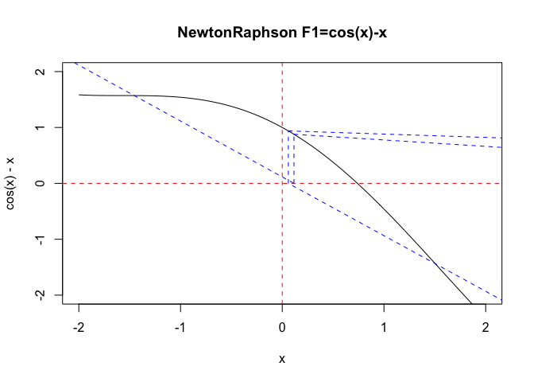

HW2B
================

# Choose three functions

``` r
F1<-function(x){
  return(c(cos(x)-x,-sin(x)))
}

F2<-function(x){
  return(c(log(x)-exp(-x),1/x+exp(-x)))
}

#one more function to check the accuracy

F3<-function(x){
  return(c(x^12-x^8+x^5,12*(x^11)-8*(x^7)+5*(x^4)))
}
```

# Define the function of Newton-Raphson

``` r
NewtonRaphson<-function(func,StartingValue,Tolerance,MaxNumberOfIterations){
  
  i<-0  # something to count the iterations
  x<- StartingValue  # start the algorithm at the complex number 'StartingValue'
  y<- func(x)[1] #define y
  d<- func(x)[2] 
  #Deviation=abs(func(StartingValue)[1])   # Work out how far away from (0,0) func(NewZ) is.
  Deviation<-abs(func(x)[1])
  
  X<-c()
  Y<-c()
  D<-c()
  X[1]<-x
  Y[1]<-func(x)[1]
  D[1]<-func(x)[2]
  #Set up a while loop until we hit the required target accuracy or the max. number of steps
  while ((i<MaxNumberOfIterations)&&(Deviation>Tolerance))
  {
    
  # Remember, this is is a vector of two elements. Z[1] is the is the value of the function; Z[2] is its derivative
    
    Z<-c()
    Z[1]<-func(x)[1]
    Z[2]<-func(x)[2]
    if ((Z[1]=="NaN")||(Z[2]=="NaN")){
      cat("Function or derivative not defined error.")
      break
    }
    
    # So we need to calculate the next value of y using this formula Z(n+1) <- Z(n)-f(Z(n))/f'(z(n))
    
    x<- x-Z[1]/Z[2]
    y<- func(x)[1]
    
    # calculate how far f(x) is from 0
    Deviation <- abs(func(x)[1]-0)
    
    #updata new value of X,Y,D
    i<-i+1
    X[i+1]<-x
    Y[i+1]<-y
    D[i+1]<-d
    
    #output the value of x,y
    cat(paste("\nIteration ",i,":   X=",x,"  Y=",y))
  }
  
  # output the result
  if (Deviation<Tolerance){
    cat(paste("\nFound the root point: ",x, " after ", i, "iterations"))
  }else{
    cat(paste("\nConvergence failure. Deviation: ",Deviation, "after ", i,  "iterations"))
  } 
  
  A<-cbind(X,Y,D)
  return(A)
}
```

\#Plot curve

``` r
#F1
A <- NewtonRaphson(F1,10,0.001,200) 
```

    ## 
    ## Iteration  1 :   X= 29.9239906542536   Y= -29.8452119221449
    ## Iteration  2 :   X= 59.8622468972755   Y= -60.8474936426038
    ## Iteration  3 :   X= 415.404751938588   Y= -414.649345178843
    ## Iteration  4 :   X= -217.400209387244   Y= 216.592368259675
    ## Iteration  5 :   X= 150.079020910588   Y= -149.325520721268
    ## Iteration  6 :   X= 377.20814929639   Y= -376.231608196568
    ## Iteration  7 :   X= -1370.0156256015   Y= 1370.97634077392
    ## Iteration  8 :   X= -6309.82602070953   Y= 6309.888803417
    ## Iteration  9 :   X= -12632.1874530027   Y= 12631.1996908491
    ## Iteration  10 :   X= -93618.1768758907   Y= 93618.4595638758
    ## Iteration  11 :   X= 3981.17300301501   Y= -3981.88734643444
    ## Iteration  12 :   X= 9671.24733830207   Y= -9671.10220690524
    ## Iteration  13 :   X= -103.344433360786   Y= 102.397784844559
    ## Iteration  14 :   X= -421.085638978458   Y= 422.079348539016
    ## Iteration  15 :   X= -4190.05550318329   Y= 4190.7310452373
    ## Iteration  16 :   X= 1493.66764976155   Y= -1493.82662935998
    ## Iteration  17 :   X= 3006.73770348215   Y= -3007.71055812689
    ## Iteration  18 :   X= 16003.666245815   Y= -16002.7425843119
    ## Iteration  19 :   X= -25756.1222454862   Y= 25756.3454736663
    ## Iteration  20 :   X= -52179.2224721947   Y= 52178.3497710025
    ## Iteration  21 :   X= 54687.8538389806   Y= -54687.3060479226
    ## Iteration  22 :   X= 120055.190528584   Y= -120055.906537283
    ## Iteration  23 :   X= -51922.1664669127   Y= 51921.6816836978
    ## Iteration  24 :   X= 7441.70607873976   Y= -7442.45330514819
    ## Iteration  25 :   X= -3757.20190575086   Y= 3758.19171177759
    ## Iteration  26 :   X= 22630.5148816405   Y= -22630.462703839
    ## Iteration  27 :   X= 45291.8466082325   Y= -45292.7267295856
    ## Iteration  28 :   X= -50111.7197853283   Y= 50110.7351229134
    ## Iteration  29 :   X= 237104.497181076   Y= -237105.09888524
    ## Iteration  30 :   X= -59752.2048185166   Y= 59752.8362078864
    ## Iteration  31 :   X= 17301.9005334122   Y= -17302.3092124394
    ## Iteration  32 :   X= 36259.6335763733   Y= -36258.8248609188
    ## Iteration  33 :   X= 97903.3278925078   Y= -97903.0273777026
    ## Iteration  34 :   X= 200551.024346533   Y= -200551.41070205
    ## Iteration  35 :   X= 417986.296741437   Y= -417987.156615208
    ## Iteration  36 :   X= 1236755.47329973   Y= -1236755.49232653
    ## Iteration  37 :   X= 2473734.89080034   Y= -2473734.23312416
    ## Iteration  38 :   X= -810125.092060755   Y= 810124.238030841
    ## Iteration  39 :   X= -2367385.79853482   Y= 2367386.37589018
    ## Iteration  40 :   X= -5266842.89978302   Y= 5266843.77000108
    ## Iteration  41 :   X= -15957322.1727824   Y= 15957321.8775907
    ## Iteration  42 :   X= 744255.031408926   Y= -744254.359932637
    ## Iteration  43 :   X= 1748611.58438316   Y= -1748611.14276517
    ## Iteration  44 :   X= -200346.217528244   Y= 200347.058984538
    ## Iteration  45 :   X= -571136.002612398   Y= 571136.740153059
    ## Iteration  46 :   X= -1416885.2002585   Y= 1416884.9918456
    ## Iteration  47 :   X= -2865582.23177622   Y= 2865581.34661357
    ## Iteration  48 :   X= 3293226.91037497   Y= -3293227.45418516
    ## Iteration  49 :   X= -630980.784054581   Y= 630980.540104134
    ## Iteration  50 :   X= 19657.0218991493   Y= -19658.0189617784
    ## Iteration  51 :   X= 276320.760203007   Y= -276320.363832464
    ## Iteration  52 :   X= 577293.623770379   Y= -577292.95700187
    ## Iteration  53 :   X= -197320.832478306   Y= 197319.974512143
    ## Iteration  54 :   X= 186789.722621449   Y= -186790.721459236
    ## Iteration  55 :   X= 4062254.21854603   Y= -4062253.68815466
    ## Iteration  56 :   X= 8854043.94852765   Y= -8854043.30742647
    ## Iteration  57 :   X= 20390912.6354453   Y= -20390913.6038938
    ## Iteration  58 :   X= 102211842.126362   Y= -102211841.259483
    ## Iteration  59 :   X= 307243434.026081   Y= -307243434.074942
    ## Iteration  60 :   X= -367403.337893307   Y= 367404.273705104
    ## Iteration  61 :   X= -1409684.83604685   Y= 1409684.46874882
    ## Iteration  62 :   X= -2925306.22829912   Y= 2925307.17189726
    ## Iteration  63 :   X= 5909998.40500842   Y= -5909999.37331332
    ## Iteration  64 :   X= -17751660.6184196   Y= 17751659.6432085
    ## Iteration  65 :   X= 62472124.4814988   Y= -62472125.3475747
    ## Iteration  66 :   X= -62493985.4598408   Y= 62493985.1475193
    ## Iteration  67 :   X= 3290786.58726308   Y= -3290785.63235482
    ## Iteration  68 :   X= 14374566.6428016   Y= -14374567.1572721
    ## Iteration  69 :   X= -2388619.22608829   Y= 2388618.28953023
    ## Iteration  70 :   X= 4426026.16973707   Y= -4426025.23281825
    ## Iteration  71 :   X= 17088199.5661061   Y= -17088200.4695549
    ## Iteration  72 :   X= -22772677.0859795   Y= 22772677.790107
    ## Iteration  73 :   X= -54843547.7678959   Y= 54843547.6049928
    ## Iteration  74 :   X= 742514.104692906   Y= -742513.85553244
    ## Iteration  75 :   X= 1509207.78045604   Y= -1509207.05835237
    ## Iteration  76 :   X= 3690821.10181013   Y= -3690821.98534327
    ## Iteration  77 :   X= -4189343.12386286   Y= 4189342.62279754
    ## Iteration  78 :   X= 651535.999325166   Y= -651535.544746479
    ## Iteration  79 :   X= -79945.6773425194   Y= 79945.6756328134
    ## Iteration  80 :   X= 0.115134941341239   Y= 0.878244349856544
    ## Iteration  81 :   X= 7.75997053291799   Y= -7.66609785039651
    ## Iteration  82 :   X= 0.0598706595647878   Y= 0.938337627791667
    ## Iteration  83 :   X= 15.7419835179674   Y= -16.741404885073
    ## Iteration  84 :   X= 507.938092190989   Y= -507.397720625944
    ## Iteration  85 :   X= 1110.95893193196   Y= -1110.56405959854
    ## Iteration  86 :   X= 2319.75455753546   Y= -2319.44795924128
    ## Iteration  87 :   X= -117.052459205112   Y= 116.365522539371
    ## Iteration  88 :   X= 43.0724262167231   Y= -42.4585785738889
    ## Iteration  89 :   X= 96.8566418644065   Y= -97.7180654138398
    ## Iteration  90 :   X= -95.544454173066   Y= 95.815155766472
    ## Iteration  91 :   X= -195.075780263554   Y= 196.031988552645
    ## Iteration  92 :   X= -864.842311152966   Y= 864.224099919671
    ## Iteration  93 :   X= 234.662652008606   Y= -235.238792910171
    ## Iteration  94 :   X= -53.1438940236666   Y= 52.178326729446
    ## Iteration  95 :   X= -253.711418173938   Y= 252.984921747342
    ## Iteration  96 :   X= -621.866070558161   Y= 622.851777748068
    ## Iteration  97 :   X= 3075.29432804785   Y= -3076.24201714305
    ## Iteration  98 :   X= -6562.20958535275   Y= 6561.371737787
    ## Iteration  99 :   X= -18581.4815867881   Y= 18580.974469211
    ## Iteration  100 :   X= -40140.2155723908   Y= 40139.2192885379
    ## Iteration  101 :   X= 425887.051987861   Y= -425886.069143082
    ## Iteration  102 :   X= -1883256.41499234   Y= 1883255.50373276
    ## Iteration  103 :   X= 2689611.65025181   Y= -2689610.65258103
    ## Iteration  104 :   X= 42119195.1101569   Y= -42119194.304229
    ## Iteration  105 :   X= -29026436.5571424   Y= 29026437.1868494
    ## Iteration  106 :   X= 8338666.88623402   Y= -8338665.9427028
    ## Iteration  107 :   X= -16832109.1766834   Y= 16832108.455801
    ## Iteration  108 :   X= -41118855.4604295   Y= 41118856.2664501
    ## Iteration  109 :   X= -110589573.417312   Y= 110589573.33078
    ## Iteration  110 :   X= -221595527.583308   Y= 221595526.712939
    ## Iteration  111 :   X= 228436876.591319   Y= -228436875.760658
    ## Iteration  112 :   X= -181845460.6134   Y= 181845461.532262
    ## Iteration  113 :   X= 279013502.70481   Y= -279013502.091181
    ## Iteration  114 :   X= -74349683.4091107   Y= 74349682.7332101
    ## Iteration  115 :   X= 26532817.4885711   Y= -26532816.5530409
    ## Iteration  116 :   X= -48578477.3738166   Y= 48578477.6942883
    ## Iteration  117 :   X= 2704777.42199223   Y= -2704777.75081882
    ## Iteration  118 :   X= 5568823.89067173   Y= -5568823.3058965
    ## Iteration  119 :   X= 12433783.311998   Y= -12433782.4222443
    ## Iteration  120 :   X= -14806945.2256841   Y= 14806944.2377596
    ## Iteration  121 :   X= 80761173.1213358   Y= -80761172.2698108
    ## Iteration  122 :   X= 234793254.011206   Y= -234793253.018692
    ## Iteration  123 :   X= 2157349826.87197   Y= -2157349825.98062
    ## Iteration  124 :   X= 6916259688.29893   Y= -6916259687.48985
    ## Iteration  125 :   X= -4851885762.0392   Y= 4851885761.47335
    ## Iteration  126 :   X= -10736463309.1443   Y= 10736463310.1321
    ## Iteration  127 :   X= 58121267675.65   Y= -58121267676.2219
    ## Iteration  128 :   X= -12730391674.8709   Y= 12730391673.9231
    ## Iteration  129 :   X= 27215513174.7054   Y= -27215513175.6785
    ## Iteration  130 :   X= 145452169860.278   Y= -145452169860.556
    ## Iteration  131 :   X= 296833283993.105   Y= -296833283993.396
    ## Iteration  132 :   X= 607114121591.651   Y= -607114121591.374
    ## Iteration  133 :   X= -24759621048.8092   Y= 24759621049.8092
    ## Iteration  134 :   X= -32118011473994.8   Y= 32118011473993.8
    ## Iteration  135 :   X= -268999100585304   Y= 268999100585305
    ## Iteration  136 :   X= -922378953453024   Y= 922378953453025
    ## Iteration  137 :   X= 4300159150064399   Y= -4300159150064400
    ## Iteration  138 :   X= -7045045026344995   Y= 7045045026344996
    ## Iteration  139 :   X= 18630887623994816   Y= -18630887623994816
    ## Iteration  140 :   X= -45844638452825648   Y= 45844638452825648
    ## Iteration  141 :   X= 13591355442370216   Y= -13591355442370216
    ## Iteration  142 :   X= 28428746948462848   Y= -28428746948462848
    ## Iteration  143 :   X= 56888045505031904   Y= -56888045505031904
    ## Iteration  144 :   X= 204919469541329216   Y= -204919469541329216
    ## Iteration  145 :   X= 1557626521986549248   Y= -1557626521986549248
    ## Iteration  146 :   X= 5093396676484077568   Y= -5093396676484077568
    ## Iteration  147 :   X= 30410423919815385088   Y= -30410423919815385088
    ## Iteration  148 :   X= -2360872366474321920   Y= 2360872366474321920
    ## Iteration  149 :   X= 8738803941336616960   Y= -8738803941336616960
    ## Iteration  150 :   X= -1.20217622630391e+20   Y= 1.20217622630391e+20
    ## Iteration  151 :   X= 5.73127325854034e+20   Y= -5.73127325854034e+20
    ## Iteration  152 :   X= 1.4347291053877e+21   Y= -1.4347291053877e+21
    ## Iteration  153 :   X= -1.31269249317039e+20   Y= 1.31269249317039e+20
    ## Iteration  154 :   X= 2.05676745226196e+20   Y= -2.05676745226196e+20
    ## Iteration  155 :   X= 2.98865612269187e+21   Y= -2.98865612269187e+21
    ## Iteration  156 :   X= 6.6341969977012e+21   Y= -6.6341969977012e+21
    ## Iteration  157 :   X= 1.46430077776744e+22   Y= -1.46430077776744e+22
    ## Iteration  158 :   X= -9.80837773532333e+20   Y= 9.80837773532333e+20
    ## Iteration  159 :   X= 2.55635137534509e+20   Y= -2.55635137534509e+20
    ## Iteration  160 :   X= -6.08381754224798e+20   Y= 6.08381754224798e+20
    ## Iteration  161 :   X= 3598778276511744   Y= -3598778276511744
    ## Iteration  162 :   X= 7334509759831562   Y= -7334509759831562
    ## Iteration  163 :   X= -850793515167027   Y= 850793515167027
    ## Iteration  164 :   X= 9287862406205.25   Y= -9287862406204.3
    ## Iteration  165 :   X= 39723555809669.4   Y= -39723555809669.9
    ## Iteration  166 :   X= 85225542885999.6   Y= -85225542885999
    ## Iteration  167 :   X= -18619597046284.7   Y= 18619597046283.7
    ## Iteration  168 :   X= -88301997121649.2   Y= 88301997121649.3
    ## Iteration  169 :   X= 1305774406064.3   Y= -1305774406063.3
    ## Iteration  170 :   X= -11235535438769.9   Y= 11235535438769.1
    ## Iteration  171 :   X= -30032088830914.9   Y= 30032088830915.9
    ## Iteration  172 :   X= -380729056064635   Y= 380729056064636
    ## Iteration  173 :   X= -5358568114196142   Y= 5358568114196143
    ## Iteration  174 :   X= 2857651126724178   Y= -2857651126724178
    ## Iteration  175 :   X= -928744995579471   Y= 928744995579471
    ## Iteration  176 :   X= -1891101734737018   Y= 1891101734737018
    ## Iteration  177 :   X= 17806876130093.8   Y= -17806876130094.8
    ## Iteration  178 :   X= 12509439352557172   Y= -12509439352557172
    ## Iteration  179 :   X= 25029367116789704   Y= -25029367116789704
    ## Iteration  180 :   X= 50462202548401536   Y= -50462202548401536
    ## Iteration  181 :   X= -231016304   Y= 231016303.790573
    ## Iteration  182 :   X= 5239157.37995523   Y= -5239157.10303881
    ## Iteration  183 :   X= 10691535.1222609   Y= -10691535.6369782
    ## Iteration  184 :   X= 23161835.0744432   Y= -23161836.0378697
    ## Iteration  185 :   X= 109595342.989375   Y= -109595343.875741
    ## Iteration  186 :   X= 346310252.284942   Y= -346310253.284356
    ## Iteration  187 :   X= -9768749270.37173   Y= 9768749270.65068
    ## Iteration  188 :   X= -19941289607.2304   Y= 19941289606.4919
    ## Iteration  189 :   X= 9635041567.79293   Y= -9635041568.6377
    ## Iteration  190 :   X= -8369752413.47021   Y= 8369752414.40204
    ## Iteration  191 :   X= -31434094887.5601   Y= 31434094888.5477
    ## Iteration  192 :   X= 168467724472.374   Y= -168467724472.198
    ## Iteration  193 :   X= -2682239057.03653   Y= 2682239056.04327
    ## Iteration  194 :   X= -25819300650.5003   Y= 25819300650.2087
    ## Iteration  195 :   X= 1173046538.96557   Y= -1173046538.39422
    ## Iteration  196 :   X= -256267156.84797   Y= 256267156.938703
    ## Iteration  197 :   X= 1061413.4584268   Y= -1061413.14089441
    ## Iteration  198 :   X= -57928.5100140357   Y= 57927.734378209
    ## Iteration  199 :   X= 33848.2747163816   Y= -33847.5467646769
    ## Iteration  200 :   X= -15518.9135539754   Y= 15519.7638995065
    ## Convergence failure. Deviation:  15519.7638995065 after  200 iterations

``` r
curve(cos(x)-x, xlim=c(-2, 2),ylim=c(-2,2), main="NewtonRaphson F1=cos(x)-x")
abline(h=0,lty=2,col='red')
abline(v=0,lty=2,col='red')

for (i in 1:(length(A[,1])-1)){
  segments(A[i,1],0,A[i,1],A[i,2],lty=2,col="blue") 
  segments(A[i,1],A[i,2],A[i+1,1],0,lty=2,col="blue")
}
```

<!-- -->

``` r
#F2

curve(log(x)-exp(-x), xlim=c(-0.25, 1.5), ylim=c(-1,0.25),main="NewtonRaphson F2=log(x)-exp(-x)")
```

    ## Warning in log(x): NaNs produced

``` r
A <- NewtonRaphson(F2,1,0.0001,200)
```

    ## 
    ## Iteration  1 :   X= 1.26894142137   Y= -0.0429460351219054
    ## Iteration  2 :   X= 1.30910840327402   Y= -0.000714437035072013
    ## Iteration  3 :   X= 1.30979938866897   Y= -2.03709596136026e-07
    ## Found the root point:  1.30979938866897  after  3 iterations

``` r
abline(h=0,lty=2,col='red')
abline(v=0,lty=2,col='red')

for (i in 1:(length(A[,1])-1)){
  segments(A[i,1],0,A[i,1],A[i,2],lty=2,col="blue") 
  segments(A[i,1],A[i,2],A[i+1,1],0,lty=2,col="blue")
}
```

<!-- -->

``` r
#F3

curve(x^12-x^8+x^5, xlim=c(-5, 10), main="NewtonRaphson F3=x^12-x^8+x^5")

A<-NewtonRaphson(F3,10,0.0001,40)
```

    ## 
    ## Iteration  1 :   X= 9.16669439768091   Y= 351958617011.956
    ## Iteration  2 :   X= 8.40283918211911   Y= 123886974832.376
    ## Iteration  3 :   X= 7.70264927044953   Y= 43607215710.7985
    ## Iteration  4 :   X= 7.06082239224633   Y= 15349321471.9601
    ## Iteration  5 :   X= 6.47249906489312   Y= 5402780751.01777
    ## Iteration  6 :   X= 5.93322596306779   Y= 1901698893.12788
    ## Iteration  7 :   X= 5.43892241443649   Y= 669361735.144563
    ## Iteration  8 :   X= 4.98584977869998   Y= 235598536.505791
    ## Iteration  9 :   X= 4.57058348974898   Y= 82922787.2901176
    ## Iteration  10 :   X= 4.1899875601839   Y= 29185064.4656584
    ## Iteration  11 :   X= 3.84119136243079   Y= 10271341.9918766
    ## Iteration  12 :   X= 3.52156850846187   Y= 3614645.55871032
    ## Iteration  13 :   X= 3.22871764583812   Y= 1271937.49899369
    ## Iteration  14 :   X= 2.96044496274052   Y= 447521.080364497
    ## Iteration  15 :   X= 2.71474813345259   Y= 157431.29611715
    ## Iteration  16 :   X= 2.48980131108756   Y= 55370.2575089858
    ## Iteration  17 :   X= 2.28394053733105   Y= 19469.0578395914
    ## Iteration  18 :   X= 2.09564850071945   Y= 6843.40555443151
    ## Iteration  19 :   X= 1.92353677031137   Y= 2404.61852903094
    ## Iteration  20 :   X= 1.76632214461231   Y= 844.676665130447
    ## Iteration  21 :   X= 1.62279095968549   Y= 296.701404874461
    ## Iteration  22 :   X= 1.49173979274145   Y= 104.293047638068
    ## Iteration  23 :   X= 1.37187009027054   Y= 36.7513795974243
    ## Iteration  24 :   X= 1.26159085958804   Y= 13.0349826109958
    ## Iteration  25 :   X= 1.15862895949433   Y= 4.69279519794309
    ## Iteration  26 :   X= 1.05920664240476   Y= 1.743093711317
    ## Iteration  27 :   X= 0.956187444532972   Y= 0.684663046834685
    ## Iteration  28 :   X= 0.835309595850063   Y= 0.285038766548771
    ## Iteration  29 :   X= 0.678860744355135   Y= 0.108652382348506
    ## Iteration  30 :   X= 0.523577152779806   Y= 0.0341232907332006
    ## Iteration  31 :   X= 0.409522051982645   Y= 0.0107494226430707
    ## Iteration  32 :   X= 0.324093041307405   Y= 0.00345522081057485
    ## Iteration  33 :   X= 0.257911599078421   Y= 0.00112168926178911
    ## Iteration  34 :   X= 0.205789067429192   Y= 0.000365861644319013
    ## Iteration  35 :   X= 0.164413918217551   Y= 0.000119607887869323
    ## Iteration  36 :   X= 0.131442970758887   Y= 3.91471123773613e-05
    ## Found the root point:  0.131442970758887  after  36 iterations

``` r
abline(h=0,lty=2,col='red')
abline(v=0,lty=2,col='red')

for (i in 1:(length(A[,1])-1)){
  segments(A[i,1],0,A[i,1],A[i,2],lty=2,col="blue") 
  segments(A[i,1],A[i,2],A[i+1,1],0,lty=2,col="blue")
}
```

<!-- -->

\#Define the function of Secant

``` r
Secant<-function(func,StartingValue,Tolerance,MaxNumberOfIterations){
  i<-0
  Deviation<-1000
  x0<-StartingValue[1]
  x1<-StartingValue[2]
  y0<-func(x0)[1]
  y1<-func(x1)[1]
  d0<-func(x0)[2]
  d1<-func(x1)[2]
  X<-c()
  Y<-c()
  D<-c()
  X[1]<-x0
  X[2]<-x1
  Y[1]<-y0
  Y[2]<-y1
  D[1]<-d0
  D[2]<-d1
              
  while ((i<MaxNumberOfIterations)&&(Deviation>Tolerance))
  {
    # Find the next Fx-value using Newton-Raphson's formula
    
    if ((y0=="NaN")||(y1=="NaN")){
      cat("Function or derivative not defined error.")
      break
    }
   
    # Calculate the next x0,x1 value
    x<-x1-y1*(x1-x0)/(y1-y0)
    y<-func(x)[1]
    d<-func(x)[2]

    x0<-x1
    y0<-func(x0)[1]
    d0<-func(x0)[2]
    x1<-x
    y1<-func(x1)[1]
    d1<-func(x1)[2]
    
    # calculate how far y is from 0
    Deviation=abs(y)
    
    i<-i+1
    X[i+2]<-x
    Y[i+2]<-y
    D[i+2]<-d
    
    #cat(paste("\nIteration ",i,":   X=",x1,"  Devn=",Deviation,"))
  }
  # output the result
  if (Deviation<Tolerance){
    cat(paste("\nFound the root point: ",x, " after ", i, "iterations"))
  }else{
    cat(paste("\nConvergence failure. Deviation: ",Deviation, "after ", i,  "iterations"))}  
  
  B=cbind(X,Y,D)
  return(B)
}
```

\#Plot Curve

``` r
#F1

B<-Secant(F1,c(1,2),0.0001,100)
```

    ## 
    ## Found the root point:  0.739103270158936  after  3 iterations

``` r
curve(cos(x)-x, xlim=c(0.5, 1.5),ylim=c(-2,0.25), main="Secant F1=cos(x)-x")
abline(h=0,lty=2,col='red')
abline(v=0,lty=2,col='red')

for (i in 1:(length(B[,1])-2)){
  segments(B[i,1],0,B[i,1],B[i,2],lty=2,col="blue") 
  segments(B[i,1],B[i,2],B[i+1,1],B[i+1,2],lty=2,col="blue") 
  segments(B[i+1,1],B[i+1,2],B[i+2,1],0,lty=2,col="blue") 
}
```

<!-- -->

``` r
#F2
Secant(F2,c(1,2),0.0001,100)
```

    ## 
    ## Found the root point:  1.3098083980193  after  4 iterations

    ##             X             Y         D
    ## [1,] 1.000000 -3.678794e-01 1.3678794
    ## [2,] 2.000000  5.578119e-01 0.6353353
    ## [3,] 1.397410  8.738451e-02 0.9628457
    ## [4,] 1.285476 -2.538972e-02 1.0544408
    ## [5,] 1.310677  9.060978e-04 1.0326021
    ## [6,] 1.309808  9.106067e-06 1.0333422

``` r
curve(log(x)-exp(-x), xlim=c(-0.25, 1.5), ylim=c(-2,0.5), main="Secant F2=log(x)-exp(-x)")
```

    ## Warning in log(x): NaNs produced

``` r
abline(h=0,lty=2,col='red')
abline(v=0,lty=2,col='red')


for (i in 1:(length(B[,1])-2)){
  segments(B[i,1],0,B[i,1],B[i,2],lty=2,col="blue") 
  segments(B[i,1],B[i,2],B[i+1,1],B[i+1,2],lty=2,col="blue") 
  segments(B[i+1,1],B[i+1,2],B[i+2,1],0,lty=2,col="blue") 
}
```

<!-- -->

``` r
#F3

Secant(F3,c(1,2),0.0001,100)
```

    ## 
    ## Found the root point:  0.136481685750395  after  15 iterations

    ##               X            Y            D
    ##  [1,] 1.0000000 1.000000e+00 9.000000e+00
    ##  [2,] 2.0000000 3.872000e+03 2.363200e+04
    ##  [3,] 0.9997417 9.976782e-01 8.975235e+00
    ##  [4,] 0.9994839 9.953676e-01 8.950590e+00
    ##  [5,] 0.8884298 4.071722e-01 2.886139e+00
    ##  [6,] 0.8115537 2.454927e-01 1.520939e+00
    ##  [7,] 0.6948258 1.202858e-01 7.585886e-01
    ##  [8,] 0.5826857 5.541282e-02 4.254807e-01
    ##  [9,] 0.4868985 2.438364e-02 2.334876e-01
    ## [10,] 0.4116262 1.101669e-02 1.282147e-01
    ## [11,] 0.3495887 5.001652e-03 6.968859e-02
    ## [12,] 0.2980030 2.288485e-03 3.778240e-02
    ## [13,] 0.2544918 1.049982e-03 2.042360e-02
    ## [14,] 0.2176038 4.828855e-04 1.102658e-02
    ## [15,] 0.1861934 2.223374e-04 5.947394e-03
    ## [16,] 0.1593895 1.024562e-04 3.206189e-03
    ## [17,] 0.1364817 4.723531e-05 1.727819e-03

``` r
curve(x^12-x^8+x^5, xlim=c(-5, 5), main="Secant F3=x^12-x^8+x^5")
abline(h=0,lty=2,col='red')
abline(v=0,lty=2,col='red')

for (i in 1:(length(B[,1])-2)){
  segments(B[i,1],0,B[i,1],B[i,2],lty=2,col="blue") 
  segments(B[i,1],B[i,2],B[i+1,1],B[i+1,2],lty=2,col="blue") 
  segments(B[i+1,1],B[i+1,2],B[i+2,1],0,lty=2,col="blue") 
}
```

<!-- -->

\#Conclusion: \#In F2 and F3 Newton-Raphson could find the root although
it takes more iterations. While in F1, I have changed the
StartingValue,Tolerance and MaxNumberOfIterations for many times, the
result is still faliure. Secant method could find the roots in all three
functions and takes less iterations, thus this method seems more
efficient.
